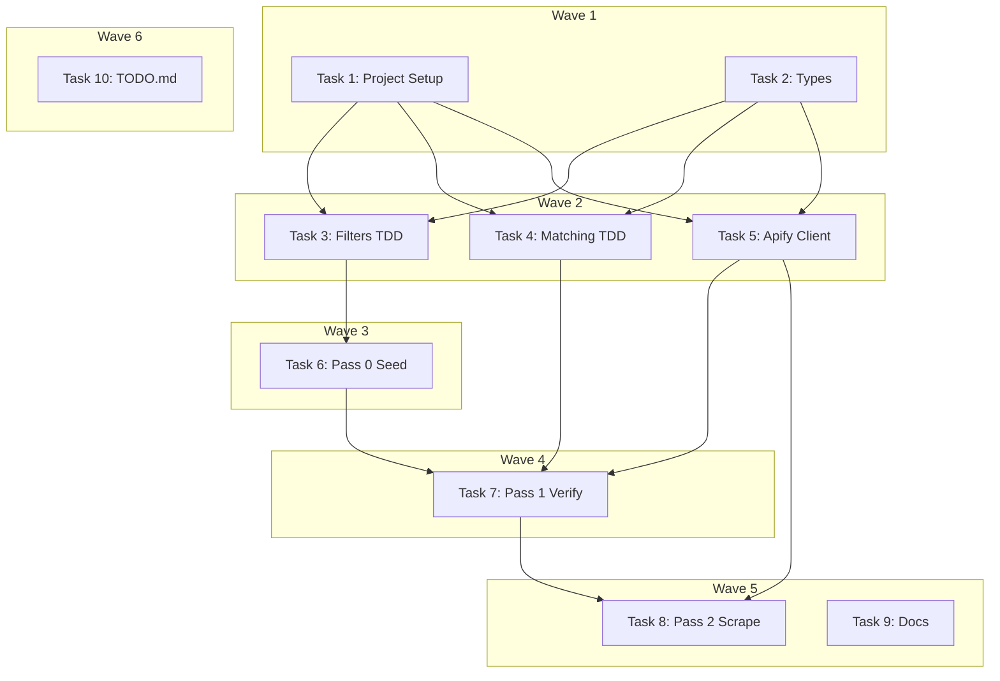

# Data Collection Pipeline Implementation Plan

> **For Claude:** REQUIRED SUB-SKILL: Use executing-plans to implement this plan task-by-task.

**Design Doc:** [docs/designs/2026-02-23-data-collection-pipeline-design.md](../designs/2026-02-23-data-collection-pipeline-design.md)

**Spec References:** SPEC.md §2 System Modules (Data pipeline), §4 Hard Dependencies (Apify)

**PRD References:** —

**Goal:** Build a 3-pass data pipeline that seeds ~1,600 Taipei coffee shops from Cafe Nomad, verifies which are still open via Apify/Google Maps, and scrapes reviews + photos for confirmed-open shops.

**Architecture:** Standalone TypeScript scripts (not part of the Next.js app) in `scripts/prebuild/data-pipeline/`. Each pass reads the previous pass's JSON output from `data/prebuild/`. Utility modules handle filtering, geo-matching, and Apify API calls. The pipeline outputs an enrichment-ready dataset that hands off to Claude Haiku (separate system).

**Tech Stack:** TypeScript, tsx (script runner), apify-client, vitest (testing)

---

## Prerequisites

- Node.js 20+ and pnpm installed
- An Apify account with API token (for Pass 1 and Pass 2)
- Internet access (Cafe Nomad API is public, Apify requires auth)

---

### Task 1: Project Setup

**Files:**
- Create: `package.json`
- Create: `tsconfig.json`
- Create: `vitest.config.ts`
- Modify: `.gitignore`

**Why:** No package.json exists yet. We need minimal tooling to run TypeScript scripts and tests. This is NOT the Next.js scaffold — that comes later in Phase 1.

**Step 1: Create package.json**

```json
{
  "name": "caferoam",
  "version": "0.0.1",
  "private": true,
  "type": "module",
  "scripts": {
    "prebuild:pass0": "tsx scripts/prebuild/data-pipeline/pass0-seed.ts",
    "prebuild:pass1": "tsx scripts/prebuild/data-pipeline/pass1-verify.ts",
    "prebuild:pass2": "tsx scripts/prebuild/data-pipeline/pass2-scrape.ts",
    "prebuild:all": "pnpm prebuild:pass0 && pnpm prebuild:pass1 && pnpm prebuild:pass2",
    "test": "vitest run",
    "test:watch": "vitest"
  },
  "devDependencies": {
    "typescript": "^5.7.0",
    "tsx": "^4.19.0",
    "vitest": "^3.0.0"
  },
  "dependencies": {
    "apify-client": "^2.11.0"
  }
}
```

**Step 2: Create tsconfig.json**

```json
{
  "compilerOptions": {
    "target": "ES2022",
    "module": "ESNext",
    "moduleResolution": "bundler",
    "strict": true,
    "esModuleInterop": true,
    "skipLibCheck": true,
    "forceConsistentCasingInFileNames": true,
    "resolveJsonModule": true,
    "isolatedModules": true,
    "outDir": "dist",
    "rootDir": ".",
    "baseUrl": ".",
    "paths": {
      "@/*": ["./*"]
    }
  },
  "include": ["scripts/**/*.ts", "vitest.config.ts"],
  "exclude": ["node_modules", "dist"]
}
```

**Step 3: Create vitest.config.ts**

```typescript
import { defineConfig } from 'vitest/config';

export default defineConfig({
  test: {
    globals: true,
    include: ['scripts/**/*.test.ts'],
  },
});
```

**Step 4: Add `data/` to .gitignore**

Append to `.gitignore`:

```
# Pre-build pipeline data (large JSON files)
data/
```

**Step 5: Install dependencies**

Run: `pnpm install`
Expected: lockfile created, node_modules populated

**Step 6: Create data output directory**

Run: `mkdir -p data/prebuild`

**Step 7: Commit**

```bash
git add package.json pnpm-lock.yaml tsconfig.json vitest.config.ts .gitignore
git commit -m "chore: initialize project with TypeScript, vitest, and apify-client"
```

No test needed — configuration only.

---

### Task 2: Type Definitions

**Files:**
- Create: `scripts/prebuild/data-pipeline/types.ts`

**Why:** All three passes share types. Defining them upfront prevents interface drift between passes. These types define the contract between pipeline stages.

**Step 1: Create types.ts**

```typescript
// ─── Cafe Nomad API Response ───────────────────────────────────

/** Raw entry from the Cafe Nomad API (v1.2) */
export interface CafeNomadEntry {
  id: string;
  name: string;
  city: string;
  wifi: number;
  seat: number;
  quiet: number;
  tasty: number;
  cheap: number;
  music: number;
  url: string;
  address: string;
  latitude: string;
  longitude: string;
  limited_time: string; // "yes" | "no" | "maybe"
  socket: string; // "yes" | "no" | "maybe"
  standing_desk: string; // "yes" | "no"
  mrt: string;
  open_time: string;
}

// ─── Pass 0: Seed ──────────────────────────────────────────────

/** Cleaned shop from Cafe Nomad after filtering */
export interface Pass0Shop {
  cafenomad_id: string;
  name: string;
  address: string;
  latitude: number;
  longitude: number;
  social_url: string;
  mrt: string;
  limited_time: string;
  socket: string;
}

// ─── Pass 1: Verified ──────────────────────────────────────────

/** Google Maps result merged with Cafe Nomad seed data */
export interface Pass1Shop {
  cafenomad_id: string;
  google_place_id: string;
  match_confidence: number; // 0.0 - 1.0
  name: string;
  address: string;
  latitude: number;
  longitude: number;
  mrt: string;
  limited_time: string;
  socket: string;
  social_url: string;
  // From Google Maps
  google_name: string;
  google_address: string;
  google_latitude: number;
  google_longitude: number;
  rating: number | null;
  review_count: number;
  opening_hours: string[] | null;
  phone: string | null;
  website: string | null;
  categories: string[];
}

/** Unmatched shop for manual review */
export interface UnmatchedShop {
  cafenomad_id: string;
  name: string;
  address: string;
  latitude: number;
  longitude: number;
  reason: 'no_match' | 'permanently_closed' | 'temporarily_closed';
}

// ─── Pass 2: Full Scrape ───────────────────────────────────────

export interface ReviewData {
  text: string;
  stars: number;
  published_at: string;
  language: string;
}

export interface PhotoData {
  url: string;
  category: string;
  is_menu: boolean;
}

/** Enrichment-ready shop with reviews and photos */
export interface Pass2Shop {
  cafenomad_id: string;
  google_place_id: string;
  match_confidence: number;
  name: string;
  address: string;
  latitude: number;
  longitude: number;
  mrt: string;
  rating: number | null;
  review_count: number;
  opening_hours: string[] | null;
  phone: string | null;
  website: string | null;
  categories: string[];
  price_range: string | null;
  description: string | null;
  menu_url: string | null;
  limited_time: string;
  socket: string;
  social_url: string;
  reviews: ReviewData[];
  photos: PhotoData[];
}

// ─── Apify Actor Output Types ──────────────────────────────────

/** Simplified Apify Google Maps Scraper result (compass/crawler-google-places) */
export interface ApifyPlaceResult {
  title: string;
  placeId: string;
  address: string;
  location: { lat: number; lng: number };
  totalScore: number | null;
  reviewsCount: number;
  openingHours: { day: string; hours: string }[] | null;
  phone: string | null;
  website: string | null;
  categoryName: string;
  categories: string[];
  permanentlyClosed: boolean;
  temporarilyClosed: boolean;
  url: string;
  // Only present in Pass 2 (full scrape)
  reviews?: ApifyReview[];
  imageUrls?: string[];
  price?: string | null;
  description?: string | null;
  menu?: { url: string } | null;
}

export interface ApifyReview {
  text: string | null;
  stars: number;
  publishAt: string;
  language?: string;
}
```

**Step 2: Commit**

```bash
git add -f scripts/prebuild/data-pipeline/types.ts
git commit -m "feat(pipeline): add type definitions for 3-pass data pipeline"
```

No test needed — type definitions only.

---

### Task 3: Filters — Tests + Implementation

**Files:**
- Create: `scripts/prebuild/data-pipeline/utils/filters.ts`
- Create: `scripts/prebuild/data-pipeline/utils/filters.test.ts`

**Why:** Filters remove closed shops, shell entries, out-of-bounds coordinates, and duplicates from the Cafe Nomad seed data. Pure functions — ideal for TDD.

**Step 1: Write failing tests**

```typescript
// scripts/prebuild/data-pipeline/utils/filters.test.ts
import { describe, it, expect } from 'vitest';
import {
  isKnownClosed,
  isShellEntry,
  isOutOfBounds,
  findDuplicates,
} from './filters';
import type { CafeNomadEntry } from '../types';

// ─── Helper ────────────────────────────────────────────────────

function makeCafeNomadEntry(
  overrides: Partial<CafeNomadEntry> = {}
): CafeNomadEntry {
  return {
    id: 'test-id',
    name: '測試咖啡',
    city: 'taipei',
    wifi: 4,
    seat: 4,
    quiet: 3,
    tasty: 4,
    cheap: 3,
    music: 3,
    url: 'https://example.com',
    address: '台北市中山區南京東路100號',
    latitude: '25.05',
    longitude: '121.52',
    limited_time: 'no',
    socket: 'yes',
    standing_desk: 'no',
    mrt: '中山',
    open_time: '09:00-18:00',
    ...overrides,
  };
}

// ─── isKnownClosed ─────────────────────────────────────────────

describe('isKnownClosed', () => {
  it('returns true for names containing 已歇業', () => {
    expect(isKnownClosed('好咖啡（已歇業）')).toBe(true);
  });

  it('returns true for names containing 暫停營業', () => {
    expect(isKnownClosed('暫停營業 - 某咖啡')).toBe(true);
  });

  it('returns true for names containing 已關', () => {
    expect(isKnownClosed('某店已關')).toBe(true);
  });

  it('returns true for names containing 已結束', () => {
    expect(isKnownClosed('已結束營業的店')).toBe(true);
  });

  it('returns false for normal shop names', () => {
    expect(isKnownClosed('路易莎咖啡 中山店')).toBe(false);
  });

  it('returns false for empty string', () => {
    expect(isKnownClosed('')).toBe(false);
  });
});

// ─── isShellEntry ──────────────────────────────────────────────

describe('isShellEntry', () => {
  it('returns true when name is empty', () => {
    expect(isShellEntry(makeCafeNomadEntry({ name: '' }))).toBe(true);
  });

  it('returns true when address is empty', () => {
    expect(isShellEntry(makeCafeNomadEntry({ address: '' }))).toBe(true);
  });

  it('returns true when latitude is empty', () => {
    expect(isShellEntry(makeCafeNomadEntry({ latitude: '' }))).toBe(true);
  });

  it('returns true when longitude is empty', () => {
    expect(isShellEntry(makeCafeNomadEntry({ longitude: '' }))).toBe(true);
  });

  it('returns true when latitude is 0', () => {
    expect(isShellEntry(makeCafeNomadEntry({ latitude: '0' }))).toBe(true);
  });

  it('returns false for complete entries', () => {
    expect(isShellEntry(makeCafeNomadEntry())).toBe(false);
  });
});

// ─── isOutOfBounds ─────────────────────────────────────────────

describe('isOutOfBounds', () => {
  it('returns false for coordinates within Taipei bounds', () => {
    expect(isOutOfBounds(25.05, 121.52)).toBe(false); // central Taipei
  });

  it('returns true for latitude below lower bound (24.95)', () => {
    expect(isOutOfBounds(24.94, 121.52)).toBe(true);
  });

  it('returns true for latitude above upper bound (25.22)', () => {
    expect(isOutOfBounds(25.23, 121.52)).toBe(true);
  });

  it('returns true for longitude below lower bound (121.40)', () => {
    expect(isOutOfBounds(25.05, 121.39)).toBe(true);
  });

  it('returns true for longitude above upper bound (121.65)', () => {
    expect(isOutOfBounds(25.05, 121.66)).toBe(true);
  });

  it('returns false for boundary edge values (inclusive)', () => {
    expect(isOutOfBounds(24.95, 121.40)).toBe(false);
    expect(isOutOfBounds(25.22, 121.65)).toBe(false);
  });
});

// ─── findDuplicates ────────────────────────────────────────────

describe('findDuplicates', () => {
  it('returns empty set when no duplicates exist', () => {
    const shops = [
      { name: 'Shop A', latitude: 25.05, longitude: 121.52, cafenomad_id: '1' },
      { name: 'Shop B', latitude: 25.06, longitude: 121.53, cafenomad_id: '2' },
    ];
    expect(findDuplicates(shops)).toEqual(new Set());
  });

  it('flags the second entry when same name is within 50m', () => {
    const shops = [
      { name: '好咖啡', latitude: 25.050000, longitude: 121.520000, cafenomad_id: '1' },
      { name: '好咖啡', latitude: 25.050001, longitude: 121.520001, cafenomad_id: '2' }, // ~0.1m away
    ];
    const dupes = findDuplicates(shops);
    expect(dupes.has('2')).toBe(true);
    expect(dupes.has('1')).toBe(false);
  });

  it('does not flag shops with same name but far apart', () => {
    const shops = [
      { name: '好咖啡', latitude: 25.05, longitude: 121.52, cafenomad_id: '1' },
      { name: '好咖啡', latitude: 25.06, longitude: 121.53, cafenomad_id: '2' }, // ~1.4km away
    ];
    expect(findDuplicates(shops)).toEqual(new Set());
  });

  it('does not flag nearby shops with different names', () => {
    const shops = [
      { name: 'Shop A', latitude: 25.050000, longitude: 121.520000, cafenomad_id: '1' },
      { name: 'Shop B', latitude: 25.050001, longitude: 121.520001, cafenomad_id: '2' },
    ];
    expect(findDuplicates(shops)).toEqual(new Set());
  });
});
```

**Step 2: Run tests to verify they fail**

Run: `pnpm test -- scripts/prebuild/data-pipeline/utils/filters.test.ts`
Expected: FAIL — `Cannot find module './filters'`

**Step 3: Implement filters**

```typescript
// scripts/prebuild/data-pipeline/utils/filters.ts
import type { CafeNomadEntry } from '../types';

// ─── Constants ─────────────────────────────────────────────────

const CLOSED_KEYWORDS = ['已歇業', '暫停營業', '已關', '已結束'];

/** Greater Taipei bounding box */
const TAIPEI_BOUNDS = {
  lat: { min: 24.95, max: 25.22 },
  lng: { min: 121.40, max: 121.65 },
} as const;

/** Maximum distance (meters) for two shops to be considered duplicates */
const DUPLICATE_RADIUS_M = 50;

// ─── Filter Functions ──────────────────────────────────────────

/** Returns true if the shop name contains known-closed keywords */
export function isKnownClosed(name: string): boolean {
  return CLOSED_KEYWORDS.some((kw) => name.includes(kw));
}

/** Returns true if the entry is missing critical fields */
export function isShellEntry(entry: CafeNomadEntry): boolean {
  if (!entry.name || !entry.address || !entry.latitude || !entry.longitude) {
    return true;
  }
  const lat = parseFloat(entry.latitude);
  const lng = parseFloat(entry.longitude);
  if (lat === 0 || lng === 0) {
    return true;
  }
  return false;
}

/** Returns true if coordinates fall outside greater Taipei */
export function isOutOfBounds(lat: number, lng: number): boolean {
  return (
    lat < TAIPEI_BOUNDS.lat.min ||
    lat > TAIPEI_BOUNDS.lat.max ||
    lng < TAIPEI_BOUNDS.lng.min ||
    lng > TAIPEI_BOUNDS.lng.max
  );
}

/**
 * Finds duplicate shops: same name within DUPLICATE_RADIUS_M meters.
 * Returns a Set of cafenomad_ids to remove (keeps the first occurrence).
 */
export function findDuplicates(
  shops: { name: string; latitude: number; longitude: number; cafenomad_id: string }[]
): Set<string> {
  const duplicateIds = new Set<string>();

  for (let i = 0; i < shops.length; i++) {
    if (duplicateIds.has(shops[i].cafenomad_id)) continue;

    for (let j = i + 1; j < shops.length; j++) {
      if (duplicateIds.has(shops[j].cafenomad_id)) continue;

      if (
        shops[i].name === shops[j].name &&
        haversineDistanceM(
          shops[i].latitude,
          shops[i].longitude,
          shops[j].latitude,
          shops[j].longitude
        ) <= DUPLICATE_RADIUS_M
      ) {
        duplicateIds.add(shops[j].cafenomad_id);
      }
    }
  }

  return duplicateIds;
}

// ─── Geo Helpers ───────────────────────────────────────────────

/** Haversine distance between two coordinates in meters */
export function haversineDistanceM(
  lat1: number,
  lng1: number,
  lat2: number,
  lng2: number
): number {
  const R = 6_371_000; // Earth radius in meters
  const toRad = (deg: number) => (deg * Math.PI) / 180;

  const dLat = toRad(lat2 - lat1);
  const dLng = toRad(lng2 - lng1);

  const a =
    Math.sin(dLat / 2) ** 2 +
    Math.cos(toRad(lat1)) * Math.cos(toRad(lat2)) * Math.sin(dLng / 2) ** 2;

  return R * 2 * Math.atan2(Math.sqrt(a), Math.sqrt(1 - a));
}
```

**Step 4: Run tests to verify they pass**

Run: `pnpm test -- scripts/prebuild/data-pipeline/utils/filters.test.ts`
Expected: All 14 tests PASS

**Step 5: Commit**

```bash
git add -f scripts/prebuild/data-pipeline/utils/filters.ts scripts/prebuild/data-pipeline/utils/filters.test.ts
git commit -m "feat(pipeline): add seed data filters with tests

Filters for Cafe Nomad entries: known-closed keywords, shell entries,
Taipei bounding box, and same-name-within-50m deduplication."
```

---

### Task 4: Matching — Tests + Implementation

**Files:**
- Create: `scripts/prebuild/data-pipeline/utils/matching.ts`
- Create: `scripts/prebuild/data-pipeline/utils/matching.test.ts`

**Why:** Pass 1 needs to match Cafe Nomad shops to Google Maps results. Matching uses coordinate proximity (200m) + name fuzzy match (>50% character overlap). Pure functions — ideal for TDD.

**Step 1: Write failing tests**

```typescript
// scripts/prebuild/data-pipeline/utils/matching.test.ts
import { describe, it, expect } from 'vitest';
import { fuzzyNameScore, findBestMatch } from './matching';
import type { Pass0Shop, ApifyPlaceResult } from '../types';

// ─── Helpers ───────────────────────────────────────────────────

function makePass0Shop(overrides: Partial<Pass0Shop> = {}): Pass0Shop {
  return {
    cafenomad_id: 'cn-1',
    name: '好咖啡',
    address: '台北市中山區南京東路100號',
    latitude: 25.05,
    longitude: 121.52,
    social_url: '',
    mrt: '中山',
    limited_time: 'no',
    socket: 'yes',
    ...overrides,
  };
}

function makeApifyResult(
  overrides: Partial<ApifyPlaceResult> = {}
): ApifyPlaceResult {
  return {
    title: '好咖啡',
    placeId: 'ChIJ_test123',
    address: '100號 南京東路, 中山區, 台北市',
    location: { lat: 25.0501, lng: 121.5201 },
    totalScore: 4.2,
    reviewsCount: 150,
    openingHours: null,
    phone: null,
    website: null,
    categoryName: 'Coffee shop',
    categories: ['Coffee shop', 'Cafe'],
    permanentlyClosed: false,
    temporarilyClosed: false,
    url: 'https://maps.google.com/?cid=123',
    ...overrides,
  };
}

// ─── fuzzyNameScore ────────────────────────────────────────────

describe('fuzzyNameScore', () => {
  it('returns 1.0 for identical names', () => {
    expect(fuzzyNameScore('好咖啡', '好咖啡')).toBe(1.0);
  });

  it('returns 1.0 for identical names after whitespace normalization', () => {
    expect(fuzzyNameScore('好 咖啡', '好咖啡')).toBe(1.0);
  });

  it('returns >0.5 for names that share most characters', () => {
    // "好咖啡 中山店" vs "好咖啡" — 3 of 7 unique chars match all 3
    expect(fuzzyNameScore('好咖啡 中山店', '好咖啡')).toBeGreaterThan(0.5);
  });

  it('returns 0.0 for completely different names', () => {
    expect(fuzzyNameScore('路易莎', 'Starbucks')).toBe(0.0);
  });

  it('is case-insensitive for Latin characters', () => {
    expect(fuzzyNameScore('Cafe ABC', 'cafe abc')).toBe(1.0);
  });
});

// ─── findBestMatch ─────────────────────────────────────────────

describe('findBestMatch', () => {
  it('matches shop to closest Google result within 200m with >50% name overlap', () => {
    const shop = makePass0Shop();
    const results = [
      makeApifyResult(), // close match
      makeApifyResult({
        title: '壞咖啡',
        placeId: 'ChIJ_other',
        location: { lat: 25.06, lng: 121.53 },
      }),
    ];

    const match = findBestMatch(shop, results);
    expect(match).not.toBeNull();
    expect(match!.placeId).toBe('ChIJ_test123');
    expect(match!.confidence).toBeGreaterThan(0.5);
  });

  it('returns null when no result is within 200m', () => {
    const shop = makePass0Shop();
    const results = [
      makeApifyResult({
        location: { lat: 25.10, lng: 121.60 }, // ~10km away
      }),
    ];

    expect(findBestMatch(shop, results)).toBeNull();
  });

  it('returns null when name overlap is below 50%', () => {
    const shop = makePass0Shop({ name: '完全不同的店名' });
    const results = [makeApifyResult({ title: 'Starbucks Reserve' })];

    expect(findBestMatch(shop, results)).toBeNull();
  });

  it('returns null for empty results array', () => {
    const shop = makePass0Shop();
    expect(findBestMatch(shop, [])).toBeNull();
  });

  it('excludes permanently closed places', () => {
    const shop = makePass0Shop();
    const results = [makeApifyResult({ permanentlyClosed: true })];

    expect(findBestMatch(shop, results)).toBeNull();
  });

  it('excludes temporarily closed places', () => {
    const shop = makePass0Shop();
    const results = [makeApifyResult({ temporarilyClosed: true })];

    expect(findBestMatch(shop, results)).toBeNull();
  });
});
```

**Step 2: Run tests to verify they fail**

Run: `pnpm test -- scripts/prebuild/data-pipeline/utils/matching.test.ts`
Expected: FAIL — `Cannot find module './matching'`

**Step 3: Implement matching**

```typescript
// scripts/prebuild/data-pipeline/utils/matching.ts
import { haversineDistanceM } from './filters';
import type { Pass0Shop, ApifyPlaceResult } from '../types';

// ─── Constants ─────────────────────────────────────────────────

/** Maximum distance (meters) for a match to be considered valid */
const MAX_MATCH_DISTANCE_M = 200;

/** Minimum name similarity score (0-1) for a match */
const MIN_NAME_SCORE = 0.5;

// ─── Types ─────────────────────────────────────────────────────

export interface MatchResult {
  placeId: string;
  confidence: number;
  distanceM: number;
  nameScore: number;
}

// ─── Fuzzy Name Matching ───────────────────────────────────────

/**
 * Computes a character-overlap similarity score between two names.
 * Returns 0.0 (no overlap) to 1.0 (identical after normalization).
 *
 * Algorithm: Jaccard index on character sets (after normalizing
 * whitespace and lowercasing). Works well for CJK + Latin mixed names.
 */
export function fuzzyNameScore(a: string, b: string): number {
  const normalize = (s: string) =>
    s.replace(/\s+/g, '').toLowerCase();

  const na = normalize(a);
  const nb = normalize(b);

  if (na === nb) return 1.0;
  if (na.length === 0 || nb.length === 0) return 0.0;

  const setA = new Set(na);
  const setB = new Set(nb);

  let intersection = 0;
  for (const ch of setA) {
    if (setB.has(ch)) intersection++;
  }

  const union = new Set([...setA, ...setB]).size;
  return union === 0 ? 0 : intersection / union;
}

// ─── Match Logic ───────────────────────────────────────────────

/**
 * Finds the best Google Maps match for a Cafe Nomad shop.
 * Returns null if no result passes the distance + name thresholds.
 */
export function findBestMatch(
  shop: Pass0Shop,
  results: ApifyPlaceResult[]
): MatchResult | null {
  let best: MatchResult | null = null;

  for (const result of results) {
    // Skip closed places
    if (result.permanentlyClosed || result.temporarilyClosed) continue;

    const distanceM = haversineDistanceM(
      shop.latitude,
      shop.longitude,
      result.location.lat,
      result.location.lng
    );

    if (distanceM > MAX_MATCH_DISTANCE_M) continue;

    const nameScore = fuzzyNameScore(shop.name, result.title);
    if (nameScore < MIN_NAME_SCORE) continue;

    // Confidence = weighted combination of distance and name similarity
    // Distance weight: 1.0 at 0m → 0.0 at MAX_MATCH_DISTANCE_M
    const distanceScore = 1 - distanceM / MAX_MATCH_DISTANCE_M;
    const confidence = nameScore * 0.6 + distanceScore * 0.4;

    if (!best || confidence > best.confidence) {
      best = {
        placeId: result.placeId,
        confidence,
        distanceM,
        nameScore,
      };
    }
  }

  return best;
}
```

**Step 4: Run tests to verify they pass**

Run: `pnpm test -- scripts/prebuild/data-pipeline/utils/matching.test.ts`
Expected: All 11 tests PASS

**Step 5: Commit**

```bash
git add -f scripts/prebuild/data-pipeline/utils/matching.ts scripts/prebuild/data-pipeline/utils/matching.test.ts
git commit -m "feat(pipeline): add shop matching with fuzzy name + proximity

Jaccard index on character sets for CJK-friendly name matching.
200m radius + 50% name overlap thresholds. Excludes closed places."
```

---

### Task 5: Apify Client Wrapper

**Files:**
- Create: `scripts/prebuild/data-pipeline/utils/apify-client.ts`

**Why:** Thin wrapper around `apify-client` to encapsulate the actor ID and input schema. NOT a provider abstraction — these are one-time prebuild scripts.

**Step 1: Create apify-client.ts**

```typescript
// scripts/prebuild/data-pipeline/utils/apify-client.ts
import { ApifyClient } from 'apify-client';
import type { ApifyPlaceResult } from '../types';

// ─── Constants ─────────────────────────────────────────────────

const ACTOR_ID = 'compass/crawler-google-places';

// ─── Client ────────────────────────────────────────────────────

function getClient(): ApifyClient {
  const token = process.env.APIFY_TOKEN;
  if (!token) {
    throw new Error(
      'APIFY_TOKEN environment variable is required. Get one at https://console.apify.com/account/integrations'
    );
  }
  return new ApifyClient({ token });
}

// ─── Pass 1: Places-only search (no reviews, no images) ───────

export interface VerifyInput {
  searchTerms: string[];
  maxCrawledPlacesPerSearch: number;
}

/**
 * Run a places-only search — returns basic place info without reviews or photos.
 * Used in Pass 1 to verify which shops are still open.
 */
export async function searchPlaces(
  input: VerifyInput
): Promise<ApifyPlaceResult[]> {
  const client = getClient();

  console.log(
    `[apify] Starting places-only search for ${input.searchTerms.length} terms...`
  );

  const { defaultDatasetId } = await client.actor(ACTOR_ID).call({
    searchStringsArray: input.searchTerms,
    maxCrawledPlacesPerSearch: input.maxCrawledPlacesPerSearch,
    language: 'zh-TW',
    maxReviews: 0,
    maxImages: 0,
    oneEntryPerQuery: false,
  });

  const { items } = await client.dataset(defaultDatasetId).listItems();
  console.log(`[apify] Got ${items.length} place results`);

  return items as unknown as ApifyPlaceResult[];
}

// ─── Pass 2: Full scrape by place ID (reviews + photos) ───────

export interface FullScrapeInput {
  placeIds: string[];
  maxReviews: number;
  maxImages: number;
}

/**
 * Scrape full data for places identified by Google Place ID.
 * Deterministic — no matching ambiguity since we use place IDs directly.
 */
export async function scrapePlaces(
  input: FullScrapeInput
): Promise<ApifyPlaceResult[]> {
  const client = getClient();

  // Convert place IDs to Google Maps URLs for deterministic lookup
  const startUrls = input.placeIds.map((id) => ({
    url: `https://www.google.com/maps/place/?q=place_id:${id}`,
  }));

  console.log(
    `[apify] Starting full scrape for ${startUrls.length} places...`
  );

  const { defaultDatasetId } = await client.actor(ACTOR_ID).call({
    startUrls,
    language: 'zh-TW',
    maxReviews: input.maxReviews,
    maxImages: input.maxImages,
    scrapeReviewerName: false, // No reviewer PII
    scrapeReviewerId: false,
    scrapeReviewerUrl: false,
    scrapeReviewId: false,
  });

  const { items } = await client.dataset(defaultDatasetId).listItems();
  console.log(`[apify] Got ${items.length} full results`);

  return items as unknown as ApifyPlaceResult[];
}
```

**Step 2: Commit**

```bash
git add -f scripts/prebuild/data-pipeline/utils/apify-client.ts
git commit -m "feat(pipeline): add thin Apify client wrapper for Google Maps scraper

Pass 1 (places-only) and Pass 2 (reviews + photos) modes.
No reviewer PII scraped. Uses compass/crawler-google-places actor."
```

No test needed — thin integration wrapper with no business logic.

---

### Task 6: Pass 0 — Cafe Nomad Seed Script

**Files:**
- Create: `scripts/prebuild/data-pipeline/pass0-seed.ts`
- Create: `scripts/prebuild/data-pipeline/pass0-seed.test.ts`

**Why:** Fetches all Taipei shops from Cafe Nomad API, filters out junk entries, and outputs a clean seed file. The test verifies the full pipeline logic with mocked API data.

**Step 1: Write failing test**

```typescript
// scripts/prebuild/data-pipeline/pass0-seed.test.ts
import { describe, it, expect, vi, beforeEach } from 'vitest';
import { runPass0 } from './pass0-seed';
import type { CafeNomadEntry } from './types';

// ─── Helpers ───────────────────────────────────────────────────

function makeCafeNomadEntry(
  overrides: Partial<CafeNomadEntry> = {}
): CafeNomadEntry {
  return {
    id: 'test-id-1',
    name: '好咖啡',
    city: 'taipei',
    wifi: 4,
    seat: 4,
    quiet: 3,
    tasty: 4,
    cheap: 3,
    music: 3,
    url: 'https://facebook.com/test',
    address: '台北市中山區南京東路100號',
    latitude: '25.05',
    longitude: '121.52',
    limited_time: 'no',
    socket: 'yes',
    standing_desk: 'no',
    mrt: '中山',
    open_time: '09:00-18:00',
    ...overrides,
  };
}

// ─── Tests ─────────────────────────────────────────────────────

describe('runPass0', () => {
  it('keeps valid entries and transforms to Pass0Shop format', () => {
    const input = [makeCafeNomadEntry()];
    const result = runPass0(input);

    expect(result.shops).toHaveLength(1);
    expect(result.shops[0]).toEqual({
      cafenomad_id: 'test-id-1',
      name: '好咖啡',
      address: '台北市中山區南京東路100號',
      latitude: 25.05,
      longitude: 121.52,
      social_url: 'https://facebook.com/test',
      mrt: '中山',
      limited_time: 'no',
      socket: 'yes',
    });
  });

  it('filters out known-closed shops', () => {
    const input = [makeCafeNomadEntry({ name: '某店（已歇業）' })];
    const result = runPass0(input);
    expect(result.shops).toHaveLength(0);
    expect(result.stats.filtered_closed).toBe(1);
  });

  it('filters out shell entries', () => {
    const input = [makeCafeNomadEntry({ name: '' })];
    const result = runPass0(input);
    expect(result.shops).toHaveLength(0);
    expect(result.stats.filtered_shell).toBe(1);
  });

  it('filters out out-of-bounds entries', () => {
    const input = [makeCafeNomadEntry({ latitude: '20.00' })];
    const result = runPass0(input);
    expect(result.shops).toHaveLength(0);
    expect(result.stats.filtered_bounds).toBe(1);
  });

  it('filters out duplicates (same name within 50m)', () => {
    const input = [
      makeCafeNomadEntry({ id: 'a', name: '好咖啡' }),
      makeCafeNomadEntry({ id: 'b', name: '好咖啡', latitude: '25.050001' }),
    ];
    const result = runPass0(input);
    expect(result.shops).toHaveLength(1);
    expect(result.stats.filtered_duplicates).toBe(1);
  });

  it('returns stats with total and filtered counts', () => {
    const input = [
      makeCafeNomadEntry({ id: '1' }),
      makeCafeNomadEntry({ id: '2', name: '已歇業的店' }),
      makeCafeNomadEntry({ id: '3', address: '' }),
    ];
    const result = runPass0(input);
    expect(result.stats.total_input).toBe(3);
    expect(result.stats.total_output).toBe(1);
  });
});
```

**Step 2: Run test to verify it fails**

Run: `pnpm test -- scripts/prebuild/data-pipeline/pass0-seed.test.ts`
Expected: FAIL — `Cannot find module './pass0-seed'` or `runPass0 is not a function`

**Step 3: Implement pass0-seed.ts**

```typescript
// scripts/prebuild/data-pipeline/pass0-seed.ts
import { writeFileSync, mkdirSync } from 'node:fs';
import { isKnownClosed, isShellEntry, isOutOfBounds, findDuplicates } from './utils/filters';
import type { CafeNomadEntry, Pass0Shop } from './types';

// ─── Constants ─────────────────────────────────────────────────

const CAFENOMAD_API = 'https://cafenomad.tw/api/v1.2/cafes/taipei';
const OUTPUT_DIR = 'data/prebuild';
const OUTPUT_FILE = `${OUTPUT_DIR}/pass0-seed.json`;

// ─── Pipeline ──────────────────────────────────────────────────

export interface Pass0Stats {
  total_input: number;
  filtered_closed: number;
  filtered_shell: number;
  filtered_bounds: number;
  filtered_duplicates: number;
  total_output: number;
}

export interface Pass0Result {
  shops: Pass0Shop[];
  stats: Pass0Stats;
}

/**
 * Core pipeline logic — pure function, no I/O.
 * Takes raw Cafe Nomad entries, applies all filters, returns cleaned shops.
 */
export function runPass0(entries: CafeNomadEntry[]): Pass0Result {
  const stats: Pass0Stats = {
    total_input: entries.length,
    filtered_closed: 0,
    filtered_shell: 0,
    filtered_bounds: 0,
    filtered_duplicates: 0,
    total_output: 0,
  };

  // Step 1: Filter known-closed
  const afterClosed = entries.filter((e) => {
    if (isKnownClosed(e.name)) {
      stats.filtered_closed++;
      return false;
    }
    return true;
  });

  // Step 2: Filter shell entries
  const afterShell = afterClosed.filter((e) => {
    if (isShellEntry(e)) {
      stats.filtered_shell++;
      return false;
    }
    return true;
  });

  // Step 3: Filter out-of-bounds
  const afterBounds = afterShell.filter((e) => {
    const lat = parseFloat(e.latitude);
    const lng = parseFloat(e.longitude);
    if (isOutOfBounds(lat, lng)) {
      stats.filtered_bounds++;
      return false;
    }
    return true;
  });

  // Step 4: Transform to Pass0Shop
  const transformed: Pass0Shop[] = afterBounds.map((e) => ({
    cafenomad_id: e.id,
    name: e.name,
    address: e.address,
    latitude: parseFloat(e.latitude),
    longitude: parseFloat(e.longitude),
    social_url: e.url,
    mrt: e.mrt,
    limited_time: e.limited_time,
    socket: e.socket,
  }));

  // Step 5: Deduplicate
  const duplicateIds = findDuplicates(transformed);
  stats.filtered_duplicates = duplicateIds.size;

  const shops = transformed.filter((s) => !duplicateIds.has(s.cafenomad_id));
  stats.total_output = shops.length;

  return { shops, stats };
}

// ─── CLI Entry Point ───────────────────────────────────────────

async function main() {
  console.log('[pass0] Fetching Cafe Nomad API...');
  const response = await fetch(CAFENOMAD_API);

  if (!response.ok) {
    throw new Error(`Cafe Nomad API returned ${response.status}: ${response.statusText}`);
  }

  const entries: CafeNomadEntry[] = await response.json();
  console.log(`[pass0] Got ${entries.length} entries from API`);

  const { shops, stats } = runPass0(entries);

  mkdirSync(OUTPUT_DIR, { recursive: true });
  writeFileSync(OUTPUT_FILE, JSON.stringify(shops, null, 2));

  console.log('[pass0] Pipeline complete:');
  console.log(`  Input:       ${stats.total_input}`);
  console.log(`  - Closed:    ${stats.filtered_closed}`);
  console.log(`  - Shell:     ${stats.filtered_shell}`);
  console.log(`  - Bounds:    ${stats.filtered_bounds}`);
  console.log(`  - Dupes:     ${stats.filtered_duplicates}`);
  console.log(`  Output:      ${stats.total_output}`);
  console.log(`  Saved to:    ${OUTPUT_FILE}`);
}

// Only run main() when executed directly (not imported in tests)
const isDirectRun = process.argv[1]?.includes('pass0-seed');
if (isDirectRun) {
  main().catch((err) => {
    console.error('[pass0] Fatal error:', err);
    process.exit(1);
  });
}
```

**Step 4: Run test to verify it passes**

Run: `pnpm test -- scripts/prebuild/data-pipeline/pass0-seed.test.ts`
Expected: All 6 tests PASS

**Step 5: Commit**

```bash
git add -f scripts/prebuild/data-pipeline/pass0-seed.ts scripts/prebuild/data-pipeline/pass0-seed.test.ts
git commit -m "feat(pipeline): add Pass 0 — Cafe Nomad seed script

Fetches Taipei shops from Cafe Nomad API, filters closed/shell/OOB/dupes,
outputs cleaned seed JSON. Expected ~1,500-1,650 shops from ~1,672 input."
```

---

### Task 7: Pass 1 — Verify Open Status Script

**Files:**
- Create: `scripts/prebuild/data-pipeline/pass1-verify.ts`
- Create: `scripts/prebuild/data-pipeline/pass1-verify.test.ts`

**Why:** Takes Pass 0 output, searches Google Maps via Apify to verify each shop is still open, matches results back to seed data, and separates into verified vs unmatched.

**Step 1: Write failing test**

```typescript
// scripts/prebuild/data-pipeline/pass1-verify.test.ts
import { describe, it, expect } from 'vitest';
import { buildSearchTerms, mergeMatch } from './pass1-verify';
import type { Pass0Shop, ApifyPlaceResult } from './types';

// ─── Helpers ───────────────────────────────────────────────────

function makePass0Shop(overrides: Partial<Pass0Shop> = {}): Pass0Shop {
  return {
    cafenomad_id: 'cn-1',
    name: '好咖啡',
    address: '台北市中山區南京東路100號',
    latitude: 25.05,
    longitude: 121.52,
    social_url: '',
    mrt: '中山',
    limited_time: 'no',
    socket: 'yes',
    ...overrides,
  };
}

function makeApifyResult(
  overrides: Partial<ApifyPlaceResult> = {}
): ApifyPlaceResult {
  return {
    title: '好咖啡',
    placeId: 'ChIJ_test',
    address: '100號 南京東路, 中山區',
    location: { lat: 25.0501, lng: 121.5201 },
    totalScore: 4.3,
    reviewsCount: 200,
    openingHours: [{ day: 'Monday', hours: '09:00-18:00' }],
    phone: '+886-2-1234-5678',
    website: 'https://example.com',
    categoryName: 'Coffee shop',
    categories: ['Coffee shop', 'Cafe'],
    permanentlyClosed: false,
    temporarilyClosed: false,
    url: 'https://maps.google.com/?cid=123',
    ...overrides,
  };
}

// ─── buildSearchTerms ──────────────────────────────────────────

describe('buildSearchTerms', () => {
  it('combines name and address into a search term', () => {
    const shop = makePass0Shop();
    const terms = buildSearchTerms([shop]);
    expect(terms).toEqual(['好咖啡 台北市中山區南京東路100號']);
  });

  it('handles multiple shops', () => {
    const shops = [
      makePass0Shop({ name: 'Shop A', address: 'Addr A' }),
      makePass0Shop({ name: 'Shop B', address: 'Addr B' }),
    ];
    const terms = buildSearchTerms(shops);
    expect(terms).toHaveLength(2);
    expect(terms[0]).toBe('Shop A Addr A');
    expect(terms[1]).toBe('Shop B Addr B');
  });
});

// ─── mergeMatch ────────────────────────────────────────────────

describe('mergeMatch', () => {
  it('merges Pass0Shop + ApifyPlaceResult into Pass1Shop', () => {
    const shop = makePass0Shop();
    const result = makeApifyResult();
    const merged = mergeMatch(shop, result, 0.85);

    expect(merged.cafenomad_id).toBe('cn-1');
    expect(merged.google_place_id).toBe('ChIJ_test');
    expect(merged.match_confidence).toBe(0.85);
    expect(merged.name).toBe('好咖啡');
    expect(merged.google_name).toBe('好咖啡');
    expect(merged.rating).toBe(4.3);
    expect(merged.review_count).toBe(200);
    expect(merged.categories).toEqual(['Coffee shop', 'Cafe']);
    expect(merged.phone).toBe('+886-2-1234-5678');
  });

  it('preserves Cafe Nomad fields (mrt, limited_time, socket)', () => {
    const shop = makePass0Shop({ mrt: '松山', limited_time: 'yes', socket: 'no' });
    const result = makeApifyResult();
    const merged = mergeMatch(shop, result, 0.9);

    expect(merged.mrt).toBe('松山');
    expect(merged.limited_time).toBe('yes');
    expect(merged.socket).toBe('no');
  });

  it('handles null rating from Google Maps', () => {
    const shop = makePass0Shop();
    const result = makeApifyResult({ totalScore: null });
    const merged = mergeMatch(shop, result, 0.7);

    expect(merged.rating).toBeNull();
  });

  it('formats opening hours as string array', () => {
    const shop = makePass0Shop();
    const result = makeApifyResult({
      openingHours: [
        { day: 'Monday', hours: '09:00-18:00' },
        { day: 'Tuesday', hours: '09:00-18:00' },
      ],
    });
    const merged = mergeMatch(shop, result, 0.8);

    expect(merged.opening_hours).toEqual([
      'Monday: 09:00-18:00',
      'Tuesday: 09:00-18:00',
    ]);
  });
});
```

**Step 2: Run test to verify it fails**

Run: `pnpm test -- scripts/prebuild/data-pipeline/pass1-verify.test.ts`
Expected: FAIL — `Cannot find module './pass1-verify'`

**Step 3: Implement pass1-verify.ts**

```typescript
// scripts/prebuild/data-pipeline/pass1-verify.ts
import { readFileSync, writeFileSync, mkdirSync } from 'node:fs';
import { searchPlaces } from './utils/apify-client';
import { findBestMatch } from './utils/matching';
import type { Pass0Shop, Pass1Shop, UnmatchedShop, ApifyPlaceResult } from './types';

// ─── Constants ─────────────────────────────────────────────────

const INPUT_FILE = 'data/prebuild/pass0-seed.json';
const OUTPUT_DIR = 'data/prebuild';
const OUTPUT_VERIFIED = `${OUTPUT_DIR}/pass1-verified.json`;
const OUTPUT_UNMATCHED = `${OUTPUT_DIR}/pass1-unmatched.json`;

// ─── Exported Functions (testable) ─────────────────────────────

/** Build search terms from shop name + address */
export function buildSearchTerms(shops: Pass0Shop[]): string[] {
  return shops.map((s) => `${s.name} ${s.address}`);
}

/** Merge a Pass0Shop with its matched ApifyPlaceResult into a Pass1Shop */
export function mergeMatch(
  shop: Pass0Shop,
  result: ApifyPlaceResult,
  confidence: number
): Pass1Shop {
  return {
    cafenomad_id: shop.cafenomad_id,
    google_place_id: result.placeId,
    match_confidence: confidence,
    name: shop.name,
    address: shop.address,
    latitude: shop.latitude,
    longitude: shop.longitude,
    mrt: shop.mrt,
    limited_time: shop.limited_time,
    socket: shop.socket,
    social_url: shop.social_url,
    // Google Maps data
    google_name: result.title,
    google_address: result.address,
    google_latitude: result.location.lat,
    google_longitude: result.location.lng,
    rating: result.totalScore,
    review_count: result.reviewsCount,
    opening_hours: result.openingHours
      ? result.openingHours.map((h) => `${h.day}: ${h.hours}`)
      : null,
    phone: result.phone,
    website: result.website,
    categories: result.categories,
  };
}

// ─── Pipeline ──────────────────────────────────────────────────

async function runPass1(shops: Pass0Shop[]): Promise<{
  verified: Pass1Shop[];
  unmatched: UnmatchedShop[];
}> {
  // Build search terms and call Apify
  const searchTerms = buildSearchTerms(shops);
  const apifyResults = await searchPlaces({
    searchTerms,
    maxCrawledPlacesPerSearch: 1,
  });

  console.log(
    `[pass1] Matching ${shops.length} shops against ${apifyResults.length} Google results...`
  );

  const verified: Pass1Shop[] = [];
  const unmatched: UnmatchedShop[] = [];

  for (const shop of shops) {
    const match = findBestMatch(shop, apifyResults);

    if (match) {
      const result = apifyResults.find((r) => r.placeId === match.placeId)!;
      verified.push(mergeMatch(shop, result, match.confidence));
    } else {
      // Determine reason
      const closestResult = apifyResults.find((r) => {
        const nameMatch = r.title.includes(shop.name) || shop.name.includes(r.title);
        return nameMatch;
      });

      let reason: UnmatchedShop['reason'] = 'no_match';
      if (closestResult?.permanentlyClosed) reason = 'permanently_closed';
      else if (closestResult?.temporarilyClosed) reason = 'temporarily_closed';

      unmatched.push({
        cafenomad_id: shop.cafenomad_id,
        name: shop.name,
        address: shop.address,
        latitude: shop.latitude,
        longitude: shop.longitude,
        reason,
      });
    }
  }

  return { verified, unmatched };
}

// ─── CLI Entry Point ───────────────────────────────────────────

async function main() {
  console.log('[pass1] Reading Pass 0 output...');
  const shops: Pass0Shop[] = JSON.parse(readFileSync(INPUT_FILE, 'utf-8'));
  console.log(`[pass1] Loaded ${shops.length} shops from ${INPUT_FILE}`);

  const { verified, unmatched } = await runPass1(shops);

  mkdirSync(OUTPUT_DIR, { recursive: true });
  writeFileSync(OUTPUT_VERIFIED, JSON.stringify(verified, null, 2));
  writeFileSync(OUTPUT_UNMATCHED, JSON.stringify(unmatched, null, 2));

  console.log('[pass1] Pipeline complete:');
  console.log(`  Input:      ${shops.length}`);
  console.log(`  Verified:   ${verified.length}`);
  console.log(`  Unmatched:  ${unmatched.length}`);
  console.log(`  Saved to:   ${OUTPUT_VERIFIED}`);
  console.log(`  Review:     ${OUTPUT_UNMATCHED}`);
}

const isDirectRun = process.argv[1]?.includes('pass1-verify');
if (isDirectRun) {
  main().catch((err) => {
    console.error('[pass1] Fatal error:', err);
    process.exit(1);
  });
}
```

**Step 4: Run test to verify it passes**

Run: `pnpm test -- scripts/prebuild/data-pipeline/pass1-verify.test.ts`
Expected: All 7 tests PASS

**Step 5: Commit**

```bash
git add -f scripts/prebuild/data-pipeline/pass1-verify.ts scripts/prebuild/data-pipeline/pass1-verify.test.ts
git commit -m "feat(pipeline): add Pass 1 — verify open status via Apify/Google Maps

Searches Google Maps for each seed shop, matches by name + proximity,
outputs verified shops + unmatched list for manual review."
```

---

### Task 8: Pass 2 — Full Scrape Script

**Files:**
- Create: `scripts/prebuild/data-pipeline/pass2-scrape.ts`
- Create: `scripts/prebuild/data-pipeline/pass2-scrape.test.ts`

**Why:** Takes Pass 1 verified shops, scrapes reviews + photos from Google Maps via Apify using deterministic place IDs, and outputs the enrichment-ready dataset.

**Step 1: Write failing test**

```typescript
// scripts/prebuild/data-pipeline/pass2-scrape.test.ts
import { describe, it, expect } from 'vitest';
import { mergeFullData, categorizePhotos } from './pass2-scrape';
import type { Pass1Shop, ApifyPlaceResult, ApifyReview } from './types';

// ─── Helpers ───────────────────────────────────────────────────

function makePass1Shop(overrides: Partial<Pass1Shop> = {}): Pass1Shop {
  return {
    cafenomad_id: 'cn-1',
    google_place_id: 'ChIJ_test',
    match_confidence: 0.85,
    name: '好咖啡',
    address: '台北市中山區南京東路100號',
    latitude: 25.05,
    longitude: 121.52,
    mrt: '中山',
    limited_time: 'no',
    socket: 'yes',
    social_url: '',
    google_name: '好咖啡',
    google_address: '100號 南京東路, 中山區',
    google_latitude: 25.0501,
    google_longitude: 121.5201,
    rating: 4.3,
    review_count: 200,
    opening_hours: ['Monday: 09:00-18:00'],
    phone: '+886-2-1234-5678',
    website: 'https://example.com',
    categories: ['Coffee shop', 'Cafe'],
    ...overrides,
  };
}

function makeFullApifyResult(
  overrides: Partial<ApifyPlaceResult> = {}
): ApifyPlaceResult {
  return {
    title: '好咖啡',
    placeId: 'ChIJ_test',
    address: '100號 南京東路, 中山區',
    location: { lat: 25.0501, lng: 121.5201 },
    totalScore: 4.3,
    reviewsCount: 200,
    openingHours: null,
    phone: null,
    website: null,
    categoryName: 'Coffee shop',
    categories: ['Coffee shop'],
    permanentlyClosed: false,
    temporarilyClosed: false,
    url: 'https://maps.google.com/?cid=123',
    reviews: [
      { text: '好喝的咖啡', stars: 5, publishAt: '2026-01-15', language: 'zh-TW' },
      { text: 'Great latte', stars: 4, publishAt: '2026-01-10', language: 'en' },
    ],
    imageUrls: [
      'https://lh5.googleusercontent.com/menu1',
      'https://lh5.googleusercontent.com/interior1',
      'https://lh5.googleusercontent.com/food1',
    ],
    price: '$$',
    description: 'A cozy coffee shop in Zhongshan',
    menu: { url: 'https://example.com/menu' },
    ...overrides,
  };
}

// ─── categorizePhotos ──────────────────────────────────────────

describe('categorizePhotos', () => {
  it('categorizes menu-related URLs', () => {
    const photos = categorizePhotos([
      'https://lh5.googleusercontent.com/p/menu-photo-1',
    ]);
    expect(photos[0].is_menu).toBe(true);
    expect(photos[0].category).toBe('menu');
  });

  it('categorizes food-related URLs', () => {
    const photos = categorizePhotos([
      'https://lh5.googleusercontent.com/p/food-photo-1',
    ]);
    expect(photos[0].category).toBe('food');
    expect(photos[0].is_menu).toBe(false);
  });

  it('defaults to general category', () => {
    const photos = categorizePhotos([
      'https://lh5.googleusercontent.com/p/random-photo-1',
    ]);
    expect(photos[0].category).toBe('general');
    expect(photos[0].is_menu).toBe(false);
  });

  it('limits to 5 photos', () => {
    const urls = Array.from({ length: 10 }, (_, i) => `https://example.com/${i}`);
    const photos = categorizePhotos(urls);
    expect(photos).toHaveLength(5);
  });

  it('returns empty array for undefined input', () => {
    expect(categorizePhotos(undefined)).toEqual([]);
  });
});

// ─── mergeFullData ─────────────────────────────────────────────

describe('mergeFullData', () => {
  it('produces a complete Pass2Shop from Pass1Shop + full Apify result', () => {
    const shop = makePass1Shop();
    const result = makeFullApifyResult();
    const merged = mergeFullData(shop, result);

    expect(merged.cafenomad_id).toBe('cn-1');
    expect(merged.google_place_id).toBe('ChIJ_test');
    expect(merged.price_range).toBe('$$');
    expect(merged.description).toBe('A cozy coffee shop in Zhongshan');
    expect(merged.menu_url).toBe('https://example.com/menu');
    expect(merged.reviews).toHaveLength(2);
    expect(merged.reviews[0].text).toBe('好喝的咖啡');
    expect(merged.reviews[0].stars).toBe(5);
    expect(merged.photos).toHaveLength(3);
  });

  it('handles missing reviews gracefully', () => {
    const shop = makePass1Shop();
    const result = makeFullApifyResult({ reviews: undefined });
    const merged = mergeFullData(shop, result);

    expect(merged.reviews).toEqual([]);
  });

  it('handles missing photos gracefully', () => {
    const shop = makePass1Shop();
    const result = makeFullApifyResult({ imageUrls: undefined });
    const merged = mergeFullData(shop, result);

    expect(merged.photos).toEqual([]);
  });

  it('handles null menu gracefully', () => {
    const shop = makePass1Shop();
    const result = makeFullApifyResult({ menu: null });
    const merged = mergeFullData(shop, result);

    expect(merged.menu_url).toBeNull();
  });

  it('filters out reviews with null text', () => {
    const shop = makePass1Shop();
    const result = makeFullApifyResult({
      reviews: [
        { text: null, stars: 3, publishAt: '2026-01-01' },
        { text: 'Good coffee', stars: 4, publishAt: '2026-01-02', language: 'en' },
      ],
    });
    const merged = mergeFullData(shop, result);

    expect(merged.reviews).toHaveLength(1);
    expect(merged.reviews[0].text).toBe('Good coffee');
  });
});
```

**Step 2: Run test to verify it fails**

Run: `pnpm test -- scripts/prebuild/data-pipeline/pass2-scrape.test.ts`
Expected: FAIL — `Cannot find module './pass2-scrape'`

**Step 3: Implement pass2-scrape.ts**

```typescript
// scripts/prebuild/data-pipeline/pass2-scrape.ts
import { readFileSync, writeFileSync, mkdirSync } from 'node:fs';
import { scrapePlaces } from './utils/apify-client';
import type {
  Pass1Shop,
  Pass2Shop,
  PhotoData,
  ReviewData,
  ApifyPlaceResult,
} from './types';

// ─── Constants ─────────────────────────────────────────────────

const INPUT_FILE = 'data/prebuild/pass1-verified.json';
const OUTPUT_DIR = 'data/prebuild';
const OUTPUT_FILE = `${OUTPUT_DIR}/pass2-full.json`;
const MAX_PHOTOS = 5;
const MAX_REVIEWS = 20;

// ─── Photo Categorization ─────────────────────────────────────

const MENU_PATTERNS = ['menu', '菜單', '價目'];
const FOOD_PATTERNS = ['food', 'drink', 'coffee', 'latte', '咖啡', '餐'];

/**
 * Categorize photo URLs and limit to MAX_PHOTOS.
 * Priority: menu-tagged → food/drink → general.
 */
export function categorizePhotos(urls: string[] | undefined): PhotoData[] {
  if (!urls || urls.length === 0) return [];

  const categorized = urls.map((url) => {
    const lower = url.toLowerCase();

    if (MENU_PATTERNS.some((p) => lower.includes(p))) {
      return { url, category: 'menu', is_menu: true };
    }
    if (FOOD_PATTERNS.some((p) => lower.includes(p))) {
      return { url, category: 'food', is_menu: false };
    }
    return { url, category: 'general', is_menu: false };
  });

  // Sort: menu first, then food, then general
  categorized.sort((a, b) => {
    const order = { menu: 0, food: 1, general: 2 };
    return order[a.category as keyof typeof order] - order[b.category as keyof typeof order];
  });

  return categorized.slice(0, MAX_PHOTOS);
}

// ─── Data Merging ──────────────────────────────────────────────

/** Merge Pass1Shop + full Apify result into enrichment-ready Pass2Shop */
export function mergeFullData(
  shop: Pass1Shop,
  result: ApifyPlaceResult
): Pass2Shop {
  const reviews: ReviewData[] = (result.reviews ?? [])
    .filter((r) => r.text !== null)
    .slice(0, MAX_REVIEWS)
    .map((r) => ({
      text: r.text!,
      stars: r.stars,
      published_at: r.publishAt,
      language: r.language ?? 'unknown',
    }));

  return {
    cafenomad_id: shop.cafenomad_id,
    google_place_id: shop.google_place_id,
    match_confidence: shop.match_confidence,
    name: shop.name,
    address: shop.address,
    latitude: shop.latitude,
    longitude: shop.longitude,
    mrt: shop.mrt,
    rating: shop.rating,
    review_count: shop.review_count,
    opening_hours: shop.opening_hours,
    phone: shop.phone,
    website: shop.website,
    categories: shop.categories,
    price_range: result.price ?? null,
    description: result.description ?? null,
    menu_url: result.menu?.url ?? null,
    limited_time: shop.limited_time,
    socket: shop.socket,
    social_url: shop.social_url,
    reviews,
    photos: categorizePhotos(result.imageUrls),
  };
}

// ─── CLI Entry Point ───────────────────────────────────────────

async function main() {
  console.log('[pass2] Reading Pass 1 verified output...');
  const shops: Pass1Shop[] = JSON.parse(readFileSync(INPUT_FILE, 'utf-8'));
  console.log(`[pass2] Loaded ${shops.length} verified shops from ${INPUT_FILE}`);

  const placeIds = shops.map((s) => s.google_place_id);

  const apifyResults = await scrapePlaces({
    placeIds,
    maxReviews: MAX_REVIEWS,
    maxImages: MAX_PHOTOS,
  });

  // Build a lookup map by placeId
  const resultMap = new Map<string, ApifyPlaceResult>();
  for (const result of apifyResults) {
    resultMap.set(result.placeId, result);
  }

  const output: Pass2Shop[] = [];
  let missingCount = 0;

  for (const shop of shops) {
    const result = resultMap.get(shop.google_place_id);
    if (result) {
      output.push(mergeFullData(shop, result));
    } else {
      console.warn(
        `[pass2] No Apify result for ${shop.name} (${shop.google_place_id})`
      );
      missingCount++;
    }
  }

  mkdirSync(OUTPUT_DIR, { recursive: true });
  writeFileSync(OUTPUT_FILE, JSON.stringify(output, null, 2));

  // Stats
  const withReviews = output.filter((s) => s.reviews.length > 0).length;
  const withPhotos = output.filter((s) => s.photos.length > 0).length;
  const withMenu = output.filter((s) => s.menu_url !== null).length;

  console.log('[pass2] Pipeline complete:');
  console.log(`  Input:        ${shops.length}`);
  console.log(`  Scraped:      ${output.length}`);
  console.log(`  Missing:      ${missingCount}`);
  console.log(`  With reviews: ${withReviews}`);
  console.log(`  With photos:  ${withPhotos}`);
  console.log(`  With menu:    ${withMenu}`);
  console.log(`  Saved to:     ${OUTPUT_FILE}`);
}

const isDirectRun = process.argv[1]?.includes('pass2-scrape');
if (isDirectRun) {
  main().catch((err) => {
    console.error('[pass2] Fatal error:', err);
    process.exit(1);
  });
}
```

**Step 4: Run test to verify it passes**

Run: `pnpm test -- scripts/prebuild/data-pipeline/pass2-scrape.test.ts`
Expected: All 10 tests PASS

**Step 5: Commit**

```bash
git add -f scripts/prebuild/data-pipeline/pass2-scrape.ts scripts/prebuild/data-pipeline/pass2-scrape.test.ts
git commit -m "feat(pipeline): add Pass 2 — full scrape with reviews + photos

Scrapes by Google Place ID (deterministic). Extracts 20 reviews
(no reviewer PII) + 5 photos (menu-prioritized) + menu URL per shop."
```

---

### Task 9: Documentation

**Files:**
- Create: `docs/designs/2026-02-23-data-collection-pipeline-design.md`
- Create: `docs/decisions/2026-02-23-apify-over-outscraper.md`
- Create: `scripts/prebuild/data-pipeline/README.md`
- Modify: `DISCOVERY-NOTES.md`
- Modify: `ASSUMPTIONS.md`
- Modify: `SPEC.md`
- Modify: `SPEC_CHANGELOG.md`

**Step 1: Create the design doc**

Save the design document from the plan context (the entire pipeline design provided by the user) to `docs/designs/2026-02-23-data-collection-pipeline-design.md`.

This is a long document — copy the full design from the plan context verbatim.

**Step 2: Create ADR for Apify over Outscraper**

```markdown
# ADR: Apify Over Outscraper for Google Maps Scraping

**Date:** 2026-02-23
**Status:** Accepted
**Context:** CafeRoam needs to scrape Google Maps data for ~1,672 Taipei coffee shops (reviews, photos, hours, status).

## Decision

Use Apify (`compass/crawler-google-places`) instead of Outscraper.

## Comparison

| Factor | Apify | Outscraper |
|--------|-------|------------|
| Cost (1,672 shops, places + reviews) | ~$26 | ~$101 |
| Per-query pricing | ~$4/1,000 searches | ~$3/1,000 places + ~$14/1,000 reviews |
| API flexibility | Full control via Actor input | REST API with fixed parameters |
| Review scraping | Same actor, `maxReviews` param | Separate endpoint, separate billing |
| Photo scraping | Same actor, `maxImages` param | Not supported in base tier |
| Menu URL | Included in output | Included in output |
| Free tier | $5 platform credit/month | 100 places/month |
| SDK | `apify-client` (TypeScript) | REST-only (no official SDK) |

## Rationale

- **4x cheaper** for the same job (~$26 vs ~$101)
- Single actor handles both places-only verification and full review+photo scraping
- `apify-client` npm package simplifies integration
- Outscraper has better documentation but the cost difference is decisive for a pre-revenue project

## Consequences

- Tied to Apify platform for this one-time scrape (acceptable — not a recurring dependency)
- Actor output schema may change without notice (mitigated by pinning to known-good version)
```

**Step 3: Create pipeline README**

```markdown
# Data Collection Pipeline

One-time scripts to collect and verify Taipei coffee shop data before building the app.

## Prerequisites

- Node.js 20+ and pnpm
- `APIFY_TOKEN` environment variable (for Pass 1 and Pass 2)

## Pipeline

| Pass | Command | Cost | Input | Output |
|------|---------|------|-------|--------|
| 0 | `pnpm prebuild:pass0` | Free | Cafe Nomad API | `data/prebuild/pass0-seed.json` |
| 1 | `pnpm prebuild:pass1` | ~$6.40 | Pass 0 output | `data/prebuild/pass1-verified.json` + `pass1-unmatched.json` |
| 2 | `pnpm prebuild:pass2` | ~$15-18 | Pass 1 output | `data/prebuild/pass2-full.json` |

## Quick Start

```bash
# Pass 0: Seed from Cafe Nomad (free, ~30s)
pnpm prebuild:pass0

# Pass 1: Verify on Google Maps via Apify (~$6.40, 1-3 hours)
export APIFY_TOKEN=your_token_here
pnpm prebuild:pass1

# Review unmatched shops
# → data/prebuild/pass1-unmatched.json

# Pass 2: Full scrape with reviews + photos (~$15-18, 3-6 hours)
pnpm prebuild:pass2
```

## Validation Subset (recommended first run)

Before running the full pipeline, test with 30 shops:

1. Run Pass 0 on full dataset (free)
2. Manually pick 30 diverse shops from `pass0-seed.json`
3. Run Pass 1 on those 30 (~$0.12)
4. Run Pass 2 on confirmed shops (~$0.20)
5. Inspect `pass2-full.json` for data quality

## Output Schema

See `types.ts` for the full type definitions. The final output (`pass2-full.json`) contains enrichment-ready shop data with reviews and photos — the handoff point to Claude Haiku enrichment.

## File Structure

```
scripts/prebuild/data-pipeline/
├── pass0-seed.ts          # Cafe Nomad → filtered seed
├── pass1-verify.ts        # Seed → Google Maps verification
├── pass2-scrape.ts        # Verified → full reviews + photos
├── types.ts               # Shared type definitions
├── utils/
│   ├── apify-client.ts    # Thin Apify wrapper
│   ├── filters.ts         # Closed/shell/bounds/dedup filters
│   └── matching.ts        # Name fuzzy match + coordinate proximity
└── README.md
```
```

**Step 4: Update DISCOVERY-NOTES.md**

Under `## Open Questions`, change the "Apify vs Outscraper" row's Status from `Open` to `Resolved`:

```
| Apify vs Outscraper for Google Maps scraping — cost and data quality comparison | Founder | Resolved → Apify ($26 vs $101). See `docs/decisions/2026-02-23-apify-over-outscraper.md` |
```

**Step 5: Update ASSUMPTIONS.md**

Update Assumption #2:
- Change Confidence from `Low` to `Medium`
- Update Evidence to: `Google Maps reviews contain this info; Apify scraper tested. 3-pass pipeline designed: seed → verify → scrape.`

Update Assumption #7:
- Update Evidence to: `Multiple apps use it. Spot-checked — reliable for names/coordinates, but 75% missing hours, 29% zero-rating shells, 15+ closed shops. Used as seed list only (names + lat/lng). Google Maps is source of truth for operational data.`

**Step 6: Update SPEC.md**

In §2 System Modules, update the Data pipeline row's Responsibility:
```
Data pipeline | One-time data collection (Cafe Nomad seed → Apify/Google Maps verify + scrape) + ongoing enrichment (Claude Haiku + embedding generation) | 1 |
```

**Step 7: Update SPEC_CHANGELOG.md**

Append:
```
2026-02-23 | §2 System Modules | Clarified data pipeline as one-time collection (Cafe Nomad seed + Apify scrape) vs ongoing enrichment (Claude Haiku + embeddings) | Design doc produced for 3-pass data collection pipeline
```

**Step 8: Commit**

```bash
git add -f docs/designs/2026-02-23-data-collection-pipeline-design.md \
  docs/decisions/2026-02-23-apify-over-outscraper.md \
  scripts/prebuild/data-pipeline/README.md \
  DISCOVERY-NOTES.md ASSUMPTIONS.md SPEC.md SPEC_CHANGELOG.md
git commit -m "docs: add data collection pipeline design, ADR, and spec updates

- Design doc: 3-pass pipeline (seed → verify → scrape)
- ADR: Apify over Outscraper ($26 vs $101)
- DISCOVERY-NOTES: resolve Apify vs Outscraper question
- ASSUMPTIONS: update #2 confidence Low→Medium, #7 with data quality findings
- SPEC: clarify one-time collection vs ongoing enrichment"
```

No test needed — documentation only.

---

### Task 10: Update TODO.md

**Files:**
- Modify: `TODO.md`

**Step 1: Replace the Data Collection section**

In `TODO.md`, under `## Pre-Build: Validate Fatal Assumptions (Week 0)`, replace the `### Data Collection` block with:

```markdown
### Data Collection
> **Design Doc:** [docs/designs/2026-02-23-data-collection-pipeline-design.md](docs/designs/2026-02-23-data-collection-pipeline-design.md)
> **Plan:** [docs/plans/2026-02-23-data-collection-pipeline-plan.md](docs/plans/2026-02-23-data-collection-pipeline-plan.md)

**Pipeline Setup:**
- [ ] Project setup (package.json, tsconfig, vitest, .gitignore)
- [ ] Type definitions (CafeNomadEntry, Pass0/1/2Shop)

**Pipeline Utilities:**
- [ ] Filters with TDD (closed, shell, bounds, dedup)
- [ ] Matching with TDD (fuzzy name + coordinate proximity)
- [ ] Apify client wrapper

**Pipeline Scripts:**
- [ ] Pass 0: Cafe Nomad seed (free, ~30s)
- [ ] Pass 1: Verify open status via Apify (~$6.40)
- [ ] Pass 2: Full scrape with reviews + photos (~$15-18)

**Validation (30-shop subset):**
- [ ] Run Pass 0 on full dataset, pick 30 diverse shops
- [ ] Run Pass 1 on 30 shops, verify >80% match rate
- [ ] Run Pass 2 on confirmed shops, inspect data quality
- [ ] Check: reviews present, photos present, some menu URLs found
```

**Step 2: Commit**

```bash
git add -f TODO.md
git commit -m "docs: update TODO with data collection pipeline tasks"
```

No test needed — documentation only.

---

## Execution Waves



**Wave 1** (parallel — no dependencies):
- Task 1: Project setup (package.json, tsconfig, vitest)
- Task 2: Type definitions

**Wave 2** (parallel — depends on Wave 1):
- Task 3: Filters with TDD ← Tasks 1, 2
- Task 4: Matching with TDD ← Tasks 1, 2
- Task 5: Apify client wrapper ← Task 1

**Wave 3** (sequential — depends on Wave 2):
- Task 6: Pass 0 seed script ← Task 3

**Wave 4** (sequential — depends on Waves 2, 3):
- Task 7: Pass 1 verify script ← Tasks 4, 5, 6

**Wave 5** (parallel — depends on Wave 4):
- Task 8: Pass 2 scrape script ← Tasks 5, 7
- Task 9: Documentation (independent of code)

**Wave 6** (sequential — depends on Wave 5):
- Task 10: Update TODO.md ← Task 9
