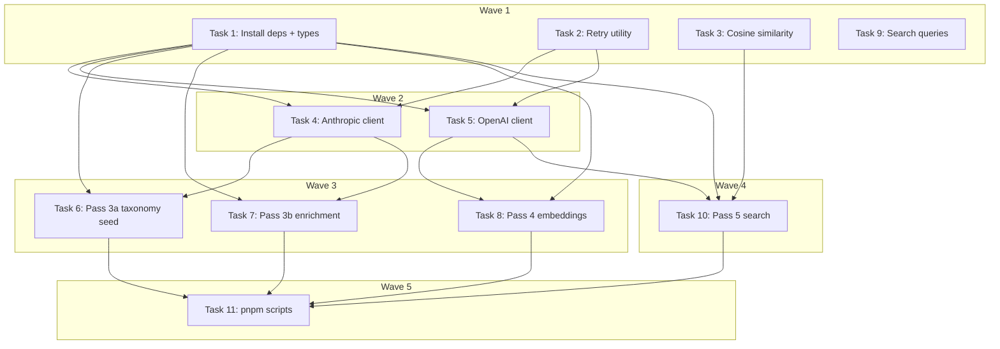

# Enrichment, Embeddings & Search Prototype Implementation Plan

> **For Claude:** REQUIRED SUB-SKILL: Use executing-plans to implement this plan task-by-task.

**Design Doc:** [docs/designs/2026-02-23-enrichment-embeddings-design.md](../designs/2026-02-23-enrichment-embeddings-design.md)

**Spec References:** §3 Architecture Overview (semantic search flow, provider abstraction), §4 Hard Dependencies (Claude Haiku, OpenAI embeddings), §9 Business Rules (taxonomy is canonical)

**PRD References:** §7 Core Features (data pipeline, taxonomy, semantic search), §11 Appetite (30-shop prototype, week 0)

**Goal:** Build the prebuild enrichment pipeline (Pass 3a→3b→4→5) that takes raw shop data from `pass2-full.json`, enriches it with Claude, generates embeddings with OpenAI, and validates semantic search against the 7/10 query success gate.

**Architecture:** Extends the existing pass-based pipeline (`scripts/prebuild/data-pipeline/`). Each pass is a standalone TypeScript script that reads JSON input and writes JSON output to `data/prebuild/`. Pure logic is exported for testing; CLI lives in a guarded `main()`. No production infrastructure (Supabase, workers) — all local.

**Tech Stack:** TypeScript (strict, ESM), `@anthropic-ai/sdk` (Claude tool use), `openai` (embeddings), `tsx` (script runner), Vitest (tests)

---

### Task 1: Install SDK dependencies and extend pipeline types

**Files:**
- Modify: `package.json` (add dependencies)
- Modify: `scripts/prebuild/data-pipeline/types.ts` (add enrichment types)

No test needed — dependency installation and type-only definitions.

**Step 1: Install Anthropic and OpenAI SDKs**

Run: `pnpm add @anthropic-ai/sdk openai`
Expected: Both packages added to `dependencies` in `package.json`

**Step 2: Extend types.ts with enrichment/embedding/search types**

Add the following types after the existing `Pass2Shop` and `ApifyReview` types in `scripts/prebuild/data-pipeline/types.ts`:

```typescript
// ─── Pass 3: Enrichment ────────────────────────────────────────

export interface TaxonomyTag {
  id: string;
  dimension: 'functionality' | 'time' | 'ambience' | 'mode';
  label: string;
  labelZh: string;
}

export interface TaxonomyProposal {
  functionality: Array<{ id: string; label: string; labelZh: string }>;
  time: Array<{ id: string; label: string; labelZh: string }>;
  ambience: Array<{ id: string; label: string; labelZh: string }>;
  mode: Array<{ id: string; label: string; labelZh: string }>;
}

export interface EnrichmentData {
  tags: Array<{ id: string; confidence: number }>;
  summary: string;
  topReviews: string[];
  mode: 'work' | 'rest' | 'social' | 'mixed';
  enrichedAt: string;
  modelId: string;
}

export interface EnrichedShop extends Pass2Shop {
  enrichment: EnrichmentData;
}

// ─── Pass 4: Embeddings ────────────────────────────────────────

export interface ShopEmbedding {
  cafenomad_id: string;
  google_place_id: string;
  name: string;
  embedding: number[];
  embeddedText: string;
  modelId: string;
  embeddedAt: string;
}

// ─── Pass 5: Search Test ───────────────────────────────────────

export interface SearchQuery {
  id: string;
  query: string;
  category: 'attribute' | 'vibe' | 'specific' | 'mixed' | 'mode';
  expectedTraits: string[];
}

export interface SearchTestResult {
  query: string;
  category: string;
  results: Array<{
    rank: number;
    name: string;
    score: number;
    boostedScore: number;
    matchedTags: string[];
  }>;
}
```

**Step 3: Commit**

```bash
git add package.json pnpm-lock.yaml scripts/prebuild/data-pipeline/types.ts
git commit -m "feat(pipeline): install AI SDKs and add enrichment/embedding types"
```

---

### Task 2: Retry utility with exponential backoff

**Files:**
- Create: `scripts/prebuild/data-pipeline/utils/retry.ts`
- Create: `scripts/prebuild/data-pipeline/utils/retry.test.ts`

**Step 1: Write the failing tests**

```typescript
// scripts/prebuild/data-pipeline/utils/retry.test.ts
import { describe, it, expect, vi } from 'vitest';
import { withRetry } from './retry';

describe('withRetry', () => {
  it('returns result on first success', async () => {
    const fn = vi.fn().mockResolvedValue('ok');
    const result = await withRetry(fn);
    expect(result).toBe('ok');
    expect(fn).toHaveBeenCalledTimes(1);
  });

  it('retries on 429 status', async () => {
    const error429 = Object.assign(new Error('Rate limited'), { status: 429 });
    const fn = vi.fn()
      .mockRejectedValueOnce(error429)
      .mockResolvedValue('ok');

    const result = await withRetry(fn, { maxRetries: 3, baseDelayMs: 1 });
    expect(result).toBe('ok');
    expect(fn).toHaveBeenCalledTimes(2);
  });

  it('retries on 529 (Anthropic overloaded) status', async () => {
    const error529 = Object.assign(new Error('Overloaded'), { status: 529 });
    const fn = vi.fn()
      .mockRejectedValueOnce(error529)
      .mockResolvedValue('ok');

    const result = await withRetry(fn, { maxRetries: 3, baseDelayMs: 1 });
    expect(result).toBe('ok');
    expect(fn).toHaveBeenCalledTimes(2);
  });

  it('throws non-retryable errors immediately', async () => {
    const error400 = Object.assign(new Error('Bad request'), { status: 400 });
    const fn = vi.fn().mockRejectedValue(error400);

    await expect(withRetry(fn, { baseDelayMs: 1 })).rejects.toThrow('Bad request');
    expect(fn).toHaveBeenCalledTimes(1);
  });

  it('gives up after maxRetries', async () => {
    const error429 = Object.assign(new Error('Rate limited'), { status: 429 });
    const fn = vi.fn().mockRejectedValue(error429);

    await expect(withRetry(fn, { maxRetries: 2, baseDelayMs: 1 })).rejects.toThrow('Rate limited');
    expect(fn).toHaveBeenCalledTimes(3); // initial + 2 retries
  });

  it('uses exponential backoff delays', async () => {
    const error429 = Object.assign(new Error('Rate limited'), { status: 429 });
    const fn = vi.fn()
      .mockRejectedValueOnce(error429)
      .mockRejectedValueOnce(error429)
      .mockResolvedValue('ok');

    const delays: number[] = [];
    const originalSetTimeout = globalThis.setTimeout;
    vi.spyOn(globalThis, 'setTimeout').mockImplementation(((cb: () => void, ms: number) => {
      delays.push(ms);
      return originalSetTimeout(cb, 0); // skip real delays in tests
    }) as typeof setTimeout);

    await withRetry(fn, { maxRetries: 3, baseDelayMs: 100 });

    expect(delays).toEqual([100, 200]); // 100 * 2^0, 100 * 2^1

    vi.restoreAllMocks();
  });
});
```

**Step 2: Run test to verify it fails**

Run: `pnpm vitest run scripts/prebuild/data-pipeline/utils/retry.test.ts`
Expected: FAIL — cannot find module `./retry`

**Step 3: Write minimal implementation**

```typescript
// scripts/prebuild/data-pipeline/utils/retry.ts

const RETRYABLE_STATUSES = new Set([429, 529]);

export async function withRetry<T>(
  fn: () => Promise<T>,
  { maxRetries = 3, baseDelayMs = 1000 } = {}
): Promise<T> {
  for (let attempt = 0; attempt <= maxRetries; attempt++) {
    try {
      return await fn();
    } catch (error: unknown) {
      if (attempt === maxRetries) throw error;

      const status = (error as { status?: number })?.status;
      if (!status || !RETRYABLE_STATUSES.has(status)) throw error;

      const delay = baseDelayMs * 2 ** attempt;
      console.log(`  Rate limited (${status}), retrying in ${delay}ms (attempt ${attempt + 1}/${maxRetries})...`);
      await new Promise((resolve) => setTimeout(resolve, delay));
    }
  }
  throw new Error('Unreachable');
}
```

**Step 4: Run test to verify it passes**

Run: `pnpm vitest run scripts/prebuild/data-pipeline/utils/retry.test.ts`
Expected: All 6 tests PASS

**Step 5: Commit**

```bash
git add scripts/prebuild/data-pipeline/utils/retry.ts scripts/prebuild/data-pipeline/utils/retry.test.ts
git commit -m "feat(pipeline): add retry utility with exponential backoff"
```

---

### Task 3: Cosine similarity utility

**Files:**
- Create: `scripts/prebuild/data-pipeline/utils/cosine.ts`
- Create: `scripts/prebuild/data-pipeline/utils/cosine.test.ts`

**Step 1: Write the failing tests**

```typescript
// scripts/prebuild/data-pipeline/utils/cosine.test.ts
import { describe, it, expect } from 'vitest';
import { cosineSimilarity } from './cosine';

describe('cosineSimilarity', () => {
  it('returns 1.0 for identical vectors', () => {
    expect(cosineSimilarity([1, 2, 3], [1, 2, 3])).toBeCloseTo(1.0);
  });

  it('returns 0.0 for orthogonal vectors', () => {
    expect(cosineSimilarity([1, 0], [0, 1])).toBeCloseTo(0.0);
  });

  it('returns -1.0 for opposite vectors', () => {
    expect(cosineSimilarity([1, 0], [-1, 0])).toBeCloseTo(-1.0);
  });

  it('computes correct value for known example', () => {
    // [1, 2, 3] · [4, 5, 6] = 32
    // |[1,2,3]| = sqrt(14), |[4,5,6]| = sqrt(77)
    // cosine = 32 / sqrt(14 * 77) = 32 / sqrt(1078) ≈ 0.9746
    expect(cosineSimilarity([1, 2, 3], [4, 5, 6])).toBeCloseTo(0.9746, 3);
  });

  it('throws on mismatched vector lengths', () => {
    expect(() => cosineSimilarity([1, 2], [1, 2, 3])).toThrow('length mismatch');
  });

  it('returns 0 for zero vector', () => {
    expect(cosineSimilarity([0, 0, 0], [1, 2, 3])).toBe(0);
  });
});
```

**Step 2: Run test to verify it fails**

Run: `pnpm vitest run scripts/prebuild/data-pipeline/utils/cosine.test.ts`
Expected: FAIL — cannot find module `./cosine`

**Step 3: Write minimal implementation**

```typescript
// scripts/prebuild/data-pipeline/utils/cosine.ts

export function cosineSimilarity(a: number[], b: number[]): number {
  if (a.length !== b.length) {
    throw new Error(`Vector length mismatch: ${a.length} vs ${b.length}`);
  }

  let dotProduct = 0;
  let normA = 0;
  let normB = 0;

  for (let i = 0; i < a.length; i++) {
    dotProduct += a[i] * b[i];
    normA += a[i] * a[i];
    normB += b[i] * b[i];
  }

  const denominator = Math.sqrt(normA) * Math.sqrt(normB);
  if (denominator === 0) return 0;

  return dotProduct / denominator;
}
```

**Step 4: Run test to verify it passes**

Run: `pnpm vitest run scripts/prebuild/data-pipeline/utils/cosine.test.ts`
Expected: All 6 tests PASS

**Step 5: Commit**

```bash
git add scripts/prebuild/data-pipeline/utils/cosine.ts scripts/prebuild/data-pipeline/utils/cosine.test.ts
git commit -m "feat(pipeline): add cosine similarity utility"
```

---

### Task 4: Anthropic client wrapper

**Files:**
- Create: `scripts/prebuild/data-pipeline/utils/anthropic-client.ts`

No test needed — thin SDK wrapper following existing pattern (`utils/apify-client.ts` has no dedicated tests). Business logic tested through pass script integration tests.

**Step 1: Create the Anthropic client wrapper**

Check the Anthropic SDK docs or `node_modules/@anthropic-ai/sdk` for exact types if the model ID format below doesn't work at runtime.

```typescript
// scripts/prebuild/data-pipeline/utils/anthropic-client.ts
import Anthropic from '@anthropic-ai/sdk';
import { withRetry } from './retry';

// Model ID map — update these if the API rejects them.
// Check https://docs.anthropic.com/en/docs/about-claude/models for current IDs.
export const MODELS = {
  sonnet: 'claude-sonnet-4-6-20250514',
  haiku: 'claude-haiku-4-5-20251001',
} as const;

export type ModelAlias = keyof typeof MODELS;

function getClient(): Anthropic {
  const apiKey = process.env.ANTHROPIC_API_KEY;
  if (!apiKey) {
    throw new Error(
      'ANTHROPIC_API_KEY environment variable is required. Get one at https://console.anthropic.com/'
    );
  }
  return new Anthropic({ apiKey });
}

export interface ToolCallResult<T = unknown> {
  input: T;
  usage: { inputTokens: number; outputTokens: number };
}

/**
 * Call Claude with forced tool use for structured output extraction.
 * Returns the parsed tool input (structured data) from Claude's response.
 */
export async function callClaudeWithTool<T>(options: {
  model?: string;
  systemPrompt: string;
  userMessage: string;
  tool: Anthropic.Tool;
  maxTokens?: number;
}): Promise<ToolCallResult<T>> {
  const client = getClient();

  const response = await withRetry(() =>
    client.messages.create({
      model: options.model ?? MODELS.sonnet,
      max_tokens: options.maxTokens ?? 8192,
      system: options.systemPrompt,
      messages: [{ role: 'user', content: options.userMessage }],
      tools: [options.tool],
      tool_choice: { type: 'tool', name: options.tool.name },
    })
  );

  const toolUse = response.content.find(
    (block): block is Anthropic.ToolUseBlock => block.type === 'tool_use'
  );

  if (!toolUse) {
    throw new Error(
      `Claude did not return a tool_use block. stop_reason: ${response.stop_reason}`
    );
  }

  return {
    input: toolUse.input as T,
    usage: {
      inputTokens: response.usage.input_tokens,
      outputTokens: response.usage.output_tokens,
    },
  };
}
```

**Step 2: Commit**

```bash
git add scripts/prebuild/data-pipeline/utils/anthropic-client.ts
git commit -m "feat(pipeline): add Anthropic client wrapper with tool use"
```

---

### Task 5: OpenAI embeddings client wrapper

**Files:**
- Create: `scripts/prebuild/data-pipeline/utils/openai-client.ts`

No test needed — thin SDK wrapper. Tested through pass script integration tests.

**Step 1: Create the OpenAI embeddings client wrapper**

```typescript
// scripts/prebuild/data-pipeline/utils/openai-client.ts
import OpenAI from 'openai';
import { withRetry } from './retry';

const DEFAULT_MODEL = 'text-embedding-3-small';

function getClient(): OpenAI {
  const apiKey = process.env.OPENAI_API_KEY;
  if (!apiKey) {
    throw new Error(
      'OPENAI_API_KEY environment variable is required. Get one at https://platform.openai.com/api-keys'
    );
  }
  return new OpenAI({ apiKey });
}

/**
 * Embed a single text string. Returns a 1536-dimension vector.
 */
export async function embedText(
  text: string,
  model: string = DEFAULT_MODEL
): Promise<number[]> {
  const [embedding] = await embedTexts([text], model);
  return embedding;
}

/**
 * Embed multiple texts in a single API call. Returns vectors in input order.
 * OpenAI supports up to 2048 inputs per batch.
 */
export async function embedTexts(
  texts: string[],
  model: string = DEFAULT_MODEL
): Promise<number[][]> {
  if (texts.length === 0) return [];

  const client = getClient();

  const response = await withRetry(() =>
    client.embeddings.create({ model, input: texts })
  );

  return response.data
    .sort((a, b) => a.index - b.index)
    .map((d) => d.embedding);
}
```

**Step 2: Commit**

```bash
git add scripts/prebuild/data-pipeline/utils/openai-client.ts
git commit -m "feat(pipeline): add OpenAI embeddings client wrapper"
```

---

### Task 6: Pass 3a — Taxonomy seed generator

**Files:**
- Create: `scripts/prebuild/data-pipeline/pass3a-taxonomy-seed.ts`
- Create: `scripts/prebuild/data-pipeline/pass3a-taxonomy-seed.test.ts`

**Step 1: Write the failing tests**

```typescript
// scripts/prebuild/data-pipeline/pass3a-taxonomy-seed.test.ts
import { describe, it, expect } from 'vitest';
import { sampleReviews, flattenProposalToTags } from './pass3a-taxonomy-seed';
import type { Pass2Shop, TaxonomyProposal } from './types';

// ─── Fixtures ──────────────────────────────────────────────────

function makeShop(overrides: Partial<Pass2Shop> = {}): Pass2Shop {
  return {
    cafenomad_id: 'test-id',
    google_place_id: 'test-place',
    match_confidence: 1,
    name: 'Test Cafe',
    address: '台北市',
    latitude: 25.04,
    longitude: 121.54,
    mrt: '',
    rating: 4.5,
    review_count: 10,
    opening_hours: null,
    phone: null,
    website: null,
    categories: ['咖啡廳'],
    price_range: null,
    description: null,
    menu_url: null,
    limited_time: '',
    socket: '',
    social_url: '',
    reviews: [],
    photos: [],
    ...overrides,
  };
}

// ─── sampleReviews ─────────────────────────────────────────────

describe('sampleReviews', () => {
  it('selects top N reviews by text length from each shop', () => {
    const shop = makeShop({
      reviews: [
        { text: 'short', stars: 5, published_at: '', language: 'unknown' },
        { text: 'this is a much longer review with details', stars: 4, published_at: '', language: 'unknown' },
        { text: 'medium length review', stars: 3, published_at: '', language: 'unknown' },
      ],
    });

    const result = sampleReviews([shop], 2);
    expect(result).toHaveLength(2);
    expect(result[0]).toBe('this is a much longer review with details');
    expect(result[1]).toBe('medium length review');
  });

  it('skips empty reviews', () => {
    const shop = makeShop({
      reviews: [
        { text: '', stars: 5, published_at: '', language: 'unknown' },
        { text: '  ', stars: 4, published_at: '', language: 'unknown' },
        { text: 'actual review text', stars: 3, published_at: '', language: 'unknown' },
      ],
    });

    const result = sampleReviews([shop], 2);
    expect(result).toEqual(['actual review text']);
  });

  it('handles shops with fewer reviews than perShop', () => {
    const shop = makeShop({
      reviews: [
        { text: 'only one review', stars: 5, published_at: '', language: 'unknown' },
      ],
    });

    const result = sampleReviews([shop], 3);
    expect(result).toEqual(['only one review']);
  });

  it('samples from multiple shops', () => {
    const shop1 = makeShop({
      name: 'Shop A',
      reviews: [
        { text: 'review from shop A', stars: 5, published_at: '', language: 'unknown' },
      ],
    });
    const shop2 = makeShop({
      name: 'Shop B',
      reviews: [
        { text: 'review from shop B', stars: 4, published_at: '', language: 'unknown' },
      ],
    });

    const result = sampleReviews([shop1, shop2], 1);
    expect(result).toHaveLength(2);
    expect(result).toContain('review from shop A');
    expect(result).toContain('review from shop B');
  });
});

// ─── flattenProposalToTags ─────────────────────────────────────

describe('flattenProposalToTags', () => {
  it('flattens all dimensions into a single TaxonomyTag array', () => {
    const proposal: TaxonomyProposal = {
      functionality: [{ id: 'has_outlets', label: 'Has outlets', labelZh: '有插座' }],
      time: [{ id: 'late_night', label: 'Late night', labelZh: '深夜營業' }],
      ambience: [{ id: 'quiet', label: 'Quiet', labelZh: '安靜' }],
      mode: [{ id: 'deep_work', label: 'Deep work', labelZh: '專注工作' }],
    };

    const tags = flattenProposalToTags(proposal);
    expect(tags).toHaveLength(4);
    expect(tags[0]).toEqual({ id: 'has_outlets', dimension: 'functionality', label: 'Has outlets', labelZh: '有插座' });
    expect(tags[1]).toEqual({ id: 'late_night', dimension: 'time', label: 'Late night', labelZh: '深夜營業' });
    expect(tags[2]).toEqual({ id: 'quiet', dimension: 'ambience', label: 'Quiet', labelZh: '安靜' });
    expect(tags[3]).toEqual({ id: 'deep_work', dimension: 'mode', label: 'Deep work', labelZh: '專注工作' });
  });
});
```

**Step 2: Run test to verify it fails**

Run: `pnpm vitest run scripts/prebuild/data-pipeline/pass3a-taxonomy-seed.test.ts`
Expected: FAIL — cannot find module / functions not exported

**Step 3: Write the implementation**

```typescript
// scripts/prebuild/data-pipeline/pass3a-taxonomy-seed.ts
import { readFileSync, writeFileSync, mkdirSync } from 'node:fs';
import { parseArgs } from 'node:util';
import { callClaudeWithTool, MODELS, type ModelAlias } from './utils/anthropic-client';
import type Anthropic from '@anthropic-ai/sdk';
import type { Pass2Shop, TaxonomyTag, TaxonomyProposal } from './types';

// ─── Constants ─────────────────────────────────────────────────

const INPUT_FILE = 'data/prebuild/pass2-full.json';
const OUTPUT_DIR = 'data/prebuild';
const OUTPUT_FILE = `${OUTPUT_DIR}/taxonomy-proposed.json`;
const DEFAULT_PER_SHOP = 2;

// ─── Pure Functions (exported for testing) ─────────────────────

/**
 * Sample the longest non-empty reviews from each shop.
 * Returns an array of review texts.
 */
export function sampleReviews(shops: Pass2Shop[], perShop: number = DEFAULT_PER_SHOP): string[] {
  const samples: string[] = [];

  for (const shop of shops) {
    const nonEmpty = shop.reviews.filter((r) => r.text.trim().length > 0);
    const sorted = [...nonEmpty].sort((a, b) => b.text.length - a.text.length);
    const selected = sorted.slice(0, perShop);
    samples.push(...selected.map((r) => r.text));
  }

  return samples;
}

/**
 * Flatten a TaxonomyProposal (grouped by dimension) into a flat TaxonomyTag array.
 */
export function flattenProposalToTags(proposal: TaxonomyProposal): TaxonomyTag[] {
  const dimensions = ['functionality', 'time', 'ambience', 'mode'] as const;
  const tags: TaxonomyTag[] = [];

  for (const dim of dimensions) {
    for (const entry of proposal[dim]) {
      tags.push({
        id: entry.id,
        dimension: dim,
        label: entry.label,
        labelZh: entry.labelZh,
      });
    }
  }

  return tags;
}

// ─── Prompt & Tool Schema ──────────────────────────────────────

const SYSTEM_PROMPT = `You are an expert on Taiwan's independent coffee shop scene. You analyze real Google Maps reviews from Taipei coffee shops to create a taxonomy system for semantic search.

Requirements:
- Each tag needs: id (snake_case English), label (English), labelZh (Traditional Chinese)
- Aim for 60-100 total tags across all 4 dimensions
- Tags should be specific enough for filtering but general enough to apply to multiple shops
- Include tags that reflect Taiwan coffee culture (e.g., 不限時, 限時, 有貓, 文青風)
- Think about what coffee lovers actually search for when choosing a cafe`;

function buildUserMessage(reviews: string[]): string {
  const reviewBlock = reviews.map((r, i) => `[${i + 1}] ${r}`).join('\n');
  return `Analyze these ${reviews.length} reviews from Taipei coffee shops and propose taxonomy tags organized into 4 dimensions:

1. **functionality** — What can you do there? (outlets, WiFi, laptop-friendly, reservations, pet-friendly, outdoor seating, etc.)
2. **time** — When should you go? (late night, early bird, no time limit, limited time, weekend-only, etc.)
3. **ambience** — What does it feel like? (quiet, lively, photogenic, cozy, industrial, Japanese-style, vintage, has cats, etc.)
4. **mode** — What's it best for? (deep work, casual work, reading, meeting friends, date, solo time, group hangout, etc.)

Reviews:
${reviewBlock}`;
}

const TAXONOMY_TOOL: Anthropic.Tool = {
  name: 'propose_taxonomy',
  description: 'Propose a taxonomy of tags for classifying coffee shops, organized by dimension',
  input_schema: {
    type: 'object' as const,
    properties: {
      functionality: {
        type: 'array',
        items: {
          type: 'object',
          properties: {
            id: { type: 'string', description: 'snake_case English identifier' },
            label: { type: 'string', description: 'English label' },
            labelZh: { type: 'string', description: 'Traditional Chinese label' },
          },
          required: ['id', 'label', 'labelZh'],
        },
      },
      time: {
        type: 'array',
        items: {
          type: 'object',
          properties: {
            id: { type: 'string' },
            label: { type: 'string' },
            labelZh: { type: 'string' },
          },
          required: ['id', 'label', 'labelZh'],
        },
      },
      ambience: {
        type: 'array',
        items: {
          type: 'object',
          properties: {
            id: { type: 'string' },
            label: { type: 'string' },
            labelZh: { type: 'string' },
          },
          required: ['id', 'label', 'labelZh'],
        },
      },
      mode: {
        type: 'array',
        items: {
          type: 'object',
          properties: {
            id: { type: 'string' },
            label: { type: 'string' },
            labelZh: { type: 'string' },
          },
          required: ['id', 'label', 'labelZh'],
        },
      },
    },
    required: ['functionality', 'time', 'ambience', 'mode'],
  },
};

// ─── CLI Entry Point ───────────────────────────────────────────

async function main() {
  const { values } = parseArgs({
    options: {
      model: { type: 'string', default: 'sonnet' },
      'per-shop': { type: 'string', default: String(DEFAULT_PER_SHOP) },
    },
    strict: false,
  });

  const modelAlias = values.model as ModelAlias;
  const modelId = MODELS[modelAlias] ?? values.model;
  const perShop = parseInt(values['per-shop'] as string, 10);

  console.log(`[pass3a] Reading ${INPUT_FILE}...`);
  const shops: Pass2Shop[] = JSON.parse(readFileSync(INPUT_FILE, 'utf-8'));
  console.log(`[pass3a] Loaded ${shops.length} shops`);

  const reviews = sampleReviews(shops, perShop);
  console.log(`[pass3a] Sampled ${reviews.length} reviews (${perShop} per shop)`);

  console.log(`[pass3a] Calling Claude (${modelId})...`);
  const result = await callClaudeWithTool<TaxonomyProposal>({
    model: modelId,
    systemPrompt: SYSTEM_PROMPT,
    userMessage: buildUserMessage(reviews),
    tool: TAXONOMY_TOOL,
  });

  const proposal = result.input;
  const tags = flattenProposalToTags(proposal);

  mkdirSync(OUTPUT_DIR, { recursive: true });
  writeFileSync(OUTPUT_FILE, JSON.stringify(tags, null, 2));

  const counts = {
    functionality: proposal.functionality.length,
    time: proposal.time.length,
    ambience: proposal.ambience.length,
    mode: proposal.mode.length,
  };

  console.log('[pass3a] Taxonomy proposed:');
  console.log(`  functionality: ${counts.functionality} tags`);
  console.log(`  time:          ${counts.time} tags`);
  console.log(`  ambience:      ${counts.ambience} tags`);
  console.log(`  mode:          ${counts.mode} tags`);
  console.log(`  TOTAL:         ${tags.length} tags`);
  console.log(`  Tokens:        ${result.usage.inputTokens} in / ${result.usage.outputTokens} out`);
  console.log(`  Saved to:      ${OUTPUT_FILE}`);
  console.log('\n[pass3a] NEXT STEP: Review and curate taxonomy-proposed.json → taxonomy.json');
  console.log('  Copy the file, remove/rename tags as needed, then run pass3b.');
}

const isDirectRun = process.argv[1]?.includes('pass3a-taxonomy-seed');
if (isDirectRun) {
  main().catch((err) => {
    console.error('[pass3a] Fatal error:', err);
    process.exit(1);
  });
}
```

**Step 4: Run test to verify it passes**

Run: `pnpm vitest run scripts/prebuild/data-pipeline/pass3a-taxonomy-seed.test.ts`
Expected: All 5 tests PASS

**Step 5: Commit**

```bash
git add scripts/prebuild/data-pipeline/pass3a-taxonomy-seed.ts scripts/prebuild/data-pipeline/pass3a-taxonomy-seed.test.ts
git commit -m "feat(pipeline): add Pass 3a taxonomy seed generator"
```

---

### Task 7: Pass 3b — Enrichment worker

**Files:**
- Create: `scripts/prebuild/data-pipeline/pass3b-enrich.ts`
- Create: `scripts/prebuild/data-pipeline/pass3b-enrich.test.ts`

**Step 1: Write the failing tests**

```typescript
// scripts/prebuild/data-pipeline/pass3b-enrich.test.ts
import { describe, it, expect } from 'vitest';
import {
  buildEnrichmentPrompt,
  validateEnrichmentResult,
  parseCliArgs,
} from './pass3b-enrich';
import type { Pass2Shop, TaxonomyTag, EnrichmentData } from './types';

// ─── Fixtures ──────────────────────────────────────────────────

const taxonomy: TaxonomyTag[] = [
  { id: 'has_outlets', dimension: 'functionality', label: 'Has outlets', labelZh: '有插座' },
  { id: 'quiet', dimension: 'ambience', label: 'Quiet', labelZh: '安靜' },
  { id: 'deep_work', dimension: 'mode', label: 'Deep work', labelZh: '專注工作' },
];

function makeShop(overrides: Partial<Pass2Shop> = {}): Pass2Shop {
  return {
    cafenomad_id: 'test-id',
    google_place_id: 'test-place',
    match_confidence: 1,
    name: 'Test Cafe 測試咖啡',
    address: '台北市',
    latitude: 25.04,
    longitude: 121.54,
    mrt: '國父紀念館',
    rating: 4.5,
    review_count: 10,
    opening_hours: null,
    phone: null,
    website: null,
    categories: ['咖啡廳', '咖啡烘焙商'],
    price_range: '$200-400',
    description: null,
    menu_url: null,
    limited_time: 'no',
    socket: 'yes',
    social_url: '',
    reviews: [
      { text: '很安靜適合工作', stars: 5, published_at: '3 個月前', language: 'unknown' },
      { text: '', stars: 4, published_at: '1 年前', language: 'unknown' },
      { text: '咖啡很好喝', stars: 5, published_at: '6 個月前', language: 'unknown' },
    ],
    photos: [],
    ...overrides,
  };
}

// ─── buildEnrichmentPrompt ─────────────────────────────────────

describe('buildEnrichmentPrompt', () => {
  it('includes shop name and categories', () => {
    const prompt = buildEnrichmentPrompt(makeShop(), taxonomy);
    expect(prompt).toContain('Test Cafe 測試咖啡');
    expect(prompt).toContain('咖啡廳');
    expect(prompt).toContain('咖啡烘焙商');
  });

  it('includes only non-empty reviews', () => {
    const prompt = buildEnrichmentPrompt(makeShop(), taxonomy);
    expect(prompt).toContain('很安靜適合工作');
    expect(prompt).toContain('咖啡很好喝');
    expect(prompt).not.toMatch(/\[\d+\]\s*\n/); // no empty review entries
  });

  it('includes existing attributes (socket, limited_time)', () => {
    const prompt = buildEnrichmentPrompt(makeShop(), taxonomy);
    expect(prompt).toContain('Socket: yes');
    expect(prompt).toContain('Limited time: no');
  });

  it('includes taxonomy tag IDs for reference', () => {
    const prompt = buildEnrichmentPrompt(makeShop(), taxonomy);
    expect(prompt).toContain('has_outlets');
    expect(prompt).toContain('quiet');
    expect(prompt).toContain('deep_work');
  });
});

// ─── validateEnrichmentResult ──────────────────────────────────

describe('validateEnrichmentResult', () => {
  const validResult: EnrichmentData = {
    tags: [{ id: 'has_outlets', confidence: 0.9 }, { id: 'quiet', confidence: 0.7 }],
    summary: 'A quiet cafe with outlets, perfect for working.',
    topReviews: ['很安靜適合工作'],
    mode: 'work',
    enrichedAt: new Date().toISOString(),
    modelId: 'claude-sonnet-4-6-20250514',
  };

  it('accepts valid enrichment result', () => {
    expect(validateEnrichmentResult(validResult, taxonomy)).toEqual(validResult);
  });

  it('filters out unknown tag IDs', () => {
    const withUnknown = {
      ...validResult,
      tags: [...validResult.tags, { id: 'nonexistent_tag', confidence: 0.8 }],
    };
    const result = validateEnrichmentResult(withUnknown, taxonomy);
    expect(result.tags).toHaveLength(2);
    expect(result.tags.every((t) => taxonomy.some((tx) => tx.id === t.id))).toBe(true);
  });

  it('clamps confidence to [0, 1] range', () => {
    const withBadConfidence = {
      ...validResult,
      tags: [{ id: 'has_outlets', confidence: 1.5 }, { id: 'quiet', confidence: -0.2 }],
    };
    const result = validateEnrichmentResult(withBadConfidence, taxonomy);
    expect(result.tags[0].confidence).toBe(1.0);
    expect(result.tags[1].confidence).toBe(0.0);
  });

  it('validates mode is one of the allowed values', () => {
    const withBadMode = { ...validResult, mode: 'invalid' as EnrichmentData['mode'] };
    const result = validateEnrichmentResult(withBadMode, taxonomy);
    expect(result.mode).toBe('mixed'); // fallback
  });
});

// ─── parseCliArgs ──────────────────────────────────────────────

describe('parseCliArgs', () => {
  it('returns defaults when no args provided', () => {
    const args = parseCliArgs([]);
    expect(args.model).toBe('sonnet');
    expect(args.startFrom).toBe(0);
    expect(args.dryRun).toBe(false);
  });

  it('parses --model flag', () => {
    const args = parseCliArgs(['--model', 'haiku']);
    expect(args.model).toBe('haiku');
  });

  it('parses --dry-run flag', () => {
    const args = parseCliArgs(['--dry-run']);
    expect(args.dryRun).toBe(true);
  });

  it('parses --start-from flag', () => {
    const args = parseCliArgs(['--start-from', '5']);
    expect(args.startFrom).toBe(5);
  });
});
```

**Step 2: Run test to verify it fails**

Run: `pnpm vitest run scripts/prebuild/data-pipeline/pass3b-enrich.test.ts`
Expected: FAIL — cannot find module / functions not exported

**Step 3: Write the implementation**

```typescript
// scripts/prebuild/data-pipeline/pass3b-enrich.ts
import { readFileSync, writeFileSync, mkdirSync } from 'node:fs';
import { callClaudeWithTool, MODELS, type ModelAlias } from './utils/anthropic-client';
import type Anthropic from '@anthropic-ai/sdk';
import type { Pass2Shop, TaxonomyTag, EnrichmentData, EnrichedShop } from './types';

// ─── Constants ─────────────────────────────────────────────────

const PASS2_FILE = 'data/prebuild/pass2-full.json';
const TAXONOMY_FILE = 'data/prebuild/taxonomy.json';
const OUTPUT_DIR = 'data/prebuild';
const OUTPUT_FILE = `${OUTPUT_DIR}/pass3-enriched.json`;
const VALID_MODES = new Set(['work', 'rest', 'social', 'mixed']);

// ─── Pure Functions (exported for testing) ─────────────────────

export interface CliArgs {
  model: string;
  startFrom: number;
  dryRun: boolean;
}

export function parseCliArgs(argv: string[]): CliArgs {
  const args: CliArgs = { model: 'sonnet', startFrom: 0, dryRun: false };
  for (let i = 0; i < argv.length; i++) {
    switch (argv[i]) {
      case '--model':
        args.model = argv[++i] ?? 'sonnet';
        break;
      case '--start-from':
        args.startFrom = parseInt(argv[++i] ?? '0', 10);
        break;
      case '--dry-run':
        args.dryRun = true;
        break;
    }
  }
  return args;
}

export function buildEnrichmentPrompt(shop: Pass2Shop, taxonomy: TaxonomyTag[]): string {
  const nonEmptyReviews = shop.reviews
    .filter((r) => r.text.trim().length > 0)
    .map((r, i) => `[${i + 1}] (${r.stars}★) ${r.text}`);

  const taxonomyBlock = taxonomy
    .map((t) => `  ${t.id} (${t.dimension}) — ${t.label} / ${t.labelZh}`)
    .join('\n');

  return `Classify this coffee shop based on its reviews and attributes.

Shop: ${shop.name}
Categories: ${shop.categories.join(', ')}
Price range: ${shop.price_range ?? 'unknown'}
Socket: ${shop.socket || 'unknown'}
Limited time: ${shop.limited_time || 'unknown'}
Rating: ${shop.rating ?? 'unknown'} (${shop.review_count} reviews)
${shop.description ? `Description: ${shop.description}` : ''}

Reviews (${nonEmptyReviews.length}):
${nonEmptyReviews.join('\n')}

Available taxonomy tags (ONLY select from this list):
${taxonomyBlock}`;
}

export function validateEnrichmentResult(
  raw: EnrichmentData,
  taxonomy: TaxonomyTag[]
): EnrichmentData {
  const validIds = new Set(taxonomy.map((t) => t.id));

  const tags = raw.tags
    .filter((t) => validIds.has(t.id))
    .map((t) => ({
      id: t.id,
      confidence: Math.max(0, Math.min(1, t.confidence)),
    }));

  const mode = VALID_MODES.has(raw.mode) ? raw.mode : 'mixed';

  return {
    ...raw,
    tags,
    mode: mode as EnrichmentData['mode'],
  };
}

// ─── Prompt & Tool Schema ──────────────────────────────────────

const SYSTEM_PROMPT = `You are an expert on Taiwan's independent coffee shop scene. You classify coffee shops based on their Google Maps reviews using a predefined taxonomy.

Rules:
- ONLY select tags from the provided taxonomy list. Never invent new tags.
- Assign a confidence score (0.0-1.0) to each tag based on how strongly the reviews support it.
- Write a 2-3 sentence summary describing the shop's character — what makes it special, who it's for.
- Select the 3-5 most informative review excerpts that would help someone decide whether to visit.
- Classify the primary mode: work (focused tasks), rest (relaxation/reading), social (meeting people), or mixed.`;

const ENRICHMENT_TOOL: Anthropic.Tool = {
  name: 'classify_shop',
  description: 'Classify a coffee shop based on its reviews using the provided taxonomy',
  input_schema: {
    type: 'object' as const,
    properties: {
      tags: {
        type: 'array',
        items: {
          type: 'object',
          properties: {
            id: { type: 'string', description: 'Tag ID from the taxonomy list' },
            confidence: { type: 'number', description: 'Confidence score 0.0-1.0' },
          },
          required: ['id', 'confidence'],
        },
        description: 'Tags that apply to this shop, selected from the taxonomy',
      },
      summary: {
        type: 'string',
        description: '2-3 sentence natural language profile of the shop',
      },
      topReviews: {
        type: 'array',
        items: { type: 'string' },
        description: '3-5 most informative review excerpts',
      },
      mode: {
        type: 'string',
        enum: ['work', 'rest', 'social', 'mixed'],
        description: 'Primary usage mode for this shop',
      },
    },
    required: ['tags', 'summary', 'topReviews', 'mode'],
  },
};

// ─── CLI Entry Point ───────────────────────────────────────────

async function main() {
  const args = parseCliArgs(process.argv.slice(2));
  const modelId = MODELS[args.model as ModelAlias] ?? args.model;

  console.log(`[pass3b] Model: ${modelId}`);
  console.log(`[pass3b] Start from: ${args.startFrom}`);
  console.log(`[pass3b] Dry run: ${args.dryRun}`);

  const shops: Pass2Shop[] = JSON.parse(readFileSync(PASS2_FILE, 'utf-8'));
  const taxonomy: TaxonomyTag[] = JSON.parse(readFileSync(TAXONOMY_FILE, 'utf-8'));
  console.log(`[pass3b] Loaded ${shops.length} shops, ${taxonomy.length} taxonomy tags`);

  // Load existing results for resume support
  let enriched: EnrichedShop[] = [];
  try {
    enriched = JSON.parse(readFileSync(OUTPUT_FILE, 'utf-8'));
    console.log(`[pass3b] Loaded ${enriched.length} existing results for resume`);
  } catch {
    // No existing results — start fresh
  }

  const enrichedIds = new Set(enriched.map((s) => s.cafenomad_id));
  const toProcess = args.dryRun ? shops.slice(0, 1) : shops.slice(args.startFrom);

  let totalIn = 0;
  let totalOut = 0;

  for (let i = 0; i < toProcess.length; i++) {
    const shop = toProcess[i];
    if (enrichedIds.has(shop.cafenomad_id)) {
      console.log(`  [${args.startFrom + i + 1}/${shops.length}] ${shop.name} — skipped (already enriched)`);
      continue;
    }

    console.log(`  [${args.startFrom + i + 1}/${shops.length}] ${shop.name}...`);

    try {
      const prompt = buildEnrichmentPrompt(shop, taxonomy);
      const result = await callClaudeWithTool<EnrichmentData>({
        model: modelId,
        systemPrompt: SYSTEM_PROMPT,
        userMessage: prompt,
        tool: ENRICHMENT_TOOL,
      });

      totalIn += result.usage.inputTokens;
      totalOut += result.usage.outputTokens;

      const validated = validateEnrichmentResult(
        {
          ...result.input,
          enrichedAt: new Date().toISOString(),
          modelId,
        },
        taxonomy
      );

      enriched.push({ ...shop, enrichment: validated });

      // Save after each shop for interrupt safety
      mkdirSync(OUTPUT_DIR, { recursive: true });
      writeFileSync(OUTPUT_FILE, JSON.stringify(enriched, null, 2));

      console.log(`    → ${validated.tags.length} tags, mode: ${validated.mode}`);
    } catch (err) {
      console.error(`    ✗ Failed: ${err instanceof Error ? err.message : err}`);
      console.error(`    Skipping. Resume later with --start-from ${args.startFrom + i}`);
    }
  }

  console.log('\n[pass3b] Enrichment complete:');
  console.log(`  Enriched: ${enriched.length}/${shops.length} shops`);
  console.log(`  Tokens:   ${totalIn} in / ${totalOut} out`);
  console.log(`  Saved to: ${OUTPUT_FILE}`);
}

const isDirectRun = process.argv[1]?.includes('pass3b-enrich');
if (isDirectRun) {
  main().catch((err) => {
    console.error('[pass3b] Fatal error:', err);
    process.exit(1);
  });
}
```

**Step 4: Run test to verify it passes**

Run: `pnpm vitest run scripts/prebuild/data-pipeline/pass3b-enrich.test.ts`
Expected: All 11 tests PASS

**Step 5: Commit**

```bash
git add scripts/prebuild/data-pipeline/pass3b-enrich.ts scripts/prebuild/data-pipeline/pass3b-enrich.test.ts
git commit -m "feat(pipeline): add Pass 3b enrichment worker with Claude tool use"
```

---

### Task 8: Pass 4 — Embedding generator

**Files:**
- Create: `scripts/prebuild/data-pipeline/pass4-embed.ts`
- Create: `scripts/prebuild/data-pipeline/pass4-embed.test.ts`

**Step 1: Write the failing tests**

```typescript
// scripts/prebuild/data-pipeline/pass4-embed.test.ts
import { describe, it, expect } from 'vitest';
import { composeEmbeddingText } from './pass4-embed';
import type { EnrichedShop, EnrichmentData, TaxonomyTag } from './types';

// ─── Fixtures ──────────────────────────────────────────────────

const taxonomy: TaxonomyTag[] = [
  { id: 'has_outlets', dimension: 'functionality', label: 'Has outlets', labelZh: '有插座' },
  { id: 'quiet', dimension: 'ambience', label: 'Quiet', labelZh: '安靜' },
];

function makeEnrichedShop(overrides: Partial<EnrichedShop> = {}): EnrichedShop {
  return {
    cafenomad_id: 'test-id',
    google_place_id: 'test-place',
    match_confidence: 1,
    name: 'Test Cafe 測試咖啡',
    address: '台北市',
    latitude: 25.04,
    longitude: 121.54,
    mrt: '',
    rating: 4.5,
    review_count: 10,
    opening_hours: null,
    phone: null,
    website: null,
    categories: ['咖啡廳'],
    price_range: '$200-400',
    description: null,
    menu_url: null,
    limited_time: 'no',
    socket: 'yes',
    social_url: '',
    reviews: [],
    photos: [],
    enrichment: {
      tags: [
        { id: 'has_outlets', confidence: 0.9 },
        { id: 'quiet', confidence: 0.7 },
      ],
      summary: 'A quiet cafe with outlets perfect for working.',
      topReviews: ['很安靜適合工作', '咖啡很好喝，環境舒適'],
      mode: 'work',
      enrichedAt: '2026-02-23T00:00:00Z',
      modelId: 'test-model',
    },
    ...overrides,
  };
}

// ─── composeEmbeddingText ──────────────────────────────────────

describe('composeEmbeddingText', () => {
  it('includes name, summary, tags, and reviews in correct order', () => {
    const text = composeEmbeddingText(makeEnrichedShop(), taxonomy);
    const nameIdx = text.indexOf('Test Cafe 測試咖啡');
    const summaryIdx = text.indexOf('A quiet cafe with outlets');
    const tagsIdx = text.indexOf('Tags:');
    const reviewsIdx = text.indexOf('Selected reviews:');

    expect(nameIdx).toBeLessThan(summaryIdx);
    expect(summaryIdx).toBeLessThan(tagsIdx);
    expect(tagsIdx).toBeLessThan(reviewsIdx);
  });

  it('resolves tag IDs to labels', () => {
    const text = composeEmbeddingText(makeEnrichedShop(), taxonomy);
    expect(text).toContain('Has outlets');
    expect(text).toContain('有插座');
    expect(text).toContain('Quiet');
    expect(text).toContain('安靜');
  });

  it('handles shops with no tags gracefully', () => {
    const shop = makeEnrichedShop({
      enrichment: {
        ...makeEnrichedShop().enrichment,
        tags: [],
      },
    });
    const text = composeEmbeddingText(shop, taxonomy);
    expect(text).toContain('Test Cafe');
    expect(text).toContain('Tags:');
  });

  it('handles shops with empty topReviews', () => {
    const shop = makeEnrichedShop({
      enrichment: {
        ...makeEnrichedShop().enrichment,
        topReviews: [],
      },
    });
    const text = composeEmbeddingText(shop, taxonomy);
    expect(text).toContain('Test Cafe');
    expect(text).not.toContain('undefined');
  });
});
```

**Step 2: Run test to verify it fails**

Run: `pnpm vitest run scripts/prebuild/data-pipeline/pass4-embed.test.ts`
Expected: FAIL — cannot find module / function not exported

**Step 3: Write the implementation**

```typescript
// scripts/prebuild/data-pipeline/pass4-embed.ts
import { readFileSync, writeFileSync, mkdirSync } from 'node:fs';
import { embedTexts } from './utils/openai-client';
import type { EnrichedShop, TaxonomyTag, ShopEmbedding } from './types';

// ─── Constants ─────────────────────────────────────────────────

const ENRICHED_FILE = 'data/prebuild/pass3-enriched.json';
const TAXONOMY_FILE = 'data/prebuild/taxonomy.json';
const OUTPUT_DIR = 'data/prebuild';
const OUTPUT_FILE = `${OUTPUT_DIR}/pass4-embeddings.json`;
const EMBEDDING_MODEL = 'text-embedding-3-small';

// ─── Pure Functions (exported for testing) ─────────────────────

/**
 * Compose the text that will be embedded for a single shop.
 * Structure: name → summary → tags (bilingual) → top reviews.
 */
export function composeEmbeddingText(shop: EnrichedShop, taxonomy: TaxonomyTag[]): string {
  const tagMap = new Map(taxonomy.map((t) => [t.id, t]));

  const tagLabels = shop.enrichment.tags
    .map((t) => {
      const tag = tagMap.get(t.id);
      return tag ? `${tag.label} / ${tag.labelZh}` : null;
    })
    .filter(Boolean)
    .join(', ');

  const reviewBlock = shop.enrichment.topReviews
    .map((r) => `- ${r}`)
    .join('\n');

  return [
    shop.name,
    '',
    shop.enrichment.summary,
    '',
    `Tags: ${tagLabels}`,
    '',
    reviewBlock ? `Selected reviews:\n${reviewBlock}` : '',
  ]
    .join('\n')
    .trim();
}

// ─── CLI Entry Point ───────────────────────────────────────────

async function main() {
  console.log(`[pass4] Reading enriched data...`);
  const shops: EnrichedShop[] = JSON.parse(readFileSync(ENRICHED_FILE, 'utf-8'));
  const taxonomy: TaxonomyTag[] = JSON.parse(readFileSync(TAXONOMY_FILE, 'utf-8'));
  console.log(`[pass4] Loaded ${shops.length} enriched shops, ${taxonomy.length} taxonomy tags`);

  const texts = shops.map((shop) => composeEmbeddingText(shop, taxonomy));

  console.log(`[pass4] Embedding ${texts.length} texts with ${EMBEDDING_MODEL}...`);
  const embeddings = await embedTexts(texts, EMBEDDING_MODEL);

  const output: ShopEmbedding[] = shops.map((shop, i) => ({
    cafenomad_id: shop.cafenomad_id,
    google_place_id: shop.google_place_id,
    name: shop.name,
    embedding: embeddings[i],
    embeddedText: texts[i],
    modelId: EMBEDDING_MODEL,
    embeddedAt: new Date().toISOString(),
  }));

  mkdirSync(OUTPUT_DIR, { recursive: true });
  writeFileSync(OUTPUT_FILE, JSON.stringify(output, null, 2));

  console.log('[pass4] Embedding complete:');
  console.log(`  Shops:      ${output.length}`);
  console.log(`  Dimensions: ${output[0]?.embedding.length ?? 'N/A'}`);
  console.log(`  Saved to:   ${OUTPUT_FILE}`);
}

const isDirectRun = process.argv[1]?.includes('pass4-embed');
if (isDirectRun) {
  main().catch((err) => {
    console.error('[pass4] Fatal error:', err);
    process.exit(1);
  });
}
```

**Step 4: Run test to verify it passes**

Run: `pnpm vitest run scripts/prebuild/data-pipeline/pass4-embed.test.ts`
Expected: All 4 tests PASS

**Step 5: Commit**

```bash
git add scripts/prebuild/data-pipeline/pass4-embed.ts scripts/prebuild/data-pipeline/pass4-embed.test.ts
git commit -m "feat(pipeline): add Pass 4 embedding generator"
```

---

### Task 9: Search queries config file

**Files:**
- Create: `scripts/prebuild/data-pipeline/search-queries.json`

No test needed — static configuration file.

**Step 1: Create the search queries**

```json
[
  {
    "id": "q1",
    "query": "有插座可以工作的安靜咖啡廳",
    "category": "attribute",
    "expectedTraits": ["has_outlets", "quiet", "work"]
  },
  {
    "id": "q2",
    "query": "適合讀書的咖啡廳，不限時",
    "category": "attribute",
    "expectedTraits": ["no_time_limit", "quiet", "reading"]
  },
  {
    "id": "q3",
    "query": "文青風的拍照咖啡廳",
    "category": "vibe",
    "expectedTraits": ["photogenic", "aesthetic"]
  },
  {
    "id": "q4",
    "query": "深夜還開著的咖啡廳",
    "category": "attribute",
    "expectedTraits": ["late_night"]
  },
  {
    "id": "q5",
    "query": "cozy cafe good for a date near MRT",
    "category": "mixed",
    "expectedTraits": ["cozy", "date"]
  },
  {
    "id": "q6",
    "query": "適合跟朋友聊天聚會的咖啡廳",
    "category": "mode",
    "expectedTraits": ["social", "group_hangout"]
  },
  {
    "id": "q7",
    "query": "有好喝手沖咖啡的自烘店",
    "category": "specific",
    "expectedTraits": ["specialty_coffee", "pour_over"]
  },
  {
    "id": "q8",
    "query": "有貓的咖啡廳",
    "category": "vibe",
    "expectedTraits": ["has_cats"]
  },
  {
    "id": "q9",
    "query": "便宜平價的咖啡廳，適合學生",
    "category": "attribute",
    "expectedTraits": ["budget_friendly"]
  },
  {
    "id": "q10",
    "query": "quiet place to work alone with good wifi",
    "category": "mixed",
    "expectedTraits": ["quiet", "wifi", "deep_work"]
  }
]
```

Note: `expectedTraits` are hints for manual evaluation — the tag IDs may not match the final taxonomy exactly. Update them after the taxonomy is curated.

**Step 2: Commit**

```bash
git add scripts/prebuild/data-pipeline/search-queries.json
git commit -m "feat(pipeline): add 10 search test queries for validation gate"
```

---

### Task 10: Pass 5 — Search prototype

**Files:**
- Create: `scripts/prebuild/data-pipeline/pass5-search-test.ts`
- Create: `scripts/prebuild/data-pipeline/pass5-search-test.test.ts`

**Step 1: Write the failing tests**

```typescript
// scripts/prebuild/data-pipeline/pass5-search-test.test.ts
import { describe, it, expect } from 'vitest';
import { computeTaxonomyBoost, rankResults } from './pass5-search-test';
import type { TaxonomyTag, ShopEmbedding } from './types';

// ─── Fixtures ──────────────────────────────────────────────────

const taxonomy: TaxonomyTag[] = [
  { id: 'has_outlets', dimension: 'functionality', label: 'Has outlets', labelZh: '有插座' },
  { id: 'quiet', dimension: 'ambience', label: 'Quiet', labelZh: '安靜' },
  { id: 'late_night', dimension: 'time', label: 'Late night', labelZh: '深夜營業' },
];

const shopTags = [
  { id: 'has_outlets', confidence: 0.9 },
  { id: 'quiet', confidence: 0.7 },
];

// ─── computeTaxonomyBoost ──────────────────────────────────────

describe('computeTaxonomyBoost', () => {
  it('returns boost for Chinese label match', () => {
    const result = computeTaxonomyBoost('有插座的咖啡廳', shopTags, taxonomy);
    expect(result.boost).toBeGreaterThan(0);
    expect(result.matchedTags).toContain('has_outlets');
  });

  it('returns boost for English label match (case-insensitive)', () => {
    const result = computeTaxonomyBoost('a quiet cafe', shopTags, taxonomy);
    expect(result.boost).toBeGreaterThan(0);
    expect(result.matchedTags).toContain('quiet');
  });

  it('returns 0 boost when no tags match', () => {
    const result = computeTaxonomyBoost('好喝的拿鐵', shopTags, taxonomy);
    expect(result.boost).toBe(0);
    expect(result.matchedTags).toHaveLength(0);
  });

  it('accumulates boost for multiple matches', () => {
    const result = computeTaxonomyBoost('安靜有插座', shopTags, taxonomy);
    expect(result.matchedTags).toHaveLength(2);
    expect(result.boost).toBeGreaterThan(
      computeTaxonomyBoost('安靜', shopTags, taxonomy).boost
    );
  });

  it('only matches tags the shop actually has', () => {
    // query mentions late_night but shop doesn't have that tag
    const result = computeTaxonomyBoost('深夜營業', shopTags, taxonomy);
    expect(result.matchedTags).toHaveLength(0);
    expect(result.boost).toBe(0);
  });
});

// ─── rankResults ───────────────────────────────────────────────

describe('rankResults', () => {
  const mockEmbeddings: Array<{ name: string; score: number; shopTags: Array<{ id: string; confidence: number }> }> = [
    { name: 'Shop A', score: 0.8, shopTags: [{ id: 'has_outlets', confidence: 0.9 }] },
    { name: 'Shop B', score: 0.85, shopTags: [{ id: 'quiet', confidence: 0.7 }] },
    { name: 'Shop C', score: 0.7, shopTags: [{ id: 'has_outlets', confidence: 0.9 }, { id: 'quiet', confidence: 0.7 }] },
  ];

  it('ranks by boosted score descending', () => {
    // Query matches 'quiet' — Shop B and Shop C get boost
    const results = rankResults('安靜的咖啡廳', mockEmbeddings, taxonomy);
    // Shop B: 0.85 + boost, Shop A: 0.8, Shop C: 0.7 + boost
    expect(results[0].name).toBe('Shop B');
  });

  it('includes matched tags in results', () => {
    const results = rankResults('安靜的咖啡廳', mockEmbeddings, taxonomy);
    const shopB = results.find((r) => r.name === 'Shop B');
    expect(shopB?.matchedTags).toContain('quiet');
  });

  it('returns results with rank numbers starting at 1', () => {
    const results = rankResults('test', mockEmbeddings, taxonomy);
    expect(results[0].rank).toBe(1);
    expect(results[1].rank).toBe(2);
    expect(results[2].rank).toBe(3);
  });
});
```

**Step 2: Run test to verify it fails**

Run: `pnpm vitest run scripts/prebuild/data-pipeline/pass5-search-test.test.ts`
Expected: FAIL — cannot find module / functions not exported

**Step 3: Write the implementation**

```typescript
// scripts/prebuild/data-pipeline/pass5-search-test.ts
import { readFileSync, writeFileSync, mkdirSync } from 'node:fs';
import { embedText } from './utils/openai-client';
import { cosineSimilarity } from './utils/cosine';
import type {
  ShopEmbedding,
  EnrichedShop,
  TaxonomyTag,
  SearchQuery,
  SearchTestResult,
} from './types';

// ─── Constants ─────────────────────────────────────────────────

const EMBEDDINGS_FILE = 'data/prebuild/pass4-embeddings.json';
const ENRICHED_FILE = 'data/prebuild/pass3-enriched.json';
const TAXONOMY_FILE = 'data/prebuild/taxonomy.json';
const QUERIES_FILE = 'scripts/prebuild/data-pipeline/search-queries.json';
const OUTPUT_DIR = 'data/prebuild';
const OUTPUT_FILE = `${OUTPUT_DIR}/pass5-search-results.json`;
const TOP_K = 5;
const BOOST_PER_TAG = 0.05;

// ─── Pure Functions (exported for testing) ─────────────────────

/**
 * Compute taxonomy boost for a query against a shop's tags.
 * Checks if query text contains any of the shop's tag labels (Chinese or English).
 */
export function computeTaxonomyBoost(
  query: string,
  shopTags: Array<{ id: string; confidence: number }>,
  taxonomy: TaxonomyTag[],
  boostPerTag: number = BOOST_PER_TAG
): { boost: number; matchedTags: string[] } {
  const queryLower = query.toLowerCase();
  const tagMap = new Map(taxonomy.map((t) => [t.id, t]));
  const matchedTags: string[] = [];

  for (const shopTag of shopTags) {
    const tag = tagMap.get(shopTag.id);
    if (!tag) continue;

    if (queryLower.includes(tag.label.toLowerCase()) || query.includes(tag.labelZh)) {
      matchedTags.push(tag.id);
    }
  }

  return {
    boost: matchedTags.length * boostPerTag,
    matchedTags,
  };
}

/**
 * Rank shops by cosine similarity + taxonomy boost.
 */
export function rankResults(
  query: string,
  candidates: Array<{
    name: string;
    score: number;
    shopTags: Array<{ id: string; confidence: number }>;
  }>,
  taxonomy: TaxonomyTag[]
): Array<{
  rank: number;
  name: string;
  score: number;
  boostedScore: number;
  matchedTags: string[];
}> {
  const scored = candidates.map((c) => {
    const { boost, matchedTags } = computeTaxonomyBoost(query, c.shopTags, taxonomy);
    return {
      name: c.name,
      score: c.score,
      boostedScore: c.score + boost,
      matchedTags,
    };
  });

  scored.sort((a, b) => b.boostedScore - a.boostedScore);

  return scored.map((s, i) => ({
    rank: i + 1,
    ...s,
  }));
}

// ─── CLI Entry Point ───────────────────────────────────────────

async function main() {
  console.log('[pass5] Loading data...');
  const shopEmbeddings: ShopEmbedding[] = JSON.parse(readFileSync(EMBEDDINGS_FILE, 'utf-8'));
  const enrichedShops: EnrichedShop[] = JSON.parse(readFileSync(ENRICHED_FILE, 'utf-8'));
  const taxonomy: TaxonomyTag[] = JSON.parse(readFileSync(TAXONOMY_FILE, 'utf-8'));
  const queries: SearchQuery[] = JSON.parse(readFileSync(QUERIES_FILE, 'utf-8'));

  console.log(`[pass5] ${shopEmbeddings.length} shops, ${queries.length} queries, ${taxonomy.length} tags`);

  // Build a map from cafenomad_id → enrichment tags
  const enrichmentMap = new Map(
    enrichedShops.map((s) => [s.cafenomad_id, s.enrichment])
  );

  const results: SearchTestResult[] = [];

  for (const q of queries) {
    console.log(`\n[pass5] Query: "${q.query}" (${q.category})`);

    const queryEmbedding = await embedText(q.query);

    const candidates = shopEmbeddings.map((shop) => ({
      name: shop.name,
      score: cosineSimilarity(queryEmbedding, shop.embedding),
      shopTags: enrichmentMap.get(shop.cafenomad_id)?.tags ?? [],
    }));

    const ranked = rankResults(q.query, candidates, taxonomy);
    const topK = ranked.slice(0, TOP_K);

    results.push({
      query: q.query,
      category: q.category,
      results: topK,
    });

    for (const r of topK) {
      const boostStr = r.matchedTags.length > 0
        ? ` (+${r.matchedTags.join(', ')})`
        : '';
      console.log(`  ${r.rank}. ${r.name} — ${r.boostedScore.toFixed(4)}${boostStr}`);
    }
  }

  mkdirSync(OUTPUT_DIR, { recursive: true });
  writeFileSync(OUTPUT_FILE, JSON.stringify(results, null, 2));

  console.log(`\n[pass5] Search test complete:`);
  console.log(`  Queries:  ${results.length}`);
  console.log(`  Saved to: ${OUTPUT_FILE}`);
  console.log('\n[pass5] NEXT STEP: Review results manually. Score each query pass/fail.');
  console.log('  Gate: 7/10 queries must return sensible top-3 results.');
}

const isDirectRun = process.argv[1]?.includes('pass5-search-test');
if (isDirectRun) {
  main().catch((err) => {
    console.error('[pass5] Fatal error:', err);
    process.exit(1);
  });
}
```

**Step 4: Run test to verify it passes**

Run: `pnpm vitest run scripts/prebuild/data-pipeline/pass5-search-test.test.ts`
Expected: All 8 tests PASS

**Step 5: Commit**

```bash
git add scripts/prebuild/data-pipeline/pass5-search-test.ts scripts/prebuild/data-pipeline/pass5-search-test.test.ts
git commit -m "feat(pipeline): add Pass 5 search prototype with taxonomy boost"
```

---

### Task 11: Add pnpm scripts and final verification

**Files:**
- Modify: `package.json` (add scripts)

No test needed — configuration change, verified by running tests.

**Step 1: Add pnpm scripts for Pass 3a, 3b, 4, and 5**

Add to the `"scripts"` section in `package.json`:

```json
"prebuild:pass3a": "tsx scripts/prebuild/data-pipeline/pass3a-taxonomy-seed.ts",
"prebuild:pass3b": "tsx scripts/prebuild/data-pipeline/pass3b-enrich.ts",
"prebuild:pass4": "tsx scripts/prebuild/data-pipeline/pass4-embed.ts",
"prebuild:pass5": "tsx scripts/prebuild/data-pipeline/pass5-search-test.ts"
```

Also update the `"prebuild:all"` script to include the new passes (note: there's a manual curation step between 3a and 3b):

```json
"prebuild:all": "pnpm prebuild:pass0 && pnpm prebuild:pass1 && pnpm prebuild:pass2 && echo 'Run pass3a, curate taxonomy, then pass3b-pass5 manually'"
```

**Step 2: Run all tests to verify nothing is broken**

Run: `pnpm test`
Expected: All tests pass (existing + new)

**Step 3: Run type-check**

Run: `pnpm type-check`
Expected: No type errors

**Step 4: Commit**

```bash
git add package.json
git commit -m "feat(pipeline): add pnpm scripts for enrichment pipeline passes"
```

---

## Execution Waves



**Wave 1** (parallel — no dependencies):
- Task 1: Install SDK dependencies and extend pipeline types
- Task 2: Retry utility with exponential backoff
- Task 3: Cosine similarity utility
- Task 9: Search queries config file

**Wave 2** (parallel — depends on Wave 1):
- Task 4: Anthropic client wrapper ← Tasks 1, 2
- Task 5: OpenAI embeddings client wrapper ← Tasks 1, 2

**Wave 3** (parallel — depends on Wave 2):
- Task 6: Pass 3a taxonomy seed generator ← Tasks 1, 4
- Task 7: Pass 3b enrichment worker ← Tasks 1, 4
- Task 8: Pass 4 embedding generator ← Tasks 1, 5

**Wave 4** (depends on Waves 1, 2, 3):
- Task 10: Pass 5 search prototype ← Tasks 3, 5

**Wave 5** (depends on all):
- Task 11: Add pnpm scripts and final verification

---

## Pipeline Execution Order (after all code is written)

The scripts must be run in this order with a manual curation step:

```bash
# 1. Generate taxonomy proposal
pnpm prebuild:pass3a

# 2. ✋ MANUAL STEP: Curate taxonomy
#    Review data/prebuild/taxonomy-proposed.json
#    Edit/rename/remove tags as needed
#    Save as data/prebuild/taxonomy.json

# 3. Enrich shops with Claude (default: Sonnet)
pnpm prebuild:pass3b
# Optional: compare with Haiku
pnpm prebuild:pass3b -- --model haiku

# 4. Generate embeddings
pnpm prebuild:pass4

# 5. Run search prototype
pnpm prebuild:pass5

# 6. ✋ MANUAL STEP: Review search results
#    Open data/prebuild/pass5-search-results.json
#    Score each query pass/fail
#    Gate: 7/10 must produce sensible top-3 results
```
