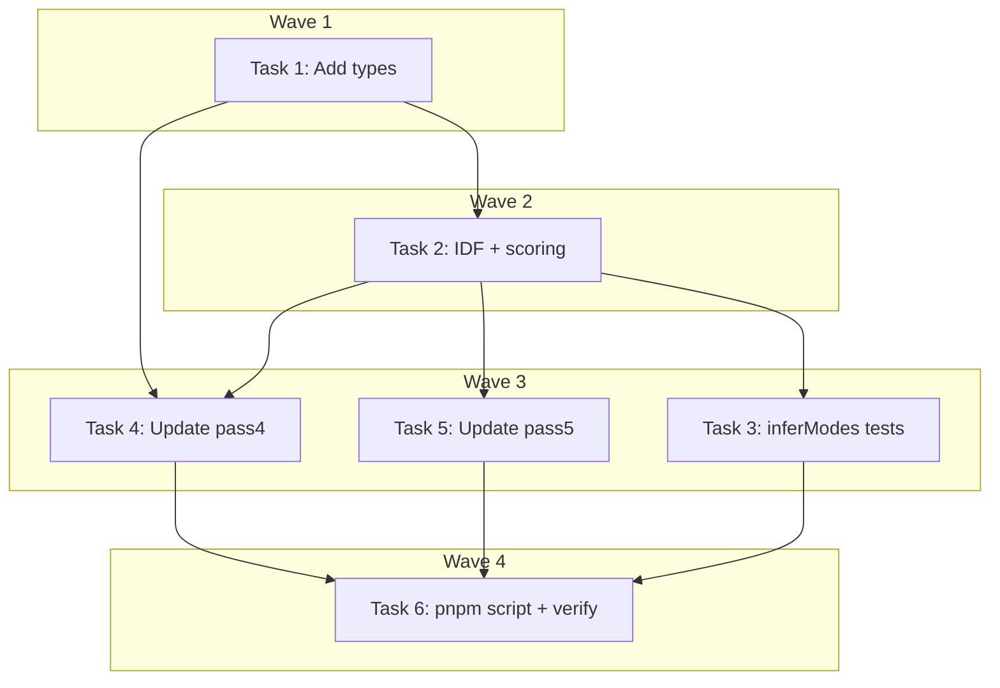

# Enrichment Post-Processor Implementation Plan

> **For Claude:** REQUIRED SUB-SKILL: Use executing-plans to implement this plan task-by-task.

**Design Doc:** [docs/designs/2026-02-23-enrichment-postprocessor-design.md](../designs/2026-02-23-enrichment-postprocessor-design.md)

**Spec References:** SPEC.md §9 (taxonomy is canonical), PRD.md §5 (4 modes: work/rest/social/coffee)

**PRD References:** PRD.md §5 Unfair Advantage (4 distinct modes)

**Goal:** Add a post-processing step (pass3c) that computes tag distinctiveness scores and infers multi-mode from existing enrichment data, then update downstream passes to consume the processed output.

**Architecture:** Pure local computation step between pass3b (Claude enrichment) and pass4 (OpenAI embeddings). Reads `pass3-enriched.json`, computes IDF-based distinctiveness per tag, maps tags to modes, writes `pass3c-processed.json`. Downstream passes (4, 5) are updated to read the processed file and use the new types.

**Tech Stack:** TypeScript (strict, ESM), Vitest (TDD), no external API calls

---

### Task 1: Add processed enrichment types

**Files:**

- Modify: `scripts/prebuild/data-pipeline/types.ts`

No test needed — type-only definitions.

**Step 1: Add ProcessedEnrichmentData and ProcessedShop types**

Add after the existing `EnrichedShop` interface in `types.ts`:

```typescript
// ─── Pass 3c: Post-Processing ─────────────────────────────────

export type ShopMode = 'work' | 'rest' | 'social' | 'coffee';

export interface ProcessedTag {
  id: string;
  confidence: number;
  distinctiveness: number;
}

export interface ProcessedEnrichmentData {
  tags: ProcessedTag[];
  summary: string;
  topReviews: string[];
  modes: ShopMode[];
  enrichedAt: string;
  modelId: string;
}

export interface ProcessedShop extends Pass2Shop {
  enrichment: ProcessedEnrichmentData;
}
```

**Step 2: Commit**

```bash
git add scripts/prebuild/data-pipeline/types.ts
git commit -m "feat(pipeline): add ProcessedShop types for pass3c post-processing"
```

---

### Task 2: Pass 3c — IDF computation and tag distinctiveness

**Files:**

- Create: `scripts/prebuild/data-pipeline/pass3c-postprocess.ts`
- Create: `scripts/prebuild/data-pipeline/pass3c-postprocess.test.ts`

**Step 1: Write the failing tests for IDF and tag scoring**

```typescript
// scripts/prebuild/data-pipeline/pass3c-postprocess.test.ts
import { describe, it, expect } from 'vitest';
import {
  computeTagIdf,
  scoreTagDistinctiveness,
  inferModes,
} from './pass3c-postprocess';
import type { EnrichedShop, EnrichmentData, ShopMode } from './types';

// ─── Fixtures ──────────────────────────────────────────────────

function makeEnrichment(
  tagIds: string[],
  mode: EnrichmentData['mode'] = 'mixed'
): EnrichmentData {
  return {
    tags: tagIds.map((id) => ({ id, confidence: 0.8 })),
    summary: 'Test summary',
    topReviews: ['Review 1'],
    mode,
    enrichedAt: '2026-02-23T00:00:00Z',
    modelId: 'test-model',
  };
}

// ─── computeTagIdf ─────────────────────────────────────────────

describe('computeTagIdf', () => {
  it('computes higher IDF for rare tags', () => {
    const enrichments: EnrichmentData[] = [
      makeEnrichment(['common', 'rare']),
      makeEnrichment(['common']),
      makeEnrichment(['common']),
      makeEnrichment(['common']),
    ];

    const idf = computeTagIdf(enrichments);
    expect(idf.get('rare')!).toBeGreaterThan(idf.get('common')!);
  });

  it('computes IDF = log(N / df) for each tag', () => {
    const enrichments: EnrichmentData[] = [
      makeEnrichment(['a', 'b']),
      makeEnrichment(['a']),
    ];

    const idf = computeTagIdf(enrichments);
    // 'a' appears in 2/2 shops → log(2/2) = 0
    expect(idf.get('a')).toBeCloseTo(0, 2);
    // 'b' appears in 1/2 shops → log(2/1) ≈ 0.693
    expect(idf.get('b')).toBeCloseTo(Math.log(2), 2);
  });

  it('handles single-shop case without division by zero', () => {
    const enrichments: EnrichmentData[] = [makeEnrichment(['only_tag'])];

    const idf = computeTagIdf(enrichments);
    expect(idf.get('only_tag')).toBeCloseTo(0, 2);
  });
});

// ─── scoreTagDistinctiveness ──────────────────────────────────

describe('scoreTagDistinctiveness', () => {
  it('computes distinctiveness as confidence × idf', () => {
    const tags = [
      { id: 'rare', confidence: 0.9 },
      { id: 'common', confidence: 0.9 },
    ];
    const idf = new Map([
      ['rare', 2.0],
      ['common', 0.1],
    ]);

    const scored = scoreTagDistinctiveness(tags, idf);
    expect(scored[0].id).toBe('rare');
    expect(scored[0].distinctiveness).toBeCloseTo(1.8, 2); // 0.9 × 2.0
    expect(scored[1].id).toBe('common');
    expect(scored[1].distinctiveness).toBeCloseTo(0.09, 2); // 0.9 × 0.1
  });

  it('sorts tags by distinctiveness descending', () => {
    const tags = [
      { id: 'low', confidence: 0.5 },
      { id: 'high', confidence: 0.5 },
    ];
    const idf = new Map([
      ['low', 0.1],
      ['high', 2.0],
    ]);

    const scored = scoreTagDistinctiveness(tags, idf);
    expect(scored[0].id).toBe('high');
    expect(scored[1].id).toBe('low');
  });

  it('handles tags not in IDF map (distinctiveness = 0)', () => {
    const tags = [{ id: 'unknown', confidence: 0.9 }];
    const idf = new Map<string, number>();

    const scored = scoreTagDistinctiveness(tags, idf);
    expect(scored[0].distinctiveness).toBe(0);
  });
});
```

**Step 2: Run test to verify it fails**

Run: `pnpm vitest run scripts/prebuild/data-pipeline/pass3c-postprocess.test.ts`
Expected: FAIL — cannot find module `./pass3c-postprocess`

**Step 3: Write minimal implementation for IDF and scoring**

```typescript
// scripts/prebuild/data-pipeline/pass3c-postprocess.ts
import { readFileSync, writeFileSync, mkdirSync } from 'node:fs';
import type {
  EnrichedShop,
  EnrichmentData,
  ProcessedShop,
  ProcessedTag,
  ShopMode,
} from './types';

// ─── Constants ─────────────────────────────────────────────────

const ENRICHED_FILE = 'data/prebuild/pass3-enriched.json';
const OUTPUT_DIR = 'data/prebuild';
const OUTPUT_FILE = `${OUTPUT_DIR}/pass3c-processed.json`;
const MODE_CONFIDENCE_THRESHOLD = 0.5;

const MODE_SIGNALS: Record<ShopMode, string[]> = {
  work: [
    'deep_work',
    'casual_work',
    'laptop_friendly',
    'power_outlets',
    'wifi_available',
    'no_time_limit',
    'late_night_work',
  ],
  rest: [
    'reading',
    'solo_time',
    'slow_morning',
    'healing_therapeutic',
    'quiet',
  ],
  social: [
    'catch_up_friends',
    'small_group',
    'date',
    'lively',
    'community_vibe',
  ],
  coffee: ['specialty_coffee_focused', 'coffee_tasting', 'roastery_onsite'],
};

// ─── Pure Functions (exported for testing) ─────────────────────

/**
 * Compute IDF (inverse document frequency) for each tag across all shops.
 * idf(tag) = log(N / df(tag))
 */
export function computeTagIdf(
  enrichments: EnrichmentData[]
): Map<string, number> {
  const N = enrichments.length;
  const df = new Map<string, number>();

  for (const e of enrichments) {
    for (const tag of e.tags) {
      df.set(tag.id, (df.get(tag.id) ?? 0) + 1);
    }
  }

  const idf = new Map<string, number>();
  for (const [tagId, count] of df) {
    idf.set(tagId, Math.log(N / count));
  }

  return idf;
}

/**
 * Score each tag's distinctiveness as confidence × idf.
 * Returns tags sorted by distinctiveness descending.
 */
export function scoreTagDistinctiveness(
  tags: Array<{ id: string; confidence: number }>,
  idf: Map<string, number>
): ProcessedTag[] {
  const scored = tags.map((t) => ({
    id: t.id,
    confidence: t.confidence,
    distinctiveness: t.confidence * (idf.get(t.id) ?? 0),
  }));

  scored.sort((a, b) => b.distinctiveness - a.distinctiveness);
  return scored;
}

/**
 * Infer modes from a shop's tags using the MODE_SIGNALS mapping.
 * A mode qualifies if the shop has at least one signal tag with confidence >= threshold.
 * Falls back to the original single mode if no signals match.
 */
export function inferModes(
  tags: Array<{ id: string; confidence: number }>,
  originalMode: EnrichmentData['mode'],
  threshold: number = MODE_CONFIDENCE_THRESHOLD
): ShopMode[] {
  const tagMap = new Map(tags.map((t) => [t.id, t.confidence]));
  const modes: ShopMode[] = [];

  for (const [mode, signals] of Object.entries(MODE_SIGNALS) as [
    ShopMode,
    string[],
  ][]) {
    const hasSignal = signals.some((s) => (tagMap.get(s) ?? 0) >= threshold);
    if (hasSignal) {
      modes.push(mode);
    }
  }

  if (modes.length === 0) {
    // Fallback: convert the original single mode (drop 'mixed')
    const fallback = originalMode === 'mixed' ? 'rest' : originalMode;
    if (fallback !== 'mixed') {
      modes.push(fallback as ShopMode);
    } else {
      modes.push('rest');
    }
  }

  return modes;
}

// ─── CLI Entry Point ───────────────────────────────────────────

async function main() {
  console.log('[pass3c] Reading enriched data...');
  const shops: EnrichedShop[] = JSON.parse(
    readFileSync(ENRICHED_FILE, 'utf-8')
  );
  console.log(`[pass3c] Loaded ${shops.length} shops`);

  // Compute IDF across all shops
  const enrichments = shops.map((s) => s.enrichment);
  const idf = computeTagIdf(enrichments);

  // Process each shop
  const processed: ProcessedShop[] = shops.map((shop) => {
    const scoredTags = scoreTagDistinctiveness(shop.enrichment.tags, idf);
    const modes = inferModes(shop.enrichment.tags, shop.enrichment.mode);

    return {
      ...shop,
      enrichment: {
        tags: scoredTags,
        summary: shop.enrichment.summary,
        topReviews: shop.enrichment.topReviews,
        modes,
        enrichedAt: shop.enrichment.enrichedAt,
        modelId: shop.enrichment.modelId,
      },
    };
  });

  mkdirSync(OUTPUT_DIR, { recursive: true });
  writeFileSync(OUTPUT_FILE, JSON.stringify(processed, null, 2));

  // Print stats
  const allTags = processed.flatMap((s) => s.enrichment.tags);
  const avgTags = allTags.length / processed.length;

  const modeCounts: Record<string, number> = {};
  for (const shop of processed) {
    for (const mode of shop.enrichment.modes) {
      modeCounts[mode] = (modeCounts[mode] ?? 0) + 1;
    }
  }

  console.log('\n[pass3c] Post-processing complete:');
  console.log(`  Shops:     ${processed.length}`);
  console.log(`  Avg tags:  ${avgTags.toFixed(1)}`);
  console.log(`  Modes:     ${JSON.stringify(modeCounts)}`);

  // Show top 5 highest-IDF tags
  const sortedIdf = [...idf.entries()].sort((a, b) => b[1] - a[1]);
  console.log('\n  Top 5 most distinctive tags (highest IDF):');
  for (const [tag, score] of sortedIdf.slice(0, 5)) {
    console.log(`    ${tag}: ${score.toFixed(3)}`);
  }

  // Show bottom 5 lowest-IDF tags
  console.log('  Bottom 5 least distinctive tags (lowest IDF):');
  for (const [tag, score] of sortedIdf.slice(-5)) {
    console.log(`    ${tag}: ${score.toFixed(3)}`);
  }

  console.log(`\n  Saved to: ${OUTPUT_FILE}`);
}

const isDirectRun = process.argv[1]?.includes('pass3c-postprocess');
if (isDirectRun) {
  main().catch((err) => {
    console.error('[pass3c] Fatal error:', err);
    process.exit(1);
  });
}
```

**Step 4: Run test to verify it passes**

Run: `pnpm vitest run scripts/prebuild/data-pipeline/pass3c-postprocess.test.ts`
Expected: All 6 tests PASS (3 for computeTagIdf, 3 for scoreTagDistinctiveness)

**Step 5: Commit**

```bash
git add scripts/prebuild/data-pipeline/pass3c-postprocess.ts scripts/prebuild/data-pipeline/pass3c-postprocess.test.ts
git commit -m "feat(pipeline): add pass3c IDF computation and tag distinctiveness scoring"
```

---

### Task 3: Pass 3c — Multi-mode inference

**Files:**

- Modify: `scripts/prebuild/data-pipeline/pass3c-postprocess.test.ts` (add inferModes tests)

**Step 1: Write the failing tests for inferModes**

Add to the existing `pass3c-postprocess.test.ts`:

```typescript
// ─── inferModes ────────────────────────────────────────────────

describe('inferModes', () => {
  it('infers work mode from work signal tags', () => {
    const tags = [
      { id: 'deep_work', confidence: 0.9 },
      { id: 'power_outlets', confidence: 0.8 },
    ];
    const modes = inferModes(tags, 'mixed');
    expect(modes).toContain('work');
  });

  it('infers multiple modes when signals overlap', () => {
    const tags = [
      { id: 'deep_work', confidence: 0.9 },
      { id: 'catch_up_friends', confidence: 0.7 },
      { id: 'specialty_coffee_focused', confidence: 0.8 },
    ];
    const modes = inferModes(tags, 'mixed');
    expect(modes).toContain('work');
    expect(modes).toContain('social');
    expect(modes).toContain('coffee');
  });

  it('ignores signal tags below confidence threshold', () => {
    const tags = [
      { id: 'deep_work', confidence: 0.3 }, // below 0.5 threshold
      { id: 'catch_up_friends', confidence: 0.7 },
    ];
    const modes = inferModes(tags, 'mixed');
    expect(modes).not.toContain('work');
    expect(modes).toContain('social');
  });

  it('falls back to original mode when no signals match', () => {
    const tags = [{ id: 'some_unrelated_tag', confidence: 0.9 }];
    const modes = inferModes(tags, 'social');
    expect(modes).toEqual(['social']);
  });

  it('falls back to rest when original mode is mixed and no signals match', () => {
    const tags = [{ id: 'some_unrelated_tag', confidence: 0.9 }];
    const modes = inferModes(tags, 'mixed');
    expect(modes).toEqual(['rest']);
  });

  it('returns modes in consistent order: work, rest, social, coffee', () => {
    const tags = [
      { id: 'specialty_coffee_focused', confidence: 0.8 },
      { id: 'deep_work', confidence: 0.9 },
      { id: 'quiet', confidence: 0.7 },
      { id: 'catch_up_friends', confidence: 0.6 },
    ];
    const modes = inferModes(tags, 'mixed');
    // Order follows MODE_SIGNALS iteration: work, rest, social, coffee
    expect(modes).toEqual(['work', 'rest', 'social', 'coffee']);
  });
});
```

**Step 2: Run test to verify it passes**

Run: `pnpm vitest run scripts/prebuild/data-pipeline/pass3c-postprocess.test.ts`
Expected: All 12 tests PASS (6 existing + 6 new inferModes tests)

Note: `inferModes` was already implemented in Task 2. This task adds comprehensive test coverage for it.

**Step 3: Commit**

```bash
git add scripts/prebuild/data-pipeline/pass3c-postprocess.test.ts
git commit -m "test(pipeline): add comprehensive inferModes tests for pass3c"
```

---

### Task 4: Update pass4 to read processed data

**Files:**

- Modify: `scripts/prebuild/data-pipeline/pass4-embed.ts`
- Modify: `scripts/prebuild/data-pipeline/pass4-embed.test.ts`

**Step 1: Update the pass4 test to use ProcessedShop type**

Replace the test file's import and fixture to use the new `ProcessedShop` type. Tags now include `distinctiveness` and enrichment uses `modes` (array) instead of `mode` (string):

```typescript
// Replace imports at top:
import { composeEmbeddingText } from './pass4-embed';
import type { ProcessedShop, TaxonomyTag } from './types';

// Replace makeEnrichedShop fixture:
function makeProcessedShop(
  overrides: Partial<ProcessedShop> = {}
): ProcessedShop {
  return {
    cafenomad_id: 'test-id',
    google_place_id: 'test-place',
    match_confidence: 1,
    name: 'Test Cafe 測試咖啡',
    address: '台北市',
    latitude: 25.04,
    longitude: 121.54,
    mrt: '',
    rating: 4.5,
    review_count: 10,
    opening_hours: null,
    phone: null,
    website: null,
    categories: ['咖啡廳'],
    price_range: '$200-400',
    description: null,
    menu_url: null,
    limited_time: 'no',
    socket: 'yes',
    social_url: '',
    reviews: [],
    photos: [],
    enrichment: {
      tags: [
        { id: 'has_outlets', confidence: 0.9, distinctiveness: 1.8 },
        { id: 'quiet', confidence: 0.7, distinctiveness: 0.5 },
      ],
      summary: 'A quiet cafe with outlets perfect for working.',
      topReviews: ['很安靜適合工作', '咖啡很好喝，環境舒適'],
      modes: ['work'],
      enrichedAt: '2026-02-23T00:00:00Z',
      modelId: 'test-model',
    },
    ...overrides,
  };
}

// Update all test calls from makeEnrichedShop() to makeProcessedShop()
// The test assertions remain the same — composeEmbeddingText reads
// .enrichment.tags and .enrichment.summary which have the same shape.
```

Update each `describe` block to use `makeProcessedShop()` instead of `makeEnrichedShop()`. Also update the empty-tags and empty-reviews override tests to use `modes: ['rest']` instead of `mode: 'work'`.

**Step 2: Run test to verify it fails**

Run: `pnpm vitest run scripts/prebuild/data-pipeline/pass4-embed.test.ts`
Expected: FAIL — `composeEmbeddingText` expects `EnrichedShop` but receives `ProcessedShop`

**Step 3: Update pass4-embed.ts to use ProcessedShop**

Changes to `pass4-embed.ts`:

1. Change import from `EnrichedShop` to `ProcessedShop`
2. Change `ENRICHED_FILE` constant from `pass3-enriched.json` to `pass3c-processed.json`
3. Change function signature from `shop: EnrichedShop` to `shop: ProcessedShop`
4. Tags are already sorted by distinctiveness from pass3c, so `composeEmbeddingText` naturally puts distinctive tags first in the embedding text

```typescript
// Line 3: Change import
import type { ProcessedShop, TaxonomyTag, ShopEmbedding } from './types';

// Line 7: Change input file
const ENRICHED_FILE = 'data/prebuild/pass3c-processed.json';

// Line 20: Change function signature
export function composeEmbeddingText(
  shop: ProcessedShop,
  taxonomy: TaxonomyTag[]
): string {

// Line 55: Change type in main()
  const shops: ProcessedShop[] = JSON.parse(
```

**Step 4: Run test to verify it passes**

Run: `pnpm vitest run scripts/prebuild/data-pipeline/pass4-embed.test.ts`
Expected: All 4 tests PASS

**Step 5: Commit**

```bash
git add scripts/prebuild/data-pipeline/pass4-embed.ts scripts/prebuild/data-pipeline/pass4-embed.test.ts
git commit -m "feat(pipeline): update pass4 to read pass3c-processed.json with ProcessedShop type"
```

---

### Task 5: Update pass5 to use multi-mode

**Files:**

- Modify: `scripts/prebuild/data-pipeline/pass5-search-test.ts`

No test changes needed — pass5 tests only cover `computeTaxonomyBoost` and `rankResults`, which work on `shopTags` arrays (unchanged shape: `{ id, confidence }`). The `modes` field is only used in the CLI main function for display, not in the tested pure functions.

**Step 1: Update pass5-search-test.ts input file and enrichment map**

Changes:

1. Change `ENRICHED_FILE` from `pass3-enriched.json` to `pass3c-processed.json`
2. Change the type import from `EnrichedShop` to `ProcessedShop`
3. Update the enrichment map to read `modes` (array) for display in CLI output

```typescript
// Line 4-5: Change import
import type {
  ShopEmbedding,
  ProcessedShop,
  TaxonomyTag,
  SearchQuery,
  SearchTestResult,
} from './types';

// Line 15: Change input file
const ENRICHED_FILE = 'data/prebuild/pass3c-processed.json';

// Line 109-110: Change type in main()
  const enrichedShops: ProcessedShop[] = JSON.parse(

// Line 138 area: Update shopTags extraction (no change needed — tags still have .id and .confidence)
// The enrichmentMap just needs to also carry modes for display:
```

**Step 2: Run existing tests to confirm nothing broke**

Run: `pnpm vitest run scripts/prebuild/data-pipeline/pass5-search-test.test.ts`
Expected: All 6 tests PASS (no test changes needed)

**Step 3: Commit**

```bash
git add scripts/prebuild/data-pipeline/pass5-search-test.ts
git commit -m "feat(pipeline): update pass5 to read pass3c-processed.json"
```

---

### Task 6: Add pnpm script and run full verification

**Files:**

- Modify: `package.json`

No test needed — configuration change, verified by running all tests.

**Step 1: Add pnpm script for pass3c**

Add to the `"scripts"` section in `package.json`, after the `prebuild:pass3b` line:

```json
"prebuild:pass3c": "tsx scripts/prebuild/data-pipeline/pass3c-postprocess.ts",
```

Note: No `--env-file=.env.local` needed — pass3c makes no API calls.

**Step 2: Run all tests to verify nothing is broken**

Run: `pnpm test`
Expected: All tests pass (existing + new pass3c tests)

**Step 3: Run type-check**

Run: `pnpm type-check`
Expected: No type errors

**Step 4: Commit**

```bash
git add package.json
git commit -m "feat(pipeline): add pnpm script for pass3c post-processing"
```

---

## Execution Waves



**Wave 1** (no dependencies):

- Task 1: Add processed enrichment types

**Wave 2** (depends on Wave 1):

- Task 2: Pass 3c — IDF computation and tag distinctiveness ← Task 1

**Wave 3** (parallel — depends on Wave 2):

- Task 3: Pass 3c — inferModes comprehensive tests ← Task 2
- Task 4: Update pass4 to read processed data ← Tasks 1, 2
- Task 5: Update pass5 to use multi-mode ← Task 2

**Wave 4** (depends on all):

- Task 6: Add pnpm script and run full verification

---

## Pipeline Execution Order (after all code is written)

```bash
# Already done:
pnpm prebuild:pass3a     # ✅ taxonomy proposed
# Manual curation         # ✅ taxonomy.json exists
pnpm prebuild:pass3b     # ✅ 29 shops enriched

# NEW — run this:
pnpm prebuild:pass3c     # Post-process: add distinctiveness + multi-mode

# Then continue:
pnpm prebuild:pass4      # Generate embeddings (now reads pass3c output)
pnpm prebuild:pass5      # Run search prototype
```
