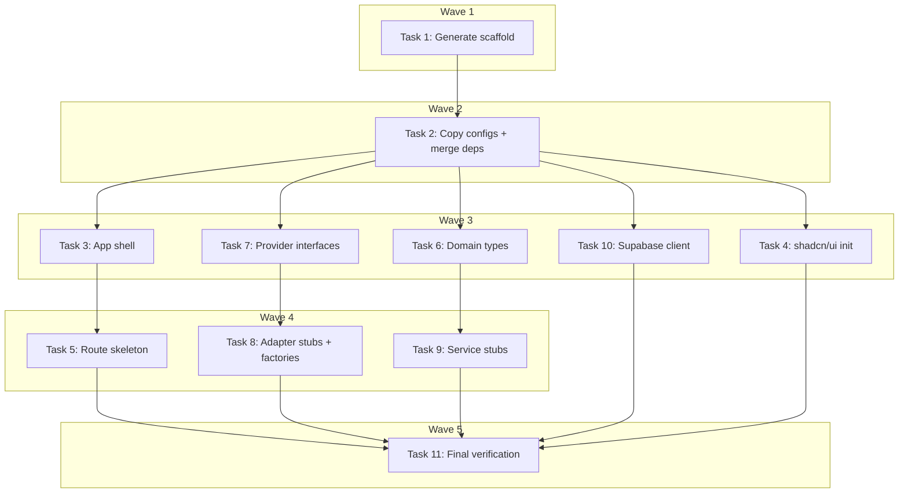

# Phase 1 Section 1 — Project Setup Implementation Plan

> **For Claude:** REQUIRED SUB-SKILL: Use executing-plans to implement this plan task-by-task.

**Design Doc:** [docs/designs/2026-02-23-project-setup-design.md](docs/designs/2026-02-23-project-setup-design.md)

**Spec References:** §1 Tech Stack, §3 Architecture Overview (provider pattern), §7 Dev Environment, §9 Business Rules (provider abstraction rule)

**PRD References:** —

**Goal:** Scaffold the CafeRoam Next.js 15 app with Tailwind v4, shadcn/ui, full route skeleton, and `lib/` architecture stubs so that `pnpm dev` boots a working app and all provider contracts are defined.

**Architecture:** Use `create-next-app` in a temp directory to generate baseline configs (Next.js 15 + Tailwind v4 + ESLint flat config), then copy into the existing repo. Merge dependencies with existing `package.json`. Layer on shadcn/ui, route groups, provider interfaces, service stubs, and domain types.

**Tech Stack:** Next.js 15, React 19, TypeScript (strict), Tailwind CSS v4, shadcn/ui, Vitest, ESLint (flat config), Prettier

---

### Task 1: Generate Next.js 15 Scaffold in Temp Directory

**Files:**
- Create (temp): `/tmp/caferoam-scaffold/` (entire scaffold — we'll cherry-pick from this)
- No test needed — CLI generation step

**Step 1: Generate the scaffold**

```bash
cd /tmp && pnpm create next-app@latest caferoam-scaffold \
  --typescript \
  --tailwind \
  --eslint \
  --app \
  --src-dir=false \
  --import-alias="@/*" \
  --turbopack \
  --yes
```

This generates: `next.config.ts`, `tsconfig.json`, `app/layout.tsx`, `app/page.tsx`, `app/globals.css`, `postcss.config.mjs`, `eslint.config.mjs`, `tailwind.config.ts` (v4 may not generate this — check), `package.json`.

**Step 2: Inspect generated files**

```bash
ls -la /tmp/caferoam-scaffold/
cat /tmp/caferoam-scaffold/package.json
cat /tmp/caferoam-scaffold/tsconfig.json
cat /tmp/caferoam-scaffold/eslint.config.mjs
cat /tmp/caferoam-scaffold/app/globals.css
```

Verify:
- `next@15` and `react@19` are in the generated `package.json`
- `globals.css` uses Tailwind v4 CSS imports (`@import "tailwindcss"`)
- `eslint.config.mjs` uses flat config format

**Step 3: No commit yet** — we'll commit after copying files over.

---

### Task 2: Copy Scaffold Configs and Merge package.json

**Files:**
- Copy from scaffold: `next.config.ts`, `postcss.config.mjs`, `eslint.config.mjs`
- Modify: `package.json` (merge deps)
- Modify: `tsconfig.json` (extend for Next.js)
- Modify: `vitest.config.ts` (expand test includes)
- No test needed — config file wiring

**Step 1: Copy config files from scaffold**

Copy these files from `/tmp/caferoam-scaffold/` into the project root at `/Users/ytchou/Project/caferoam/`:
- `next.config.ts`
- `postcss.config.mjs`

**Step 2: Write `eslint.config.mjs`**

Use the Next.js 15 flat config pattern with TypeScript rules:

```js
import { defineConfig, globalIgnores } from "eslint/config";
import nextVitals from "eslint-config-next/core-web-vitals";
import nextTs from "eslint-config-next/typescript";

const eslintConfig = defineConfig([
  ...nextVitals,
  ...nextTs,
  globalIgnores([".next/**", "out/**", "build/**", "next-env.d.ts"]),
]);

export default eslintConfig;
```

**Step 3: Update `tsconfig.json`**

Replace the current contents with:

```json
{
  "compilerOptions": {
    "target": "ES2022",
    "lib": ["dom", "dom.iterable", "esnext"],
    "allowJs": true,
    "skipLibCheck": true,
    "strict": true,
    "noEmit": true,
    "esModuleInterop": true,
    "module": "esnext",
    "moduleResolution": "bundler",
    "resolveJsonModule": true,
    "isolatedModules": true,
    "jsx": "preserve",
    "incremental": true,
    "forceConsistentCasingInFileNames": true,
    "plugins": [{ "name": "next" }],
    "baseUrl": ".",
    "paths": {
      "@/*": ["./*"]
    }
  },
  "include": [
    "next-env.d.ts",
    "**/*.ts",
    "**/*.tsx",
    ".next/types/**/*.ts"
  ],
  "exclude": ["node_modules", "dist"]
}
```

Key changes from existing:
- Added `lib: ["dom", "dom.iterable", "esnext"]` (browser APIs)
- Added `jsx: "preserve"` (Next.js handles JSX transform)
- Added `plugins: [{ "name": "next" }]`
- Added `noEmit: true`, `allowJs: true`, `incremental: true`
- Expanded `include` to all `.ts/.tsx` + Next.js types
- Removed `outDir`/`rootDir` (Next.js handles build output)

**Step 4: Merge `package.json`**

Keep all existing `scripts`, `dependencies`, `devDependencies`. Add the following:

**dependencies (add):**
- `next` (version from scaffold)
- `react` (version from scaffold)
- `react-dom` (version from scaffold)
- `@supabase/supabase-js` (latest)
- `@supabase/ssr` (latest)

**devDependencies (add):**
- `@types/react` (version from scaffold)
- `@types/react-dom` (version from scaffold)
- `@tailwindcss/postcss` (version from scaffold)
- `tailwindcss` (version from scaffold)
- `eslint` (version from scaffold)
- `eslint-config-next` (version from scaffold)
- `prettier` (latest)
- `prettier-plugin-tailwindcss` (latest)
- `@testing-library/react` (latest)
- `@testing-library/dom` (latest)
- `@testing-library/jest-dom` (latest)
- `jsdom` (latest — needed for Vitest DOM environment)

**scripts (update):**
```json
{
  "dev": "next dev --turbopack",
  "build": "next build",
  "start": "next start",
  "lint": "next lint",
  "format:check": "prettier --check .",
  "type-check": "tsc --noEmit",
  "test": "vitest run",
  "test:watch": "vitest",
  "test:coverage": "vitest run --coverage"
}
```

Keep all `prebuild:*` scripts as-is.

**Step 5: Write `.prettierrc`**

```json
{
  "semi": true,
  "singleQuote": true,
  "trailingComma": "es5",
  "tabWidth": 2,
  "plugins": ["prettier-plugin-tailwindcss"]
}
```

**Step 6: Write `.prettierignore`**

```
.next
node_modules
dist
coverage
pnpm-lock.yaml
data/
```

**Step 7: Update `vitest.config.ts`**

Expand test includes to also cover `lib/` and `app/`:

```ts
import { defineConfig } from 'vitest/config';
import path from 'path';

export default defineConfig({
  test: {
    globals: true,
    include: [
      'scripts/**/*.test.ts',
      'lib/**/*.test.ts',
      'app/**/*.test.ts',
      'app/**/*.test.tsx',
    ],
    environment: 'jsdom',
  },
  resolve: {
    alias: {
      '@': path.resolve(__dirname, '.'),
    },
  },
});
```

**Step 8: Install dependencies**

```bash
pnpm install
```

**Step 9: Verify config wiring**

```bash
pnpm type-check   # Should pass (no app code yet, but config is valid)
pnpm lint          # Should pass
```

**Step 10: Commit**

```bash
git add next.config.ts postcss.config.mjs eslint.config.mjs tsconfig.json \
  package.json pnpm-lock.yaml vitest.config.ts .prettierrc .prettierignore
git commit -m "chore: scaffold Next.js 15 with Tailwind v4, ESLint flat config, Prettier"
```

---

### Task 3: Set Up App Shell (Layout, Landing Page, Globals CSS)

**Files:**
- Create: `app/layout.tsx`
- Create: `app/page.tsx`
- Create: `app/globals.css`
- No test needed — static layout, no business logic

**Step 1: Write `app/globals.css`**

Use the Tailwind v4 CSS-based config. Copy from the scaffold's `globals.css`, which should contain:

```css
@import "tailwindcss";
```

Plus any theme variables the scaffold generates. Adapt as needed — the key requirement is the `@import "tailwindcss"` line (Tailwind v4 pattern).

**Step 2: Write `app/layout.tsx`**

```tsx
import type { Metadata } from 'next';
import { Geist, Geist_Mono } from 'next/font/google';
import './globals.css';

const geistSans = Geist({
  variable: '--font-geist-sans',
  subsets: ['latin'],
});

const geistMono = Geist_Mono({
  variable: '--font-geist-mono',
  subsets: ['latin'],
});

export const metadata: Metadata = {
  title: 'CafeRoam 啡遊',
  description:
    'Discover Taiwan\'s best independent coffee shops with AI-powered semantic search.',
};

export default function RootLayout({
  children,
}: Readonly<{
  children: React.ReactNode;
}>) {
  return (
    <html lang="zh-TW">
      <body
        className={`${geistSans.variable} ${geistMono.variable} antialiased`}
      >
        {children}
      </body>
    </html>
  );
}
```

Key decisions:
- `lang="zh-TW"` — primary audience is Taiwan
- Metadata title uses both English and Chinese
- Fonts: use scaffold defaults (Geist). Can swap later.

**Step 3: Write `app/page.tsx`**

```tsx
export default function HomePage() {
  return (
    <main className="flex min-h-screen flex-col items-center justify-center p-8">
      <h1 className="text-4xl font-bold">CafeRoam 啡遊</h1>
      <p className="mt-4 text-lg text-gray-600">
        Discover Taiwan&apos;s best independent coffee shops.
      </p>
      <p className="mt-2 text-sm text-gray-400">Coming soon.</p>
    </main>
  );
}
```

**Step 4: Verify**

```bash
pnpm dev
```

Open `http://localhost:3000` — should see "CafeRoam 啡遊" heading. Stop the dev server after confirming.

**Step 5: Commit**

```bash
git add app/
git commit -m "feat: add app shell with root layout, landing page, Tailwind v4 globals"
```

---

### Task 4: Initialize shadcn/ui

**Files:**
- Create: `components.json`
- Create: `lib/utils.ts` (cn helper — generated by shadcn init)
- No test needed — CLI setup step

**Step 1: Run shadcn init**

```bash
npx shadcn@latest init -d
```

If the interactive prompt appears, select:
- Style: `new-york`
- Base color: `neutral`
- CSS variables: `yes`

If the CLI auto-detects Tailwind v4 and Next.js 15, it should produce a correct `components.json`.

**Step 2: Verify `components.json`**

Check that the generated file has:
- `"tailwind": { "config": "" ... }` — blank config path (Tailwind v4 pattern)
- `"css": "app/globals.css"` — points to our globals
- `"rsc": true` — React Server Components enabled
- `"aliases"` mapping `@/components`, `@/lib`, etc.

If the `tailwind.config` field is non-blank, set it to `""` manually (Tailwind v4 requires this).

**Step 3: Verify `lib/utils.ts` exists**

shadcn init creates a `cn()` utility using `clsx` + `tailwind-merge`. Verify the file exists and exports `cn`.

**Step 4: Verify shadcn works by adding a test component**

```bash
npx shadcn@latest add button
```

This should create `components/ui/button.tsx`. Verify it type-checks:

```bash
pnpm type-check
```

**Step 5: Commit**

```bash
git add components.json lib/utils.ts components/
git commit -m "chore: initialize shadcn/ui with Tailwind v4 and button component"
```

---

### Task 5: Create Route Group Skeleton

**Files:**
- Create: `app/(auth)/login/page.tsx`
- Create: `app/(auth)/signup/page.tsx`
- Create: `app/(protected)/search/page.tsx`
- Create: `app/(protected)/lists/page.tsx`
- Create: `app/(protected)/profile/page.tsx`
- Create: `app/api/auth/route.ts`
- Create: `app/api/search/route.ts`
- Create: `app/api/shops/route.ts`
- No test needed — placeholder files with no business logic

**Step 1: Create auth route group pages**

`app/(auth)/login/page.tsx`:
```tsx
export default function LoginPage() {
  return (
    <main className="flex min-h-screen flex-col items-center justify-center p-8">
      <h1 className="text-2xl font-bold">Login</h1>
      <p className="mt-2 text-sm text-gray-400">Coming soon.</p>
    </main>
  );
}
```

`app/(auth)/signup/page.tsx`:
```tsx
export default function SignupPage() {
  return (
    <main className="flex min-h-screen flex-col items-center justify-center p-8">
      <h1 className="text-2xl font-bold">Sign Up</h1>
      <p className="mt-2 text-sm text-gray-400">Coming soon.</p>
    </main>
  );
}
```

**Step 2: Create protected route group pages**

`app/(protected)/search/page.tsx`:
```tsx
export default function SearchPage() {
  return (
    <main className="flex min-h-screen flex-col items-center justify-center p-8">
      <h1 className="text-2xl font-bold">Search</h1>
      <p className="mt-2 text-sm text-gray-400">Coming soon.</p>
    </main>
  );
}
```

`app/(protected)/lists/page.tsx`:
```tsx
export default function ListsPage() {
  return (
    <main className="flex min-h-screen flex-col items-center justify-center p-8">
      <h1 className="text-2xl font-bold">My Lists</h1>
      <p className="mt-2 text-sm text-gray-400">Coming soon.</p>
    </main>
  );
}
```

`app/(protected)/profile/page.tsx`:
```tsx
export default function ProfilePage() {
  return (
    <main className="flex min-h-screen flex-col items-center justify-center p-8">
      <h1 className="text-2xl font-bold">Profile</h1>
      <p className="mt-2 text-sm text-gray-400">Coming soon.</p>
    </main>
  );
}
```

**Step 3: Create API route stubs**

`app/api/auth/route.ts`:
```ts
import { NextResponse } from 'next/server';

export async function GET() {
  return NextResponse.json({ status: 'not_implemented' }, { status: 501 });
}

export async function POST() {
  return NextResponse.json({ status: 'not_implemented' }, { status: 501 });
}
```

`app/api/search/route.ts`:
```ts
import { NextResponse } from 'next/server';

export async function GET() {
  return NextResponse.json({ status: 'not_implemented' }, { status: 501 });
}
```

`app/api/shops/route.ts`:
```ts
import { NextResponse } from 'next/server';

export async function GET() {
  return NextResponse.json({ status: 'not_implemented' }, { status: 501 });
}
```

**Step 4: Verify routes are accessible**

```bash
pnpm dev
```

Check in browser:
- `http://localhost:3000/login` — shows "Login"
- `http://localhost:3000/signup` — shows "Sign Up"
- `http://localhost:3000/search` — shows "Search"
- `http://localhost:3000/lists` — shows "My Lists"
- `http://localhost:3000/profile` — shows "Profile"
- `http://localhost:3000/api/auth` — returns `{"status":"not_implemented"}`
- `http://localhost:3000/api/search` — returns `{"status":"not_implemented"}`
- `http://localhost:3000/api/shops` — returns `{"status":"not_implemented"}`

Stop the dev server after confirming.

**Step 5: Commit**

```bash
git add app/
git commit -m "feat: add route group skeleton with placeholder pages and API stubs"
```

---

### Task 6: Create Domain Types

**Files:**
- Create: `lib/types/index.ts`
- Test: `lib/types/index.test.ts`

These are the core domain types that flow through the entire application. Derived from SPEC.md business rules + PRD feature descriptions.

**Step 1: Write the type-checking test**

`lib/types/index.test.ts`:
```ts
import { describe, it, expectTypeOf } from 'vitest';
import type { Shop, User, List, CheckIn, Stamp, TaxonomyTag } from '@/lib/types';

describe('Domain types', () => {
  it('Shop has required fields', () => {
    expectTypeOf<Shop>().toHaveProperty('id');
    expectTypeOf<Shop>().toHaveProperty('name');
    expectTypeOf<Shop>().toHaveProperty('latitude');
    expectTypeOf<Shop>().toHaveProperty('longitude');
    expectTypeOf<Shop>().toHaveProperty('taxonomyTags');
  });

  it('User has required fields', () => {
    expectTypeOf<User>().toHaveProperty('id');
    expectTypeOf<User>().toHaveProperty('email');
    expectTypeOf<User>().toHaveProperty('pdpaConsentAt');
  });

  it('List enforces max 3 via type (cap is API-enforced, type is documentation)', () => {
    expectTypeOf<List>().toHaveProperty('id');
    expectTypeOf<List>().toHaveProperty('userId');
    expectTypeOf<List>().toHaveProperty('name');
    expectTypeOf<List>().toHaveProperty('shopIds');
  });

  it('CheckIn requires at least one photo', () => {
    expectTypeOf<CheckIn>().toHaveProperty('photoUrls');
    expectTypeOf<CheckIn>().toHaveProperty('shopId');
    expectTypeOf<CheckIn>().toHaveProperty('userId');
  });

  it('Stamp has one design per shop', () => {
    expectTypeOf<Stamp>().toHaveProperty('shopId');
    expectTypeOf<Stamp>().toHaveProperty('userId');
    expectTypeOf<Stamp>().toHaveProperty('checkInId');
  });

  it('TaxonomyTag has dimension and label', () => {
    expectTypeOf<TaxonomyTag>().toHaveProperty('id');
    expectTypeOf<TaxonomyTag>().toHaveProperty('dimension');
    expectTypeOf<TaxonomyTag>().toHaveProperty('label');
  });
});
```

**Step 2: Run the test to verify it fails**

```bash
pnpm vitest run lib/types/index.test.ts
```

Expected: FAIL — `@/lib/types` module not found.

**Step 3: Write domain types**

`lib/types/index.ts`:
```ts
// ─── Core Domain Types ──────────────────────────────────────────
// These types represent the application domain model.
// They are NOT database row types — those will be generated by Supabase.
// These are the types that business logic and UI components work with.

export interface Shop {
  id: string;
  name: string;
  address: string;
  latitude: number;
  longitude: number;
  mrt: string | null;
  phone: string | null;
  website: string | null;
  openingHours: string[] | null;
  rating: number | null;
  reviewCount: number;
  priceRange: string | null;
  description: string | null;
  photoUrls: string[];
  menuUrl: string | null;
  taxonomyTags: TaxonomyTag[];
  cafenomadId: string | null;
  googlePlaceId: string | null;
  createdAt: string;
  updatedAt: string;
}

export interface TaxonomyTag {
  id: string;
  dimension: TaxonomyDimension;
  label: string;
  labelZh: string;
}

export type TaxonomyDimension =
  | 'functionality'
  | 'time'
  | 'ambience'
  | 'mode';

export interface User {
  id: string;
  email: string;
  displayName: string | null;
  avatarUrl: string | null;
  pdpaConsentAt: string;
  createdAt: string;
}

export interface List {
  id: string;
  userId: string;
  name: string;
  shopIds: string[];
  createdAt: string;
  updatedAt: string;
}

export interface CheckIn {
  id: string;
  userId: string;
  shopId: string;
  photoUrls: string[];
  menuPhotoUrl: string | null;
  note: string | null;
  createdAt: string;
}

export interface Stamp {
  id: string;
  userId: string;
  shopId: string;
  checkInId: string;
  designUrl: string;
  earnedAt: string;
}

// ─── Search Types ───────────────────────────────────────────────

export interface SearchResult {
  shop: Shop;
  similarityScore: number;
  taxonomyBoost: number;
  totalScore: number;
}

export interface SearchQuery {
  text: string;
  filters?: {
    dimensions?: Partial<Record<TaxonomyDimension, string[]>>;
    nearLatitude?: number;
    nearLongitude?: number;
    radiusKm?: number;
  };
  limit?: number;
}
```

**Step 4: Run the test to verify it passes**

```bash
pnpm vitest run lib/types/index.test.ts
```

Expected: PASS

**Step 5: Commit**

```bash
git add lib/types/
git commit -m "feat: add core domain types (Shop, User, List, CheckIn, Stamp, Taxonomy)"
```

---

### Task 7: Create Provider Interfaces

**Files:**
- Create: `lib/providers/llm/llm.interface.ts`
- Create: `lib/providers/embeddings/embeddings.interface.ts`
- Create: `lib/providers/email/email.interface.ts`
- Create: `lib/providers/maps/maps.interface.ts`
- Create: `lib/providers/analytics/analytics.interface.ts`
- Test: `lib/providers/providers.test.ts`

**Step 1: Write the type-checking test**

`lib/providers/providers.test.ts`:
```ts
import { describe, it, expectTypeOf } from 'vitest';
import type { ILLMProvider } from '@/lib/providers/llm/llm.interface';
import type { IEmbeddingsProvider } from '@/lib/providers/embeddings/embeddings.interface';
import type { IEmailProvider } from '@/lib/providers/email/email.interface';
import type { IMapsProvider } from '@/lib/providers/maps/maps.interface';
import type { IAnalyticsProvider } from '@/lib/providers/analytics/analytics.interface';

describe('Provider interfaces', () => {
  it('ILLMProvider has enrichShop method', () => {
    expectTypeOf<ILLMProvider>().toHaveProperty('enrichShop');
  });

  it('IEmbeddingsProvider has embed method', () => {
    expectTypeOf<IEmbeddingsProvider>().toHaveProperty('embed');
  });

  it('IEmailProvider has send method', () => {
    expectTypeOf<IEmailProvider>().toHaveProperty('send');
  });

  it('IMapsProvider has geocode method', () => {
    expectTypeOf<IMapsProvider>().toHaveProperty('geocode');
  });

  it('IAnalyticsProvider has track method', () => {
    expectTypeOf<IAnalyticsProvider>().toHaveProperty('track');
  });
});
```

**Step 2: Run the test to verify it fails**

```bash
pnpm vitest run lib/providers/providers.test.ts
```

Expected: FAIL — modules not found.

**Step 3: Write provider interfaces**

`lib/providers/llm/llm.interface.ts`:
```ts
import type { TaxonomyTag } from '@/lib/types';

export interface EnrichmentResult {
  tags: TaxonomyTag[];
  summary: string;
  confidence: number;
}

export interface ILLMProvider {
  enrichShop(input: {
    name: string;
    reviews: string[];
    description: string | null;
    categories: string[];
  }): Promise<EnrichmentResult>;
}
```

`lib/providers/embeddings/embeddings.interface.ts`:
```ts
export interface IEmbeddingsProvider {
  embed(text: string): Promise<number[]>;
  embedBatch(texts: string[]): Promise<number[][]>;
  readonly dimensions: number;
  readonly modelId: string;
}
```

`lib/providers/email/email.interface.ts`:
```ts
export interface EmailMessage {
  to: string;
  subject: string;
  html: string;
  from?: string;
}

export interface IEmailProvider {
  send(message: EmailMessage): Promise<{ id: string }>;
}
```

`lib/providers/maps/maps.interface.ts`:
```ts
export interface GeocodingResult {
  latitude: number;
  longitude: number;
  formattedAddress: string;
}

export interface IMapsProvider {
  geocode(address: string): Promise<GeocodingResult | null>;
  reverseGeocode(lat: number, lng: number): Promise<string | null>;
  readonly accessToken: string;
}
```

`lib/providers/analytics/analytics.interface.ts`:
```ts
export interface IAnalyticsProvider {
  track(event: string, properties?: Record<string, unknown>): void;
  identify(userId: string, traits?: Record<string, unknown>): void;
  page(name?: string, properties?: Record<string, unknown>): void;
}
```

**Step 4: Run the test to verify it passes**

```bash
pnpm vitest run lib/providers/providers.test.ts
```

Expected: PASS

**Step 5: Commit**

```bash
git add lib/providers/
git commit -m "feat: add provider interfaces (LLM, Embeddings, Email, Maps, Analytics)"
```

---

### Task 8: Create Provider Adapter Stubs and Factories

**Files:**
- Create: `lib/providers/llm/anthropic.adapter.ts`
- Create: `lib/providers/llm/index.ts`
- Create: `lib/providers/embeddings/openai.adapter.ts`
- Create: `lib/providers/embeddings/index.ts`
- Create: `lib/providers/email/resend.adapter.ts`
- Create: `lib/providers/email/index.ts`
- Create: `lib/providers/maps/mapbox.adapter.ts`
- Create: `lib/providers/maps/index.ts`
- Create: `lib/providers/analytics/posthog.adapter.ts`
- Create: `lib/providers/analytics/index.ts`
- Test: `lib/providers/factories.test.ts`

**Step 1: Write the factory test**

`lib/providers/factories.test.ts`:
```ts
import { describe, it, expect, vi, beforeEach } from 'vitest';

describe('Provider factories', () => {
  beforeEach(() => {
    vi.unstubAllEnvs();
  });

  it('LLM factory throws when provider is unknown', async () => {
    vi.stubEnv('LLM_PROVIDER', 'unknown');
    const { getLLMProvider } = await import('@/lib/providers/llm');
    expect(() => getLLMProvider()).toThrow('Unknown LLM provider: unknown');
  });

  it('LLM factory returns AnthropicAdapter for "anthropic"', async () => {
    vi.stubEnv('LLM_PROVIDER', 'anthropic');
    const { getLLMProvider } = await import('@/lib/providers/llm');
    const provider = getLLMProvider();
    expect(provider).toBeDefined();
  });

  it('Embeddings factory throws when provider is unknown', async () => {
    vi.stubEnv('EMBEDDINGS_PROVIDER', 'unknown');
    const { getEmbeddingsProvider } = await import('@/lib/providers/embeddings');
    expect(() => getEmbeddingsProvider()).toThrow('Unknown embeddings provider: unknown');
  });

  it('Email factory throws when provider is unknown', async () => {
    vi.stubEnv('EMAIL_PROVIDER', 'unknown');
    const { getEmailProvider } = await import('@/lib/providers/email');
    expect(() => getEmailProvider()).toThrow('Unknown email provider: unknown');
  });

  it('Maps factory throws when provider is unknown', async () => {
    vi.stubEnv('MAPS_PROVIDER', 'unknown');
    const { getMapsProvider } = await import('@/lib/providers/maps');
    expect(() => getMapsProvider()).toThrow('Unknown maps provider: unknown');
  });

  it('Analytics factory throws when provider is unknown', async () => {
    vi.stubEnv('ANALYTICS_PROVIDER', 'unknown');
    const { getAnalyticsProvider } = await import('@/lib/providers/analytics');
    expect(() => getAnalyticsProvider()).toThrow('Unknown analytics provider: unknown');
  });
});
```

**Step 2: Run the test to verify it fails**

```bash
pnpm vitest run lib/providers/factories.test.ts
```

Expected: FAIL — modules not found.

**Step 3: Write adapter stubs**

Each adapter implements its interface with `throw new Error("Not implemented")`.

`lib/providers/llm/anthropic.adapter.ts`:
```ts
import type { ILLMProvider, EnrichmentResult } from './llm.interface';

export class AnthropicAdapter implements ILLMProvider {
  async enrichShop(): Promise<EnrichmentResult> {
    throw new Error('Not implemented');
  }
}
```

`lib/providers/embeddings/openai.adapter.ts`:
```ts
import type { IEmbeddingsProvider } from './embeddings.interface';

export class OpenAIEmbeddingsAdapter implements IEmbeddingsProvider {
  readonly dimensions = 1536;
  readonly modelId = 'text-embedding-3-small';

  async embed(): Promise<number[]> {
    throw new Error('Not implemented');
  }

  async embedBatch(): Promise<number[][]> {
    throw new Error('Not implemented');
  }
}
```

`lib/providers/email/resend.adapter.ts`:
```ts
import type { IEmailProvider, EmailMessage } from './email.interface';

export class ResendAdapter implements IEmailProvider {
  async send(_message: EmailMessage): Promise<{ id: string }> {
    throw new Error('Not implemented');
  }
}
```

`lib/providers/maps/mapbox.adapter.ts`:
```ts
import type { IMapsProvider, GeocodingResult } from './maps.interface';

export class MapboxAdapter implements IMapsProvider {
  get accessToken(): string {
    return process.env.NEXT_PUBLIC_MAPBOX_TOKEN ?? '';
  }

  async geocode(): Promise<GeocodingResult | null> {
    throw new Error('Not implemented');
  }

  async reverseGeocode(): Promise<string | null> {
    throw new Error('Not implemented');
  }
}
```

`lib/providers/analytics/posthog.adapter.ts`:
```ts
import type { IAnalyticsProvider } from './analytics.interface';

export class PostHogAdapter implements IAnalyticsProvider {
  track(): void {
    throw new Error('Not implemented');
  }

  identify(): void {
    throw new Error('Not implemented');
  }

  page(): void {
    throw new Error('Not implemented');
  }
}
```

**Step 4: Write factory files**

Each factory reads an env var and returns the matching adapter.

`lib/providers/llm/index.ts`:
```ts
import type { ILLMProvider } from './llm.interface';
import { AnthropicAdapter } from './anthropic.adapter';

export function getLLMProvider(): ILLMProvider {
  const provider = process.env.LLM_PROVIDER ?? 'anthropic';

  switch (provider) {
    case 'anthropic':
      return new AnthropicAdapter();
    default:
      throw new Error(`Unknown LLM provider: ${provider}`);
  }
}

export type { ILLMProvider, EnrichmentResult } from './llm.interface';
```

`lib/providers/embeddings/index.ts`:
```ts
import type { IEmbeddingsProvider } from './embeddings.interface';
import { OpenAIEmbeddingsAdapter } from './openai.adapter';

export function getEmbeddingsProvider(): IEmbeddingsProvider {
  const provider = process.env.EMBEDDINGS_PROVIDER ?? 'openai';

  switch (provider) {
    case 'openai':
      return new OpenAIEmbeddingsAdapter();
    default:
      throw new Error(`Unknown embeddings provider: ${provider}`);
  }
}

export type { IEmbeddingsProvider } from './embeddings.interface';
```

`lib/providers/email/index.ts`:
```ts
import type { IEmailProvider } from './email.interface';
import { ResendAdapter } from './resend.adapter';

export function getEmailProvider(): IEmailProvider {
  const provider = process.env.EMAIL_PROVIDER ?? 'resend';

  switch (provider) {
    case 'resend':
      return new ResendAdapter();
    default:
      throw new Error(`Unknown email provider: ${provider}`);
  }
}

export type { IEmailProvider, EmailMessage } from './email.interface';
```

`lib/providers/maps/index.ts`:
```ts
import type { IMapsProvider } from './maps.interface';
import { MapboxAdapter } from './mapbox.adapter';

export function getMapsProvider(): IMapsProvider {
  const provider = process.env.MAPS_PROVIDER ?? 'mapbox';

  switch (provider) {
    case 'mapbox':
      return new MapboxAdapter();
    default:
      throw new Error(`Unknown maps provider: ${provider}`);
  }
}

export type { IMapsProvider, GeocodingResult } from './maps.interface';
```

`lib/providers/analytics/index.ts`:
```ts
import type { IAnalyticsProvider } from './analytics.interface';
import { PostHogAdapter } from './posthog.adapter';

export function getAnalyticsProvider(): IAnalyticsProvider {
  const provider = process.env.ANALYTICS_PROVIDER ?? 'posthog';

  switch (provider) {
    case 'posthog':
      return new PostHogAdapter();
    default:
      throw new Error(`Unknown analytics provider: ${provider}`);
  }
}

export type { IAnalyticsProvider } from './analytics.interface';
```

**Step 4: Run the test to verify it passes**

```bash
pnpm vitest run lib/providers/factories.test.ts
```

Expected: PASS

**Step 5: Commit**

```bash
git add lib/providers/
git commit -m "feat: add provider adapter stubs and env-based factories"
```

---

### Task 9: Create Service Stubs

**Files:**
- Create: `lib/services/search.service.ts`
- Create: `lib/services/checkin.service.ts`
- Create: `lib/services/lists.service.ts`
- Test: `lib/services/services.test.ts`

**Step 1: Write the type-checking test**

`lib/services/services.test.ts`:
```ts
import { describe, it, expectTypeOf } from 'vitest';
import type { ISearchService } from '@/lib/services/search.service';
import type { ICheckInService } from '@/lib/services/checkin.service';
import type { IListsService } from '@/lib/services/lists.service';

describe('Service interfaces', () => {
  it('ISearchService has search method', () => {
    expectTypeOf<ISearchService>().toHaveProperty('search');
  });

  it('ICheckInService has create method', () => {
    expectTypeOf<ICheckInService>().toHaveProperty('create');
  });

  it('IListsService has getByUser method', () => {
    expectTypeOf<IListsService>().toHaveProperty('getByUser');
  });

  it('IListsService has create method', () => {
    expectTypeOf<IListsService>().toHaveProperty('create');
  });
});
```

**Step 2: Run the test to verify it fails**

```bash
pnpm vitest run lib/services/services.test.ts
```

Expected: FAIL — modules not found.

**Step 3: Write service stubs**

`lib/services/search.service.ts`:
```ts
import type { SearchQuery, SearchResult } from '@/lib/types';

export interface ISearchService {
  search(query: SearchQuery): Promise<SearchResult[]>;
}
```

`lib/services/checkin.service.ts`:
```ts
import type { CheckIn } from '@/lib/types';

export interface CreateCheckInInput {
  shopId: string;
  userId: string;
  photoUrls: string[];
  menuPhotoUrl?: string;
  note?: string;
}

export interface ICheckInService {
  create(input: CreateCheckInInput): Promise<CheckIn>;
  getByUser(userId: string): Promise<CheckIn[]>;
  getByShop(shopId: string): Promise<CheckIn[]>;
}
```

`lib/services/lists.service.ts`:
```ts
import type { List } from '@/lib/types';

export interface CreateListInput {
  userId: string;
  name: string;
}

export interface IListsService {
  getByUser(userId: string): Promise<List[]>;
  create(input: CreateListInput): Promise<List>;
  delete(listId: string, userId: string): Promise<void>;
  addShop(listId: string, shopId: string, userId: string): Promise<void>;
  removeShop(listId: string, shopId: string, userId: string): Promise<void>;
}
```

**Step 4: Run the test to verify it passes**

```bash
pnpm vitest run lib/services/services.test.ts
```

Expected: PASS

**Step 5: Commit**

```bash
git add lib/services/
git commit -m "feat: add service interface stubs (Search, CheckIn, Lists)"
```

---

### Task 10: Create Supabase Client Setup

**Files:**
- Create: `lib/db/supabase.ts`
- No test needed — client factory depends on Supabase being available; tested as part of integration tests later

**Step 1: Write the Supabase client factory**

`lib/db/supabase.ts`:
```ts
import { createBrowserClient, createServerClient } from '@supabase/ssr';

export function createSupabaseBrowserClient() {
  return createBrowserClient(
    process.env.NEXT_PUBLIC_SUPABASE_URL!,
    process.env.NEXT_PUBLIC_SUPABASE_ANON_KEY!
  );
}

export function createSupabaseServerClient(cookieStore: {
  getAll: () => { name: string; value: string }[];
  set: (name: string, value: string, options: Record<string, unknown>) => void;
}) {
  return createServerClient(
    process.env.NEXT_PUBLIC_SUPABASE_URL!,
    process.env.NEXT_PUBLIC_SUPABASE_ANON_KEY!,
    {
      cookies: {
        getAll() {
          return cookieStore.getAll();
        },
        setAll(cookiesToSet) {
          try {
            cookiesToSet.forEach(({ name, value, options }) =>
              cookieStore.set(name, value, options)
            );
          } catch {
            // setAll can be called from Server Components where
            // setting cookies is not possible — this is expected.
          }
        },
      },
    }
  );
}
```

This follows the Supabase SSR pattern for Next.js App Router — separate browser and server clients. The server client accepts a cookie store (from `next/headers`) for session management.

**Step 2: Verify type-check passes**

```bash
pnpm type-check
```

Expected: PASS

**Step 3: Commit**

```bash
git add lib/db/
git commit -m "feat: add Supabase client factory (browser + server)"
```

---

### Task 11: Final Verification

**Files:** None — verification only

**Step 1: Run full test suite**

```bash
pnpm test
```

Expected: ALL PASS (both existing prebuild tests and new lib/ tests)

**Step 2: Run lint + type-check**

```bash
pnpm lint && pnpm type-check
```

Expected: PASS with zero errors

**Step 3: Run production build**

```bash
pnpm build
```

Expected: Build succeeds

**Step 4: Start dev server and verify all routes**

```bash
pnpm dev
```

Check in browser:
- `http://localhost:3000` — Landing page with "CafeRoam 啡遊"
- `http://localhost:3000/login` — Login placeholder
- `http://localhost:3000/signup` — Signup placeholder
- `http://localhost:3000/search` — Search placeholder
- `http://localhost:3000/lists` — Lists placeholder
- `http://localhost:3000/profile` — Profile placeholder
- `http://localhost:3000/api/auth` — `{"status":"not_implemented"}`
- `http://localhost:3000/api/search` — `{"status":"not_implemented"}`
- `http://localhost:3000/api/shops` — `{"status":"not_implemented"}`

Stop the dev server.

**Step 5: Clean up temp scaffold**

```bash
rm -rf /tmp/caferoam-scaffold
```

**Step 6: No commit** — all code is already committed in previous tasks.

---

## Execution Waves



**Wave 1** (sequential — bootstrap):
- Task 1: Generate Next.js scaffold in temp directory

**Wave 2** (sequential — depends on Wave 1):
- Task 2: Copy configs, merge package.json, install deps

**Wave 3** (parallel — all depend on Wave 2 only):
- Task 3: App shell (layout + landing page + globals.css)
- Task 4: shadcn/ui initialization
- Task 6: Domain types
- Task 7: Provider interfaces
- Task 10: Supabase client setup

**Wave 4** (parallel — depend on Wave 3 items):
- Task 5: Route group skeleton ← Task 3
- Task 8: Adapter stubs + factories ← Task 7
- Task 9: Service stubs ← Task 6

**Wave 5** (sequential — depends on all):
- Task 11: Final verification ← Tasks 4, 5, 8, 9, 10
