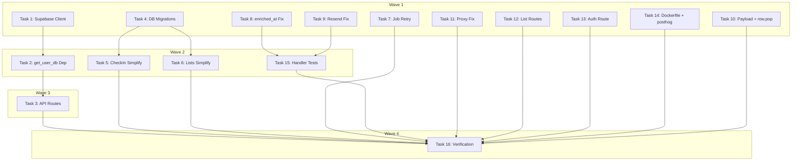

# Code Review Fixes Implementation Plan

> **For Claude:** REQUIRED SUB-SKILL: Use executing-plans to implement this plan task-by-task.

**Design Doc:** [docs/designs/2026-02-24-code-review-fixes-design.md](docs/designs/2026-02-24-code-review-fixes-design.md)

**Spec References:** §Security (RLS), §Business Rules (auth wall, 3-list cap, check-in photo)

**PRD References:** —

**Goal:** Fix 4 Critical + 11 Important + 3 Minor code review findings on the Python backend migration branch.

**Architecture:** Per-request JWT Supabase client for RLS enforcement, DB triggers for atomicity (check-in stamp + list cap), job queue retry with exponential backoff, proxy content-type forwarding.

**Tech Stack:** FastAPI, supabase-py, Postgres triggers, Next.js API routes, pytest

**Important:** All changes target the `feat/python-backend-migration` branch. The working code is in the worktree at `.worktrees/python-backend-migration/`. Use `git -C .worktrees/python-backend-migration/` for git operations, or `cd` into the worktree.

---

### Task 1: Refactor Supabase Client — Per-Request JWT + Service Role

**Files:**

- Modify: `backend/db/supabase_client.py`
- Modify: `backend/tests/db/test_supabase_client.py`

**Step 1: Write the failing tests**

Replace `backend/tests/db/test_supabase_client.py` with:

```python
from unittest.mock import MagicMock, patch

import pytest

from db.supabase_client import (
    get_service_role_client,
    get_user_client,
    reset_clients,
)


class TestGetUserClient:
    def test_creates_client_with_jwt(self):
        with patch("db.supabase_client.create_client") as mock_create:
            mock_create.return_value = MagicMock()
            client = get_user_client("test-jwt-token")
            mock_create.assert_called_once()
            # Verify the JWT is set on the client's auth headers
            assert client is not None

    def test_different_tokens_create_different_clients(self):
        with patch("db.supabase_client.create_client") as mock_create:
            mock_create.side_effect = [MagicMock(), MagicMock()]
            client1 = get_user_client("token-a")
            client2 = get_user_client("token-b")
            assert client1 is not client2


class TestGetServiceRoleClient:
    def test_creates_client_with_service_role_key(self):
        with patch("db.supabase_client.create_client") as mock_create:
            with patch("db.supabase_client.settings") as mock_settings:
                mock_settings.supabase_url = "http://localhost:54321"
                mock_settings.supabase_service_role_key = "test-service-key"
                mock_create.return_value = MagicMock()
                reset_clients()
                client = get_service_role_client()
                assert client is not None

    def test_returns_same_instance_on_repeated_calls(self):
        with patch("db.supabase_client.create_client") as mock_create:
            with patch("db.supabase_client.settings") as mock_settings:
                mock_settings.supabase_url = "http://localhost:54321"
                mock_settings.supabase_service_role_key = "test-service-key"
                mock_create.return_value = MagicMock()
                reset_clients()
                client1 = get_service_role_client()
                client2 = get_service_role_client()
                assert client1 is client2
                mock_create.assert_called_once()


class TestResetClients:
    def test_reset_clears_cached_service_client(self):
        with patch("db.supabase_client.create_client") as mock_create:
            with patch("db.supabase_client.settings") as mock_settings:
                mock_settings.supabase_url = "http://localhost:54321"
                mock_settings.supabase_service_role_key = "test-service-key"
                mock_create.return_value = MagicMock()
                reset_clients()
                get_service_role_client()
                reset_clients()
                get_service_role_client()
                assert mock_create.call_count == 2
```

**Step 2: Run tests to verify they fail**

Run: `cd backend && python -m pytest tests/db/test_supabase_client.py -v`
Expected: FAIL — `get_user_client` and `reset_clients` not found

**Step 3: Implement the Supabase client refactor**

Replace `backend/db/supabase_client.py` with:

```python
from supabase import Client, create_client

from core.config import settings

_service_client: Client | None = None


def get_user_client(token: str) -> Client:
    """Create a Supabase client authenticated with the user's JWT.
    RLS policies use this token for auth.uid()."""
    client = create_client(settings.supabase_url, settings.supabase_anon_key)
    client.auth.set_session(token, token)
    return client


def get_service_role_client() -> Client:
    """Get singleton Supabase client using service role key (bypasses RLS).
    Use only for worker processes and admin operations."""
    global _service_client
    if _service_client is None:
        _service_client = create_client(
            settings.supabase_url, settings.supabase_service_role_key
        )
    return _service_client


def reset_clients() -> None:
    """Reset cached clients. Used in test teardown."""
    global _service_client
    _service_client = None
```

**Step 4: Run tests to verify they pass**

Run: `cd backend && python -m pytest tests/db/test_supabase_client.py -v`
Expected: PASS

**Step 5: Commit**

```bash
git add backend/db/supabase_client.py backend/tests/db/test_supabase_client.py
git commit -m "fix(backend): refactor Supabase client to per-request JWT + service role singleton"
```

---

### Task 2: Add `get_user_db` Dependency to deps.py

**Files:**

- Modify: `backend/api/deps.py`
- Modify: `backend/tests/api/test_auth.py`

**Step 1: Write the failing test**

Add to `backend/tests/api/test_auth.py`:

```python
class TestGetUserDb:
    @pytest.mark.asyncio
    async def test_returns_client_with_jwt(self):
        from api.deps import get_user_db

        mock_request = MagicMock()
        mock_request.headers.get.return_value = "Bearer valid-token"

        with patch("api.deps.get_user_client") as mock_get_client:
            mock_get_client.return_value = MagicMock()
            client = await get_user_db(mock_request)
            mock_get_client.assert_called_once_with("valid-token")
            assert client is not None

    @pytest.mark.asyncio
    async def test_raises_401_without_auth_header(self):
        from api.deps import get_user_db

        mock_request = MagicMock()
        mock_request.headers.get.return_value = None

        with pytest.raises(HTTPException) as exc_info:
            await get_user_db(mock_request)
        assert exc_info.value.status_code == 401
```

**Step 2: Run to verify failure**

Run: `cd backend && python -m pytest tests/api/test_auth.py::TestGetUserDb -v`
Expected: FAIL — `get_user_db` not found

**Step 3: Implement get_user_db**

Replace `backend/api/deps.py` with:

```python
from typing import Any

from fastapi import HTTPException, Request, status
from supabase import Client

from db.supabase_client import get_user_client


async def get_current_user(request: Request) -> dict[str, Any]:
    """Extract and validate JWT from Authorization header. Raises 401 if invalid."""
    token = _extract_token(request)
    try:
        client = get_user_client(token)
        response = client.auth.get_user(token)
        if response is None or response.user is None:
            raise HTTPException(
                status_code=status.HTTP_401_UNAUTHORIZED,
                detail="Invalid or expired token",
            )
        return {"id": response.user.id, "email": response.user.email}
    except HTTPException:
        raise
    except Exception:
        raise HTTPException(
            status_code=status.HTTP_401_UNAUTHORIZED,
            detail="Invalid or expired token",
        ) from None


async def get_optional_user(request: Request) -> dict[str, Any] | None:
    """Same as get_current_user but returns None instead of raising for unauthenticated."""
    auth_header = request.headers.get("Authorization")
    if not auth_header or not auth_header.startswith("Bearer "):
        return None
    try:
        return await get_current_user(request)
    except HTTPException:
        return None


async def get_user_db(request: Request) -> Client:
    """Get a per-request Supabase client authenticated with the user's JWT.
    RLS policies enforce row-level access via auth.uid()."""
    token = _extract_token(request)
    return get_user_client(token)


def _extract_token(request: Request) -> str:
    """Extract Bearer token from Authorization header."""
    auth_header = request.headers.get("Authorization")
    if not auth_header or not auth_header.startswith("Bearer "):
        raise HTTPException(
            status_code=status.HTTP_401_UNAUTHORIZED,
            detail="Missing or invalid Authorization header",
        )
    return auth_header.removeprefix("Bearer ")
```

**Step 4: Run tests**

Run: `cd backend && python -m pytest tests/api/test_auth.py -v`
Expected: PASS

**Step 5: Commit**

```bash
git add backend/api/deps.py backend/tests/api/test_auth.py
git commit -m "fix(backend): add get_user_db dependency for per-request JWT client"
```

---

### Task 3: Update API Routes to Use get_user_db

**Files:**

- Modify: `backend/api/shops.py`
- Modify: `backend/api/search.py`
- Modify: `backend/api/checkins.py`
- Modify: `backend/api/lists.py`
- Modify: `backend/api/stamps.py`

**Step 1: No new test needed** — existing API tests verify behavior. The change is wiring (replacing `get_supabase_client()` calls with `Depends(get_user_db)`). Tests will be updated to match.

**Step 2: Update all API routes**

In each route file, replace `from db.supabase_client import get_supabase_client` with `from api.deps import get_user_db` and change `db = get_supabase_client()` to `db: Client = Depends(get_user_db)` as a function parameter.

For `shops.py` (public routes), use `get_user_client` with an optional token or keep using a minimal client. Since shop listing/detail are public (no auth), they need a client that can read public tables. Use the anon key client for public routes only:

```python
# backend/api/shops.py — public routes use anon key (no RLS needed for public tables)
from supabase import Client, create_client
from core.config import settings

def _get_public_client() -> Client:
    return create_client(settings.supabase_url, settings.supabase_anon_key)
```

For all auth-required routes (`search.py`, `checkins.py`, `lists.py`, `stamps.py`), add `db: Client = Depends(get_user_db)` as a parameter.

**Step 3: Update route tests to mock get_user_db**

Update the FastAPI test client `dependency_overrides` to mock `get_user_db`.

**Step 4: Run all API tests**

Run: `cd backend && python -m pytest tests/api/ -v`
Expected: PASS

**Step 5: Commit**

```bash
git add backend/api/
git commit -m "fix(backend): wire all API routes to per-request JWT Supabase client"
```

---

### Task 4: DB Migrations — Check-In Trigger + List Cap

**Files:**

- Create: `supabase/migrations/YYYYMMDDHHMMSS_checkin_trigger.sql`
- Create: `supabase/migrations/YYYYMMDDHHMMSS_list_cap_trigger.sql`

**Step 1: No test needed** — DB triggers are tested indirectly via service tests and integration tests. The trigger SQL is validated by `supabase db push`.

**Step 2: Create check-in trigger migration**

```sql
-- Check-in trigger: auto-create stamp + queue menu photo enrichment
CREATE OR REPLACE FUNCTION trg_checkin_after_insert()
RETURNS trigger AS $$
BEGIN
  -- Auto-create stamp
  INSERT INTO stamps (user_id, shop_id, check_in_id, stamp_image_url)
  VALUES (NEW.user_id, NEW.shop_id, NEW.id, '/stamps/' || NEW.shop_id || '.svg');

  -- Queue menu photo enrichment if menu photo provided
  IF NEW.menu_photo_url IS NOT NULL THEN
    INSERT INTO job_queue (job_type, payload, status, priority, scheduled_at)
    VALUES (
      'enrich_menu_photo',
      jsonb_build_object('shop_id', NEW.shop_id, 'image_url', NEW.menu_photo_url),
      'pending', 5, now()
    );
  END IF;

  RETURN NEW;
END;
$$ LANGUAGE plpgsql;

CREATE TRIGGER trg_checkin_after_insert
  AFTER INSERT ON check_ins
  FOR EACH ROW
  EXECUTE FUNCTION trg_checkin_after_insert();
```

**Step 3: Create list cap trigger migration**

```sql
-- Enforce max 3 lists per user at the database level
CREATE OR REPLACE FUNCTION enforce_max_lists_per_user()
RETURNS trigger AS $$
DECLARE
  list_count integer;
BEGIN
  SELECT count(*) INTO list_count
  FROM lists WHERE user_id = NEW.user_id;

  IF list_count >= 3 THEN
    RAISE EXCEPTION 'User has reached the maximum of 3 lists'
      USING ERRCODE = 'check_violation';
  END IF;

  RETURN NEW;
END;
$$ LANGUAGE plpgsql;

CREATE TRIGGER trg_enforce_max_lists
  BEFORE INSERT ON lists
  FOR EACH ROW
  EXECUTE FUNCTION enforce_max_lists_per_user();
```

**Step 4: Commit**

```bash
git add supabase/migrations/
git commit -m "feat(db): add check-in trigger (stamp + job) and list cap trigger"
```

---

### Task 5: Simplify CheckInService — Remove Stamp + Job Queue Inserts

**Files:**

- Modify: `backend/services/checkin_service.py`
- Modify: `backend/tests/services/test_checkin_service.py`

**Step 1: Update tests to match new behavior**

The check-in service now only inserts the check-in row. The trigger handles stamp and job queue. Update tests:

```python
class TestCheckInServiceCreate:
    @pytest.mark.asyncio
    async def test_create_inserts_checkin_only(self):
        """Service only inserts check-in row. Stamp and job queue are handled by DB trigger."""
        mock_db = MagicMock()
        mock_db.table.return_value.insert.return_value.execute.return_value = MagicMock(
            data=[{
                "id": "checkin-1",
                "user_id": "user-1",
                "shop_id": "shop-1",
                "photo_urls": ["photo1.jpg"],
                "menu_photo_url": None,
                "note": None,
                "created_at": "2026-01-01T00:00:00",
            }]
        )
        service = CheckInService(db=mock_db)
        result = await service.create(
            user_id="user-1",
            shop_id="shop-1",
            photo_urls=["photo1.jpg"],
        )
        assert result.id == "checkin-1"
        # Verify only check_ins table was called (no stamps, no job_queue)
        mock_db.table.assert_called_once_with("check_ins")

    @pytest.mark.asyncio
    async def test_create_requires_at_least_one_photo(self):
        mock_db = MagicMock()
        service = CheckInService(db=mock_db)
        with pytest.raises(ValueError, match="At least one photo"):
            await service.create(
                user_id="user-1",
                shop_id="shop-1",
                photo_urls=[],
            )
```

**Step 2: Run tests to verify they fail**

Run: `cd backend && python -m pytest tests/services/test_checkin_service.py -v`
Expected: FAIL — the service still inserts into stamps and job_queue tables

**Step 3: Simplify CheckInService**

Replace `backend/services/checkin_service.py`:

```python
from typing import Any, cast

from supabase import Client

from models.types import CheckIn


class CheckInService:
    def __init__(self, db: Client):
        self._db = db

    async def create(
        self,
        user_id: str,
        shop_id: str,
        photo_urls: list[str],
        menu_photo_url: str | None = None,
        note: str | None = None,
    ) -> CheckIn:
        """Create a check-in. Stamp creation and menu photo job queueing
        are handled by the DB trigger trg_checkin_after_insert."""
        if len(photo_urls) < 1:
            raise ValueError("At least one photo is required for check-in")

        checkin_data = {
            "user_id": user_id,
            "shop_id": shop_id,
            "photo_urls": photo_urls,
            "menu_photo_url": menu_photo_url,
            "note": note,
        }
        response = self._db.table("check_ins").insert(checkin_data).execute()
        rows = cast("list[dict[str, Any]]", response.data)
        return CheckIn(**rows[0])

    async def get_by_user(self, user_id: str) -> list[CheckIn]:
        response = (
            self._db.table("check_ins")
            .select("*")
            .eq("user_id", user_id)
            .order("created_at", desc=True)
            .execute()
        )
        rows = cast("list[dict[str, Any]]", response.data)
        return [CheckIn(**row) for row in rows]

    async def get_by_shop(self, shop_id: str) -> list[CheckIn]:
        response = (
            self._db.table("check_ins")
            .select("*")
            .eq("shop_id", shop_id)
            .order("created_at", desc=True)
            .execute()
        )
        rows = cast("list[dict[str, Any]]", response.data)
        return [CheckIn(**row) for row in rows]
```

**Step 4: Run tests**

Run: `cd backend && python -m pytest tests/services/test_checkin_service.py -v`
Expected: PASS

**Step 5: Commit**

```bash
git add backend/services/checkin_service.py backend/tests/services/test_checkin_service.py
git commit -m "fix(backend): simplify CheckInService — stamp + job handled by DB trigger"
```

---

### Task 6: Simplify ListsService — Remove TOCTOU Cap Check

**Files:**

- Modify: `backend/services/lists_service.py`
- Modify: `backend/tests/services/test_lists_service.py`

**Step 1: Update tests**

The 3-list cap is now enforced by the DB trigger. The service should just insert and handle the DB error. Also, `add_shop` and `remove_shop` no longer need `user_id` (RLS handles it).

```python
class TestListsServiceCreate:
    @pytest.mark.asyncio
    async def test_create_inserts_list(self):
        mock_db = MagicMock()
        mock_db.table.return_value.insert.return_value.execute.return_value = MagicMock(
            data=[{"id": "list-1", "user_id": "user-1", "name": "My List",
                   "created_at": "2026-01-01T00:00:00", "updated_at": "2026-01-01T00:00:00"}]
        )
        service = ListsService(db=mock_db)
        result = await service.create(user_id="user-1", name="My List")
        assert result.id == "list-1"

    @pytest.mark.asyncio
    async def test_create_raises_on_cap_exceeded(self):
        """DB trigger raises check_violation when user has 3+ lists."""
        from postgrest.exceptions import APIError

        mock_db = MagicMock()
        mock_db.table.return_value.insert.return_value.execute.side_effect = APIError(
            {"message": "User has reached the maximum of 3 lists", "code": "P0001"}
        )
        service = ListsService(db=mock_db)
        with pytest.raises(ValueError, match="maximum"):
            await service.create(user_id="user-1", name="Fourth List")


class TestListsServiceAddRemoveShop:
    @pytest.mark.asyncio
    async def test_add_shop_no_user_id_param(self):
        mock_db = MagicMock()
        mock_db.table.return_value.insert.return_value.execute.return_value = MagicMock(
            data=[{"list_id": "list-1", "shop_id": "shop-1", "added_at": "2026-01-01T00:00:00"}]
        )
        service = ListsService(db=mock_db)
        result = await service.add_shop(list_id="list-1", shop_id="shop-1")
        assert result.shop_id == "shop-1"

    @pytest.mark.asyncio
    async def test_remove_shop_no_user_id_param(self):
        mock_db = MagicMock()
        mock_db.table.return_value.delete.return_value.eq.return_value.eq.return_value.execute.return_value = MagicMock()
        service = ListsService(db=mock_db)
        await service.remove_shop(list_id="list-1", shop_id="shop-1")
```

**Step 2: Run to verify failure**

Run: `cd backend && python -m pytest tests/services/test_lists_service.py -v`
Expected: FAIL — methods still have `user_id` param, no error handling for DB trigger

**Step 3: Update ListsService**

```python
from typing import Any, cast

from supabase import Client

from models.types import List, ListItem


class ListsService:
    def __init__(self, db: Client):
        self._db = db

    async def get_by_user(self, user_id: str) -> list[List]:
        response = (
            self._db.table("lists")
            .select("*")
            .eq("user_id", user_id)
            .order("created_at", desc=True)
            .execute()
        )
        rows = cast("list[dict[str, Any]]", response.data)
        return [List(**row) for row in rows]

    async def create(self, user_id: str, name: str) -> List:
        """Create a new list. Max 3 per user enforced by DB trigger."""
        try:
            response = (
                self._db.table("lists")
                .insert({"user_id": user_id, "name": name})
                .execute()
            )
        except Exception as e:
            if "maximum" in str(e).lower() or "check_violation" in str(e).lower():
                raise ValueError(
                    "Maximum 3 lists per user. Delete an existing list before creating a new one."
                ) from e
            raise
        rows = cast("list[dict[str, Any]]", response.data)
        return List(**rows[0])

    async def delete(self, list_id: str) -> None:
        """Delete a list. RLS ensures only the owner can delete."""
        self._db.table("list_items").delete().eq("list_id", list_id).execute()
        self._db.table("lists").delete().eq("id", list_id).execute()

    async def add_shop(self, list_id: str, shop_id: str) -> ListItem:
        """Add a shop to a list. RLS ensures only the list owner can add."""
        response = (
            self._db.table("list_items")
            .insert({"list_id": list_id, "shop_id": shop_id})
            .execute()
        )
        rows = cast("list[dict[str, Any]]", response.data)
        return ListItem(**rows[0])

    async def remove_shop(self, list_id: str, shop_id: str) -> None:
        """Remove a shop from a list. RLS ensures only the list owner can remove."""
        (
            self._db.table("list_items")
            .delete()
            .eq("list_id", list_id)
            .eq("shop_id", shop_id)
            .execute()
        )
```

**Step 4: Run tests**

Run: `cd backend && python -m pytest tests/services/test_lists_service.py -v`
Expected: PASS

**Step 5: Update `backend/api/lists.py`** to remove `user_id` from `add_shop`/`remove_shop` calls and `user_id` from `delete` call.

**Step 6: Commit**

```bash
git add backend/services/lists_service.py backend/tests/services/test_lists_service.py backend/api/lists.py
git commit -m "fix(backend): remove TOCTOU list cap — enforce via DB trigger, drop ownership params"
```

---

### Task 7: Fix Job Queue Retry Logic

**Files:**

- Modify: `backend/workers/queue.py`
- Modify: `backend/tests/workers/test_queue.py`

**Step 1: Write failing tests**

Add to `backend/tests/workers/test_queue.py`:

```python
class TestJobQueueFail:
    @pytest.mark.asyncio
    async def test_fail_retries_when_under_max_attempts(self):
        mock_db = MagicMock()
        # First: select to get current job
        mock_db.table.return_value.select.return_value.eq.return_value.single.return_value.execute.return_value = MagicMock(
            data={"id": "job-1", "attempts": 1, "max_attempts": 3}
        )
        # Then: update to set pending
        mock_db.table.return_value.update.return_value.eq.return_value.execute.return_value = MagicMock()

        queue = JobQueue(db=mock_db)
        await queue.fail(job_id="job-1", error="transient error")

        # Verify update was called with PENDING status (retry)
        update_call = mock_db.table.return_value.update.call_args
        assert update_call[0][0]["status"] == "pending"

    @pytest.mark.asyncio
    async def test_fail_permanently_when_at_max_attempts(self):
        mock_db = MagicMock()
        mock_db.table.return_value.select.return_value.eq.return_value.single.return_value.execute.return_value = MagicMock(
            data={"id": "job-1", "attempts": 3, "max_attempts": 3}
        )
        mock_db.table.return_value.update.return_value.eq.return_value.execute.return_value = MagicMock()

        queue = JobQueue(db=mock_db)
        await queue.fail(job_id="job-1", error="permanent error")

        update_call = mock_db.table.return_value.update.call_args
        assert update_call[0][0]["status"] == "failed"
```

**Step 2: Run to verify failure**

Run: `cd backend && python -m pytest tests/workers/test_queue.py::TestJobQueueFail -v`
Expected: FAIL — `fail()` always sets FAILED

**Step 3: Implement retry logic**

Replace `fail()` in `backend/workers/queue.py`:

```python
async def fail(self, job_id: str, error: str) -> None:
    """Mark a job as failed. If under max_attempts, reset to pending for retry
    with exponential backoff."""
    # Fetch current job state
    response = (
        self._db.table("job_queue")
        .select("attempts, max_attempts")
        .eq("id", job_id)
        .single()
        .execute()
    )
    job_data = cast("dict[str, Any]", response.data)
    attempts = job_data["attempts"]
    max_attempts = job_data["max_attempts"]

    if attempts < max_attempts:
        # Retry with exponential backoff: 30s, 60s, 120s, ...
        backoff_seconds = 30 * (2 ** (attempts - 1))
        retry_at = datetime.now(UTC) + timedelta(seconds=backoff_seconds)
        self._db.table("job_queue").update({
            "status": JobStatus.PENDING.value,
            "last_error": error,
            "scheduled_at": retry_at.isoformat(),
        }).eq("id", job_id).execute()
    else:
        # Terminal failure
        self._db.table("job_queue").update({
            "status": JobStatus.FAILED.value,
            "last_error": error,
        }).eq("id", job_id).execute()
```

Add `from datetime import timedelta` to the imports.

**Step 4: Run tests**

Run: `cd backend && python -m pytest tests/workers/test_queue.py -v`
Expected: PASS

**Step 5: Commit**

```bash
git add backend/workers/queue.py backend/tests/workers/test_queue.py
git commit -m "fix(backend): implement job queue retry with exponential backoff"
```

---

### Task 8: Fix enriched_at String Literal

**Files:**

- Modify: `backend/workers/handlers/enrich_shop.py`
- Modify: `backend/tests/workers/test_handlers.py`

**Step 1: Write failing test**

Add assertion to the existing `test_enrich_shop_handler` in `test_handlers.py`:

```python
# After running handle_enrich_shop, verify the update call
update_data = mock_db.table.return_value.update.call_args[0][0]
assert update_data["enriched_at"] != "now()"  # Must not be the string literal
# Verify it's an ISO timestamp string
from datetime import datetime
datetime.fromisoformat(update_data["enriched_at"])  # Should not raise
```

**Step 2: Run to verify failure**

Run: `cd backend && python -m pytest tests/workers/test_handlers.py -v -k enrich_shop`
Expected: FAIL — `enriched_at` is `"now()"`

**Step 3: Fix the handler**

In `backend/workers/handlers/enrich_shop.py`, change line 43:

```python
# Before:
"enriched_at": "now()",

# After:
"enriched_at": datetime.now(UTC).isoformat(),
```

Add `from datetime import UTC, datetime` to imports.

**Step 4: Run tests**

Run: `cd backend && python -m pytest tests/workers/test_handlers.py -v`
Expected: PASS

**Step 5: Commit**

```bash
git add backend/workers/handlers/enrich_shop.py backend/tests/workers/test_handlers.py
git commit -m "fix(backend): use real timestamp for enriched_at instead of string literal"
```

---

### Task 9: Fix Resend Email Adapter (Async + Global State)

**Files:**

- Modify: `backend/providers/email/resend_adapter.py`

**Step 1: No new test needed** — existing tests use mocks. The behavioral change (non-blocking) is not observable in unit tests.

**Step 2: Fix the adapter**

Replace `backend/providers/email/resend_adapter.py`:

```python
import asyncio

import resend as resend_sdk

from models.types import EmailMessage, EmailSendResult


class ResendEmailAdapter:
    def __init__(self, api_key: str, default_from: str):
        self._api_key = api_key
        self._default_from = default_from

    async def send(self, message: EmailMessage) -> EmailSendResult:
        """Send email via Resend. Runs sync SDK in a thread to avoid blocking."""
        api_key = self._api_key
        default_from = self._default_from

        def _send() -> dict:
            resend_sdk.api_key = api_key
            return resend_sdk.Emails.send(
                {
                    "from": message.from_address or default_from,
                    "to": message.to,
                    "subject": message.subject,
                    "html": message.html,
                }
            )

        result = await asyncio.to_thread(_send)
        return EmailSendResult(id=result["id"])
```

**Step 3: Run tests**

Run: `cd backend && python -m pytest tests/ -v -k email or resend`
Expected: PASS

**Step 4: Commit**

```bash
git add backend/providers/email/resend_adapter.py
git commit -m "fix(backend): run Resend SDK in thread to avoid blocking event loop"
```

---

### Task 10: Fix Job.payload Type + Search row.pop

**Files:**

- Modify: `backend/models/types.py`
- Modify: `backend/services/search_service.py`

**Step 1: No test needed** — these are type annotation and data mutation fixes. Existing tests cover behavior.

**Step 2: Fix Job.payload type**

In `backend/models/types.py`, line 169, change:

```python
# Before:
payload: dict[str, str | int | float | bool | None]

# After:
payload: dict[str, Any]
```

Add `from typing import Any` to imports (it may already be there from other models — check).

**Step 3: Fix row.pop in search_service.py**

In `backend/services/search_service.py`, line 36, change:

```python
# Before:
similarity = row.pop("similarity", 0.0)

# After:
similarity = row.get("similarity", 0.0)
```

**Step 4: Run tests**

Run: `cd backend && python -m pytest tests/ -v`
Expected: PASS

**Step 5: Commit**

```bash
git add backend/models/types.py backend/services/search_service.py
git commit -m "fix(backend): widen Job.payload to Any, use row.get instead of row.pop"
```

---

### Task 11: Fix Proxy Content Type

**Files:**

- Modify: `lib/api/proxy.ts`

**Step 1: No test needed** — proxy routes are thin pass-throughs. Integration testing validates them.

**Step 2: Fix proxy.ts**

Replace `lib/api/proxy.ts`:

```typescript
const BACKEND_URL = process.env.BACKEND_INTERNAL_URL || 'http://localhost:8000';

export async function proxyToBackend(
  request: Request,
  path: string
): Promise<Response> {
  const url = new URL(request.url);
  const backendUrl = `${BACKEND_URL}${path}${url.search}`;

  const headers: HeadersInit = {};

  // Forward original content type
  const contentType = request.headers.get('Content-Type');
  if (contentType) {
    headers['Content-Type'] = contentType;
  }

  const authHeader = request.headers.get('Authorization');
  if (authHeader) {
    headers['Authorization'] = authHeader;
  }

  const init: RequestInit = {
    method: request.method,
    headers,
  };

  if (request.method !== 'GET' && request.method !== 'HEAD') {
    init.body = await request.text();
  }

  const res = await fetch(backendUrl, init);

  // Forward backend response headers
  const responseHeaders: HeadersInit = {};
  const resContentType = res.headers.get('Content-Type');
  if (resContentType) {
    responseHeaders['Content-Type'] = resContentType;
  }

  return new Response(res.body, {
    status: res.status,
    headers: responseHeaders,
  });
}
```

**Step 3: Commit**

```bash
git add lib/api/proxy.ts
git commit -m "fix(frontend): forward original content-type in proxy instead of hard-coding JSON"
```

---

### Task 12: Add Missing List Sub-Resource Proxy Routes

**Files:**

- Create: `app/api/lists/[id]/route.ts`
- Create: `app/api/lists/[id]/shops/route.ts`
- Create: `app/api/lists/[id]/shops/[shopId]/route.ts`

**Step 1: No test needed** — thin proxy routes, validated by integration tests.

**Step 2: Create route files**

`app/api/lists/[id]/route.ts`:

```typescript
import { proxyToBackend } from '@/lib/api/proxy';

export async function DELETE(
  request: Request,
  { params }: { params: Promise<{ id: string }> }
) {
  const { id } = await params;
  return proxyToBackend(request, `/lists/${id}`);
}
```

`app/api/lists/[id]/shops/route.ts`:

```typescript
import { proxyToBackend } from '@/lib/api/proxy';

export async function POST(
  request: Request,
  { params }: { params: Promise<{ id: string }> }
) {
  const { id } = await params;
  return proxyToBackend(request, `/lists/${id}/shops`);
}
```

`app/api/lists/[id]/shops/[shopId]/route.ts`:

```typescript
import { proxyToBackend } from '@/lib/api/proxy';

export async function DELETE(
  request: Request,
  { params }: { params: Promise<{ id: string; shopId: string }> }
) {
  const { id, shopId } = await params;
  return proxyToBackend(request, `/lists/${id}/shops/${shopId}`);
}
```

**Step 3: Commit**

```bash
git add app/api/lists/
git commit -m "feat(frontend): add missing list sub-resource proxy routes"
```

---

### Task 13: Add Auth Route (Backend + Frontend)

**Files:**

- Create: `backend/api/auth.py`
- Modify: `backend/main.py`

**Step 1: Write failing test**

Add `backend/tests/api/test_auth_route.py`:

```python
from unittest.mock import MagicMock, patch

from fastapi.testclient import TestClient

from main import app

client = TestClient(app)


class TestAuthCallback:
    def test_auth_callback_endpoint_exists(self):
        """The /auth/callback endpoint should exist (not 404)."""
        response = client.post("/auth/callback", json={"code": "test"})
        # Should not be 404 (endpoint exists)
        assert response.status_code != 404
```

**Step 2: Run to verify failure**

Run: `cd backend && python -m pytest tests/api/test_auth_route.py -v`
Expected: FAIL — 404 (no auth router registered)

**Step 3: Create auth route**

`backend/api/auth.py`:

```python
from typing import Any

from fastapi import APIRouter

router = APIRouter(prefix="/auth", tags=["auth"])


@router.post("/callback")
async def auth_callback(body: dict[str, Any]) -> dict[str, str]:
    """Auth callback handler. Supabase Auth handles the actual authentication;
    this endpoint exists for any server-side post-auth processing."""
    return {"status": "ok"}
```

Add to `backend/main.py`:

```python
from api.auth import router as auth_router
# ... after other router includes:
app.include_router(auth_router)
```

**Step 4: Run tests**

Run: `cd backend && python -m pytest tests/api/test_auth_route.py -v`
Expected: PASS

**Step 5: Commit**

```bash
git add backend/api/auth.py backend/main.py backend/tests/api/test_auth_route.py
git commit -m "feat(backend): add auth callback route and register in main app"
```

---

### Task 14: Fix Dockerfile + Add posthog Dependency

**Files:**

- Modify: `backend/Dockerfile`
- Modify: `backend/pyproject.toml`

**Step 1: No test needed** — build configuration fix.

**Step 2: Fix Dockerfile**

Change the COPY line from:

```dockerfile
COPY pyproject.toml ./
```

To:

```dockerfile
COPY pyproject.toml uv.lock ./
```

**Step 3: Add posthog to pyproject.toml**

Add `"posthog>=3.0"` to the `dependencies` list in `backend/pyproject.toml`.

**Step 4: Run `uv sync` to update lock file**

Run: `cd backend && uv sync`

**Step 5: Commit**

```bash
git add backend/Dockerfile backend/pyproject.toml backend/uv.lock
git commit -m "fix(backend): copy uv.lock in Dockerfile, add posthog dependency"
```

---

### Task 15: Add Missing Handler Tests

**Files:**

- Modify: `backend/tests/workers/test_handlers.py`

**Step 1: Write failing tests**

Add to `backend/tests/workers/test_handlers.py`:

```python
class TestEnrichMenuPhotoHandler:
    @pytest.mark.asyncio
    async def test_extracts_menu_and_updates_shop(self):
        mock_db = MagicMock()
        mock_llm = MagicMock()
        mock_llm.extract_menu.return_value = MenuExtractionResult(
            items=[{"name": "Latte", "price": 150}], raw_text="Latte 150"
        )
        mock_db.table.return_value.update.return_value.eq.return_value.execute.return_value = MagicMock()

        await handle_enrich_menu_photo(
            payload={"shop_id": "shop-1", "image_url": "https://example.com/menu.jpg"},
            db=mock_db,
            llm=mock_llm,
        )

        mock_llm.extract_menu.assert_called_once()
        mock_db.table.assert_called_with("shops")


class TestWeeklyEmailHandler:
    @pytest.mark.asyncio
    async def test_sends_email_to_opted_in_users(self):
        mock_db = MagicMock()
        mock_db.table.return_value.select.return_value.execute.return_value = MagicMock(
            data=[{"email": "user@test.com", "display_name": "Test User"}]
        )
        mock_email = MagicMock()
        mock_email.send.return_value = EmailSendResult(id="email-1")

        await handle_weekly_email(db=mock_db, email=mock_email)

        mock_email.send.assert_called_once()
```

**Step 2: Run to verify tests work**

Run: `cd backend && python -m pytest tests/workers/test_handlers.py -v`
Expected: PASS (add correct imports for handler functions and types)

**Step 3: Commit**

```bash
git add backend/tests/workers/test_handlers.py
git commit -m "test(backend): add missing tests for enrich_menu_photo and weekly_email handlers"
```

---

### Task 16: Final Verification

**Step 1: Run all backend tests**

Run: `cd backend && python -m pytest -v`
Expected: All pass

**Step 2: Run linting**

Run: `cd backend && ruff check . && ruff format --check .`
Expected: Clean

**Step 3: Run type checking**

Run: `cd backend && mypy .`
Expected: Clean (or known pre-existing issues only)

**Step 4: Run frontend tests**

Run: `pnpm test`
Expected: All pass

**Step 5: Run frontend build**

Run: `pnpm build`
Expected: Clean build

**Step 6: Commit any final fixes**

```bash
git commit -m "chore: fix lint/type issues from code review fixes"
```

---

## Execution Waves



**Wave 1** (parallel — no dependencies):

- Task 1: Supabase client refactor (per-request JWT)
- Task 4: DB migrations (check-in trigger + list cap)
- Task 7: Job queue retry logic
- Task 8: enriched_at fix
- Task 9: Resend email adapter fix
- Task 10: Job.payload type + search row.pop
- Task 11: Proxy content type fix
- Task 12: Missing list proxy routes
- Task 13: Auth route
- Task 14: Dockerfile + posthog

**Wave 2** (parallel — depends on Wave 1):

- Task 2: get_user_db dependency ← Task 1
- Task 5: CheckIn service simplification ← Task 4
- Task 6: Lists service simplification ← Task 4
- Task 15: Missing handler tests ← Task 8, Task 9

**Wave 3** (sequential — depends on Wave 2):

- Task 3: API routes wiring ← Task 2

**Wave 4** (sequential — depends on all):

- Task 16: Final verification ← All tasks
