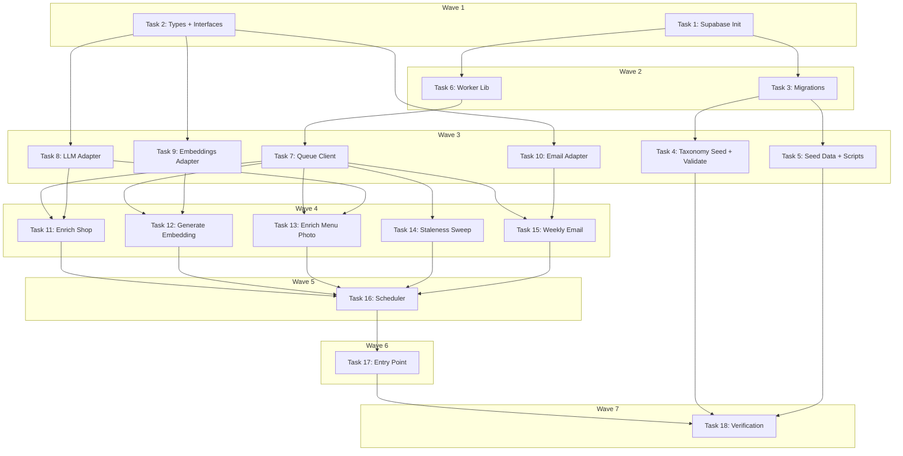

# Database & Infrastructure Implementation Plan

> **For Claude:** REQUIRED SUB-SKILL: Use executing-plans to implement this plan task-by-task.

**Design Doc:** [docs/designs/2026-02-24-db-infrastructure-design.md](docs/designs/2026-02-24-db-infrastructure-design.md)

**Spec References:** §1 Tech Stack, §3 Architecture Overview, §5 Compliance & Security, §7 Dev Environment, §9 Business Rules

**PRD References:** —

**Goal:** Set up Supabase local dev with full schema (11 tables, pgvector, RLS), implement DB-as-queue job system, build Railway background workers with all 5 job handlers, and implement 3 provider adapters (LLM, Embeddings, Email).

**Architecture:** Local Supabase (Postgres 15 + pgvector) running in Docker via Supabase CLI. DB-as-queue pattern using a `job_queue` table with Postgres `FOR UPDATE SKIP LOCKED` for atomic job claiming. Railway persistent worker process with poll loop (30s) + node-cron scheduler. Provider adapters wrap Anthropic SDK (enrichment), OpenAI SDK (embeddings), and Resend SDK (email).

**Tech Stack:** Supabase CLI, pgvector, node-cron, @anthropic-ai/sdk, openai, resend, vitest

---

## Task 1: Supabase CLI Init + Config

**Files:**
- Create: `supabase/config.toml` (generated by `supabase init`)

**Step 1: Initialize Supabase project**

No test needed — infrastructure setup.

Run:
```bash
cd /Users/ytchou/Project/caferoam && supabase init
```

Expected: Creates `supabase/` directory with `config.toml`.

**Step 2: Verify config.toml exists**

Run:
```bash
ls supabase/config.toml
```

Expected: File exists.

**Step 3: Commit**

```bash
git add supabase/
git commit -m "chore: initialize Supabase CLI project"
```

---

## Task 2: Update Domain Types + Provider Interfaces

**Files:**
- Modify: `lib/types/index.ts`
- Modify: `lib/providers/llm/llm.interface.ts`
- Modify: `vitest.config.ts`

No test needed — type-only changes validated by `tsc --noEmit`.

**Step 1: Update TaxonomyDimension to include `coffee`**

In `lib/types/index.ts`, change:
```typescript
export type TaxonomyDimension = 'functionality' | 'time' | 'ambience' | 'mode';
```
to:
```typescript
export type TaxonomyDimension = 'functionality' | 'time' | 'ambience' | 'mode' | 'coffee';
```

**Step 2: Update List interface — replace shopIds with proper typing**

In `lib/types/index.ts`, change the `List` interface:
```typescript
export interface List {
  id: string;
  userId: string;
  name: string;
  shopIds: string[];
  createdAt: string;
  updatedAt: string;
}
```
to:
```typescript
export interface List {
  id: string;
  userId: string;
  name: string;
  createdAt: string;
  updatedAt: string;
}

export interface ListItem {
  listId: string;
  shopId: string;
  addedAt: string;
}
```

**Step 3: Add Shop enrichment-related fields to types**

Add these types to `lib/types/index.ts`:
```typescript
export interface ShopModeScores {
  work: number;
  rest: number;
  social: number;
}

export interface TagScore {
  tagId: string;
  confidence: number;
  distinctiveness?: number;
}

export type JobType =
  | 'enrich_shop'
  | 'enrich_menu_photo'
  | 'generate_embedding'
  | 'staleness_sweep'
  | 'weekly_email';

export type JobStatus = 'pending' | 'processing' | 'completed' | 'failed' | 'dead_letter';

export interface Job {
  id: string;
  jobType: JobType;
  payload: Record<string, unknown>;
  status: JobStatus;
  priority: number;
  attempts: number;
  maxAttempts: number;
  error: string | null;
  lockedBy: string | null;
  lockedAt: string | null;
  scheduledAt: string;
  completedAt: string | null;
  createdAt: string;
}
```

**Step 4: Extend ILLMProvider interface with menu extraction + updated enrichment result**

In `lib/providers/llm/llm.interface.ts`, replace entire contents with:
```typescript
export interface TagScore {
  tagId: string;
  confidence: number;
}

export interface EnrichmentResult {
  tags: TagScore[];
  summary: string;
  modeScores: {
    work: number;
    rest: number;
    social: number;
  };
}

export interface MenuData {
  items: { name: string; price: string | null; category: string | null }[];
  specialties: string[];
}

export interface ILLMProvider {
  enrichShop(input: {
    name: string;
    reviews: string[];
    description: string | null;
    categories: string[];
    taxonomyTagIds: string[];
  }): Promise<EnrichmentResult>;

  extractMenuData(input: {
    imageUrl: string;
    shopName: string;
  }): Promise<MenuData>;
}
```

**Step 5: Update LLM adapter stub to match new interface**

In `lib/providers/llm/anthropic.adapter.ts`, replace entire contents with:
```typescript
import type { ILLMProvider, EnrichmentResult, MenuData } from './llm.interface';

export class AnthropicAdapter implements ILLMProvider {
  async enrichShop(): Promise<EnrichmentResult> {
    throw new Error('Not implemented');
  }

  async extractMenuData(): Promise<MenuData> {
    throw new Error('Not implemented');
  }
}
```

**Step 6: Update LLM factory re-exports**

In `lib/providers/llm/index.ts`, update exports:
```typescript
export type { ILLMProvider, EnrichmentResult, MenuData, TagScore } from './llm.interface';
```

**Step 7: Add workers test path to vitest config**

In `vitest.config.ts`, add `'workers/**/*.test.ts'` to the `include` array:
```typescript
include: [
  'scripts/**/*.test.ts',
  'lib/**/*.test.ts',
  'app/**/*.test.ts',
  'app/**/*.test.tsx',
  'components/**/*.test.tsx',
  'workers/**/*.test.ts',
],
```

**Step 8: Verify types compile**

Run:
```bash
pnpm type-check
```

Expected: `tsc --noEmit` passes with no errors.

**Step 9: Commit**

```bash
git add lib/types/index.ts lib/providers/llm/ vitest.config.ts
git commit -m "feat(types): add coffee dimension, job queue types, extend ILLMProvider"
```

---

## Task 3: Write Schema Migrations

**Files:**
- Create: `supabase/migrations/20260224000001_enable_extensions.sql`
- Create: `supabase/migrations/20260224000002_create_shop_tables.sql`
- Create: `supabase/migrations/20260224000003_create_taxonomy.sql`
- Create: `supabase/migrations/20260224000004_create_user_tables.sql`
- Create: `supabase/migrations/20260224000005_create_job_queue.sql`
- Create: `supabase/migrations/20260224000006_create_indexes.sql`
- Create: `supabase/migrations/20260224000007_create_rls_policies.sql`

No test needed — validated by `supabase db push` in Task 4.

**Step 1: Migration 1 — Enable extensions**

Create `supabase/migrations/20260224000001_enable_extensions.sql`:
```sql
-- Enable pgvector for semantic search embeddings
CREATE EXTENSION IF NOT EXISTS vector WITH SCHEMA extensions;
```

**Step 2: Migration 2 — Shop tables**

Create `supabase/migrations/20260224000002_create_shop_tables.sql`:
```sql
CREATE TABLE shops (
  id              UUID PRIMARY KEY DEFAULT gen_random_uuid(),
  name            TEXT NOT NULL,
  address         TEXT NOT NULL,
  latitude        DOUBLE PRECISION NOT NULL,
  longitude       DOUBLE PRECISION NOT NULL,
  mrt             TEXT,
  phone           TEXT,
  website         TEXT,
  opening_hours   JSONB,
  rating          NUMERIC(2,1),
  review_count    INTEGER NOT NULL DEFAULT 0,
  price_range     TEXT,
  description     TEXT,
  menu_url        TEXT,
  cafenomad_id    TEXT UNIQUE,
  google_place_id TEXT UNIQUE,
  enriched_at     TIMESTAMPTZ,
  enriched_model  TEXT,
  mode_work       NUMERIC(3,2),
  mode_rest       NUMERIC(3,2),
  mode_social     NUMERIC(3,2),
  embedding       vector(1536),
  created_at      TIMESTAMPTZ NOT NULL DEFAULT now(),
  updated_at      TIMESTAMPTZ NOT NULL DEFAULT now()
);

CREATE TABLE shop_photos (
  id         UUID PRIMARY KEY DEFAULT gen_random_uuid(),
  shop_id    UUID NOT NULL REFERENCES shops(id) ON DELETE CASCADE,
  url        TEXT NOT NULL,
  category   TEXT,
  is_menu    BOOLEAN NOT NULL DEFAULT false,
  sort_order INTEGER NOT NULL DEFAULT 0,
  created_at TIMESTAMPTZ NOT NULL DEFAULT now()
);

CREATE TABLE shop_reviews (
  id           UUID PRIMARY KEY DEFAULT gen_random_uuid(),
  shop_id      UUID NOT NULL REFERENCES shops(id) ON DELETE CASCADE,
  text         TEXT NOT NULL,
  stars        SMALLINT CHECK (stars BETWEEN 1 AND 5),
  published_at TEXT,
  language     TEXT,
  created_at   TIMESTAMPTZ NOT NULL DEFAULT now()
);
```

**Step 3: Migration 3 — Taxonomy**

Create `supabase/migrations/20260224000003_create_taxonomy.sql`:
```sql
CREATE TABLE taxonomy_tags (
  id         TEXT PRIMARY KEY,
  dimension  TEXT NOT NULL CHECK (dimension IN
    ('functionality', 'time', 'ambience', 'mode', 'coffee')),
  label      TEXT NOT NULL,
  label_zh   TEXT NOT NULL,
  aliases    TEXT[] DEFAULT '{}',
  created_at TIMESTAMPTZ NOT NULL DEFAULT now()
);

CREATE TABLE shop_tags (
  shop_id         UUID NOT NULL REFERENCES shops(id) ON DELETE CASCADE,
  tag_id          TEXT NOT NULL REFERENCES taxonomy_tags(id) ON DELETE CASCADE,
  confidence      NUMERIC(3,2) NOT NULL,
  distinctiveness NUMERIC(5,4) DEFAULT 0,
  PRIMARY KEY (shop_id, tag_id)
);
```

**Step 4: Migration 4 — User tables**

Create `supabase/migrations/20260224000004_create_user_tables.sql`:
```sql
CREATE TABLE profiles (
  id              UUID PRIMARY KEY REFERENCES auth.users(id) ON DELETE CASCADE,
  display_name    TEXT,
  avatar_url      TEXT,
  pdpa_consent_at TIMESTAMPTZ NOT NULL,
  created_at      TIMESTAMPTZ NOT NULL DEFAULT now(),
  updated_at      TIMESTAMPTZ NOT NULL DEFAULT now()
);

CREATE TABLE lists (
  id         UUID PRIMARY KEY DEFAULT gen_random_uuid(),
  user_id    UUID NOT NULL REFERENCES profiles(id) ON DELETE CASCADE,
  name       TEXT NOT NULL,
  created_at TIMESTAMPTZ NOT NULL DEFAULT now(),
  updated_at TIMESTAMPTZ NOT NULL DEFAULT now()
);

CREATE TABLE list_items (
  list_id  UUID NOT NULL REFERENCES lists(id) ON DELETE CASCADE,
  shop_id  UUID NOT NULL REFERENCES shops(id) ON DELETE CASCADE,
  added_at TIMESTAMPTZ NOT NULL DEFAULT now(),
  PRIMARY KEY (list_id, shop_id)
);

CREATE TABLE check_ins (
  id             UUID PRIMARY KEY DEFAULT gen_random_uuid(),
  user_id        UUID NOT NULL REFERENCES profiles(id) ON DELETE CASCADE,
  shop_id        UUID NOT NULL REFERENCES shops(id) ON DELETE CASCADE,
  photo_urls     TEXT[] NOT NULL CHECK (array_length(photo_urls, 1) >= 1),
  menu_photo_url TEXT,
  note           TEXT,
  created_at     TIMESTAMPTZ NOT NULL DEFAULT now()
);

CREATE TABLE stamps (
  id          UUID PRIMARY KEY DEFAULT gen_random_uuid(),
  user_id     UUID NOT NULL REFERENCES profiles(id) ON DELETE CASCADE,
  shop_id     UUID NOT NULL REFERENCES shops(id) ON DELETE CASCADE,
  check_in_id UUID NOT NULL REFERENCES check_ins(id) ON DELETE CASCADE,
  design_url  TEXT NOT NULL,
  earned_at   TIMESTAMPTZ NOT NULL DEFAULT now()
);
```

**Step 5: Migration 5 — Job queue + trigger**

Create `supabase/migrations/20260224000005_create_job_queue.sql`:
```sql
CREATE TABLE job_queue (
  id           UUID PRIMARY KEY DEFAULT gen_random_uuid(),
  job_type     TEXT NOT NULL CHECK (job_type IN (
    'enrich_shop', 'enrich_menu_photo', 'generate_embedding',
    'staleness_sweep', 'weekly_email'
  )),
  payload      JSONB NOT NULL DEFAULT '{}',
  status       TEXT NOT NULL DEFAULT 'pending' CHECK (status IN (
    'pending', 'processing', 'completed', 'failed', 'dead_letter'
  )),
  priority     SMALLINT NOT NULL DEFAULT 0,
  attempts     SMALLINT NOT NULL DEFAULT 0,
  max_attempts SMALLINT NOT NULL DEFAULT 3,
  error        TEXT,
  locked_by    TEXT,
  locked_at    TIMESTAMPTZ,
  scheduled_at TIMESTAMPTZ NOT NULL DEFAULT now(),
  completed_at TIMESTAMPTZ,
  created_at   TIMESTAMPTZ NOT NULL DEFAULT now()
);

-- Auto-queue enrichment when check-in has menu photo
CREATE OR REPLACE FUNCTION queue_menu_photo_enrichment()
RETURNS TRIGGER AS $$
BEGIN
  IF NEW.menu_photo_url IS NOT NULL THEN
    INSERT INTO job_queue (job_type, payload)
    VALUES (
      'enrich_menu_photo',
      jsonb_build_object('check_in_id', NEW.id, 'shop_id', NEW.shop_id,
                         'menu_photo_url', NEW.menu_photo_url)
    );
  END IF;
  RETURN NEW;
END;
$$ LANGUAGE plpgsql SECURITY DEFINER;

CREATE TRIGGER trg_checkin_menu_photo
  AFTER INSERT ON check_ins
  FOR EACH ROW
  EXECUTE FUNCTION queue_menu_photo_enrichment();
```

**Step 6: Migration 6 — Indexes**

Create `supabase/migrations/20260224000006_create_indexes.sql`:
```sql
-- Geospatial
CREATE INDEX idx_shops_geo ON shops (latitude, longitude);

-- Vector search (HNSW, cosine similarity)
CREATE INDEX idx_shops_embedding ON shops
  USING hnsw (embedding vector_cosine_ops)
  WITH (m = 16, ef_construction = 64);

-- Mode filtering (partial indexes)
CREATE INDEX idx_shops_mode_work ON shops (mode_work) WHERE mode_work IS NOT NULL;
CREATE INDEX idx_shops_mode_rest ON shops (mode_rest) WHERE mode_rest IS NOT NULL;
CREATE INDEX idx_shops_mode_social ON shops (mode_social) WHERE mode_social IS NOT NULL;

-- Tags
CREATE INDEX idx_shop_tags_shop ON shop_tags (shop_id);
CREATE INDEX idx_shop_tags_tag ON shop_tags (tag_id);

-- User data
CREATE INDEX idx_lists_user ON lists (user_id);
CREATE INDEX idx_check_ins_user ON check_ins (user_id, created_at DESC);
CREATE INDEX idx_check_ins_shop ON check_ins (shop_id);
CREATE INDEX idx_stamps_user ON stamps (user_id, earned_at DESC);

-- Photos
CREATE INDEX idx_shop_photos_shop ON shop_photos (shop_id, sort_order);

-- Job queue (worker polling)
CREATE INDEX idx_job_queue_pending
  ON job_queue (priority DESC, scheduled_at ASC)
  WHERE status = 'pending';

CREATE INDEX idx_job_queue_failed
  ON job_queue (created_at DESC)
  WHERE status IN ('failed', 'dead_letter');
```

**Step 7: Migration 7 — RLS policies**

Create `supabase/migrations/20260224000007_create_rls_policies.sql`:
```sql
-- Enable RLS on all tables
ALTER TABLE shops ENABLE ROW LEVEL SECURITY;
ALTER TABLE shop_photos ENABLE ROW LEVEL SECURITY;
ALTER TABLE shop_reviews ENABLE ROW LEVEL SECURITY;
ALTER TABLE taxonomy_tags ENABLE ROW LEVEL SECURITY;
ALTER TABLE shop_tags ENABLE ROW LEVEL SECURITY;
ALTER TABLE profiles ENABLE ROW LEVEL SECURITY;
ALTER TABLE lists ENABLE ROW LEVEL SECURITY;
ALTER TABLE list_items ENABLE ROW LEVEL SECURITY;
ALTER TABLE check_ins ENABLE ROW LEVEL SECURITY;
ALTER TABLE stamps ENABLE ROW LEVEL SECURITY;
ALTER TABLE job_queue ENABLE ROW LEVEL SECURITY;

-- PUBLIC READ: directory browsing without auth
CREATE POLICY "shops_public_read" ON shops FOR SELECT USING (true);
CREATE POLICY "shop_photos_public_read" ON shop_photos FOR SELECT USING (true);
CREATE POLICY "shop_reviews_public_read" ON shop_reviews FOR SELECT USING (true);
CREATE POLICY "taxonomy_tags_public_read" ON taxonomy_tags FOR SELECT USING (true);
CREATE POLICY "shop_tags_public_read" ON shop_tags FOR SELECT USING (true);

-- PROFILES: users own their profile
CREATE POLICY "profiles_own_read" ON profiles FOR SELECT USING (auth.uid() = id);
CREATE POLICY "profiles_own_insert" ON profiles FOR INSERT WITH CHECK (auth.uid() = id);
CREATE POLICY "profiles_own_update" ON profiles FOR UPDATE USING (auth.uid() = id);

-- LISTS: users own their lists
CREATE POLICY "lists_own_read" ON lists FOR SELECT USING (auth.uid() = user_id);
CREATE POLICY "lists_own_insert" ON lists FOR INSERT WITH CHECK (auth.uid() = user_id);
CREATE POLICY "lists_own_update" ON lists FOR UPDATE USING (auth.uid() = user_id);
CREATE POLICY "lists_own_delete" ON lists FOR DELETE USING (auth.uid() = user_id);

-- LIST ITEMS: users manage items in their own lists
CREATE POLICY "list_items_own_read" ON list_items FOR SELECT USING (
  EXISTS (SELECT 1 FROM lists WHERE lists.id = list_items.list_id AND lists.user_id = auth.uid())
);
CREATE POLICY "list_items_own_insert" ON list_items FOR INSERT WITH CHECK (
  EXISTS (SELECT 1 FROM lists WHERE lists.id = list_items.list_id AND lists.user_id = auth.uid())
);
CREATE POLICY "list_items_own_delete" ON list_items FOR DELETE USING (
  EXISTS (SELECT 1 FROM lists WHERE lists.id = list_items.list_id AND lists.user_id = auth.uid())
);

-- CHECK-INS: users own their check-ins
CREATE POLICY "check_ins_own_read" ON check_ins FOR SELECT USING (auth.uid() = user_id);
CREATE POLICY "check_ins_own_insert" ON check_ins FOR INSERT WITH CHECK (auth.uid() = user_id);

-- STAMPS: users read their own stamps (system creates them)
CREATE POLICY "stamps_own_read" ON stamps FOR SELECT USING (auth.uid() = user_id);

-- JOB QUEUE: no client policies (workers use service role key which bypasses RLS)
```

**Step 8: Commit all migrations**

```bash
git add supabase/migrations/
git commit -m "feat(db): add schema migrations for all 11 tables with pgvector, RLS, indexes"
```

---

## Task 4: Taxonomy Seed Migration + Validate Schema

**Files:**
- Create: `scripts/generate-taxonomy-seed.ts`
- Create: `supabase/migrations/20260224000008_seed_taxonomy.sql`

No test needed — validated by `supabase db push`.

**Step 1: Write taxonomy seed generator script**

Create `scripts/generate-taxonomy-seed.ts`:
```typescript
import { readFileSync, writeFileSync } from 'fs';
import { resolve } from 'path';

interface TaxonomyTag {
  id: string;
  dimension: string;
  label: string;
  labelZh: string;
  aliases?: string[];
}

const taxonomyPath = resolve(__dirname, '../data/prebuild/taxonomy.json');
const outputPath = resolve(
  __dirname,
  '../supabase/migrations/20260224000008_seed_taxonomy.sql'
);

const tags: TaxonomyTag[] = JSON.parse(readFileSync(taxonomyPath, 'utf-8'));

const escapeSQL = (s: string): string => s.replace(/'/g, "''");

const lines = tags.map((tag) => {
  const aliases = tag.aliases?.length
    ? `ARRAY[${tag.aliases.map((a) => `'${escapeSQL(a)}'`).join(', ')}]`
    : "'{}'";
  return `  ('${escapeSQL(tag.id)}', '${escapeSQL(tag.dimension)}', '${escapeSQL(tag.label)}', '${escapeSQL(tag.labelZh)}', ${aliases})`;
});

const sql = `-- Seed canonical taxonomy tags from data/prebuild/taxonomy.json
-- Generated by scripts/generate-taxonomy-seed.ts
INSERT INTO taxonomy_tags (id, dimension, label, label_zh, aliases) VALUES
${lines.join(',\n')}
ON CONFLICT (id) DO UPDATE SET
  dimension = EXCLUDED.dimension,
  label = EXCLUDED.label,
  label_zh = EXCLUDED.label_zh,
  aliases = EXCLUDED.aliases;
`;

writeFileSync(outputPath, sql, 'utf-8');
console.log(`Generated seed migration with ${tags.length} tags → ${outputPath}`);
```

**Step 2: Run the generator**

Run:
```bash
pnpm tsx scripts/generate-taxonomy-seed.ts
```

Expected: Outputs `Generated seed migration with N tags → .../20260224000008_seed_taxonomy.sql`

**Step 3: Start local Supabase**

Run:
```bash
supabase start
```

Expected: Docker containers start. Output includes `API URL`, `anon key`, `service_role key`. First run takes ~3 minutes to pull images.

**Step 4: Apply all migrations**

Run:
```bash
supabase db push
```

Expected: All 8 migrations apply successfully with no errors.

**Step 5: Verify tables exist**

Run:
```bash
supabase db lint
```

Expected: No critical errors. Some informational notices are OK.

**Step 6: Commit**

```bash
git add scripts/generate-taxonomy-seed.ts supabase/migrations/20260224000008_seed_taxonomy.sql
git commit -m "feat(db): add taxonomy seed migration (generated from taxonomy.json)"
```

---

## Task 5: Seed Data + Dev Scripts + .env.example

**Files:**
- Create: `supabase/seed.sql`
- Modify: `package.json` (add scripts + dependencies)
- Modify: `.env.example`

No test needed — dev tooling.

**Step 1: Write minimal seed.sql for local dev**

Create `supabase/seed.sql`:
```sql
-- Minimal test data for local development
-- This runs after migrations on `supabase db reset`
-- NOT canonical data — use migrations for that (see 20260224000008_seed_taxonomy.sql)

INSERT INTO shops (id, name, address, latitude, longitude, mrt, rating, review_count, cafenomad_id, description)
VALUES
  ('00000000-0000-0000-0000-000000000001', 'Fika Fika Cafe', '台北市中山區伊通街33號', 25.0527, 121.5335, '松江南京', 4.5, 230, 'test-fika', 'Award-winning Nordic-style cafe known for light roasts and minimalist design.'),
  ('00000000-0000-0000-0000-000000000002', 'Ruins Coffee Roasters', '台北市大同區朝陽路47巷44弄2號', 25.0560, 121.5132, '大橋頭', 4.6, 180, 'test-ruins', 'Industrial ruin-themed roastery with exposed concrete and specialty single origins.'),
  ('00000000-0000-0000-0000-000000000003', 'Simple Kaffa', '台北市大安區敦化南路一段177巷48號', 25.0395, 121.5495, '忠孝敦化', 4.7, 310, 'test-simple', 'World Barista Champion cafe. Exceptional pour-over and espresso in a calm setting.');

-- Link test shops to some taxonomy tags
INSERT INTO shop_tags (shop_id, tag_id, confidence) VALUES
  ('00000000-0000-0000-0000-000000000001', 'wifi_available', 0.95),
  ('00000000-0000-0000-0000-000000000001', 'laptop_friendly', 0.90),
  ('00000000-0000-0000-0000-000000000001', 'deep_work', 0.85),
  ('00000000-0000-0000-0000-000000000002', 'photogenic', 0.95),
  ('00000000-0000-0000-0000-000000000002', 'specialty_coffee_focused', 0.92),
  ('00000000-0000-0000-0000-000000000002', 'solo_time', 0.80),
  ('00000000-0000-0000-0000-000000000003', 'pour_over', 0.98),
  ('00000000-0000-0000-0000-000000000003', 'quiet', 0.88),
  ('00000000-0000-0000-0000-000000000003', 'coffee_tasting', 0.90);
```

**Step 2: Install new dependencies**

Run:
```bash
pnpm add resend node-cron
pnpm add -D @types/node-cron
```

**Step 3: Add worker pnpm scripts to package.json**

Add these scripts to `package.json`:
```json
"db:seed": "supabase db reset",
"db:push": "supabase db push",
"db:diff": "supabase db diff",
"workers:start": "tsx workers/index.ts",
"workers:dev": "tsx --watch workers/index.ts",
"generate:taxonomy-seed": "tsx scripts/generate-taxonomy-seed.ts"
```

**Step 4: Update .env.example with worker-specific vars**

Add to `.env.example` under the Resend section:
```
EMAIL_FROM=hello@caferoam.tw        # From address for all emails

# ─── Workers ───────────────────────────────────────────────────────────────────
WORKER_POLL_INTERVAL_MS=30000       # Job queue poll interval (default: 30s)
WORKER_INSTANCE_ID=worker-local     # Unique ID for job locking
```

**Step 5: Commit**

```bash
git add supabase/seed.sql package.json pnpm-lock.yaml .env.example
git commit -m "feat(db): add seed data, worker scripts, install resend + node-cron"
```

---

## Task 6: Worker Supabase Client + Logger

**Files:**
- Create: `workers/lib/worker-supabase.ts`
- Create: `workers/lib/logger.ts`

No test needed — thin wrappers over Supabase client and console.

**Step 1: Create worker Supabase client (uses service role key)**

Create `workers/lib/worker-supabase.ts`:
```typescript
import { createClient, type SupabaseClient } from '@supabase/supabase-js';

let client: SupabaseClient | null = null;

function requireEnv(name: string): string {
  const value = process.env[name];
  if (!value) throw new Error(`Missing required env var: ${name}`);
  return value;
}

export function getWorkerSupabase(): SupabaseClient {
  if (!client) {
    client = createClient(
      requireEnv('NEXT_PUBLIC_SUPABASE_URL'),
      requireEnv('SUPABASE_SERVICE_ROLE_KEY')
    );
  }
  return client;
}
```

**Step 2: Create structured logger**

Create `workers/lib/logger.ts`:
```typescript
type LogLevel = 'info' | 'warn' | 'error' | 'debug';

interface LogEntry {
  level: LogLevel;
  message: string;
  timestamp: string;
  [key: string]: unknown;
}

function log(level: LogLevel, message: string, data?: Record<string, unknown>): void {
  const entry: LogEntry = {
    level,
    message,
    timestamp: new Date().toISOString(),
    ...data,
  };
  const output = JSON.stringify(entry);
  if (level === 'error') {
    console.error(output);
  } else if (level === 'warn') {
    console.warn(output);
  } else {
    console.log(output);
  }
}

export const logger = {
  info: (msg: string, data?: Record<string, unknown>) => log('info', msg, data),
  warn: (msg: string, data?: Record<string, unknown>) => log('warn', msg, data),
  error: (msg: string, data?: Record<string, unknown>) => log('error', msg, data),
  debug: (msg: string, data?: Record<string, unknown>) => log('debug', msg, data),
};
```

**Step 3: Commit**

```bash
git add workers/lib/
git commit -m "feat(workers): add Supabase service-role client and structured logger"
```

---

## Task 7: Job Queue Client (TDD)

**Files:**
- Create: `workers/queue.test.ts`
- Create: `workers/queue.ts`

**Step 1: Write the failing tests**

Create `workers/queue.test.ts`:
```typescript
import { describe, it, expect, vi, beforeEach } from 'vitest';
import { JobQueue } from './queue';

// Mock Supabase client
const mockRpc = vi.fn();
const mockFrom = vi.fn();
const mockUpdate = vi.fn();
const mockEq = vi.fn();
const mockInsert = vi.fn();
const mockSelect = vi.fn();
const mockSingle = vi.fn();

const mockSupabase = {
  rpc: mockRpc,
  from: mockFrom,
} as any;

vi.mock('./lib/worker-supabase', () => ({
  getWorkerSupabase: () => mockSupabase,
}));

describe('JobQueue', () => {
  let queue: JobQueue;

  beforeEach(() => {
    vi.clearAllMocks();
    queue = new JobQueue('test-worker-1');

    // Default chain for from().update().eq().select().single()
    mockSingle.mockResolvedValue({ data: null, error: null });
    mockSelect.mockReturnValue({ single: mockSingle });
    mockEq.mockReturnValue({ select: mockSelect });
    mockUpdate.mockReturnValue({ eq: mockEq });
    mockInsert.mockResolvedValue({ data: null, error: null });
    mockFrom.mockReturnValue({
      update: mockUpdate,
      insert: mockInsert,
    });
  });

  describe('claim', () => {
    it('returns null when no pending jobs', async () => {
      mockRpc.mockResolvedValue({ data: null, error: null });
      const job = await queue.claim();
      expect(job).toBeNull();
    });

    it('returns a job when one is pending', async () => {
      const fakeJob = {
        id: 'job-1',
        job_type: 'enrich_shop',
        payload: { shop_id: 'shop-1' },
        status: 'processing',
        attempts: 1,
      };
      mockRpc.mockResolvedValue({ data: fakeJob, error: null });

      const job = await queue.claim();
      expect(job).toEqual(fakeJob);
      expect(mockRpc).toHaveBeenCalledWith('claim_job', { worker_id: 'test-worker-1' });
    });
  });

  describe('complete', () => {
    it('marks job as completed', async () => {
      await queue.complete('job-1');
      expect(mockFrom).toHaveBeenCalledWith('job_queue');
      expect(mockUpdate).toHaveBeenCalledWith(
        expect.objectContaining({ status: 'completed' })
      );
    });
  });

  describe('fail', () => {
    it('marks job as failed with error message', async () => {
      await queue.fail('job-1', 'Something broke');
      expect(mockFrom).toHaveBeenCalledWith('job_queue');
      expect(mockUpdate).toHaveBeenCalledWith(
        expect.objectContaining({ status: 'failed', error: 'Something broke' })
      );
    });
  });

  describe('enqueue', () => {
    it('inserts a new job', async () => {
      await queue.enqueue('enrich_shop', { shop_id: 'shop-1' });
      expect(mockFrom).toHaveBeenCalledWith('job_queue');
      expect(mockInsert).toHaveBeenCalledWith(
        expect.objectContaining({
          job_type: 'enrich_shop',
          payload: { shop_id: 'shop-1' },
          status: 'pending',
        })
      );
    });

    it('accepts optional priority and scheduled_at', async () => {
      const scheduledAt = '2026-03-01T00:00:00Z';
      await queue.enqueue('weekly_email', {}, { priority: 5, scheduledAt });
      expect(mockInsert).toHaveBeenCalledWith(
        expect.objectContaining({
          priority: 5,
          scheduled_at: scheduledAt,
        })
      );
    });
  });
});
```

**Step 2: Run tests to verify they fail**

Run:
```bash
pnpm vitest run workers/queue.test.ts
```

Expected: FAIL — `JobQueue` not found.

**Step 3: Write job queue implementation**

Create `workers/queue.ts`:
```typescript
import { getWorkerSupabase } from './lib/worker-supabase';
import { logger } from './lib/logger';

export interface QueuedJob {
  id: string;
  job_type: string;
  payload: Record<string, unknown>;
  status: string;
  priority: number;
  attempts: number;
  max_attempts: number;
  error: string | null;
  locked_by: string | null;
  scheduled_at: string;
  created_at: string;
}

export class JobQueue {
  constructor(private workerId: string) {}

  async claim(): Promise<QueuedJob | null> {
    const supabase = getWorkerSupabase();
    const { data, error } = await supabase.rpc('claim_job', {
      worker_id: this.workerId,
    });

    if (error) {
      logger.error('Failed to claim job', { error: error.message });
      return null;
    }

    return data ?? null;
  }

  async complete(jobId: string): Promise<void> {
    const supabase = getWorkerSupabase();
    const { error } = await supabase
      .from('job_queue')
      .update({ status: 'completed', completed_at: new Date().toISOString() })
      .eq('id', jobId);

    if (error) {
      logger.error('Failed to complete job', { jobId, error: error.message });
    }
  }

  async fail(jobId: string, errorMessage: string): Promise<void> {
    const supabase = getWorkerSupabase();

    // Check if we should dead-letter
    const { data: job } = await supabase
      .from('job_queue')
      .select('attempts, max_attempts')
      .eq('id', jobId)
      .single();

    const status =
      job && job.attempts >= job.max_attempts ? 'dead_letter' : 'failed';

    const { error } = await supabase
      .from('job_queue')
      .update({ status, error: errorMessage })
      .eq('id', jobId);

    if (error) {
      logger.error('Failed to mark job as failed', { jobId, error: error.message });
    }
  }

  async enqueue(
    jobType: string,
    payload: Record<string, unknown>,
    options?: { priority?: number; scheduledAt?: string }
  ): Promise<void> {
    const supabase = getWorkerSupabase();
    const { error } = await supabase.from('job_queue').insert({
      job_type: jobType,
      payload,
      status: 'pending',
      priority: options?.priority ?? 0,
      scheduled_at: options?.scheduledAt ?? new Date().toISOString(),
    });

    if (error) {
      logger.error('Failed to enqueue job', { jobType, error: error.message });
    }
  }
}
```

**Step 4: Create the `claim_job` Postgres function**

Create `supabase/migrations/20260224000009_create_claim_job_rpc.sql`:
```sql
-- RPC function for atomic job claiming (used by workers via supabase.rpc)
CREATE OR REPLACE FUNCTION claim_job(worker_id TEXT)
RETURNS SETOF job_queue AS $$
  UPDATE job_queue
  SET status = 'processing',
      locked_by = worker_id,
      locked_at = now(),
      attempts = attempts + 1
  WHERE id = (
    SELECT id FROM job_queue
    WHERE status = 'pending' AND scheduled_at <= now()
    ORDER BY priority DESC, scheduled_at ASC
    LIMIT 1
    FOR UPDATE SKIP LOCKED
  )
  RETURNING *;
$$ LANGUAGE sql VOLATILE SECURITY DEFINER;
```

**Step 5: Run tests to verify they pass**

Run:
```bash
pnpm vitest run workers/queue.test.ts
```

Expected: All tests PASS.

**Step 6: Commit**

```bash
git add workers/queue.ts workers/queue.test.ts supabase/migrations/20260224000009_create_claim_job_rpc.sql
git commit -m "feat(workers): implement job queue client with TDD + claim_job RPC"
```

---

## Task 8: Anthropic LLM Adapter (TDD)

**Files:**
- Create: `lib/providers/llm/anthropic.adapter.test.ts`
- Modify: `lib/providers/llm/anthropic.adapter.ts`

**Step 1: Write failing tests**

Create `lib/providers/llm/anthropic.adapter.test.ts`:
```typescript
import { describe, it, expect, vi, beforeEach } from 'vitest';
import { AnthropicAdapter } from './anthropic.adapter';

// Mock the Anthropic SDK
const mockCreate = vi.fn();
vi.mock('@anthropic-ai/sdk', () => ({
  default: class MockAnthropic {
    messages = { create: mockCreate };
  },
}));

describe('AnthropicAdapter', () => {
  let adapter: AnthropicAdapter;

  beforeEach(() => {
    vi.clearAllMocks();
    process.env.ANTHROPIC_API_KEY = 'test-key';
    adapter = new AnthropicAdapter();
  });

  describe('enrichShop', () => {
    it('calls Claude with shop data and returns structured enrichment', async () => {
      mockCreate.mockResolvedValue({
        content: [
          {
            type: 'tool_use',
            name: 'classify_shop',
            input: {
              tags: [
                { tagId: 'wifi_available', confidence: 0.95 },
                { tagId: 'quiet', confidence: 0.80 },
              ],
              summary: 'A cozy cafe with reliable WiFi.',
              modeScores: { work: 0.85, rest: 0.60, social: 0.40 },
            },
          },
        ],
      });

      const result = await adapter.enrichShop({
        name: 'Test Cafe',
        reviews: ['Great wifi and quiet atmosphere'],
        description: 'A nice cafe',
        categories: ['cafe'],
        taxonomyTagIds: ['wifi_available', 'quiet', 'loud'],
      });

      expect(result.tags).toHaveLength(2);
      expect(result.tags[0]).toEqual({ tagId: 'wifi_available', confidence: 0.95 });
      expect(result.summary).toBe('A cozy cafe with reliable WiFi.');
      expect(result.modeScores.work).toBe(0.85);
      expect(mockCreate).toHaveBeenCalledOnce();
    });
  });

  describe('extractMenuData', () => {
    it('calls Claude with image URL and returns menu items', async () => {
      mockCreate.mockResolvedValue({
        content: [
          {
            type: 'tool_use',
            name: 'extract_menu',
            input: {
              items: [{ name: 'Latte', price: '$150', category: 'coffee' }],
              specialties: ['Single origin pour-over'],
            },
          },
        ],
      });

      const result = await adapter.extractMenuData({
        imageUrl: 'https://example.com/menu.jpg',
        shopName: 'Test Cafe',
      });

      expect(result.items).toHaveLength(1);
      expect(result.items[0].name).toBe('Latte');
      expect(result.specialties).toContain('Single origin pour-over');
    });
  });
});
```

**Step 2: Run tests to verify they fail**

Run:
```bash
pnpm vitest run lib/providers/llm/anthropic.adapter.test.ts
```

Expected: FAIL — adapter methods throw "Not implemented".

**Step 3: Implement the Anthropic adapter**

Replace `lib/providers/llm/anthropic.adapter.ts` with:
```typescript
import Anthropic from '@anthropic-ai/sdk';
import type { ILLMProvider, EnrichmentResult, MenuData, TagScore } from './llm.interface';

const MODEL = 'claude-sonnet-4-6';

export class AnthropicAdapter implements ILLMProvider {
  private client: Anthropic;

  constructor() {
    this.client = new Anthropic();
  }

  async enrichShop(input: {
    name: string;
    reviews: string[];
    description: string | null;
    categories: string[];
    taxonomyTagIds: string[];
  }): Promise<EnrichmentResult> {
    const response = await this.client.messages.create({
      model: MODEL,
      max_tokens: 1024,
      system:
        'You are a coffee shop analyst. Classify the shop against the provided taxonomy tags. ' +
        'Return ONLY tags that clearly apply based on evidence in the reviews and description. ' +
        'Assign confidence 0.0-1.0 based on evidence strength. ' +
        'Write a 1-2 sentence summary in English. ' +
        'Score the shop 0.0-1.0 for each mode: work (productivity), rest (relaxation), social (meeting people).',
      messages: [
        {
          role: 'user',
          content: `Shop: ${input.name}\nDescription: ${input.description ?? 'N/A'}\nCategories: ${input.categories.join(', ')}\n\nReviews:\n${input.reviews.slice(0, 10).join('\n---\n')}\n\nAvailable tags: ${input.taxonomyTagIds.join(', ')}`,
        },
      ],
      tools: [
        {
          name: 'classify_shop',
          description: 'Classify a coffee shop against taxonomy tags',
          input_schema: {
            type: 'object' as const,
            properties: {
              tags: {
                type: 'array',
                items: {
                  type: 'object',
                  properties: {
                    tagId: { type: 'string' },
                    confidence: { type: 'number', minimum: 0, maximum: 1 },
                  },
                  required: ['tagId', 'confidence'],
                },
              },
              summary: { type: 'string' },
              modeScores: {
                type: 'object',
                properties: {
                  work: { type: 'number', minimum: 0, maximum: 1 },
                  rest: { type: 'number', minimum: 0, maximum: 1 },
                  social: { type: 'number', minimum: 0, maximum: 1 },
                },
                required: ['work', 'rest', 'social'],
              },
            },
            required: ['tags', 'summary', 'modeScores'],
          },
        },
      ],
      tool_choice: { type: 'tool', name: 'classify_shop' },
    });

    const toolBlock = response.content.find((b) => b.type === 'tool_use');
    if (!toolBlock || toolBlock.type !== 'tool_use') {
      throw new Error('Claude did not return tool_use block');
    }

    const result = toolBlock.input as {
      tags: TagScore[];
      summary: string;
      modeScores: { work: number; rest: number; social: number };
    };

    // Validate tags against provided taxonomy
    const validTagIds = new Set(input.taxonomyTagIds);
    const validTags = result.tags.filter((t) => validTagIds.has(t.tagId));

    return {
      tags: validTags,
      summary: result.summary,
      modeScores: result.modeScores,
    };
  }

  async extractMenuData(input: {
    imageUrl: string;
    shopName: string;
  }): Promise<MenuData> {
    const response = await this.client.messages.create({
      model: MODEL,
      max_tokens: 1024,
      system:
        'You are a menu data extractor. Extract menu items, prices, and specialties from the image.',
      messages: [
        {
          role: 'user',
          content: [
            {
              type: 'image',
              source: { type: 'url', url: input.imageUrl },
            },
            {
              type: 'text',
              text: `Extract the menu data from this image of ${input.shopName}.`,
            },
          ],
        },
      ],
      tools: [
        {
          name: 'extract_menu',
          description: 'Extract structured menu data from an image',
          input_schema: {
            type: 'object' as const,
            properties: {
              items: {
                type: 'array',
                items: {
                  type: 'object',
                  properties: {
                    name: { type: 'string' },
                    price: { type: 'string' },
                    category: { type: 'string' },
                  },
                  required: ['name'],
                },
              },
              specialties: { type: 'array', items: { type: 'string' } },
            },
            required: ['items', 'specialties'],
          },
        },
      ],
      tool_choice: { type: 'tool', name: 'extract_menu' },
    });

    const toolBlock = response.content.find((b) => b.type === 'tool_use');
    if (!toolBlock || toolBlock.type !== 'tool_use') {
      throw new Error('Claude did not return tool_use block');
    }

    return toolBlock.input as MenuData;
  }
}
```

**Step 4: Run tests to verify they pass**

Run:
```bash
pnpm vitest run lib/providers/llm/anthropic.adapter.test.ts
```

Expected: All tests PASS.

**Step 5: Commit**

```bash
git add lib/providers/llm/anthropic.adapter.ts lib/providers/llm/anthropic.adapter.test.ts
git commit -m "feat(providers): implement Anthropic LLM adapter with TDD"
```

---

## Task 9: OpenAI Embeddings Adapter (TDD)

**Files:**
- Create: `lib/providers/embeddings/openai.adapter.test.ts`
- Modify: `lib/providers/embeddings/openai.adapter.ts`

**Step 1: Write failing tests**

Create `lib/providers/embeddings/openai.adapter.test.ts`:
```typescript
import { describe, it, expect, vi, beforeEach } from 'vitest';
import { OpenAIEmbeddingsAdapter } from './openai.adapter';

const mockCreate = vi.fn();
vi.mock('openai', () => ({
  default: class MockOpenAI {
    embeddings = { create: mockCreate };
  },
}));

describe('OpenAIEmbeddingsAdapter', () => {
  let adapter: OpenAIEmbeddingsAdapter;

  beforeEach(() => {
    vi.clearAllMocks();
    process.env.OPENAI_API_KEY = 'test-key';
    adapter = new OpenAIEmbeddingsAdapter();
  });

  it('has correct dimensions and modelId', () => {
    expect(adapter.dimensions).toBe(1536);
    expect(adapter.modelId).toBe('text-embedding-3-small');
  });

  describe('embed', () => {
    it('returns a single embedding vector', async () => {
      const fakeVector = Array.from({ length: 1536 }, (_, i) => i * 0.001);
      mockCreate.mockResolvedValue({
        data: [{ index: 0, embedding: fakeVector }],
      });

      const result = await adapter.embed('test text');
      expect(result).toHaveLength(1536);
      expect(result[0]).toBeCloseTo(0);
      expect(mockCreate).toHaveBeenCalledWith({
        model: 'text-embedding-3-small',
        input: ['test text'],
      });
    });
  });

  describe('embedBatch', () => {
    it('returns multiple embedding vectors in correct order', async () => {
      const vec1 = Array.from({ length: 1536 }, () => 0.1);
      const vec2 = Array.from({ length: 1536 }, () => 0.2);
      mockCreate.mockResolvedValue({
        data: [
          { index: 0, embedding: vec1 },
          { index: 1, embedding: vec2 },
        ],
      });

      const result = await adapter.embedBatch(['text1', 'text2']);
      expect(result).toHaveLength(2);
      expect(result[0][0]).toBeCloseTo(0.1);
      expect(result[1][0]).toBeCloseTo(0.2);
    });
  });
});
```

**Step 2: Run tests to verify they fail**

Run:
```bash
pnpm vitest run lib/providers/embeddings/openai.adapter.test.ts
```

Expected: FAIL — methods throw "Not implemented".

**Step 3: Implement the OpenAI adapter**

Replace `lib/providers/embeddings/openai.adapter.ts` with:
```typescript
import OpenAI from 'openai';
import type { IEmbeddingsProvider } from './embeddings.interface';

const MODEL = 'text-embedding-3-small';

export class OpenAIEmbeddingsAdapter implements IEmbeddingsProvider {
  readonly dimensions = 1536;
  readonly modelId = MODEL;
  private client: OpenAI;

  constructor() {
    this.client = new OpenAI();
  }

  async embed(text: string): Promise<number[]> {
    const vectors = await this.embedBatch([text]);
    return vectors[0];
  }

  async embedBatch(texts: string[]): Promise<number[][]> {
    const response = await this.client.embeddings.create({
      model: MODEL,
      input: texts,
    });

    // Sort by index to preserve input order
    const sorted = [...response.data].sort((a, b) => a.index - b.index);
    return sorted.map((d) => d.embedding);
  }
}
```

**Step 4: Run tests to verify they pass**

Run:
```bash
pnpm vitest run lib/providers/embeddings/openai.adapter.test.ts
```

Expected: All tests PASS.

**Step 5: Commit**

```bash
git add lib/providers/embeddings/openai.adapter.ts lib/providers/embeddings/openai.adapter.test.ts
git commit -m "feat(providers): implement OpenAI embeddings adapter with TDD"
```

---

## Task 10: Resend Email Adapter (TDD)

**Files:**
- Create: `lib/providers/email/resend.adapter.test.ts`
- Modify: `lib/providers/email/resend.adapter.ts`

**Step 1: Write failing tests**

Create `lib/providers/email/resend.adapter.test.ts`:
```typescript
import { describe, it, expect, vi, beforeEach } from 'vitest';
import { ResendAdapter } from './resend.adapter';

const mockSend = vi.fn();
vi.mock('resend', () => ({
  Resend: class MockResend {
    emails = { send: mockSend };
  },
}));

describe('ResendAdapter', () => {
  let adapter: ResendAdapter;

  beforeEach(() => {
    vi.clearAllMocks();
    process.env.RESEND_API_KEY = 'test-key';
    process.env.EMAIL_FROM = 'test@caferoam.tw';
    adapter = new ResendAdapter();
  });

  describe('send', () => {
    it('sends email via Resend and returns message id', async () => {
      mockSend.mockResolvedValue({ data: { id: 'msg-123' }, error: null });

      const result = await adapter.send({
        to: 'user@example.com',
        subject: 'Weekly coffee picks',
        html: '<h1>Hello</h1>',
      });

      expect(result.id).toBe('msg-123');
      expect(mockSend).toHaveBeenCalledWith({
        from: 'test@caferoam.tw',
        to: 'user@example.com',
        subject: 'Weekly coffee picks',
        html: '<h1>Hello</h1>',
      });
    });

    it('uses custom from address when provided', async () => {
      mockSend.mockResolvedValue({ data: { id: 'msg-456' }, error: null });

      await adapter.send({
        to: 'user@example.com',
        subject: 'Test',
        html: '<p>Test</p>',
        from: 'custom@caferoam.tw',
      });

      expect(mockSend).toHaveBeenCalledWith(
        expect.objectContaining({ from: 'custom@caferoam.tw' })
      );
    });

    it('throws on Resend error', async () => {
      mockSend.mockResolvedValue({ data: null, error: { message: 'Rate limited' } });

      await expect(
        adapter.send({ to: 'user@example.com', subject: 'Test', html: '' })
      ).rejects.toThrow('Rate limited');
    });
  });
});
```

**Step 2: Run tests to verify they fail**

Run:
```bash
pnpm vitest run lib/providers/email/resend.adapter.test.ts
```

Expected: FAIL — method throws "Not implemented".

**Step 3: Implement the Resend adapter**

Replace `lib/providers/email/resend.adapter.ts` with:
```typescript
import { Resend } from 'resend';
import type { IEmailProvider, EmailMessage } from './email.interface';

export class ResendAdapter implements IEmailProvider {
  private client: Resend;
  private defaultFrom: string;

  constructor() {
    const apiKey = process.env.RESEND_API_KEY;
    if (!apiKey) throw new Error('Missing RESEND_API_KEY');
    this.client = new Resend(apiKey);
    this.defaultFrom = process.env.EMAIL_FROM ?? 'hello@caferoam.tw';
  }

  async send(message: EmailMessage): Promise<{ id: string }> {
    const { data, error } = await this.client.emails.send({
      from: message.from ?? this.defaultFrom,
      to: message.to,
      subject: message.subject,
      html: message.html,
    });

    if (error) {
      throw new Error(error.message);
    }

    return { id: data!.id };
  }
}
```

**Step 4: Run tests to verify they pass**

Run:
```bash
pnpm vitest run lib/providers/email/resend.adapter.test.ts
```

Expected: All tests PASS.

**Step 5: Commit**

```bash
git add lib/providers/email/resend.adapter.ts lib/providers/email/resend.adapter.test.ts
git commit -m "feat(providers): implement Resend email adapter with TDD"
```

---

## Task 11: Enrich Shop Handler (TDD)

**Files:**
- Create: `workers/handlers/enrich-shop.test.ts`
- Create: `workers/handlers/enrich-shop.ts`

**Step 1: Write failing tests**

Create `workers/handlers/enrich-shop.test.ts`:
```typescript
import { describe, it, expect, vi, beforeEach } from 'vitest';
import { handleEnrichShop } from './enrich-shop';
import type { QueuedJob } from '../queue';

const mockEnrichShop = vi.fn();
const mockEnqueue = vi.fn();

// Mock provider
vi.mock('@/lib/providers/llm', () => ({
  getLLMProvider: () => ({ enrichShop: mockEnrichShop }),
}));

// Mock Supabase queries
const mockSelect = vi.fn();
const mockUpdate = vi.fn();
const mockUpsert = vi.fn();
const mockDelete = vi.fn();
const mockEq = vi.fn();
const mockSingle = vi.fn();
const mockIn = vi.fn();

const mockSupabase = {
  from: vi.fn().mockReturnValue({
    select: mockSelect,
    update: mockUpdate,
    upsert: mockUpsert,
    delete: mockDelete,
  }),
} as any;

vi.mock('../lib/worker-supabase', () => ({
  getWorkerSupabase: () => mockSupabase,
}));

describe('handleEnrichShop', () => {
  const fakeJob: QueuedJob = {
    id: 'job-1',
    job_type: 'enrich_shop',
    payload: { shop_id: 'shop-1' },
    status: 'processing',
    priority: 0,
    attempts: 1,
    max_attempts: 3,
    error: null,
    locked_by: 'worker-1',
    scheduled_at: new Date().toISOString(),
    created_at: new Date().toISOString(),
  };

  beforeEach(() => {
    vi.clearAllMocks();

    // Mock shop query
    mockSingle.mockResolvedValue({
      data: {
        id: 'shop-1',
        name: 'Test Cafe',
        description: 'A nice cafe',
      },
      error: null,
    });
    mockEq.mockReturnValue({ single: mockSingle });
    mockSelect.mockReturnValue({ eq: mockEq });

    // Mock taxonomy query
    mockSelect.mockReturnValueOnce({
      eq: mockEq,
    });

    // Mock enrichment response
    mockEnrichShop.mockResolvedValue({
      tags: [{ tagId: 'wifi_available', confidence: 0.95 }],
      summary: 'Great cafe with wifi',
      modeScores: { work: 0.85, rest: 0.50, social: 0.40 },
    });

    // Mock update/upsert
    mockUpdate.mockReturnValue({ eq: vi.fn().mockResolvedValue({ error: null }) });
    mockUpsert.mockResolvedValue({ error: null });
  });

  it('enriches a shop and writes results to DB', async () => {
    await handleEnrichShop(fakeJob, mockEnqueue);
    expect(mockEnrichShop).toHaveBeenCalledOnce();
  });
});
```

**Step 2: Run test to verify it fails**

Run:
```bash
pnpm vitest run workers/handlers/enrich-shop.test.ts
```

Expected: FAIL — `handleEnrichShop` not found.

**Step 3: Implement enrich-shop handler**

Create `workers/handlers/enrich-shop.ts`:
```typescript
import { getLLMProvider } from '@/lib/providers/llm';
import { getWorkerSupabase } from '../lib/worker-supabase';
import { logger } from '../lib/logger';
import type { QueuedJob } from '../queue';

export async function handleEnrichShop(
  job: QueuedJob,
  enqueue: (jobType: string, payload: Record<string, unknown>) => Promise<void>
): Promise<void> {
  const shopId = job.payload.shop_id as string;
  const supabase = getWorkerSupabase();
  const llm = getLLMProvider();

  // 1. Load shop data
  const { data: shop, error: shopError } = await supabase
    .from('shops')
    .select('id, name, description')
    .eq('id', shopId)
    .single();

  if (shopError || !shop) {
    throw new Error(`Shop not found: ${shopId}`);
  }

  // 2. Load reviews
  const { data: reviews } = await supabase
    .from('shop_reviews')
    .select('text')
    .eq('shop_id', shopId);

  // 3. Load taxonomy tag IDs
  const { data: tags } = await supabase
    .from('taxonomy_tags')
    .select('id');

  const taxonomyTagIds = (tags ?? []).map((t: { id: string }) => t.id);
  const reviewTexts = (reviews ?? []).map((r: { text: string }) => r.text);

  // 4. Enrich via LLM
  const result = await llm.enrichShop({
    name: shop.name,
    reviews: reviewTexts,
    description: shop.description,
    categories: [],
    taxonomyTagIds,
  });

  logger.info('Enrichment complete', {
    shopId,
    tagCount: result.tags.length,
    summary: result.summary.slice(0, 80),
  });

  // 5. Write enrichment to DB
  await supabase
    .from('shops')
    .update({
      description: result.summary,
      enriched_at: new Date().toISOString(),
      enriched_model: 'claude-sonnet-4-6',
      mode_work: result.modeScores.work,
      mode_rest: result.modeScores.rest,
      mode_social: result.modeScores.social,
      updated_at: new Date().toISOString(),
    })
    .eq('id', shopId);

  // 6. Upsert shop_tags
  const tagRows = result.tags.map((t) => ({
    shop_id: shopId,
    tag_id: t.tagId,
    confidence: t.confidence,
  }));

  if (tagRows.length > 0) {
    await supabase.from('shop_tags').upsert(tagRows, {
      onConflict: 'shop_id,tag_id',
    });
  }

  // 7. Queue embedding generation
  await enqueue('generate_embedding', { shop_id: shopId });
}
```

**Step 4: Run test to verify it passes**

Run:
```bash
pnpm vitest run workers/handlers/enrich-shop.test.ts
```

Expected: PASS.

**Step 5: Commit**

```bash
git add workers/handlers/enrich-shop.ts workers/handlers/enrich-shop.test.ts
git commit -m "feat(workers): implement enrich-shop handler with TDD"
```

---

## Task 12: Generate Embedding Handler (TDD)

**Files:**
- Create: `workers/handlers/generate-embedding.test.ts`
- Create: `workers/handlers/generate-embedding.ts`

**Step 1: Write failing tests**

Create `workers/handlers/generate-embedding.test.ts`:
```typescript
import { describe, it, expect, vi, beforeEach } from 'vitest';
import { handleGenerateEmbedding } from './generate-embedding';
import type { QueuedJob } from '../queue';

const mockEmbed = vi.fn();
vi.mock('@/lib/providers/embeddings', () => ({
  getEmbeddingsProvider: () => ({ embed: mockEmbed, dimensions: 1536 }),
}));

const mockSelect = vi.fn();
const mockUpdate = vi.fn();
const mockEq = vi.fn();
const mockSingle = vi.fn();

const mockSupabase = {
  from: vi.fn().mockReturnValue({
    select: mockSelect,
    update: mockUpdate,
  }),
} as any;

vi.mock('../lib/worker-supabase', () => ({
  getWorkerSupabase: () => mockSupabase,
}));

describe('handleGenerateEmbedding', () => {
  const fakeJob: QueuedJob = {
    id: 'job-1',
    job_type: 'generate_embedding',
    payload: { shop_id: 'shop-1' },
    status: 'processing',
    priority: 0,
    attempts: 1,
    max_attempts: 3,
    error: null,
    locked_by: 'worker-1',
    scheduled_at: new Date().toISOString(),
    created_at: new Date().toISOString(),
  };

  beforeEach(() => {
    vi.clearAllMocks();

    // Mock shop lookup
    mockSingle.mockResolvedValue({
      data: { id: 'shop-1', name: 'Test Cafe', description: 'A nice cafe' },
      error: null,
    });
    mockEq.mockReturnValue({ single: mockSingle });
    mockSelect.mockReturnValue({ eq: mockEq });

    // Mock tag lookup
    mockSelect.mockReturnValueOnce({
      eq: vi.fn().mockResolvedValue({
        data: [{ tag_id: 'wifi_available', taxonomy_tags: { label: 'WiFi Available', label_zh: '提供 WiFi' } }],
        error: null,
      }),
    });

    // Mock embedding
    mockEmbed.mockResolvedValue(Array.from({ length: 1536 }, () => 0.01));

    // Mock update
    mockUpdate.mockReturnValue({
      eq: vi.fn().mockResolvedValue({ error: null }),
    });
  });

  it('generates embedding and stores it on the shop', async () => {
    await handleGenerateEmbedding(fakeJob);
    expect(mockEmbed).toHaveBeenCalledOnce();
  });
});
```

**Step 2: Run test to verify it fails**

Run:
```bash
pnpm vitest run workers/handlers/generate-embedding.test.ts
```

Expected: FAIL.

**Step 3: Implement generate-embedding handler**

Create `workers/handlers/generate-embedding.ts`:
```typescript
import { getEmbeddingsProvider } from '@/lib/providers/embeddings';
import { getWorkerSupabase } from '../lib/worker-supabase';
import { logger } from '../lib/logger';
import type { QueuedJob } from '../queue';

export async function handleGenerateEmbedding(job: QueuedJob): Promise<void> {
  const shopId = job.payload.shop_id as string;
  const supabase = getWorkerSupabase();
  const embeddings = getEmbeddingsProvider();

  // 1. Load shop
  const { data: shop, error: shopError } = await supabase
    .from('shops')
    .select('id, name, description')
    .eq('id', shopId)
    .single();

  if (shopError || !shop) {
    throw new Error(`Shop not found: ${shopId}`);
  }

  // 2. Load tags for this shop (with label data)
  const { data: shopTags } = await supabase
    .from('shop_tags')
    .select('tag_id, taxonomy_tags(label, label_zh)')
    .eq('shop_id', shopId);

  // 3. Compose embedding text (same pattern as prebuild pass4)
  const tagLabels = (shopTags ?? [])
    .map((st: any) => `${st.taxonomy_tags?.label} (${st.taxonomy_tags?.label_zh})`)
    .join(', ');

  const text = [shop.name, shop.description ?? '', tagLabels]
    .filter(Boolean)
    .join(' | ');

  // 4. Generate embedding
  const vector = await embeddings.embed(text);

  logger.info('Embedding generated', {
    shopId,
    textLength: text.length,
    dimensions: vector.length,
  });

  // 5. Store on shop
  const { error: updateError } = await supabase
    .from('shops')
    .update({
      embedding: JSON.stringify(vector),
      updated_at: new Date().toISOString(),
    })
    .eq('id', shopId);

  if (updateError) {
    throw new Error(`Failed to store embedding: ${updateError.message}`);
  }
}
```

**Step 4: Run test to verify it passes**

Run:
```bash
pnpm vitest run workers/handlers/generate-embedding.test.ts
```

Expected: PASS.

**Step 5: Commit**

```bash
git add workers/handlers/generate-embedding.ts workers/handlers/generate-embedding.test.ts
git commit -m "feat(workers): implement generate-embedding handler with TDD"
```

---

## Task 13: Enrich Menu Photo Handler (TDD)

**Files:**
- Create: `workers/handlers/enrich-menu-photo.test.ts`
- Create: `workers/handlers/enrich-menu-photo.ts`

**Step 1: Write failing test**

Create `workers/handlers/enrich-menu-photo.test.ts`:
```typescript
import { describe, it, expect, vi, beforeEach } from 'vitest';
import { handleEnrichMenuPhoto } from './enrich-menu-photo';
import type { QueuedJob } from '../queue';

const mockExtractMenuData = vi.fn();
vi.mock('@/lib/providers/llm', () => ({
  getLLMProvider: () => ({ extractMenuData: mockExtractMenuData }),
}));

const mockUpdate = vi.fn();
const mockSupabase = {
  from: vi.fn().mockReturnValue({
    update: mockUpdate,
  }),
} as any;

vi.mock('../lib/worker-supabase', () => ({
  getWorkerSupabase: () => mockSupabase,
}));

describe('handleEnrichMenuPhoto', () => {
  const fakeJob: QueuedJob = {
    id: 'job-1',
    job_type: 'enrich_menu_photo',
    payload: {
      shop_id: 'shop-1',
      check_in_id: 'checkin-1',
      menu_photo_url: 'https://example.com/menu.jpg',
    },
    status: 'processing',
    priority: 0,
    attempts: 1,
    max_attempts: 3,
    error: null,
    locked_by: 'worker-1',
    scheduled_at: new Date().toISOString(),
    created_at: new Date().toISOString(),
  };

  beforeEach(() => {
    vi.clearAllMocks();
    mockExtractMenuData.mockResolvedValue({
      items: [{ name: 'Latte', price: '$150', category: 'coffee' }],
      specialties: ['Pour-over'],
    });
    mockUpdate.mockReturnValue({
      eq: vi.fn().mockResolvedValue({ error: null }),
    });
  });

  it('extracts menu data and queues enrichment', async () => {
    const mockEnqueue = vi.fn();
    await handleEnrichMenuPhoto(fakeJob, mockEnqueue);
    expect(mockExtractMenuData).toHaveBeenCalledWith({
      imageUrl: 'https://example.com/menu.jpg',
      shopName: expect.any(String),
    });
  });
});
```

**Step 2: Run test to verify it fails**

Run:
```bash
pnpm vitest run workers/handlers/enrich-menu-photo.test.ts
```

Expected: FAIL.

**Step 3: Implement handler**

Create `workers/handlers/enrich-menu-photo.ts`:
```typescript
import { getLLMProvider } from '@/lib/providers/llm';
import { getWorkerSupabase } from '../lib/worker-supabase';
import { logger } from '../lib/logger';
import type { QueuedJob } from '../queue';

export async function handleEnrichMenuPhoto(
  job: QueuedJob,
  enqueue: (jobType: string, payload: Record<string, unknown>) => Promise<void>
): Promise<void> {
  const shopId = job.payload.shop_id as string;
  const menuPhotoUrl = job.payload.menu_photo_url as string;
  const supabase = getWorkerSupabase();
  const llm = getLLMProvider();

  // 1. Get shop name for context
  const { data: shop } = await supabase
    .from('shops')
    .select('name')
    .eq('id', shopId)
    .single();

  const shopName = shop?.name ?? 'Unknown shop';

  // 2. Extract menu data via LLM
  const menuData = await llm.extractMenuData({
    imageUrl: menuPhotoUrl,
    shopName,
  });

  logger.info('Menu data extracted', {
    shopId,
    itemCount: menuData.items.length,
    specialties: menuData.specialties,
  });

  // 3. Store menu photo as a shop photo
  await supabase.from('shop_photos').insert({
    shop_id: shopId,
    url: menuPhotoUrl,
    category: 'menu',
    is_menu: true,
  });

  // 4. Queue re-enrichment to incorporate new menu data
  await enqueue('enrich_shop', { shop_id: shopId });
}
```

**Step 4: Run test to verify it passes**

Run:
```bash
pnpm vitest run workers/handlers/enrich-menu-photo.test.ts
```

Expected: PASS.

**Step 5: Commit**

```bash
git add workers/handlers/enrich-menu-photo.ts workers/handlers/enrich-menu-photo.test.ts
git commit -m "feat(workers): implement enrich-menu-photo handler with TDD"
```

---

## Task 14: Staleness Sweep Handler (TDD)

**Files:**
- Create: `workers/handlers/staleness-sweep.test.ts`
- Create: `workers/handlers/staleness-sweep.ts`

**Step 1: Write failing test**

Create `workers/handlers/staleness-sweep.test.ts`:
```typescript
import { describe, it, expect, vi, beforeEach } from 'vitest';
import { handleStalenessSweep } from './staleness-sweep';
import type { QueuedJob } from '../queue';

const mockLt = vi.fn();
const mockSelect = vi.fn();

const mockSupabase = {
  from: vi.fn().mockReturnValue({
    select: mockSelect,
  }),
} as any;

vi.mock('../lib/worker-supabase', () => ({
  getWorkerSupabase: () => mockSupabase,
}));

describe('handleStalenessSweep', () => {
  const fakeJob: QueuedJob = {
    id: 'job-1',
    job_type: 'staleness_sweep',
    payload: {},
    status: 'processing',
    priority: 0,
    attempts: 1,
    max_attempts: 3,
    error: null,
    locked_by: 'worker-1',
    scheduled_at: new Date().toISOString(),
    created_at: new Date().toISOString(),
  };

  beforeEach(() => {
    vi.clearAllMocks();
    mockLt.mockResolvedValue({
      data: [
        { id: 'shop-1' },
        { id: 'shop-2' },
      ],
      error: null,
    });
    mockSelect.mockReturnValue({ lt: mockLt });
  });

  it('queues enrich_shop jobs for stale shops', async () => {
    const mockEnqueue = vi.fn();
    await handleStalenessSweep(fakeJob, mockEnqueue);
    expect(mockEnqueue).toHaveBeenCalledTimes(2);
    expect(mockEnqueue).toHaveBeenCalledWith('enrich_shop', { shop_id: 'shop-1' });
    expect(mockEnqueue).toHaveBeenCalledWith('enrich_shop', { shop_id: 'shop-2' });
  });
});
```

**Step 2: Run test — verify failure**

Run: `pnpm vitest run workers/handlers/staleness-sweep.test.ts`

**Step 3: Implement handler**

Create `workers/handlers/staleness-sweep.ts`:
```typescript
import { getWorkerSupabase } from '../lib/worker-supabase';
import { logger } from '../lib/logger';
import type { QueuedJob } from '../queue';

const STALE_DAYS = 90;

export async function handleStalenessSweep(
  _job: QueuedJob,
  enqueue: (jobType: string, payload: Record<string, unknown>) => Promise<void>
): Promise<void> {
  const supabase = getWorkerSupabase();
  const cutoff = new Date();
  cutoff.setDate(cutoff.getDate() - STALE_DAYS);

  const { data: staleShops, error } = await supabase
    .from('shops')
    .select('id')
    .lt('enriched_at', cutoff.toISOString());

  if (error) {
    throw new Error(`Staleness sweep query failed: ${error.message}`);
  }

  const shops = staleShops ?? [];
  logger.info('Staleness sweep complete', { staleCount: shops.length });

  for (const shop of shops) {
    await enqueue('enrich_shop', { shop_id: shop.id });
  }
}
```

**Step 4: Run test — verify pass**

Run: `pnpm vitest run workers/handlers/staleness-sweep.test.ts`

**Step 5: Commit**

```bash
git add workers/handlers/staleness-sweep.ts workers/handlers/staleness-sweep.test.ts
git commit -m "feat(workers): implement staleness-sweep handler with TDD"
```

---

## Task 15: Weekly Email Handler (TDD)

**Files:**
- Create: `workers/handlers/weekly-email.test.ts`
- Create: `workers/handlers/weekly-email.ts`

**Step 1: Write failing test**

Create `workers/handlers/weekly-email.test.ts`:
```typescript
import { describe, it, expect, vi, beforeEach } from 'vitest';
import { handleWeeklyEmail } from './weekly-email';
import type { QueuedJob } from '../queue';

const mockSend = vi.fn();
vi.mock('@/lib/providers/email', () => ({
  getEmailProvider: () => ({ send: mockSend }),
}));

const mockSelect = vi.fn();
const mockNot = vi.fn();

const mockSupabase = {
  from: vi.fn().mockReturnValue({
    select: mockSelect,
  }),
} as any;

vi.mock('../lib/worker-supabase', () => ({
  getWorkerSupabase: () => mockSupabase,
}));

describe('handleWeeklyEmail', () => {
  const fakeJob: QueuedJob = {
    id: 'job-1',
    job_type: 'weekly_email',
    payload: {},
    status: 'processing',
    priority: 0,
    attempts: 1,
    max_attempts: 3,
    error: null,
    locked_by: 'worker-1',
    scheduled_at: new Date().toISOString(),
    created_at: new Date().toISOString(),
  };

  beforeEach(() => {
    vi.clearAllMocks();

    // Mock users query
    mockNot.mockResolvedValue({
      data: [
        { id: 'user-1', profiles: { display_name: 'Alice' } },
      ],
      error: null,
    });
    mockSelect.mockReturnValue({ not: mockNot });

    // Mock shops query for curated picks
    mockSelect.mockReturnValueOnce({
      order: vi.fn().mockReturnValue({
        limit: vi.fn().mockResolvedValue({
          data: [
            { id: 'shop-1', name: 'Fika Fika', description: 'Nordic cafe' },
          ],
          error: null,
        }),
      }),
    });

    mockSend.mockResolvedValue({ id: 'msg-1' });
  });

  it('sends weekly email to all users', async () => {
    await handleWeeklyEmail(fakeJob);
    expect(mockSend).toHaveBeenCalled();
  });
});
```

**Step 2: Run test — verify failure**

Run: `pnpm vitest run workers/handlers/weekly-email.test.ts`

**Step 3: Implement handler**

Create `workers/handlers/weekly-email.ts`:
```typescript
import { getEmailProvider } from '@/lib/providers/email';
import { getWorkerSupabase } from '../lib/worker-supabase';
import { logger } from '../lib/logger';
import type { QueuedJob } from '../queue';

export async function handleWeeklyEmail(_job: QueuedJob): Promise<void> {
  const supabase = getWorkerSupabase();
  const email = getEmailProvider();

  // 1. Get all users with profiles (V1: all users get the same email)
  const { data: users, error: usersError } = await supabase
    .from('profiles')
    .select('id, display_name');

  if (usersError) {
    throw new Error(`Failed to load users: ${usersError.message}`);
  }

  if (!users || users.length === 0) {
    logger.info('No users to email');
    return;
  }

  // 2. Get user emails from auth.users
  const userIds = users.map((u: { id: string }) => u.id);
  const { data: authUsers } = await supabase.auth.admin.listUsers();
  const emailMap = new Map<string, string>();
  (authUsers?.users ?? []).forEach((u: { id: string; email?: string }) => {
    if (u.email && userIds.includes(u.id)) {
      emailMap.set(u.id, u.email);
    }
  });

  // 3. Get curated shop picks (top rated, recently enriched)
  const { data: picks } = await supabase
    .from('shops')
    .select('id, name, description, rating, mrt')
    .order('rating', { ascending: false })
    .limit(5);

  // 4. Build email HTML (V1: simple, same for everyone)
  const shopList = (picks ?? [])
    .map(
      (s: any) =>
        `<li><strong>${s.name}</strong>${s.mrt ? ` (${s.mrt})` : ''} — ${s.description ?? ''}</li>`
    )
    .join('');

  const html = `
    <h1>This Week's Coffee Picks</h1>
    <p>Here are our top recommendations this week:</p>
    <ul>${shopList}</ul>
    <p>Happy exploring!</p>
    <p style="color: #999; font-size: 12px;">— CafeRoam (啡遊)</p>
  `;

  // 5. Send to each user
  let sent = 0;
  for (const [userId, userEmail] of emailMap) {
    try {
      await email.send({
        to: userEmail,
        subject: "This Week's Coffee Picks — CafeRoam",
        html,
      });
      sent++;
    } catch (err) {
      logger.error('Failed to send email', {
        userId,
        error: err instanceof Error ? err.message : String(err),
      });
    }
  }

  logger.info('Weekly email sent', { total: emailMap.size, sent });
}
```

**Step 4: Run test — verify pass**

Run: `pnpm vitest run workers/handlers/weekly-email.test.ts`

**Step 5: Commit**

```bash
git add workers/handlers/weekly-email.ts workers/handlers/weekly-email.test.ts
git commit -m "feat(workers): implement weekly-email handler with TDD"
```

---

## Task 16: Worker Scheduler (TDD)

**Files:**
- Create: `workers/scheduler.test.ts`
- Create: `workers/scheduler.ts`

**Step 1: Write failing test**

Create `workers/scheduler.test.ts`:
```typescript
import { describe, it, expect, vi, beforeEach } from 'vitest';
import { WorkerScheduler } from './scheduler';

const mockSchedule = vi.fn().mockReturnValue({ stop: vi.fn() });
vi.mock('node-cron', () => ({
  schedule: mockSchedule,
}));

describe('WorkerScheduler', () => {
  let enqueue: ReturnType<typeof vi.fn>;

  beforeEach(() => {
    vi.clearAllMocks();
    enqueue = vi.fn();
  });

  it('registers staleness sweep cron job', () => {
    const scheduler = new WorkerScheduler(enqueue);
    scheduler.start();

    expect(mockSchedule).toHaveBeenCalledWith(
      '0 19 * * *', // 3 AM TWN (UTC+8) = 19:00 UTC
      expect.any(Function),
      expect.objectContaining({ timezone: 'Asia/Taipei' })
    );
  });

  it('registers weekly email cron job', () => {
    const scheduler = new WorkerScheduler(enqueue);
    scheduler.start();

    expect(mockSchedule).toHaveBeenCalledWith(
      '0 1 * * 1', // Monday 9 AM TWN = Monday 01:00 UTC
      expect.any(Function),
      expect.objectContaining({ timezone: 'Asia/Taipei' })
    );
  });

  it('stop() stops all cron jobs', () => {
    const scheduler = new WorkerScheduler(enqueue);
    scheduler.start();
    scheduler.stop();

    // Each cron task's stop() should be called
    const stopFn = mockSchedule.mock.results[0].value.stop;
    expect(stopFn).toHaveBeenCalled();
  });
});
```

**Step 2: Run test — verify failure**

Run: `pnpm vitest run workers/scheduler.test.ts`

**Step 3: Implement scheduler**

Create `workers/scheduler.ts`:
```typescript
import cron, { type ScheduledTask } from 'node-cron';
import { logger } from './lib/logger';

export class WorkerScheduler {
  private tasks: ScheduledTask[] = [];

  constructor(
    private enqueue: (
      jobType: string,
      payload: Record<string, unknown>,
      options?: { priority?: number }
    ) => Promise<void>
  ) {}

  start(): void {
    // Staleness sweep: daily 3:00 AM TWN (UTC+8)
    this.tasks.push(
      cron.schedule(
        '0 19 * * *',
        async () => {
          logger.info('Cron: staleness_sweep triggered');
          await this.enqueue('staleness_sweep', {});
        },
        { timezone: 'Asia/Taipei' }
      )
    );

    // Weekly email: Monday 9:00 AM TWN
    this.tasks.push(
      cron.schedule(
        '0 1 * * 1',
        async () => {
          logger.info('Cron: weekly_email triggered');
          await this.enqueue('weekly_email', {});
        },
        { timezone: 'Asia/Taipei' }
      )
    );

    logger.info('Scheduler started', { cronJobs: this.tasks.length });
  }

  stop(): void {
    this.tasks.forEach((t) => t.stop());
    this.tasks = [];
    logger.info('Scheduler stopped');
  }
}
```

**Step 4: Run test — verify pass**

Run: `pnpm vitest run workers/scheduler.test.ts`

**Step 5: Commit**

```bash
git add workers/scheduler.ts workers/scheduler.test.ts
git commit -m "feat(workers): implement cron scheduler with TDD"
```

---

## Task 17: Worker Entry Point + Integration

**Files:**
- Create: `workers/index.ts`

No test needed — integration entry point. Validated by manual run in Task 18.

**Step 1: Create worker entry point**

Create `workers/index.ts`:
```typescript
import { JobQueue, type QueuedJob } from './queue';
import { WorkerScheduler } from './scheduler';
import { handleEnrichShop } from './handlers/enrich-shop';
import { handleEnrichMenuPhoto } from './handlers/enrich-menu-photo';
import { handleGenerateEmbedding } from './handlers/generate-embedding';
import { handleStalenessSweep } from './handlers/staleness-sweep';
import { handleWeeklyEmail } from './handlers/weekly-email';
import { logger } from './lib/logger';

const POLL_INTERVAL = Number(process.env.WORKER_POLL_INTERVAL_MS ?? 30_000);
const WORKER_ID = process.env.WORKER_INSTANCE_ID ?? `worker-${Date.now()}`;

const queue = new JobQueue(WORKER_ID);
const scheduler = new WorkerScheduler(
  (jobType, payload, options) => queue.enqueue(jobType, payload, options)
);

type Handler = (
  job: QueuedJob,
  enqueue: (jobType: string, payload: Record<string, unknown>) => Promise<void>
) => Promise<void>;

const handlers: Record<string, Handler> = {
  enrich_shop: handleEnrichShop,
  enrich_menu_photo: handleEnrichMenuPhoto,
  generate_embedding: (job) => handleGenerateEmbedding(job),
  staleness_sweep: handleStalenessSweep,
  weekly_email: (job) => handleWeeklyEmail(job),
};

async function processJob(job: QueuedJob): Promise<void> {
  const handler = handlers[job.job_type];
  if (!handler) {
    logger.error('Unknown job type', { jobType: job.job_type, jobId: job.id });
    await queue.fail(job.id, `Unknown job type: ${job.job_type}`);
    return;
  }

  try {
    const enqueue = (jobType: string, payload: Record<string, unknown>) =>
      queue.enqueue(jobType, payload);
    await handler(job, enqueue);
    await queue.complete(job.id);
    logger.info('Job completed', { jobId: job.id, jobType: job.job_type });
  } catch (err) {
    const message = err instanceof Error ? err.message : String(err);
    logger.error('Job failed', { jobId: job.id, jobType: job.job_type, error: message });
    await queue.fail(job.id, message);
  }
}

async function pollLoop(): Promise<void> {
  while (true) {
    try {
      const job = await queue.claim();
      if (job) {
        await processJob(job);
      }
    } catch (err) {
      logger.error('Poll loop error', {
        error: err instanceof Error ? err.message : String(err),
      });
    }
    await new Promise((resolve) => setTimeout(resolve, POLL_INTERVAL));
  }
}

// Graceful shutdown
function shutdown(): void {
  logger.info('Shutting down worker...');
  scheduler.stop();
  process.exit(0);
}

process.on('SIGINT', shutdown);
process.on('SIGTERM', shutdown);

// Start
logger.info('Worker starting', { workerId: WORKER_ID, pollInterval: POLL_INTERVAL });
scheduler.start();
pollLoop();
```

**Step 2: Commit**

```bash
git add workers/index.ts
git commit -m "feat(workers): add entry point with poll loop + graceful shutdown"
```

---

## Task 18: Verification Gate

**Step 1: Run full test suite**

Run:
```bash
pnpm test
```

Expected: All tests pass (existing + new worker/provider tests).

**Step 2: Run type-check**

Run:
```bash
pnpm type-check
```

Expected: No TypeScript errors.

**Step 3: Run lint**

Run:
```bash
pnpm lint
```

Expected: No lint errors.

**Step 4: Run production build**

Run:
```bash
pnpm build
```

Expected: Next.js production build succeeds.

**Step 5: Verify Supabase migrations (if local Supabase is running)**

Run:
```bash
supabase db push
```

Expected: All migrations applied, no errors.

**Step 6: Spot-check taxonomy seed**

Run:
```bash
supabase db reset
```

Expected: DB resets, migrations run, seed.sql populates test data.

**Step 7: Final commit (if any lint/type fixes were needed)**

```bash
git add -A
git commit -m "fix: resolve lint/type issues from verification gate"
```

---

## Execution Waves



**Wave 1** (parallel — no dependencies):
- Task 1: Supabase CLI Init
- Task 2: Update Domain Types + Provider Interfaces

**Wave 2** (parallel — depends on Wave 1):
- Task 3: Write Schema Migrations ← Task 1
- Task 6: Worker Supabase Client + Logger ← Task 1

**Wave 3** (parallel — depends on Wave 2):
- Task 4: Taxonomy Seed + Validate ← Task 3
- Task 5: Seed Data + Scripts ← Task 3
- Task 7: Job Queue Client (TDD) ← Task 6
- Task 8: Anthropic LLM Adapter (TDD) ← Task 2
- Task 9: OpenAI Embeddings Adapter (TDD) ← Task 2
- Task 10: Resend Email Adapter (TDD) ← Task 2

**Wave 4** (parallel — depends on Wave 3):
- Task 11: Enrich Shop Handler (TDD) ← Task 7, 8
- Task 12: Generate Embedding Handler (TDD) ← Task 7, 9
- Task 13: Enrich Menu Photo Handler (TDD) ← Task 7, 8
- Task 14: Staleness Sweep Handler (TDD) ← Task 7
- Task 15: Weekly Email Handler (TDD) ← Task 7, 10

**Wave 5** (depends on Wave 4):
- Task 16: Worker Scheduler (TDD) ← all handlers

**Wave 6** (depends on Wave 5):
- Task 17: Worker Entry Point ← Task 16

**Wave 7** (depends on everything):
- Task 18: Verification Gate ← all tasks
