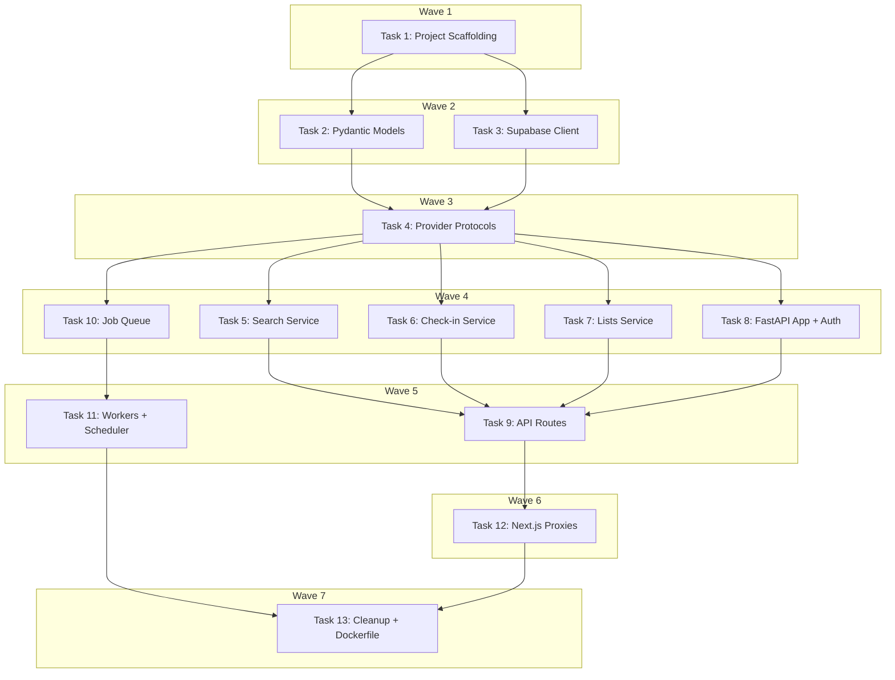

# Python Backend Migration Implementation Plan

> **For Claude:** REQUIRED SUB-SKILL: Use executing-plans to implement this plan task-by-task.

**Design Doc:** [docs/designs/2026-02-24-python-backend-migration-design.md](docs/designs/2026-02-24-python-backend-migration-design.md)

**Spec References:** §1 Tech Stack, §3 Architecture Overview, §7 Dev Environment, §8 Technical Constraints, §9 Business Rules

**PRD References:** —

**Goal:** Replace all TypeScript backend code (providers, services, workers, API routes) with a Python FastAPI backend. TypeScript remains for the Next.js frontend and prebuild data pipeline only.

**Architecture:** Monorepo with two Railway services — Next.js frontend (TypeScript) and FastAPI backend (Python 3.12+). Next.js API routes become thin proxies forwarding requests to the Python backend via Railway internal network. Provider abstractions use Python `Protocol` classes wired via FastAPI `Depends()`. Workers run inside the FastAPI process via APScheduler + Postgres job queue.

**Tech Stack:** FastAPI, uvicorn, Pydantic v2, supabase-py, APScheduler, anthropic, openai, resend, httpx, structlog, pytest, ruff, mypy

**Relationship to DB Infrastructure Plan:** This plan supersedes Tasks 6+ of `docs/plans/2026-02-24-db-infrastructure-plan.md` (TypeScript workers, provider adapters, worker handlers). Tasks 1, 3, 4 of that plan (Supabase CLI init, SQL migrations, taxonomy seed) remain valid and are prerequisites for running the Python backend against a real database. Task 2 (TypeScript type updates) is superseded by Task 2 of this plan (Pydantic models). Tests in this plan mock Supabase, so the backend code can be built and tested without the database being set up first.

---

## Task 1: Python Project Scaffolding

**Files:**

- Create: `backend/pyproject.toml`
- Create: `backend/__init__.py`
- Create: `backend/core/__init__.py`
- Create: `backend/core/config.py`
- Create: `backend/api/__init__.py`
- Create: `backend/services/__init__.py`
- Create: `backend/providers/__init__.py`
- Create: `backend/providers/llm/__init__.py`
- Create: `backend/providers/embeddings/__init__.py`
- Create: `backend/providers/email/__init__.py`
- Create: `backend/providers/analytics/__init__.py`
- Create: `backend/providers/maps/__init__.py`
- Create: `backend/workers/__init__.py`
- Create: `backend/workers/handlers/__init__.py`
- Create: `backend/models/__init__.py`
- Create: `backend/db/__init__.py`
- Create: `backend/tests/__init__.py`
- Create: `backend/tests/conftest.py`

**Step 1: Create pyproject.toml**

No test needed — infrastructure setup.

```toml
# backend/pyproject.toml
[project]
name = "caferoam-backend"
version = "0.1.0"
description = "CafeRoam FastAPI backend"
requires-python = ">=3.12"

dependencies = [
    "fastapi>=0.115",
    "uvicorn[standard]>=0.34",
    "supabase>=2.0",
    "pydantic>=2.0",
    "pydantic-settings>=2.0",
    "anthropic>=0.40",
    "openai>=1.50",
    "resend>=2.0",
    "apscheduler>=3.10",
    "httpx>=0.27",
    "sentry-sdk[fastapi]>=2.0",
    "structlog>=24.0",
]

[project.optional-dependencies]
dev = [
    "pytest>=8.0",
    "pytest-asyncio>=0.24",
    "pytest-cov>=6.0",
    "ruff>=0.8",
    "mypy>=1.13",
]

[tool.pytest.ini_options]
asyncio_mode = "auto"
testpaths = ["tests"]
python_files = ["test_*.py"]
python_classes = ["Test*"]
python_functions = ["test_*"]

[tool.ruff]
target-version = "py312"
line-length = 100

[tool.ruff.lint]
select = ["E", "F", "I", "N", "UP", "B", "SIM", "TCH"]

[tool.mypy]
python_version = "3.12"
strict = true
warn_return_any = true
warn_unused_configs = true
```

**Step 2: Create directory structure with **init**.py files**

Create all directories and empty `__init__.py` files as listed above.

**Step 3: Create config.py with Pydantic Settings**

```python
# backend/core/config.py
from pydantic_settings import BaseSettings


class Settings(BaseSettings):
    """Application settings loaded from environment variables."""

    # Supabase
    supabase_url: str = "http://127.0.0.1:54321"
    supabase_anon_key: str = ""
    supabase_service_role_key: str = ""

    # LLM
    llm_provider: str = "anthropic"
    anthropic_api_key: str = ""
    anthropic_model: str = "claude-sonnet-4-6-20250514"

    # Embeddings
    embeddings_provider: str = "openai"
    openai_api_key: str = ""
    openai_embedding_model: str = "text-embedding-3-small"

    # Email
    email_provider: str = "resend"
    resend_api_key: str = ""
    email_from: str = "CafeRoam <noreply@caferoam.tw>"

    # Analytics
    analytics_provider: str = "posthog"
    posthog_api_key: str = ""
    posthog_host: str = "https://app.posthog.com"

    # Maps
    maps_provider: str = "mapbox"
    mapbox_access_token: str = ""

    # Sentry
    sentry_dsn: str = ""

    # App
    environment: str = "development"
    log_level: str = "INFO"

    model_config = {"env_file": ".env", "env_file_encoding": "utf-8"}


settings = Settings()
```

**Step 4: Create conftest.py with shared fixtures**

```python
# backend/tests/conftest.py
import pytest
from unittest.mock import AsyncMock, MagicMock


@pytest.fixture
def mock_supabase():
    """Mock Supabase client for testing."""
    client = MagicMock()
    client.table = MagicMock(return_value=client)
    client.select = MagicMock(return_value=client)
    client.insert = MagicMock(return_value=client)
    client.update = MagicMock(return_value=client)
    client.delete = MagicMock(return_value=client)
    client.eq = MagicMock(return_value=client)
    client.execute = AsyncMock(return_value=MagicMock(data=[], count=0))
    return client
```

**Step 5: Install dependencies and verify**

Run:

```bash
cd /Users/ytchou/Project/caferoam/backend && uv sync --all-extras
```

Expected: All dependencies install successfully.

**Step 6: Verify pytest runs (empty suite)**

Run:

```bash
cd /Users/ytchou/Project/caferoam/backend && python -m pytest --co
```

Expected: "no tests ran" (clean, no import errors).

**Step 7: Verify ruff and mypy pass on config**

Run:

```bash
cd /Users/ytchou/Project/caferoam/backend && ruff check . && mypy core/config.py
```

Expected: No errors.

**Step 8: Commit**

```bash
git add backend/
git commit -m "feat(backend): scaffold Python project with FastAPI + pytest"
```

---

## Task 2: Pydantic Domain Models

**Files:**

- Create: `backend/models/types.py`
- Create: `backend/tests/models/__init__.py`
- Create: `backend/tests/models/test_types.py`

These translate `lib/types/index.ts` to Pydantic models. The Python models are the backend's source of truth — they may diverge from frontend TypeScript types over time.

**Step 1: Write the failing test**

```python
# backend/tests/models/test_types.py
import pytest
from datetime import datetime

from models.types import (
    Shop,
    TaxonomyTag,
    TaxonomyDimension,
    User,
    List,
    ListItem,
    CheckIn,
    Stamp,
    SearchResult,
    SearchQuery,
    SearchFilters,
    ShopModeScores,
)


class TestShop:
    def test_shop_required_fields(self):
        shop = Shop(
            id="shop-1",
            name="Test Cafe",
            address="123 Test St",
            latitude=25.033,
            longitude=121.565,
            review_count=10,
            taxonomy_tags=[],
            photo_urls=[],
            created_at=datetime.now(),
            updated_at=datetime.now(),
        )
        assert shop.id == "shop-1"
        assert shop.name == "Test Cafe"
        assert shop.mrt is None
        assert shop.phone is None
        assert shop.rating is None

    def test_shop_mode_scores(self):
        scores = ShopModeScores(work=0.8, rest=0.5, social=0.3)
        assert scores.work == 0.8


class TestTaxonomyTag:
    def test_tag_with_all_dimensions(self):
        for dim in ["functionality", "time", "ambience", "mode", "coffee"]:
            tag = TaxonomyTag(
                id=f"tag-{dim}",
                dimension=dim,
                label=f"test-{dim}",
                label_zh=f"測試-{dim}",
            )
            assert tag.dimension == dim

    def test_invalid_dimension_rejected(self):
        with pytest.raises(ValueError):
            TaxonomyTag(
                id="tag-bad",
                dimension="invalid",
                label="bad",
                label_zh="壞",
            )


class TestList:
    def test_list_creation(self):
        lst = List(
            id="list-1",
            user_id="user-1",
            name="Favorites",
            created_at=datetime.now(),
            updated_at=datetime.now(),
        )
        assert lst.name == "Favorites"


class TestListItem:
    def test_list_item(self):
        item = ListItem(list_id="list-1", shop_id="shop-1", added_at=datetime.now())
        assert item.list_id == "list-1"


class TestCheckIn:
    def test_checkin_requires_at_least_one_photo(self):
        checkin = CheckIn(
            id="ci-1",
            user_id="user-1",
            shop_id="shop-1",
            photo_urls=["https://example.com/photo.jpg"],
            created_at=datetime.now(),
        )
        assert len(checkin.photo_urls) >= 1

    def test_checkin_empty_photos_rejected(self):
        with pytest.raises(ValueError):
            CheckIn(
                id="ci-1",
                user_id="user-1",
                shop_id="shop-1",
                photo_urls=[],
                created_at=datetime.now(),
            )


class TestSearchQuery:
    def test_basic_query(self):
        q = SearchQuery(text="good wifi for working")
        assert q.text == "good wifi for working"
        assert q.filters is None
        assert q.limit is None

    def test_query_with_filters(self):
        q = SearchQuery(
            text="quiet cafe",
            filters=SearchFilters(
                dimensions={"ambience": ["quiet", "cozy"]},
                near_latitude=25.033,
                near_longitude=121.565,
                radius_km=2.0,
            ),
            limit=10,
        )
        assert q.filters.radius_km == 2.0
```

**Step 2: Run test to verify it fails**

Run:

```bash
cd /Users/ytchou/Project/caferoam/backend && python -m pytest tests/models/test_types.py -v
```

Expected: FAIL with `ModuleNotFoundError: No module named 'models.types'`

**Step 3: Write the Pydantic models**

```python
# backend/models/types.py
from datetime import datetime
from enum import Enum
from typing import Literal

from pydantic import BaseModel, field_validator


TaxonomyDimension = Literal["functionality", "time", "ambience", "mode", "coffee"]


class ShopModeScores(BaseModel):
    work: float = 0.0
    rest: float = 0.0
    social: float = 0.0


class TaxonomyTag(BaseModel):
    id: str
    dimension: TaxonomyDimension
    label: str
    label_zh: str


class Shop(BaseModel):
    id: str
    name: str
    address: str
    latitude: float
    longitude: float
    mrt: str | None = None
    phone: str | None = None
    website: str | None = None
    opening_hours: list[str] | None = None
    rating: float | None = None
    review_count: int
    price_range: str | None = None
    description: str | None = None
    photo_urls: list[str]
    menu_url: str | None = None
    taxonomy_tags: list[TaxonomyTag]
    mode_scores: ShopModeScores | None = None
    cafenomad_id: str | None = None
    google_place_id: str | None = None
    created_at: datetime
    updated_at: datetime


class User(BaseModel):
    id: str
    email: str
    display_name: str | None = None
    avatar_url: str | None = None
    pdpa_consent_at: datetime
    created_at: datetime


class List(BaseModel):
    id: str
    user_id: str
    name: str
    created_at: datetime
    updated_at: datetime


class ListItem(BaseModel):
    list_id: str
    shop_id: str
    added_at: datetime


class CheckIn(BaseModel):
    id: str
    user_id: str
    shop_id: str
    photo_urls: list[str]
    menu_photo_url: str | None = None
    note: str | None = None
    created_at: datetime

    @field_validator("photo_urls")
    @classmethod
    def at_least_one_photo(cls, v: list[str]) -> list[str]:
        if len(v) < 1:
            raise ValueError("At least one photo is required for check-in")
        return v


class Stamp(BaseModel):
    id: str
    user_id: str
    shop_id: str
    check_in_id: str
    design_url: str
    earned_at: datetime


class SearchFilters(BaseModel):
    dimensions: dict[TaxonomyDimension, list[str]] | None = None
    near_latitude: float | None = None
    near_longitude: float | None = None
    radius_km: float | None = None


class SearchQuery(BaseModel):
    text: str
    filters: SearchFilters | None = None
    limit: int | None = None


class SearchResult(BaseModel):
    shop: Shop
    similarity_score: float
    taxonomy_boost: float
    total_score: float


# --- Provider result types ---


class EnrichmentResult(BaseModel):
    tags: list[TaxonomyTag]
    summary: str
    confidence: float
    mode_scores: ShopModeScores | None = None


class MenuExtractionResult(BaseModel):
    items: list[dict]
    raw_text: str | None = None


class GeocodingResult(BaseModel):
    latitude: float
    longitude: float
    formatted_address: str


class EmailMessage(BaseModel):
    to: str
    subject: str
    html: str
    from_address: str | None = None


class EmailSendResult(BaseModel):
    id: str


# --- Job queue types ---


class JobType(str, Enum):
    ENRICH_SHOP = "enrich_shop"
    ENRICH_MENU_PHOTO = "enrich_menu_photo"
    GENERATE_EMBEDDING = "generate_embedding"
    STALENESS_SWEEP = "staleness_sweep"
    WEEKLY_EMAIL = "weekly_email"


class JobStatus(str, Enum):
    PENDING = "pending"
    CLAIMED = "claimed"
    COMPLETED = "completed"
    FAILED = "failed"


class Job(BaseModel):
    id: str
    job_type: JobType
    payload: dict
    status: JobStatus
    priority: int = 0
    attempts: int = 0
    max_attempts: int = 3
    last_error: str | None = None
    scheduled_at: datetime
    claimed_at: datetime | None = None
    completed_at: datetime | None = None
    created_at: datetime
```

**Step 4: Run test to verify it passes**

Run:

```bash
cd /Users/ytchou/Project/caferoam/backend && python -m pytest tests/models/test_types.py -v
```

Expected: All tests PASS.

**Step 5: Commit**

```bash
git add backend/models/ backend/tests/models/
git commit -m "feat(backend): add Pydantic domain models"
```

---

## Task 3: Supabase Python Client

**Files:**

- Create: `backend/db/supabase_client.py`
- Create: `backend/tests/db/__init__.py`
- Create: `backend/tests/db/test_supabase_client.py`

**Step 1: Write the failing test**

```python
# backend/tests/db/test_supabase_client.py
from unittest.mock import patch

from db.supabase_client import get_supabase_client, get_service_role_client


class TestSupabaseClient:
    def test_get_supabase_client_returns_client(self):
        with patch("db.supabase_client.settings") as mock_settings:
            mock_settings.supabase_url = "http://localhost:54321"
            mock_settings.supabase_anon_key = "test-anon-key"
            client = get_supabase_client()
            assert client is not None

    def test_get_service_role_client_returns_client(self):
        with patch("db.supabase_client.settings") as mock_settings:
            mock_settings.supabase_url = "http://localhost:54321"
            mock_settings.supabase_service_role_key = "test-service-key"
            client = get_service_role_client()
            assert client is not None

    def test_clients_are_singletons(self):
        """Same settings should return cached clients."""
        with patch("db.supabase_client.settings") as mock_settings:
            mock_settings.supabase_url = "http://localhost:54321"
            mock_settings.supabase_anon_key = "test-anon-key"
            c1 = get_supabase_client()
            c2 = get_supabase_client()
            assert c1 is c2
```

**Step 2: Run test to verify it fails**

Run:

```bash
cd /Users/ytchou/Project/caferoam/backend && python -m pytest tests/db/test_supabase_client.py -v
```

Expected: FAIL with `ModuleNotFoundError`

**Step 3: Write the Supabase client**

```python
# backend/db/supabase_client.py
from functools import lru_cache

from supabase import create_client, Client

from core.config import settings


@lru_cache(maxsize=1)
def get_supabase_client() -> Client:
    """Get Supabase client using anon key (respects RLS)."""
    return create_client(settings.supabase_url, settings.supabase_anon_key)


@lru_cache(maxsize=1)
def get_service_role_client() -> Client:
    """Get Supabase client using service role key (bypasses RLS).
    Use only for worker processes and admin operations."""
    return create_client(settings.supabase_url, settings.supabase_service_role_key)
```

**Step 4: Run test to verify it passes**

Run:

```bash
cd /Users/ytchou/Project/caferoam/backend && python -m pytest tests/db/test_supabase_client.py -v
```

Expected: All tests PASS.

**Step 5: Commit**

```bash
git add backend/db/ backend/tests/db/
git commit -m "feat(backend): add Supabase Python client with singleton caching"
```

---

## Task 4: Provider Protocols + Factory Functions

**Files:**

- Create: `backend/providers/llm/interface.py`
- Create: `backend/providers/embeddings/interface.py`
- Create: `backend/providers/email/interface.py`
- Create: `backend/providers/analytics/interface.py`
- Create: `backend/providers/maps/interface.py`
- Create: `backend/tests/providers/__init__.py`
- Create: `backend/tests/providers/test_factories.py`

**Step 1: Write the failing test**

```python
# backend/tests/providers/test_factories.py
from unittest.mock import patch
import pytest

from providers.llm.interface import LLMProvider
from providers.embeddings.interface import EmbeddingsProvider
from providers.email.interface import EmailProvider
from providers.analytics.interface import AnalyticsProvider
from providers.maps.interface import MapsProvider


class TestProviderProtocols:
    """Verify protocol definitions exist and are importable."""

    def test_llm_provider_protocol_exists(self):
        assert hasattr(LLMProvider, "enrich_shop")
        assert hasattr(LLMProvider, "extract_menu_data")

    def test_embeddings_provider_protocol_exists(self):
        assert hasattr(EmbeddingsProvider, "embed")
        assert hasattr(EmbeddingsProvider, "embed_batch")
        assert hasattr(EmbeddingsProvider, "dimensions")
        assert hasattr(EmbeddingsProvider, "model_id")

    def test_email_provider_protocol_exists(self):
        assert hasattr(EmailProvider, "send")

    def test_analytics_provider_protocol_exists(self):
        assert hasattr(AnalyticsProvider, "track")
        assert hasattr(AnalyticsProvider, "identify")
        assert hasattr(AnalyticsProvider, "page")

    def test_maps_provider_protocol_exists(self):
        assert hasattr(MapsProvider, "geocode")
        assert hasattr(MapsProvider, "reverse_geocode")


class TestProviderFactories:
    """Verify factory functions select correct adapter from settings."""

    def test_llm_factory_returns_anthropic(self):
        with patch("providers.llm.settings") as mock:
            mock.llm_provider = "anthropic"
            mock.anthropic_api_key = "test-key"
            mock.anthropic_model = "claude-sonnet-4-6-20250514"
            from providers.llm import get_llm_provider
            provider = get_llm_provider()
            assert provider is not None

    def test_llm_factory_unknown_provider_raises(self):
        with patch("providers.llm.settings") as mock:
            mock.llm_provider = "unknown"
            from providers.llm import get_llm_provider
            with pytest.raises(ValueError, match="Unknown LLM provider"):
                get_llm_provider()

    def test_embeddings_factory_returns_openai(self):
        with patch("providers.embeddings.settings") as mock:
            mock.embeddings_provider = "openai"
            mock.openai_api_key = "test-key"
            mock.openai_embedding_model = "text-embedding-3-small"
            from providers.embeddings import get_embeddings_provider
            provider = get_embeddings_provider()
            assert provider is not None
            assert provider.dimensions == 1536

    def test_email_factory_returns_resend(self):
        with patch("providers.email.settings") as mock:
            mock.email_provider = "resend"
            mock.resend_api_key = "test-key"
            mock.email_from = "test@example.com"
            from providers.email import get_email_provider
            provider = get_email_provider()
            assert provider is not None
```

**Step 2: Run test to verify it fails**

Run:

```bash
cd /Users/ytchou/Project/caferoam/backend && python -m pytest tests/providers/test_factories.py -v
```

Expected: FAIL with `ModuleNotFoundError`

**Step 3: Write all 5 provider protocols**

```python
# backend/providers/llm/interface.py
from typing import Protocol

from models.types import EnrichmentResult, MenuExtractionResult


class LLMProvider(Protocol):
    async def enrich_shop(
        self,
        name: str,
        reviews: list[str],
        description: str | None,
        categories: list[str],
    ) -> EnrichmentResult: ...

    async def extract_menu_data(
        self,
        image_url: str,
    ) -> MenuExtractionResult: ...
```

```python
# backend/providers/embeddings/interface.py
from typing import Protocol


class EmbeddingsProvider(Protocol):
    @property
    def dimensions(self) -> int: ...

    @property
    def model_id(self) -> str: ...

    async def embed(self, text: str) -> list[float]: ...

    async def embed_batch(self, texts: list[str]) -> list[list[float]]: ...
```

```python
# backend/providers/email/interface.py
from typing import Protocol

from models.types import EmailMessage, EmailSendResult


class EmailProvider(Protocol):
    async def send(self, message: EmailMessage) -> EmailSendResult: ...
```

```python
# backend/providers/analytics/interface.py
from typing import Protocol


class AnalyticsProvider(Protocol):
    def track(
        self, event: str, properties: dict[str, str | int | bool] | None = None
    ) -> None: ...

    def identify(
        self, user_id: str, traits: dict[str, str | int | bool] | None = None
    ) -> None: ...

    def page(
        self, name: str | None = None, properties: dict[str, str | int | bool] | None = None
    ) -> None: ...
```

```python
# backend/providers/maps/interface.py
from typing import Protocol

from models.types import GeocodingResult


class MapsProvider(Protocol):
    async def geocode(self, address: str) -> GeocodingResult | None: ...

    async def reverse_geocode(self, lat: float, lng: float) -> str | None: ...
```

**Step 4: Write stub adapters and factory functions**

```python
# backend/providers/llm/anthropic_adapter.py
from anthropic import AsyncAnthropic

from models.types import EnrichmentResult, MenuExtractionResult


class AnthropicLLMAdapter:
    def __init__(self, api_key: str, model: str):
        self._client = AsyncAnthropic(api_key=api_key)
        self._model = model

    async def enrich_shop(
        self,
        name: str,
        reviews: list[str],
        description: str | None,
        categories: list[str],
    ) -> EnrichmentResult:
        raise NotImplementedError("Enrich shop not yet implemented")

    async def extract_menu_data(self, image_url: str) -> MenuExtractionResult:
        raise NotImplementedError("Menu extraction not yet implemented")
```

```python
# backend/providers/llm/__init__.py
from core.config import settings
from providers.llm.interface import LLMProvider


def get_llm_provider() -> LLMProvider:
    match settings.llm_provider:
        case "anthropic":
            from providers.llm.anthropic_adapter import AnthropicLLMAdapter

            return AnthropicLLMAdapter(
                api_key=settings.anthropic_api_key,
                model=settings.anthropic_model,
            )
        case _:
            raise ValueError(f"Unknown LLM provider: {settings.llm_provider}")
```

```python
# backend/providers/embeddings/openai_adapter.py
from openai import AsyncOpenAI


class OpenAIEmbeddingsAdapter:
    def __init__(self, api_key: str, model: str = "text-embedding-3-small"):
        self._client = AsyncOpenAI(api_key=api_key)
        self._model = model
        self._dimensions = 1536

    @property
    def dimensions(self) -> int:
        return self._dimensions

    @property
    def model_id(self) -> str:
        return self._model

    async def embed(self, text: str) -> list[float]:
        response = await self._client.embeddings.create(
            model=self._model, input=text
        )
        return response.data[0].embedding

    async def embed_batch(self, texts: list[str]) -> list[list[float]]:
        response = await self._client.embeddings.create(
            model=self._model, input=texts
        )
        return [item.embedding for item in response.data]
```

```python
# backend/providers/embeddings/__init__.py
from core.config import settings
from providers.embeddings.interface import EmbeddingsProvider


def get_embeddings_provider() -> EmbeddingsProvider:
    match settings.embeddings_provider:
        case "openai":
            from providers.embeddings.openai_adapter import OpenAIEmbeddingsAdapter

            return OpenAIEmbeddingsAdapter(
                api_key=settings.openai_api_key,
                model=settings.openai_embedding_model,
            )
        case _:
            raise ValueError(
                f"Unknown embeddings provider: {settings.embeddings_provider}"
            )
```

```python
# backend/providers/email/resend_adapter.py
import resend as resend_sdk

from models.types import EmailMessage, EmailSendResult


class ResendEmailAdapter:
    def __init__(self, api_key: str, default_from: str):
        resend_sdk.api_key = api_key
        self._default_from = default_from

    async def send(self, message: EmailMessage) -> EmailSendResult:
        result = resend_sdk.Emails.send(
            {
                "from": message.from_address or self._default_from,
                "to": message.to,
                "subject": message.subject,
                "html": message.html,
            }
        )
        return EmailSendResult(id=result["id"])
```

```python
# backend/providers/email/__init__.py
from core.config import settings
from providers.email.interface import EmailProvider


def get_email_provider() -> EmailProvider:
    match settings.email_provider:
        case "resend":
            from providers.email.resend_adapter import ResendEmailAdapter

            return ResendEmailAdapter(
                api_key=settings.resend_api_key,
                default_from=settings.email_from,
            )
        case _:
            raise ValueError(f"Unknown email provider: {settings.email_provider}")
```

```python
# backend/providers/analytics/posthog_adapter.py
class PostHogAnalyticsAdapter:
    def __init__(self, api_key: str, host: str):
        self._api_key = api_key
        self._host = host

    def track(
        self, event: str, properties: dict[str, str | int | bool] | None = None
    ) -> None:
        pass  # TODO: implement with posthog-python

    def identify(
        self, user_id: str, traits: dict[str, str | int | bool] | None = None
    ) -> None:
        pass  # TODO: implement with posthog-python

    def page(
        self, name: str | None = None, properties: dict[str, str | int | bool] | None = None
    ) -> None:
        pass  # TODO: implement with posthog-python
```

```python
# backend/providers/analytics/__init__.py
from core.config import settings
from providers.analytics.interface import AnalyticsProvider


def get_analytics_provider() -> AnalyticsProvider:
    match settings.analytics_provider:
        case "posthog":
            from providers.analytics.posthog_adapter import PostHogAnalyticsAdapter

            return PostHogAnalyticsAdapter(
                api_key=settings.posthog_api_key,
                host=settings.posthog_host,
            )
        case _:
            raise ValueError(
                f"Unknown analytics provider: {settings.analytics_provider}"
            )
```

```python
# backend/providers/maps/mapbox_adapter.py
import httpx

from models.types import GeocodingResult


class MapboxMapsAdapter:
    def __init__(self, access_token: str):
        self._token = access_token

    async def geocode(self, address: str) -> GeocodingResult | None:
        raise NotImplementedError("Geocoding not yet implemented")

    async def reverse_geocode(self, lat: float, lng: float) -> str | None:
        raise NotImplementedError("Reverse geocoding not yet implemented")
```

```python
# backend/providers/maps/__init__.py
from core.config import settings
from providers.maps.interface import MapsProvider


def get_maps_provider() -> MapsProvider:
    match settings.maps_provider:
        case "mapbox":
            from providers.maps.mapbox_adapter import MapboxMapsAdapter

            return MapboxMapsAdapter(access_token=settings.mapbox_access_token)
        case _:
            raise ValueError(f"Unknown maps provider: {settings.maps_provider}")
```

**Step 5: Run test to verify it passes**

Run:

```bash
cd /Users/ytchou/Project/caferoam/backend && python -m pytest tests/providers/test_factories.py -v
```

Expected: All tests PASS.

**Step 6: Commit**

```bash
git add backend/providers/ backend/tests/providers/
git commit -m "feat(backend): add provider protocols, adapters, and factory functions"
```

---

## Task 5: Search Service

**Files:**

- Create: `backend/services/search_service.py`
- Create: `backend/tests/services/__init__.py`
- Create: `backend/tests/services/test_search_service.py`

**Step 1: Write the failing test**

```python
# backend/tests/services/test_search_service.py
import pytest
from unittest.mock import AsyncMock, MagicMock, patch
from datetime import datetime

from models.types import SearchQuery, SearchFilters, SearchResult, Shop, TaxonomyTag
from services.search_service import SearchService


def _make_shop(shop_id: str = "shop-1", name: str = "Test Cafe") -> dict:
    """Helper to create a shop row dict as returned by Supabase."""
    return {
        "id": shop_id,
        "name": name,
        "address": "123 Test St",
        "latitude": 25.033,
        "longitude": 121.565,
        "mrt": None,
        "phone": None,
        "website": None,
        "opening_hours": None,
        "rating": 4.5,
        "review_count": 10,
        "price_range": None,
        "description": "A nice cafe",
        "photo_urls": [],
        "menu_url": None,
        "cafenomad_id": None,
        "google_place_id": None,
        "created_at": datetime.now().isoformat(),
        "updated_at": datetime.now().isoformat(),
        "similarity": 0.85,
    }


@pytest.fixture
def mock_embeddings():
    provider = AsyncMock()
    provider.embed = AsyncMock(return_value=[0.1] * 1536)
    provider.dimensions = 1536
    return provider


@pytest.fixture
def mock_supabase():
    client = MagicMock()
    return client


@pytest.fixture
def search_service(mock_supabase, mock_embeddings):
    return SearchService(db=mock_supabase, embeddings=mock_embeddings)


class TestSearchService:
    async def test_search_embeds_query_text(self, search_service, mock_embeddings, mock_supabase):
        mock_supabase.rpc = MagicMock(return_value=MagicMock(
            execute=AsyncMock(return_value=MagicMock(data=[]))
        ))
        query = SearchQuery(text="good wifi for working")
        await search_service.search(query)
        mock_embeddings.embed.assert_called_once_with("good wifi for working")

    async def test_search_returns_ranked_results(self, search_service, mock_supabase):
        shop_data = _make_shop()
        mock_supabase.rpc = MagicMock(return_value=MagicMock(
            execute=AsyncMock(return_value=MagicMock(data=[shop_data]))
        ))
        query = SearchQuery(text="good wifi")
        results = await search_service.search(query)
        assert len(results) == 1
        assert results[0].similarity_score == 0.85

    async def test_search_respects_limit(self, search_service, mock_supabase):
        mock_supabase.rpc = MagicMock(return_value=MagicMock(
            execute=AsyncMock(return_value=MagicMock(data=[]))
        ))
        query = SearchQuery(text="test", limit=5)
        await search_service.search(query)
        # Verify limit was passed to the RPC call
        call_args = mock_supabase.rpc.call_args
        assert call_args is not None
```

**Step 2: Run test to verify it fails**

Run:

```bash
cd /Users/ytchou/Project/caferoam/backend && python -m pytest tests/services/test_search_service.py -v
```

Expected: FAIL with `ModuleNotFoundError`

**Step 3: Write the search service**

```python
# backend/services/search_service.py
from supabase import Client

from models.types import SearchQuery, SearchResult, Shop
from providers.embeddings.interface import EmbeddingsProvider


class SearchService:
    def __init__(self, db: Client, embeddings: EmbeddingsProvider):
        self._db = db
        self._embeddings = embeddings

    async def search(self, query: SearchQuery) -> list[SearchResult]:
        """Semantic search: embed query → pgvector similarity → taxonomy boost → ranked results."""
        # 1. Embed the query text
        query_embedding = await self._embeddings.embed(query.text)

        # 2. Call Supabase RPC for vector similarity search
        limit = query.limit or 20
        rpc_params: dict = {
            "query_embedding": query_embedding,
            "match_count": limit,
        }

        # Add geo filter if provided
        if query.filters and query.filters.near_latitude and query.filters.near_longitude:
            rpc_params["filter_lat"] = query.filters.near_latitude
            rpc_params["filter_lng"] = query.filters.near_longitude
            rpc_params["filter_radius_km"] = query.filters.radius_km or 5.0

        response = self._db.rpc("search_shops", rpc_params).execute()

        # 3. Parse results and compute final scores
        results: list[SearchResult] = []
        for row in response.data:
            similarity = row.pop("similarity", 0.0)
            taxonomy_boost = self._compute_taxonomy_boost(row, query)

            shop = Shop(
                taxonomy_tags=[],  # Tags loaded separately if needed
                photo_urls=row.get("photo_urls", []),
                **{k: v for k, v in row.items() if k in Shop.model_fields},
            )

            results.append(
                SearchResult(
                    shop=shop,
                    similarity_score=similarity,
                    taxonomy_boost=taxonomy_boost,
                    total_score=similarity + taxonomy_boost,
                )
            )

        # 4. Sort by total score descending
        results.sort(key=lambda r: r.total_score, reverse=True)
        return results

    def _compute_taxonomy_boost(self, row: dict, query: SearchQuery) -> float:
        """Compute taxonomy boost based on tag overlap with query filters."""
        if not query.filters or not query.filters.dimensions:
            return 0.0
        # Taxonomy boost logic will be implemented when tags are loaded
        return 0.0
```

**Step 4: Run test to verify it passes**

Run:

```bash
cd /Users/ytchou/Project/caferoam/backend && python -m pytest tests/services/test_search_service.py -v
```

Expected: All tests PASS.

**Step 5: Commit**

```bash
git add backend/services/search_service.py backend/tests/services/
git commit -m "feat(backend): add search service with vector similarity + taxonomy boost"
```

---

## Task 6: Check-in Service

**Files:**

- Create: `backend/services/checkin_service.py`
- Create: `backend/tests/services/test_checkin_service.py`

**Step 1: Write the failing test**

```python
# backend/tests/services/test_checkin_service.py
import pytest
from unittest.mock import AsyncMock, MagicMock
from datetime import datetime

from services.checkin_service import CheckInService


@pytest.fixture
def mock_supabase():
    client = MagicMock()
    return client


@pytest.fixture
def checkin_service(mock_supabase):
    return CheckInService(db=mock_supabase)


class TestCheckInService:
    async def test_create_requires_at_least_one_photo(self, checkin_service):
        with pytest.raises(ValueError, match="At least one photo"):
            await checkin_service.create(
                user_id="user-1",
                shop_id="shop-1",
                photo_urls=[],
            )

    async def test_create_inserts_checkin_and_stamp(self, checkin_service, mock_supabase):
        mock_supabase.table = MagicMock(return_value=MagicMock(
            insert=MagicMock(return_value=MagicMock(
                execute=AsyncMock(return_value=MagicMock(data=[{
                    "id": "ci-1",
                    "user_id": "user-1",
                    "shop_id": "shop-1",
                    "photo_urls": ["https://example.com/photo.jpg"],
                    "menu_photo_url": None,
                    "note": None,
                    "created_at": datetime.now().isoformat(),
                }]))
            ))
        ))
        result = await checkin_service.create(
            user_id="user-1",
            shop_id="shop-1",
            photo_urls=["https://example.com/photo.jpg"],
        )
        assert result.id == "ci-1"
        # Verify stamp was also created
        assert mock_supabase.table.call_count >= 2  # check_ins + stamps

    async def test_create_with_menu_photo_queues_enrichment(self, checkin_service, mock_supabase):
        mock_supabase.table = MagicMock(return_value=MagicMock(
            insert=MagicMock(return_value=MagicMock(
                execute=AsyncMock(return_value=MagicMock(data=[{
                    "id": "ci-1",
                    "user_id": "user-1",
                    "shop_id": "shop-1",
                    "photo_urls": ["https://example.com/photo.jpg"],
                    "menu_photo_url": "https://example.com/menu.jpg",
                    "note": None,
                    "created_at": datetime.now().isoformat(),
                }]))
            ))
        ))
        await checkin_service.create(
            user_id="user-1",
            shop_id="shop-1",
            photo_urls=["https://example.com/photo.jpg"],
            menu_photo_url="https://example.com/menu.jpg",
        )
        # Verify job_queue insert for menu photo enrichment
        calls = mock_supabase.table.call_args_list
        table_names = [c[0][0] for c in calls]
        assert "job_queue" in table_names

    async def test_get_by_user(self, checkin_service, mock_supabase):
        mock_supabase.table = MagicMock(return_value=MagicMock(
            select=MagicMock(return_value=MagicMock(
                eq=MagicMock(return_value=MagicMock(
                    order=MagicMock(return_value=MagicMock(
                        execute=AsyncMock(return_value=MagicMock(data=[]))
                    ))
                ))
            ))
        ))
        results = await checkin_service.get_by_user("user-1")
        assert isinstance(results, list)

    async def test_get_by_shop(self, checkin_service, mock_supabase):
        mock_supabase.table = MagicMock(return_value=MagicMock(
            select=MagicMock(return_value=MagicMock(
                eq=MagicMock(return_value=MagicMock(
                    order=MagicMock(return_value=MagicMock(
                        execute=AsyncMock(return_value=MagicMock(data=[]))
                    ))
                ))
            ))
        ))
        results = await checkin_service.get_by_shop("shop-1")
        assert isinstance(results, list)
```

**Step 2: Run test to verify it fails**

Run:

```bash
cd /Users/ytchou/Project/caferoam/backend && python -m pytest tests/services/test_checkin_service.py -v
```

Expected: FAIL with `ModuleNotFoundError`

**Step 3: Write the check-in service**

```python
# backend/services/checkin_service.py
import uuid
from datetime import datetime, timezone

from supabase import Client

from models.types import CheckIn, Stamp, JobType


class CheckInService:
    def __init__(self, db: Client):
        self._db = db

    async def create(
        self,
        user_id: str,
        shop_id: str,
        photo_urls: list[str],
        menu_photo_url: str | None = None,
        note: str | None = None,
    ) -> CheckIn:
        """Create a check-in, award a stamp, and optionally queue menu photo enrichment."""
        if len(photo_urls) < 1:
            raise ValueError("At least one photo is required for check-in")

        # 1. Insert check-in
        checkin_data = {
            "user_id": user_id,
            "shop_id": shop_id,
            "photo_urls": photo_urls,
            "menu_photo_url": menu_photo_url,
            "note": note,
        }
        response = self._db.table("check_ins").insert(checkin_data).execute()
        checkin_row = response.data[0]

        # 2. Award stamp
        stamp_data = {
            "user_id": user_id,
            "shop_id": shop_id,
            "check_in_id": checkin_row["id"],
            "design_url": f"/stamps/{shop_id}.svg",
        }
        self._db.table("stamps").insert(stamp_data).execute()

        # 3. Queue menu photo enrichment if provided
        if menu_photo_url:
            self._db.table("job_queue").insert({
                "job_type": JobType.ENRICH_MENU_PHOTO.value,
                "payload": {
                    "shop_id": shop_id,
                    "image_url": menu_photo_url,
                },
                "status": "pending",
                "priority": 5,
                "scheduled_at": datetime.now(timezone.utc).isoformat(),
            }).execute()

        return CheckIn(**checkin_row)

    async def get_by_user(self, user_id: str) -> list[CheckIn]:
        response = (
            self._db.table("check_ins")
            .select("*")
            .eq("user_id", user_id)
            .order("created_at", desc=True)
            .execute()
        )
        return [CheckIn(**row) for row in response.data]

    async def get_by_shop(self, shop_id: str) -> list[CheckIn]:
        response = (
            self._db.table("check_ins")
            .select("*")
            .eq("shop_id", shop_id)
            .order("created_at", desc=True)
            .execute()
        )
        return [CheckIn(**row) for row in response.data]
```

**Step 4: Run test to verify it passes**

Run:

```bash
cd /Users/ytchou/Project/caferoam/backend && python -m pytest tests/services/test_checkin_service.py -v
```

Expected: All tests PASS.

**Step 5: Commit**

```bash
git add backend/services/checkin_service.py backend/tests/services/test_checkin_service.py
git commit -m "feat(backend): add check-in service with stamp award and menu photo queue"
```

---

## Task 7: Lists Service

**Files:**

- Create: `backend/services/lists_service.py`
- Create: `backend/tests/services/test_lists_service.py`

**Step 1: Write the failing test**

```python
# backend/tests/services/test_lists_service.py
import pytest
from unittest.mock import AsyncMock, MagicMock
from datetime import datetime

from services.lists_service import ListsService


MAX_LISTS = 3


@pytest.fixture
def mock_supabase():
    client = MagicMock()
    return client


@pytest.fixture
def lists_service(mock_supabase):
    return ListsService(db=mock_supabase)


class TestListsService:
    async def test_create_list_succeeds_when_under_cap(self, lists_service, mock_supabase):
        # User has 1 existing list
        mock_supabase.table = MagicMock(return_value=MagicMock(
            select=MagicMock(return_value=MagicMock(
                eq=MagicMock(return_value=MagicMock(
                    execute=AsyncMock(return_value=MagicMock(data=[{"id": "l1"}], count=1))
                ))
            )),
            insert=MagicMock(return_value=MagicMock(
                execute=AsyncMock(return_value=MagicMock(data=[{
                    "id": "l2",
                    "user_id": "user-1",
                    "name": "Favorites",
                    "created_at": datetime.now().isoformat(),
                    "updated_at": datetime.now().isoformat(),
                }]))
            )),
        ))
        result = await lists_service.create(user_id="user-1", name="Favorites")
        assert result.name == "Favorites"

    async def test_create_list_fails_at_cap(self, lists_service, mock_supabase):
        # User already has 3 lists
        mock_supabase.table = MagicMock(return_value=MagicMock(
            select=MagicMock(return_value=MagicMock(
                eq=MagicMock(return_value=MagicMock(
                    execute=AsyncMock(return_value=MagicMock(
                        data=[{"id": "l1"}, {"id": "l2"}, {"id": "l3"}],
                        count=3,
                    ))
                ))
            ))
        ))
        with pytest.raises(ValueError, match="Maximum 3 lists"):
            await lists_service.create(user_id="user-1", name="Fourth")

    async def test_delete_list_owned_by_user(self, lists_service, mock_supabase):
        mock_supabase.table = MagicMock(return_value=MagicMock(
            delete=MagicMock(return_value=MagicMock(
                eq=MagicMock(return_value=MagicMock(
                    eq=MagicMock(return_value=MagicMock(
                        execute=AsyncMock(return_value=MagicMock(data=[{"id": "l1"}]))
                    ))
                ))
            ))
        ))
        await lists_service.delete(list_id="l1", user_id="user-1")
        mock_supabase.table.assert_called()

    async def test_add_shop_to_list(self, lists_service, mock_supabase):
        mock_supabase.table = MagicMock(return_value=MagicMock(
            insert=MagicMock(return_value=MagicMock(
                execute=AsyncMock(return_value=MagicMock(data=[{
                    "list_id": "l1",
                    "shop_id": "s1",
                    "added_at": datetime.now().isoformat(),
                }]))
            ))
        ))
        await lists_service.add_shop(list_id="l1", shop_id="s1", user_id="user-1")

    async def test_get_by_user(self, lists_service, mock_supabase):
        mock_supabase.table = MagicMock(return_value=MagicMock(
            select=MagicMock(return_value=MagicMock(
                eq=MagicMock(return_value=MagicMock(
                    order=MagicMock(return_value=MagicMock(
                        execute=AsyncMock(return_value=MagicMock(data=[]))
                    ))
                ))
            ))
        ))
        results = await lists_service.get_by_user("user-1")
        assert isinstance(results, list)
```

**Step 2: Run test to verify it fails**

Run:

```bash
cd /Users/ytchou/Project/caferoam/backend && python -m pytest tests/services/test_lists_service.py -v
```

Expected: FAIL with `ModuleNotFoundError`

**Step 3: Write the lists service**

```python
# backend/services/lists_service.py
from supabase import Client

from models.types import List, ListItem


MAX_LISTS_PER_USER = 3


class ListsService:
    def __init__(self, db: Client):
        self._db = db

    async def get_by_user(self, user_id: str) -> list[List]:
        response = (
            self._db.table("lists")
            .select("*")
            .eq("user_id", user_id)
            .order("created_at", desc=True)
            .execute()
        )
        return [List(**row) for row in response.data]

    async def create(self, user_id: str, name: str) -> List:
        """Create a new list. Enforces max 3 lists per user at the API level."""
        # Check current count
        existing = (
            self._db.table("lists")
            .select("id")
            .eq("user_id", user_id)
            .execute()
        )
        if len(existing.data) >= MAX_LISTS_PER_USER:
            raise ValueError(
                f"Maximum {MAX_LISTS_PER_USER} lists per user. "
                "Delete an existing list before creating a new one."
            )

        response = (
            self._db.table("lists")
            .insert({"user_id": user_id, "name": name})
            .execute()
        )
        return List(**response.data[0])

    async def delete(self, list_id: str, user_id: str) -> None:
        """Delete a list owned by the user. Also deletes all list items."""
        # Delete list items first
        self._db.table("list_items").delete().eq("list_id", list_id).execute()
        # Delete list (RLS ensures user_id match)
        self._db.table("lists").delete().eq("id", list_id).eq("user_id", user_id).execute()

    async def add_shop(self, list_id: str, shop_id: str, user_id: str) -> ListItem:
        """Add a shop to a list."""
        response = (
            self._db.table("list_items")
            .insert({"list_id": list_id, "shop_id": shop_id})
            .execute()
        )
        return ListItem(**response.data[0])

    async def remove_shop(self, list_id: str, shop_id: str, user_id: str) -> None:
        """Remove a shop from a list."""
        (
            self._db.table("list_items")
            .delete()
            .eq("list_id", list_id)
            .eq("shop_id", shop_id)
            .execute()
        )
```

**Step 4: Run test to verify it passes**

Run:

```bash
cd /Users/ytchou/Project/caferoam/backend && python -m pytest tests/services/test_lists_service.py -v
```

Expected: All tests PASS.

**Step 5: Commit**

```bash
git add backend/services/lists_service.py backend/tests/services/test_lists_service.py
git commit -m "feat(backend): add lists service with 3-list cap enforcement"
```

---

## Task 8: FastAPI App + Auth Dependency

**Files:**

- Create: `backend/main.py`
- Create: `backend/api/deps.py`
- Create: `backend/tests/api/__init__.py`
- Create: `backend/tests/api/test_auth.py`

**Step 1: Write the failing test**

```python
# backend/tests/api/test_auth.py
import pytest
from unittest.mock import patch, MagicMock, AsyncMock
from fastapi import FastAPI, Depends
from fastapi.testclient import TestClient

from api.deps import get_current_user, get_optional_user


# Create a test app with auth-protected routes
app = FastAPI()


@app.get("/protected")
async def protected_route(user=Depends(get_current_user)):
    return {"user_id": user["id"]}


@app.get("/public")
async def public_route(user=Depends(get_optional_user)):
    return {"user_id": user["id"] if user else None}


client = TestClient(app)


class TestAuth:
    def test_protected_route_rejects_missing_token(self):
        response = client.get("/protected")
        assert response.status_code == 401

    def test_protected_route_rejects_invalid_token(self):
        with patch("api.deps.get_supabase_client") as mock_sb:
            mock_client = MagicMock()
            mock_client.auth.get_user = MagicMock(side_effect=Exception("Invalid token"))
            mock_sb.return_value = mock_client
            response = client.get("/protected", headers={"Authorization": "Bearer invalid"})
            assert response.status_code == 401

    def test_protected_route_accepts_valid_token(self):
        with patch("api.deps.get_supabase_client") as mock_sb:
            mock_client = MagicMock()
            mock_client.auth.get_user = MagicMock(return_value=MagicMock(
                user=MagicMock(id="user-1", email="test@example.com")
            ))
            mock_sb.return_value = mock_client
            response = client.get("/protected", headers={"Authorization": "Bearer valid-jwt"})
            assert response.status_code == 200
            assert response.json()["user_id"] == "user-1"

    def test_public_route_allows_unauthenticated(self):
        response = client.get("/public")
        assert response.status_code == 200
        assert response.json()["user_id"] is None
```

**Step 2: Run test to verify it fails**

Run:

```bash
cd /Users/ytchou/Project/caferoam/backend && python -m pytest tests/api/test_auth.py -v
```

Expected: FAIL with `ModuleNotFoundError`

**Step 3: Write the auth dependency + main.py**

```python
# backend/api/deps.py
from fastapi import Depends, HTTPException, Request, status

from db.supabase_client import get_supabase_client


async def get_current_user(request: Request) -> dict:
    """Extract and validate JWT from Authorization header. Raises 401 if invalid."""
    auth_header = request.headers.get("Authorization")
    if not auth_header or not auth_header.startswith("Bearer "):
        raise HTTPException(
            status_code=status.HTTP_401_UNAUTHORIZED,
            detail="Missing or invalid Authorization header",
        )

    token = auth_header.removeprefix("Bearer ")
    try:
        client = get_supabase_client()
        response = client.auth.get_user(token)
        user = response.user
        return {"id": user.id, "email": user.email}
    except Exception:
        raise HTTPException(
            status_code=status.HTTP_401_UNAUTHORIZED,
            detail="Invalid or expired token",
        )


async def get_optional_user(request: Request) -> dict | None:
    """Same as get_current_user but returns None instead of raising for unauthenticated."""
    auth_header = request.headers.get("Authorization")
    if not auth_header or not auth_header.startswith("Bearer "):
        return None

    token = auth_header.removeprefix("Bearer ")
    try:
        client = get_supabase_client()
        response = client.auth.get_user(token)
        user = response.user
        return {"id": user.id, "email": user.email}
    except Exception:
        return None
```

```python
# backend/main.py
from contextlib import asynccontextmanager

import structlog
from fastapi import FastAPI

from core.config import settings

logger = structlog.get_logger()


@asynccontextmanager
async def lifespan(app: FastAPI):
    """Startup and shutdown events."""
    logger.info("Starting CafeRoam API", environment=settings.environment)
    # Workers/scheduler will be started here in Task 11
    yield
    logger.info("Shutting down CafeRoam API")


app = FastAPI(
    title="CafeRoam API",
    description="Backend API for CafeRoam coffee shop directory",
    version="0.1.0",
    lifespan=lifespan,
)


@app.get("/health")
async def health_check():
    return {"status": "ok"}


# Routers will be included here in Task 9
```

**Step 4: Run test to verify it passes**

Run:

```bash
cd /Users/ytchou/Project/caferoam/backend && python -m pytest tests/api/test_auth.py -v
```

Expected: All tests PASS.

**Step 5: Commit**

```bash
git add backend/main.py backend/api/deps.py backend/tests/api/
git commit -m "feat(backend): add FastAPI app entry point and JWT auth dependency"
```

---

## Task 9: API Routes

**Files:**

- Create: `backend/api/shops.py`
- Create: `backend/api/search.py`
- Create: `backend/api/checkins.py`
- Create: `backend/api/lists.py`
- Create: `backend/api/stamps.py`
- Create: `backend/tests/api/test_shops.py`
- Create: `backend/tests/api/test_search.py`
- Create: `backend/tests/api/test_checkins.py`
- Create: `backend/tests/api/test_lists.py`
- Modify: `backend/main.py` (register routers)

**Step 1: Write the failing tests**

```python
# backend/tests/api/test_shops.py
import pytest
from unittest.mock import patch, MagicMock, AsyncMock
from fastapi.testclient import TestClient

from main import app

client = TestClient(app)


class TestShopsAPI:
    def test_list_shops_is_public(self):
        """GET /shops should not require auth."""
        with patch("api.shops.get_supabase_client") as mock_sb:
            mock_client = MagicMock()
            mock_client.table = MagicMock(return_value=MagicMock(
                select=MagicMock(return_value=MagicMock(
                    execute=AsyncMock(return_value=MagicMock(data=[]))
                ))
            ))
            mock_sb.return_value = mock_client
            response = client.get("/shops")
            assert response.status_code == 200

    def test_get_shop_by_id_is_public(self):
        """GET /shops/{id} should not require auth."""
        with patch("api.shops.get_supabase_client") as mock_sb:
            mock_client = MagicMock()
            mock_client.table = MagicMock(return_value=MagicMock(
                select=MagicMock(return_value=MagicMock(
                    eq=MagicMock(return_value=MagicMock(
                        single=MagicMock(return_value=MagicMock(
                            execute=AsyncMock(return_value=MagicMock(data={
                                "id": "shop-1", "name": "Test Cafe"
                            }))
                        ))
                    ))
                ))
            ))
            mock_sb.return_value = mock_client
            response = client.get("/shops/shop-1")
            assert response.status_code == 200
```

```python
# backend/tests/api/test_search.py
import pytest
from unittest.mock import patch, MagicMock, AsyncMock
from fastapi.testclient import TestClient

from main import app

client = TestClient(app)


class TestSearchAPI:
    def test_search_requires_auth(self):
        """GET /search should require auth."""
        response = client.get("/search?text=good+wifi")
        assert response.status_code == 401

    def test_search_with_valid_auth(self):
        """GET /search with valid token should return results."""
        with (
            patch("api.deps.get_supabase_client") as mock_auth_sb,
            patch("api.search.SearchService") as mock_svc_cls,
        ):
            # Mock auth
            mock_auth_client = MagicMock()
            mock_auth_client.auth.get_user = MagicMock(return_value=MagicMock(
                user=MagicMock(id="user-1", email="test@example.com")
            ))
            mock_auth_sb.return_value = mock_auth_client

            # Mock search service
            mock_svc = AsyncMock()
            mock_svc.search = AsyncMock(return_value=[])
            mock_svc_cls.return_value = mock_svc

            response = client.get(
                "/search?text=good+wifi",
                headers={"Authorization": "Bearer valid-jwt"},
            )
            assert response.status_code == 200
```

```python
# backend/tests/api/test_checkins.py
import pytest
from unittest.mock import patch, MagicMock, AsyncMock
from fastapi.testclient import TestClient

from main import app

client = TestClient(app)


class TestCheckinsAPI:
    def test_create_checkin_requires_auth(self):
        response = client.post("/checkins", json={
            "shop_id": "shop-1",
            "photo_urls": ["https://example.com/photo.jpg"],
        })
        assert response.status_code == 401

    def test_get_user_checkins_requires_auth(self):
        response = client.get("/checkins")
        assert response.status_code == 401
```

```python
# backend/tests/api/test_lists.py
import pytest
from unittest.mock import patch, MagicMock, AsyncMock
from fastapi.testclient import TestClient

from main import app

client = TestClient(app)


class TestListsAPI:
    def test_create_list_requires_auth(self):
        response = client.post("/lists", json={"name": "Favorites"})
        assert response.status_code == 401

    def test_get_lists_requires_auth(self):
        response = client.get("/lists")
        assert response.status_code == 401

    def test_delete_list_requires_auth(self):
        response = client.delete("/lists/list-1")
        assert response.status_code == 401
```

**Step 2: Run tests to verify they fail**

Run:

```bash
cd /Users/ytchou/Project/caferoam/backend && python -m pytest tests/api/test_shops.py tests/api/test_search.py tests/api/test_checkins.py tests/api/test_lists.py -v
```

Expected: FAIL (routes don't exist yet)

**Step 3: Write all API route handlers**

```python
# backend/api/shops.py
from fastapi import APIRouter

from db.supabase_client import get_supabase_client

router = APIRouter(prefix="/shops", tags=["shops"])


@router.get("/")
async def list_shops(city: str | None = None):
    """List shops. Public — no auth required."""
    db = get_supabase_client()
    query = db.table("shops").select("*")
    if city:
        query = query.eq("city", city)
    response = query.execute()
    return response.data


@router.get("/{shop_id}")
async def get_shop(shop_id: str):
    """Get a single shop by ID. Public — no auth required."""
    db = get_supabase_client()
    response = db.table("shops").select("*").eq("id", shop_id).single().execute()
    return response.data
```

```python
# backend/api/search.py
from fastapi import APIRouter, Depends, Query

from api.deps import get_current_user
from db.supabase_client import get_supabase_client
from models.types import SearchQuery
from providers.embeddings import get_embeddings_provider
from services.search_service import SearchService

router = APIRouter(tags=["search"])


@router.get("/search")
async def search(
    text: str = Query(..., min_length=1),
    limit: int = Query(20, ge=1, le=50),
    user: dict = Depends(get_current_user),
):
    """Semantic search. Auth required."""
    db = get_supabase_client()
    embeddings = get_embeddings_provider()
    service = SearchService(db=db, embeddings=embeddings)
    query = SearchQuery(text=text, limit=limit)
    results = await service.search(query)
    return [r.model_dump() for r in results]
```

```python
# backend/api/checkins.py
from fastapi import APIRouter, Depends
from pydantic import BaseModel

from api.deps import get_current_user
from db.supabase_client import get_supabase_client
from services.checkin_service import CheckInService

router = APIRouter(prefix="/checkins", tags=["checkins"])


class CreateCheckInRequest(BaseModel):
    shop_id: str
    photo_urls: list[str]
    menu_photo_url: str | None = None
    note: str | None = None


@router.post("/")
async def create_checkin(
    body: CreateCheckInRequest,
    user: dict = Depends(get_current_user),
):
    """Create a check-in. Auth required."""
    db = get_supabase_client()
    service = CheckInService(db=db)
    result = await service.create(
        user_id=user["id"],
        shop_id=body.shop_id,
        photo_urls=body.photo_urls,
        menu_photo_url=body.menu_photo_url,
        note=body.note,
    )
    return result.model_dump()


@router.get("/")
async def get_my_checkins(user: dict = Depends(get_current_user)):
    """Get current user's check-ins. Auth required."""
    db = get_supabase_client()
    service = CheckInService(db=db)
    results = await service.get_by_user(user["id"])
    return [r.model_dump() for r in results]
```

```python
# backend/api/lists.py
from fastapi import APIRouter, Depends, HTTPException
from pydantic import BaseModel

from api.deps import get_current_user
from db.supabase_client import get_supabase_client
from services.lists_service import ListsService

router = APIRouter(prefix="/lists", tags=["lists"])


class CreateListRequest(BaseModel):
    name: str


class AddShopRequest(BaseModel):
    shop_id: str


@router.get("/")
async def get_my_lists(user: dict = Depends(get_current_user)):
    """Get current user's lists. Auth required."""
    db = get_supabase_client()
    service = ListsService(db=db)
    results = await service.get_by_user(user["id"])
    return [r.model_dump() for r in results]


@router.post("/")
async def create_list(
    body: CreateListRequest,
    user: dict = Depends(get_current_user),
):
    """Create a new list. Auth required. Max 3 lists per user."""
    db = get_supabase_client()
    service = ListsService(db=db)
    try:
        result = await service.create(user_id=user["id"], name=body.name)
        return result.model_dump()
    except ValueError as e:
        raise HTTPException(status_code=400, detail=str(e))


@router.delete("/{list_id}")
async def delete_list(list_id: str, user: dict = Depends(get_current_user)):
    """Delete a list. Auth required."""
    db = get_supabase_client()
    service = ListsService(db=db)
    await service.delete(list_id=list_id, user_id=user["id"])
    return {"ok": True}


@router.post("/{list_id}/shops")
async def add_shop_to_list(
    list_id: str,
    body: AddShopRequest,
    user: dict = Depends(get_current_user),
):
    """Add a shop to a list. Auth required."""
    db = get_supabase_client()
    service = ListsService(db=db)
    result = await service.add_shop(
        list_id=list_id, shop_id=body.shop_id, user_id=user["id"]
    )
    return result.model_dump()


@router.delete("/{list_id}/shops/{shop_id}")
async def remove_shop_from_list(
    list_id: str, shop_id: str, user: dict = Depends(get_current_user),
):
    """Remove a shop from a list. Auth required."""
    db = get_supabase_client()
    service = ListsService(db=db)
    await service.remove_shop(list_id=list_id, shop_id=shop_id, user_id=user["id"])
    return {"ok": True}
```

```python
# backend/api/stamps.py
from fastapi import APIRouter, Depends

from api.deps import get_current_user
from db.supabase_client import get_supabase_client

router = APIRouter(prefix="/stamps", tags=["stamps"])


@router.get("/")
async def get_my_stamps(user: dict = Depends(get_current_user)):
    """Get current user's stamps. Auth required."""
    db = get_supabase_client()
    response = (
        db.table("stamps")
        .select("*")
        .eq("user_id", user["id"])
        .order("earned_at", desc=True)
        .execute()
    )
    return response.data
```

**Step 4: Register routers in main.py**

Add to `backend/main.py` after the health check route:

```python
# Add imports at top:
from api.shops import router as shops_router
from api.search import router as search_router
from api.checkins import router as checkins_router
from api.lists import router as lists_router
from api.stamps import router as stamps_router

# Register routers after app creation:
app.include_router(shops_router)
app.include_router(search_router)
app.include_router(checkins_router)
app.include_router(lists_router)
app.include_router(stamps_router)
```

**Step 5: Run tests to verify they pass**

Run:

```bash
cd /Users/ytchou/Project/caferoam/backend && python -m pytest tests/api/ -v
```

Expected: All tests PASS.

**Step 6: Commit**

```bash
git add backend/api/ backend/tests/api/ backend/main.py
git commit -m "feat(backend): add all FastAPI API routes (shops, search, checkins, lists, stamps)"
```

---

## Task 10: Job Queue Consumer

**Files:**

- Create: `backend/workers/queue.py`
- Create: `backend/tests/workers/__init__.py`
- Create: `backend/tests/workers/test_queue.py`

**Step 1: Write the failing test**

```python
# backend/tests/workers/test_queue.py
import pytest
from unittest.mock import MagicMock, AsyncMock
from datetime import datetime, timezone

from workers.queue import JobQueue
from models.types import JobType, JobStatus


@pytest.fixture
def mock_supabase():
    return MagicMock()


@pytest.fixture
def job_queue(mock_supabase):
    return JobQueue(db=mock_supabase)


class TestJobQueue:
    async def test_enqueue_creates_pending_job(self, job_queue, mock_supabase):
        mock_supabase.table = MagicMock(return_value=MagicMock(
            insert=MagicMock(return_value=MagicMock(
                execute=AsyncMock(return_value=MagicMock(data=[{
                    "id": "job-1",
                    "job_type": "enrich_shop",
                    "payload": {"shop_id": "s1"},
                    "status": "pending",
                    "priority": 0,
                    "attempts": 0,
                    "max_attempts": 3,
                    "last_error": None,
                    "scheduled_at": datetime.now(timezone.utc).isoformat(),
                    "claimed_at": None,
                    "completed_at": None,
                    "created_at": datetime.now(timezone.utc).isoformat(),
                }]))
            ))
        ))
        job_id = await job_queue.enqueue(
            job_type=JobType.ENRICH_SHOP,
            payload={"shop_id": "s1"},
        )
        assert job_id == "job-1"

    async def test_claim_uses_skip_locked(self, job_queue, mock_supabase):
        """Verify atomic claiming with FOR UPDATE SKIP LOCKED via RPC."""
        mock_supabase.rpc = MagicMock(return_value=MagicMock(
            execute=AsyncMock(return_value=MagicMock(data=[{
                "id": "job-1",
                "job_type": "enrich_shop",
                "payload": {"shop_id": "s1"},
                "status": "claimed",
                "priority": 0,
                "attempts": 1,
                "max_attempts": 3,
                "last_error": None,
                "scheduled_at": datetime.now(timezone.utc).isoformat(),
                "claimed_at": datetime.now(timezone.utc).isoformat(),
                "completed_at": None,
                "created_at": datetime.now(timezone.utc).isoformat(),
            }]))
        ))
        job = await job_queue.claim(job_type=JobType.ENRICH_SHOP)
        assert job is not None
        assert job.status == JobStatus.CLAIMED

    async def test_claim_returns_none_when_empty(self, job_queue, mock_supabase):
        mock_supabase.rpc = MagicMock(return_value=MagicMock(
            execute=AsyncMock(return_value=MagicMock(data=[]))
        ))
        job = await job_queue.claim(job_type=JobType.ENRICH_SHOP)
        assert job is None

    async def test_complete_marks_job_completed(self, job_queue, mock_supabase):
        mock_supabase.table = MagicMock(return_value=MagicMock(
            update=MagicMock(return_value=MagicMock(
                eq=MagicMock(return_value=MagicMock(
                    execute=AsyncMock(return_value=MagicMock(data=[]))
                ))
            ))
        ))
        await job_queue.complete("job-1", result={"tags": 5})
        mock_supabase.table.assert_called_with("job_queue")

    async def test_fail_increments_attempts(self, job_queue, mock_supabase):
        mock_supabase.table = MagicMock(return_value=MagicMock(
            update=MagicMock(return_value=MagicMock(
                eq=MagicMock(return_value=MagicMock(
                    execute=AsyncMock(return_value=MagicMock(data=[]))
                ))
            ))
        ))
        await job_queue.fail("job-1", error="API timeout")
        mock_supabase.table.assert_called_with("job_queue")
```

**Step 2: Run test to verify it fails**

Run:

```bash
cd /Users/ytchou/Project/caferoam/backend && python -m pytest tests/workers/test_queue.py -v
```

Expected: FAIL with `ModuleNotFoundError`

**Step 3: Write the job queue consumer**

```python
# backend/workers/queue.py
from datetime import datetime, timezone

from supabase import Client

from models.types import Job, JobType, JobStatus


class JobQueue:
    """Postgres-backed job queue using FOR UPDATE SKIP LOCKED for atomic claiming."""

    def __init__(self, db: Client):
        self._db = db

    async def enqueue(
        self,
        job_type: JobType,
        payload: dict,
        priority: int = 0,
        scheduled_at: datetime | None = None,
    ) -> str:
        """Add a new job to the queue."""
        now = datetime.now(timezone.utc)
        response = (
            self._db.table("job_queue")
            .insert({
                "job_type": job_type.value,
                "payload": payload,
                "status": JobStatus.PENDING.value,
                "priority": priority,
                "attempts": 0,
                "max_attempts": 3,
                "scheduled_at": (scheduled_at or now).isoformat(),
            })
            .execute()
        )
        return response.data[0]["id"]

    async def claim(self, job_type: JobType | None = None) -> Job | None:
        """Atomically claim the next pending job using FOR UPDATE SKIP LOCKED.

        This calls a Supabase RPC function `claim_job` that runs:

            UPDATE job_queue
            SET status = 'claimed', claimed_at = now(), attempts = attempts + 1
            WHERE id = (
                SELECT id FROM job_queue
                WHERE status = 'pending'
                AND scheduled_at <= now()
                AND (job_type = $1 OR $1 IS NULL)
                ORDER BY priority DESC, scheduled_at ASC
                FOR UPDATE SKIP LOCKED
                LIMIT 1
            )
            RETURNING *;
        """
        params: dict = {"p_job_type": job_type.value if job_type else None}
        response = self._db.rpc("claim_job", params).execute()

        if not response.data:
            return None
        return Job(**response.data[0])

    async def complete(self, job_id: str, result: dict | None = None) -> None:
        """Mark a job as completed."""
        self._db.table("job_queue").update({
            "status": JobStatus.COMPLETED.value,
            "completed_at": datetime.now(timezone.utc).isoformat(),
        }).eq("id", job_id).execute()

    async def fail(self, job_id: str, error: str) -> None:
        """Mark a job as failed. If under max_attempts, reset to pending for retry."""
        self._db.table("job_queue").update({
            "status": JobStatus.FAILED.value,
            "last_error": error,
        }).eq("id", job_id).execute()
```

**Step 4: Run test to verify it passes**

Run:

```bash
cd /Users/ytchou/Project/caferoam/backend && python -m pytest tests/workers/test_queue.py -v
```

Expected: All tests PASS.

**Step 5: Commit**

```bash
git add backend/workers/queue.py backend/tests/workers/
git commit -m "feat(backend): add Postgres job queue consumer with atomic claiming"
```

---

## Task 11: Worker Handlers + Scheduler

**Files:**

- Create: `backend/workers/scheduler.py`
- Create: `backend/workers/handlers/enrich_shop.py`
- Create: `backend/workers/handlers/generate_embedding.py`
- Create: `backend/workers/handlers/enrich_menu_photo.py`
- Create: `backend/workers/handlers/staleness_sweep.py`
- Create: `backend/workers/handlers/weekly_email.py`
- Create: `backend/tests/workers/test_handlers.py`
- Create: `backend/tests/workers/test_scheduler.py`
- Modify: `backend/main.py` (start scheduler in lifespan)

**Step 1: Write the failing tests**

```python
# backend/tests/workers/test_handlers.py
import pytest
from unittest.mock import AsyncMock, MagicMock

from workers.handlers.enrich_shop import handle_enrich_shop
from workers.handlers.generate_embedding import handle_generate_embedding
from workers.handlers.staleness_sweep import handle_staleness_sweep


class TestEnrichShopHandler:
    async def test_loads_shop_calls_llm_writes_result(self):
        db = MagicMock()
        llm = AsyncMock()
        llm.enrich_shop = AsyncMock(return_value=MagicMock(
            tags=[], summary="A cozy cafe", confidence=0.9, mode_scores=None,
            model_dump=MagicMock(return_value={
                "tags": [], "summary": "A cozy cafe", "confidence": 0.9, "mode_scores": None,
            }),
        ))
        queue = AsyncMock()

        db.table = MagicMock(return_value=MagicMock(
            select=MagicMock(return_value=MagicMock(
                eq=MagicMock(return_value=MagicMock(
                    single=MagicMock(return_value=MagicMock(
                        execute=AsyncMock(return_value=MagicMock(data={
                            "id": "shop-1",
                            "name": "Test Cafe",
                            "description": None,
                        }))
                    ))
                ))
            )),
            update=MagicMock(return_value=MagicMock(
                eq=MagicMock(return_value=MagicMock(
                    execute=AsyncMock(return_value=MagicMock(data=[]))
                ))
            )),
        ))

        await handle_enrich_shop(
            payload={"shop_id": "shop-1"},
            db=db,
            llm=llm,
            queue=queue,
        )
        llm.enrich_shop.assert_called_once()
        queue.enqueue.assert_called_once()  # Should queue embedding generation


class TestGenerateEmbeddingHandler:
    async def test_generates_embedding_and_stores(self):
        db = MagicMock()
        embeddings = AsyncMock()
        embeddings.embed = AsyncMock(return_value=[0.1] * 1536)

        db.table = MagicMock(return_value=MagicMock(
            select=MagicMock(return_value=MagicMock(
                eq=MagicMock(return_value=MagicMock(
                    single=MagicMock(return_value=MagicMock(
                        execute=AsyncMock(return_value=MagicMock(data={
                            "id": "shop-1",
                            "name": "Test Cafe",
                            "description": "A cozy cafe",
                        }))
                    ))
                ))
            )),
            update=MagicMock(return_value=MagicMock(
                eq=MagicMock(return_value=MagicMock(
                    execute=AsyncMock(return_value=MagicMock(data=[]))
                ))
            )),
        ))

        await handle_generate_embedding(
            payload={"shop_id": "shop-1"},
            db=db,
            embeddings=embeddings,
        )
        embeddings.embed.assert_called_once()


class TestStalenessSweepHandler:
    async def test_queues_enrichment_for_stale_shops(self):
        db = MagicMock()
        queue = AsyncMock()

        # Return 2 stale shops
        db.rpc = MagicMock(return_value=MagicMock(
            execute=AsyncMock(return_value=MagicMock(data=[
                {"id": "shop-1"},
                {"id": "shop-2"},
            ]))
        ))

        await handle_staleness_sweep(db=db, queue=queue)
        assert queue.enqueue.call_count == 2
```

```python
# backend/tests/workers/test_scheduler.py
from workers.scheduler import create_scheduler


class TestScheduler:
    def test_scheduler_creates_with_jobs(self):
        scheduler = create_scheduler()
        job_ids = [job.id for job in scheduler.get_jobs()]
        assert "staleness_sweep" in job_ids
        assert "weekly_email" in job_ids
        assert "process_queue" in job_ids
```

**Step 2: Run tests to verify they fail**

Run:

```bash
cd /Users/ytchou/Project/caferoam/backend && python -m pytest tests/workers/test_handlers.py tests/workers/test_scheduler.py -v
```

Expected: FAIL with `ModuleNotFoundError`

**Step 3: Write worker handlers**

```python
# backend/workers/handlers/enrich_shop.py
import structlog

from models.types import JobType
from providers.llm.interface import LLMProvider
from workers.queue import JobQueue

logger = structlog.get_logger()


async def handle_enrich_shop(
    payload: dict,
    db,
    llm: LLMProvider,
    queue: JobQueue,
) -> None:
    """Enrich a shop with AI-generated tags and summary."""
    shop_id = payload["shop_id"]
    logger.info("Enriching shop", shop_id=shop_id)

    # Load shop data
    shop = db.table("shops").select("*").eq("id", shop_id).single().execute().data

    # Load reviews
    reviews_response = db.table("shop_reviews").select("text").eq("shop_id", shop_id).execute()
    reviews = [r["text"] for r in reviews_response.data if r.get("text")]

    # Call LLM for enrichment
    result = await llm.enrich_shop(
        name=shop["name"],
        reviews=reviews,
        description=shop.get("description"),
        categories=[],
    )

    # Write enrichment result
    db.table("shops").update({
        "description": result.summary,
        "enriched_at": "now()",
    }).eq("id", shop_id).execute()

    # Queue embedding generation
    await queue.enqueue(
        job_type=JobType.GENERATE_EMBEDDING,
        payload={"shop_id": shop_id},
        priority=5,
    )

    logger.info("Shop enriched", shop_id=shop_id, tag_count=len(result.tags))
```

```python
# backend/workers/handlers/generate_embedding.py
import structlog

from providers.embeddings.interface import EmbeddingsProvider

logger = structlog.get_logger()


async def handle_generate_embedding(
    payload: dict,
    db,
    embeddings: EmbeddingsProvider,
) -> None:
    """Generate vector embedding for a shop."""
    shop_id = payload["shop_id"]
    logger.info("Generating embedding", shop_id=shop_id)

    # Load shop data for embedding text
    shop = db.table("shops").select("name, description").eq("id", shop_id).single().execute().data

    # Build embedding text
    text = f"{shop['name']}. {shop.get('description', '')}"

    # Generate embedding
    embedding = await embeddings.embed(text)

    # Store embedding
    db.table("shops").update({
        "embedding": embedding,
    }).eq("id", shop_id).execute()

    logger.info("Embedding generated", shop_id=shop_id, dimensions=len(embedding))
```

```python
# backend/workers/handlers/enrich_menu_photo.py
import structlog

from providers.llm.interface import LLMProvider

logger = structlog.get_logger()


async def handle_enrich_menu_photo(
    payload: dict,
    db,
    llm: LLMProvider,
) -> None:
    """Extract menu data from a check-in photo."""
    shop_id = payload["shop_id"]
    image_url = payload["image_url"]
    logger.info("Extracting menu data", shop_id=shop_id)

    result = await llm.extract_menu_data(image_url=image_url)

    # Merge menu data into shop record
    if result.items:
        db.table("shops").update({
            "menu_data": result.items,
        }).eq("id", shop_id).execute()

    logger.info("Menu data extracted", shop_id=shop_id, item_count=len(result.items))
```

```python
# backend/workers/handlers/staleness_sweep.py
import structlog

from models.types import JobType
from workers.queue import JobQueue

logger = structlog.get_logger()


async def handle_staleness_sweep(db, queue: JobQueue) -> None:
    """Find shops enriched >90 days ago and queue re-enrichment."""
    logger.info("Running staleness sweep")

    # Find stale shops via RPC (shops where enriched_at < now() - 90 days)
    response = db.rpc("find_stale_shops", {"days_threshold": 90}).execute()
    stale_shops = response.data

    for shop in stale_shops:
        await queue.enqueue(
            job_type=JobType.ENRICH_SHOP,
            payload={"shop_id": shop["id"]},
            priority=1,  # Low priority — background refresh
        )

    logger.info("Staleness sweep complete", stale_count=len(stale_shops))
```

```python
# backend/workers/handlers/weekly_email.py
import structlog

from providers.email.interface import EmailProvider
from models.types import EmailMessage

logger = structlog.get_logger()


async def handle_weekly_email(db, email: EmailProvider) -> None:
    """Send weekly curated email to opted-in users."""
    logger.info("Sending weekly email digest")

    # Get opted-in users
    response = db.table("profiles").select("id, email").eq("email_opted_in", True).execute()
    users = response.data

    # Build email content (same for all users in V1)
    # TODO: Personalize when usage data exists
    html_content = "<h1>This Week's CafeRoam Picks</h1><p>Coming soon...</p>"

    sent_count = 0
    for user in users:
        try:
            await email.send(EmailMessage(
                to=user["email"],
                subject="This Week's CafeRoam Picks ☕",
                html=html_content,
            ))
            sent_count += 1
        except Exception as e:
            logger.error("Failed to send weekly email", user_id=user["id"], error=str(e))

    logger.info("Weekly email complete", sent=sent_count, total=len(users))
```

**Step 4: Write the scheduler**

```python
# backend/workers/scheduler.py
import structlog
from apscheduler.schedulers.asyncio import AsyncIOScheduler

from db.supabase_client import get_service_role_client
from models.types import JobType
from providers.llm import get_llm_provider
from providers.embeddings import get_embeddings_provider
from providers.email import get_email_provider
from workers.queue import JobQueue
from workers.handlers.enrich_shop import handle_enrich_shop
from workers.handlers.generate_embedding import handle_generate_embedding
from workers.handlers.enrich_menu_photo import handle_enrich_menu_photo
from workers.handlers.staleness_sweep import handle_staleness_sweep
from workers.handlers.weekly_email import handle_weekly_email

logger = structlog.get_logger()


async def process_job_queue():
    """Poll the job queue and process one job per iteration."""
    db = get_service_role_client()
    queue = JobQueue(db=db)

    job = await queue.claim()
    if not job:
        return

    logger.info("Processing job", job_id=job.id, job_type=job.job_type)

    try:
        match job.job_type:
            case JobType.ENRICH_SHOP:
                llm = get_llm_provider()
                await handle_enrich_shop(
                    payload=job.payload, db=db, llm=llm, queue=queue,
                )
            case JobType.GENERATE_EMBEDDING:
                embeddings = get_embeddings_provider()
                await handle_generate_embedding(
                    payload=job.payload, db=db, embeddings=embeddings,
                )
            case JobType.ENRICH_MENU_PHOTO:
                llm = get_llm_provider()
                await handle_enrich_menu_photo(
                    payload=job.payload, db=db, llm=llm,
                )
            case JobType.STALENESS_SWEEP:
                await handle_staleness_sweep(db=db, queue=queue)
            case JobType.WEEKLY_EMAIL:
                email = get_email_provider()
                await handle_weekly_email(db=db, email=email)
            case _:
                logger.warning("Unknown job type", job_type=job.job_type)

        await queue.complete(job.id)
        logger.info("Job completed", job_id=job.id)
    except Exception as e:
        logger.error("Job failed", job_id=job.id, error=str(e))
        await queue.fail(job.id, error=str(e))


async def run_staleness_sweep():
    """Cron wrapper: enqueue a staleness sweep job."""
    db = get_service_role_client()
    queue = JobQueue(db=db)
    await queue.enqueue(job_type=JobType.STALENESS_SWEEP, payload={})


async def run_weekly_email():
    """Cron wrapper: enqueue a weekly email job."""
    db = get_service_role_client()
    queue = JobQueue(db=db)
    await queue.enqueue(job_type=JobType.WEEKLY_EMAIL, payload={})


def create_scheduler() -> AsyncIOScheduler:
    """Create and configure the APScheduler instance."""
    scheduler = AsyncIOScheduler(timezone="Asia/Taipei")

    # Cron jobs
    scheduler.add_job(
        run_staleness_sweep, "cron", hour=3, id="staleness_sweep",
    )
    scheduler.add_job(
        run_weekly_email, "cron", day_of_week="mon", hour=9, id="weekly_email",
    )

    # Job queue polling (every 30 seconds)
    scheduler.add_job(
        process_job_queue, "interval", seconds=30, id="process_queue",
    )

    return scheduler
```

**Step 5: Update main.py to start scheduler**

In `backend/main.py`, update the lifespan:

```python
from workers.scheduler import create_scheduler

scheduler = create_scheduler()

@asynccontextmanager
async def lifespan(app: FastAPI):
    logger.info("Starting CafeRoam API", environment=settings.environment)
    if settings.environment != "test":
        scheduler.start()
        logger.info("Scheduler started")
    yield
    if settings.environment != "test":
        scheduler.shutdown()
    logger.info("Shutting down CafeRoam API")
```

**Step 6: Run tests to verify they pass**

Run:

```bash
cd /Users/ytchou/Project/caferoam/backend && python -m pytest tests/workers/ -v
```

Expected: All tests PASS.

**Step 7: Commit**

```bash
git add backend/workers/ backend/tests/workers/ backend/main.py
git commit -m "feat(backend): add worker handlers, job queue consumer, and APScheduler"
```

---

## Task 12: Next.js Proxy Routes

**Files:**

- Modify: `app/api/shops/route.ts`
- Modify: `app/api/search/route.ts`
- Modify: `app/api/auth/route.ts`
- Create: `app/api/checkins/route.ts`
- Create: `app/api/lists/route.ts`
- Create: `app/api/stamps/route.ts`

No test needed — these are thin HTTP proxies. Correctness depends on the Python backend tests.

**Step 1: Create the proxy helper**

```typescript
// lib/api/proxy.ts
const BACKEND_URL = process.env.BACKEND_INTERNAL_URL || 'http://localhost:8000';

export async function proxyToBackend(
  request: Request,
  path: string
): Promise<Response> {
  const url = new URL(request.url);
  const backendUrl = `${BACKEND_URL}${path}${url.search}`;

  const headers: HeadersInit = {
    'Content-Type': 'application/json',
  };

  const authHeader = request.headers.get('Authorization');
  if (authHeader) {
    headers['Authorization'] = authHeader;
  }

  const init: RequestInit = {
    method: request.method,
    headers,
  };

  if (request.method !== 'GET' && request.method !== 'HEAD') {
    init.body = await request.text();
  }

  const res = await fetch(backendUrl, init);
  return new Response(res.body, {
    status: res.status,
    headers: { 'Content-Type': 'application/json' },
  });
}
```

**Step 2: Rewrite all proxy routes**

```typescript
// app/api/shops/route.ts
import { NextRequest } from 'next/server';
import { proxyToBackend } from '@/lib/api/proxy';

export async function GET(request: NextRequest) {
  return proxyToBackend(request, '/shops');
}
```

```typescript
// app/api/shops/[id]/route.ts
import { NextRequest } from 'next/server';
import { proxyToBackend } from '@/lib/api/proxy';

export async function GET(
  request: NextRequest,
  { params }: { params: Promise<{ id: string }> }
) {
  const { id } = await params;
  return proxyToBackend(request, `/shops/${id}`);
}
```

```typescript
// app/api/search/route.ts
import { NextRequest } from 'next/server';
import { proxyToBackend } from '@/lib/api/proxy';

export async function GET(request: NextRequest) {
  return proxyToBackend(request, '/search');
}
```

```typescript
// app/api/checkins/route.ts
import { NextRequest } from 'next/server';
import { proxyToBackend } from '@/lib/api/proxy';

export async function GET(request: NextRequest) {
  return proxyToBackend(request, '/checkins');
}

export async function POST(request: NextRequest) {
  return proxyToBackend(request, '/checkins');
}
```

```typescript
// app/api/lists/route.ts
import { NextRequest } from 'next/server';
import { proxyToBackend } from '@/lib/api/proxy';

export async function GET(request: NextRequest) {
  return proxyToBackend(request, '/lists');
}

export async function POST(request: NextRequest) {
  return proxyToBackend(request, '/lists');
}
```

```typescript
// app/api/stamps/route.ts
import { NextRequest } from 'next/server';
import { proxyToBackend } from '@/lib/api/proxy';

export async function GET(request: NextRequest) {
  return proxyToBackend(request, '/stamps');
}
```

**Step 3: Verify frontend still builds**

Run:

```bash
cd /Users/ytchou/Project/caferoam && pnpm type-check && pnpm build
```

Expected: Build succeeds.

**Step 4: Commit**

```bash
git add lib/api/proxy.ts app/api/
git commit -m "feat(frontend): rewrite API routes as thin proxies to Python backend"
```

---

## Task 13: Delete Old TypeScript Backend + Deployment Config

**Files:**

- Delete: `lib/providers/` (entire directory)
- Delete: `lib/services/` (entire directory)
- Delete: `lib/db/supabase.ts`
- Delete: `workers/` (entire directory)
- Create: `backend/Dockerfile`
- Modify: `package.json` (remove backend-only scripts)
- Modify: `.env.example` (add BACKEND_INTERNAL_URL)

**Step 1: Delete old TypeScript backend code**

No test needed — cleanup.

```bash
rm -rf lib/providers/ lib/services/ lib/db/
rm -rf workers/
```

**Step 2: Verify frontend still builds without deleted code**

Run:

```bash
cd /Users/ytchou/Project/caferoam && pnpm type-check && pnpm build
```

Expected: Build succeeds. If imports break, fix them (proxy routes should not import from deleted directories).

**Step 3: Create backend Dockerfile**

```dockerfile
# backend/Dockerfile
FROM python:3.12-slim

WORKDIR /app

# Install uv for fast dependency management
COPY --from=ghcr.io/astral-sh/uv:latest /uv /usr/local/bin/uv

# Copy dependency files
COPY pyproject.toml ./

# Install dependencies
RUN uv sync --frozen --no-dev

# Copy application code
COPY . .

# Expose port
EXPOSE 8000

# Run with uvicorn
CMD ["uv", "run", "uvicorn", "main:app", "--host", "0.0.0.0", "--port", "8000"]
```

**Step 4: Update package.json — remove backend-only scripts**

Remove these scripts from `package.json`:

- `workers:enrich`
- `workers:embed`

Add:

```json
"backend:dev": "cd backend && uvicorn main:app --reload --port 8000",
"backend:test": "cd backend && python -m pytest -v"
```

**Step 5: Update .env.example**

Add to `.env.example`:

```bash
# Backend (for Next.js proxy routes)
BACKEND_INTERNAL_URL=http://localhost:8000
```

**Step 6: Verify everything works**

Run:

```bash
cd /Users/ytchou/Project/caferoam && pnpm type-check && pnpm build
cd /Users/ytchou/Project/caferoam/backend && python -m pytest -v
```

Expected: Both frontend build and backend tests pass.

**Step 7: Commit**

```bash
git add -A
git commit -m "refactor: delete TypeScript backend code, add Dockerfile, update scripts

BREAKING: lib/providers/, lib/services/, lib/db/, workers/ deleted.
All backend logic now lives in backend/ (Python/FastAPI)."
```

---

## Execution Waves



**Wave 1** (no dependencies):

- Task 1: Python project scaffolding

**Wave 2** (parallel — depends on Wave 1):

- Task 2: Pydantic domain models ← Task 1
- Task 3: Supabase Python client ← Task 1

**Wave 3** (depends on Wave 2):

- Task 4: Provider protocols + factory functions ← Task 2, Task 3

**Wave 4** (parallel — depends on Wave 3):

- Task 5: Search service ← Task 4
- Task 6: Check-in service ← Task 4
- Task 7: Lists service ← Task 4
- Task 8: FastAPI app + auth dependency ← Task 4
- Task 10: Job queue consumer ← Task 4

**Wave 5** (parallel — depends on Wave 4):

- Task 9: API routes ← Task 5, 6, 7, 8
- Task 11: Worker handlers + scheduler ← Task 10

**Wave 6** (depends on Wave 5):

- Task 12: Next.js proxy routes ← Task 9

**Wave 7** (depends on Wave 5, 6):

- Task 13: Delete old TypeScript + Dockerfile ← Task 11, Task 12
