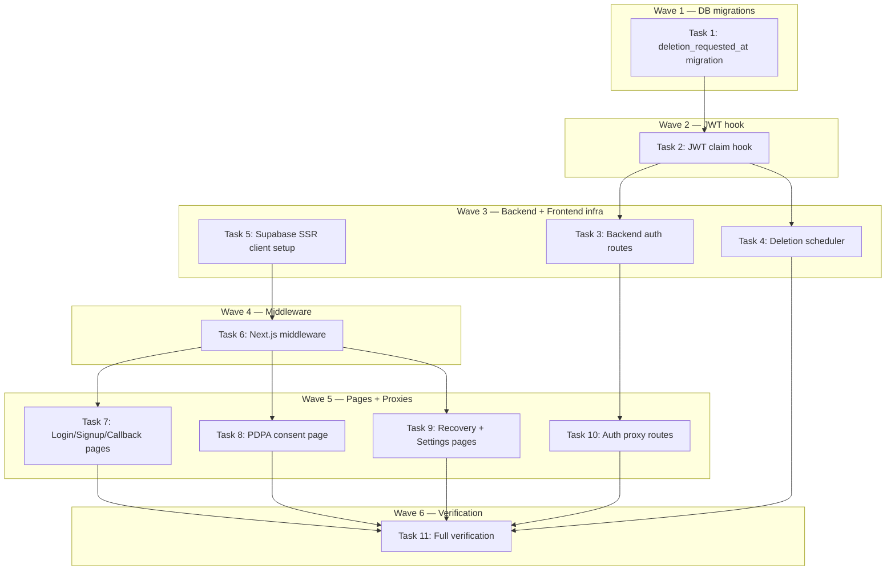

# Auth & Privacy Implementation Plan

> **For Claude:** REQUIRED SUB-SKILL: Use executing-plans to implement this plan task-by-task.

**Design Doc:** [docs/designs/2026-02-25-auth-privacy-design.md](../designs/2026-02-25-auth-privacy-design.md)

**Spec References:** §5 Compliance & Security (PDPA), §9 Business Rules (auth wall, lists cap)

**PRD References:** §3 Auth wall, §5 Privacy

**Goal:** Implement end-to-end authentication (email/password, Google, LINE), PDPA consent flow, 30-day soft-delete account deletion, and frontend session management with middleware route guards.

**Architecture:** Hybrid auth model — Supabase JS SDK (`@supabase/ssr`) owns auth flows and sessions on the frontend. Python FastAPI backend validates JWTs and owns business logic (PDPA consent, account deletion). Custom JWT claim (`pdpa_consented`) injected by a PostgreSQL Auth hook eliminates per-request API calls in middleware.

**Tech Stack:** `@supabase/ssr`, `@supabase/supabase-js`, Next.js middleware, FastAPI, Supabase Auth (email + Google + LINE OIDC), APScheduler

---

## Task 1: Database Migration — `deletion_requested_at` Column

**Files:**

- Create: `supabase/migrations/20260225000001_add_deletion_requested_at.sql`

**Step 1: Write the migration**

```sql
-- Add soft-delete support for 30-day grace period account deletion
ALTER TABLE profiles ADD COLUMN deletion_requested_at TIMESTAMPTZ;
```

No test needed — DDL-only migration. Verified by the next task's tests hitting the column.

**Step 2: Apply locally**

Run: `supabase db diff` to confirm no drift, then `supabase db push`

**Step 3: Commit**

```bash
git add supabase/migrations/20260225000001_add_deletion_requested_at.sql
git commit -m "feat(db): add deletion_requested_at to profiles for 30-day soft delete"
```

---

## Task 2: Database Migration — Custom JWT Claim Hook

**Files:**

- Create: `supabase/migrations/20260225000002_pdpa_jwt_claim_hook.sql`

**Step 1: Write the migration**

This creates a PostgreSQL function that Supabase Auth calls when minting JWTs. It injects `pdpa_consented` and `deletion_requested_at` into `app_metadata` claims.

```sql
-- Custom JWT claims hook: inject pdpa_consented + deletion status into JWT
-- Supabase Auth calls this function when minting access tokens.
-- Configure in Supabase Dashboard > Auth > Hooks > Custom Access Token.
CREATE OR REPLACE FUNCTION public.custom_access_token_hook(event JSONB)
RETURNS JSONB
LANGUAGE plpgsql
STABLE
AS $$
DECLARE
  claims JSONB;
  user_id UUID;
  consent_at TIMESTAMPTZ;
  deletion_at TIMESTAMPTZ;
BEGIN
  user_id := (event->>'user_id')::UUID;
  claims := event->'claims';

  -- Look up profile
  SELECT pdpa_consent_at, deletion_requested_at
  INTO consent_at, deletion_at
  FROM public.profiles
  WHERE id = user_id;

  -- Inject custom claims into app_metadata
  claims := jsonb_set(
    claims,
    '{app_metadata, pdpa_consented}',
    to_jsonb(consent_at IS NOT NULL)
  );
  claims := jsonb_set(
    claims,
    '{app_metadata, deletion_requested}',
    to_jsonb(deletion_at IS NOT NULL)
  );

  -- Return modified event
  event := jsonb_set(event, '{claims}', claims);
  RETURN event;
END;
$$;

-- Grant execute to supabase_auth_admin (required for Auth hooks)
GRANT EXECUTE ON FUNCTION public.custom_access_token_hook TO supabase_auth_admin;

-- Revoke from public for security
REVOKE EXECUTE ON FUNCTION public.custom_access_token_hook FROM PUBLIC;
REVOKE EXECUTE ON FUNCTION public.custom_access_token_hook FROM anon;
REVOKE EXECUTE ON FUNCTION public.custom_access_token_hook FROM authenticated;
```

No test needed — Auth hook. Verified manually via Supabase Dashboard configuration and Task 8's integration test.

**Step 2: Apply locally**

Run: `supabase db push`

**Step 3: Configure in Supabase Dashboard**

> Manual step: Go to Supabase Dashboard → Auth → Hooks → Custom Access Token → Enable → Set function to `custom_access_token_hook`.

**Step 4: Commit**

```bash
git add supabase/migrations/20260225000002_pdpa_jwt_claim_hook.sql
git commit -m "feat(db): add custom JWT claim hook for pdpa_consented + deletion_requested"
```

---

## Task 3: Backend Auth Routes

**Files:**

- Create: `backend/api/auth.py`
- Modify: `backend/main.py` (register router)
- Modify: `backend/models/types.py` (add `deletion_requested_at` to User model)
- Test: `backend/tests/api/test_auth_routes.py`

**Step 1: Write the failing tests**

```python
# backend/tests/api/test_auth_routes.py
from datetime import datetime, timezone
from unittest.mock import MagicMock, patch

from fastapi.testclient import TestClient

from main import app

client = TestClient(app)


def _mock_auth(user_id: str = "user-1"):
    """Return a patch context that mocks get_user_client + auth.get_user."""
    mock_client = MagicMock()
    mock_client.auth.get_user.return_value = MagicMock(
        user=MagicMock(id=user_id)
    )
    return patch("api.deps.get_user_client", return_value=mock_client)


class TestConsentRoute:
    def test_consent_sets_pdpa_timestamp(self):
        with _mock_auth() as mock_sb:
            mock_client = mock_sb.return_value
            mock_client.table.return_value.update.return_value.eq.return_value.execute.return_value = (
                MagicMock(data=[{"pdpa_consent_at": "2026-02-25T00:00:00Z"}])
            )
            response = client.post(
                "/auth/consent",
                headers={"Authorization": "Bearer valid-jwt"},
            )
            assert response.status_code == 200
            assert response.json()["ok"] is True

    def test_consent_rejects_unauthenticated(self):
        response = client.post("/auth/consent")
        assert response.status_code == 401

    def test_consent_is_idempotent(self):
        """Calling consent twice should succeed both times."""
        with _mock_auth() as mock_sb:
            mock_client = mock_sb.return_value
            mock_client.table.return_value.update.return_value.eq.return_value.execute.return_value = (
                MagicMock(data=[{"pdpa_consent_at": "2026-02-25T00:00:00Z"}])
            )
            response1 = client.post(
                "/auth/consent",
                headers={"Authorization": "Bearer valid-jwt"},
            )
            response2 = client.post(
                "/auth/consent",
                headers={"Authorization": "Bearer valid-jwt"},
            )
            assert response1.status_code == 200
            assert response2.status_code == 200


class TestDeleteAccountRoute:
    def test_delete_account_sets_deletion_timestamp(self):
        with _mock_auth() as mock_sb:
            mock_client = mock_sb.return_value
            mock_client.table.return_value.update.return_value.eq.return_value.execute.return_value = (
                MagicMock(data=[{"deletion_requested_at": "2026-02-25T00:00:00Z"}])
            )
            response = client.delete(
                "/auth/account",
                headers={"Authorization": "Bearer valid-jwt"},
            )
            assert response.status_code == 200
            assert response.json()["ok"] is True

    def test_delete_account_rejects_unauthenticated(self):
        response = client.delete("/auth/account")
        assert response.status_code == 401


class TestCancelDeletionRoute:
    def test_cancel_deletion_clears_timestamp(self):
        with _mock_auth() as mock_sb:
            mock_client = mock_sb.return_value
            # First call: select to check deletion exists
            mock_client.table.return_value.select.return_value.eq.return_value.single.return_value.execute.return_value = (
                MagicMock(data={"deletion_requested_at": "2026-02-25T00:00:00Z"})
            )
            # Second call: update to clear
            mock_client.table.return_value.update.return_value.eq.return_value.execute.return_value = (
                MagicMock(data=[{"deletion_requested_at": None}])
            )
            response = client.post(
                "/auth/cancel-deletion",
                headers={"Authorization": "Bearer valid-jwt"},
            )
            assert response.status_code == 200
            assert response.json()["ok"] is True

    def test_cancel_deletion_404_when_not_pending(self):
        with _mock_auth() as mock_sb:
            mock_client = mock_sb.return_value
            mock_client.table.return_value.select.return_value.eq.return_value.single.return_value.execute.return_value = (
                MagicMock(data={"deletion_requested_at": None})
            )
            response = client.post(
                "/auth/cancel-deletion",
                headers={"Authorization": "Bearer valid-jwt"},
            )
            assert response.status_code == 404
```

**Step 2: Run tests to verify they fail**

Run: `cd backend && python -m pytest tests/api/test_auth_routes.py -v`
Expected: FAIL — `ImportError` or route not found (404)

**Step 3: Update User model in types.py**

Add `deletion_requested_at` field to the `User` model in `backend/models/types.py`:

```python
class User(BaseModel):
    id: str
    email: str
    display_name: str | None = None
    avatar_url: str | None = None
    pdpa_consent_at: datetime
    deletion_requested_at: datetime | None = None  # <-- add this
    created_at: datetime
```

**Step 4: Write auth routes**

```python
# backend/api/auth.py
from typing import Any

from fastapi import APIRouter, Depends, HTTPException
from supabase import Client

from api.deps import get_current_user, get_user_db

router = APIRouter(prefix="/auth", tags=["auth"])


@router.post("/consent")
async def record_pdpa_consent(
    user: dict[str, Any] = Depends(get_current_user),  # noqa: B008
    db: Client = Depends(get_user_db),  # noqa: B008
) -> dict[str, bool]:
    """Record PDPA consent. Idempotent — safe to call multiple times.

    Sets pdpa_consent_at = NOW() on the user's profile.
    Uses the user-scoped Supabase client so RLS enforces ownership.
    """
    db.table("profiles").update(
        {"pdpa_consent_at": "now()"}
    ).eq("id", user["id"]).execute()
    return {"ok": True}


@router.delete("/account")
async def request_account_deletion(
    user: dict[str, Any] = Depends(get_current_user),  # noqa: B008
    db: Client = Depends(get_user_db),  # noqa: B008
) -> dict[str, bool]:
    """Initiate 30-day soft delete. Sets deletion_requested_at on profile."""
    db.table("profiles").update(
        {"deletion_requested_at": "now()"}
    ).eq("id", user["id"]).execute()
    return {"ok": True}


@router.post("/cancel-deletion")
async def cancel_account_deletion(
    user: dict[str, Any] = Depends(get_current_user),  # noqa: B008
    db: Client = Depends(get_user_db),  # noqa: B008
) -> dict[str, bool]:
    """Cancel pending account deletion within 30-day grace period."""
    result = (
        db.table("profiles")
        .select("deletion_requested_at")
        .eq("id", user["id"])
        .single()
        .execute()
    )
    if not result.data or result.data.get("deletion_requested_at") is None:
        raise HTTPException(status_code=404, detail="No pending deletion request")

    db.table("profiles").update(
        {"deletion_requested_at": None}
    ).eq("id", user["id"]).execute()
    return {"ok": True}
```

**Step 5: Register router in main.py**

Add to `backend/main.py` imports:

```python
from api.auth import router as auth_router
```

Add after the last `app.include_router(...)` line:

```python
app.include_router(auth_router)
```

**Step 6: Run tests to verify they pass**

Run: `cd backend && python -m pytest tests/api/test_auth_routes.py -v`
Expected: All 6 tests PASS

**Step 7: Run full backend test suite + lint**

Run: `cd backend && python -m pytest -v && ruff check . && ruff format --check .`

**Step 8: Commit**

```bash
git add backend/api/auth.py backend/tests/api/test_auth_routes.py backend/main.py backend/models/types.py
git commit -m "feat(backend): auth routes — PDPA consent, account deletion, cancel deletion"
```

---

## Task 4: Account Deletion Scheduler Handler

**Files:**

- Create: `backend/workers/handlers/account_deletion.py`
- Modify: `backend/workers/scheduler.py` (register cron job)
- Test: `backend/tests/workers/test_account_deletion.py`

**Step 1: Write the failing tests**

```python
# backend/tests/workers/test_account_deletion.py
from datetime import datetime, timedelta, timezone
from unittest.mock import AsyncMock, MagicMock, call, patch

import pytest

from workers.handlers.account_deletion import delete_expired_accounts


class TestDeleteExpiredAccounts:
    @pytest.mark.asyncio
    async def test_no_expired_profiles_does_nothing(self):
        mock_db = MagicMock()
        mock_db.table.return_value.select.return_value.lt.return_value.execute.return_value = (
            MagicMock(data=[])
        )
        with patch("workers.handlers.account_deletion.get_service_role_client", return_value=mock_db):
            await delete_expired_accounts()
        # Should not attempt to delete any user
        mock_db.auth.admin.delete_user.assert_not_called()

    @pytest.mark.asyncio
    async def test_deletes_expired_user_and_storage(self):
        expired_profile = {
            "id": "user-expired",
            "deletion_requested_at": (datetime.now(timezone.utc) - timedelta(days=31)).isoformat(),
        }
        mock_db = MagicMock()
        mock_db.table.return_value.select.return_value.lt.return_value.execute.return_value = (
            MagicMock(data=[expired_profile])
        )
        # Mock storage listing
        mock_db.storage.from_.return_value.list.return_value = [
            {"name": "photo1.jpg"},
            {"name": "photo2.jpg"},
        ]
        mock_db.storage.from_.return_value.remove.return_value = None
        mock_db.auth.admin.delete_user.return_value = None

        with patch("workers.handlers.account_deletion.get_service_role_client", return_value=mock_db):
            await delete_expired_accounts()

        mock_db.auth.admin.delete_user.assert_called_once_with("user-expired")

    @pytest.mark.asyncio
    async def test_continues_on_individual_failure(self):
        """If one user's deletion fails, others should still be processed."""
        profiles = [
            {"id": "user-1", "deletion_requested_at": "2026-01-01T00:00:00Z"},
            {"id": "user-2", "deletion_requested_at": "2026-01-01T00:00:00Z"},
        ]
        mock_db = MagicMock()
        mock_db.table.return_value.select.return_value.lt.return_value.execute.return_value = (
            MagicMock(data=profiles)
        )
        mock_db.storage.from_.return_value.list.return_value = []
        mock_db.auth.admin.delete_user.side_effect = [Exception("fail"), None]

        with patch("workers.handlers.account_deletion.get_service_role_client", return_value=mock_db):
            await delete_expired_accounts()

        # Should have attempted both
        assert mock_db.auth.admin.delete_user.call_count == 2
```

**Step 2: Run tests to verify they fail**

Run: `cd backend && python -m pytest tests/workers/test_account_deletion.py -v`
Expected: FAIL — module not found

**Step 3: Write the handler**

```python
# backend/workers/handlers/account_deletion.py
from datetime import datetime, timedelta, timezone

import structlog

from db.supabase_client import get_service_role_client

logger = structlog.get_logger()

GRACE_PERIOD_DAYS = 30


async def delete_expired_accounts() -> None:
    """Delete accounts where deletion was requested more than 30 days ago.

    For each expired account:
    1. Delete Storage objects (check-in photos, menu photos)
    2. Call auth.admin.deleteUser() — DB CASCADE handles profiles → lists → check_ins → stamps
    """
    db = get_service_role_client()
    cutoff = (datetime.now(timezone.utc) - timedelta(days=GRACE_PERIOD_DAYS)).isoformat()

    result = (
        db.table("profiles")
        .select("id, deletion_requested_at")
        .lt("deletion_requested_at", cutoff)
        .execute()
    )

    if not result.data:
        return

    logger.info("Found expired accounts to delete", count=len(result.data))

    for profile in result.data:
        user_id = profile["id"]
        try:
            # Clean up Storage objects for this user
            _delete_user_storage(db, user_id)
            # Delete auth user — CASCADE handles all DB rows
            db.auth.admin.delete_user(user_id)
            logger.info("Deleted expired account", user_id=user_id)
        except Exception:
            logger.exception("Failed to delete expired account", user_id=user_id)
            # Continue with next user


def _delete_user_storage(db, user_id: str) -> None:  # type: ignore[no-untyped-def]
    """Delete all Storage objects belonging to a user (check-in photos, menu photos)."""
    bucket = db.storage.from_("checkin-photos")
    try:
        files = bucket.list(path=user_id)
        if files:
            file_paths = [f"{user_id}/{f['name']}" for f in files]
            bucket.remove(file_paths)
            logger.info("Deleted storage files", user_id=user_id, count=len(file_paths))
    except Exception:
        logger.exception("Failed to clean up storage", user_id=user_id)
```

**Step 4: Register cron job in scheduler.py**

Add import at top of `backend/workers/scheduler.py`:

```python
from workers.handlers.account_deletion import delete_expired_accounts
```

Add job in `create_scheduler()` function, after the `run_weekly_email` cron job:

```python
    # Account deletion cleanup (daily at 4 AM)
    scheduler.add_job(
        delete_expired_accounts,
        "cron",
        hour=4,
        id="delete_expired_accounts",
    )
```

**Step 5: Run tests to verify they pass**

Run: `cd backend && python -m pytest tests/workers/test_account_deletion.py -v`
Expected: All 3 tests PASS

**Step 6: Run full backend suite**

Run: `cd backend && python -m pytest -v && ruff check . && ruff format --check .`

**Step 7: Commit**

```bash
git add backend/workers/handlers/account_deletion.py backend/tests/workers/test_account_deletion.py backend/workers/scheduler.py
git commit -m "feat(backend): account deletion scheduler — 30-day grace period cleanup"
```

---

## Task 5: Frontend Supabase Client Setup (`@supabase/ssr`)

**Files:**

- Create: `lib/supabase/server.ts`
- Create: `lib/supabase/middleware.ts`
- Create: `lib/supabase/client.ts` (browser client — this file doesn't exist yet despite the design doc saying "already exists")

No test needed — these are infrastructure utilities consumed by middleware and pages. Verified transitively by Task 7 and Task 8 tests.

**Step 1: Create browser client**

```typescript
// lib/supabase/client.ts
import { createBrowserClient } from '@supabase/ssr';

export function createClient() {
  return createBrowserClient(
    process.env.NEXT_PUBLIC_SUPABASE_URL!,
    process.env.NEXT_PUBLIC_SUPABASE_ANON_KEY!
  );
}
```

**Step 2: Create server client**

```typescript
// lib/supabase/server.ts
import { createServerClient } from '@supabase/ssr';
import { cookies } from 'next/headers';

export async function createClient() {
  const cookieStore = await cookies();

  return createServerClient(
    process.env.NEXT_PUBLIC_SUPABASE_URL!,
    process.env.NEXT_PUBLIC_SUPABASE_ANON_KEY!,
    {
      cookies: {
        getAll() {
          return cookieStore.getAll();
        },
        setAll(cookiesToSet) {
          try {
            cookiesToSet.forEach(({ name, value, options }) =>
              cookieStore.set(name, value, options)
            );
          } catch {
            // The `setAll` method was called from a Server Component.
            // This can be ignored if you have middleware refreshing sessions.
          }
        },
      },
    }
  );
}
```

**Step 3: Create middleware helper**

```typescript
// lib/supabase/middleware.ts
import { createServerClient } from '@supabase/ssr';
import { NextResponse, type NextRequest } from 'next/server';

export async function updateSession(request: NextRequest) {
  let supabaseResponse = NextResponse.next({ request });

  const supabase = createServerClient(
    process.env.NEXT_PUBLIC_SUPABASE_URL!,
    process.env.NEXT_PUBLIC_SUPABASE_ANON_KEY!,
    {
      cookies: {
        getAll() {
          return request.cookies.getAll();
        },
        setAll(cookiesToSet) {
          cookiesToSet.forEach(({ name, value }) =>
            request.cookies.set(name, value)
          );
          supabaseResponse = NextResponse.next({ request });
          cookiesToSet.forEach(({ name, value, options }) =>
            supabaseResponse.cookies.set(name, value, options)
          );
        },
      },
    }
  );

  // Refresh session — IMPORTANT: do not remove this
  const {
    data: { user },
  } = await supabase.auth.getUser();

  return { supabase, user, supabaseResponse };
}
```

**Step 4: Commit**

```bash
git add lib/supabase/client.ts lib/supabase/server.ts lib/supabase/middleware.ts
git commit -m "feat(frontend): Supabase SSR client setup — browser, server, middleware helpers"
```

---

## Task 6: Next.js Middleware (Route Guards)

**Files:**

- Create: `middleware.ts` (project root)

No test needed — Next.js middleware is tested via E2E. Verified manually and by Task 8's frontend tests.

**Step 1: Write middleware**

```typescript
// middleware.ts
import { type NextRequest, NextResponse } from 'next/server';
import { updateSession } from '@/lib/supabase/middleware';

// Routes that don't require authentication
const PUBLIC_ROUTES = ['/', '/login', '/signup', '/auth/callback', '/privacy'];
const PUBLIC_PREFIXES = ['/shops'];

// Routes that require session but NOT pdpa consent
const ONBOARDING_ROUTES = ['/onboarding/consent'];

// Routes that require session + consent but serve deletion recovery
const RECOVERY_ROUTES = ['/account/recover'];

function isPublicRoute(pathname: string): boolean {
  if (PUBLIC_ROUTES.includes(pathname)) return true;
  return PUBLIC_PREFIXES.some((prefix) => pathname.startsWith(prefix));
}

export async function middleware(request: NextRequest) {
  const { pathname } = request.nextUrl;
  const { user, supabaseResponse } = await updateSession(request);

  // Public routes — pass through
  if (isPublicRoute(pathname)) {
    return supabaseResponse;
  }

  // No session — redirect to login
  if (!user) {
    const url = request.nextUrl.clone();
    url.pathname = '/login';
    url.searchParams.set('returnTo', pathname);
    return NextResponse.redirect(url);
  }

  // Check custom claims from JWT
  const appMetadata = user.app_metadata || {};
  const pdpaConsented = appMetadata.pdpa_consented === true;
  const deletionRequested = appMetadata.deletion_requested === true;

  // Onboarding routes — just need session
  if (ONBOARDING_ROUTES.some((r) => pathname.startsWith(r))) {
    return supabaseResponse;
  }

  // Recovery routes — need session, allow even without consent
  if (RECOVERY_ROUTES.some((r) => pathname.startsWith(r))) {
    return supabaseResponse;
  }

  // Deletion pending — redirect to recovery
  if (deletionRequested) {
    const url = request.nextUrl.clone();
    url.pathname = '/account/recover';
    return NextResponse.redirect(url);
  }

  // No PDPA consent — redirect to onboarding
  if (!pdpaConsented) {
    const url = request.nextUrl.clone();
    url.pathname = '/onboarding/consent';
    return NextResponse.redirect(url);
  }

  // Authenticated + consented — pass through
  return supabaseResponse;
}

export const config = {
  matcher: [
    /*
     * Match all request paths except:
     * - _next/static (static files)
     * - _next/image (image optimization)
     * - favicon.ico (favicon)
     * - public folder assets
     */
    '/((?!_next/static|_next/image|favicon.ico|.*\\.(?:svg|png|jpg|jpeg|gif|webp)$).*)',
  ],
};
```

**Step 2: Commit**

```bash
git add middleware.ts
git commit -m "feat(frontend): Next.js middleware — route guards with PDPA consent + deletion checks"
```

---

## Task 7: Frontend Auth Pages (Login, Signup, Callback)

**Files:**

- Modify: `app/(auth)/login/page.tsx`
- Modify: `app/(auth)/signup/page.tsx`
- Create: `app/auth/callback/route.ts`
- Test: `app/(auth)/__tests__/login.test.tsx`
- Test: `app/(auth)/__tests__/signup.test.tsx`

**Step 1: Write the failing tests for Login**

```typescript
// app/(auth)/__tests__/login.test.tsx
import { render, screen } from '@testing-library/react';
import userEvent from '@testing-library/user-event';
import { describe, it, expect, vi, beforeEach } from 'vitest';

// Mock Supabase client
const mockSignInWithPassword = vi.fn();
const mockSignInWithOAuth = vi.fn();
vi.mock('@/lib/supabase/client', () => ({
  createClient: () => ({
    auth: {
      signInWithPassword: mockSignInWithPassword,
      signInWithOAuth: mockSignInWithOAuth,
    },
  }),
}));

// Mock next/navigation
const mockPush = vi.fn();
vi.mock('next/navigation', () => ({
  useRouter: () => ({ push: mockPush }),
  useSearchParams: () => new URLSearchParams(),
}));

import LoginPage from '../login/page';

describe('LoginPage', () => {
  beforeEach(() => {
    vi.clearAllMocks();
  });

  it('renders email and password fields', () => {
    render(<LoginPage />);
    expect(screen.getByLabelText(/email/i)).toBeInTheDocument();
    expect(screen.getByLabelText(/password/i)).toBeInTheDocument();
  });

  it('renders Google and LINE login buttons', () => {
    render(<LoginPage />);
    expect(screen.getByRole('button', { name: /google/i })).toBeInTheDocument();
    expect(screen.getByRole('button', { name: /line/i })).toBeInTheDocument();
  });

  it('shows error on invalid credentials', async () => {
    mockSignInWithPassword.mockResolvedValue({
      error: { message: 'Invalid credentials' },
    });
    render(<LoginPage />);
    await userEvent.type(screen.getByLabelText(/email/i), 'bad@email.com');
    await userEvent.type(screen.getByLabelText(/password/i), 'wrong');
    await userEvent.click(screen.getByRole('button', { name: /登入|sign in/i }));
    expect(await screen.findByText(/invalid/i)).toBeInTheDocument();
  });

  it('has a link to signup', () => {
    render(<LoginPage />);
    expect(screen.getByRole('link', { name: /sign up|註冊/i })).toHaveAttribute('href', '/signup');
  });
});
```

**Step 2: Write the failing tests for Signup**

```typescript
// app/(auth)/__tests__/signup.test.tsx
import { render, screen } from '@testing-library/react';
import userEvent from '@testing-library/user-event';
import { describe, it, expect, vi, beforeEach } from 'vitest';

const mockSignUp = vi.fn();
vi.mock('@/lib/supabase/client', () => ({
  createClient: () => ({
    auth: {
      signUp: mockSignUp,
    },
  }),
}));

const mockPush = vi.fn();
vi.mock('next/navigation', () => ({
  useRouter: () => ({ push: mockPush }),
  useSearchParams: () => new URLSearchParams(),
}));

import SignupPage from '../signup/page';

describe('SignupPage', () => {
  beforeEach(() => {
    vi.clearAllMocks();
  });

  it('renders email, password, and PDPA consent checkbox', () => {
    render(<SignupPage />);
    expect(screen.getByLabelText(/email/i)).toBeInTheDocument();
    expect(screen.getByLabelText(/password/i)).toBeInTheDocument();
    expect(screen.getByRole('checkbox')).toBeInTheDocument();
  });

  it('disables submit until PDPA checkbox is checked', () => {
    render(<SignupPage />);
    const submitBtn = screen.getByRole('button', { name: /註冊|sign up/i });
    expect(submitBtn).toBeDisabled();
  });

  it('enables submit after PDPA checkbox is checked', async () => {
    render(<SignupPage />);
    await userEvent.click(screen.getByRole('checkbox'));
    const submitBtn = screen.getByRole('button', { name: /註冊|sign up/i });
    expect(submitBtn).toBeEnabled();
  });

  it('has a link to privacy policy', () => {
    render(<SignupPage />);
    expect(screen.getByRole('link', { name: /隱私權政策|privacy/i })).toHaveAttribute(
      'href',
      '/privacy'
    );
  });
});
```

**Step 3: Run tests to verify they fail**

Run: `pnpm test -- app/(auth)/__tests__/`
Expected: FAIL

**Step 4: Implement Login page**

```typescript
// app/(auth)/login/page.tsx
'use client';

import Link from 'next/link';
import { useRouter, useSearchParams } from 'next/navigation';
import { useState } from 'react';
import { createClient } from '@/lib/supabase/client';

export default function LoginPage() {
  const router = useRouter();
  const searchParams = useSearchParams();
  const returnTo = searchParams.get('returnTo') || '/';
  const supabase = createClient();

  const [email, setEmail] = useState('');
  const [password, setPassword] = useState('');
  const [error, setError] = useState<string | null>(null);
  const [loading, setLoading] = useState(false);

  async function handleEmailLogin(e: React.FormEvent) {
    e.preventDefault();
    setLoading(true);
    setError(null);

    const { error } = await supabase.auth.signInWithPassword({ email, password });
    if (error) {
      setError(error.message);
      setLoading(false);
    } else {
      router.push(returnTo);
    }
  }

  async function handleOAuthLogin(provider: 'google' | 'line_oidc') {
    await supabase.auth.signInWithOAuth({
      provider: provider as any,
      options: { redirectTo: `${window.location.origin}/auth/callback?returnTo=${returnTo}` },
    });
  }

  return (
    <main className="flex min-h-screen flex-col items-center justify-center p-8">
      <div className="w-full max-w-sm space-y-6">
        <h1 className="text-center text-2xl font-bold">登入</h1>

        <form onSubmit={handleEmailLogin} className="space-y-4">
          <div>
            <label htmlFor="email" className="block text-sm font-medium">
              Email
            </label>
            <input
              id="email"
              type="email"
              value={email}
              onChange={(e) => setEmail(e.target.value)}
              required
              className="mt-1 w-full rounded border px-3 py-2"
            />
          </div>
          <div>
            <label htmlFor="password" className="block text-sm font-medium">
              Password
            </label>
            <input
              id="password"
              type="password"
              value={password}
              onChange={(e) => setPassword(e.target.value)}
              required
              className="mt-1 w-full rounded border px-3 py-2"
            />
          </div>
          {error && <p className="text-sm text-red-500">{error}</p>}
          <button
            type="submit"
            disabled={loading}
            className="w-full rounded bg-black py-2 text-white disabled:opacity-50"
          >
            {loading ? '...' : 'Sign in'}
          </button>
        </form>

        <div className="space-y-2">
          <button
            onClick={() => handleOAuthLogin('google')}
            className="w-full rounded border py-2"
          >
            Continue with Google
          </button>
          <button
            onClick={() => handleOAuthLogin('line_oidc')}
            className="w-full rounded border py-2"
          >
            Continue with LINE
          </button>
        </div>

        <p className="text-center text-sm">
          Don&apos;t have an account?{' '}
          <Link href="/signup" className="underline">
            Sign up
          </Link>
        </p>
      </div>
    </main>
  );
}
```

**Step 5: Implement Signup page**

```typescript
// app/(auth)/signup/page.tsx
'use client';

import Link from 'next/link';
import { useRouter } from 'next/navigation';
import { useState } from 'react';
import { createClient } from '@/lib/supabase/client';

export default function SignupPage() {
  const router = useRouter();
  const supabase = createClient();

  const [email, setEmail] = useState('');
  const [password, setPassword] = useState('');
  const [consent, setConsent] = useState(false);
  const [error, setError] = useState<string | null>(null);
  const [loading, setLoading] = useState(false);
  const [success, setSuccess] = useState(false);

  async function handleSignup(e: React.FormEvent) {
    e.preventDefault();
    setLoading(true);
    setError(null);

    const { error } = await supabase.auth.signUp({
      email,
      password,
      options: {
        emailRedirectTo: `${window.location.origin}/auth/callback`,
      },
    });

    if (error) {
      setError(error.message);
      setLoading(false);
    } else {
      setSuccess(true);
      setLoading(false);
    }
  }

  if (success) {
    return (
      <main className="flex min-h-screen flex-col items-center justify-center p-8">
        <div className="w-full max-w-sm space-y-4 text-center">
          <h1 className="text-2xl font-bold">Check your email</h1>
          <p className="text-sm text-gray-500">
            We sent a confirmation link to <strong>{email}</strong>.
          </p>
        </div>
      </main>
    );
  }

  return (
    <main className="flex min-h-screen flex-col items-center justify-center p-8">
      <div className="w-full max-w-sm space-y-6">
        <h1 className="text-center text-2xl font-bold">註冊</h1>

        <form onSubmit={handleSignup} className="space-y-4">
          <div>
            <label htmlFor="email" className="block text-sm font-medium">
              Email
            </label>
            <input
              id="email"
              type="email"
              value={email}
              onChange={(e) => setEmail(e.target.value)}
              required
              className="mt-1 w-full rounded border px-3 py-2"
            />
          </div>
          <div>
            <label htmlFor="password" className="block text-sm font-medium">
              Password
            </label>
            <input
              id="password"
              type="password"
              value={password}
              onChange={(e) => setPassword(e.target.value)}
              required
              minLength={8}
              className="mt-1 w-full rounded border px-3 py-2"
            />
          </div>
          <div className="flex items-start gap-2">
            <input
              id="consent"
              type="checkbox"
              checked={consent}
              onChange={(e) => setConsent(e.target.checked)}
              className="mt-1"
            />
            <label htmlFor="consent" className="text-sm">
              我已閱讀並同意{' '}
              <Link href="/privacy" className="underline">
                隱私權政策
              </Link>
            </label>
          </div>
          {error && <p className="text-sm text-red-500">{error}</p>}
          <button
            type="submit"
            disabled={!consent || loading}
            className="w-full rounded bg-black py-2 text-white disabled:opacity-50"
          >
            {loading ? '...' : 'Sign up'}
          </button>
        </form>

        <p className="text-center text-sm">
          Already have an account?{' '}
          <Link href="/login" className="underline">
            Sign in
          </Link>
        </p>
      </div>
    </main>
  );
}
```

**Step 6: Implement Auth callback route**

```typescript
// app/auth/callback/route.ts
import { NextRequest, NextResponse } from 'next/server';
import { createClient } from '@/lib/supabase/server';

export async function GET(request: NextRequest) {
  const { searchParams, origin } = new URL(request.url);
  const code = searchParams.get('code');
  const returnTo = searchParams.get('returnTo') || '/';

  if (code) {
    const supabase = await createClient();
    const { error } = await supabase.auth.exchangeCodeForSession(code);
    if (!error) {
      // Check if user has PDPA consent
      const {
        data: { user },
      } = await supabase.auth.getUser();
      const pdpaConsented = user?.app_metadata?.pdpa_consented === true;

      if (!pdpaConsented) {
        return NextResponse.redirect(`${origin}/onboarding/consent`);
      }
      return NextResponse.redirect(`${origin}${returnTo}`);
    }
  }

  // Auth code exchange failed — redirect to login with error
  return NextResponse.redirect(`${origin}/login?error=auth_callback_failed`);
}
```

**Step 7: Run tests**

Run: `pnpm test -- app/(auth)/__tests__/`
Expected: All tests PASS

**Step 8: Commit**

```bash
git add app/(auth)/login/page.tsx app/(auth)/signup/page.tsx app/auth/callback/route.ts app/(auth)/__tests__/login.test.tsx app/(auth)/__tests__/signup.test.tsx
git commit -m "feat(frontend): login, signup, and auth callback pages with PDPA consent gate"
```

---

## Task 8: PDPA Consent Page

**Files:**

- Create: `app/onboarding/consent/page.tsx`
- Test: `app/onboarding/__tests__/consent.test.tsx`

**Step 1: Write the failing tests**

```typescript
// app/onboarding/__tests__/consent.test.tsx
import { render, screen } from '@testing-library/react';
import userEvent from '@testing-library/user-event';
import { describe, it, expect, vi, beforeEach } from 'vitest';

const mockPush = vi.fn();
vi.mock('next/navigation', () => ({
  useRouter: () => ({ push: mockPush }),
}));

// Mock fetch for the consent API call
const mockFetch = vi.fn();
global.fetch = mockFetch;

vi.mock('@/lib/supabase/client', () => ({
  createClient: () => ({
    auth: {
      getSession: vi.fn().mockResolvedValue({
        data: { session: { access_token: 'test-jwt' } },
      }),
    },
  }),
}));

import ConsentPage from '../consent/page';

describe('ConsentPage', () => {
  beforeEach(() => {
    vi.clearAllMocks();
  });

  it('renders the consent disclosure text', () => {
    render(<ConsentPage />);
    expect(screen.getByText(/帳號資訊/)).toBeInTheDocument();
    expect(screen.getByText(/打卡記錄與照片/)).toBeInTheDocument();
  });

  it('disables confirm button until checkbox is checked', () => {
    render(<ConsentPage />);
    const button = screen.getByRole('button', { name: /確認並繼續|confirm/i });
    expect(button).toBeDisabled();
  });

  it('enables confirm button after checkbox is checked', async () => {
    render(<ConsentPage />);
    await userEvent.click(screen.getByRole('checkbox'));
    const button = screen.getByRole('button', { name: /確認並繼續|confirm/i });
    expect(button).toBeEnabled();
  });

  it('calls consent API and redirects on confirm', async () => {
    mockFetch.mockResolvedValue({ ok: true, json: async () => ({ ok: true }) });
    render(<ConsentPage />);
    await userEvent.click(screen.getByRole('checkbox'));
    await userEvent.click(screen.getByRole('button', { name: /確認並繼續|confirm/i }));
    expect(mockFetch).toHaveBeenCalledWith(
      '/api/auth/consent',
      expect.objectContaining({ method: 'POST' })
    );
  });
});
```

**Step 2: Run tests to verify they fail**

Run: `pnpm test -- app/onboarding/__tests__/`
Expected: FAIL

**Step 3: Implement consent page**

```typescript
// app/onboarding/consent/page.tsx
'use client';

import Link from 'next/link';
import { useRouter } from 'next/navigation';
import { useState } from 'react';
import { createClient } from '@/lib/supabase/client';

export default function ConsentPage() {
  const router = useRouter();
  const supabase = createClient();
  const [agreed, setAgreed] = useState(false);
  const [loading, setLoading] = useState(false);

  async function handleConfirm() {
    setLoading(true);
    const {
      data: { session },
    } = await supabase.auth.getSession();

    const response = await fetch('/api/auth/consent', {
      method: 'POST',
      headers: {
        Authorization: `Bearer ${session?.access_token}`,
        'Content-Type': 'application/json',
      },
    });

    if (response.ok) {
      // Refresh session to pick up updated JWT claims
      await supabase.auth.refreshSession();
      router.push('/');
    } else {
      setLoading(false);
    }
  }

  return (
    <main className="flex min-h-screen flex-col items-center justify-center p-8">
      <div className="w-full max-w-md space-y-6">
        <h1 className="text-xl font-bold">啡遊 使用前請確認</h1>

        <div className="space-y-2 text-sm">
          <p className="font-medium">我們蒐集以下資料：</p>
          <ul className="list-disc space-y-1 pl-5">
            <li>帳號資訊（Email 或社群帳號 ID）</li>
            <li>打卡記錄與照片</li>
            <li>您建立的咖啡廳清單</li>
          </ul>
        </div>

        <div className="space-y-2 text-sm">
          <p>
            <strong>用途：</strong>提供個人化服務、改善搜尋品質
          </p>
          <p>
            <strong>保留期間：</strong>帳號存續期間；刪除帳號後 30 天內清除
          </p>
          <p>
            <strong>您的權利：</strong>可隨時至「帳號設定」申請刪除帳號
          </p>
        </div>

        <p className="text-sm">
          詳見{' '}
          <Link href="/privacy" className="underline">
            隱私權政策
          </Link>
        </p>

        <div className="flex items-start gap-2">
          <input
            id="consent"
            type="checkbox"
            checked={agreed}
            onChange={(e) => setAgreed(e.target.checked)}
            className="mt-1"
          />
          <label htmlFor="consent" className="text-sm">
            我已閱讀並同意上述說明
          </label>
        </div>

        <button
          onClick={handleConfirm}
          disabled={!agreed || loading}
          className="w-full rounded bg-black py-2 text-white disabled:opacity-50"
        >
          {loading ? '...' : '確認並繼續'}
        </button>
      </div>
    </main>
  );
}
```

**Step 4: Run tests**

Run: `pnpm test -- app/onboarding/__tests__/`
Expected: All tests PASS

**Step 5: Commit**

```bash
git add app/onboarding/consent/page.tsx app/onboarding/__tests__/consent.test.tsx
git commit -m "feat(frontend): PDPA consent page with disclosure + checkbox gate"
```

---

## Task 9: Account Recovery + Settings Pages

**Files:**

- Create: `app/account/recover/page.tsx`
- Create: `app/(protected)/settings/page.tsx`
- Test: `app/account/__tests__/recover.test.tsx`

**Step 1: Write the failing test for Recovery**

```typescript
// app/account/__tests__/recover.test.tsx
import { render, screen } from '@testing-library/react';
import userEvent from '@testing-library/user-event';
import { describe, it, expect, vi, beforeEach } from 'vitest';

const mockPush = vi.fn();
vi.mock('next/navigation', () => ({
  useRouter: () => ({ push: mockPush }),
}));

const mockFetch = vi.fn();
global.fetch = mockFetch;

vi.mock('@/lib/supabase/client', () => ({
  createClient: () => ({
    auth: {
      getSession: vi.fn().mockResolvedValue({
        data: { session: { access_token: 'test-jwt' } },
      }),
    },
  }),
}));

import RecoverPage from '../recover/page';

describe('RecoverPage', () => {
  beforeEach(() => {
    vi.clearAllMocks();
  });

  it('renders recovery message', () => {
    render(<RecoverPage />);
    expect(screen.getByText(/scheduled for deletion|即將刪除/i)).toBeInTheDocument();
  });

  it('has a cancel deletion button', () => {
    render(<RecoverPage />);
    expect(screen.getByRole('button', { name: /cancel|取消刪除/i })).toBeInTheDocument();
  });

  it('calls cancel-deletion API on click', async () => {
    mockFetch.mockResolvedValue({ ok: true, json: async () => ({ ok: true }) });
    render(<RecoverPage />);
    await userEvent.click(screen.getByRole('button', { name: /cancel|取消刪除/i }));
    expect(mockFetch).toHaveBeenCalledWith(
      '/api/auth/cancel-deletion',
      expect.objectContaining({ method: 'POST' })
    );
  });
});
```

**Step 2: Run tests to verify they fail**

Run: `pnpm test -- app/account/__tests__/`
Expected: FAIL

**Step 3: Implement Recovery page**

```typescript
// app/account/recover/page.tsx
'use client';

import { useRouter } from 'next/navigation';
import { useState } from 'react';
import { createClient } from '@/lib/supabase/client';

export default function RecoverPage() {
  const router = useRouter();
  const supabase = createClient();
  const [loading, setLoading] = useState(false);
  const [error, setError] = useState<string | null>(null);

  async function handleCancel() {
    setLoading(true);
    setError(null);

    const {
      data: { session },
    } = await supabase.auth.getSession();

    const response = await fetch('/api/auth/cancel-deletion', {
      method: 'POST',
      headers: {
        Authorization: `Bearer ${session?.access_token}`,
        'Content-Type': 'application/json',
      },
    });

    if (response.ok) {
      await supabase.auth.refreshSession();
      router.push('/');
    } else {
      setError('Failed to cancel deletion. Please try again.');
      setLoading(false);
    }
  }

  return (
    <main className="flex min-h-screen flex-col items-center justify-center p-8">
      <div className="w-full max-w-sm space-y-6 text-center">
        <h1 className="text-xl font-bold">帳號即將刪除</h1>
        <p className="text-sm text-gray-500">
          Your account is scheduled for deletion. You can cancel within 30 days.
        </p>
        {error && <p className="text-sm text-red-500">{error}</p>}
        <button
          onClick={handleCancel}
          disabled={loading}
          className="w-full rounded bg-black py-2 text-white disabled:opacity-50"
        >
          {loading ? '...' : '取消刪除'}
        </button>
      </div>
    </main>
  );
}
```

**Step 4: Implement Settings page (with account deletion)**

```typescript
// app/(protected)/settings/page.tsx
'use client';

import { useRouter } from 'next/navigation';
import { useState } from 'react';
import { createClient } from '@/lib/supabase/client';

export default function SettingsPage() {
  const router = useRouter();
  const supabase = createClient();
  const [confirmText, setConfirmText] = useState('');
  const [showDeleteDialog, setShowDeleteDialog] = useState(false);
  const [loading, setLoading] = useState(false);

  async function handleDeleteAccount() {
    if (confirmText !== 'DELETE') return;
    setLoading(true);

    const {
      data: { session },
    } = await supabase.auth.getSession();

    const response = await fetch('/api/auth/account', {
      method: 'DELETE',
      headers: {
        Authorization: `Bearer ${session?.access_token}`,
        'Content-Type': 'application/json',
      },
    });

    if (response.ok) {
      await supabase.auth.signOut();
      router.push('/');
    } else {
      setLoading(false);
    }
  }

  async function handleLogout() {
    await supabase.auth.signOut();
    router.push('/');
  }

  return (
    <main className="flex min-h-screen flex-col items-center p-8">
      <div className="w-full max-w-md space-y-8">
        <h1 className="text-2xl font-bold">設定</h1>

        <section className="space-y-2">
          <h2 className="text-lg font-semibold">帳號</h2>
          <button onClick={handleLogout} className="w-full rounded border py-2">
            登出
          </button>
        </section>

        <section className="space-y-4 border-t pt-4">
          <h2 className="text-lg font-semibold text-red-600">刪除帳號</h2>
          <p className="text-sm text-gray-500">
            帳號刪除後有 30 天復原期。30 天後所有資料將永久刪除。
          </p>

          {!showDeleteDialog ? (
            <button
              onClick={() => setShowDeleteDialog(true)}
              className="w-full rounded border border-red-300 py-2 text-red-600"
            >
              刪除帳號
            </button>
          ) : (
            <div className="space-y-3 rounded border border-red-300 p-4">
              <p className="text-sm">
                Type <strong>DELETE</strong> to confirm:
              </p>
              <input
                type="text"
                value={confirmText}
                onChange={(e) => setConfirmText(e.target.value)}
                className="w-full rounded border px-3 py-2"
                placeholder="DELETE"
              />
              <button
                onClick={handleDeleteAccount}
                disabled={confirmText !== 'DELETE' || loading}
                className="w-full rounded bg-red-600 py-2 text-white disabled:opacity-50"
              >
                {loading ? '...' : '確認刪除'}
              </button>
            </div>
          )}
        </section>
      </div>
    </main>
  );
}
```

**Step 5: Run tests**

Run: `pnpm test -- app/account/__tests__/`
Expected: All tests PASS

**Step 6: Commit**

```bash
git add app/account/recover/page.tsx app/account/__tests__/recover.test.tsx app/(protected)/settings/page.tsx
git commit -m "feat(frontend): account recovery page + settings page with account deletion"
```

---

## Task 10: Frontend Auth Proxy Routes

**Files:**

- Modify: `app/api/auth/route.ts` (replace 501 placeholder)
- Create: `app/api/auth/consent/route.ts`
- Create: `app/api/auth/cancel-deletion/route.ts`
- Create: `app/api/auth/account/route.ts`

No test needed — thin proxies with no logic. Verified by integration testing.

**Step 1: Replace placeholder auth route**

```typescript
// app/api/auth/route.ts
import { NextRequest } from 'next/server';
import { proxyToBackend } from '@/lib/api/proxy';

export async function POST(request: NextRequest) {
  return proxyToBackend(request, '/auth');
}
```

**Step 2: Create consent proxy**

```typescript
// app/api/auth/consent/route.ts
import { NextRequest } from 'next/server';
import { proxyToBackend } from '@/lib/api/proxy';

export async function POST(request: NextRequest) {
  return proxyToBackend(request, '/auth/consent');
}
```

**Step 3: Create cancel-deletion proxy**

```typescript
// app/api/auth/cancel-deletion/route.ts
import { NextRequest } from 'next/server';
import { proxyToBackend } from '@/lib/api/proxy';

export async function POST(request: NextRequest) {
  return proxyToBackend(request, '/auth/cancel-deletion');
}
```

**Step 4: Create account deletion proxy**

```typescript
// app/api/auth/account/route.ts
import { NextRequest } from 'next/server';
import { proxyToBackend } from '@/lib/api/proxy';

export async function DELETE(request: NextRequest) {
  return proxyToBackend(request, '/auth/account');
}
```

**Step 5: Commit**

```bash
git add app/api/auth/route.ts app/api/auth/consent/route.ts app/api/auth/cancel-deletion/route.ts app/api/auth/account/route.ts
git commit -m "feat(frontend): auth proxy routes — consent, delete account, cancel deletion"
```

---

## Task 11: Full Verification

**Files:** None (verification only)

**Step 1: Run full backend test suite**

Run: `cd backend && python -m pytest -v`
Expected: All tests PASS

**Step 2: Run backend lint + type check**

Run: `cd backend && ruff check . && ruff format --check .`
Expected: No errors

**Step 3: Run full frontend test suite**

Run: `pnpm test`
Expected: All tests PASS

**Step 4: Run frontend lint + type check + build**

Run: `pnpm lint && pnpm type-check && pnpm build`
Expected: All pass

**Step 5: Commit if any fixes were needed**

Fix any issues found in steps 1-4, then:

```bash
git add -A && git commit -m "fix: resolve verification issues from auth & privacy implementation"
```

---

## Execution Waves



**Wave 1** (sequential — foundation):

- Task 1: `deletion_requested_at` column migration

**Wave 2** (sequential — depends on Wave 1):

- Task 2: Custom JWT claim hook migration (needs the column from Task 1)

**Wave 3** (parallel — depends on Wave 2):

- Task 3: Backend auth routes ← Task 2 (needs `deletion_requested_at`)
- Task 4: Account deletion scheduler ← Task 2
- Task 5: Frontend Supabase SSR client setup (no backend dependency)

**Wave 4** (sequential — depends on Wave 3):

- Task 6: Next.js middleware ← Task 5 (uses `updateSession` helper)

**Wave 5** (parallel — depends on Wave 4):

- Task 7: Login, Signup, Callback pages ← Task 6 (middleware must exist)
- Task 8: PDPA consent page ← Task 6
- Task 9: Account recovery + Settings pages ← Task 6
- Task 10: Auth proxy routes ← Task 3 (backend routes must exist)

**Wave 6** (sequential — depends on all):

- Task 11: Full verification ← all tasks

---

## Post-Implementation: Manual Steps

These cannot be automated and must be done by the developer:

1. **Supabase Dashboard → Auth → Hooks → Custom Access Token** — enable and point to `custom_access_token_hook` function
2. **Supabase Dashboard → Auth → Providers → Google** — configure OAuth credentials
3. **Supabase Dashboard → Auth → Providers → Custom OIDC** — configure LINE Login (Client ID, Client Secret, Discovery URL)
4. **`.env.local`** — set `NEXT_PUBLIC_SUPABASE_URL` and `NEXT_PUBLIC_SUPABASE_ANON_KEY`
