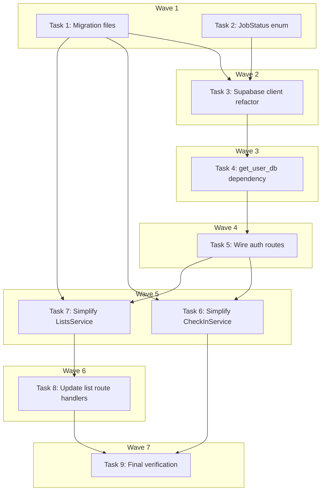

# DB Schema Fixes + Code Review Chunk 1 & 2 Implementation Plan

> **For Claude:** REQUIRED SUB-SKILL: Use executing-plans to implement this plan task-by-task.

**Design Doc:** [docs/designs/2026-02-25-db-schema-and-code-review-chunk1-2-design.md](docs/designs/2026-02-25-db-schema-and-code-review-chunk1-2-design.md)

**Spec References:** §3 Architecture Overview (database schema, RLS, job queue)

**PRD References:** —

**Goal:** Fix DB migration files to match Python models, implement per-request JWT auth for RLS enforcement, and simplify services via DB triggers.

**Architecture:** Three tightly coupled workstreams executed sequentially: (1) fix 9 SQL migration files in-place (column renames, triggers, RPC rewrite), (2) refactor Supabase client to per-request JWT for RLS, (3) simplify CheckInService and ListsService now that triggers + RLS handle atomicity and ownership.

**Tech Stack:** Supabase (Postgres 15 + pgvector), FastAPI, supabase-py, pytest

---

### Task 1: Copy and fix DB migration files

**Files:**
- Create: `supabase/migrations/20260224000001_enable_extensions.sql`
- Create: `supabase/migrations/20260224000002_create_shop_tables.sql`
- Create: `supabase/migrations/20260224000003_create_taxonomy.sql`
- Create: `supabase/migrations/20260224000004_create_user_tables.sql`
- Create: `supabase/migrations/20260224000005_create_job_queue.sql` (FIXED)
- Create: `supabase/migrations/20260224000006_create_indexes.sql`
- Create: `supabase/migrations/20260224000007_create_rls_policies.sql`
- Create: `supabase/migrations/20260224000008_seed_taxonomy.sql`
- Create: `supabase/migrations/20260224000009_create_claim_job_rpc.sql` (FIXED)

**Step 1: Copy unmodified migrations from worktree**

Copy migrations 1-4, 6-8 verbatim from `.worktrees/db-infrastructure/supabase/migrations/` to `supabase/migrations/`. These need no changes.

```bash
mkdir -p supabase/migrations
cp .worktrees/db-infrastructure/supabase/migrations/20260224000001_enable_extensions.sql supabase/migrations/
cp .worktrees/db-infrastructure/supabase/migrations/20260224000002_create_shop_tables.sql supabase/migrations/
cp .worktrees/db-infrastructure/supabase/migrations/20260224000003_create_taxonomy.sql supabase/migrations/
cp .worktrees/db-infrastructure/supabase/migrations/20260224000004_create_user_tables.sql supabase/migrations/
cp .worktrees/db-infrastructure/supabase/migrations/20260224000006_create_indexes.sql supabase/migrations/
cp .worktrees/db-infrastructure/supabase/migrations/20260224000007_create_rls_policies.sql supabase/migrations/
cp .worktrees/db-infrastructure/supabase/migrations/20260224000008_seed_taxonomy.sql supabase/migrations/
```

No test needed — SQL migration files, tested by `supabase db reset`.

**Step 2: Create fixed migration 5 (`_create_job_queue.sql`)**

Write the fixed version with these changes from the original:
- Rename `error TEXT` → `last_error TEXT`
- Rename `locked_at TIMESTAMPTZ` → `claimed_at TIMESTAMPTZ`
- Remove `locked_by TEXT` (not used by Python)
- Update status CHECK: `processing` → `claimed`
- Replace `queue_menu_photo_enrichment()` trigger with combined `handle_checkin_after_insert()` that auto-creates stamp AND queues job
- Add `enforce_max_lists_per_user()` trigger on `lists`

```sql
CREATE TABLE job_queue (
  id           UUID PRIMARY KEY DEFAULT gen_random_uuid(),
  job_type     TEXT NOT NULL CHECK (job_type IN (
    'enrich_shop', 'enrich_menu_photo', 'generate_embedding',
    'staleness_sweep', 'weekly_email'
  )),
  payload      JSONB NOT NULL DEFAULT '{}',
  status       TEXT NOT NULL DEFAULT 'pending' CHECK (status IN (
    'pending', 'claimed', 'completed', 'failed', 'dead_letter'
  )),
  priority     SMALLINT NOT NULL DEFAULT 0,
  attempts     SMALLINT NOT NULL DEFAULT 0,
  max_attempts SMALLINT NOT NULL DEFAULT 3,
  last_error   TEXT,
  claimed_at   TIMESTAMPTZ,
  scheduled_at TIMESTAMPTZ NOT NULL DEFAULT now(),
  completed_at TIMESTAMPTZ,
  created_at   TIMESTAMPTZ NOT NULL DEFAULT now()
);

-- Combined trigger: auto-create stamp + queue menu photo enrichment
CREATE OR REPLACE FUNCTION handle_checkin_after_insert()
RETURNS TRIGGER AS $$
BEGIN
  -- Auto-create stamp for the check-in
  INSERT INTO stamps (user_id, shop_id, check_in_id, design_url, earned_at)
  VALUES (NEW.user_id, NEW.shop_id, NEW.id, '/stamps/' || NEW.shop_id || '.svg', now());

  -- Queue menu photo enrichment if photo provided
  IF NEW.menu_photo_url IS NOT NULL THEN
    INSERT INTO job_queue (job_type, payload, priority)
    VALUES (
      'enrich_menu_photo',
      jsonb_build_object('shop_id', NEW.shop_id, 'image_url', NEW.menu_photo_url),
      5
    );
  END IF;

  RETURN NEW;
END;
$$ LANGUAGE plpgsql SECURITY DEFINER;

CREATE TRIGGER trg_checkin_after_insert
  AFTER INSERT ON check_ins
  FOR EACH ROW
  EXECUTE FUNCTION handle_checkin_after_insert();

-- Trigger: enforce max 3 lists per user
CREATE OR REPLACE FUNCTION enforce_max_lists_per_user()
RETURNS TRIGGER AS $$
DECLARE
  list_count INTEGER;
BEGIN
  SELECT COUNT(*) INTO list_count
  FROM lists WHERE user_id = NEW.user_id;

  IF list_count >= 3 THEN
    RAISE EXCEPTION 'Maximum of 3 lists allowed'
      USING ERRCODE = 'check_violation';
  END IF;

  RETURN NEW;
END;
$$ LANGUAGE plpgsql;

CREATE TRIGGER trg_enforce_max_lists
  BEFORE INSERT ON lists
  FOR EACH ROW
  EXECUTE FUNCTION enforce_max_lists_per_user();
```

No test needed — SQL migration, tested by `supabase db reset`.

**Step 3: Create fixed migration 9 (`_create_claim_job_rpc.sql`)**

Rewrite to match Python backend expectations:
- Parameter: `p_job_type TEXT DEFAULT NULL` (not `worker_id TEXT`)
- Status: `claimed` (not `processing`)
- Column: `claimed_at` (not `locked_at`)
- Optional job type filter

```sql
-- RPC function for atomic job claiming (used by workers via supabase.rpc)
CREATE OR REPLACE FUNCTION claim_job(p_job_type TEXT DEFAULT NULL)
RETURNS SETOF job_queue AS $$
  UPDATE job_queue
  SET status = 'claimed',
      claimed_at = now(),
      attempts = attempts + 1
  WHERE id = (
    SELECT id FROM job_queue
    WHERE status = 'pending'
      AND scheduled_at <= now()
      AND (p_job_type IS NULL OR job_type = p_job_type)
    ORDER BY priority DESC, scheduled_at ASC
    LIMIT 1
    FOR UPDATE SKIP LOCKED
  )
  RETURNING *;
$$ LANGUAGE sql VOLATILE SECURITY DEFINER;
```

No test needed — SQL migration, tested by `supabase db reset`.

**Step 4: Commit**

```bash
git add supabase/migrations/
git commit -m "feat(db): add migration files with fixed job_queue schema and triggers

Copy 9 migration files from feat/db-infrastructure branch.
Fix migration 5: rename columns to match Python models (error→last_error,
locked_at→claimed_at), replace partial trigger with combined check-in
trigger (auto-stamp + job queue), add list cap trigger.
Fix migration 9: rewrite claim_job RPC for Python backend compatibility."
```

---

### Task 2: Add DEAD_LETTER to JobStatus enum and widen Job.payload

**Files:**
- Modify: `backend/models/types.py:159-169`
- Test: `backend/tests/models/test_types.py` (create)

**Step 1: Write the failing test**

Create `backend/tests/models/test_types.py`:

```python
from models.types import JobStatus


class TestJobStatus:
    def test_dead_letter_status_exists(self):
        """DB has dead_letter status — Python enum must match."""
        assert JobStatus.DEAD_LETTER == "dead_letter"

    def test_all_db_statuses_covered(self):
        """Every status in the DB CHECK constraint must have a Python enum value."""
        db_statuses = {"pending", "claimed", "completed", "failed", "dead_letter"}
        enum_values = {s.value for s in JobStatus}
        assert db_statuses == enum_values
```

**Step 2: Run test to verify it fails**

Run: `cd backend && python -m pytest tests/models/test_types.py -v`
Expected: FAIL — `JobStatus` has no attribute `DEAD_LETTER`

**Step 3: Implement**

In `backend/models/types.py`, add `DEAD_LETTER` to `JobStatus` (after line 163):

```python
class JobStatus(StrEnum):
    PENDING = "pending"
    CLAIMED = "claimed"
    COMPLETED = "completed"
    FAILED = "failed"
    DEAD_LETTER = "dead_letter"
```

Also widen `Job.payload` type (line 169) from:
```python
payload: dict[str, str | int | float | bool | None]
```
to:
```python
payload: dict[str, Any]
```

And add `Any` to the imports on line 3:
```python
from typing import Any, Literal
```

**Step 4: Run test to verify it passes**

Run: `cd backend && python -m pytest tests/models/test_types.py -v`
Expected: PASS

**Step 5: Commit**

```bash
git add backend/models/types.py backend/tests/models/test_types.py
git commit -m "fix(models): add DEAD_LETTER status and widen Job.payload to dict[str, Any]

Aligns JobStatus enum with DB CHECK constraint (includes dead_letter).
Widens Job.payload to support nested payloads (code review fix D6)."
```

---

### Task 3: Refactor Supabase client for per-request JWT

**Files:**
- Modify: `backend/db/supabase_client.py`
- Modify: `backend/tests/db/test_supabase_client.py`

**Step 1: Write the failing tests**

Replace contents of `backend/tests/db/test_supabase_client.py`:

```python
from unittest.mock import patch

from db.supabase_client import get_service_role_client, get_user_client


class TestSupabaseClient:
    def test_get_user_client_creates_client_with_token(self):
        """Per-request client must be created with the user's JWT."""
        with patch("db.supabase_client.create_client") as mock_create, \
             patch("db.supabase_client.settings") as mock_settings:
            mock_settings.supabase_url = "http://localhost:54321"
            mock_settings.supabase_anon_key = "test-anon-key"
            get_user_client("user-jwt-token")
            mock_create.assert_called_once()
            # Verify the token is passed in options headers
            call_kwargs = mock_create.call_args
            options = call_kwargs[1].get("options") or call_kwargs[0][2] if len(call_kwargs[0]) > 2 else None
            assert options is not None

    def test_get_user_client_is_not_cached(self):
        """Each call must return a fresh client (not singleton)."""
        with patch("db.supabase_client.create_client") as mock_create, \
             patch("db.supabase_client.settings") as mock_settings:
            mock_settings.supabase_url = "http://localhost:54321"
            mock_settings.supabase_anon_key = "test-anon-key"
            mock_create.return_value = "client-1"
            c1 = get_user_client("token-1")
            mock_create.return_value = "client-2"
            c2 = get_user_client("token-2")
            assert mock_create.call_count == 2

    def test_get_service_role_client_returns_client(self):
        with patch("db.supabase_client.settings") as mock_settings:
            mock_settings.supabase_url = "http://localhost:54321"
            mock_settings.supabase_service_role_key = "test-service-key"
            client = get_service_role_client()
            assert client is not None

    def test_service_role_client_is_singleton(self):
        with patch("db.supabase_client.settings") as mock_settings:
            mock_settings.supabase_url = "http://localhost:54321"
            mock_settings.supabase_service_role_key = "test-service-key"
            c1 = get_service_role_client()
            c2 = get_service_role_client()
            assert c1 is c2
```

**Step 2: Run test to verify it fails**

Run: `cd backend && python -m pytest tests/db/test_supabase_client.py -v`
Expected: FAIL — `get_user_client` not found (only `get_supabase_client` exists)

**Step 3: Implement**

Replace `backend/db/supabase_client.py`:

```python
from functools import lru_cache

from supabase import Client, ClientOptions, create_client

from core.config import settings


def get_user_client(token: str) -> Client:
    """Create a per-request Supabase client authenticated with the user's JWT.

    This makes auth.uid() available in RLS policies, so Postgres can enforce
    row-level ownership checks without application-level verification.
    """
    return create_client(
        settings.supabase_url,
        settings.supabase_anon_key,
        options=ClientOptions(
            headers={"Authorization": f"Bearer {token}"}
        ),
    )


@lru_cache(maxsize=1)
def get_service_role_client() -> Client:
    """Get Supabase client using service role key (bypasses RLS).
    Use only for worker processes and admin operations."""
    return create_client(settings.supabase_url, settings.supabase_service_role_key)
```

Note: `get_supabase_client()` (the old anon singleton) is removed. Public routes (shops.py) will be updated to use `get_service_role_client()` for reads or continue using a simple client — see Task 5 for details.

**Step 4: Run test to verify it passes**

Run: `cd backend && python -m pytest tests/db/test_supabase_client.py -v`
Expected: PASS

**Step 5: Commit**

```bash
git add backend/db/supabase_client.py backend/tests/db/test_supabase_client.py
git commit -m "feat(auth): add per-request JWT Supabase client

Replace singleton anon-key client with per-request get_user_client(token)
that sets the user's JWT in PostgREST headers, enabling auth.uid() in
RLS policies. Service role client unchanged (workers only)."
```

---

### Task 4: Add get_user_db FastAPI dependency

**Files:**
- Modify: `backend/api/deps.py`
- Modify: `backend/tests/api/test_auth.py`

**Step 1: Write the failing tests**

Add new tests to `backend/tests/api/test_auth.py`. Append after the existing `TestAuth` class:

```python
class TestGetUserDb:
    def test_get_user_db_returns_client_for_valid_token(self):
        """get_user_db should create a per-request client with the user's JWT."""
        from api.deps import get_user_db

        test_app = FastAPI()

        @test_app.get("/db-test")
        async def db_test_route(db=Depends(get_user_db)):  # noqa: B008
            return {"has_db": db is not None}

        test_client = TestClient(test_app)
        with patch("api.deps.get_user_client") as mock_get_client:
            mock_get_client.return_value = MagicMock()
            response = test_client.get(
                "/db-test",
                headers={"Authorization": "Bearer valid-jwt"},
            )
            assert response.status_code == 200
            mock_get_client.assert_called_once_with("valid-jwt")

    def test_get_user_db_raises_401_without_token(self):
        """get_user_db should raise 401 when no Authorization header."""
        from api.deps import get_user_db

        test_app = FastAPI()

        @test_app.get("/db-test")
        async def db_test_route(db=Depends(get_user_db)):  # noqa: B008
            return {"has_db": True}

        test_client = TestClient(test_app)
        response = test_client.get("/db-test")
        assert response.status_code == 401
```

**Step 2: Run test to verify it fails**

Run: `cd backend && python -m pytest tests/api/test_auth.py::TestGetUserDb -v`
Expected: FAIL — `get_user_db` not found in `api.deps`

**Step 3: Implement**

Update `backend/api/deps.py`. Add `get_user_db` function and update imports:

```python
from typing import Any

from fastapi import HTTPException, Request, status
from supabase import Client

from db.supabase_client import get_user_client


async def get_user_db(request: Request) -> Client:
    """Extract JWT from Authorization header and return an authenticated Supabase client.

    This client has auth.uid() set in PostgREST, so RLS policies
    automatically enforce row-level ownership.
    """
    auth_header = request.headers.get("Authorization")
    if not auth_header or not auth_header.startswith("Bearer "):
        raise HTTPException(
            status_code=status.HTTP_401_UNAUTHORIZED,
            detail="Missing or invalid Authorization header",
        )
    token = auth_header.removeprefix("Bearer ")
    return get_user_client(token)


async def get_current_user(request: Request) -> dict[str, Any]:
    """Extract and validate JWT from Authorization header. Raises 401 if invalid."""
    auth_header = request.headers.get("Authorization")
    if not auth_header or not auth_header.startswith("Bearer "):
        raise HTTPException(
            status_code=status.HTTP_401_UNAUTHORIZED,
            detail="Missing or invalid Authorization header",
        )

    token = auth_header.removeprefix("Bearer ")
    try:
        client = get_user_client(token)
        response = client.auth.get_user(token)
        if response is None or response.user is None:
            raise HTTPException(
                status_code=status.HTTP_401_UNAUTHORIZED,
                detail="Invalid or expired token",
            )
        return {"id": response.user.id}
    except HTTPException:
        raise
    except Exception:
        raise HTTPException(
            status_code=status.HTTP_401_UNAUTHORIZED,
            detail="Invalid or expired token",
        ) from None


async def get_optional_user(request: Request) -> dict[str, Any] | None:
    """Same as get_current_user but returns None instead of raising for unauthenticated."""
    auth_header = request.headers.get("Authorization")
    if not auth_header or not auth_header.startswith("Bearer "):
        return None

    token = auth_header.removeprefix("Bearer ")
    try:
        client = get_user_client(token)
        response = client.auth.get_user(token)
        if response is None or response.user is None:
            return None
        return {"id": response.user.id}
    except Exception:
        return None
```

Key changes:
- Imports `get_user_client` instead of `get_supabase_client`
- New `get_user_db()` dependency returns an authenticated Supabase client
- `get_current_user()` now uses `get_user_client()` instead of the anon singleton
- `get_optional_user()` similarly updated

**Step 4: Run test to verify it passes**

Run: `cd backend && python -m pytest tests/api/test_auth.py -v`
Expected: PASS (all existing tests + new tests)

**Step 5: Commit**

```bash
git add backend/api/deps.py backend/tests/api/test_auth.py
git commit -m "feat(auth): add get_user_db dependency for per-request JWT client

New FastAPI dependency extracts Bearer token and returns an authenticated
Supabase client. Also updates get_current_user to use per-request client
instead of anon singleton."
```

---

### Task 5: Wire auth-required routes to per-request client

**Files:**
- Modify: `backend/api/checkins.py`
- Modify: `backend/api/lists.py`
- Modify: `backend/api/stamps.py`
- Modify: `backend/api/search.py`
- Modify: `backend/api/shops.py`
- Modify: `backend/tests/api/test_checkins.py`
- Modify: `backend/tests/api/test_lists.py`
- Modify: `backend/tests/api/test_search.py`
- Modify: `backend/tests/api/test_shops.py`

**Step 1: Write the failing tests**

Update test files to patch `get_user_db` instead of `get_supabase_client` for auth-required routes.

**`backend/tests/api/test_checkins.py`** — replace entire file:

```python
from unittest.mock import AsyncMock, MagicMock, patch

from fastapi.testclient import TestClient

from api.deps import get_current_user, get_user_db
from main import app

client = TestClient(app)


class TestCheckinsAPI:
    def test_create_checkin_requires_auth(self):
        response = client.post("/checkins", json={
            "shop_id": "shop-1",
            "photo_urls": ["https://example.com/photo.jpg"],
        })
        assert response.status_code == 401

    def test_get_user_checkins_requires_auth(self):
        response = client.get("/checkins")
        assert response.status_code == 401

    def test_create_checkin_empty_photos_returns_400(self):
        """Empty photo_urls must return 400, not 500 (ValueError caught in route)."""
        mock_db = MagicMock()
        app.dependency_overrides[get_current_user] = lambda: {"id": "user-1"}
        app.dependency_overrides[get_user_db] = lambda: mock_db
        try:
            with patch("api.checkins.CheckInService") as mock_cls:
                mock_svc = AsyncMock()
                mock_svc.create.side_effect = ValueError(
                    "At least one photo is required for check-in"
                )
                mock_cls.return_value = mock_svc
                response = client.post("/checkins/", json={
                    "shop_id": "shop-1",
                    "photo_urls": [],
                })
            assert response.status_code == 400
            assert "photo" in response.json()["detail"].lower()
        finally:
            app.dependency_overrides.clear()

    def test_create_checkin_uses_user_db(self):
        """Route must use per-request JWT client, not anon singleton."""
        mock_db = MagicMock()
        app.dependency_overrides[get_current_user] = lambda: {"id": "user-1"}
        app.dependency_overrides[get_user_db] = lambda: mock_db
        try:
            with patch("api.checkins.CheckInService") as mock_cls:
                mock_svc = AsyncMock()
                mock_svc.create.return_value = MagicMock(
                    model_dump=lambda: {"id": "ci-1"}
                )
                mock_cls.return_value = mock_svc
                client.post("/checkins/", json={
                    "shop_id": "shop-1",
                    "photo_urls": ["https://example.com/photo.jpg"],
                })
                # Verify service was constructed with the user's DB client
                mock_cls.assert_called_once_with(db=mock_db)
        finally:
            app.dependency_overrides.clear()
```

**`backend/tests/api/test_lists.py`** — replace entire file:

```python
from unittest.mock import AsyncMock, MagicMock, patch

from fastapi.testclient import TestClient

from api.deps import get_current_user, get_user_db
from main import app

client = TestClient(app)


class TestListsAPI:
    def test_create_list_requires_auth(self):
        response = client.post("/lists", json={"name": "Favorites"})
        assert response.status_code == 401

    def test_get_lists_requires_auth(self):
        response = client.get("/lists")
        assert response.status_code == 401

    def test_delete_list_requires_auth(self):
        response = client.delete("/lists/list-1")
        assert response.status_code == 401

    def test_create_list_cap_returns_400(self):
        """Creating beyond the 3-list cap must return 400 with a clear message."""
        mock_db = MagicMock()
        app.dependency_overrides[get_current_user] = lambda: {"id": "user-1"}
        app.dependency_overrides[get_user_db] = lambda: mock_db
        try:
            with patch("api.lists.ListsService") as mock_cls:
                mock_svc = AsyncMock()
                mock_svc.create.side_effect = ValueError("Maximum 3 lists per user.")
                mock_cls.return_value = mock_svc
                response = client.post("/lists/", json={"name": "Fourth List"})
            assert response.status_code == 400
            assert "3" in response.json()["detail"] or "Maximum" in response.json()["detail"]
        finally:
            app.dependency_overrides.clear()

    def test_create_list_uses_user_db(self):
        """Route must use per-request JWT client."""
        mock_db = MagicMock()
        app.dependency_overrides[get_current_user] = lambda: {"id": "user-1"}
        app.dependency_overrides[get_user_db] = lambda: mock_db
        try:
            with patch("api.lists.ListsService") as mock_cls:
                mock_svc = AsyncMock()
                mock_svc.create.return_value = MagicMock(
                    model_dump=lambda: {"id": "l1", "name": "Fav"}
                )
                mock_cls.return_value = mock_svc
                client.post("/lists/", json={"name": "Fav"})
                mock_cls.assert_called_once_with(db=mock_db)
        finally:
            app.dependency_overrides.clear()
```

**`backend/tests/api/test_search.py`** — replace entire file:

```python
from unittest.mock import AsyncMock, MagicMock, patch

from fastapi.testclient import TestClient

from api.deps import get_current_user, get_user_db
from main import app

client = TestClient(app)


class TestSearchAPI:
    def test_search_requires_auth(self):
        """GET /search should require auth."""
        response = client.get("/search?text=good+wifi")
        assert response.status_code == 401

    def test_search_uses_user_db(self):
        """Search route must use per-request JWT client."""
        mock_db = MagicMock()
        mock_db.rpc = MagicMock(return_value=MagicMock(
            execute=MagicMock(return_value=MagicMock(data=[]))
        ))
        app.dependency_overrides[get_current_user] = lambda: {"id": "user-1"}
        app.dependency_overrides[get_user_db] = lambda: mock_db
        try:
            with patch("api.search.get_embeddings_provider") as mock_emb_factory, \
                 patch("api.search.SearchService") as mock_cls:
                mock_emb = AsyncMock()
                mock_emb.embed = AsyncMock(return_value=[0.1] * 1536)
                mock_emb.dimensions = 1536
                mock_emb_factory.return_value = mock_emb
                mock_svc = AsyncMock()
                mock_svc.search.return_value = []
                mock_cls.return_value = mock_svc
                response = client.get(
                    "/search?text=good+wifi",
                    headers={"Authorization": "Bearer valid-jwt"},
                )
                assert response.status_code == 200
                mock_cls.assert_called_once_with(db=mock_db, embeddings=mock_emb)
        finally:
            app.dependency_overrides.clear()
```

**`backend/tests/api/test_shops.py`** — no changes needed (shops stay on anon client).

**Step 2: Run tests to verify they fail**

Run: `cd backend && python -m pytest tests/api/test_checkins.py tests/api/test_lists.py tests/api/test_search.py -v`
Expected: FAIL — routes still use `get_supabase_client()`, not `get_user_db`

**Step 3: Implement route changes**

**`backend/api/checkins.py`** — replace entire file:

```python
from typing import Any

from fastapi import APIRouter, Depends, HTTPException
from pydantic import BaseModel
from supabase import Client

from api.deps import get_current_user, get_user_db
from services.checkin_service import CheckInService

router = APIRouter(prefix="/checkins", tags=["checkins"])


class CreateCheckInRequest(BaseModel):
    shop_id: str
    photo_urls: list[str]
    menu_photo_url: str | None = None
    note: str | None = None


@router.post("/")
async def create_checkin(
    body: CreateCheckInRequest,
    user: dict[str, Any] = Depends(get_current_user),  # noqa: B008
    db: Client = Depends(get_user_db),  # noqa: B008
) -> dict[str, Any]:
    """Create a check-in. Auth required."""
    service = CheckInService(db=db)
    try:
        result = await service.create(
            user_id=user["id"],
            shop_id=body.shop_id,
            photo_urls=body.photo_urls,
            menu_photo_url=body.menu_photo_url,
            note=body.note,
        )
        return result.model_dump()
    except ValueError as e:
        raise HTTPException(status_code=400, detail=str(e)) from None


@router.get("/")
async def get_my_checkins(
    user: dict[str, Any] = Depends(get_current_user),  # noqa: B008
    db: Client = Depends(get_user_db),  # noqa: B008
) -> list[dict[str, Any]]:
    """Get current user's check-ins. Auth required."""
    service = CheckInService(db=db)
    results = await service.get_by_user(user["id"])
    return [r.model_dump() for r in results]
```

**`backend/api/lists.py`** — replace entire file:

```python
from typing import Any

from fastapi import APIRouter, Depends, HTTPException
from pydantic import BaseModel
from supabase import Client

from api.deps import get_current_user, get_user_db
from services.lists_service import ListsService

router = APIRouter(prefix="/lists", tags=["lists"])


class CreateListRequest(BaseModel):
    name: str


class AddShopRequest(BaseModel):
    shop_id: str


@router.get("/")
async def get_my_lists(
    user: dict[str, Any] = Depends(get_current_user),  # noqa: B008
    db: Client = Depends(get_user_db),  # noqa: B008
) -> list[dict[str, Any]]:
    """Get current user's lists. Auth required."""
    service = ListsService(db=db)
    results = await service.get_by_user(user["id"])
    return [r.model_dump() for r in results]


@router.post("/")
async def create_list(
    body: CreateListRequest,
    user: dict[str, Any] = Depends(get_current_user),  # noqa: B008
    db: Client = Depends(get_user_db),  # noqa: B008
) -> dict[str, Any]:
    """Create a new list. Auth required. Max 3 lists per user."""
    service = ListsService(db=db)
    try:
        result = await service.create(user_id=user["id"], name=body.name)
        return result.model_dump()
    except ValueError as e:
        raise HTTPException(status_code=400, detail=str(e)) from None


@router.delete("/{list_id}")
async def delete_list(
    list_id: str,
    user: dict[str, Any] = Depends(get_current_user),  # noqa: B008
    db: Client = Depends(get_user_db),  # noqa: B008
) -> dict[str, bool]:
    """Delete a list. Auth required."""
    service = ListsService(db=db)
    try:
        await service.delete(list_id=list_id, user_id=user["id"])
        return {"ok": True}
    except ValueError as e:
        raise HTTPException(status_code=403, detail=str(e)) from None


@router.post("/{list_id}/shops")
async def add_shop_to_list(
    list_id: str,
    body: AddShopRequest,
    user: dict[str, Any] = Depends(get_current_user),  # noqa: B008
    db: Client = Depends(get_user_db),  # noqa: B008
) -> dict[str, Any]:
    """Add a shop to a list. Auth required."""
    service = ListsService(db=db)
    try:
        result = await service.add_shop(
            list_id=list_id, shop_id=body.shop_id, user_id=user["id"]
        )
        return result.model_dump()
    except ValueError as e:
        raise HTTPException(status_code=403, detail=str(e)) from None


@router.delete("/{list_id}/shops/{shop_id}")
async def remove_shop_from_list(
    list_id: str,
    shop_id: str,
    user: dict[str, Any] = Depends(get_current_user),  # noqa: B008
    db: Client = Depends(get_user_db),  # noqa: B008
) -> dict[str, bool]:
    """Remove a shop from a list. Auth required."""
    service = ListsService(db=db)
    try:
        await service.remove_shop(list_id=list_id, shop_id=shop_id, user_id=user["id"])
        return {"ok": True}
    except ValueError as e:
        raise HTTPException(status_code=403, detail=str(e)) from None
```

**`backend/api/search.py`** — replace entire file:

```python
from typing import Any

from fastapi import APIRouter, Depends, Query
from supabase import Client

from api.deps import get_current_user, get_user_db
from models.types import SearchQuery
from providers.embeddings import get_embeddings_provider
from services.search_service import SearchService

router = APIRouter(tags=["search"])


@router.get("/search")
async def search(
    text: str = Query(..., min_length=1),
    limit: int = Query(20, ge=1, le=50),
    user: dict[str, Any] = Depends(get_current_user),  # noqa: B008
    db: Client = Depends(get_user_db),  # noqa: B008
) -> list[dict[str, Any]]:
    """Semantic search. Auth required."""
    embeddings = get_embeddings_provider()
    service = SearchService(db=db, embeddings=embeddings)
    query = SearchQuery(text=text, limit=limit)
    results = await service.search(query)
    return [r.model_dump() for r in results]
```

**`backend/api/stamps.py`** — replace entire file:

```python
from typing import Any

from fastapi import APIRouter, Depends
from supabase import Client

from api.deps import get_current_user, get_user_db

router = APIRouter(prefix="/stamps", tags=["stamps"])


@router.get("/")
async def get_my_stamps(
    user: dict[str, Any] = Depends(get_current_user),  # noqa: B008
    db: Client = Depends(get_user_db),  # noqa: B008
) -> list[Any]:
    """Get current user's stamps. Auth required."""
    response = (
        db.table("stamps")
        .select("*")
        .eq("user_id", user["id"])
        .order("earned_at", desc=True)
        .execute()
    )
    return response.data
```

**`backend/api/shops.py`** — keep using anon client for public access. Update import:

```python
from typing import Any

from fastapi import APIRouter

from db.supabase_client import get_service_role_client

router = APIRouter(prefix="/shops", tags=["shops"])


@router.get("/")
async def list_shops(city: str | None = None) -> list[Any]:
    """List shops. Public — no auth required."""
    db = get_service_role_client()
    query = db.table("shops").select("*")
    if city:
        query = query.eq("city", city)
    response = query.execute()
    return response.data


@router.get("/{shop_id}")
async def get_shop(shop_id: str) -> Any:
    """Get a single shop by ID. Public — no auth required."""
    db = get_service_role_client()
    response = db.table("shops").select("*").eq("id", shop_id).single().execute()
    return response.data
```

Note: shops.py uses `get_service_role_client()` for public reads because RLS allows public SELECT on shops. The old `get_supabase_client()` no longer exists.

Update `backend/tests/api/test_shops.py` to match new import:

```python
from unittest.mock import MagicMock, patch

from fastapi.testclient import TestClient

from main import app

client = TestClient(app)


class TestShopsAPI:
    def test_list_shops_is_public(self):
        """GET /shops should not require auth."""
        with patch("api.shops.get_service_role_client") as mock_sb:
            mock_client = MagicMock()
            mock_client.table = MagicMock(return_value=MagicMock(
                select=MagicMock(return_value=MagicMock(
                    execute=MagicMock(return_value=MagicMock(data=[]))
                ))
            ))
            mock_sb.return_value = mock_client
            response = client.get("/shops")
            assert response.status_code == 200

    def test_get_shop_by_id_is_public(self):
        """GET /shops/{id} should not require auth."""
        with patch("api.shops.get_service_role_client") as mock_sb:
            mock_client = MagicMock()
            mock_client.table = MagicMock(return_value=MagicMock(
                select=MagicMock(return_value=MagicMock(
                    eq=MagicMock(return_value=MagicMock(
                        single=MagicMock(return_value=MagicMock(
                            execute=MagicMock(return_value=MagicMock(data={
                                "id": "shop-1", "name": "Test Cafe"
                            }))
                        ))
                    ))
                ))
            ))
            mock_sb.return_value = mock_client
            response = client.get("/shops/shop-1")
            assert response.status_code == 200
```

**Step 4: Run tests to verify they pass**

Run: `cd backend && python -m pytest tests/api/ -v`
Expected: PASS

**Step 5: Commit**

```bash
git add backend/api/ backend/tests/api/
git commit -m "feat(auth): wire all auth routes to per-request JWT client

Auth-required routes (checkins, lists, stamps, search) now use
Depends(get_user_db) for per-request JWT Supabase client.
Public routes (shops) use service role client for reads.
Removes all references to old get_supabase_client singleton."
```

---

### Task 6: Simplify CheckInService (trigger-backed)

**Files:**
- Modify: `backend/services/checkin_service.py`
- Modify: `backend/tests/services/test_checkin_service.py`

**Step 1: Write the failing tests**

Replace `backend/tests/services/test_checkin_service.py`:

```python
from datetime import datetime
from unittest.mock import MagicMock

import pytest

from services.checkin_service import CheckInService


@pytest.fixture
def mock_supabase():
    client = MagicMock()
    return client


@pytest.fixture
def checkin_service(mock_supabase):
    return CheckInService(db=mock_supabase)


class TestCheckInService:
    async def test_create_requires_at_least_one_photo(self, checkin_service):
        with pytest.raises(ValueError, match="At least one photo"):
            await checkin_service.create(
                user_id="user-1",
                shop_id="shop-1",
                photo_urls=[],
            )

    async def test_create_only_inserts_checkin_row(self, checkin_service, mock_supabase):
        """After trigger migration: create() should ONLY insert into check_ins.
        Stamp creation and job queueing are handled by the DB trigger."""
        mock_supabase.table = MagicMock(return_value=MagicMock(
            insert=MagicMock(return_value=MagicMock(
                execute=MagicMock(return_value=MagicMock(data=[{
                    "id": "ci-1",
                    "user_id": "user-1",
                    "shop_id": "shop-1",
                    "photo_urls": ["https://example.com/photo.jpg"],
                    "menu_photo_url": None,
                    "note": None,
                    "created_at": datetime.now().isoformat(),
                }]))
            ))
        ))
        result = await checkin_service.create(
            user_id="user-1",
            shop_id="shop-1",
            photo_urls=["https://example.com/photo.jpg"],
        )
        assert result.id == "ci-1"
        # Service should only call table("check_ins") — NOT stamps or job_queue
        table_calls = [c[0][0] for c in mock_supabase.table.call_args_list]
        assert table_calls == ["check_ins"]

    async def test_create_with_menu_photo_still_only_inserts_checkin(
        self, checkin_service, mock_supabase
    ):
        """Even with menu_photo_url, service only inserts check_in. Trigger handles job."""
        mock_supabase.table = MagicMock(return_value=MagicMock(
            insert=MagicMock(return_value=MagicMock(
                execute=MagicMock(return_value=MagicMock(data=[{
                    "id": "ci-1",
                    "user_id": "user-1",
                    "shop_id": "shop-1",
                    "photo_urls": ["https://example.com/photo.jpg"],
                    "menu_photo_url": "https://example.com/menu.jpg",
                    "note": None,
                    "created_at": datetime.now().isoformat(),
                }]))
            ))
        ))
        await checkin_service.create(
            user_id="user-1",
            shop_id="shop-1",
            photo_urls=["https://example.com/photo.jpg"],
            menu_photo_url="https://example.com/menu.jpg",
        )
        table_calls = [c[0][0] for c in mock_supabase.table.call_args_list]
        assert table_calls == ["check_ins"]

    async def test_get_by_user(self, checkin_service, mock_supabase):
        mock_supabase.table = MagicMock(return_value=MagicMock(
            select=MagicMock(return_value=MagicMock(
                eq=MagicMock(return_value=MagicMock(
                    order=MagicMock(return_value=MagicMock(
                        execute=MagicMock(return_value=MagicMock(data=[]))
                    ))
                ))
            ))
        ))
        results = await checkin_service.get_by_user("user-1")
        assert isinstance(results, list)

    async def test_get_by_shop(self, checkin_service, mock_supabase):
        mock_supabase.table = MagicMock(return_value=MagicMock(
            select=MagicMock(return_value=MagicMock(
                eq=MagicMock(return_value=MagicMock(
                    order=MagicMock(return_value=MagicMock(
                        execute=MagicMock(return_value=MagicMock(data=[]))
                    ))
                ))
            ))
        ))
        results = await checkin_service.get_by_shop("shop-1")
        assert isinstance(results, list)
```

**Step 2: Run test to verify it fails**

Run: `cd backend && python -m pytest tests/services/test_checkin_service.py -v`
Expected: FAIL — `test_create_only_inserts_checkin_row` fails because current code also calls `table("stamps")` and `table("job_queue")`

**Step 3: Implement**

Replace `backend/services/checkin_service.py`:

```python
from typing import Any, cast

from supabase import Client

from models.types import CheckIn


class CheckInService:
    def __init__(self, db: Client):
        self._db = db

    async def create(
        self,
        user_id: str,
        shop_id: str,
        photo_urls: list[str],
        menu_photo_url: str | None = None,
        note: str | None = None,
    ) -> CheckIn:
        """Create a check-in. DB trigger handles stamp creation and job queueing."""
        if len(photo_urls) < 1:
            raise ValueError("At least one photo is required for check-in")

        checkin_data = {
            "user_id": user_id,
            "shop_id": shop_id,
            "photo_urls": photo_urls,
            "menu_photo_url": menu_photo_url,
            "note": note,
        }
        response = self._db.table("check_ins").insert(checkin_data).execute()
        rows = cast("list[dict[str, Any]]", response.data)
        return CheckIn(**rows[0])

    async def get_by_user(self, user_id: str) -> list[CheckIn]:
        response = (
            self._db.table("check_ins")
            .select("*")
            .eq("user_id", user_id)
            .order("created_at", desc=True)
            .execute()
        )
        rows = cast("list[dict[str, Any]]", response.data)
        return [CheckIn(**row) for row in rows]

    async def get_by_shop(self, shop_id: str) -> list[CheckIn]:
        response = (
            self._db.table("check_ins")
            .select("*")
            .eq("shop_id", shop_id)
            .order("created_at", desc=True)
            .execute()
        )
        rows = cast("list[dict[str, Any]]", response.data)
        return [CheckIn(**row) for row in rows]
```

Key changes:
- Removed stamp insert (lines 36-42 of original) — DB trigger handles it
- Removed job queue insert (lines 44-54 of original) — DB trigger handles it
- Removed `datetime`, `JobType` imports — no longer needed

**Step 4: Run test to verify it passes**

Run: `cd backend && python -m pytest tests/services/test_checkin_service.py -v`
Expected: PASS

**Step 5: Commit**

```bash
git add backend/services/checkin_service.py backend/tests/services/test_checkin_service.py
git commit -m "refactor(checkin): simplify to single insert — trigger handles stamp + job

DB AFTER INSERT trigger on check_ins auto-creates stamp and queues
menu photo enrichment. Service no longer manages these directly,
eliminating orphan record risk from non-atomic multi-table inserts."
```

---

### Task 7: Simplify ListsService (trigger + RLS backed)

**Files:**
- Modify: `backend/services/lists_service.py`
- Modify: `backend/tests/services/test_lists_service.py`

**Step 1: Write the failing tests**

Replace `backend/tests/services/test_lists_service.py`:

```python
from datetime import datetime
from unittest.mock import MagicMock

import pytest
from postgrest.exceptions import APIError

from services.lists_service import ListsService


@pytest.fixture
def mock_supabase():
    client = MagicMock()
    return client


@pytest.fixture
def lists_service(mock_supabase):
    return ListsService(db=mock_supabase)


class TestListsService:
    async def test_create_list_succeeds(self, lists_service, mock_supabase):
        """create() just inserts — no manual count check."""
        mock_supabase.table = MagicMock(return_value=MagicMock(
            insert=MagicMock(return_value=MagicMock(
                execute=MagicMock(return_value=MagicMock(data=[{
                    "id": "l1",
                    "user_id": "user-1",
                    "name": "Favorites",
                    "created_at": datetime.now().isoformat(),
                    "updated_at": datetime.now().isoformat(),
                }]))
            ))
        ))
        result = await lists_service.create(user_id="user-1", name="Favorites")
        assert result.name == "Favorites"
        # Should only call insert — no SELECT count query
        table_calls = [c[0][0] for c in mock_supabase.table.call_args_list]
        assert table_calls == ["lists"]

    async def test_create_list_catches_trigger_violation(self, lists_service, mock_supabase):
        """DB trigger raises check_violation when >= 3 lists. Service catches and re-raises."""
        mock_supabase.table = MagicMock(return_value=MagicMock(
            insert=MagicMock(return_value=MagicMock(
                execute=MagicMock(side_effect=APIError({
                    "message": "Maximum of 3 lists allowed",
                    "code": "23514",  # check_violation
                    "details": None,
                    "hint": None,
                }))
            ))
        ))
        with pytest.raises(ValueError, match="Maximum of 3 lists"):
            await lists_service.create(user_id="user-1", name="Fourth")

    async def test_delete_list_no_manual_ownership_check(self, lists_service, mock_supabase):
        """delete() relies on RLS — no _verify_ownership call."""
        mock_delete = MagicMock(return_value=MagicMock(
            eq=MagicMock(return_value=MagicMock(
                execute=MagicMock(return_value=MagicMock(data=[]))
            ))
        ))
        mock_supabase.table = MagicMock(return_value=MagicMock(
            delete=mock_delete,
        ))
        await lists_service.delete(list_id="l1")
        # Should delete list_items then lists — but no SELECT for ownership
        table_calls = [c[0][0] for c in mock_supabase.table.call_args_list]
        assert "lists" in table_calls

    async def test_add_shop_no_user_id_param(self, lists_service, mock_supabase):
        """add_shop() no longer takes user_id — RLS enforces ownership."""
        mock_supabase.table = MagicMock(return_value=MagicMock(
            insert=MagicMock(return_value=MagicMock(
                execute=MagicMock(return_value=MagicMock(data=[{
                    "list_id": "l1",
                    "shop_id": "s1",
                    "added_at": datetime.now().isoformat(),
                }]))
            ))
        ))
        # Note: no user_id parameter
        result = await lists_service.add_shop(list_id="l1", shop_id="s1")
        assert result.shop_id == "s1"

    async def test_remove_shop_no_user_id_param(self, lists_service, mock_supabase):
        """remove_shop() no longer takes user_id — RLS enforces ownership."""
        mock_supabase.table = MagicMock(return_value=MagicMock(
            delete=MagicMock(return_value=MagicMock(
                eq=MagicMock(return_value=MagicMock(
                    eq=MagicMock(return_value=MagicMock(
                        execute=MagicMock(return_value=MagicMock(data=[]))
                    ))
                ))
            ))
        ))
        # Note: no user_id parameter
        await lists_service.remove_shop(list_id="l1", shop_id="s1")

    async def test_get_by_user(self, lists_service, mock_supabase):
        mock_supabase.table = MagicMock(return_value=MagicMock(
            select=MagicMock(return_value=MagicMock(
                eq=MagicMock(return_value=MagicMock(
                    order=MagicMock(return_value=MagicMock(
                        execute=MagicMock(return_value=MagicMock(data=[]))
                    ))
                ))
            ))
        ))
        results = await lists_service.get_by_user("user-1")
        assert isinstance(results, list)
```

**Step 2: Run test to verify it fails**

Run: `cd backend && python -m pytest tests/services/test_lists_service.py -v`
Expected: FAIL — `add_shop()` still requires `user_id`, `delete()` still requires `user_id`, `create()` still does SELECT count

**Step 3: Implement**

Replace `backend/services/lists_service.py`:

```python
from typing import Any, cast

from postgrest.exceptions import APIError
from supabase import Client

from models.types import List, ListItem


class ListsService:
    def __init__(self, db: Client):
        self._db = db

    async def get_by_user(self, user_id: str) -> list[List]:
        response = (
            self._db.table("lists")
            .select("*")
            .eq("user_id", user_id)
            .order("created_at", desc=True)
            .execute()
        )
        rows = cast("list[dict[str, Any]]", response.data)
        return [List(**row) for row in rows]

    async def create(self, user_id: str, name: str) -> List:
        """Create a new list. DB trigger enforces max 3 lists per user."""
        try:
            response = (
                self._db.table("lists")
                .insert({"user_id": user_id, "name": name})
                .execute()
            )
        except APIError as e:
            if "check_violation" in str(e) or "Maximum of 3 lists" in str(e):
                raise ValueError("Maximum of 3 lists allowed") from None
            raise
        rows = cast("list[dict[str, Any]]", response.data)
        return List(**rows[0])

    async def delete(self, list_id: str) -> None:
        """Delete a list. RLS ensures only the owner can delete."""
        self._db.table("list_items").delete().eq("list_id", list_id).execute()
        self._db.table("lists").delete().eq("id", list_id).execute()

    async def add_shop(self, list_id: str, shop_id: str) -> ListItem:
        """Add a shop to a list. RLS enforces ownership via parent list."""
        response = (
            self._db.table("list_items")
            .insert({"list_id": list_id, "shop_id": shop_id})
            .execute()
        )
        rows = cast("list[dict[str, Any]]", response.data)
        return ListItem(**rows[0])

    async def remove_shop(self, list_id: str, shop_id: str) -> None:
        """Remove a shop from a list. RLS enforces ownership via parent list."""
        (
            self._db.table("list_items")
            .delete()
            .eq("list_id", list_id)
            .eq("shop_id", shop_id)
            .execute()
        )
```

Key changes:
- `create()`: Removed manual count check (lines 27-38 of original). Just inserts, catches trigger `check_violation`.
- `delete()`: Removed `user_id` parameter and `_verify_ownership()` call. RLS handles it.
- `add_shop()`: Removed `user_id` parameter and `_verify_ownership()` call.
- `remove_shop()`: Removed `user_id` parameter and `_verify_ownership()` call.
- Deleted `_verify_ownership()` method entirely.
- Added `postgrest.exceptions.APIError` import for trigger error handling.
- Removed `MAX_LISTS_PER_USER` constant (enforced in DB now).

**Step 4: Run test to verify it passes**

Run: `cd backend && python -m pytest tests/services/test_lists_service.py -v`
Expected: PASS

**Step 5: Commit**

```bash
git add backend/services/lists_service.py backend/tests/services/test_lists_service.py
git commit -m "refactor(lists): simplify with DB trigger cap + RLS ownership

List cap (max 3) now enforced by BEFORE INSERT trigger — eliminates
TOCTOU race. Ownership checks removed from add_shop/remove_shop/delete
— RLS policies enforce via auth.uid(). Removed _verify_ownership()."
```

---

### Task 8: Update route handlers for simplified ListsService

**Files:**
- Modify: `backend/api/lists.py` (update service call signatures)
- Modify: `backend/tests/api/test_lists.py` (verify updated signatures)

**Step 1: Write the failing test**

Add to `backend/tests/api/test_lists.py` (after existing tests):

```python
    def test_delete_list_calls_service_without_user_id(self):
        """delete endpoint should call service.delete(list_id) without user_id."""
        mock_db = MagicMock()
        app.dependency_overrides[get_current_user] = lambda: {"id": "user-1"}
        app.dependency_overrides[get_user_db] = lambda: mock_db
        try:
            with patch("api.lists.ListsService") as mock_cls:
                mock_svc = AsyncMock()
                mock_cls.return_value = mock_svc
                client.delete("/lists/list-1")
                mock_svc.delete.assert_called_once_with(list_id="list-1")
        finally:
            app.dependency_overrides.clear()

    def test_add_shop_calls_service_without_user_id(self):
        """add_shop endpoint should call service without user_id."""
        mock_db = MagicMock()
        app.dependency_overrides[get_current_user] = lambda: {"id": "user-1"}
        app.dependency_overrides[get_user_db] = lambda: mock_db
        try:
            with patch("api.lists.ListsService") as mock_cls:
                mock_svc = AsyncMock()
                mock_svc.add_shop.return_value = MagicMock(
                    model_dump=lambda: {"list_id": "l1", "shop_id": "s1"}
                )
                mock_cls.return_value = mock_svc
                client.post("/lists/list-1/shops", json={"shop_id": "s1"})
                mock_svc.add_shop.assert_called_once_with(
                    list_id="list-1", shop_id="s1"
                )
        finally:
            app.dependency_overrides.clear()

    def test_remove_shop_calls_service_without_user_id(self):
        """remove_shop endpoint should call service without user_id."""
        mock_db = MagicMock()
        app.dependency_overrides[get_current_user] = lambda: {"id": "user-1"}
        app.dependency_overrides[get_user_db] = lambda: mock_db
        try:
            with patch("api.lists.ListsService") as mock_cls:
                mock_svc = AsyncMock()
                mock_cls.return_value = mock_svc
                client.delete("/lists/list-1/shops/shop-1")
                mock_svc.remove_shop.assert_called_once_with(
                    list_id="list-1", shop_id="shop-1"
                )
        finally:
            app.dependency_overrides.clear()
```

**Step 2: Run test to verify it fails**

Run: `cd backend && python -m pytest tests/api/test_lists.py -v`
Expected: FAIL — route handlers still pass `user_id` to `service.delete()`, `service.add_shop()`, `service.remove_shop()`

**Step 3: Implement**

Update three route handlers in `backend/api/lists.py`:

**delete_list** — change service call:
```python
# Before:
await service.delete(list_id=list_id, user_id=user["id"])
# After:
await service.delete(list_id=list_id)
```

**add_shop_to_list** — change service call:
```python
# Before:
result = await service.add_shop(
    list_id=list_id, shop_id=body.shop_id, user_id=user["id"]
)
# After:
result = await service.add_shop(
    list_id=list_id, shop_id=body.shop_id
)
```

**remove_shop_from_list** — change service call:
```python
# Before:
await service.remove_shop(list_id=list_id, shop_id=shop_id, user_id=user["id"])
# After:
await service.remove_shop(list_id=list_id, shop_id=shop_id)
```

**Step 4: Run test to verify it passes**

Run: `cd backend && python -m pytest tests/api/test_lists.py -v`
Expected: PASS

**Step 5: Commit**

```bash
git add backend/api/lists.py backend/tests/api/test_lists.py
git commit -m "refactor(lists-api): remove user_id from service calls

RLS enforces ownership via auth.uid() — no need to pass user_id
to delete, add_shop, or remove_shop service methods."
```

---

### Task 9: Final verification

**Files:** None (verification only)

**Step 1: Run all backend tests**

```bash
cd backend && python -m pytest -v
```

Expected: ALL PASS

**Step 2: Run linter**

```bash
cd backend && ruff check .
```

Expected: PASS (no errors)

**Step 3: Run type checker**

```bash
cd backend && mypy .
```

Expected: PASS (especially verify `ClientOptions` import and `APIError` import)

**Step 4: Run frontend build**

```bash
pnpm build
```

Expected: PASS (no proxy breakage)

**Step 5: Run frontend tests**

```bash
pnpm test
```

Expected: PASS

**Step 6: Run coverage**

```bash
cd backend && python -m pytest --cov --cov-report=term-missing
```

Expected: Coverage at or above current level. New tests should improve coverage.

---

## Execution Waves



**Wave 1** (parallel — no dependencies):
- Task 1: Copy and fix DB migration files
- Task 2: Add DEAD_LETTER to JobStatus enum + widen Job.payload

**Wave 2** (depends on Wave 1):
- Task 3: Refactor Supabase client for per-request JWT ← Task 1 (DB schema must match), Task 2 (enum must match)

**Wave 3** (depends on Wave 2):
- Task 4: Add get_user_db FastAPI dependency ← Task 3

**Wave 4** (depends on Wave 3):
- Task 5: Wire auth-required routes to per-request client ← Task 4

**Wave 5** (parallel — depends on Wave 4 + Wave 1):
- Task 6: Simplify CheckInService ← Task 5 (routes use JWT client), Task 1 (trigger exists)
- Task 7: Simplify ListsService ← Task 5, Task 1

**Wave 6** (depends on Wave 5):
- Task 8: Update list route handlers ← Task 7

**Wave 7** (depends on all):
- Task 9: Final verification ← Task 6, Task 8
