# Data Pipeline Implementation Plan

> **For Claude:** REQUIRED SUB-SKILL: Use executing-plans to implement this plan task-by-task.

**Design Doc:** [docs/designs/2026-02-26-data-pipeline-design.md](docs/designs/2026-02-26-data-pipeline-design.md)

**Spec References:** SPEC.md §2 (System Modules — Workers), §4 (Hard Dependencies)

**PRD References:** PRD.md §7 (Core Features — Data Pipeline)

**Goal:** Build the full data pipeline: Apify scraping provider, SCRAPE_SHOP + PUBLISH_SHOP handlers, user submission flow, cold start importers, smart staleness sweep, search service completion, admin dashboard API, and activity feed.

**Architecture:** Linear job chain orchestration on the existing Postgres job queue. Two ingestion paths (cold start + user submissions) feed into the same pipeline: SCRAPE → ENRICH → EMBED → PUBLISH. Apify scrapes Google Maps data. Claude Sonnet enriches. OpenAI embeds. The search service uses pgvector cosine similarity + IDF-based taxonomy boost with mode pre-filtering.

**Tech Stack:** FastAPI, Supabase (Postgres + pgvector), Apify (`compass/crawler-google-places`), APScheduler, structlog

---

## Task 1: Database Migrations — New Tables and Columns

**Files:**
- Create: `supabase/migrations/20260226000001_add_shop_pipeline_columns.sql`
- Create: `supabase/migrations/20260226000002_create_shop_submissions.sql`
- Create: `supabase/migrations/20260226000003_create_activity_feed.sql`
- Create: `supabase/migrations/20260226000004_create_find_stale_shops_rpc.sql`
- Create: `supabase/migrations/20260226000005_update_job_queue_types.sql`

No test needed — database migrations are DDL-only. Validated by `supabase db push`.

**Step 1: Write migration — add pipeline columns to shops**

```sql
-- supabase/migrations/20260226000001_add_shop_pipeline_columns.sql

-- processing_status tracks where a shop is in the pipeline
ALTER TABLE shops ADD COLUMN processing_status TEXT NOT NULL DEFAULT 'live'
  CHECK (processing_status IN (
    'pending', 'scraping', 'enriching', 'embedding', 'publishing', 'live', 'failed'
  ));

-- source tracks how the shop was added
ALTER TABLE shops ADD COLUMN source TEXT
  CHECK (source IN ('cafe_nomad', 'google_takeout', 'user_submission', 'manual'));

-- last_checked_at is set by smart staleness sweep when no new reviews found
ALTER TABLE shops ADD COLUMN last_checked_at TIMESTAMPTZ;
```

**Step 2: Write migration — create shop_submissions table**

```sql
-- supabase/migrations/20260226000002_create_shop_submissions.sql

CREATE TABLE shop_submissions (
  id              UUID PRIMARY KEY DEFAULT gen_random_uuid(),
  submitted_by    UUID NOT NULL REFERENCES auth.users(id) ON DELETE CASCADE,
  google_maps_url TEXT NOT NULL,
  shop_id         UUID REFERENCES shops(id) ON DELETE SET NULL,
  status          TEXT NOT NULL DEFAULT 'pending'
    CHECK (status IN ('pending', 'processing', 'live', 'failed')),
  failure_reason  TEXT,
  reviewed_at     TIMESTAMPTZ,
  created_at      TIMESTAMPTZ NOT NULL DEFAULT now(),
  updated_at      TIMESTAMPTZ NOT NULL DEFAULT now()
);

CREATE INDEX idx_shop_submissions_status ON shop_submissions (status);
CREATE INDEX idx_shop_submissions_user ON shop_submissions (submitted_by, created_at DESC);

-- RLS: users can see their own submissions + all "live" submissions
ALTER TABLE shop_submissions ENABLE ROW LEVEL SECURITY;

CREATE POLICY shop_submissions_select ON shop_submissions
  FOR SELECT USING (
    submitted_by = auth.uid() OR status = 'live'
  );

CREATE POLICY shop_submissions_insert ON shop_submissions
  FOR INSERT WITH CHECK (submitted_by = auth.uid());
```

**Step 3: Write migration — create activity_feed table**

```sql
-- supabase/migrations/20260226000003_create_activity_feed.sql

CREATE TABLE activity_feed (
  id          UUID PRIMARY KEY DEFAULT gen_random_uuid(),
  event_type  TEXT NOT NULL CHECK (event_type IN (
    'shop_added', 'check_in', 'list_created'
  )),
  actor_id    UUID REFERENCES auth.users(id) ON DELETE SET NULL,
  shop_id     UUID REFERENCES shops(id) ON DELETE CASCADE,
  metadata    JSONB DEFAULT '{}',
  created_at  TIMESTAMPTZ NOT NULL DEFAULT now()
);

CREATE INDEX idx_activity_feed_recent ON activity_feed (created_at DESC);
CREATE INDEX idx_activity_feed_shop ON activity_feed (shop_id);

-- RLS: activity feed is public read, system-only write
ALTER TABLE activity_feed ENABLE ROW LEVEL SECURITY;

CREATE POLICY activity_feed_select ON activity_feed
  FOR SELECT USING (true);
```

**Step 4: Write migration — create find_stale_shops RPC**

```sql
-- supabase/migrations/20260226000004_create_find_stale_shops_rpc.sql

CREATE OR REPLACE FUNCTION find_stale_shops(days_threshold INT DEFAULT 90)
RETURNS TABLE (id UUID, name TEXT, enriched_at TIMESTAMPTZ, last_checked_at TIMESTAMPTZ) AS $$
  SELECT s.id, s.name, s.enriched_at, s.last_checked_at
  FROM shops s
  WHERE s.processing_status = 'live'
    AND s.enriched_at IS NOT NULL
    AND s.enriched_at < now() - make_interval(days => days_threshold)
    AND (s.last_checked_at IS NULL
         OR s.last_checked_at < now() - make_interval(days => 1))
  ORDER BY s.enriched_at ASC;
$$ LANGUAGE sql SECURITY DEFINER SET search_path = public;
```

**Step 5: Write migration — add new job types to job_queue CHECK constraint**

```sql
-- supabase/migrations/20260226000005_update_job_queue_types.sql

-- Drop and re-create the CHECK constraint to add new job types
ALTER TABLE job_queue DROP CONSTRAINT IF EXISTS job_queue_job_type_check;
ALTER TABLE job_queue ADD CONSTRAINT job_queue_job_type_check
  CHECK (job_type IN (
    'enrich_shop', 'enrich_menu_photo', 'generate_embedding',
    'staleness_sweep', 'weekly_email',
    'scrape_shop', 'publish_shop', 'admin_digest_email'
  ));
```

**Step 6: Apply migrations locally**

Run: `cd /Users/ytchou/Project/caferoam && supabase db diff`
Expected: Shows the 5 new migration files to apply.

Run: `cd /Users/ytchou/Project/caferoam && supabase db push`
Expected: All migrations apply without errors.

**Step 7: Commit**

```bash
git add supabase/migrations/20260226000001_add_shop_pipeline_columns.sql \
        supabase/migrations/20260226000002_create_shop_submissions.sql \
        supabase/migrations/20260226000003_create_activity_feed.sql \
        supabase/migrations/20260226000004_create_find_stale_shops_rpc.sql \
        supabase/migrations/20260226000005_update_job_queue_types.sql
git commit -m "feat(db): add pipeline tables — shop_submissions, activity_feed, find_stale_shops RPC"
```

---

## Task 2: Pydantic Models and Job Types

**Files:**
- Modify: `backend/models/types.py`

**Step 1: Write the failing test**

Create `backend/tests/models/test_pipeline_types.py`:

```python
import pytest
from models.types import (
    JobType,
    ShopSubmission,
    ActivityFeedEvent,
    ProcessingStatus,
)


def test_new_job_types_exist():
    assert JobType.SCRAPE_SHOP == "scrape_shop"
    assert JobType.PUBLISH_SHOP == "publish_shop"
    assert JobType.ADMIN_DIGEST_EMAIL == "admin_digest_email"


def test_processing_status_values():
    assert ProcessingStatus.PENDING == "pending"
    assert ProcessingStatus.LIVE == "live"
    assert ProcessingStatus.FAILED == "failed"


def test_shop_submission_model():
    sub = ShopSubmission(
        id="123",
        submitted_by="user-1",
        google_maps_url="https://maps.google.com/?cid=123",
        status="pending",
    )
    assert sub.google_maps_url == "https://maps.google.com/?cid=123"
    assert sub.shop_id is None


def test_activity_feed_event_model():
    event = ActivityFeedEvent(
        id="456",
        event_type="shop_added",
        shop_id="shop-1",
        metadata={"shop_name": "Test Cafe"},
    )
    assert event.actor_id is None
    assert event.event_type == "shop_added"
```

**Step 2: Run test to verify it fails**

Run: `cd /Users/ytchou/Project/caferoam/backend && python -m pytest tests/models/test_pipeline_types.py -v`
Expected: FAIL with `ImportError: cannot import name 'ShopSubmission'`

**Step 3: Write minimal implementation**

Add to `backend/models/types.py`:

```python
# Add to JobType enum:
SCRAPE_SHOP = "scrape_shop"
PUBLISH_SHOP = "publish_shop"
ADMIN_DIGEST_EMAIL = "admin_digest_email"

# New StrEnum for processing status:
class ProcessingStatus(StrEnum):
    PENDING = "pending"
    SCRAPING = "scraping"
    ENRICHING = "enriching"
    EMBEDDING = "embedding"
    PUBLISHING = "publishing"
    LIVE = "live"
    FAILED = "failed"

# New models:
class ShopSubmission(BaseModel):
    id: str
    submitted_by: str
    google_maps_url: str
    shop_id: str | None = None
    status: str = "pending"
    failure_reason: str | None = None
    reviewed_at: datetime | None = None
    created_at: datetime | None = None
    updated_at: datetime | None = None

class ActivityFeedEvent(BaseModel):
    id: str
    event_type: str
    actor_id: str | None = None
    shop_id: str | None = None
    metadata: dict[str, Any] = {}
    created_at: datetime | None = None
```

**Step 4: Run test to verify it passes**

Run: `cd /Users/ytchou/Project/caferoam/backend && python -m pytest tests/models/test_pipeline_types.py -v`
Expected: PASS (all 4 tests)

**Step 5: Commit**

```bash
git add backend/models/types.py backend/tests/models/test_pipeline_types.py
git commit -m "feat: add pipeline models — ShopSubmission, ActivityFeedEvent, new job types"
```

---

## Task 3: Apify Scraper Provider

**Files:**
- Create: `backend/providers/scraper/interface.py`
- Create: `backend/providers/scraper/apify_adapter.py`
- Create: `backend/providers/scraper/__init__.py`
- Create: `backend/tests/providers/test_apify_adapter.py`
- Modify: `backend/core/config.py`

**Step 1: Write the failing test**

Create `backend/tests/providers/test_apify_adapter.py`:

```python
from unittest.mock import AsyncMock, MagicMock, patch

import pytest

from providers.scraper.apify_adapter import ApifyScraperAdapter


@pytest.fixture
def adapter():
    return ApifyScraperAdapter(api_token="test-token")


@pytest.mark.asyncio
async def test_scrape_by_url_returns_shop_data(adapter):
    mock_result = {
        "title": "Good Coffee",
        "address": "123 Test St, Taipei",
        "location": {"lat": 25.033, "lng": 121.565},
        "totalScore": 4.5,
        "reviewsCount": 42,
        "openingHours": [{"day": "Monday", "hours": "9:00 AM - 6:00 PM"}],
        "phone": "+886-2-1234-5678",
        "website": "https://goodcoffee.tw",
        "placeId": "ChIJ_test123",
        "reviews": [
            {"text": "Great latte", "stars": 5, "publishedAtDate": "2025-12-01"},
            {"text": "Nice ambience", "stars": 4, "publishedAtDate": "2025-11-15"},
        ],
        "imageUrls": ["https://img1.jpg", "https://img2.jpg"],
        "menu": "https://goodcoffee.tw/menu",
        "categoryName": "Coffee shop",
    }

    with patch.object(adapter, "_run_actor", new_callable=AsyncMock) as mock_run:
        mock_run.return_value = [mock_result]
        result = await adapter.scrape_by_url("https://maps.google.com/?cid=123")

    assert result is not None
    assert result.name == "Good Coffee"
    assert result.google_place_id == "ChIJ_test123"
    assert result.latitude == 25.033
    assert len(result.reviews) == 2
    assert len(result.photo_urls) == 2


@pytest.mark.asyncio
async def test_scrape_by_url_returns_none_when_not_found(adapter):
    with patch.object(adapter, "_run_actor", new_callable=AsyncMock) as mock_run:
        mock_run.return_value = []
        result = await adapter.scrape_by_url("https://maps.google.com/?cid=invalid")

    assert result is None


@pytest.mark.asyncio
async def test_scrape_reviews_only_returns_reviews(adapter):
    mock_result = {
        "placeId": "ChIJ_test123",
        "reviews": [
            {"text": "New review", "stars": 5, "publishedAtDate": "2026-02-01"},
        ],
    }

    with patch.object(adapter, "_run_actor", new_callable=AsyncMock) as mock_run:
        mock_run.return_value = [mock_result]
        reviews = await adapter.scrape_reviews_only("ChIJ_test123")

    assert len(reviews) == 1
    assert reviews[0]["text"] == "New review"
```

**Step 2: Run test to verify it fails**

Run: `cd /Users/ytchou/Project/caferoam/backend && python -m pytest tests/providers/test_apify_adapter.py -v`
Expected: FAIL with `ModuleNotFoundError: No module named 'providers.scraper'`

**Step 3: Write the provider interface**

Create `backend/providers/scraper/interface.py`:

```python
from typing import Protocol, runtime_checkable

from pydantic import BaseModel


class ScrapedShopData(BaseModel):
    """Data scraped from Google Maps via Apify."""

    name: str
    address: str
    latitude: float
    longitude: float
    google_place_id: str
    rating: float | None = None
    review_count: int = 0
    opening_hours: list[dict[str, str]] | None = None
    phone: str | None = None
    website: str | None = None
    menu_url: str | None = None
    categories: list[str] = []
    reviews: list[dict[str, str | int | None]] = []
    photo_urls: list[str] = []


@runtime_checkable
class ScraperProvider(Protocol):
    async def scrape_by_url(self, google_maps_url: str) -> ScrapedShopData | None:
        """Scrape a shop by Google Maps URL. Returns None if not found."""
        ...

    async def scrape_reviews_only(self, google_place_id: str) -> list[dict[str, str | int | None]]:
        """Scrape only reviews for a known place (for staleness check)."""
        ...

    async def close(self) -> None:
        """Clean up resources."""
        ...
```

**Step 4: Write the Apify adapter**

Create `backend/providers/scraper/apify_adapter.py`:

```python
import asyncio
from typing import Any

import structlog
from apify_client import ApifyClient

from providers.scraper.interface import ScrapedShopData, ScraperProvider

logger = structlog.get_logger()

_ACTOR_ID = "compass/crawler-google-places"


class ApifyScraperAdapter:
    """Apify Google Maps scraper implementation."""

    def __init__(self, api_token: str):
        self._client = ApifyClient(api_token)

    async def scrape_by_url(self, google_maps_url: str) -> ScrapedShopData | None:
        results = await self._run_actor(
            {
                "startUrls": [{"url": google_maps_url}],
                "maxCrawledPlacesPerSearch": 1,
                "maxReviews": 20,
                "maxImages": 10,
                "language": "zh-TW",
                "scrapeReviewerName": False,
            }
        )

        if not results:
            logger.warning("Apify returned no results", url=google_maps_url)
            return None

        place = results[0]
        location = place.get("location", {})

        return ScrapedShopData(
            name=place.get("title", ""),
            address=place.get("address", ""),
            latitude=location.get("lat", 0.0),
            longitude=location.get("lng", 0.0),
            google_place_id=place.get("placeId", ""),
            rating=place.get("totalScore"),
            review_count=place.get("reviewsCount", 0),
            opening_hours=place.get("openingHours"),
            phone=place.get("phone"),
            website=place.get("website"),
            menu_url=place.get("menu"),
            categories=[place["categoryName"]] if place.get("categoryName") else [],
            reviews=[
                {
                    "text": r.get("text", ""),
                    "stars": r.get("stars"),
                    "published_at": r.get("publishedAtDate"),
                }
                for r in place.get("reviews", [])
                if r.get("text")
            ],
            photo_urls=place.get("imageUrls", [])[:10],
        )

    async def scrape_reviews_only(self, google_place_id: str) -> list[dict[str, str | int | None]]:
        results = await self._run_actor(
            {
                "startUrls": [{"url": f"https://www.google.com/maps/place/?q=place_id:{google_place_id}"}],
                "maxCrawledPlacesPerSearch": 1,
                "maxReviews": 5,
                "maxImages": 0,
                "scrapeReviewerName": False,
            }
        )

        if not results:
            return []

        return [
            {
                "text": r.get("text", ""),
                "stars": r.get("stars"),
                "published_at": r.get("publishedAtDate"),
            }
            for r in results[0].get("reviews", [])
            if r.get("text")
        ]

    async def _run_actor(self, run_input: dict[str, Any]) -> list[dict[str, Any]]:
        """Run Apify actor synchronously in a thread pool (client is sync)."""
        def _sync_run() -> list[dict[str, Any]]:
            run = self._client.actor(_ACTOR_ID).call(run_input=run_input)
            items = list(self._client.dataset(run["defaultDatasetId"]).iterate_items())
            return items

        return await asyncio.to_thread(_sync_run)

    async def close(self) -> None:
        pass
```

**Step 5: Write the factory**

Create `backend/providers/scraper/__init__.py`:

```python
from core.config import settings
from providers.scraper.interface import ScraperProvider


def get_scraper_provider() -> ScraperProvider:
    match settings.scraper_provider:
        case "apify":
            from providers.scraper.apify_adapter import ApifyScraperAdapter

            return ApifyScraperAdapter(api_token=settings.apify_api_token)
        case _:
            raise ValueError(f"Unknown scraper provider: {settings.scraper_provider}")
```

**Step 6: Add config settings**

Add to `backend/core/config.py` (after the Maps section):

```python
    # Scraper
    scraper_provider: str = "apify"
    apify_api_token: str = ""
```

**Step 7: Run tests to verify they pass**

Run: `cd /Users/ytchou/Project/caferoam/backend && python -m pytest tests/providers/test_apify_adapter.py -v`
Expected: PASS (all 3 tests)

**Step 8: Commit**

```bash
git add backend/providers/scraper/ backend/tests/providers/test_apify_adapter.py backend/core/config.py
git commit -m "feat: add Apify scraper provider — ScraperProvider protocol + ApifyScraperAdapter"
```

---

## Task 4: SCRAPE_SHOP Handler

**Files:**
- Create: `backend/workers/handlers/scrape_shop.py`
- Create: `backend/tests/workers/test_scrape_shop_handler.py`

**Step 1: Write the failing test**

Create `backend/tests/workers/test_scrape_shop_handler.py`:

```python
from unittest.mock import AsyncMock, MagicMock, call, patch

import pytest

from providers.scraper.interface import ScrapedShopData
from workers.handlers.scrape_shop import handle_scrape_shop


@pytest.fixture
def mock_db():
    db = MagicMock()
    db.table.return_value.update.return_value.eq.return_value.execute.return_value = MagicMock()
    db.table.return_value.upsert.return_value.execute.return_value = MagicMock()
    db.table.return_value.insert.return_value.execute.return_value = MagicMock()
    return db


@pytest.fixture
def mock_scraper():
    return AsyncMock()


@pytest.fixture
def mock_queue():
    queue = MagicMock()
    queue.enqueue = AsyncMock(return_value="job-2")
    return queue


@pytest.fixture
def scraped_data():
    return ScrapedShopData(
        name="Test Cafe",
        address="123 Test St",
        latitude=25.033,
        longitude=121.565,
        google_place_id="ChIJ_test",
        rating=4.5,
        review_count=42,
        phone="+886-2-1234",
        website="https://test.tw",
        reviews=[
            {"text": "Great coffee", "stars": 5, "published_at": "2026-01-01"},
        ],
        photo_urls=["https://img1.jpg"],
    )


@pytest.mark.asyncio
async def test_scrape_shop_success(mock_db, mock_scraper, mock_queue, scraped_data):
    mock_scraper.scrape_by_url.return_value = scraped_data
    payload = {"shop_id": "shop-1", "google_maps_url": "https://maps.google.com/?cid=123"}

    await handle_scrape_shop(
        payload=payload, db=mock_db, scraper=mock_scraper, queue=mock_queue
    )

    # Should update shop with scraped data
    mock_db.table.assert_any_call("shops")
    # Should queue ENRICH_SHOP
    mock_queue.enqueue.assert_called_once()
    enqueue_call = mock_queue.enqueue.call_args
    assert enqueue_call.kwargs["job_type"].value == "enrich_shop"


@pytest.mark.asyncio
async def test_scrape_shop_not_found_marks_failed(mock_db, mock_scraper, mock_queue):
    mock_scraper.scrape_by_url.return_value = None
    payload = {
        "shop_id": "shop-1",
        "google_maps_url": "https://maps.google.com/?cid=invalid",
        "submission_id": "sub-1",
    }

    await handle_scrape_shop(
        payload=payload, db=mock_db, scraper=mock_scraper, queue=mock_queue
    )

    # Should NOT queue ENRICH_SHOP
    mock_queue.enqueue.assert_not_called()
```

**Step 2: Run test to verify it fails**

Run: `cd /Users/ytchou/Project/caferoam/backend && python -m pytest tests/workers/test_scrape_shop_handler.py -v`
Expected: FAIL with `ModuleNotFoundError: No module named 'workers.handlers.scrape_shop'`

**Step 3: Write minimal implementation**

Create `backend/workers/handlers/scrape_shop.py`:

```python
from datetime import UTC, datetime
from typing import Any, cast

import structlog
from supabase import Client

from models.types import JobType
from providers.scraper.interface import ScraperProvider
from workers.queue import JobQueue

logger = structlog.get_logger()


async def handle_scrape_shop(
    payload: dict[str, Any],
    db: Client,
    scraper: ScraperProvider,
    queue: JobQueue,
) -> None:
    """Scrape a shop from Google Maps via Apify and store the data."""
    shop_id = payload["shop_id"]
    google_maps_url = payload["google_maps_url"]
    submission_id = payload.get("submission_id")

    logger.info("Scraping shop", shop_id=shop_id, url=google_maps_url)

    # Update processing status
    db.table("shops").update(
        {"processing_status": "scraping", "updated_at": datetime.now(UTC).isoformat()}
    ).eq("id", shop_id).execute()

    # Scrape via Apify
    data = await scraper.scrape_by_url(google_maps_url)

    if data is None:
        logger.warning("Shop not found on Google Maps", shop_id=shop_id, url=google_maps_url)
        db.table("shops").update(
            {"processing_status": "failed", "updated_at": datetime.now(UTC).isoformat()}
        ).eq("id", shop_id).execute()

        if submission_id:
            db.table("shop_submissions").update(
                {"status": "failed", "failure_reason": "Place not found on Google Maps", "updated_at": datetime.now(UTC).isoformat()}
            ).eq("id", submission_id).execute()

        raise ValueError(f"Place not found for URL: {google_maps_url}")

    # Update shop with scraped data
    db.table("shops").update(
        {
            "name": data.name,
            "address": data.address,
            "latitude": data.latitude,
            "longitude": data.longitude,
            "google_place_id": data.google_place_id,
            "rating": data.rating,
            "review_count": data.review_count,
            "opening_hours": data.opening_hours,
            "phone": data.phone,
            "website": data.website,
            "menu_url": data.menu_url,
            "processing_status": "scraped",
            "updated_at": datetime.now(UTC).isoformat(),
        }
    ).eq("id", shop_id).execute()

    # Store reviews
    if data.reviews:
        review_rows = [
            {"shop_id": shop_id, "text": r["text"], "stars": r.get("stars"), "published_at": r.get("published_at")}
            for r in data.reviews
            if r.get("text")
        ]
        if review_rows:
            db.table("shop_reviews").upsert(review_rows).execute()

    # Store photos
    if data.photo_urls:
        photo_rows = [
            {"shop_id": shop_id, "url": url, "sort_order": i}
            for i, url in enumerate(data.photo_urls)
        ]
        db.table("shop_photos").upsert(photo_rows).execute()

    # Link submission to shop
    if submission_id:
        db.table("shop_submissions").update(
            {"shop_id": shop_id, "status": "processing", "updated_at": datetime.now(UTC).isoformat()}
        ).eq("id", submission_id).execute()

    # Queue enrichment
    await queue.enqueue(
        job_type=JobType.ENRICH_SHOP,
        payload={"shop_id": shop_id, "submission_id": submission_id},
        priority=5,
    )

    logger.info(
        "Shop scraped",
        shop_id=shop_id,
        reviews=len(data.reviews),
        photos=len(data.photo_urls),
    )
```

**Step 4: Run test to verify it passes**

Run: `cd /Users/ytchou/Project/caferoam/backend && python -m pytest tests/workers/test_scrape_shop_handler.py -v`
Expected: PASS

**Step 5: Commit**

```bash
git add backend/workers/handlers/scrape_shop.py backend/tests/workers/test_scrape_shop_handler.py
git commit -m "feat: add SCRAPE_SHOP handler — Apify scrape + store + chain to ENRICH_SHOP"
```

---

## Task 5: PUBLISH_SHOP Handler

**Files:**
- Create: `backend/workers/handlers/publish_shop.py`
- Create: `backend/tests/workers/test_publish_shop_handler.py`

**Step 1: Write the failing test**

Create `backend/tests/workers/test_publish_shop_handler.py`:

```python
from unittest.mock import AsyncMock, MagicMock

import pytest

from workers.handlers.publish_shop import handle_publish_shop


@pytest.fixture
def mock_db():
    db = MagicMock()
    db.table.return_value.update.return_value.eq.return_value.execute.return_value = MagicMock()
    db.table.return_value.insert.return_value.execute.return_value = MagicMock()
    db.table.return_value.select.return_value.eq.return_value.single.return_value.execute.return_value = MagicMock(
        data={"name": "Test Cafe"}
    )
    return db


@pytest.mark.asyncio
async def test_publish_shop_sets_status_live(mock_db):
    payload = {"shop_id": "shop-1"}
    await handle_publish_shop(payload=payload, db=mock_db)

    # Should update shop status to live
    mock_db.table.assert_any_call("shops")
    # Should insert activity feed event
    mock_db.table.assert_any_call("activity_feed")


@pytest.mark.asyncio
async def test_publish_shop_updates_submission_status(mock_db):
    payload = {"shop_id": "shop-1", "submission_id": "sub-1", "submitted_by": "user-1"}
    await handle_publish_shop(payload=payload, db=mock_db)

    # Should update submission status to live
    mock_db.table.assert_any_call("shop_submissions")
```

**Step 2: Run test to verify it fails**

Run: `cd /Users/ytchou/Project/caferoam/backend && python -m pytest tests/workers/test_publish_shop_handler.py -v`
Expected: FAIL with `ModuleNotFoundError`

**Step 3: Write minimal implementation**

Create `backend/workers/handlers/publish_shop.py`:

```python
from datetime import UTC, datetime
from typing import Any, cast

import structlog
from supabase import Client

logger = structlog.get_logger()


async def handle_publish_shop(
    payload: dict[str, Any],
    db: Client,
) -> None:
    """Publish a shop — set it live, emit activity feed event, flag for admin review."""
    shop_id = payload["shop_id"]
    submission_id = payload.get("submission_id")
    submitted_by = payload.get("submitted_by")

    logger.info("Publishing shop", shop_id=shop_id)

    now = datetime.now(UTC).isoformat()

    # Set shop as live
    db.table("shops").update(
        {"processing_status": "live", "updated_at": now}
    ).eq("id", shop_id).execute()

    # Get shop name for activity feed
    shop_response = db.table("shops").select("name").eq("id", shop_id).single().execute()
    shop_name = cast("dict[str, Any]", shop_response.data).get("name", "Unknown")

    # Insert activity feed event
    db.table("activity_feed").insert(
        {
            "event_type": "shop_added",
            "actor_id": submitted_by,
            "shop_id": shop_id,
            "metadata": {"shop_name": shop_name},
        }
    ).execute()

    # Update submission if exists
    if submission_id:
        db.table("shop_submissions").update(
            {"status": "live", "updated_at": now}
        ).eq("id", submission_id).execute()

    logger.info("Shop published", shop_id=shop_id, shop_name=shop_name)
```

**Step 4: Run test to verify it passes**

Run: `cd /Users/ytchou/Project/caferoam/backend && python -m pytest tests/workers/test_publish_shop_handler.py -v`
Expected: PASS

**Step 5: Commit**

```bash
git add backend/workers/handlers/publish_shop.py backend/tests/workers/test_publish_shop_handler.py
git commit -m "feat: add PUBLISH_SHOP handler — set live, activity feed, submission update"
```

---

## Task 6: Wire New Handlers into Scheduler

**Files:**
- Modify: `backend/workers/scheduler.py`
- Modify: `backend/tests/workers/test_handlers.py` (add new handler dispatch tests)

**Step 1: Write the failing test**

Add to `backend/tests/workers/test_handlers.py` (or create a new test file `backend/tests/workers/test_scheduler_dispatch.py`):

```python
from unittest.mock import AsyncMock, MagicMock, patch

import pytest

from models.types import Job, JobStatus, JobType
from workers.scheduler import process_job_queue


@pytest.mark.asyncio
async def test_process_job_queue_dispatches_scrape_shop():
    job = Job(
        id="j-1",
        job_type=JobType.SCRAPE_SHOP,
        payload={"shop_id": "s-1", "google_maps_url": "https://maps.google.com/?cid=123"},
        status=JobStatus.CLAIMED,
        attempts=1,
        scheduled_at="2026-01-01T00:00:00Z",
        created_at="2026-01-01T00:00:00Z",
    )

    with (
        patch("workers.scheduler.get_service_role_client") as mock_get_db,
        patch("workers.scheduler.JobQueue") as mock_queue_cls,
        patch("workers.scheduler.get_scraper_provider") as mock_get_scraper,
        patch("workers.scheduler.handle_scrape_shop", new_callable=AsyncMock) as mock_handler,
    ):
        mock_queue = MagicMock()
        mock_queue.claim = AsyncMock(return_value=job)
        mock_queue.complete = AsyncMock()
        mock_queue_cls.return_value = mock_queue
        mock_get_db.return_value = MagicMock()

        await process_job_queue()

        mock_handler.assert_called_once()


@pytest.mark.asyncio
async def test_process_job_queue_dispatches_publish_shop():
    job = Job(
        id="j-2",
        job_type=JobType.PUBLISH_SHOP,
        payload={"shop_id": "s-1"},
        status=JobStatus.CLAIMED,
        attempts=1,
        scheduled_at="2026-01-01T00:00:00Z",
        created_at="2026-01-01T00:00:00Z",
    )

    with (
        patch("workers.scheduler.get_service_role_client") as mock_get_db,
        patch("workers.scheduler.JobQueue") as mock_queue_cls,
        patch("workers.scheduler.handle_publish_shop", new_callable=AsyncMock) as mock_handler,
    ):
        mock_queue = MagicMock()
        mock_queue.claim = AsyncMock(return_value=job)
        mock_queue.complete = AsyncMock()
        mock_queue_cls.return_value = mock_queue
        mock_get_db.return_value = MagicMock()

        await process_job_queue()

        mock_handler.assert_called_once()
```

**Step 2: Run test to verify it fails**

Run: `cd /Users/ytchou/Project/caferoam/backend && python -m pytest tests/workers/test_scheduler_dispatch.py -v`
Expected: FAIL (handler not wired in scheduler)

**Step 3: Update scheduler to dispatch new job types**

Modify `backend/workers/scheduler.py`:

1. Add imports at the top:
```python
from providers.scraper import get_scraper_provider
from workers.handlers.publish_shop import handle_publish_shop
from workers.handlers.scrape_shop import handle_scrape_shop
```

2. Add cases to the `match` statement in `process_job_queue()`:
```python
            case JobType.SCRAPE_SHOP:
                scraper = get_scraper_provider()
                await handle_scrape_shop(
                    payload=job.payload,
                    db=db,
                    scraper=scraper,
                    queue=queue,
                )
            case JobType.PUBLISH_SHOP:
                await handle_publish_shop(
                    payload=job.payload,
                    db=db,
                )
```

3. Pass `submission_id` through the ENRICH_SHOP → GENERATE_EMBEDDING → PUBLISH_SHOP chain. Modify `handle_enrich_shop` and `handle_generate_embedding` to forward `submission_id` and `submitted_by` in the payload when queuing the next step.

**Step 4: Run test to verify it passes**

Run: `cd /Users/ytchou/Project/caferoam/backend && python -m pytest tests/workers/test_scheduler_dispatch.py -v`
Expected: PASS

**Step 5: Run full test suite**

Run: `cd /Users/ytchou/Project/caferoam/backend && python -m pytest -v`
Expected: All tests pass (including existing handler tests)

**Step 6: Commit**

```bash
git add backend/workers/scheduler.py backend/workers/handlers/enrich_shop.py backend/workers/handlers/generate_embedding.py backend/tests/workers/test_scheduler_dispatch.py
git commit -m "feat: wire SCRAPE_SHOP + PUBLISH_SHOP into scheduler dispatch loop"
```

---

## Task 7: Shop Submission API Route

**Files:**
- Create: `backend/api/submissions.py`
- Create: `backend/tests/api/test_submissions.py`
- Modify: `backend/main.py` (register router)

**Step 1: Write the failing test**

Create `backend/tests/api/test_submissions.py`:

```python
from unittest.mock import AsyncMock, MagicMock, patch

import pytest
from fastapi.testclient import TestClient

from main import app


@pytest.fixture
def client():
    return TestClient(app)


@pytest.fixture
def mock_auth():
    """Mock authenticated user."""
    with patch("api.deps.get_current_user", return_value={"sub": "user-1"}):
        yield


@pytest.fixture
def mock_user_db():
    db = MagicMock()
    # shop_submissions insert
    db.table.return_value.insert.return_value.execute.return_value = MagicMock(
        data=[{"id": "sub-1"}]
    )
    # shops insert
    db.table.return_value.insert.return_value.execute.return_value = MagicMock(
        data=[{"id": "shop-1"}]
    )
    # Duplicate check — no existing submission
    db.table.return_value.select.return_value.eq.return_value.execute.return_value = MagicMock(
        data=[]
    )
    with patch("api.deps.get_user_db", return_value=db):
        yield db


def test_submit_shop_requires_auth(client):
    response = client.post("/submissions", json={"google_maps_url": "https://maps.google.com/?cid=123"})
    assert response.status_code in (401, 403)


def test_submit_shop_success(client, mock_auth, mock_user_db):
    with patch("api.submissions.get_service_role_client", return_value=MagicMock()) as mock_svc:
        mock_svc_db = mock_svc.return_value
        mock_svc_db.table.return_value.insert.return_value.execute.return_value = MagicMock(
            data=[{"id": "shop-1"}]
        )
        with patch("api.submissions.JobQueue") as mock_queue_cls:
            mock_queue_cls.return_value.enqueue = AsyncMock(return_value="job-1")

            response = client.post(
                "/submissions",
                json={"google_maps_url": "https://maps.google.com/?cid=123"},
            )

    assert response.status_code == 201
    data = response.json()
    assert "submission_id" in data


def test_submit_shop_rejects_invalid_url(client, mock_auth, mock_user_db):
    response = client.post(
        "/submissions",
        json={"google_maps_url": "not-a-url"},
    )
    assert response.status_code == 422
```

**Step 2: Run test to verify it fails**

Run: `cd /Users/ytchou/Project/caferoam/backend && python -m pytest tests/api/test_submissions.py -v`
Expected: FAIL (no `/submissions` route exists)

**Step 3: Write the submission route**

Create `backend/api/submissions.py`:

```python
import re
from datetime import UTC, datetime
from typing import Any, cast

import structlog
from fastapi import APIRouter, Depends, HTTPException
from pydantic import BaseModel, field_validator
from supabase import Client

from api.deps import get_current_user, get_user_db
from db.supabase_client import get_service_role_client
from models.types import JobType
from workers.queue import JobQueue

logger = structlog.get_logger()

router = APIRouter(tags=["submissions"])

_MAPS_URL_PATTERN = re.compile(
    r"^https?://(www\.)?(google\.(com|com\.tw)/maps|maps\.google\.(com|com\.tw)|goo\.gl/maps|maps\.app\.goo\.gl)"
)


class SubmitShopRequest(BaseModel):
    google_maps_url: str

    @field_validator("google_maps_url")
    @classmethod
    def validate_maps_url(cls, v: str) -> str:
        if not _MAPS_URL_PATTERN.match(v):
            raise ValueError("Must be a valid Google Maps URL")
        return v


class SubmitShopResponse(BaseModel):
    submission_id: str
    message: str


@router.post("/submissions", status_code=201, response_model=SubmitShopResponse)
async def submit_shop(
    body: SubmitShopRequest,
    user: dict[str, Any] = Depends(get_current_user),  # noqa: B008
    db: Client = Depends(get_user_db),  # noqa: B008
) -> SubmitShopResponse:
    """Submit a Google Maps URL to add a new shop."""
    user_id = user["sub"]

    # Check for duplicate submission
    existing = (
        db.table("shop_submissions")
        .select("id")
        .eq("google_maps_url", body.google_maps_url)
        .execute()
    )
    if existing.data:
        raise HTTPException(status_code=409, detail="This URL has already been submitted")

    # Create submission record (via user's RLS context)
    sub_response = (
        db.table("shop_submissions")
        .insert(
            {
                "submitted_by": user_id,
                "google_maps_url": body.google_maps_url,
            }
        )
        .execute()
    )
    sub_data = cast("list[dict[str, Any]]", sub_response.data)
    submission_id = sub_data[0]["id"]

    # Create pending shop (via service role — needs write access)
    svc_db = get_service_role_client()
    shop_response = (
        svc_db.table("shops")
        .insert(
            {
                "name": "Pending",
                "address": "Pending",
                "latitude": 0,
                "longitude": 0,
                "review_count": 0,
                "processing_status": "pending",
                "source": "user_submission",
            }
        )
        .execute()
    )
    shop_data = cast("list[dict[str, Any]]", shop_response.data)
    shop_id = shop_data[0]["id"]

    # Queue scrape job
    queue = JobQueue(db=svc_db)
    await queue.enqueue(
        job_type=JobType.SCRAPE_SHOP,
        payload={
            "shop_id": shop_id,
            "google_maps_url": body.google_maps_url,
            "submission_id": submission_id,
            "submitted_by": user_id,
        },
        priority=2,  # High priority for user submissions
    )

    logger.info("Shop submission created", submission_id=submission_id, shop_id=shop_id)

    return SubmitShopResponse(
        submission_id=submission_id,
        message="Thanks! We're adding this shop to CafeRoam.",
    )
```

**Step 4: Register router in main.py**

Add to `backend/main.py`:
```python
from api.submissions import router as submissions_router
# ...
app.include_router(submissions_router)
```

**Step 5: Run test to verify it passes**

Run: `cd /Users/ytchou/Project/caferoam/backend && python -m pytest tests/api/test_submissions.py -v`
Expected: PASS

**Step 6: Commit**

```bash
git add backend/api/submissions.py backend/tests/api/test_submissions.py backend/main.py
git commit -m "feat: add POST /submissions — user shop submission API route"
```

---

## Task 8: Cold Start Importers

**Files:**
- Create: `backend/importers/__init__.py`
- Create: `backend/importers/google_takeout.py`
- Create: `backend/importers/cafe_nomad.py`
- Create: `backend/tests/importers/test_google_takeout.py`
- Create: `backend/tests/importers/test_cafe_nomad.py`

**Step 1: Write the failing test for Google Takeout importer**

Create `backend/tests/importers/test_google_takeout.py`:

```python
import json

import pytest

from importers.google_takeout import parse_takeout_places, TAIWAN_BOUNDS


def test_parse_takeout_filters_to_taiwan():
    geojson = {
        "type": "FeatureCollection",
        "features": [
            {
                "type": "Feature",
                "geometry": {"coordinates": [121.565, 25.033]},
                "properties": {
                    "Title": "Taipei Cafe",
                    "Google Maps URL": "https://maps.google.com/?cid=123",
                    "Location": {"Address": "123 Taipei St"},
                },
            },
            {
                "type": "Feature",
                "geometry": {"coordinates": [-73.935, 40.730]},
                "properties": {
                    "Title": "NYC Coffee",
                    "Google Maps URL": "https://maps.google.com/?cid=456",
                    "Location": {"Address": "NYC"},
                },
            },
        ],
    }

    results = parse_takeout_places(geojson)
    assert len(results) == 1
    assert results[0]["name"] == "Taipei Cafe"


def test_parse_takeout_extracts_google_maps_url():
    geojson = {
        "type": "FeatureCollection",
        "features": [
            {
                "type": "Feature",
                "geometry": {"coordinates": [121.5, 25.0]},
                "properties": {
                    "Title": "Test",
                    "Google Maps URL": "https://maps.google.com/?cid=789",
                    "Location": {"Address": "Test St"},
                },
            },
        ],
    }

    results = parse_takeout_places(geojson)
    assert results[0]["google_maps_url"] == "https://maps.google.com/?cid=789"
```

**Step 2: Run test to verify it fails**

Run: `cd /Users/ytchou/Project/caferoam/backend && python -m pytest tests/importers/test_google_takeout.py -v`
Expected: FAIL with `ModuleNotFoundError`

**Step 3: Write Google Takeout importer**

Create `backend/importers/__init__.py` (empty).

Create `backend/importers/google_takeout.py`:

```python
from typing import Any

import structlog

logger = structlog.get_logger()

# Taiwan bounding box (approximate)
TAIWAN_BOUNDS = {
    "min_lat": 21.5,
    "max_lat": 26.5,
    "min_lng": 119.0,
    "max_lng": 122.5,
}


def parse_takeout_places(geojson: dict[str, Any]) -> list[dict[str, Any]]:
    """Parse a Google Takeout Saved Places GeoJSON file.

    Returns a list of dicts with: name, google_maps_url, latitude, longitude, address.
    Filters to Taiwan coordinates only.
    """
    places: list[dict[str, Any]] = []

    for feature in geojson.get("features", []):
        coords = feature.get("geometry", {}).get("coordinates", [])
        if len(coords) < 2:
            continue

        lng, lat = coords[0], coords[1]

        # Filter to Taiwan bounding box
        if not (
            TAIWAN_BOUNDS["min_lat"] <= lat <= TAIWAN_BOUNDS["max_lat"]
            and TAIWAN_BOUNDS["min_lng"] <= lng <= TAIWAN_BOUNDS["max_lng"]
        ):
            continue

        props = feature.get("properties", {})
        location = props.get("Location", {})

        places.append(
            {
                "name": props.get("Title", "Unknown"),
                "google_maps_url": props.get("Google Maps URL", ""),
                "latitude": lat,
                "longitude": lng,
                "address": location.get("Address", ""),
            }
        )

    logger.info("Parsed takeout places", total=len(geojson.get("features", [])), taiwan=len(places))
    return places


async def import_takeout_to_queue(
    geojson: dict[str, Any],
    db: Any,
    queue: Any,
    existing_google_place_ids: set[str] | None = None,
) -> int:
    """Import Google Takeout places into the shops table and queue scrape jobs.

    Returns the number of shops queued.
    """
    from models.types import JobType

    places = parse_takeout_places(geojson)
    queued = 0

    for place in places:
        if not place.get("google_maps_url"):
            continue

        # Insert pending shop
        response = (
            db.table("shops")
            .insert(
                {
                    "name": place["name"],
                    "address": place.get("address", ""),
                    "latitude": place["latitude"],
                    "longitude": place["longitude"],
                    "review_count": 0,
                    "processing_status": "pending",
                    "source": "google_takeout",
                }
            )
            .execute()
        )
        shop_id = response.data[0]["id"]

        # Queue scrape job
        await queue.enqueue(
            job_type=JobType.SCRAPE_SHOP,
            payload={
                "shop_id": shop_id,
                "google_maps_url": place["google_maps_url"],
            },
            priority=0,
        )
        queued += 1

    logger.info("Takeout import complete", queued=queued)
    return queued
```

**Step 4: Write failing test for Cafe Nomad importer**

Create `backend/tests/importers/test_cafe_nomad.py`:

```python
from unittest.mock import AsyncMock, MagicMock, patch

import pytest

from importers.cafe_nomad import filter_cafenomad_shops


def test_filter_removes_closed_shops():
    shops = [
        {"id": "1", "name": "Open Cafe", "latitude": "25.033", "longitude": "121.565", "closed": None},
        {"id": "2", "name": "Closed Cafe", "latitude": "25.034", "longitude": "121.566", "closed": "1"},
    ]
    filtered = filter_cafenomad_shops(shops)
    assert len(filtered) == 1
    assert filtered[0]["name"] == "Open Cafe"


def test_filter_removes_out_of_bounds():
    shops = [
        {"id": "1", "name": "Taipei Cafe", "latitude": "25.033", "longitude": "121.565", "closed": None},
        {"id": "2", "name": "Foreign Cafe", "latitude": "40.730", "longitude": "-73.935", "closed": None},
    ]
    filtered = filter_cafenomad_shops(shops)
    assert len(filtered) == 1
```

**Step 5: Write Cafe Nomad importer**

Create `backend/importers/cafe_nomad.py`:

```python
from typing import Any

import httpx
import structlog

from importers.google_takeout import TAIWAN_BOUNDS

logger = structlog.get_logger()

CAFENOMAD_API_URL = "https://cafenomad.tw/api/v1.2/cafes/taipei"


def filter_cafenomad_shops(shops: list[dict[str, Any]]) -> list[dict[str, Any]]:
    """Filter Cafe Nomad shops: remove closed, out-of-bounds."""
    filtered = []
    for shop in shops:
        if shop.get("closed"):
            continue

        lat = float(shop.get("latitude", 0))
        lng = float(shop.get("longitude", 0))
        if not (
            TAIWAN_BOUNDS["min_lat"] <= lat <= TAIWAN_BOUNDS["max_lat"]
            and TAIWAN_BOUNDS["min_lng"] <= lng <= TAIWAN_BOUNDS["max_lng"]
        ):
            continue

        filtered.append(shop)

    return filtered


async def fetch_and_import_cafenomad(db: Any, queue: Any) -> int:
    """Fetch Cafe Nomad API and import shops into queue.

    Returns the number of shops queued.
    """
    from models.types import JobType

    async with httpx.AsyncClient() as client:
        response = await client.get(CAFENOMAD_API_URL, timeout=30)
        response.raise_for_status()
        raw_shops = response.json()

    shops = filter_cafenomad_shops(raw_shops)
    queued = 0

    for shop in shops:
        cafenomad_id = shop.get("id", "")

        # Check if already imported
        existing = db.table("shops").select("id").eq("cafenomad_id", cafenomad_id).execute()
        if existing.data:
            continue

        # Insert pending shop with Cafe Nomad data as seed
        insert_response = (
            db.table("shops")
            .insert(
                {
                    "name": shop.get("name", "Unknown"),
                    "address": shop.get("address", ""),
                    "latitude": float(shop.get("latitude", 0)),
                    "longitude": float(shop.get("longitude", 0)),
                    "review_count": 0,
                    "cafenomad_id": cafenomad_id,
                    "processing_status": "pending",
                    "source": "cafe_nomad",
                    "website": shop.get("url"),
                    "mrt": shop.get("mrt"),
                }
            )
            .execute()
        )
        shop_id = insert_response.data[0]["id"]

        # Queue scrape job (Apify verifies + enriches with Google Maps data)
        google_maps_url = f"https://www.google.com/maps/search/{shop.get('name', '')}+{shop.get('address', '')}"
        await queue.enqueue(
            job_type=JobType.SCRAPE_SHOP,
            payload={"shop_id": shop_id, "google_maps_url": google_maps_url},
            priority=0,
        )
        queued += 1

    logger.info("Cafe Nomad import complete", total=len(raw_shops), filtered=len(shops), queued=queued)
    return queued
```

**Step 6: Run all importer tests**

Run: `cd /Users/ytchou/Project/caferoam/backend && python -m pytest tests/importers/ -v`
Expected: PASS

**Step 7: Commit**

```bash
git add backend/importers/ backend/tests/importers/
git commit -m "feat: add cold start importers — Google Takeout parser + Cafe Nomad fetcher"
```

---

## Task 9: Smart Staleness Sweep Update

**Files:**
- Modify: `backend/workers/handlers/staleness_sweep.py`
- Create: `backend/tests/workers/test_smart_staleness.py`

**Step 1: Write the failing test**

Create `backend/tests/workers/test_smart_staleness.py`:

```python
from unittest.mock import AsyncMock, MagicMock, cast, patch

import pytest

from workers.handlers.staleness_sweep import handle_smart_staleness_sweep


@pytest.fixture
def mock_db():
    db = MagicMock()
    db.rpc.return_value.execute.return_value = MagicMock(
        data=[
            {"id": "shop-1", "name": "Stale Cafe", "enriched_at": "2025-11-01T00:00:00Z", "last_checked_at": None},
        ]
    )
    db.table.return_value.select.return_value.eq.return_value.order.return_value.limit.return_value.execute.return_value = MagicMock(
        data=[{"published_at": "2025-12-01"}]
    )
    db.table.return_value.update.return_value.eq.return_value.execute.return_value = MagicMock()
    return db


@pytest.fixture
def mock_scraper():
    scraper = AsyncMock()
    # Return reviews with a newer date than stored
    scraper.scrape_reviews_only.return_value = [
        {"text": "New review!", "stars": 5, "published_at": "2026-02-15"},
    ]
    return scraper


@pytest.fixture
def mock_queue():
    queue = MagicMock()
    queue.enqueue = AsyncMock(return_value="job-1")
    return queue


@pytest.mark.asyncio
async def test_smart_sweep_queues_when_new_reviews(mock_db, mock_scraper, mock_queue):
    await handle_smart_staleness_sweep(db=mock_db, scraper=mock_scraper, queue=mock_queue)

    # Should queue re-enrichment because new review found
    mock_queue.enqueue.assert_called_once()


@pytest.mark.asyncio
async def test_smart_sweep_skips_when_no_new_reviews(mock_db, mock_scraper, mock_queue):
    # Return reviews with same date as stored
    mock_scraper.scrape_reviews_only.return_value = [
        {"text": "Old review", "stars": 4, "published_at": "2025-11-01"},
    ]
    # Stored reviews have same or newer date
    mock_db.table.return_value.select.return_value.eq.return_value.order.return_value.limit.return_value.execute.return_value = MagicMock(
        data=[{"published_at": "2025-12-01"}]
    )

    await handle_smart_staleness_sweep(db=mock_db, scraper=mock_scraper, queue=mock_queue)

    # Should NOT queue re-enrichment
    mock_queue.enqueue.assert_not_called()
```

**Step 2: Run test to verify it fails**

Run: `cd /Users/ytchou/Project/caferoam/backend && python -m pytest tests/workers/test_smart_staleness.py -v`
Expected: FAIL (function `handle_smart_staleness_sweep` doesn't exist)

**Step 3: Rewrite staleness sweep to be "smart"**

Replace the content of `backend/workers/handlers/staleness_sweep.py`:

```python
from datetime import UTC, datetime
from typing import Any, cast

import structlog
from supabase import Client

from models.types import JobType
from providers.scraper.interface import ScraperProvider
from workers.queue import JobQueue

logger = structlog.get_logger()


async def handle_staleness_sweep(db: Client, queue: JobQueue) -> None:
    """Legacy: find stale shops and queue re-enrichment unconditionally."""
    logger.info("Running staleness sweep")

    response = db.rpc("find_stale_shops", {"days_threshold": 90}).execute()
    stale_shops = cast("list[dict[str, Any]]", response.data)

    for shop in stale_shops:
        await queue.enqueue(
            job_type=JobType.ENRICH_SHOP,
            payload={"shop_id": shop["id"]},
            priority=1,
        )

    logger.info("Staleness sweep complete", stale_count=len(stale_shops))


async def handle_smart_staleness_sweep(
    db: Client,
    scraper: ScraperProvider,
    queue: JobQueue,
) -> None:
    """Smart staleness: only re-enrich when new Google reviews detected."""
    logger.info("Running smart staleness sweep")

    response = db.rpc("find_stale_shops", {"days_threshold": 90}).execute()
    stale_shops = cast("list[dict[str, Any]]", response.data)

    queued = 0
    skipped = 0
    now = datetime.now(UTC).isoformat()

    for shop in stale_shops:
        shop_id = shop["id"]
        google_place_id = shop.get("google_place_id")

        if not google_place_id:
            # No Google Place ID — queue re-enrichment anyway
            await queue.enqueue(
                job_type=JobType.ENRICH_SHOP,
                payload={"shop_id": shop_id},
                priority=1,
            )
            queued += 1
            continue

        # Get latest stored review date
        stored_reviews = (
            db.table("shop_reviews")
            .select("published_at")
            .eq("shop_id", shop_id)
            .order("published_at", desc=True)
            .limit(1)
            .execute()
        )
        latest_stored = stored_reviews.data[0]["published_at"] if stored_reviews.data else None

        # Quick-scrape reviews only from Google Maps
        try:
            fresh_reviews = await scraper.scrape_reviews_only(google_place_id)
        except Exception as e:
            logger.warning("Failed to check reviews", shop_id=shop_id, error=str(e))
            db.table("shops").update({"last_checked_at": now}).eq("id", shop_id).execute()
            skipped += 1
            continue

        # Compare: are there newer reviews?
        has_new = False
        if fresh_reviews and latest_stored:
            newest_scraped = max(r.get("published_at", "") for r in fresh_reviews if r.get("published_at"))
            if newest_scraped and newest_scraped > latest_stored:
                has_new = True
        elif fresh_reviews and not latest_stored:
            has_new = True

        if has_new:
            await queue.enqueue(
                job_type=JobType.ENRICH_SHOP,
                payload={"shop_id": shop_id},
                priority=1,
            )
            queued += 1
        else:
            db.table("shops").update({"last_checked_at": now}).eq("id", shop_id).execute()
            skipped += 1

    logger.info(
        "Smart staleness sweep complete",
        stale_count=len(stale_shops),
        queued=queued,
        skipped=skipped,
    )
```

**Step 4: Update scheduler to use smart sweep**

In `backend/workers/scheduler.py`, update the import and `run_staleness_sweep` to use the smart version when a scraper is available.

**Step 5: Run test to verify it passes**

Run: `cd /Users/ytchou/Project/caferoam/backend && python -m pytest tests/workers/test_smart_staleness.py -v`
Expected: PASS

**Step 6: Verify existing staleness tests still pass**

Run: `cd /Users/ytchou/Project/caferoam/backend && python -m pytest tests/workers/ -v`
Expected: All tests pass

**Step 7: Commit**

```bash
git add backend/workers/handlers/staleness_sweep.py backend/workers/scheduler.py backend/tests/workers/test_smart_staleness.py
git commit -m "feat: smart staleness sweep — only re-enrich when new reviews detected"
```

---

## Task 10: Search Service — Taxonomy Boost + Mode Pre-filter

**Files:**
- Modify: `backend/services/search_service.py`
- Modify: `backend/api/search.py`
- Modify: `backend/tests/services/test_search_service.py`

**Step 1: Write the failing test**

Add to (or create) `backend/tests/services/test_search_service.py`:

```python
from unittest.mock import AsyncMock, MagicMock

import pytest

from models.types import SearchFilters, SearchQuery
from services.search_service import SearchService


@pytest.fixture
def mock_db():
    db = MagicMock()
    db.rpc.return_value.execute.return_value = MagicMock(
        data=[
            {
                "id": "shop-1",
                "name": "Test Cafe",
                "address": "Taipei",
                "latitude": 25.033,
                "longitude": 121.565,
                "review_count": 10,
                "photo_urls": [],
                "similarity": 0.85,
                "created_at": "2026-01-01T00:00:00Z",
                "updated_at": "2026-01-01T00:00:00Z",
            }
        ]
    )
    # IDF cache query
    db.table.return_value.select.return_value.execute.return_value = MagicMock(
        data=[
            {"tag_id": "quiet", "shop_count": 5},
            {"tag_id": "wifi-reliable", "shop_count": 3},
        ]
    )
    return db


@pytest.fixture
def mock_embeddings():
    emb = AsyncMock()
    emb.embed.return_value = [0.1] * 1536
    return emb


@pytest.mark.asyncio
async def test_search_with_mode_filter(mock_db, mock_embeddings):
    service = SearchService(db=mock_db, embeddings=mock_embeddings)
    query = SearchQuery(text="quiet wifi", limit=10)
    results = await service.search(query, mode="work", mode_threshold=0.4)

    # Should call RPC with mode filter
    mock_db.rpc.assert_called_once()
    call_args = mock_db.rpc.call_args
    assert call_args[0][0] == "search_shops"
    params = call_args[0][1] if len(call_args[0]) > 1 else call_args[1]
    # Mode filter should be passed
    assert "filter_mode" in params or "filter_mode_field" in params


@pytest.mark.asyncio
async def test_taxonomy_boost_increases_score(mock_db, mock_embeddings):
    service = SearchService(db=mock_db, embeddings=mock_embeddings)
    # Add tags to mock row
    mock_db.rpc.return_value.execute.return_value = MagicMock(
        data=[
            {
                "id": "shop-1",
                "name": "Test Cafe",
                "address": "Taipei",
                "latitude": 25.033,
                "longitude": 121.565,
                "review_count": 10,
                "photo_urls": [],
                "similarity": 0.85,
                "tag_ids": ["quiet", "wifi-reliable"],
                "created_at": "2026-01-01T00:00:00Z",
                "updated_at": "2026-01-01T00:00:00Z",
            }
        ]
    )

    query = SearchQuery(
        text="quiet place",
        filters=SearchFilters(dimensions={"ambience": ["quiet"]}),
        limit=10,
    )
    results = await service.search(query)

    assert len(results) > 0
    # Taxonomy boost should be > 0 when tags match
    assert results[0].taxonomy_boost >= 0.0
```

**Step 2: Run test to verify it fails**

Run: `cd /Users/ytchou/Project/caferoam/backend && python -m pytest tests/services/test_search_service.py -v -k "mode_filter or taxonomy_boost_increases"`
Expected: FAIL (mode parameter not supported, taxonomy boost returns 0.0)

**Step 3: Implement taxonomy boost and mode pre-filter**

Update `backend/services/search_service.py`:

```python
from typing import Any, cast

from supabase import Client

from models.types import SearchQuery, SearchResult, Shop
from providers.embeddings.interface import EmbeddingsProvider

_SHOP_FIELDS_HANDLED_SEPARATELY = {"photo_urls", "taxonomy_tags", "mode_scores"}


class SearchService:
    def __init__(self, db: Client, embeddings: EmbeddingsProvider):
        self._db = db
        self._embeddings = embeddings
        self._idf_cache: dict[str, float] | None = None

    async def search(
        self,
        query: SearchQuery,
        mode: str | None = None,
        mode_threshold: float = 0.4,
    ) -> list[SearchResult]:
        """Embed query, optionally pre-filter by mode, run pgvector similarity, apply taxonomy boost."""
        query_embedding = await self._embeddings.embed(query.text)

        limit = query.limit or 20
        rpc_params: dict[str, Any] = {
            "query_embedding": query_embedding,
            "match_count": limit,
        }

        # Mode pre-filter
        if mode and mode in ("work", "rest", "social"):
            rpc_params["filter_mode_field"] = f"mode_{mode}"
            rpc_params["filter_mode_threshold"] = mode_threshold

        if query.filters and query.filters.near_latitude and query.filters.near_longitude:
            rpc_params["filter_lat"] = query.filters.near_latitude
            rpc_params["filter_lng"] = query.filters.near_longitude
            rpc_params["filter_radius_km"] = query.filters.radius_km or 5.0

        response = self._db.rpc("search_shops", rpc_params).execute()
        rows = cast("list[dict[str, Any]]", response.data)

        # Load IDF cache if needed
        if query.filters and query.filters.dimensions:
            await self._load_idf_cache()

        results: list[SearchResult] = []
        for row in rows:
            similarity = row.get("similarity", 0.0)
            taxonomy_boost = self._compute_taxonomy_boost(row, query)

            eligible_keys = Shop.model_fields.keys() - _SHOP_FIELDS_HANDLED_SEPARATELY
            shop = Shop(
                taxonomy_tags=[],
                photo_urls=row.get("photo_urls", []),
                **{k: v for k, v in row.items() if k in eligible_keys},
            )

            total = similarity * 0.7 + taxonomy_boost * 0.3

            results.append(
                SearchResult(
                    shop=shop,
                    similarity_score=similarity,
                    taxonomy_boost=taxonomy_boost,
                    total_score=total,
                )
            )

        results.sort(key=lambda r: r.total_score, reverse=True)
        return results

    async def _load_idf_cache(self) -> None:
        """Load IDF scores from shop_tags aggregation."""
        if self._idf_cache is not None:
            return

        response = self._db.table("shop_tags").select("tag_id, shop_count:count(*)").execute()
        rows = cast("list[dict[str, Any]]", response.data)

        total_shops_response = self._db.table("shops").select("id", count="exact").execute()
        total_shops = total_shops_response.count or 1

        import math

        self._idf_cache = {}
        for row in rows:
            tag_id = row["tag_id"]
            doc_freq = row.get("shop_count", 1)
            self._idf_cache[tag_id] = math.log(total_shops / max(doc_freq, 1))

    def _compute_taxonomy_boost(self, row: dict[str, Any], query: SearchQuery) -> float:
        """Compute taxonomy boost based on IDF-weighted tag overlap."""
        if not query.filters or not query.filters.dimensions:
            return 0.0

        shop_tags = row.get("tag_ids", [])
        if not shop_tags:
            return 0.0

        # Flatten query dimension values into a set of desired tags
        query_tags: set[str] = set()
        for dim_tags in query.filters.dimensions.values():
            query_tags.update(dim_tags)

        if not query_tags:
            return 0.0

        matching = [t for t in shop_tags if t in query_tags]
        if not matching:
            return 0.0

        if self._idf_cache:
            idf_sum = sum(self._idf_cache.get(t, 1.0) for t in matching)
            return idf_sum / max(len(shop_tags), 1)

        return len(matching) / max(len(shop_tags), 1)
```

**Step 4: Add mode parameter to search API route**

Update `backend/api/search.py` to accept `mode` query parameter:

```python
@router.get("/search")
async def search(
    text: str = Query(..., min_length=1),
    mode: str | None = Query(None, pattern="^(work|rest|social)$"),
    limit: int = Query(20, ge=1, le=50),
    user: dict[str, Any] = Depends(get_current_user),
    db: Client = Depends(get_user_db),
) -> list[dict[str, Any]]:
    """Semantic search with optional mode filter. Auth required."""
    embeddings = get_embeddings_provider()
    service = SearchService(db=db, embeddings=embeddings)
    query = SearchQuery(text=text, limit=limit)
    results = await service.search(query, mode=mode)
    return [r.model_dump() for r in results]
```

**Step 5: Run tests**

Run: `cd /Users/ytchou/Project/caferoam/backend && python -m pytest tests/services/test_search_service.py -v`
Expected: PASS

**Step 6: Commit**

```bash
git add backend/services/search_service.py backend/api/search.py backend/tests/services/test_search_service.py
git commit -m "feat: search service — IDF taxonomy boost + mode pre-filter"
```

---

## Task 11: Admin Dashboard API

**Files:**
- Create: `backend/api/admin.py`
- Create: `backend/tests/api/test_admin.py`
- Modify: `backend/main.py`
- Modify: `backend/core/config.py`

**Step 1: Write the failing test**

Create `backend/tests/api/test_admin.py`:

```python
from unittest.mock import MagicMock, patch

import pytest
from fastapi.testclient import TestClient

from main import app


@pytest.fixture
def client():
    return TestClient(app)


@pytest.fixture
def mock_admin_auth():
    with (
        patch("api.deps.get_current_user", return_value={"sub": "admin-user-id"}),
        patch("api.admin.settings") as mock_settings,
    ):
        mock_settings.admin_user_ids = ["admin-user-id"]
        yield


@pytest.fixture
def mock_non_admin_auth():
    with (
        patch("api.deps.get_current_user", return_value={"sub": "regular-user"}),
        patch("api.admin.settings") as mock_settings,
    ):
        mock_settings.admin_user_ids = ["admin-user-id"]
        yield


def test_admin_overview_requires_admin(client, mock_non_admin_auth):
    with patch("api.admin.get_service_role_client", return_value=MagicMock()):
        response = client.get("/admin/pipeline/overview")
    assert response.status_code == 403


def test_admin_overview_returns_counts(client, mock_admin_auth):
    mock_db = MagicMock()
    mock_db.table.return_value.select.return_value.eq.return_value.execute.return_value = MagicMock(
        data=[], count=0
    )
    mock_db.table.return_value.select.return_value.execute.return_value = MagicMock(
        data=[], count=0
    )

    with patch("api.admin.get_service_role_client", return_value=mock_db):
        response = client.get("/admin/pipeline/overview")

    assert response.status_code == 200
```

**Step 2: Run test to verify it fails**

Run: `cd /Users/ytchou/Project/caferoam/backend && python -m pytest tests/api/test_admin.py -v`
Expected: FAIL (no admin route)

**Step 3: Write admin routes**

Create `backend/api/admin.py`:

```python
from typing import Any, cast

import structlog
from fastapi import APIRouter, Depends, HTTPException
from supabase import Client

from api.deps import get_current_user
from core.config import settings
from db.supabase_client import get_service_role_client
from models.types import JobStatus
from workers.queue import JobQueue

logger = structlog.get_logger()

router = APIRouter(prefix="/admin/pipeline", tags=["admin"])


def _require_admin(user: dict[str, Any] = Depends(get_current_user)) -> dict[str, Any]:  # noqa: B008
    user_id = user["sub"]
    if user_id not in settings.admin_user_ids:
        raise HTTPException(status_code=403, detail="Admin access required")
    return user


@router.get("/overview")
async def pipeline_overview(
    user: dict[str, Any] = Depends(_require_admin),  # noqa: B008
) -> dict[str, Any]:
    """Job counts by status, recent submissions."""
    db = get_service_role_client()

    # Count jobs by status
    job_counts: dict[str, int] = {}
    for status in JobStatus:
        response = (
            db.table("job_queue")
            .select("id", count="exact")
            .eq("status", status.value)
            .execute()
        )
        job_counts[status.value] = response.count or 0

    # Recent submissions
    subs_response = (
        db.table("shop_submissions")
        .select("*")
        .order("created_at", desc=True)
        .limit(20)
        .execute()
    )

    return {
        "job_counts": job_counts,
        "recent_submissions": subs_response.data,
    }


@router.get("/dead-letter")
async def dead_letter_jobs(
    user: dict[str, Any] = Depends(_require_admin),  # noqa: B008
) -> list[dict[str, Any]]:
    """Failed jobs for investigation."""
    db = get_service_role_client()
    response = (
        db.table("job_queue")
        .select("*")
        .in_("status", ["failed", "dead_letter"])
        .order("created_at", desc=True)
        .limit(50)
        .execute()
    )
    return cast("list[dict[str, Any]]", response.data)


@router.post("/retry/{job_id}")
async def retry_job(
    job_id: str,
    user: dict[str, Any] = Depends(_require_admin),  # noqa: B008
) -> dict[str, str]:
    """Manually retry a failed/dead-letter job."""
    db = get_service_role_client()
    db.table("job_queue").update(
        {"status": "pending", "attempts": 0, "last_error": None}
    ).eq("id", job_id).execute()
    return {"message": f"Job {job_id} re-queued"}


@router.post("/reject/{submission_id}")
async def reject_submission(
    submission_id: str,
    user: dict[str, Any] = Depends(_require_admin),  # noqa: B008
) -> dict[str, str]:
    """Reject a submission and remove the associated shop."""
    db = get_service_role_client()

    # Get submission
    sub_response = (
        db.table("shop_submissions")
        .select("shop_id")
        .eq("id", submission_id)
        .single()
        .execute()
    )
    sub_data = cast("dict[str, Any]", sub_response.data)
    shop_id = sub_data.get("shop_id")

    # Update submission status
    db.table("shop_submissions").update(
        {"status": "failed", "failure_reason": "Rejected by admin"}
    ).eq("id", submission_id).execute()

    # Remove shop if linked
    if shop_id:
        db.table("shops").delete().eq("id", shop_id).execute()

    return {"message": f"Submission {submission_id} rejected"}
```

**Step 4: Add admin_user_ids to config**

Add to `backend/core/config.py`:

```python
    # Admin
    admin_user_ids: list[str] = []
```

**Step 5: Register admin router in main.py**

Add to `backend/main.py`:
```python
from api.admin import router as admin_router
# ...
app.include_router(admin_router)
```

**Step 6: Run tests**

Run: `cd /Users/ytchou/Project/caferoam/backend && python -m pytest tests/api/test_admin.py -v`
Expected: PASS

**Step 7: Commit**

```bash
git add backend/api/admin.py backend/tests/api/test_admin.py backend/main.py backend/core/config.py
git commit -m "feat: add admin pipeline dashboard API — overview, dead-letter, retry, reject"
```

---

## Task 12: Activity Feed API

**Files:**
- Create: `backend/api/feed.py`
- Create: `backend/tests/api/test_feed.py`
- Modify: `backend/main.py`

**Step 1: Write the failing test**

Create `backend/tests/api/test_feed.py`:

```python
from unittest.mock import MagicMock, patch

import pytest
from fastapi.testclient import TestClient

from main import app


@pytest.fixture
def client():
    return TestClient(app)


def test_activity_feed_is_public(client):
    mock_db = MagicMock()
    mock_db.table.return_value.select.return_value.order.return_value.limit.return_value.execute.return_value = MagicMock(
        data=[
            {
                "id": "ev-1",
                "event_type": "shop_added",
                "actor_id": None,
                "shop_id": "shop-1",
                "metadata": {"shop_name": "Test Cafe"},
                "created_at": "2026-02-26T00:00:00Z",
            }
        ]
    )

    with patch("api.feed.get_anon_client", return_value=mock_db):
        response = client.get("/feed")

    assert response.status_code == 200
    data = response.json()
    assert len(data) == 1
    assert data[0]["event_type"] == "shop_added"
```

**Step 2: Run test to verify it fails**

Run: `cd /Users/ytchou/Project/caferoam/backend && python -m pytest tests/api/test_feed.py -v`
Expected: FAIL

**Step 3: Write the feed route**

Create `backend/api/feed.py`:

```python
from typing import Any, cast

from fastapi import APIRouter, Query

from db.supabase_client import get_anon_client

router = APIRouter(tags=["feed"])


@router.get("/feed")
async def activity_feed(
    limit: int = Query(20, ge=1, le=50),
) -> list[dict[str, Any]]:
    """Public activity feed — recent community events."""
    db = get_anon_client()
    response = (
        db.table("activity_feed")
        .select("*")
        .order("created_at", desc=True)
        .limit(limit)
        .execute()
    )
    return cast("list[dict[str, Any]]", response.data)
```

Register in `backend/main.py`:
```python
from api.feed import router as feed_router
app.include_router(feed_router)
```

**Step 4: Run test**

Run: `cd /Users/ytchou/Project/caferoam/backend && python -m pytest tests/api/test_feed.py -v`
Expected: PASS

**Step 5: Commit**

```bash
git add backend/api/feed.py backend/tests/api/test_feed.py backend/main.py
git commit -m "feat: add GET /feed — public community activity feed"
```

---

## Task 13: Propagate submission_id Through Job Chain

**Files:**
- Modify: `backend/workers/handlers/enrich_shop.py`
- Modify: `backend/workers/handlers/generate_embedding.py`

No new test needed — the existing handler tests verify the job queue chain. This task updates the payload forwarding only.

**Step 1: Update enrich_shop.py to forward submission_id**

In `backend/workers/handlers/enrich_shop.py`, change the `queue.enqueue` call to forward `submission_id` and `submitted_by`:

```python
    # Queue embedding generation — forward submission context
    enqueue_payload: dict[str, Any] = {"shop_id": shop_id}
    if payload.get("submission_id"):
        enqueue_payload["submission_id"] = payload["submission_id"]
    if payload.get("submitted_by"):
        enqueue_payload["submitted_by"] = payload["submitted_by"]

    await queue.enqueue(
        job_type=JobType.GENERATE_EMBEDDING,
        payload=enqueue_payload,
        priority=5,
    )
```

**Step 2: Update generate_embedding.py to forward submission_id and queue PUBLISH_SHOP**

In `backend/workers/handlers/generate_embedding.py`, add `queue` as a parameter and queue `PUBLISH_SHOP` after embedding:

```python
async def handle_generate_embedding(
    payload: dict[str, Any],
    db: Client,
    embeddings: EmbeddingsProvider,
    queue: JobQueue,
) -> None:
    # ... existing embedding logic ...

    # Update processing status
    db.table("shops").update(
        {"processing_status": "embedded", "updated_at": datetime.now(UTC).isoformat()}
    ).eq("id", shop_id).execute()

    # Queue publish step
    publish_payload: dict[str, Any] = {"shop_id": shop_id}
    if payload.get("submission_id"):
        publish_payload["submission_id"] = payload["submission_id"]
    if payload.get("submitted_by"):
        publish_payload["submitted_by"] = payload["submitted_by"]

    await queue.enqueue(
        job_type=JobType.PUBLISH_SHOP,
        payload=publish_payload,
        priority=5,
    )
```

**Step 3: Update scheduler dispatch for generate_embedding**

In `backend/workers/scheduler.py`, update the `GENERATE_EMBEDDING` case to pass `queue`:

```python
            case JobType.GENERATE_EMBEDDING:
                embeddings = get_embeddings_provider()
                await handle_generate_embedding(
                    payload=job.payload,
                    db=db,
                    embeddings=embeddings,
                    queue=queue,
                )
```

**Step 4: Run full test suite**

Run: `cd /Users/ytchou/Project/caferoam/backend && python -m pytest -v`
Expected: All tests pass (update any broken test signatures for `queue` param)

**Step 5: Commit**

```bash
git add backend/workers/handlers/enrich_shop.py backend/workers/handlers/generate_embedding.py backend/workers/scheduler.py
git commit -m "feat: propagate submission_id through ENRICH → EMBED → PUBLISH chain"
```

---

## Task 14: Full Verification

**Files:** None (verification only)

**Step 1: Run all backend tests**

Run: `cd /Users/ytchou/Project/caferoam/backend && python -m pytest -v`
Expected: All tests pass

**Step 2: Run linter**

Run: `cd /Users/ytchou/Project/caferoam/backend && ruff check .`
Expected: No errors

**Step 3: Run type checker**

Run: `cd /Users/ytchou/Project/caferoam/backend && mypy .`
Expected: No errors (or only pre-existing ones)

**Step 4: Run formatter**

Run: `cd /Users/ytchou/Project/caferoam/backend && ruff format --check .`
Expected: All files formatted

**Step 5: Run frontend tests**

Run: `cd /Users/ytchou/Project/caferoam && pnpm test`
Expected: All tests pass

**Step 6: Run frontend build**

Run: `cd /Users/ytchou/Project/caferoam && pnpm build`
Expected: Build succeeds

---

## Execution Waves

```mermaid
graph TD
    T1[Task 1: DB Migrations] --> T2[Task 2: Models]
    T1 --> T3[Task 3: Apify Provider]
    T2 --> T4[Task 4: SCRAPE_SHOP]
    T3 --> T4
    T2 --> T5[Task 5: PUBLISH_SHOP]
    T4 --> T6[Task 6: Wire Scheduler]
    T5 --> T6
    T2 --> T7[Task 7: Submission API]
    T6 --> T7
    T2 --> T8[Task 8: Cold Start Importers]
    T3 --> T9[Task 9: Smart Staleness]
    T2 --> T10[Task 10: Search Service]
    T2 --> T11[Task 11: Admin Dashboard]
    T1 --> T12[Task 12: Activity Feed API]
    T6 --> T13[Task 13: Chain Propagation]
    T7 --> T14[Task 14: Verification]
    T8 --> T14
    T9 --> T14
    T10 --> T14
    T11 --> T14
    T12 --> T14
    T13 --> T14

    subgraph "Wave 1"
        T1
    end
    subgraph "Wave 2"
        T2
        T3
    end
    subgraph "Wave 3"
        T4
        T5
    end
    subgraph "Wave 4"
        T6
        T10
        T12
    end
    subgraph "Wave 5"
        T7
        T8
        T9
        T11
        T13
    end
    subgraph "Wave 6"
        T14
    end
```



**Wave 1** (sequential — foundation):
- Task 1: Database migrations (new tables + columns)

**Wave 2** (parallel — no file overlaps):
- Task 2: Pydantic models and job types ← Task 1
- Task 3: Apify scraper provider ← Task 1

**Wave 3** (parallel — no file overlaps):
- Task 4: SCRAPE_SHOP handler ← Task 2, Task 3
- Task 5: PUBLISH_SHOP handler ← Task 2

**Wave 4** (parallel — scheduler + independent services):
- Task 6: Wire handlers into scheduler ← Task 4, Task 5
- Task 10: Search service — taxonomy boost + mode filter ← Task 2
- Task 12: Activity feed API ← Task 1

**Wave 5** (parallel — independent routes + features):
- Task 7: Shop submission API route ← Task 6
- Task 8: Cold start importers ← Task 2
- Task 9: Smart staleness sweep ← Task 3
- Task 11: Admin dashboard API ← Task 2
- Task 13: Propagate submission_id through chain ← Task 6

**Wave 6** (sequential — final gate):
- Task 14: Full verification ← all previous tasks
