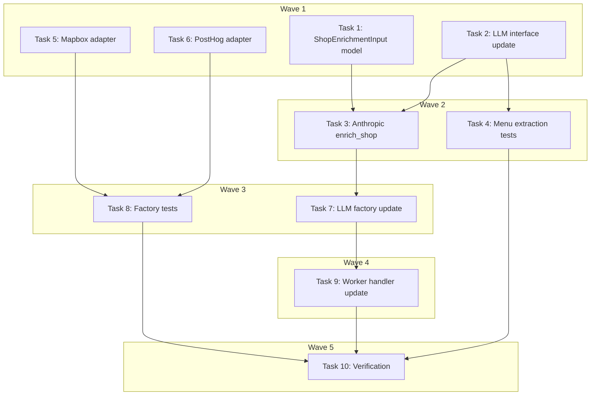

# Provider Adapter Implementations Plan

> **For Claude:** REQUIRED SUB-SKILL: Use executing-plans to implement this plan task-by-task.

**Design Doc:** [docs/designs/2026-02-26-provider-adapter-implementations-design.md](../designs/2026-02-26-provider-adapter-implementations-design.md)

**Spec References:** §3 Technical Architecture (provider abstraction), §4 Technical Stack (Claude, OpenAI, Mapbox, PostHog)

**PRD References:** §7 Core Features (semantic search, enrichment, analytics)

**Goal:** Implement the 3 remaining stubbed provider adapters (LLM/Anthropic, Maps/Mapbox, Analytics/PostHog) to complete the provider abstraction layer.

**Architecture:** Each adapter follows the existing pattern: Protocol interface defines the contract, adapter implements it using the specific vendor SDK, factory wires it via env-based config. The Anthropic adapter uses forced tool use for structured output. The Mapbox adapter uses httpx REST calls. The PostHog adapter wraps the posthog-python SDK.

**Tech Stack:** anthropic (AsyncAnthropic), httpx (async HTTP), posthog-python, Pydantic models

---

### Task 1: Add ShopEnrichmentInput Model

**Files:**

- Modify: `backend/models/types.py` (after `SearchResult` class, ~line 113)
- Test: `backend/tests/models/test_types.py` (create if needed)

**Step 1: Write the failing test**

Create `backend/tests/models/test_types.py`:

```python
from models.types import ShopEnrichmentInput


class TestShopEnrichmentInput:
    def test_minimal_fields(self):
        shop = ShopEnrichmentInput(name="Test Cafe", reviews=["Great coffee"])
        assert shop.name == "Test Cafe"
        assert shop.reviews == ["Great coffee"]
        assert shop.categories == []
        assert shop.description is None
        assert shop.price_range is None
        assert shop.socket is None
        assert shop.limited_time is None
        assert shop.rating is None
        assert shop.review_count is None

    def test_all_fields(self):
        shop = ShopEnrichmentInput(
            name="Test Cafe",
            reviews=["Great coffee", "Nice vibe"],
            description="A cozy spot",
            categories=["咖啡廳", "書店"],
            price_range="$200-400",
            socket="yes",
            limited_time="no",
            rating=4.5,
            review_count=42,
        )
        assert shop.rating == 4.5
        assert shop.review_count == 42
        assert shop.socket == "yes"
```

**Step 2: Run test to verify it fails**

Run: `cd backend && python -m pytest tests/models/test_types.py -v`
Expected: FAIL — `ImportError: cannot import name 'ShopEnrichmentInput'`

**Step 3: Write minimal implementation**

Add to `backend/models/types.py` after the `SearchResult` class (~line 113):

```python
class ShopEnrichmentInput(BaseModel):
    name: str
    reviews: list[str]
    description: str | None = None
    categories: list[str] = []
    price_range: str | None = None
    socket: str | None = None
    limited_time: str | None = None
    rating: float | None = None
    review_count: int | None = None
```

**Step 4: Run test to verify it passes**

Run: `cd backend && python -m pytest tests/models/test_types.py -v`
Expected: PASS

**Step 5: Commit**

```bash
git add backend/models/types.py backend/tests/models/test_types.py
git commit -m "feat: add ShopEnrichmentInput model for LLM enrichment"
```

---

### Task 2: Update LLM Protocol Interface

**Files:**

- Modify: `backend/providers/llm/interface.py`
- Modify: `backend/tests/providers/test_factories.py` (update protocol check)

**Step 1: No test needed — type-only change**

This is a pure interface (Protocol) signature change. The protocol check in `test_factories.py` only verifies `hasattr`, which will still pass. The real test comes in Task 3 when we test the adapter.

**Step 2: Update the interface**

Replace the entire content of `backend/providers/llm/interface.py`:

```python
from typing import Protocol

from models.types import EnrichmentResult, MenuExtractionResult, ShopEnrichmentInput


class LLMProvider(Protocol):
    async def enrich_shop(self, shop: ShopEnrichmentInput) -> EnrichmentResult: ...

    async def extract_menu_data(self, image_url: str) -> MenuExtractionResult: ...
```

**Step 3: Verify existing tests still pass**

Run: `cd backend && python -m pytest tests/providers/test_factories.py -v`
Expected: All PASS (protocol checks use `hasattr`, not signature inspection)

**Step 4: Commit**

```bash
git add backend/providers/llm/interface.py
git commit -m "refactor: update LLMProvider.enrich_shop to accept ShopEnrichmentInput"
```

---

### Task 3: Implement Anthropic Adapter — enrich_shop (TDD)

**Files:**

- Create: `backend/tests/providers/test_anthropic_adapter.py`
- Modify: `backend/providers/llm/anthropic_adapter.py`

**Step 1: Write the failing tests**

Create `backend/tests/providers/test_anthropic_adapter.py`:

```python
from unittest.mock import AsyncMock, MagicMock, patch

import pytest

from models.types import ShopEnrichmentInput, ShopModeScores, TaxonomyTag
from providers.llm.anthropic_adapter import AnthropicLLMAdapter

SAMPLE_TAXONOMY = [
    TaxonomyTag(id="quiet", dimension="ambience", label="Quiet", label_zh="安靜"),
    TaxonomyTag(id="deep_work", dimension="mode", label="Deep Work", label_zh="深度工作"),
    TaxonomyTag(id="wifi_available", dimension="functionality", label="WiFi Available", label_zh="提供 WiFi"),
    TaxonomyTag(id="pour_over", dimension="coffee", label="Pour Over", label_zh="手沖咖啡"),
]

SAMPLE_SHOP = ShopEnrichmentInput(
    name="Test Cafe 測試咖啡",
    reviews=["很安靜適合工作", "咖啡很好喝，手沖超讚"],
    description="A quiet specialty cafe",
    categories=["咖啡廳", "咖啡烘焙商"],
    price_range="$200-400",
    socket="yes",
    limited_time="no",
    rating=4.5,
    review_count=10,
)


def _make_tool_use_response(tool_input: dict) -> MagicMock:
    """Build a mock Anthropic response with a tool_use content block."""
    tool_block = MagicMock()
    tool_block.type = "tool_use"
    tool_block.name = "classify_shop"
    tool_block.input = tool_input

    response = MagicMock()
    response.content = [tool_block]
    response.stop_reason = "tool_use"
    return response


class TestAnthropicEnrichShop:
    @pytest.fixture
    def adapter(self):
        return AnthropicLLMAdapter(
            api_key="test-key",
            model="claude-sonnet-4-6-20250514",
            taxonomy=SAMPLE_TAXONOMY,
        )

    async def test_returns_enrichment_result_with_valid_tags(self, adapter):
        mock_response = _make_tool_use_response({
            "tags": [
                {"id": "quiet", "confidence": 0.9},
                {"id": "deep_work", "confidence": 0.85},
            ],
            "summary": "A quiet cafe perfect for focused work.",
            "topReviews": ["很安靜適合工作"],
            "mode": "work",
        })
        adapter._client = AsyncMock()
        adapter._client.messages.create = AsyncMock(return_value=mock_response)

        result = await adapter.enrich_shop(SAMPLE_SHOP)

        assert len(result.tags) == 2
        assert result.tags[0].id == "quiet"
        assert result.tags[0].dimension == "ambience"
        assert result.tags[1].id == "deep_work"
        assert result.summary == "A quiet cafe perfect for focused work."
        assert result.confidence == pytest.approx(0.875)  # avg(0.9, 0.85)
        assert result.mode_scores == ShopModeScores(work=1.0, rest=0.0, social=0.0)

    async def test_filters_invalid_tags(self, adapter):
        mock_response = _make_tool_use_response({
            "tags": [
                {"id": "quiet", "confidence": 0.9},
                {"id": "nonexistent_tag", "confidence": 0.8},
            ],
            "summary": "A quiet place.",
            "topReviews": [],
            "mode": "rest",
        })
        adapter._client = AsyncMock()
        adapter._client.messages.create = AsyncMock(return_value=mock_response)

        result = await adapter.enrich_shop(SAMPLE_SHOP)

        assert len(result.tags) == 1
        assert result.tags[0].id == "quiet"

    async def test_clamps_confidence_values(self, adapter):
        mock_response = _make_tool_use_response({
            "tags": [
                {"id": "quiet", "confidence": 1.5},
                {"id": "deep_work", "confidence": -0.2},
            ],
            "summary": "Test.",
            "topReviews": [],
            "mode": "mixed",
        })
        adapter._client = AsyncMock()
        adapter._client.messages.create = AsyncMock(return_value=mock_response)

        result = await adapter.enrich_shop(SAMPLE_SHOP)

        assert result.tags[0].id == "quiet"
        # Confidence should be clamped: 1.5 → 1.0, -0.2 → 0.0
        # We verify via overall confidence
        assert 0.0 <= result.confidence <= 1.0

    async def test_defaults_invalid_mode_to_mixed(self, adapter):
        mock_response = _make_tool_use_response({
            "tags": [{"id": "quiet", "confidence": 0.9}],
            "summary": "Test.",
            "topReviews": [],
            "mode": "invalid_mode",
        })
        adapter._client = AsyncMock()
        adapter._client.messages.create = AsyncMock(return_value=mock_response)

        result = await adapter.enrich_shop(SAMPLE_SHOP)

        assert result.mode_scores == ShopModeScores(work=0.5, rest=0.5, social=0.5)

    async def test_mode_scores_mapping(self, adapter):
        """Verify all 4 mode strings map to correct ShopModeScores."""
        for mode, expected in [
            ("work", ShopModeScores(work=1.0, rest=0.0, social=0.0)),
            ("rest", ShopModeScores(work=0.0, rest=1.0, social=0.0)),
            ("social", ShopModeScores(work=0.0, rest=0.0, social=1.0)),
            ("mixed", ShopModeScores(work=0.5, rest=0.5, social=0.5)),
        ]:
            mock_response = _make_tool_use_response({
                "tags": [{"id": "quiet", "confidence": 0.9}],
                "summary": "Test.",
                "topReviews": [],
                "mode": mode,
            })
            adapter._client = AsyncMock()
            adapter._client.messages.create = AsyncMock(return_value=mock_response)

            result = await adapter.enrich_shop(SAMPLE_SHOP)
            assert result.mode_scores == expected, f"Mode '{mode}' mapped incorrectly"

    async def test_raises_on_no_tool_use_block(self, adapter):
        response = MagicMock()
        text_block = MagicMock()
        text_block.type = "text"
        response.content = [text_block]
        response.stop_reason = "end_turn"

        adapter._client = AsyncMock()
        adapter._client.messages.create = AsyncMock(return_value=response)

        with pytest.raises(ValueError, match="No tool_use block"):
            await adapter.enrich_shop(SAMPLE_SHOP)

    async def test_prompt_includes_shop_data(self, adapter):
        mock_response = _make_tool_use_response({
            "tags": [],
            "summary": "Test.",
            "topReviews": [],
            "mode": "mixed",
        })
        adapter._client = AsyncMock()
        adapter._client.messages.create = AsyncMock(return_value=mock_response)

        await adapter.enrich_shop(SAMPLE_SHOP)

        call_args = adapter._client.messages.create.call_args
        messages = call_args.kwargs.get("messages") or call_args[1].get("messages")
        user_msg = messages[0]["content"]

        # Verify shop data appears in the prompt
        assert "Test Cafe 測試咖啡" in user_msg
        assert "很安靜適合工作" in user_msg
        assert "$200-400" in user_msg
        assert "yes" in user_msg  # socket

    async def test_prompt_includes_taxonomy(self, adapter):
        mock_response = _make_tool_use_response({
            "tags": [],
            "summary": "Test.",
            "topReviews": [],
            "mode": "mixed",
        })
        adapter._client = AsyncMock()
        adapter._client.messages.create = AsyncMock(return_value=mock_response)

        await adapter.enrich_shop(SAMPLE_SHOP)

        call_args = adapter._client.messages.create.call_args
        messages = call_args.kwargs.get("messages") or call_args[1].get("messages")
        user_msg = messages[0]["content"]

        # All 4 taxonomy tags should appear
        assert "quiet" in user_msg
        assert "deep_work" in user_msg
        assert "wifi_available" in user_msg
        assert "pour_over" in user_msg

    async def test_uses_forced_tool_choice(self, adapter):
        mock_response = _make_tool_use_response({
            "tags": [],
            "summary": "Test.",
            "topReviews": [],
            "mode": "mixed",
        })
        adapter._client = AsyncMock()
        adapter._client.messages.create = AsyncMock(return_value=mock_response)

        await adapter.enrich_shop(SAMPLE_SHOP)

        call_args = adapter._client.messages.create.call_args
        tool_choice = call_args.kwargs.get("tool_choice") or call_args[1].get("tool_choice")
        assert tool_choice == {"type": "tool", "name": "classify_shop"}

    async def test_empty_tags_returns_zero_confidence(self, adapter):
        mock_response = _make_tool_use_response({
            "tags": [],
            "summary": "No tags found.",
            "topReviews": [],
            "mode": "mixed",
        })
        adapter._client = AsyncMock()
        adapter._client.messages.create = AsyncMock(return_value=mock_response)

        result = await adapter.enrich_shop(SAMPLE_SHOP)

        assert result.tags == []
        assert result.confidence == 0.0
```

**Step 2: Run tests to verify they fail**

Run: `cd backend && python -m pytest tests/providers/test_anthropic_adapter.py -v`
Expected: FAIL — `TypeError: AnthropicLLMAdapter.__init__() got an unexpected keyword argument 'taxonomy'`

**Step 3: Implement the adapter**

Replace the full content of `backend/providers/llm/anthropic_adapter.py`:

```python
import logging

from anthropic import AsyncAnthropic

from models.types import (
    EnrichmentResult,
    MenuExtractionResult,
    ShopEnrichmentInput,
    ShopModeScores,
    TaxonomyTag,
)

logger = logging.getLogger(__name__)

CLASSIFY_SHOP_TOOL = {
    "name": "classify_shop",
    "description": "Classify a coffee shop based on its reviews using the provided taxonomy",
    "input_schema": {
        "type": "object",
        "properties": {
            "tags": {
                "type": "array",
                "items": {
                    "type": "object",
                    "properties": {
                        "id": {"type": "string", "description": "Tag ID from the taxonomy list"},
                        "confidence": {"type": "number", "description": "Confidence score 0.0-1.0"},
                    },
                    "required": ["id", "confidence"],
                },
                "description": "Tags that apply to this shop, selected from the taxonomy",
            },
            "summary": {
                "type": "string",
                "description": "2-3 sentence natural language profile of the shop",
            },
            "topReviews": {
                "type": "array",
                "items": {"type": "string"},
                "description": "3-5 most informative review excerpts",
            },
            "mode": {
                "type": "string",
                "enum": ["work", "rest", "social", "mixed"],
                "description": "Primary usage mode for this shop",
            },
        },
        "required": ["tags", "summary", "topReviews", "mode"],
    },
}

EXTRACT_MENU_TOOL = {
    "name": "extract_menu",
    "description": "Extract structured menu items from a coffee shop menu image",
    "input_schema": {
        "type": "object",
        "properties": {
            "items": {
                "type": "array",
                "items": {
                    "type": "object",
                    "properties": {
                        "name": {"type": "string"},
                        "price": {"type": "number"},
                        "description": {"type": "string"},
                        "category": {"type": "string"},
                    },
                    "required": ["name"],
                },
            },
            "raw_text": {"type": "string"},
        },
        "required": ["items"],
    },
}

SYSTEM_PROMPT = """You are an expert on Taiwan's independent coffee shop scene. You classify coffee shops based on their Google Maps reviews using a predefined taxonomy.

Rules:
- ONLY select tags from the provided taxonomy list. Never invent new tags.
- Assign a confidence score (0.0-1.0) to each tag based on how strongly the reviews support it.
- Write a 2-3 sentence summary describing the shop's character — what makes it special, who it's for.
- Select the 3-5 most informative review excerpts that would help someone decide whether to visit.
- Classify the primary mode: work (focused tasks), rest (relaxation/reading), social (meeting people), or mixed."""

MODE_SCORES = {
    "work": ShopModeScores(work=1.0, rest=0.0, social=0.0),
    "rest": ShopModeScores(work=0.0, rest=1.0, social=0.0),
    "social": ShopModeScores(work=0.0, rest=0.0, social=1.0),
    "mixed": ShopModeScores(work=0.5, rest=0.5, social=0.5),
}


class AnthropicLLMAdapter:
    def __init__(self, api_key: str, model: str, taxonomy: list[TaxonomyTag]):
        self._client = AsyncAnthropic(api_key=api_key)
        self._model = model
        self._taxonomy = taxonomy
        self._taxonomy_by_id: dict[str, TaxonomyTag] = {tag.id: tag for tag in taxonomy}

    async def enrich_shop(self, shop: ShopEnrichmentInput) -> EnrichmentResult:
        user_prompt = self._build_enrich_prompt(shop)

        response = await self._client.messages.create(
            model=self._model,
            max_tokens=2048,
            system=SYSTEM_PROMPT,
            messages=[{"role": "user", "content": user_prompt}],
            tools=[CLASSIFY_SHOP_TOOL],
            tool_choice={"type": "tool", "name": "classify_shop"},
        )

        tool_input = self._extract_tool_input(response, "classify_shop")
        return self._parse_enrichment(tool_input)

    async def extract_menu_data(self, image_url: str) -> MenuExtractionResult:
        response = await self._client.messages.create(
            model=self._model,
            max_tokens=4096,
            messages=[
                {
                    "role": "user",
                    "content": [
                        {
                            "type": "image",
                            "source": {"type": "url", "url": image_url},
                        },
                        {
                            "type": "text",
                            "text": "Extract all menu items from this coffee shop menu photo. Return structured data with item names, prices (as numbers), descriptions, and categories where visible.",
                        },
                    ],
                }
            ],
            tools=[EXTRACT_MENU_TOOL],
            tool_choice={"type": "tool", "name": "extract_menu"},
        )

        tool_input = self._extract_tool_input(response, "extract_menu")
        return MenuExtractionResult(
            items=tool_input.get("items", []),
            raw_text=tool_input.get("raw_text"),
        )

    def _build_enrich_prompt(self, shop: ShopEnrichmentInput) -> str:
        lines = [
            "Classify this coffee shop based on its reviews and attributes.",
            "",
            f"Shop: {shop.name}",
        ]
        if shop.categories:
            lines.append(f"Categories: {', '.join(shop.categories)}")
        if shop.price_range:
            lines.append(f"Price range: {shop.price_range}")
        if shop.socket:
            lines.append(f"Socket: {shop.socket}")
        if shop.limited_time:
            lines.append(f"Limited time: {shop.limited_time}")
        if shop.rating is not None:
            count_str = f" ({shop.review_count} reviews)" if shop.review_count else ""
            lines.append(f"Rating: {shop.rating}{count_str}")
        if shop.description:
            lines.append(f"Description: {shop.description}")

        if shop.reviews:
            lines.append("")
            lines.append(f"Reviews ({len(shop.reviews)}):")
            for i, review in enumerate(shop.reviews, 1):
                lines.append(f"[{i}] {review}")

        lines.append("")
        lines.append("Available taxonomy tags (ONLY select from this list):")
        for tag in self._taxonomy:
            lines.append(f"  {tag.id} ({tag.dimension}) — {tag.label} / {tag.label_zh}")

        return "\n".join(lines)

    @staticmethod
    def _extract_tool_input(response, tool_name: str) -> dict:
        for block in response.content:
            if block.type == "tool_use" and block.name == tool_name:
                return block.input
        raise ValueError(f"No tool_use block with name '{tool_name}' in response")

    def _parse_enrichment(self, tool_input: dict) -> EnrichmentResult:
        raw_tags = tool_input.get("tags", [])
        valid_tags: list[TaxonomyTag] = []
        confidences: list[float] = []

        for raw in raw_tags:
            tag_id = raw.get("id", "")
            if tag_id not in self._taxonomy_by_id:
                logger.warning("Filtering unknown tag: %s", tag_id)
                continue
            confidence = max(0.0, min(1.0, float(raw.get("confidence", 0.0))))
            tag = self._taxonomy_by_id[tag_id]
            valid_tags.append(tag)
            confidences.append(confidence)

        mode_str = tool_input.get("mode", "mixed")
        mode_scores = MODE_SCORES.get(mode_str, MODE_SCORES["mixed"])

        overall_confidence = sum(confidences) / len(confidences) if confidences else 0.0

        return EnrichmentResult(
            tags=valid_tags,
            summary=tool_input.get("summary", ""),
            confidence=overall_confidence,
            mode_scores=mode_scores,
        )
```

**Step 4: Run tests to verify they pass**

Run: `cd backend && python -m pytest tests/providers/test_anthropic_adapter.py -v`
Expected: All PASS

**Step 5: Commit**

```bash
git add backend/providers/llm/anthropic_adapter.py backend/tests/providers/test_anthropic_adapter.py
git commit -m "feat: implement Anthropic adapter enrich_shop with tool use"
```

---

### Task 4: Implement Anthropic Adapter — extract_menu_data Tests

**Files:**

- Modify: `backend/tests/providers/test_anthropic_adapter.py` (add menu extraction tests)

**Step 1: Write the failing tests**

Add to `backend/tests/providers/test_anthropic_adapter.py`:

```python
def _make_menu_tool_response(tool_input: dict) -> MagicMock:
    """Build a mock Anthropic response with an extract_menu tool_use block."""
    tool_block = MagicMock()
    tool_block.type = "tool_use"
    tool_block.name = "extract_menu"
    tool_block.input = tool_input

    response = MagicMock()
    response.content = [tool_block]
    response.stop_reason = "tool_use"
    return response


class TestAnthropicExtractMenuData:
    @pytest.fixture
    def adapter(self):
        return AnthropicLLMAdapter(
            api_key="test-key",
            model="claude-sonnet-4-6-20250514",
            taxonomy=SAMPLE_TAXONOMY,
        )

    async def test_returns_menu_items(self, adapter):
        mock_response = _make_menu_tool_response({
            "items": [
                {"name": "Cappuccino", "price": 150, "category": "Coffee"},
                {"name": "Matcha Latte", "price": 180},
            ],
            "raw_text": "Cappuccino 150\nMatcha Latte 180",
        })
        adapter._client = AsyncMock()
        adapter._client.messages.create = AsyncMock(return_value=mock_response)

        result = await adapter.extract_menu_data("https://example.com/menu.jpg")

        assert len(result.items) == 2
        assert result.items[0]["name"] == "Cappuccino"
        assert result.items[0]["price"] == 150
        assert result.raw_text == "Cappuccino 150\nMatcha Latte 180"

    async def test_passes_image_url_in_content(self, adapter):
        mock_response = _make_menu_tool_response({
            "items": [],
            "raw_text": None,
        })
        adapter._client = AsyncMock()
        adapter._client.messages.create = AsyncMock(return_value=mock_response)

        await adapter.extract_menu_data("https://storage.example.com/menu.jpg")

        call_args = adapter._client.messages.create.call_args
        messages = call_args.kwargs.get("messages") or call_args[1].get("messages")
        content_blocks = messages[0]["content"]

        # First block should be the image
        image_block = content_blocks[0]
        assert image_block["type"] == "image"
        assert image_block["source"]["url"] == "https://storage.example.com/menu.jpg"

    async def test_empty_menu_returns_empty_items(self, adapter):
        mock_response = _make_menu_tool_response({
            "items": [],
        })
        adapter._client = AsyncMock()
        adapter._client.messages.create = AsyncMock(return_value=mock_response)

        result = await adapter.extract_menu_data("https://example.com/blank.jpg")

        assert result.items == []
        assert result.raw_text is None

    async def test_uses_forced_tool_choice(self, adapter):
        mock_response = _make_menu_tool_response({"items": []})
        adapter._client = AsyncMock()
        adapter._client.messages.create = AsyncMock(return_value=mock_response)

        await adapter.extract_menu_data("https://example.com/menu.jpg")

        call_args = adapter._client.messages.create.call_args
        tool_choice = call_args.kwargs.get("tool_choice") or call_args[1].get("tool_choice")
        assert tool_choice == {"type": "tool", "name": "extract_menu"}
```

**Step 2: Run to verify they pass** (implementation already exists from Task 3)

Run: `cd backend && python -m pytest tests/providers/test_anthropic_adapter.py::TestAnthropicExtractMenuData -v`
Expected: All PASS (implementation already covers this)

**Step 3: Commit**

```bash
git add backend/tests/providers/test_anthropic_adapter.py
git commit -m "test: add extract_menu_data tests for Anthropic adapter"
```

---

### Task 5: Implement Mapbox Maps Adapter (TDD)

**Files:**

- Create: `backend/tests/providers/test_mapbox_adapter.py`
- Modify: `backend/providers/maps/mapbox_adapter.py`

**Step 1: Write the failing tests**

Create `backend/tests/providers/test_mapbox_adapter.py`:

```python
from unittest.mock import AsyncMock, MagicMock, patch

import httpx
import pytest

from providers.maps.mapbox_adapter import MapboxMapsAdapter

GEOCODE_RESPONSE = {
    "type": "FeatureCollection",
    "features": [
        {
            "type": "Feature",
            "geometry": {"type": "Point", "coordinates": [121.5654, 25.0330]},
            "properties": {"full_address": "台北市大安區忠孝東路四段"},
        }
    ],
}

EMPTY_RESPONSE = {"type": "FeatureCollection", "features": []}


class TestMapboxGeocode:
    @pytest.fixture
    def adapter(self):
        return MapboxMapsAdapter(access_token="test-token")

    async def test_returns_geocoding_result(self, adapter):
        mock_response = MagicMock(spec=httpx.Response)
        mock_response.status_code = 200
        mock_response.json.return_value = GEOCODE_RESPONSE
        mock_response.raise_for_status = MagicMock()

        adapter._client = AsyncMock(spec=httpx.AsyncClient)
        adapter._client.get = AsyncMock(return_value=mock_response)

        result = await adapter.geocode("台北市大安區忠孝東路四段")

        assert result is not None
        assert result.latitude == pytest.approx(25.0330)
        assert result.longitude == pytest.approx(121.5654)
        assert result.formatted_address == "台北市大安區忠孝東路四段"

    async def test_returns_none_on_empty_results(self, adapter):
        mock_response = MagicMock(spec=httpx.Response)
        mock_response.status_code = 200
        mock_response.json.return_value = EMPTY_RESPONSE
        mock_response.raise_for_status = MagicMock()

        adapter._client = AsyncMock(spec=httpx.AsyncClient)
        adapter._client.get = AsyncMock(return_value=mock_response)

        result = await adapter.geocode("nonexistent address")
        assert result is None

    async def test_returns_none_on_http_error(self, adapter):
        adapter._client = AsyncMock(spec=httpx.AsyncClient)
        adapter._client.get = AsyncMock(side_effect=httpx.HTTPStatusError(
            "Server error", request=MagicMock(), response=MagicMock(status_code=500)
        ))

        result = await adapter.geocode("台北市")
        assert result is None

    async def test_returns_none_on_timeout(self, adapter):
        adapter._client = AsyncMock(spec=httpx.AsyncClient)
        adapter._client.get = AsyncMock(side_effect=httpx.TimeoutException("timeout"))

        result = await adapter.geocode("台北市")
        assert result is None

    async def test_passes_correct_params(self, adapter):
        mock_response = MagicMock(spec=httpx.Response)
        mock_response.status_code = 200
        mock_response.json.return_value = EMPTY_RESPONSE
        mock_response.raise_for_status = MagicMock()

        adapter._client = AsyncMock(spec=httpx.AsyncClient)
        adapter._client.get = AsyncMock(return_value=mock_response)

        await adapter.geocode("台北市信義區")

        call_args = adapter._client.get.call_args
        url = call_args[0][0] if call_args[0] else call_args.kwargs.get("url", "")
        params = call_args.kwargs.get("params", {})

        assert "forward" in url
        assert params["q"] == "台北市信義區"
        assert params["country"] == "TW"
        assert params["language"] == "zh"
        assert params["access_token"] == "test-token"


class TestMapboxReverseGeocode:
    @pytest.fixture
    def adapter(self):
        return MapboxMapsAdapter(access_token="test-token")

    async def test_returns_address_string(self, adapter):
        mock_response = MagicMock(spec=httpx.Response)
        mock_response.status_code = 200
        mock_response.json.return_value = GEOCODE_RESPONSE
        mock_response.raise_for_status = MagicMock()

        adapter._client = AsyncMock(spec=httpx.AsyncClient)
        adapter._client.get = AsyncMock(return_value=mock_response)

        result = await adapter.reverse_geocode(25.0330, 121.5654)
        assert result == "台北市大安區忠孝東路四段"

    async def test_returns_none_on_empty_results(self, adapter):
        mock_response = MagicMock(spec=httpx.Response)
        mock_response.status_code = 200
        mock_response.json.return_value = EMPTY_RESPONSE
        mock_response.raise_for_status = MagicMock()

        adapter._client = AsyncMock(spec=httpx.AsyncClient)
        adapter._client.get = AsyncMock(return_value=mock_response)

        result = await adapter.reverse_geocode(0.0, 0.0)
        assert result is None

    async def test_returns_none_on_error(self, adapter):
        adapter._client = AsyncMock(spec=httpx.AsyncClient)
        adapter._client.get = AsyncMock(side_effect=httpx.TimeoutException("timeout"))

        result = await adapter.reverse_geocode(25.0330, 121.5654)
        assert result is None
```

**Step 2: Run tests to verify they fail**

Run: `cd backend && python -m pytest tests/providers/test_mapbox_adapter.py -v`
Expected: FAIL — `AttributeError: 'MapboxMapsAdapter' object has no attribute '_client'`

**Step 3: Implement the adapter**

Replace the full content of `backend/providers/maps/mapbox_adapter.py`:

```python
import logging

import httpx

from models.types import GeocodingResult

logger = logging.getLogger(__name__)


class MapboxMapsAdapter:
    BASE_URL = "https://api.mapbox.com/search/geocode/v6"

    def __init__(self, access_token: str):
        self._token = access_token
        self._client = httpx.AsyncClient(timeout=10.0)

    async def geocode(self, address: str) -> GeocodingResult | None:
        try:
            response = await self._client.get(
                f"{self.BASE_URL}/forward",
                params={
                    "q": address,
                    "access_token": self._token,
                    "country": "TW",
                    "language": "zh",
                    "limit": 1,
                },
            )
            response.raise_for_status()
            data = response.json()
            features = data.get("features", [])
            if not features:
                return None
            feature = features[0]
            coords = feature["geometry"]["coordinates"]
            return GeocodingResult(
                latitude=coords[1],
                longitude=coords[0],
                formatted_address=feature["properties"]["full_address"],
            )
        except (httpx.HTTPStatusError, httpx.TimeoutException) as e:
            logger.warning("Mapbox geocode failed: %s", e)
            return None

    async def reverse_geocode(self, lat: float, lng: float) -> str | None:
        try:
            response = await self._client.get(
                f"{self.BASE_URL}/reverse",
                params={
                    "longitude": lng,
                    "latitude": lat,
                    "access_token": self._token,
                    "language": "zh",
                    "limit": 1,
                },
            )
            response.raise_for_status()
            data = response.json()
            features = data.get("features", [])
            if not features:
                return None
            return features[0]["properties"]["full_address"]
        except (httpx.HTTPStatusError, httpx.TimeoutException) as e:
            logger.warning("Mapbox reverse geocode failed: %s", e)
            return None

    async def close(self) -> None:
        await self._client.aclose()
```

**Step 4: Run tests to verify they pass**

Run: `cd backend && python -m pytest tests/providers/test_mapbox_adapter.py -v`
Expected: All PASS

**Step 5: Commit**

```bash
git add backend/providers/maps/mapbox_adapter.py backend/tests/providers/test_mapbox_adapter.py
git commit -m "feat: implement Mapbox geocoding adapter with httpx"
```

---

### Task 6: Implement PostHog Analytics Adapter (TDD)

**Files:**

- Create: `backend/tests/providers/test_posthog_adapter.py`
- Modify: `backend/providers/analytics/posthog_adapter.py`

**Step 1: Write the failing tests**

Create `backend/tests/providers/test_posthog_adapter.py`:

```python
from unittest.mock import MagicMock, patch

from providers.analytics.posthog_adapter import PostHogAnalyticsAdapter


class TestPostHogTrack:
    @patch("providers.analytics.posthog_adapter.posthog")
    def test_calls_capture_with_event(self, mock_posthog):
        adapter = PostHogAnalyticsAdapter(api_key="test-key", host="https://ph.test.com")
        adapter.track("shop_viewed", {"shop_id": "s1"})

        mock_posthog.capture.assert_called_once_with(
            distinct_id="server",
            event="shop_viewed",
            properties={"shop_id": "s1"},
        )

    @patch("providers.analytics.posthog_adapter.posthog")
    def test_calls_capture_without_properties(self, mock_posthog):
        adapter = PostHogAnalyticsAdapter(api_key="test-key", host="https://ph.test.com")
        adapter.track("app_started")

        mock_posthog.capture.assert_called_once_with(
            distinct_id="server",
            event="app_started",
            properties=None,
        )


class TestPostHogIdentify:
    @patch("providers.analytics.posthog_adapter.posthog")
    def test_calls_identify_with_user_id_and_traits(self, mock_posthog):
        adapter = PostHogAnalyticsAdapter(api_key="test-key", host="https://ph.test.com")
        adapter.identify("user-123", {"plan": "free"})

        mock_posthog.identify.assert_called_once_with(
            distinct_id="user-123",
            properties={"plan": "free"},
        )


class TestPostHogPage:
    @patch("providers.analytics.posthog_adapter.posthog")
    def test_maps_to_pageview_event(self, mock_posthog):
        adapter = PostHogAnalyticsAdapter(api_key="test-key", host="https://ph.test.com")
        adapter.page("/shops/123", {"referrer": "search"})

        mock_posthog.capture.assert_called_once_with(
            distinct_id="server",
            event="$pageview",
            properties={"$current_url": "/shops/123", "referrer": "search"},
        )

    @patch("providers.analytics.posthog_adapter.posthog")
    def test_page_with_no_properties(self, mock_posthog):
        adapter = PostHogAnalyticsAdapter(api_key="test-key", host="https://ph.test.com")
        adapter.page("/home")

        mock_posthog.capture.assert_called_once_with(
            distinct_id="server",
            event="$pageview",
            properties={"$current_url": "/home"},
        )


class TestPostHogErrorHandling:
    @patch("providers.analytics.posthog_adapter.posthog")
    def test_track_swallows_exceptions(self, mock_posthog):
        mock_posthog.capture.side_effect = Exception("Network error")
        adapter = PostHogAnalyticsAdapter(api_key="test-key", host="https://ph.test.com")

        # Should not raise
        adapter.track("test_event")

    @patch("providers.analytics.posthog_adapter.posthog")
    def test_identify_swallows_exceptions(self, mock_posthog):
        mock_posthog.identify.side_effect = Exception("Network error")
        adapter = PostHogAnalyticsAdapter(api_key="test-key", host="https://ph.test.com")

        # Should not raise
        adapter.identify("user-1")

    @patch("providers.analytics.posthog_adapter.posthog")
    def test_page_swallows_exceptions(self, mock_posthog):
        mock_posthog.capture.side_effect = Exception("Network error")
        adapter = PostHogAnalyticsAdapter(api_key="test-key", host="https://ph.test.com")

        # Should not raise
        adapter.page("/test")


class TestPostHogInit:
    @patch("providers.analytics.posthog_adapter.posthog")
    def test_sets_api_key_and_host(self, mock_posthog):
        PostHogAnalyticsAdapter(api_key="pk_test_123", host="https://custom.posthog.com")

        assert mock_posthog.project_api_key == "pk_test_123"
        assert mock_posthog.host == "https://custom.posthog.com"
        assert mock_posthog.debug is False
```

**Step 2: Run tests to verify they fail**

Run: `cd backend && python -m pytest tests/providers/test_posthog_adapter.py -v`
Expected: FAIL — `ImportError` or assertion failures (current adapter is a no-op stub with no posthog import)

**Step 3: Implement the adapter**

Replace the full content of `backend/providers/analytics/posthog_adapter.py`:

```python
import logging

import posthog

logger = logging.getLogger(__name__)


class PostHogAnalyticsAdapter:
    def __init__(self, api_key: str, host: str):
        posthog.project_api_key = api_key
        posthog.host = host
        posthog.debug = False

    def track(self, event: str, properties: dict[str, str | int | bool] | None = None) -> None:
        try:
            posthog.capture(
                distinct_id="server",
                event=event,
                properties=properties,
            )
        except Exception:
            logger.warning("PostHog track failed for event: %s", event, exc_info=True)

    def identify(self, user_id: str, traits: dict[str, str | int | bool] | None = None) -> None:
        try:
            posthog.identify(
                distinct_id=user_id,
                properties=traits,
            )
        except Exception:
            logger.warning("PostHog identify failed for user: %s", user_id, exc_info=True)

    def page(
        self,
        name: str | None = None,
        properties: dict[str, str | int | bool] | None = None,
    ) -> None:
        try:
            posthog.capture(
                distinct_id="server",
                event="$pageview",
                properties={"$current_url": name, **(properties or {})},
            )
        except Exception:
            logger.warning("PostHog page failed for: %s", name, exc_info=True)
```

**Step 4: Run tests to verify they pass**

Run: `cd backend && python -m pytest tests/providers/test_posthog_adapter.py -v`
Expected: All PASS

**Step 5: Commit**

```bash
git add backend/providers/analytics/posthog_adapter.py backend/tests/providers/test_posthog_adapter.py
git commit -m "feat: implement PostHog analytics adapter"
```

---

### Task 7: Update LLM Factory for Taxonomy Parameter

**Files:**

- Modify: `backend/providers/llm/__init__.py`
- Modify: `backend/tests/providers/test_factories.py` (update LLM factory test)

**Step 1: Write the failing test**

Add to the `TestProviderFactories` class in `backend/tests/providers/test_factories.py`:

```python
    def test_llm_factory_passes_taxonomy(self):
        from models.types import TaxonomyTag

        taxonomy = [
            TaxonomyTag(id="quiet", dimension="ambience", label="Quiet", label_zh="安靜"),
        ]
        with patch("providers.llm.settings") as mock:
            mock.llm_provider = "anthropic"
            mock.anthropic_api_key = "test-key"
            mock.anthropic_model = "claude-sonnet-4-6-20250514"
            from providers.llm import get_llm_provider

            provider = get_llm_provider(taxonomy=taxonomy)
            assert provider is not None
            # Verify taxonomy was passed through
            assert hasattr(provider, "_taxonomy")
            assert len(provider._taxonomy) == 1

    def test_llm_factory_defaults_to_empty_taxonomy(self):
        with patch("providers.llm.settings") as mock:
            mock.llm_provider = "anthropic"
            mock.anthropic_api_key = "test-key"
            mock.anthropic_model = "claude-sonnet-4-6-20250514"
            from providers.llm import get_llm_provider

            provider = get_llm_provider()
            assert provider is not None
            assert provider._taxonomy == []
```

**Step 2: Run test to verify it fails**

Run: `cd backend && python -m pytest tests/providers/test_factories.py::TestProviderFactories::test_llm_factory_passes_taxonomy -v`
Expected: FAIL — `TypeError: get_llm_provider() got an unexpected keyword argument 'taxonomy'`

**Step 3: Update the factory**

Replace the content of `backend/providers/llm/__init__.py`:

```python
from core.config import settings
from models.types import TaxonomyTag
from providers.llm.interface import LLMProvider


def get_llm_provider(taxonomy: list[TaxonomyTag] | None = None) -> LLMProvider:
    match settings.llm_provider:
        case "anthropic":
            from providers.llm.anthropic_adapter import AnthropicLLMAdapter

            return AnthropicLLMAdapter(
                api_key=settings.anthropic_api_key,
                model=settings.anthropic_model,
                taxonomy=taxonomy or [],
            )
        case _:
            raise ValueError(f"Unknown LLM provider: {settings.llm_provider}")
```

**Step 4: Run tests to verify they pass**

Run: `cd backend && python -m pytest tests/providers/test_factories.py -v`
Expected: All PASS

**Step 5: Commit**

```bash
git add backend/providers/llm/__init__.py backend/tests/providers/test_factories.py
git commit -m "feat: update LLM factory to accept taxonomy parameter"
```

---

### Task 8: Add Missing Factory Tests (Maps + Analytics)

**Files:**

- Modify: `backend/tests/providers/test_factories.py`

**Step 1: Write the tests**

Add to the `TestProviderFactories` class in `backend/tests/providers/test_factories.py`:

```python
    def test_maps_factory_returns_mapbox(self):
        with patch("providers.maps.settings") as mock:
            mock.maps_provider = "mapbox"
            mock.mapbox_access_token = "pk.test-token"
            from providers.maps import get_maps_provider

            provider = get_maps_provider()
            assert provider is not None

    def test_maps_factory_unknown_provider_raises(self):
        with patch("providers.maps.settings") as mock:
            mock.maps_provider = "unknown"
            from providers.maps import get_maps_provider

            with pytest.raises(ValueError, match="Unknown maps provider"):
                get_maps_provider()

    def test_analytics_factory_returns_posthog(self):
        with patch("providers.analytics.settings") as mock, \
             patch("providers.analytics.posthog_adapter.posthog"):
            mock.analytics_provider = "posthog"
            mock.posthog_api_key = "test-key"
            mock.posthog_host = "https://app.posthog.com"
            from providers.analytics import get_analytics_provider

            provider = get_analytics_provider()
            assert provider is not None

    def test_analytics_factory_unknown_provider_raises(self):
        with patch("providers.analytics.settings") as mock:
            mock.analytics_provider = "unknown"
            from providers.analytics import get_analytics_provider

            with pytest.raises(ValueError, match="Unknown analytics provider"):
                get_analytics_provider()
```

**Step 2: Run to verify they pass**

Run: `cd backend && python -m pytest tests/providers/test_factories.py -v`
Expected: All PASS

**Step 3: Commit**

```bash
git add backend/tests/providers/test_factories.py
git commit -m "test: add missing Maps and Analytics factory tests"
```

---

### Task 9: Update Worker Handlers for New enrich_shop Signature

**Files:**

- Modify: `backend/workers/handlers/enrich_shop.py`
- Modify: `backend/tests/workers/test_handlers.py` (update mock)

**Step 1: Update handler to use ShopEnrichmentInput**

Modify `backend/workers/handlers/enrich_shop.py`. The handler currently calls `llm.enrich_shop(name=..., reviews=..., description=..., categories=[])`. Change it to build a `ShopEnrichmentInput` model:

```python
from datetime import UTC, datetime
from typing import Any, cast

import structlog
from supabase import Client

from models.types import JobType, ShopEnrichmentInput
from providers.llm.interface import LLMProvider
from workers.queue import JobQueue

logger = structlog.get_logger()


async def handle_enrich_shop(
    payload: dict[str, Any],
    db: Client,
    llm: LLMProvider,
    queue: JobQueue,
) -> None:
    """Enrich a shop with AI-generated tags and summary."""
    shop_id = payload["shop_id"]
    logger.info("Enriching shop", shop_id=shop_id)

    # Load shop data
    shop_response = db.table("shops").select("*").eq("id", shop_id).single().execute()
    shop = cast("dict[str, Any]", shop_response.data)

    # Load reviews
    reviews_response = db.table("shop_reviews").select("text").eq("shop_id", shop_id).execute()
    review_rows = cast("list[dict[str, Any]]", reviews_response.data)
    reviews = [r["text"] for r in review_rows if r.get("text")]

    # Build enrichment input
    enrichment_input = ShopEnrichmentInput(
        name=shop["name"],
        reviews=reviews,
        description=shop.get("description"),
        categories=shop.get("categories", []),
        price_range=shop.get("price_range"),
        socket=shop.get("socket"),
        limited_time=shop.get("limited_time"),
        rating=shop.get("rating"),
        review_count=shop.get("review_count"),
    )

    # Call LLM for enrichment
    result = await llm.enrich_shop(enrichment_input)

    # Write enrichment result
    db.table("shops").update(
        {
            "description": result.summary,
            "enriched_at": datetime.now(UTC).isoformat(),
        }
    ).eq("id", shop_id).execute()

    # Queue embedding generation
    await queue.enqueue(
        job_type=JobType.GENERATE_EMBEDDING,
        payload={"shop_id": shop_id},
        priority=5,
    )

    logger.info("Shop enriched", shop_id=shop_id, tag_count=len(result.tags))
```

**Step 2: Update the test to match new signature**

In `backend/tests/workers/test_handlers.py`, update `TestEnrichShopHandler.test_loads_shop_calls_llm_writes_result`. The mock `llm.enrich_shop` call assertion should no longer check keyword args since it now receives a single `ShopEnrichmentInput` model. The existing test should still pass because `assert_called_once()` doesn't check args — but update the mock's `db.table` to also return the extra fields:

Update the shop data dict in the mock to include the new fields:

```python
data={
    "id": "shop-1",
    "name": "Test Cafe",
    "description": None,
    "categories": ["咖啡廳"],
    "price_range": "$200-400",
    "socket": "yes",
    "limited_time": "no",
    "rating": 4.5,
    "review_count": 10,
}
```

**Step 3: Run tests to verify they pass**

Run: `cd backend && python -m pytest tests/workers/test_handlers.py::TestEnrichShopHandler -v`
Expected: PASS

**Step 4: Commit**

```bash
git add backend/workers/handlers/enrich_shop.py backend/tests/workers/test_handlers.py
git commit -m "refactor: update enrich_shop handler to use ShopEnrichmentInput model"
```

---

### Task 10: Full Verification

**Files:** None (verification only)

**Step 1: Run full backend test suite**

Run: `cd backend && python -m pytest -v`
Expected: All PASS

**Step 2: Run linter**

Run: `cd backend && ruff check .`
Expected: No errors

**Step 3: Run formatter check**

Run: `cd backend && ruff format --check .`
Expected: No formatting issues (or run `ruff format .` to fix)

**Step 4: Run type checker**

Run: `cd backend && mypy .`
Expected: No errors (or only pre-existing ones)

**Step 5: Run frontend tests** (ensure proxies still work)

Run: `pnpm test`
Expected: All PASS

**Step 6: Commit any formatting fixes**

```bash
git add -A
git commit -m "fix: formatting and lint fixes from verification"
```

(Skip if no changes needed.)

---

## Execution Waves



**Wave 1** (parallel — no dependencies):

- Task 1: ShopEnrichmentInput model
- Task 2: LLM interface update
- Task 5: Mapbox adapter (TDD)
- Task 6: PostHog adapter (TDD)

**Wave 2** (parallel — depends on Wave 1):

- Task 3: Anthropic enrich_shop (TDD) ← Task 1, Task 2
- Task 4: Menu extraction tests ← Task 2

**Wave 3** (parallel — depends on Wave 2):

- Task 7: LLM factory update ← Task 3
- Task 8: Missing factory tests ← Task 5, Task 6

**Wave 4** (sequential — depends on Wave 3):

- Task 9: Worker handler update ← Task 7

**Wave 5** (sequential — depends on all):

- Task 10: Full verification ← all tasks
