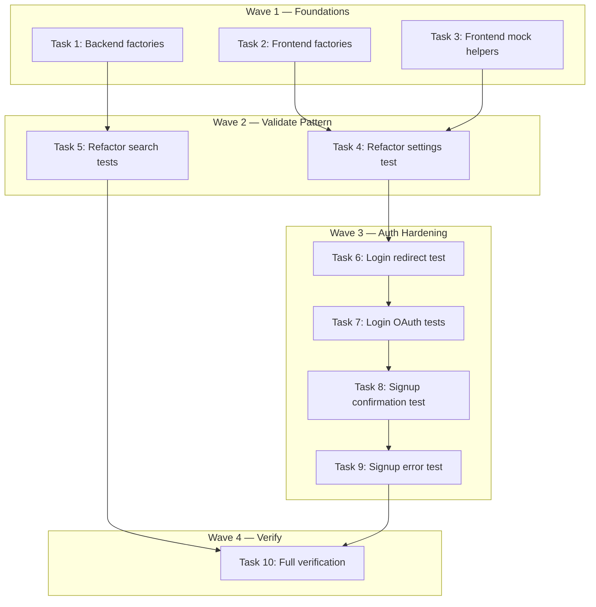

# Test Improvement Phase 0 + 1 Implementation Plan

> **For Claude:** REQUIRED SUB-SKILL: Use executing-plans to implement this plan task-by-task.

**Design Doc:** [docs/designs/2026-02-27-test-improvement-design.md](docs/designs/2026-02-27-test-improvement-design.md)

**Spec References:** —

**PRD References:** —

**Goal:** Create shared test infrastructure (factories, mock helpers) and harden existing auth tests from B-grade to A-grade.

**Architecture:** Phase 0 creates reusable test utilities for both frontend (TypeScript) and backend (Python), extracted from existing A-grade test patterns. Phase 1 adds missing test cases to login/signup tests. D-grade frontend page tests are blocked — the pages are "Coming soon" stubs; meaningful tests require features to be built first (Phase 2 of the product roadmap).

**Tech Stack:** Vitest + Testing Library (frontend), pytest + pytest-asyncio (backend)

**Design Revision Note:** The original design assumed backend launch-blocker tests were missing. Investigation revealed they already exist:

- 3-list cap: `test_lists_service.py` (7 tests) + `test_lists.py` (8 tests)
- Check-in photo: `test_checkin_service.py` (5 tests) + `test_checkins.py` (4 tests)
- PDPA cascade: `test_account_deletion.py` (5 tests)

Phase 1 scope is revised to: improve existing auth tests + refactor backend tests to use shared factories.

---

### Task 1: Backend Test Factories

**Files:**

- Create: `backend/tests/factories.py`
- Test: `backend/tests/test_factories.py`

**Step 1: Write the failing test**

```python
# backend/tests/test_factories.py
from datetime import datetime

from models.types import CheckIn, List, ListItem, Shop, Stamp, User

from tests.factories import (
    make_checkin,
    make_list,
    make_list_item,
    make_shop_row,
    make_stamp,
    make_user,
)


class TestFactories:
    def test_make_user_returns_valid_user(self):
        data = make_user()
        user = User(**data)
        assert user.id.startswith("user-")
        assert "@" in user.email

    def test_make_user_accepts_overrides(self):
        data = make_user(email="custom@example.com", display_name="Custom Name")
        assert data["email"] == "custom@example.com"
        assert data["display_name"] == "Custom Name"

    def test_make_shop_row_returns_valid_shop(self):
        data = make_shop_row()
        # Shop model doesn't expect similarity/tag_ids, so pop them
        similarity = data.pop("similarity")
        data.pop("tag_ids")
        shop = Shop(**data)
        assert shop.name != "Test Cafe"  # Must be realistic, not placeholder
        assert similarity == 0.85

    def test_make_list_returns_valid_list(self):
        data = make_list()
        lst = List(**data)
        assert lst.user_id.startswith("user-")

    def test_make_checkin_returns_valid_checkin(self):
        data = make_checkin()
        ci = CheckIn(**data)
        assert len(ci.photo_urls) >= 1

    def test_make_stamp_returns_valid_stamp(self):
        data = make_stamp()
        stamp = Stamp(**data)
        assert stamp.design_url.startswith("https://")

    def test_make_list_item_returns_valid_list_item(self):
        data = make_list_item()
        item = ListItem(**data)
        assert item.list_id.startswith("list-")
```

**Step 2: Run test to verify it fails**

Run: `cd backend && python -m pytest tests/test_factories.py -v`
Expected: FAIL with `ModuleNotFoundError: No module named 'tests.factories'`

**Step 3: Write minimal implementation**

```python
# backend/tests/factories.py
"""Shared test data factories. Realistic Taiwan-based defaults, all overridable."""

from datetime import datetime


def make_user(**overrides: object) -> dict:
    defaults = {
        "id": "user-a1b2c3",
        "email": "lin.mei@gmail.com",
        "display_name": "林美",
        "avatar_url": None,
        "pdpa_consent_at": datetime.now().isoformat(),
        "deletion_requested_at": None,
        "created_at": datetime.now().isoformat(),
    }
    return {**defaults, **overrides}


def make_shop_row(**overrides: object) -> dict:
    """Shop row as returned by Supabase RPC (includes similarity + tag_ids)."""
    defaults = {
        "id": "shop-d4e5f6",
        "name": "山小孩咖啡",
        "address": "台北市大安區溫州街74巷5弄2號",
        "latitude": 25.0216,
        "longitude": 121.5312,
        "mrt": "台電大樓",
        "phone": "02-2364-0088",
        "website": "https://www.instagram.com/mountainkidcoffee",
        "opening_hours": None,
        "rating": 4.6,
        "review_count": 287,
        "price_range": "$$",
        "description": "安靜適合工作的獨立咖啡店",
        "photo_urls": [
            "https://example.supabase.co/storage/v1/object/public/shop-photos/d4e5f6/exterior.jpg"
        ],
        "menu_url": None,
        "taxonomy_tags": [],
        "mode_scores": None,
        "cafenomad_id": "shop-cn-001",
        "google_place_id": "ChIJ-4E5F6-pQjQR_example",
        "created_at": datetime.now().isoformat(),
        "updated_at": datetime.now().isoformat(),
        "similarity": 0.85,
        "tag_ids": ["quiet", "wifi-reliable"],
    }
    return {**defaults, **overrides}


def make_list(**overrides: object) -> dict:
    defaults = {
        "id": "list-g7h8i9",
        "user_id": "user-a1b2c3",
        "name": "適合工作的咖啡店",
        "created_at": datetime.now().isoformat(),
        "updated_at": datetime.now().isoformat(),
    }
    return {**defaults, **overrides}


def make_list_item(**overrides: object) -> dict:
    defaults = {
        "list_id": "list-g7h8i9",
        "shop_id": "shop-d4e5f6",
        "added_at": datetime.now().isoformat(),
    }
    return {**defaults, **overrides}


def make_checkin(**overrides: object) -> dict:
    defaults = {
        "id": "ci-j0k1l2",
        "user_id": "user-a1b2c3",
        "shop_id": "shop-d4e5f6",
        "photo_urls": [
            "https://example.supabase.co/storage/v1/object/public/checkin-photos/user-a1b2c3/photo1.jpg"
        ],
        "menu_photo_url": None,
        "note": None,
        "created_at": datetime.now().isoformat(),
    }
    return {**defaults, **overrides}


def make_stamp(**overrides: object) -> dict:
    defaults = {
        "id": "stamp-m3n4o5",
        "user_id": "user-a1b2c3",
        "shop_id": "shop-d4e5f6",
        "check_in_id": "ci-j0k1l2",
        "design_url": "https://example.supabase.co/storage/v1/object/public/stamps/d4e5f6.png",
        "earned_at": datetime.now().isoformat(),
    }
    return {**defaults, **overrides}
```

**Step 4: Run test to verify it passes**

Run: `cd backend && python -m pytest tests/test_factories.py -v`
Expected: All 7 tests PASS

**Step 5: Commit**

```bash
git add backend/tests/factories.py backend/tests/test_factories.py
git commit -m "test: add backend test data factories with realistic Taiwan data"
```

---

### Task 2: Frontend Test Factories

**Files:**

- Create: `lib/test-utils/factories.ts`
- Test: `lib/test-utils/__tests__/factories.test.ts`

**Step 1: Write the failing test**

```typescript
// lib/test-utils/__tests__/factories.test.ts
import { describe, it, expect } from 'vitest';
import {
  makeUser,
  makeSession,
  makeShop,
  makeList,
  makeCheckIn,
  makeStamp,
} from '../factories';

describe('test factories', () => {
  it('makeUser returns realistic user with overridable defaults', () => {
    const user = makeUser();
    expect(user.id).toMatch(/^user-/);
    expect(user.app_metadata.pdpa_consented).toBe(true);

    const custom = makeUser({
      id: 'user-custom',
      app_metadata: { pdpa_consented: false },
    });
    expect(custom.id).toBe('user-custom');
    expect(custom.app_metadata.pdpa_consented).toBe(false);
  });

  it('makeSession returns session with access_token', () => {
    const session = makeSession();
    expect(session.access_token).toBeTruthy();
    expect(typeof session.access_token).toBe('string');
  });

  it('makeShop returns shop with realistic Taiwan data', () => {
    const shop = makeShop();
    expect(shop.name).not.toBe('Test Shop');
    expect(shop.latitude).toBeGreaterThan(20);
    expect(shop.longitude).toBeGreaterThan(100);
  });

  it('makeList returns list with user reference', () => {
    const list = makeList();
    expect(list.id).toMatch(/^list-/);
    expect(list.user_id).toMatch(/^user-/);
  });

  it('makeCheckIn returns check-in with at least one photo', () => {
    const checkIn = makeCheckIn();
    expect(checkIn.photo_urls.length).toBeGreaterThanOrEqual(1);
  });

  it('makeStamp returns stamp with design URL', () => {
    const stamp = makeStamp();
    expect(stamp.design_url).toMatch(/^https:\/\//);
  });
});
```

**Step 2: Run test to verify it fails**

Run: `pnpm test lib/test-utils/__tests__/factories.test.ts`
Expected: FAIL with `Cannot find module '../factories'`

**Step 3: Write minimal implementation**

```typescript
// lib/test-utils/factories.ts
/**
 * Shared test data factories. Realistic Taiwan-based defaults, all overridable.
 * See docs/testing-philosophy.md for why realistic data matters.
 */

export function makeUser(overrides: Record<string, unknown> = {}) {
  const defaults = {
    id: 'user-a1b2c3',
    email: 'lin.mei@gmail.com',
    user_metadata: {
      pdpa_consented: true,
    },
    app_metadata: {
      pdpa_consented: true,
      deletion_requested: false,
    },
  };
  return {
    ...defaults,
    ...overrides,
    app_metadata: {
      ...defaults.app_metadata,
      ...(overrides.app_metadata as Record<string, unknown> | undefined),
    },
    user_metadata: {
      ...defaults.user_metadata,
      ...(overrides.user_metadata as Record<string, unknown> | undefined),
    },
  };
}

export function makeSession(overrides: Record<string, unknown> = {}) {
  return {
    access_token:
      'eyJhbGciOiJIUzI1NiIsInR5cCI6IkpXVCJ9.test-token-payload.signature',
    refresh_token: 'test-refresh-token',
    expires_in: 3600,
    token_type: 'bearer',
    user: makeUser(),
    ...overrides,
  };
}

export function makeShop(overrides: Record<string, unknown> = {}) {
  return {
    id: 'shop-d4e5f6',
    name: '山小孩咖啡',
    address: '台北市大安區溫州街74巷5弄2號',
    latitude: 25.0216,
    longitude: 121.5312,
    mrt: '台電大樓',
    phone: '02-2364-0088',
    rating: 4.6,
    review_count: 287,
    price_range: '$$',
    description: '安靜適合工作的獨立咖啡店',
    photo_urls: [
      'https://example.supabase.co/storage/v1/object/public/shop-photos/d4e5f6/exterior.jpg',
    ],
    ...overrides,
  };
}

export function makeList(overrides: Record<string, unknown> = {}) {
  return {
    id: 'list-g7h8i9',
    user_id: 'user-a1b2c3',
    name: '適合工作的咖啡店',
    created_at: new Date().toISOString(),
    updated_at: new Date().toISOString(),
    ...overrides,
  };
}

export function makeCheckIn(overrides: Record<string, unknown> = {}) {
  return {
    id: 'ci-j0k1l2',
    user_id: 'user-a1b2c3',
    shop_id: 'shop-d4e5f6',
    photo_urls: [
      'https://example.supabase.co/storage/v1/object/public/checkin-photos/user-a1b2c3/photo1.jpg',
    ],
    menu_photo_url: null,
    note: null,
    created_at: new Date().toISOString(),
    ...overrides,
  };
}

export function makeStamp(overrides: Record<string, unknown> = {}) {
  return {
    id: 'stamp-m3n4o5',
    user_id: 'user-a1b2c3',
    shop_id: 'shop-d4e5f6',
    check_in_id: 'ci-j0k1l2',
    design_url:
      'https://example.supabase.co/storage/v1/object/public/stamps/d4e5f6.png',
    earned_at: new Date().toISOString(),
    ...overrides,
  };
}
```

**Step 4: Run test to verify it passes**

Run: `pnpm test lib/test-utils/__tests__/factories.test.ts`
Expected: All 6 tests PASS

**Step 5: Commit**

```bash
git add lib/test-utils/factories.ts lib/test-utils/__tests__/factories.test.ts
git commit -m "test: add frontend test data factories with realistic Taiwan data"
```

---

### Task 3: Frontend Mock Helpers

**Files:**

- Create: `lib/test-utils/mocks.ts`
- Test: `lib/test-utils/__tests__/mocks.test.ts`

Note: `vi.mock()` is hoisted and must stay at each test file's top level. These helpers create mock reference objects — NOT the vi.mock() call itself. Each test file still calls `vi.mock()` inline but references the shared helper's return values.

**Step 1: Write the failing test**

```typescript
// lib/test-utils/__tests__/mocks.test.ts
import { describe, it, expect, vi } from 'vitest';
import { createMockSupabaseAuth, createMockRouter } from '../mocks';

describe('mock helpers', () => {
  it('createMockSupabaseAuth returns all auth methods as mock fns', () => {
    const auth = createMockSupabaseAuth();
    expect(auth.signInWithPassword).toBeDefined();
    expect(auth.signInWithOAuth).toBeDefined();
    expect(auth.signUp).toBeDefined();
    expect(auth.signOut).toBeDefined();
    expect(auth.getSession).toBeDefined();
    expect(auth.exchangeCodeForSession).toBeDefined();
    // Verify they're actual mock fns
    auth.signOut();
    expect(auth.signOut).toHaveBeenCalledOnce();
  });

  it('createMockRouter returns push, replace, back as mock fns', () => {
    const router = createMockRouter();
    expect(router.push).toBeDefined();
    expect(router.replace).toBeDefined();
    expect(router.back).toBeDefined();
    router.push('/test');
    expect(router.push).toHaveBeenCalledWith('/test');
  });
});
```

**Step 2: Run test to verify it fails**

Run: `pnpm test lib/test-utils/__tests__/mocks.test.ts`
Expected: FAIL with `Cannot find module '../mocks'`

**Step 3: Write minimal implementation**

```typescript
// lib/test-utils/mocks.ts
/**
 * Shared mock helpers for frontend tests.
 *
 * Usage: call the helper to get mock references, then use them in your vi.mock() call.
 *
 * @example
 * import { createMockSupabaseAuth, createMockRouter } from '@/lib/test-utils/mocks';
 *
 * const mockAuth = createMockSupabaseAuth();
 * vi.mock('@/lib/supabase/client', () => ({
 *   createClient: () => ({ auth: mockAuth }),
 * }));
 *
 * const mockRouter = createMockRouter();
 * vi.mock('next/navigation', () => ({
 *   useRouter: () => mockRouter,
 *   useSearchParams: () => new URLSearchParams(),
 * }));
 */
import { vi } from 'vitest';

export function createMockSupabaseAuth() {
  return {
    signInWithPassword: vi.fn(),
    signInWithOAuth: vi.fn(),
    signUp: vi.fn(),
    signOut: vi.fn(),
    getSession: vi.fn(),
    exchangeCodeForSession: vi.fn(),
    refreshSession: vi
      .fn()
      .mockResolvedValue({ data: { session: {} }, error: null }),
  };
}

export function createMockRouter() {
  return {
    push: vi.fn(),
    replace: vi.fn(),
    back: vi.fn(),
    refresh: vi.fn(),
    prefetch: vi.fn(),
  };
}
```

**Step 4: Run test to verify it passes**

Run: `pnpm test lib/test-utils/__tests__/mocks.test.ts`
Expected: All 2 tests PASS

**Step 5: Commit**

```bash
git add lib/test-utils/mocks.ts lib/test-utils/__tests__/mocks.test.ts
git commit -m "test: add frontend mock helpers (supabase auth, router)"
```

---

### Task 4: Validate Pattern — Refactor settings/page.test.tsx

**Files:**

- Modify: `app/(protected)/settings/page.test.tsx`

No failing test needed — this is a refactor of an existing passing test. Validation = all 8 existing tests still pass.

**Step 1: Refactor to use factories and mock helpers**

Replace the inline mock setup with the shared helpers. The test assertions stay identical.

```typescript
// app/(protected)/settings/page.test.tsx
import { render, screen, waitFor } from '@testing-library/react';
import userEvent from '@testing-library/user-event';
import { describe, it, expect, vi, beforeEach } from 'vitest';
import { createMockSupabaseAuth, createMockRouter } from '@/lib/test-utils/mocks';
import { makeSession } from '@/lib/test-utils/factories';

const mockAuth = createMockSupabaseAuth();
vi.mock('@/lib/supabase/client', () => ({
  createClient: () => ({ auth: mockAuth }),
}));

const mockRouter = createMockRouter();
vi.mock('next/navigation', () => ({
  useRouter: () => mockRouter,
}));

const mockFetch = vi.fn();
global.fetch = mockFetch;

import SettingsPage from './page';

describe('SettingsPage', () => {
  beforeEach(() => {
    vi.clearAllMocks();
    const session = makeSession();
    mockAuth.getSession.mockResolvedValue({ data: { session } });
    mockAuth.signOut.mockResolvedValue({});
  });

  // All existing test assertions remain unchanged — the 8 tests below are identical
  // to the originals. Only the mock setup above was refactored.

  it('renders logout button and danger zone', () => {
    render(<SettingsPage />);
    expect(screen.getByRole('button', { name: /logout/i })).toBeInTheDocument();
    expect(screen.getByText(/danger zone/i)).toBeInTheDocument();
    expect(screen.getByRole('button', { name: /delete account/i })).toBeInTheDocument();
  });

  it('logout calls signOut and redirects to /', async () => {
    render(<SettingsPage />);
    await userEvent.click(screen.getByRole('button', { name: /logout/i }));
    expect(mockAuth.signOut).toHaveBeenCalledOnce();
    await waitFor(() => expect(mockRouter.push).toHaveBeenCalledWith('/'));
  });

  it('shows confirmation dialog when delete account is clicked', async () => {
    render(<SettingsPage />);
    await userEvent.click(screen.getByRole('button', { name: /delete account/i }));
    expect(screen.getByPlaceholderText(/type delete/i)).toBeInTheDocument();
    expect(screen.getByRole('button', { name: /confirm delete/i })).toBeDisabled();
  });

  it('confirm delete button remains disabled until "DELETE" is typed', async () => {
    render(<SettingsPage />);
    await userEvent.click(screen.getByRole('button', { name: /delete account/i }));
    const input = screen.getByPlaceholderText(/type delete/i);
    const confirmBtn = screen.getByRole('button', { name: /confirm delete/i });
    await userEvent.type(input, 'DELET');
    expect(confirmBtn).toBeDisabled();
    await userEvent.type(input, 'E');
    expect(confirmBtn).not.toBeDisabled();
  });

  it('successful account deletion calls API, signs out, and redirects', async () => {
    mockFetch.mockResolvedValue({ ok: true });
    render(<SettingsPage />);
    await userEvent.click(screen.getByRole('button', { name: /delete account/i }));
    await userEvent.type(screen.getByPlaceholderText(/type delete/i), 'DELETE');
    await userEvent.click(screen.getByRole('button', { name: /confirm delete/i }));
    await waitFor(() => {
      expect(mockFetch).toHaveBeenCalledWith(
        '/api/auth/account',
        expect.objectContaining({
          method: 'DELETE',
          headers: expect.objectContaining({
            Authorization: expect.stringContaining('Bearer '),
          }),
        })
      );
      expect(mockAuth.signOut).toHaveBeenCalledOnce();
      expect(mockRouter.push).toHaveBeenCalledWith('/');
    });
  });

  it('shows error message when API call fails', async () => {
    mockFetch.mockResolvedValue({
      ok: false,
      json: () => Promise.resolve({ detail: 'Server error' }),
    });
    render(<SettingsPage />);
    await userEvent.click(screen.getByRole('button', { name: /delete account/i }));
    await userEvent.type(screen.getByPlaceholderText(/type delete/i), 'DELETE');
    await userEvent.click(screen.getByRole('button', { name: /confirm delete/i }));
    await waitFor(() => {
      expect(screen.getByRole('alert')).toHaveTextContent('Server error');
    });
    expect(mockAuth.signOut).not.toHaveBeenCalled();
  });

  it('cancel button closes dialog without deleting', async () => {
    render(<SettingsPage />);
    await userEvent.click(screen.getByRole('button', { name: /delete account/i }));
    expect(screen.getByPlaceholderText(/type delete/i)).toBeInTheDocument();
    await userEvent.click(screen.getByRole('button', { name: /^cancel$/i }));
    expect(screen.queryByPlaceholderText(/type delete/i)).not.toBeInTheDocument();
    expect(mockFetch).not.toHaveBeenCalled();
  });

  it('redirects to /login when session is null without calling API', async () => {
    mockAuth.getSession.mockResolvedValue({ data: { session: null } });
    render(<SettingsPage />);
    await userEvent.click(screen.getByRole('button', { name: /delete account/i }));
    await userEvent.type(screen.getByPlaceholderText(/type delete/i), 'DELETE');
    await userEvent.click(screen.getByRole('button', { name: /confirm delete/i }));
    await waitFor(() => expect(mockRouter.push).toHaveBeenCalledWith('/login'));
    expect(mockFetch).not.toHaveBeenCalled();
  });
});
```

**Step 2: Run tests to verify all 8 pass**

Run: `pnpm test app/(protected)/settings/page.test.tsx`
Expected: All 8 tests PASS

**Step 3: Commit**

```bash
git add app/\(protected\)/settings/page.test.tsx
git commit -m "refactor: settings test uses shared factories and mock helpers"
```

---

### Task 5: Validate Pattern — Refactor test_search_service.py

**Files:**

- Modify: `backend/tests/services/test_search_service.py`

No failing test needed — refactor only. Validation = all 9 existing tests still pass.

**Step 1: Refactor to use shared factory**

Replace the inline `_make_shop()` helper and `_SEARCH_SHOP_ROW` constant with the shared `make_shop_row()` factory.

In `backend/tests/services/test_search_service.py`, replace:

```python
def _make_shop(shop_id: str = "shop-1", name: str = "Test Cafe") -> dict:
    """Helper to create a shop row dict as returned by Supabase."""
    return {
        "id": shop_id,
        "name": name,
        "address": "123 Test St",
        # ... etc
    }
```

With an import from factories:

```python
from tests.factories import make_shop_row
```

And replace all `_make_shop(...)` calls with `make_shop_row(...)`.

Replace the `_SEARCH_SHOP_ROW` constant with:

```python
_SEARCH_SHOP_ROW = make_shop_row(tag_ids=["quiet", "wifi-reliable"])
```

Remove the local `mock_supabase` fixture — it's identical to the conftest one (or keep it if the conftest one doesn't exist for this path).

**Step 2: Run tests to verify all pass**

Run: `cd backend && python -m pytest tests/services/test_search_service.py -v`
Expected: All tests PASS

**Step 3: Commit**

```bash
cd backend && git add tests/services/test_search_service.py
git commit -m "refactor: search service tests use shared factories"
```

---

### Task 6: Login Test — Successful login redirects to home

**Files:**

- Modify: `app/(auth)/__tests__/login.test.tsx`

Testing existing behavior — the code at `app/(auth)/login/page.tsx:30-36` already handles successful login. This test verifies it works.

**Step 1: Add the new test**

Add to the existing `describe('LoginPage')` block:

```typescript
it('successful login redirects to home', async () => {
  mockSignInWithPassword.mockResolvedValue({ error: null });
  render(<LoginPage />);
  await userEvent.type(screen.getByLabelText(/email/i), 'lin.mei@gmail.com');
  await userEvent.type(screen.getByLabelText(/password/i), 'SecurePass123!');
  await userEvent.click(screen.getByRole('button', { name: /登入|sign in/i }));
  await waitFor(() => expect(mockPush).toHaveBeenCalledWith('/'));
});
```

Also add the missing `waitFor` import:

```typescript
import { render, screen, waitFor } from '@testing-library/react';
```

**Step 2: Run test to verify it passes**

Run: `pnpm test app/(auth)/__tests__/login.test.tsx`
Expected: All 5 tests PASS (4 existing + 1 new)

**Step 3: Commit**

```bash
git add app/\(auth\)/__tests__/login.test.tsx
git commit -m "test: login page — add successful login redirect test"
```

---

### Task 7: Login Test — OAuth button calls signInWithOAuth

**Files:**

- Modify: `app/(auth)/__tests__/login.test.tsx`

Testing existing behavior — `app/(auth)/login/page.tsx:39-47` handles OAuth. The existing test only checks the button renders, not that it calls the auth method.

**Step 1: Add the new tests**

Add to the existing `describe('LoginPage')` block:

```typescript
it('Google button calls signInWithOAuth with google provider', async () => {
  render(<LoginPage />);
  await userEvent.click(screen.getByRole('button', { name: /google/i }));
  expect(mockSignInWithOAuth).toHaveBeenCalledWith(
    expect.objectContaining({
      provider: 'google',
      options: expect.objectContaining({
        redirectTo: expect.stringContaining('/auth/callback'),
      }),
    })
  );
});

it('LINE button calls signInWithOAuth with line_oidc provider', async () => {
  render(<LoginPage />);
  await userEvent.click(screen.getByRole('button', { name: /line/i }));
  expect(mockSignInWithOAuth).toHaveBeenCalledWith(
    expect.objectContaining({
      provider: 'line_oidc',
    })
  );
});
```

**Step 2: Run test to verify it passes**

Run: `pnpm test app/(auth)/__tests__/login.test.tsx`
Expected: All 7 tests PASS (5 + 2 new)

**Step 3: Commit**

```bash
git add app/\(auth\)/__tests__/login.test.tsx
git commit -m "test: login page — verify OAuth buttons call signInWithOAuth"
```

---

### Task 8: Signup Test — Successful signup shows confirmation

**Files:**

- Modify: `app/(auth)/__tests__/signup.test.tsx`

Testing existing behavior — `app/(auth)/signup/page.tsx:44-63` shows the "Check your email" confirmation screen after successful signup. Current tests don't cover this.

**Step 1: Add the new test**

Add the `waitFor` import and new test to the existing `describe('SignupPage')` block:

```typescript
import { render, screen, waitFor } from '@testing-library/react';
```

```typescript
it('successful signup shows email confirmation message', async () => {
  mockSignUp.mockResolvedValue({ error: null, data: {} });
  render(<SignupPage />);
  await userEvent.type(screen.getByLabelText(/email/i), 'wang.xiaoming@gmail.com');
  await userEvent.type(screen.getByLabelText(/password/i), 'SecurePass123!');
  await userEvent.click(screen.getByRole('checkbox'));
  await userEvent.click(screen.getByRole('button', { name: /註冊|sign up/i }));
  await waitFor(() => {
    expect(screen.getByText(/check your email/i)).toBeInTheDocument();
    expect(screen.getByText('wang.xiaoming@gmail.com')).toBeInTheDocument();
  });
});
```

**Step 2: Run test to verify it passes**

Run: `pnpm test app/(auth)/__tests__/signup.test.tsx`
Expected: All 5 tests PASS (4 existing + 1 new)

**Step 3: Commit**

```bash
git add app/\(auth\)/__tests__/signup.test.tsx
git commit -m "test: signup page — verify successful signup shows confirmation"
```

---

### Task 9: Signup Test — Error display

**Files:**

- Modify: `app/(auth)/__tests__/signup.test.tsx`

Testing existing behavior — `app/(auth)/signup/page.tsx:38-42` displays the error message from Supabase when signup fails.

**Step 1: Add the new test**

```typescript
it('shows error message when signup fails', async () => {
  mockSignUp.mockResolvedValue({
    error: { message: 'User already registered' },
    data: {},
  });
  render(<SignupPage />);
  await userEvent.type(screen.getByLabelText(/email/i), 'taken@example.com');
  await userEvent.type(screen.getByLabelText(/password/i), 'SecurePass123!');
  await userEvent.click(screen.getByRole('checkbox'));
  await userEvent.click(screen.getByRole('button', { name: /註冊|sign up/i }));
  await waitFor(() => {
    expect(screen.getByRole('alert')).toHaveTextContent(/already registered/i);
  });
});
```

**Step 2: Run test to verify it passes**

Run: `pnpm test app/(auth)/__tests__/signup.test.tsx`
Expected: All 6 tests PASS (5 + 1 new)

**Step 3: Commit**

```bash
git add app/\(auth\)/__tests__/signup.test.tsx
git commit -m "test: signup page — verify error display on failed signup"
```

---

### Task 10: Full Verification

**Step 1: Run all frontend tests**

Run: `pnpm test`
Expected: All tests PASS

**Step 2: Run all backend tests**

Run: `cd backend && python -m pytest -v`
Expected: All tests PASS

**Step 3: Run linting**

Run: `pnpm lint && pnpm type-check && cd backend && ruff check .`
Expected: All pass

---

## Execution Waves



**Wave 1** (parallel — no dependencies):

- Task 1: Backend test factories
- Task 2: Frontend test factories
- Task 3: Frontend mock helpers

**Wave 2** (parallel — depends on Wave 1):

- Task 4: Refactor settings test ← Task 2, Task 3
- Task 5: Refactor search service test ← Task 1

**Wave 3** (sequential — depends on Wave 2):

- Task 6: Login successful redirect test ← Task 4 (pattern validated)
- Task 7: Login OAuth tests ← Task 6
- Task 8: Signup confirmation test ← Task 7
- Task 9: Signup error test ← Task 8

**Wave 4** (sequential — depends on Wave 3):

- Task 10: Full verification ← Task 5, Task 9

---

## Blocked: D-Grade Frontend Page Tests

The following tests **cannot be improved** until their pages are built (Phase 2 of the product roadmap):

| Test File                               | Page Status        | Blocked Until            |
| --------------------------------------- | ------------------ | ------------------------ |
| `app/(protected)/lists/page.test.tsx`   | "Coming soon" stub | Lists CRUD feature built |
| `app/(protected)/search/page.test.tsx`  | "Coming soon" stub | Semantic search UI built |
| `app/(protected)/profile/page.test.tsx` | "Coming soon" stub | Profile page built       |
| `app/page.test.tsx`                     | Minimal landing    | Landing page enhanced    |

When those features are built, write proper journey tests using the factories from Task 2 and mock helpers from Task 3.
