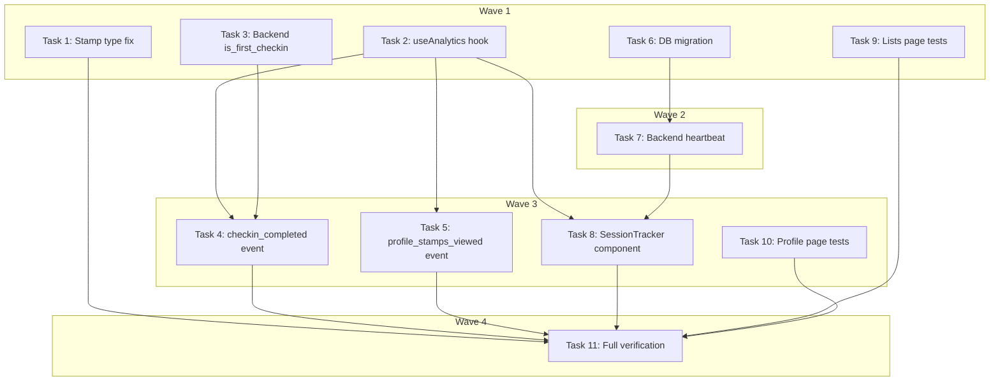

# Phase 2A Completion Implementation Plan

> **For Claude:** REQUIRED SUB-SKILL: Use executing-plans to implement this plan task-by-task.

**Design Doc:** [docs/designs/2026-03-05-phase2a-completion-design.md](docs/designs/2026-03-05-phase2a-completion-design.md)

**Spec References:** [SPEC.md#6 Observability](SPEC.md#6-observability-analytics)

**PRD References:** ---

**Goal:** Complete Phase 2A by adding analytics instrumentation (3 PostHog events), fixing the Stamp type, and adding user journey tests for lists and profile pages.

**Architecture:** Frontend `useAnalytics()` hook wraps PostHog lazy import for event capture. Backend `POST /auth/session-heartbeat` endpoint tracks session counts in the profiles table. `POST /checkins` response is enriched with `is_first_checkin_at_shop`. Frontend tests follow the existing pattern of mocking `fetch` at module level and using `SWRConfig` provider.

**Tech Stack:** PostHog (posthog-js), Vitest + Testing Library (frontend tests), pytest (backend tests), Supabase migrations (session columns)

**Acceptance Criteria:**
- [ ] After a successful check-in, `checkin_completed` PostHog event fires with `shop_id`, `is_first_checkin_at_shop`, `has_text_note`, `has_menu_photo`
- [ ] When a user views their profile with stamps, `profile_stamps_viewed` fires with `stamp_count`
- [ ] On app mount, `session_start` fires with `days_since_first_session` and `previous_sessions`
- [ ] Lists page tests cover create, 3-list cap enforcement, and delete user journeys
- [ ] Profile page tests cover stamp tap detail sheet, empty states, and check-in history info

---

## Task 1: StampData Type Fix

**Files:**
- Modify: `lib/types/index.ts:93-100`

**Step 1: Add `shopName` to Stamp interface**

No test needed — this is a type-only change. The `StampData` interface in `lib/hooks/use-user-stamps.ts:6-14` and the `makeStamp()` factory in `lib/test-utils/factories.ts:100-112` already have `shop_name`. This aligns the canonical domain type.

```typescript
// lib/types/index.ts — replace lines 93-100
export interface Stamp {
  id: string;
  userId: string;
  shopId: string;
  checkInId: string;
  designUrl: string;
  earnedAt: string;
  shopName: string | null;
}
```

**Step 2: Verify build**

Run: `pnpm type-check`
Expected: PASS (no consumers use `Stamp` type without `shopName` — the hook uses its own `StampData`)

**Step 3: Commit**

```bash
git add lib/types/index.ts
git commit -m "fix: add shopName to Stamp type to match StampData and factory"
```

---

## Task 2: `useAnalytics` Hook

**Files:**
- Create: `lib/posthog/use-analytics.ts`
- Create: `lib/posthog/__tests__/use-analytics.test.ts`

**Step 1: Write the failing test**

Create `lib/posthog/__tests__/use-analytics.test.ts`:

```typescript
import { describe, it, expect, vi, beforeEach, afterEach } from 'vitest';
import { renderHook, act } from '@testing-library/react';

const mockCapture = vi.fn();
vi.mock('posthog-js', () => ({
  default: {
    capture: mockCapture,
  },
}));

describe('useAnalytics', () => {
  beforeEach(() => {
    mockCapture.mockReset();
  });

  afterEach(() => {
    vi.unstubAllEnvs();
  });

  it('captures an event when PostHog key is set', async () => {
    vi.stubEnv('NEXT_PUBLIC_POSTHOG_KEY', 'phc_test123');
    const { useAnalytics } = await import('../use-analytics');
    const { result } = renderHook(() => useAnalytics());

    act(() => {
      result.current.capture('test_event', { foo: 'bar' });
    });

    expect(mockCapture).toHaveBeenCalledWith('test_event', { foo: 'bar' });
  });

  it('no-ops when PostHog key is not set', async () => {
    vi.stubEnv('NEXT_PUBLIC_POSTHOG_KEY', '');
    vi.resetModules();
    const { useAnalytics } = await import('../use-analytics');
    const { result } = renderHook(() => useAnalytics());

    act(() => {
      result.current.capture('test_event', { foo: 'bar' });
    });

    expect(mockCapture).not.toHaveBeenCalled();
  });
});
```

**Step 2: Run test to verify it fails**

Run: `pnpm test lib/posthog/__tests__/use-analytics.test.ts`
Expected: FAIL — module `../use-analytics` does not exist

**Step 3: Write minimal implementation**

Create `lib/posthog/use-analytics.ts`:

```typescript
'use client';

import { useCallback } from 'react';

export function useAnalytics() {
  const capture = useCallback(
    (event: string, properties: Record<string, unknown>) => {
      const key = process.env.NEXT_PUBLIC_POSTHOG_KEY;
      if (!key) return;

      import('posthog-js').then(({ default: posthog }) => {
        posthog.capture(event, properties);
      });
    },
    []
  );

  return { capture };
}
```

**Step 4: Run test to verify it passes**

Run: `pnpm test lib/posthog/__tests__/use-analytics.test.ts`
Expected: PASS

**Step 5: Commit**

```bash
git add lib/posthog/use-analytics.ts lib/posthog/__tests__/use-analytics.test.ts
git commit -m "feat: useAnalytics hook for PostHog event capture"
```

---

## Task 3: Backend — `is_first_checkin_at_shop` in Check-in Response

**Files:**
- Modify: `backend/models/types.py:150-168` (add `CreateCheckInResponse` model)
- Modify: `backend/services/checkin_service.py:20-56` (add count query)
- Modify: `backend/api/checkins.py:43-64` (return enriched response)
- Create: `backend/tests/test_checkin_api.py`

**API Contract:**
```yaml
endpoint: POST /checkins
request: (unchanged)
response:
  id: string
  user_id: string
  shop_id: string
  photo_urls: string[]
  menu_photo_url: string | null
  note: string | null
  stars: int | null
  review_text: string | null
  confirmed_tags: string[] | null
  reviewed_at: string | null
  created_at: string
  is_first_checkin_at_shop: bool  # NEW
```

**Step 1: Write the failing test**

Create `backend/tests/test_checkin_api.py`:

```python
from unittest.mock import MagicMock

import pytest
from fastapi.testclient import TestClient

from api.deps import get_current_user, get_user_db
from main import app
from tests.factories import make_checkin


@pytest.fixture
def client():
    return TestClient(app)


@pytest.fixture
def auth_headers():
    return {"Authorization": "Bearer test-token"}


class TestCreateCheckinIsFirst:
    def test_first_checkin_at_shop_returns_true(self, client: TestClient, auth_headers: dict):
        db = MagicMock()
        # Count query returns 0 existing check-ins
        count_chain = MagicMock()
        count_chain.select.return_value.eq.return_value.eq.return_value.execute.return_value.count = 0

        # Insert returns the new check-in
        insert_chain = MagicMock()
        insert_chain.insert.return_value.execute.return_value.data = [
            make_checkin(id="ci-new", shop_id="shop-a")
        ]

        def table_router(name: str):
            mock = MagicMock()
            # For select("id", count="exact") — the count query
            mock.select = count_chain.select
            # For insert — the create query
            mock.insert = insert_chain.insert
            return mock

        db.table.side_effect = table_router

        app.dependency_overrides[get_current_user] = lambda: {"id": "user-123"}
        app.dependency_overrides[get_user_db] = lambda: db

        try:
            resp = client.post(
                "/checkins",
                json={
                    "shop_id": "shop-a",
                    "photo_urls": ["https://example.com/photo.jpg"],
                },
                headers=auth_headers,
            )
            assert resp.status_code == 200
            data = resp.json()
            assert data["is_first_checkin_at_shop"] is True
        finally:
            app.dependency_overrides.pop(get_current_user, None)
            app.dependency_overrides.pop(get_user_db, None)

    def test_repeat_checkin_at_shop_returns_false(self, client: TestClient, auth_headers: dict):
        db = MagicMock()
        count_chain = MagicMock()
        count_chain.select.return_value.eq.return_value.eq.return_value.execute.return_value.count = 2

        insert_chain = MagicMock()
        insert_chain.insert.return_value.execute.return_value.data = [
            make_checkin(id="ci-new", shop_id="shop-a")
        ]

        def table_router(name: str):
            mock = MagicMock()
            mock.select = count_chain.select
            mock.insert = insert_chain.insert
            return mock

        db.table.side_effect = table_router

        app.dependency_overrides[get_current_user] = lambda: {"id": "user-123"}
        app.dependency_overrides[get_user_db] = lambda: db

        try:
            resp = client.post(
                "/checkins",
                json={
                    "shop_id": "shop-a",
                    "photo_urls": ["https://example.com/photo.jpg"],
                },
                headers=auth_headers,
            )
            assert resp.status_code == 200
            data = resp.json()
            assert data["is_first_checkin_at_shop"] is False
        finally:
            app.dependency_overrides.pop(get_current_user, None)
            app.dependency_overrides.pop(get_user_db, None)
```

**Step 2: Run test to verify it fails**

Run: `cd backend && pytest tests/test_checkin_api.py -v`
Expected: FAIL — response does not contain `is_first_checkin_at_shop`

**Step 3: Add `CreateCheckInResponse` model**

In `backend/models/types.py`, after the `CheckIn` class (line 168), add:

```python
class CreateCheckInResponse(BaseModel):
    """Check-in creation response with analytics metadata."""
    id: str
    user_id: str
    shop_id: str
    photo_urls: list[str]
    menu_photo_url: str | None = None
    note: str | None = None
    stars: int | None = None
    review_text: str | None = None
    confirmed_tags: list[str] | None = None
    reviewed_at: datetime | None = None
    created_at: datetime
    is_first_checkin_at_shop: bool
```

**Step 4: Update `CheckInService.create()` return type**

In `backend/services/checkin_service.py`, update imports and the `create` method:

```python
# Update import line 8
from models.types import CheckIn, CheckInWithShop, CreateCheckInResponse

# Replace the create method (lines 20-56) with:
async def create(
    self,
    user_id: str,
    shop_id: str,
    photo_urls: list[str],
    menu_photo_url: str | None = None,
    note: str | None = None,
    stars: int | None = None,
    review_text: str | None = None,
    confirmed_tags: list[str] | None = None,
) -> CreateCheckInResponse:
    """Create a check-in. DB trigger handles stamp creation and job queueing."""
    if len(photo_urls) < 1:
        raise ValueError("At least one photo is required for check-in")
    if review_text is not None and stars is None:
        raise ValueError("review_text requires a star rating")
    if stars is not None:
        self._validate_stars(stars)

    # Check if this is the user's first check-in at this shop
    count_resp = await asyncio.to_thread(
        lambda: self._db.table("check_ins")
        .select("id", count="exact")
        .eq("user_id", user_id)
        .eq("shop_id", shop_id)
        .execute()
    )
    is_first = (count_resp.count or 0) == 0

    checkin_data: dict[str, Any] = {
        "user_id": user_id,
        "shop_id": shop_id,
        "photo_urls": photo_urls,
        "menu_photo_url": menu_photo_url,
        "note": note,
    }
    if stars is not None:
        checkin_data["stars"] = stars
        checkin_data["review_text"] = review_text
        checkin_data["confirmed_tags"] = confirmed_tags
        checkin_data["reviewed_at"] = datetime.now(timezone.utc).isoformat()  # noqa: UP017

    response = await asyncio.to_thread(
        lambda: self._db.table("check_ins").insert(checkin_data).execute()
    )
    rows = cast("list[dict[str, Any]]", response.data)
    row = first(rows, "create check-in")
    return CreateCheckInResponse(**row, is_first_checkin_at_shop=is_first)
```

**Step 5: Update API route handler**

In `backend/api/checkins.py`, update `create_checkin` (line 62):

```python
# Replace line 62:
#     return result.model_dump()
# With:
        return result.model_dump()
```

No change needed — `result.model_dump()` will now include `is_first_checkin_at_shop` since the return type changed.

**Step 6: Run test to verify it passes**

Run: `cd backend && pytest tests/test_checkin_api.py -v`
Expected: PASS

**Step 7: Run full backend verification**

Run: `cd backend && pytest && ruff check . && ruff format --check .`
Expected: All pass

**Step 8: Commit**

```bash
git add backend/models/types.py backend/services/checkin_service.py backend/api/checkins.py backend/tests/test_checkin_api.py
git commit -m "feat: return is_first_checkin_at_shop in check-in response"
```

---

## Task 4: `checkin_completed` PostHog Event

**Files:**
- Modify: `app/(protected)/checkin/[shopId]/page.tsx:63-125`
- Modify: `app/(protected)/checkin/[shopId]/page.test.tsx`

**Step 1: Write the failing test**

Add to the bottom of `app/(protected)/checkin/[shopId]/page.test.tsx`, inside the existing `describe('CheckInPage', ...)` block:

```typescript
// Add this mock before the import of CheckInPage (after the existing vi.mock blocks, ~line 58)
const mockCapture = vi.fn();
vi.mock('@/lib/posthog/use-analytics', () => ({
  useAnalytics: () => ({ capture: mockCapture }),
}));

// Add this to the beforeEach block (after mockBack.mockReset())
// mockCapture.mockReset();

// Add this test at the end of the describe block:
it('fires checkin_completed PostHog event after successful submit', async () => {
  mockFetch.mockResolvedValueOnce({
    ok: true,
    json: async () => ({
      id: 'ci-4',
      shop_id: 'shop-d4e5f6',
      photo_urls: [
        'https://example.supabase.co/storage/v1/object/public/checkin-photos/user-abc/photo.webp',
      ],
      is_first_checkin_at_shop: true,
      created_at: '2026-03-04T10:00:00Z',
    }),
  });

  render(<CheckInPage />);
  await screen.findByText(/山小孩咖啡/);

  const input = screen.getByTestId('photo-input');
  const file = new File(['photo'], 'latte.jpg', { type: 'image/jpeg' });
  await userEvent.upload(input, file);

  const submitBtn = screen.getByRole('button', { name: /check in/i });
  await userEvent.click(submitBtn);

  await waitFor(() => {
    expect(mockCapture).toHaveBeenCalledWith('checkin_completed', {
      shop_id: 'shop-d4e5f6',
      is_first_checkin_at_shop: true,
      has_text_note: false,
      has_menu_photo: false,
    });
  });
});
```

**Step 2: Run test to verify it fails**

Run: `pnpm test app/(protected)/checkin/[shopId]/page.test.tsx`
Expected: FAIL — `mockCapture` not called

**Step 3: Add PostHog capture to check-in page**

In `app/(protected)/checkin/[shopId]/page.tsx`:

Add import at top (after line 12):
```typescript
import { useAnalytics } from '@/lib/posthog/use-analytics';
```

Inside the component, add after `const router = useRouter();` (line 19):
```typescript
const { capture } = useAnalytics();
```

In `handleSubmit`, after the `fetchWithAuth` call succeeds (after line 89, before the `toast()`), add:

```typescript
      const result = await fetchWithAuth('/api/checkins', {
        method: 'POST',
        body: JSON.stringify({
          shop_id: shopId,
          photo_urls: photoUrls,
          menu_photo_url: menuPhotoUrl ?? null,
          note: note.trim() || null,
          ...(stars > 0 && {
            stars,
            review_text: reviewText.trim() || null,
            confirmed_tags: confirmedTags,
          }),
        }),
      });

      capture('checkin_completed', {
        shop_id: shopId,
        is_first_checkin_at_shop: result.is_first_checkin_at_shop,
        has_text_note: note.trim().length > 0,
        has_menu_photo: menuPhoto !== null,
      });
```

Note: This requires changing the `fetchWithAuth` call to capture its return value. Currently on line 76 it does `await fetchWithAuth(...)` without storing the result. Change to `const result = await fetchWithAuth(...)`.

Add `capture` to the `useCallback` dependency array.

**Step 4: Run test to verify it passes**

Run: `pnpm test app/(protected)/checkin/[shopId]/page.test.tsx`
Expected: PASS

**Step 5: Commit**

```bash
git add app/(protected)/checkin/[shopId]/page.tsx app/(protected)/checkin/[shopId]/page.test.tsx
git commit -m "feat: fire checkin_completed PostHog event after successful check-in"
```

---

## Task 5: `profile_stamps_viewed` PostHog Event

**Files:**
- Modify: `app/(protected)/profile/page.tsx`
- Modify: `app/(protected)/profile/page.test.tsx`

**Step 1: Write the failing test**

Add to `app/(protected)/profile/page.test.tsx`. Add the analytics mock before the import of `ProfilePage` (after line 18):

```typescript
const mockCapture = vi.fn();
vi.mock('@/lib/posthog/use-analytics', () => ({
  useAnalytics: () => ({ capture: mockCapture }),
}));
```

Add `mockCapture.mockReset();` to the `beforeEach` block.

Add test at the end of the describe block:

```typescript
it('fires profile_stamps_viewed when stamps load', async () => {
  mockAllEndpoints();
  render(<ProfilePage />, { wrapper });

  await waitFor(() => {
    expect(mockCapture).toHaveBeenCalledWith('profile_stamps_viewed', {
      stamp_count: 1,
    });
  });
});
```

**Step 2: Run test to verify it fails**

Run: `pnpm test app/(protected)/profile/page.test.tsx`
Expected: FAIL — `mockCapture` not called

**Step 3: Add PostHog capture to profile page**

In `app/(protected)/profile/page.tsx`:

Add import (after line 7):
```typescript
import { useEffect } from 'react';
import { useAnalytics } from '@/lib/posthog/use-analytics';
```

Note: `useState` is already imported from React. The `useEffect` import needs to be added to the existing `import { useState } from 'react';` line — change it to `import { useEffect, useState } from 'react';`.

Inside the component, add after `const [selectedStamp, ...` (after line 21):

```typescript
const { capture } = useAnalytics();

useEffect(() => {
  if (!stampsLoading && stamps.length > 0) {
    capture('profile_stamps_viewed', { stamp_count: stamps.length });
  }
}, [stampsLoading, stamps.length, capture]);
```

**Step 4: Run test to verify it passes**

Run: `pnpm test app/(protected)/profile/page.test.tsx`
Expected: PASS

**Step 5: Commit**

```bash
git add app/(protected)/profile/page.tsx app/(protected)/profile/page.test.tsx
git commit -m "feat: fire profile_stamps_viewed PostHog event on profile load"
```

---

## Task 6: DB Migration — Session Tracking Columns

**Files:**
- Create: `supabase/migrations/20260305000001_session_tracking.sql`

No test needed — this is a SQL migration. Verified by the backend tests that follow.

**Step 1: Write the migration**

```sql
-- Add session tracking columns to profiles for session_start analytics
ALTER TABLE profiles
  ADD COLUMN IF NOT EXISTS session_count integer NOT NULL DEFAULT 0,
  ADD COLUMN IF NOT EXISTS first_session_at timestamptz,
  ADD COLUMN IF NOT EXISTS last_session_at timestamptz;
```

**Step 2: Commit**

```bash
git add supabase/migrations/20260305000001_session_tracking.sql
git commit -m "migration: add session_count, first_session_at, last_session_at to profiles"
```

---

## Task 7: Backend — Session Heartbeat Endpoint

**Files:**
- Modify: `backend/services/profile_service.py`
- Modify: `backend/api/auth.py`
- Modify: `backend/tests/test_profile_service.py`

**API Contract:**
```yaml
endpoint: POST /auth/session-heartbeat
request: (empty body)
response:
  days_since_first_session: int
  previous_sessions: int
errors:
  401: unauthenticated
```

**Step 1: Write the failing test**

Add to `backend/tests/test_profile_service.py`:

```python
from datetime import UTC, datetime, timedelta


class TestSessionHeartbeat:
    @pytest.mark.asyncio
    async def test_first_session_returns_zero_counters(self, mock_db: MagicMock):
        """First-time user gets days=0 and previous_sessions=0."""
        profile_table = MagicMock()
        profile_table.select.return_value.eq.return_value.single.return_value.execute.return_value.data = {
            "session_count": 0,
            "first_session_at": None,
            "last_session_at": None,
        }
        mock_db.table.return_value = profile_table

        service = ProfileService(db=mock_db)
        result = await service.session_heartbeat("user-new")

        assert result["days_since_first_session"] == 0
        assert result["previous_sessions"] == 0

    @pytest.mark.asyncio
    async def test_returning_user_gets_correct_counters(self, mock_db: MagicMock):
        """Returning user after 3 days and 5 previous sessions."""
        first = datetime(2026, 3, 1, tzinfo=UTC)
        last = datetime(2026, 3, 3, tzinfo=UTC)
        profile_table = MagicMock()
        profile_table.select.return_value.eq.return_value.single.return_value.execute.return_value.data = {
            "session_count": 5,
            "first_session_at": first.isoformat(),
            "last_session_at": last.isoformat(),
        }
        mock_db.table.return_value = profile_table

        service = ProfileService(db=mock_db)
        result = await service.session_heartbeat("user-returning")

        assert result["days_since_first_session"] >= 0
        assert result["previous_sessions"] == 5

    @pytest.mark.asyncio
    async def test_heartbeat_within_30min_does_not_increment(self, mock_db: MagicMock):
        """Heartbeat within 30 min of last session does not increment counter."""
        now = datetime.now(UTC)
        recent = now - timedelta(minutes=10)
        profile_table = MagicMock()
        profile_table.select.return_value.eq.return_value.single.return_value.execute.return_value.data = {
            "session_count": 3,
            "first_session_at": (now - timedelta(days=5)).isoformat(),
            "last_session_at": recent.isoformat(),
        }
        mock_db.table.return_value = profile_table

        service = ProfileService(db=mock_db)
        result = await service.session_heartbeat("user-active")

        assert result["previous_sessions"] == 3
        # Should NOT have called update
        profile_table.update.assert_not_called()
```

**Step 2: Run test to verify it fails**

Run: `cd backend && pytest tests/test_profile_service.py::TestSessionHeartbeat -v`
Expected: FAIL — `ProfileService` has no `session_heartbeat` method

**Step 3: Implement `session_heartbeat` in ProfileService**

Add to `backend/services/profile_service.py` (at the end of the class, after `update_profile`):

```python
async def session_heartbeat(self, user_id: str) -> dict[str, int]:
    """Track session start. Deduplicates within 30 min."""
    from datetime import UTC, datetime, timedelta

    profile_resp = await asyncio.to_thread(
        lambda: self._db.table("profiles")
        .select("session_count, first_session_at, last_session_at")
        .eq("id", user_id)
        .single()
        .execute()
    )
    profile = cast("dict[str, Any]", profile_resp.data)
    session_count = profile.get("session_count") or 0
    first_session_at = profile.get("first_session_at")
    last_session_at = profile.get("last_session_at")

    now = datetime.now(UTC)

    # Deduplicate: skip increment if last session was < 30 min ago
    should_increment = True
    if last_session_at:
        last_dt = datetime.fromisoformat(last_session_at) if isinstance(last_session_at, str) else last_session_at
        if (now - last_dt) < timedelta(minutes=30):
            should_increment = False

    if should_increment:
        update_data: dict[str, Any] = {
            "session_count": session_count + 1,
            "last_session_at": now.isoformat(),
        }
        if first_session_at is None:
            update_data["first_session_at"] = now.isoformat()

        await asyncio.to_thread(
            lambda: self._db.table("profiles")
            .update(update_data)
            .eq("id", user_id)
            .execute()
        )
        session_count += 1
        if first_session_at is None:
            first_session_at = now.isoformat()

    # Calculate days since first session
    days = 0
    if first_session_at:
        first_dt = datetime.fromisoformat(first_session_at) if isinstance(first_session_at, str) else first_session_at
        days = (now - first_dt).days

    return {
        "days_since_first_session": days,
        "previous_sessions": session_count,
    }
```

**Step 4: Run test to verify it passes**

Run: `cd backend && pytest tests/test_profile_service.py::TestSessionHeartbeat -v`
Expected: PASS

**Step 5: Add the API route**

In `backend/api/auth.py`, add at the end of the file:

```python
from services.profile_service import ProfileService


@router.post("/session-heartbeat")
async def session_heartbeat(
    user: dict[str, Any] = Depends(get_current_user),  # noqa: B008
    db: Client = Depends(get_user_db),  # noqa: B008
) -> dict[str, int]:
    """Track session start for analytics. Deduplicates within 30 min."""
    service = ProfileService(db=db)
    return await service.session_heartbeat(user["id"])
```

**Step 6: Run full backend verification**

Run: `cd backend && pytest && ruff check . && ruff format --check .`
Expected: All pass

**Step 7: Commit**

```bash
git add backend/services/profile_service.py backend/api/auth.py backend/tests/test_profile_service.py
git commit -m "feat: session heartbeat endpoint for session_start analytics"
```

---

## Task 8: Frontend — Session Tracker Component + Proxy

**Files:**
- Create: `app/api/auth/session-heartbeat/route.ts`
- Create: `components/session-tracker.tsx`
- Modify: `app/layout.tsx:1-36`
- Create: `components/__tests__/session-tracker.test.tsx`

**Step 1: Write the failing test**

Create `components/__tests__/session-tracker.test.tsx`:

```typescript
import { describe, it, expect, vi, beforeEach } from 'vitest';
import { render, waitFor } from '@testing-library/react';

vi.mock('@/lib/supabase/client', () => ({
  createClient: () => ({
    auth: {
      getSession: vi.fn().mockResolvedValue({
        data: { session: { access_token: 'test-token' } },
      }),
    },
  }),
}));

const mockCapture = vi.fn();
vi.mock('@/lib/posthog/use-analytics', () => ({
  useAnalytics: () => ({ capture: mockCapture }),
}));

const mockFetch = vi.fn();
global.fetch = mockFetch;

import { SessionTracker } from '../session-tracker';

describe('SessionTracker', () => {
  beforeEach(() => {
    mockFetch.mockReset();
    mockCapture.mockReset();
  });

  it('calls heartbeat endpoint and fires session_start event', async () => {
    mockFetch.mockResolvedValueOnce({
      ok: true,
      json: async () => ({
        days_since_first_session: 3,
        previous_sessions: 5,
      }),
    });

    render(<SessionTracker />);

    await waitFor(() => {
      expect(mockCapture).toHaveBeenCalledWith('session_start', {
        days_since_first_session: 3,
        previous_sessions: 5,
      });
    });
  });

  it('does not fire event when heartbeat fails', async () => {
    mockFetch.mockResolvedValueOnce({
      ok: false,
      json: async () => ({ detail: 'Unauthorized' }),
    });

    render(<SessionTracker />);

    // Wait a tick, then verify no capture
    await new Promise((r) => setTimeout(r, 50));
    expect(mockCapture).not.toHaveBeenCalled();
  });
});
```

**Step 2: Run test to verify it fails**

Run: `pnpm test components/__tests__/session-tracker.test.tsx`
Expected: FAIL — `session-tracker` module does not exist

**Step 3: Create proxy route**

Create `app/api/auth/session-heartbeat/route.ts`:

```typescript
import { NextRequest } from 'next/server';
import { proxyToBackend } from '@/lib/api/proxy';

export async function POST(request: NextRequest) {
  return proxyToBackend(request, '/auth/session-heartbeat');
}
```

**Step 4: Create SessionTracker component**

Create `components/session-tracker.tsx`:

```typescript
'use client';

import { useEffect, useRef } from 'react';
import { useAnalytics } from '@/lib/posthog/use-analytics';
import { fetchWithAuth } from '@/lib/api/fetch';

export function SessionTracker() {
  const { capture } = useAnalytics();
  const hasFired = useRef(false);

  useEffect(() => {
    if (hasFired.current) return;
    hasFired.current = true;

    fetchWithAuth('/api/auth/session-heartbeat', { method: 'POST' })
      .then((data: { days_since_first_session: number; previous_sessions: number }) => {
        capture('session_start', {
          days_since_first_session: data.days_since_first_session,
          previous_sessions: data.previous_sessions,
        });
      })
      .catch(() => {
        // Silently ignore — user may not be authenticated
      });
  }, [capture]);

  return null;
}
```

**Step 5: Mount in root layout**

In `app/layout.tsx`, add import (after line 3):
```typescript
import { SessionTracker } from '@/components/session-tracker';
```

Inside the `<PostHogProvider>` wrapper (line 32), add `<SessionTracker />`:
```typescript
<PostHogProvider>
  <SessionTracker />
  {children}
</PostHogProvider>
```

**Step 6: Run test to verify it passes**

Run: `pnpm test components/__tests__/session-tracker.test.tsx`
Expected: PASS

**Step 7: Commit**

```bash
git add app/api/auth/session-heartbeat/route.ts components/session-tracker.tsx components/__tests__/session-tracker.test.tsx app/layout.tsx
git commit -m "feat: SessionTracker component fires session_start PostHog event"
```

---

## Task 9: Lists Page User Journey Tests

**Files:**
- Modify: `app/(protected)/lists/page.test.tsx`

**Step 1: Write the tests**

Add new tests inside the existing `describe('/lists page', ...)` block in `app/(protected)/lists/page.test.tsx`:

```typescript
// Add userEvent import at top: import userEvent from '@testing-library/user-event';
// Add toast mock before the describe block (after the existing vi.mock blocks):
vi.mock('sonner', () => ({
  toast: Object.assign(vi.fn(), {
    success: vi.fn(),
    error: vi.fn(),
  }),
}));

it('user can create a new list when under the cap', async () => {
  const user = userEvent.setup();
  // Start with only 1 list
  mockFetch.mockReset();
  const oneList = [THREE_LISTS[0]];
  mockFetch.mockResolvedValue({
    ok: true,
    json: async () => oneList,
  });

  render(
    <SWRConfig value={{ provider: () => new Map() }}>
      <ListsPage />
    </SWRConfig>
  );

  // Wait for page to load
  expect(await screen.findByText('Work spots')).toBeInTheDocument();
  expect(screen.getByText('1 / 3')).toBeInTheDocument();

  // Type a list name and click Add
  const input = screen.getByPlaceholderText(/create new list/i);
  await user.type(input, '我的最愛');

  // Mock the POST response, then the subsequent GET (SWR revalidation)
  mockFetch.mockResolvedValueOnce({ ok: true, json: async () => ({}) });
  mockFetch.mockResolvedValueOnce({
    ok: true,
    json: async () => [
      ...oneList,
      {
        id: 'list-new',
        user_id: USER_ID,
        name: '我的最愛',
        items: [],
        created_at: '2026-03-05T10:00:00Z',
        updated_at: '2026-03-05T10:00:00Z',
      },
    ],
  });

  await user.click(screen.getByText('Add'));

  // Verify the new list appears after revalidation
  await waitFor(() => {
    expect(screen.getByText('我的最愛')).toBeInTheDocument();
  });
});

it('user sees error when trying to create a list at the 3-list cap', async () => {
  const user = userEvent.setup();
  // Start with 2 lists (under cap so input is visible), then try to create when API rejects
  const twoLists = THREE_LISTS.slice(0, 2);
  mockFetch.mockReset();
  mockFetch.mockResolvedValue({
    ok: true,
    json: async () => twoLists,
  });

  render(
    <SWRConfig value={{ provider: () => new Map() }}>
      <ListsPage />
    </SWRConfig>
  );

  expect(await screen.findByText('Work spots')).toBeInTheDocument();

  const input = screen.getByPlaceholderText(/create new list/i);
  await user.type(input, 'Fourth list');

  // Mock the POST to fail with max limit error
  mockFetch.mockResolvedValueOnce({
    ok: false,
    json: async () => ({ detail: 'Maximum 3 lists per user' }),
  });

  await user.click(screen.getByText('Add'));

  // The toast.error should have been called with the cap message
  const { toast } = await import('sonner');
  await waitFor(() => {
    expect(toast.error).toHaveBeenCalledWith(
      expect.stringContaining('3-list limit')
    );
  });
});

it('user can delete a list via the menu', async () => {
  const user = userEvent.setup();
  // Mock window.confirm
  vi.spyOn(window, 'confirm').mockReturnValue(true);

  render(
    <SWRConfig value={{ provider: () => new Map() }}>
      <ListsPage />
    </SWRConfig>
  );

  expect(await screen.findByText('Work spots')).toBeInTheDocument();

  // Find and click the delete button for "Work spots" (via accessible name)
  const deleteButtons = screen.getAllByRole('button', { name: /delete list/i });

  // Mock DELETE response, then revalidation with 2 lists
  mockFetch.mockResolvedValueOnce({ ok: true, json: async () => ({}) });
  mockFetch.mockResolvedValueOnce({
    ok: true,
    json: async () => THREE_LISTS.slice(1),
  });

  await user.click(deleteButtons[0]);

  // Optimistic update removes it immediately
  await waitFor(() => {
    expect(screen.queryByText('Work spots')).not.toBeInTheDocument();
  });
});
```

**Step 2: Run tests to verify they pass**

Run: `pnpm test app/(protected)/lists/page.test.tsx`
Expected: PASS

Note: These tests may need adjustment based on the exact DOM structure. The key patterns are:
- Create: type in input → click Add → verify new list appears
- Cap: POST fails with "Maximum" → verify toast.error
- Delete: click delete → confirm → verify list disappears

**Step 3: Commit**

```bash
git add app/(protected)/lists/page.test.tsx
git commit -m "test: lists page user journey tests — create, cap enforcement, delete"
```

---

## Task 10: Profile Page User Journey Tests

**Files:**
- Modify: `app/(protected)/profile/page.test.tsx`

**Step 1: Write the tests**

Add new tests inside the existing `describe('ProfilePage', ...)` block:

```typescript
// Add at the top — mock next/link (before the import of ProfilePage)
vi.mock('next/link', () => ({
  default: ({
    href,
    children,
    className,
  }: {
    href: string;
    children: React.ReactNode;
    className?: string;
  }) => (
    <a href={href} className={className}>
      {children}
    </a>
  ),
}));

// Add this mock for the Drawer/vaul used by StampDetailSheet
vi.mock('@/components/ui/drawer', () => ({
  Drawer: ({ children, open }: { children: React.ReactNode; open: boolean }) =>
    open ? <div data-testid="drawer">{children}</div> : null,
  DrawerContent: ({ children }: { children: React.ReactNode }) => (
    <div>{children}</div>
  ),
  DrawerHeader: ({
    children,
    className,
  }: {
    children: React.ReactNode;
    className?: string;
  }) => <div className={className}>{children}</div>,
  DrawerTitle: ({ children }: { children: React.ReactNode }) => (
    <h2>{children}</h2>
  ),
}));

// Mock next/image (needed for StampPassport and CheckinHistoryTab)
vi.mock('next/image', () => ({
  default: (props: Record<string, unknown>) => (
    // eslint-disable-next-line @next/next/no-img-element, jsx-a11y/alt-text
    
  ),
}));

it('tapping a stamp opens the detail sheet with shop name', async () => {
  const user = userEvent.setup();
  mockAllEndpoints();
  render(<ProfilePage />, { wrapper });

  // Wait for stamps to load
  const filledSlots = await screen.findAllByTestId('stamp-slot-filled');
  expect(filledSlots.length).toBeGreaterThan(0);

  // Click first stamp
  await user.click(filledSlots[0]);

  // StampDetailSheet should appear with the shop name
  await waitFor(() => {
    expect(screen.getByTestId('drawer')).toBeInTheDocument();
    expect(screen.getByText('Fika Coffee')).toBeInTheDocument();
  });
});

it('shows empty state when user has no stamps', async () => {
  mockAllEndpoints({ stamps: [] });
  render(<ProfilePage />, { wrapper });

  // With 0 stamps, all slots should be empty
  await waitFor(() => {
    const emptySlots = screen.getAllByTestId('stamp-slot-empty');
    expect(emptySlots.length).toBe(20); // one full page of empty slots
  });
});

it('shows empty state when user has no check-ins', async () => {
  const user = userEvent.setup();
  mockAllEndpoints({ checkins: [] });
  render(<ProfilePage />, { wrapper });

  // Switch to check-ins tab
  await waitFor(() => {
    expect(
      screen.getByRole('tab', { name: /check-ins/i })
    ).toBeInTheDocument();
  });
  await user.click(screen.getByRole('tab', { name: /check-ins/i }));

  await waitFor(() => {
    expect(screen.getByText(/no check-ins yet/i)).toBeInTheDocument();
  });
});

it('check-in history shows shop name and star rating', async () => {
  const user = userEvent.setup();
  mockAllEndpoints();
  render(<ProfilePage />, { wrapper });

  await waitFor(() => {
    expect(
      screen.getByRole('tab', { name: /check-ins/i })
    ).toBeInTheDocument();
  });
  await user.click(screen.getByRole('tab', { name: /check-ins/i }));

  await waitFor(() => {
    expect(screen.getByText('Fika Coffee')).toBeInTheDocument();
    // 4-star rating — should have 4 filled stars
    const filledStars = screen.getAllByTestId('star-filled');
    expect(filledStars.length).toBe(4);
  });
});
```

**Step 2: Run tests to verify they pass**

Run: `pnpm test app/(protected)/profile/page.test.tsx`
Expected: PASS

**Step 3: Commit**

```bash
git add app/(protected)/profile/page.test.tsx
git commit -m "test: profile page user journey tests — stamp detail, empty states, check-in history"
```

---

## Task 11: Full Verification

**Step 1: Run all backend tests**

Run: `cd backend && pytest -v`
Expected: All pass

**Step 2: Run all frontend tests**

Run: `pnpm test`
Expected: All pass

**Step 3: Run linters and type-check**

Run: `pnpm type-check && pnpm lint && cd backend && ruff check . && ruff format --check .`
Expected: All pass

**Step 4: Run build**

Run: `pnpm build`
Expected: PASS

---

## Execution Waves



**Wave 1** (parallel — no dependencies):
- Task 1: Stamp type fix
- Task 2: useAnalytics hook
- Task 3: Backend is_first_checkin_at_shop
- Task 6: DB migration for session tracking
- Task 9: Lists page user journey tests

**Wave 2** (depends on Wave 1):
- Task 7: Backend session heartbeat ← Task 6

**Wave 3** (depends on Wave 1 + 2):
- Task 4: checkin_completed event ← Task 2, Task 3
- Task 5: profile_stamps_viewed event ← Task 2
- Task 8: SessionTracker component ← Task 2, Task 7
- Task 10: Profile page user journey tests (can run in Wave 1 but grouped here since profile_stamps_viewed mock pattern needed)

**Wave 4** (depends on all):
- Task 11: Full verification

---

## TODO.md Updates

Add under the Phase 2A section:

```markdown
### Phase 2A Completion

> **Design Doc:** [docs/designs/2026-03-05-phase2a-completion-design.md](docs/designs/2026-03-05-phase2a-completion-design.md)
> **Plan:** [docs/plans/2026-03-05-phase2a-completion-plan.md](docs/plans/2026-03-05-phase2a-completion-plan.md)

**Chunk 1 — Type Fix + Analytics Hook (Wave 1):**

- [ ] Fix Stamp type: add shopName field
- [ ] Create useAnalytics hook with TDD

**Chunk 2 — Backend Changes (Wave 1-2):**

- [ ] Backend: is_first_checkin_at_shop in check-in response with TDD
- [ ] DB migration: session tracking columns
- [ ] Backend: session heartbeat endpoint with TDD

**Chunk 3 — Frontend Analytics Events (Wave 3):**

- [ ] checkin_completed PostHog event
- [ ] profile_stamps_viewed PostHog event
- [ ] SessionTracker component + session_start event

**Chunk 4 — User Journey Tests (Wave 1, 3):**

- [ ] Lists page tests (create, cap enforcement, delete)
- [ ] Profile page tests (stamp detail, empty states, check-in history)

**Chunk 5 — Verification:**

- [ ] Full verification (pytest, vitest, ruff, mypy, pnpm build)
```
