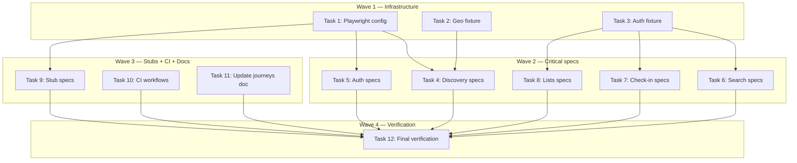

# E2E Testing Infrastructure Implementation Plan

> **For Claude:** REQUIRED SUB-SKILL: Use executing-plans to implement this plan task-by-task.

**Design Doc:** [docs/designs/2026-03-16-e2e-testing-infrastructure-design.md](docs/designs/2026-03-16-e2e-testing-infrastructure-design.md)

**Spec References:** [SPEC.md#auth-wall](SPEC.md) (auth gating rules), [SPEC.md#business-rules](SPEC.md) (list cap, photo requirement, PDPA cascade)

**PRD References:** [PRD.md#v1-features](PRD.md) (geolocation, semantic search, check-in, lists)

**Goal:** Add Playwright-based browser e2e testing with 10 critical-path specs, 20 `test.todo()` stubs, and two CI workflows (PR-blocking + nightly).

**Architecture:** Playwright at repo root with `e2e/` test directory. Fixtures for auth (Supabase test user) and geolocation (Playwright native mocking). Two CI workflows: `e2e-critical.yml` (PR-blocking, `--grep @critical`) and `e2e-nightly.yml` (cron 2am TWN, full suite). Tests target local dev server by default, switchable to Railway staging via `E2E_BASE_URL` env var.

**Tech Stack:** Playwright Test, GitHub Actions (cron + PR trigger)

**Acceptance Criteria:**

- [ ] Running `pnpm exec playwright test --grep @critical` executes 10 critical-path tests against the local dev server
- [ ] The "Near me" geolocation flow is tested in both grant and deny scenarios
- [ ] `docs/e2e-journeys.md` is updated with the full J01–J30 journey matrix
- [ ] Two GitHub Actions workflows exist: `e2e-critical.yml` (PR-blocking) and `e2e-nightly.yml` (cron)
- [ ] All 20 remaining journeys are stubbed as `test.todo()` with journey IDs

---

### Task 1: Install Playwright and create config

**Files:**

- Modify: `package.json`
- Create: `playwright.config.ts`
- Create: `e2e/.gitkeep` (ensure directory exists)

No test needed — infrastructure/configuration.

**Step 1: Install Playwright as devDependency**

Run: `pnpm add -D @playwright/test`

**Step 2: Install Playwright browsers (Chromium only for now)**

Run: `pnpm exec playwright install chromium`

**Step 3: Add e2e scripts to package.json**

Add to `scripts`:

```json
"e2e": "playwright test",
"e2e:critical": "playwright test --grep @critical",
"e2e:ui": "playwright test --ui"
```

**Step 4: Create playwright.config.ts**

```typescript
import { defineConfig, devices } from '@playwright/test';

export default defineConfig({
  testDir: './e2e',
  fullyParallel: true,
  forbidOnly: !!process.env.CI,
  retries: process.env.CI ? 2 : 0,
  workers: process.env.CI ? 1 : undefined,
  reporter: process.env.CI ? 'github' : 'html',
  timeout: 30_000,
  use: {
    baseURL: process.env.E2E_BASE_URL ?? 'http://localhost:3000',
    trace: 'on-first-retry',
    screenshot: 'only-on-failure',
  },
  projects: [
    {
      name: 'mobile',
      use: { ...devices['iPhone 14'] },
    },
    {
      name: 'desktop',
      use: { ...devices['Desktop Chrome'] },
    },
  ],
  webServer: process.env.E2E_BASE_URL
    ? undefined
    : {
        command: 'pnpm dev',
        port: 3000,
        reuseExistingServer: !process.env.CI,
        timeout: 120_000,
      },
});
```

**Step 5: Update .gitignore**

Add these entries if not already present:

```
# Playwright
test-results/
playwright-report/
blob-report/
```

**Step 6: Verify installation**

Run: `pnpm exec playwright --version`
Expected: Version number printed (e.g., `1.50.x`)

**Step 7: Commit**

```bash
git add package.json pnpm-lock.yaml playwright.config.ts .gitignore
git commit -m "chore: add Playwright e2e testing infrastructure"
```

---

### Task 2: Create geolocation fixture

**Files:**

- Create: `e2e/fixtures/geolocation.ts`

No test needed — test utility. Validated when used in Task 4 (discovery specs).

**Step 1: Create geolocation fixture**

```typescript
import type { BrowserContext } from '@playwright/test';

export const TAIPEI_COORDS = { latitude: 25.033, longitude: 121.565 };
export const OUTSIDE_TAIWAN = { latitude: 35.6762, longitude: 139.6503 }; // Tokyo

export async function grantGeolocation(
  context: BrowserContext,
  coords = TAIPEI_COORDS
) {
  await context.grantPermissions(['geolocation']);
  await context.setGeolocation(coords);
}

export async function denyGeolocation(context: BrowserContext) {
  await context.clearPermissions();
}
```

**Step 2: Commit**

```bash
git add e2e/fixtures/geolocation.ts
git commit -m "chore: add geolocation e2e fixture with Taipei and Tokyo coords"
```

---

### Task 3: Create auth fixture

**Files:**

- Create: `e2e/fixtures/auth.ts`

No test needed — test utility. Validated when used in Task 6+ (authenticated specs).

**Step 1: Create auth fixture**

The fixture extends Playwright's `test` with an `authedPage` that logs in via the Supabase email/password form. It reuses `storageState` to avoid logging in for every test.

```typescript
import { test as base, type Page } from '@playwright/test';
import path from 'node:path';

const STORAGE_STATE_PATH = path.join(__dirname, '..', '.auth', 'user.json');

export const test = base.extend<{ authedPage: Page }>({
  authedPage: async ({ browser }, use) => {
    const email = process.env.E2E_USER_EMAIL;
    const password = process.env.E2E_USER_PASSWORD;

    if (!email || !password) {
      throw new Error(
        'E2E_USER_EMAIL and E2E_USER_PASSWORD must be set for authenticated tests'
      );
    }

    let context;
    try {
      // Try reusing existing session
      context = await browser.newContext({
        storageState: STORAGE_STATE_PATH,
      });
    } catch {
      // No stored session — login fresh
      context = await browser.newContext();
      const page = await context.newPage();

      await page.goto('/login');
      await page.fill('#email', email);
      await page.fill('#password', password);
      await page.click('button[type="submit"]');
      await page.waitForURL('/', { timeout: 15_000 });

      // Save session for reuse
      await context.storageState({ path: STORAGE_STATE_PATH });
      await page.close();

      // Re-create context with saved state
      await context.close();
      context = await browser.newContext({
        storageState: STORAGE_STATE_PATH,
      });
    }

    const page = await context.newPage();
    await use(page);
    await context.close();
  },
});

export { expect } from '@playwright/test';
```

**Step 2: Ensure `.auth/` is gitignored**

Already present in `.gitignore` as `e2e/.auth/`. Verify.

**Step 3: Commit**

```bash
git add e2e/fixtures/auth.ts
git commit -m "chore: add auth e2e fixture with Supabase email/password login"
```

---

### Task 4: Discovery specs — J01, J02, J03 (critical) + J04, J18, J19, J22, J23, J28, J29 (stubs)

**Files:**

- Create: `e2e/discovery.spec.ts`

These ARE the tests — no separate unit test needed. Validation = spec passes against running app.

**Step 1: Write discovery spec**

```typescript
import { test, expect } from '@playwright/test';
import {
  grantGeolocation,
  denyGeolocation,
  TAIPEI_COORDS,
} from './fixtures/geolocation';

test.describe('@critical J01 — Near Me: grant geolocation → map with shop pins', () => {
  test('tapping 我附近 with granted geolocation navigates to /map with lat/lng params', async ({
    page,
    context,
  }) => {
    await grantGeolocation(context, TAIPEI_COORDS);
    await page.goto('/');

    // Tap the "我附近" suggestion chip
    await page.getByRole('button', { name: '我附近' }).click();

    // Should navigate to /map with lat/lng query params
    await page.waitForURL(/\/map\?.*lat=/, { timeout: 10_000 });
    const url = new URL(page.url());
    expect(url.pathname).toBe('/map');
    expect(url.searchParams.get('lat')).toBeTruthy();
    expect(url.searchParams.get('lng')).toBeTruthy();
    expect(url.searchParams.get('radius')).toBe('5');
  });
});

test.describe('@critical J02 — Near Me: deny geolocation → fallback toast + text search', () => {
  test('tapping 我附近 with denied geolocation shows toast and searches by text', async ({
    page,
    context,
  }) => {
    await denyGeolocation(context);
    await page.goto('/');

    // Tap the "我附近" suggestion chip
    await page.getByRole('button', { name: '我附近' }).click();

    // Should show toast fallback message
    await expect(page.getByText('無法取得位置，改用文字搜尋')).toBeVisible({
      timeout: 10_000,
    });

    // Should navigate to /map with text search query
    await page.waitForURL(/\/map\?.*q=/, { timeout: 10_000 });
    const url = new URL(page.url());
    expect(url.searchParams.get('q')).toBe('我附近');
  });
});

test.describe('@critical J03 — Text search → results on map → shop detail', () => {
  test('searching from home navigates to /map with query and shows shop pins', async ({
    page,
  }) => {
    await page.goto('/');

    // Type a search query into the search bar and submit
    const searchForm = page.locator('form').first();
    const searchInput = searchForm.getByRole('textbox');
    await searchInput.fill('coffee');
    await searchForm.evaluate((form) =>
      form.dispatchEvent(new Event('submit', { bubbles: true }))
    );

    // Should navigate to /map with query
    await page.waitForURL(/\/map\?.*q=coffee/, { timeout: 10_000 });
    expect(page.url()).toContain('q=coffee');
  });
});

// --- Phase 2 stubs (nightly suite) ---

test.describe('J04 — Browse map → tap pin → shop detail sheet', () => {
  test.todo(
    'tapping a map pin opens the shop detail mini card (mobile) or side card (desktop)'
  );
});

test.describe('J18 — Shop detail: public access with OG tags', () => {
  test.todo(
    'navigating to /shops/{id}/{slug} shows shop name, photos, and OG meta tags'
  );
});

test.describe('J19 — Shop detail via slug redirect', () => {
  test.todo(
    'navigating to /shops/{id}/wrong-slug redirects to canonical slug URL'
  );
});

test.describe('J22 — Map ↔ List view toggle', () => {
  test.todo(
    'clicking the list/map toggle button switches between map and list views'
  );
});

test.describe('J23 — List view: shops sorted by distance', () => {
  test.todo('with geolocation granted, list view sorts shops by proximity');
});

test.describe('J28 — Desktop: 2-column shop detail layout', () => {
  test.todo('on desktop viewport, shop detail page renders in 2-column layout');
});

test.describe('J29 — Mobile: mini card on pin tap', () => {
  test.todo(
    'on mobile viewport, tapping a map pin shows bottom mini card overlay'
  );
});
```

**Step 2: Run the spec against dev server**

Run: `pnpm e2e:critical -- --project mobile e2e/discovery.spec.ts`

Expected: 3 critical tests pass (assuming dev server + seeded data are running). If the dev server isn't running, Playwright will start it via `webServer` config.

**Step 3: Commit**

```bash
git add e2e/discovery.spec.ts
git commit -m "test(e2e): add discovery specs — near me geolocation + text search (J01-J03)"
```

---

### Task 5: Auth specs — J05, J06 (critical)

**Files:**

- Create: `e2e/auth.spec.ts`

**Step 1: Write auth spec**

```typescript
import { test, expect } from '@playwright/test';

test.describe('@critical J05 — Auth wall: protected routes redirect to login', () => {
  test('unauthenticated user accessing /search is redirected to /login', async ({
    page,
  }) => {
    await page.goto('/search');
    await page.waitForURL(/\/login/, { timeout: 10_000 });
    expect(page.url()).toContain('/login');
  });

  test('unauthenticated user accessing /lists is redirected to /login', async ({
    page,
  }) => {
    await page.goto('/lists');
    await page.waitForURL(/\/login/, { timeout: 10_000 });
    expect(page.url()).toContain('/login');
  });

  test('unauthenticated user accessing /checkin/test is redirected to /login', async ({
    page,
  }) => {
    await page.goto('/checkin/test');
    await page.waitForURL(/\/login/, { timeout: 10_000 });
    expect(page.url()).toContain('/login');
  });

  test('unauthenticated user can access /map without redirect', async ({
    page,
  }) => {
    await page.goto('/map');
    await page.waitForLoadState('networkidle');
    expect(page.url()).toContain('/map');
  });
});

test.describe('@critical J06 — Signup → PDPA consent → reach home', () => {
  test('signup page shows PDPA consent checkbox that must be checked before submit', async ({
    page,
  }) => {
    await page.goto('/signup');

    // Verify PDPA consent checkbox exists
    const pdpaCheckbox = page.locator('#pdpa-consent');
    await expect(pdpaCheckbox).toBeVisible();

    // Submit button should be disabled without PDPA consent
    const submitButton = page.getByRole('button', { name: /註冊|Sign Up/i });
    await expect(submitButton).toBeDisabled();

    // Check PDPA consent — submit button should become enabled
    await pdpaCheckbox.check();
    await expect(submitButton).toBeEnabled();
  });
});
```

**Note on J06:** We test the PDPA consent UI behavior but do NOT submit a real signup (would create test accounts). The full signup flow can be validated in nightly with a throwaway user + cleanup.

**Step 2: Run**

Run: `pnpm e2e:critical -- --project mobile e2e/auth.spec.ts`
Expected: All tests pass.

**Step 3: Commit**

```bash
git add e2e/auth.spec.ts
git commit -m "test(e2e): add auth wall + signup PDPA consent specs (J05-J06)"
```

---

### Task 6: Search spec — J07 (critical) + J08, J09, J21 (stubs)

**Files:**

- Create: `e2e/search.spec.ts`

**Step 1: Write search spec**

```typescript
import { test, expect } from './fixtures/auth';

test.describe('@critical J07 — Semantic search returns ranked results', () => {
  test('searching "想找安靜可以工作的地方" returns at least one result', async ({
    authedPage: page,
  }) => {
    await page.goto('/search');

    // Fill search input and submit
    const searchForm = page.locator('form[role="search"]');
    const searchInput = searchForm.getByRole('textbox');
    await searchInput.fill('想找安靜可以工作的地方');
    await searchForm.evaluate((form) =>
      form.dispatchEvent(new Event('submit', { bubbles: true }))
    );

    // Wait for results to load (not "搜尋中…" loading state)
    await expect(page.getByText('搜尋中…')).toBeHidden({ timeout: 15_000 });

    // Should show at least one result (not the "no results" message)
    await expect(page.getByText('沒有找到結果')).toBeHidden();

    // At least one shop card should be visible
    const results = page.locator('[data-slot="card"], article, .space-y-4 > a');
    await expect(results.first()).toBeVisible({ timeout: 10_000 });
  });
});

// --- Phase 2 stubs ---

test.describe('J08 — Mode chip: select "work" → filtered results', () => {
  test.todo(
    'selecting work mode chip filters search results to work-friendly shops'
  );
});

test.describe('J09 — Suggestion chip: tap preset → search executes', () => {
  test.todo(
    'tapping "有插座可以久坐" chip auto-fills search and shows results'
  );
});

test.describe('J21 — Filter pills: toggle WiFi → results update', () => {
  test.todo('toggling WiFi filter pill updates the displayed results');
});
```

**Step 2: Run**

Run: `pnpm e2e:critical -- --project mobile e2e/search.spec.ts`
Expected: J07 passes (requires authenticated session — `E2E_USER_EMAIL`/`E2E_USER_PASSWORD` must be set).

**Step 3: Commit**

```bash
git add e2e/search.spec.ts
git commit -m "test(e2e): add semantic search spec (J07) + mode/filter stubs"
```

---

### Task 7: Check-in specs — J10, J11 (critical) + J24, J30 (stubs)

**Files:**

- Create: `e2e/checkin.spec.ts`

**Step 1: Write check-in spec**

The check-in flow requires a real shop ID. We'll get one from the seeded data by navigating to `/map`, finding a shop link, and extracting the ID.

```typescript
import { test, expect } from './fixtures/auth';
import path from 'node:path';

const TEST_PHOTO = path.join(__dirname, 'fixtures', 'test-photo.jpg');

test.describe('@critical J10 — Check-in: upload photo → submit → stamp awarded', () => {
  test('completing a check-in with a photo shows success toast', async ({
    authedPage: page,
  }) => {
    // Navigate to a shop page to get a valid shop ID
    // Use the API to find a shop
    const response = await page.request.get('/api/shops?featured=true&limit=1');
    const shops = await response.json();
    const shopId = shops[0]?.id;
    test.skip(!shopId, 'No seeded shops available');

    // Go to check-in page for this shop
    await page.goto(`/checkin/${shopId}`);
    await expect(page.getByText('Check In')).toBeVisible({ timeout: 10_000 });

    // Upload a test photo
    const fileInput = page.locator('[data-testid="photo-input"]');
    await fileInput.setInputFiles(TEST_PHOTO);

    // Wait for photo preview to appear
    await expect(page.getByRole('img')).toBeVisible({ timeout: 10_000 });

    // Submit the check-in
    const submitButton = page.getByRole('button', { name: /打卡|Check In/i });
    await submitButton.click();

    // Wait for success — page should navigate away or show success toast
    await page.waitForURL(/(?!\/checkin)/, { timeout: 15_000 });
  });
});

test.describe('@critical J11 — Check-in: no photo → validation error', () => {
  test('attempting to submit check-in without photo shows disabled submit button', async ({
    authedPage: page,
  }) => {
    const response = await page.request.get('/api/shops?featured=true&limit=1');
    const shops = await response.json();
    const shopId = shops[0]?.id;
    test.skip(!shopId, 'No seeded shops available');

    await page.goto(`/checkin/${shopId}`);
    await expect(page.getByText('Check In')).toBeVisible({ timeout: 10_000 });

    // Submit button should be disabled when no photo is uploaded
    const submitButton = page.getByRole('button', { name: /打卡|Check In/i });
    await expect(submitButton).toBeDisabled();
  });
});

// --- Phase 2 stubs ---

test.describe('J24 — Duplicate stamp at same shop (intended)', () => {
  test.todo('checking in at the same shop twice awards a second stamp');
});

test.describe('J30 — Check-in with optional menu photo + text note', () => {
  test.todo('completing a check-in with menu photo and text note succeeds');
});
```

**Step 2: Run**

Run: `pnpm e2e:critical -- --project mobile e2e/checkin.spec.ts`
Expected: J10 and J11 pass (requires auth + seeded shops).

**Step 3: Commit**

```bash
git add e2e/checkin.spec.ts
git commit -m "test(e2e): add check-in photo upload + validation specs (J10-J11)"
```

---

### Task 8: Lists specs — J12, J13 (critical) + J26, J27 (stubs)

**Files:**

- Create: `e2e/lists.spec.ts`

**Step 1: Write lists spec**

```typescript
import { test, expect } from './fixtures/auth';

test.describe('@critical J12 — Create list → add shop → shop appears in list', () => {
  test('creating a list and viewing it shows the list on the lists page', async ({
    authedPage: page,
  }) => {
    await page.goto('/lists');
    await expect(page.getByText('My Lists')).toBeVisible({ timeout: 10_000 });

    // Create a new list with a unique name
    const listName = `E2E Test List ${Date.now()}`;
    const input = page.getByPlaceholder('Create new list');
    await input.fill(listName);

    // Click "Add" button or press Enter
    const addButton = page.getByRole('button', { name: 'Add' });
    await addButton.click();

    // Verify the list appears on the page
    await expect(page.getByText(listName)).toBeVisible({ timeout: 10_000 });

    // Cleanup: delete the list we just created
    // (to avoid polluting the test account)
  });
});

test.describe('@critical J13 — Create 3 lists → 4th list → cap error', () => {
  test('attempting to create more than 3 lists shows an error', async ({
    authedPage: page,
  }) => {
    await page.goto('/lists');
    await expect(page.getByText('My Lists')).toBeVisible({ timeout: 10_000 });

    // Check counter to see current count
    const counter = page.getByText(/\d+ \/ 3/);
    await expect(counter).toBeVisible({ timeout: 10_000 });

    // Get current list count from the counter text
    const counterText = await counter.textContent();
    const currentCount = parseInt(counterText?.split('/')[0]?.trim() ?? '0');

    // Create lists up to the cap
    const listsToCreate = 3 - currentCount;
    for (let i = 0; i < listsToCreate; i++) {
      const input = page.getByPlaceholder('Create new list');
      await input.fill(`Cap Test ${Date.now()}-${i}`);
      await page.getByRole('button', { name: 'Add' }).click();
      // Wait for list to appear before creating next
      await page.waitForTimeout(500);
    }

    // The counter should now show "3 / 3"
    await expect(page.getByText('3 / 3')).toBeVisible({ timeout: 5_000 });

    // The create input might be hidden or the 4th attempt should show an error
    // Try to create a 4th list if the input is still visible
    const input = page.getByPlaceholder('Create new list');
    if (await input.isVisible()) {
      await input.fill('Over Limit');
      await page.getByRole('button', { name: 'Add' }).click();

      // Should show error toast about the 3-list limit
      await expect(
        page.getByText(/3-list limit|reached the.*limit/i)
      ).toBeVisible({ timeout: 5_000 });
    }
  });
});

// --- Phase 2 stubs ---

test.describe('J26 — Delete list', () => {
  test.todo('deleting a list removes it from the lists page');
});

test.describe('J27 — Remove shop from list', () => {
  test.todo('removing a shop from a list updates the shop count');
});
```

**Step 2: Run**

Run: `pnpm e2e:critical -- --project mobile e2e/lists.spec.ts`
Expected: Pass (requires auth + clean list state on test user).

**Important note for executor:** The list cap test is stateful — if the test user already has 3 lists, J12 will fail trying to create more. Before running list tests, verify the test user has fewer than 3 lists. Alternatively, the test should clean up after itself. The implementation above handles this by checking the current count first.

**Step 3: Commit**

```bash
git add e2e/lists.spec.ts
git commit -m "test(e2e): add list creation + 3-list cap enforcement specs (J12-J13)"
```

---

### Task 9: Remaining stub specs — profile, feed, PWA, edge cases

**Files:**

- Create: `e2e/profile.spec.ts`
- Create: `e2e/feed.spec.ts`
- Create: `e2e/pwa.spec.ts`
- Create: `e2e/edge-cases.spec.ts`

No test needed — all stubs (`test.todo()`). Validated by `pnpm e2e` showing them as "pending."

**Step 1: Create profile.spec.ts**

```typescript
import { test } from './fixtures/auth';

test.describe('J14 — Profile: check-in history + stamp collection', () => {
  test.todo(
    'logged-in user sees their stamp passport and check-in history on /profile'
  );
});

test.describe('J15 — Account deletion: request → grace period', () => {
  test.todo(
    'requesting account deletion shows confirmation and sets 30-day grace period'
  );
});

test.describe('J25 — Display name update', () => {
  test.todo('changing display name in settings reflects on profile page');
});
```

**Step 2: Create feed.spec.ts**

```typescript
import { test, expect } from '@playwright/test';

test.describe('J16 — Activity feed: public access', () => {
  test.todo(
    'unauthenticated user can view the public activity feed with recent check-ins'
  );
});
```

**Step 3: Create pwa.spec.ts**

```typescript
import { test, expect } from '@playwright/test';

test.describe('J17 — PWA manifest: 200 + brand metadata + icons', () => {
  test.todo(
    'GET /manifest.webmanifest returns valid JSON with CafeRoam brand data and icon references'
  );
});
```

**Step 4: Create edge-cases.spec.ts**

```typescript
import { test } from '@playwright/test';

test.describe('J20 — Near Me: coords outside Taiwan → boundary behavior', () => {
  test.todo(
    'using geolocation with Tokyo coordinates shows appropriate fallback or empty state'
  );
});
```

**Step 5: Verify stubs appear in test report**

Run: `pnpm e2e -- --project mobile --reporter list 2>&1 | head -50`
Expected: All `test.todo()` entries show as "skipped" or "pending" in output.

**Step 6: Commit**

```bash
git add e2e/profile.spec.ts e2e/feed.spec.ts e2e/pwa.spec.ts e2e/edge-cases.spec.ts
git commit -m "test(e2e): add Phase 2 stub specs — profile, feed, PWA, edge cases (J14-J30)"
```

---

### Task 10: CI workflows — e2e-critical + e2e-nightly

**Files:**

- Create: `.github/workflows/e2e-critical.yml`
- Create: `.github/workflows/e2e-nightly.yml`

No test needed — CI configuration.

**Step 1: Create e2e-critical.yml**

```yaml
name: E2E Critical Paths

on:
  pull_request:
    branches: [main]

jobs:
  e2e-critical:
    runs-on: ubuntu-latest
    timeout-minutes: 15
    steps:
      - uses: actions/checkout@v4

      - uses: pnpm/action-setup@v4

      - uses: actions/setup-node@v4
        with:
          node-version-file: '.node-version'
          cache: 'pnpm'

      - name: Install dependencies
        run: pnpm install --frozen-lockfile

      - name: Install Playwright Chromium
        run: pnpm exec playwright install --with-deps chromium

      - name: Run critical e2e tests
        run: pnpm e2e:critical -- --project mobile
        env:
          E2E_BASE_URL: ${{ secrets.E2E_STAGING_URL }}
          E2E_USER_EMAIL: ${{ secrets.E2E_USER_EMAIL }}
          E2E_USER_PASSWORD: ${{ secrets.E2E_USER_PASSWORD }}

      - name: Upload test results
        if: ${{ !cancelled() }}
        uses: actions/upload-artifact@v4
        with:
          name: playwright-report-critical
          path: playwright-report/
          retention-days: 7
```

**Step 2: Create e2e-nightly.yml**

```yaml
name: E2E Nightly Full Suite

on:
  schedule:
    - cron: '0 18 * * *' # 2am Taiwan time (UTC+8)
  workflow_dispatch: {}

jobs:
  e2e-full:
    runs-on: ubuntu-latest
    timeout-minutes: 30
    steps:
      - uses: actions/checkout@v4

      - uses: pnpm/action-setup@v4

      - uses: actions/setup-node@v4
        with:
          node-version-file: '.node-version'
          cache: 'pnpm'

      - name: Install dependencies
        run: pnpm install --frozen-lockfile

      - name: Install Playwright Chromium
        run: pnpm exec playwright install --with-deps chromium

      - name: Run full e2e suite
        run: pnpm e2e
        env:
          E2E_BASE_URL: ${{ secrets.E2E_STAGING_URL }}
          E2E_USER_EMAIL: ${{ secrets.E2E_USER_EMAIL }}
          E2E_USER_PASSWORD: ${{ secrets.E2E_USER_PASSWORD }}

      - name: Upload test results
        if: ${{ !cancelled() }}
        uses: actions/upload-artifact@v4
        with:
          name: playwright-report-nightly
          path: playwright-report/
          retention-days: 14
```

**Step 3: Verify .node-version file exists**

Run: `cat .node-version`
If missing, check `package.json` engines field or create `.node-version` with `22` (or current version).

**Step 4: Commit**

```bash
git add .github/workflows/e2e-critical.yml .github/workflows/e2e-nightly.yml
git commit -m "ci: add e2e-critical (PR-blocking) and e2e-nightly (cron) workflows"
```

---

### Task 11: Update docs/e2e-journeys.md with full journey matrix

**Files:**

- Modify: `docs/e2e-journeys.md`

No test needed — documentation.

**Step 1: Rewrite e2e-journeys.md**

Replace the entire file content with the new journey matrix. The file should:

1. Keep the header and "How to use this file" section
2. Replace the old scenario list with the full J01–J30 journey matrix
3. Include a status column (Implemented / Stubbed)
4. Reference the spec file for each journey

The new content should follow this structure:

```markdown
# CafeRoam — E2E Journey Inventory

> Generated: 2026-03-05
> Last updated: 2026-03-16
> Source: docs/designs/2026-03-16-e2e-testing-infrastructure-design.md
> Format: Playwright spec files in `e2e/` directory

---

## How to use this file

This is the **source of truth** for all e2e test journeys. Each journey has:

- A unique ID (J01–J30+) referenced in both this doc and the Playwright spec files
- A priority level (Critical / High / Medium)
- A status (Implemented = `@critical` tag / Stubbed = `test.todo()`)

**Running tests:**

- `pnpm e2e:critical` — runs the 10 critical-path tests (PR-blocking in CI)
- `pnpm e2e` — runs the full suite including stubs (nightly CI)

**Adding new journeys:** Add to this doc first (assign an ID), then create the spec.

---

## Critical Paths (PR-blocking)

| ID  | Journey                                                  | Spec                | Status      |
| --- | -------------------------------------------------------- | ------------------- | ----------- |
| J01 | Near Me: grant geolocation → map centered with shop pins | `discovery.spec.ts` | Implemented |
| J02 | Near Me: deny geolocation → toast fallback + text search | `discovery.spec.ts` | Implemented |
| J03 | Text search → results on map                             | `discovery.spec.ts` | Implemented |
| J05 | Auth wall: protected routes redirect to /login           | `auth.spec.ts`      | Implemented |
| J06 | Signup → PDPA consent checkbox required                  | `auth.spec.ts`      | Implemented |
| J07 | Semantic search: Chinese query → ranked results          | `search.spec.ts`    | Implemented |
| J10 | Check-in: upload photo → submit → stamp                  | `checkin.spec.ts`   | Implemented |
| J11 | Check-in: no photo → submit disabled                     | `checkin.spec.ts`   | Implemented |
| J12 | Create list → add shop → appears in list                 | `lists.spec.ts`     | Implemented |
| J13 | 3 lists → 4th attempt → cap error                        | `lists.spec.ts`     | Implemented |

## Full Suite (nightly)

| ID  | Journey                                       | Priority | Spec                 | Status  |
| --- | --------------------------------------------- | -------- | -------------------- | ------- |
| J04 | Browse map → tap pin → shop detail sheet      | High     | `discovery.spec.ts`  | Stubbed |
| J08 | Mode chip: select "work" → filtered results   | High     | `search.spec.ts`     | Stubbed |
| J09 | Suggestion chip: tap preset → search executes | High     | `search.spec.ts`     | Stubbed |
| J14 | Profile: check-in history + stamp collection  | High     | `profile.spec.ts`    | Stubbed |
| J15 | Account deletion: request → grace period      | High     | `profile.spec.ts`    | Stubbed |
| J16 | Activity feed: public access                  | Medium   | `feed.spec.ts`       | Stubbed |
| J17 | PWA manifest: 200 + brand metadata + icons    | Medium   | `pwa.spec.ts`        | Stubbed |
| J18 | Shop detail: public access with OG tags       | High     | `discovery.spec.ts`  | Stubbed |
| J19 | Shop detail via slug redirect                 | Medium   | `discovery.spec.ts`  | Stubbed |
| J20 | Near Me: coords outside Taiwan                | Medium   | `edge-cases.spec.ts` | Stubbed |
| J21 | Filter pills: toggle WiFi → results update    | High     | `search.spec.ts`     | Stubbed |
| J22 | Map ↔ List view toggle                        | Medium   | `discovery.spec.ts`  | Stubbed |
| J23 | List view: shops sorted by distance           | Medium   | `discovery.spec.ts`  | Stubbed |
| J24 | Duplicate stamp at same shop                  | Medium   | `checkin.spec.ts`    | Stubbed |
| J25 | Display name update                           | Medium   | `profile.spec.ts`    | Stubbed |
| J26 | Delete list                                   | Medium   | `lists.spec.ts`      | Stubbed |
| J27 | Remove shop from list                         | Medium   | `lists.spec.ts`      | Stubbed |
| J28 | Desktop: 2-column shop detail layout          | Medium   | `discovery.spec.ts`  | Stubbed |
| J29 | Mobile: mini card on pin tap                  | Medium   | `discovery.spec.ts`  | Stubbed |
| J30 | Check-in: optional menu photo + text note     | Medium   | `checkin.spec.ts`    | Stubbed |

---

## Legacy API-Level Scenarios

The following scenarios were previously tracked as manual API-level tests.
They remain valid but are now covered by Playwright specs or backend pytest.

| Scenario                          | Covered by                             |
| --------------------------------- | -------------------------------------- |
| Anonymous Browse + Auth Wall      | J05 (Playwright) + backend pytest      |
| Signup + PDPA Consent             | J06 (Playwright) + backend pytest      |
| Search + Check-in                 | J07, J10 (Playwright) + backend pytest |
| List Management + Cap Enforcement | J12, J13 (Playwright) + backend pytest |
| Account Deletion                  | J15 (Playwright stub) + backend pytest |
| Shop Detail Public Access         | J18 (Playwright stub) + backend pytest |
| Map Page Public Access            | J01, J03 (Playwright) + backend pytest |
| Authenticated Search              | J07 (Playwright) + backend pytest      |
| PWA Manifest                      | J17 (Playwright stub)                  |
```

**Step 2: Commit**

```bash
git add docs/e2e-journeys.md
git commit -m "docs: update e2e-journeys.md with full J01-J30 journey matrix"
```

---

### Task 12: Final verification

**Files:** None (verification only)

**Step 1: Run full e2e suite to verify infrastructure**

Run: `pnpm e2e -- --project mobile --reporter list`

Expected:

- 10 critical tests: PASS (green)
- 13 stub tests: SKIPPED/PENDING (yellow, `test.todo()`)
- 0 failures

**Step 2: Run critical-only to verify grep tag filtering**

Run: `pnpm e2e:critical -- --project mobile --reporter list`

Expected: Only 10 `@critical` tests run.

**Step 3: Verify lint and type-check still pass**

Run: `pnpm lint && pnpm type-check`

Expected: No new errors from Playwright config or e2e files.

**Step 4: Final commit (if any fixes needed)**

```bash
git add -A
git commit -m "test(e2e): fix any issues from final verification"
```

---

## Execution Waves



**Wave 1** (parallel — no dependencies):

- Task 1: Install Playwright + config
- Task 2: Geolocation fixture
- Task 3: Auth fixture

**Wave 2** (parallel — depends on Wave 1):

- Task 4: Discovery specs (J01-J03) ← Task 1, Task 2
- Task 5: Auth specs (J05-J06) ← Task 1
- Task 6: Search specs (J07) ← Task 1, Task 3
- Task 7: Check-in specs (J10-J11) ← Task 1, Task 3
- Task 8: Lists specs (J12-J13) ← Task 1, Task 3

**Wave 3** (parallel — depends on Wave 1):

- Task 9: Stub specs (Phase 2 todos) ← Task 1, Task 3
- Task 10: CI workflows ← Task 1
- Task 11: Update e2e-journeys.md ← none (doc only)

**Wave 4** (sequential — depends on all):

- Task 12: Final verification ← all tasks

---

## Pre-Requisites for Running Tests

Before running e2e tests locally, ensure:

1. **Dev server running:** `pnpm dev:all` (or let Playwright's `webServer` start it)
2. **Supabase running:** `supabase start`
3. **Seeded data:** `make seed-shops` (164 shops)
4. **Test user exists:** Set `E2E_USER_EMAIL` and `E2E_USER_PASSWORD` env vars pointing to a Supabase auth user with PDPA consent complete
5. **Test photo exists:** `e2e/fixtures/test-photo.jpg` (already present)

For CI, these are handled via GitHub Actions secrets.
