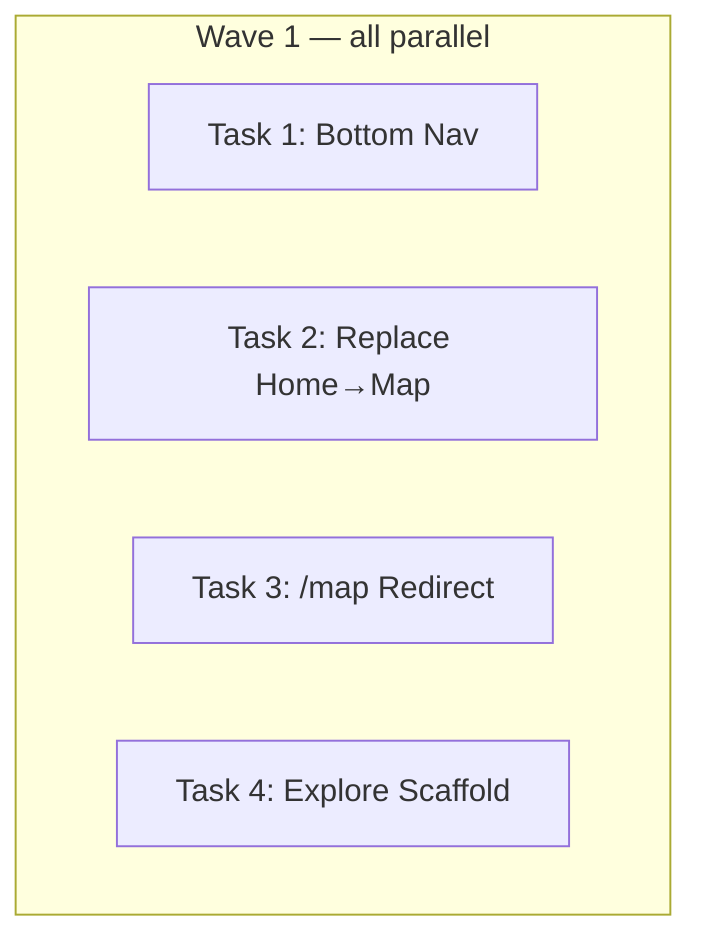

# Navigation Restructure Implementation Plan

> **For Claude:** REQUIRED SUB-SKILL: Use executing-plans to implement this plan task-by-task.

**Design Doc:** [docs/designs/2026-03-16-navigation-restructure-design.md](docs/designs/2026-03-16-navigation-restructure-design.md)

**Spec References:** —

**PRD References:** —

**Goal:** Replace the Home+Map two-tab structure with a single Find tab (map-only at `/`), add an Explore scaffold tab, and update the bottom nav to 地圖 | 探索 | 收藏 | 我的.

**Architecture:** Hard cutover — `app/page.tsx` becomes the map page (content from `app/map/page.tsx` minus the list toggle), `app/map/page.tsx` is deleted, a permanent redirect `/map → /` is added to `next.config.ts`, and `app/explore/page.tsx` is created as a stub. All work lives on the `feat/nav-restructure` worktree at `.worktrees/feat/nav-restructure`.

**Tech Stack:** Next.js 15 App Router, TypeScript strict, Vitest + Testing Library

**Acceptance Criteria:**
- [ ] A user visiting `/` sees the map (not the old featured-shops grid)
- [ ] A user visiting `/map` is permanently redirected to `/`
- [ ] The bottom nav shows four tabs: 地圖, 探索, 收藏, 我的 — in that order
- [ ] Tapping 探索 navigates to `/explore` without a crash
- [ ] All existing tests pass (no regressions)

---

> **Working directory for all commands:** `.worktrees/feat/nav-restructure`

---

### Task 1: Update bottom nav tabs

**Files:**
- Modify: `components/navigation/bottom-nav.tsx`
- Test: `components/navigation/bottom-nav.test.tsx`

**Step 1: Update the failing test first**

Replace the full contents of `components/navigation/bottom-nav.test.tsx`:

```tsx
import { render, screen } from '@testing-library/react';
import { describe, it, expect, vi } from 'vitest';
import { BottomNav } from './bottom-nav';

vi.mock('next/navigation', () => ({
  usePathname: () => '/',
  Link: ({ children, href }: { children: React.ReactNode; href: string }) => (
    <a href={href}>{children}</a>
  ),
}));

vi.mock('next/link', () => ({
  default: ({
    children,
    href,
    ...rest
  }: {
    children: React.ReactNode;
    href: string;
    [key: string]: unknown;
  }) => (
    <a href={href} {...rest}>
      {children}
    </a>
  ),
}));

describe('BottomNav', () => {
  it('renders four navigation tabs with new labels', () => {
    render(<BottomNav />);
    expect(screen.getByText('地圖')).toBeInTheDocument();
    expect(screen.getByText('探索')).toBeInTheDocument();
    expect(screen.getByText('收藏')).toBeInTheDocument();
    expect(screen.getByText('我的')).toBeInTheDocument();
  });

  it('highlights 地圖 tab when pathname is /', () => {
    render(<BottomNav />);
    const mapLink = screen.getByText('地圖').closest('a');
    expect(mapLink).toHaveAttribute('data-active', 'true');
  });

  it('tab links navigate to correct routes', () => {
    render(<BottomNav />);
    expect(screen.getByText('地圖').closest('a')).toHaveAttribute('href', '/');
    expect(screen.getByText('探索').closest('a')).toHaveAttribute('href', '/explore');
    expect(screen.getByText('收藏').closest('a')).toHaveAttribute('href', '/lists');
    expect(screen.getByText('我的').closest('a')).toHaveAttribute('href', '/profile');
  });
});
```

**Step 2: Run test to verify it fails**

```bash
pnpm test components/navigation/bottom-nav.test.tsx
```

Expected: FAIL — `首頁` not found, wrong hrefs

**Step 3: Update `components/navigation/bottom-nav.tsx`**

Replace the `TABS` constant:

```tsx
const TABS = [
  { href: '/',        label: '地圖', icon: 'map' },
  { href: '/explore', label: '探索', icon: 'compass' },
  { href: '/lists',   label: '收藏', icon: 'heart' },
  { href: '/profile', label: '我的', icon: 'user' },
] as const;
```

**Step 4: Run test to verify it passes**

```bash
pnpm test components/navigation/bottom-nav.test.tsx
```

Expected: PASS (3 tests)

**Step 5: Commit**

```bash
git add components/navigation/bottom-nav.tsx components/navigation/bottom-nav.test.tsx
git commit -m "feat: update bottom nav to 地圖/探索/收藏/我的"
```

---

### Task 2: Replace `app/page.tsx` (Home → Find/Map) and delete `app/map/`

**Files:**
- Replace: `app/page.tsx`
- Replace: `app/page.test.tsx`
- Delete: `app/map/page.tsx`
- Delete: `app/map/page.test.tsx`

**Step 1: Write the new failing test for `app/page.tsx`**

Replace the full contents of `app/page.test.tsx`:

```tsx
import { render, screen } from '@testing-library/react';
import { describe, it, expect, vi } from 'vitest';

vi.mock('next/navigation', () => ({
  useRouter: () => ({ push: vi.fn() }),
  useSearchParams: () => ({ get: () => null }),
}));

vi.mock('@/lib/hooks/use-shops', () => ({
  useShops: () => ({
    shops: [
      {
        id: '1',
        name: 'Test Cafe',
        latitude: 25.03,
        longitude: 121.56,
        rating: 4.5,
        slug: 'test-cafe',
        photoUrls: [],
        mrt: null,
        address: '',
        phone: null,
        website: null,
        openingHours: null,
        reviewCount: 0,
        priceRange: null,
        description: null,
        menuUrl: null,
        taxonomyTags: [],
        cafenomadId: null,
        googlePlaceId: null,
        createdAt: '',
        updatedAt: '',
      },
    ],
    isLoading: false,
    error: null,
  }),
}));

vi.mock('@/lib/hooks/use-media-query', () => ({
  useIsDesktop: () => false,
}));

vi.mock('@/lib/hooks/use-search', () => ({
  useSearch: () => ({ results: [], isLoading: false }),
}));

vi.mock('@/lib/hooks/use-geolocation', () => ({
  useGeolocation: () => ({
    latitude: null,
    longitude: null,
    error: null,
    loading: false,
    requestLocation: vi.fn(),
  }),
}));

vi.mock('@/components/map/map-view', () => ({
  MapView: ({ shops }: { shops: unknown[] }) => (
    <div data-testid="map-view">Map with {shops.length} pins</div>
  ),
}));

vi.mock('next/dynamic', () => ({
  __esModule: true,
  default: () => {
    const StubMapView = (props: Record<string, unknown>) => (
      <div data-testid="map-view">
        Map with {(props.shops as unknown[])?.length ?? 0} pins
      </div>
    );
    return StubMapView;
  },
}));

import FindPage from './page';

describe('Find page (map)', () => {
  it('When a user opens the Find tab, they see the map', () => {
    render(<FindPage />);
    expect(screen.getByTestId('map-view')).toBeInTheDocument();
  });

  it('When a user opens the Find tab, there is no list/map toggle button', () => {
    render(<FindPage />);
    expect(screen.queryByRole('button', { name: /list/i })).not.toBeInTheDocument();
    expect(screen.queryByRole('button', { name: /map/i })).not.toBeInTheDocument();
  });

  it('When a user opens the Find tab, they see the search bar', () => {
    render(<FindPage />);
    expect(screen.getByRole('search')).toBeInTheDocument();
  });
});
```

**Step 2: Run test to verify it fails**

```bash
pnpm test app/page.test.tsx
```

Expected: FAIL — current `app/page.tsx` is the Home page (no `data-testid="map-view"`)

**Step 3: Replace `app/page.tsx` with map content**

Copy `app/map/page.tsx` content into `app/page.tsx`, then make these changes:

1. Remove `viewMode` state: delete `const [viewMode, setViewMode] = useState<'map' | 'list'>('map');`
2. Remove `handleToggleView` function entirely
3. Remove the `List` and `Map as MapIcon` lucide-react imports
4. Remove the toggle button JSX (the `<button onClick={handleToggleView} ...>` block)
5. Remove the list view branch: delete the `viewMode === 'list'` conditional and `<MapListView>` usage
6. Remove `MapListView` import
7. The root `<div>` now always renders the map:

```tsx
return (
  <div className="relative h-screen w-full overflow-hidden">
    <div className="absolute inset-0">
      <Suspense
        fallback={
          <div className="flex h-full w-full items-center justify-center bg-gray-100 text-gray-400">
            地圖載入中…
          </div>
        }
      >
        <MapView shops={shops} onPinClick={setSelectedShopId} />
      </Suspense>
    </div>

    <div className="absolute top-4 right-4 left-4 z-20">
      <div className="space-y-2 rounded-2xl bg-white/90 p-3 shadow backdrop-blur-md supports-[not(backdrop-filter)]:bg-white">
        <div className="flex-1">
          <SearchBar
            onSubmit={handleSearch}
            defaultQuery={urlQuery ?? ''}
          />
        </div>
        {urlQuery && (
          <p className="text-xs text-gray-500">{getSearchStatusText()}</p>
        )}
        <FilterPills
          activeFilters={activeFilters}
          onToggle={handleToggleFilter}
          onOpenSheet={() => {}}
          onNearMe={requestLocation}
        />
      </div>
    </div>

    {selectedShop && !isDesktop && (
      <MapMiniCard
        shop={selectedShop}
        onDismiss={() => setSelectedShopId(null)}
      />
    )}
    {selectedShop && isDesktop && (
      <MapDesktopCard shop={selectedShop} />
    )}
  </div>
);
```

**Step 4: Delete `app/map/page.tsx` and `app/map/page.test.tsx`**

```bash
rm app/map/page.tsx app/map/page.test.tsx
```

Check if `app/map/` directory is now empty and remove it:

```bash
rmdir app/map 2>/dev/null || true
```

**Step 5: Run tests to verify**

```bash
pnpm test app/page.test.tsx
```

Expected: PASS (3 tests)

Then run the full suite to catch any broken imports:

```bash
pnpm test
```

Expected: all passing, no import errors referencing `app/map/page`

**Step 6: Commit**

```bash
git add app/page.tsx app/page.test.tsx
git rm app/map/page.tsx app/map/page.test.tsx
git commit -m "feat: replace Home with map-only Find page at /, remove /map route"
```

---

### Task 3: Add `/map` → `/` permanent redirect

**Files:**
- Modify: `next.config.ts`

No test needed — Next.js redirects are framework infrastructure, not testable in Vitest. Verified manually.

**Step 1: Add redirects to `next.config.ts`**

Add the `redirects` property to `nextConfig`:

```ts
const nextConfig: NextConfig = {
  turbopack: {
    root: path.resolve(__dirname),
  },
  async redirects() {
    return [
      { source: '/map', destination: '/', permanent: true },
    ];
  },
  images: {
    // ... existing remotePatterns unchanged
  },
};
```

**Step 2: Verify manually**

Start the dev server and navigate to `http://localhost:3000/map` — should redirect to `http://localhost:3000/`.

```bash
pnpm dev
```

**Step 3: Commit**

```bash
git add next.config.ts
git commit -m "feat: add permanent redirect /map → /"
```

---

### Task 4: Create `app/explore/page.tsx` scaffold

**Files:**
- Create: `app/explore/page.tsx`
- Create: `app/explore/page.test.tsx`

**Step 1: Write the failing test**

Create `app/explore/page.test.tsx`:

```tsx
import { render, screen } from '@testing-library/react';
import { describe, it, expect } from 'vitest';
import ExplorePage from './page';

describe('Explore page', () => {
  it('When a user taps the Explore tab, the page renders without crashing', () => {
    render(<ExplorePage />);
    expect(screen.getByRole('main')).toBeInTheDocument();
  });
});
```

**Step 2: Run test to verify it fails**

```bash
pnpm test app/explore/page.test.tsx
```

Expected: FAIL — module not found

**Step 3: Create `app/explore/page.tsx` scaffold**

```tsx
export default function ExplorePage() {
  return (
    <main className="min-h-screen bg-[#FAF7F4]">
    </main>
  );
}
```

**Step 4: Run test to verify it passes**

```bash
pnpm test app/explore/page.test.tsx
```

Expected: PASS (1 test)

**Step 5: Run full test suite**

```bash
pnpm test
```

Expected: all passing

**Step 6: Commit**

```bash
git add app/explore/page.tsx app/explore/page.test.tsx
git commit -m "feat: add /explore route scaffold"
```

---

## Execution Waves



**Wave 1** (all parallel — no shared files):
- Task 1: Bottom nav labels + routes
- Task 2: Replace `app/page.tsx`, delete `app/map/`
- Task 3: Add redirect in `next.config.ts`
- Task 4: Create `app/explore/` scaffold

> All four tasks touch different files with no overlap. They can be executed in any order or in parallel. Recommend sequential execution for easier debugging.
