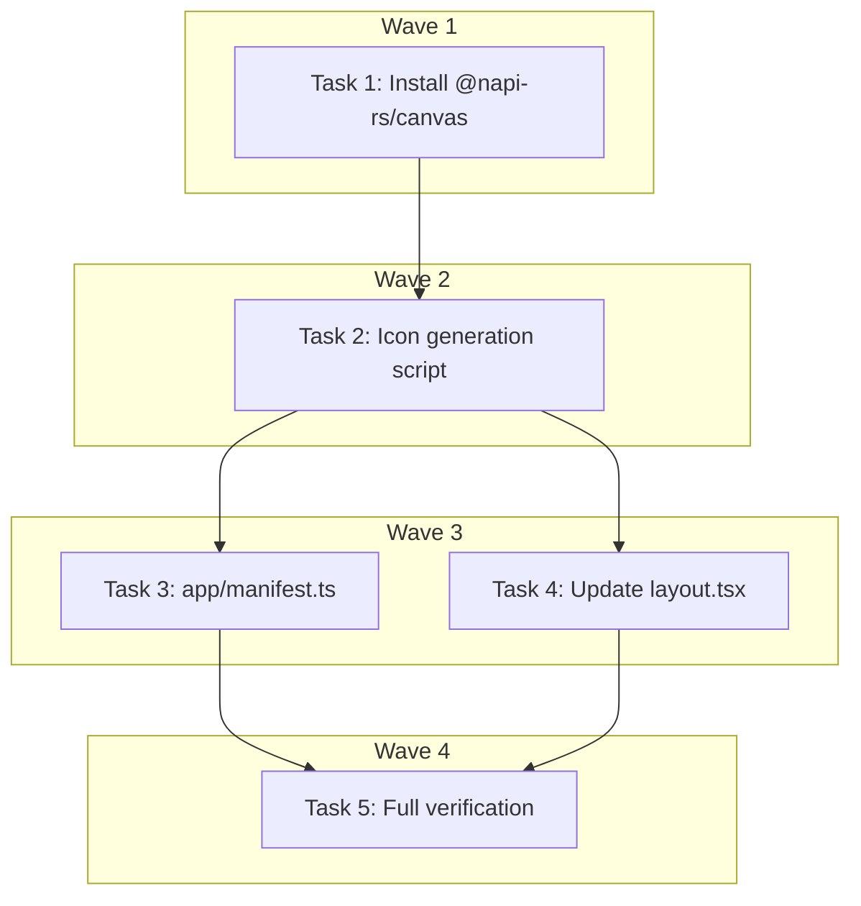

# PWA Tier 1 — Installable App Implementation Plan

> **For Claude:** REQUIRED SUB-SKILL: Use executing-plans to implement this plan task-by-task.

**Design Doc:** [docs/designs/2026-03-16-pwa-installable-app-design.md](../designs/2026-03-16-pwa-installable-app-design.md)

**Spec References:** —

**PRD References:** —

**Goal:** Make CafeRoam installable on iOS and Android home screens via web app manifest and meta tags — no service worker, no offline.

**Architecture:** One-shot Node.js canvas script generates placeholder PWA icons (啡 character on coffee brown). Next.js native `app/manifest.ts` exports a typed manifest. Layout metadata adds viewport theme-color, icon links, and Apple Web App meta tags.

**Tech Stack:** Next.js 16 (App Router metadata API), `@napi-rs/canvas` (devDependency, icon generation only), `tsx` (already installed)

**Acceptance Criteria:**

- [ ] `pnpm build` passes with no type errors
- [ ] DevTools > Application > Manifest shows valid manifest with 3 icons (192, 512, 512-maskable)
- [ ] Lighthouse PWA audit: "installable" check passes
- [ ] iOS Safari: "Add to Home Screen" shows correct icon and '啡遊' title
- [ ] Android Chrome: install prompt / "Add to Home Screen" works

---

### Task 1: Install `@napi-rs/canvas` devDependency

**Files:**

- Modify: `package.json` (devDependencies)

**Step 1: Install the dependency**

No test needed — dependency installation only.

```bash
pnpm add -D @napi-rs/canvas
```

**Step 2: Verify installation**

```bash
node -e "require('@napi-rs/canvas')" && echo "OK"
```

Expected: `OK` (no errors)

**Step 3: Commit**

```bash
git add package.json pnpm-lock.yaml
git commit -m "chore: add @napi-rs/canvas devDependency for PWA icon generation"
```

---

### Task 2: Create icon generation script

**Files:**

- Create: `scripts/generate-pwa-icons.ts`

**Step 1: Write the script**

No unit test needed — this is a one-shot dev tool that outputs image files. Verification is visual + file existence check.

```typescript
/**
 * One-shot PWA icon generator.
 * Run: npx tsx scripts/generate-pwa-icons.ts
 * Output: public/icon-192.png, icon-512.png, icon-512-maskable.png, apple-touch-icon.png, favicon.ico
 */
import { createCanvas } from '@napi-rs/canvas';
import { writeFileSync, mkdirSync, existsSync } from 'fs';
import { join } from 'path';

const BG_COLOR = '#6F4E37';
const TEXT_COLOR = '#FFFFFF';
const CHARACTER = '啡';
const PUBLIC_DIR = join(import.meta.dirname, '..', 'public');

interface IconSpec {
  filename: string;
  size: number;
  maskable: boolean;
}

const icons: IconSpec[] = [
  { filename: 'icon-192.png', size: 192, maskable: false },
  { filename: 'icon-512.png', size: 512, maskable: false },
  { filename: 'icon-512-maskable.png', size: 512, maskable: true },
  { filename: 'apple-touch-icon.png', size: 180, maskable: false },
];

function generateIcon({ filename, size, maskable }: IconSpec): void {
  const canvas = createCanvas(size, size);
  const ctx = canvas.getContext('2d');

  // Fill background
  ctx.fillStyle = BG_COLOR;
  ctx.fillRect(0, 0, size, size);

  // For maskable icons, the safe zone is the center 80% circle.
  // Scale character down to fit within that zone.
  const fontScale = maskable ? 0.5 : 0.7;
  const fontSize = Math.round(size * fontScale);

  ctx.fillStyle = TEXT_COLOR;
  ctx.font = `bold ${fontSize}px sans-serif`;
  ctx.textAlign = 'center';
  ctx.textBaseline = 'middle';
  ctx.fillText(CHARACTER, size / 2, size / 2);

  const buffer = canvas.toBuffer('image/png');
  writeFileSync(join(PUBLIC_DIR, filename), buffer);
  console.log(
    `  ✓ ${filename} (${size}×${size}${maskable ? ' maskable' : ''})`
  );
}

function generateFavicon(): void {
  const size = 32;
  const canvas = createCanvas(size, size);
  const ctx = canvas.getContext('2d');

  ctx.fillStyle = BG_COLOR;
  ctx.fillRect(0, 0, size, size);

  const fontSize = Math.round(size * 0.7);
  ctx.fillStyle = TEXT_COLOR;
  ctx.font = `bold ${fontSize}px sans-serif`;
  ctx.textAlign = 'center';
  ctx.textBaseline = 'middle';
  ctx.fillText(CHARACTER, size / 2, size / 2);

  // Write as PNG (browsers accept PNG favicons; .ico is legacy but PNG works)
  const buffer = canvas.toBuffer('image/png');
  writeFileSync(join(PUBLIC_DIR, 'favicon.ico'), buffer);
  console.log(`  ✓ favicon.ico (${size}×${size})`);
}

// Main
if (!existsSync(PUBLIC_DIR)) {
  mkdirSync(PUBLIC_DIR, { recursive: true });
}

console.log('Generating PWA icons...');
for (const spec of icons) {
  generateIcon(spec);
}
generateFavicon();
console.log('Done. Icons written to public/');
```

**Step 2: Run the script and verify output**

```bash
npx tsx scripts/generate-pwa-icons.ts
```

Expected output:

```
Generating PWA icons...
  ✓ icon-192.png (192×192)
  ✓ icon-512.png (512×512)
  ✓ icon-512-maskable.png (512×512 maskable)
  ✓ apple-touch-icon.png (180×180)
  ✓ favicon.ico (32×32)
Done. Icons written to public/
```

Verify files exist:

```bash
ls -la public/icon-192.png public/icon-512.png public/icon-512-maskable.png public/apple-touch-icon.png public/favicon.ico
```

Expected: all 5 files present, non-zero size.

**Step 3: Commit**

```bash
git add scripts/generate-pwa-icons.ts public/
git commit -m "feat: add PWA icon generation script and generated icons"
```

---

### Task 3: Create `app/manifest.ts`

**Files:**

- Create: `app/manifest.ts`

**Step 1: Write the manifest**

No unit test needed — this is a static Next.js metadata route. Verification is via `pnpm build` + DevTools inspection.

```typescript
import type { MetadataRoute } from 'next';

export default function manifest(): MetadataRoute.Manifest {
  return {
    name: '啡遊 CafeRoam',
    short_name: '啡遊',
    description:
      "Discover Taiwan's best independent coffee shops with AI-powered semantic search.",
    start_url: '/',
    display: 'standalone',
    background_color: '#ffffff',
    theme_color: '#6F4E37',
    icons: [
      { src: '/icon-192.png', sizes: '192x192', type: 'image/png' },
      { src: '/icon-512.png', sizes: '512x512', type: 'image/png' },
      {
        src: '/icon-512-maskable.png',
        sizes: '512x512',
        type: 'image/png',
        purpose: 'maskable',
      },
    ],
  };
}
```

**Step 2: Verify type-check passes**

```bash
pnpm type-check
```

Expected: no errors.

**Step 3: Commit**

```bash
git add app/manifest.ts
git commit -m "feat: add Next.js web app manifest for PWA installability"
```

---

### Task 4: Update `app/layout.tsx` metadata

**Files:**

- Modify: `app/layout.tsx:1-29` (imports + metadata export + add viewport export)

**Step 1: Update the layout**

No unit test needed — this is static metadata configuration. Verification is via `pnpm build` + browser inspection.

Update the imports to include `Viewport`:

```typescript
import type { Metadata, Viewport } from 'next';
```

Replace the existing `metadata` export with an expanded version that includes `icons` and `appleWebApp`:

```typescript
export const metadata: Metadata = {
  title: 'CafeRoam 啡遊',
  description:
    "Discover Taiwan's best independent coffee shops with AI-powered semantic search.",
  icons: {
    icon: [
      { url: '/favicon.ico', sizes: '32x32' },
      { url: '/icon-192.png', sizes: '192x192', type: 'image/png' },
      { url: '/icon-512.png', sizes: '512x512', type: 'image/png' },
    ],
    apple: [
      { url: '/apple-touch-icon.png', sizes: '180x180', type: 'image/png' },
    ],
  },
  appleWebApp: {
    capable: true,
    title: '啡遊',
    statusBarStyle: 'default',
  },
};
```

Add a new `viewport` export after the `metadata` export:

```typescript
export const viewport: Viewport = {
  themeColor: '#6F4E37',
  width: 'device-width',
  initialScale: 1,
  maximumScale: 1,
};
```

**Step 2: Verify type-check and build pass**

```bash
pnpm type-check && pnpm build
```

Expected: both pass with no errors.

**Step 3: Commit**

```bash
git add app/layout.tsx
git commit -m "feat: add PWA viewport, icons, and appleWebApp metadata to root layout"
```

---

### Task 5: Full verification

**Files:** — (no changes, verification only)

**Step 1: Run full test suite + build**

```bash
pnpm test && pnpm type-check && pnpm lint && pnpm build
```

Expected: all pass.

**Step 2: Verify manifest route**

Start dev server and fetch the manifest:

```bash
pnpm dev &
sleep 3
curl -s http://localhost:3000/manifest.webmanifest | head -20
kill %1
```

Expected: JSON output with `name`, `short_name`, `icons` array, `display: "standalone"`, `theme_color: "#6F4E37"`.

**Step 3: Manual browser verification checklist**

Open `http://localhost:3000` in Chrome:

- [ ] DevTools > Application > Manifest shows valid manifest with 3 icons
- [ ] Lighthouse > PWA > "installable" passes
- [ ] Page source contains `<meta name="theme-color" content="#6F4E37">`
- [ ] Page source contains `<link rel="apple-touch-icon">`
- [ ] Page source contains `<meta name="apple-mobile-web-app-capable" content="yes">`

**Step 4: Final commit (if any lint/format fixes needed)**

```bash
git add -A
git commit -m "chore: format fixes from PWA verification"
```

Only commit if there are actual changes. Skip if working tree is clean.

---

## Execution Waves



**Wave 1** (no dependencies):

- Task 1: Install `@napi-rs/canvas` devDependency

**Wave 2** (depends on Wave 1):

- Task 2: Icon generation script + run it ← Task 1 (needs the canvas package)

**Wave 3** (parallel — depends on Wave 2):

- Task 3: `app/manifest.ts` ← Task 2 (references icons in `public/`)
- Task 4: Update `app/layout.tsx` ← Task 2 (references icons in `public/`)

**Wave 4** (depends on Wave 3):

- Task 5: Full verification ← Task 3, Task 4

---

## TODO.md Updates

Update the PWA section checkboxes in `TODO.md` to link to design and plan docs.
