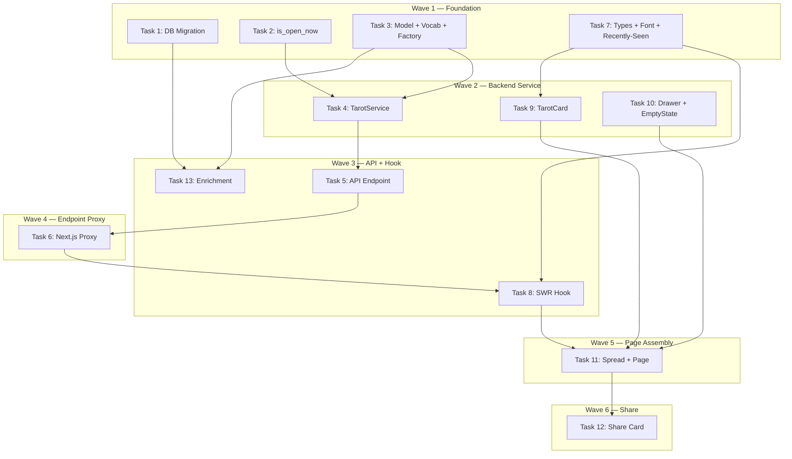

# Tarot — Surprise Me (Explore Layer 1) Implementation Plan

> **For Claude:** REQUIRED SUB-SKILL: Use executing-plans to implement this plan task-by-task.

**Design Doc:** [docs/designs/2026-03-17-tarot-implementation-design.md](../designs/2026-03-17-tarot-implementation-design.md)

**Spec References:** [docs/designs/2026-03-17-explore-tarot-redesign.md](../designs/2026-03-17-explore-tarot-redesign.md)

**PRD References:** —

**Goal:** Build the 3-card tarot spread on the Explore page — users tap a face-down card to reveal a nearby open cafe, with share-to-Stories support.

**Architecture:** Public FastAPI endpoint queries shops within geo radius, filters by open-now and unique tarot titles, returns 3 random cards. Frontend renders face-down cards, reveals via full-screen Vaul drawer, generates share images client-side via Canvas API.

**Tech Stack:** FastAPI, Pydantic, Supabase PostgREST, SWR, Vaul drawer, html2canvas, Bricolage Grotesque font, PostHog analytics

**Acceptance Criteria:**
- [ ] A user on the Explore page sees 3 face-down tarot cards showing archetype titles, and can tap one to reveal the cafe behind it
- [ ] Only shops that are currently open and within the user's radius appear in draws
- [ ] "Draw Again" loads 3 fresh cards, excluding recently-seen shops
- [ ] "Share My Draw" generates a portrait card image and opens the native share sheet (or downloads on desktop)
- [ ] When no shops are available nearby, a helpful empty state appears with an "Expand radius" option

---

## Task 1: Database Migration — Add tarot_title and flavor_text columns

**Files:**
- Create: `supabase/migrations/20260317000001_add_tarot_columns.sql`

No test needed — pure DDL migration.

**Step 1: Write migration**

```sql
-- Add tarot enrichment fields to shops table.
-- Populated by the ENRICH_SHOP worker; queried by GET /explore/tarot-draw.
ALTER TABLE shops ADD COLUMN IF NOT EXISTS tarot_title TEXT;
ALTER TABLE shops ADD COLUMN IF NOT EXISTS flavor_text TEXT;
```

**Step 2: Apply migration locally**

Run: `supabase db diff` to verify no conflicts, then `supabase db push`

**Step 3: Commit**

```bash
git add supabase/migrations/20260317000001_add_tarot_columns.sql
git commit -m "feat(db): add tarot_title and flavor_text columns to shops"
```

---

## Task 2: is_open_now Utility (Backend)

**Files:**
- Create: `backend/core/opening_hours.py`
- Create: `backend/tests/core/test_opening_hours.py`

**Step 1: Write failing tests**

```python
# backend/tests/core/test_opening_hours.py
from datetime import datetime

import pytest
from zoneinfo import ZoneInfo

from core.opening_hours import is_open_now

TW = ZoneInfo("Asia/Taipei")


class TestIsOpenNow:
    """Given a shop's opening_hours list and a reference time, determine if the shop is open."""

    def test_open_during_listed_hours(self):
        hours = ["Monday: 9:00 AM - 6:00 PM"]
        now = datetime(2026, 3, 16, 14, 0, tzinfo=TW)  # Monday 2pm
        assert is_open_now(hours, now) is True

    def test_closed_outside_listed_hours(self):
        hours = ["Monday: 9:00 AM - 6:00 PM"]
        now = datetime(2026, 3, 16, 20, 0, tzinfo=TW)  # Monday 8pm
        assert is_open_now(hours, now) is False

    def test_closed_on_unlisted_day(self):
        hours = ["Monday: 9:00 AM - 6:00 PM"]
        now = datetime(2026, 3, 17, 14, 0, tzinfo=TW)  # Tuesday 2pm
        assert is_open_now(hours, now) is False

    def test_midnight_crossing_before_midnight(self):
        hours = ["Friday: 10:00 AM - 2:00 AM"]
        now = datetime(2026, 3, 20, 23, 30, tzinfo=TW)  # Friday 11:30pm
        assert is_open_now(hours, now) is True

    def test_midnight_crossing_after_midnight(self):
        hours = ["Friday: 10:00 AM - 2:00 AM"]
        now = datetime(2026, 3, 21, 1, 0, tzinfo=TW)  # Saturday 1am (still in Friday's range)
        assert is_open_now(hours, now) is True

    def test_midnight_crossing_outside_range(self):
        hours = ["Friday: 10:00 AM - 2:00 AM"]
        now = datetime(2026, 3, 21, 3, 0, tzinfo=TW)  # Saturday 3am
        assert is_open_now(hours, now) is False

    def test_24_hour_shop(self):
        hours = ["Monday: Open 24 hours"]
        now = datetime(2026, 3, 16, 3, 0, tzinfo=TW)  # Monday 3am
        assert is_open_now(hours, now) is True

    def test_null_hours_returns_none(self):
        assert is_open_now(None, datetime(2026, 3, 16, 14, 0, tzinfo=TW)) is None

    def test_empty_list_returns_none(self):
        assert is_open_now([], datetime(2026, 3, 16, 14, 0, tzinfo=TW)) is None

    def test_multiple_days(self):
        hours = [
            "Monday: 9:00 AM - 6:00 PM",
            "Tuesday: 9:00 AM - 6:00 PM",
            "Wednesday: 9:00 AM - 6:00 PM",
        ]
        now = datetime(2026, 3, 18, 12, 0, tzinfo=TW)  # Wednesday noon
        assert is_open_now(hours, now) is True

    def test_closed_string(self):
        hours = ["Sunday: Closed"]
        now = datetime(2026, 3, 22, 14, 0, tzinfo=TW)  # Sunday 2pm
        assert is_open_now(hours, now) is False

    def test_noon_boundary_12pm(self):
        hours = ["Monday: 12:00 PM - 9:00 PM"]
        now = datetime(2026, 3, 16, 12, 0, tzinfo=TW)
        assert is_open_now(hours, now) is True

    def test_24h_format_fallback(self):
        """Some scrapers use 24h format like '09:00 - 18:00'."""
        hours = ["Monday: 09:00 - 18:00"]
        now = datetime(2026, 3, 16, 14, 0, tzinfo=TW)
        assert is_open_now(hours, now) is True
```

**Step 2: Run tests to verify they fail**

Run: `cd backend && pytest tests/core/test_opening_hours.py -v`
Expected: FAIL — `ModuleNotFoundError: No module named 'core.opening_hours'`

**Step 3: Implement is_open_now**

```python
# backend/core/opening_hours.py
"""Parse opening_hours strings and determine if a shop is currently open.

The opening_hours field is a list[str] populated by scrapers in formats like:
  - "Monday: 9:00 AM - 6:00 PM"
  - "Friday: 10:00 AM - 2:00 AM"  (midnight crossing)
  - "Monday: Open 24 hours"
  - "Sunday: Closed"
  - "Monday: 09:00 - 18:00"  (24h format fallback)

All shops are in Asia/Taipei timezone.
"""

import re
from datetime import datetime

_DAY_MAP = {
    "monday": 0,
    "tuesday": 1,
    "wednesday": 2,
    "thursday": 3,
    "friday": 4,
    "saturday": 5,
    "sunday": 6,
}

_TIME_RE = re.compile(
    r"(\d{1,2}):(\d{2})\s*(AM|PM)?", re.IGNORECASE
)


def _parse_time_to_minutes(time_str: str) -> int:
    """Convert a time string like '9:00 AM' or '18:00' to minutes since midnight."""
    m = _TIME_RE.match(time_str.strip())
    if not m:
        raise ValueError(f"Cannot parse time: {time_str!r}")
    hour, minute = int(m.group(1)), int(m.group(2))
    ampm = m.group(3)
    if ampm:
        ampm = ampm.upper()
        if ampm == "PM" and hour != 12:
            hour += 12
        elif ampm == "AM" and hour == 12:
            hour = 0
    return hour * 60 + minute


def is_open_now(
    opening_hours: list[str] | None, now: datetime
) -> bool | None:
    """Check if a shop is currently open.

    Returns True/False if opening_hours can be parsed, or None if
    opening_hours is null/empty (unknown — caller decides how to treat).
    """
    if not opening_hours:
        return None

    current_weekday = now.weekday()  # 0=Monday
    current_minutes = now.hour * 60 + now.minute

    for entry in opening_hours:
        entry = entry.strip()
        if ":" not in entry:
            continue

        # Split on first colon to get day name and time range
        day_part, _, time_part = entry.partition(":")
        day_name = day_part.strip().lower()
        time_part = time_part.strip()

        day_num = _DAY_MAP.get(day_name)
        if day_num is None:
            continue

        # Handle special cases
        if "closed" in time_part.lower():
            if day_num == current_weekday:
                return False
            continue

        if "24 hour" in time_part.lower() or "24hour" in time_part.lower():
            if day_num == current_weekday:
                return True
            continue

        # Parse time range: "9:00 AM - 6:00 PM" or "09:00 - 18:00"
        parts = re.split(r"\s*[-–]\s*", time_part)
        if len(parts) != 2:
            continue

        try:
            open_min = _parse_time_to_minutes(parts[0])
            close_min = _parse_time_to_minutes(parts[1])
        except ValueError:
            continue

        if close_min > open_min:
            # Normal range (e.g., 9:00 AM - 6:00 PM)
            if day_num == current_weekday and open_min <= current_minutes < close_min:
                return True
        else:
            # Midnight crossing (e.g., 10:00 AM - 2:00 AM)
            # Check same day: from open_min to midnight
            if day_num == current_weekday and current_minutes >= open_min:
                return True
            # Check next day: from midnight to close_min
            prev_day = (current_weekday - 1) % 7
            if day_num == prev_day and current_minutes < close_min:
                return True

    return False
```

**Step 4: Run tests to verify they pass**

Run: `cd backend && pytest tests/core/test_opening_hours.py -v`
Expected: All 13 tests PASS

**Step 5: Commit**

```bash
git add backend/core/opening_hours.py backend/tests/core/test_opening_hours.py
git commit -m "feat(backend): is_open_now utility for opening hours parsing"
```

---

## Task 3: TarotCard Pydantic Model + Tarot Vocabulary Constant + Factory

**Files:**
- Modify: `backend/models/types.py` (add `TarotCard` model)
- Create: `backend/core/tarot_vocabulary.py` (title→tag mapping constant)
- Modify: `backend/tests/factories.py` (add `make_tarot_shop_row`)
- Create: `backend/tests/core/test_tarot_vocabulary.py`

**Step 1: Write failing test for vocabulary**

```python
# backend/tests/core/test_tarot_vocabulary.py
from core.tarot_vocabulary import TAROT_TITLES, TITLE_TO_TAGS


class TestTarotVocabulary:
    """The tarot vocabulary maps tag combinations to archetype titles."""

    def test_vocabulary_has_at_least_20_titles(self):
        assert len(TAROT_TITLES) >= 20

    def test_all_titles_are_unique(self):
        assert len(TAROT_TITLES) == len(set(TAROT_TITLES))

    def test_title_to_tags_maps_every_title(self):
        for title in TAROT_TITLES:
            assert title in TITLE_TO_TAGS, f"Missing tag mapping for {title}"

    def test_scholars_refuge_maps_to_quiet_laptop_wifi(self):
        tags = TITLE_TO_TAGS["The Scholar's Refuge"]
        assert "quiet" in tags
        assert "laptop_friendly" in tags
```

**Step 2: Run test to verify it fails**

Run: `cd backend && pytest tests/core/test_tarot_vocabulary.py -v`
Expected: FAIL — `ModuleNotFoundError`

**Step 3: Implement vocabulary + model + factory**

```python
# backend/core/tarot_vocabulary.py
"""Fixed tarot title vocabulary for the Explore Tarot feature.

Each shop is assigned one title during enrichment based on its taxonomy tags.
The enrichment prompt selects the best-fitting title from this list.
"""

# Ordered list of all valid tarot titles.
TAROT_TITLES: list[str] = [
    "The Scholar's Refuge",
    "The Enchanted Corner",
    "The Hidden Alcove",
    "The Alchemist's Table",
    "The Open Sky",
    "The Morning Garden",
    "The Master's Workshop",
    "The Silent Chapel",
    "The Time Capsule",
    "The Grand Hall",
    "The Crown",
    "The Familiar's Den",
    "The Lookout",
    "The Forest Floor",
    "The Iron Garden",
    "The Midnight Lamp",
    "The Eastern Path",
    "The Collector's Room",
    "The Quick Draw",
    "The Library",
]

# Tag combinations that map to each title.
# Used in the enrichment prompt so Claude picks the best match.
TITLE_TO_TAGS: dict[str, list[str]] = {
    "The Scholar's Refuge": ["quiet", "laptop_friendly", "wifi_available"],
    "The Enchanted Corner": ["cozy", "photogenic", "good_espresso"],
    "The Hidden Alcove": ["hidden_gem", "local_favorite"],
    "The Alchemist's Table": ["self_roasted", "pour_over"],
    "The Open Sky": ["outdoor_seating", "scenic_view"],
    "The Morning Garden": ["brunch", "photogenic", "casual"],
    "The Master's Workshop": ["espresso", "self_roasted"],
    "The Silent Chapel": ["quiet", "minimalist"],
    "The Time Capsule": ["retro", "local_favorite"],
    "The Grand Hall": ["social", "large_space", "group_friendly"],
    "The Crown": ["specialty_coffee", "award_winning"],
    "The Familiar's Den": ["cat_cafe", "dog_friendly"],
    "The Lookout": ["rooftop", "view"],
    "The Forest Floor": ["forest_style", "natural_light"],
    "The Iron Garden": ["industrial", "minimalist"],
    "The Midnight Lamp": ["night_friendly", "late_hours"],
    "The Eastern Path": ["japanese_style"],
    "The Collector's Room": ["vintage", "retro"],
    "The Quick Draw": ["standing_bar", "espresso"],
    "The Library": ["bookshelf", "reading_friendly"],
}
```

Add model to `backend/models/types.py` — append after `SearchResult`:

```python
class TarotCard(CamelModel):
    shop_id: str
    tarot_title: str
    flavor_text: str
    is_open_now: bool
    distance_km: float
    name: str
    neighborhood: str
    cover_photo_url: str | None = None
    rating: float | None = None
    review_count: int = 0
    slug: str | None = None
```

Add factory to `backend/tests/factories.py`:

```python
def make_tarot_shop_row(**overrides: object) -> dict:
    """Shop row with tarot enrichment fields, as returned by Supabase."""
    return {
        "id": "shop-tarot-01",
        "name": "森日咖啡",
        "slug": "sen-ri-ka-fei",
        "address": "台北市中山區南京東路二段178號",
        "city": "台北市",
        "latitude": 25.0522,
        "longitude": 121.5343,
        "mrt": "松江南京",
        "rating": 4.5,
        "review_count": 142,
        "opening_hours": [
            "Monday: 8:00 AM - 9:00 PM",
            "Tuesday: 8:00 AM - 9:00 PM",
            "Wednesday: 8:00 AM - 9:00 PM",
            "Thursday: 8:00 AM - 9:00 PM",
            "Friday: 8:00 AM - 10:00 PM",
            "Saturday: 9:00 AM - 10:00 PM",
            "Sunday: 9:00 AM - 6:00 PM",
        ],
        "tarot_title": "The Scholar's Refuge",
        "flavor_text": "For those who seek quiet in an unquiet world.",
        "processing_status": "live",
        "shop_photos": [{"url": "https://example.supabase.co/storage/v1/object/public/shop-photos/tarot-01/exterior.jpg"}],
        **overrides,
    }
```

**Step 4: Run tests**

Run: `cd backend && pytest tests/core/test_tarot_vocabulary.py tests/models/test_camel_serialization.py -v`
Expected: All PASS

**Step 5: Commit**

```bash
git add backend/core/tarot_vocabulary.py backend/models/types.py backend/tests/core/test_tarot_vocabulary.py backend/tests/factories.py
git commit -m "feat(backend): TarotCard model, vocabulary constant, and test factory"
```

---

## Task 4: TarotService (Backend)

**Files:**
- Create: `backend/services/tarot_service.py`
- Create: `backend/tests/services/test_tarot_service.py`

**Step 1: Write failing tests**

```python
# backend/tests/services/test_tarot_service.py
import asyncio
from datetime import datetime
from unittest.mock import MagicMock
from zoneinfo import ZoneInfo

import pytest

from services.tarot_service import TarotService
from tests.factories import make_tarot_shop_row

TW = ZoneInfo("Asia/Taipei")

# Fixed "now" on a Wednesday at 2pm — all default factory shops should be open
FIXED_NOW = datetime(2026, 3, 18, 14, 0, tzinfo=TW)


def _make_db_mock(rows: list[dict]) -> MagicMock:
    """Mock Supabase client that returns given rows from .rpc().execute()."""
    mock = MagicMock()
    mock.rpc.return_value = mock
    mock.execute.return_value = MagicMock(data=rows)
    return mock


class TestTarotServiceDraw:
    """Given a user location, draw 3 unique-title tarot cards from nearby open shops."""

    def test_returns_3_cards_from_sufficient_pool(self):
        rows = [
            make_tarot_shop_row(id="s1", tarot_title="The Scholar's Refuge"),
            make_tarot_shop_row(id="s2", tarot_title="The Hidden Alcove"),
            make_tarot_shop_row(id="s3", tarot_title="The Alchemist's Table"),
            make_tarot_shop_row(id="s4", tarot_title="The Open Sky"),
        ]
        db = _make_db_mock(rows)
        service = TarotService(db)
        result = asyncio.get_event_loop().run_until_complete(
            service.draw(lat=25.033, lng=121.543, radius_km=3.0, excluded_ids=[], now=FIXED_NOW)
        )
        assert len(result) == 3

    def test_all_cards_have_unique_titles(self):
        rows = [
            make_tarot_shop_row(id="s1", tarot_title="The Scholar's Refuge"),
            make_tarot_shop_row(id="s2", tarot_title="The Scholar's Refuge"),
            make_tarot_shop_row(id="s3", tarot_title="The Hidden Alcove"),
            make_tarot_shop_row(id="s4", tarot_title="The Alchemist's Table"),
        ]
        db = _make_db_mock(rows)
        service = TarotService(db)
        result = asyncio.get_event_loop().run_until_complete(
            service.draw(lat=25.033, lng=121.543, radius_km=3.0, excluded_ids=[], now=FIXED_NOW)
        )
        titles = [c.tarot_title for c in result]
        assert len(titles) == len(set(titles))

    def test_excludes_recently_seen_shops(self):
        rows = [
            make_tarot_shop_row(id="s1", tarot_title="The Scholar's Refuge"),
            make_tarot_shop_row(id="s2", tarot_title="The Hidden Alcove"),
            make_tarot_shop_row(id="s3", tarot_title="The Alchemist's Table"),
        ]
        db = _make_db_mock(rows)
        service = TarotService(db)
        result = asyncio.get_event_loop().run_until_complete(
            service.draw(lat=25.033, lng=121.543, radius_km=3.0, excluded_ids=["s1", "s2"], now=FIXED_NOW)
        )
        result_ids = [c.shop_id for c in result]
        assert "s1" not in result_ids
        assert "s2" not in result_ids

    def test_returns_fewer_than_3_when_pool_is_small(self):
        rows = [
            make_tarot_shop_row(id="s1", tarot_title="The Scholar's Refuge"),
        ]
        db = _make_db_mock(rows)
        service = TarotService(db)
        result = asyncio.get_event_loop().run_until_complete(
            service.draw(lat=25.033, lng=121.543, radius_km=3.0, excluded_ids=[], now=FIXED_NOW)
        )
        assert len(result) == 1

    def test_returns_empty_list_when_no_shops(self):
        db = _make_db_mock([])
        service = TarotService(db)
        result = asyncio.get_event_loop().run_until_complete(
            service.draw(lat=25.033, lng=121.543, radius_km=3.0, excluded_ids=[], now=FIXED_NOW)
        )
        assert result == []

    def test_filters_out_closed_shops(self):
        # Sunday shop with Monday-only hours should be closed on Wednesday
        rows = [
            make_tarot_shop_row(
                id="s1",
                tarot_title="The Scholar's Refuge",
                opening_hours=["Sunday: 9:00 AM - 5:00 PM"],
            ),
            make_tarot_shop_row(id="s2", tarot_title="The Hidden Alcove"),
        ]
        db = _make_db_mock(rows)
        service = TarotService(db)
        result = asyncio.get_event_loop().run_until_complete(
            service.draw(lat=25.033, lng=121.543, radius_km=3.0, excluded_ids=[], now=FIXED_NOW)
        )
        result_ids = [c.shop_id for c in result]
        assert "s1" not in result_ids

    def test_includes_shops_with_null_hours_as_unknown(self):
        rows = [
            make_tarot_shop_row(id="s1", tarot_title="The Scholar's Refuge", opening_hours=None),
        ]
        db = _make_db_mock(rows)
        service = TarotService(db)
        result = asyncio.get_event_loop().run_until_complete(
            service.draw(lat=25.033, lng=121.543, radius_km=3.0, excluded_ids=[], now=FIXED_NOW)
        )
        assert len(result) == 1  # null hours = unknown = included

    def test_card_has_distance_km(self):
        rows = [
            make_tarot_shop_row(id="s1", tarot_title="The Scholar's Refuge"),
        ]
        db = _make_db_mock(rows)
        service = TarotService(db)
        result = asyncio.get_event_loop().run_until_complete(
            service.draw(lat=25.033, lng=121.543, radius_km=3.0, excluded_ids=[], now=FIXED_NOW)
        )
        assert result[0].distance_km >= 0

    def test_card_response_shape(self):
        rows = [
            make_tarot_shop_row(id="s1", tarot_title="The Scholar's Refuge"),
        ]
        db = _make_db_mock(rows)
        service = TarotService(db)
        result = asyncio.get_event_loop().run_until_complete(
            service.draw(lat=25.033, lng=121.543, radius_km=3.0, excluded_ids=[], now=FIXED_NOW)
        )
        card = result[0]
        assert card.shop_id == "s1"
        assert card.tarot_title == "The Scholar's Refuge"
        assert card.flavor_text == "For those who seek quiet in an unquiet world."
        assert card.name == "森日咖啡"
        assert card.neighborhood == "台北市"
```

**Step 2: Run tests to verify they fail**

Run: `cd backend && pytest tests/services/test_tarot_service.py -v`
Expected: FAIL — `ModuleNotFoundError`

**Step 3: Implement TarotService**

```python
# backend/services/tarot_service.py
import math
import random
from datetime import datetime
from typing import Any, cast

from supabase import Client
from zoneinfo import ZoneInfo

from core.opening_hours import is_open_now
from models.types import TarotCard

TW = ZoneInfo("Asia/Taipei")

# Approximate Haversine distance in km.
_EARTH_RADIUS_KM = 6371.0


def _haversine(lat1: float, lng1: float, lat2: float, lng2: float) -> float:
    lat1, lng1, lat2, lng2 = map(math.radians, [lat1, lng1, lat2, lng2])
    dlat = lat2 - lat1
    dlng = lng2 - lng1
    a = math.sin(dlat / 2) ** 2 + math.cos(lat1) * math.cos(lat2) * math.sin(dlng / 2) ** 2
    return _EARTH_RADIUS_KM * 2 * math.asin(math.sqrt(a))


class TarotService:
    def __init__(self, db: Client):
        self._db = db

    async def draw(
        self,
        lat: float,
        lng: float,
        radius_km: float,
        excluded_ids: list[str],
        now: datetime | None = None,
    ) -> list[TarotCard]:
        """Draw up to 3 tarot cards from nearby open shops with unique titles."""
        if now is None:
            now = datetime.now(TW)

        rows = await self._query_nearby_shops(lat, lng, radius_km)

        # Filter: exclude recently seen, require tarot_title, check open now
        candidates: list[dict[str, Any]] = []
        for row in rows:
            if row["id"] in excluded_ids:
                continue
            if not row.get("tarot_title"):
                continue
            open_status = is_open_now(row.get("opening_hours"), now)
            if open_status is False:  # None (unknown) is included
                continue
            candidates.append(row)

        # Deduplicate by tarot_title: pick one random shop per title
        by_title: dict[str, list[dict[str, Any]]] = {}
        for c in candidates:
            by_title.setdefault(c["tarot_title"], []).append(c)

        unique_pool: list[dict[str, Any]] = []
        for title_shops in by_title.values():
            unique_pool.append(random.choice(title_shops))

        # Sample up to 3
        chosen = random.sample(unique_pool, min(3, len(unique_pool)))

        # Build response
        return [self._to_card(row, lat, lng, now) for row in chosen]

    async def _query_nearby_shops(
        self, lat: float, lng: float, radius_km: float
    ) -> list[dict[str, Any]]:
        """Query shops within radius using PostgREST geo bounding box."""
        import asyncio

        # Bounding box approximation (same as search_shops RPC)
        lat_delta = radius_km / 111.0
        lng_delta = radius_km / (111.0 * math.cos(math.radians(lat)))

        def _query() -> list[dict[str, Any]]:
            response = (
                self._db.table("shops")
                .select(
                    "id, name, slug, address, city, latitude, longitude, "
                    "rating, review_count, opening_hours, tarot_title, flavor_text, "
                    "processing_status, shop_photos(url)"
                )
                .eq("processing_status", "live")
                .not_("tarot_title", "is", "null")
                .gte("latitude", lat - lat_delta)
                .lte("latitude", lat + lat_delta)
                .gte("longitude", lng - lng_delta)
                .lte("longitude", lng + lng_delta)
                .limit(200)
                .execute()
            )
            return cast("list[dict[str, Any]]", response.data or [])

        return await asyncio.to_thread(_query)

    def _to_card(
        self, row: dict[str, Any], user_lat: float, user_lng: float, now: datetime
    ) -> TarotCard:
        photos = row.get("shop_photos") or []
        cover = photos[0]["url"] if photos else None

        return TarotCard(
            shop_id=row["id"],
            tarot_title=row["tarot_title"],
            flavor_text=row.get("flavor_text") or "",
            is_open_now=is_open_now(row.get("opening_hours"), now) is not False,
            distance_km=round(
                _haversine(user_lat, user_lng, row["latitude"], row["longitude"]),
                1,
            ),
            name=row["name"],
            neighborhood=row.get("city") or "",
            cover_photo_url=cover,
            rating=float(row["rating"]) if row.get("rating") else None,
            review_count=row.get("review_count") or 0,
            slug=row.get("slug"),
        )
```

**Step 4: Run tests**

Run: `cd backend && pytest tests/services/test_tarot_service.py -v`
Expected: All 9 tests PASS

**Step 5: Commit**

```bash
git add backend/services/tarot_service.py backend/tests/services/test_tarot_service.py
git commit -m "feat(backend): TarotService with geo filter, open-now check, and title uniqueness"
```

---

## Task 5: API Endpoint + Router Registration

**Files:**
- Create: `backend/api/explore.py`
- Modify: `backend/main.py` (add router import + include)
- Create: `backend/tests/api/test_explore.py`

**Step 1: Write failing tests**

```python
# backend/tests/api/test_explore.py
from unittest.mock import MagicMock, patch, AsyncMock

from fastapi.testclient import TestClient

from main import app
from models.types import TarotCard

client = TestClient(app)

MOCK_CARDS = [
    TarotCard(
        shop_id="s1",
        tarot_title="The Scholar's Refuge",
        flavor_text="For those who seek quiet.",
        is_open_now=True,
        distance_km=1.2,
        name="森日咖啡",
        neighborhood="台北市",
        cover_photo_url="https://example.com/photo.jpg",
        rating=4.5,
        review_count=142,
        slug="sen-ri",
    ),
]


class TestTarotDrawEndpoint:
    """GET /explore/tarot-draw returns tarot cards for nearby open shops."""

    def test_returns_200_with_valid_params(self):
        with patch("api.explore.TarotService") as MockService:
            instance = MockService.return_value
            instance.draw = AsyncMock(return_value=MOCK_CARDS)
            response = client.get("/explore/tarot-draw?lat=25.033&lng=121.543")
        assert response.status_code == 200
        data = response.json()
        assert len(data) == 1
        assert data[0]["tarotTitle"] == "The Scholar's Refuge"
        assert data[0]["shopId"] == "s1"
        assert data[0]["isOpenNow"] is True

    def test_is_public_no_auth_required(self):
        with patch("api.explore.TarotService") as MockService:
            instance = MockService.return_value
            instance.draw = AsyncMock(return_value=[])
            response = client.get("/explore/tarot-draw?lat=25.033&lng=121.543")
        assert response.status_code == 200

    def test_422_when_lat_missing(self):
        response = client.get("/explore/tarot-draw?lng=121.543")
        assert response.status_code == 422

    def test_422_when_lng_missing(self):
        response = client.get("/explore/tarot-draw?lat=25.033")
        assert response.status_code == 422

    def test_radius_defaults_to_3(self):
        with patch("api.explore.TarotService") as MockService:
            instance = MockService.return_value
            instance.draw = AsyncMock(return_value=[])
            client.get("/explore/tarot-draw?lat=25.033&lng=121.543")
            call_kwargs = instance.draw.call_args.kwargs
            assert call_kwargs["radius_km"] == 3.0

    def test_custom_radius(self):
        with patch("api.explore.TarotService") as MockService:
            instance = MockService.return_value
            instance.draw = AsyncMock(return_value=[])
            client.get("/explore/tarot-draw?lat=25.033&lng=121.543&radius_km=10")
            call_kwargs = instance.draw.call_args.kwargs
            assert call_kwargs["radius_km"] == 10.0

    def test_excluded_ids_parsed(self):
        with patch("api.explore.TarotService") as MockService:
            instance = MockService.return_value
            instance.draw = AsyncMock(return_value=[])
            client.get("/explore/tarot-draw?lat=25.033&lng=121.543&excluded_ids=s1,s2,s3")
            call_kwargs = instance.draw.call_args.kwargs
            assert call_kwargs["excluded_ids"] == ["s1", "s2", "s3"]

    def test_empty_excluded_ids(self):
        with patch("api.explore.TarotService") as MockService:
            instance = MockService.return_value
            instance.draw = AsyncMock(return_value=[])
            client.get("/explore/tarot-draw?lat=25.033&lng=121.543&excluded_ids=")
            call_kwargs = instance.draw.call_args.kwargs
            assert call_kwargs["excluded_ids"] == []
```

**Step 2: Run tests to verify they fail**

Run: `cd backend && pytest tests/api/test_explore.py -v`
Expected: FAIL — `ModuleNotFoundError: No module named 'api.explore'`

**Step 3: Implement endpoint + register router**

```python
# backend/api/explore.py
from typing import Any

from fastapi import APIRouter, Query

from db.supabase_client import get_anon_client
from models.types import TarotCard
from services.tarot_service import TarotService

router = APIRouter(prefix="/explore", tags=["explore"])


@router.get("/tarot-draw")
async def tarot_draw(
    lat: float = Query(...),
    lng: float = Query(...),
    radius_km: float = Query(default=3.0, ge=0.5, le=20.0),
    excluded_ids: str = Query(default=""),
) -> list[dict[str, Any]]:
    """Draw 3 tarot cards from nearby open shops. Public — no auth required."""
    parsed_excluded = [s.strip() for s in excluded_ids.split(",") if s.strip()]
    db = get_anon_client()
    service = TarotService(db)
    cards = await service.draw(
        lat=lat, lng=lng, radius_km=radius_km, excluded_ids=parsed_excluded
    )
    return [c.model_dump(by_alias=True) for c in cards]
```

Add to `backend/main.py` — add import and include_router:

```python
# Add import (after existing router imports):
from api.explore import router as explore_router

# Add include (after existing include_router calls):
app.include_router(explore_router)
```

**Step 4: Run tests**

Run: `cd backend && pytest tests/api/test_explore.py -v`
Expected: All 8 tests PASS

**Step 5: Commit**

```bash
git add backend/api/explore.py backend/main.py backend/tests/api/test_explore.py
git commit -m "feat(backend): GET /explore/tarot-draw endpoint with geo + open-now filtering"
```

---

## Task 6: Next.js API Proxy Route

**Files:**
- Create: `app/api/explore/tarot-draw/route.ts`

No test needed — thin proxy using existing `proxyToBackend` pattern.

**Step 1: Create proxy route**

```typescript
// app/api/explore/tarot-draw/route.ts
import { NextRequest } from 'next/server';
import { proxyToBackend } from '@/lib/api/proxy';

export async function GET(request: NextRequest) {
  return proxyToBackend(request, '/explore/tarot-draw');
}
```

**Step 2: Verify lint passes**

Run: `pnpm lint`
Expected: No errors

**Step 3: Commit**

```bash
git add app/api/explore/tarot-draw/route.ts
git commit -m "feat(frontend): Next.js proxy route for /api/explore/tarot-draw"
```

---

## Task 7: Frontend Types + Font + Recently-Seen Utility

**Files:**
- Create: `types/tarot.ts`
- Modify: `app/layout.tsx` (add Bricolage Grotesque font)
- Create: `lib/tarot/recently-seen.ts`
- Create: `lib/tarot/recently-seen.test.ts`

**Step 1: Create TypeScript types** (no test — type definitions)

```typescript
// types/tarot.ts
export interface TarotCardData {
  shopId: string;
  tarotTitle: string;
  flavorText: string;
  isOpenNow: boolean;
  distanceKm: number;
  name: string;
  neighborhood: string;
  coverPhotoUrl: string | null;
  rating: number | null;
  reviewCount: number;
  slug: string | null;
}
```

**Step 2: Add Bricolage Grotesque font** (no test — config)

In `app/layout.tsx`, add import and variable:

```typescript
// Add import alongside existing fonts:
import { Bricolage_Grotesque } from 'next/font/google';

// Add font instance after notoSansTC:
const bricolageGrotesque = Bricolage_Grotesque({
  variable: '--font-bricolage',
  subsets: ['latin'],
  weight: ['400', '700'],
  display: 'swap',
});

// Add to body className:
// ${bricolageGrotesque.variable}
```

**Step 3: Write failing test for recently-seen utility**

```typescript
// lib/tarot/recently-seen.test.ts
import { describe, it, expect, beforeEach } from 'vitest';
import {
  getRecentlySeenIds,
  addRecentlySeenIds,
  clearRecentlySeen,
  STORAGE_KEY,
  MAX_SEEN,
} from './recently-seen';

describe('recently-seen localStorage utility', () => {
  beforeEach(() => {
    localStorage.clear();
  });

  it('returns empty array when nothing stored', () => {
    expect(getRecentlySeenIds()).toEqual([]);
  });

  it('stores and retrieves shop IDs', () => {
    addRecentlySeenIds(['s1', 's2', 's3']);
    expect(getRecentlySeenIds()).toEqual(['s1', 's2', 's3']);
  });

  it('appends to existing IDs', () => {
    addRecentlySeenIds(['s1', 's2']);
    addRecentlySeenIds(['s3', 's4']);
    expect(getRecentlySeenIds()).toEqual(['s1', 's2', 's3', 's4']);
  });

  it('caps at MAX_SEEN (9) by dropping oldest', () => {
    addRecentlySeenIds(['s1', 's2', 's3']);
    addRecentlySeenIds(['s4', 's5', 's6']);
    addRecentlySeenIds(['s7', 's8', 's9']);
    addRecentlySeenIds(['s10']);
    const ids = getRecentlySeenIds();
    expect(ids.length).toBe(MAX_SEEN);
    expect(ids).not.toContain('s1'); // oldest dropped
  });

  it('clears all seen IDs', () => {
    addRecentlySeenIds(['s1', 's2']);
    clearRecentlySeen();
    expect(getRecentlySeenIds()).toEqual([]);
  });

  it('handles corrupted localStorage gracefully', () => {
    localStorage.setItem(STORAGE_KEY, 'not-json');
    expect(getRecentlySeenIds()).toEqual([]);
  });
});
```

**Step 4: Run test to verify it fails**

Run: `pnpm test -- lib/tarot/recently-seen.test.ts`
Expected: FAIL — module not found

**Step 5: Implement recently-seen utility**

```typescript
// lib/tarot/recently-seen.ts
export const STORAGE_KEY = 'caferoam:tarot:seen';
export const MAX_SEEN = 9;

export function getRecentlySeenIds(): string[] {
  try {
    const raw = localStorage.getItem(STORAGE_KEY);
    if (!raw) return [];
    const parsed = JSON.parse(raw);
    return Array.isArray(parsed) ? parsed : [];
  } catch {
    return [];
  }
}

export function addRecentlySeenIds(ids: string[]): void {
  const existing = getRecentlySeenIds();
  const combined = [...existing, ...ids];
  const capped = combined.slice(-MAX_SEEN);
  localStorage.setItem(STORAGE_KEY, JSON.stringify(capped));
}

export function clearRecentlySeen(): void {
  localStorage.removeItem(STORAGE_KEY);
}
```

**Step 6: Run tests**

Run: `pnpm test -- lib/tarot/recently-seen.test.ts`
Expected: All 6 tests PASS

**Step 7: Commit**

```bash
git add types/tarot.ts app/layout.tsx lib/tarot/recently-seen.ts lib/tarot/recently-seen.test.ts
git commit -m "feat(frontend): tarot types, Bricolage Grotesque font, recently-seen utility"
```

---

## Task 8: useTarotDraw SWR Hook

**Files:**
- Create: `lib/hooks/use-tarot-draw.ts`
- Create: `lib/hooks/use-tarot-draw.test.ts`

**Step 1: Write failing test**

```typescript
// lib/hooks/use-tarot-draw.test.ts
import { describe, it, expect, vi, beforeEach } from 'vitest';
import { renderHook, waitFor } from '@testing-library/react';
import { useTarotDraw } from './use-tarot-draw';

// Mock SWR at the module level
vi.mock('swr', () => ({
  default: vi.fn(),
}));

// Mock recently-seen
vi.mock('@/lib/tarot/recently-seen', () => ({
  getRecentlySeenIds: vi.fn(() => []),
  addRecentlySeenIds: vi.fn(),
  clearRecentlySeen: vi.fn(),
}));

import useSWR from 'swr';
const mockUseSWR = vi.mocked(useSWR);

describe('useTarotDraw', () => {
  beforeEach(() => {
    vi.clearAllMocks();
  });

  it('returns null SWR key when coordinates are null', () => {
    mockUseSWR.mockReturnValue({
      data: undefined,
      error: undefined,
      isLoading: false,
      mutate: vi.fn(),
    } as any);

    renderHook(() => useTarotDraw(null, null));

    expect(mockUseSWR).toHaveBeenCalledWith(
      null,
      expect.any(Function),
      expect.any(Object)
    );
  });

  it('constructs correct SWR key with coordinates', () => {
    mockUseSWR.mockReturnValue({
      data: [],
      error: undefined,
      isLoading: false,
      mutate: vi.fn(),
    } as any);

    renderHook(() => useTarotDraw(25.033, 121.543));

    const key = mockUseSWR.mock.calls[0][0];
    expect(key).toContain('/api/explore/tarot-draw');
    expect(key).toContain('lat=25.033');
    expect(key).toContain('lng=121.543');
  });

  it('returns empty cards array when data is undefined', () => {
    mockUseSWR.mockReturnValue({
      data: undefined,
      error: undefined,
      isLoading: true,
      mutate: vi.fn(),
    } as any);

    const { result } = renderHook(() => useTarotDraw(25.033, 121.543));

    expect(result.current.cards).toEqual([]);
    expect(result.current.isLoading).toBe(true);
  });

  it('returns cards from SWR data', () => {
    const mockCards = [{ shopId: 's1', tarotTitle: 'The Crown' }];
    mockUseSWR.mockReturnValue({
      data: mockCards,
      error: undefined,
      isLoading: false,
      mutate: vi.fn(),
    } as any);

    const { result } = renderHook(() => useTarotDraw(25.033, 121.543));

    expect(result.current.cards).toEqual(mockCards);
  });
});
```

**Step 2: Run test to verify it fails**

Run: `pnpm test -- lib/hooks/use-tarot-draw.test.ts`
Expected: FAIL — module not found

**Step 3: Implement hook**

```typescript
// lib/hooks/use-tarot-draw.ts
'use client';

import useSWR from 'swr';
import { fetchPublic } from '@/lib/api/fetch';
import { getRecentlySeenIds } from '@/lib/tarot/recently-seen';
import type { TarotCardData } from '@/types/tarot';

export function useTarotDraw(lat: number | null, lng: number | null) {
  const excludedIds = getRecentlySeenIds();
  const key =
    lat != null && lng != null
      ? `/api/explore/tarot-draw?lat=${lat}&lng=${lng}&radius_km=3&excluded_ids=${excludedIds.join(',')}`
      : null;

  const { data, error, isLoading, mutate } = useSWR<TarotCardData[]>(
    key,
    fetchPublic,
    { revalidateOnFocus: false }
  );

  return {
    cards: data ?? [],
    isLoading,
    error,
    redraw: mutate,
  };
}
```

**Step 4: Run tests**

Run: `pnpm test -- lib/hooks/use-tarot-draw.test.ts`
Expected: All 4 tests PASS

**Step 5: Commit**

```bash
git add lib/hooks/use-tarot-draw.ts lib/hooks/use-tarot-draw.test.ts
git commit -m "feat(frontend): useTarotDraw SWR hook with recently-seen exclusion"
```

---

## Task 9: TarotCard Component

**Files:**
- Create: `components/tarot/tarot-card.tsx`
- Create: `components/tarot/tarot-card.test.tsx`

**Step 1: Write failing test**

```tsx
// components/tarot/tarot-card.test.tsx
import { describe, it, expect, vi } from 'vitest';
import { render, screen, fireEvent } from '@testing-library/react';
import { TarotCard } from './tarot-card';

describe('TarotCard', () => {
  const defaultProps = {
    title: "The Scholar's Refuge",
    isRevealed: false,
    onTap: vi.fn(),
    index: 0,
  };

  it('displays the tarot title in uppercase', () => {
    render(<TarotCard {...defaultProps} />);
    expect(screen.getByText("THE SCHOLAR'S REFUGE")).toBeInTheDocument();
  });

  it('calls onTap when clicked', () => {
    const onTap = vi.fn();
    render(<TarotCard {...defaultProps} onTap={onTap} />);
    fireEvent.click(screen.getByRole('button'));
    expect(onTap).toHaveBeenCalledTimes(1);
  });

  it('shows revealed badge when isRevealed is true', () => {
    render(<TarotCard {...defaultProps} isRevealed={true} />);
    expect(screen.getByText('✓ Revealed')).toBeInTheDocument();
  });

  it('does not show revealed badge when isRevealed is false', () => {
    render(<TarotCard {...defaultProps} isRevealed={false} />);
    expect(screen.queryByText('✓ Revealed')).not.toBeInTheDocument();
  });

  it('is still clickable when revealed', () => {
    const onTap = vi.fn();
    render(<TarotCard {...defaultProps} isRevealed={true} onTap={onTap} />);
    fireEvent.click(screen.getByRole('button'));
    expect(onTap).toHaveBeenCalledTimes(1);
  });
});
```

**Step 2: Run test to verify it fails**

Run: `pnpm test -- components/tarot/tarot-card.test.tsx`
Expected: FAIL

**Step 3: Implement TarotCard**

```tsx
// components/tarot/tarot-card.tsx
'use client';

interface TarotCardProps {
  title: string;
  isRevealed: boolean;
  onTap: () => void;
  index: number;
}

export function TarotCard({ title, isRevealed, onTap, index }: TarotCardProps) {
  return (
    <button
      type="button"
      onClick={onTap}
      className={`relative flex w-full items-center justify-center rounded-lg border-2 border-[#C4922A] bg-[#2C1810] px-6 py-0 transition-all duration-300 ${
        isRevealed ? 'opacity-60' : 'hover:border-[#D4A23A] hover:shadow-lg'
      }`}
      style={{
        height: 140,
        animationDelay: `${index * 150}ms`,
        boxShadow: isRevealed ? 'none' : '0 0 0 1px #C4922A inset',
      }}
    >
      <span
        className="font-bricolage text-lg font-bold uppercase tracking-[0.15em] text-[#C4922A]"
        style={{ fontFamily: 'var(--font-bricolage), var(--font-geist-sans), sans-serif' }}
      >
        ✦{'  '}{title}{'  '}✦
      </span>

      {isRevealed && (
        <span className="absolute bottom-2 right-3 rounded-full bg-[#C4922A]/20 px-2 py-0.5 text-xs text-[#C4922A]">
          ✓ Revealed
        </span>
      )}
    </button>
  );
}
```

**Step 4: Run tests**

Run: `pnpm test -- components/tarot/tarot-card.test.tsx`
Expected: All 5 tests PASS

**Step 5: Commit**

```bash
git add components/tarot/tarot-card.tsx components/tarot/tarot-card.test.tsx
git commit -m "feat(frontend): TarotCard face-down component with revealed state"
```

---

## Task 10: TarotRevealDrawer + TarotEmptyState

**Files:**
- Create: `components/tarot/tarot-reveal-drawer.tsx`
- Create: `components/tarot/tarot-reveal-drawer.test.tsx`
- Create: `components/tarot/tarot-empty-state.tsx`
- Create: `components/tarot/tarot-empty-state.test.tsx`

**Step 1: Write failing tests**

```tsx
// components/tarot/tarot-reveal-drawer.test.tsx
import { describe, it, expect, vi } from 'vitest';
import { render, screen, fireEvent } from '@testing-library/react';
import { TarotRevealDrawer } from './tarot-reveal-drawer';
import type { TarotCardData } from '@/types/tarot';

// Mock next/navigation
vi.mock('next/navigation', () => ({
  useRouter: () => ({ push: vi.fn() }),
}));

// Mock analytics
vi.mock('@/lib/posthog/use-analytics', () => ({
  useAnalytics: () => ({ capture: vi.fn() }),
}));

const mockCard: TarotCardData = {
  shopId: 's1',
  tarotTitle: "The Scholar's Refuge",
  flavorText: 'For those who seek quiet.',
  isOpenNow: true,
  distanceKm: 1.2,
  name: '森日咖啡',
  neighborhood: '台北市',
  coverPhotoUrl: 'https://example.com/photo.jpg',
  rating: 4.5,
  reviewCount: 142,
  slug: 'sen-ri',
};

describe('TarotRevealDrawer', () => {
  it('displays shop name when open', () => {
    render(
      <TarotRevealDrawer
        card={mockCard}
        open={true}
        onClose={vi.fn()}
        onDrawAgain={vi.fn()}
      />
    );
    expect(screen.getByText('森日咖啡')).toBeInTheDocument();
  });

  it('displays tarot title', () => {
    render(
      <TarotRevealDrawer
        card={mockCard}
        open={true}
        onClose={vi.fn()}
        onDrawAgain={vi.fn()}
      />
    );
    expect(screen.getByText("THE SCHOLAR'S REFUGE")).toBeInTheDocument();
  });

  it('displays flavor text', () => {
    render(
      <TarotRevealDrawer
        card={mockCard}
        open={true}
        onClose={vi.fn()}
        onDrawAgain={vi.fn()}
      />
    );
    expect(screen.getByText(/For those who seek quiet/)).toBeInTheDocument();
  });

  it("shows Let's Go button that navigates to shop", () => {
    render(
      <TarotRevealDrawer
        card={mockCard}
        open={true}
        onClose={vi.fn()}
        onDrawAgain={vi.fn()}
      />
    );
    expect(screen.getByRole('link', { name: /Let's Go/i })).toHaveAttribute(
      'href',
      '/shops/s1/sen-ri'
    );
  });

  it('calls onDrawAgain when Draw Again is clicked', () => {
    const onDrawAgain = vi.fn();
    render(
      <TarotRevealDrawer
        card={mockCard}
        open={true}
        onClose={vi.fn()}
        onDrawAgain={onDrawAgain}
      />
    );
    fireEvent.click(screen.getByText(/Draw Again/i));
    expect(onDrawAgain).toHaveBeenCalledTimes(1);
  });
});
```

```tsx
// components/tarot/tarot-empty-state.test.tsx
import { describe, it, expect, vi } from 'vitest';
import { render, screen, fireEvent } from '@testing-library/react';
import { TarotEmptyState } from './tarot-empty-state';

describe('TarotEmptyState', () => {
  it('shows empty state message', () => {
    render(<TarotEmptyState onExpandRadius={vi.fn()} />);
    expect(screen.getByText(/No cafes open nearby/i)).toBeInTheDocument();
  });

  it('has an Expand Radius button', () => {
    const onExpand = vi.fn();
    render(<TarotEmptyState onExpandRadius={onExpand} />);
    fireEvent.click(screen.getByText(/Expand radius/i));
    expect(onExpand).toHaveBeenCalledTimes(1);
  });
});
```

**Step 2: Run tests to verify they fail**

Run: `pnpm test -- components/tarot/tarot-reveal-drawer.test.tsx components/tarot/tarot-empty-state.test.tsx`
Expected: FAIL

**Step 3: Implement components**

```tsx
// components/tarot/tarot-reveal-drawer.tsx
'use client';

import Image from 'next/image';
import Link from 'next/link';
import {
  Drawer,
  DrawerContent,
  DrawerTitle,
} from '@/components/ui/drawer';
import { useAnalytics } from '@/lib/posthog/use-analytics';
import type { TarotCardData } from '@/types/tarot';

interface TarotRevealDrawerProps {
  card: TarotCardData | null;
  open: boolean;
  onClose: () => void;
  onDrawAgain: () => void;
  onShareTap?: () => void;
}

export function TarotRevealDrawer({
  card,
  open,
  onClose,
  onDrawAgain,
  onShareTap,
}: TarotRevealDrawerProps) {
  const { capture } = useAnalytics();

  if (!card) return null;

  const shopPath = `/shops/${card.shopId}/${card.slug ?? card.shopId}`;
  const today = new Date().toISOString().slice(0, 10).replace(/-/g, '.');

  return (
    <Drawer open={open} onOpenChange={(o) => !o && onClose()}>
      <DrawerContent className="h-[95vh] max-h-[95vh] overflow-y-auto rounded-t-[10px] border-0 bg-[#FAF7F4]">
        <DrawerTitle className="sr-only">Your Tarot Draw</DrawerTitle>

        {/* Ornamental header */}
        <div className="flex items-center justify-center gap-2 py-3 text-sm text-[#C4922A]">
          <span>✦</span>
          <span>Your Draw · {today}</span>
          <span>✦</span>
        </div>

        {/* Shop photo */}
        <div className="relative aspect-[4/3] w-full bg-gray-100">
          {card.coverPhotoUrl ? (
            <Image
              src={card.coverPhotoUrl}
              alt={card.name}
              fill
              className="object-cover"
              sizes="100vw"
              priority
            />
          ) : (
            <div className="flex h-full items-center justify-center text-4xl font-bold text-gray-300">
              {card.name[0]}
            </div>
          )}
        </div>

        {/* Content */}
        <div className="flex flex-col items-center gap-3 px-6 py-5">
          {/* Tarot title */}
          <h2
            className="text-center text-xl font-bold uppercase tracking-[0.15em] text-[#2C1810]"
            style={{ fontFamily: 'var(--font-bricolage), var(--font-geist-sans), sans-serif' }}
          >
            {card.tarotTitle.toUpperCase()}
          </h2>

          {/* Shop name + metadata */}
          <p className="text-lg font-semibold text-gray-800">{card.name}</p>
          <p className="text-sm text-gray-500">
            {card.neighborhood}
            {card.isOpenNow && ' · Open Now'}
            {card.rating != null && ` · ★${card.rating}`}
          </p>

          {/* Flavor text */}
          <p className="mt-1 text-center text-sm italic text-gray-600">
            &ldquo;{card.flavorText}&rdquo;
          </p>
        </div>

        {/* Actions */}
        <div className="mt-auto flex flex-col gap-2 px-6 pb-8 pt-2">
          <div className="flex gap-3">
            {onShareTap && (
              <button
                type="button"
                onClick={() => {
                  capture('tarot_share_tapped', { shop_id: card.shopId });
                  onShareTap();
                }}
                className="flex-1 rounded-full border border-[#C4922A] py-3 text-sm font-medium text-[#C4922A] transition-colors hover:bg-[#C4922A]/10"
              >
                Share My Draw
              </button>
            )}
            <Link
              href={shopPath}
              onClick={() =>
                capture('tarot_lets_go', { shop_id: card.shopId })
              }
              className="flex flex-1 items-center justify-center rounded-full bg-[#2C1810] py-3 text-sm font-medium text-white transition-colors hover:bg-[#3D2920]"
            >
              Let&apos;s Go
            </Link>
          </div>
          <button
            type="button"
            onClick={() => {
              capture('tarot_draw_again', {});
              onDrawAgain();
            }}
            className="rounded-full py-2 text-sm text-gray-500 transition-colors hover:text-gray-700"
          >
            Draw Again
          </button>
        </div>
      </DrawerContent>
    </Drawer>
  );
}
```

```tsx
// components/tarot/tarot-empty-state.tsx
'use client';

interface TarotEmptyStateProps {
  onExpandRadius: () => void;
}

export function TarotEmptyState({ onExpandRadius }: TarotEmptyStateProps) {
  return (
    <div className="flex flex-col items-center gap-4 rounded-xl bg-white/60 px-6 py-10 text-center">
      <span className="text-3xl">☕</span>
      <p className="text-sm text-gray-600">
        No cafes open nearby right now. Try a larger radius or come back later.
      </p>
      <button
        type="button"
        onClick={onExpandRadius}
        className="rounded-full border border-gray-300 px-5 py-2 text-sm text-gray-700 transition-colors hover:bg-gray-50"
      >
        Expand radius
      </button>
    </div>
  );
}
```

**Step 4: Run tests**

Run: `pnpm test -- components/tarot/tarot-reveal-drawer.test.tsx components/tarot/tarot-empty-state.test.tsx`
Expected: All tests PASS

**Step 5: Commit**

```bash
git add components/tarot/tarot-reveal-drawer.tsx components/tarot/tarot-reveal-drawer.test.tsx components/tarot/tarot-empty-state.tsx components/tarot/tarot-empty-state.test.tsx
git commit -m "feat(frontend): TarotRevealDrawer and TarotEmptyState components"
```

---

## Task 11: TarotSpread + Explore Page Assembly

**Files:**
- Create: `components/tarot/tarot-spread.tsx`
- Create: `components/tarot/tarot-spread.test.tsx`
- Modify: `app/explore/page.tsx` (replace scaffold with real page)

**Step 1: Write failing test**

```tsx
// components/tarot/tarot-spread.test.tsx
import { describe, it, expect, vi, beforeEach } from 'vitest';
import { render, screen, fireEvent } from '@testing-library/react';
import { TarotSpread } from './tarot-spread';
import type { TarotCardData } from '@/types/tarot';

// Mock analytics
vi.mock('@/lib/posthog/use-analytics', () => ({
  useAnalytics: () => ({ capture: vi.fn() }),
}));

// Mock next/navigation
vi.mock('next/navigation', () => ({
  useRouter: () => ({ push: vi.fn() }),
}));

const mockCards: TarotCardData[] = [
  {
    shopId: 's1',
    tarotTitle: "The Scholar's Refuge",
    flavorText: 'Quiet in a noisy world.',
    isOpenNow: true,
    distanceKm: 1.2,
    name: '森日咖啡',
    neighborhood: '台北市',
    coverPhotoUrl: null,
    rating: 4.5,
    reviewCount: 100,
    slug: 'sen-ri',
  },
  {
    shopId: 's2',
    tarotTitle: 'The Hidden Alcove',
    flavorText: 'A secret worth keeping.',
    isOpenNow: true,
    distanceKm: 2.0,
    name: '秘密基地',
    neighborhood: '台北市',
    coverPhotoUrl: null,
    rating: 4.3,
    reviewCount: 80,
    slug: 'mi-mi',
  },
  {
    shopId: 's3',
    tarotTitle: "The Alchemist's Table",
    flavorText: 'Transformation in every cup.',
    isOpenNow: true,
    distanceKm: 0.5,
    name: '煉金術師',
    neighborhood: '台北市',
    coverPhotoUrl: null,
    rating: 4.8,
    reviewCount: 200,
    slug: 'lian-jin',
  },
];

describe('TarotSpread', () => {
  it('renders 3 face-down cards with titles', () => {
    render(<TarotSpread cards={mockCards} onDrawAgain={vi.fn()} />);
    expect(screen.getByText(/THE SCHOLAR'S REFUGE/)).toBeInTheDocument();
    expect(screen.getByText(/THE HIDDEN ALCOVE/)).toBeInTheDocument();
    expect(screen.getByText(/THE ALCHEMIST'S TABLE/)).toBeInTheDocument();
  });

  it('shows instruction text', () => {
    render(<TarotSpread cards={mockCards} onDrawAgain={vi.fn()} />);
    expect(screen.getByText(/Tap a card to reveal/i)).toBeInTheDocument();
  });

  it('opens reveal drawer when a card is tapped', () => {
    render(<TarotSpread cards={mockCards} onDrawAgain={vi.fn()} />);
    const buttons = screen.getAllByRole('button');
    // First 3 buttons are the cards
    fireEvent.click(buttons[0]);
    // After clicking, the drawer should open with shop name
    expect(screen.getByText('森日咖啡')).toBeInTheDocument();
  });

  it('renders single card when only 1 available', () => {
    render(<TarotSpread cards={[mockCards[0]]} onDrawAgain={vi.fn()} />);
    expect(screen.getByText(/THE SCHOLAR'S REFUGE/)).toBeInTheDocument();
    expect(screen.queryByText(/THE HIDDEN ALCOVE/)).not.toBeInTheDocument();
  });
});
```

**Step 2: Run test to verify it fails**

Run: `pnpm test -- components/tarot/tarot-spread.test.tsx`
Expected: FAIL

**Step 3: Implement TarotSpread + update Explore page**

```tsx
// components/tarot/tarot-spread.tsx
'use client';

import { useState, useCallback } from 'react';
import { TarotCard } from './tarot-card';
import { TarotRevealDrawer } from './tarot-reveal-drawer';
import { useAnalytics } from '@/lib/posthog/use-analytics';
import { addRecentlySeenIds } from '@/lib/tarot/recently-seen';
import type { TarotCardData } from '@/types/tarot';

interface TarotSpreadProps {
  cards: TarotCardData[];
  onDrawAgain: () => void;
}

export function TarotSpread({ cards, onDrawAgain }: TarotSpreadProps) {
  const { capture } = useAnalytics();
  const [revealedIds, setRevealedIds] = useState<Set<string>>(new Set());
  const [selectedCard, setSelectedCard] = useState<TarotCardData | null>(null);
  const [drawerOpen, setDrawerOpen] = useState(false);

  const handleCardTap = useCallback(
    (card: TarotCardData, index: number) => {
      setRevealedIds((prev) => new Set(prev).add(card.shopId));
      setSelectedCard(card);
      setDrawerOpen(true);
      addRecentlySeenIds([card.shopId]);
      capture('tarot_card_tapped', {
        shop_id: card.shopId,
        tarot_title: card.tarotTitle,
        card_position: index + 1,
      });
    },
    [capture]
  );

  const handleDrawAgain = useCallback(() => {
    setRevealedIds(new Set());
    setSelectedCard(null);
    setDrawerOpen(false);
    onDrawAgain();
  }, [onDrawAgain]);

  return (
    <div className="flex flex-col gap-3">
      {cards.map((card, i) => (
        <TarotCard
          key={card.shopId}
          title={card.tarotTitle}
          isRevealed={revealedIds.has(card.shopId)}
          onTap={() => handleCardTap(card, i)}
          index={i}
        />
      ))}

      <p className="mt-1 text-center text-sm text-gray-500">
        Tap a card to reveal your cafe
      </p>

      <TarotRevealDrawer
        card={selectedCard}
        open={drawerOpen}
        onClose={() => setDrawerOpen(false)}
        onDrawAgain={handleDrawAgain}
      />
    </div>
  );
}
```

Update `app/explore/page.tsx`:

```tsx
// app/explore/page.tsx
'use client';

import { useState, useEffect, useCallback } from 'react';
import { useGeolocation } from '@/lib/hooks/use-geolocation';
import { useTarotDraw } from '@/lib/hooks/use-tarot-draw';
import { TarotSpread } from '@/components/tarot/tarot-spread';
import { TarotEmptyState } from '@/components/tarot/tarot-empty-state';
import { useAnalytics } from '@/lib/posthog/use-analytics';

export default function ExplorePage() {
  const { capture } = useAnalytics();
  const { latitude, longitude, error: geoError, loading: geoLoading, requestLocation } = useGeolocation();
  const [radiusKm, setRadiusKm] = useState(3);
  const { cards, isLoading, error, redraw } = useTarotDraw(latitude, longitude);

  // Request location on mount
  useEffect(() => {
    requestLocation();
  }, [requestLocation]);

  // Track draw loaded
  useEffect(() => {
    if (cards.length > 0 && latitude && longitude) {
      capture('tarot_draw_loaded', {
        card_count: cards.length,
        lat: latitude,
        lng: longitude,
      });
    }
  }, [cards.length, latitude, longitude, capture]);

  const handleExpandRadius = useCallback(() => {
    setRadiusKm(10);
    capture('tarot_empty_state', {
      lat: latitude,
      lng: longitude,
      radius_km: 10,
    });
    redraw();
  }, [latitude, longitude, capture, redraw]);

  return (
    <main className="min-h-screen bg-[#FAF7F4] px-5 pb-24 pt-6">
      {/* Section header */}
      <div className="mb-4">
        <h1
          className="text-xl font-bold text-[#2C1810]"
          style={{ fontFamily: 'var(--font-bricolage), var(--font-geist-sans), sans-serif' }}
        >
          ✦ Your Tarot Draw
        </h1>
        <p className="mt-1 text-sm text-gray-500">
          Discover a cafe chosen by fate
        </p>
      </div>

      {/* Location not available */}
      {geoError && (
        <div className="rounded-xl bg-white/60 px-6 py-10 text-center">
          <p className="text-sm text-gray-600">
            Enable location to discover nearby cafes.
          </p>
          <button
            type="button"
            onClick={requestLocation}
            className="mt-3 rounded-full border border-gray-300 px-5 py-2 text-sm text-gray-700"
          >
            Enable Location
          </button>
        </div>
      )}

      {/* Loading states */}
      {(geoLoading || isLoading) && !geoError && (
        <div className="flex flex-col gap-3">
          {[0, 1, 2].map((i) => (
            <div
              key={i}
              className="h-[140px] animate-pulse rounded-lg bg-[#2C1810]/20"
              style={{ animationDelay: `${i * 150}ms` }}
            />
          ))}
        </div>
      )}

      {/* Error state */}
      {error && !isLoading && (
        <div className="rounded-xl bg-white/60 px-6 py-10 text-center">
          <p className="text-sm text-gray-600">
            Couldn&apos;t load your draw. Tap to retry.
          </p>
          <button
            type="button"
            onClick={() => redraw()}
            className="mt-3 rounded-full border border-gray-300 px-5 py-2 text-sm text-gray-700"
          >
            Retry
          </button>
        </div>
      )}

      {/* Empty state */}
      {!isLoading && !error && !geoError && cards.length === 0 && latitude != null && (
        <TarotEmptyState onExpandRadius={handleExpandRadius} />
      )}

      {/* Cards */}
      {cards.length > 0 && (
        <TarotSpread cards={cards} onDrawAgain={() => redraw()} />
      )}
    </main>
  );
}
```

**Step 4: Run tests**

Run: `pnpm test -- components/tarot/tarot-spread.test.tsx`
Expected: All 4 tests PASS

**Step 5: Commit**

```bash
git add components/tarot/tarot-spread.tsx components/tarot/tarot-spread.test.tsx app/explore/page.tsx
git commit -m "feat(frontend): TarotSpread component and Explore page assembly"
```

---

## Task 12: Share Card Generation

**Files:**
- Create: `lib/tarot/share-card.ts`
- Create: `lib/tarot/share-card.test.ts`
- Modify: `components/tarot/tarot-spread.tsx` (wire share button)

**Step 1: Write failing test**

```typescript
// lib/tarot/share-card.test.ts
import { describe, it, expect, vi } from 'vitest';
import { generateShareCard } from './share-card';
import type { TarotCardData } from '@/types/tarot';

// Mock html2canvas
vi.mock('html2canvas', () => ({
  default: vi.fn().mockResolvedValue({
    toBlob: (cb: (blob: Blob) => void) => cb(new Blob(['test'], { type: 'image/png' })),
  }),
}));

const mockCard: TarotCardData = {
  shopId: 's1',
  tarotTitle: "The Scholar's Refuge",
  flavorText: 'For those who seek quiet.',
  isOpenNow: true,
  distanceKm: 1.2,
  name: '森日咖啡',
  neighborhood: '台北市',
  coverPhotoUrl: null,
  rating: 4.5,
  reviewCount: 142,
  slug: 'sen-ri',
};

describe('generateShareCard', () => {
  it('returns a Blob', async () => {
    const result = await generateShareCard(mockCard);
    expect(result).toBeInstanceOf(Blob);
  });
});
```

**Step 2: Run test to verify it fails**

Run: `pnpm test -- lib/tarot/share-card.test.ts`
Expected: FAIL

**Step 3: Install html2canvas + implement**

Run: `pnpm add html2canvas`

```typescript
// lib/tarot/share-card.ts
import html2canvas from 'html2canvas';
import type { TarotCardData } from '@/types/tarot';

export async function generateShareCard(card: TarotCardData): Promise<Blob> {
  // Create a hidden container with the share card layout
  const container = document.createElement('div');
  container.style.cssText =
    'position:fixed;left:-9999px;top:0;width:1080px;height:1920px;background:#2C1810;display:flex;flex-direction:column;align-items:center;justify-content:center;padding:80px;box-sizing:border-box;font-family:sans-serif;';

  const today = new Date().toISOString().slice(0, 10).replace(/-/g, '.');

  container.innerHTML = `
    <div style="color:#C4922A;font-size:36px;margin-bottom:40px;letter-spacing:4px;">
      CafeRoam 啡遊 ✦
    </div>
    ${
      card.coverPhotoUrl
        ? ``
        : `<div style="width:920px;height:700px;background:#3D2920;border-radius:16px;margin-bottom:60px;display:flex;align-items:center;justify-content:center;font-size:120px;color:#C4922A;">${card.name[0]}</div>`
    }
    <div style="color:#F5EDE4;font-size:56px;font-weight:700;text-transform:uppercase;letter-spacing:6px;text-align:center;margin-bottom:30px;">
      ${card.tarotTitle}
    </div>
    <div style="color:#F5EDE4;font-size:40px;margin-bottom:12px;">
      ${card.name}
    </div>
    <div style="color:#C4922A;font-size:32px;margin-bottom:60px;">
      ${card.neighborhood}
    </div>
    <div style="color:#C4922A;font-size:28px;letter-spacing:2px;">
      Drawn ${today}
    </div>
  `;

  document.body.appendChild(container);

  const canvas = await html2canvas(container, {
    width: 1080,
    height: 1920,
    scale: 1,
    useCORS: true,
    backgroundColor: '#2C1810',
  });

  document.body.removeChild(container);

  return new Promise<Blob>((resolve, reject) => {
    canvas.toBlob(
      (blob) => {
        if (blob) resolve(blob);
        else reject(new Error('Failed to generate share card'));
      },
      'image/png',
      1.0
    );
  });
}

export async function shareCard(card: TarotCardData): Promise<void> {
  const blob = await generateShareCard(card);
  const file = new File([blob], `caferoam-tarot-${card.shopId}.png`, {
    type: 'image/png',
  });

  if (navigator.share && navigator.canShare?.({ files: [file] })) {
    await navigator.share({
      files: [file],
      title: `${card.tarotTitle} — CafeRoam 啡遊`,
    });
  } else {
    // Fallback: download
    const url = URL.createObjectURL(blob);
    const a = document.createElement('a');
    a.href = url;
    a.download = file.name;
    a.click();
    URL.revokeObjectURL(url);
  }
}
```

**Step 4: Wire share into TarotSpread**

In `components/tarot/tarot-spread.tsx`, import and use `shareCard`:

```typescript
// Add import:
import { shareCard } from '@/lib/tarot/share-card';

// In TarotSpread component, add share handler:
const handleShare = useCallback(async () => {
  if (!selectedCard) return;
  try {
    await shareCard(selectedCard);
  } catch {
    // Silent fail — share cancelled or unsupported
  }
}, [selectedCard]);

// Pass to TarotRevealDrawer:
// onShareTap={handleShare}
```

**Step 5: Run tests**

Run: `pnpm test -- lib/tarot/share-card.test.ts`
Expected: PASS

**Step 6: Commit**

```bash
git add lib/tarot/share-card.ts lib/tarot/share-card.test.ts components/tarot/tarot-spread.tsx package.json pnpm-lock.yaml
git commit -m "feat(frontend): share card generation via html2canvas + native share"
```

---

## Task 13: Enrichment Update — Tarot Title + Flavor Text Generation

**Files:**
- Modify: `backend/providers/llm/anthropic_adapter.py` (add tarot tool + method)
- Modify: `backend/providers/llm/interface.py` (add protocol method)
- Modify: `backend/workers/handlers/enrich_shop.py` (call tarot enrichment, write to DB)
- Modify: `backend/models/types.py` (add `TarotEnrichmentResult`)
- Create: `backend/tests/providers/test_tarot_enrichment.py`

**Step 1: Write failing test**

```python
# backend/tests/providers/test_tarot_enrichment.py
from unittest.mock import AsyncMock, MagicMock

import pytest

from core.tarot_vocabulary import TAROT_TITLES
from models.types import ShopEnrichmentInput, TaxonomyTag
from providers.llm.anthropic_adapter import AnthropicLLMAdapter


class TestTarotEnrichment:
    """Given a shop, the LLM adapter assigns a tarot title from the fixed vocabulary."""

    @pytest.fixture
    def adapter(self):
        taxonomy = [
            TaxonomyTag(id="quiet", dimension="ambience", label="Quiet", label_zh="安靜"),
            TaxonomyTag(id="laptop_friendly", dimension="functionality", label="Laptop Friendly", label_zh="可帶筆電"),
        ]
        return AnthropicLLMAdapter(api_key="test-key", model="claude-sonnet-4-20250514", taxonomy=taxonomy)

    @pytest.fixture
    def mock_response(self):
        block = MagicMock()
        block.type = "tool_use"
        block.name = "assign_tarot"
        block.input = {
            "tarot_title": "The Scholar's Refuge",
            "flavor_text": "For those who seek quiet in an unquiet world.",
        }
        msg = MagicMock()
        msg.content = [block]
        return msg

    @pytest.mark.asyncio
    async def test_assigns_valid_tarot_title(self, adapter, mock_response):
        adapter._client.messages.create = AsyncMock(return_value=mock_response)
        shop = ShopEnrichmentInput(name="Test Shop", reviews=["Very quiet place"])
        result = await adapter.assign_tarot(shop)
        assert result.tarot_title in TAROT_TITLES

    @pytest.mark.asyncio
    async def test_returns_flavor_text(self, adapter, mock_response):
        adapter._client.messages.create = AsyncMock(return_value=mock_response)
        shop = ShopEnrichmentInput(name="Test Shop", reviews=["Great pour over"])
        result = await adapter.assign_tarot(shop)
        assert len(result.flavor_text) > 0

    @pytest.mark.asyncio
    async def test_rejects_title_not_in_vocabulary(self, adapter):
        block = MagicMock()
        block.type = "tool_use"
        block.name = "assign_tarot"
        block.input = {
            "tarot_title": "The Invented Title",
            "flavor_text": "Some text.",
        }
        msg = MagicMock()
        msg.content = [block]
        adapter._client.messages.create = AsyncMock(return_value=msg)
        shop = ShopEnrichmentInput(name="Test Shop", reviews=["Nice"])
        result = await adapter.assign_tarot(shop)
        assert result.tarot_title is None  # Rejected — not in vocabulary
```

**Step 2: Run test to verify it fails**

Run: `cd backend && pytest tests/providers/test_tarot_enrichment.py -v`
Expected: FAIL — `assign_tarot` not found

**Step 3: Implement**

Add to `backend/models/types.py`:

```python
class TarotEnrichmentResult(BaseModel):
    tarot_title: str | None = None
    flavor_text: str = ""
```

Add to `backend/providers/llm/interface.py`:

```python
from models.types import EnrichmentResult, MenuExtractionResult, ShopEnrichmentInput, TarotEnrichmentResult

class LLMProvider(Protocol):
    async def enrich_shop(self, shop: ShopEnrichmentInput) -> EnrichmentResult: ...
    async def extract_menu_data(self, image_url: str) -> MenuExtractionResult: ...
    async def assign_tarot(self, shop: ShopEnrichmentInput) -> TarotEnrichmentResult: ...
```

Add to `backend/providers/llm/anthropic_adapter.py`:

```python
# Add imports at top:
from core.tarot_vocabulary import TAROT_TITLES, TITLE_TO_TAGS
from models.types import TarotEnrichmentResult

# Add tool constant after EXTRACT_MENU_TOOL:
ASSIGN_TAROT_TOOL = {
    "name": "assign_tarot",
    "description": "Assign a mystical tarot archetype title and flavor text to a coffee shop",
    "input_schema": {
        "type": "object",
        "properties": {
            "tarot_title": {
                "type": "string",
                "enum": TAROT_TITLES,
                "description": "The tarot archetype title that best fits this shop",
            },
            "flavor_text": {
                "type": "string",
                "description": "One evocative sentence in the style of a tarot reading. Max 80 characters.",
            },
        },
        "required": ["tarot_title", "flavor_text"],
    },
}

TAROT_SYSTEM_PROMPT = (
    "You are a mystical coffee guide who assigns tarot archetype names to cafes. "
    "Based on the shop's characteristics and reviews, pick the single best-fitting "
    "title from the provided list. Write a one-line flavor text — evocative, "
    "mysterious, and no longer than 80 characters."
)

# Add method to AnthropicLLMAdapter class:
async def assign_tarot(self, shop: ShopEnrichmentInput) -> TarotEnrichmentResult:
    """Assign a tarot title and flavor text to a shop."""
    # Build a brief prompt with shop context
    lines = [f"Shop: {shop.name}"]
    if shop.description:
        lines.append(f"Description: {shop.description}")
    if shop.reviews:
        lines.append(f"Sample reviews: {'; '.join(shop.reviews[:5])}")
    lines.append("")
    lines.append("Title-to-tag reference (pick the best match):")
    for title, tags in TITLE_TO_TAGS.items():
        lines.append(f"  {title}: {', '.join(tags)}")

    response = await self._client.messages.create(
        model=self._model,
        max_tokens=256,
        system=TAROT_SYSTEM_PROMPT,
        messages=[{"role": "user", "content": "\n".join(lines)}],
        tools=[ASSIGN_TAROT_TOOL],
        tool_choice={"type": "tool", "name": "assign_tarot"},
    )

    tool_input = self._extract_tool_input(response, "assign_tarot")
    title = tool_input.get("tarot_title", "")
    flavor = tool_input.get("flavor_text", "")

    # Validate title is in vocabulary
    if title not in TAROT_TITLES:
        return TarotEnrichmentResult(tarot_title=None, flavor_text=flavor)

    return TarotEnrichmentResult(tarot_title=title, flavor_text=flavor)
```

Update `backend/workers/handlers/enrich_shop.py` — add tarot enrichment after tag enrichment:

```python
# After the existing tag/mode enrichment write, before the GENERATE_EMBEDDING enqueue:

    # Tarot enrichment — assign title + flavor text
    try:
        tarot = await llm.assign_tarot(enrichment_input)
        if tarot.tarot_title:
            db.table("shops").update(
                {
                    "tarot_title": tarot.tarot_title,
                    "flavor_text": tarot.flavor_text,
                }
            ).eq("id", shop_id).execute()
            logger.info("Tarot assigned", shop_id=shop_id, title=tarot.tarot_title)
    except Exception:
        logger.warning("Tarot enrichment failed — continuing", shop_id=shop_id, exc_info=True)
```

**Step 4: Run tests**

Run: `cd backend && pytest tests/providers/test_tarot_enrichment.py -v`
Expected: All 3 tests PASS

**Step 5: Commit**

```bash
git add backend/providers/llm/anthropic_adapter.py backend/providers/llm/interface.py backend/workers/handlers/enrich_shop.py backend/models/types.py backend/tests/providers/test_tarot_enrichment.py
git commit -m "feat(backend): tarot enrichment — assign_tarot tool for Claude + enrich_shop integration"
```

---

## Execution Waves



**Wave 1** (parallel — no dependencies):
- Task 1: DB Migration
- Task 2: is_open_now utility
- Task 3: Pydantic model + vocabulary + factory
- Task 7: Frontend types + font + recently-seen

**Wave 2** (parallel — depends on Wave 1):
- Task 4: TarotService ← Task 2, 3
- Task 9: TarotCard component ← Task 7
- Task 10: TarotRevealDrawer + TarotEmptyState ← Task 7

**Wave 3** (parallel — depends on Wave 2):
- Task 5: API endpoint ← Task 4
- Task 8: SWR hook ← Task 7
- Task 13: Enrichment update ← Task 1, 3

**Wave 4** (depends on Wave 3):
- Task 6: Next.js proxy ← Task 5

**Wave 5** (depends on Wave 4):
- Task 11: TarotSpread + Explore page ← Task 6, 8, 9, 10

**Wave 6** (depends on Wave 5):
- Task 12: Share card generation ← Task 11

---

## TODO Section

Chunked task checkboxes for TODO.md:

```markdown
### Tarot — Surprise Me (Explore Layer 1)
> **Design Doc:** [docs/designs/2026-03-17-tarot-implementation-design.md](docs/designs/2026-03-17-tarot-implementation-design.md)
> **Plan:** [docs/plans/2026-03-17-tarot-surprise-me-plan.md](docs/plans/2026-03-17-tarot-surprise-me-plan.md)

**Chunk 1 — Foundation (Wave 1):**
- [ ] DB migration: tarot_title + flavor_text columns
- [ ] is_open_now utility with TDD
- [ ] TarotCard Pydantic model + vocabulary constant + factory
- [ ] Frontend types + Bricolage Grotesque font + recently-seen utility

**Chunk 2 — Backend Service (Wave 2-4):**
- [ ] TarotService with geo filter + open-now + title uniqueness
- [ ] GET /explore/tarot-draw API endpoint
- [ ] Next.js proxy route
- [ ] Enrichment update: assign_tarot tool + enrich_shop integration

**Chunk 3 — Frontend Components (Wave 2, 5-6):**
- [ ] TarotCard face-down component
- [ ] TarotRevealDrawer + TarotEmptyState
- [ ] TarotSpread + Explore page assembly
- [ ] Share card generation (html2canvas)

**Chunk 4 — Hook + Integration:**
- [ ] useTarotDraw SWR hook
```
