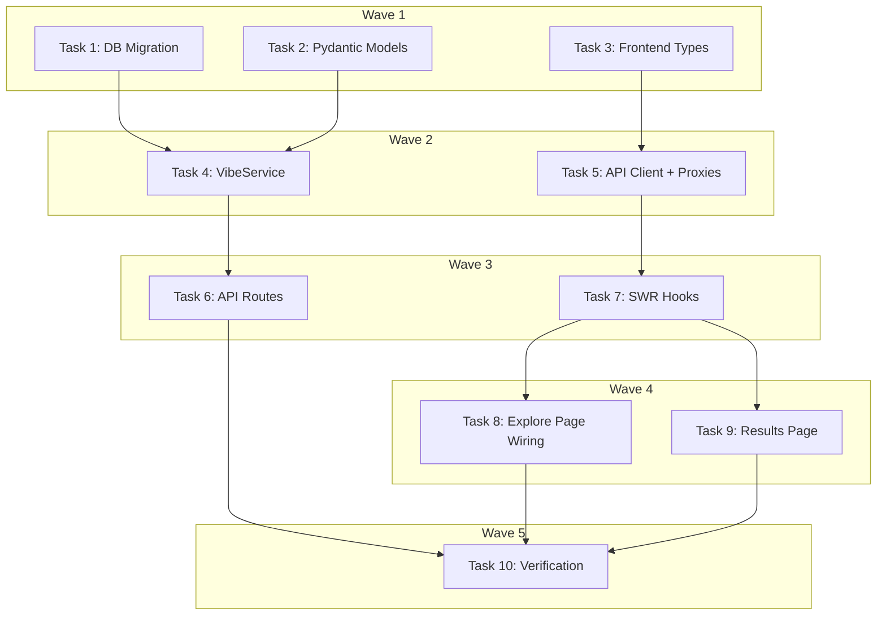

# Vibe Tags Implementation Plan

> **For Claude:** REQUIRED SUB-SKILL: Use executing-plans to implement this plan task-by-task.

**Design Doc:** [docs/designs/2026-03-17-vibe-tags-design.md](docs/designs/2026-03-17-vibe-tags-design.md)

**Spec References:** —

**PRD References:** —

**Goal:** Add a "Browse by Vibe" section to the Explore tab — 10 curated tag combinations (e.g. Study Cave, First Date) that show nearby matching shops ranked by tag overlap.

**Architecture:** `vibe_collections` table seeded in migration; VibeService matches shops via two-step `shop_tags` query + Python `Counter` (no RPC); two public API endpoints; client-rendered results page reads location from browser without blocking prompt.

**Tech Stack:** FastAPI + Supabase Python (backend), Next.js 16 App Router + SWR + Tailwind (frontend), pytest (backend tests), Vitest + Testing Library (frontend tests).

**Acceptance Criteria:**
- [ ] A user on the Explore page sees a "Browse by Vibe" grid with 6 vibe cards (emoji + name + subtitle)
- [ ] Tapping a vibe card navigates to `/explore/vibes/[slug]` and shows a list of matching shops
- [ ] Shops are sorted by tag overlap score; distance badges appear if location was already granted
- [ ] Tapping a shop navigates to its shop detail page
- [ ] An unknown vibe slug returns a 404, not a 500

---

## Task 1: DB Migration — vibe_collections table + seed

**Files:**
- Create: `supabase/migrations/20260317000002_vibe_collections.sql`

**No test needed** — migration DDL; correctness verified by `supabase db push` output.

**Step 1: Create the migration file**

```sql
-- supabase/migrations/20260317000002_vibe_collections.sql
-- Vibe Collections: curated editorial presets combining existing taxonomy tags.
-- Read-only public table — no RLS required.

CREATE TABLE IF NOT EXISTS public.vibe_collections (
  id          UUID PRIMARY KEY DEFAULT gen_random_uuid(),
  slug        TEXT UNIQUE NOT NULL,
  name        TEXT NOT NULL,
  name_zh     TEXT NOT NULL,
  emoji       TEXT,
  subtitle    TEXT,
  subtitle_zh TEXT,
  tag_ids     TEXT[] NOT NULL,
  sort_order  INT  NOT NULL DEFAULT 0,
  is_active   BOOLEAN NOT NULL DEFAULT true
);

CREATE INDEX IF NOT EXISTS idx_vibe_collections_active
  ON public.vibe_collections (sort_order)
  WHERE is_active = true;

-- Seed: 10 curated vibes built from existing taxonomy tag IDs
INSERT INTO public.vibe_collections
  (slug, name, name_zh, emoji, subtitle, subtitle_zh, tag_ids, sort_order)
VALUES
  ('study-cave',     'Study Cave',     '讀書洞穴', '📚', 'Quiet · WiFi',          '安靜 · 有網路',    ARRAY['quiet','laptop_friendly','wifi_available','no_time_limit'], 1),
  ('first-date',     'First Date',     '約會聖地', '💕', 'Cozy · Pretty',          '舒適 · 好拍',      ARRAY['cozy','photogenic','soft_lighting','small_intimate'],       2),
  ('deep-work',      'Deep Work',      '專注工作', '⚡', 'Focus · Power',          '專注 · 插座',      ARRAY['laptop_friendly','power_outlets','no_time_limit','quiet'],  3),
  ('espresso-nerd',  'Espresso Nerd',  '咖啡控',   '☕', 'Single-origin · Craft',  '單品 · 職人',      ARRAY['specialty_coffee_focused','self_roasted','pour_over','espresso_focused'], 4),
  ('hidden-gem',     'Hidden Gem',     '隱藏版',   '💎', 'Off the map · Indie',    '低調 · 獨立',      ARRAY['hidden_gem','alley_cafe','wenqing'],                        5),
  ('weekend-brunch', 'Weekend Brunch', '週末早午餐','🍳', 'Lazy · Social',          '悠閒 · 熱鬧',      ARRAY['food_menu','brunch_hours','lively','weekend_only'],         6),
  ('late-night-owl', 'Late Night Owl', '夜貓基地', '🌙', 'Open late · Vibe',       '深夜 · 氣氛',      ARRAY['late_night','open_evenings','good_music','lively'],         7),
  ('cat-cafe',       'Cat Café',       '貓咪咖啡', '🐱', 'Cats · Cozy',            '貓貓 · 舒適',      ARRAY['has_cats','store_cat','cozy'],                              8),
  ('slow-morning',   'Slow Morning',   '慢慢來',   '🌅', 'Early · Quiet',          '早起 · 安靜',      ARRAY['early_bird','slow_morning','quiet','soft_lighting'],        9),
  ('digital-nomad',  'Digital Nomad',  '遊牧工作者','💻', 'Plugged in · All day',   '插座 · 全天',      ARRAY['laptop_friendly','power_outlets','wifi_available','all_day','no_time_limit'], 10);
```

**Step 2: Apply migration locally**

```bash
supabase db push
```

Expected: each migration logged, no errors. Confirm with:
```bash
supabase db diff
```
Expected output: "No schema changes found."

**Step 3: Commit**

```bash
git add supabase/migrations/20260317000002_vibe_collections.sql
git commit -m "feat: add vibe_collections migration with 10 seed vibes"
```

---

## Task 2: Backend Pydantic models

**Files:**
- Modify: `backend/models/types.py` (append new models at end of file)

**No separate test needed** — models are validated implicitly by all service and API tests that follow.

**Step 1: Append models to types.py**

```python
# Add after TarotCard class in backend/models/types.py

class VibeCollection(CamelModel):
    id: str
    slug: str
    name: str
    name_zh: str
    emoji: str | None = None
    subtitle: str | None = None
    subtitle_zh: str | None = None
    tag_ids: list[str]
    sort_order: int


class VibeShopResult(CamelModel):
    shop_id: str
    name: str
    slug: str | None = None
    rating: float | None = None
    review_count: int = 0
    cover_photo_url: str | None = None
    distance_km: float | None = None
    overlap_score: float
    matched_tag_labels: list[str] = []


class VibeShopsResponse(CamelModel):
    vibe: VibeCollection
    shops: list[VibeShopResult]
    total_count: int
```

**Step 2: Commit**

```bash
git add backend/models/types.py
git commit -m "feat: add VibeCollection, VibeShopResult, VibeShopsResponse models"
```

---

## Task 3: Frontend TypeScript types

**Files:**
- Create: `types/vibes.ts`

**No separate test needed** — types are verified by TypeScript compiler in later tasks.

**Step 1: Create types file**

```typescript
// types/vibes.ts

export interface VibeCollection {
  id: string;
  slug: string;
  name: string;
  nameZh: string;
  emoji: string | null;
  subtitle: string | null;
  subtitleZh: string | null;
  tagIds: string[];
  sortOrder: number;
}

export interface VibeShopResult {
  shopId: string;
  name: string;
  slug: string | null;
  rating: number | null;
  reviewCount: number;
  coverPhotoUrl: string | null;
  distanceKm: number | null;
  overlapScore: number;
  matchedTagLabels: string[];
}

export interface VibeShopsResponse {
  vibe: VibeCollection;
  shops: VibeShopResult[];
  totalCount: number;
}
```

**Step 2: Commit**

```bash
git add types/vibes.ts
git commit -m "feat: add VibeCollection, VibeShopResult TypeScript types"
```

---

## Task 4: VibeService with TDD

**Files:**
- Create: `backend/services/vibe_service.py`
- Create: `backend/tests/services/test_vibe_service.py`
- Modify: `backend/tests/factories.py` (add `make_vibe_row`, `make_shop_tag_row`)

**Step 1: Add factories**

Add to `backend/tests/factories.py`:

```python
def make_vibe_row(**overrides: object) -> dict:
    """A vibe_collections row."""
    defaults = {
        "id": "vibe-study-cave",
        "slug": "study-cave",
        "name": "Study Cave",
        "name_zh": "讀書洞穴",
        "emoji": "📚",
        "subtitle": "Quiet · WiFi",
        "subtitle_zh": "安靜 · 有網路",
        "tag_ids": ["quiet", "laptop_friendly", "wifi_available", "no_time_limit"],
        "sort_order": 1,
        "is_active": True,
    }
    return {**defaults, **overrides}


def make_shop_tag_row(shop_id: str = "shop-d4e5f6", tag_id: str = "quiet") -> dict:
    """A shop_tags join row."""
    return {"shop_id": shop_id, "tag_id": tag_id}
```

**Step 2: Write failing tests**

```python
# backend/tests/services/test_vibe_service.py
from unittest.mock import MagicMock

from services.vibe_service import VibeService
from tests.factories import make_vibe_row, make_shop_tag_row, make_tarot_shop_row


def _make_db_mock_for_vibes(
    vibe_rows: list[dict],
    tag_rows: list[dict],
    shop_rows: list[dict],
) -> MagicMock:
    """Mock that sequences calls: first to vibe_collections, then shop_tags, then shops."""
    mock = MagicMock()
    mock.table.return_value = mock
    mock.select.return_value = mock
    mock.eq.return_value = mock
    mock.in_.return_value = mock
    mock.order.return_value = mock
    mock.gte.return_value = mock
    mock.lte.return_value = mock
    mock.limit.return_value = mock

    # Sequence .execute() calls in order: vibes → tags → shops
    execute_mock = MagicMock()
    execute_mock.side_effect = [
        MagicMock(data=vibe_rows),   # 1st call: vibe_collections query
        MagicMock(data=tag_rows),    # 2nd call: shop_tags query
        MagicMock(data=shop_rows),   # 3rd call: shops query
    ]
    mock.execute = execute_mock
    return mock


class TestVibeServiceGetVibes:
    """Given the vibes endpoint is called, return all active vibe collections in order."""

    def test_returns_active_vibes_ordered_by_sort_order(self):
        rows = [
            make_vibe_row(slug="study-cave", sort_order=1),
            make_vibe_row(slug="first-date", sort_order=2),
        ]
        mock = MagicMock()
        mock.table.return_value = mock
        mock.select.return_value = mock
        mock.eq.return_value = mock
        mock.order.return_value = mock
        mock.execute.return_value = MagicMock(data=rows)

        service = VibeService(mock)
        result = service.get_vibes()

        assert len(result) == 2
        assert result[0].slug == "study-cave"
        assert result[1].slug == "first-date"

    def test_returns_empty_list_when_no_vibes(self):
        mock = MagicMock()
        mock.table.return_value = mock
        mock.select.return_value = mock
        mock.eq.return_value = mock
        mock.order.return_value = mock
        mock.execute.return_value = MagicMock(data=[])

        service = VibeService(mock)
        result = service.get_vibes()
        assert result == []


class TestVibeServiceGetShopsForVibe:
    """Given a vibe slug and optional location, return matching shops ranked by tag overlap."""

    def test_returns_shops_with_overlap_score(self):
        vibe = make_vibe_row(
            tag_ids=["quiet", "laptop_friendly", "wifi_available", "no_time_limit"]
        )
        # Shop has 3 of the 4 vibe tags
        tag_rows = [
            make_shop_tag_row("shop-a", "quiet"),
            make_shop_tag_row("shop-a", "laptop_friendly"),
            make_shop_tag_row("shop-a", "wifi_available"),
        ]
        shop_rows = [
            {**make_tarot_shop_row(id="shop-a"), "shop_photos": []},
        ]
        db = _make_db_mock_for_vibes([vibe], tag_rows, shop_rows)

        service = VibeService(db)
        result = service.get_shops_for_vibe("study-cave")

        assert len(result.shops) == 1
        assert result.shops[0].shop_id == "shop-a"
        assert result.shops[0].overlap_score == pytest.approx(3 / 4)

    def test_excludes_shops_with_zero_overlap(self):
        vibe = make_vibe_row(tag_ids=["quiet", "laptop_friendly"])
        # No shops match any vibe tag
        db = _make_db_mock_for_vibes([vibe], [], [])

        service = VibeService(db)
        result = service.get_shops_for_vibe("study-cave")
        assert result.shops == []

    def test_sorts_by_overlap_score_descending(self):
        vibe = make_vibe_row(tag_ids=["quiet", "laptop_friendly", "wifi_available"])
        tag_rows = [
            make_shop_tag_row("shop-a", "quiet"),
            make_shop_tag_row("shop-a", "laptop_friendly"),
            make_shop_tag_row("shop-a", "wifi_available"),
            make_shop_tag_row("shop-b", "quiet"),
        ]
        shop_rows = [
            {**make_tarot_shop_row(id="shop-a"), "shop_photos": []},
            {**make_tarot_shop_row(id="shop-b"), "shop_photos": []},
        ]
        db = _make_db_mock_for_vibes([vibe], tag_rows, shop_rows)

        service = VibeService(db)
        result = service.get_shops_for_vibe("study-cave")

        assert result.shops[0].shop_id == "shop-a"
        assert result.shops[0].overlap_score > result.shops[1].overlap_score

    def test_raises_404_for_unknown_slug(self):
        import pytest
        from fastapi import HTTPException

        mock = MagicMock()
        mock.table.return_value = mock
        mock.select.return_value = mock
        mock.eq.return_value = mock
        mock.order.return_value = mock
        mock.execute.return_value = MagicMock(data=[])

        service = VibeService(mock)
        with pytest.raises(HTTPException) as exc_info:
            service.get_shops_for_vibe("nonexistent-slug")
        assert exc_info.value.status_code == 404

    def test_adds_distance_km_when_lat_lng_provided(self):
        vibe = make_vibe_row(tag_ids=["quiet"])
        tag_rows = [make_shop_tag_row("shop-a", "quiet")]
        shop_rows = [{**make_tarot_shop_row(id="shop-a"), "shop_photos": []}]
        db = _make_db_mock_for_vibes([vibe], tag_rows, shop_rows)

        service = VibeService(db)
        result = service.get_shops_for_vibe("study-cave", lat=25.033, lng=121.543)

        assert result.shops[0].distance_km is not None
        assert result.shops[0].distance_km >= 0

    def test_distance_km_is_none_without_geo_params(self):
        vibe = make_vibe_row(tag_ids=["quiet"])
        tag_rows = [make_shop_tag_row("shop-a", "quiet")]
        shop_rows = [{**make_tarot_shop_row(id="shop-a"), "shop_photos": []}]
        db = _make_db_mock_for_vibes([vibe], tag_rows, shop_rows)

        service = VibeService(db)
        result = service.get_shops_for_vibe("study-cave")

        assert result.shops[0].distance_km is None

    def test_excludes_shops_with_null_coords_when_geo_active(self):
        vibe = make_vibe_row(tag_ids=["quiet"])
        tag_rows = [make_shop_tag_row("shop-a", "quiet")]
        # shop with null lat/lng — should be filtered before shop query via PostgREST
        shop_rows = []  # geo filter would exclude this shop
        db = _make_db_mock_for_vibes([vibe], tag_rows, shop_rows)

        service = VibeService(db)
        result = service.get_shops_for_vibe("study-cave", lat=25.033, lng=121.543)
        assert result.shops == []

    def test_total_count_matches_shops_length(self):
        vibe = make_vibe_row(tag_ids=["quiet"])
        tag_rows = [make_shop_tag_row("shop-a", "quiet")]
        shop_rows = [{**make_tarot_shop_row(id="shop-a"), "shop_photos": []}]
        db = _make_db_mock_for_vibes([vibe], tag_rows, shop_rows)

        service = VibeService(db)
        result = service.get_shops_for_vibe("study-cave")
        assert result.total_count == len(result.shops)
```

**Step 3: Run tests to verify they fail**

```bash
cd backend && uv run pytest tests/services/test_vibe_service.py -v
```
Expected: `ModuleNotFoundError: No module named 'services.vibe_service'`

**Step 4: Implement VibeService**

```python
# backend/services/vibe_service.py
import asyncio
import math
from collections import Counter
from typing import Any, cast

from fastapi import HTTPException
from supabase import Client

from models.types import VibeCollection, VibeShopResult, VibeShopsResponse

_EARTH_RADIUS_KM = 6371.0


def _haversine(lat1: float, lng1: float, lat2: float, lng2: float) -> float:
    lat1, lng1, lat2, lng2 = map(math.radians, [lat1, lng1, lat2, lng2])
    dlat = lat2 - lat1
    dlng = lng2 - lng1
    a = math.sin(dlat / 2) ** 2 + math.cos(lat1) * math.cos(lat2) * math.sin(dlng / 2) ** 2
    return _EARTH_RADIUS_KM * 2 * math.asin(math.sqrt(a))


class VibeService:
    def __init__(self, db: Client):
        self._db = db

    def get_vibes(self) -> list[VibeCollection]:
        """Return all active vibe collections ordered by sort_order."""
        def _query() -> list[dict[str, Any]]:
            response = (
                self._db.table("vibe_collections")
                .select("id, slug, name, name_zh, emoji, subtitle, subtitle_zh, tag_ids, sort_order")
                .eq("is_active", True)
                .order("sort_order")
                .execute()
            )
            return cast("list[dict[str, Any]]", response.data or [])

        rows = _query()
        return [VibeCollection(**row) for row in rows]

    def get_shops_for_vibe(
        self,
        slug: str,
        lat: float | None = None,
        lng: float | None = None,
        radius_km: float = 5.0,
    ) -> VibeShopsResponse:
        """Return shops matching a vibe, ranked by tag overlap score."""
        vibe = self._fetch_vibe(slug)
        shop_ids_with_counts = self._fetch_matching_shop_ids(vibe.tag_ids)

        if not shop_ids_with_counts:
            return VibeShopsResponse(vibe=vibe, shops=[], total_count=0)

        shop_rows = self._fetch_shop_details(
            list(shop_ids_with_counts.keys()), lat, lng, radius_km
        )

        total_tags = len(vibe.tag_ids)
        results: list[VibeShopResult] = []
        for row in shop_rows:
            shop_id = row["id"]
            match_count = shop_ids_with_counts.get(shop_id, 0)
            if match_count == 0:
                continue

            photos = row.get("shop_photos") or []
            first_photo = next(iter(photos), None)
            cover = first_photo["url"] if first_photo else None

            distance_km: float | None = None
            if lat is not None and lng is not None and row.get("latitude") and row.get("longitude"):
                distance_km = round(
                    _haversine(lat, lng, row["latitude"], row["longitude"]), 1
                )

            results.append(
                VibeShopResult(
                    shop_id=shop_id,
                    name=row["name"],
                    slug=row.get("slug"),
                    rating=float(row["rating"]) if row.get("rating") else None,
                    review_count=row.get("review_count") or 0,
                    cover_photo_url=cover,
                    distance_km=distance_km,
                    overlap_score=round(match_count / total_tags, 4),
                    matched_tag_labels=[],
                )
            )

        results.sort(key=lambda r: (-r.overlap_score, -(r.rating or 0)))
        return VibeShopsResponse(vibe=vibe, shops=results[:50], total_count=len(results))

    def _fetch_vibe(self, slug: str) -> VibeCollection:
        def _query() -> list[dict[str, Any]]:
            response = (
                self._db.table("vibe_collections")
                .select("id, slug, name, name_zh, emoji, subtitle, subtitle_zh, tag_ids, sort_order")
                .eq("slug", slug)
                .eq("is_active", True)
                .execute()
            )
            return cast("list[dict[str, Any]]", response.data or [])

        rows = _query()
        if not rows:
            raise HTTPException(status_code=404, detail=f"Vibe '{slug}' not found")
        return VibeCollection(**rows[0])

    def _fetch_matching_shop_ids(self, tag_ids: list[str]) -> Counter:
        """Return Counter mapping shop_id → number of matching tags."""
        def _query() -> list[dict[str, Any]]:
            response = (
                self._db.table("shop_tags")
                .select("shop_id")
                .in_("tag_id", tag_ids)
                .execute()
            )
            return cast("list[dict[str, Any]]", response.data or [])

        rows = _query()
        return Counter(row["shop_id"] for row in rows)

    def _fetch_shop_details(
        self,
        shop_ids: list[str],
        lat: float | None,
        lng: float | None,
        radius_km: float,
    ) -> list[dict[str, Any]]:
        def _query() -> list[dict[str, Any]]:
            q = (
                self._db.table("shops")
                .select("id, name, slug, latitude, longitude, rating, review_count, processing_status, shop_photos(url)")
                .eq("processing_status", "live")
                .in_("id", shop_ids)
            )
            if lat is not None and lng is not None:
                lat_delta = radius_km / 111.0
                lng_delta = radius_km / (111.0 * math.cos(math.radians(lat)))
                q = (
                    q
                    .not_("latitude", "is", "null")
                    .gte("latitude", lat - lat_delta)
                    .lte("latitude", lat + lat_delta)
                    .gte("longitude", lng - lng_delta)
                    .lte("longitude", lng + lng_delta)
                )
            return cast("list[dict[str, Any]]", q.limit(200).execute().data or [])

        return _query()
```

**Step 5: Run tests to verify they pass**

```bash
cd backend && uv run pytest tests/services/test_vibe_service.py -v
```
Expected: all 8 tests PASS.

**Step 6: Lint + type check**

```bash
cd backend && uv run ruff check services/vibe_service.py && uv run mypy services/vibe_service.py
```
Expected: no errors.

**Step 7: Commit**

```bash
git add backend/services/vibe_service.py backend/tests/services/test_vibe_service.py backend/tests/factories.py
git commit -m "feat: add VibeService with overlap scoring and geo filtering (TDD)"
```

---

## Task 5: Frontend API client + Next.js proxy routes

**Files:**
- Create: `lib/api/vibes.ts`
- Create: `app/api/explore/vibes/route.ts`
- Create: `app/api/explore/vibes/[slug]/shops/route.ts`

**No separate test needed** — proxy routes follow the identical one-liner pattern already established. `lib/api/vibes.ts` is tested implicitly by the hook tests.

**Step 1: Create API client**

```typescript
// lib/api/vibes.ts
import { fetchPublic } from '@/lib/api/fetch';
import type { VibeCollection, VibeShopsResponse } from '@/types/vibes';

export async function fetchVibes(): Promise<VibeCollection[]> {
  return fetchPublic<VibeCollection[]>('/api/explore/vibes');
}

export function buildVibeShopsUrl(
  slug: string,
  lat?: number | null,
  lng?: number | null,
  radiusKm = 5
): string {
  const params = new URLSearchParams();
  if (lat != null) params.set('lat', String(lat));
  if (lng != null) params.set('lng', String(lng));
  params.set('radius_km', String(radiusKm));
  return `/api/explore/vibes/${slug}/shops?${params}`;
}

export async function fetchVibeShops(
  slug: string,
  lat?: number | null,
  lng?: number | null
): Promise<VibeShopsResponse> {
  return fetchPublic<VibeShopsResponse>(buildVibeShopsUrl(slug, lat, lng));
}
```

**Step 2: Create proxy routes**

```typescript
// app/api/explore/vibes/route.ts
import { NextRequest } from 'next/server';
import { proxyToBackend } from '@/lib/api/proxy';

export async function GET(request: NextRequest) {
  return proxyToBackend(request, '/explore/vibes');
}
```

```typescript
// app/api/explore/vibes/[slug]/shops/route.ts
import { NextRequest } from 'next/server';
import { proxyToBackend } from '@/lib/api/proxy';

export async function GET(
  request: NextRequest,
  { params }: { params: Promise<{ slug: string }> }
) {
  const { slug } = await params;
  return proxyToBackend(request, `/explore/vibes/${slug}/shops`);
}
```

**Step 3: Type-check**

```bash
pnpm type-check
```
Expected: no errors.

**Step 4: Commit**

```bash
git add lib/api/vibes.ts app/api/explore/vibes/route.ts "app/api/explore/vibes/[slug]/shops/route.ts"
git commit -m "feat: add vibes API client and Next.js proxy routes"
```

---

## Task 6: Backend API routes + route tests

**Files:**
- Modify: `backend/api/explore.py`
- Modify: `backend/tests/api/test_explore.py`

**Step 1: Write failing route tests**

Add to `backend/tests/api/test_explore.py`:

```python
from unittest.mock import MagicMock, patch
from fastapi import HTTPException
from models.types import VibeCollection, VibeShopResult, VibeShopsResponse

MOCK_VIBES = [
    VibeCollection(
        id="vibe-1",
        slug="study-cave",
        name="Study Cave",
        name_zh="讀書洞穴",
        emoji="📚",
        subtitle="Quiet · WiFi",
        subtitle_zh="安靜 · 有網路",
        tag_ids=["quiet", "laptop_friendly"],
        sort_order=1,
    )
]

MOCK_VIBE_SHOPS_RESPONSE = VibeShopsResponse(
    vibe=MOCK_VIBES[0],
    shops=[
        VibeShopResult(
            shop_id="shop-a",
            name="森日咖啡",
            slug="sen-ri",
            rating=4.5,
            review_count=120,
            cover_photo_url=None,
            distance_km=None,
            overlap_score=0.75,
            matched_tag_labels=[],
        )
    ],
    total_count=1,
)


class TestVibesListEndpoint:
    """GET /explore/vibes returns all active vibe collections."""

    def test_returns_200_with_vibes_list(self):
        with patch("api.explore.VibeService") as mock_svc:
            mock_svc.return_value.get_vibes.return_value = MOCK_VIBES
            response = client.get("/explore/vibes")
        assert response.status_code == 200
        data = response.json()
        assert len(data) == 1
        assert data[0]["slug"] == "study-cave"
        assert data[0]["nameZh"] == "讀書洞穴"

    def test_is_public_no_auth_required(self):
        with patch("api.explore.VibeService") as mock_svc:
            mock_svc.return_value.get_vibes.return_value = []
            response = client.get("/explore/vibes")
        assert response.status_code == 200

    def test_returns_empty_list_when_no_vibes(self):
        with patch("api.explore.VibeService") as mock_svc:
            mock_svc.return_value.get_vibes.return_value = []
            response = client.get("/explore/vibes")
        assert response.json() == []


class TestVibeShopsEndpoint:
    """GET /explore/vibes/{slug}/shops returns shops matching a vibe."""

    def test_returns_200_with_shops(self):
        with patch("api.explore.VibeService") as mock_svc:
            mock_svc.return_value.get_shops_for_vibe.return_value = MOCK_VIBE_SHOPS_RESPONSE
            response = client.get("/explore/vibes/study-cave/shops")
        assert response.status_code == 200
        data = response.json()
        assert data["totalCount"] == 1
        assert data["shops"][0]["shopId"] == "shop-a"
        assert data["vibe"]["slug"] == "study-cave"

    def test_returns_404_for_unknown_slug(self):
        with patch("api.explore.VibeService") as mock_svc:
            mock_svc.return_value.get_shops_for_vibe.side_effect = HTTPException(
                status_code=404, detail="Vibe 'unknown' not found"
            )
            response = client.get("/explore/vibes/unknown/shops")
        assert response.status_code == 404

    def test_accepts_optional_geo_params(self):
        with patch("api.explore.VibeService") as mock_svc:
            mock_svc.return_value.get_shops_for_vibe.return_value = MOCK_VIBE_SHOPS_RESPONSE
            response = client.get(
                "/explore/vibes/study-cave/shops?lat=25.033&lng=121.543&radius_km=3"
            )
        assert response.status_code == 200
        call_kwargs = mock_svc.return_value.get_shops_for_vibe.call_args.kwargs
        assert call_kwargs["lat"] == 25.033
        assert call_kwargs["lng"] == 121.543
        assert call_kwargs["radius_km"] == 3.0

    def test_works_without_geo_params(self):
        with patch("api.explore.VibeService") as mock_svc:
            mock_svc.return_value.get_shops_for_vibe.return_value = MOCK_VIBE_SHOPS_RESPONSE
            response = client.get("/explore/vibes/study-cave/shops")
        assert response.status_code == 200
        call_kwargs = mock_svc.return_value.get_shops_for_vibe.call_args.kwargs
        assert call_kwargs["lat"] is None
        assert call_kwargs["lng"] is None
```

**Step 2: Run tests to verify they fail**

```bash
cd backend && uv run pytest tests/api/test_explore.py::TestVibesListEndpoint tests/api/test_explore.py::TestVibeShopsEndpoint -v
```
Expected: FAIL — routes don't exist yet.

**Step 3: Add routes to explore.py**

```python
# Add to backend/api/explore.py (after existing imports and tarot route)

from services.vibe_service import VibeService

@router.get("/vibes")
def list_vibes() -> list[dict]:
    """Return all active vibe collections. Public — no auth required."""
    db = get_anon_client()
    service = VibeService(db)
    vibes = service.get_vibes()
    return [v.model_dump(by_alias=True) for v in vibes]


@router.get("/vibes/{slug}/shops")
def vibe_shops(
    slug: str,
    lat: float | None = Query(default=None, ge=-90.0, le=90.0),
    lng: float | None = Query(default=None, ge=-180.0, le=180.0),
    radius_km: float = Query(default=5.0, ge=0.5, le=20.0),
) -> dict:
    """Return shops matching a vibe, ranked by tag overlap. Public — no auth required."""
    db = get_anon_client()
    service = VibeService(db)
    result = service.get_shops_for_vibe(slug=slug, lat=lat, lng=lng, radius_km=radius_km)
    return result.model_dump(by_alias=True)
```

**Step 4: Run tests to verify they pass**

```bash
cd backend && uv run pytest tests/api/test_explore.py -v
```
Expected: all tests PASS (new + pre-existing Tarot tests).

**Step 5: Full backend verification**

```bash
cd backend && uv run pytest && uv run ruff check . && uv run mypy .
```
Expected: all pass.

**Step 6: Commit**

```bash
git add backend/api/explore.py backend/tests/api/test_explore.py
git commit -m "feat: add GET /explore/vibes and GET /explore/vibes/{slug}/shops endpoints (TDD)"
```

---

## Task 7: useVibes + useVibeShops hooks with TDD

**Files:**
- Create: `lib/hooks/use-vibes.ts`
- Create: `lib/hooks/use-vibes.test.ts`
- Create: `lib/hooks/use-vibe-shops.ts`
- Create: `lib/hooks/use-vibe-shops.test.ts`

**Step 1: Write failing tests for useVibes**

```typescript
// lib/hooks/use-vibes.test.ts
import { describe, it, expect, vi, beforeEach } from 'vitest';
import { renderHook, waitFor } from '@testing-library/react';
import { useVibes } from './use-vibes';

vi.mock('swr', () => ({ default: vi.fn() }));
import useSWR from 'swr';
const mockUseSWR = vi.mocked(useSWR);

function swrReturning(data: unknown, extra?: object) {
  return { data, error: undefined, isLoading: false, mutate: vi.fn(), ...extra } as any;
}

describe('useVibes', () => {
  beforeEach(() => vi.clearAllMocks());

  it('returns empty array while loading', () => {
    mockUseSWR.mockReturnValue(swrReturning(undefined, { isLoading: true }));
    const { result } = renderHook(() => useVibes());
    expect(result.current.vibes).toEqual([]);
    expect(result.current.isLoading).toBe(true);
  });

  it('returns vibes from a successful fetch', () => {
    const mockVibes = [{ slug: 'study-cave', name: 'Study Cave' }];
    mockUseSWR.mockReturnValue(swrReturning(mockVibes));
    const { result } = renderHook(() => useVibes());
    expect(result.current.vibes).toEqual(mockVibes);
  });

  it('surfaces an error when the fetch fails', () => {
    const fetchError = new Error('Network error');
    mockUseSWR.mockReturnValue(swrReturning(undefined, { error: fetchError }));
    const { result } = renderHook(() => useVibes());
    expect(result.current.error).toBe(fetchError);
  });
});
```

**Step 2: Write failing tests for useVibeShops**

```typescript
// lib/hooks/use-vibe-shops.test.ts
import { describe, it, expect, vi, beforeEach } from 'vitest';
import { renderHook } from '@testing-library/react';
import { useVibeShops } from './use-vibe-shops';

vi.mock('swr', () => ({ default: vi.fn() }));
import useSWR from 'swr';
const mockUseSWR = vi.mocked(useSWR);

function swrReturning(data: unknown, extra?: object) {
  return { data, error: undefined, isLoading: false, mutate: vi.fn(), ...extra } as any;
}

describe('useVibeShops', () => {
  beforeEach(() => vi.clearAllMocks());

  it('returns null response while loading', () => {
    mockUseSWR.mockReturnValue(swrReturning(undefined, { isLoading: true }));
    const { result } = renderHook(() => useVibeShops('study-cave'));
    expect(result.current.response).toBeUndefined();
    expect(result.current.isLoading).toBe(true);
  });

  it('returns shop results on success', () => {
    const mockResponse = { vibe: { slug: 'study-cave' }, shops: [{ shopId: 'shop-a' }], totalCount: 1 };
    mockUseSWR.mockReturnValue(swrReturning(mockResponse));
    const { result } = renderHook(() => useVibeShops('study-cave'));
    expect(result.current.response?.shops).toHaveLength(1);
  });

  it('includes lat/lng in the SWR key when geo is provided', () => {
    mockUseSWR.mockReturnValue(swrReturning(undefined));
    renderHook(() => useVibeShops('study-cave', 25.033, 121.543));
    const key = mockUseSWR.mock.calls[0][0] as string;
    expect(key).toContain('lat=25.033');
    expect(key).toContain('lng=121.543');
  });

  it('omits lat/lng from key when geo is unavailable', () => {
    mockUseSWR.mockReturnValue(swrReturning(undefined));
    renderHook(() => useVibeShops('study-cave', null, null));
    const key = mockUseSWR.mock.calls[0][0] as string;
    expect(key).not.toContain('lat=');
    expect(key).not.toContain('lng=');
  });

  it('surfaces an error when the fetch fails', () => {
    const fetchError = new Error('500');
    mockUseSWR.mockReturnValue(swrReturning(undefined, { error: fetchError }));
    const { result } = renderHook(() => useVibeShops('study-cave'));
    expect(result.current.error).toBe(fetchError);
  });
});
```

**Step 3: Run tests to verify they fail**

```bash
pnpm test -- lib/hooks/use-vibes.test.ts lib/hooks/use-vibe-shops.test.ts
```
Expected: `Cannot find module './use-vibes'`

**Step 4: Implement hooks**

```typescript
// lib/hooks/use-vibes.ts
'use client';

import useSWR from 'swr';
import { fetchPublic } from '@/lib/api/fetch';
import type { VibeCollection } from '@/types/vibes';

export function useVibes() {
  const { data, error, isLoading } = useSWR<VibeCollection[]>(
    '/api/explore/vibes',
    fetchPublic,
    { revalidateOnFocus: false }
  );

  return {
    vibes: data ?? [],
    isLoading,
    error,
  };
}
```

```typescript
// lib/hooks/use-vibe-shops.ts
'use client';

import useSWR from 'swr';
import { fetchPublic } from '@/lib/api/fetch';
import { buildVibeShopsUrl } from '@/lib/api/vibes';
import type { VibeShopsResponse } from '@/types/vibes';

export function useVibeShops(
  slug: string,
  lat: number | null = null,
  lng: number | null = null,
  radiusKm = 5
) {
  const key = buildVibeShopsUrl(slug, lat, lng, radiusKm);

  const { data, error, isLoading } = useSWR<VibeShopsResponse>(
    key,
    fetchPublic,
    { revalidateOnFocus: false }
  );

  return {
    response: data,
    isLoading,
    error,
  };
}
```

**Step 5: Run tests to verify they pass**

```bash
pnpm test -- lib/hooks/use-vibes.test.ts lib/hooks/use-vibe-shops.test.ts
```
Expected: all 8 tests PASS.

**Step 6: Commit**

```bash
git add lib/hooks/use-vibes.ts lib/hooks/use-vibes.test.ts lib/hooks/use-vibe-shops.ts lib/hooks/use-vibe-shops.test.ts
git commit -m "feat: add useVibes and useVibeShops SWR hooks (TDD)"
```

---

## Task 8: Explore page — wire vibe strip section

**Files:**
- Modify: `app/explore/page.tsx`

**Step 1: Write failing test**

```typescript
// app/explore/page.test.tsx — add to existing test file (or create if absent)
// Pattern: mock at SWR boundary (same as tarot tests)

import { describe, it, expect, vi, beforeEach } from 'vitest';
import { render, screen } from '@testing-library/react';
import ExplorePage from './page';

vi.mock('swr', () => ({ default: vi.fn() }));
vi.mock('@/lib/hooks/use-geolocation', () => ({
  useGeolocation: () => ({ latitude: null, longitude: null, error: null, loading: false, requestLocation: vi.fn() }),
}));
vi.mock('@/lib/hooks/use-tarot-draw', () => ({
  useTarotDraw: () => ({ cards: [], isLoading: false, error: null, redraw: vi.fn(), setRadiusKm: vi.fn() }),
}));
vi.mock('@/lib/posthog/use-analytics', () => ({
  useAnalytics: () => ({ capture: vi.fn() }),
}));
vi.mock('@/lib/hooks/use-vibes', () => ({
  useVibes: () => ({
    vibes: [
      { slug: 'study-cave', name: 'Study Cave', nameZh: '讀書洞穴', emoji: '📚', subtitle: 'Quiet · WiFi' },
      { slug: 'first-date', name: 'First Date', nameZh: '約會聖地', emoji: '💕', subtitle: 'Cozy · Pretty' },
    ],
    isLoading: false,
    error: null,
  }),
}));

describe('ExplorePage', () => {
  it('renders the Browse by Vibe section heading', () => {
    render(<ExplorePage />);
    expect(screen.getByText('Browse by Vibe')).toBeInTheDocument();
  });

  it('renders vibe cards with name and subtitle', () => {
    render(<ExplorePage />);
    expect(screen.getByText('Study Cave')).toBeInTheDocument();
    expect(screen.getByText('Quiet · WiFi')).toBeInTheDocument();
    expect(screen.getByText('First Date')).toBeInTheDocument();
  });
});
```

**Step 2: Run test to verify it fails**

```bash
pnpm test -- app/explore/page.test.tsx
```
Expected: test fails — `Browse by Vibe` not found in DOM.

**Step 3: Update explore page to add vibe section**

In `app/explore/page.tsx`, import the hook and add the vibe section below the tarot section:

```tsx
// Add to imports:
import { useVibes } from '@/lib/hooks/use-vibes';
import Link from 'next/link';

// Add inside ExplorePage, alongside other hooks:
const { vibes } = useVibes();

// Add below the tarot section (before closing </main>):
{vibes.length > 0 && (
  <section className="mt-8">
    <div className="mb-3 flex items-center justify-between">
      <h2
        className="text-lg font-bold text-[#1A1918]"
        style={{ fontFamily: 'var(--font-bricolage), sans-serif' }}
      >
        Browse by Vibe
      </h2>
      <Link
        href="/explore/vibes"
        className="text-sm font-medium text-[#3D8A5A]"
      >
        See all
      </Link>
    </div>
    <div className="grid grid-cols-3 gap-2">
      {vibes.slice(0, 6).map((vibe) => (
        <Link
          key={vibe.slug}
          href={`/explore/vibes/${vibe.slug}`}
          className="flex flex-col gap-1.5 rounded-2xl border border-gray-100 bg-white px-4 py-3"
        >
          <span className="text-xl">{vibe.emoji}</span>
          <span className="text-[13px] font-semibold text-[#1A1918] leading-tight">
            {vibe.name}
          </span>
          <span className="text-[11px] text-gray-400">{vibe.subtitle}</span>
        </Link>
      ))}
    </div>
  </section>
)}
```

**Step 4: Run test to verify it passes**

```bash
pnpm test -- app/explore/page.test.tsx
```
Expected: all tests PASS (new + pre-existing tarot tests).

**Step 5: Commit**

```bash
git add app/explore/page.tsx
git commit -m "feat: wire vibe strip section into Explore page"
```

---

## Task 9: /explore/vibes/[slug] results page

**Files:**
- Create: `app/explore/vibes/[slug]/page.tsx`
- Create: `app/explore/vibes/[slug]/page.test.tsx`

**Step 1: Write failing test**

```typescript
// app/explore/vibes/[slug]/page.test.tsx
import { describe, it, expect, vi, beforeEach } from 'vitest';
import { render, screen } from '@testing-library/react';
import VibePage from './page';

vi.mock('next/navigation', () => ({
  useRouter: () => ({ push: vi.fn(), back: vi.fn() }),
  useParams: () => ({ slug: 'study-cave' }),
}));
vi.mock('@/lib/hooks/use-geolocation', () => ({
  useGeolocation: () => ({ latitude: null, longitude: null, error: null, loading: false, requestLocation: vi.fn() }),
}));
vi.mock('@/lib/hooks/use-vibe-shops', () => ({
  useVibeShops: () => ({
    response: {
      vibe: { slug: 'study-cave', name: 'Study Cave', nameZh: '讀書洞穴', emoji: '📚', subtitle: 'Quiet · WiFi' },
      shops: [
        { shopId: 'shop-a', name: '森日咖啡', slug: 'sen-ri', rating: 4.5, reviewCount: 120, overlapScore: 0.75, distanceKm: null, coverPhotoUrl: null, matchedTagLabels: [] },
      ],
      totalCount: 1,
    },
    isLoading: false,
    error: null,
  }),
}));

describe('VibePage — /explore/vibes/[slug]', () => {
  it('renders the vibe name as page heading', () => {
    render(<VibePage />);
    expect(screen.getByText('Study Cave')).toBeInTheDocument();
  });

  it('shows the shop count', () => {
    render(<VibePage />);
    expect(screen.getByText(/1 shop/)).toBeInTheDocument();
  });

  it('renders a shop row with name and rating', () => {
    render(<VibePage />);
    expect(screen.getByText('森日咖啡')).toBeInTheDocument();
    expect(screen.getByText('4.5')).toBeInTheDocument();
  });

  it('shows loading skeletons while fetching', () => {
    vi.mock('@/lib/hooks/use-vibe-shops', () => ({
      useVibeShops: () => ({ response: undefined, isLoading: true, error: null }),
    }));
    render(<VibePage />);
    // Loading state renders skeleton divs
    const skeletons = document.querySelectorAll('.animate-pulse');
    expect(skeletons.length).toBeGreaterThan(0);
  });

  it('shows empty state when no shops match', () => {
    vi.doMock('@/lib/hooks/use-vibe-shops', () => ({
      useVibeShops: () => ({
        response: { vibe: { name: 'Study Cave', nameZh: '讀書洞穴', emoji: '📚' }, shops: [], totalCount: 0 },
        isLoading: false,
        error: null,
      }),
    }));
    render(<VibePage />);
    expect(screen.getByText(/No shops found/)).toBeInTheDocument();
  });

  it('shows distance badge when distanceKm is present', () => {
    vi.doMock('@/lib/hooks/use-vibe-shops', () => ({
      useVibeShops: () => ({
        response: {
          vibe: { slug: 'study-cave', name: 'Study Cave', nameZh: '讀書洞穴', emoji: '📚' },
          shops: [{ shopId: 'shop-a', name: '森日咖啡', slug: 'sen-ri', rating: 4.5, reviewCount: 10, overlapScore: 0.75, distanceKm: 1.2, coverPhotoUrl: null, matchedTagLabels: [] }],
          totalCount: 1,
        },
        isLoading: false,
        error: null,
      }),
    }));
    render(<VibePage />);
    expect(screen.getByText('1.2 km')).toBeInTheDocument();
  });
});
```

**Step 2: Run test to verify it fails**

```bash
pnpm test -- "app/explore/vibes/\[slug\]/page.test.tsx"
```
Expected: `Cannot find module './page'`

**Step 3: Implement results page**

```tsx
// app/explore/vibes/[slug]/page.tsx
'use client';

import { useEffect } from 'react';
import Link from 'next/link';
import { useRouter, useParams } from 'next/navigation';
import { useGeolocation } from '@/lib/hooks/use-geolocation';
import { useVibeShops } from '@/lib/hooks/use-vibe-shops';

export default function VibePage() {
  const router = useRouter();
  const params = useParams<{ slug: string }>();
  const slug = params.slug;

  const { latitude, longitude, requestLocation } = useGeolocation();

  // Silently request location — no blocking prompt
  useEffect(() => {
    requestLocation();
  }, [requestLocation]);

  const { response, isLoading, error } = useVibeShops(slug, latitude, longitude);

  if (isLoading) {
    return (
      <main className="min-h-screen bg-[#FAF7F4] px-5 pt-6 pb-24">
        <div className="mb-4 h-8 w-40 animate-pulse rounded-lg bg-gray-200" />
        {[0, 1, 2, 4, 5].map((i) => (
          <div key={i} className="mb-3 h-20 animate-pulse rounded-xl bg-gray-200" />
        ))}
      </main>
    );
  }

  if (error || !response) {
    return (
      <main className="min-h-screen bg-[#FAF7F4] px-5 pt-6 pb-24">
        <button
          type="button"
          onClick={() => router.back()}
          className="mb-4 text-sm text-gray-500"
        >
          ← Back
        </button>
        <p className="text-sm text-gray-500">Couldn&apos;t load shops. Please try again.</p>
      </main>
    );
  }

  const { vibe, shops, totalCount } = response;

  return (
    <main className="min-h-screen bg-[#FAF7F4] px-5 pt-6 pb-24">
      <button
        type="button"
        onClick={() => router.back()}
        className="mb-4 text-sm text-gray-500"
      >
        ← Back
      </button>

      <div className="mb-5">
        <div className="flex items-center gap-2">
          {vibe.emoji && <span className="text-2xl">{vibe.emoji}</span>}
          <div>
            <h1
              className="text-xl font-bold text-[#1A1918]"
              style={{ fontFamily: 'var(--font-bricolage), sans-serif' }}
            >
              {vibe.name}
            </h1>
            <p className="text-xs text-gray-400">{vibe.nameZh}</p>
          </div>
        </div>
        <p className="mt-1 text-sm text-gray-500">
          {totalCount} shop{totalCount !== 1 ? 's' : ''} found
        </p>
      </div>

      {shops.length === 0 ? (
        <div className="rounded-xl bg-white/60 px-6 py-10 text-center">
          <p className="text-sm text-gray-500">No shops found for this vibe.</p>
        </div>
      ) : (
        <ul className="flex flex-col gap-3">
          {shops.map((shop) => (
            <li key={shop.shopId}>
              <Link
                href={`/shops/${shop.slug ?? shop.shopId}`}
                className="flex items-center gap-3 rounded-xl bg-white px-4 py-3 shadow-sm"
              >
                {shop.coverPhotoUrl ? (
                  
                ) : (
                  <div className="h-14 w-14 rounded-lg bg-gray-100" />
                )}
                <div className="flex-1 min-w-0">
                  <p className="truncate text-sm font-semibold text-[#1A1918]">
                    {shop.name}
                  </p>
                  <div className="mt-0.5 flex items-center gap-2 text-xs text-gray-400">
                    {shop.rating != null && <span>{shop.rating}</span>}
                    {shop.distanceKm != null && (
                      <span>{shop.distanceKm} km</span>
                    )}
                  </div>
                </div>
              </Link>
            </li>
          ))}
        </ul>
      )}
    </main>
  );
}
```

**Step 4: Run tests to verify they pass**

```bash
pnpm test -- "app/explore/vibes/\[slug\]/page.test.tsx"
```
Expected: all tests PASS.

**Step 5: Commit**

```bash
git add "app/explore/vibes/[slug]/page.tsx" "app/explore/vibes/[slug]/page.test.tsx"
git commit -m "feat: add /explore/vibes/[slug] results page with TDD"
```

---

## Task 10: Full Verification

**Files:** None new — run checks across entire codebase.

**Step 1: Backend full test suite**

```bash
cd backend && uv run pytest -v
```
Expected: all tests pass (no regressions).

**Step 2: Backend lint + type check**

```bash
cd backend && uv run ruff check . && uv run mypy .
```
Expected: no errors.

**Step 3: Frontend full test suite**

```bash
pnpm test
```
Expected: all tests pass.

**Step 4: Frontend lint + type check**

```bash
pnpm lint && pnpm type-check
```
Expected: no errors.

**Step 5: Production build**

```bash
pnpm build
```
Expected: build succeeds with no type errors.

**Step 6: Final commit (if any fixups needed)**

```bash
git add -p  # stage any fixup changes
git commit -m "fix: address lint/type-check issues in vibe tags implementation"
```

---

## Execution Waves



**Wave 1** (parallel — no dependencies):
- Task 1: DB Migration
- Task 2: Pydantic Models
- Task 3: Frontend Types

**Wave 2** (parallel — depends on Wave 1):
- Task 4: VibeService ← Task 1, Task 2
- Task 5: API Client + Proxies ← Task 3

**Wave 3** (parallel — depends on Wave 2):
- Task 6: API Routes ← Task 4
- Task 7: SWR Hooks ← Task 5

**Wave 4** (parallel — depends on Wave 3):
- Task 8: Explore Page Wiring ← Task 7
- Task 9: Results Page ← Task 7

**Wave 5** (sequential — depends on all):
- Task 10: Full Verification

---

## TODO.md Update

After writing this plan, update `TODO.md` under the "Vibe Tags" section with task checkboxes.
