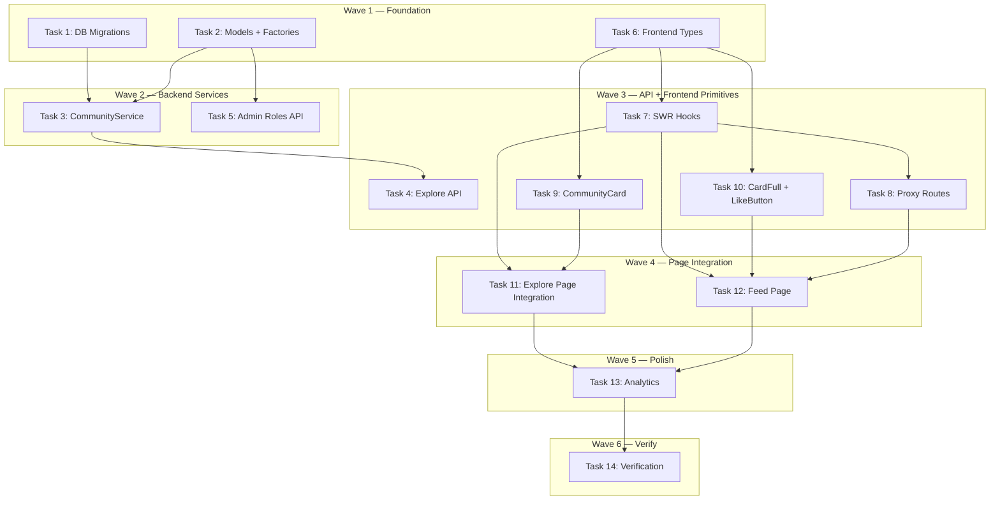

# Community Notes — Explore Layer 3: Implementation Plan

> **For Claude:** REQUIRED SUB-SKILL: Use executing-plans to implement this plan task-by-task.

**Design Doc:** [docs/designs/2026-03-18-community-notes-design.md](docs/designs/2026-03-18-community-notes-design.md)

**Spec References:** —

**PRD References:** —

**Goal:** Surface partner/blogger check-in reviews as "Community Notes" on the Explore page with a dedicated feed page and heart reactions.

**Architecture:** Reuses existing `check_ins` table — joins against a new `user_roles` table to identify partner/blogger users. `CommunityService` fetches enriched review cards with author profile, shop data, and like counts. Frontend shows a 3-card preview on Explore and a paginated feed at `/explore/community`.

**Tech Stack:** FastAPI, Supabase Postgres, Pydantic, Next.js App Router, SWR, Tailwind CSS

**Acceptance Criteria:**

- [ ] A visitor browsing the Explore page sees a "From the Community" section with up to 3 partner review cards
- [ ] Tapping "See all" navigates to a paginated feed of all partner reviews
- [ ] An authenticated user can heart a community note and see the updated count
- [ ] An admin can grant/revoke the `blogger` role via the API
- [ ] Only check-in reviews (with `review_text`) from users with a `blogger` role appear in the feed

---

### Task 1: DB Migrations

**Files:**

- Create: `supabase/migrations/20260318000001_user_roles.sql`
- Create: `supabase/migrations/20260318000002_community_note_likes.sql`

No test needed — SQL DDL migrations.

**Step 1: Create user_roles migration**

```sql
-- 20260318000001_user_roles.sql
CREATE TABLE user_roles (
  id UUID PRIMARY KEY DEFAULT gen_random_uuid(),
  user_id UUID NOT NULL REFERENCES auth.users(id) ON DELETE CASCADE,
  role TEXT NOT NULL CHECK (role IN ('blogger', 'paid_user', 'partner', 'admin')),
  granted_at TIMESTAMPTZ NOT NULL DEFAULT now(),
  granted_by UUID REFERENCES auth.users(id),
  UNIQUE(user_id, role)
);

CREATE INDEX idx_user_roles_user ON user_roles(user_id);
CREATE INDEX idx_user_roles_role ON user_roles(role);

ALTER TABLE user_roles ENABLE ROW LEVEL SECURITY;
-- No RLS policies — service role only. Admin manages roles via backend API.
```

**Step 2: Create community_note_likes migration**

```sql
-- 20260318000002_community_note_likes.sql
CREATE TABLE community_note_likes (
  id UUID PRIMARY KEY DEFAULT gen_random_uuid(),
  checkin_id UUID NOT NULL REFERENCES check_ins(id) ON DELETE CASCADE,
  user_id UUID NOT NULL REFERENCES auth.users(id) ON DELETE CASCADE,
  created_at TIMESTAMPTZ NOT NULL DEFAULT now(),
  UNIQUE(checkin_id, user_id)
);

CREATE INDEX idx_community_note_likes_checkin ON community_note_likes(checkin_id);

ALTER TABLE community_note_likes ENABLE ROW LEVEL SECURITY;

CREATE POLICY "Users can insert own likes" ON community_note_likes
  FOR INSERT WITH CHECK (auth.uid() = user_id);
CREATE POLICY "Users can delete own likes" ON community_note_likes
  FOR DELETE USING (auth.uid() = user_id);
CREATE POLICY "Anyone can read likes" ON community_note_likes
  FOR SELECT USING (true);
```

**Step 3: Commit**

```bash
git add supabase/migrations/20260318000001_user_roles.sql supabase/migrations/20260318000002_community_note_likes.sql
git commit -m "feat(db): add user_roles and community_note_likes tables"
```

---

### Task 2: Backend Pydantic Models + Test Factories

**Files:**

- Modify: `backend/models/types.py` (append new models at end)
- Modify: `backend/tests/factories.py` (append new factories at end)

No test needed — type definitions and test utilities only.

**Step 1: Add models to `backend/models/types.py`**

Append after the existing `VibeShopsResponse` class:

```python
class UserRole(CamelModel):
    id: str
    user_id: str
    role: str
    granted_at: datetime
    granted_by: str | None = None


class CommunityNoteAuthor(CamelModel):
    user_id: str
    display_name: str
    avatar_url: str | None = None
    role_label: str


class CommunityNoteCard(CamelModel):
    checkin_id: str
    author: CommunityNoteAuthor
    review_text: str
    star_rating: int | None = None
    cover_photo_url: str | None = None
    shop_name: str
    shop_slug: str
    shop_district: str | None = None
    like_count: int = 0
    created_at: datetime


class CommunityFeedResponse(CamelModel):
    notes: list[CommunityNoteCard]
    next_cursor: str | None = None
```

**Step 2: Add factories to `backend/tests/factories.py`**

Append at end of file:

```python
def make_user_role(**overrides: object) -> dict:
    defaults = {
        "id": "role-r1s2t3",
        "user_id": "user-a1b2c3",
        "role": "blogger",
        "granted_at": _TS,
        "granted_by": "admin-x9y8z7",
    }
    return {**defaults, **overrides}


def make_community_note_row(**overrides: object) -> dict:
    """A joined row combining check_in + profile + shop + like count,
    as returned by the CommunityService query."""
    defaults = {
        "checkin_id": "ci-j0k1l2",
        "review_text": "Hinoki Coffee has the most incredible natural light in the afternoons. Brought my Kindle and ended up reading for three hours.",
        "stars": 5,
        "photo_urls": [
            "https://example.supabase.co/storage/v1/object/public/checkin-photos/user-a1b2c3/photo1.jpg"
        ],
        "created_at": "2026-03-15T14:30:00",
        "user_id": "user-a1b2c3",
        "display_name": "Mei-Ling ☕",
        "avatar_url": None,
        "role": "blogger",
        "shop_name": "Hinoki Coffee",
        "shop_slug": "hinoki-coffee",
        "shop_district": "大安",
        "like_count": 12,
    }
    return {**defaults, **overrides}
```

**Step 3: Commit**

```bash
git add backend/models/types.py backend/tests/factories.py
git commit -m "feat(models): add Community Notes models and test factories"
```

---

### Task 3: CommunityService — Tests + Implementation

**Files:**

- Create: `backend/tests/services/test_community_service.py`
- Create: `backend/services/community_service.py`

**Step 1: Write the failing tests**

Create `backend/tests/services/test_community_service.py`:

```python
"""Tests for CommunityService — surfaces partner check-in reviews."""

from datetime import datetime
from unittest.mock import MagicMock

import pytest

from models.types import CommunityFeedResponse, CommunityNoteCard
from services.community_service import CommunityService
from tests.factories import make_community_note_row


# ── Helpers ─────────────────────────────────────────────

_ROLE_LABEL_MAP = {"blogger": "Coffee blogger", "partner": "Partner"}


def _make_db_mock(
    note_rows: list[dict] | None = None,
    like_exists: bool = False,
    like_count: int = 0,
) -> MagicMock:
    """Build a Supabase client mock that returns the given data
    for sequential .execute() calls."""
    mock = MagicMock()
    mock.table.return_value = mock
    mock.select.return_value = mock
    mock.eq.return_value = mock
    mock.neq.return_value = mock
    mock.is_.return_value = mock
    mock.not_.return_value = mock
    mock.order.return_value = mock
    mock.limit.return_value = mock
    mock.lt.return_value = mock
    mock.in_.return_value = mock
    mock.delete.return_value = mock
    mock.insert.return_value = mock
    mock.single.return_value = mock
    mock.maybe_single.return_value = mock

    execute_responses: list[MagicMock] = []

    if note_rows is not None:
        execute_responses.append(MagicMock(data=note_rows))

    if like_exists is not None:
        execute_responses.append(MagicMock(data={"id": "like-1"} if like_exists else None))

    if like_count is not None:
        execute_responses.append(MagicMock(data=None, count=like_count))

    if execute_responses:
        mock.execute.side_effect = execute_responses

    return mock


# ── Preview ─────────────────────────────────────────────


class TestCommunityServiceGetPreview:
    """When the Explore page loads, the preview section shows up to 3 recent partner reviews."""

    def test_returns_only_blogger_reviews_as_community_notes(self):
        rows = [
            make_community_note_row(checkin_id="ci-1", display_name="Mei-Ling ☕"),
            make_community_note_row(checkin_id="ci-2", display_name="Jason 🌿"),
        ]
        db = _make_db_mock(note_rows=rows)
        service = CommunityService(db)

        result = service.get_preview(limit=3)

        assert len(result) == 2
        assert isinstance(result[0], CommunityNoteCard)
        assert result[0].checkin_id == "ci-1"
        assert result[0].author.display_name == "Mei-Ling ☕"
        assert result[0].author.role_label == "Coffee blogger"

    def test_returns_empty_list_when_no_partner_reviews_exist(self):
        db = _make_db_mock(note_rows=[])
        service = CommunityService(db)

        result = service.get_preview()

        assert result == []

    def test_uses_first_photo_as_cover(self):
        rows = [
            make_community_note_row(
                photo_urls=[
                    "https://example.com/photo1.jpg",
                    "https://example.com/photo2.jpg",
                ]
            )
        ]
        db = _make_db_mock(note_rows=rows)
        service = CommunityService(db)

        result = service.get_preview()

        assert result[0].cover_photo_url == "https://example.com/photo1.jpg"

    def test_excludes_checkins_without_review_text(self):
        """Bare check-ins (no review_text) are NOT community notes — this is
        enforced by the SQL WHERE clause, but verified here via the factory."""
        rows = [make_community_note_row(review_text="A genuine review")]
        db = _make_db_mock(note_rows=rows)
        service = CommunityService(db)

        result = service.get_preview()

        assert len(result) == 1
        assert result[0].review_text == "A genuine review"


# ── Feed ────────────────────────────────────────────────


class TestCommunityServiceGetFeed:
    """When a user opens the full Community feed, they see paginated partner reviews."""

    def test_returns_paginated_feed_with_next_cursor(self):
        rows = [make_community_note_row(checkin_id=f"ci-{i}") for i in range(11)]
        db = _make_db_mock(note_rows=rows)
        service = CommunityService(db)

        result = service.get_feed(cursor=None, limit=10)

        assert isinstance(result, CommunityFeedResponse)
        assert len(result.notes) == 10
        assert result.next_cursor is not None

    def test_returns_no_cursor_when_fewer_than_limit(self):
        rows = [make_community_note_row(checkin_id="ci-1")]
        db = _make_db_mock(note_rows=rows)
        service = CommunityService(db)

        result = service.get_feed(cursor=None, limit=10)

        assert len(result.notes) == 1
        assert result.next_cursor is None

    def test_returns_empty_feed_when_no_reviews(self):
        db = _make_db_mock(note_rows=[])
        service = CommunityService(db)

        result = service.get_feed(cursor=None, limit=10)

        assert result.notes == []
        assert result.next_cursor is None


# ── Likes ───────────────────────────────────────────────


class TestCommunityServiceToggleLike:
    """When a user taps the heart on a community note, it toggles their like."""

    def test_adds_like_when_not_yet_liked(self):
        db = _make_db_mock(like_exists=False, like_count=5)
        service = CommunityService(db)

        count = service.toggle_like("ci-1", "user-a1b2c3")

        assert count == 5
        db.table.assert_any_call("community_note_likes")

    def test_removes_like_when_already_liked(self):
        db = _make_db_mock(like_exists=True, like_count=4)
        service = CommunityService(db)

        count = service.toggle_like("ci-1", "user-a1b2c3")

        assert count == 4


class TestCommunityServiceIsLiked:
    """When the feed loads, each card checks if the current user has liked it."""

    def test_returns_true_when_user_has_liked(self):
        db = MagicMock()
        db.table.return_value = db
        db.select.return_value = db
        db.eq.return_value = db
        db.maybe_single.return_value = db
        db.execute.return_value = MagicMock(data={"id": "like-1"})

        service = CommunityService(db)
        assert service.is_liked("ci-1", "user-a1b2c3") is True

    def test_returns_false_when_user_has_not_liked(self):
        db = MagicMock()
        db.table.return_value = db
        db.select.return_value = db
        db.eq.return_value = db
        db.maybe_single.return_value = db
        db.execute.return_value = MagicMock(data=None)

        service = CommunityService(db)
        assert service.is_liked("ci-1", "user-a1b2c3") is False
```

**Step 2: Run tests to verify they fail**

Run: `cd backend && python -m pytest tests/services/test_community_service.py -v`
Expected: FAIL with `ModuleNotFoundError: No module named 'services.community_service'`

**Step 3: Write the CommunityService implementation**

Create `backend/services/community_service.py`:

```python
"""Service for surfacing partner/blogger check-in reviews as Community Notes."""

from typing import Any, cast

from supabase import Client

from models.types import (
    CommunityFeedResponse,
    CommunityNoteAuthor,
    CommunityNoteCard,
)

_ROLE_LABELS: dict[str, str] = {
    "blogger": "Coffee blogger",
    "partner": "Partner",
    "admin": "Admin",
    "paid_user": "Supporter",
}

# Columns selected from the joined query.
# We use a Supabase foreign-key join to pull profile + shop + role in one query.
_NOTE_SELECT = (
    "id,"
    "review_text,"
    "stars,"
    "photo_urls,"
    "created_at,"
    "user_id,"
    "profiles!check_ins_user_id_fkey(display_name, avatar_url),"
    "shops!check_ins_shop_id_fkey(name, slug, district),"
    "user_roles!inner(role)"
)


class CommunityService:
    def __init__(self, db: Client):
        self._db = db

    def get_preview(self, limit: int = 3) -> list[CommunityNoteCard]:
        response = (
            self._db.table("check_ins")
            .select(_NOTE_SELECT, count="exact")
            .neq("review_text", "null")
            .order("created_at", desc=True)
            .limit(limit)
            .execute()
        )
        rows = cast("list[dict[str, Any]]", response.data or [])
        return [self._row_to_card(row) for row in rows]

    def get_feed(
        self, cursor: str | None, limit: int = 10
    ) -> CommunityFeedResponse:
        query = (
            self._db.table("check_ins")
            .select(_NOTE_SELECT, count="exact")
            .neq("review_text", "null")
            .order("created_at", desc=True)
            .limit(limit + 1)
        )
        if cursor:
            query = query.lt("created_at", cursor)

        response = query.execute()
        rows = cast("list[dict[str, Any]]", response.data or [])

        has_more = len(rows) > limit
        page_rows = rows[:limit]

        next_cursor: str | None = None
        if has_more and page_rows:
            next_cursor = page_rows[-1]["created_at"]

        return CommunityFeedResponse(
            notes=[self._row_to_card(row) for row in page_rows],
            next_cursor=next_cursor,
        )

    def toggle_like(self, checkin_id: str, user_id: str) -> int:
        existing = (
            self._db.table("community_note_likes")
            .select("id")
            .eq("checkin_id", checkin_id)
            .eq("user_id", user_id)
            .maybe_single()
            .execute()
        )

        if existing.data:
            self._db.table("community_note_likes").delete().eq(
                "checkin_id", checkin_id
            ).eq("user_id", user_id).execute()
        else:
            self._db.table("community_note_likes").insert(
                {"checkin_id": checkin_id, "user_id": user_id}
            ).execute()

        count_resp = (
            self._db.table("community_note_likes")
            .select("id", count="exact")
            .eq("checkin_id", checkin_id)
            .execute()
        )
        return count_resp.count or 0

    def is_liked(self, checkin_id: str, user_id: str) -> bool:
        result = (
            self._db.table("community_note_likes")
            .select("id")
            .eq("checkin_id", checkin_id)
            .eq("user_id", user_id)
            .maybe_single()
            .execute()
        )
        return result.data is not None

    def _row_to_card(self, row: dict[str, Any]) -> CommunityNoteCard:
        profile = row.get("profiles") or {}
        shop = row.get("shops") or {}
        user_roles = row.get("user_roles") or [{}]
        role = user_roles[0].get("role", "blogger") if user_roles else "blogger"

        photo_urls = row.get("photo_urls") or []
        cover = photo_urls[0] if photo_urls else None

        return CommunityNoteCard(
            checkin_id=row["id"],
            author=CommunityNoteAuthor(
                user_id=row["user_id"],
                display_name=profile.get("display_name", "Anonymous"),
                avatar_url=profile.get("avatar_url"),
                role_label=_ROLE_LABELS.get(role, "Contributor"),
            ),
            review_text=row["review_text"],
            star_rating=row.get("stars"),
            cover_photo_url=cover,
            shop_name=shop.get("name", ""),
            shop_slug=shop.get("slug", ""),
            shop_district=shop.get("district"),
            like_count=row.get("like_count", 0),
            created_at=row["created_at"],
        )
```

**Step 4: Run tests to verify they pass**

Run: `cd backend && python -m pytest tests/services/test_community_service.py -v`
Expected: All tests PASS

**Step 5: Commit**

```bash
git add backend/services/community_service.py backend/tests/services/test_community_service.py
git commit -m "feat(service): CommunityService with preview, feed, and like toggle"
```

---

### Task 4: Explore API Endpoints — Tests + Implementation

**Files:**

- Create: `backend/tests/api/test_community_api.py`
- Modify: `backend/api/explore.py` (add 4 new routes)

**API Contract:**

```yaml
GET /explore/community/preview:
  auth: none
  response: CommunityNoteCard[] # camelCase

GET /explore/community:
  auth: none
  query:
    cursor: string | null
    limit: int (1-50, default 10)
  response:
    notes: CommunityNoteCard[]
    nextCursor: string | null

POST /explore/community/{checkin_id}/like:
  auth: required (Bearer token)
  response:
    likeCount: int
  errors:
    401: not authenticated

GET /explore/community/{checkin_id}/like:
  auth: required (Bearer token)
  response:
    liked: bool
  errors:
    401: not authenticated
```

**Step 1: Write the failing tests**

Create `backend/tests/api/test_community_api.py`:

```python
"""Tests for Community Notes API endpoints."""

from unittest.mock import AsyncMock, MagicMock, patch

import pytest
from fastapi.testclient import TestClient

from main import app
from models.types import CommunityFeedResponse, CommunityNoteAuthor, CommunityNoteCard

client = TestClient(app)

_MOCK_CARD = CommunityNoteCard(
    checkin_id="ci-1",
    author=CommunityNoteAuthor(
        user_id="user-a1b2c3",
        display_name="Mei-Ling ☕",
        avatar_url=None,
        role_label="Coffee blogger",
    ),
    review_text="Hinoki Coffee has the most incredible natural light.",
    star_rating=5,
    cover_photo_url="https://example.com/photo1.jpg",
    shop_name="Hinoki Coffee",
    shop_slug="hinoki-coffee",
    shop_district="大安",
    like_count=12,
    created_at="2026-03-15T14:30:00",
)


class TestCommunityPreview:
    """When the Explore page loads, it fetches the community preview."""

    def test_returns_200_with_preview_cards(self):
        with (
            patch("api.explore.get_anon_client", return_value=MagicMock()),
            patch("api.explore.CommunityService") as mock_cls,
        ):
            mock_cls.return_value.get_preview.return_value = [_MOCK_CARD]
            response = client.get("/explore/community/preview")

        assert response.status_code == 200
        data = response.json()
        assert len(data) == 1
        assert data[0]["checkinId"] == "ci-1"
        assert data[0]["author"]["displayName"] == "Mei-Ling ☕"

    def test_is_public_no_auth_required(self):
        with (
            patch("api.explore.get_anon_client", return_value=MagicMock()),
            patch("api.explore.CommunityService") as mock_cls,
        ):
            mock_cls.return_value.get_preview.return_value = []
            response = client.get("/explore/community/preview")

        assert response.status_code == 200

    def test_returns_empty_list_when_no_notes(self):
        with (
            patch("api.explore.get_anon_client", return_value=MagicMock()),
            patch("api.explore.CommunityService") as mock_cls,
        ):
            mock_cls.return_value.get_preview.return_value = []
            response = client.get("/explore/community/preview")

        assert response.json() == []


class TestCommunityFeed:
    """When a user opens the full community page, they get paginated results."""

    def test_returns_200_with_feed_and_cursor(self):
        feed = CommunityFeedResponse(
            notes=[_MOCK_CARD],
            next_cursor="2026-03-14T10:00:00",
        )
        with (
            patch("api.explore.get_anon_client", return_value=MagicMock()),
            patch("api.explore.CommunityService") as mock_cls,
        ):
            mock_cls.return_value.get_feed.return_value = feed
            response = client.get("/explore/community")

        assert response.status_code == 200
        data = response.json()
        assert data["nextCursor"] == "2026-03-14T10:00:00"
        assert len(data["notes"]) == 1

    def test_passes_cursor_and_limit_to_service(self):
        feed = CommunityFeedResponse(notes=[], next_cursor=None)
        with (
            patch("api.explore.get_anon_client", return_value=MagicMock()),
            patch("api.explore.CommunityService") as mock_cls,
        ):
            mock_cls.return_value.get_feed.return_value = feed
            client.get("/explore/community?cursor=2026-03-14T10:00:00&limit=5")
            mock_cls.return_value.get_feed.assert_called_once_with(
                cursor="2026-03-14T10:00:00", limit=5,
            )


class TestCommunityLikeToggle:
    """When an authenticated user taps heart, their like toggles."""

    def test_returns_401_when_not_authenticated(self):
        response = client.post("/explore/community/ci-1/like")
        assert response.status_code == 401

    def test_returns_200_with_like_count_when_authenticated(self):
        with (
            patch("api.deps._get_bearer_token", return_value="valid-token"),
            patch("api.deps.pyjwt.decode", return_value={"sub": "user-a1b2c3"}),
            patch("api.deps._jwks_client") as mock_jwks,
            patch("api.deps.get_service_role_client") as mock_svc,
            patch("api.explore.get_service_role_client", return_value=MagicMock()),
            patch("api.explore.CommunityService") as mock_cls,
        ):
            mock_jwks.get_signing_key_from_jwt.return_value = MagicMock(key="test")
            mock_svc.return_value.table.return_value.select.return_value.eq.return_value.single.return_value.execute.return_value = MagicMock(
                data={"deletion_requested_at": None}
            )
            mock_cls.return_value.toggle_like.return_value = 13
            response = client.post("/explore/community/ci-1/like")

        assert response.status_code == 200
        assert response.json()["likeCount"] == 13


class TestCommunityLikeCheck:
    """When the feed loads, check if the current user has liked each note."""

    def test_returns_401_when_not_authenticated(self):
        response = client.get("/explore/community/ci-1/like")
        assert response.status_code == 401
```

**Step 2: Run tests to verify they fail**

Run: `cd backend && python -m pytest tests/api/test_community_api.py -v`
Expected: FAIL — routes don't exist yet

**Step 3: Add routes to `backend/api/explore.py`**

Add these imports at the top of the file:

```python
from api.deps import get_current_user
from db.supabase_client import get_service_role_client
from services.community_service import CommunityService
```

Add these routes after the existing vibe routes:

```python
# ── Community Notes ──────────────────────────────────────


@router.get("/community/preview")
def community_preview() -> list[dict[str, object]]:
    """Top 3 partner reviews for Explore page. Public — no auth required."""
    db = get_anon_client()
    service = CommunityService(db)
    cards = service.get_preview(limit=3)
    return [c.model_dump(by_alias=True) for c in cards]


@router.get("/community")
def community_feed(
    cursor: str | None = Query(default=None),
    limit: int = Query(default=10, ge=1, le=50),
) -> dict[str, object]:
    """Paginated feed of partner reviews. Public — no auth required."""
    db = get_anon_client()
    service = CommunityService(db)
    result = service.get_feed(cursor=cursor, limit=limit)
    return result.model_dump(by_alias=True)


@router.post("/community/{checkin_id}/like")
def community_like_toggle(
    checkin_id: str,
    user: dict[str, Any] = Depends(get_current_user),
) -> dict[str, int]:
    """Toggle like on a community note. Auth required."""
    db = get_service_role_client()
    service = CommunityService(db)
    count = service.toggle_like(checkin_id, user["id"])
    return {"likeCount": count}


@router.get("/community/{checkin_id}/like")
def community_like_check(
    checkin_id: str,
    user: dict[str, Any] = Depends(get_current_user),
) -> dict[str, bool]:
    """Check if current user has liked a note. Auth required."""
    db = get_service_role_client()
    service = CommunityService(db)
    liked = service.is_liked(checkin_id, user["id"])
    return {"liked": liked}
```

Also add missing imports at the top if not already present:

```python
from typing import Any
from fastapi import Depends
```

**Step 4: Run tests to verify they pass**

Run: `cd backend && python -m pytest tests/api/test_community_api.py -v`
Expected: All tests PASS

**Step 5: Commit**

```bash
git add backend/api/explore.py backend/tests/api/test_community_api.py
git commit -m "feat(api): community notes preview, feed, and like endpoints"
```

---

### Task 5: Admin Roles API — Tests + Implementation

**Files:**

- Create: `backend/tests/api/test_admin_roles.py`
- Create: `backend/api/admin_roles.py`
- Modify: `backend/main.py` (register new router)

**API Contract:**

```yaml
POST /admin/roles:
  auth: admin
  request:
    user_id: string
    role: string # one of: blogger, paid_user, partner, admin
  response:
    id: string
    userId: string
    role: string
    grantedAt: string
  errors:
    409: role already granted

DELETE /admin/roles/{user_id}/{role}:
  auth: admin
  response:
    message: 'Role revoked'
  errors:
    404: role not found

GET /admin/roles:
  auth: admin
  query:
    role: string | null # filter by role
  response: UserRole[]
```

**Step 1: Write the failing tests**

Create `backend/tests/api/test_admin_roles.py`:

```python
"""Tests for admin roles endpoints."""

from unittest.mock import MagicMock, patch

import pytest
from fastapi.testclient import TestClient

from main import app

client = TestClient(app)

_ADMIN_PATCHES = {
    "api.deps._get_bearer_token": "valid-token",
    "api.deps.pyjwt.decode": {"sub": "admin-x9y8z7"},
}


def _auth_context():
    """Context manager that patches auth deps for admin access."""
    from unittest.mock import patch as p
    from contextlib import ExitStack

    stack = ExitStack()
    stack.enter_context(p("api.deps._get_bearer_token", return_value="valid-token"))
    stack.enter_context(p("api.deps.pyjwt.decode", return_value={"sub": "admin-x9y8z7"}))
    mock_jwks = stack.enter_context(p("api.deps._jwks_client"))
    mock_jwks.get_signing_key_from_jwt.return_value = MagicMock(key="test")
    mock_svc = stack.enter_context(p("api.deps.get_service_role_client"))
    mock_svc.return_value.table.return_value.select.return_value.eq.return_value.single.return_value.execute.return_value = MagicMock(
        data={"deletion_requested_at": None}
    )
    stack.enter_context(p("core.config.settings.admin_user_ids", ["admin-x9y8z7"]))
    return stack


class TestGrantRole:
    """When an admin grants a blogger role, the user becomes a partner."""

    def test_returns_201_on_successful_grant(self):
        with _auth_context():
            with patch("api.admin_roles.get_service_role_client") as mock_db:
                mock_db.return_value.table.return_value.insert.return_value.execute.return_value = MagicMock(
                    data=[{
                        "id": "role-new",
                        "user_id": "user-target",
                        "role": "blogger",
                        "granted_at": "2026-03-18T10:00:00",
                        "granted_by": "admin-x9y8z7",
                    }]
                )
                response = client.post(
                    "/admin/roles",
                    json={"user_id": "user-target", "role": "blogger"},
                )

        assert response.status_code == 201
        assert response.json()["role"] == "blogger"

    def test_returns_401_when_not_admin(self):
        response = client.post(
            "/admin/roles",
            json={"user_id": "user-target", "role": "blogger"},
        )
        assert response.status_code == 401


class TestRevokeRole:
    """When an admin revokes a role, the user loses that permission."""

    def test_returns_200_on_successful_revoke(self):
        with _auth_context():
            with patch("api.admin_roles.get_service_role_client") as mock_db:
                mock_db.return_value.table.return_value.delete.return_value.eq.return_value.eq.return_value.execute.return_value = MagicMock(
                    data=[{"id": "role-1"}], count=1
                )
                response = client.delete("/admin/roles/user-target/blogger")

        assert response.status_code == 200


class TestListRoles:
    """When an admin views roles, they see all granted permissions."""

    def test_returns_all_roles(self):
        with _auth_context():
            with patch("api.admin_roles.get_service_role_client") as mock_db:
                mock_db.return_value.table.return_value.select.return_value.order.return_value.execute.return_value = MagicMock(
                    data=[
                        {"id": "r1", "user_id": "u1", "role": "blogger", "granted_at": "2026-03-18T10:00:00", "granted_by": "admin-x9y8z7"},
                    ]
                )
                response = client.get("/admin/roles")

        assert response.status_code == 200
        assert len(response.json()) == 1
```

**Step 2: Run tests to verify they fail**

Run: `cd backend && python -m pytest tests/api/test_admin_roles.py -v`
Expected: FAIL

**Step 3: Create `backend/api/admin_roles.py`**

```python
"""Admin endpoints for managing user roles."""

from typing import Any, cast

from fastapi import APIRouter, Depends, HTTPException
from pydantic import BaseModel

from api.deps import require_admin
from db.supabase_client import get_service_role_client

router = APIRouter(prefix="/admin/roles", tags=["admin"])

_VALID_ROLES = {"blogger", "paid_user", "partner", "admin"}


class GrantRoleRequest(BaseModel):
    user_id: str
    role: str


@router.post("", status_code=201)
def grant_role(
    body: GrantRoleRequest,
    user: dict[str, Any] = Depends(require_admin),
) -> dict[str, Any]:
    """Grant a role to a user."""
    if body.role not in _VALID_ROLES:
        raise HTTPException(status_code=400, detail=f"Invalid role: {body.role}")

    db = get_service_role_client()
    try:
        response = db.table("user_roles").insert(
            {
                "user_id": body.user_id,
                "role": body.role,
                "granted_by": user["id"],
            }
        ).execute()
    except Exception as exc:
        if "duplicate" in str(exc).lower() or "unique" in str(exc).lower():
            raise HTTPException(status_code=409, detail="Role already granted") from exc
        raise

    rows = cast("list[dict[str, Any]]", response.data or [])
    return rows[0] if rows else {}


@router.delete("/{user_id}/{role}")
def revoke_role(
    user_id: str,
    role: str,
    admin: dict[str, Any] = Depends(require_admin),
) -> dict[str, str]:
    """Revoke a role from a user."""
    db = get_service_role_client()
    response = (
        db.table("user_roles")
        .delete()
        .eq("user_id", user_id)
        .eq("role", role)
        .execute()
    )
    deleted = cast("list[dict[str, Any]]", response.data or [])
    if not deleted:
        raise HTTPException(status_code=404, detail="Role not found")
    return {"message": "Role revoked"}


@router.get("")
def list_roles(
    role: str | None = None,
    admin: dict[str, Any] = Depends(require_admin),
) -> list[dict[str, Any]]:
    """List all role grants, optionally filtered by role."""
    db = get_service_role_client()
    query = db.table("user_roles").select("*").order("granted_at", desc=True)
    if role:
        query = query.eq("role", role)
    response = query.execute()
    return cast("list[dict[str, Any]]", response.data or [])
```

**Step 4: Register the router in `backend/main.py`**

Add to the router includes section:

```python
from api.admin_roles import router as admin_roles_router
app.include_router(admin_roles_router)
```

**Step 5: Run tests to verify they pass**

Run: `cd backend && python -m pytest tests/api/test_admin_roles.py -v`
Expected: All tests PASS

**Step 6: Commit**

```bash
git add backend/api/admin_roles.py backend/tests/api/test_admin_roles.py backend/main.py
git commit -m "feat(admin): roles API — grant, revoke, and list user roles"
```

---

### Task 6: Frontend Types + Test Factories

**Files:**

- Create: `types/community.ts`
- Modify: `lib/test-utils/factories.ts` (append new factories)

No test needed — type definitions and test utilities only.

**Step 1: Create `types/community.ts`**

```typescript
export interface CommunityNoteAuthor {
  userId: string;
  displayName: string;
  avatarUrl: string | null;
  roleLabel: string;
}

export interface CommunityNoteCard {
  checkinId: string;
  author: CommunityNoteAuthor;
  reviewText: string;
  starRating: number | null;
  coverPhotoUrl: string | null;
  shopName: string;
  shopSlug: string;
  shopDistrict: string | null;
  likeCount: number;
  createdAt: string;
}

export interface CommunityFeedResponse {
  notes: CommunityNoteCard[];
  nextCursor: string | null;
}
```

**Step 2: Add frontend factories to `lib/test-utils/factories.ts`**

Append at end of file:

```typescript
export function makeCommunityNote(
  overrides: Record<string, unknown> = {}
): Record<string, unknown> {
  return {
    checkinId: 'ci-comm-01',
    author: {
      userId: 'user-a1b2c3',
      displayName: 'Mei-Ling ☕',
      avatarUrl: null,
      roleLabel: 'Coffee blogger',
    },
    reviewText:
      'Hinoki Coffee has the most incredible natural light in the afternoons.',
    starRating: 5,
    coverPhotoUrl:
      'https://example.supabase.co/storage/v1/object/public/checkin-photos/photo1.jpg',
    shopName: 'Hinoki Coffee',
    shopSlug: 'hinoki-coffee',
    shopDistrict: '大安',
    likeCount: 12,
    createdAt: '2026-03-15T14:30:00',
    ...overrides,
  };
}
```

**Step 3: Commit**

```bash
git add types/community.ts lib/test-utils/factories.ts
git commit -m "feat(types): Community Notes TypeScript types and test factory"
```

---

### Task 7: Frontend SWR Hooks — Tests + Implementation

**Files:**

- Create: `lib/hooks/use-community-preview.test.ts`
- Create: `lib/hooks/use-community-preview.ts`
- Create: `lib/hooks/use-community-feed.test.ts`
- Create: `lib/hooks/use-community-feed.ts`

**Step 1: Write failing test for `useCommunityPreview`**

Create `lib/hooks/use-community-preview.test.ts`:

```typescript
import { renderHook } from '@testing-library/react';
import { describe, expect, it, vi } from 'vitest';

import { makeCommunityNote } from '@/lib/test-utils/factories';

import { useCommunityPreview } from './use-community-preview';

vi.mock('swr', () => ({
  default: vi.fn(),
}));

import swr from 'swr';

const swrMock = vi.mocked(swr);

function swrReturning(
  data: unknown,
  isLoading = false,
  error: Error | null = null
) {
  return {
    data,
    isLoading,
    error,
    mutate: vi.fn(),
    isValidating: false,
  } as ReturnType<typeof swr>;
}

describe('useCommunityPreview', () => {
  it('returns preview cards when data is loaded', () => {
    const cards = [
      makeCommunityNote(),
      makeCommunityNote({ checkinId: 'ci-2' }),
    ];
    swrMock.mockReturnValue(swrReturning(cards));

    const { result } = renderHook(() => useCommunityPreview());

    expect(result.current.notes).toHaveLength(2);
    expect(result.current.isLoading).toBe(false);
  });

  it('returns empty array while loading', () => {
    swrMock.mockReturnValue(swrReturning(undefined, true));

    const { result } = renderHook(() => useCommunityPreview());

    expect(result.current.notes).toEqual([]);
    expect(result.current.isLoading).toBe(true);
  });

  it('fetches from /api/explore/community/preview', () => {
    swrMock.mockReturnValue(swrReturning([]));

    renderHook(() => useCommunityPreview());

    expect(swrMock).toHaveBeenCalledWith(
      '/api/explore/community/preview',
      expect.any(Function),
      expect.any(Object)
    );
  });
});
```

**Step 2: Run test to verify it fails**

Run: `pnpm test -- lib/hooks/use-community-preview.test.ts`
Expected: FAIL

**Step 3: Implement `useCommunityPreview`**

Create `lib/hooks/use-community-preview.ts`:

```typescript
import useSWR from 'swr';

import { fetchPublic } from '@/lib/api/fetch';
import type { CommunityNoteCard } from '@/types/community';

export function useCommunityPreview() {
  const { data, isLoading, error } = useSWR<CommunityNoteCard[]>(
    '/api/explore/community/preview',
    fetchPublic,
    { revalidateOnFocus: false }
  );
  return {
    notes: data ?? [],
    isLoading,
    error,
  };
}
```

**Step 4: Run test to verify it passes**

Run: `pnpm test -- lib/hooks/use-community-preview.test.ts`
Expected: PASS

**Step 5: Write failing test for `useCommunityFeed`**

Create `lib/hooks/use-community-feed.test.ts`:

```typescript
import { renderHook } from '@testing-library/react';
import { describe, expect, it, vi } from 'vitest';

import { makeCommunityNote } from '@/lib/test-utils/factories';

import { useCommunityFeed } from './use-community-feed';

vi.mock('swr', () => ({
  default: vi.fn(),
}));

import swr from 'swr';

const swrMock = vi.mocked(swr);

function swrReturning(data: unknown, isLoading = false) {
  return {
    data,
    isLoading,
    error: null,
    mutate: vi.fn(),
    isValidating: false,
  } as ReturnType<typeof swr>;
}

describe('useCommunityFeed', () => {
  it('returns feed notes and cursor when loaded', () => {
    const feed = {
      notes: [makeCommunityNote()],
      nextCursor: '2026-03-14T10:00:00',
    };
    swrMock.mockReturnValue(swrReturning(feed));

    const { result } = renderHook(() => useCommunityFeed(null));

    expect(result.current.notes).toHaveLength(1);
    expect(result.current.nextCursor).toBe('2026-03-14T10:00:00');
  });

  it('returns empty notes while loading', () => {
    swrMock.mockReturnValue(swrReturning(undefined, true));

    const { result } = renderHook(() => useCommunityFeed(null));

    expect(result.current.notes).toEqual([]);
    expect(result.current.isLoading).toBe(true);
  });

  it('includes cursor in fetch URL when provided', () => {
    swrMock.mockReturnValue(swrReturning({ notes: [], nextCursor: null }));

    renderHook(() => useCommunityFeed('2026-03-14T10:00:00'));

    expect(swrMock).toHaveBeenCalledWith(
      '/api/explore/community?cursor=2026-03-14T10%3A00%3A00',
      expect.any(Function),
      expect.any(Object)
    );
  });
});
```

**Step 6: Implement `useCommunityFeed`**

Create `lib/hooks/use-community-feed.ts`:

```typescript
import useSWR from 'swr';

import { fetchPublic } from '@/lib/api/fetch';
import type { CommunityFeedResponse } from '@/types/community';

export function useCommunityFeed(cursor: string | null) {
  const params = new URLSearchParams();
  if (cursor) params.set('cursor', cursor);
  const query = params.toString();
  const url = `/api/explore/community${query ? `?${query}` : ''}`;

  const { data, isLoading, error, mutate } = useSWR<CommunityFeedResponse>(
    url,
    fetchPublic,
    { revalidateOnFocus: false }
  );

  return {
    notes: data?.notes ?? [],
    nextCursor: data?.nextCursor ?? null,
    isLoading,
    error,
    mutate,
  };
}
```

**Step 7: Run all hook tests**

Run: `pnpm test -- lib/hooks/use-community`
Expected: All PASS

**Step 8: Commit**

```bash
git add lib/hooks/use-community-preview.ts lib/hooks/use-community-preview.test.ts lib/hooks/use-community-feed.ts lib/hooks/use-community-feed.test.ts
git commit -m "feat(hooks): useCommunityPreview and useCommunityFeed SWR hooks"
```

---

### Task 8: Frontend Proxy Routes

**Files:**

- Create: `app/api/explore/community/preview/route.ts`
- Create: `app/api/explore/community/route.ts`
- Create: `app/api/explore/community/[checkinId]/like/route.ts`

No test needed — thin proxy wrappers with no business logic (same pattern as existing vibe proxy routes).

**Step 1: Create preview proxy**

Create `app/api/explore/community/preview/route.ts`:

```typescript
import { NextRequest } from 'next/server';

import { proxyToBackend } from '@/lib/api/proxy';

export async function GET(request: NextRequest) {
  return proxyToBackend(request, '/explore/community/preview');
}
```

**Step 2: Create feed proxy**

Create `app/api/explore/community/route.ts`:

```typescript
import { NextRequest } from 'next/server';

import { proxyToBackend } from '@/lib/api/proxy';

export async function GET(request: NextRequest) {
  return proxyToBackend(request, '/explore/community');
}
```

**Step 3: Create like proxy**

Create `app/api/explore/community/[checkinId]/like/route.ts`:

```typescript
import { NextRequest } from 'next/server';

import { proxyToBackend } from '@/lib/api/proxy';

export async function POST(
  request: NextRequest,
  { params }: { params: Promise<{ checkinId: string }> }
) {
  const { checkinId } = await params;
  return proxyToBackend(request, `/explore/community/${checkinId}/like`);
}

export async function GET(
  request: NextRequest,
  { params }: { params: Promise<{ checkinId: string }> }
) {
  const { checkinId } = await params;
  return proxyToBackend(request, `/explore/community/${checkinId}/like`);
}
```

**Step 4: Commit**

```bash
git add app/api/explore/community/
git commit -m "feat(proxy): community notes proxy routes (preview, feed, like)"
```

---

### Task 9: CommunityCard Component — Test + Implementation

**Files:**

- Create: `components/community/community-card.test.tsx`
- Create: `components/community/community-card.tsx`

**Step 1: Write the failing test**

Create `components/community/community-card.test.tsx`:

```typescript
import { render, screen } from '@testing-library/react';
import { describe, expect, it } from 'vitest';

import { makeCommunityNote } from '@/lib/test-utils/factories';
import type { CommunityNoteCard } from '@/types/community';

import { CommunityCard } from './community-card';

const defaultNote = makeCommunityNote() as unknown as CommunityNoteCard;

describe('CommunityCard', () => {
  it('displays the author name and role', () => {
    render(<CommunityCard note={defaultNote} />);

    expect(screen.getByText('Mei-Ling ☕')).toBeInTheDocument();
    expect(screen.getByText(/Coffee blogger/)).toBeInTheDocument();
  });

  it('displays the review text', () => {
    render(<CommunityCard note={defaultNote} />);

    expect(
      screen.getByText(/Hinoki Coffee has the most incredible/)
    ).toBeInTheDocument();
  });

  it('displays the shop name and district', () => {
    render(<CommunityCard note={defaultNote} />);

    expect(screen.getByText(/Hinoki Coffee/)).toBeInTheDocument();
    expect(screen.getByText(/大安/)).toBeInTheDocument();
  });

  it('shows the author avatar initial when no avatar url', () => {
    render(<CommunityCard note={defaultNote} />);

    expect(screen.getByText('M')).toBeInTheDocument();
  });
});
```

**Step 2: Run test to verify it fails**

Run: `pnpm test -- components/community/community-card.test.tsx`
Expected: FAIL

**Step 3: Implement the component**

Create `components/community/community-card.tsx`:

```typescript
'use client';

import { Coffee } from 'lucide-react';
import Link from 'next/link';

import type { CommunityNoteCard } from '@/types/community';

interface CommunityCardProps {
  note: CommunityNoteCard;
}

function getInitial(name: string): string {
  return name.replace(/[^\p{L}]/gu, '').charAt(0).toUpperCase() || '?';
}

function formatRelativeTime(dateStr: string): string {
  const diff = Date.now() - new Date(dateStr).getTime();
  const days = Math.floor(diff / 86400000);
  if (days < 1) return 'today';
  if (days === 1) return '1d ago';
  if (days < 7) return `${days}d ago`;
  const weeks = Math.floor(days / 7);
  if (weeks === 1) return '1w ago';
  return `${weeks}w ago`;
}

export function CommunityCard({ note }: CommunityCardProps) {
  return (
    <div className="rounded-2xl border border-gray-100 bg-white p-4">
      <div className="flex items-center gap-2.5">
        <div className="flex h-9 w-9 items-center justify-center rounded-full bg-[#F5EDE4]">
          <span className="text-sm font-bold text-[#8B5E3C]">
            {getInitial(note.author.displayName)}
          </span>
        </div>
        <div className="flex flex-col gap-0.5">
          <span className="text-sm font-semibold text-gray-900">
            {note.author.displayName}
          </span>
          <span className="text-[11px] text-gray-400">
            {note.author.roleLabel} · {formatRelativeTime(note.createdAt)}
          </span>
        </div>
      </div>

      <p className="mt-3 line-clamp-3 text-sm leading-relaxed text-gray-500">
        {note.reviewText}
      </p>

      <Link
        href={`/shops/${note.shopSlug}`}
        className="mt-3 inline-flex items-center gap-1.5 text-xs font-medium text-[#3D8A5A]"
      >
        <Coffee className="h-3.5 w-3.5" />
        {note.shopName}
        {note.shopDistrict && ` · ${note.shopDistrict}`}
      </Link>
    </div>
  );
}
```

**Step 4: Run test to verify it passes**

Run: `pnpm test -- components/community/community-card.test.tsx`
Expected: PASS

**Step 5: Commit**

```bash
git add components/community/community-card.tsx components/community/community-card.test.tsx
git commit -m "feat(ui): CommunityCard compact component for Explore preview"
```

---

### Task 10: CommunityCardFull + LikeButton Components — Tests + Implementation

**Files:**

- Create: `components/community/like-button.test.tsx`
- Create: `components/community/like-button.tsx`
- Create: `components/community/community-card-full.test.tsx`
- Create: `components/community/community-card-full.tsx`

**Step 1: Write failing LikeButton test**

Create `components/community/like-button.test.tsx`:

```typescript
import { fireEvent, render, screen } from '@testing-library/react';
import { describe, expect, it, vi } from 'vitest';

import { LikeButton } from './like-button';

describe('LikeButton', () => {
  it('displays the like count', () => {
    render(<LikeButton count={12} liked={false} onToggle={vi.fn()} />);

    expect(screen.getByText('12')).toBeInTheDocument();
  });

  it('shows filled heart when liked', () => {
    render(<LikeButton count={5} liked={true} onToggle={vi.fn()} />);

    const button = screen.getByRole('button');
    expect(button).toHaveAttribute('aria-pressed', 'true');
  });

  it('calls onToggle when tapped', () => {
    const onToggle = vi.fn();
    render(<LikeButton count={3} liked={false} onToggle={onToggle} />);

    fireEvent.click(screen.getByRole('button'));

    expect(onToggle).toHaveBeenCalledOnce();
  });
});
```

**Step 2: Implement LikeButton**

Create `components/community/like-button.tsx`:

```typescript
'use client';

import { Heart } from 'lucide-react';

interface LikeButtonProps {
  count: number;
  liked: boolean;
  onToggle: () => void;
}

export function LikeButton({ count, liked, onToggle }: LikeButtonProps) {
  return (
    <button
      type="button"
      onClick={onToggle}
      aria-pressed={liked}
      aria-label={liked ? 'Unlike this note' : 'Like this note'}
      className="flex items-center gap-1 text-xs text-gray-400 transition-colors hover:text-red-400"
    >
      <Heart
        className={`h-3.5 w-3.5 ${liked ? 'fill-red-400 text-red-400' : ''}`}
      />
      <span>{count}</span>
    </button>
  );
}
```

**Step 3: Write failing CommunityCardFull test**

Create `components/community/community-card-full.test.tsx`:

```typescript
import { render, screen } from '@testing-library/react';
import { describe, expect, it, vi } from 'vitest';

import { makeCommunityNote } from '@/lib/test-utils/factories';
import type { CommunityNoteCard } from '@/types/community';

import { CommunityCardFull } from './community-card-full';

const defaultNote = makeCommunityNote() as unknown as CommunityNoteCard;

describe('CommunityCardFull', () => {
  it('displays the cover photo when available', () => {
    render(
      <CommunityCardFull note={defaultNote} liked={false} onLikeToggle={vi.fn()} />
    );

    const img = screen.getByRole('img');
    expect(img).toHaveAttribute('alt', expect.stringContaining('Hinoki Coffee'));
  });

  it('displays the author badge', () => {
    render(
      <CommunityCardFull note={defaultNote} liked={false} onLikeToggle={vi.fn()} />
    );

    expect(screen.getByText('Mei-Ling ☕')).toBeInTheDocument();
  });

  it('displays the full review text', () => {
    render(
      <CommunityCardFull note={defaultNote} liked={false} onLikeToggle={vi.fn()} />
    );

    expect(
      screen.getByText(/Hinoki Coffee has the most incredible/)
    ).toBeInTheDocument();
  });

  it('displays the shop tag with district', () => {
    render(
      <CommunityCardFull note={defaultNote} liked={false} onLikeToggle={vi.fn()} />
    );

    expect(screen.getByText(/Hinoki Coffee · 大安/)).toBeInTheDocument();
  });

  it('displays the like count', () => {
    render(
      <CommunityCardFull note={defaultNote} liked={false} onLikeToggle={vi.fn()} />
    );

    expect(screen.getByText('12')).toBeInTheDocument();
  });
});
```

**Step 4: Implement CommunityCardFull**

Create `components/community/community-card-full.tsx`:

```typescript
'use client';

import { Coffee } from 'lucide-react';
import Image from 'next/image';
import Link from 'next/link';

import type { CommunityNoteCard } from '@/types/community';

import { LikeButton } from './like-button';

interface CommunityCardFullProps {
  note: CommunityNoteCard;
  liked: boolean;
  onLikeToggle: () => void;
}

function getInitial(name: string): string {
  return name.replace(/[^\p{L}]/gu, '').charAt(0).toUpperCase() || '?';
}

function formatRelativeTime(dateStr: string): string {
  const diff = Date.now() - new Date(dateStr).getTime();
  const days = Math.floor(diff / 86400000);
  if (days < 1) return 'today';
  if (days === 1) return '1d ago';
  if (days < 7) return `${days}d ago`;
  const weeks = Math.floor(days / 7);
  if (weeks === 1) return '1w ago';
  return `${weeks}w ago`;
}

export function CommunityCardFull({
  note,
  liked,
  onLikeToggle,
}: CommunityCardFullProps) {
  return (
    <div className="overflow-hidden rounded-2xl border border-gray-200 bg-white shadow-sm">
      {note.coverPhotoUrl && (
        <div className="relative h-[120px] w-full">
          <Image
            src={note.coverPhotoUrl}
            alt={`Photo from ${note.shopName}`}
            fill
            className="object-cover"
            sizes="(max-width: 768px) 100vw, 400px"
          />
          <div className="absolute inset-0 bg-gradient-to-t from-black/20 to-transparent" />
          <div className="absolute bottom-3 left-3 flex items-center gap-2 rounded-full bg-white px-3 py-1.5 shadow-sm">
            <div className="flex h-7 w-7 items-center justify-center rounded-full bg-[#F5EDE4]">
              <span className="text-xs font-bold text-[#8B5E3C]">
                {getInitial(note.author.displayName)}
              </span>
            </div>
            <span className="text-xs font-semibold text-gray-900">
              {note.author.displayName}
            </span>
          </div>
        </div>
      )}

      <div className="flex flex-col gap-2.5 p-4">
        <p className="text-sm leading-relaxed text-gray-600">
          {note.reviewText}
        </p>

        <div className="flex items-center justify-between">
          <Link
            href={`/shops/${note.shopSlug}`}
            className="inline-flex items-center gap-1 rounded-full bg-[#F5EDE4] px-2.5 py-1 text-[11px] font-semibold text-[#8B5E3C]"
          >
            <Coffee className="h-3 w-3" />
            {note.shopName}
            {note.shopDistrict && ` · ${note.shopDistrict}`}
          </Link>

          <div className="flex items-center gap-3">
            <span className="text-[10px] text-gray-400">
              {formatRelativeTime(note.createdAt)}
            </span>
            <LikeButton count={note.likeCount} liked={liked} onToggle={onLikeToggle} />
          </div>
        </div>
      </div>
    </div>
  );
}
```

**Step 5: Run all community component tests**

Run: `pnpm test -- components/community/`
Expected: All PASS

**Step 6: Commit**

```bash
git add components/community/
git commit -m "feat(ui): CommunityCardFull and LikeButton components"
```

---

### Task 11: Explore Page — Community Section Integration

**Files:**

- Modify: `app/explore/page.tsx` (add Community section)
- Modify: `app/explore/page.test.tsx` (add community tests)

**Step 1: Add test cases for community section to `app/explore/page.test.tsx`**

Add to the existing SWR mock handler in the test file — when `key === '/api/explore/community/preview'`, return mock community data. Add these tests:

```typescript
import { makeCommunityNote } from '@/lib/test-utils/factories';

// Add to the existing SWR mock implementation:
// if (key === '/api/explore/community/preview') return swrReturning(MOCK_COMMUNITY);
const MOCK_COMMUNITY = [makeCommunityNote(), makeCommunityNote({ checkinId: 'ci-2' })];

describe('Community Notes section', () => {
  it('shows From the Community heading when notes exist', () => {
    // Set up SWR mock to return community data
    render(<ExplorePage />);
    expect(screen.getByText('From the Community')).toBeInTheDocument();
  });

  it('shows See all link that navigates to /explore/community', () => {
    render(<ExplorePage />);
    const link = screen.getByText(/See all/);
    expect(link.closest('a')).toHaveAttribute('href', '/explore/community');
  });

  it('hides community section when no notes available', () => {
    // Set up SWR mock to return empty community data
    render(<ExplorePage />);
    expect(screen.queryByText('From the Community')).not.toBeInTheDocument();
  });
});
```

**Step 2: Run test to verify it fails**

Run: `pnpm test -- app/explore/page.test.tsx`
Expected: FAIL — "From the Community" not found

**Step 3: Add community section to `app/explore/page.tsx`**

Import the hook and component:

```typescript
import { useCommunityPreview } from '@/lib/hooks/use-community-preview';
import { CommunityCard } from '@/components/community/community-card';
```

Add to the component body, after vibes state:

```typescript
const { notes: communityNotes } = useCommunityPreview();
```

Add JSX after the Vibe Tags section (before the closing tag of the scrollable content area):

```tsx
{
  communityNotes.length > 0 && (
    <section className="flex flex-col gap-3">
      <div className="flex items-center justify-between">
        <h2
          className="text-lg font-bold text-gray-900"
          style={{ fontFamily: 'var(--font-bricolage), sans-serif' }}
        >
          From the Community
        </h2>
        <Link
          href="/explore/community"
          className="text-xs font-medium text-[#8B5E3C]"
        >
          See all →
        </Link>
      </div>
      {communityNotes.map((note) => (
        <CommunityCard key={note.checkinId} note={note} />
      ))}
    </section>
  );
}
```

**Step 4: Run test to verify it passes**

Run: `pnpm test -- app/explore/page.test.tsx`
Expected: All tests PASS

**Step 5: Commit**

```bash
git add app/explore/page.tsx app/explore/page.test.tsx
git commit -m "feat(explore): add From the Community section to Explore page"
```

---

### Task 12: Community Feed Page — Test + Implementation

**Files:**

- Create: `app/explore/community/page.test.tsx`
- Create: `app/explore/community/page.tsx`

**Step 1: Write failing test**

Create `app/explore/community/page.test.tsx`:

```typescript
import { render, screen } from '@testing-library/react';
import { describe, expect, it, vi } from 'vitest';

import { makeCommunityNote } from '@/lib/test-utils/factories';

vi.mock('swr', () => ({
  default: vi.fn(),
}));

vi.mock('next/navigation', () => ({
  useRouter: () => ({ back: vi.fn() }),
}));

vi.mock('@/lib/supabase/client', () => ({
  createClient: () => ({
    auth: { getSession: () => Promise.resolve({ data: { session: null } }) },
  }),
}));

import swr from 'swr';

const swrMock = vi.mocked(swr);

import CommunityFeedPage from './page';

const MOCK_FEED = {
  notes: [
    makeCommunityNote({ checkinId: 'ci-1' }),
    makeCommunityNote({ checkinId: 'ci-2', reviewText: 'Simple Kaffa is incredible.' }),
  ],
  nextCursor: '2026-03-14T10:00:00',
};

describe('Community Feed Page', () => {
  beforeEach(() => {
    swrMock.mockImplementation(((key: string) => {
      if (key?.includes('/api/explore/community')) {
        return {
          data: MOCK_FEED,
          isLoading: false,
          error: null,
          mutate: vi.fn(),
          isValidating: false,
        };
      }
      return { data: undefined, isLoading: false, error: null, mutate: vi.fn(), isValidating: false };
    }) as typeof swr);
  });

  it('shows the page title From the Community', () => {
    render(<CommunityFeedPage />);
    expect(screen.getByText('From the Community')).toBeInTheDocument();
  });

  it('renders community note cards', () => {
    render(<CommunityFeedPage />);
    expect(screen.getByText(/Hinoki Coffee has the most incredible/)).toBeInTheDocument();
    expect(screen.getByText(/Simple Kaffa is incredible/)).toBeInTheDocument();
  });

  it('shows Load more notes button when next cursor exists', () => {
    render(<CommunityFeedPage />);
    expect(screen.getByText(/Load more notes/)).toBeInTheDocument();
  });
});
```

**Step 2: Run test to verify it fails**

Run: `pnpm test -- app/explore/community/page.test.tsx`
Expected: FAIL

**Step 3: Implement the feed page**

Create `app/explore/community/page.tsx`:

```typescript
'use client';

import { ArrowLeft, ChevronDown } from 'lucide-react';
import { useRouter } from 'next/navigation';
import { useCallback, useState } from 'react';

import { CommunityCardFull } from '@/components/community/community-card-full';
import { fetchWithAuth } from '@/lib/api/fetch';
import { useCommunityFeed } from '@/lib/hooks/use-community-feed';

export default function CommunityFeedPage() {
  const router = useRouter();
  const [cursor, setCursor] = useState<string | null>(null);
  const { notes, nextCursor, isLoading, mutate } = useCommunityFeed(cursor);
  const [likedSet, setLikedSet] = useState<Set<string>>(new Set());

  const handleLikeToggle = useCallback(
    async (checkinId: string) => {
      setLikedSet((prev) => {
        const next = new Set(prev);
        if (next.has(checkinId)) {
          next.delete(checkinId);
        } else {
          next.add(checkinId);
        }
        return next;
      });

      try {
        await fetchWithAuth(`/api/explore/community/${checkinId}/like`, {
          method: 'POST',
        });
        mutate();
      } catch {
        setLikedSet((prev) => {
          const next = new Set(prev);
          if (next.has(checkinId)) {
            next.delete(checkinId);
          } else {
            next.add(checkinId);
          }
          return next;
        });
      }
    },
    [mutate]
  );

  return (
    <div className="min-h-screen bg-[#F5F4F1]">
      <header className="sticky top-0 z-10 bg-[#F5F4F1] px-5 pb-3 pt-4">
        <div className="flex items-center gap-3">
          <button
            type="button"
            onClick={() => router.back()}
            className="flex h-9 w-9 items-center justify-center rounded-full bg-gray-200"
            aria-label="Go back"
          >
            <ArrowLeft className="h-[18px] w-[18px]" />
          </button>
          <div className="flex flex-col gap-0.5">
            <h1
              className="text-xl font-bold text-gray-900"
              style={{
                fontFamily:
                  'var(--font-bricolage), var(--font-geist-sans), sans-serif',
              }}
            >
              From the Community
            </h1>
            <p className="text-[11px] text-gray-400">
              Notes from coffee explorers in Taipei
            </p>
          </div>
        </div>
      </header>

      <div className="flex flex-col gap-4 px-5 pb-24 pt-2">
        {notes.map((note) => (
          <CommunityCardFull
            key={note.checkinId}
            note={note}
            liked={likedSet.has(note.checkinId)}
            onLikeToggle={() => handleLikeToggle(note.checkinId)}
          />
        ))}

        {isLoading && (
          <div className="py-8 text-center text-sm text-gray-400">
            Loading...
          </div>
        )}

        {!isLoading && notes.length === 0 && (
          <div className="py-12 text-center text-sm text-gray-400">
            Community notes coming soon
          </div>
        )}

        {nextCursor && !isLoading && (
          <button
            type="button"
            onClick={() => setCursor(nextCursor)}
            className="flex items-center justify-center gap-1 py-2 text-sm font-medium text-[#8B5E3C]"
          >
            Load more notes
            <ChevronDown className="h-3.5 w-3.5" />
          </button>
        )}
      </div>
    </div>
  );
}
```

**Step 4: Run test to verify it passes**

Run: `pnpm test -- app/explore/community/page.test.tsx`
Expected: All PASS

**Step 5: Commit**

```bash
git add app/explore/community/
git commit -m "feat(page): Community feed page with paginated partner reviews"
```

---

### Task 13: Analytics Events

**Files:**

- Modify: `app/explore/page.tsx` (add `community_note_viewed` event)
- Modify: `app/explore/community/page.tsx` (add `community_feed_opened` + `community_note_liked`)

No test needed — analytics events are fire-and-forget PostHog calls, verified via PostHog Live Events (manual verification).

**Step 1: Add `community_feed_opened` to feed page**

In `app/explore/community/page.tsx`, import `useAnalytics` and fire on mount:

```typescript
import { useAnalytics } from '@/lib/hooks/use-analytics';

// Inside the component:
const { capture } = useAnalytics();

useEffect(() => {
  capture('community_feed_opened', { referrer: document.referrer });
}, [capture]);
```

**Step 2: Add `community_note_liked` to like toggle handler**

In the `handleLikeToggle` function, after the successful API call:

```typescript
capture('community_note_liked', {
  checkin_id: checkinId,
});
```

**Step 3: Commit**

```bash
git add app/explore/page.tsx app/explore/community/page.tsx
git commit -m "feat(analytics): community_feed_opened and community_note_liked events"
```

---

### Task 14: Full Verification

**Files:** None — verification only.

No test needed — this is the verification step.

**Step 1: Run all backend tests**

Run: `cd backend && python -m pytest -v`
Expected: All PASS

**Step 2: Run backend linting**

Run: `cd backend && ruff check . && ruff format --check .`
Expected: Clean

**Step 3: Run backend type checking**

Run: `cd backend && mypy .`
Expected: Clean (or only pre-existing issues)

**Step 4: Run all frontend tests**

Run: `pnpm test`
Expected: All PASS

**Step 5: Run frontend type checking + lint**

Run: `pnpm type-check && pnpm lint`
Expected: Clean

**Step 6: Run production build**

Run: `pnpm build`
Expected: Build succeeds

**Step 7: Commit any lint fixes**

```bash
git add -A && git commit -m "chore: lint and type-check fixes"
```

---

## Execution Waves



**Wave 1** (parallel — no dependencies):

- Task 1: DB Migrations
- Task 2: Backend Models + Factories
- Task 6: Frontend Types + Factories

**Wave 2** (parallel — depends on Wave 1):

- Task 3: CommunityService ← Tasks 1, 2
- Task 5: Admin Roles API ← Task 2

**Wave 3** (parallel — depends on Waves 1-2):

- Task 4: Explore API endpoints ← Task 3
- Task 7: SWR Hooks ← Task 6
- Task 8: Proxy Routes ← Task 6
- Task 9: CommunityCard component ← Task 6
- Task 10: CommunityCardFull + LikeButton ← Task 6

**Wave 4** (parallel — depends on Wave 3):

- Task 11: Explore page integration ← Tasks 7, 9
- Task 12: Community feed page ← Tasks 7, 8, 10

**Wave 5** (depends on Wave 4):

- Task 13: Analytics events ← Tasks 11, 12

**Wave 6** (depends on all):

- Task 14: Full verification ← Task 13
