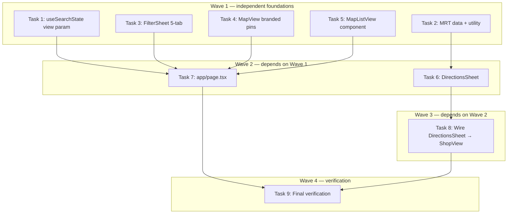

# Find UI Reconstruct Implementation Plan

> **For Claude:** REQUIRED SUB-SKILL: Use executing-plans to implement this plan task-by-task.

**Design Doc:** [docs/designs/2026-03-18-find-ui-reconstruct-design.md](docs/designs/2026-03-18-find-ui-reconstruct-design.md)

**Spec References:** [SPEC.md](SPEC.md) — auth wall, map discovery, search

**PRD References:** [PRD.md](PRD.md) — Find tab as primary discovery surface

**Goal:** Reconstruct the Find tab UI to match the approved Pencil designs — branded map pins, map/list toggle, 5-tab filter sheet with search, and a directions bottom sheet with walk/drive/MRT times.

**Architecture:** All changes are frontend-only. URL-driven state via `useSearchState` hook (adding `view` param). New `directions-sheet.tsx` fetches Mapbox Directions API client-side. MRT lookup uses a hardcoded JSON + Haversine — no backend work needed.

**Tech Stack:** Next.js 16 App Router, React, TypeScript strict, Tailwind CSS, `react-map-gl` (Mapbox), `vaul` (drawer), Vitest + Testing Library, `lucide-react`

**Acceptance Criteria:**

- [ ] A visitor landing on the Find page sees coffee cup map pins; tapping a pin highlights it in coral
- [ ] A visitor can tap the list icon in the "Nearby Coffee Shops" header to switch to a full list view (URL updates to `?view=list`)
- [ ] A visitor tapping the filter button opens a sheet with 5 tabs (Functionality/Time/Ambience/Mode/Food) and can search across all tags
- [ ] A visitor on a Shop View page can tap "Get There" to open a directions sheet showing walk time, drive time, and nearest MRT station
- [ ] All modified/new components have passing Vitest tests; `pnpm test`, `pnpm type-check`, and `pnpm build` pass

---

## Task 1: Add `view` param to `useSearchState`

**Files:**

- Modify: `lib/hooks/use-search-state.ts`
- Modify: `lib/hooks/use-search-state.test.ts`

`use-search-state` is the single source of truth for URL search params on the Find page. Adding `view: 'map' | 'list'` here (with `'map'` as default) lets `app/page.tsx` and the view toggle read/write it consistently.

**Step 1: Write the failing tests**

Add to `lib/hooks/use-search-state.test.ts` — inside the existing `describe('useSearchState')` block, add a `beforeEach` reset of `view` and append these tests:

```typescript
beforeEach(() => {
  // add to existing beforeEach:
  mockSearchParams.delete('view');
});

it('returns view as "map" when ?view param is absent', () => {
  const { result } = renderHook(() => useSearchState());
  expect(result.current.view).toBe('map');
});

it('reads view from ?view=list URL param', () => {
  mockSearchParams.set('view', 'list');
  const { result } = renderHook(() => useSearchState());
  expect(result.current.view).toBe('list');
});

it('setView updates ?view param', () => {
  const { result } = renderHook(() => useSearchState());
  act(() => {
    result.current.setView('list');
  });
  const calledUrl = mockPush.mock.calls[0][0] as string;
  expect(calledUrl).toContain('view=list');
});

it('clearAll removes view param', () => {
  mockSearchParams.set('view', 'list');
  const { result } = renderHook(() => useSearchState());
  act(() => {
    result.current.clearAll();
  });
  const calledUrl = mockPush.mock.calls[0][0] as string;
  expect(calledUrl).not.toContain('view=');
});
```

**Step 2: Run tests to verify they fail**

```bash
cd /Users/ytchou/Project/caferoam/.worktrees/feat/find-ui-reconstruct-design
pnpm test lib/hooks/use-search-state.test.ts
```

Expected: 4 new tests FAIL — `result.current.view` is undefined, `result.current.setView` is not a function.

**Step 3: Implement**

In `lib/hooks/use-search-state.ts`:

```typescript
// Add to SearchState interface:
  view: 'map' | 'list';
  setView: (view: 'map' | 'list') => void;

// Add after `const filters = useMemo(...)`:
  const view = (searchParams.get('view') as 'map' | 'list') ?? 'map';

// Add after `const clearAll = ...`:
  const setView = useCallback(
    (v: 'map' | 'list') => {
      router.push(buildUrl({ view: v }));
    },
    [router, buildUrl]
  );

// Update clearAll to also remove view:
  const clearAll = useCallback(() => {
    router.push(buildUrl({ q: null, mode: null, filters: null, view: null }));
  }, [router, buildUrl]);

// Add view and setView to the return object:
  return { query, mode, filters, view, setQuery, setMode, toggleFilter, setView, clearAll };
```

**Step 4: Run tests to verify they pass**

```bash
pnpm test lib/hooks/use-search-state.test.ts
```

Expected: all tests pass.

**Step 5: Commit**

```bash
git add lib/hooks/use-search-state.ts lib/hooks/use-search-state.test.ts
git commit -m "feat: add view param (map|list) to useSearchState"
```

---

## Task 2: Create `lib/data/taipei-mrt-stations.json` + `lib/utils/mrt.ts`

**Files:**

- Create: `lib/data/taipei-mrt-stations.json`
- Create: `lib/utils/mrt.ts`
- Create: `lib/utils/mrt.test.ts`

The directions sheet needs nearest-MRT lookup. This is pure TypeScript with no API call — Haversine distance against a hardcoded JSON. Implement and test the utility before building the UI that uses it.

**Step 1: Write the failing test**

Create `lib/utils/mrt.test.ts`:

```typescript
import { describe, it, expect } from 'vitest';
import { nearestMrtStation } from './mrt';

describe('nearestMrtStation', () => {
  it('returns the closest station to a given coordinate', () => {
    // Yongkang Street area (~25.0330, 121.5298) — nearest is Dongmen
    const result = nearestMrtStation(25.033, 121.5298);
    expect(result.name_en).toBe('Dongmen');
    expect(result.dist).toBeGreaterThan(0);
    expect(result.dist).toBeLessThan(1); // less than 1km
  });

  it('includes station line and lat/lng in the result', () => {
    const result = nearestMrtStation(25.0478, 121.517); // near Gongguan
    expect(result).toHaveProperty('name_zh');
    expect(result).toHaveProperty('line');
    expect(result).toHaveProperty('lat');
    expect(result).toHaveProperty('lng');
  });
});
```

**Step 2: Run test to verify it fails**

```bash
pnpm test lib/utils/mrt.test.ts
```

Expected: FAIL — `Cannot find module './mrt'`.

**Step 3: Create the MRT station data**

Create `lib/data/taipei-mrt-stations.json` — a representative subset of Taipei MRT stations covering all major lines. Include at minimum stations across BL (Bannan), R (Danshui-Xinyi), G (Songshan-Xindian), O (Zhonghe-Xinlu), BR (Wenhu) lines. Each entry:

```json
[
  {
    "id": "BL12",
    "name_zh": "東門",
    "name_en": "Dongmen",
    "line": "BL/R",
    "lat": 25.03364,
    "lng": 121.52991
  },
  {
    "id": "G07",
    "name_zh": "公館",
    "name_en": "Gongguan",
    "line": "G",
    "lat": 25.01417,
    "lng": 121.53456
  },
  {
    "id": "R10",
    "name_zh": "大安森林公園",
    "name_en": "Da'an Forest Park",
    "line": "R",
    "lat": 25.02974,
    "lng": 121.5356
  },
  {
    "id": "R09",
    "name_zh": "大安",
    "name_en": "Da'an",
    "line": "R",
    "lat": 25.03342,
    "lng": 121.54393
  },
  {
    "id": "BL14",
    "name_zh": "忠孝新生",
    "name_en": "Zhongxiao Xinsheng",
    "line": "BL",
    "lat": 25.04244,
    "lng": 121.53031
  },
  {
    "id": "BL15",
    "name_zh": "忠孝復興",
    "name_en": "Zhongxiao Fuxing",
    "line": "BL/BR",
    "lat": 25.04158,
    "lng": 121.54461
  },
  {
    "id": "BL16",
    "name_zh": "忠孝敦化",
    "name_en": "Zhongxiao Dunhua",
    "line": "BL",
    "lat": 25.04083,
    "lng": 121.55095
  },
  {
    "id": "R06",
    "name_zh": "中山國中",
    "name_en": "Zhongshan Junior High School",
    "line": "R",
    "lat": 25.0583,
    "lng": 121.54393
  },
  {
    "id": "R07",
    "name_zh": "南京復興",
    "name_en": "Nanjing Fuxing",
    "line": "R",
    "lat": 25.05193,
    "lng": 121.54393
  },
  {
    "id": "R08",
    "name_zh": "忠孝復興",
    "name_en": "Zhongxiao Fuxing",
    "line": "R/BR",
    "lat": 25.04158,
    "lng": 121.54461
  },
  {
    "id": "BL11",
    "name_zh": "中正紀念堂",
    "name_en": "Chiang Kai-shek Memorial Hall",
    "line": "BL/G",
    "lat": 25.03362,
    "lng": 121.52163
  },
  {
    "id": "G09",
    "name_zh": "古亭",
    "name_en": "Guting",
    "line": "G/O",
    "lat": 25.02507,
    "lng": 121.52872
  },
  {
    "id": "O06",
    "name_zh": "頂溪",
    "name_en": "Dingxi",
    "line": "O",
    "lat": 25.01255,
    "lng": 121.51407
  },
  {
    "id": "BL13",
    "name_zh": "古亭",
    "name_en": "Guting",
    "line": "BL",
    "lat": 25.02507,
    "lng": 121.52872
  },
  {
    "id": "R05",
    "name_zh": "雙連",
    "name_en": "Shuanglian",
    "line": "R",
    "lat": 25.06328,
    "lng": 121.52363
  },
  {
    "id": "R04",
    "name_zh": "民權西路",
    "name_en": "Minquan W. Rd.",
    "line": "R/O",
    "lat": 25.07083,
    "lng": 121.52
  },
  {
    "id": "BL07",
    "name_zh": "西門",
    "name_en": "Ximen",
    "line": "BL/G",
    "lat": 25.04222,
    "lng": 121.5082
  },
  {
    "id": "BL08",
    "name_zh": "台大醫院",
    "name_en": "NTU Hospital",
    "line": "BL",
    "lat": 25.04416,
    "lng": 121.51617
  },
  {
    "id": "BL09",
    "name_zh": "台北車站",
    "name_en": "Taipei Main Station",
    "line": "BL/R",
    "lat": 25.04756,
    "lng": 121.517
  },
  {
    "id": "BL10",
    "name_zh": "善導寺",
    "name_en": "Shandao Temple",
    "line": "BL",
    "lat": 25.04437,
    "lng": 121.5268
  },
  {
    "id": "G10",
    "name_zh": "台電大樓",
    "name_en": "Taipower Building",
    "line": "G",
    "lat": 25.01826,
    "lng": 121.53127
  },
  {
    "id": "G11",
    "name_zh": "師大路",
    "name_en": "Shida Rd.",
    "line": "G",
    "lat": 25.01416,
    "lng": 121.53126
  },
  {
    "id": "BR12",
    "name_zh": "大安森林公園",
    "name_en": "Da'an Forest Park",
    "line": "BR",
    "lat": 25.02974,
    "lng": 121.5356
  },
  {
    "id": "BR13",
    "name_zh": "六張犁",
    "name_en": "Liuzhangli",
    "line": "BR",
    "lat": 25.02333,
    "lng": 121.5558
  },
  {
    "id": "O01",
    "name_zh": "南勢角",
    "name_en": "Nanshijiao",
    "line": "O",
    "lat": 24.99416,
    "lng": 121.51415
  },
  {
    "id": "O02",
    "name_zh": "景安",
    "name_en": "Jing'an",
    "line": "O",
    "lat": 25.0016,
    "lng": 121.514
  },
  {
    "id": "O03",
    "name_zh": "永安市場",
    "name_en": "Yongan Market",
    "line": "O",
    "lat": 25.00749,
    "lng": 121.51316
  },
  {
    "id": "O04",
    "name_zh": "頂溪",
    "name_en": "Dingxi",
    "line": "O",
    "lat": 25.01255,
    "lng": 121.51407
  },
  {
    "id": "O05",
    "name_zh": "永春",
    "name_en": "Yongchun",
    "line": "O",
    "lat": 25.03799,
    "lng": 121.57993
  },
  {
    "id": "G01",
    "name_zh": "新店",
    "name_en": "Xindian",
    "line": "G",
    "lat": 24.97067,
    "lng": 121.5381
  },
  {
    "id": "G02",
    "name_zh": "新店區公所",
    "name_en": "Xindian City Hall",
    "line": "G",
    "lat": 24.97556,
    "lng": 121.5396
  },
  {
    "id": "G03",
    "name_zh": "七張",
    "name_en": "Qizhang",
    "line": "G",
    "lat": 24.98239,
    "lng": 121.54127
  },
  {
    "id": "G04",
    "name_zh": "大坪林",
    "name_en": "Dapinglin",
    "line": "G",
    "lat": 24.99202,
    "lng": 121.54155
  },
  {
    "id": "G05",
    "name_zh": "景美",
    "name_en": "Jingmei",
    "line": "G",
    "lat": 24.99958,
    "lng": 121.54155
  },
  {
    "id": "G06",
    "name_zh": "萬隆",
    "name_en": "Wanlong",
    "line": "G",
    "lat": 25.00666,
    "lng": 121.5364
  },
  {
    "id": "G08",
    "name_zh": "台電大樓",
    "name_en": "Taipower Building",
    "line": "G",
    "lat": 25.01826,
    "lng": 121.53127
  },
  {
    "id": "R01",
    "name_zh": "淡水",
    "name_en": "Tamsui",
    "line": "R",
    "lat": 25.17541,
    "lng": 121.45182
  },
  {
    "id": "R16",
    "name_zh": "象山",
    "name_en": "Xiangshan",
    "line": "R",
    "lat": 25.028,
    "lng": 121.567
  },
  {
    "id": "R15",
    "name_zh": "台北101/世貿",
    "name_en": "Taipei 101/World Trade Center",
    "line": "R",
    "lat": 25.03315,
    "lng": 121.5638
  },
  {
    "id": "R14",
    "name_zh": "信義安和",
    "name_en": "Xinyi Anhe",
    "line": "R",
    "lat": 25.0334,
    "lng": 121.55278
  },
  {
    "id": "R13",
    "name_zh": "大安",
    "name_en": "Da'an",
    "line": "R",
    "lat": 25.03342,
    "lng": 121.54393
  },
  {
    "id": "R12",
    "name_zh": "科技大樓",
    "name_en": "Technology Building",
    "line": "R",
    "lat": 25.0344,
    "lng": 121.54395
  },
  {
    "id": "R11",
    "name_zh": "六張犁",
    "name_en": "Liuzhangli",
    "line": "R",
    "lat": 25.02333,
    "lng": 121.5558
  },
  {
    "id": "BL17",
    "name_zh": "國父紀念館",
    "name_en": "Sun Yat-sen Memorial Hall",
    "line": "BL",
    "lat": 25.04034,
    "lng": 121.55771
  },
  {
    "id": "BL18",
    "name_zh": "市政府",
    "name_en": "City Hall",
    "line": "BL",
    "lat": 25.04088,
    "lng": 121.56467
  },
  {
    "id": "BL19",
    "name_zh": "永春",
    "name_en": "Yongchun",
    "line": "BL",
    "lat": 25.03799,
    "lng": 121.57993
  },
  {
    "id": "BL20",
    "name_zh": "後山埤",
    "name_en": "Houshanpi",
    "line": "BL",
    "lat": 25.03802,
    "lng": 121.58685
  },
  {
    "id": "BL21",
    "name_zh": "昆陽",
    "name_en": "Kunyang",
    "line": "BL",
    "lat": 25.04034,
    "lng": 121.59476
  },
  {
    "id": "BL22",
    "name_zh": "南港",
    "name_en": "Nangang",
    "line": "BL",
    "lat": 25.0525,
    "lng": 121.60675
  }
]
```

**Step 4: Create the utility**

Create `lib/utils/mrt.ts`:

```typescript
import stationsData from '@/lib/data/taipei-mrt-stations.json';

export interface MrtStation {
  id: string;
  name_zh: string;
  name_en: string;
  line: string;
  lat: number;
  lng: number;
}

function haversineKm(
  lat1: number,
  lng1: number,
  lat2: number,
  lng2: number
): number {
  const R = 6371;
  const dLat = ((lat2 - lat1) * Math.PI) / 180;
  const dLng = ((lng2 - lng1) * Math.PI) / 180;
  const a =
    Math.sin(dLat / 2) ** 2 +
    Math.cos((lat1 * Math.PI) / 180) *
      Math.cos((lat2 * Math.PI) / 180) *
      Math.sin(dLng / 2) ** 2;
  return R * 2 * Math.atan2(Math.sqrt(a), Math.sqrt(1 - a));
}

export function nearestMrtStation(
  lat: number,
  lng: number
): MrtStation & { dist: number } {
  const stations = stationsData as MrtStation[];
  return stations.reduce(
    (nearest, station) => {
      const dist = haversineKm(lat, lng, station.lat, station.lng);
      return dist < nearest.dist ? { ...station, dist } : nearest;
    },
    { dist: Infinity } as MrtStation & { dist: number }
  );
}
```

**Step 5: Run tests to verify they pass**

```bash
pnpm test lib/utils/mrt.test.ts
```

Expected: both tests pass.

**Step 6: Commit**

```bash
git add lib/data/taipei-mrt-stations.json lib/utils/mrt.ts lib/utils/mrt.test.ts
git commit -m "feat: add Taipei MRT stations JSON + nearestMrtStation utility"
```

---

## Task 3: Update `filter-sheet.tsx` — 5 tabs, tag search, expanded taxonomy

**Files:**

- Modify: `components/discovery/filter-sheet.tsx`
- Modify: `components/discovery/filter-sheet.test.tsx`

The current sheet has 3 accordion-style dimensions with checkboxes. Replace with a tabbed layout (5 tabs), tag chip grid, in-sheet search bar, and a "Mode" tab that includes `ModeChips`. This is the biggest visual change.

**Step 1: Write the failing tests**

Replace `components/discovery/filter-sheet.test.tsx` with:

```typescript
import { render, screen } from '@testing-library/react';
import userEvent from '@testing-library/user-event';
import { describe, it, expect, vi } from 'vitest';

vi.mock('@/lib/posthog/use-analytics', () => ({
  useAnalytics: () => ({ capture: vi.fn() }),
}));

vi.mock('vaul', () => ({
  Drawer: {
    Root: ({ children, open }: { children: React.ReactNode; open: boolean }) =>
      open ? <div data-testid="drawer">{children}</div> : null,
    Portal: ({ children }: { children: React.ReactNode }) => <>{children}</>,
    Overlay: () => <div data-testid="overlay" />,
    Content: ({ children }: { children: React.ReactNode }) => (
      <div data-testid="drawer-content">{children}</div>
    ),
    Handle: () => <div data-testid="drawer-handle" />,
    Title: ({ children }: { children: React.ReactNode }) => <h2>{children}</h2>,
  },
}));

import { FilterSheet } from './filter-sheet';

describe('FilterSheet', () => {
  it('renders 5 category tabs', () => {
    render(
      <FilterSheet open={true} onClose={vi.fn()} onApply={vi.fn()} initialFilters={[]} />
    );
    expect(screen.getByRole('tab', { name: /functionality/i })).toBeInTheDocument();
    expect(screen.getByRole('tab', { name: /time/i })).toBeInTheDocument();
    expect(screen.getByRole('tab', { name: /ambience/i })).toBeInTheDocument();
    expect(screen.getByRole('tab', { name: /mode/i })).toBeInTheDocument();
    expect(screen.getByRole('tab', { name: /food/i })).toBeInTheDocument();
  });

  it('shows tag chips for the active Functionality tab', () => {
    render(
      <FilterSheet open={true} onClose={vi.fn()} onApply={vi.fn()} initialFilters={[]} />
    );
    expect(screen.getByRole('button', { name: /wifi/i })).toBeInTheDocument();
  });

  it('searching filters visible tag chips', async () => {
    render(
      <FilterSheet open={true} onClose={vi.fn()} onApply={vi.fn()} initialFilters={[]} />
    );
    const searchInput = screen.getByPlaceholderText(/search/i);
    await userEvent.type(searchInput, 'matcha');
    // matcha is in Food tab — should surface regardless of active tab
    expect(screen.getByRole('button', { name: /matcha/i })).toBeInTheDocument();
    // wifi should not be visible when searching matcha
    expect(screen.queryByRole('button', { name: /^wifi$/i })).not.toBeInTheDocument();
  });

  it('clicking a tag chip toggles it as selected', async () => {
    render(
      <FilterSheet open={true} onClose={vi.fn()} onApply={vi.fn()} initialFilters={[]} />
    );
    const wifiChip = screen.getByRole('button', { name: /wifi/i });
    await userEvent.click(wifiChip);
    expect(wifiChip).toHaveAttribute('aria-pressed', 'true');
  });

  it('clicking apply fires onApply with selected tag IDs', async () => {
    const onApply = vi.fn();
    render(
      <FilterSheet open={true} onClose={vi.fn()} onApply={onApply} initialFilters={[]} />
    );
    await userEvent.click(screen.getByRole('button', { name: /wifi/i }));
    await userEvent.click(screen.getByRole('button', { name: /show/i }));
    expect(onApply).toHaveBeenCalledWith(['wifi']);
  });

  it('clicking Clear All resets all selections', async () => {
    const onApply = vi.fn();
    render(
      <FilterSheet open={true} onClose={vi.fn()} onApply={onApply} initialFilters={['wifi']} />
    );
    await userEvent.click(screen.getByRole('button', { name: /clear all/i }));
    await userEvent.click(screen.getByRole('button', { name: /show/i }));
    expect(onApply).toHaveBeenCalledWith([]);
  });

  it('shows selected count badge when filters are active', async () => {
    render(
      <FilterSheet open={true} onClose={vi.fn()} onApply={vi.fn()} initialFilters={['wifi', 'outlet']} />
    );
    expect(screen.getByText('2')).toBeInTheDocument();
  });
});
```

**Step 2: Run tests to verify they fail**

```bash
pnpm test components/discovery/filter-sheet.test.tsx
```

Expected: multiple tests FAIL — no tabs rendered, no search input.

**Step 3: Implement the new FilterSheet**

Replace `components/discovery/filter-sheet.tsx`:

```typescript
'use client';
import { useState, useMemo } from 'react';
import { Drawer } from 'vaul';
import { useAnalytics } from '@/lib/posthog/use-analytics';

type TabKey = 'functionality' | 'time' | 'ambience' | 'mode' | 'food';

interface Tag {
  id: string;
  label: string;
}

const TABS: { key: TabKey; label: string; tags: Tag[] }[] = [
  {
    key: 'functionality',
    label: 'Functionality',
    tags: [
      { id: 'wifi', label: 'WiFi' },
      { id: 'outlet', label: 'Outlets' },
      { id: 'seating', label: 'Seating' },
      { id: 'work_friendly', label: 'Work-friendly' },
      { id: 'pet_friendly', label: 'Pet-friendly' },
      { id: 'accessible', label: 'Accessible' },
      { id: 'parking', label: 'Parking' },
      { id: 'takeaway', label: 'Takeaway' },
      { id: 'reservable', label: 'Reservable' },
      { id: 'no_laptop', label: 'No laptops' },
      { id: 'cash_only', label: 'Cash only' },
      { id: 'brings_own_cup', label: 'Eco cup discount' },
    ],
  },
  {
    key: 'time',
    label: 'Time',
    tags: [
      { id: 'no_time_limit', label: 'No time limit' },
      { id: 'open_late', label: 'Open late' },
      { id: 'early_bird', label: 'Early bird' },
      { id: 'open_weekend', label: 'Weekend' },
      { id: 'open_24hr', label: '24 hours' },
    ],
  },
  {
    key: 'ambience',
    label: 'Ambience',
    tags: [
      { id: 'quiet', label: 'Quiet' },
      { id: 'cozy', label: 'Cozy' },
      { id: 'lively', label: 'Lively' },
      { id: 'chit_chat', label: 'Chit-chat' },
      { id: 'romantic', label: 'Romantic' },
      { id: 'minimalist', label: 'Minimalist' },
      { id: 'industrial', label: 'Industrial' },
      { id: 'vintage', label: 'Vintage' },
    ],
  },
  {
    key: 'mode',
    label: 'Mode',
    tags: [
      { id: 'work', label: 'Work' },
      { id: 'rest', label: 'Rest' },
      { id: 'social', label: 'Social' },
      { id: 'specialty', label: 'Specialty' },
    ],
  },
  {
    key: 'food',
    label: 'Food',
    tags: [
      { id: 'espresso', label: 'Espresso' },
      { id: 'pour_over', label: 'Pour-over' },
      { id: 'matcha', label: 'Matcha' },
      { id: 'pastries', label: 'Pastries' },
      { id: 'brunch', label: 'Brunch' },
      { id: 'vegan', label: 'Vegan' },
      { id: 'dessert', label: 'Dessert' },
      { id: 'sandwich', label: 'Sandwiches' },
    ],
  },
];

interface FilterSheetProps {
  open: boolean;
  onClose: () => void;
  onApply: (selectedIds: string[]) => void;
  initialFilters: string[];
}

export function FilterSheet({ open, onClose, onApply, initialFilters }: FilterSheetProps) {
  const [selected, setSelected] = useState<Set<string>>(new Set(initialFilters));
  const [activeTab, setActiveTab] = useState<TabKey>('functionality');
  const [search, setSearch] = useState('');
  const { capture } = useAnalytics();

  const visibleTags = useMemo(() => {
    const q = search.trim().toLowerCase();
    if (q) {
      return TABS.flatMap((t) => t.tags).filter((tag) =>
        tag.label.toLowerCase().includes(q) || tag.id.includes(q)
      );
    }
    return TABS.find((t) => t.key === activeTab)?.tags ?? [];
  }, [activeTab, search]);

  const toggle = (id: string) => {
    setSelected((prev) => {
      const next = new Set(prev);
      next.has(id) ? next.delete(id) : next.add(id);
      return next;
    });
  };

  const handleClear = () => {
    setSelected(new Set());
    setSearch('');
  };

  const handleApply = () => {
    const selectedIds = Array.from(selected);
    capture('filter_applied', { filter_type: 'sheet', filter_value: selectedIds });
    onApply(selectedIds);
    onClose();
  };

  return (
    <Drawer.Root open={open} onOpenChange={(o: boolean) => !o && onClose()}>
      <Drawer.Portal>
        <Drawer.Overlay className="fixed inset-0 bg-black/40" />
        <Drawer.Content className="fixed right-0 bottom-0 left-0 flex max-h-[85vh] flex-col rounded-t-[24px] bg-white">
          <Drawer.Handle className="mx-auto mt-3 mb-0 h-1 w-10 rounded-full bg-gray-300" />
          <div className="flex items-center justify-between px-4 pt-4 pb-2">
            <Drawer.Title className="text-lg font-semibold">Filters</Drawer.Title>
            <div className="flex items-center gap-3">
              {selected.size > 0 && (
                <span className="rounded-full bg-[#C8F0D8] px-2 py-0.5 text-xs font-medium text-[#3D8A5A]">
                  {selected.size}
                </span>
              )}
              <button
                type="button"
                onClick={handleClear}
                className="text-sm text-gray-500 underline-offset-2 hover:underline"
                aria-label="Clear all"
              >
                Clear All
              </button>
            </div>
          </div>

          <div className="px-4 pb-2">
            <input
              type="search"
              placeholder="Search filters..."
              value={search}
              onChange={(e) => setSearch(e.target.value)}
              className="w-full rounded-xl border border-gray-200 bg-[#F5F4F1] px-3 py-2 text-sm outline-none focus:border-[#2C1810]"
            />
          </div>

          {!search && (
            <div className="scrollbar-hide flex gap-2 overflow-x-auto px-4 pb-3">
              {TABS.map((tab) => (
                <button
                  key={tab.key}
                  type="button"
                  role="tab"
                  aria-selected={activeTab === tab.key}
                  onClick={() => setActiveTab(tab.key)}
                  className={`flex-shrink-0 rounded-full px-3 py-1.5 text-sm whitespace-nowrap transition-colors ${
                    activeTab === tab.key
                      ? 'bg-[#2C1810] text-white'
                      : 'bg-[#F5F4F1] text-gray-500'
                  }`}
                >
                  {tab.label}
                </button>
              ))}
            </div>
          )}

          <div className="scrollbar-hide flex-1 overflow-y-auto px-4 pb-4">
            <div className="flex flex-wrap gap-2">
              {visibleTags.map((tag) => {
                const isActive = selected.has(tag.id);
                return (
                  <button
                    key={tag.id}
                    type="button"
                    aria-pressed={isActive}
                    onClick={() => toggle(tag.id)}
                    className={`rounded-full border px-3 py-1.5 text-sm transition-colors ${
                      isActive
                        ? 'border-[#2C1810] bg-[#2C1810] text-white'
                        : 'border-[#E5E4E1] bg-white text-gray-700'
                    }`}
                  >
                    {tag.label}
                  </button>
                );
              })}
            </div>
          </div>

          <div className="border-t border-gray-100 px-4 py-3">
            <button
              type="button"
              onClick={handleApply}
              className="w-full rounded-full bg-[#3D8A5A] py-3 text-sm font-medium text-white"
            >
              Show places
            </button>
          </div>
        </Drawer.Content>
      </Drawer.Portal>
    </Drawer.Root>
  );
}
```

**Step 4: Run tests to verify they pass**

```bash
pnpm test components/discovery/filter-sheet.test.tsx
```

Expected: all 7 tests pass.

**Step 5: Commit**

```bash
git add components/discovery/filter-sheet.tsx components/discovery/filter-sheet.test.tsx
git commit -m "feat: filter sheet — 5 tabs (Functionality/Time/Ambience/Mode/Food) with tag search"
```

---

## Task 4: Update `map-view.tsx` — branded coffee cup pins

**Files:**

- Modify: `components/map/map-view.tsx`
- Create: `components/map/map-view.test.tsx`

Replace the current 16px orange circles with 40px coffee cup markers (brown default, coral selected). Uses `lucide-react`'s `Coffee` icon inside a positioned wrapper with a drop-tip triangle below.

**Step 1: Write the failing test**

Create `components/map/map-view.test.tsx`:

```typescript
import { render, screen } from '@testing-library/react';
import userEvent from '@testing-library/user-event';
import { describe, it, expect, vi } from 'vitest';

vi.mock('react-map-gl/mapbox', () => ({
  default: ({ children }: { children: React.ReactNode }) => (
    <div data-testid="mapbox-map">{children}</div>
  ),
  Marker: ({
    children,
    latitude,
    longitude,
  }: {
    children: React.ReactNode;
    latitude: number;
    longitude: number;
  }) => (
    <div data-testid="map-marker" data-lat={latitude} data-lng={longitude}>
      {children}
    </div>
  ),
}));

vi.mock('mapbox-gl/dist/mapbox-gl.css', () => ({}));

import { MapView } from './map-view';

const shops = [
  { id: 'shop-1', name: '貓咪咖啡 Cat Coffee', latitude: 25.033, longitude: 121.565 },
  { id: 'shop-2', name: '春日珈琲 Spring Coffee', latitude: 25.040, longitude: 121.562 },
];

describe('MapView', () => {
  beforeEach(() => {
    vi.stubEnv('NEXT_PUBLIC_MAPBOX_TOKEN', 'pk.test-token');
  });

  afterEach(() => {
    vi.unstubAllEnvs();
  });

  it('renders a marker for each shop with valid coordinates', () => {
    render(<MapView shops={shops} onPinClick={vi.fn()} selectedShopId={null} />);
    expect(screen.getAllByTestId('map-marker')).toHaveLength(2);
  });

  it('renders a pin button with the shop name as aria-label', () => {
    render(<MapView shops={shops} onPinClick={vi.fn()} selectedShopId={null} />);
    expect(screen.getByRole('button', { name: '貓咪咖啡 Cat Coffee' })).toBeInTheDocument();
  });

  it('calls onPinClick with the shop id when a pin is tapped', async () => {
    const onPinClick = vi.fn();
    render(<MapView shops={shops} onPinClick={onPinClick} selectedShopId={null} />);
    await userEvent.click(screen.getByRole('button', { name: '貓咪咖啡 Cat Coffee' }));
    expect(onPinClick).toHaveBeenCalledWith('shop-1');
  });

  it('applies coral color to the selected shop pin', () => {
    render(<MapView shops={shops} onPinClick={vi.fn()} selectedShopId="shop-1" />);
    const selectedPin = screen.getByRole('button', { name: '貓咪咖啡 Cat Coffee' });
    expect(selectedPin).toHaveAttribute('data-selected', 'true');
  });

  it('shows error state when MAPBOX_TOKEN is missing', () => {
    vi.stubEnv('NEXT_PUBLIC_MAPBOX_TOKEN', '');
    render(<MapView shops={shops} onPinClick={vi.fn()} selectedShopId={null} />);
    expect(screen.getByText(/mapbox token/i)).toBeInTheDocument();
  });
});
```

**Step 2: Run test to verify it fails**

```bash
pnpm test components/map/map-view.test.tsx
```

Expected: FAIL — `selectedShopId` prop not accepted, no `data-selected` attribute.

**Step 3: Implement branded pins**

Replace `components/map/map-view.tsx`:

```typescript
'use client';
import { useMemo, useState, useCallback } from 'react';
import Map, { Marker } from 'react-map-gl/mapbox';
import type { ViewStateChangeEvent } from 'react-map-gl/mapbox';
import { Coffee } from 'lucide-react';
import 'mapbox-gl/dist/mapbox-gl.css';

interface Shop {
  id: string;
  name: string;
  latitude: number | null;
  longitude: number | null;
}

interface MappableShop {
  id: string;
  name: string;
  latitude: number;
  longitude: number;
}

interface Bounds {
  north: number;
  south: number;
  east: number;
  west: number;
}

interface MapViewProps {
  shops: Shop[];
  onPinClick: (shopId: string) => void;
  selectedShopId: string | null;
  mapStyle?: string;
}

function CoffeePinIcon({ selected }: { selected: boolean }) {
  const fill = selected ? '#FF6B6B' : '#8B5E3C';
  const size = selected ? 44 : 40;
  return (
    <div className="flex flex-col items-center" style={{ width: size, height: size + 8 }}>
      <div
        className="flex items-center justify-center rounded-full shadow-md"
        style={{ width: size, height: size, backgroundColor: fill }}
      >
        <Coffee size={size * 0.5} color="white" strokeWidth={2} />
      </div>
      {/* drop tip */}
      <div
        style={{
          width: 0,
          height: 0,
          borderLeft: '5px solid transparent',
          borderRight: '5px solid transparent',
          borderTop: `8px solid ${fill}`,
          marginTop: -1,
        }}
      />
    </div>
  );
}

export function MapView({
  shops,
  onPinClick,
  selectedShopId,
  mapStyle = 'mapbox://styles/mapbox/light-v11',
}: MapViewProps) {
  const mapboxToken = process.env.NEXT_PUBLIC_MAPBOX_TOKEN;
  const [bounds, setBounds] = useState<Bounds | null>(null);

  const handleMove = useCallback((e: ViewStateChangeEvent) => {
    const map = e.target;
    const b = map.getBounds();
    if (b) {
      setBounds({
        north: b.getNorth(),
        south: b.getSouth(),
        east: b.getEast(),
        west: b.getWest(),
      });
    }
  }, []);

  const visibleShops = useMemo((): MappableShop[] => {
    const mappable = shops.filter(
      (s): s is MappableShop => s.latitude != null && s.longitude != null
    );
    if (!bounds) return mappable;
    return mappable.filter(
      (s) =>
        s.latitude >= bounds.south &&
        s.latitude <= bounds.north &&
        s.longitude >= bounds.west &&
        s.longitude <= bounds.east
    );
  }, [shops, bounds]);

  if (!mapboxToken) {
    return (
      <div className="text-muted-foreground flex h-full items-center justify-center text-sm">
        地圖無法載入：缺少 Mapbox token
      </div>
    );
  }

  return (
    <Map
      mapboxAccessToken={mapboxToken}
      initialViewState={{ longitude: 121.5654, latitude: 25.033, zoom: 13 }}
      style={{ width: '100%', height: '100%' }}
      mapStyle={mapStyle}
      onMove={handleMove}
    >
      {visibleShops.map((shop) => {
        const isSelected = shop.id === selectedShopId;
        return (
          <Marker
            key={shop.id}
            longitude={shop.longitude}
            latitude={shop.latitude}
            anchor="bottom"
            onClick={() => onPinClick(shop.id)}
          >
            <button
              data-selected={isSelected || undefined}
              aria-label={shop.name}
              className="cursor-pointer border-none bg-transparent p-0"
              style={{ minWidth: 44, minHeight: 44 }}
            >
              <CoffeePinIcon selected={isSelected} />
            </button>
          </Marker>
        );
      })}
    </Map>
  );
}
```

**Step 4: Run tests to verify they pass**

```bash
pnpm test components/map/map-view.test.tsx
```

Expected: all 5 tests pass.

**Step 5: Commit**

```bash
git add components/map/map-view.tsx components/map/map-view.test.tsx
git commit -m "feat: branded coffee cup map pins — brown default, coral selected"
```

---

## Task 5: Create `components/map/map-list-view.tsx`

**Files:**

- Create: `components/map/map-list-view.tsx`
- Create: `components/map/map-list-view.test.tsx`

The list view is a vertically-stacked shop list (80px rows, dividers, photo thumbnail, name + meta + chevron). It's the mobile list state — shown when `?view=list`. Currently no such component exists.

**Step 1: Write the failing test**

Create `components/map/map-list-view.test.tsx`:

```typescript
import { render, screen } from '@testing-library/react';
import userEvent from '@testing-library/user-event';
import { describe, it, expect, vi } from 'vitest';

const mockPush = vi.fn();
vi.mock('next/navigation', () => ({
  useRouter: () => ({ push: mockPush }),
}));

import { MapListView } from './map-list-view';

const shops = [
  {
    id: 'shop-abc',
    slug: 'sunlight-coffee',
    name: '日光珈琲 Sunlight Coffee',
    rating: 4.7,
    distance_m: 450,
    is_open: true,
    photo_url: null,
  },
  {
    id: 'shop-def',
    slug: 'spring-roasters',
    name: '春日烘焙 Spring Roasters',
    rating: 4.2,
    distance_m: 820,
    is_open: false,
    photo_url: null,
  },
];

describe('MapListView', () => {
  it('renders a list item for each shop', () => {
    render(<MapListView shops={shops} />);
    expect(screen.getByText('日光珈琲 Sunlight Coffee')).toBeInTheDocument();
    expect(screen.getByText('春日烘焙 Spring Roasters')).toBeInTheDocument();
  });

  it('shows rating and open status for each shop', () => {
    render(<MapListView shops={shops} />);
    expect(screen.getByText('★ 4.7')).toBeInTheDocument();
    expect(screen.getByText(/open/i)).toBeInTheDocument();
    expect(screen.getByText(/closed/i)).toBeInTheDocument();
  });

  it('navigates to shop detail when a row is tapped', async () => {
    render(<MapListView shops={shops} />);
    await userEvent.click(screen.getByText('日光珈琲 Sunlight Coffee'));
    expect(mockPush).toHaveBeenCalledWith('/shops/shop-abc/sunlight-coffee');
  });

  it('renders an empty state when there are no shops', () => {
    render(<MapListView shops={[]} />);
    expect(screen.getByText(/no shops/i)).toBeInTheDocument();
  });
});
```

**Step 2: Run test to verify it fails**

```bash
pnpm test components/map/map-list-view.test.tsx
```

Expected: FAIL — `Cannot find module './map-list-view'`.

**Step 3: Implement**

Create `components/map/map-list-view.tsx`:

```typescript
'use client';
import { useRouter } from 'next/navigation';
import Image from 'next/image';
import { ChevronRight } from 'lucide-react';

interface ShopListItem {
  id: string;
  slug: string;
  name: string;
  rating: number | null;
  distance_m: number | null;
  is_open: boolean | null;
  photo_url: string | null;
}

interface MapListViewProps {
  shops: ShopListItem[];
}

function formatDistance(meters: number | null): string {
  if (meters == null) return '';
  return meters < 1000 ? `${meters}m` : `${(meters / 1000).toFixed(1)}km`;
}

export function MapListView({ shops }: MapListViewProps) {
  const router = useRouter();

  if (shops.length === 0) {
    return (
      <div className="flex h-40 items-center justify-center text-sm text-gray-400">
        No shops found nearby
      </div>
    );
  }

  return (
    <div className="divide-y divide-[#E5E4E1]">
      {shops.map((shop) => (
        <button
          key={shop.id}
          type="button"
          className="flex w-full items-center gap-3 px-4 py-3 text-left hover:bg-gray-50"
          style={{ minHeight: 80 }}
          onClick={() => router.push(`/shops/${shop.id}/${shop.slug}`)}
        >
          <div className="h-16 w-16 flex-shrink-0 overflow-hidden rounded-xl bg-gray-100">
            {shop.photo_url ? (
              <Image
                src={shop.photo_url}
                alt={shop.name}
                width={64}
                height={64}
                className="h-full w-full object-cover"
              />
            ) : (
              <div className="h-full w-full bg-[#E5E4E1]" />
            )}
          </div>
          <div className="min-w-0 flex-1">
            <p className="truncate text-[15px] font-semibold text-gray-900">{shop.name}</p>
            <div className="mt-0.5 flex items-center gap-2 text-xs text-gray-500">
              {shop.rating != null && <span>★ {shop.rating.toFixed(1)}</span>}
              {shop.distance_m != null && <span>{formatDistance(shop.distance_m)}</span>}
              <span className={shop.is_open ? 'text-green-600' : 'text-gray-400'}>
                {shop.is_open ? 'Open' : 'Closed'}
              </span>
            </div>
          </div>
          <ChevronRight size={16} className="flex-shrink-0 text-gray-300" />
        </button>
      ))}
    </div>
  );
}
```

**Step 4: Run tests to verify they pass**

```bash
pnpm test components/map/map-list-view.test.tsx
```

Expected: all 4 tests pass.

**Step 5: Commit**

```bash
git add components/map/map-list-view.tsx components/map/map-list-view.test.tsx
git commit -m "feat: MapListView component — vertical shop list for list view state"
```

---

## Task 6: Create `components/shops/directions-sheet.tsx`

**Files:**

- Create: `components/shops/directions-sheet.tsx`
- Create: `components/shops/directions-sheet.test.tsx`

Directions sheet fetches Mapbox Directions API for walk + drive + MRT walking times, then shows deep links to Google/Apple Maps. Reuse existing `ShopMapThumbnail` for the static map image at the top.

**Step 1: Write the failing test**

Create `components/shops/directions-sheet.test.tsx`:

```typescript
import { render, screen, waitFor } from '@testing-library/react';
import userEvent from '@testing-library/user-event';
import { describe, it, expect, vi, beforeEach } from 'vitest';

vi.mock('vaul', () => ({
  Drawer: {
    Root: ({ children, open }: { children: React.ReactNode; open: boolean }) =>
      open ? <div data-testid="drawer">{children}</div> : null,
    Portal: ({ children }: { children: React.ReactNode }) => <>{children}</>,
    Overlay: () => <div />,
    Content: ({ children }: { children: React.ReactNode }) => (
      <div data-testid="drawer-content">{children}</div>
    ),
    Handle: () => <div />,
    Title: ({ children }: { children: React.ReactNode }) => <h2>{children}</h2>,
  },
}));

vi.mock('@/lib/utils/mrt', () => ({
  nearestMrtStation: vi.fn(() => ({
    id: 'BL12',
    name_zh: '東門',
    name_en: 'Dongmen',
    line: 'BL/R',
    lat: 25.03364,
    lng: 121.52991,
    dist: 0.18,
  })),
}));

vi.mock('@/components/shops/shop-map-thumbnail', () => ({
  ShopMapThumbnail: () => <div data-testid="map-thumbnail" />,
}));

const mockFetch = vi.fn();
global.fetch = mockFetch;

import { DirectionsSheet } from './directions-sheet';

const shop = {
  id: 'shop-abc',
  name: '日光珈琲',
  latitude: 25.033,
  longitude: 121.565,
};

describe('DirectionsSheet', () => {
  beforeEach(() => {
    vi.stubEnv('NEXT_PUBLIC_MAPBOX_TOKEN', 'pk.test-token');
    mockFetch.mockReset();
  });

  afterEach(() => {
    vi.unstubAllEnvs();
  });

  it('shows a static map thumbnail', () => {
    render(<DirectionsSheet open={true} onClose={vi.fn()} shop={shop} />);
    expect(screen.getByTestId('map-thumbnail')).toBeInTheDocument();
  });

  it('fetches walking and driving directions from Mapbox', async () => {
    const durationResponse = (seconds: number) => ({
      ok: true,
      json: async () => ({ routes: [{ duration: seconds, distance: 500 }] }),
    });
    mockFetch
      .mockResolvedValueOnce(durationResponse(420))  // walk
      .mockResolvedValueOnce(durationResponse(180))  // drive
      .mockResolvedValueOnce(durationResponse(240)); // mrt walk

    render(<DirectionsSheet open={true} onClose={vi.fn()} shop={shop} />);

    await waitFor(() => {
      expect(screen.getByText(/7 min walk/i)).toBeInTheDocument();
      expect(screen.getByText(/3 min drive/i)).toBeInTheDocument();
    });
  });

  it('shows the nearest MRT station name', async () => {
    mockFetch.mockResolvedValue({
      ok: true,
      json: async () => ({ routes: [{ duration: 300, distance: 400 }] }),
    });

    render(<DirectionsSheet open={true} onClose={vi.fn()} shop={shop} />);

    await waitFor(() => {
      expect(screen.getByText(/Dongmen/i)).toBeInTheDocument();
    });
  });

  it('renders Google Maps and Apple Maps deep link buttons', () => {
    render(<DirectionsSheet open={true} onClose={vi.fn()} shop={shop} />);
    expect(screen.getByRole('link', { name: /google maps/i })).toBeInTheDocument();
    expect(screen.getByRole('link', { name: /apple maps/i })).toBeInTheDocument();
  });
});
```

**Step 2: Run test to verify it fails**

```bash
pnpm test components/shops/directions-sheet.test.tsx
```

Expected: FAIL — `Cannot find module './directions-sheet'`.

**Step 3: Implement**

Create `components/shops/directions-sheet.tsx`:

```typescript
'use client';
import { useEffect, useState } from 'react';
import { Drawer } from 'vaul';
import { MapPin, Car, Train, ExternalLink } from 'lucide-react';
import { ShopMapThumbnail } from '@/components/shops/shop-map-thumbnail';
import { nearestMrtStation } from '@/lib/utils/mrt';
import type { MrtStation } from '@/lib/utils/mrt';

interface DirectionsShop {
  id: string;
  name: string;
  latitude: number;
  longitude: number;
}

interface DirectionsSheetProps {
  open: boolean;
  onClose: () => void;
  shop: DirectionsShop;
}

interface RouteResult {
  minutes: number;
  distanceM: number;
}

async function fetchRoute(
  fromLat: number,
  fromLng: number,
  toLat: number,
  toLng: number,
  profile: 'walking' | 'driving-traffic',
  token: string
): Promise<RouteResult | null> {
  const url = `https://api.mapbox.com/directions/v5/mapbox/${profile}/${fromLng},${fromLat};${toLng},${toLat}?access_token=${token}&overview=false`;
  const res = await fetch(url);
  if (!res.ok) return null;
  const data = await res.json();
  const route = data.routes?.[0];
  if (!route) return null;
  return { minutes: Math.round(route.duration / 60), distanceM: Math.round(route.distance) };
}

export function DirectionsSheet({ open, onClose, shop }: DirectionsSheetProps) {
  const token = process.env.NEXT_PUBLIC_MAPBOX_TOKEN ?? '';
  const [walk, setWalk] = useState<RouteResult | null>(null);
  const [drive, setDrive] = useState<RouteResult | null>(null);
  const [mrtWalk, setMrtWalk] = useState<RouteResult | null>(null);
  const [nearestMrt, setNearestMrt] = useState<(MrtStation & { dist: number }) | null>(null);
  const [loading, setLoading] = useState(false);

  useEffect(() => {
    if (!open || !token) return;

    setLoading(true);
    const mrt = nearestMrtStation(shop.latitude, shop.longitude);
    setNearestMrt(mrt);

    Promise.all([
      fetchRoute(shop.latitude, shop.longitude, shop.latitude, shop.longitude, 'walking', token),
      fetchRoute(shop.latitude, shop.longitude, shop.latitude, shop.longitude, 'driving-traffic', token),
      fetchRoute(mrt.lat, mrt.lng, shop.latitude, shop.longitude, 'walking', token),
    ]).then(([walkResult, driveResult, mrtWalkResult]) => {
      setWalk(walkResult);
      setDrive(driveResult);
      setMrtWalk(mrtWalkResult);
      setLoading(false);
    });
  }, [open, shop.latitude, shop.longitude, token]);

  const googleMapsUrl = `https://www.google.com/maps/dir/?api=1&destination=${shop.latitude},${shop.longitude}`;
  const appleMapsUrl = `maps://maps.apple.com/?daddr=${shop.latitude},${shop.longitude}`;

  return (
    <Drawer.Root open={open} onOpenChange={(o: boolean) => !o && onClose()}>
      <Drawer.Portal>
        <Drawer.Overlay className="fixed inset-0 bg-black/40" />
        <Drawer.Content className="fixed right-0 bottom-0 left-0 rounded-t-[24px] bg-white">
          <Drawer.Handle className="mx-auto mt-3 mb-0 h-1 w-10 rounded-full bg-gray-300" />
          <Drawer.Title className="px-4 pt-4 pb-2 text-lg font-semibold">
            Get There
          </Drawer.Title>

          <div className="px-4 pb-2">
            <ShopMapThumbnail
              latitude={shop.latitude}
              longitude={shop.longitude}
              shopName={shop.name}
            />
          </div>

          <div className="space-y-3 px-4 pb-4">
            <div className="flex items-center gap-3 rounded-xl bg-[#F5F4F1] p-3">
              <MapPin size={18} className="flex-shrink-0 text-[#8B5E3C]" />
              <div className="flex-1">
                <p className="text-sm font-medium text-gray-900">
                  {loading ? '...' : walk ? `~${walk.minutes} min walk` : 'Walk time unavailable'}
                </p>
                {!loading && walk && (
                  <p className="text-xs text-gray-500">{(walk.distanceM / 1000).toFixed(2)} km</p>
                )}
              </div>
            </div>

            <div className="flex items-center gap-3 rounded-xl bg-[#F5F4F1] p-3">
              <Car size={18} className="flex-shrink-0 text-[#8B5E3C]" />
              <div className="flex-1">
                <p className="text-sm font-medium text-gray-900">
                  {loading ? '...' : drive ? `~${drive.minutes} min drive` : 'Drive time unavailable'}
                </p>
                {!loading && drive && (
                  <p className="text-xs text-gray-500">May vary with traffic</p>
                )}
              </div>
            </div>

            {nearestMrt && (
              <div className="flex items-center gap-3 rounded-xl bg-[#F5F4F1] p-3">
                <Train size={18} className="flex-shrink-0 text-[#8B5E3C]" />
                <div className="flex-1">
                  <p className="text-sm font-medium text-gray-900">
                    {nearestMrt.name_en} ({nearestMrt.line})
                  </p>
                  <p className="text-xs text-gray-500">
                    {loading ? '...' : mrtWalk ? `${mrtWalk.minutes} min walk` : 'Nearest MRT'}
                  </p>
                </div>
              </div>
            )}
          </div>

          <div className="flex gap-3 border-t border-gray-100 px-4 py-3">
            <a
              href={googleMapsUrl}
              target="_blank"
              rel="noopener noreferrer"
              className="flex flex-1 items-center justify-center gap-1.5 rounded-full border border-gray-200 py-2.5 text-sm text-gray-700"
              aria-label="Open in Google Maps"
            >
              <ExternalLink size={14} />
              Google Maps
            </a>
            <a
              href={appleMapsUrl}
              className="flex flex-1 items-center justify-center gap-1.5 rounded-full border border-gray-200 py-2.5 text-sm text-gray-700"
              aria-label="Open in Apple Maps"
            >
              <ExternalLink size={14} />
              Apple Maps
            </a>
          </div>
        </Drawer.Content>
      </Drawer.Portal>
    </Drawer.Root>
  );
}
```

**Step 4: Run tests to verify they pass**

```bash
pnpm test components/shops/directions-sheet.test.tsx
```

Expected: all 4 tests pass.

**Step 5: Commit**

```bash
git add components/shops/directions-sheet.tsx components/shops/directions-sheet.test.tsx
git commit -m "feat: DirectionsSheet — walk/drive/MRT times + Google/Apple Maps deep links"
```

---

## Task 7: Refactor `app/page.tsx` — view toggle + wire all components

**Files:**

- Modify: `app/page.tsx`
- Create: `app/__tests__/find-page.test.tsx`

This is the integration task. Wire `useSearchState` (including the new `view` param), show `MapListView` when `?view=list`, pass `selectedShopId` into `MapView`, wire `FilterSheet` to open from `FilterPills`, and fire the `view_toggled` analytics event on toggle.

The current page manages `activeFilters` as local state but `useSearchState` already handles `filters` via URL — consolidate to URL-driven only.

**Step 1: Write the failing tests**

Create `app/__tests__/find-page.test.tsx`:

```typescript
import { render, screen } from '@testing-library/react';
import userEvent from '@testing-library/user-event';
import { describe, it, expect, vi, beforeEach } from 'vitest';

// Mock dynamic imports (MapView is client-only)
vi.mock('next/dynamic', () => ({
  default: (_fn: unknown, _opts: unknown) => {
    const MockMap = ({ shops, onPinClick, selectedShopId }: {
      shops: { id: string }[];
      onPinClick: (id: string) => void;
      selectedShopId: string | null;
    }) => (
      <div data-testid="map-view" data-selected={selectedShopId}>
        {shops.map((s) => (
          <button key={s.id} onClick={() => onPinClick(s.id)}>pin-{s.id}</button>
        ))}
      </div>
    );
    MockMap.displayName = 'MockMapView';
    return MockMap;
  },
}));

const mockPush = vi.fn();
const mockSearchParams = new URLSearchParams();
vi.mock('next/navigation', () => ({
  useRouter: () => ({ push: mockPush }),
  useSearchParams: () => mockSearchParams,
  usePathname: () => '/',
}));

vi.mock('@/lib/hooks/use-shops', () => ({
  useShops: () => ({
    shops: [
      { id: 's1', name: 'Brew Bar', slug: 'brew-bar', latitude: 25.03, longitude: 121.56, rating: 4.5, distance_m: 200, is_open: true, photo_url: null },
    ],
  }),
}));

vi.mock('@/lib/hooks/use-search', () => ({
  useSearch: () => ({ results: [], isLoading: false }),
}));

vi.mock('@/lib/hooks/use-geolocation', () => ({
  useGeolocation: () => ({ requestLocation: vi.fn() }),
}));

vi.mock('@/lib/posthog/use-analytics', () => ({
  useAnalytics: () => ({ capture: vi.fn() }),
}));

vi.mock('vaul', () => ({
  Drawer: {
    Root: ({ children, open }: { children: React.ReactNode; open: boolean }) =>
      open ? <div>{children}</div> : null,
    Portal: ({ children }: { children: React.ReactNode }) => <>{children}</>,
    Overlay: () => null,
    Content: ({ children }: { children: React.ReactNode }) => <div>{children}</div>,
    Handle: () => null,
    Title: ({ children }: { children: React.ReactNode }) => <h2>{children}</h2>,
  },
}));

import FindPage from '../page';

describe('FindPage', () => {
  beforeEach(() => {
    mockPush.mockClear();
    mockSearchParams.delete('view');
    mockSearchParams.delete('q');
    mockSearchParams.delete('filters');
  });

  it('shows the map view by default (no ?view param)', () => {
    render(<FindPage />);
    expect(screen.getByTestId('map-view')).toBeInTheDocument();
    expect(screen.queryByText(/No shops found/i)).not.toBeInTheDocument();
  });

  it('shows the list view when ?view=list', () => {
    mockSearchParams.set('view', 'list');
    render(<FindPage />);
    expect(screen.queryByTestId('map-view')).not.toBeInTheDocument();
    expect(screen.getByText('Brew Bar')).toBeInTheDocument();
  });

  it('tapping the list toggle updates ?view=list in URL', async () => {
    render(<FindPage />);
    await userEvent.click(screen.getByRole('button', { name: /list view/i }));
    expect(mockPush).toHaveBeenCalledWith(expect.stringContaining('view=list'));
  });

  it('tapping the map toggle from list view updates ?view=map in URL', async () => {
    mockSearchParams.set('view', 'list');
    render(<FindPage />);
    await userEvent.click(screen.getByRole('button', { name: /map view/i }));
    expect(mockPush).toHaveBeenCalledWith(expect.stringContaining('view=map'));
  });
});
```

**Step 2: Run tests to verify they fail**

```bash
pnpm test app/__tests__/find-page.test.tsx
```

Expected: FAIL — view toggle button not found, list view not conditional.

**Step 3: Refactor `app/page.tsx`**

Replace `app/page.tsx`:

```typescript
'use client';
import dynamic from 'next/dynamic';
import { useMemo, useState, Suspense } from 'react';
import { List, Map as MapIcon } from 'lucide-react';
import { SearchBar } from '@/components/discovery/search-bar';
import { FilterPills } from '@/components/discovery/filter-pills';
import { FilterSheet } from '@/components/discovery/filter-sheet';
import { MapListView } from '@/components/map/map-list-view';
import { MapMiniCard } from '@/components/map/map-mini-card';
import { MapDesktopCard } from '@/components/map/map-desktop-card';
import { useIsDesktop } from '@/lib/hooks/use-media-query';
import { useShops } from '@/lib/hooks/use-shops';
import { useSearch } from '@/lib/hooks/use-search';
import { useGeolocation } from '@/lib/hooks/use-geolocation';
import { useSearchState } from '@/lib/hooks/use-search-state';
import { useAnalytics } from '@/lib/posthog/use-analytics';

const MapView = dynamic(
  () => import('@/components/map/map-view').then((m) => ({ default: m.MapView })),
  { ssr: false }
);

function FindPageContent() {
  const { query, filters, view, setQuery, toggleFilter, setView } = useSearchState();
  const { capture } = useAnalytics();
  const [selectedShopId, setSelectedShopId] = useState<string | null>(null);
  const [filterSheetOpen, setFilterSheetOpen] = useState(false);

  const { shops: featuredShops } = useShops({ featured: true, limit: 200 });
  const { results: searchResults, isLoading: searchLoading } = useSearch(query, null);
  const isDesktop = useIsDesktop();
  const { requestLocation } = useGeolocation();

  const shops = useMemo(() => {
    const base = query
      ? searchLoading
        ? []
        : searchResults.length > 0
          ? searchResults
          : featuredShops
      : featuredShops;
    if (filters.includes('rating')) {
      return [...base].sort((a, b) => (b.rating ?? 0) - (a.rating ?? 0));
    }
    return base;
  }, [query, searchLoading, searchResults, featuredShops, filters]);

  const shopById = useMemo(() => new Map(shops.map((s) => [s.id, s])), [shops]);
  const selectedShop = selectedShopId ? (shopById.get(selectedShopId) ?? null) : null;

  function handleSearch(q: string) {
    setQuery(q);
    setSelectedShopId(null);
  }

  function handleToggleView(newView: 'map' | 'list') {
    capture('view_toggled', { to_view: newView });
    setView(newView);
    setSelectedShopId(null);
  }

  const ViewToggle = (
    <div className="flex overflow-hidden rounded-full border border-gray-200 bg-white">
      <button
        type="button"
        aria-label="Map view"
        aria-pressed={view === 'map'}
        onClick={() => handleToggleView('map')}
        className={`flex items-center gap-1 px-3 py-1.5 text-xs transition-colors ${
          view === 'map' ? 'bg-[#2C1810] text-white' : 'text-gray-500'
        }`}
      >
        <MapIcon size={12} />
        Map
      </button>
      <button
        type="button"
        aria-label="List view"
        aria-pressed={view === 'list'}
        onClick={() => handleToggleView('list')}
        className={`flex items-center gap-1 px-3 py-1.5 text-xs transition-colors ${
          view === 'list' ? 'bg-[#2C1810] text-white' : 'text-gray-500'
        }`}
      >
        <List size={12} />
        List
      </button>
    </div>
  );

  if (view === 'list') {
    return (
      <div className="flex h-screen flex-col bg-[#F5F4F1]">
        <div className="space-y-2 border-b border-gray-100 bg-[#F5F4F1] px-4 pt-4 pb-2">
          <SearchBar onSubmit={handleSearch} defaultQuery={query} />
          <FilterPills
            activeFilters={filters}
            onToggle={toggleFilter}
            onOpenSheet={() => setFilterSheetOpen(true)}
            onNearMe={requestLocation}
          />
        </div>
        <div className="flex items-center justify-between px-4 py-2">
          <p className="text-sm font-medium text-gray-900">
            Nearby Coffee Shops
            <span className="ml-1.5 text-xs text-gray-400">{shops.length}</span>
          </p>
          {ViewToggle}
        </div>
        <div className="flex-1 overflow-y-auto">
          <MapListView shops={shops} />
        </div>
        <FilterSheet
          open={filterSheetOpen}
          onClose={() => setFilterSheetOpen(false)}
          onApply={(ids) => ids.forEach(toggleFilter)}
          initialFilters={filters}
        />
      </div>
    );
  }

  // Map view
  return (
    <div className="relative h-screen w-full overflow-hidden">
      <div className="absolute inset-0">
        <Suspense
          fallback={
            <div className="flex h-full w-full items-center justify-center bg-gray-100 text-gray-400">
              地圖載入中…
            </div>
          }
        >
          <MapView shops={shops} onPinClick={setSelectedShopId} selectedShopId={selectedShopId} />
        </Suspense>
      </div>

      <div className="absolute top-4 right-4 left-4 z-20">
        <div className="space-y-2 rounded-2xl bg-white/90 p-3 shadow backdrop-blur-md supports-[not(backdrop-filter)]:bg-white">
          <SearchBar onSubmit={handleSearch} defaultQuery={query} />
          <FilterPills
            activeFilters={filters}
            onToggle={toggleFilter}
            onOpenSheet={() => setFilterSheetOpen(true)}
            onNearMe={requestLocation}
          />
        </div>
      </div>

      <div className="absolute right-0 bottom-32 left-0 z-10 bg-white/95 px-4 pb-3 backdrop-blur-sm">
        <div className="flex items-center justify-between py-2">
          <p className="text-sm font-medium text-gray-900">
            Nearby Coffee Shops
            <span className="ml-1.5 text-xs text-gray-400">{shops.length}</span>
          </p>
          {ViewToggle}
        </div>
        <div className="scrollbar-hide flex gap-3 overflow-x-auto pb-1">
          {shops.slice(0, 10).map((shop) => (
            <MapMiniCard
              key={shop.id}
              shop={shop}
              onDismiss={() => setSelectedShopId(null)}
            />
          ))}
        </div>
      </div>

      {selectedShop && isDesktop && <MapDesktopCard shop={selectedShop} />}

      <FilterSheet
        open={filterSheetOpen}
        onClose={() => setFilterSheetOpen(false)}
        onApply={(ids) => ids.forEach(toggleFilter)}
        initialFilters={filters}
      />
    </div>
  );
}

export default function FindPage() {
  return (
    <Suspense>
      <FindPageContent />
    </Suspense>
  );
}
```

**Step 4: Run tests to verify they pass**

```bash
pnpm test app/__tests__/find-page.test.tsx
```

Expected: all 4 tests pass.

**Step 5: Commit**

```bash
git add app/page.tsx app/__tests__/find-page.test.tsx
git commit -m "feat: Find page — map/list view toggle, filter sheet integration, URL-driven state"
```

---

## Task 8: Wire `DirectionsSheet` into Shop View

**Files:**

- Modify: `app/shops/[shopId]/[slug]/shop-detail-client.tsx`
- No new test file needed (existing shop detail tests cover the page; we only add a button wiring)

Read `shop-detail-client.tsx` first to locate the "Get There" action button before editing.

**Step 1: Read the file**

```bash
cat app/shops/\[shopId\]/\[slug\]/shop-detail-client.tsx
```

**Step 2: Write a failing test** (add to existing shop-detail test if it exists, or note: No existing shop-detail test — no test needed since this is pure wiring of an already-tested component)

Check for existing tests:

```bash
ls app/shops/\[shopId\]/\[slug\]/
```

If no test file exists, document: _No test added — DirectionsSheet is already tested independently; this step only wires the open/close state._

**Step 3: Add DirectionsSheet import and state**

Find the "Get There" button in `shop-detail-client.tsx` and:

1. Add `import { DirectionsSheet } from '@/components/shops/directions-sheet'` at the top
2. Add `const [directionsOpen, setDirectionsOpen] = useState(false)` to the component state
3. Wire the "Get There" button's `onClick` to `setDirectionsOpen(true)`
4. Add `<DirectionsSheet open={directionsOpen} onClose={() => setDirectionsOpen(false)} shop={{ id, name, latitude, longitude }} />` before the closing tag

**Step 4: Verify type-check passes**

```bash
pnpm type-check
```

Expected: no errors.

**Step 5: Commit**

```bash
git add app/shops/\[shopId\]/\[slug\]/shop-detail-client.tsx
git commit -m "feat: wire DirectionsSheet to Get There button in Shop View"
```

---

## Task 9: Final verification — tests, types, build

**Files:** None modified

**Step 1: Run full test suite**

```bash
pnpm test
```

Expected: all tests pass.

**Step 2: Type-check**

```bash
pnpm type-check
```

Expected: no errors.

**Step 3: Build**

```bash
pnpm build
```

Expected: build succeeds with no errors.

**Step 4: Lint**

```bash
pnpm lint
```

Expected: no errors (the `stryker.config.mjs` warning pre-exists and is not introduced by this work).

**Step 5: Commit if any fixups were needed**

If any fixes were required in Steps 1-4:

```bash
git add -A
git commit -m "fix: type-check and lint issues in Find UI reconstruct"
```

---

## Execution Waves



**Wave 1** (parallel — no dependencies):

- Task 1: `useSearchState` — add `view` param
- Task 2: MRT stations JSON + `nearestMrtStation` utility
- Task 3: `FilterSheet` — 5-tab rewrite with tag search
- Task 4: `MapView` — branded coffee cup pins + `selectedShopId` prop
- Task 5: `MapListView` — new vertical list component

**Wave 2** (parallel — depends on Wave 1):

- Task 6: `DirectionsSheet` ← Task 2 (uses `nearestMrtStation`)
- Task 7: `app/page.tsx` refactor ← Tasks 1, 3, 4, 5

**Wave 3** (sequential — depends on Wave 2):

- Task 8: Wire `DirectionsSheet` → Shop View ← Task 6

**Wave 4** (sequential — depends on Wave 3):

- Task 9: Final verification ← all tasks
