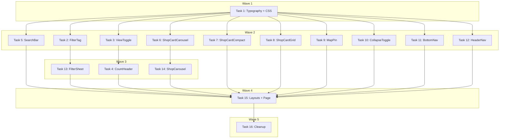

# Map View UI Rebuild — Implementation Plan

> **For Claude:** REQUIRED SUB-SKILL: Use executing-plans to implement this plan task-by-task.

**Design Doc:** [docs/designs/2026-03-19-map-view-rebuild-design.md](../designs/2026-03-19-map-view-rebuild-design.md)

**Spec References:** [SPEC.md#3-find-page](../../SPEC.md)

**PRD References:** [PRD.md#map-discovery](../../PRD.md)

**Goal:** Rebuild all 6 Map View screens (3 mobile + 3 desktop) from design.pen with 12 reusable components + 4 layout components.

**Architecture:** Fresh React components built from pixel-accurate design.pen specs. Two font families (Bricolage Grotesque + DM Sans). Components organized by domain (navigation/, map/, shops/, filters/, discovery/). Mobile-first responsive design using `useIsDesktop()` hook. URL-driven state via existing `useSearchState()`.

**Tech Stack:** Next.js 16, TypeScript, Tailwind CSS 4, Lucide React, React Map GL, Vaul (mobile drawer), Radix Dialog (desktop modal), Vitest + Testing Library

**Acceptance Criteria:**
- [ ] A user sees a full-bleed map with coffee pins and a bottom carousel of shop cards on mobile
- [ ] A user can toggle between map and list views using the ViewToggle pill
- [ ] A user can open the filter panel (drawer on mobile, modal on desktop) and apply tag filters
- [ ] A user on desktop sees a collapsible left panel with shop list and a selected-shop highlight
- [ ] A user on desktop list view sees a 3-column grid of photo shop cards

---

### Task 1: Typography & CSS Foundation

**Files:**
- Modify: `app/layout.tsx:1-37` (add DM_Sans import)
- Modify: `app/globals.css:7-13` (add font variables + design tokens)

**Step 1: No test needed — CSS/config only**

**Step 2: Add DM Sans to layout.tsx**

In `app/layout.tsx`, add the DM_Sans import and font instance:

```typescript
import {
  Bricolage_Grotesque,
  DM_Sans,
  Geist,
  Geist_Mono,
  Noto_Sans_TC,
} from 'next/font/google';

const dmSans = DM_Sans({
  variable: '--font-dm-sans',
  subsets: ['latin'],
  weight: ['400', '500', '600', '700'],
  display: 'swap',
});
```

Add `${dmSans.variable}` to the `<body>` className.

**Step 3: Update globals.css with design tokens**

Add to the `@theme inline` block:

```css
--font-heading: var(--font-bricolage), system-ui, sans-serif;
--font-body: var(--font-dm-sans), var(--font-noto-sans-tc), system-ui, sans-serif;
```

Add CafeRoam-specific CSS custom properties to `:root`:

```css
/* CafeRoam design tokens */
--map-pin: #8B5E3C;
--active-dark: #2C1810;
--tag-inactive-bg: #FFFFFF;
--tag-inactive-border: #E5E7EB;
--tag-inactive-text: #6B7280;
--tag-active-bg: #2C1810;
--tag-active-text: #FFFFFF;
--card-selected-bg: #FDF8F5;
--toggle-bg: #F0EFED;
--text-secondary: #6B7280;
--text-tertiary: #9CA3AF;
--rating-star: #FCD34D;
--border-medium: #E5E7EB;
```

**Step 4: Verify build**

Run: `pnpm build`
Expected: Build succeeds with no errors.

**Step 5: Commit**

```bash
git add app/layout.tsx app/globals.css
git commit -m "feat: add DM Sans font + CafeRoam design tokens"
```

---

### Task 2: FilterTag Component

**Files:**
- Create: `components/filters/filter-tag.tsx`
- Create: `components/filters/filter-tag.test.tsx`

**Step 1: Write the failing test**

```typescript
import { render, screen } from '@testing-library/react';
import userEvent from '@testing-library/user-event';
import { FilterTag } from './filter-tag';

describe('FilterTag', () => {
  it('renders label text', () => {
    render(<FilterTag label="WiFi" onClick={() => {}} />);
    expect(screen.getByText('WiFi')).toBeInTheDocument();
  });

  it('renders with inactive styles by default', () => {
    render(<FilterTag label="WiFi" onClick={() => {}} />);
    const button = screen.getByRole('button', { name: /wifi/i });
    expect(button).toHaveClass('bg-white');
  });

  it('renders with active styles when active prop is true', () => {
    render(<FilterTag label="WiFi" active onClick={() => {}} />);
    const button = screen.getByRole('button', { name: /wifi/i });
    expect(button).toHaveClass('bg-[var(--tag-active-bg)]');
  });

  it('calls onClick when clicked', async () => {
    const user = userEvent.setup();
    const onClick = vi.fn();
    render(<FilterTag label="WiFi" onClick={onClick} />);
    await user.click(screen.getByRole('button', { name: /wifi/i }));
    expect(onClick).toHaveBeenCalledOnce();
  });

  it('renders icon when icon prop provided', () => {
    const TestIcon = () => <svg data-testid="test-icon" />;
    render(<FilterTag label="WiFi" icon={TestIcon} onClick={() => {}} />);
    expect(screen.getByTestId('test-icon')).toBeInTheDocument();
  });

  it('renders green dot when dot prop is provided', () => {
    render(<FilterTag label="Open Now" dot="#3D8A5A" onClick={() => {}} />);
    expect(screen.getByTestId('filter-tag-dot')).toBeInTheDocument();
  });
});
```

**Step 2: Run test to verify it fails**

Run: `pnpm test -- components/filters/filter-tag.test.tsx`
Expected: FAIL — module not found.

**Step 3: Write minimal implementation**

```typescript
'use client';
import type { LucideIcon } from 'lucide-react';

interface FilterTagProps {
  label: string;
  icon?: LucideIcon;
  dot?: string;
  active?: boolean;
  onClick: () => void;
}

export function FilterTag({ label, icon: Icon, dot, active = false, onClick }: FilterTagProps) {
  return (
    <button
      type="button"
      aria-label={label}
      onClick={onClick}
      className={`flex items-center gap-1.5 rounded-full px-4 h-9 font-[family-name:var(--font-body)] text-[13px] font-medium transition-colors whitespace-nowrap ${
        active
          ? 'bg-[var(--tag-active-bg)] text-[var(--tag-active-text)]'
          : 'bg-white text-[var(--tag-inactive-text)] border border-[var(--tag-inactive-border)]'
      }`}
    >
      {dot && (
        <span
          data-testid="filter-tag-dot"
          className="h-2 w-2 rounded-full"
          style={{ backgroundColor: dot }}
        />
      )}
      {Icon && <Icon className="h-3.5 w-3.5" />}
      {label}
    </button>
  );
}
```

**Step 4: Run test to verify it passes**

Run: `pnpm test -- components/filters/filter-tag.test.tsx`
Expected: All 6 tests PASS.

**Step 5: Commit**

```bash
git add components/filters/filter-tag.tsx components/filters/filter-tag.test.tsx
git commit -m "feat: add FilterTag component with active/inactive states"
```

---

### Task 3: ViewToggle Component

**Files:**
- Create: `components/discovery/view-toggle.tsx`
- Create: `components/discovery/view-toggle.test.tsx`

**Step 1: Write the failing test**

```typescript
import { render, screen } from '@testing-library/react';
import userEvent from '@testing-library/user-event';
import { ViewToggle } from './view-toggle';

describe('ViewToggle', () => {
  it('renders map and list buttons', () => {
    render(<ViewToggle view="map" onChange={() => {}} />);
    expect(screen.getByRole('button', { name: /map/i })).toBeInTheDocument();
    expect(screen.getByRole('button', { name: /list/i })).toBeInTheDocument();
  });

  it('shows map button as active when view is map', () => {
    render(<ViewToggle view="map" onChange={() => {}} />);
    const mapBtn = screen.getByRole('button', { name: /map/i });
    expect(mapBtn).toHaveAttribute('data-active', 'true');
  });

  it('calls onChange with list when list button clicked', async () => {
    const user = userEvent.setup();
    const onChange = vi.fn();
    render(<ViewToggle view="map" onChange={onChange} />);
    await user.click(screen.getByRole('button', { name: /list/i }));
    expect(onChange).toHaveBeenCalledWith('list');
  });

  it('does not call onChange when clicking already active view', async () => {
    const user = userEvent.setup();
    const onChange = vi.fn();
    render(<ViewToggle view="map" onChange={onChange} />);
    await user.click(screen.getByRole('button', { name: /map/i }));
    expect(onChange).not.toHaveBeenCalled();
  });
});
```

**Step 2: Run test to verify it fails**

Run: `pnpm test -- components/discovery/view-toggle.test.tsx`
Expected: FAIL.

**Step 3: Write minimal implementation**

```typescript
'use client';
import { Map, List } from 'lucide-react';

interface ViewToggleProps {
  view: 'map' | 'list';
  onChange: (view: 'map' | 'list') => void;
}

export function ViewToggle({ view, onChange }: ViewToggleProps) {
  return (
    <div className="flex items-center gap-0.5 rounded-[14px] bg-[var(--toggle-bg)] p-[3px]">
      <button
        type="button"
        aria-label="Map view"
        data-active={view === 'map' || undefined}
        onClick={() => view !== 'map' && onChange('map')}
        className={`flex items-center justify-center rounded-[11px] h-6 w-7 transition-colors ${
          view === 'map' ? 'bg-[var(--active-dark)] text-white' : 'text-[var(--text-secondary)]'
        }`}
      >
        <Map className="h-3.5 w-3.5" />
      </button>
      <button
        type="button"
        aria-label="List view"
        data-active={view === 'list' || undefined}
        onClick={() => view !== 'list' && onChange('list')}
        className={`flex items-center justify-center rounded-[11px] h-6 w-7 transition-colors ${
          view === 'list' ? 'bg-[var(--active-dark)] text-white' : 'text-[var(--text-secondary)]'
        }`}
      >
        <List className="h-3.5 w-3.5" />
      </button>
    </div>
  );
}
```

**Step 4: Run test to verify it passes**

Run: `pnpm test -- components/discovery/view-toggle.test.tsx`
Expected: All 4 tests PASS.

**Step 5: Commit**

```bash
git add components/discovery/view-toggle.tsx components/discovery/view-toggle.test.tsx
git commit -m "feat: add ViewToggle map/list segmented toggle"
```

---

### Task 4: CountHeader Component

**Files:**
- Create: `components/discovery/count-header.tsx`
- Create: `components/discovery/count-header.test.tsx`

**Step 1: Write the failing test**

```typescript
import { render, screen } from '@testing-library/react';
import userEvent from '@testing-library/user-event';
import { CountHeader } from './count-header';

describe('CountHeader', () => {
  it('renders count text with number of places', () => {
    render(<CountHeader count={12} view="map" onViewChange={() => {}} />);
    expect(screen.getByText('12 places nearby')).toBeInTheDocument();
  });

  it('renders view toggle', () => {
    render(<CountHeader count={12} view="map" onViewChange={() => {}} />);
    expect(screen.getByRole('button', { name: /map/i })).toBeInTheDocument();
    expect(screen.getByRole('button', { name: /list/i })).toBeInTheDocument();
  });

  it('renders sort button when onSort is provided', () => {
    render(
      <CountHeader count={12} view="map" onViewChange={() => {}} onSort={() => {}} />
    );
    expect(screen.getByRole('button', { name: /sort/i })).toBeInTheDocument();
  });

  it('does not render sort button when onSort is not provided', () => {
    render(<CountHeader count={12} view="map" onViewChange={() => {}} />);
    expect(screen.queryByRole('button', { name: /sort/i })).not.toBeInTheDocument();
  });

  it('passes view change through to ViewToggle', async () => {
    const user = userEvent.setup();
    const onViewChange = vi.fn();
    render(<CountHeader count={5} view="map" onViewChange={onViewChange} />);
    await user.click(screen.getByRole('button', { name: /list/i }));
    expect(onViewChange).toHaveBeenCalledWith('list');
  });
});
```

**Step 2: Run test to verify it fails**

Run: `pnpm test -- components/discovery/count-header.test.tsx`
Expected: FAIL.

**Step 3: Write minimal implementation**

```typescript
'use client';
import { ArrowUpDown } from 'lucide-react';
import { ViewToggle } from './view-toggle';

interface CountHeaderProps {
  count: number;
  view: 'map' | 'list';
  onViewChange: (view: 'map' | 'list') => void;
  onSort?: () => void;
}

export function CountHeader({ count, view, onViewChange, onSort }: CountHeaderProps) {
  return (
    <div className="flex items-center justify-between px-5 py-1">
      <span className="font-[family-name:var(--font-heading)] text-[15px] font-bold text-[var(--foreground)]">
        {count} places nearby
      </span>
      <div className="flex items-center gap-2.5">
        <ViewToggle view={view} onChange={onViewChange} />
        {onSort && (
          <button
            type="button"
            aria-label="Sort"
            onClick={onSort}
            className="flex items-center gap-1 rounded-lg bg-[var(--background)] px-2.5 py-[5px] text-xs font-medium text-[var(--foreground)] border border-[var(--border)]"
          >
            <ArrowUpDown className="h-3 w-3 text-[var(--muted-foreground)]" />
            Sort
          </button>
        )}
      </div>
    </div>
  );
}
```

**Step 4: Run test to verify it passes**

Run: `pnpm test -- components/discovery/count-header.test.tsx`
Expected: All 5 tests PASS.

**Step 5: Commit**

```bash
git add components/discovery/count-header.tsx components/discovery/count-header.test.tsx
git commit -m "feat: add CountHeader with place count + view toggle + sort"
```

---

### Task 5: SearchBar Rebuild

**Files:**
- Create: `components/filters/search-bar.tsx`
- Create: `components/filters/search-bar.test.tsx`

**Step 1: Write the failing test**

```typescript
import { render, screen, fireEvent } from '@testing-library/react';
import userEvent from '@testing-library/user-event';
import { SearchBar } from './search-bar';

describe('SearchBar', () => {
  it('renders placeholder text', () => {
    render(<SearchBar onSearch={() => {}} onFilterClick={() => {}} />);
    expect(screen.getByPlaceholderText('Search coffee shops...')).toBeInTheDocument();
  });

  it('renders filter button', () => {
    render(<SearchBar onSearch={() => {}} onFilterClick={() => {}} />);
    expect(screen.getByRole('button', { name: /filter/i })).toBeInTheDocument();
  });

  it('calls onSearch when form submitted', async () => {
    const user = userEvent.setup();
    const onSearch = vi.fn();
    render(<SearchBar onSearch={onSearch} onFilterClick={() => {}} />);
    const input = screen.getByPlaceholderText('Search coffee shops...');
    await user.type(input, 'latte art');
    fireEvent.submit(input.closest('form')!);
    expect(onSearch).toHaveBeenCalledWith('latte art');
  });

  it('does not submit empty search', async () => {
    const onSearch = vi.fn();
    render(<SearchBar onSearch={onSearch} onFilterClick={() => {}} />);
    fireEvent.submit(screen.getByPlaceholderText('Search coffee shops...').closest('form')!);
    expect(onSearch).not.toHaveBeenCalled();
  });

  it('calls onFilterClick when filter button clicked', async () => {
    const user = userEvent.setup();
    const onFilterClick = vi.fn();
    render(<SearchBar onSearch={() => {}} onFilterClick={onFilterClick} />);
    await user.click(screen.getByRole('button', { name: /filter/i }));
    expect(onFilterClick).toHaveBeenCalledOnce();
  });

  it('pre-fills with defaultQuery', () => {
    render(<SearchBar onSearch={() => {}} onFilterClick={() => {}} defaultQuery="mocha" />);
    expect(screen.getByDisplayValue('mocha')).toBeInTheDocument();
  });
});
```

**Step 2: Run test to verify it fails**

Run: `pnpm test -- components/filters/search-bar.test.tsx`
Expected: FAIL.

**Step 3: Write minimal implementation**

```typescript
'use client';
import { useState, useEffect } from 'react';
import { Search, SlidersHorizontal } from 'lucide-react';

interface SearchBarProps {
  onSearch: (query: string) => void;
  onFilterClick: () => void;
  defaultQuery?: string;
  placeholder?: string;
}

export function SearchBar({
  onSearch,
  onFilterClick,
  defaultQuery = '',
  placeholder = 'Search coffee shops...',
}: SearchBarProps) {
  const [value, setValue] = useState(defaultQuery);

  useEffect(() => {
    setValue(defaultQuery);
  }, [defaultQuery]);

  function handleSubmit(e: React.FormEvent) {
    e.preventDefault();
    const trimmed = value.trim();
    if (!trimmed) return;
    onSearch(trimmed);
  }

  return (
    <form onSubmit={handleSubmit} className="flex items-center px-5 h-[52px]">
      <div className="flex items-center gap-3 w-full h-[52px] rounded-[26px] bg-white px-5 border border-[var(--border-medium)] shadow-[0_4px_16px_#0000000A]">
        <Search className="h-5 w-5 shrink-0 text-[var(--text-tertiary)]" />
        <input
          type="text"
          value={value}
          onChange={(e) => setValue(e.target.value)}
          placeholder={placeholder}
          className="flex-1 bg-transparent font-[family-name:var(--font-body)] text-[15px] text-[var(--foreground)] placeholder:text-[var(--text-tertiary)] outline-none"
        />
        <button
          type="button"
          aria-label="Open filters"
          onClick={onFilterClick}
          className="flex items-center justify-center h-9 w-9 rounded-xl bg-[var(--active-dark)] text-white shrink-0"
        >
          <SlidersHorizontal className="h-[18px] w-[18px]" />
        </button>
      </div>
    </form>
  );
}
```

**Step 4: Run test to verify it passes**

Run: `pnpm test -- components/filters/search-bar.test.tsx`
Expected: All 6 tests PASS.

**Step 5: Commit**

```bash
git add components/filters/search-bar.tsx components/filters/search-bar.test.tsx
git commit -m "feat: rebuild SearchBar with filter button + design.pen styling"
```

---

### Task 6: ShopCardCarousel Component

**Files:**
- Create: `components/shops/shop-card-carousel.tsx`
- Create: `components/shops/shop-card-carousel.test.tsx`

**Step 1: Write the failing test**

```typescript
import { render, screen } from '@testing-library/react';
import userEvent from '@testing-library/user-event';
import { ShopCardCarousel } from './shop-card-carousel';
import { makeShop } from '@/lib/test-utils/factories';

const shop = {
  ...makeShop(),
  id: 'shop-brew',
  name: 'The Brew House',
  rating: 4.8,
  review_count: 324,
  photo_urls: ['https://example.com/brew.jpg'],
  taxonomyTags: [
    { id: 't1', dimension: 'functionality' as const, label: 'Latte Art', labelZh: '拉花' },
    { id: 't2', dimension: 'functionality' as const, label: 'WiFi', labelZh: 'WiFi' },
  ],
};

describe('ShopCardCarousel', () => {
  it('renders shop name', () => {
    render(<ShopCardCarousel shop={shop} onClick={() => {}} />);
    expect(screen.getByText('The Brew House')).toBeInTheDocument();
  });

  it('renders rating with star', () => {
    render(<ShopCardCarousel shop={shop} onClick={() => {}} />);
    expect(screen.getByText('4.8')).toBeInTheDocument();
  });

  it('renders review count', () => {
    render(<ShopCardCarousel shop={shop} onClick={() => {}} />);
    expect(screen.getByText('(324)')).toBeInTheDocument();
  });

  it('renders taxonomy tags', () => {
    render(<ShopCardCarousel shop={shop} onClick={() => {}} />);
    expect(screen.getByText('Latte Art')).toBeInTheDocument();
    expect(screen.getByText('WiFi')).toBeInTheDocument();
  });

  it('renders shop photo', () => {
    render(<ShopCardCarousel shop={shop} onClick={() => {}} />);
    const img = screen.getByRole('img', { name: 'The Brew House' });
    expect(img).toHaveAttribute('src', expect.stringContaining('brew.jpg'));
  });

  it('calls onClick when card is clicked', async () => {
    const user = userEvent.setup();
    const onClick = vi.fn();
    render(<ShopCardCarousel shop={shop} onClick={onClick} />);
    await user.click(screen.getByRole('article'));
    expect(onClick).toHaveBeenCalledOnce();
  });
});
```

**Step 2: Run test to verify it fails**

Run: `pnpm test -- components/shops/shop-card-carousel.test.tsx`
Expected: FAIL.

**Step 3: Write minimal implementation**

```typescript
'use client';
import Image from 'next/image';
import { Star } from 'lucide-react';

interface CarouselShop {
  id: string;
  name: string;
  rating: number | null;
  review_count?: number;
  reviewCount?: number;
  photo_urls?: string[];
  photoUrls?: string[];
  taxonomyTags?: Array<{ id: string; label: string; labelZh: string }>;
  distance_km?: number | null;
}

interface ShopCardCarouselProps {
  shop: CarouselShop;
  onClick: () => void;
  distanceText?: string;
}

export function ShopCardCarousel({ shop, onClick, distanceText }: ShopCardCarouselProps) {
  const photos = shop.photo_urls ?? shop.photoUrls ?? [];
  const reviewCount = shop.review_count ?? shop.reviewCount ?? 0;
  const photoUrl = photos.length > 0 ? photos[0] : null;

  return (
    <article
      role="article"
      onClick={onClick}
      className="flex flex-col w-[260px] shrink-0 rounded-2xl bg-white shadow-[0_4px_16px_#0000000F] overflow-hidden cursor-pointer"
    >
      {photoUrl ? (
        <div className="relative h-20 w-full">
          <Image
            src={photoUrl}
            alt={shop.name}
            fill
            className="object-cover"
            sizes="260px"
          />
        </div>
      ) : (
        <div className="flex h-20 w-full items-center justify-center bg-[var(--background)] text-[var(--text-tertiary)]">
          No photo
        </div>
      )}
      <div className="flex flex-col gap-1.5 p-[12px_14px]">
        <div className="flex items-center justify-between">
          <span className="font-[family-name:var(--font-heading)] text-[15px] font-bold text-[var(--foreground)] truncate">
            {shop.name}
          </span>
          {distanceText && (
            <span className="text-xs font-medium text-[var(--text-tertiary)] shrink-0 ml-2">
              {distanceText}
            </span>
          )}
        </div>
        <div className="flex items-center gap-1">
          <Star className="h-[13px] w-[13px] fill-[var(--rating-star)] text-[var(--rating-star)]" />
          <span className="text-xs font-semibold text-[var(--foreground)]">
            {shop.rating?.toFixed(1) ?? '—'}
          </span>
          <span className="text-xs text-[var(--text-tertiary)]">({reviewCount})</span>
        </div>
        {shop.taxonomyTags && shop.taxonomyTags.length > 0 && (
          <div className="flex gap-1.5 flex-wrap">
            {shop.taxonomyTags.slice(0, 3).map((tag) => (
              <span
                key={tag.id}
                className="rounded-lg bg-[var(--background)] px-2 py-[3px] text-[11px] font-medium text-[var(--muted-foreground)]"
              >
                {tag.label}
              </span>
            ))}
          </div>
        )}
      </div>
    </article>
  );
}
```

**Step 4: Run test to verify it passes**

Run: `pnpm test -- components/shops/shop-card-carousel.test.tsx`
Expected: All 6 tests PASS.

**Step 5: Commit**

```bash
git add components/shops/shop-card-carousel.tsx components/shops/shop-card-carousel.test.tsx
git commit -m "feat: add ShopCardCarousel for mobile map bottom carousel"
```

---

### Task 7: ShopCardCompact Component

**Files:**
- Create: `components/shops/shop-card-compact.tsx`
- Create: `components/shops/shop-card-compact.test.tsx`

**Step 1: Write the failing test**

```typescript
import { render, screen } from '@testing-library/react';
import userEvent from '@testing-library/user-event';
import { ShopCardCompact } from './shop-card-compact';
import { makeShop } from '@/lib/test-utils/factories';

const shop = {
  ...makeShop(),
  id: 'shop-brew',
  name: 'The Brew House',
  rating: 4.8,
  photo_urls: ['https://example.com/brew.jpg'],
};

describe('ShopCardCompact', () => {
  it('renders shop name', () => {
    render(<ShopCardCompact shop={shop} onClick={() => {}} />);
    expect(screen.getByText('The Brew House')).toBeInTheDocument();
  });

  it('renders rating and meta text', () => {
    render(<ShopCardCompact shop={shop} onClick={() => {}} />);
    expect(screen.getByText(/4\.8/)).toBeInTheDocument();
  });

  it('renders shop photo', () => {
    render(<ShopCardCompact shop={shop} onClick={() => {}} />);
    expect(screen.getByRole('img', { name: 'The Brew House' })).toBeInTheDocument();
  });

  it('renders chevron arrow', () => {
    render(<ShopCardCompact shop={shop} onClick={() => {}} />);
    expect(screen.getByTestId('compact-card-arrow')).toBeInTheDocument();
  });

  it('shows selected state with accent border and highlight bg', () => {
    const { container } = render(<ShopCardCompact shop={shop} onClick={() => {}} selected />);
    const article = container.querySelector('article');
    expect(article).toHaveAttribute('data-selected', 'true');
  });

  it('calls onClick when clicked', async () => {
    const user = userEvent.setup();
    const onClick = vi.fn();
    render(<ShopCardCompact shop={shop} onClick={onClick} />);
    await user.click(screen.getByRole('article'));
    expect(onClick).toHaveBeenCalledOnce();
  });
});
```

**Step 2: Run test to verify it fails**

Run: `pnpm test -- components/shops/shop-card-compact.test.tsx`
Expected: FAIL.

**Step 3: Write minimal implementation**

```typescript
'use client';
import Image from 'next/image';
import { ChevronRight } from 'lucide-react';

interface CompactShop {
  id: string;
  name: string;
  rating: number | null;
  photo_urls?: string[];
  photoUrls?: string[];
  distance_m?: number | null;
  is_open?: boolean | null;
  taxonomyTags?: Array<{ id: string; label: string; labelZh: string }>;
}

interface ShopCardCompactProps {
  shop: CompactShop;
  onClick: () => void;
  selected?: boolean;
}

function formatMeta(shop: CompactShop): string {
  const parts: string[] = [];
  if (shop.rating != null) parts.push(`★ ${shop.rating.toFixed(1)}`);
  if (shop.distance_m != null) {
    parts.push(shop.distance_m < 1000 ? `${shop.distance_m}m` : `${(shop.distance_m / 1000).toFixed(1)} km`);
  }
  if (shop.is_open != null) parts.push(shop.is_open ? 'Open' : 'Closed');
  return parts.join('  ·  ');
}

export function ShopCardCompact({ shop, onClick, selected = false }: ShopCardCompactProps) {
  const photos = shop.photo_urls ?? shop.photoUrls ?? [];
  const photoUrl = photos.length > 0 ? photos[0] : null;

  return (
    <article
      role="article"
      data-selected={selected || undefined}
      onClick={onClick}
      className={`flex items-center gap-3 px-5 py-0 h-20 cursor-pointer transition-colors ${
        selected
          ? 'bg-[var(--card-selected-bg)] border-l-[3px] border-l-[var(--map-pin)]'
          : 'bg-[var(--background)]'
      }`}
    >
      {photoUrl ? (
        <div className="relative h-16 w-16 shrink-0 rounded-[10px] overflow-hidden">
          <Image src={photoUrl} alt={shop.name} fill className="object-cover" sizes="64px" />
        </div>
      ) : (
        <div className="flex h-16 w-16 shrink-0 items-center justify-center rounded-[10px] bg-[var(--muted)] text-[var(--text-tertiary)] text-xs">
          ☕
        </div>
      )}
      <div className="flex flex-col gap-1 flex-1 min-w-0">
        <span className="font-[family-name:var(--font-body)] text-[15px] font-semibold text-[var(--foreground)] truncate">
          {shop.name}
        </span>
        <span className="font-[family-name:var(--font-body)] text-[13px] text-[var(--text-secondary)]">
          {formatMeta(shop)}
        </span>
      </div>
      <ChevronRight data-testid="compact-card-arrow" className="h-[18px] w-[18px] shrink-0 text-[var(--border-strong,#D1D0CD)]" />
    </article>
  );
}
```

**Step 4: Run test to verify it passes**

Run: `pnpm test -- components/shops/shop-card-compact.test.tsx`
Expected: All 6 tests PASS.

**Step 5: Commit**

```bash
git add components/shops/shop-card-compact.tsx components/shops/shop-card-compact.test.tsx
git commit -m "feat: add ShopCardCompact for list view + desktop panel with selected state"
```

---

### Task 8: ShopCardGrid Component

**Files:**
- Create: `components/shops/shop-card-grid.tsx`
- Create: `components/shops/shop-card-grid.test.tsx`

**Step 1: Write the failing test**

```typescript
import { render, screen } from '@testing-library/react';
import userEvent from '@testing-library/user-event';
import { ShopCardGrid } from './shop-card-grid';
import { makeShop } from '@/lib/test-utils/factories';

const shop = {
  ...makeShop(),
  id: 'shop-brew',
  name: 'The Brew House',
  rating: 4.8,
  review_count: 324,
  photo_urls: ['https://example.com/brew.jpg'],
  taxonomyTags: [
    { id: 't1', dimension: 'functionality' as const, label: 'Quiet', labelZh: '安靜' },
  ],
};

describe('ShopCardGrid', () => {
  it('renders shop name', () => {
    render(<ShopCardGrid shop={shop} onClick={() => {}} />);
    expect(screen.getByText('The Brew House')).toBeInTheDocument();
  });

  it('renders photo', () => {
    render(<ShopCardGrid shop={shop} onClick={() => {}} />);
    expect(screen.getByRole('img', { name: 'The Brew House' })).toBeInTheDocument();
  });

  it('renders rating', () => {
    render(<ShopCardGrid shop={shop} onClick={() => {}} />);
    expect(screen.getByText(/4\.8/)).toBeInTheDocument();
  });

  it('renders open status when provided', () => {
    render(<ShopCardGrid shop={{ ...shop, is_open: true }} onClick={() => {}} />);
    expect(screen.getByText('Open')).toBeInTheDocument();
  });

  it('calls onClick when card is clicked', async () => {
    const user = userEvent.setup();
    const onClick = vi.fn();
    render(<ShopCardGrid shop={shop} onClick={onClick} />);
    await user.click(screen.getByRole('article'));
    expect(onClick).toHaveBeenCalledOnce();
  });
});
```

**Step 2: Run test to verify it fails**

Run: `pnpm test -- components/shops/shop-card-grid.test.tsx`
Expected: FAIL.

**Step 3: Write minimal implementation**

```typescript
'use client';
import Image from 'next/image';
import { Star, ChevronRight } from 'lucide-react';

interface GridShop {
  id: string;
  name: string;
  rating: number | null;
  review_count?: number;
  reviewCount?: number;
  photo_urls?: string[];
  photoUrls?: string[];
  distance_m?: number | null;
  is_open?: boolean | null;
  taxonomyTags?: Array<{ id: string; label: string; labelZh: string }>;
}

interface ShopCardGridProps {
  shop: GridShop;
  onClick: () => void;
}

export function ShopCardGrid({ shop, onClick }: ShopCardGridProps) {
  const photos = shop.photo_urls ?? shop.photoUrls ?? [];
  const reviewCount = shop.review_count ?? shop.reviewCount ?? 0;
  const photoUrl = photos.length > 0 ? photos[0] : null;

  return (
    <article
      role="article"
      onClick={onClick}
      className="flex flex-col rounded-2xl bg-white overflow-hidden cursor-pointer shadow-[0_2px_8px_#0000000A] hover:shadow-[0_4px_16px_#0000000F] transition-shadow"
    >
      {photoUrl ? (
        <div className="relative aspect-[4/3] w-full">
          <Image src={photoUrl} alt={shop.name} fill className="object-cover" sizes="(min-width: 1024px) 33vw, 100vw" />
        </div>
      ) : (
        <div className="flex aspect-[4/3] w-full items-center justify-center bg-[var(--background)] text-[var(--text-tertiary)]">
          No photo
        </div>
      )}
      <div className="flex flex-col gap-1 p-3">
        <div className="flex items-center justify-between">
          <span className="font-[family-name:var(--font-body)] text-sm font-semibold text-[var(--foreground)] truncate">
            {shop.name}
          </span>
          <ChevronRight className="h-4 w-4 shrink-0 text-[var(--text-tertiary)]" />
        </div>
        <div className="flex items-center gap-1 text-xs text-[var(--muted-foreground)]">
          <Star className="h-3 w-3 fill-[var(--rating-star)] text-[var(--rating-star)]" />
          <span className="font-semibold text-[var(--foreground)]">{shop.rating?.toFixed(1) ?? '—'}</span>
          {shop.distance_m != null && (
            <>
              <span>·</span>
              <span>{shop.distance_m < 1000 ? `${shop.distance_m}m` : `${(shop.distance_m / 1000).toFixed(1)} km`}</span>
            </>
          )}
          {shop.is_open != null && (
            <>
              <span>·</span>
              <span className={shop.is_open ? 'text-[var(--primary)]' : 'text-[var(--destructive)]'}>
                {shop.is_open ? 'Open' : 'Closed'}
              </span>
            </>
          )}
        </div>
      </div>
    </article>
  );
}
```

**Step 4: Run test to verify it passes**

Run: `pnpm test -- components/shops/shop-card-grid.test.tsx`
Expected: All 5 tests PASS.

**Step 5: Commit**

```bash
git add components/shops/shop-card-grid.tsx components/shops/shop-card-grid.test.tsx
git commit -m "feat: add ShopCardGrid for desktop list 3-column grid"
```

---

### Task 9: MapPin Component

**Files:**
- Create: `components/map/map-pin.tsx`
- Create: `components/map/map-pin.test.tsx`

**Step 1: Write the failing test**

```typescript
import { render, screen } from '@testing-library/react';
import { MapPin } from './map-pin';

describe('MapPin', () => {
  it('renders an SVG pin', () => {
    const { container } = render(<MapPin />);
    expect(container.querySelector('svg')).toBeInTheDocument();
  });

  it('uses default brown color when not active', () => {
    const { container } = render(<MapPin />);
    const circle = container.querySelector('circle');
    expect(circle).toHaveAttribute('fill', '#8B5E3C');
  });

  it('uses coral color when active', () => {
    const { container } = render(<MapPin active />);
    const circle = container.querySelector('circle');
    expect(circle).toHaveAttribute('fill', '#FF6B6B');
  });

  it('renders triangle tip', () => {
    const { container } = render(<MapPin />);
    expect(container.querySelector('polygon')).toBeInTheDocument();
  });
});
```

**Step 2: Run test to verify it fails**

Run: `pnpm test -- components/map/map-pin.test.tsx`
Expected: FAIL.

**Step 3: Write minimal implementation**

Extract the existing `CoffeePinIcon` from `components/map/map-view.tsx` into its own file:

```typescript
interface MapPinProps {
  active?: boolean;
}

const SIZE_DEFAULT = 40;
const SIZE_ACTIVE = 44;
const COLOR_DEFAULT = '#8B5E3C';
const COLOR_ACTIVE = '#FF6B6B';
const TIP_HEIGHT = 8;

export function MapPin({ active = false }: MapPinProps) {
  const size = active ? SIZE_ACTIVE : SIZE_DEFAULT;
  const color = active ? COLOR_ACTIVE : COLOR_DEFAULT;
  const radius = size / 2;
  const iconSize = Math.round(size * 0.5);

  return (
    <svg
      width={size}
      height={size + TIP_HEIGHT}
      viewBox={`0 0 ${size} ${size + TIP_HEIGHT}`}
      fill="none"
      xmlns="http://www.w3.org/2000/svg"
      aria-hidden="true"
    >
      <circle cx={radius} cy={radius} r={radius} fill={color} />
      <polygon
        points={`${radius - 6},${size - 2} ${radius},${size + TIP_HEIGHT} ${radius + 6},${size - 2}`}
        fill={color}
      />
      <g
        transform={`translate(${(size - iconSize) / 2}, ${(size - iconSize) / 2})`}
        stroke="white"
        strokeWidth={2}
        strokeLinecap="round"
        strokeLinejoin="round"
        fill="none"
      >
        <path d={`M${iconSize * 0.146} ${iconSize * 0.333}h${iconSize * 0.542}a${iconSize * 0.167} ${iconSize * 0.167} 0 0 1 0 ${iconSize * 0.333}h-${iconSize * 0.542}z`} />
        <path d={`M${iconSize * 0.688} ${iconSize * 0.5}a${iconSize * 0.208} ${iconSize * 0.208} 0 0 0 0-${iconSize * 0.333}`} />
        <path d={`M${iconSize * 0.083} ${iconSize * 0.667}l${iconSize * 0.125} ${iconSize * 0.25}h${iconSize * 0.583}l${iconSize * 0.125}-${iconSize * 0.25}`} />
      </g>
    </svg>
  );
}
```

**Step 4: Run test to verify it passes**

Run: `pnpm test -- components/map/map-pin.test.tsx`
Expected: All 4 tests PASS.

**Step 5: Commit**

```bash
git add components/map/map-pin.tsx components/map/map-pin.test.tsx
git commit -m "feat: extract MapPin SVG component with default/active states"
```

---

### Task 10: CollapseToggle Component

**Files:**
- Create: `components/map/collapse-toggle.tsx`
- Create: `components/map/collapse-toggle.test.tsx`

**Step 1: Write the failing test**

```typescript
import { render, screen } from '@testing-library/react';
import userEvent from '@testing-library/user-event';
import { CollapseToggle } from './collapse-toggle';

describe('CollapseToggle', () => {
  it('renders a button', () => {
    render(<CollapseToggle collapsed={false} onClick={() => {}} />);
    expect(screen.getByRole('button', { name: /collapse/i })).toBeInTheDocument();
  });

  it('calls onClick when clicked', async () => {
    const user = userEvent.setup();
    const onClick = vi.fn();
    render(<CollapseToggle collapsed={false} onClick={onClick} />);
    await user.click(screen.getByRole('button', { name: /collapse/i }));
    expect(onClick).toHaveBeenCalledOnce();
  });

  it('shows expand label when collapsed', () => {
    render(<CollapseToggle collapsed={true} onClick={() => {}} />);
    expect(screen.getByRole('button', { name: /expand/i })).toBeInTheDocument();
  });
});
```

**Step 2: Run test to verify it fails**

Run: `pnpm test -- components/map/collapse-toggle.test.tsx`
Expected: FAIL.

**Step 3: Write minimal implementation**

```typescript
'use client';
import { ChevronLeft, ChevronRight } from 'lucide-react';

interface CollapseToggleProps {
  collapsed: boolean;
  onClick: () => void;
}

export function CollapseToggle({ collapsed, onClick }: CollapseToggleProps) {
  return (
    <button
      type="button"
      aria-label={collapsed ? 'Expand panel' : 'Collapse panel'}
      onClick={onClick}
      className="flex items-center justify-center w-5 h-12 rounded-r-lg bg-[#F0EDE8] border border-[var(--border)] text-[var(--muted-foreground)] hover:bg-[var(--muted)] transition-colors"
    >
      {collapsed ? <ChevronRight className="h-3 w-3" /> : <ChevronLeft className="h-3 w-3" />}
    </button>
  );
}
```

**Step 4: Run test to verify it passes**

Run: `pnpm test -- components/map/collapse-toggle.test.tsx`
Expected: All 3 tests PASS.

**Step 5: Commit**

```bash
git add components/map/collapse-toggle.tsx components/map/collapse-toggle.test.tsx
git commit -m "feat: add CollapseToggle for desktop left panel"
```

---

### Task 11: BottomNav Rebuild

**Files:**
- Create: `components/navigation/bottom-nav-new.tsx` (rename to `bottom-nav.tsx` in Task 18)
- Create: `components/navigation/bottom-nav-new.test.tsx`

**Step 1: Write the failing test**

```typescript
import { render, screen } from '@testing-library/react';
import { BottomNavNew } from './bottom-nav-new';

vi.mock('next/navigation', () => ({
  usePathname: vi.fn(() => '/'),
}));

vi.mock('next/link', () => ({
  default: ({ children, href, ...props }: { children: React.ReactNode; href: string; [key: string]: unknown }) => (
    <a href={href} {...props}>{children}</a>
  ),
}));

describe('BottomNavNew', () => {
  it('renders 4 tabs with Chinese labels', () => {
    render(<BottomNavNew />);
    expect(screen.getByText('地圖')).toBeInTheDocument();
    expect(screen.getByText('探索')).toBeInTheDocument();
    expect(screen.getByText('收藏')).toBeInTheDocument();
    expect(screen.getByText('我的')).toBeInTheDocument();
  });

  it('has pill-shaped container', () => {
    const { container } = render(<BottomNavNew />);
    const pill = container.querySelector('[data-testid="tab-bar-pill"]');
    expect(pill).toBeInTheDocument();
  });

  it('shows active state for current route', () => {
    render(<BottomNavNew />);
    const findTab = screen.getByText('地圖').closest('[data-tab]');
    expect(findTab).toHaveAttribute('data-active', 'true');
  });

  it('links to correct routes', () => {
    render(<BottomNavNew />);
    expect(screen.getByText('探索').closest('a')).toHaveAttribute('href', '/explore');
    expect(screen.getByText('收藏').closest('a')).toHaveAttribute('href', '/lists');
    expect(screen.getByText('我的').closest('a')).toHaveAttribute('href', '/profile');
  });
});
```

**Step 2: Run test to verify it fails**

Run: `pnpm test -- components/navigation/bottom-nav-new.test.tsx`
Expected: FAIL.

**Step 3: Write minimal implementation**

```typescript
'use client';
import Link from 'next/link';
import { usePathname } from 'next/navigation';
import { Map, Compass, Heart, User } from 'lucide-react';
import type { LucideIcon } from 'lucide-react';

const TABS: { href: string; label: string; icon: LucideIcon }[] = [
  { href: '/', label: '地圖', icon: Map },
  { href: '/explore', label: '探索', icon: Compass },
  { href: '/lists', label: '收藏', icon: Heart },
  { href: '/profile', label: '我的', icon: User },
];

export function BottomNavNew() {
  const pathname = usePathname();

  return (
    <nav className="fixed right-0 bottom-0 left-0 z-40 px-4 pb-4">
      <div
        data-testid="tab-bar-pill"
        className="flex rounded-[36px] bg-white p-1 shadow-[0_4px_20px_#0000001A] h-[62px]"
      >
        {TABS.map(({ href, label, icon: Icon }) => {
          const isActive = pathname === href || (href !== '/' && pathname.startsWith(href));
          return (
            <Link
              key={href}
              href={href}
              data-tab={label}
              data-active={isActive || undefined}
              className={`flex flex-1 flex-col items-center justify-center gap-0.5 rounded-[26px] font-[family-name:var(--font-body)] text-[11px] font-medium transition-colors ${
                isActive
                  ? 'bg-[var(--active-dark)] text-white'
                  : 'text-[var(--text-tertiary)]'
              }`}
            >
              <Icon className="h-5 w-5" />
              <span>{label}</span>
            </Link>
          );
        })}
      </div>
    </nav>
  );
}
```

**Step 4: Run test to verify it passes**

Run: `pnpm test -- components/navigation/bottom-nav-new.test.tsx`
Expected: All 4 tests PASS.

**Step 5: Commit**

```bash
git add components/navigation/bottom-nav-new.tsx components/navigation/bottom-nav-new.test.tsx
git commit -m "feat: rebuild BottomNav as pill-shaped tab bar with design.pen styling"
```

---

### Task 12: HeaderNav Rebuild

**Files:**
- Create: `components/navigation/header-nav-new.tsx`
- Create: `components/navigation/header-nav-new.test.tsx`

**Step 1: Write the failing test**

```typescript
import { render, screen } from '@testing-library/react';
import { HeaderNavNew } from './header-nav-new';

vi.mock('next/navigation', () => ({
  usePathname: vi.fn(() => '/'),
}));

vi.mock('next/link', () => ({
  default: ({ children, href, ...props }: { children: React.ReactNode; href: string; [key: string]: unknown }) => (
    <a href={href} {...props}>{children}</a>
  ),
}));

describe('HeaderNavNew', () => {
  it('renders logo with 啡遊 CafeRoam', () => {
    render(<HeaderNavNew activeTab="find" />);
    expect(screen.getByText('啡遊 CafeRoam')).toBeInTheDocument();
  });

  it('renders 4 nav items', () => {
    render(<HeaderNavNew activeTab="find" />);
    expect(screen.getByText('Find')).toBeInTheDocument();
    expect(screen.getByText('Explore')).toBeInTheDocument();
    expect(screen.getByText('Favorites')).toBeInTheDocument();
    expect(screen.getByText('Profile')).toBeInTheDocument();
  });

  it('shows Find as active when activeTab is find', () => {
    render(<HeaderNavNew activeTab="find" />);
    const findLink = screen.getByText('Find').closest('a');
    expect(findLink).toHaveAttribute('data-active', 'true');
  });

  it('renders search button', () => {
    render(<HeaderNavNew activeTab="find" />);
    expect(screen.getByRole('button', { name: /search/i })).toBeInTheDocument();
  });
});
```

**Step 2: Run test to verify it fails**

Run: `pnpm test -- components/navigation/header-nav-new.test.tsx`
Expected: FAIL.

**Step 3: Write minimal implementation**

```typescript
'use client';
import Link from 'next/link';
import { usePathname } from 'next/navigation';
import { MapPin, Compass, Bookmark, User, Search } from 'lucide-react';
import type { LucideIcon } from 'lucide-react';

const NAV_ITEMS: { href: string; label: string; icon: LucideIcon; tab: string }[] = [
  { href: '/', label: 'Find', icon: MapPin, tab: 'find' },
  { href: '/explore', label: 'Explore', icon: Compass, tab: 'explore' },
  { href: '/lists', label: 'Favorites', icon: Bookmark, tab: 'favorites' },
  { href: '/profile', label: 'Profile', icon: User, tab: 'profile' },
];

interface HeaderNavNewProps {
  activeTab?: string;
}

export function HeaderNavNew({ activeTab }: HeaderNavNewProps) {
  const pathname = usePathname();
  const currentTab = activeTab ?? (pathname === '/' ? 'find' : pathname.replace('/', ''));

  return (
    <header className="fixed top-0 right-0 left-0 z-40 flex items-center justify-between h-16 px-8 bg-white border-b border-[#D1D0CD]">
      <Link href="/" className="flex items-center gap-2.5">
        <div className="flex items-center justify-center h-8 w-8 rounded-lg bg-[var(--map-pin)]">
          <span className="font-[family-name:var(--font-heading)] text-base font-bold text-white">啡</span>
        </div>
        <span className="font-[family-name:var(--font-heading)] text-base font-bold text-[var(--foreground)]">
          啡遊 CafeRoam
        </span>
      </Link>

      <nav className="flex items-center gap-0.5">
        {NAV_ITEMS.map(({ href, label, icon: Icon, tab }) => {
          const isActive = currentTab === tab;
          return (
            <Link
              key={tab}
              href={href}
              data-active={isActive || undefined}
              className={`flex items-center gap-[5px] rounded-[20px] px-4 h-9 font-[family-name:var(--font-body)] text-sm transition-colors ${
                isActive
                  ? 'bg-[var(--active-dark)] text-white font-semibold'
                  : 'text-[var(--muted-foreground)] font-medium'
              }`}
            >
              <Icon className="h-3.5 w-3.5" />
              {label}
            </Link>
          );
        })}
      </nav>

      <div className="flex items-center gap-2">
        <button
          type="button"
          aria-label="Search"
          className="flex items-center justify-center h-9 w-9 rounded-[18px] bg-[var(--background)] text-[var(--muted-foreground)]"
        >
          <Search className="h-[18px] w-[18px]" />
        </button>
        <div className="flex items-center justify-center h-8 w-8 rounded-full bg-[var(--map-pin)]">
          <span className="font-[family-name:var(--font-body)] text-sm font-semibold text-white">Y</span>
        </div>
      </div>
    </header>
  );
}
```

**Step 4: Run test to verify it passes**

Run: `pnpm test -- components/navigation/header-nav-new.test.tsx`
Expected: All 4 tests PASS.

**Step 5: Commit**

```bash
git add components/navigation/header-nav-new.tsx components/navigation/header-nav-new.test.tsx
git commit -m "feat: rebuild HeaderNav with logo, pill nav items, avatar"
```

---

### Task 13: FilterSheet Rebuild

**Files:**
- Create: `components/filters/filter-sheet.tsx`
- Create: `components/filters/filter-sheet.test.tsx`

**Note:** This task reuses the existing filter sheet's tag data and logic from `components/discovery/filter-sheet.tsx`, but wraps it with the new design styling (bottom sheet on mobile via vaul, Radix Dialog on desktop). The inner FilterContent is the shared component.

**Step 1: Write the failing test**

```typescript
import { render, screen } from '@testing-library/react';
import userEvent from '@testing-library/user-event';
import { FilterSheet } from './filter-sheet';

// Mock vaul Drawer
vi.mock('vaul', () => ({
  Drawer: {
    Root: ({ children, open }: { children: React.ReactNode; open: boolean }) =>
      open ? <div data-testid="drawer">{children}</div> : null,
    Portal: ({ children }: { children: React.ReactNode }) => <>{children}</>,
    Overlay: () => <div data-testid="drawer-overlay" />,
    Content: ({ children }: { children: React.ReactNode }) => <div>{children}</div>,
    Title: ({ children }: { children: React.ReactNode }) => <h2>{children}</h2>,
  },
}));

vi.mock('@/lib/hooks/use-media-query', () => ({
  useIsDesktop: vi.fn(() => false),
}));

describe('FilterSheet', () => {
  it('renders title when open', () => {
    render(<FilterSheet open onClose={() => {}} onApply={() => {}} initialFilters={[]} />);
    expect(screen.getByText('Filters')).toBeInTheDocument();
  });

  it('renders Clear All button', () => {
    render(<FilterSheet open onClose={() => {}} onApply={() => {}} initialFilters={[]} />);
    expect(screen.getByRole('button', { name: /clear all/i })).toBeInTheDocument();
  });

  it('renders category tabs', () => {
    render(<FilterSheet open onClose={() => {}} onApply={() => {}} initialFilters={[]} />);
    expect(screen.getByText('Functionality')).toBeInTheDocument();
  });

  it('renders apply button with count', () => {
    render(<FilterSheet open onClose={() => {}} onApply={() => {}} initialFilters={['wifi']} />);
    expect(screen.getByRole('button', { name: /show/i })).toBeInTheDocument();
  });
});
```

**Step 2: Run test to verify it fails**

Run: `pnpm test -- components/filters/filter-sheet.test.tsx`
Expected: FAIL.

**Step 3: Write implementation**

This is a larger component. The FilterContent inner component renders:
- Header: "Filters" + selected count badge + "Clear All" button
- Search bar for filtering tags
- Category tabs (Functionality, Time, Ambience, Mode, Food)
- Tag grid (FilterTag instances)
- Distance slider
- Apply button ("Show N places")

Import the tag data from the existing `components/discovery/filter-sheet.tsx` — copy the `LAUNCH_TAGS` array into the new file or extract to a shared `lib/data/filter-tags.ts`.

The wrapper component detects `useIsDesktop()` and renders vaul Drawer (mobile) or a modal overlay (desktop).

Full code in the component file — follow the pattern from the existing filter-sheet but with:
- Rounded corners `[24px, 24px, 0, 0]` on mobile sheet
- `#FFFFFF` background
- Handle bar at top
- Green primary button for "Show N places"

**Step 4: Run test to verify it passes**

Run: `pnpm test -- components/filters/filter-sheet.test.tsx`
Expected: All 4 tests PASS.

**Step 5: Commit**

```bash
git add components/filters/filter-sheet.tsx components/filters/filter-sheet.test.tsx
git commit -m "feat: rebuild FilterSheet with vaul drawer (mobile) + modal (desktop)"
```

---

### Task 14: ShopCarousel Container

**Files:**
- Create: `components/map/shop-carousel.tsx`
- Create: `components/map/shop-carousel.test.tsx`

**Step 1: Write the failing test**

```typescript
import { render, screen } from '@testing-library/react';
import { ShopCarousel } from './shop-carousel';
import { makeShop } from '@/lib/test-utils/factories';

const shops = [
  { ...makeShop(), id: 'shop-1', name: 'Brew House', photo_urls: ['https://example.com/1.jpg'] },
  { ...makeShop(), id: 'shop-2', name: 'Velvet Bean', photo_urls: ['https://example.com/2.jpg'] },
];

describe('ShopCarousel', () => {
  it('renders all shop cards', () => {
    render(<ShopCarousel shops={shops} onShopClick={() => {}} />);
    expect(screen.getByText('Brew House')).toBeInTheDocument();
    expect(screen.getByText('Velvet Bean')).toBeInTheDocument();
  });

  it('renders section header', () => {
    render(<ShopCarousel shops={shops} onShopClick={() => {}} />);
    expect(screen.getByText('Nearby Coffee Shops')).toBeInTheDocument();
  });

  it('renders shop count', () => {
    render(<ShopCarousel shops={shops} onShopClick={() => {}} />);
    expect(screen.getByText('2 places')).toBeInTheDocument();
  });

  it('has horizontal scroll container', () => {
    const { container } = render(<ShopCarousel shops={shops} onShopClick={() => {}} />);
    expect(container.querySelector('[data-testid="carousel-scroll"]')).toBeInTheDocument();
  });
});
```

**Step 2: Run test to verify it fails**

Run: `pnpm test -- components/map/shop-carousel.test.tsx`
Expected: FAIL.

**Step 3: Write minimal implementation**

```typescript
'use client';
import { useRef, useEffect } from 'react';
import { ShopCardCarousel } from '@/components/shops/shop-card-carousel';

interface CarouselShop {
  id: string;
  name: string;
  rating: number | null;
  photo_urls?: string[];
  photoUrls?: string[];
  taxonomyTags?: Array<{ id: string; label: string; labelZh: string }>;
  review_count?: number;
  reviewCount?: number;
}

interface ShopCarouselProps {
  shops: CarouselShop[];
  onShopClick: (shopId: string) => void;
  selectedShopId?: string | null;
}

export function ShopCarousel({ shops, onShopClick, selectedShopId }: ShopCarouselProps) {
  const scrollRef = useRef<HTMLDivElement>(null);

  useEffect(() => {
    if (!selectedShopId || !scrollRef.current) return;
    const idx = shops.findIndex((s) => s.id === selectedShopId);
    if (idx < 0) return;
    const card = scrollRef.current.children[idx] as HTMLElement | undefined;
    card?.scrollIntoView({ behavior: 'smooth', block: 'nearest', inline: 'center' });
  }, [selectedShopId, shops]);

  return (
    <div className="flex flex-col gap-3">
      <div className="flex items-center justify-between px-5">
        <span className="font-[family-name:var(--font-heading)] text-[17px] font-bold text-[var(--foreground)]">
          Nearby Coffee Shops
        </span>
        <span className="font-[family-name:var(--font-body)] text-[13px] font-medium text-[var(--text-tertiary)]">
          {shops.length} places
        </span>
      </div>
      <div
        ref={scrollRef}
        data-testid="carousel-scroll"
        className="flex gap-3 overflow-x-auto px-5 pb-2 scrollbar-none"
      >
        {shops.map((shop) => (
          <ShopCardCarousel
            key={shop.id}
            shop={shop}
            onClick={() => onShopClick(shop.id)}
          />
        ))}
      </div>
    </div>
  );
}
```

**Step 4: Run test to verify it passes**

Run: `pnpm test -- components/map/shop-carousel.test.tsx`
Expected: All 4 tests PASS.

**Step 5: Commit**

```bash
git add components/map/shop-carousel.tsx components/map/shop-carousel.test.tsx
git commit -m "feat: add ShopCarousel horizontal scroll container with auto-scroll"
```

---

### Task 15: Layout Components + Page Integration

**Files:**
- Create: `components/map/map-mobile-layout.tsx`
- Create: `components/map/list-mobile-layout.tsx`
- Create: `components/map/map-desktop-layout.tsx`
- Create: `components/map/list-desktop-layout.tsx`
- Modify: `app/page.tsx` (swap imports to new components)
- Modify: `components/navigation/app-shell.tsx` (swap to new nav components)

**Step 1: No standalone test — integration test covers these layouts**

Layout components are thin wrappers composing reusable components. They're tested through the page integration test.

**Step 2: Create MapMobileLayout**

Full-bleed map with:
- Absolute-positioned gradient overlay at top (search + filters + count)
- Bottom gradient card area with ShopCarousel + BottomNav
- My Location button (absolute bottom-right)

Uses the existing `MapView` (dynamic import, ssr: false) for the map canvas.

**Step 3: Create ListMobileLayout**

Vertical stack:
- SearchBar (top)
- FilterTag horizontal scroll
- CountHeader
- Scrollable ShopCardCompact list with dividers
- BottomNav

**Step 4: Create MapDesktopLayout**

Side-by-side:
- HeaderNav (fixed top)
- LeftPanel (420px, contains SearchBar + FilterTags + CountHeader + scrollable ShopCardCompact list)
- CollapseToggle (20px strip between panel and map)
- MapView (fills remaining width)

**Step 5: Create ListDesktopLayout**

Vertical:
- HeaderNav (fixed top)
- TopBar (SearchBar + FilterTags)
- CountHeader (with sort button)
- CSS Grid 3-column of ShopCardGrid

**Step 6: Update app/page.tsx**

Replace all old component imports with new ones. Use `useIsDesktop()` + `view` state to select the correct layout:

```typescript
if (isDesktop) {
  return view === 'list' ? <ListDesktopLayout ... /> : <MapDesktopLayout ... />;
}
return view === 'list' ? <ListMobileLayout ... /> : <MapMobileLayout ... />;
```

**Step 7: Update app-shell.tsx**

Replace old BottomNav/HeaderNav imports with new versions. The Find page (/) no longer uses AppShell's nav since each layout includes its own — so AppShell should skip nav rendering for the Find page route.

**Step 8: Run full test suite**

Run: `pnpm test`
Expected: All existing tests pass (some old tests may break due to import changes — fix them).

**Step 9: Run build**

Run: `pnpm build`
Expected: Build succeeds.

**Step 10: Commit**

```bash
git add components/map/ app/page.tsx components/navigation/app-shell.tsx
git commit -m "feat: add 4 layout components + wire into page.tsx"
```

---

### Task 16: Cleanup — Delete Old Components

**Files:**
- Delete: `components/map/map-mini-card.tsx` + test
- Delete: `components/map/map-desktop-card.tsx` + test
- Delete: `components/map/map-list-view.tsx` + test
- Delete: `components/discovery/filter-pills.tsx` + test
- Rename: `bottom-nav-new.tsx` → `bottom-nav.tsx` (update imports)
- Rename: `header-nav-new.tsx` → `header-nav.tsx` (update imports)

**Step 1: No test needed — deletion only**

**Step 2: Delete old components**

```bash
rm components/map/map-mini-card.tsx components/map/map-mini-card.test.tsx
rm components/map/map-desktop-card.tsx components/map/map-desktop-card.test.tsx
rm components/map/map-list-view.tsx components/map/map-list-view.test.tsx
rm components/discovery/filter-pills.tsx components/discovery/filter-pills.test.tsx
```

**Step 3: Rename new nav components and update imports**

```bash
mv components/navigation/bottom-nav-new.tsx components/navigation/bottom-nav.tsx
mv components/navigation/bottom-nav-new.test.tsx components/navigation/bottom-nav.test.tsx
mv components/navigation/header-nav-new.tsx components/navigation/header-nav.tsx
mv components/navigation/header-nav-new.test.tsx components/navigation/header-nav.test.tsx
```

Update all imports: `BottomNavNew` → `BottomNav`, `HeaderNavNew` → `HeaderNav`.

**Step 4: Run full test suite**

Run: `pnpm test`
Expected: All tests pass. No broken imports.

**Step 5: Run lint**

Run: `pnpm lint`
Expected: No errors.

**Step 6: Commit**

```bash
git add -A
git commit -m "chore: delete old map/nav components, rename new nav components"
```

---

## Execution Waves



**Wave 1** (sequential — foundation):
- Task 1: Typography & CSS Foundation

**Wave 2** (parallel — all depend only on Wave 1):
- Task 2: FilterTag
- Task 3: ViewToggle
- Task 5: SearchBar
- Task 6: ShopCardCarousel
- Task 7: ShopCardCompact
- Task 8: ShopCardGrid
- Task 9: MapPin
- Task 10: CollapseToggle
- Task 11: BottomNav
- Task 12: HeaderNav

**Wave 3** (parallel — depend on Wave 2):
- Task 4: CountHeader ← Task 3 (ViewToggle)
- Task 13: FilterSheet ← Task 2 (FilterTag)
- Task 14: ShopCarousel ← Task 6 (ShopCardCarousel)

**Wave 4** (sequential — depends on all above):
- Task 15: Layout Components + Page Integration

**Wave 5** (sequential — depends on Wave 4):
- Task 16: Cleanup — Delete Old Components

---

## TODO

See `TODO.md` root file for task checkboxes.
