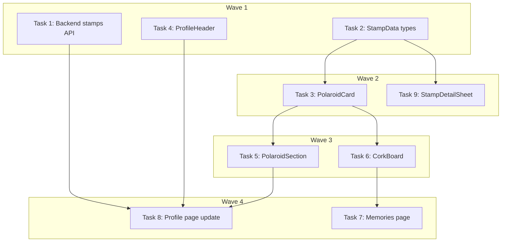

# Profile Polaroid Redesign Implementation Plan

> **For Claude:** REQUIRED SUB-SKILL: Use executing-plans to implement this plan task-by-task.

**Design Doc:** [docs/designs/2026-03-19-profile-polaroid-redesign.md](../designs/2026-03-19-profile-polaroid-redesign.md)

**Spec References:** [SPEC.md — User profile](../../SPEC.md) (line 47: "Private profile page: check-in history, stamp collection, lists")

**PRD References:** —

**Goal:** Replace the stamp passport with a polaroid memory system — a 2-col preview on the profile page and a full cork board with scattered/grid toggle at `/profile/memories`.

**Architecture:** Backend stamps API is extended with a JOIN to `check_ins` and `shops` to provide `photo_url` and `district`. Frontend replaces the `StampPassport` grid with a `PolaroidSection` preview component. A new `/profile/memories` route renders a `CorkBoard` component with two layout modes (scattered + grid) toggled via localStorage-persisted preference.

**Tech Stack:** Next.js 16, TypeScript, Tailwind CSS, shadcn/ui Drawer, SWR, FastAPI, Supabase PostgREST

**Acceptance Criteria:**
- [ ] Profile page shows 4 most recent polaroids with check-in photos, shop name, and district — tapping "View All" navigates to `/profile/memories`
- [ ] Cork board page shows all polaroids with a working scattered/grid toggle that persists across sessions
- [ ] Profile header no longer displays stamp count
- [ ] Lists tab is removed from profile page
- [ ] Stamp detail sheet shows diary note (if present) and tilted polaroid layout

---

### Task 1: Backend — Extend stamps API with photo_url and district

**Files:**
- Modify: `backend/api/stamps.py:12-32`
- Test: `backend/tests/test_stamps_api.py`

**Step 1: Write the failing test**

Add a new test to `backend/tests/test_stamps_api.py` that asserts photo_url and district are returned:

```python
def test_stamps_include_photo_url_and_district(self, client: TestClient, auth_headers: dict):
    db = MagicMock()
    db.table.return_value.select.return_value.eq.return_value.order.return_value.execute.return_value.data = [
        {
            "id": "stamp-1",
            "user_id": "user-123",
            "shop_id": "shop-a",
            "check_in_id": "ci-1",
            "design_url": "/stamps/shop-a.svg",
            "earned_at": "2026-03-01T00:00:00Z",
            "shops": {"name": "Fika Coffee", "district": "大安"},
            "check_ins": {"photo_urls": ["https://storage.example.com/photo1.jpg"], "diary_note": None},
        }
    ]

    app.dependency_overrides[get_current_user] = lambda: {"id": "user-123"}
    app.dependency_overrides[get_user_db] = lambda: db

    try:
        resp = client.get("/stamps", headers=auth_headers)
        assert resp.status_code == 200
        data = resp.json()
        assert data[0]["photo_url"] == "https://storage.example.com/photo1.jpg"
        assert data[0]["district"] == "大安"
        assert data[0]["diary_note"] is None
    finally:
        app.dependency_overrides.pop(get_current_user, None)
        app.dependency_overrides.pop(get_user_db, None)
```

**Step 2: Run test to verify it fails**

Run: `cd backend && pytest tests/test_stamps_api.py::TestGetStamps::test_stamps_include_photo_url_and_district -v`
Expected: FAIL — `photo_url` key missing from response

**Step 3: Write minimal implementation**

Update `backend/api/stamps.py` — change the select to JOIN with `check_ins` and `shops`, then flatten:

```python
@router.get("/")
async def get_my_stamps(
    user: dict[str, Any] = Depends(get_current_user),  # noqa: B008
    db: Client = Depends(get_user_db),  # noqa: B008
) -> list[dict[str, Any]]:
    """Get current user's stamps with shop names, photos, and district. Auth required."""
    response = await asyncio.to_thread(
        lambda: (
            db.table("stamps")
            .select("*, shops(name, district), check_ins(photo_urls, diary_note)")
            .eq("user_id", user["id"])
            .order("earned_at", desc=True)
            .execute()
        )
    )
    results = []
    for row in response.data:
        shop_data = row.pop("shops", {}) or {}
        checkin_data = row.pop("check_ins", {}) or {}
        row["shop_name"] = shop_data.get("name")
        row["district"] = shop_data.get("district")
        photo_urls = checkin_data.get("photo_urls") or []
        row["photo_url"] = photo_urls[0] if photo_urls else None
        row["diary_note"] = checkin_data.get("diary_note")
        results.append(row)
    return results
```

**Step 4: Run test to verify it passes**

Run: `cd backend && pytest tests/test_stamps_api.py -v`
Expected: ALL PASS

**Step 5: Also fix the missing assert on line 39 of the existing test**

Change `resp.status_code == 200` to `assert resp.status_code == 200`.

**Step 6: Commit**

```bash
git add backend/api/stamps.py backend/tests/test_stamps_api.py
git commit -m "feat(api): extend stamps endpoint with photo_url, district, diary_note"
```

---

### Task 2: Frontend — Update StampData type and factory

**Files:**
- Modify: `lib/hooks/use-user-stamps.ts:6-14`
- Modify: `lib/test-utils/factories.ts:101-113`

**Step 1: No test needed — type-only change**

Type changes are verified by TypeScript compiler, not runtime tests.

**Step 2: Update `StampData` interface**

In `lib/hooks/use-user-stamps.ts`, add three new optional fields:

```typescript
export interface StampData {
  id: string;
  user_id: string;
  shop_id: string;
  check_in_id: string;
  design_url: string;
  earned_at: string;
  shop_name: string | null;
  photo_url: string | null;
  district: string | null;
  diary_note: string | null;
}
```

**Step 3: Update `makeStamp` factory**

In `lib/test-utils/factories.ts`, add the new fields:

```typescript
export function makeStamp(overrides: Record<string, unknown> = {}) {
  return {
    id: 'stamp-m3n4o5',
    user_id: 'user-a1b2c3',
    shop_id: 'shop-d4e5f6',
    check_in_id: 'ci-j0k1l2',
    design_url:
      'https://example.supabase.co/storage/v1/object/public/stamps/d4e5f6.png',
    earned_at: TS,
    shop_name: '咖啡廳 Coffee Lab',
    photo_url:
      'https://example.supabase.co/storage/v1/object/public/checkin-photos/user-a1b2c3/photo1.jpg',
    district: '大安',
    diary_note: null,
    ...overrides,
  };
}
```

**Step 4: Run type check**

Run: `pnpm type-check`
Expected: PASS (no type errors introduced)

**Step 5: Commit**

```bash
git add lib/hooks/use-user-stamps.ts lib/test-utils/factories.ts
git commit -m "feat(types): add photo_url, district, diary_note to StampData"
```

---

### Task 3: Frontend — PolaroidCard component

**Files:**
- Create: `components/stamps/polaroid-card.tsx`
- Create: `components/stamps/polaroid-card.test.tsx`

**Step 1: Write the failing test**

```typescript
import { render, screen } from '@testing-library/react';
import { describe, it, expect } from 'vitest';
import { PolaroidCard } from './polaroid-card';

describe('PolaroidCard', () => {
  const defaultProps = {
    photoUrl: 'https://example.supabase.co/storage/v1/object/public/photo.jpg',
    shopName: 'Fika Coffee',
    district: '大安',
    earnedAt: '2026-02-15T10:00:00.000Z',
  };

  it('renders the shop name and district with month', () => {
    render(<PolaroidCard {...defaultProps} />);
    expect(screen.getByText('Fika Coffee')).toBeInTheDocument();
    expect(screen.getByText(/大安/)).toBeInTheDocument();
    expect(screen.getByText(/Feb/)).toBeInTheDocument();
  });

  it('renders the check-in photo', () => {
    render(<PolaroidCard {...defaultProps} />);
    const img = screen.getByRole('img');
    expect(img).toHaveAttribute('alt', 'Fika Coffee');
  });

  it('renders fallback when no photo_url', () => {
    render(<PolaroidCard {...defaultProps} photoUrl={null} />);
    expect(screen.getByTestId('polaroid-no-photo')).toBeInTheDocument();
  });

  it('applies rotation style when rotation prop is provided', () => {
    const { container } = render(<PolaroidCard {...defaultProps} rotation={5} />);
    const card = container.firstElementChild as HTMLElement;
    expect(card.style.transform).toContain('rotate(5deg)');
  });

  it('renders push pin with the given color', () => {
    render(<PolaroidCard {...defaultProps} pinColor="#E05252" />);
    expect(screen.getByTestId('push-pin')).toBeInTheDocument();
  });

  it('does not render push pin when showPin is false', () => {
    render(<PolaroidCard {...defaultProps} showPin={false} />);
    expect(screen.queryByTestId('push-pin')).not.toBeInTheDocument();
  });
});
```

**Step 2: Run test to verify it fails**

Run: `pnpm vitest run components/stamps/polaroid-card.test.tsx`
Expected: FAIL — module not found

**Step 3: Write minimal implementation**

```typescript
import Image from 'next/image';
import { cn } from '@/lib/utils';

const PIN_COLORS = ['#E05252', '#5271E0', '#E0C452', '#52B052'] as const;

interface PolaroidCardProps {
  photoUrl: string | null;
  shopName: string;
  district: string | null;
  earnedAt: string;
  rotation?: number;
  pinColor?: string;
  showPin?: boolean;
  className?: string;
  onClick?: () => void;
}

function formatMonth(isoString: string): string {
  return new Date(isoString).toLocaleDateString('en-US', {
    month: 'short',
    year: 'numeric',
  });
}

export { PIN_COLORS };

export function PolaroidCard({
  photoUrl,
  shopName,
  district,
  earnedAt,
  rotation = 0,
  pinColor = PIN_COLORS[0],
  showPin = true,
  className,
  onClick,
}: PolaroidCardProps) {
  return (
    <div
      className={cn(
        'relative cursor-pointer bg-white shadow-[0_4px_12px_rgba(0,0,0,0.25)] transition-transform hover:scale-105',
        className
      )}
      style={{ transform: `rotate(${rotation}deg)` }}
      onClick={onClick}
    >
      {showPin && (
        <div
          data-testid="push-pin"
          className="absolute -top-3 left-1/2 z-10 -translate-x-1/2"
        >
          <svg width="16" height="24" viewBox="0 0 16 24" fill="none">
            <circle cx="8" cy="6" r="6" fill={pinColor} />
            <rect x="7" y="10" width="2" height="14" rx="1" fill="#888" />
          </svg>
        </div>
      )}

      <div className="relative aspect-square overflow-hidden">
        {photoUrl ? (
          <Image
            src={photoUrl}
            alt={shopName}
            fill
            className="object-cover"
            sizes="(min-width: 1024px) 25vw, 50vw"
          />
        ) : (
          <div
            data-testid="polaroid-no-photo"
            className="flex h-full w-full items-center justify-center bg-amber-50"
          >
            <span className="text-2xl">☕</span>
          </div>
        )}
      </div>

      <div className="px-2 py-2">
        <p className="truncate text-[13px] font-semibold text-gray-900">
          {shopName}
        </p>
        <p className="truncate text-[11px] text-gray-500">
          {district && `${district} · `}{formatMonth(earnedAt)}
        </p>
      </div>
    </div>
  );
}
```

**Step 4: Run test to verify it passes**

Run: `pnpm vitest run components/stamps/polaroid-card.test.tsx`
Expected: PASS

**Step 5: Commit**

```bash
git add components/stamps/polaroid-card.tsx components/stamps/polaroid-card.test.tsx
git commit -m "feat: PolaroidCard component with pin, rotation, and photo display"
```

---

### Task 4: Frontend — Remove stamp count from ProfileHeader

**Files:**
- Modify: `components/profile/profile-header.tsx:4-9,39`
- Modify: `components/profile/profile-header.test.tsx`

**Step 1: Update tests first**

Remove any test assertions about stamp count. Update `defaultProps` to remove `stampCount`. Add a test that confirms stamps text is NOT shown:

```typescript
it('does not display stamp count', () => {
  render(<ProfileHeader {...defaultProps} />);
  expect(screen.queryByText(/stamp/i)).not.toBeInTheDocument();
});
```

Update the check-in assertion to match the new format (just "8 check-ins" without stamp prefix).

**Step 2: Run tests to verify they fail**

Run: `pnpm vitest run components/profile/profile-header.test.tsx`
Expected: FAIL — stampCount still required in props, "stamps" text still rendered

**Step 3: Update ProfileHeader**

Remove `stampCount` from the interface and JSX:

```typescript
interface ProfileHeaderProps {
  displayName: string | null;
  avatarUrl: string | null;
  checkinCount: number;
}

export function ProfileHeader({
  displayName,
  avatarUrl,
  checkinCount,
}: ProfileHeaderProps) {
  const name = displayName || 'User';
  const initial = name.charAt(0).toUpperCase();

  return (
    <div className="flex items-center gap-4 pb-6">
      <Avatar className="h-16 w-16">
        {avatarUrl ? (
          // eslint-disable-next-line @next/next/no-img-element -- avatar URLs may come from OAuth providers
          
        ) : (
          <AvatarFallback className="text-lg font-medium">
            {initial}
          </AvatarFallback>
        )}
      </Avatar>
      <div className="flex-1">
        <h1 className="text-xl font-bold">{name}</h1>
        <p className="text-muted-foreground text-sm">
          {checkinCount} check-ins
        </p>
        <Link href="/settings" className="text-primary text-sm hover:underline">
          Edit Profile &rarr;
        </Link>
      </div>
    </div>
  );
}
```

**Step 4: Run tests to verify they pass**

Run: `pnpm vitest run components/profile/profile-header.test.tsx`
Expected: PASS

**Step 5: Commit**

```bash
git add components/profile/profile-header.tsx components/profile/profile-header.test.tsx
git commit -m "feat: remove stamp count from profile header"
```

---

### Task 5: Frontend — PolaroidSection (profile preview)

**Files:**
- Create: `components/stamps/polaroid-section.tsx`
- Create: `components/stamps/polaroid-section.test.tsx`

**Step 1: Write the failing test**

```typescript
import { render, screen } from '@testing-library/react';
import { describe, it, expect } from 'vitest';
import { makeStamp } from '@/lib/test-utils/factories';
import { PolaroidSection } from './polaroid-section';

describe('PolaroidSection', () => {
  it('renders "My Memories" heading', () => {
    render(<PolaroidSection stamps={[]} />);
    expect(screen.getByText('My Memories')).toBeInTheDocument();
  });

  it('renders empty state when no stamps', () => {
    render(<PolaroidSection stamps={[]} />);
    expect(screen.getByText(/Your memories will appear here/)).toBeInTheDocument();
  });

  it('renders at most 4 polaroid cards', () => {
    const stamps = Array.from({ length: 6 }, (_, i) =>
      makeStamp({ id: `stamp-${i}`, shop_name: `Shop ${i}` })
    );
    render(<PolaroidSection stamps={stamps} />);
    const cards = screen.getAllByTestId('polaroid-preview-card');
    expect(cards).toHaveLength(4);
  });

  it('renders "View All" link pointing to /profile/memories', () => {
    const stamps = [makeStamp()];
    render(<PolaroidSection stamps={stamps} />);
    const link = screen.getByRole('link', { name: /View All/i });
    expect(link).toHaveAttribute('href', '/profile/memories');
  });

  it('does not render "View All" when there are no stamps', () => {
    render(<PolaroidSection stamps={[]} />);
    expect(screen.queryByRole('link', { name: /View All/i })).not.toBeInTheDocument();
  });
});
```

**Step 2: Run test to verify it fails**

Run: `pnpm vitest run components/stamps/polaroid-section.test.tsx`
Expected: FAIL — module not found

**Step 3: Write minimal implementation**

```typescript
import Link from 'next/link';
import { PolaroidCard } from './polaroid-card';
import type { StampData } from '@/lib/hooks/use-user-stamps';

const MAX_PREVIEW = 4;

interface PolaroidSectionProps {
  stamps: StampData[];
  onStampClick?: (stamp: StampData) => void;
}

export function PolaroidSection({ stamps, onStampClick }: PolaroidSectionProps) {
  const previewStamps = stamps.slice(0, MAX_PREVIEW);

  return (
    <div>
      <div className="mb-4 flex items-center justify-between">
        <h2 className="text-lg font-semibold">My Memories</h2>
        {stamps.length > 0 && (
          <Link
            href="/profile/memories"
            className="text-primary text-sm hover:underline"
          >
            View All &rarr;
          </Link>
        )}
      </div>

      {stamps.length === 0 ? (
        <div className="flex flex-col items-center justify-center rounded-lg border-2 border-dashed border-gray-200 py-12 text-center">
          <p className="text-muted-foreground text-sm">
            Your memories will appear here after your first check-in
          </p>
        </div>
      ) : (
        <div className="grid grid-cols-2 gap-3">
          {previewStamps.map((stamp) => (
            <div key={stamp.id} data-testid="polaroid-preview-card">
              <PolaroidCard
                photoUrl={stamp.photo_url}
                shopName={stamp.shop_name ?? 'Unknown Shop'}
                district={stamp.district}
                earnedAt={stamp.earned_at}
                showPin={false}
                onClick={() => onStampClick?.(stamp)}
              />
            </div>
          ))}
        </div>
      )}
    </div>
  );
}
```

**Step 4: Run test to verify it passes**

Run: `pnpm vitest run components/stamps/polaroid-section.test.tsx`
Expected: PASS

**Step 5: Commit**

```bash
git add components/stamps/polaroid-section.tsx components/stamps/polaroid-section.test.tsx
git commit -m "feat: PolaroidSection preview component for profile page"
```

---

### Task 6: Frontend — CorkBoard component (scattered + grid toggle)

**Files:**
- Create: `components/stamps/cork-board.tsx`
- Create: `components/stamps/cork-board.test.tsx`

**Step 1: Write the failing test**

```typescript
import { render, screen } from '@testing-library/react';
import userEvent from '@testing-library/user-event';
import { describe, it, expect, beforeEach } from 'vitest';
import { makeStamp } from '@/lib/test-utils/factories';
import { CorkBoard } from './cork-board';

beforeEach(() => {
  localStorage.clear();
});

const stamps = [
  makeStamp({ id: 'stamp-1', shop_name: 'Fika Coffee' }),
  makeStamp({ id: 'stamp-2', shop_name: 'Buna Coffee' }),
];

describe('CorkBoard', () => {
  it('renders all stamp cards', () => {
    render(<CorkBoard stamps={stamps} />);
    expect(screen.getByText('Fika Coffee')).toBeInTheDocument();
    expect(screen.getByText('Buna Coffee')).toBeInTheDocument();
  });

  it('defaults to scattered view', () => {
    render(<CorkBoard stamps={stamps} />);
    expect(screen.getByTestId('scatter-view')).toBeInTheDocument();
  });

  it('switches to grid view when grid button is clicked', async () => {
    const user = userEvent.setup();
    render(<CorkBoard stamps={stamps} />);
    await user.click(screen.getByLabelText('Grid view'));
    expect(screen.getByTestId('grid-view')).toBeInTheDocument();
  });

  it('persists view preference to localStorage', async () => {
    const user = userEvent.setup();
    render(<CorkBoard stamps={stamps} />);
    await user.click(screen.getByLabelText('Grid view'));
    expect(localStorage.getItem('caferoam:memories_view')).toBe('grid');
  });

  it('restores view preference from localStorage', () => {
    localStorage.setItem('caferoam:memories_view', 'grid');
    render(<CorkBoard stamps={stamps} />);
    expect(screen.getByTestId('grid-view')).toBeInTheDocument();
  });

  it('renders push pins on cards', () => {
    render(<CorkBoard stamps={stamps} />);
    const pins = screen.getAllByTestId('push-pin');
    expect(pins.length).toBe(stamps.length);
  });

  it('renders empty state when no stamps', () => {
    render(<CorkBoard stamps={[]} />);
    expect(screen.getByText(/No memories yet/)).toBeInTheDocument();
  });
});
```

**Step 2: Run test to verify it fails**

Run: `pnpm vitest run components/stamps/cork-board.test.tsx`
Expected: FAIL — module not found

**Step 3: Write minimal implementation**

```typescript
'use client';

import { useState } from 'react';
import { PolaroidCard, PIN_COLORS } from './polaroid-card';
import type { StampData } from '@/lib/hooks/use-user-stamps';

const STORAGE_KEY = 'caferoam:memories_view';
type ViewMode = 'scatter' | 'grid';

/** Deterministic hash from string → number (0..max). Same input = same output. */
function hashCode(str: string): number {
  let hash = 0;
  for (let i = 0; i < str.length; i++) {
    hash = (hash * 31 + str.charCodeAt(i)) | 0;
  }
  return Math.abs(hash);
}

const GRID_ROTATIONS = [3, -2, 5, -4, 1, -3, 2];

function getInitialView(): ViewMode {
  try {
    const stored = localStorage.getItem(STORAGE_KEY);
    if (stored === 'grid' || stored === 'scatter') return stored;
  } catch {
    // SSR or restricted localStorage
  }
  return 'scatter';
}

interface CorkBoardProps {
  stamps: StampData[];
  onStampClick?: (stamp: StampData) => void;
}

export function CorkBoard({ stamps, onStampClick }: CorkBoardProps) {
  const [view, setView] = useState<ViewMode>(getInitialView);

  function switchView(mode: ViewMode) {
    setView(mode);
    try {
      localStorage.setItem(STORAGE_KEY, mode);
    } catch {
      // restricted localStorage
    }
  }

  if (stamps.length === 0) {
    return (
      <div className="flex flex-col items-center justify-center py-24 text-center">
        <p className="text-lg text-gray-500">No memories yet</p>
        <p className="mt-1 text-sm text-gray-400">Check in to your first cafe to start your memory board</p>
      </div>
    );
  }

  return (
    <div>
      {/* View toggle */}
      <div className="mb-4 flex justify-end gap-1">
        <button
          aria-label="Scattered view"
          onClick={() => switchView('scatter')}
          className={`rounded-lg p-2 ${view === 'scatter' ? 'bg-gray-200 text-gray-900' : 'text-gray-400 hover:text-gray-600'}`}
        >
          <svg width="20" height="20" viewBox="0 0 20 20" fill="none">
            <rect x="1" y="2" width="7" height="7" rx="1" fill="currentColor" transform="rotate(-5 4.5 5.5)" />
            <rect x="11" y="1" width="7" height="7" rx="1" fill="currentColor" transform="rotate(3 14.5 4.5)" />
            <rect x="3" y="12" width="7" height="7" rx="1" fill="currentColor" transform="rotate(4 6.5 15.5)" />
            <rect x="12" y="11" width="7" height="7" rx="1" fill="currentColor" transform="rotate(-3 15.5 14.5)" />
          </svg>
        </button>
        <button
          aria-label="Grid view"
          onClick={() => switchView('grid')}
          className={`rounded-lg p-2 ${view === 'grid' ? 'bg-gray-200 text-gray-900' : 'text-gray-400 hover:text-gray-600'}`}
        >
          <svg width="20" height="20" viewBox="0 0 20 20" fill="none">
            <rect x="1" y="1" width="8" height="8" rx="1" fill="currentColor" />
            <rect x="11" y="1" width="8" height="8" rx="1" fill="currentColor" />
            <rect x="1" y="11" width="8" height="8" rx="1" fill="currentColor" />
            <rect x="11" y="11" width="8" height="8" rx="1" fill="currentColor" />
          </svg>
        </button>
      </div>

      {view === 'scatter' ? (
        <ScatteredView stamps={stamps} onStampClick={onStampClick} />
      ) : (
        <GridView stamps={stamps} onStampClick={onStampClick} />
      )}
    </div>
  );
}

function ScatteredView({
  stamps,
  onStampClick,
}: {
  stamps: StampData[];
  onStampClick?: (stamp: StampData) => void;
}) {
  const ROW_HEIGHT = 220;

  return (
    <div
      data-testid="scatter-view"
      className="relative w-full"
      style={{ minHeight: `${Math.ceil(stamps.length / 2) * ROW_HEIGHT}px` }}
    >
      {stamps.map((stamp, i) => {
        const h = hashCode(stamp.id);
        const xPercent = (h % 60) + 5; // 5% to 65% — leaves room for card width
        const yBase = Math.floor(i / 2) * ROW_HEIGHT;
        const yJitter = (h % 40) - 20; // ±20px
        const rotation = (h % 25) - 12; // −12° to +12°
        const pinColor = PIN_COLORS[i % PIN_COLORS.length];

        return (
          <div
            key={stamp.id}
            className="absolute w-[42%] sm:w-[38%]"
            style={{ left: `${xPercent}%`, top: `${yBase + yJitter}px` }}
          >
            <PolaroidCard
              photoUrl={stamp.photo_url}
              shopName={stamp.shop_name ?? 'Unknown Shop'}
              district={stamp.district}
              earnedAt={stamp.earned_at}
              rotation={rotation}
              pinColor={pinColor}
              showPin
              onClick={() => onStampClick?.(stamp)}
            />
          </div>
        );
      })}
    </div>
  );
}

function GridView({
  stamps,
  onStampClick,
}: {
  stamps: StampData[];
  onStampClick?: (stamp: StampData) => void;
}) {
  return (
    <div data-testid="grid-view" className="grid grid-cols-2 gap-4">
      {stamps.map((stamp, i) => (
        <PolaroidCard
          key={stamp.id}
          photoUrl={stamp.photo_url}
          shopName={stamp.shop_name ?? 'Unknown Shop'}
          district={stamp.district}
          earnedAt={stamp.earned_at}
          rotation={GRID_ROTATIONS[i % GRID_ROTATIONS.length]}
          pinColor={PIN_COLORS[i % PIN_COLORS.length]}
          showPin
          onClick={() => onStampClick?.(stamp)}
        />
      ))}
    </div>
  );
}
```

**Step 4: Run test to verify it passes**

Run: `pnpm vitest run components/stamps/cork-board.test.tsx`
Expected: PASS

**Step 5: Commit**

```bash
git add components/stamps/cork-board.tsx components/stamps/cork-board.test.tsx
git commit -m "feat: CorkBoard component with scatter/grid toggle and localStorage persistence"
```

---

### Task 7: Frontend — `/profile/memories` page

**Files:**
- Create: `app/(protected)/profile/memories/page.tsx`
- Create: `app/(protected)/profile/memories/page.test.tsx`

**Step 1: Write the failing test**

```typescript
import { render, screen, waitFor } from '@testing-library/react';
import { describe, it, expect, vi, beforeEach } from 'vitest';
import { SWRConfig } from 'swr';
import { makeStamp } from '@/lib/test-utils/factories';
import MemoriesPage from './page';

vi.mock('@/lib/supabase/client', () => ({
  createBrowserClient: () => ({
    auth: {
      getSession: vi.fn().mockResolvedValue({
        data: { session: { access_token: 'test-token' } },
        error: null,
      }),
    },
  }),
}));

const stampsData = [
  makeStamp({ id: 'stamp-1', shop_name: 'Fika Coffee' }),
  makeStamp({ id: 'stamp-2', shop_name: 'Buna Coffee' }),
];

function mockFetch(stamps = stampsData) {
  global.fetch = vi.fn().mockResolvedValue({
    ok: true,
    json: async () => stamps,
  });
}

function Wrapper({ children }: { children: React.ReactNode }) {
  return (
    <SWRConfig value={{ provider: () => new Map(), dedupingInterval: 0 }}>
      {children}
    </SWRConfig>
  );
}

describe('MemoriesPage', () => {
  beforeEach(() => {
    localStorage.clear();
    mockFetch();
  });

  it('renders the page title', async () => {
    render(<MemoriesPage />, { wrapper: Wrapper });
    await waitFor(() => {
      expect(screen.getByText('My Memories')).toBeInTheDocument();
    });
  });

  it('renders the cork board with stamps after loading', async () => {
    render(<MemoriesPage />, { wrapper: Wrapper });
    await waitFor(() => {
      expect(screen.getByText('Fika Coffee')).toBeInTheDocument();
      expect(screen.getByText('Buna Coffee')).toBeInTheDocument();
    });
  });

  it('renders a back link to profile', () => {
    render(<MemoriesPage />, { wrapper: Wrapper });
    const link = screen.getByRole('link', { name: /back/i });
    expect(link).toHaveAttribute('href', '/profile');
  });
});
```

**Step 2: Run test to verify it fails**

Run: `pnpm vitest run app/\\(protected\\)/profile/memories/page.test.tsx`
Expected: FAIL — module not found

**Step 3: Write minimal implementation**

```typescript
'use client';

import Link from 'next/link';
import { useState } from 'react';
import { useUserStamps } from '@/lib/hooks/use-user-stamps';
import { CorkBoard } from '@/components/stamps/cork-board';
import { StampDetailSheet } from '@/components/stamps/stamp-detail-sheet';
import type { StampData } from '@/lib/hooks/use-user-stamps';

export default function MemoriesPage() {
  const { stamps, isLoading } = useUserStamps();
  const [selectedStamp, setSelectedStamp] = useState<StampData | null>(null);

  return (
    <main
      className="min-h-screen px-4 py-6"
      style={{
        backgroundColor: '#C8A97B',
        backgroundImage:
          'radial-gradient(circle, rgba(0,0,0,0.06) 1px, transparent 1px)',
        backgroundSize: '12px 12px',
      }}
    >
      <div className="mx-auto max-w-2xl">
        <div className="mb-6 flex items-center justify-between">
          <Link
            href="/profile"
            className="text-sm text-gray-700 hover:text-gray-900"
            aria-label="back"
          >
            &larr; Back
          </Link>
          <h1 className="text-lg font-semibold text-gray-900">My Memories</h1>
          <div className="w-12" /> {/* Spacer for centering */}
        </div>

        {isLoading ? (
          <div className="flex justify-center py-12">
            <div className="h-8 w-8 animate-spin rounded-full border-2 border-gray-300 border-t-gray-600" />
          </div>
        ) : (
          <CorkBoard
            stamps={stamps}
            onStampClick={(stamp) => setSelectedStamp(stamp)}
          />
        )}
      </div>

      {selectedStamp && (
        <StampDetailSheet
          stamp={selectedStamp}
          onClose={() => setSelectedStamp(null)}
        />
      )}
    </main>
  );
}
```

**Step 4: Run test to verify it passes**

Run: `pnpm vitest run app/\\(protected\\)/profile/memories/page.test.tsx`
Expected: PASS

**Step 5: Commit**

```bash
git add "app/(protected)/profile/memories/page.tsx" "app/(protected)/profile/memories/page.test.tsx"
git commit -m "feat: /profile/memories cork board page"
```

---

### Task 8: Frontend — Update profile page (swap components, remove lists tab)

**Files:**
- Modify: `app/(protected)/profile/page.tsx`
- Modify: `app/(protected)/profile/page.test.tsx`

**Step 1: Update tests**

In `page.test.tsx`:
- Remove all imports/references to `ListsTab` and `useListSummaries`
- Remove the "Lists" tab test assertions
- Replace `StampPassport` assertions with `PolaroidSection` assertions (check for "My Memories" heading, "View All" link)
- Remove `stamps.length` text assertion (no longer shows "X stamps")
- Keep analytics test (`profile_stamps_viewed`) — it still fires

**Step 2: Run tests to verify they fail**

Run: `pnpm vitest run app/\\(protected\\)/profile/page.test.tsx`
Expected: FAIL — still renders old components

**Step 3: Update the profile page**

Replace imports and component usage:

```typescript
'use client';

import { useState, useEffect, useRef } from 'react';
import { useUserStamps } from '@/lib/hooks/use-user-stamps';
import { useUserProfile } from '@/lib/hooks/use-user-profile';
import { useUserCheckins } from '@/lib/hooks/use-user-checkins';
import { useAnalytics } from '@/lib/posthog/use-analytics';
import { PolaroidSection } from '@/components/stamps/polaroid-section';
import { StampDetailSheet } from '@/components/stamps/stamp-detail-sheet';
import { ProfileHeader } from '@/components/profile/profile-header';
import { CheckinHistoryTab } from '@/components/profile/checkin-history-tab';
import type { StampData } from '@/lib/hooks/use-user-stamps';

export default function ProfilePage() {
  const { profile, isLoading: profileLoading } = useUserProfile();
  const { stamps, isLoading: stampsLoading } = useUserStamps();
  const { checkins, isLoading: checkinsLoading } = useUserCheckins();
  const [selectedStamp, setSelectedStamp] = useState<StampData | null>(null);
  const { capture } = useAnalytics();
  const hasFiredRef = useRef(false);

  useEffect(() => {
    if (!stampsLoading && !hasFiredRef.current) {
      hasFiredRef.current = true;
      capture('profile_stamps_viewed', { stamp_count: stamps.length });
    }
  }, [stampsLoading, stamps.length, capture]);

  return (
    <main className="mx-auto max-w-lg px-4 py-6">
      {profileLoading ? (
        <div className="flex justify-center py-6">
          <div className="h-8 w-8 animate-spin rounded-full border-2 border-gray-300 border-t-gray-600" />
        </div>
      ) : (
        <ProfileHeader
          displayName={profile?.display_name ?? null}
          avatarUrl={profile?.avatar_url ?? null}
          checkinCount={profile?.checkin_count ?? 0}
        />
      )}

      <section className="mb-6">
        {stampsLoading ? (
          <div className="flex justify-center py-12">
            <div className="h-8 w-8 animate-spin rounded-full border-2 border-gray-300 border-t-gray-600" />
          </div>
        ) : (
          <PolaroidSection
            stamps={stamps}
            onStampClick={(stamp) => setSelectedStamp(stamp)}
          />
        )}
      </section>

      <section>
        <h2 className="mb-4 text-lg font-semibold">Check-in History</h2>
        <CheckinHistoryTab checkins={checkins} isLoading={checkinsLoading} />
      </section>

      {selectedStamp && (
        <StampDetailSheet
          stamp={selectedStamp}
          onClose={() => setSelectedStamp(null)}
        />
      )}
    </main>
  );
}
```

Key changes:
- Removed `useListSummaries`, `ListsTab`, `Tabs`/`TabsList`/`TabsTrigger`/`TabsContent` imports
- Removed `stampCount` prop from `ProfileHeader`
- Replaced `StampPassport` with `PolaroidSection`
- Replaced `Tabs` wrapper with direct `CheckinHistoryTab` render + heading

**Step 4: Run tests to verify they pass**

Run: `pnpm vitest run app/\\(protected\\)/profile/page.test.tsx`
Expected: PASS

**Step 5: Run full test suite to check for regressions**

Run: `pnpm vitest run`
Expected: All tests pass

**Step 6: Commit**

```bash
git add "app/(protected)/profile/page.tsx" "app/(protected)/profile/page.test.tsx"
git commit -m "feat: swap StampPassport for PolaroidSection, remove Lists tab from profile"
```

---

### Task 9: Frontend — Update StampDetailSheet with diary note and tilt

**Files:**
- Modify: `components/stamps/stamp-detail-sheet.tsx`
- Modify: `components/stamps/stamp-detail-sheet.test.tsx`

**Step 1: Write the failing test**

Add new test cases to the existing test file:

```typescript
it('displays diary note when present', () => {
  const stamp = makeStamp({ diary_note: 'finally found my writing spot' });
  render(<StampDetailSheet stamp={stamp} onClose={vi.fn()} />);
  expect(screen.getByText(/finally found my writing spot/)).toBeInTheDocument();
});

it('does not render diary section when diary_note is null', () => {
  const stamp = makeStamp({ diary_note: null });
  render(<StampDetailSheet stamp={stamp} onClose={vi.fn()} />);
  expect(screen.queryByTestId('diary-note')).not.toBeInTheDocument();
});

it('shows the check-in photo in the polaroid card', () => {
  const stamp = makeStamp({ photo_url: 'https://example.com/photo.jpg' });
  render(<StampDetailSheet stamp={stamp} onClose={vi.fn()} />);
  const img = screen.getByRole('img', { name: stamp.shop_name as string });
  expect(img).toBeInTheDocument();
});
```

**Step 2: Run tests to verify they fail**

Run: `pnpm vitest run components/stamps/stamp-detail-sheet.test.tsx`
Expected: FAIL — diary_note not rendered, no polaroid image

**Step 3: Update StampDetailSheet**

Update the props interface and JSX to accept the new `StampData` fields and render the polaroid + diary:

```typescript
'use client';

import Image from 'next/image';
import Link from 'next/link';
import {
  Drawer,
  DrawerContent,
  DrawerHeader,
  DrawerTitle,
} from '@/components/ui/drawer';
import { Button } from '@/components/ui/button';
import { formatDate } from '@/lib/utils';

interface StampDetailSheetProps {
  stamp: {
    id: string;
    shop_id: string;
    shop_name: string | null;
    design_url: string;
    earned_at: string;
    photo_url?: string | null;
    district?: string | null;
    diary_note?: string | null;
  };
  onClose: () => void;
}

export function StampDetailSheet({ stamp, onClose }: StampDetailSheetProps) {
  const earnedDate = formatDate(stamp.earned_at);
  const shopName = stamp.shop_name ?? 'Unknown Shop';
  // Deterministic tilt from stamp id
  const tilt = stamp.id ? ((stamp.id.charCodeAt(0) % 7) - 3) : 0;

  return (
    <Drawer open onOpenChange={(isOpen) => !isOpen && onClose()}>
      <DrawerContent>
        <DrawerHeader className="flex flex-col items-center gap-3 pb-6">
          {/* Polaroid card with tilt */}
          <div
            className="w-48 bg-white p-2 shadow-lg"
            style={{ transform: `rotate(${tilt}deg)` }}
          >
            <div className="relative aspect-square overflow-hidden">
              {stamp.photo_url ? (
                <Image
                  src={stamp.photo_url}
                  alt={shopName}
                  fill
                  className="object-cover"
                  sizes="192px"
                />
              ) : (
                <Image
                  src={stamp.design_url}
                  alt={`${shopName} stamp`}
                  fill
                  className="object-contain"
                  sizes="192px"
                />
              )}
            </div>
            <div className="mt-1 px-1">
              <p className="truncate text-sm font-semibold">{shopName}</p>
              <p className="text-xs text-gray-500">
                {stamp.district && `${stamp.district} · `}{earnedDate}
              </p>
            </div>
          </div>

          <DrawerTitle className="sr-only">{shopName}</DrawerTitle>

          {/* Diary note */}
          {stamp.diary_note && (
            <div
              data-testid="diary-note"
              className="w-full max-w-xs rounded-lg bg-amber-50 px-4 py-3"
            >
              <p className="text-center text-sm italic text-gray-700">
                &ldquo;{stamp.diary_note}&rdquo;
              </p>
            </div>
          )}

          <Link href={`/shop/${stamp.shop_id}`}>
            <Button variant="outline" size="sm">
              Visit Again &rarr;
            </Button>
          </Link>
        </DrawerHeader>
      </DrawerContent>
    </Drawer>
  );
}
```

**Step 4: Run tests to verify they pass**

Run: `pnpm vitest run components/stamps/stamp-detail-sheet.test.tsx`
Expected: PASS

**Step 5: Commit**

```bash
git add components/stamps/stamp-detail-sheet.tsx components/stamps/stamp-detail-sheet.test.tsx
git commit -m "feat: update StampDetailSheet with polaroid card, tilt, and diary note"
```

---

## Execution Waves



**Wave 1** (parallel — no dependencies):
- Task 1: Backend stamps API (adds photo_url, district, diary_note to response)
- Task 2: Frontend StampData types + factory
- Task 4: ProfileHeader (remove stamp count)

**Wave 2** (parallel — depends on Wave 1):
- Task 3: PolaroidCard component ← Task 2
- Task 9: StampDetailSheet update ← Task 2

**Wave 3** (parallel — depends on Wave 2):
- Task 5: PolaroidSection ← Task 3
- Task 6: CorkBoard ← Task 3

**Wave 4** (parallel — depends on Wave 3):
- Task 7: Memories page ← Task 6
- Task 8: Profile page update ← Task 4, Task 5

---

## TODO

- [ ] **Task 1:** Backend — Extend stamps API with photo_url and district
- [ ] **Task 2:** Frontend — Update StampData type and factory
- [ ] **Task 3:** Frontend — PolaroidCard component
- [ ] **Task 4:** Frontend — Remove stamp count from ProfileHeader
- [ ] **Task 5:** Frontend — PolaroidSection (profile preview)
- [ ] **Task 6:** Frontend — CorkBoard (scattered + grid toggle)
- [ ] **Task 7:** Frontend — `/profile/memories` page
- [ ] **Task 8:** Frontend — Update profile page (swap components, remove lists tab)
- [ ] **Task 9:** Frontend — Update StampDetailSheet with diary note and tilt
