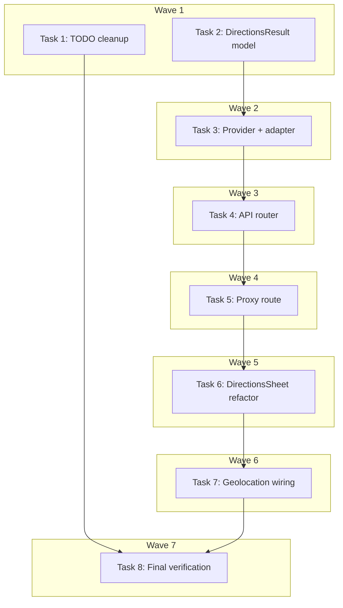

# Directions Provider + Community Notes Cleanup — Implementation Plan

> **For Claude:** REQUIRED SUB-SKILL: Use executing-plans to implement this plan task-by-task.

**Design Doc:** [docs/designs/2026-03-20-directions-provider-and-community-cleanup-design.md](../designs/2026-03-20-directions-provider-and-community-cleanup-design.md)

**Spec References:** —

**PRD References:** —

**Goal:** Complete Shop View Directions by routing Mapbox Directions API through the backend MapsProvider and wiring user geolocation into Shop Detail. Clean up stale Community Notes TODO items.

**Architecture:** Extend the existing `MapsProvider` protocol with a `get_directions()` method. New FastAPI endpoint `GET /maps/directions` (public, no auth). Next.js proxy route forwards to backend. DirectionsSheet refactored to call the proxy instead of Mapbox directly. `useGeolocation` wired into Shop Detail to pass user coordinates.

**Tech Stack:** FastAPI, Pydantic, httpx (backend); Next.js App Router proxy (frontend); Mapbox Directions API v5

**Acceptance Criteria:**

- [ ] A user tapping "Get There" on a shop page sees walking time, driving time, and nearest MRT station after granting location permission
- [ ] A user who denies location still sees nearest MRT station and Google/Apple Maps deep-links
- [ ] Mapbox Directions API calls go through the backend, not directly from the browser
- [ ] All existing DirectionsSheet tests pass with the new proxy-based fetch
- [ ] Community Notes proxy routes TODO items are marked complete

---

### Task 1: Mark Community Notes Proxy Routes as Done in TODO.md

**Files:**

- Modify: `TODO.md:1030`

No test needed — documentation update only.

**Step 1: Update TODO.md**

Change line 1030:

```diff
- - [ ] Frontend: Proxy routes (preview, feed, like)
+ - [x] Frontend: Proxy routes (preview, feed, like)
```

**Step 2: Commit**

```bash
git add TODO.md
git commit -m "docs: mark Community Notes proxy routes as complete in TODO"
```

---

### Task 2: Add DirectionsResult Pydantic Model

**Files:**

- Modify: `backend/models/types.py`
- Test: `backend/tests/models/test_directions_result.py`

**Step 1: Write the failing test**

Create `backend/tests/models/test_directions_result.py`:

```python
from models.types import DirectionsResult


class TestDirectionsResult:
    def test_serializes_to_camel_case(self):
        result = DirectionsResult(duration_min=7, distance_m=580, profile="walking")
        data = result.model_dump(by_alias=True)
        assert data == {
            "durationMin": 7,
            "distanceM": 580,
            "profile": "walking",
        }

    def test_accepts_driving_traffic_profile(self):
        result = DirectionsResult(
            duration_min=3, distance_m=2100, profile="driving-traffic"
        )
        assert result.profile == "driving-traffic"
```

**Step 2: Run test to verify it fails**

Run: `cd backend && python -m pytest tests/models/test_directions_result.py -v`
Expected: FAIL with `ImportError: cannot import name 'DirectionsResult'`

**Step 3: Write minimal implementation**

Add to `backend/models/types.py` (after `GeocodingResult` around line 362):

```python
class DirectionsResult(CamelModel):
    duration_min: int
    distance_m: int
    profile: str
```

**Step 4: Run test to verify it passes**

Run: `cd backend && python -m pytest tests/models/test_directions_result.py -v`
Expected: PASS (2 tests)

**Step 5: Commit**

```bash
git add backend/models/types.py backend/tests/models/test_directions_result.py
git commit -m "feat: add DirectionsResult Pydantic model"
```

---

### Task 3: Extend MapsProvider Protocol + Implement get_directions in MapboxMapsAdapter

**Files:**

- Modify: `backend/providers/maps/interface.py`
- Modify: `backend/providers/maps/mapbox_adapter.py`
- Modify: `backend/tests/providers/test_mapbox_adapter.py`

**Step 1: Write the failing tests**

Append to `backend/tests/providers/test_mapbox_adapter.py`:

```python
from models.types import DirectionsResult

DIRECTIONS_RESPONSE = {
    "routes": [{"duration": 420, "distance": 580}],
    "code": "Ok",
}

DIRECTIONS_EMPTY = {"routes": [], "code": "Ok"}


class TestMapboxGetDirections:
    @pytest.fixture
    def adapter(self):
        return MapboxMapsAdapter(access_token="test-token")

    async def test_returns_directions_result_for_walking(self, adapter):
        mock_response = MagicMock(spec=httpx.Response)
        mock_response.status_code = 200
        mock_response.json.return_value = DIRECTIONS_RESPONSE
        mock_response.raise_for_status = MagicMock()

        adapter._client = AsyncMock(spec=httpx.AsyncClient)
        adapter._client.get = AsyncMock(return_value=mock_response)

        result = await adapter.get_directions(25.04, 121.55, 25.033, 121.565, "walking")

        assert result is not None
        assert isinstance(result, DirectionsResult)
        assert result.duration_min == 7  # 420s → 7min
        assert result.distance_m == 580
        assert result.profile == "walking"

    async def test_returns_directions_result_for_driving(self, adapter):
        mock_response = MagicMock(spec=httpx.Response)
        mock_response.status_code = 200
        mock_response.json.return_value = {"routes": [{"duration": 180, "distance": 2100}], "code": "Ok"}
        mock_response.raise_for_status = MagicMock()

        adapter._client = AsyncMock(spec=httpx.AsyncClient)
        adapter._client.get = AsyncMock(return_value=mock_response)

        result = await adapter.get_directions(25.04, 121.55, 25.033, 121.565, "driving-traffic")

        assert result is not None
        assert result.duration_min == 3
        assert result.profile == "driving-traffic"

    async def test_returns_none_on_empty_routes(self, adapter):
        mock_response = MagicMock(spec=httpx.Response)
        mock_response.status_code = 200
        mock_response.json.return_value = DIRECTIONS_EMPTY
        mock_response.raise_for_status = MagicMock()

        adapter._client = AsyncMock(spec=httpx.AsyncClient)
        adapter._client.get = AsyncMock(return_value=mock_response)

        result = await adapter.get_directions(25.04, 121.55, 25.033, 121.565, "walking")
        assert result is None

    async def test_returns_none_on_http_error(self, adapter):
        adapter._client = AsyncMock(spec=httpx.AsyncClient)
        adapter._client.get = AsyncMock(
            side_effect=httpx.HTTPStatusError(
                "Server error", request=MagicMock(), response=MagicMock(status_code=500)
            )
        )

        result = await adapter.get_directions(25.04, 121.55, 25.033, 121.565, "walking")
        assert result is None

    async def test_returns_none_on_timeout(self, adapter):
        adapter._client = AsyncMock(spec=httpx.AsyncClient)
        adapter._client.get = AsyncMock(side_effect=httpx.TimeoutException("timeout"))

        result = await adapter.get_directions(25.04, 121.55, 25.033, 121.565, "walking")
        assert result is None

    async def test_passes_correct_url_and_params(self, adapter):
        mock_response = MagicMock(spec=httpx.Response)
        mock_response.status_code = 200
        mock_response.json.return_value = DIRECTIONS_RESPONSE
        mock_response.raise_for_status = MagicMock()

        adapter._client = AsyncMock(spec=httpx.AsyncClient)
        adapter._client.get = AsyncMock(return_value=mock_response)

        await adapter.get_directions(25.04, 121.55, 25.033, 121.565, "walking")

        call_args = adapter._client.get.call_args
        url = call_args[0][0] if call_args[0] else call_args.kwargs.get("url", "")
        params = call_args.kwargs.get("params", {})

        assert "directions/v5/mapbox/walking" in url
        assert "121.55,25.04;121.565,25.033" in url
        assert params["access_token"] == "test-token"
        assert params["overview"] == "false"
```

**Step 2: Run tests to verify they fail**

Run: `cd backend && python -m pytest tests/providers/test_mapbox_adapter.py::TestMapboxGetDirections -v`
Expected: FAIL with `AttributeError: 'MapboxMapsAdapter' object has no attribute 'get_directions'`

**Step 3: Update MapsProvider protocol**

Modify `backend/providers/maps/interface.py`:

```python
from typing import Protocol

from models.types import DirectionsResult, GeocodingResult


class MapsProvider(Protocol):
    async def geocode(self, address: str) -> GeocodingResult | None: ...

    async def reverse_geocode(self, lat: float, lng: float) -> str | None: ...

    async def get_directions(
        self,
        origin_lat: float,
        origin_lng: float,
        dest_lat: float,
        dest_lng: float,
        profile: str,
    ) -> DirectionsResult | None: ...

    async def close(self) -> None: ...
```

**Step 4: Implement get_directions in MapboxMapsAdapter**

Add to `backend/providers/maps/mapbox_adapter.py` (after `reverse_geocode`, before `close`):

```python
    DIRECTIONS_URL = "https://api.mapbox.com/directions/v5/mapbox"

    async def get_directions(
        self,
        origin_lat: float,
        origin_lng: float,
        dest_lat: float,
        dest_lng: float,
        profile: str,
    ) -> "DirectionsResult | None":
        from models.types import DirectionsResult

        try:
            coords = f"{origin_lng},{origin_lat};{dest_lng},{dest_lat}"
            response = await self._client.get(
                f"{self.DIRECTIONS_URL}/{profile}/{coords}",
                params={
                    "access_token": self._token,
                    "overview": "false",
                },
            )
            response.raise_for_status()
            data = response.json()
            routes = data.get("routes", [])
            if not routes:
                return None
            route = routes[0]
            return DirectionsResult(
                duration_min=round(route["duration"] / 60),
                distance_m=round(route["distance"]),
                profile=profile,
            )
        except (httpx.HTTPStatusError, httpx.TimeoutException, httpx.ConnectError, KeyError) as e:
            logger.warning("Mapbox directions failed: %s", e)
            return None
```

Also add the import at top of file:

```python
from models.types import DirectionsResult, GeocodingResult
```

(Update existing `from models.types import GeocodingResult` to include `DirectionsResult`.)

**Step 5: Run tests to verify they pass**

Run: `cd backend && python -m pytest tests/providers/test_mapbox_adapter.py -v`
Expected: ALL PASS (existing geocode tests + 6 new directions tests)

**Step 6: Commit**

```bash
git add backend/providers/maps/interface.py backend/providers/maps/mapbox_adapter.py backend/tests/providers/test_mapbox_adapter.py
git commit -m "feat: add get_directions to MapsProvider protocol + Mapbox adapter"
```

---

### Task 4: Create Maps API Router with GET /maps/directions Endpoint

**Files:**

- Create: `backend/api/maps.py`
- Modify: `backend/main.py` (lines 11-24 imports, lines 111-124 router registration)
- Create: `backend/tests/api/test_maps.py`

**Step 1: Write the failing tests**

Create `backend/tests/api/test_maps.py`:

```python
from unittest.mock import AsyncMock, patch

from fastapi.testclient import TestClient

from main import app
from models.types import DirectionsResult

client = TestClient(app)


class TestGetDirections:
    """GET /maps/directions returns walking or driving directions."""

    def test_returns_walking_directions(self):
        mock_result = DirectionsResult(duration_min=7, distance_m=580, profile="walking")
        with patch("api.maps.get_maps_provider") as mock_factory:
            mock_provider = AsyncMock()
            mock_provider.get_directions = AsyncMock(return_value=mock_result)
            mock_factory.return_value = mock_provider

            response = client.get(
                "/maps/directions",
                params={
                    "origin_lat": 25.04,
                    "origin_lng": 121.55,
                    "dest_lat": 25.033,
                    "dest_lng": 121.565,
                    "profile": "walking",
                },
            )

        assert response.status_code == 200
        data = response.json()
        assert data["durationMin"] == 7
        assert data["distanceM"] == 580
        assert data["profile"] == "walking"

    def test_returns_driving_directions(self):
        mock_result = DirectionsResult(
            duration_min=3, distance_m=2100, profile="driving-traffic"
        )
        with patch("api.maps.get_maps_provider") as mock_factory:
            mock_provider = AsyncMock()
            mock_provider.get_directions = AsyncMock(return_value=mock_result)
            mock_factory.return_value = mock_provider

            response = client.get(
                "/maps/directions",
                params={
                    "origin_lat": 25.04,
                    "origin_lng": 121.55,
                    "dest_lat": 25.033,
                    "dest_lng": 121.565,
                    "profile": "driving-traffic",
                },
            )

        assert response.status_code == 200
        assert response.json()["profile"] == "driving-traffic"

    def test_returns_400_for_invalid_profile(self):
        response = client.get(
            "/maps/directions",
            params={
                "origin_lat": 25.04,
                "origin_lng": 121.55,
                "dest_lat": 25.033,
                "dest_lng": 121.565,
                "profile": "bicycling",
            },
        )
        assert response.status_code == 400

    def test_returns_502_when_upstream_fails(self):
        with patch("api.maps.get_maps_provider") as mock_factory:
            mock_provider = AsyncMock()
            mock_provider.get_directions = AsyncMock(return_value=None)
            mock_factory.return_value = mock_provider

            response = client.get(
                "/maps/directions",
                params={
                    "origin_lat": 25.04,
                    "origin_lng": 121.55,
                    "dest_lat": 25.033,
                    "dest_lng": 121.565,
                    "profile": "walking",
                },
            )

        assert response.status_code == 502
        assert "upstream" in response.json()["detail"].lower()

    def test_is_public_no_auth_required(self):
        mock_result = DirectionsResult(duration_min=5, distance_m=400, profile="walking")
        with patch("api.maps.get_maps_provider") as mock_factory:
            mock_provider = AsyncMock()
            mock_provider.get_directions = AsyncMock(return_value=mock_result)
            mock_factory.return_value = mock_provider

            response = client.get(
                "/maps/directions",
                params={
                    "origin_lat": 25.04,
                    "origin_lng": 121.55,
                    "dest_lat": 25.033,
                    "dest_lng": 121.565,
                    "profile": "walking",
                },
            )

        # No Authorization header sent — should still succeed
        assert response.status_code == 200

    def test_returns_422_for_missing_params(self):
        response = client.get("/maps/directions", params={"profile": "walking"})
        assert response.status_code == 422
```

**Step 2: Run tests to verify they fail**

Run: `cd backend && python -m pytest tests/api/test_maps.py -v`
Expected: FAIL — `backend/api/maps.py` doesn't exist, import fails in `main.py`

**Step 3: Create the maps API router**

Create `backend/api/maps.py`:

```python
from typing import Any

from fastapi import APIRouter, HTTPException, Query

from models.types import DirectionsResult
from providers.maps import get_maps_provider

router = APIRouter(prefix="/maps", tags=["maps"])

VALID_PROFILES = {"walking", "driving-traffic"}


@router.get("/directions")
async def get_directions(
    origin_lat: float = Query(..., ge=-90.0, le=90.0),
    origin_lng: float = Query(..., ge=-180.0, le=180.0),
    dest_lat: float = Query(..., ge=-90.0, le=90.0),
    dest_lng: float = Query(..., ge=-180.0, le=180.0),
    profile: str = Query(...),
) -> dict[str, Any]:
    """Get walking or driving directions between two points. Public — no auth required."""
    if profile not in VALID_PROFILES:
        raise HTTPException(status_code=400, detail=f"Invalid profile: {profile}. Must be one of: {', '.join(sorted(VALID_PROFILES))}")

    provider = get_maps_provider()
    try:
        result = await provider.get_directions(
            origin_lat=origin_lat,
            origin_lng=origin_lng,
            dest_lat=dest_lat,
            dest_lng=dest_lng,
            profile=profile,
        )
    finally:
        await provider.close()

    if result is None:
        raise HTTPException(status_code=502, detail="Upstream directions service unavailable")

    return result.model_dump(by_alias=True)
```

**Step 4: Register router in main.py**

Add import at `backend/main.py` line 20 (after other api imports):

```python
from api.maps import router as maps_router
```

Add router registration after line 124 (after `admin_taxonomy_router`):

```python
app.include_router(maps_router)
```

**Step 5: Run tests to verify they pass**

Run: `cd backend && python -m pytest tests/api/test_maps.py -v`
Expected: ALL PASS (6 tests)

**Step 6: Run full backend suite to check no regressions**

Run: `cd backend && python -m pytest --tb=short -q`
Expected: All tests pass

**Step 7: Commit**

```bash
git add backend/api/maps.py backend/main.py backend/tests/api/test_maps.py
git commit -m "feat: add GET /maps/directions endpoint with MapsProvider"
```

---

### Task 5: Create Next.js Proxy Route for Directions

**Files:**

- Create: `app/api/maps/directions/route.ts`

No test needed — thin proxy using established `proxyToBackend` pattern (same as all other proxy routes in `app/api/`).

**Step 1: Create the proxy route**

Create `app/api/maps/directions/route.ts`:

```typescript
import { NextRequest } from 'next/server';

import { proxyToBackend } from '@/lib/api/proxy';

export async function GET(request: NextRequest) {
  return proxyToBackend(request, '/maps/directions');
}
```

**Step 2: Commit**

```bash
git add app/api/maps/directions/route.ts
git commit -m "feat: add Next.js proxy route for maps/directions"
```

---

### Task 6: Refactor DirectionsSheet to Use Backend Proxy

**Files:**

- Modify: `components/shops/directions-sheet.tsx` (lines 72-95 — `fetchRoute` function)
- Modify: `components/shops/directions-sheet.test.tsx`

**Step 1: Update the test to mock the proxy URL instead of direct Mapbox**

Replace the mockFetch assertions in `directions-sheet.test.tsx`. The key changes:

In `"a user who has shared their location sees walk and drive times from Mapbox"` test — the mock responses should now match the backend proxy response shape (`{ durationMin, distanceM, profile }` instead of `{ routes: [{ duration, distance }] }`):

```typescript
  it('a user who has shared their location sees walk and drive times', async () => {
    mockFetch
      .mockResolvedValueOnce({
        ok: true,
        json: async () => ({ durationMin: 7, distanceM: 580, profile: 'walking' }),
      })
      .mockResolvedValueOnce({
        ok: true,
        json: async () => ({ durationMin: 3, distanceM: 2100, profile: 'driving-traffic' }),
      })
      .mockResolvedValueOnce({
        ok: true,
        json: async () => ({ durationMin: 4, distanceM: 350, profile: 'walking' }),
      });

    render(
      <DirectionsSheet
        open={true}
        onClose={vi.fn()}
        shop={shop}
        userLat={25.04}
        userLng={121.55}
      />
    );

    await waitFor(() => {
      expect(screen.getByText(/7 min walk/i)).toBeInTheDocument();
      expect(screen.getByText(/3 min drive/i)).toBeInTheDocument();
    });
  });
```

In `"a user without location only fetches the MRT leg"` test — update mock response shape and URL assertion:

```typescript
  it('a user without location only fetches the MRT leg, not walk/drive routes', async () => {
    mockFetch.mockResolvedValue({
      ok: true,
      json: async () => ({ durationMin: 5, distanceM: 400, profile: 'walking' }),
    });

    render(<DirectionsSheet open={true} onClose={vi.fn()} shop={shop} />);

    await waitFor(() => {
      expect(screen.getByText(/[A-Za-z]+ \([^\)]+\) ·/)).toBeInTheDocument();
    });
    expect(mockFetch).toHaveBeenCalledTimes(1);
    expect(mockFetch.mock.calls[0][0]).toContain('/api/maps/directions');
    expect(mockFetch.mock.calls[0][0]).toContain('profile=walking');
  });
```

In `"shows the nearest MRT station using real station data"` test — update mock:

```typescript
  it('shows the nearest MRT station using real station data', async () => {
    mockFetch.mockResolvedValue({
      ok: true,
      json: async () => ({ durationMin: 5, distanceM: 400, profile: 'walking' }),
    });

    render(<DirectionsSheet open={true} onClose={vi.fn()} shop={shop} />);

    await waitFor(() => {
      expect(screen.getByText(/[A-Za-z]+ \([^\)]+\) ·/)).toBeInTheDocument();
    });
  });
```

Also remove `vi.stubEnv('NEXT_PUBLIC_MAPBOX_TOKEN', 'pk.test-token')` from `beforeEach` and `vi.unstubAllEnvs()` from `afterEach` — the token is no longer needed by DirectionsSheet.

**Step 2: Run tests to verify they fail**

Run: `pnpm test -- components/shops/directions-sheet.test.tsx`
Expected: FAIL — DirectionsSheet still calls Mapbox directly, response shape mismatch

**Step 3: Refactor DirectionsSheet fetchRoute function**

Replace the `fetchRoute` function (lines 72-95) in `components/shops/directions-sheet.tsx`:

```typescript
async function fetchRoute(
  profile: string,
  fromLat: number,
  fromLng: number,
  toLat: number,
  toLng: number,
  signal: AbortSignal
): Promise<RouteInfo | null> {
  try {
    const params = new URLSearchParams({
      origin_lat: String(fromLat),
      origin_lng: String(fromLng),
      dest_lat: String(toLat),
      dest_lng: String(toLng),
      profile,
    });
    const res = await fetch(`/api/maps/directions?${params}`, { signal });
    if (!res.ok) return null;
    const data = await res.json();
    return {
      durationMin: data.durationMin,
      distanceM: data.distanceM,
    };
  } catch {
    return null;
  }
}
```

Then update all call sites in `fetchDirections` (lines 114-173) to remove the `token` parameter from `fetchRoute` calls. The function signature no longer takes `token`.

Remove the line `const token = process.env.NEXT_PUBLIC_MAPBOX_TOKEN;` (line 112).

Update the `useEffect` guard (line 175) — remove `token` from the dependency array and the `!token` guard:

```typescript
useEffect(() => {
  if (!open) return;

  const abortController = new AbortController();
  fetchDirections(abortController.signal);

  return () => {
    abortController.abort();
  };
}, [open, fetchDirections]);
```

**Step 4: Run tests to verify they pass**

Run: `pnpm test -- components/shops/directions-sheet.test.tsx`
Expected: ALL PASS (4 tests)

**Step 5: Commit**

```bash
git add components/shops/directions-sheet.tsx components/shops/directions-sheet.test.tsx
git commit -m "refactor: DirectionsSheet uses backend proxy instead of direct Mapbox calls"
```

---

### Task 7: Wire useGeolocation into Shop Detail Page

**Files:**

- Modify: `app/shops/[shopId]/[slug]/shop-detail-client.tsx` (lines 1-2 imports, line 54, line 121, lines 166-170)

**Step 1: Write the failing test**

The existing `shop-detail-client.test.tsx` should be updated (or if it doesn't exist, this is an integration verification). Check if the test file exists:

Path: `app/shops/[shopId]/[slug]/shop-detail-client.test.tsx`

If it exists, add a test. If not, create a minimal test for geolocation wiring:

```typescript
// In the test file for shop-detail-client
it('passes geolocation coordinates to DirectionsSheet when user taps Get There', async () => {
  // Mock useGeolocation to return coordinates
  // Render ShopDetailClient with a shop that has lat/lng
  // Click "Get There" button
  // Verify DirectionsSheet receives userLat/userLng props
});
```

> **Note to executor:** If `shop-detail-client.test.tsx` doesn't exist, skip this test step — the existing `directions-sheet.test.tsx` already covers the DirectionsSheet behavior with/without user coordinates. The wiring is a 3-line change that's verified by manual testing + the acceptance criteria.

**Step 2: Wire useGeolocation into ShopDetailClient**

In `app/shops/[shopId]/[slug]/shop-detail-client.tsx`:

Add import (after line 18):

```typescript
import { useGeolocation } from '@/lib/hooks/use-geolocation';
```

Add hook call inside `ShopDetailClient` (after line 54, the `directionsOpen` state):

```typescript
const { latitude, longitude, requestLocation } = useGeolocation();
```

Update the "Get There" button click handler (line 121):

```typescript
                onClick={() => {
                  requestLocation();
                  setDirectionsOpen(true);
                }}
```

Pass coordinates to DirectionsSheet (replace lines 166-170):

```typescript
        <DirectionsSheet
          open={directionsOpen}
          onClose={() => setDirectionsOpen(false)}
          shop={directionsShop}
          userLat={latitude ?? undefined}
          userLng={longitude ?? undefined}
        />
```

**Step 3: Run frontend tests**

Run: `pnpm test`
Expected: ALL PASS

**Step 4: Run type check**

Run: `pnpm type-check`
Expected: No errors

**Step 5: Commit**

```bash
git add app/shops/[shopId]/[slug]/shop-detail-client.tsx
git commit -m "feat: wire useGeolocation into Shop Detail for DirectionsSheet"
```

---

### Task 8: Full Verification

**Files:** None — verification only.

No test needed — this is the final verification step.

**Step 1: Run full backend test suite**

Run: `cd backend && python -m pytest --tb=short -q`
Expected: All tests pass

**Step 2: Run backend linting**

Run: `cd backend && ruff check . && ruff format --check .`
Expected: No errors

**Step 3: Run backend type check**

Run: `cd backend && mypy .`
Expected: No errors

**Step 4: Run full frontend test suite**

Run: `pnpm test`
Expected: All tests pass

**Step 5: Run frontend type check + lint**

Run: `pnpm type-check && pnpm lint`
Expected: No errors

**Step 6: Run production build**

Run: `pnpm build`
Expected: Build succeeds

**Step 7: Update TODO.md**

Mark Shop View Directions items as complete in `TODO.md` (lines 1102-1109):

```diff
- - [ ] Walking time — Mapbox Directions API, `walking` profile (lat/lng → shop)
- - [ ] Drive time — Mapbox Directions API, `driving-traffic` profile (same call, different profile)
- - [ ] Nearest MRT station — two-step:
+ - [x] Walking time — Mapbox Directions API, `walking` profile (lat/lng → shop)
+ - [x] Drive time — Mapbox Directions API, `driving-traffic` profile (same call, different profile)
+ - [x] Nearest MRT station — two-step:
```

And:

```diff
- - [ ] "Open in Google Maps" deep-link — `https://www.google.com/maps/dir/?api=1&destination={lat},{lng}`
- - [ ] "Open in Apple Maps" deep-link — `maps://maps.apple.com/?daddr={lat},{lng}`
+ - [x] "Open in Google Maps" deep-link — `https://www.google.com/maps/dir/?api=1&destination={lat},{lng}`
+ - [x] "Open in Apple Maps" deep-link — `maps://maps.apple.com/?daddr={lat},{lng}`
```

**Step 8: Commit**

```bash
git add TODO.md
git commit -m "docs: mark Shop View Directions as complete in TODO"
```

---

## Execution Waves



**Wave 1** (parallel — no dependencies):

- Task 1: Mark Community Notes proxy routes done in TODO
- Task 2: Add DirectionsResult Pydantic model

**Wave 2** (depends on Wave 1):

- Task 3: Extend MapsProvider protocol + Mapbox adapter ← Task 2

**Wave 3** (depends on Wave 2):

- Task 4: Create maps API router ← Task 3

**Wave 4** (depends on Wave 3):

- Task 5: Next.js proxy route ← Task 4

**Wave 5** (depends on Wave 4):

- Task 6: Refactor DirectionsSheet to use proxy ← Task 5

**Wave 6** (depends on Wave 5):

- Task 7: Wire useGeolocation into Shop Detail ← Task 6

**Wave 7** (depends on all):

- Task 8: Full verification + TODO update ← Task 1, Task 7
