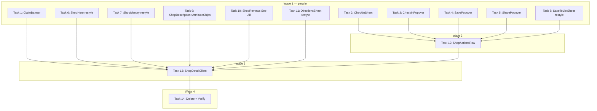

# Shop View UI Reconstruct Implementation Plan

> **For Claude:** REQUIRED SUB-SKILL: Use executing-plans to implement this plan task-by-task.

**Design Doc:** [docs/designs/2026-03-20-shop-view-ui-reconstruct-design.md](docs/designs/2026-03-20-shop-view-ui-reconstruct-design.md)

**Spec References:** [SPEC.md §9 Business Rules (check-in page)](SPEC.md)

**PRD References:** —

**Goal:** Restyle the Shop View to match Pencil-approved designs — new actions row, hero overlay buttons, check-in bottom sheet, desktop popovers, and claim banner.

**Architecture:** In-place restyle of existing components where possible; 6 new files for genuinely new behaviour (CheckInSheet, ShopActionsRow, ClaimBanner, 3 desktop popovers). Shadcn Popover added for desktop overlays. ShopDetailClient rewired as integration hub with local open-state for all overlays.

**Tech Stack:** Next.js 16, TypeScript strict, Tailwind CSS, shadcn/ui (Drawer + Popover), Vaul, Radix UI, Lucide icons, Vitest + Testing Library

**Acceptance Criteria:**

- [ ] A user on mobile can tap "Check In 打卡" on the Shop View and complete check-in without leaving the page
- [ ] A user on desktop can open and close the Save, Share, and Check In popovers from the Shop View actions row
- [ ] A user sees the open status, distance, and address in the shop info section
- [ ] A user sees a "Is this your café? Claim this page →" banner at the bottom of the shop view
- [ ] All 3 Save-to-List states (has lists / no lists / cap reached) match the Pencil designs

---

## Prerequisites

Install shadcn Popover (not currently in the project — only Drawer exists):

```bash
cd /path/to/worktree
pnpm dlx shadcn@latest add popover
```

Verify `components/ui/popover.tsx` exists before starting Task 3/4/5.

---

## Task 1: ClaimBanner component

**Files:**

- Create: `components/shops/claim-banner.tsx`
- Create: `components/shops/claim-banner.test.tsx`

**Step 1: Write the failing test**

```tsx
// components/shops/claim-banner.test.tsx
import { render, screen } from '@testing-library/react';
import { ClaimBanner } from './claim-banner';

describe('ClaimBanner', () => {
  it('shows claim prompt with a link for shop owners', () => {
    render(<ClaimBanner shopId="abc123" />);
    expect(screen.getByText(/Is this your café/i)).toBeInTheDocument();
    expect(
      screen.getByRole('link', { name: /Claim this page/i })
    ).toBeInTheDocument();
  });
});
```

**Step 2: Run test to verify it fails**

```bash
pnpm test components/shops/claim-banner.test.tsx
```

Expected: FAIL — module not found

**Step 3: Implement**

```tsx
// components/shops/claim-banner.tsx
interface ClaimBannerProps {
  shopId: string;
}

export function ClaimBanner({ shopId }: ClaimBannerProps) {
  return (
    <div className="border-t border-[#E5E4E1] bg-[#FAF7F2] px-5 py-4">
      <p className="text-sm text-[#6B6560]">
        Is this your café?{' '}
        <a
          href={`mailto:hello@caferoam.tw?subject=Claim+${shopId}`}
          className="font-medium text-[#3B2F2A] underline underline-offset-2"
        >
          Claim this page →
        </a>
      </p>
    </div>
  );
}
```

**Step 4: Run test to verify it passes**

```bash
pnpm test components/shops/claim-banner.test.tsx
```

**Step 5: Commit**

```bash
git add components/shops/claim-banner.tsx components/shops/claim-banner.test.tsx
git commit -m "feat: add ClaimBanner component"
```

---

## Task 2: CheckInSheet component (mobile bottom sheet)

**Files:**

- Create: `components/shops/check-in-sheet.tsx`
- Create: `components/shops/check-in-sheet.test.tsx`

**Context:** Reuses `PhotoUploader` from `components/checkins/photo-uploader.tsx` and `StarRating` from `components/reviews/star-rating.tsx`. Calls `POST /api/checkins`. The existing `/checkin/[shopId]` page is kept as a fallback (deep-link support).

**Step 1: Write the failing tests**

```tsx
// components/shops/check-in-sheet.test.tsx
import { render, screen, fireEvent, waitFor } from '@testing-library/react';
import { vi } from 'vitest';
import { CheckInSheet } from './check-in-sheet';

vi.mock('@/components/checkins/photo-uploader', () => ({
  PhotoUploader: ({ onChange }: { onChange: (files: File[]) => void }) => (
    <button
      onClick={() =>
        onChange([new File([''], 'photo.jpg', { type: 'image/jpeg' })])
      }
    >
      Add Photo
    </button>
  ),
}));

vi.mock('@/lib/supabase/storage', () => ({
  uploadCheckInPhoto: vi
    .fn()
    .mockResolvedValue('https://example.com/photo.jpg'),
}));

global.fetch = vi.fn();

describe('CheckInSheet', () => {
  const defaultProps = {
    shopId: 'shop-1',
    shopName: 'Test Cafe',
    open: true,
    onOpenChange: vi.fn(),
    onSuccess: vi.fn(),
  };

  it('shows the shop name in the sheet header', () => {
    render(<CheckInSheet {...defaultProps} />);
    expect(screen.getByText('Test Cafe')).toBeInTheDocument();
  });

  it('disables submit when no photo is selected', () => {
    render(<CheckInSheet {...defaultProps} />);
    const submitBtn = screen.getByRole('button', { name: /Check In/i });
    expect(submitBtn).toBeDisabled();
  });

  it('enables submit after a photo is added', async () => {
    render(<CheckInSheet {...defaultProps} />);
    fireEvent.click(screen.getByText('Add Photo'));
    await waitFor(() => {
      expect(
        screen.getByRole('button', { name: /Check In/i })
      ).not.toBeDisabled();
    });
  });

  it('calls POST /api/checkins on submit and fires onSuccess', async () => {
    (global.fetch as ReturnType<typeof vi.fn>).mockResolvedValue({
      ok: true,
      json: async () => ({ id: 'ci-1' }),
    });
    render(<CheckInSheet {...defaultProps} />);
    fireEvent.click(screen.getByText('Add Photo'));
    await waitFor(() =>
      fireEvent.click(screen.getByRole('button', { name: /Check In/i }))
    );
    await waitFor(() => {
      expect(global.fetch).toHaveBeenCalledWith(
        '/api/checkins',
        expect.objectContaining({ method: 'POST' })
      );
      expect(defaultProps.onSuccess).toHaveBeenCalled();
    });
  });

  it('shows an error message when the API call fails', async () => {
    (global.fetch as ReturnType<typeof vi.fn>).mockResolvedValue({
      ok: false,
      json: async () => ({ error: 'Server error' }),
    });
    render(<CheckInSheet {...defaultProps} />);
    fireEvent.click(screen.getByText('Add Photo'));
    await waitFor(() =>
      fireEvent.click(screen.getByRole('button', { name: /Check In/i }))
    );
    await waitFor(() => {
      expect(screen.getByRole('alert')).toBeInTheDocument();
    });
  });
});
```

**Step 2: Run tests to verify they fail**

```bash
pnpm test components/shops/check-in-sheet.test.tsx
```

**Step 3: Implement**

```tsx
// components/shops/check-in-sheet.tsx
'use client';

import { useState } from 'react';
import { PhotoUploader } from '@/components/checkins/photo-uploader';
import { StarRating } from '@/components/reviews/star-rating';
import { uploadCheckInPhoto } from '@/lib/supabase/storage';
import {
  Drawer,
  DrawerContent,
  DrawerHeader,
  DrawerTitle,
} from '@/components/ui/drawer';

interface CheckInSheetProps {
  shopId: string;
  shopName: string;
  open: boolean;
  onOpenChange: (open: boolean) => void;
  onSuccess?: () => void;
}

type SubmitState = 'idle' | 'uploading' | 'submitting';

export function CheckInSheet({
  shopId,
  shopName,
  open,
  onOpenChange,
  onSuccess,
}: CheckInSheetProps) {
  const [photos, setPhotos] = useState<File[]>([]);
  const [rating, setRating] = useState(0);
  const [reviewText, setReviewText] = useState('');
  const [mood, setMood] = useState('');
  const [submitState, setSubmitState] = useState<SubmitState>('idle');
  const [error, setError] = useState<string | null>(null);

  const canSubmit = photos.length > 0 && submitState === 'idle';

  async function handleSubmit() {
    if (!canSubmit) return;
    setError(null);
    try {
      setSubmitState('uploading');
      const uploadedUrls = await Promise.all(
        photos.map((f) => uploadCheckInPhoto(shopId, f))
      );
      setSubmitState('submitting');
      const res = await fetch('/api/checkins', {
        method: 'POST',
        headers: { 'Content-Type': 'application/json' },
        body: JSON.stringify({
          shopId,
          photoUrls: uploadedUrls,
          ...(rating > 0 && { stars: rating }),
          ...(reviewText.trim() && { reviewText: reviewText.trim() }),
          ...(mood.trim() && { moodNote: mood.trim() }),
        }),
      });
      if (!res.ok) throw new Error('Check-in failed');
      onOpenChange(false);
      onSuccess?.();
    } catch (err) {
      setError(err instanceof Error ? err.message : 'Something went wrong');
    } finally {
      setSubmitState('idle');
    }
  }

  const busy = submitState !== 'idle';

  return (
    <Drawer open={open} onOpenChange={onOpenChange}>
      <DrawerContent>
        <DrawerHeader className="flex items-center justify-between border-b border-[#E5E4E1] px-4 py-3">
          <div>
            <DrawerTitle className="text-base font-semibold">
              Check In 打卡
            </DrawerTitle>
            <p className="mt-0.5 text-xs text-[#9E9893]">{shopName}</p>
          </div>
          <button
            onClick={() => onOpenChange(false)}
            className="text-[#9E9893] hover:text-[#3B2F2A]"
            aria-label="Close"
          >
            ✕
          </button>
        </DrawerHeader>

        <div className="max-h-[70vh] space-y-4 overflow-y-auto px-4 py-4">
          {error && (
            <div
              role="alert"
              className="rounded-lg bg-red-50 px-3 py-2 text-sm text-red-700"
            >
              {error}
            </div>
          )}

          <div>
            <label className="text-sm font-medium text-[#3B2F2A]">
              Photos <span className="text-red-500">*</span>
            </label>
            <div className="mt-2">
              <PhotoUploader onChange={setPhotos} maxFiles={3} />
            </div>
          </div>

          <div>
            <label className="text-sm font-medium text-[#3B2F2A]">
              Rating{' '}
              <span className="text-xs font-normal text-[#9E9893]">
                optional
              </span>
            </label>
            <div className="mt-2">
              <StarRating value={rating} onChange={setRating} />
            </div>
          </div>

          <div>
            <label className="text-sm font-medium text-[#3B2F2A]">
              Review{' '}
              <span className="text-xs font-normal text-[#9E9893]">
                optional
              </span>
            </label>
            <textarea
              value={reviewText}
              onChange={(e) => setReviewText(e.target.value)}
              placeholder="Share your experience here..."
              rows={3}
              className="mt-2 w-full resize-none rounded-lg bg-[#F5F4F2] px-3 py-2 text-sm placeholder:text-[#C4C0BB] focus:outline-none"
            />
          </div>

          <div>
            <label className="text-sm font-medium text-[#3B2F2A]">
              How do you feel?{' '}
              <span className="text-xs font-normal text-[#9E9893]">
                optional
              </span>
            </label>
            <input
              type="text"
              value={mood}
              onChange={(e) => setMood(e.target.value)}
              placeholder="How are you feeling today? (optional)"
              className="mt-2 w-full rounded-lg bg-[#F5F4F2] px-3 py-2 text-sm placeholder:text-[#C4C0BB] focus:outline-none"
            />
          </div>
        </div>

        <div className="border-t border-[#E5E4E1] px-4 py-4">
          <button
            onClick={handleSubmit}
            disabled={!canSubmit}
            className="flex w-full items-center justify-center gap-2 rounded-full bg-[#2D5A27] py-3.5 text-sm font-semibold text-white disabled:opacity-40"
          >
            {busy ? 'Checking in...' : '📍 打卡 Check In'}
          </button>
        </div>
      </DrawerContent>
    </Drawer>
  );
}
```

**Step 4: Run tests to verify they pass**

```bash
pnpm test components/shops/check-in-sheet.test.tsx
```

**Step 5: Commit**

```bash
git add components/shops/check-in-sheet.tsx components/shops/check-in-sheet.test.tsx
git commit -m "feat: add CheckInSheet mobile bottom sheet"
```

---

## Task 3: CheckInPopover component (desktop)

**Files:**

- Create: `components/shops/check-in-popover.tsx`
- Create: `components/shops/check-in-popover.test.tsx`

**Prerequisite:** `components/ui/popover.tsx` must exist. If not: `pnpm dlx shadcn@latest add popover`

**Step 1: Write the failing tests**

```tsx
// components/shops/check-in-popover.test.tsx
import { render, screen, fireEvent } from '@testing-library/react';
import { vi } from 'vitest';
import { CheckInPopover } from './check-in-popover';

vi.mock('@/components/checkins/photo-uploader', () => ({
  PhotoUploader: () => <div>Photo uploader</div>,
}));
vi.mock('@/components/reviews/star-rating', () => ({
  StarRating: () => <div>Star rating</div>,
}));

describe('CheckInPopover', () => {
  it('shows the photo upload zone when open', () => {
    render(
      <CheckInPopover
        shopId="s1"
        shopName="Cafe"
        open={true}
        onOpenChange={vi.fn()}
        trigger={<button>Check In</button>}
      />
    );
    expect(screen.getByText('Photo uploader')).toBeInTheDocument();
  });

  it('shows the Check In submit button', () => {
    render(
      <CheckInPopover
        shopId="s1"
        shopName="Cafe"
        open={true}
        onOpenChange={vi.fn()}
        trigger={<button>Check In</button>}
      />
    );
    expect(
      screen.getByRole('button', { name: /Check In/i })
    ).toBeInTheDocument();
  });

  it('submit button is disabled when no photo is selected', () => {
    render(
      <CheckInPopover
        shopId="s1"
        shopName="Cafe"
        open={true}
        onOpenChange={vi.fn()}
        trigger={<button>Check In</button>}
      />
    );
    expect(screen.getByRole('button', { name: /Check In/i })).toBeDisabled();
  });
});
```

**Step 2: Run tests to verify they fail**

```bash
pnpm test components/shops/check-in-popover.test.tsx
```

**Step 3: Implement**

```tsx
// components/shops/check-in-popover.tsx
'use client';

import { useState } from 'react';
import { PhotoUploader } from '@/components/checkins/photo-uploader';
import { StarRating } from '@/components/reviews/star-rating';
import { uploadCheckInPhoto } from '@/lib/supabase/storage';
import {
  Popover,
  PopoverContent,
  PopoverTrigger,
} from '@/components/ui/popover';

interface CheckInPopoverProps {
  shopId: string;
  shopName: string;
  open: boolean;
  onOpenChange: (open: boolean) => void;
  trigger: React.ReactNode;
  onSuccess?: () => void;
}

export function CheckInPopover({
  shopId,
  shopName: _shopName,
  open,
  onOpenChange,
  trigger,
  onSuccess,
}: CheckInPopoverProps) {
  const [photos, setPhotos] = useState<File[]>([]);
  const [rating, setRating] = useState(0);
  const [reviewText, setReviewText] = useState('');
  const [mood, setMood] = useState('');
  const [busy, setBusy] = useState(false);
  const [error, setError] = useState<string | null>(null);

  const canSubmit = photos.length > 0 && !busy;

  async function handleSubmit() {
    if (!canSubmit) return;
    setError(null);
    setBusy(true);
    try {
      const uploadedUrls = await Promise.all(
        photos.map((f) => uploadCheckInPhoto(shopId, f))
      );
      const res = await fetch('/api/checkins', {
        method: 'POST',
        headers: { 'Content-Type': 'application/json' },
        body: JSON.stringify({
          shopId,
          photoUrls: uploadedUrls,
          ...(rating > 0 && { stars: rating }),
          ...(reviewText.trim() && { reviewText: reviewText.trim() }),
          ...(mood.trim() && { moodNote: mood.trim() }),
        }),
      });
      if (!res.ok) throw new Error('Check-in failed');
      onOpenChange(false);
      onSuccess?.();
    } catch (err) {
      setError(err instanceof Error ? err.message : 'Something went wrong');
    } finally {
      setBusy(false);
    }
  }

  return (
    <Popover open={open} onOpenChange={onOpenChange}>
      <PopoverTrigger asChild>{trigger}</PopoverTrigger>
      <PopoverContent
        className="w-80 overflow-hidden rounded-2xl p-0 shadow-xl"
        align="start"
      >
        <div className="flex items-center justify-between border-b border-[#E5E4E1] px-4 py-3">
          <h3 className="text-sm font-semibold text-[#3B2F2A]">
            Check In 打卡
          </h3>
          <button
            onClick={() => onOpenChange(false)}
            className="text-xs text-[#9E9893] hover:text-[#3B2F2A]"
            aria-label="Close"
          >
            ✕
          </button>
        </div>

        <div className="space-y-3 p-4">
          {error && (
            <div
              role="alert"
              className="rounded-lg bg-red-50 px-3 py-2 text-xs text-red-700"
            >
              {error}
            </div>
          )}
          <PhotoUploader onChange={setPhotos} maxFiles={3} />
          <div>
            <p className="mb-1 text-xs font-medium text-[#3B2F2A]">Rating</p>
            <StarRating value={rating} onChange={setRating} />
          </div>
          <textarea
            value={reviewText}
            onChange={(e) => setReviewText(e.target.value)}
            placeholder="Write your review (optional)..."
            rows={2}
            className="w-full resize-none rounded-lg bg-[#F5F4F2] px-3 py-2 text-sm placeholder:text-[#C4C0BB] focus:outline-none"
          />
          <input
            type="text"
            value={mood}
            onChange={(e) => setMood(e.target.value)}
            placeholder="How are you feeling today? (optional)"
            className="w-full rounded-lg bg-[#F5F4F2] px-3 py-2 text-sm placeholder:text-[#C4C0BB] focus:outline-none"
          />
        </div>

        <div className="px-4 pb-4">
          <button
            onClick={handleSubmit}
            disabled={!canSubmit}
            className="w-full rounded-lg bg-[#1A1918] py-2.5 text-sm font-semibold text-white disabled:opacity-40"
          >
            {busy ? 'Checking in...' : 'Check In 打卡'}
          </button>
        </div>
      </PopoverContent>
    </Popover>
  );
}
```

**Step 4: Run tests to verify they pass**

```bash
pnpm test components/shops/check-in-popover.test.tsx
```

**Step 5: Commit**

```bash
git add components/shops/check-in-popover.tsx components/shops/check-in-popover.test.tsx
git commit -m "feat: add CheckInPopover desktop component"
```

---

## Task 4: SavePopover component (desktop)

**Files:**

- Create: `components/shops/save-popover.tsx`
- Create: `components/shops/save-popover.test.tsx`

**Step 1: Write the failing tests**

```tsx
// components/shops/save-popover.test.tsx
import { render, screen, fireEvent } from '@testing-library/react';
import { vi } from 'vitest';
import { SavePopover } from './save-popover';

const mockLists = [
  { id: 'l1', name: 'Weekend Picks', items: [{ shopId: 'other' }] },
  { id: 'l2', name: 'Work Spots', items: [{ shopId: 'shop-1' }] },
];
const mockIsInList = vi.fn(
  (listId: string, shopId: string) =>
    mockLists
      .find((l) => l.id === listId)
      ?.items.some((i) => i.shopId === shopId) ?? false
);
const mockSaveShop = vi.fn();
const mockRemoveShop = vi.fn();
const mockCreateList = vi.fn();

vi.mock('@/lib/hooks/use-user-lists', () => ({
  useUserLists: () => ({
    lists: mockLists,
    isInList: mockIsInList,
    saveShop: mockSaveShop,
    removeShop: mockRemoveShop,
    createList: mockCreateList,
  }),
}));

describe('SavePopover', () => {
  const defaultProps = {
    shopId: 'shop-1',
    open: true,
    onOpenChange: vi.fn(),
    trigger: <button>Save</button>,
  };

  it('renders all user lists', () => {
    render(<SavePopover {...defaultProps} />);
    expect(screen.getByText('Weekend Picks')).toBeInTheDocument();
    expect(screen.getByText('Work Spots')).toBeInTheDocument();
  });

  it('shows a checked state for lists containing this shop', () => {
    render(<SavePopover {...defaultProps} />);
    const workSpotsCheckbox = screen.getByRole('checkbox', {
      name: /Work Spots/i,
    });
    expect(workSpotsCheckbox).toBeChecked();
  });

  it('shows "Create new list" option when under the 3-list cap', () => {
    render(<SavePopover {...defaultProps} />);
    expect(screen.getByText(/Create new list/i)).toBeInTheDocument();
  });

  it('calls saveShop when unchecked list is toggled', () => {
    render(<SavePopover {...defaultProps} />);
    fireEvent.click(screen.getByRole('checkbox', { name: /Weekend Picks/i }));
    expect(mockSaveShop).toHaveBeenCalledWith('l1', 'shop-1');
  });
});
```

**Step 2: Run tests to verify they fail**

```bash
pnpm test components/shops/save-popover.test.tsx
```

**Step 3: Implement**

```tsx
// components/shops/save-popover.tsx
'use client';

import { useState } from 'react';
import { Plus } from 'lucide-react';
import { toast } from 'sonner';
import { useUserLists } from '@/lib/hooks/use-user-lists';
import {
  Popover,
  PopoverContent,
  PopoverTrigger,
} from '@/components/ui/popover';

interface SavePopoverProps {
  shopId: string;
  open: boolean;
  onOpenChange: (open: boolean) => void;
  trigger: React.ReactNode;
}

export function SavePopover({
  shopId,
  open,
  onOpenChange,
  trigger,
}: SavePopoverProps) {
  const { lists, isInList, saveShop, removeShop, createList } = useUserLists();
  const [newListName, setNewListName] = useState('');
  const [creating, setCreating] = useState(false);

  async function handleToggle(listId: string) {
    try {
      if (isInList(listId, shopId)) {
        await removeShop(listId, shopId);
      } else {
        await saveShop(listId, shopId);
      }
    } catch {
      toast.error('Something went wrong');
    }
  }

  async function handleCreate() {
    if (!newListName.trim()) return;
    setCreating(true);
    try {
      await createList(newListName.trim());
      setNewListName('');
    } catch (err) {
      const msg = err instanceof Error ? err.message : 'Failed to create list';
      toast.error(
        msg.includes('Maximum') ? "You've reached the 3-list limit" : msg
      );
    } finally {
      setCreating(false);
    }
  }

  return (
    <Popover open={open} onOpenChange={onOpenChange}>
      <PopoverTrigger asChild>{trigger}</PopoverTrigger>
      <PopoverContent
        className="w-80 overflow-hidden rounded-2xl p-0 shadow-xl"
        align="start"
      >
        <div className="flex items-center justify-between border-b border-[#E5E4E1] px-4 py-4">
          <h3 className="text-sm font-semibold text-[#3B2F2A]">
            Save to List 收藏
          </h3>
          <button
            onClick={() => onOpenChange(false)}
            className="text-xs text-[#9E9893] hover:text-[#3B2F2A]"
            aria-label="Close"
          >
            ✕
          </button>
        </div>

        <div className="py-2">
          {lists.length === 0 && (
            <div className="flex flex-col items-center px-4 py-8 text-center">
              <span className="mb-2 text-3xl">🔖</span>
              <p className="text-sm font-medium text-[#3B2F2A]">No lists yet</p>
              <p className="mt-1 text-xs text-[#9E9893]">
                Create a list to start saving
              </p>
            </div>
          )}
          {lists.map((list) => (
            <label
              key={list.id}
              className="flex cursor-pointer items-center gap-3 px-4 py-3 hover:bg-[#F5F4F2]"
            >
              <div className="h-10 w-10 flex-shrink-0 rounded-lg bg-[#E8E6E2]" />
              <div className="min-w-0 flex-1">
                <p className="truncate text-sm font-medium text-[#3B2F2A]">
                  {list.name}
                </p>
                <p className="text-xs text-[#9E9893]">
                  {list.items.length} spots
                </p>
              </div>
              <input
                type="checkbox"
                aria-label={list.name}
                checked={isInList(list.id, shopId)}
                onChange={() => handleToggle(list.id)}
                className="h-5 w-5 rounded border-gray-300 accent-[#2D5A27]"
              />
            </label>
          ))}
          {lists.length < 3 && (
            <button
              onClick={() => setNewListName(' ')}
              className="flex w-full items-center gap-2 px-4 py-3 text-sm text-[#6B6560] hover:bg-[#F5F4F2]"
            >
              <Plus className="h-4 w-4" />
              Create new list
            </button>
          )}
          {lists.length === 3 && (
            <p className="mx-4 mb-2 rounded-lg bg-amber-50 px-4 py-2 text-xs text-amber-700">
              You've reached the 3-list limit
            </p>
          )}
        </div>

        {newListName.trim() !== '' && (
          <div className="border-t border-[#E5E4E1] px-4 py-3">
            <input
              type="text"
              value={newListName.trim() === ' ' ? '' : newListName}
              onChange={(e) => setNewListName(e.target.value)}
              onKeyDown={(e) => e.key === 'Enter' && handleCreate()}
              placeholder="List name..."
              autoFocus
              className="w-full rounded-lg bg-[#F5F4F2] px-3 py-2 text-sm focus:outline-none"
              disabled={creating}
            />
          </div>
        )}

        <div className="border-t border-[#E5E4E1] px-4 py-3">
          <button
            onClick={() => onOpenChange(false)}
            className="w-full rounded-full bg-[#2D5A27] py-2.5 text-sm font-semibold text-white"
          >
            Save
          </button>
        </div>
      </PopoverContent>
    </Popover>
  );
}
```

**Step 4: Run tests to verify they pass**

```bash
pnpm test components/shops/save-popover.test.tsx
```

**Step 5: Commit**

```bash
git add components/shops/save-popover.tsx components/shops/save-popover.test.tsx
git commit -m "feat: add SavePopover desktop component"
```

---

## Task 5: SharePopover component (desktop)

**Files:**

- Create: `components/shops/share-popover.tsx`
- Create: `components/shops/share-popover.test.tsx`

**Step 1: Write the failing tests**

```tsx
// components/shops/share-popover.test.tsx
import { render, screen, fireEvent } from '@testing-library/react';
import { vi } from 'vitest';
import { SharePopover } from './share-popover';

vi.mock('@/lib/posthog/use-analytics', () => ({
  useAnalytics: () => ({ capture: vi.fn() }),
}));

describe('SharePopover', () => {
  const defaultProps = {
    shopId: 'shop-1',
    shopName: 'Rufous Coffee',
    shareUrl: 'https://caferoam.app/shops/shop-1/rufous-coffee',
    open: true,
    onOpenChange: vi.fn(),
    trigger: <button>Share</button>,
  };

  it('displays the share URL', () => {
    render(<SharePopover {...defaultProps} />);
    expect(screen.getByDisplayValue(/rufous-coffee/i)).toBeInTheDocument();
  });

  it('shows a Copy button', () => {
    render(<SharePopover {...defaultProps} />);
    expect(screen.getByRole('button', { name: /Copy/i })).toBeInTheDocument();
  });

  it('copies the URL to clipboard when Copy is clicked', async () => {
    const writeText = vi.fn().mockResolvedValue(undefined);
    Object.assign(navigator, { clipboard: { writeText } });
    render(<SharePopover {...defaultProps} />);
    fireEvent.click(screen.getByRole('button', { name: /Copy/i }));
    expect(writeText).toHaveBeenCalledWith(defaultProps.shareUrl);
  });
});
```

**Step 2: Run tests to verify they fail**

```bash
pnpm test components/shops/share-popover.test.tsx
```

**Step 3: Implement**

```tsx
// components/shops/share-popover.tsx
'use client';

import { useAnalytics } from '@/lib/posthog/use-analytics';
import {
  Popover,
  PopoverContent,
  PopoverTrigger,
} from '@/components/ui/popover';

const PLATFORMS = [
  {
    name: 'Threads',
    icon: '@',
    bg: '#1A1918',
    fg: '#FFFFFF',
    urlFn: (u: string) =>
      `https://www.threads.net/intent/post?text=${encodeURIComponent(u)}`,
  },
  {
    name: 'LINE',
    icon: 'L',
    bg: '#06C755',
    fg: '#FFFFFF',
    urlFn: (u: string) =>
      `https://social-plugins.line.me/lineit/share?url=${encodeURIComponent(u)}`,
  },
  {
    name: 'WhatsApp',
    icon: 'W',
    bg: '#25D366',
    fg: '#FFFFFF',
    urlFn: (u: string) => `https://wa.me/?text=${encodeURIComponent(u)}`,
  },
  {
    name: 'Mail',
    icon: '✉',
    bg: '#F5F4F2',
    fg: '#3B2F2A',
    urlFn: (u: string, n: string) =>
      `mailto:?subject=${encodeURIComponent(n)}&body=${encodeURIComponent(u)}`,
  },
];

interface SharePopoverProps {
  shopId: string;
  shopName: string;
  shareUrl: string;
  open: boolean;
  onOpenChange: (open: boolean) => void;
  trigger: React.ReactNode;
}

export function SharePopover({
  shopId,
  shopName,
  shareUrl,
  open,
  onOpenChange,
  trigger,
}: SharePopoverProps) {
  const { capture } = useAnalytics();

  async function handleCopy() {
    await navigator.clipboard.writeText(shareUrl);
    capture('shop_url_copied', { shop_id: shopId, copy_method: 'clipboard' });
  }

  return (
    <Popover open={open} onOpenChange={onOpenChange}>
      <PopoverTrigger asChild>{trigger}</PopoverTrigger>
      <PopoverContent
        className="w-80 overflow-hidden rounded-2xl p-0 shadow-xl"
        align="start"
      >
        <div className="border-b border-[#E5E4E1] px-4 py-4">
          <h3 className="text-sm font-semibold text-[#3B2F2A]">Share</h3>
        </div>

        <div className="space-y-4 p-4">
          {/* Shop preview card */}
          <div className="flex items-center gap-3 rounded-xl bg-[#F5F4F2] px-3 py-2.5">
            <div className="h-10 w-10 flex-shrink-0 rounded-lg bg-[#E8E6E2]" />
            <div className="min-w-0">
              <p className="truncate text-sm font-semibold text-[#3B2F2A]">
                {shopName}
              </p>
            </div>
          </div>

          {/* URL + Copy */}
          <div className="flex items-center gap-2 rounded-lg border border-[#E5E4E1] px-3 py-2">
            <input
              type="text"
              readOnly
              value={shareUrl}
              className="flex-1 truncate bg-transparent text-xs text-[#6B6560] outline-none"
            />
            <button
              onClick={handleCopy}
              className="flex-shrink-0 rounded-lg bg-[#2D5A27] px-3 py-1.5 text-xs font-semibold text-white"
            >
              Copy
            </button>
          </div>

          {/* Platform icons */}
          <div className="flex gap-3">
            {PLATFORMS.map((p) => (
              <a
                key={p.name}
                href={p.urlFn(shareUrl, shopName)}
                target="_blank"
                rel="noreferrer"
                aria-label={p.name}
                className="flex flex-col items-center gap-1"
              >
                <div
                  className="flex h-11 w-11 items-center justify-center rounded-full text-base font-bold"
                  style={{ background: p.bg, color: p.fg }}
                >
                  {p.icon}
                </div>
                <span className="text-[10px] text-[#9E9893]">{p.name}</span>
              </a>
            ))}
            <div className="flex flex-col items-center gap-1">
              <div className="flex h-11 w-11 items-center justify-center rounded-full bg-[#F5F4F2] text-base text-[#6B6560]">
                •••
              </div>
              <span className="text-[10px] text-[#9E9893]">More</span>
            </div>
          </div>
        </div>
      </PopoverContent>
    </Popover>
  );
}
```

**Step 4: Run tests to verify they pass**

```bash
pnpm test components/shops/share-popover.test.tsx
```

**Step 5: Commit**

```bash
git add components/shops/share-popover.tsx components/shops/share-popover.test.tsx
git commit -m "feat: add SharePopover desktop component"
```

---

## Task 6: Restyle ShopHero — floating overlay buttons

**Files:**

- Modify: `components/shops/shop-hero.tsx`
- Modify: `components/shops/shop-hero.test.tsx` (create if it doesn't exist)

**What changes:** Add floating back, save (bookmark), and share buttons overlaid on the hero image. These are callback props — ShopDetailClient owns the logic.

**Step 1: Write the failing tests**

```tsx
// components/shops/shop-hero.test.tsx
import { render, screen, fireEvent } from '@testing-library/react';
import { vi } from 'vitest';
import { ShopHero } from './shop-hero';

describe('ShopHero', () => {
  const baseProps = {
    photoUrls: ['https://example.com/photo.jpg'],
    shopName: 'The Brew House',
  };

  it('renders the hero image', () => {
    render(<ShopHero {...baseProps} />);
    expect(
      screen.getByRole('img', { name: /The Brew House/i })
    ).toBeInTheDocument();
  });

  it('calls onBack when back button is tapped', () => {
    const onBack = vi.fn();
    render(<ShopHero {...baseProps} onBack={onBack} />);
    fireEvent.click(screen.getByRole('button', { name: /Back/i }));
    expect(onBack).toHaveBeenCalled();
  });

  it('calls onSave when bookmark button is tapped', () => {
    const onSave = vi.fn();
    render(<ShopHero {...baseProps} onSave={onSave} />);
    fireEvent.click(screen.getByRole('button', { name: /Save/i }));
    expect(onSave).toHaveBeenCalled();
  });

  it('calls onShare when share button is tapped', () => {
    const onShare = vi.fn();
    render(<ShopHero {...baseProps} onShare={onShare} />);
    fireEvent.click(screen.getByRole('button', { name: /Share/i }));
    expect(onShare).toHaveBeenCalled();
  });

  it('renders photo count badge when multiple photos', () => {
    render(<ShopHero {...baseProps} photoUrls={['a.jpg', 'b.jpg', 'c.jpg']} />);
    expect(screen.getByText(/3 photos/i)).toBeInTheDocument();
  });
});
```

**Step 2: Run tests to verify they fail**

```bash
pnpm test components/shops/shop-hero.test.tsx
```

**Step 3: Implement**

```tsx
// components/shops/shop-hero.tsx
import Image from 'next/image';
import { ChevronLeft, Bookmark, Share2, Images } from 'lucide-react';

interface ShopHeroProps {
  photoUrls: string[];
  shopName: string;
  isSaved?: boolean;
  onBack?: () => void;
  onSave?: () => void;
  onShare?: () => void;
}

export function ShopHero({
  photoUrls,
  shopName,
  isSaved = false,
  onBack,
  onSave,
  onShare,
}: ShopHeroProps) {
  const primary = photoUrls[0];

  return (
    <div className="relative h-[260px] w-full bg-gray-100">
      {primary ? (
        <Image
          src={primary}
          alt={shopName}
          fill
          className="object-cover"
          priority
          sizes="100vw"
        />
      ) : (
        <div className="flex h-full items-center justify-center text-4xl font-bold text-gray-300">
          {shopName[0]}
        </div>
      )}

      {/* Overlay buttons — top row */}
      <div className="absolute top-0 right-0 left-0 flex items-center justify-between px-4 pt-12 pb-4">
        {onBack && (
          <button
            onClick={onBack}
            aria-label="Back"
            className="flex h-9 w-9 items-center justify-center rounded-full bg-white/90 shadow-sm backdrop-blur-sm"
          >
            <ChevronLeft className="h-5 w-5 text-[#1A1918]" />
          </button>
        )}
        <div className="ml-auto flex items-center gap-2">
          {onSave && (
            <button
              onClick={onSave}
              aria-label="Save"
              className="flex h-9 w-9 items-center justify-center rounded-full bg-white/90 shadow-sm backdrop-blur-sm"
            >
              <Bookmark
                className={`h-4 w-4 ${isSaved ? 'fill-amber-500 text-amber-500' : 'text-[#1A1918]'}`}
              />
            </button>
          )}
          {onShare && (
            <button
              onClick={onShare}
              aria-label="Share"
              className="flex h-9 w-9 items-center justify-center rounded-full bg-white/90 shadow-sm backdrop-blur-sm"
            >
              <Share2 className="h-4 w-4 text-[#1A1918]" />
            </button>
          )}
        </div>
      </div>

      {/* Photo count badge */}
      {photoUrls.length > 1 && (
        <div className="absolute bottom-3 left-4 flex items-center gap-1 rounded-full bg-black/50 px-2.5 py-1">
          <Images className="h-3 w-3 text-white" />
          <span className="text-xs text-white">{photoUrls.length} photos</span>
        </div>
      )}
    </div>
  );
}
```

**Step 4: Run tests to verify they pass**

```bash
pnpm test components/shops/shop-hero.test.tsx
```

**Step 5: Commit**

```bash
git add components/shops/shop-hero.tsx components/shops/shop-hero.test.tsx
git commit -m "feat: add floating overlay buttons to ShopHero"
```

---

## Task 7: Restyle ShopIdentity — open status, distance, address

**Files:**

- Modify: `components/shops/shop-identity.tsx`
- Create/Modify: `components/shops/shop-identity.test.tsx`

**What changes:** Add `openNow` badge, `distance` km pill, `address` line. Remove MRT-only display (MRT stays in DirectionsSheet).

**Step 1: Write the failing tests**

```tsx
// components/shops/shop-identity.test.tsx
import { render, screen } from '@testing-library/react';
import { ShopIdentity } from './shop-identity';

describe('ShopIdentity', () => {
  const base = { name: 'The Brew House', rating: 4.8, reviewCount: 1263 };

  it('shows the shop name', () => {
    render(<ShopIdentity {...base} />);
    expect(
      screen.getByRole('heading', { name: /The Brew House/i })
    ).toBeInTheDocument();
  });

  it('shows rating and review count', () => {
    render(<ShopIdentity {...base} />);
    expect(screen.getByText('4.8')).toBeInTheDocument();
    expect(screen.getByText(/1263/)).toBeInTheDocument();
  });

  it('shows "Open" badge when openNow is true', () => {
    render(<ShopIdentity {...base} openNow={true} />);
    expect(screen.getByText(/Open/i)).toBeInTheDocument();
  });

  it('shows "Closed" badge when openNow is false', () => {
    render(<ShopIdentity {...base} openNow={false} />);
    expect(screen.getByText(/Closed/i)).toBeInTheDocument();
  });

  it('shows distance when provided', () => {
    render(<ShopIdentity {...base} distance="0.3 km" />);
    expect(screen.getByText(/0\.3 km/)).toBeInTheDocument();
  });

  it('shows address when provided', () => {
    render(<ShopIdentity {...base} address="Yongkang St, Da'an District" />);
    expect(screen.getByText(/Yongkang St/i)).toBeInTheDocument();
  });
});
```

**Step 2: Run tests to verify they fail**

```bash
pnpm test components/shops/shop-identity.test.tsx
```

**Step 3: Implement**

```tsx
// components/shops/shop-identity.tsx
interface ShopIdentityProps {
  name: string;
  rating?: number | null;
  reviewCount?: number;
  openNow?: boolean;
  distance?: string;
  address?: string;
}

export function ShopIdentity({
  name,
  rating,
  reviewCount,
  openNow,
  distance,
  address,
}: ShopIdentityProps) {
  return (
    <div className="px-5 py-3">
      <h1 className="text-xl font-bold text-[#1A1918]">{name}</h1>

      <div className="mt-1.5 flex flex-wrap items-center gap-x-2 gap-y-1">
        {rating != null && (
          <div className="flex items-center gap-1">
            <span className="text-sm text-[#E06B3F]">★</span>
            <span className="text-sm font-medium text-[#1A1918]">
              {rating.toFixed(1)}
            </span>
            {reviewCount != null && (
              <span className="text-xs text-[#9E9893]">({reviewCount})</span>
            )}
          </div>
        )}
        {openNow != null && (
          <span
            className={`rounded-full px-2 py-0.5 text-xs font-medium ${
              openNow
                ? 'bg-[#EAF3E8] text-[#2D5A27]'
                : 'bg-[#F5E8E8] text-[#8B2222]'
            }`}
          >
            {openNow ? 'Open' : 'Closed'}
          </span>
        )}
        {distance && <span className="text-xs text-[#9E9893]">{distance}</span>}
      </div>

      {address && <p className="mt-1 text-xs text-[#9E9893]">{address}</p>}
    </div>
  );
}
```

**Step 4: Run tests to verify they pass**

```bash
pnpm test components/shops/shop-identity.test.tsx
```

**Step 5: Commit**

```bash
git add components/shops/shop-identity.tsx components/shops/shop-identity.test.tsx
git commit -m "feat: add open status, distance, address to ShopIdentity"
```

---

## Task 8: Restyle SaveToListSheet — 3 visual states

**Files:**

- Modify: `components/lists/save-to-list-sheet.tsx`
- Create/Modify: `components/lists/save-to-list-sheet.test.tsx`

**What changes:** Visual restyle to match Pencil frames `y52Ff` (has lists), `udpQf` (no lists), `rgu49` (cap reached — shows warning). Logic unchanged.

**Step 1: Write the failing tests**

```tsx
// components/lists/save-to-list-sheet.test.tsx
import { render, screen } from '@testing-library/react';
import { vi } from 'vitest';
import { SaveToListSheet } from './save-to-list-sheet';

const mockSaveShop = vi.fn();
const mockRemoveShop = vi.fn();
const mockCreateList = vi.fn();

vi.mock('@/lib/hooks/use-user-lists', () => ({
  useUserLists: ({ mockLists = [] } = {}) => ({
    lists: mockLists,
    isInList: vi.fn().mockReturnValue(false),
    saveShop: mockSaveShop,
    removeShop: mockRemoveShop,
    createList: mockCreateList,
  }),
}));

// Test each visual state by passing mock lists directly
describe('SaveToListSheet', () => {
  const base = { shopId: 'shop-1', open: true, onOpenChange: vi.fn() };

  it('shows empty state with Create CTA when user has no lists', () => {
    vi.mock('@/lib/hooks/use-user-lists', () => ({
      useUserLists: () => ({
        lists: [],
        isInList: vi.fn().mockReturnValue(false),
        saveShop: mockSaveShop,
        removeShop: mockRemoveShop,
        createList: mockCreateList,
      }),
    }));
    render(<SaveToListSheet {...base} />);
    expect(
      screen.getByRole('button', { name: /Create a list/i })
    ).toBeInTheDocument();
  });
});
```

> **Note:** The full 3-state test coverage requires the `useUserLists` mock to be configurable per-test. Use `vi.doMock` with `beforeEach` resets or test the rendered HTML by inspecting the mock list data passed in. Focus on the key visual element per state: empty CTA / list rows / cap warning.

**Step 3: Restyle the component**

Update `components/lists/save-to-list-sheet.tsx` to use the new design system colors and layout per Pencil frames. Key visual changes:

- Section title: `Save to List 收藏` (zh subtitle)
- List rows: thumbnail placeholder (rounded-lg, 40px) + name + spot count + checkbox
- Empty state: centered icon + "No lists yet" + green "Create a list" CTA button
- Cap reached: amber warning strip `You've reached the 3-list limit`
- `X` close button in header

The logic (toggle, create, error toast) stays unchanged. Only className and layout changes.

**Step 4: Run tests**

```bash
pnpm test components/lists/save-to-list-sheet.test.tsx
```

**Step 5: Commit**

```bash
git add components/lists/save-to-list-sheet.tsx components/lists/save-to-list-sheet.test.tsx
git commit -m "feat: restyle SaveToListSheet to match Pencil designs (3 states)"
```

---

## Task 9: Restyle ShopDescription and AttributeChips — section headers

**Files:**

- Modify: `components/shops/shop-description.tsx`
- Modify: `components/shops/attribute-chips.tsx`

**No test needed — No testable behavior changes; these are CSS/layout only.** Existing render tests will continue to pass unchanged.

**Changes:**

`ShopDescription`: add `<h2 className="text-sm font-semibold text-[#1A1918] mb-2">About</h2>` before the text. Update container padding to `px-5 py-4`. Change text color to `text-[#3B2F2A]`.

`AttributeChips`: add `<h2 className="text-sm font-semibold text-[#1A1918] mb-2">Tags</h2>` before chips. Update chip styles to `rounded-full bg-[#F0EDE8] px-3 py-1 text-xs text-[#3B2F2A] font-medium`.

**Commit:**

```bash
git add components/shops/shop-description.tsx components/shops/attribute-chips.tsx
git commit -m "feat: add section headers to ShopDescription and AttributeChips"
```

---

## Task 10: Restyle ShopReviews — section header + See All link

**Files:**

- Modify: `components/shops/shop-reviews.tsx`
- Modify: `components/shops/shop-reviews.test.tsx` (add one test)

**Step 1: Write the failing test**

```tsx
// Add to existing shop-reviews.test.tsx
it('shows a "See all" link when there are more reviews than displayed', () => {
  const manyReviews = Array.from({ length: 4 }, (_, i) => ({
    id: `r${i}`,
    stars: 4,
    reviewText: `Review ${i}`,
    reviewedAt: '2026-01-01',
    displayName: `User ${i}`,
  }));
  render(
    <ShopReviews
      reviews={manyReviews}
      total={12}
      averageRating={4.2}
      isLoading={false}
      isAuthError={false}
      shopId="shop-1"
    />
  );
  expect(screen.getByRole('link', { name: /See all/i })).toBeInTheDocument();
});
```

**Step 2: Run to verify it fails**

```bash
pnpm test components/shops/shop-reviews.test.tsx
```

**Step 3: Add `shopId` prop + See All link**

Add `shopId: string` to `ShopReviewsProps`. Add at the bottom of the reviews section:

```tsx
{
  total > reviews.length && (
    <Link
      href={`/shops/${shopId}/reviews`}
      className="mt-3 block text-sm font-medium text-[#2D5A27]"
    >
      See all {total} reviews →
    </Link>
  );
}
```

Also update the section header from `打卡評價` to include star average inline per Pencil design.

**Step 4: Run tests**

```bash
pnpm test components/shops/shop-reviews.test.tsx
```

**Step 5: Commit**

```bash
git add components/shops/shop-reviews.tsx
git commit -m "feat: add See All link to ShopReviews"
```

---

## Task 11: Restyle DirectionsSheet — visual polish

**Files:**

- Modify: `components/shops/directions-sheet.tsx`

**No test changes needed** — only CSS/layout changes. The logic (routing, abort controller, MRT utility) is unchanged. Existing tests will continue to pass.

**Changes to match Pencil frame `ENKsc`:**

- Sheet handle + header: "Directions" title + `×` close button
- Walk/drive/MRT rows: icon left + label + estimate right, separated by `border-b border-[#E5E4E1]`
- Map thumbnail: full-width at top inside sheet (`rounded-none` or integrated flush)
- CTA row: "Google Maps" + "Apple Maps" as side-by-side buttons with icon (🗺)

**Commit:**

```bash
git add components/shops/directions-sheet.tsx
git commit -m "feat: restyle DirectionsSheet to match Pencil design"
```

---

## Task 12: ShopActionsRow component

**Depends on:** Tasks 2, 3, 4, 5 (all overlay components must exist)

**Files:**

- Create: `components/shops/shop-actions-row.tsx`
- Create: `components/shops/shop-actions-row.test.tsx`

**Step 1: Write the failing tests**

```tsx
// components/shops/shop-actions-row.test.tsx
import { render, screen, fireEvent } from '@testing-library/react';
import { vi } from 'vitest';
import { ShopActionsRow } from './shop-actions-row';

vi.mock('@/lib/hooks/use-is-desktop', () => ({
  useIsDesktop: vi.fn().mockReturnValue(false), // default: mobile
}));
vi.mock('./check-in-sheet', () => ({
  CheckInSheet: ({ open }: { open: boolean }) =>
    open ? <div data-testid="check-in-sheet">CheckInSheet</div> : null,
}));
vi.mock('@/components/lists/save-to-list-sheet', () => ({
  SaveToListSheet: ({ open }: { open: boolean }) =>
    open ? <div data-testid="save-sheet">SaveToListSheet</div> : null,
}));
vi.mock('./save-popover', () => ({
  SavePopover: ({ open }: { open: boolean }) =>
    open ? <div data-testid="save-popover">SavePopover</div> : null,
}));
vi.mock('./share-popover', () => ({
  SharePopover: ({ open }: { open: boolean }) =>
    open ? <div data-testid="share-popover">SharePopover</div> : null,
}));
vi.mock('./check-in-popover', () => ({
  CheckInPopover: ({ open }: { open: boolean }) =>
    open ? <div data-testid="check-in-popover">CheckInPopover</div> : null,
}));
vi.mock('@/lib/supabase/client', () => ({
  createClient: () => ({
    auth: {
      getSession: vi
        .fn()
        .mockResolvedValue({ data: { session: { user: {} } } }),
    },
  }),
}));

const defaultProps = {
  shopId: 'shop-1',
  shopName: 'Test Cafe',
  shareUrl: 'https://caferoam.app/shops/shop-1/test-cafe',
};

describe('ShopActionsRow — mobile', () => {
  it('renders the Check In primary button', () => {
    render(<ShopActionsRow {...defaultProps} />);
    expect(
      screen.getByRole('button', { name: /Check In/i })
    ).toBeInTheDocument();
  });

  it('opens CheckInSheet (not popover) on mobile when Check In is tapped', async () => {
    render(<ShopActionsRow {...defaultProps} />);
    fireEvent.click(screen.getByRole('button', { name: /Check In/i }));
    expect(screen.getByTestId('check-in-sheet')).toBeInTheDocument();
  });

  it('opens SaveToListSheet on mobile when Save is tapped', async () => {
    render(<ShopActionsRow {...defaultProps} />);
    fireEvent.click(screen.getByRole('button', { name: /Save/i }));
    expect(screen.getByTestId('save-sheet')).toBeInTheDocument();
  });
});
```

**Step 2: Run tests to verify they fail**

```bash
pnpm test components/shops/shop-actions-row.test.tsx
```

**Step 3: Implement**

```tsx
// components/shops/shop-actions-row.tsx
'use client';

import { useState } from 'react';
import { useRouter } from 'next/navigation';
import { Bookmark, Share2 } from 'lucide-react';
import { createClient } from '@/lib/supabase/client';
import { useIsDesktop } from '@/lib/hooks/use-is-desktop';
import { useUserLists } from '@/lib/hooks/use-user-lists';
import { CheckInSheet } from './check-in-sheet';
import { CheckInPopover } from './check-in-popover';
import { SavePopover } from './save-popover';
import { SharePopover } from './share-popover';
import { SaveToListSheet } from '@/components/lists/save-to-list-sheet';

interface ShopActionsRowProps {
  shopId: string;
  shopName: string;
  shareUrl: string;
  onDirections?: () => void;
}

export function ShopActionsRow({
  shopId,
  shopName,
  shareUrl,
  onDirections,
}: ShopActionsRowProps) {
  const isDesktop = useIsDesktop();
  const router = useRouter();
  const { isSaved } = useUserLists();
  const saved = isSaved(shopId);

  const [checkInOpen, setCheckInOpen] = useState(false);
  const [saveOpen, setSaveOpen] = useState(false);
  const [shareOpen, setShareOpen] = useState(false);

  async function requireAuth(then: () => void) {
    const supabase = createClient();
    const { data } = await supabase.auth.getSession();
    if (!data.session) {
      router.push(`/login?next=${encodeURIComponent(`/shops/${shopId}`)}`);
      return;
    }
    then();
  }

  const checkInBtn = (
    <button
      onClick={() => requireAuth(() => setCheckInOpen(true))}
      aria-label="Check In 打卡"
      className="flex flex-1 items-center justify-center gap-2 rounded-full bg-[#2D5A27] py-3 text-sm font-semibold text-white"
    >
      📍 Check In 打卡
    </button>
  );

  const saveBtn = (
    <button
      onClick={() => requireAuth(() => setSaveOpen(true))}
      aria-label="Save"
      className="flex h-11 w-11 items-center justify-center rounded-full border border-[#E5E4E1] bg-white"
    >
      <Bookmark
        className={`h-4 w-4 ${saved ? 'fill-amber-500 text-amber-500' : 'text-[#1A1918]'}`}
      />
    </button>
  );

  const shareBtn = (
    <button
      onClick={() => setShareOpen(true)}
      aria-label="Share"
      className="flex h-11 w-11 items-center justify-center rounded-full border border-[#E5E4E1] bg-white"
    >
      <Share2 className="h-4 w-4 text-[#1A1918]" />
    </button>
  );

  return (
    <div className="flex items-center gap-2 px-5 py-3">
      {isDesktop ? (
        <>
          <CheckInPopover
            shopId={shopId}
            shopName={shopName}
            open={checkInOpen}
            onOpenChange={setCheckInOpen}
            trigger={checkInBtn}
          />
          <SavePopover
            shopId={shopId}
            open={saveOpen}
            onOpenChange={setSaveOpen}
            trigger={saveBtn}
          />
          <SharePopover
            shopId={shopId}
            shopName={shopName}
            shareUrl={shareUrl}
            open={shareOpen}
            onOpenChange={setShareOpen}
            trigger={shareBtn}
          />
        </>
      ) : (
        <>
          {checkInBtn}
          {saveBtn}
          {shareBtn}
          <CheckInSheet
            shopId={shopId}
            shopName={shopName}
            open={checkInOpen}
            onOpenChange={setCheckInOpen}
          />
          <SaveToListSheet
            shopId={shopId}
            open={saveOpen}
            onOpenChange={setSaveOpen}
          />
          <SharePopover
            shopId={shopId}
            shopName={shopName}
            shareUrl={shareUrl}
            open={shareOpen}
            onOpenChange={setShareOpen}
            trigger={<span />}
          />
        </>
      )}
    </div>
  );
}
```

**Step 4: Run tests to verify they pass**

```bash
pnpm test components/shops/shop-actions-row.test.tsx
```

**Step 5: Commit**

```bash
git add components/shops/shop-actions-row.tsx components/shops/shop-actions-row.test.tsx
git commit -m "feat: add ShopActionsRow — wires Check In / Save / Share for mobile + desktop"
```

---

## Task 13: ShopDetailClient integration + SPEC update

**Depends on:** All Tasks 1–12

**Files:**

- Modify: `app/shops/[shopId]/[slug]/shop-detail-client.tsx`
- Modify: `app/shops/[shopId]/[slug]/shop-detail-client.test.tsx`
- Modify: `SPEC.md` (§9 check-in page rule)

**Step 1: Update the test**

In `shop-detail-client.test.tsx`, replace:

- Any `StickyCheckinBar` assertions with `ShopActionsRow`
- Add assertion: `ClaimBanner` is present
- Add assertion: `ShopHero` back/save/share callbacks are wired

```tsx
// Key assertions to add/update:
expect(screen.getByRole('button', { name: /Check In/i })).toBeInTheDocument(); // ShopActionsRow
expect(screen.getByText(/Is this your café/i)).toBeInTheDocument(); // ClaimBanner
// Remove: expect(screen.getByText(/打卡記錄 Check In/i)) — StickyCheckinBar gone
```

**Step 2: Run to verify tests fail (due to missing new components)**

```bash
pnpm test app/shops/\\[shopId\\]/\\[slug\\]/shop-detail-client.test.tsx
```

**Step 3: Rewrite ShopDetailClient layout**

Key changes:

1. Remove `StickyCheckinBar`, `BookmarkButton` imports
2. Add imports: `ShopActionsRow`, `ClaimBanner`
3. Add state: `const [directionsOpen, setDirectionsOpen] = useState(false)`
4. Pass new props to `ShopHero`: `onBack={() => router.back()}`, `onSave={() => setSaveOpen(true)}`, `onShare={() => setShareOpen(true)}`, `isSaved={isSaved(shop.id)}`
5. Add `ShopActionsRow` after `ShopIdentity`
6. Remove the `lg:grid lg:grid-cols-[1fr_380px]` desktop sidebar layout — replace with single-column layout per Pencil desktop frame
7. Add inline `ShopMapThumbnail` + directions rows in a `DirectionsSection` area (both mobile + desktop)
8. Add `ClaimBanner` at the bottom
9. Add `HoursSection` component render (existing data, new section header)

The new layout structure:

```tsx
return (
  <div className="min-h-screen bg-white">
    <ShopHero
      photoUrls={photos}
      shopName={shop.name}
      isSaved={isSaved(shop.id)}
      onBack={() => router.back()}
      onSave={() => setSaveOpen(true)}
      onShare={() => setShareOpen(true)}
    />
    <ShopIdentity
      name={shop.name}
      rating={shop.rating}
      reviewCount={shop.reviewCount}
      openNow={shop.openNow}
      distance={shop.distance}
      address={shop.address}
    />
    <ShopActionsRow
      shopId={shop.id}
      shopName={shop.name}
      shareUrl={shareUrl}
      onDirections={() => { requestLocation(); setDirectionsOpen(true); }}
    />
    <Divider />
    {shop.description && <ShopDescription text={shop.description} />}
    {tags.length > 0 && <AttributeChips tags={tags as TaxonomyTag[]} />}
    {shop.menuHighlights && <MenuHighlights items={shop.menuHighlights} />}
    <Divider />
    {/* Hours section */}
    {/* Directions section */}
    <Divider />
    <ShopReviews ... shopId={shop.id} />
    {shop.checkinPreview && <RecentCheckinsStrip ... />}
    <ClaimBanner shopId={shop.id} />

    {hasMap && directionsShop && (
      <DirectionsSheet
        open={directionsOpen}
        onClose={() => setDirectionsOpen(false)}
        shop={directionsShop}
        userLat={latitude ?? undefined}
        userLng={longitude ?? undefined}
      />
    )}
  </div>
);
```

Note: `shop.openNow`, `shop.distance`, `shop.address` — these fields may need to be added to `ShopData` interface and populated from the API. Add them as optional fields with safe defaults.

**Step 4: Run tests to verify they pass**

```bash
pnpm test app/shops/\\[shopId\\]/\\[slug\\]/shop-detail-client.test.tsx
```

**Step 5: Update SPEC.md §9**

Find the paragraph: _"Check-in page is standalone: The check-in flow lives at `/checkin/[shopId]`..."_

Replace with:

```
Check-in entry point: The check-in flow is triggered from the Shop View — a bottom sheet on mobile,
a popover on desktop. The standalone `/checkin/[shopId]` page is kept as a deep-link fallback (e.g.
push notification or direct URL). The sheet shows a simplified form (photo required, rating + review
text optional). Taxonomy tag confirmation is only available on the full `/checkin/[shopId]` page.
```

**Step 6: Commit**

```bash
git add app/shops/\[shopId\]/\[slug\]/shop-detail-client.tsx \
        app/shops/\[shopId\]/\[slug\]/shop-detail-client.test.tsx \
        SPEC.md
git commit -m "feat: integrate Shop View reconstruct in ShopDetailClient; update SPEC §9"
```

---

## Task 14: Delete deprecated components + full verification

**Depends on:** Task 13

**Files:**

- Delete: `components/shops/sticky-checkin-bar.tsx`
- Delete: `components/shops/sticky-checkin-bar.test.tsx` (if exists)
- Delete: `components/shops/bookmark-button.tsx`
- Delete: `components/shops/bookmark-button.test.tsx` (if exists)

**Step 1: Verify no remaining imports**

```bash
grep -r "StickyCheckinBar\|sticky-checkin-bar\|BookmarkButton\|bookmark-button" \
  --include="*.tsx" --include="*.ts" .
```

Expected: zero results (only the files being deleted themselves).

**Step 2: Delete the files**

```bash
rm components/shops/sticky-checkin-bar.tsx
rm components/shops/bookmark-button.tsx
# Also remove test files if they exist:
rm -f components/shops/sticky-checkin-bar.test.tsx
rm -f components/shops/bookmark-button.test.tsx
```

**Step 3: Full verification**

```bash
pnpm test
pnpm type-check
pnpm build
```

Expected: all pass, zero errors.

**Step 4: Commit**

```bash
git add -A
git commit -m "chore: delete StickyCheckinBar and BookmarkButton (replaced by ShopActionsRow)"
```

---

## Execution Waves



**Wave 1** (all parallel — no dependencies):

- Task 1: ClaimBanner
- Task 2: CheckInSheet
- Task 3: CheckInPopover
- Task 4: SavePopover
- Task 5: SharePopover
- Task 6: ShopHero restyle
- Task 7: ShopIdentity restyle
- Task 8: SaveToListSheet restyle
- Task 9: ShopDescription + AttributeChips restyle
- Task 10: ShopReviews See All link
- Task 11: DirectionsSheet restyle

**Wave 2** (depends on T2, T3, T4, T5, T8):

- Task 12: ShopActionsRow

**Wave 3** (depends on all Wave 1 + T12):

- Task 13: ShopDetailClient integration + SPEC update

**Wave 4** (depends on T13):

- Task 14: Delete deprecated components + full verification
