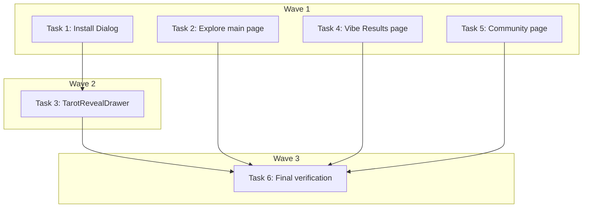

# Explore UI Reconstruct Implementation Plan

> **For Claude:** REQUIRED SUB-SKILL: Use executing-plans to implement this plan task-by-task.

**Design Doc:** [docs/designs/2026-03-21-explore-ui-reconstruct-design.md](docs/designs/2026-03-21-explore-ui-reconstruct-design.md)

**Spec References:** —

**PRD References:** —

**Goal:** Restyle three Explore-section pages and TarotRevealDrawer to match 9 approved Pencil frames (5 mobile + 4 desktop).

**Architecture:** Pure presentation-layer pass. All hooks, API routes, and backend logic remain unchanged. Desktop layouts use `useIsDesktop()` hook. TarotRevealDrawer gains a desktop Dialog variant via shadcn Dialog.

**Tech Stack:** Next.js App Router, Tailwind CSS, shadcn/ui (Drawer + Dialog), Lucide React, Vaul

**Acceptance Criteria:**
- [ ] Explore main page shows "探索" header with bell icon, "✦ Your Daily Draw" label row, and "See all" on vibe section
- [ ] On desktop, explore page renders two-column layout (tarot+vibes left, community right)
- [ ] Tarot reveal has dark espresso background with gold accents on mobile and renders as centered Dialog modal on desktop
- [ ] Vibe results page shows circle back button, subtitle chips, green shop count badge, and star ratings on shop rows
- [ ] Community feed page renders 2-column grid on desktop with "啡遊筆記" title

---

### Task 1: Install shadcn Dialog component

**Files:**
- Create: `components/ui/dialog.tsx`

No test needed — scaffolding step, generated by shadcn CLI.

**Step 1: Install Dialog via shadcn**

```bash
cd /Users/ytchou/Project/caferoam/.worktrees/feat/explore-ui-reconstruct
pnpm dlx shadcn@latest add dialog
```

**Step 2: Verify the file was created**

```bash
ls components/ui/dialog.tsx
```

Expected: file exists with Dialog, DialogContent, DialogTitle, etc. exports.

**Step 3: Commit**

```bash
git add components/ui/dialog.tsx
git commit -m "chore: add shadcn Dialog component for desktop tarot reveal"
```

---

### Task 2: Restyle Explore main page

**Files:**
- Modify: `app/explore/page.tsx`
- Modify: `app/explore/page.test.tsx`

**Step 1: Update tests for new page structure**

Update `app/explore/page.test.tsx`. The test needs to verify:
- Page title renders "探索" (not "Your Tarot Draw")
- Bell icon is present (via `aria-label="Notifications"`)
- "✦ Your Daily Draw" section label renders
- "Refresh" button renders next to daily draw label
- Vibe section has "See all" link pointing to `/explore/vibes`
- Desktop: when `useIsDesktop()` returns `true`, community section renders in a right column

Mock `useIsDesktop` from `@/lib/hooks/use-media-query`:

```typescript
vi.mock('@/lib/hooks/use-media-query', () => ({
  useIsDesktop: vi.fn(() => false),
  useMediaQuery: vi.fn(() => false),
}));
```

Add these test cases:

```typescript
it('renders page title 探索 with bell icon', () => {
  render(<ExplorePage />);
  expect(screen.getByText('探索')).toBeInTheDocument();
  expect(screen.getByLabelText('Notifications')).toBeInTheDocument();
});

it('renders Your Daily Draw label with Refresh button', () => {
  render(<ExplorePage />);
  expect(screen.getByText(/Your Daily Draw/)).toBeInTheDocument();
  expect(screen.getByRole('button', { name: /refresh/i })).toBeInTheDocument();
});

it('renders See all link in vibe section', () => {
  render(<ExplorePage />);
  const seeAll = screen.getByRole('link', { name: /see all/i });
  expect(seeAll).toHaveAttribute('href', '/explore/vibes');
});
```

Remove or update any test that asserts "Your Tarot Draw" as the page heading.

**Step 2: Run tests to verify they fail**

```bash
cd /Users/ytchou/Project/caferoam/.worktrees/feat/explore-ui-reconstruct
pnpm test app/explore/page.test.tsx -- --run
```

Expected: FAIL — "探索" text not found, bell icon not found.

**Step 3: Implement the Explore page restyling**

Update `app/explore/page.tsx`:

1. **Import additions:**
```typescript
import { Bell } from 'lucide-react';
import { useIsDesktop } from '@/lib/hooks/use-media-query';
```

2. **Add `useIsDesktop` inside component:**
```typescript
const isDesktop = useIsDesktop();
```

3. **Replace the header block** (lines ~59-70) with:
```tsx
<header className="mb-4 flex items-center justify-between">
  <h1
    className="text-[28px] font-bold text-[#1A1918]"
    style={BRICOLAGE_STYLE}
  >
    探索
  </h1>
  <button type="button" aria-label="Notifications" className="text-[#6B7280]">
    <Bell className="h-[22px] w-[22px]" />
  </button>
</header>
```

4. **Add tarot section label row** above the loading/error/cards block:
```tsx
<div className="mb-3 flex items-center justify-between">
  <span
    className="text-[11px] font-semibold tracking-[1px] text-[#C4922A]"
    style={{ fontFamily: 'var(--font-dm-sans), sans-serif' }}
  >
    ✦ Your Daily Draw
  </span>
  <button
    type="button"
    onClick={() => redraw()}
    className="text-[11px] text-gray-400"
    aria-label="Refresh draw"
  >
    Refresh ↺
  </button>
</div>
```

5. **Add "See all" to vibe section header** — update the vibe header div:
```tsx
<div className="mb-3 flex items-center justify-between">
  <h2
    className="text-lg font-bold text-[#1A1918]"
    style={BRICOLAGE_STYLE_SM}
  >
    Browse by Vibe
  </h2>
  <Link
    href="/explore/vibes"
    className="text-[13px] font-medium text-[#3D8A5A]"
  >
    See all
  </Link>
</div>
```

6. **Desktop two-column layout** — wrap the main content in a responsive container:

The key structural change: on desktop (`lg:`), the page body splits into two columns. Left column contains tarot + vibes sections. Right column contains community preview.

```tsx
<main className="min-h-screen bg-[#FAF7F4] px-5 pt-6 pb-24 lg:px-8">
  {/* Header — full width */}
  <header>...</header>

  {/* Content grid */}
  <div className="lg:flex lg:gap-8">
    {/* Left column: tarot + vibes */}
    <div className="lg:flex-1">
      {/* Daily Draw label row */}
      {/* Tarot loading/error/cards */}
      {/* Vibe section */}
    </div>

    {/* Right column: community preview (desktop only shows here, mobile stays below) */}
    <div className={isDesktop ? 'w-[400px] shrink-0 rounded-2xl bg-[#F5F4F1] p-6' : ''}>
      {/* Community notes section */}
    </div>
  </div>
</main>
```

On mobile, both columns stack naturally. On desktop (`lg:`), the community section moves to a right sidebar.

7. **Desktop tarot cards horizontal** — update `TarotSpread` usage or wrap cards:

In the explore page, the `TarotSpread` component renders cards in a `flex-col gap-3`. For desktop, the spread should render horizontally. Since `TarotSpread` is reused and we don't want to modify it here, wrap it with a desktop override:

```tsx
<div className="lg:[&>div]:flex-row lg:[&>div]:gap-4">
  {cards.length > 0 && <TarotSpread cards={cards} onDrawAgain={redraw} />}
</div>
```

Alternatively, pass an `orientation` prop if cleaner. Keep it simple — CSS override is fine for now.

**Step 4: Run tests to verify they pass**

```bash
pnpm test app/explore/page.test.tsx -- --run
```

Expected: PASS

**Step 5: Commit**

```bash
git add app/explore/page.tsx app/explore/page.test.tsx
git commit -m "feat: restyle Explore main page — 探索 header, daily draw label, desktop two-column layout"
```

---

### Task 3: Restyle TarotRevealDrawer — dark theme + desktop Dialog

**Files:**
- Modify: `components/tarot/tarot-reveal-drawer.tsx`
- Modify: `components/tarot/tarot-reveal-drawer.test.tsx`

**Depends on:** Task 1 (shadcn Dialog must be installed)

**Step 1: Update tests for dark theme + desktop Dialog**

Update `components/tarot/tarot-reveal-drawer.test.tsx`:

Add mock for `useIsDesktop`:
```typescript
import { useIsDesktop } from '@/lib/hooks/use-media-query';
vi.mock('@/lib/hooks/use-media-query', () => ({
  useIsDesktop: vi.fn(() => false),
  useMediaQuery: vi.fn(() => false),
}));
```

Also mock Dialog alongside existing Drawer mock:
```typescript
vi.mock('@/components/ui/dialog', () => ({
  Dialog: ({ children, open }: { children: React.ReactNode; open: boolean }) =>
    open ? <div data-testid="dialog">{children}</div> : null,
  DialogContent: ({ children, ...props }: { children: React.ReactNode; [key: string]: unknown }) => (
    <div data-testid="dialog-content" {...props}>{children}</div>
  ),
  DialogTitle: ({ children }: { children: React.ReactNode }) => <h2>{children}</h2>,
}));
```

Add/update these tests:

```typescript
it('renders Tarot Card label (not date string)', () => {
  render(<TarotRevealDrawer card={mockCard} open={true} onClose={vi.fn()} onDrawAgain={vi.fn()} />);
  expect(screen.getByText(/Tarot Card/)).toBeInTheDocument();
});

it('renders close button', () => {
  render(<TarotRevealDrawer card={mockCard} open={true} onClose={mockClose} onDrawAgain={vi.fn()} />);
  const closeBtn = screen.getByLabelText('Close');
  fireEvent.click(closeBtn);
  expect(mockClose).toHaveBeenCalled();
});

it('renders Back to cards and Draw Again footer', () => {
  render(<TarotRevealDrawer card={mockCard} open={true} onClose={vi.fn()} onDrawAgain={vi.fn()} />);
  expect(screen.getByText(/Back to cards/)).toBeInTheDocument();
  expect(screen.getByText(/Draw Again/)).toBeInTheDocument();
});

it('renders as Dialog on desktop', () => {
  (useIsDesktop as ReturnType<typeof vi.fn>).mockReturnValue(true);
  render(<TarotRevealDrawer card={mockCard} open={true} onClose={vi.fn()} onDrawAgain={vi.fn()} />);
  expect(screen.getByTestId('dialog')).toBeInTheDocument();
  (useIsDesktop as ReturnType<typeof vi.fn>).mockReturnValue(false);
});
```

Remove any test that asserts the date string "Your Draw · YYYY.MM.DD".

**Step 2: Run tests to verify they fail**

```bash
pnpm test components/tarot/tarot-reveal-drawer.test.tsx -- --run
```

Expected: FAIL — "Tarot Card" text not found, close button not found.

**Step 3: Implement dark theme + desktop Dialog**

Update `components/tarot/tarot-reveal-drawer.tsx`:

1. **Add imports:**
```typescript
import { X } from 'lucide-react';
import { Dialog, DialogContent, DialogTitle } from '@/components/ui/dialog';
import { useIsDesktop } from '@/lib/hooks/use-media-query';
```

2. **Extract shared card content** into a `TarotRevealContent` component inside the same file:

```tsx
function TarotRevealContent({
  card,
  onClose,
  onDrawAgain,
  onShareTap,
}: Omit<TarotRevealDrawerProps, 'open'>) {
  const { capture } = useAnalytics();
  if (!card) return null;

  const shopPath = `/shops/${card.slug ?? card.shopId}`;

  return (
    <div className="flex flex-col items-center">
      {/* Close button */}
      <div className="flex w-full justify-between px-2 pt-2">
        <div className="flex items-center gap-2 text-sm text-[#C4922A]">
          <span>✦</span>
          <span>Tarot Card</span>
        </div>
        <button
          type="button"
          onClick={onClose}
          aria-label="Close"
          className="rounded-full p-1 text-white/60 hover:text-white"
        >
          <X className="h-5 w-5" />
        </button>
      </div>

      {/* Title */}
      <h2
        className="mt-4 text-center text-2xl font-bold tracking-wide text-white"
        style={{
          fontFamily: 'var(--font-bricolage), var(--font-geist-sans), sans-serif',
        }}
      >
        {card.tarotTitle}
      </h2>

      {/* Photo */}
      <div className="relative mt-5 aspect-[3/4] w-56 overflow-hidden rounded-lg border-2 border-[#C4922A]/40">
        {card.coverPhotoUrl ? (
          <Image
            src={card.coverPhotoUrl}
            alt={card.name}
            fill
            className="object-cover"
            sizes="224px"
            priority
          />
        ) : (
          <div className="flex h-full items-center justify-center bg-[#2C1E16] text-4xl font-bold text-[#C4922A]/30">
            {card.name[0]}
          </div>
        )}
      </div>

      {/* Shop info */}
      <p className="mt-4 text-lg font-semibold text-white">{card.name}</p>
      <p className="mt-1 text-sm text-[#C4922A]">
        {card.neighborhood}
        {card.isOpenNow && ' · Open Now'}
        {card.rating != null && ` · ★${card.rating}`}
      </p>

      {/* Flavor text */}
      <p className="mt-3 text-center text-sm text-[#D4B896] italic">
        &ldquo;{card.flavorText}&rdquo;
      </p>

      {/* CTAs */}
      <div className="mt-6 flex w-full gap-3 px-2">
        {onShareTap && (
          <button
            type="button"
            onClick={onShareTap}
            className="flex-1 rounded-full border border-[#C4922A] py-3 text-sm font-medium text-[#C4922A] transition-colors hover:bg-[#C4922A]/10"
          >
            Share My Draw
          </button>
        )}
        <Link
          href={shopPath}
          onClick={() => capture('tarot_lets_go', { shop_id: card.shopId })}
          className="flex flex-1 items-center justify-center rounded-full bg-[#C4922A] py-3 text-sm font-medium text-[#1A1210] transition-colors hover:bg-[#C4922A]/90"
        >
          Let&apos;s Go →
        </Link>
      </div>

      {/* Footer */}
      <div className="mt-4 flex w-full items-center justify-between px-2 pb-4">
        <button
          type="button"
          onClick={onClose}
          className="text-sm text-[#9A7B5A] hover:text-[#C4922A]"
        >
          ← Back to cards
        </button>
        <button
          type="button"
          onClick={() => {
            capture('tarot_draw_again', {});
            onDrawAgain();
          }}
          className="text-sm text-[#9A7B5A] hover:text-[#C4922A]"
        >
          Draw Again ↺
        </button>
      </div>
    </div>
  );
}
```

3. **Update the main component** to conditionally render Drawer or Dialog:

```tsx
export function TarotRevealDrawer({
  card,
  open,
  onClose,
  onDrawAgain,
  onShareTap,
}: TarotRevealDrawerProps) {
  const isDesktop = useIsDesktop();

  if (!card) return null;

  if (isDesktop) {
    return (
      <Dialog open={open} onOpenChange={(o) => !o && onClose()}>
        <DialogContent
          className="max-w-[480px] border-[#5C3D2B] bg-[#2C1E16] p-6"
          style={{ borderRadius: 24 }}
        >
          <DialogTitle className="sr-only">Tarot Card Reveal</DialogTitle>
          <TarotRevealContent
            card={card}
            onClose={onClose}
            onDrawAgain={onDrawAgain}
            onShareTap={onShareTap}
          />
        </DialogContent>
      </Dialog>
    );
  }

  return (
    <Drawer open={open} onOpenChange={(o) => !o && onClose()}>
      <DrawerContent className="h-[95vh] max-h-[95vh] overflow-y-auto rounded-t-[10px] border-0 bg-[#1A1210]">
        <DrawerTitle className="sr-only">Tarot Card Reveal</DrawerTitle>
        <TarotRevealContent
          card={card}
          onClose={onClose}
          onDrawAgain={onDrawAgain}
          onShareTap={onShareTap}
        />
      </DrawerContent>
    </Drawer>
  );
}
```

**Step 4: Run tests to verify they pass**

```bash
pnpm test components/tarot/tarot-reveal-drawer.test.tsx -- --run
```

Expected: PASS

**Step 5: Commit**

```bash
git add components/tarot/tarot-reveal-drawer.tsx components/tarot/tarot-reveal-drawer.test.tsx
git commit -m "feat: TarotRevealDrawer — dark espresso theme, gold accents, desktop Dialog modal"
```

---

### Task 4: Restyle Vibe Results page

**Files:**
- Modify: `app/explore/vibes/[slug]/page.tsx`
- Modify: `app/explore/vibes/[slug]/page.test.tsx`

**Step 1: Update tests for new header and shop card structure**

Update `app/explore/vibes/[slug]/page.test.tsx`:

Add mock for `useIsDesktop`:
```typescript
vi.mock('@/lib/hooks/use-media-query', () => ({
  useIsDesktop: vi.fn(() => false),
  useMediaQuery: vi.fn(() => false),
}));
```

Add/update these tests:

```typescript
it('renders circle back button with ArrowLeft icon', () => {
  render(<VibePage />);
  const backBtn = screen.getByLabelText('Go back');
  expect(backBtn).toBeInTheDocument();
});

it('renders vibe name as heading with emoji', () => {
  render(<VibePage />);
  expect(screen.getByText('Study Cave')).toBeInTheDocument();
  expect(screen.getByText('📚')).toBeInTheDocument(); // emoji from mock vibe
});

it('renders subtitle as tag chips', () => {
  render(<VibePage />);
  // subtitle from mock vibe e.g. "Quiet · WiFi"
  expect(screen.getByText('Quiet')).toBeInTheDocument();
  expect(screen.getByText('WiFi')).toBeInTheDocument();
});

it('renders shop count in green badge', () => {
  render(<VibePage />);
  expect(screen.getByText(/shops nearby/)).toBeInTheDocument();
});

it('renders star rating on shop row', () => {
  render(<VibePage />);
  expect(screen.getByText('4.2')).toBeInTheDocument(); // from mock shop rating
});

it('renders bookmark icon on shop rows', () => {
  render(<VibePage />);
  const bookmarks = screen.getAllByLabelText('Save shop');
  expect(bookmarks.length).toBeGreaterThan(0);
});
```

Remove any test that checks for plain text "← Back".

**Step 2: Run tests to verify they fail**

```bash
pnpm test app/explore/vibes -- --run
```

Expected: FAIL — ArrowLeft button not found, subtitle chips not found.

**Step 3: Implement vibe results restyling**

Update `app/explore/vibes/[slug]/page.tsx`:

1. **Add imports:**
```typescript
import { ArrowLeft, Star, MapPin, Bookmark } from 'lucide-react';
import { useIsDesktop } from '@/lib/hooks/use-media-query';
import { useVibes } from '@/lib/hooks/use-vibes';
```

2. **Replace back button** with styled circle:
```tsx
<button
  type="button"
  onClick={() => router.back()}
  aria-label="Go back"
  className="flex h-9 w-9 items-center justify-center rounded-full bg-gray-100"
>
  <ArrowLeft className="h-[18px] w-[18px]" />
</button>
```

3. **Rewrite header block:**
```tsx
<div className="mb-5">
  <div className="flex items-center gap-3">
    <button
      type="button"
      onClick={() => router.back()}
      aria-label="Go back"
      className="flex h-9 w-9 shrink-0 items-center justify-center rounded-full bg-gray-100"
    >
      <ArrowLeft className="h-[18px] w-[18px]" />
    </button>
    <div>
      <div className="flex items-center gap-2">
        {vibe.emoji && <span className="text-2xl">{vibe.emoji}</span>}
        <h1
          className="text-[22px] font-bold text-[#1A1918]"
          style={BRICOLAGE_STYLE}
        >
          {vibe.name}
        </h1>
      </div>
      <p className="text-xs text-gray-400">{vibe.nameZh}</p>
    </div>
  </div>

  {/* Subtitle chips */}
  {vibe.subtitle && (
    <div className="mt-2 flex flex-wrap gap-1.5">
      {vibe.subtitle.split(' · ').map((chip) => (
        <span
          key={chip}
          className="rounded-full bg-gray-100 px-2.5 py-0.5 text-[11px] text-gray-500"
        >
          {chip}
        </span>
      ))}
    </div>
  )}

  {/* Shop count badge */}
  <span className="mt-2 inline-block rounded-full bg-[#3D8A5A] px-3 py-1 text-[12px] font-medium text-white">
    {totalCount} shops nearby
  </span>
</div>
```

4. **Enhance shop card rows** with star rating, district, tags, bookmark:
```tsx
<Link
  href={`/shops/${shop.slug ?? shop.shopId}`}
  className="flex items-center gap-3 rounded-xl bg-white px-4 py-3 shadow-sm"
>
  {/* Cover photo */}
  {shop.coverPhotoUrl ? (
    <Image
      src={shop.coverPhotoUrl}
      alt={shop.name}
      width={56}
      height={56}
      className="h-14 w-14 shrink-0 rounded-lg object-cover"
    />
  ) : (
    <div className="flex h-14 w-14 shrink-0 items-center justify-center rounded-lg bg-gray-100 text-xl text-gray-300">
      ☕
    </div>
  )}

  {/* Info */}
  <div className="min-w-0 flex-1">
    <p className="truncate text-sm font-semibold text-[#1A1918]">{shop.name}</p>
    <div className="mt-0.5 flex items-center gap-1 text-xs text-gray-400">
      {shop.rating != null && (
        <>
          <Star className="h-3 w-3 fill-[#fcd34d] text-[#fcd34d]" />
          <span className="font-medium text-gray-600">{shop.rating}</span>
          <span>· {shop.reviewCount} reviews</span>
        </>
      )}
    </div>
    <div className="mt-0.5 flex items-center gap-1 text-xs text-gray-400">
      <MapPin className="h-3 w-3" />
      <span>{shop.distanceKm != null ? `${shop.distanceKm} km` : ''}</span>
    </div>
    {shop.matchedTagLabels.length > 0 && (
      <div className="mt-1 flex gap-1">
        {shop.matchedTagLabels.slice(0, 2).map((tag) => (
          <span
            key={tag}
            className="rounded-full bg-gray-100 px-2 py-0.5 text-[10px] text-gray-500"
          >
            {tag}
          </span>
        ))}
      </div>
    )}
  </div>

  {/* Bookmark icon */}
  <button
    type="button"
    aria-label="Save shop"
    onClick={(e) => e.preventDefault()}
    className="shrink-0 text-[#6B7280]"
  >
    <Bookmark className="h-5 w-5" />
  </button>
</Link>
```

5. **Desktop 3-column grid** — when `isDesktop` is true, render shops differently:

```tsx
const isDesktop = useIsDesktop();

{/* Desktop: 3-column grid */}
{isDesktop ? (
  <div className="grid grid-cols-3 gap-4">
    {shops.map((shop) => (
      <ShopCardGrid
        key={shop.shopId}
        shop={{
          id: shop.shopId,
          name: shop.name,
          slug: shop.slug,
          rating: shop.rating,
          review_count: shop.reviewCount,
          cover_photo_url: shop.coverPhotoUrl,
          distance_km: shop.distanceKm,
        }}
      />
    ))}
  </div>
) : (
  <ul className="flex flex-col gap-3">
    {/* existing mobile shop rows */}
  </ul>
)}
```

6. **Cross-sell vibes section** (desktop only):

```tsx
{isDesktop && vibes.length > 0 && (
  <section className="mt-8 rounded-2xl bg-[#F5F4F1] p-6">
    <h3 className="text-sm font-semibold text-gray-700">
      Want to explore other vibes?
    </h3>
    <p className="mt-1 text-xs text-gray-400">
      Can&apos;t find what you&apos;re looking for? Try a different vibe.
    </p>
    <div className="mt-3 flex flex-wrap gap-2">
      {vibes
        .filter((v) => v.slug !== slug)
        .slice(0, 6)
        .map((v) => (
          <Link
            key={v.slug}
            href={`/explore/vibes/${v.slug}`}
            className="rounded-full border border-gray-200 bg-white px-3 py-1.5 text-xs font-medium text-gray-600 hover:bg-gray-50"
          >
            {v.emoji} {v.name}
          </Link>
        ))}
    </div>
  </section>
)}
```

Import `useVibes` and call it to get the cross-sell list:
```typescript
const { vibes } = useVibes();
```

Import `ShopCardGrid` for desktop grid:
```typescript
import { ShopCardGrid } from '@/components/shops/shop-card-grid';
```

**Step 4: Run tests to verify they pass**

```bash
pnpm test app/explore/vibes -- --run
```

Expected: PASS

**Step 5: Commit**

```bash
git add app/explore/vibes/\[slug\]/page.tsx app/explore/vibes/\[slug\]/page.test.tsx
git commit -m "feat: Vibe Results — circle back button, subtitle chips, star ratings, desktop 3-col grid"
```

---

### Task 5: Restyle Community feed page

**Files:**
- Modify: `app/explore/community/page.tsx`
- Modify: `app/explore/community/page.test.tsx`

**Step 1: Update tests for desktop layout**

Update `app/explore/community/page.test.tsx`:

Add mock for `useIsDesktop`:
```typescript
import { useIsDesktop } from '@/lib/hooks/use-media-query';
vi.mock('@/lib/hooks/use-media-query', () => ({
  useIsDesktop: vi.fn(() => false),
  useMediaQuery: vi.fn(() => false),
}));
```

Add test cases:

```typescript
it('renders page title From the Community on mobile', () => {
  render(<CommunityFeedPage />);
  expect(screen.getByText('From the Community')).toBeInTheDocument();
});

it('renders 啡遊筆記 title on desktop', () => {
  (useIsDesktop as ReturnType<typeof vi.fn>).mockReturnValue(true);
  render(<CommunityFeedPage />);
  expect(screen.getByText('啡遊筆記')).toBeInTheDocument();
  (useIsDesktop as ReturnType<typeof vi.fn>).mockReturnValue(false);
});
```

**Step 2: Run tests to verify they fail**

```bash
pnpm test app/explore/community/page.test.tsx -- --run
```

Expected: FAIL — "啡遊筆記" not found when desktop mode is active.

**Step 3: Implement community page desktop layout**

Update `app/explore/community/page.tsx`:

1. **Add imports:**
```typescript
import { useIsDesktop } from '@/lib/hooks/use-media-query';
```

2. **Add hook call:**
```typescript
const isDesktop = useIsDesktop();
```

3. **Update header** to show different title on desktop:
```tsx
<header className={`${isDesktop ? '' : 'sticky top-0 z-10'} bg-[#F5F4F1] px-5 pt-4 pb-3 lg:px-8`}>
  <div className="flex items-center gap-3">
    {!isDesktop && (
      <button
        type="button"
        onClick={() => router.back()}
        className="flex h-9 w-9 items-center justify-center rounded-full bg-gray-200"
        aria-label="Go back"
      >
        <ArrowLeft className="h-[18px] w-[18px]" />
      </button>
    )}
    <div className="flex flex-col gap-0.5">
      <h1
        className="text-xl font-bold text-gray-900 lg:text-2xl"
        style={{
          fontFamily: 'var(--font-bricolage), var(--font-geist-sans), sans-serif',
        }}
      >
        {isDesktop ? '啡遊筆記' : 'From the Community'}
      </h1>
      <p className="text-[11px] text-gray-400 lg:text-xs">
        {isDesktop
          ? 'Partner reviews from our café explorers'
          : 'Notes from coffee explorers in Taipei'}
      </p>
    </div>
  </div>
</header>
```

4. **Update card grid** for 2-column desktop:
```tsx
<div className={`flex flex-col gap-4 px-5 pt-2 pb-24 lg:px-8 ${isDesktop ? 'grid grid-cols-2' : ''}`}>
  {notes.map((note) => (
    <CommunityCardFull
      key={note.checkinId}
      note={note}
      liked={likedSet.has(note.checkinId)}
      onLikeToggle={() => handleLikeToggle(note.checkinId)}
    />
  ))}
  {/* loading, empty, load-more states stay the same but span full width on desktop */}
  {isLoading && (
    <div className="col-span-2 py-8 text-center text-sm text-gray-400">
      Loading...
    </div>
  )}
  {!isLoading && notes.length === 0 && (
    <div className="col-span-2 py-12 text-center text-sm text-gray-400">
      Community notes coming soon
    </div>
  )}
  {nextCursor && !isLoading && (
    <button
      type="button"
      onClick={() => setCursor(nextCursor)}
      className="col-span-2 flex items-center justify-center gap-1 py-2 text-sm font-medium text-[#8B5E3C]"
    >
      Load more notes
      <ChevronDown className="h-3.5 w-3.5" />
    </button>
  )}
</div>
```

**Step 4: Run tests to verify they pass**

```bash
pnpm test app/explore/community/page.test.tsx -- --run
```

Expected: PASS

**Step 5: Commit**

```bash
git add app/explore/community/page.tsx app/explore/community/page.test.tsx
git commit -m "feat: Community feed — 啡遊筆記 desktop title, 2-column grid layout"
```

---

### Task 6: Final verification

**Files:** none — verification only

No test needed — this is the full suite verification step.

**Step 1: Run full test suite**

```bash
cd /Users/ytchou/Project/caferoam/.worktrees/feat/explore-ui-reconstruct
pnpm test -- --run
```

Expected: all tests pass.

**Step 2: Run type-check**

```bash
pnpm type-check
```

Expected: no errors.

**Step 3: Run lint**

```bash
pnpm lint
```

Expected: no errors (warnings OK).

**Step 4: Run production build**

```bash
pnpm build
```

Expected: build succeeds.

**Step 5: Commit any fixes if needed, then done.**

---

## Execution Waves



**Wave 1** (parallel — no inter-dependencies):
- Task 1: Install shadcn Dialog (no test, <1 min)
- Task 2: Explore main page restyling
- Task 4: Vibe Results page restyling
- Task 5: Community page desktop layout

**Wave 2** (depends on Task 1):
- Task 3: TarotRevealDrawer dark theme + desktop Dialog ← Task 1

**Wave 3** (depends on all):
- Task 6: Final verification ← Tasks 2, 3, 4, 5

---

## TODO Update

```markdown
### UI Reconstruct — Explore (Frontend)

**Chunk 1 — Infrastructure:**
- [ ] Install shadcn Dialog component

**Chunk 2 — Page Restyling (parallel):**
- [ ] Explore main page — 探索 header, daily draw label, vibe See all, desktop two-column
- [ ] Vibe Results page — circle back, subtitle chips, shop count badge, star ratings, desktop 3-col grid
- [ ] Community page — desktop 2-col grid, 啡遊筆記 title

**Chunk 3 — Component Restyling:**
- [ ] TarotRevealDrawer — dark espresso theme, gold accents, desktop Dialog modal

**Chunk 4 — Verification:**
- [ ] Full verification (vitest, type-check, lint, build)
```
