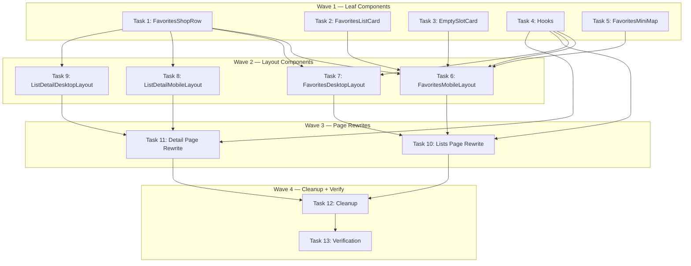

# Favorites UI Reconstruct Implementation Plan

> **For Claude:** REQUIRED SUB-SKILL: Use executing-plans to implement this plan task-by-task.

**Design Doc:** [docs/designs/2026-03-23-favorites-ui-reconstruct-design.md](../designs/2026-03-23-favorites-ui-reconstruct-design.md)

**Spec References:** [SPEC.md §Lists cap](../../SPEC.md) — max 3 lists, private in V1

**PRD References:** —

**Goal:** Restyle the `/lists` overview and `/lists/[listId]` detail pages to match four approved Pencil designs, adding interactive Mapbox maps to both pages.

**Architecture:** Two pages × two layouts (mobile/desktop) = four layout components. New reusable sub-components (`FavoritesListCard`, `EmptySlotCard`, `FavoritesShopRow`, `FavoritesMiniMap`) are composed into layout shells. Data comes from existing `useUserLists` hook and `/api/lists/*` proxy routes — no backend changes. Desktop uses the established 420px sidebar + map pattern from the Find page.

**Tech Stack:** Next.js 16 (App Router), React, Tailwind CSS, Mapbox GL JS (react-map-gl), SWR, Vaul (bottom sheet), Vitest + Testing Library

**Acceptance Criteria:**
- [ ] A user on mobile sees their saved lists as rich cards with photo thumbnails and a mini-map showing all saved pins
- [ ] A user tapping a list card navigates to a full-map view with the list's shops in a fixed bottom sheet
- [ ] A user on desktop sees all lists' shops in a 420px sidebar with an interactive map highlighting selected shops
- [ ] A user can create, rename, and delete lists from the redesigned Favorites page without regressions
- [ ] All existing list page tests pass, plus new component/layout tests

---

### Task 1: FavoritesShopRow component

The reusable shop row used in both overview sidebar and detail page. Simpler than ShopCardCompact — shows thumbnail, name, district/status meta, and distance.

**Files:**
- Create: `components/lists/favorites-shop-row.tsx`
- Test: `components/lists/favorites-shop-row.test.tsx`

**Step 1: Write the failing test**

```tsx
// components/lists/favorites-shop-row.test.tsx
import { render, screen } from '@testing-library/react';
import userEvent from '@testing-library/user-event';
import { describe, it, expect, vi } from 'vitest';
import { FavoritesShopRow } from './favorites-shop-row';

const shop = {
  id: 'shop-d4e5f6',
  name: '山小孩咖啡',
  address: '台北市大安區溫州街74巷5弄2號',
  latitude: 25.0216,
  longitude: 121.5312,
  rating: 4.6,
  review_count: 287,
  photo_urls: ['https://example.com/photo1.jpg'],
  taxonomy_tags: [],
  is_open: true,
};

describe('FavoritesShopRow', () => {
  it('a user sees the shop name and district in the row', () => {
    render(
      <FavoritesShopRow shop={shop} onClick={() => {}} />
    );
    expect(screen.getByText('山小孩咖啡')).toBeInTheDocument();
    expect(screen.getByText(/大安/)).toBeInTheDocument();
  });

  it('a user sees the distance when provided', () => {
    render(
      <FavoritesShopRow shop={shop} distanceText="0.3 km" onClick={() => {}} />
    );
    expect(screen.getByText('0.3 km')).toBeInTheDocument();
  });

  it('a user sees the open status indicator', () => {
    render(
      <FavoritesShopRow shop={shop} onClick={() => {}} />
    );
    expect(screen.getByText(/Open/)).toBeInTheDocument();
  });

  it('a user clicking the row triggers the onClick callback', async () => {
    const onClick = vi.fn();
    render(<FavoritesShopRow shop={shop} onClick={onClick} />);
    await userEvent.click(screen.getByRole('article'));
    expect(onClick).toHaveBeenCalled();
  });

  it('a selected row shows the highlighted state', () => {
    render(
      <FavoritesShopRow shop={shop} onClick={() => {}} selected />
    );
    const row = screen.getByRole('article');
    expect(row.dataset.selected).toBeDefined();
  });

  it('a shop without a photo shows a placeholder', () => {
    render(
      <FavoritesShopRow
        shop={{ ...shop, photo_urls: [] }}
        onClick={() => {}}
      />
    );
    expect(screen.getByText('No photo')).toBeInTheDocument();
  });
});
```

**Step 2: Run test to verify it fails**

Run: `pnpm test -- components/lists/favorites-shop-row.test.tsx`
Expected: FAIL — module not found

**Step 3: Write minimal implementation**

```tsx
// components/lists/favorites-shop-row.tsx
'use client';
import Image from 'next/image';

interface FavoritesShop {
  id: string;
  name: string;
  address: string;
  latitude: number;
  longitude: number;
  rating: number | null;
  review_count: number;
  photo_urls: string[];
  taxonomy_tags: { label_zh?: string; labelZh?: string }[];
  is_open?: boolean | null;
}

interface FavoritesShopRowProps {
  shop: FavoritesShop;
  onClick: () => void;
  selected?: boolean;
  distanceText?: string;
}

function extractDistrict(address: string): string {
  // Extract district from Taiwan address (e.g., "台北市大安區..." → "大安")
  const match = address.match(/[^\u5e02](.{1,3})[區里鄉鎮]/);
  return match ? match[1] : '';
}

function formatMeta(shop: FavoritesShop): string {
  const parts: string[] = [];
  const district = extractDistrict(shop.address);
  if (district) parts.push(district);
  if (shop.is_open != null) parts.push(shop.is_open ? 'Open' : 'Closed');
  return parts.join(' · ');
}

export function FavoritesShopRow({
  shop,
  onClick,
  selected = false,
  distanceText,
}: FavoritesShopRowProps) {
  const photoUrl = shop.photo_urls.at(0) ?? null;

  return (
    <article
      role="article"
      data-selected={selected || undefined}
      onClick={onClick}
      className={`flex cursor-pointer items-center gap-3 px-5 py-[10px] transition-colors ${
        selected
          ? 'border-l-[3px] border-l-[var(--map-pin)] bg-[var(--card-selected-bg)]'
          : 'bg-white'
      }`}
    >
      {photoUrl ? (
        <div className="relative h-[52px] w-[52px] shrink-0 overflow-hidden rounded-xl">
          <Image
            src={photoUrl}
            alt={shop.name}
            fill
            className="object-cover"
            sizes="52px"
          />
        </div>
      ) : (
        <div className="flex h-[52px] w-[52px] shrink-0 items-center justify-center rounded-xl bg-[var(--muted)] text-xs text-[var(--text-tertiary)]">
          No photo
        </div>
      )}
      <div className="flex min-w-0 flex-1 flex-col gap-[3px]">
        <span className="truncate font-[family-name:var(--font-body)] text-sm font-semibold text-[var(--foreground)]">
          {shop.name}
        </span>
        <span className="font-[family-name:var(--font-body)] text-xs text-[var(--text-secondary)]">
          {formatMeta(shop)}
        </span>
      </div>
      {distanceText && (
        <span className="shrink-0 text-xs text-[var(--text-tertiary)]">
          {distanceText}
        </span>
      )}
    </article>
  );
}
```

**Step 4: Run test to verify it passes**

Run: `pnpm test -- components/lists/favorites-shop-row.test.tsx`
Expected: PASS — all 6 tests

**Step 5: Commit**

```bash
git add components/lists/favorites-shop-row.tsx components/lists/favorites-shop-row.test.tsx
git commit -m "feat(favorites): add FavoritesShopRow component with TDD"
```

---

### Task 2: FavoritesListCard component

The rich list card for the mobile overview with photo thumbnails, options menu, and "View on map" link.

**Files:**
- Create: `components/lists/favorites-list-card.tsx`
- Test: `components/lists/favorites-list-card.test.tsx`

**Step 1: Write the failing test**

```tsx
// components/lists/favorites-list-card.test.tsx
import { render, screen } from '@testing-library/react';
import userEvent from '@testing-library/user-event';
import { describe, it, expect, vi } from 'vitest';
import { FavoritesListCard } from './favorites-list-card';

vi.mock('next/image', () => ({
  default: (props: Record<string, unknown>) => (
    
  ),
}));

const baseProps = {
  id: 'list-1',
  name: 'Work Spots',
  itemCount: 12,
  photoUrls: [
    'https://example.com/p1.jpg',
    'https://example.com/p2.jpg',
    'https://example.com/p3.jpg',
    'https://example.com/p4.jpg',
    'https://example.com/p5.jpg',
  ],
  onRename: vi.fn(),
  onDelete: vi.fn(),
  onViewOnMap: vi.fn(),
};

describe('FavoritesListCard', () => {
  it('a user sees the list name and shop count', () => {
    render(<FavoritesListCard {...baseProps} />);
    expect(screen.getByText('Work Spots')).toBeInTheDocument();
    expect(screen.getByText('12 shops')).toBeInTheDocument();
  });

  it('a user sees up to 4 photo thumbnails plus an overflow count', () => {
    render(<FavoritesListCard {...baseProps} />);
    const images = screen.getAllByRole('img');
    // 4 photo thumbnails max (not 5)
    expect(images).toHaveLength(4);
    expect(screen.getByText('+1')).toBeInTheDocument();
  });

  it('a user tapping "View on map" triggers the callback', async () => {
    render(<FavoritesListCard {...baseProps} />);
    await userEvent.click(screen.getByText(/View on map/));
    expect(baseProps.onViewOnMap).toHaveBeenCalled();
  });

  it('a user sees the "Updated recently" indicator', () => {
    render(<FavoritesListCard {...baseProps} />);
    expect(screen.getByText(/Updated recently/)).toBeInTheDocument();
  });

  it('a user with no photos sees placeholder thumbnails', () => {
    render(<FavoritesListCard {...baseProps} photoUrls={[]} />);
    expect(screen.queryAllByRole('img')).toHaveLength(0);
  });
});
```

**Step 2: Run test to verify it fails**

Run: `pnpm test -- components/lists/favorites-list-card.test.tsx`
Expected: FAIL — module not found

**Step 3: Write minimal implementation**

```tsx
// components/lists/favorites-list-card.tsx
'use client';
import Image from 'next/image';
import { MoreHorizontal, Coffee } from 'lucide-react';
import { useState, useRef, useEffect } from 'react';

interface FavoritesListCardProps {
  id: string;
  name: string;
  itemCount: number;
  photoUrls: string[];
  onRename: () => void;
  onDelete: () => void;
  onViewOnMap: () => void;
}

const MAX_THUMBNAILS = 4;

export function FavoritesListCard({
  name,
  itemCount,
  photoUrls,
  onRename,
  onDelete,
  onViewOnMap,
}: FavoritesListCardProps) {
  const [menuOpen, setMenuOpen] = useState(false);
  const menuRef = useRef<HTMLDivElement>(null);

  useEffect(() => {
    if (!menuOpen) return;
    function handleClickOutside(e: MouseEvent) {
      if (menuRef.current && !menuRef.current.contains(e.target as Node)) {
        setMenuOpen(false);
      }
    }
    document.addEventListener('mousedown', handleClickOutside);
    return () => document.removeEventListener('mousedown', handleClickOutside);
  }, [menuOpen]);

  const visiblePhotos = photoUrls.slice(0, MAX_THUMBNAILS);
  const overflow = photoUrls.length - MAX_THUMBNAILS;

  return (
    <div className="rounded-[20px] bg-white p-4 shadow-[0_2px_12px_#0000000A] ring-1 ring-[#F3F4F6]">
      {/* Top row: name + count + options */}
      <div className="flex items-start justify-between">
        <div className="flex flex-col gap-1">
          <span className="font-[family-name:var(--font-body)] text-base font-bold text-[var(--foreground)]">
            {name}
          </span>
          <span className="text-xs text-[var(--text-secondary)]">
            {itemCount} {itemCount === 1 ? 'shop' : 'shops'}
          </span>
        </div>
        <div className="relative" ref={menuRef}>
          <button
            onClick={() => setMenuOpen(!menuOpen)}
            className="flex h-8 w-8 items-center justify-center rounded-full bg-[#EDECEA]"
            aria-label="List options"
          >
            <MoreHorizontal className="h-4 w-4 text-[var(--text-secondary)]" />
          </button>
          {menuOpen && (
            <div className="absolute right-0 top-10 z-10 rounded-xl bg-white py-1 shadow-lg ring-1 ring-black/5">
              <button
                onClick={() => { onRename(); setMenuOpen(false); }}
                className="w-full px-4 py-2 text-left text-sm hover:bg-[var(--muted)]"
              >
                Rename
              </button>
              <button
                onClick={() => { onDelete(); setMenuOpen(false); }}
                className="w-full px-4 py-2 text-left text-sm text-red-500 hover:bg-[var(--muted)]"
              >
                Delete
              </button>
            </div>
          )}
        </div>
      </div>

      {/* Photo thumbnails row */}
      <div className="mt-3 flex gap-2">
        {visiblePhotos.length > 0
          ? visiblePhotos.map((url, i) => (
              <div
                key={i}
                className="relative h-[60px] w-20 shrink-0 overflow-hidden rounded-xl"
              >
                <Image
                  src={url}
                  alt={`${name} photo ${i + 1}`}
                  fill
                  className="object-cover"
                  sizes="80px"
                />
              </div>
            ))
          : Array.from({ length: 3 }).map((_, i) => (
              <div
                key={i}
                className="flex h-[60px] w-20 shrink-0 items-center justify-center rounded-xl bg-[#EDECEA]"
              >
                <Coffee className="h-5 w-5 text-[var(--text-tertiary)]" />
              </div>
            ))}
        {overflow > 0 && (
          <div className="flex h-[60px] flex-1 items-center justify-center rounded-xl bg-[#EDECEA] text-xs font-medium text-[var(--text-secondary)]">
            +{overflow}
          </div>
        )}
      </div>

      {/* Bottom row: updated + view on map */}
      <div className="mt-3 flex items-center justify-between">
        <div className="flex items-center gap-1.5">
          <div className="h-2 w-2 rounded-full bg-[#3D8A5A]" />
          <span className="text-xs text-[var(--text-secondary)]">
            Updated recently
          </span>
        </div>
        <button
          onClick={onViewOnMap}
          className="text-xs font-medium text-[#3D8A5A]"
        >
          View on map →
        </button>
      </div>
    </div>
  );
}
```

**Step 4: Run test to verify it passes**

Run: `pnpm test -- components/lists/favorites-list-card.test.tsx`
Expected: PASS — all 5 tests

**Step 5: Commit**

```bash
git add components/lists/favorites-list-card.tsx components/lists/favorites-list-card.test.tsx
git commit -m "feat(favorites): add FavoritesListCard component with TDD"
```

---

### Task 3: EmptySlotCard component

Dashed-border placeholder for remaining list creation slots.

**Files:**
- Create: `components/lists/empty-slot-card.tsx`
- Test: `components/lists/empty-slot-card.test.tsx`

**Step 1: Write the failing test**

```tsx
// components/lists/empty-slot-card.test.tsx
import { render, screen } from '@testing-library/react';
import userEvent from '@testing-library/user-event';
import { describe, it, expect, vi } from 'vitest';
import { EmptySlotCard } from './empty-slot-card';

describe('EmptySlotCard', () => {
  it('a user sees the remaining slot count', () => {
    render(<EmptySlotCard remainingSlots={1} onClick={() => {}} />);
    expect(screen.getByText('1 slot remaining')).toBeInTheDocument();
  });

  it('a user sees the create prompt text', () => {
    render(<EmptySlotCard remainingSlots={2} onClick={() => {}} />);
    expect(screen.getByText('Create a new list')).toBeInTheDocument();
  });

  it('a user clicking the card triggers the onClick callback', async () => {
    const onClick = vi.fn();
    render(<EmptySlotCard remainingSlots={1} onClick={onClick} />);
    await userEvent.click(screen.getByRole('button'));
    expect(onClick).toHaveBeenCalled();
  });
});
```

**Step 2: Run test to verify it fails**

Run: `pnpm test -- components/lists/empty-slot-card.test.tsx`
Expected: FAIL — module not found

**Step 3: Write minimal implementation**

```tsx
// components/lists/empty-slot-card.tsx
'use client';
import { CirclePlus } from 'lucide-react';

interface EmptySlotCardProps {
  remainingSlots: number;
  onClick: () => void;
}

export function EmptySlotCard({ remainingSlots, onClick }: EmptySlotCardProps) {
  return (
    <button
      onClick={onClick}
      className="flex h-20 w-full flex-col items-center justify-center gap-2.5 rounded-[20px] border-[1.5px] border-dashed border-[var(--border-medium,#E5E7EB)] bg-transparent transition-colors hover:bg-[var(--muted)]"
    >
      <CirclePlus className="h-6 w-6 text-[var(--text-tertiary)]" />
      <span className="text-[13px] font-medium text-[var(--text-tertiary)]">
        Create a new list
      </span>
      <span className="text-[11px] text-[var(--text-tertiary)]">
        {remainingSlots} slot{remainingSlots !== 1 ? 's' : ''} remaining
      </span>
    </button>
  );
}
```

**Step 4: Run test to verify it passes**

Run: `pnpm test -- components/lists/empty-slot-card.test.tsx`
Expected: PASS — all 3 tests

**Step 5: Commit**

```bash
git add components/lists/empty-slot-card.tsx components/lists/empty-slot-card.test.tsx
git commit -m "feat(favorites): add EmptySlotCard component with TDD"
```

---

### Task 4: useListPins and useListShops hooks

SWR hooks for fetching pin coordinates and shop data. Used by both overview and detail pages.

**Files:**
- Create: `lib/hooks/use-list-pins.ts`
- Create: `lib/hooks/use-list-shops.ts`
- Test: `lib/hooks/use-list-pins.test.ts`
- Test: `lib/hooks/use-list-shops.test.ts`

**Step 1: Write the failing tests**

```tsx
// lib/hooks/use-list-pins.test.ts
import { renderHook, waitFor } from '@testing-library/react';
import { describe, it, expect, vi, beforeEach } from 'vitest';
import { SWRConfig } from 'swr';
import { useListPins } from './use-list-pins';
import type { ReactNode } from 'react';

vi.mock('@/lib/api/fetch', () => ({
  fetchWithAuth: vi.fn(),
}));

import { fetchWithAuth } from '@/lib/api/fetch';
const mockFetch = fetchWithAuth as ReturnType<typeof vi.fn>;

function wrapper({ children }: { children: ReactNode }) {
  return (
    <SWRConfig value={{ dedupingInterval: 0, provider: () => new Map() }}>
      {children}
    </SWRConfig>
  );
}

describe('useListPins', () => {
  beforeEach(() => vi.clearAllMocks());

  it('a user loading their favorites sees pin data from all lists', async () => {
    const pins = [
      { listId: 'list-1', shopId: 'shop-1', lat: 25.033, lng: 121.565 },
      { listId: 'list-2', shopId: 'shop-2', lat: 25.040, lng: 121.570 },
    ];
    mockFetch.mockResolvedValueOnce(pins);
    const { result } = renderHook(() => useListPins(), { wrapper });
    await waitFor(() => expect(result.current.pins).toHaveLength(2));
    expect(result.current.pins[0].shopId).toBe('shop-1');
  });

  it('returns empty array while loading', () => {
    mockFetch.mockReturnValue(new Promise(() => {})); // never resolves
    const { result } = renderHook(() => useListPins(), { wrapper });
    expect(result.current.pins).toEqual([]);
    expect(result.current.isLoading).toBe(true);
  });
});
```

```tsx
// lib/hooks/use-list-shops.test.ts
import { renderHook, waitFor } from '@testing-library/react';
import { describe, it, expect, vi, beforeEach } from 'vitest';
import { SWRConfig } from 'swr';
import { useListShops } from './use-list-shops';
import type { ReactNode } from 'react';

vi.mock('@/lib/api/fetch', () => ({
  fetchWithAuth: vi.fn(),
}));

import { fetchWithAuth } from '@/lib/api/fetch';
const mockFetch = fetchWithAuth as ReturnType<typeof vi.fn>;

function wrapper({ children }: { children: ReactNode }) {
  return (
    <SWRConfig value={{ dedupingInterval: 0, provider: () => new Map() }}>
      {children}
    </SWRConfig>
  );
}

describe('useListShops', () => {
  beforeEach(() => vi.clearAllMocks());

  it('a user viewing a list sees shop data for that list', async () => {
    const shops = [
      { id: 'shop-1', name: '山小孩咖啡', address: '台北市大安區', latitude: 25.02, longitude: 121.53, rating: 4.6, review_count: 100, photo_urls: [], taxonomy_tags: [] },
    ];
    mockFetch.mockResolvedValueOnce(shops);
    const { result } = renderHook(() => useListShops('list-1'), { wrapper });
    await waitFor(() => expect(result.current.shops).toHaveLength(1));
    expect(result.current.shops[0].name).toBe('山小孩咖啡');
  });

  it('returns null when listId is null', () => {
    const { result } = renderHook(() => useListShops(null), { wrapper });
    expect(result.current.shops).toEqual([]);
    expect(result.current.isLoading).toBe(false);
  });
});
```

**Step 2: Run tests to verify they fail**

Run: `pnpm test -- lib/hooks/use-list-pins.test.ts lib/hooks/use-list-shops.test.ts`
Expected: FAIL — modules not found

**Step 3: Write minimal implementations**

```ts
// lib/hooks/use-list-pins.ts
'use client';
import useSWR from 'swr';
import { fetchWithAuth } from '@/lib/api/fetch';

export interface ListPin {
  listId: string;
  shopId: string;
  lat: number;
  lng: number;
}

export function useListPins() {
  const { data, error, isLoading } = useSWR<ListPin[]>(
    '/api/lists/pins',
    fetchWithAuth
  );
  return { pins: data ?? [], error, isLoading };
}
```

```ts
// lib/hooks/use-list-shops.ts
'use client';
import useSWR from 'swr';
import { fetchWithAuth } from '@/lib/api/fetch';

export interface ListShop {
  id: string;
  name: string;
  address: string;
  latitude: number;
  longitude: number;
  rating: number | null;
  review_count: number;
  photo_urls: string[];
  taxonomy_tags: { label_zh?: string; labelZh?: string }[];
  is_open?: boolean | null;
}

export function useListShops(listId: string | null) {
  const { data, error, isLoading, mutate } = useSWR<ListShop[]>(
    listId ? `/api/lists/${listId}/shops` : null,
    fetchWithAuth
  );
  return { shops: data ?? [], error, isLoading, mutate };
}
```

**Step 4: Run tests to verify they pass**

Run: `pnpm test -- lib/hooks/use-list-pins.test.ts lib/hooks/use-list-shops.test.ts`
Expected: PASS — all 4 tests

**Step 5: Commit**

```bash
git add lib/hooks/use-list-pins.ts lib/hooks/use-list-pins.test.ts lib/hooks/use-list-shops.ts lib/hooks/use-list-shops.test.ts
git commit -m "feat(favorites): add useListPins and useListShops hooks with TDD"
```

---

### Task 5: FavoritesMiniMap component

Interactive Mapbox mini-map for the mobile overview, showing all saved pins at 160px height.

**Files:**
- Create: `components/lists/favorites-mini-map.tsx`
- Test: `components/lists/favorites-mini-map.test.tsx`

**Step 1: Write the failing test**

```tsx
// components/lists/favorites-mini-map.test.tsx
import { render, screen } from '@testing-library/react';
import { describe, it, expect, vi, beforeEach, afterEach } from 'vitest';
import { FavoritesMiniMap } from './favorites-mini-map';

// Mock react-map-gl the same way MapView does
vi.mock('react-map-gl/mapbox', () => {
  const MockMap = ({ children }: { children?: React.ReactNode }) => (
    <div data-testid="minimap">{children}</div>
  );
  const MockMarker = ({ children }: { children?: React.ReactNode }) => (
    <div data-testid="pin">{children}</div>
  );
  return { default: MockMap, Marker: MockMarker };
});

const pins = [
  { listId: 'list-1', shopId: 'shop-1', lat: 25.033, lng: 121.565 },
  { listId: 'list-1', shopId: 'shop-2', lat: 25.040, lng: 121.570 },
  { listId: 'list-2', shopId: 'shop-3', lat: 25.020, lng: 121.550 },
];

describe('FavoritesMiniMap', () => {
  beforeEach(() => vi.stubEnv('NEXT_PUBLIC_MAPBOX_TOKEN', 'pk.test'));
  afterEach(() => vi.unstubAllEnvs());

  it('a user sees a map with pins for all saved shops', () => {
    render(<FavoritesMiniMap pins={pins} totalShops={12} />);
    expect(screen.getByTestId('minimap')).toBeInTheDocument();
    expect(screen.getAllByTestId('pin')).toHaveLength(3);
  });

  it('a user sees the total saved shops badge', () => {
    render(<FavoritesMiniMap pins={pins} totalShops={12} />);
    expect(screen.getByText(/12 shops saved/)).toBeInTheDocument();
  });

  it('shows a fallback when Mapbox token is missing', () => {
    vi.stubEnv('NEXT_PUBLIC_MAPBOX_TOKEN', '');
    render(<FavoritesMiniMap pins={pins} totalShops={5} />);
    expect(screen.queryByTestId('minimap')).not.toBeInTheDocument();
  });
});
```

**Step 2: Run test to verify it fails**

Run: `pnpm test -- components/lists/favorites-mini-map.test.tsx`
Expected: FAIL — module not found

**Step 3: Write minimal implementation**

```tsx
// components/lists/favorites-mini-map.tsx
'use client';
import Map, { Marker } from 'react-map-gl/mapbox';
import 'mapbox-gl/dist/mapbox-gl.css';
import { MapPin as MapPinIcon } from 'lucide-react';
import type { ListPin } from '@/lib/hooks/use-list-pins';

interface FavoritesMiniMapProps {
  pins: ListPin[];
  totalShops: number;
}

const TAIPEI_CENTER = { latitude: 25.033, longitude: 121.565 };

export function FavoritesMiniMap({ pins, totalShops }: FavoritesMiniMapProps) {
  const mapboxToken = process.env.NEXT_PUBLIC_MAPBOX_TOKEN;

  if (!mapboxToken) {
    return (
      <div className="flex h-40 items-center justify-center rounded-[20px] bg-[var(--muted)] text-sm text-[var(--text-tertiary)]">
        Map unavailable
      </div>
    );
  }

  return (
    <div className="relative h-40 overflow-hidden rounded-[20px]">
      <Map
        mapboxAccessToken={mapboxToken}
        initialViewState={{ ...TAIPEI_CENTER, zoom: 12 }}
        style={{ width: '100%', height: '100%' }}
        mapStyle="mapbox://styles/mapbox/light-v11"
        interactive={true}
        attributionControl={false}
      >
        {pins.map((pin) => (
          <Marker
            key={pin.shopId}
            longitude={pin.lng}
            latitude={pin.lat}
            anchor="center"
          >
            <div className="flex h-7 w-7 items-center justify-center rounded-full bg-[var(--map-pin)]">
              <span className="text-[10px] text-white">☕</span>
            </div>
          </Marker>
        ))}
      </Map>
      {/* Badge overlay */}
      <div className="absolute bottom-3 right-3 flex items-center gap-1 rounded-full bg-white px-2.5 py-1 text-[11px] font-medium text-[var(--text-secondary)] shadow-sm">
        <MapPinIcon className="h-3 w-3" />
        {totalShops} shops saved
      </div>
    </div>
  );
}
```

**Step 4: Run test to verify it passes**

Run: `pnpm test -- components/lists/favorites-mini-map.test.tsx`
Expected: PASS — all 3 tests

**Step 5: Commit**

```bash
git add components/lists/favorites-mini-map.tsx components/lists/favorites-mini-map.test.tsx
git commit -m "feat(favorites): add FavoritesMiniMap component with TDD"
```

---

### Task 6: FavoritesMobileLayout component

Mobile overview layout: header + mini-map + list cards + empty slots + bottom nav.

**Files:**
- Create: `components/lists/favorites-mobile-layout.tsx`
- Test: `components/lists/favorites-mobile-layout.test.tsx`

**Step 1: Write the failing test**

```tsx
// components/lists/favorites-mobile-layout.test.tsx
import { render, screen } from '@testing-library/react';
import userEvent from '@testing-library/user-event';
import { describe, it, expect, vi, beforeEach, afterEach } from 'vitest';
import { FavoritesMobileLayout } from './favorites-mobile-layout';
import { makeList, makeListItem } from '@/lib/test-utils/factories';

vi.mock('next/navigation', () => ({
  useRouter: () => ({ push: vi.fn() }),
  usePathname: () => '/lists',
}));
vi.mock('next/link', () => ({
  default: ({ children, ...props }: Record<string, unknown>) => (
    <a {...props}>{children as React.ReactNode}</a>
  ),
}));
vi.mock('react-map-gl/mapbox', () => {
  const MockMap = ({ children }: { children?: React.ReactNode }) => (
    <div data-testid="minimap">{children}</div>
  );
  const MockMarker = ({ children }: { children?: React.ReactNode }) => (
    <div>{children}</div>
  );
  return { default: MockMap, Marker: MockMarker };
});

const lists = [
  makeList({ id: 'list-1', name: 'Work Spots', items: [makeListItem({ shop_id: 'shop-1' }), makeListItem({ shop_id: 'shop-2' })] }),
  makeList({ id: 'list-2', name: 'Weekend Cafes', items: [makeListItem({ shop_id: 'shop-3' })] }),
];
const pins = [
  { listId: 'list-1', shopId: 'shop-1', lat: 25.033, lng: 121.565 },
  { listId: 'list-1', shopId: 'shop-2', lat: 25.040, lng: 121.570 },
];

describe('FavoritesMobileLayout', () => {
  beforeEach(() => vi.stubEnv('NEXT_PUBLIC_MAPBOX_TOKEN', 'pk.test'));
  afterEach(() => vi.unstubAllEnvs());

  it('a user sees the 收藏 header with list count badge', () => {
    render(
      <FavoritesMobileLayout
        lists={lists}
        pins={pins}
        onCreateList={() => {}}
        onDeleteList={() => {}}
        onRenameList={() => {}}
      />
    );
    expect(screen.getByText('收藏')).toBeInTheDocument();
    expect(screen.getByText('2 / 3')).toBeInTheDocument();
  });

  it('a user sees list cards for each list', () => {
    render(
      <FavoritesMobileLayout
        lists={lists}
        pins={pins}
        onCreateList={() => {}}
        onDeleteList={() => {}}
        onRenameList={() => {}}
      />
    );
    expect(screen.getByText('Work Spots')).toBeInTheDocument();
    expect(screen.getByText('Weekend Cafes')).toBeInTheDocument();
  });

  it('a user with fewer than 3 lists sees an empty slot card', () => {
    render(
      <FavoritesMobileLayout
        lists={lists}
        pins={pins}
        onCreateList={() => {}}
        onDeleteList={() => {}}
        onRenameList={() => {}}
      />
    );
    expect(screen.getByText('Create a new list')).toBeInTheDocument();
    expect(screen.getByText('1 slot remaining')).toBeInTheDocument();
  });

  it('a user at the 3-list cap does not see an empty slot card', () => {
    const threeLists = [...lists, makeList({ id: 'list-3', name: 'Third List' })];
    render(
      <FavoritesMobileLayout
        lists={threeLists}
        pins={pins}
        onCreateList={() => {}}
        onDeleteList={() => {}}
        onRenameList={() => {}}
      />
    );
    expect(screen.queryByText('Create a new list')).not.toBeInTheDocument();
  });
});
```

**Step 2: Run test to verify it fails**

Run: `pnpm test -- components/lists/favorites-mobile-layout.test.tsx`
Expected: FAIL — module not found

**Step 3: Write minimal implementation**

Build the mobile layout component composing `FavoritesMiniMap`, `FavoritesListCard`, `EmptySlotCard`, and `BottomNav`. Follow the design from Pencil frame `P7hXw`:
- Flex column with content padding `[20,20,100,20]` and gap-20
- "收藏" Bricolage 28px + "My Saved Lists" subtitle + count badge
- Mini-map (160px)
- "My Lists" section header + green "+ New List" button
- List cards stack
- Empty slot card when under 3 lists
- BottomNav at bottom

**Step 4: Run test to verify it passes**

Run: `pnpm test -- components/lists/favorites-mobile-layout.test.tsx`
Expected: PASS — all 4 tests

**Step 5: Commit**

```bash
git add components/lists/favorites-mobile-layout.tsx components/lists/favorites-mobile-layout.test.tsx
git commit -m "feat(favorites): add FavoritesMobileLayout with TDD"
```

---

### Task 7: FavoritesDesktopLayout component

Desktop overview layout: 420px sidebar with all lists' shops + full-screen map. Follows the MapDesktopLayout pattern.

**Files:**
- Create: `components/lists/favorites-desktop-layout.tsx`
- Test: `components/lists/favorites-desktop-layout.test.tsx`

**Step 1: Write the failing test**

```tsx
// components/lists/favorites-desktop-layout.test.tsx
import { render, screen } from '@testing-library/react';
import userEvent from '@testing-library/user-event';
import { describe, it, expect, vi, beforeAll } from 'vitest';
import { FavoritesDesktopLayout } from './favorites-desktop-layout';
import { makeList, makeListItem, makeShop } from '@/lib/test-utils/factories';

vi.mock('next/navigation', () => ({
  useRouter: () => ({ push: vi.fn() }),
  usePathname: () => '/lists',
}));
vi.mock('next/link', () => ({
  default: ({ children, ...props }: Record<string, unknown>) => (
    <a {...props}>{children as React.ReactNode}</a>
  ),
}));
vi.mock('next/dynamic', () => ({
  default: () => {
    const MockMapView = () => <div data-testid="map-view">Map</div>;
    return MockMapView;
  },
}));

beforeAll(() => {
  Object.defineProperty(window, 'matchMedia', {
    value: (q: string) => ({
      matches: q.includes('1024'),
      addEventListener: () => {},
      removeEventListener: () => {},
    }),
  });
});

const lists = [
  makeList({ id: 'list-1', name: 'Work Spots', items: [makeListItem()] }),
];
const shopsByList = {
  'list-1': [makeShop({ id: 'shop-1', name: '晨光咖啡' })],
};

describe('FavoritesDesktopLayout', () => {
  it('a user sees the sidebar with list title and shop rows', () => {
    render(
      <FavoritesDesktopLayout
        lists={lists}
        shopsByList={shopsByList}
        pins={[]}
        selectedShopId={null}
        onShopClick={() => {}}
        onCreateList={() => {}}
        onDeleteList={() => {}}
        onRenameList={() => {}}
      />
    );
    expect(screen.getByText(/Favorites/)).toBeInTheDocument();
    expect(screen.getByText('Work Spots')).toBeInTheDocument();
    expect(screen.getByText('晨光咖啡')).toBeInTheDocument();
  });

  it('a user sees the New List button in the sidebar header', () => {
    render(
      <FavoritesDesktopLayout
        lists={lists}
        shopsByList={shopsByList}
        pins={[]}
        selectedShopId={null}
        onShopClick={() => {}}
        onCreateList={() => {}}
        onDeleteList={() => {}}
        onRenameList={() => {}}
      />
    );
    expect(screen.getByText('New List')).toBeInTheDocument();
  });
});
```

**Step 2: Run test to verify it fails**

Run: `pnpm test -- components/lists/favorites-desktop-layout.test.tsx`
Expected: FAIL — module not found

**Step 3: Write minimal implementation**

Build the desktop layout following the MapDesktopLayout pattern:
- HeaderNav (activeTab="favorites")
- Flex row: 420px sidebar + flex-1 map area
- Sidebar: title row ("收藏 Favorites" + "New List" green button), divider, then list groups with FavoritesShopRow items
- List group headers with list name, count, ellipsis menu
- "N more shops in this list" expand links
- Map: dynamically imported MapView with pins from all lists
- CollapseToggle between sidebar and map

**Step 4: Run test to verify it passes**

Run: `pnpm test -- components/lists/favorites-desktop-layout.test.tsx`
Expected: PASS — all 2 tests

**Step 5: Commit**

```bash
git add components/lists/favorites-desktop-layout.tsx components/lists/favorites-desktop-layout.test.tsx
git commit -m "feat(favorites): add FavoritesDesktopLayout with TDD"
```

---

### Task 8: ListDetailMobileLayout component

Mobile list detail: full-screen map + fixed bottom sheet at ~45% with shop list.

**Files:**
- Create: `components/lists/list-detail-mobile-layout.tsx`
- Test: `components/lists/list-detail-mobile-layout.test.tsx`

**Step 1: Write the failing test**

```tsx
// components/lists/list-detail-mobile-layout.test.tsx
import { render, screen } from '@testing-library/react';
import { describe, it, expect, vi, beforeEach, afterEach } from 'vitest';
import { ListDetailMobileLayout } from './list-detail-mobile-layout';
import { makeShop } from '@/lib/test-utils/factories';

vi.mock('next/navigation', () => ({
  useRouter: () => ({ push: vi.fn(), back: vi.fn() }),
  usePathname: () => '/lists/list-1',
}));
vi.mock('next/link', () => ({
  default: ({ children, ...props }: Record<string, unknown>) => (
    <a {...props}>{children as React.ReactNode}</a>
  ),
}));
vi.mock('react-map-gl/mapbox', () => {
  const MockMap = ({ children }: { children?: React.ReactNode }) => (
    <div data-testid="map">{children}</div>
  );
  const MockMarker = ({ children }: { children?: React.ReactNode }) => (
    <div data-testid="pin">{children}</div>
  );
  return { default: MockMap, Marker: MockMarker };
});

const shops = [
  { ...makeShop({ id: 'shop-1', name: '湛盧咖啡', address: '台北市信義區' }), is_open: true, taxonomy_tags: [] },
  { ...makeShop({ id: 'shop-2', name: '慢城咖啡', address: '台北市大安區' }), is_open: false, taxonomy_tags: [] },
];

describe('ListDetailMobileLayout', () => {
  beforeEach(() => vi.stubEnv('NEXT_PUBLIC_MAPBOX_TOKEN', 'pk.test'));
  afterEach(() => vi.unstubAllEnvs());

  it('a user sees the list name in the top overlay', () => {
    render(
      <ListDetailMobileLayout
        listName="Work Spots"
        shops={shops}
        selectedShopId={null}
        onShopClick={() => {}}
        onBack={() => {}}
      />
    );
    expect(screen.getByText('Work Spots')).toBeInTheDocument();
  });

  it('a user sees the shop count badge', () => {
    render(
      <ListDetailMobileLayout
        listName="Work Spots"
        shops={shops}
        selectedShopId={null}
        onShopClick={() => {}}
        onBack={() => {}}
      />
    );
    expect(screen.getByText('2 shops')).toBeInTheDocument();
  });

  it('a user sees shop rows in the bottom sheet', () => {
    render(
      <ListDetailMobileLayout
        listName="Work Spots"
        shops={shops}
        selectedShopId={null}
        onShopClick={() => {}}
        onBack={() => {}}
      />
    );
    expect(screen.getByText('湛盧咖啡')).toBeInTheDocument();
    expect(screen.getByText('慢城咖啡')).toBeInTheDocument();
  });

  it('a user sees map pins for each shop', () => {
    render(
      <ListDetailMobileLayout
        listName="Work Spots"
        shops={shops}
        selectedShopId={null}
        onShopClick={() => {}}
        onBack={() => {}}
      />
    );
    expect(screen.getAllByTestId('pin')).toHaveLength(2);
  });
});
```

**Step 2: Run test to verify it fails**

Run: `pnpm test -- components/lists/list-detail-mobile-layout.test.tsx`
Expected: FAIL — module not found

**Step 3: Write minimal implementation**

Build the mobile detail layout following Pencil frame `zG9ZS`:
- Full-screen container with `layout: none` (absolute positioning)
- Map layer: full viewport Mapbox with coffee cup pins
- Top overlay: gradient (white→transparent) with back chevron + list name + count badge
- Location button: 44px circle, white bg, shadow, compass icon
- Fixed bottom sheet at ~45%: gradient fade background, drag handle pill, list title + count, scrollable FavoritesShopRow items
- BottomNav at bottom

**Step 4: Run test to verify it passes**

Run: `pnpm test -- components/lists/list-detail-mobile-layout.test.tsx`
Expected: PASS — all 4 tests

**Step 5: Commit**

```bash
git add components/lists/list-detail-mobile-layout.tsx components/lists/list-detail-mobile-layout.test.tsx
git commit -m "feat(favorites): add ListDetailMobileLayout with TDD"
```

---

### Task 9: ListDetailDesktopLayout component

Desktop list detail: collapsible 420px left panel + full map. Follows the MapDesktopLayout pattern.

**Files:**
- Create: `components/lists/list-detail-desktop-layout.tsx`
- Test: `components/lists/list-detail-desktop-layout.test.tsx`

**Step 1: Write the failing test**

```tsx
// components/lists/list-detail-desktop-layout.test.tsx
import { render, screen } from '@testing-library/react';
import userEvent from '@testing-library/user-event';
import { describe, it, expect, vi, beforeAll } from 'vitest';
import { ListDetailDesktopLayout } from './list-detail-desktop-layout';
import { makeShop } from '@/lib/test-utils/factories';

vi.mock('next/navigation', () => ({
  useRouter: () => ({ push: vi.fn(), back: vi.fn() }),
  usePathname: () => '/lists/list-1',
}));
vi.mock('next/link', () => ({
  default: ({ children, ...props }: Record<string, unknown>) => (
    <a {...props}>{children as React.ReactNode}</a>
  ),
}));
vi.mock('next/dynamic', () => ({
  default: () => {
    const MockMapView = () => <div data-testid="map-view">Map</div>;
    return MockMapView;
  },
}));

beforeAll(() => {
  Object.defineProperty(window, 'matchMedia', {
    value: (q: string) => ({
      matches: q.includes('1024'),
      addEventListener: () => {},
      removeEventListener: () => {},
    }),
  });
});

const shops = [
  { ...makeShop({ id: 'shop-1', name: '晨光咖啡', address: '台北市大安區' }), is_open: true, taxonomy_tags: [] },
];

describe('ListDetailDesktopLayout', () => {
  it('a user sees the back breadcrumb and list title in the left panel', () => {
    render(
      <ListDetailDesktopLayout
        listName="Work Spots"
        shops={shops}
        selectedShopId={null}
        onShopClick={() => {}}
        onBack={() => {}}
      />
    );
    expect(screen.getByText(/My Favorites/)).toBeInTheDocument();
    expect(screen.getByText('Work Spots')).toBeInTheDocument();
  });

  it('a user sees the shop count below the list title', () => {
    render(
      <ListDetailDesktopLayout
        listName="Work Spots"
        shops={shops}
        selectedShopId={null}
        onShopClick={() => {}}
        onBack={() => {}}
      />
    );
    expect(screen.getByText(/1 shop/)).toBeInTheDocument();
  });

  it('a user sees shop rows in the left panel', () => {
    render(
      <ListDetailDesktopLayout
        listName="Work Spots"
        shops={shops}
        selectedShopId={null}
        onShopClick={() => {}}
        onBack={() => {}}
      />
    );
    expect(screen.getByText('晨光咖啡')).toBeInTheDocument();
  });

  it('a user clicking a shop row triggers the selection callback', async () => {
    const onShopClick = vi.fn();
    render(
      <ListDetailDesktopLayout
        listName="Work Spots"
        shops={shops}
        selectedShopId={null}
        onShopClick={onShopClick}
        onBack={() => {}}
      />
    );
    await userEvent.click(screen.getByText('晨光咖啡'));
    expect(onShopClick).toHaveBeenCalledWith('shop-1');
  });
});
```

**Step 2: Run test to verify it fails**

Run: `pnpm test -- components/lists/list-detail-desktop-layout.test.tsx`
Expected: FAIL — module not found

**Step 3: Write minimal implementation**

Build the desktop detail layout following Pencil frame `Ik2pj`:
- HeaderNav (activeTab="favorites")
- Flex row: 420px left panel (collapsible) + CollapseToggle + flex-1 map area
- Left panel: back breadcrumb ("< My Favorites"), list title (22px bold) + count, divider, scrollable FavoritesShopRow list
- Panel collapse state managed locally
- Map: dynamically imported MapView with pins for this list's shops only
- Selected shop: row highlight + pin highlight

**Step 4: Run test to verify it passes**

Run: `pnpm test -- components/lists/list-detail-desktop-layout.test.tsx`
Expected: PASS — all 4 tests

**Step 5: Commit**

```bash
git add components/lists/list-detail-desktop-layout.tsx components/lists/list-detail-desktop-layout.test.tsx
git commit -m "feat(favorites): add ListDetailDesktopLayout with TDD"
```

---

### Task 10: Rewrite `/lists` overview page

Wire the new layout components into the lists overview page. Selects mobile vs desktop layout based on `useIsDesktop()`.

**Files:**
- Modify: `app/(protected)/lists/page.tsx` (full rewrite)
- Modify: `app/(protected)/lists/page.test.tsx` (update for new layout structure)

**Step 1: Update the tests**

Update `app/(protected)/lists/page.test.tsx` to test user journeys through the new layout. Key tests to preserve:
- "a user's lists are shown on the page" — verify list names appear
- "the count badge shows the correct ratio" — verify "2 / 3" badge
- "user can create a new list when under the cap" — verify creation flow
- "user at 3-list cap does not see create option" — verify cap enforcement
- "user can delete a list" — verify delete flow

Add mocks for:
- `react-map-gl/mapbox` (minimap)
- `useIsDesktop` hook
- New layout components if needed

**Step 2: Run tests to verify they fail**

Run: `pnpm test -- app/\\(protected\\)/lists/page.test.tsx`
Expected: Some tests FAIL due to new layout structure

**Step 3: Rewrite the page**

```tsx
// app/(protected)/lists/page.tsx
'use client';
import { useState, useMemo } from 'react';
import { useRouter } from 'next/navigation';
import { toast } from 'sonner';
import { useUserLists } from '@/lib/hooks/use-user-lists';
import { useListPins } from '@/lib/hooks/use-list-pins';
import { useListShops } from '@/lib/hooks/use-list-shops';
import { useIsDesktop } from '@/lib/hooks/use-media-query';
import { RenameListDialog } from '@/components/lists/rename-list-dialog';
import { FavoritesMobileLayout } from '@/components/lists/favorites-mobile-layout';
import { FavoritesDesktopLayout } from '@/components/lists/favorites-desktop-layout';

export default function ListsPage() {
  const router = useRouter();
  const isDesktop = useIsDesktop();
  const { lists, isLoading, createList, deleteList, renameList } = useUserLists();
  const { pins } = useListPins();
  const [renaming, setRenaming] = useState<{ id: string; name: string } | null>(null);
  const [selectedShopId, setSelectedShopId] = useState<string | null>(null);

  // Desktop: fetch shops for each list to display in sidebar
  // For now, compute photo URLs from pins data or use empty arrays
  // The shops data comes from the individual list card components

  async function handleCreate(name: string) {
    try {
      await createList(name);
      toast.success('List created');
    } catch (err) {
      const message = err instanceof Error ? err.message : 'Failed to create list';
      toast.error(message.includes('Maximum') ? "You've reached the 3-list limit" : message);
    }
  }

  async function handleDelete(listId: string, listName: string) {
    if (!confirm(`Delete "${listName}"? This won't remove the shops.`)) return;
    try {
      await deleteList(listId);
      toast.success('List deleted');
    } catch {
      toast.error('Failed to delete list');
    }
  }

  async function handleRename(listId: string, name: string) {
    await renameList(listId, name);
    setRenaming(null);
  }

  if (isLoading) {
    return (
      <div className="flex min-h-screen items-center justify-center">
        <p className="text-[var(--text-tertiary)]">Loading...</p>
      </div>
    );
  }

  // Map pins to a MapView-compatible format for desktop
  const mapShops = useMemo(() =>
    pins.map((p) => ({ id: p.shopId, name: '', latitude: p.lat, longitude: p.lng })),
    [pins]
  );

  return (
    <>
      {isDesktop ? (
        <FavoritesDesktopLayout
          lists={lists}
          shopsByList={{}} // populated lazily by the layout component
          pins={pins}
          selectedShopId={selectedShopId}
          onShopClick={setSelectedShopId}
          onCreateList={handleCreate}
          onDeleteList={handleDelete}
          onRenameList={(id) => {
            const list = lists.find((l) => l.id === id);
            if (list) setRenaming({ id, name: list.name });
          }}
        />
      ) : (
        <FavoritesMobileLayout
          lists={lists}
          pins={pins}
          onCreateList={handleCreate}
          onDeleteList={handleDelete}
          onRenameList={(id) => {
            const list = lists.find((l) => l.id === id);
            if (list) setRenaming({ id, name: list.name });
          }}
        />
      )}

      {renaming && (
        <RenameListDialog
          listId={renaming.id}
          currentName={renaming.name}
          open={!!renaming}
          onOpenChange={(open) => !open && setRenaming(null)}
          onRename={handleRename}
        />
      )}
    </>
  );
}
```

**Step 4: Run tests to verify they pass**

Run: `pnpm test -- app/\\(protected\\)/lists/page.test.tsx`
Expected: PASS — all tests

**Step 5: Commit**

```bash
git add app/\(protected\)/lists/page.tsx app/\(protected\)/lists/page.test.tsx
git commit -m "feat(favorites): rewrite lists overview page with new layouts"
```

---

### Task 11: Rewrite `/lists/[listId]` detail page

Wire the new detail layout components. Selects mobile vs desktop based on `useIsDesktop()`.

**Files:**
- Modify: `app/(protected)/lists/[listId]/page.tsx` (full rewrite)
- Modify: `app/(protected)/lists/[listId]/page.test.tsx` (update tests)

**Step 1: Update the tests**

Update tests to verify the new layout. Key tests:
- "a user sees the list name and shop count" — verify header
- "a user sees shop rows for each shop in the list" — verify shop rendering
- "a user sees map pins for each shop" — verify map integration
- "a user can navigate back to the lists overview" — verify back button
- "a user sees an empty state when the list has no shops"

**Step 2: Run tests to verify they fail**

Run: `pnpm test -- app/\\(protected\\)/lists/\\[listId\\]/page.test.tsx`
Expected: Some tests FAIL due to new layout structure

**Step 3: Rewrite the page**

```tsx
// app/(protected)/lists/[listId]/page.tsx
'use client';
import { useState } from 'react';
import { useParams, useRouter } from 'next/navigation';
import { toast } from 'sonner';
import { useUserLists } from '@/lib/hooks/use-user-lists';
import { useListShops } from '@/lib/hooks/use-list-shops';
import { useIsDesktop } from '@/lib/hooks/use-media-query';
import { RenameListDialog } from '@/components/lists/rename-list-dialog';
import { ListDetailMobileLayout } from '@/components/lists/list-detail-mobile-layout';
import { ListDetailDesktopLayout } from '@/components/lists/list-detail-desktop-layout';

export default function ListDetailPage() {
  const { listId } = useParams<{ listId: string }>();
  const router = useRouter();
  const isDesktop = useIsDesktop();
  const { lists, removeShop, deleteList, renameList } = useUserLists();
  const { shops, isLoading } = useListShops(listId);
  const [selectedShopId, setSelectedShopId] = useState<string | null>(null);
  const [renaming, setRenaming] = useState(false);

  const list = lists.find((l) => l.id === listId);

  function handleBack() {
    router.push('/lists');
  }

  if (!list && !isLoading) {
    return (
      <div className="flex min-h-screen items-center justify-center">
        <p className="text-[var(--text-tertiary)]">List not found</p>
      </div>
    );
  }

  const listName = list?.name ?? 'Loading...';
  const shopCount = shops.length;

  return (
    <>
      {isDesktop ? (
        <ListDetailDesktopLayout
          listName={listName}
          shops={shops}
          selectedShopId={selectedShopId}
          onShopClick={setSelectedShopId}
          onBack={handleBack}
        />
      ) : (
        <ListDetailMobileLayout
          listName={listName}
          shops={shops}
          selectedShopId={selectedShopId}
          onShopClick={setSelectedShopId}
          onBack={handleBack}
        />
      )}

      {renaming && list && (
        <RenameListDialog
          listId={list.id}
          currentName={list.name}
          open={renaming}
          onOpenChange={setRenaming}
          onRename={renameList}
        />
      )}
    </>
  );
}
```

**Step 4: Run tests to verify they pass**

Run: `pnpm test -- app/\\(protected\\)/lists/\\[listId\\]/page.test.tsx`
Expected: PASS — all tests

**Step 5: Commit**

```bash
git add app/\(protected\)/lists/\[listId\]/page.tsx app/\(protected\)/lists/\[listId\]/page.test.tsx
git commit -m "feat(favorites): rewrite list detail page with map + layouts"
```

---

### Task 12: Delete old ListCard component + cleanup

Remove the old `ListCard` component that's been replaced by `FavoritesListCard`. Clean up any dead imports.

**Files:**
- Delete: `components/lists/list-card.tsx`
- Delete: `components/lists/list-card.test.tsx` (if exists)
- Verify no remaining imports of `ListCard`

**Step 1: Search for remaining imports**

Run: `grep -r "from.*list-card" --include="*.tsx" --include="*.ts" .`
Expected: Only references should be in the deleted file and possibly old test file.

No test needed — this is a cleanup step.

**Step 2: Delete old files**

```bash
rm components/lists/list-card.tsx
# Delete test file if it exists
rm -f components/lists/list-card.test.tsx
```

**Step 3: Verify no broken imports**

Run: `pnpm type-check`
Expected: PASS — no references to deleted component

**Step 4: Commit**

```bash
git add -A components/lists/list-card.tsx components/lists/list-card.test.tsx
git commit -m "chore(favorites): delete old ListCard component replaced by FavoritesListCard"
```

---

### Task 13: Full verification

Run all checks to ensure no regressions.

**Files:** None — verification only.

No test needed — this is a verification step.

**Step 1: Run full test suite**

```bash
pnpm test
```
Expected: PASS — all tests

**Step 2: Run type-check**

```bash
pnpm type-check
```
Expected: PASS — no errors

**Step 3: Run lint**

```bash
pnpm lint
```
Expected: PASS — no errors

**Step 4: Run production build**

```bash
pnpm build
```
Expected: PASS — builds successfully

**Step 5: Fix any failures, then final commit**

If any issues found, fix them and commit:
```bash
git commit -m "fix(favorites): address verification issues"
```

---

## Execution Waves



**Wave 1** (parallel — no dependencies):
- Task 1: FavoritesShopRow
- Task 2: FavoritesListCard
- Task 3: EmptySlotCard
- Task 4: useListPins + useListShops hooks
- Task 5: FavoritesMiniMap

**Wave 2** (parallel — depends on Wave 1):
- Task 6: FavoritesMobileLayout ← Tasks 1, 2, 3, 4, 5
- Task 7: FavoritesDesktopLayout ← Tasks 1, 4
- Task 8: ListDetailMobileLayout ← Task 1
- Task 9: ListDetailDesktopLayout ← Task 1

**Wave 3** (parallel — depends on Wave 2):
- Task 10: Lists overview page rewrite ← Tasks 4, 6, 7
- Task 11: List detail page rewrite ← Tasks 4, 8, 9

**Wave 4** (sequential — depends on Wave 3):
- Task 12: Delete old ListCard + cleanup ← Tasks 10, 11
- Task 13: Full verification ← Task 12
