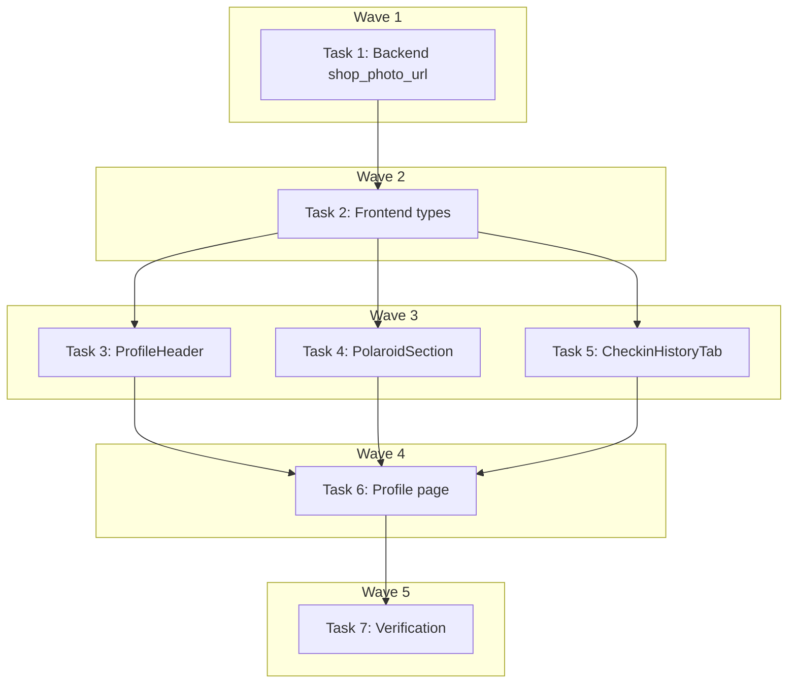

# Profile UI Reconstruct Implementation Plan

> **For Claude:** REQUIRED SUB-SKILL: Use executing-plans to implement this plan task-by-task.

**Design Doc:** [docs/designs/2026-03-23-profile-ui-reconstruct-design.md](docs/designs/2026-03-23-profile-ui-reconstruct-design.md)

**Spec References:** [SPEC.md#profile-is-private](SPEC.md) — private profile only, no public visibility in V1

**PRD References:** —

**Goal:** Rebuild the Profile page components to match the approved Pencil design — brown header banner, horizontal memory scroll, shop-photo check-in cards.

**Architecture:** Three components get visual rebuilds (`ProfileHeader`, `PolaroidSection`, `CheckinHistoryTab`), one backend model extends (`CheckInWithShop.shop_photo_url`), and the profile page gets layout/styling updates. All existing component boundaries preserved — no new components created.

**Tech Stack:** Next.js, TypeScript, Tailwind CSS, lucide-react, FastAPI, Pydantic

**Acceptance Criteria:**

- [ ] Profile page displays a brown banner header with avatar, name, email, stats (Check-ins + Memories)
- [ ] My Memories section shows a horizontal-scroll row of up to 3 memory cards (photo + shop name + diary note)
- [ ] Check-in History shows cards with shop photo thumbnails (coffee icon fallback), shop name, relative date, and review text
- [ ] All existing tests updated and passing; no regressions in build/lint/type-check

---

### Task 1: Backend — Add `shop_photo_url` to CheckInWithShop

**Files:**

- Modify: `backend/models/types.py:105-118`
- Modify: `backend/services/checkin_service.py:125-142`
- Modify: `backend/tests/services/test_checkin_service.py:132-158`

**Step 1: Write the failing test**

Add a new test to `backend/tests/services/test_checkin_service.py` inside `TestCheckInService`, after the existing `test_user_checkin_history_includes_shop_name_and_mrt` test:

```python
async def test_user_checkin_history_includes_shop_photo_url(
    self, checkin_service, mock_supabase
):
    """When a user fetches their check-ins, each record includes the shop's first photo URL."""
    mock_supabase.table.return_value.select.return_value.eq.return_value.order.return_value.execute.return_value = MagicMock(
        data=[
            {
                "id": "ci-photo-001",
                "user_id": "user-mei-ling-001",
                "shop_id": "shop-hinoki",
                "photo_urls": ["https://cdn.caferoam.tw/checkins/latte.jpg"],
                "menu_photo_url": None,
                "note": None,
                "stars": None,
                "review_text": None,
                "confirmed_tags": None,
                "reviewed_at": None,
                "created_at": "2026-03-20T10:00:00+00:00",
                "shops": {
                    "name": "Hinoki Coffee",
                    "mrt": "Daan",
                    "photo_urls": [
                        "https://cdn.caferoam.tw/shops/hinoki/exterior.jpg",
                        "https://cdn.caferoam.tw/shops/hinoki/interior.jpg",
                    ],
                },
            }
        ]
    )
    results = await checkin_service.get_by_user("user-mei-ling-001")
    assert len(results) == 1
    assert results[0].shop_photo_url == "https://cdn.caferoam.tw/shops/hinoki/exterior.jpg"

async def test_user_checkin_history_shop_photo_url_null_when_no_photos(
    self, checkin_service, mock_supabase
):
    """When a shop has no photos, shop_photo_url is None."""
    mock_supabase.table.return_value.select.return_value.eq.return_value.order.return_value.execute.return_value = MagicMock(
        data=[
            {
                "id": "ci-nophoto-001",
                "user_id": "user-mei-ling-001",
                "shop_id": "shop-nophoto",
                "photo_urls": ["https://cdn.caferoam.tw/checkins/visit.jpg"],
                "menu_photo_url": None,
                "note": None,
                "stars": None,
                "review_text": None,
                "confirmed_tags": None,
                "reviewed_at": None,
                "created_at": "2026-03-20T10:00:00+00:00",
                "shops": {
                    "name": "Mystery Cafe",
                    "mrt": "Xinyi",
                    "photo_urls": [],
                },
            }
        ]
    )
    results = await checkin_service.get_by_user("user-mei-ling-001")
    assert len(results) == 1
    assert results[0].shop_photo_url is None
```

**Step 2: Run test to verify it fails**

Run: `cd backend && python -m pytest tests/services/test_checkin_service.py::TestCheckInService::test_user_checkin_history_includes_shop_photo_url -v`
Expected: FAIL — `shop_photo_url` field doesn't exist on `CheckInWithShop`

**Step 3: Write minimal implementation**

In `backend/models/types.py`, add field to `CheckInWithShop`:

```python
class CheckInWithShop(CamelModel):
    id: str
    user_id: str
    shop_id: str
    shop_name: str | None = None
    shop_mrt: str | None = None
    shop_photo_url: str | None = None  # first photo from shops.photo_urls
    photo_urls: list[str]
    menu_photo_url: str | None = None
    note: str | None = None
    stars: int | None = None
    review_text: str | None = None
    confirmed_tags: list[str] | None = None
    reviewed_at: datetime | None = None
    created_at: datetime
```

In `backend/services/checkin_service.py`, update `get_by_user`:

```python
async def get_by_user(self, user_id: str) -> list[CheckInWithShop]:
    response = await asyncio.to_thread(
        lambda: (
            self._db.table("check_ins")
            .select("*, shops(name, mrt, photo_urls)")
            .eq("user_id", user_id)
            .order("created_at", desc=True)
            .execute()
        )
    )
    rows = cast("list[dict[str, Any]]", response.data)
    results = []
    for row in rows:
        shop_data = row.pop("shops", {}) or {}
        row["shop_name"] = shop_data.get("name")
        row["shop_mrt"] = shop_data.get("mrt")
        shop_photos = shop_data.get("photo_urls") or []
        row["shop_photo_url"] = shop_photos[0] if shop_photos else None
        results.append(CheckInWithShop(**row))
    return results
```

Also update the existing test `test_user_checkin_history_includes_shop_name_and_mrt` to include `photo_urls` in the mock shops data so it doesn't break:

```python
"shops": {"name": "Fuji Coffee", "mrt": "Zhongshan", "photo_urls": []},
```

**Step 4: Run tests to verify they pass**

Run: `cd backend && python -m pytest tests/services/test_checkin_service.py -v`
Expected: ALL PASS

**Step 5: Commit**

```bash
git add backend/models/types.py backend/services/checkin_service.py backend/tests/services/test_checkin_service.py
git commit -m "feat(backend): add shop_photo_url to CheckInWithShop model"
```

---

### Task 2: Frontend — Update CheckInData type and factory

**Files:**

- Modify: `lib/hooks/use-user-checkins.ts:6-16`
- Modify: `lib/test-utils/factories.ts:86-98`
- Modify: `lib/hooks/use-user-checkins.test.ts` (update test fixtures)
- Modify: `components/profile/checkin-history-tab.test.tsx:7-30` (update test fixtures)
- Modify: `app/(protected)/profile/page.test.tsx:80-92` (update mock data)

No test needed — this is a type/data change only. Tests are updated to include the new field in test data.

**Step 1: Update the CheckInData interface**

In `lib/hooks/use-user-checkins.ts`:

```typescript
export interface CheckInData {
  id: string;
  user_id: string;
  shop_id: string;
  shop_name: string | null;
  shop_mrt: string | null;
  shop_photo_url: string | null;
  photo_urls: string[];
  stars: number | null;
  review_text: string | null;
  created_at: string;
}
```

**Step 2: Update the makeCheckIn factory**

In `lib/test-utils/factories.ts`, add `shop_photo_url` to `makeCheckIn`:

```typescript
export function makeCheckIn(overrides: Record<string, unknown> = {}) {
  return {
    id: 'ci-j0k1l2',
    user_id: 'user-a1b2c3',
    shop_id: 'shop-d4e5f6',
    shop_photo_url: null,
    photo_urls: [
      'https://example.supabase.co/storage/v1/object/public/checkin-photos/user-a1b2c3/photo1.jpg',
    ],
    menu_photo_url: null,
    note: null,
    created_at: TS,
    ...overrides,
  };
}
```

**Step 3: Update test fixtures**

In `components/profile/checkin-history-tab.test.tsx`, add `shop_photo_url` to the test checkins array:

```typescript
const checkins: CheckInData[] = [
  {
    id: 'ci-1',
    user_id: 'user-123',
    shop_id: 'shop-a',
    shop_name: 'Fika Coffee',
    shop_mrt: 'Daan',
    shop_photo_url: 'https://example.com/shops/fika/exterior.jpg',
    photo_urls: ['https://example.com/photo1.jpg'],
    stars: 4,
    review_text: null,
    created_at: '2026-02-15T10:00:00Z',
  },
  {
    id: 'ci-2',
    user_id: 'user-123',
    shop_id: 'shop-b',
    shop_name: 'Rufous Coffee',
    shop_mrt: null,
    shop_photo_url: null,
    photo_urls: ['https://example.com/photo2.jpg'],
    stars: null,
    review_text: null,
    created_at: '2026-01-20T10:00:00Z',
  },
];
```

In `app/(protected)/profile/page.test.tsx`, add `shop_photo_url` to the mock checkins response:

```typescript
// Inside mockAllEndpoints, update the checkins mock:
{
  id: 'ci-1',
  user_id: 'user-1',
  shop_id: 'shop-a',
  shop_name: 'Fika Coffee',
  shop_mrt: 'Daan',
  shop_photo_url: 'https://example.com/shops/fika/exterior.jpg',
  photo_urls: ['https://example.com/p.jpg'],
  stars: 4,
  review_text: null,
  created_at: '2026-03-01T00:00:00Z',
},
```

**Step 4: Verify tests still pass**

Run: `pnpm test -- --run lib/hooks/use-user-checkins.test.ts components/profile/checkin-history-tab.test.tsx app/\\(protected\\)/profile/page.test.tsx`
Expected: ALL PASS (no behavioral change yet)

**Step 5: Commit**

```bash
git add lib/hooks/use-user-checkins.ts lib/test-utils/factories.ts lib/hooks/use-user-checkins.test.ts components/profile/checkin-history-tab.test.tsx app/\(protected\)/profile/page.test.tsx
git commit -m "feat(types): add shop_photo_url to CheckInData type and test fixtures"
```

---

### Task 3: Frontend — Rebuild ProfileHeader component

**Files:**

- Modify: `components/profile/profile-header.test.tsx`
- Modify: `components/profile/profile-header.tsx`

**Step 1: Write the failing tests**

Replace `components/profile/profile-header.test.tsx` with:

```typescript
import { render, screen } from '@testing-library/react';
import { describe, it, expect } from 'vitest';
import { ProfileHeader } from './profile-header';

describe('ProfileHeader', () => {
  const defaultProps = {
    displayName: 'Mei-Ling',
    avatarUrl: null as string | null,
    email: 'mei.ling@gmail.com' as string | null,
    checkinCount: 23,
    stampCount: 8,
  };

  it('renders display name in the brown banner', () => {
    render(<ProfileHeader {...defaultProps} />);
    expect(screen.getByText('Mei-Ling')).toBeInTheDocument();
  });

  it('renders email when provided', () => {
    render(<ProfileHeader {...defaultProps} />);
    expect(screen.getByText('mei.ling@gmail.com')).toBeInTheDocument();
  });

  it('hides email when null', () => {
    render(<ProfileHeader {...defaultProps} email={null} />);
    expect(screen.queryByText('mei.ling@gmail.com')).not.toBeInTheDocument();
  });

  it('shows check-in count stat', () => {
    render(<ProfileHeader {...defaultProps} />);
    expect(screen.getByText('23')).toBeInTheDocument();
    expect(screen.getByText('Check-ins')).toBeInTheDocument();
  });

  it('shows memories count stat', () => {
    render(<ProfileHeader {...defaultProps} />);
    expect(screen.getByText('8')).toBeInTheDocument();
    expect(screen.getByText('Memories')).toBeInTheDocument();
  });

  it('shows initials when no avatar URL', () => {
    render(<ProfileHeader {...defaultProps} />);
    expect(screen.getByText('M')).toBeInTheDocument();
  });

  it('shows avatar image when URL provided', () => {
    render(
      <ProfileHeader
        {...defaultProps}
        avatarUrl="https://example.com/avatar.jpg"
      />
    );
    const img = screen.getByRole('img');
    expect(img).toHaveAttribute('src', expect.stringContaining('avatar.jpg'));
  });

  it('falls back to "User" when no display name', () => {
    render(<ProfileHeader {...defaultProps} displayName={null} />);
    expect(screen.getByText('U')).toBeInTheDocument();
  });

  it('renders an Edit Profile link to /settings', () => {
    render(<ProfileHeader {...defaultProps} />);
    const link = screen.getByRole('link', { name: /edit profile/i });
    expect(link).toHaveAttribute('href', '/settings');
  });
});
```

**Step 2: Run tests to verify they fail**

Run: `pnpm test -- --run components/profile/profile-header.test.tsx`
Expected: FAIL — `email` and `stampCount` props don't exist yet, stats not rendered

**Step 3: Write the implementation**

Replace `components/profile/profile-header.tsx` with:

```typescript
import Link from 'next/link';

interface ProfileHeaderProps {
  displayName: string | null;
  avatarUrl: string | null;
  email: string | null;
  checkinCount: number;
  stampCount: number;
}

export function ProfileHeader({
  displayName,
  avatarUrl,
  email,
  checkinCount,
  stampCount,
}: ProfileHeaderProps) {
  const name = displayName || 'User';
  const initial = name.charAt(0).toUpperCase();

  return (
    <div className="w-full bg-[#8B5E3C]">
      <div className="mx-auto flex max-w-4xl flex-col items-center gap-6 px-4 py-8 md:flex-row md:items-center md:justify-between md:px-8">
        {/* Left: Avatar + Info */}
        <div className="flex items-center gap-5">
          {avatarUrl ? (
            // eslint-disable-next-line @next/next/no-img-element -- avatar URLs may come from OAuth providers
            
          ) : (
            <div className="flex h-16 w-16 items-center justify-center rounded-full border-2 border-white/40 bg-[#F5EDE4] md:h-20 md:w-20">
              <span className="font-heading text-2xl font-bold text-[#8B5E3C] md:text-[28px]">
                {initial}
              </span>
            </div>
          )}
          <div className="flex flex-col gap-1">
            <h1 className="font-heading text-[22px] font-bold text-white md:text-[26px]">
              {name}
            </h1>
            {email && (
              <p className="text-[13px] text-white/50">{email}</p>
            )}
            <Link
              href="/settings"
              className="text-[13px] font-medium text-white hover:underline"
            >
              Edit Profile &rarr;
            </Link>
          </div>
        </div>

        {/* Right: Stats Row */}
        <div className="flex items-center">
          <div className="flex flex-col items-center px-8">
            <span className="font-heading text-[28px] font-bold text-white md:text-[32px]">
              {checkinCount}
            </span>
            <span className="text-xs font-medium text-white/50">Check-ins</span>
          </div>
          <div className="h-12 w-px bg-white/30" />
          <div className="flex flex-col items-center px-8">
            <span className="font-heading text-[28px] font-bold text-white md:text-[32px]">
              {stampCount}
            </span>
            <span className="text-xs font-medium text-white/50">Memories</span>
          </div>
        </div>
      </div>
    </div>
  );
}
```

**Step 4: Run tests to verify they pass**

Run: `pnpm test -- --run components/profile/profile-header.test.tsx`
Expected: ALL PASS

**Step 5: Commit**

```bash
git add components/profile/profile-header.tsx components/profile/profile-header.test.tsx
git commit -m "feat(ui): rebuild ProfileHeader with brown banner and stats row"
```

---

### Task 4: Frontend — Rebuild PolaroidSection component

**Files:**

- Modify: `components/stamps/polaroid-section.test.tsx`
- Modify: `components/stamps/polaroid-section.tsx`

**Step 1: Write the failing tests**

Replace `components/stamps/polaroid-section.test.tsx` with:

```typescript
import { render, screen } from '@testing-library/react';
import { describe, it, expect } from 'vitest';
import { makeStamp } from '@/lib/test-utils/factories';
import { PolaroidSection } from './polaroid-section';

describe('PolaroidSection', () => {
  it('renders "My Memories" heading', () => {
    render(<PolaroidSection stamps={[]} />);
    expect(screen.getByText('My Memories')).toBeInTheDocument();
  });

  it('renders empty state when no stamps', () => {
    render(<PolaroidSection stamps={[]} />);
    expect(
      screen.getByText(/Your memories will appear here/)
    ).toBeInTheDocument();
  });

  it('renders at most 3 memory cards', () => {
    const stamps = Array.from({ length: 6 }, (_, i) =>
      makeStamp({ id: `stamp-${i}`, shop_name: `Shop ${i}` })
    );
    render(<PolaroidSection stamps={stamps} />);
    const cards = screen.getAllByTestId('memory-card');
    expect(cards).toHaveLength(3);
  });

  it('renders shop name on each card', () => {
    const stamps = [makeStamp({ shop_name: 'Hinoki Coffee' })];
    render(<PolaroidSection stamps={stamps} />);
    expect(screen.getByText('Hinoki Coffee')).toBeInTheDocument();
  });

  it('renders diary note in italic when present', () => {
    const stamps = [makeStamp({ diary_note: 'Perfect focus mode' })];
    render(<PolaroidSection stamps={stamps} />);
    expect(screen.getByText('"Perfect focus mode"')).toBeInTheDocument();
  });

  it('shows recent visits count in subtitle', () => {
    const stamps = Array.from({ length: 3 }, (_, i) =>
      makeStamp({ id: `stamp-${i}`, shop_name: `Shop ${i}` })
    );
    render(<PolaroidSection stamps={stamps} />);
    expect(screen.getByText('3 recent visits')).toBeInTheDocument();
  });

  it('renders "View All" link pointing to /profile/memories', () => {
    const stamps = [makeStamp()];
    render(<PolaroidSection stamps={stamps} />);
    const link = screen.getByRole('link', { name: /View All/i });
    expect(link).toHaveAttribute('href', '/profile/memories');
  });

  it('does not render "View All" when there are no stamps', () => {
    render(<PolaroidSection stamps={[]} />);
    expect(
      screen.queryByRole('link', { name: /View All/i })
    ).not.toBeInTheDocument();
  });

  it('renders a horizontal scroll container', () => {
    const stamps = [makeStamp()];
    render(<PolaroidSection stamps={stamps} />);
    const scrollContainer = screen.getByTestId('memory-scroll');
    expect(scrollContainer).toBeInTheDocument();
  });
});
```

**Step 2: Run tests to verify they fail**

Run: `pnpm test -- --run components/stamps/polaroid-section.test.tsx`
Expected: FAIL — `memory-card` testid doesn't exist, max is 4 not 3, no `memory-scroll` container

**Step 3: Write the implementation**

Replace `components/stamps/polaroid-section.tsx` with:

```typescript
import Image from 'next/image';
import Link from 'next/link';
import { Images } from 'lucide-react';
import type { StampData } from '@/lib/hooks/use-user-stamps';

const MAX_PREVIEW = 3;

interface PolaroidSectionProps {
  stamps: StampData[];
  onStampClick?: (stamp: StampData) => void;
}

export function PolaroidSection({
  stamps,
  onStampClick,
}: PolaroidSectionProps) {
  const previewStamps = stamps.slice(0, MAX_PREVIEW);
  const visibleCount = Math.min(stamps.length, MAX_PREVIEW);

  return (
    <div>
      {/* Section Header */}
      <div className="flex items-center justify-between pb-4 pt-7">
        <div className="flex flex-col gap-0.5">
          <h2 className="font-heading text-xl font-bold text-[#1A1918]">
            My Memories
          </h2>
          {stamps.length > 0 && (
            <p className="text-[13px] text-[#9CA3AF]">
              {visibleCount} recent visits
            </p>
          )}
        </div>
        {stamps.length > 0 && (
          <Link
            href="/profile/memories"
            className="flex items-center gap-1 rounded-full bg-[#F5EDE4] px-3.5 py-1.5 text-xs font-semibold text-[#8B5E3C]"
          >
            <Images className="h-3.5 w-3.5" />
            View All
          </Link>
        )}
      </div>

      {stamps.length === 0 ? (
        <div className="flex flex-col items-center justify-center rounded-lg border-2 border-dashed border-gray-200 py-12 text-center">
          <p className="text-muted-foreground text-sm">
            Your memories will appear here after your first check-in
          </p>
        </div>
      ) : (
        <div
          data-testid="memory-scroll"
          className="flex gap-4 overflow-x-auto pb-2 md:grid md:grid-cols-3 md:overflow-x-visible"
        >
          {previewStamps.map((stamp) => (
            <div
              key={stamp.id}
              data-testid="memory-card"
              role={onStampClick ? 'button' : undefined}
              tabIndex={onStampClick ? 0 : undefined}
              className="min-w-[200px] flex-shrink-0 cursor-pointer rounded-lg bg-white p-2.5 shadow-[0_3px_12px_rgba(0,0,0,0.08)] transition-transform hover:scale-[1.02] md:min-w-0"
              onClick={() => onStampClick?.(stamp)}
              onKeyDown={
                onStampClick
                  ? (e) => {
                      if (e.key === 'Enter' || e.key === ' ') {
                        e.preventDefault();
                        onStampClick(stamp);
                      }
                    }
                  : undefined
              }
            >
              <div className="relative h-[130px] w-full overflow-hidden rounded-sm">
                {stamp.photo_url ? (
                  <Image
                    src={stamp.photo_url}
                    alt={stamp.shop_name ?? 'Memory'}
                    fill
                    className="object-cover"
                    sizes="(min-width: 768px) 33vw, 200px"
                  />
                ) : (
                  <div className="flex h-full w-full items-center justify-center bg-[#F5EDE4] text-[#8B5E3C]">
                    <Images className="h-8 w-8" />
                  </div>
                )}
              </div>
              <p className="mt-2 truncate text-xs font-bold text-[#1A1918]">
                {stamp.shop_name ?? 'Unknown Shop'}
              </p>
              {stamp.diary_note && (
                <p className="truncate text-[11px] italic text-[#9CA3AF]">
                  &ldquo;{stamp.diary_note}&rdquo;
                </p>
              )}
            </div>
          ))}
        </div>
      )}
    </div>
  );
}
```

**Step 4: Run tests to verify they pass**

Run: `pnpm test -- --run components/stamps/polaroid-section.test.tsx`
Expected: ALL PASS

**Step 5: Commit**

```bash
git add components/stamps/polaroid-section.tsx components/stamps/polaroid-section.test.tsx
git commit -m "feat(ui): rebuild PolaroidSection with horizontal scroll and new card style"
```

---

### Task 5: Frontend — Rebuild CheckinHistoryTab component

**Files:**

- Modify: `components/profile/checkin-history-tab.test.tsx`
- Modify: `components/profile/checkin-history-tab.tsx`

**Step 1: Write the failing tests**

Replace `components/profile/checkin-history-tab.test.tsx` with:

```typescript
import { render, screen } from '@testing-library/react';
import { describe, it, expect } from 'vitest';
import { CheckinHistoryTab } from './checkin-history-tab';
import type { CheckInData } from '@/lib/hooks/use-user-checkins';

describe('CheckinHistoryTab', () => {
  const checkins: CheckInData[] = [
    {
      id: 'ci-1',
      user_id: 'user-123',
      shop_id: 'shop-a',
      shop_name: 'Fika Coffee',
      shop_mrt: 'Daan',
      shop_photo_url: 'https://example.com/shops/fika/exterior.jpg',
      photo_urls: ['https://example.com/photo1.jpg'],
      stars: 4,
      review_text: 'Great pour-over, stayed 3 hours working.',
      created_at: '2026-02-15T10:00:00Z',
    },
    {
      id: 'ci-2',
      user_id: 'user-123',
      shop_id: 'shop-b',
      shop_name: 'Rufous Coffee',
      shop_mrt: null,
      shop_photo_url: null,
      photo_urls: ['https://example.com/photo2.jpg'],
      stars: null,
      review_text: null,
      created_at: '2026-01-20T10:00:00Z',
    },
  ];

  it('renders check-in cards with shop names', () => {
    render(<CheckinHistoryTab checkins={checkins} isLoading={false} />);
    expect(screen.getByText('Fika Coffee')).toBeInTheDocument();
    expect(screen.getByText('Rufous Coffee')).toBeInTheDocument();
  });

  it('does not render star ratings', () => {
    render(<CheckinHistoryTab checkins={checkins} isLoading={false} />);
    expect(screen.queryByTestId('star-filled')).not.toBeInTheDocument();
    expect(screen.queryByTestId('star-empty')).not.toBeInTheDocument();
  });

  it('shows review text when present', () => {
    render(<CheckinHistoryTab checkins={checkins} isLoading={false} />);
    expect(
      screen.getByText('Great pour-over, stayed 3 hours working.')
    ).toBeInTheDocument();
  });

  it('renders shop photo thumbnail when shop_photo_url is present', () => {
    render(<CheckinHistoryTab checkins={checkins} isLoading={false} />);
    const imgs = screen.getAllByRole('img');
    expect(imgs[0]).toHaveAttribute(
      'src',
      expect.stringContaining('shops/fika/exterior.jpg')
    );
  });

  it('renders coffee icon fallback when no shop_photo_url', () => {
    render(<CheckinHistoryTab checkins={checkins} isLoading={false} />);
    expect(screen.getByTestId('coffee-icon-fallback')).toBeInTheDocument();
  });

  it('renders empty state when no check-ins', () => {
    render(<CheckinHistoryTab checkins={[]} isLoading={false} />);
    expect(screen.getByText(/no check-ins yet/i)).toBeInTheDocument();
  });

  it('shows loading spinner', () => {
    render(<CheckinHistoryTab checkins={[]} isLoading={true} />);
    expect(screen.getByTestId('loading-spinner')).toBeInTheDocument();
  });

  it('links shop names to shop pages', () => {
    render(<CheckinHistoryTab checkins={checkins} isLoading={false} />);
    const link = screen.getByRole('link', { name: 'Fika Coffee' });
    expect(link).toHaveAttribute('href', '/shop/shop-a');
  });
});
```

**Step 2: Run tests to verify they fail**

Run: `pnpm test -- --run components/profile/checkin-history-tab.test.tsx`
Expected: FAIL — star ratings still render, shop photo not used, no coffee icon fallback

**Step 3: Write the implementation**

Replace `components/profile/checkin-history-tab.tsx` with:

```typescript
import Image from 'next/image';
import Link from 'next/link';
import { Coffee } from 'lucide-react';
import type { CheckInData } from '@/lib/hooks/use-user-checkins';
import { formatRelativeTime } from '@/lib/utils';

interface CheckinHistoryTabProps {
  checkins: CheckInData[];
  isLoading: boolean;
}

export function CheckinHistoryTab({
  checkins,
  isLoading,
}: CheckinHistoryTabProps) {
  if (isLoading) {
    return (
      <div className="flex justify-center py-12" data-testid="loading-spinner">
        <div className="h-8 w-8 animate-spin rounded-full border-2 border-gray-300 border-t-gray-600" />
      </div>
    );
  }

  if (checkins.length === 0) {
    return (
      <div className="text-muted-foreground py-12 text-center">
        <p>No check-ins yet — find a shop to visit</p>
      </div>
    );
  }

  return (
    <div className="flex flex-col gap-3">
      {checkins.map((checkin) => (
        <CheckinCard key={checkin.id} checkin={checkin} />
      ))}
    </div>
  );
}

function CheckinCard({ checkin }: { checkin: CheckInData }) {
  const date = formatRelativeTime(checkin.created_at);

  return (
    <div className="flex gap-3.5 rounded-2xl border border-[#F3F4F6] bg-white p-4 shadow-[0_1px_4px_rgba(0,0,0,0.04)]">
      {/* Thumbnail */}
      {checkin.shop_photo_url ? (
        <Image
          src={checkin.shop_photo_url}
          alt={checkin.shop_name ?? ''}
          width={72}
          height={72}
          className="h-[72px] w-[72px] flex-shrink-0 rounded-xl object-cover"
          sizes="72px"
        />
      ) : (
        <div
          data-testid="coffee-icon-fallback"
          className="flex h-[72px] w-[72px] flex-shrink-0 items-center justify-center rounded-xl bg-[#F5EDE4]"
        >
          <Coffee className="h-6 w-6 text-[#8B5E3C]" />
        </div>
      )}

      {/* Info */}
      <div className="min-w-0 flex-1">
        <div className="flex items-center justify-between">
          <Link
            href={`/shop/${checkin.shop_id}`}
            className="truncate text-[15px] font-bold text-[#1A1918] hover:underline"
          >
            {checkin.shop_name ?? 'Unknown Shop'}
          </Link>
          <span className="ml-2 flex-shrink-0 text-xs text-[#9CA3AF]">
            {date}
          </span>
        </div>
        {checkin.review_text && (
          <p className="mt-1 line-clamp-2 text-[13px] leading-[1.4] text-[#9CA3AF]">
            {checkin.review_text}
          </p>
        )}
      </div>
    </div>
  );
}
```

**Step 4: Run tests to verify they pass**

Run: `pnpm test -- --run components/profile/checkin-history-tab.test.tsx`
Expected: ALL PASS

**Step 5: Commit**

```bash
git add components/profile/checkin-history-tab.tsx components/profile/checkin-history-tab.test.tsx
git commit -m "feat(ui): rebuild CheckinHistoryTab with shop photo and new card design"
```

---

### Task 6: Frontend — Update Profile page layout and wiring

**Files:**

- Modify: `app/(protected)/profile/page.test.tsx`
- Modify: `app/(protected)/profile/page.tsx`

**Step 1: Write the failing tests**

Update `app/(protected)/profile/page.test.tsx`. Add a mock for `useUser` and update assertions.

Add at the top of the file (after the existing mocks):

```typescript
// Add mock for useUser hook
vi.mock('@/lib/hooks/use-user', () => ({
  useUser: () => ({
    user: { email: 'mei.ling@gmail.com' },
    isLoading: false,
  }),
}));
```

Update the `mockAllEndpoints` to include `stamp_count` in the profile response:

```typescript
overrides.profile ?? {
  display_name: 'Mei-Ling',
  avatar_url: null,
  checkin_count: 1,
  stamp_count: 3,
},
```

Update mock checkins to include `shop_photo_url`:

```typescript
{
  id: 'ci-1',
  user_id: 'user-1',
  shop_id: 'shop-a',
  shop_name: 'Fika Coffee',
  shop_mrt: 'Daan',
  shop_photo_url: 'https://example.com/shops/fika/exterior.jpg',
  photo_urls: ['https://example.com/p.jpg'],
  stars: 4,
  review_text: null,
  created_at: '2026-03-01T00:00:00Z',
},
```

Add these new tests:

```typescript
it('renders email from auth session in profile header', async () => {
  mockAllEndpoints();
  render(<ProfilePage />, { wrapper });

  await waitFor(() => {
    expect(screen.getByText('mei.ling@gmail.com')).toBeInTheDocument();
  });
});

it('renders memories count stat from stamp_count', async () => {
  mockAllEndpoints({ profile: { display_name: 'Mei', avatar_url: null, checkin_count: 5, stamp_count: 12 } });
  render(<ProfilePage />, { wrapper });

  await waitFor(() => {
    expect(screen.getByText('12')).toBeInTheDocument();
  });
  expect(screen.getByText('Memories')).toBeInTheDocument();
});
```

**Step 2: Run tests to verify they fail**

Run: `pnpm test -- --run app/\\(protected\\)/profile/page.test.tsx`
Expected: FAIL — email not rendered, Memories stat not shown

**Step 3: Write the implementation**

Replace `app/(protected)/profile/page.tsx` with:

```typescript
'use client';

import { useState, useEffect, useRef } from 'react';
import { useUser } from '@/lib/hooks/use-user';
import { useUserStamps } from '@/lib/hooks/use-user-stamps';
import { useUserProfile } from '@/lib/hooks/use-user-profile';
import { useUserCheckins } from '@/lib/hooks/use-user-checkins';
import { useAnalytics } from '@/lib/posthog/use-analytics';
import { PolaroidSection } from '@/components/stamps/polaroid-section';
import { StampDetailSheet } from '@/components/stamps/stamp-detail-sheet';
import { ProfileHeader } from '@/components/profile/profile-header';
import { CheckinHistoryTab } from '@/components/profile/checkin-history-tab';
import type { StampData } from '@/lib/hooks/use-user-stamps';

export default function ProfilePage() {
  const { user } = useUser();
  const { profile, isLoading: profileLoading } = useUserProfile();
  const { stamps, isLoading: stampsLoading } = useUserStamps();
  const { checkins, isLoading: checkinsLoading } = useUserCheckins();
  const [selectedStamp, setSelectedStamp] = useState<StampData | null>(null);
  const { capture } = useAnalytics();
  const hasFiredRef = useRef(false);

  useEffect(() => {
    if (!stampsLoading && !hasFiredRef.current) {
      hasFiredRef.current = true;
      capture('profile_stamps_viewed', { stamp_count: stamps.length });
    }
  }, [stampsLoading, stamps.length, capture]);

  return (
    <main className="min-h-screen bg-[#F5F4F1]">
      {/* Profile Header — full-width brown banner */}
      {profileLoading ? (
        <div className="flex justify-center bg-[#8B5E3C] py-12">
          <div className="h-8 w-8 animate-spin rounded-full border-2 border-white/30 border-t-white" />
        </div>
      ) : (
        <ProfileHeader
          displayName={profile?.display_name ?? null}
          avatarUrl={profile?.avatar_url ?? null}
          email={user?.email ?? null}
          checkinCount={profile?.checkin_count ?? 0}
          stampCount={profile?.stamp_count ?? 0}
        />
      )}

      {/* Content Area */}
      <div className="mx-auto max-w-4xl px-4 pb-8">
        {/* Memories Section */}
        <section>
          {stampsLoading ? (
            <div className="flex justify-center py-12">
              <div className="h-8 w-8 animate-spin rounded-full border-2 border-gray-300 border-t-gray-600" />
            </div>
          ) : (
            <PolaroidSection
              stamps={stamps}
              onStampClick={(stamp) => setSelectedStamp(stamp)}
            />
          )}
        </section>

        {/* Check-in History Section */}
        <section>
          <h2 className="pb-4 pt-7 font-heading text-xl font-bold text-[#1A1918]">
            Check-in History
          </h2>
          <CheckinHistoryTab checkins={checkins} isLoading={checkinsLoading} />
        </section>
      </div>

      {selectedStamp && (
        <StampDetailSheet
          stamp={selectedStamp}
          onClose={() => setSelectedStamp(null)}
        />
      )}
    </main>
  );
}
```

**Step 4: Run tests to verify they pass**

Run: `pnpm test -- --run app/\\(protected\\)/profile/page.test.tsx`
Expected: ALL PASS

**Step 5: Commit**

```bash
git add app/\(protected\)/profile/page.tsx app/\(protected\)/profile/page.test.tsx
git commit -m "feat(ui): update Profile page layout with brown banner and warm background"
```

---

### Task 7: Full verification

**Files:** None (verification only)

No test needed — this is a verification step.

**Step 1: Run all frontend tests**

Run: `pnpm test -- --run`
Expected: ALL PASS

**Step 2: Run type-check**

Run: `pnpm type-check`
Expected: No errors

**Step 3: Run lint**

Run: `pnpm lint`
Expected: No errors

**Step 4: Run build**

Run: `pnpm build`
Expected: Build succeeds

**Step 5: Run backend tests**

Run: `cd backend && python -m pytest -v`
Expected: ALL PASS

**Step 6: Run backend lint**

Run: `cd backend && ruff check .`
Expected: No errors

**Step 7: Fix any issues found in Steps 1-6, then commit**

```bash
git add -A
git commit -m "chore: fix verification issues from Profile UI Reconstruct"
```

(Only if there are fixes. Skip if clean.)

---

## Execution Waves



**Wave 1** (backend):

- Task 1: Backend — add `shop_photo_url` to CheckInWithShop

**Wave 2** (types — depends on Wave 1):

- Task 2: Frontend — update CheckInData type and factory

**Wave 3** (parallel components — depends on Wave 2):

- Task 3: ProfileHeader rebuild
- Task 4: PolaroidSection rebuild
- Task 5: CheckinHistoryTab rebuild

**Wave 4** (page wiring — depends on Wave 3):

- Task 6: Profile page layout and wiring

**Wave 5** (verification — depends on Wave 4):

- Task 7: Full verification

---

## TODO.md Update

Update the `### UI Reconstruct — Profile` section in TODO.md with chunked tasks linking to the design and plan docs.
