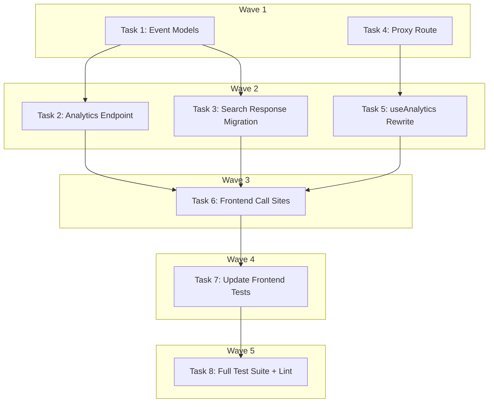

# Analytics Events Audit Implementation Plan

> **For Claude:** REQUIRED SUB-SKILL: Use executing-plans to implement this plan task-by-task.

**Design Doc:** [docs/designs/2026-03-24-analytics-events-audit-design.md](docs/designs/2026-03-24-analytics-events-audit-design.md)

**Spec References:** [SPEC.md §6 Analytics](SPEC.md), [docs/designs/ux/metrics.md](docs/designs/ux/metrics.md)

**PRD References:** —

**Goal:** Wire all 7 spec events through a centralized backend analytics gateway with typed schemas, PDPA-compliant anonymized user IDs, and no duplicate firing.

**Architecture:** A new `POST /analytics/events` endpoint accepts all analytics events. The 7 spec events are validated via Pydantic discriminated unions. Other events pass through with a PDPA blocklist filter. The frontend `useAnalytics` hook is changed to POST to this endpoint instead of calling `posthog.capture()` directly. The inline `search_submitted` tracking in `GET /search` is removed; search response now includes `query_type` and `result_count` for the frontend to forward.

**Tech Stack:** FastAPI, Pydantic, PostHog Python SDK (via existing AnalyticsProvider protocol), Next.js API route proxy, Vitest + Testing Library

**Acceptance Criteria:**

- [ ] All 7 spec events fire server-side through PostHog with correct properties per `metrics.md`
- [ ] Every event uses an anonymized `distinct_id` (SHA-256, no raw user IDs reach PostHog)
- [ ] No duplicate events — each event fires once (server-side only for spec events)
- [ ] Non-spec events (tarot, community, etc.) pass through with PDPA filtering
- [ ] Search response includes `query_type` and `result_count` metadata

---

## Task 1: Backend Event Models

**Files:**

- Create: `backend/models/analytics_events.py`
- Test: `backend/tests/models/test_analytics_events.py`

**Step 1: Write the failing test**

```python
# backend/tests/models/test_analytics_events.py
import pytest
from pydantic import ValidationError

from models.analytics_events import (
    AnalyticsEventRequest,
    PDPA_BLOCKED_FIELDS,
    sanitize_passthrough,
)


class TestSpecEventValidation:
    def test_search_submitted_valid(self):
        req = AnalyticsEventRequest(
            event="search_submitted",
            properties={
                "query_text": "latte",
                "query_type": "item_specific",
                "mode_chip_active": "work",
                "result_count": 5,
            },
        )
        assert req.event == "search_submitted"
        assert req.properties["query_text"] == "latte"

    def test_search_submitted_missing_required_field(self):
        with pytest.raises(ValidationError):
            AnalyticsEventRequest(
                event="search_submitted",
                properties={"query_text": "latte"},
            )

    def test_shop_detail_viewed_valid(self):
        req = AnalyticsEventRequest(
            event="shop_detail_viewed",
            properties={
                "shop_id": "abc-123",
                "referrer": "search",
                "session_search_query": "good wifi",
            },
        )
        assert req.properties["shop_id"] == "abc-123"

    def test_shop_url_copied_valid(self):
        req = AnalyticsEventRequest(
            event="shop_url_copied",
            properties={"shop_id": "abc-123", "copy_method": "clipboard"},
        )
        assert req.properties["copy_method"] == "clipboard"

    def test_checkin_completed_valid(self):
        req = AnalyticsEventRequest(
            event="checkin_completed",
            properties={
                "shop_id": "abc-123",
                "has_text_note": True,
                "has_menu_photo": False,
            },
        )
        assert req.properties["shop_id"] == "abc-123"
        # is_first_checkin_at_shop is NOT required from client — server enriches it
        assert "is_first_checkin_at_shop" not in req.properties

    def test_profile_stamps_viewed_valid(self):
        req = AnalyticsEventRequest(
            event="profile_stamps_viewed",
            properties={"stamp_count": 12},
        )
        assert req.properties["stamp_count"] == 12

    def test_filter_applied_valid(self):
        req = AnalyticsEventRequest(
            event="filter_applied",
            properties={"filter_type": "mode", "filter_value": "work"},
        )
        assert req.properties["filter_type"] == "mode"

    def test_session_start_valid(self):
        """session_start has no client-required properties — server enriches all."""
        req = AnalyticsEventRequest(event="session_start", properties={})
        assert req.event == "session_start"


class TestPassthroughEvents:
    def test_unknown_event_passes_through(self):
        req = AnalyticsEventRequest(
            event="tarot_card_tapped",
            properties={"card_index": 2},
        )
        assert req.event == "tarot_card_tapped"

    def test_passthrough_gets_source_tag(self):
        props = sanitize_passthrough({"card_index": 2})
        assert props["source"] == "client"

    def test_passthrough_strips_pii_fields(self):
        props = sanitize_passthrough(
            {"card_index": 2, "email": "user@example.com", "user_id": "raw-id"}
        )
        assert "email" not in props
        assert "user_id" not in props
        assert props["card_index"] == 2
        assert props["source"] == "client"


class TestPDPABlockedFields:
    def test_blocked_fields_include_common_pii(self):
        assert "email" in PDPA_BLOCKED_FIELDS
        assert "phone" in PDPA_BLOCKED_FIELDS
        assert "user_id" in PDPA_BLOCKED_FIELDS
        assert "name" in PDPA_BLOCKED_FIELDS
```

**Step 2: Run test to verify it fails**

Run: `cd backend && python -m pytest tests/models/test_analytics_events.py -v`
Expected: FAIL — `ModuleNotFoundError: No module named 'models.analytics_events'`

**Step 3: Write minimal implementation**

```python
# backend/models/analytics_events.py
"""Pydantic models for the analytics event gateway.

Strict validation for the 7 spec events (metrics.md).
Passthrough with PDPA filtering for all other events.
"""

from typing import Any, Literal

from pydantic import BaseModel, model_validator

# --- Spec event names (strict validation path) ---
SPEC_EVENTS = frozenset(
    {
        "search_submitted",
        "shop_detail_viewed",
        "shop_url_copied",
        "checkin_completed",
        "profile_stamps_viewed",
        "filter_applied",
        "session_start",
    }
)

# --- PDPA blocklist for passthrough events ---
PDPA_BLOCKED_FIELDS = frozenset({"email", "phone", "user_id", "name", "address"})

# --- Per-event required property keys (client-provided only) ---
_REQUIRED_PROPS: dict[str, set[str]] = {
    "search_submitted": {"query_text", "query_type", "mode_chip_active", "result_count"},
    "shop_detail_viewed": {"shop_id", "referrer", "session_search_query"},
    "shop_url_copied": {"shop_id", "copy_method"},
    "checkin_completed": {"shop_id", "has_text_note", "has_menu_photo"},
    "profile_stamps_viewed": {"stamp_count"},
    "filter_applied": {"filter_type", "filter_value"},
    "session_start": set(),  # all properties are server-enriched
}


def sanitize_passthrough(properties: dict[str, Any]) -> dict[str, Any]:
    """Strip PDPA-blocked fields and add source tag for passthrough events."""
    cleaned = {k: v for k, v in properties.items() if k not in PDPA_BLOCKED_FIELDS}
    cleaned["source"] = "client"
    return cleaned


class AnalyticsEventRequest(BaseModel):
    """Incoming analytics event from frontend.

    For spec events: validates required properties.
    For other events: accepts any properties (PDPA filtering happens at the endpoint layer).
    """

    event: str
    properties: dict[str, Any] = {}

    @model_validator(mode="after")
    def validate_spec_event_properties(self) -> "AnalyticsEventRequest":
        if self.event in SPEC_EVENTS:
            required = _REQUIRED_PROPS[self.event]
            missing = required - set(self.properties.keys())
            if missing:
                raise ValueError(
                    f"Event '{self.event}' missing required properties: {sorted(missing)}"
                )
        return self
```

**Step 4: Run test to verify it passes**

Run: `cd backend && python -m pytest tests/models/test_analytics_events.py -v`
Expected: all PASS

**Step 5: Commit**

```bash
git add backend/models/analytics_events.py backend/tests/models/test_analytics_events.py
git commit -m "feat(analytics): add Pydantic event models with spec validation + PDPA filter (DEV-16)"
```

---

## Task 2: Backend Analytics Endpoint

**Files:**

- Create: `backend/api/analytics.py`
- Create: `backend/tests/api/test_analytics.py`
- Modify: `backend/main.py:22` (add router import)
- Modify: `backend/main.py:112-126` (register router)

**API Contract:**

```yaml
endpoint: POST /analytics/events
request:
  event: string # event name
  properties: object # event properties (validated per event type)
response:
  status: 'ok'
errors:
  401: missing/invalid Authorization header
  422: validation failure (missing required properties for spec events)
```

**Step 1: Write the failing test**

```python
# backend/tests/api/test_analytics.py
from unittest.mock import MagicMock, patch

from fastapi.testclient import TestClient

from api.deps import get_admin_db, get_current_user, get_user_db
from main import app
from providers.analytics import get_analytics_provider

client = TestClient(app)


def _setup_overrides(mock_analytics=None, user_id="user-test-123"):
    """Set up common dependency overrides for analytics tests."""
    mock_db = MagicMock()
    if mock_analytics is None:
        mock_analytics = MagicMock()
    app.dependency_overrides[get_current_user] = lambda: {"id": user_id}
    app.dependency_overrides[get_user_db] = lambda: mock_db
    app.dependency_overrides[get_admin_db] = lambda: MagicMock()
    app.dependency_overrides[get_analytics_provider] = lambda: mock_analytics
    return mock_analytics


class TestAnalyticsEndpointAuth:
    def test_requires_auth(self):
        response = client.post(
            "/analytics/events",
            json={"event": "filter_applied", "properties": {"filter_type": "mode", "filter_value": "work"}},
        )
        assert response.status_code == 401

    def test_returns_ok_for_valid_event(self):
        _setup_overrides()
        try:
            response = client.post(
                "/analytics/events",
                json={
                    "event": "filter_applied",
                    "properties": {"filter_type": "mode", "filter_value": "work"},
                },
            )
            assert response.status_code == 200
            assert response.json()["status"] == "ok"
        finally:
            app.dependency_overrides.clear()


class TestAnalyticsSpecEvents:
    def test_spec_event_fires_posthog_with_anonymized_id(self):
        mock_analytics = _setup_overrides(user_id="user-abc-real-id")
        try:
            response = client.post(
                "/analytics/events",
                json={
                    "event": "filter_applied",
                    "properties": {"filter_type": "mode", "filter_value": "work"},
                },
            )
            assert response.status_code == 200
            mock_analytics.track.assert_called_once()
            call_kwargs = mock_analytics.track.call_args
            # distinct_id must be anonymized, not raw user ID
            assert call_kwargs[1]["distinct_id"] != "user-abc-real-id"
            assert len(call_kwargs[1]["distinct_id"]) == 64  # SHA-256 hex
        finally:
            app.dependency_overrides.clear()

    def test_spec_event_rejects_missing_properties(self):
        _setup_overrides()
        try:
            response = client.post(
                "/analytics/events",
                json={
                    "event": "search_submitted",
                    "properties": {"query_text": "latte"},
                },
            )
            assert response.status_code == 422
        finally:
            app.dependency_overrides.clear()

    def test_checkin_completed_enriches_is_first(self):
        """checkin_completed should resolve is_first_checkin_at_shop from DB."""
        mock_analytics = _setup_overrides(user_id="user-checkin-test")
        mock_admin_db = MagicMock()
        # Simulate: user has 0 previous check-ins at this shop
        mock_admin_db.table.return_value.select.return_value.eq.return_value.eq.return_value.execute.return_value = MagicMock(
            count=0
        )
        app.dependency_overrides[get_admin_db] = lambda: mock_admin_db
        try:
            response = client.post(
                "/analytics/events",
                json={
                    "event": "checkin_completed",
                    "properties": {
                        "shop_id": "shop-xyz",
                        "has_text_note": True,
                        "has_menu_photo": False,
                    },
                },
            )
            assert response.status_code == 200
            call_args = mock_analytics.track.call_args
            props = call_args[0][1]
            assert props["is_first_checkin_at_shop"] is True
        finally:
            app.dependency_overrides.clear()

    def test_session_start_enriches_from_heartbeat(self):
        """session_start should call session_heartbeat and enrich properties."""
        mock_analytics = _setup_overrides(user_id="user-session-test")
        mock_user_db = MagicMock()
        # Mock ProfileService.session_heartbeat return
        mock_user_db.table.return_value.select.return_value.eq.return_value.single.return_value.execute.return_value = MagicMock(
            data={"session_count": 5, "first_session_at": "2026-03-01T00:00:00+00:00", "last_session_at": "2026-03-23T00:00:00+00:00"}
        )
        app.dependency_overrides[get_user_db] = lambda: mock_user_db
        try:
            with patch("api.analytics.ProfileService") as MockProfileService:
                mock_service = MockProfileService.return_value
                mock_service.session_heartbeat.return_value = {
                    "days_since_first_session": 23,
                    "previous_sessions": 5,
                }
                response = client.post(
                    "/analytics/events",
                    json={"event": "session_start", "properties": {}},
                )
                assert response.status_code == 200
                call_args = mock_analytics.track.call_args
                props = call_args[0][1]
                assert props["days_since_first_session"] == 23
                assert props["previous_sessions"] == 5
        finally:
            app.dependency_overrides.clear()


class TestAnalyticsPassthrough:
    def test_passthrough_event_fires_with_source_tag(self):
        mock_analytics = _setup_overrides()
        try:
            response = client.post(
                "/analytics/events",
                json={
                    "event": "tarot_card_tapped",
                    "properties": {"card_index": 2},
                },
            )
            assert response.status_code == 200
            call_args = mock_analytics.track.call_args
            props = call_args[0][1]
            assert props["source"] == "client"
            assert props["card_index"] == 2
        finally:
            app.dependency_overrides.clear()

    def test_passthrough_strips_pii(self):
        mock_analytics = _setup_overrides()
        try:
            response = client.post(
                "/analytics/events",
                json={
                    "event": "custom_event",
                    "properties": {"email": "user@test.com", "value": 42},
                },
            )
            assert response.status_code == 200
            call_args = mock_analytics.track.call_args
            props = call_args[0][1]
            assert "email" not in props
            assert props["value"] == 42
        finally:
            app.dependency_overrides.clear()
```

**Step 2: Run test to verify it fails**

Run: `cd backend && python -m pytest tests/api/test_analytics.py -v`
Expected: FAIL — ImportError (router not registered) or 404

**Step 3: Write minimal implementation**

```python
# backend/api/analytics.py
import asyncio
from typing import Any

import structlog
from fastapi import APIRouter, BackgroundTasks, Depends
from supabase import Client

from api.deps import get_admin_db, get_current_user, get_user_db
from core.anonymize import anonymize_user_id
from core.config import settings
from models.analytics_events import (
    SPEC_EVENTS,
    AnalyticsEventRequest,
    sanitize_passthrough,
)
from providers.analytics import get_analytics_provider
from providers.analytics.interface import AnalyticsProvider
from services.profile_service import ProfileService

logger = structlog.get_logger()
router = APIRouter(prefix="/analytics", tags=["analytics"])


def _enrich_checkin_completed(
    admin_db: Client, user_id: str, properties: dict[str, Any]
) -> dict[str, Any]:
    """Resolve is_first_checkin_at_shop from DB."""
    shop_id = properties["shop_id"]
    result = (
        admin_db.table("check_ins")
        .select("id", count="exact")
        .eq("user_id", user_id)
        .eq("shop_id", shop_id)
        .execute()
    )
    # count includes the just-created check-in, so first = count <= 1
    properties["is_first_checkin_at_shop"] = (result.count or 0) <= 1
    return properties


async def _enrich_session_start(
    db: Client, user_id: str, properties: dict[str, Any]
) -> dict[str, Any]:
    """Call session_heartbeat to get session analytics data."""
    service = ProfileService(db=db)
    heartbeat = await service.session_heartbeat(user_id)
    properties["days_since_first_session"] = heartbeat["days_since_first_session"]
    properties["previous_sessions"] = heartbeat["previous_sessions"]
    return properties


def _fire_analytics(
    analytics: AnalyticsProvider,
    event: str,
    properties: dict[str, Any],
    distinct_id: str,
) -> None:
    """Fire-and-forget: send event to PostHog."""
    try:
        analytics.track(event, properties, distinct_id=distinct_id)
    except Exception:
        logger.warning("Analytics track failed", event=event, exc_info=True)


@router.post("/events")
async def track_event(
    body: AnalyticsEventRequest,
    background_tasks: BackgroundTasks,
    user: dict[str, Any] = Depends(get_current_user),  # noqa: B008
    db: Client = Depends(get_user_db),  # noqa: B008
    admin_db: Client = Depends(get_admin_db),  # noqa: B008
    analytics: AnalyticsProvider = Depends(get_analytics_provider),  # noqa: B008
) -> dict[str, str]:
    user_id = user["id"]
    distinct_id = anonymize_user_id(user_id, salt=settings.anon_salt)
    properties = dict(body.properties)

    if body.event in SPEC_EVENTS:
        # Server-side enrichment for events that need it
        if body.event == "checkin_completed":
            properties = await asyncio.to_thread(
                _enrich_checkin_completed, admin_db, user_id, properties
            )
        elif body.event == "session_start":
            properties = await _enrich_session_start(db, user_id, properties)
    else:
        # Passthrough: PDPA filter + source tag
        properties = sanitize_passthrough(properties)

    background_tasks.add_task(_fire_analytics, analytics, body.event, properties, distinct_id)
    return {"status": "ok"}
```

Then register the router in `main.py`:

Add import at line ~16 (after other api imports):

```python
from api.analytics import router as analytics_router
```

Add router registration after the existing routers (after line 126):

```python
app.include_router(analytics_router)
```

**Step 4: Run test to verify it passes**

Run: `cd backend && python -m pytest tests/api/test_analytics.py -v`
Expected: all PASS

**Step 5: Commit**

```bash
git add backend/api/analytics.py backend/tests/api/test_analytics.py backend/main.py
git commit -m "feat(analytics): POST /analytics/events endpoint with enrichment + PDPA filter (DEV-16)"
```

---

## Task 3: Migrate Search Response to Include Metadata

**Files:**

- Modify: `backend/api/search.py` (remove inline PostHog tracking, add metadata to response)
- Modify: `backend/tests/api/test_search.py` (update test expectations)
- Modify: `lib/hooks/use-search.ts` (update response type)

**Step 1: Write the failing test**

Add to `backend/tests/api/test_search.py`:

```python
    def test_search_response_includes_query_metadata(self):
        """Search response must include query_type and result_count for frontend analytics."""
        mock_db = MagicMock()
        mock_db.rpc = MagicMock(
            return_value=MagicMock(execute=MagicMock(return_value=MagicMock(data=[])))
        )
        app.dependency_overrides[get_current_user] = lambda: {"id": "user-meta"}
        app.dependency_overrides[get_user_db] = lambda: mock_db
        app.dependency_overrides[get_admin_db] = lambda: _mock_admin_db()
        app.dependency_overrides[get_analytics_provider] = lambda: MagicMock()
        try:
            with patch("api.search.get_embeddings_provider") as mock_emb_factory:
                mock_emb = AsyncMock()
                mock_emb.embed = AsyncMock(return_value=[0.1] * 1536)
                mock_emb_factory.return_value = mock_emb
                response = client.get(
                    "/search?text=matcha+latte",
                    headers={"Authorization": "Bearer valid-jwt"},
                )
                assert response.status_code == 200
                body = response.json()
                assert "results" in body
                assert "query_type" in body
                assert "result_count" in body
                assert isinstance(body["result_count"], int)
        finally:
            app.dependency_overrides.clear()

    def test_search_no_longer_fires_posthog_directly(self):
        """After migration, GET /search should NOT call analytics.track()."""
        mock_db = MagicMock()
        mock_db.rpc = MagicMock(
            return_value=MagicMock(execute=MagicMock(return_value=MagicMock(data=[])))
        )
        mock_analytics = MagicMock()
        app.dependency_overrides[get_current_user] = lambda: {"id": "user-no-ph"}
        app.dependency_overrides[get_user_db] = lambda: mock_db
        app.dependency_overrides[get_admin_db] = lambda: _mock_admin_db()
        app.dependency_overrides[get_analytics_provider] = lambda: mock_analytics
        try:
            with patch("api.search.get_embeddings_provider") as mock_emb_factory:
                mock_emb = AsyncMock()
                mock_emb.embed = AsyncMock(return_value=[0.1] * 1536)
                mock_emb_factory.return_value = mock_emb
                client.get(
                    "/search?text=wifi",
                    headers={"Authorization": "Bearer valid-jwt"},
                )
                mock_analytics.track.assert_not_called()
        finally:
            app.dependency_overrides.clear()
```

**Step 2: Run test to verify it fails**

Run: `cd backend && python -m pytest tests/api/test_search.py::TestSearchAPI::test_search_response_includes_query_metadata tests/api/test_search.py::TestSearchAPI::test_search_no_longer_fires_posthog_directly -v`
Expected: FAIL — response is a list (not dict with `results` key), and PostHog is still called

**Step 3: Write implementation**

Modify `backend/api/search.py`:

1. Remove the `_track_search_analytics` function entirely
2. Remove the `analytics` dependency from the endpoint
3. Remove the `background_tasks.add_task(_track_search_analytics, ...)` call
4. Remove the `AnalyticsProvider` import and `get_analytics_provider` import
5. Change the return to wrap results with metadata:

The endpoint return changes from:

```python
return [r.model_dump(by_alias=True) for r in results]
```

to:

```python
return {
    "results": [r.model_dump(by_alias=True) for r in results],
    "query_type": query_type,
    "result_count": result_count,
}
```

Keep `_log_search_event` and its background task — that's the Postgres dual-storage from DEV-9, not PostHog.

Also update `test_search_fires_posthog_event` — this test should be removed since PostHog no longer fires from the search endpoint.

Update `test_search_uses_user_db` and `test_search_logs_event_to_postgres` to expect the new response shape (dict with `results` key instead of bare list).

Update frontend `lib/hooks/use-search.ts` — the `SearchResponse` type already expects `{ results: Shop[] }`, so it should work. But verify the SWR key shape is compatible.

**Step 4: Run test to verify it passes**

Run: `cd backend && python -m pytest tests/api/test_search.py -v`
Expected: all PASS (including updated existing tests)

**Step 5: Commit**

```bash
git add backend/api/search.py backend/tests/api/test_search.py
git commit -m "refactor(search): remove inline PostHog tracking, add query metadata to response (DEV-16)"
```

---

## Task 4: Next.js Analytics Proxy Route

**Files:**

- Create: `app/api/analytics/events/route.ts`
- Create: `app/api/analytics/events/route.test.ts`

**Step 1: Write the failing test**

```typescript
// app/api/analytics/events/route.test.ts
import { describe, it, expect, vi, beforeEach } from 'vitest';
import { NextRequest } from 'next/server';

const mockProxyToBackend = vi.fn();
vi.mock('@/lib/api/proxy', () => ({
  proxyToBackend: mockProxyToBackend,
}));

describe('POST /api/analytics/events', () => {
  beforeEach(() => {
    mockProxyToBackend.mockReset();
    mockProxyToBackend.mockResolvedValue(
      new Response(JSON.stringify({ status: 'ok' }), { status: 200 })
    );
  });

  it('proxies to backend /analytics/events', async () => {
    const { POST } = await import('./route');
    const request = new NextRequest('http://localhost/api/analytics/events', {
      method: 'POST',
      body: JSON.stringify({
        event: 'filter_applied',
        properties: { filter_type: 'mode', filter_value: 'work' },
      }),
    });

    await POST(request);
    expect(mockProxyToBackend).toHaveBeenCalledWith(
      request,
      '/analytics/events'
    );
  });
});
```

**Step 2: Run test to verify it fails**

Run: `pnpm vitest run app/api/analytics/events/route.test.ts`
Expected: FAIL — module not found

**Step 3: Write minimal implementation**

```typescript
// app/api/analytics/events/route.ts
import { NextRequest } from 'next/server';
import { proxyToBackend } from '@/lib/api/proxy';

export async function POST(request: NextRequest) {
  return proxyToBackend(request, '/analytics/events');
}
```

**Step 4: Run test to verify it passes**

Run: `pnpm vitest run app/api/analytics/events/route.test.ts`
Expected: PASS

**Step 5: Commit**

```bash
git add app/api/analytics/events/route.ts app/api/analytics/events/route.test.ts
git commit -m "feat(analytics): add Next.js proxy route for POST /analytics/events (DEV-16)"
```

---

## Task 5: Rewrite `useAnalytics` Hook to POST to Backend

**Files:**

- Modify: `lib/posthog/use-analytics.ts`
- Modify: `lib/posthog/__tests__/use-analytics.test.ts`

**Step 1: Write the failing test**

Replace the existing test file:

```typescript
// lib/posthog/__tests__/use-analytics.test.ts
import { describe, it, expect, vi, beforeEach, afterEach } from 'vitest';
import { renderHook, act } from '@testing-library/react';

// Mock fetchWithAuth at the module level
const mockFetchWithAuth = vi.fn();
vi.mock('@/lib/api/fetch', () => ({
  fetchWithAuth: mockFetchWithAuth,
}));

describe('useAnalytics', () => {
  beforeEach(() => {
    mockFetchWithAuth.mockReset();
    mockFetchWithAuth.mockResolvedValue({ status: 'ok' });
  });

  afterEach(() => {
    vi.unstubAllEnvs();
  });

  it('POSTs event to /api/analytics/events when key is set', async () => {
    vi.stubEnv('NEXT_PUBLIC_POSTHOG_KEY', 'phc_test123');
    vi.resetModules();
    const { useAnalytics } = await import('../use-analytics');
    const { result } = renderHook(() => useAnalytics());

    act(() => {
      result.current.capture('filter_applied', {
        filter_type: 'mode',
        filter_value: 'work',
      });
    });

    expect(mockFetchWithAuth).toHaveBeenCalledWith('/api/analytics/events', {
      method: 'POST',
      body: JSON.stringify({
        event: 'filter_applied',
        properties: { filter_type: 'mode', filter_value: 'work' },
      }),
    });
  });

  it('no-ops when PostHog key is not set', async () => {
    vi.stubEnv('NEXT_PUBLIC_POSTHOG_KEY', '');
    vi.resetModules();
    const { useAnalytics } = await import('../use-analytics');
    const { result } = renderHook(() => useAnalytics());

    act(() => {
      result.current.capture('test_event', { foo: 'bar' });
    });

    expect(mockFetchWithAuth).not.toHaveBeenCalled();
  });

  it('does not throw on fetch failure', async () => {
    vi.stubEnv('NEXT_PUBLIC_POSTHOG_KEY', 'phc_test123');
    vi.resetModules();
    mockFetchWithAuth.mockRejectedValue(new Error('Network error'));
    const { useAnalytics } = await import('../use-analytics');
    const { result } = renderHook(() => useAnalytics());

    // Should not throw
    act(() => {
      result.current.capture('test_event', { foo: 'bar' });
    });
  });
});
```

**Step 2: Run test to verify it fails**

Run: `pnpm vitest run lib/posthog/__tests__/use-analytics.test.ts`
Expected: FAIL — still calling `posthog.capture` not `fetchWithAuth`

**Step 3: Write implementation**

```typescript
// lib/posthog/use-analytics.ts
'use client';

import { useCallback } from 'react';
import { fetchWithAuth } from '@/lib/api/fetch';

export function useAnalytics() {
  const capture = useCallback(
    (event: string, properties: Record<string, unknown>) => {
      const key = process.env.NEXT_PUBLIC_POSTHOG_KEY;
      if (!key) return;

      // Fire-and-forget: POST to backend analytics gateway
      fetchWithAuth('/api/analytics/events', {
        method: 'POST',
        body: JSON.stringify({ event, properties }),
      }).catch(() => {
        // Silently swallow analytics failures — never block UI
      });
    },
    []
  );

  return { capture };
}
```

**Step 4: Run test to verify it passes**

Run: `pnpm vitest run lib/posthog/__tests__/use-analytics.test.ts`
Expected: all PASS

**Step 5: Commit**

```bash
git add lib/posthog/use-analytics.ts lib/posthog/__tests__/use-analytics.test.ts
git commit -m "refactor(analytics): route useAnalytics through backend gateway instead of posthog-js (DEV-16)"
```

---

## Task 6: Update Frontend Event Call Sites

**Files:**

- Modify: `components/discovery/search-bar.tsx:27` (remove partial `search_submitted`)
- Modify: `app/(protected)/search/page.tsx:16-26` (fire full `search_submitted` from search response)
- Modify: `app/shops/[shopId]/[slug]/shop-detail-client.tsx:68-74` (read `?ref=` and `?q=` from URL)
- Modify: `components/shops/shop-card.tsx:20-22` (add `?ref=search&q=` to shop link in search context)
- Modify: `lib/hooks/use-search.ts` (expose `queryType` from response)

No test needed — these are wiring changes to existing components. The existing component tests + the backend integration tests cover the behavior. The `useAnalytics` hook test in Task 5 already validates the new POST mechanism.

**Step 1: Update `search-bar.tsx`**

Remove the `capture('search_submitted', ...)` call from `handleSubmit` (line 27). Remove the `useAnalytics` import and hook usage. The search page will handle firing the full event with metadata from the response.

**Step 2: Update `use-search.ts`**

Add `queryType` to the hook return value:

```typescript
interface SearchResponse {
  results: Shop[];
  query_type: string;
  result_count: number;
}

export function useSearch(query: string | null, mode: SearchMode) {
  // ... existing SWR code ...
  return {
    results: data?.results ?? [],
    queryType: data?.query_type ?? null,
    resultCount: data?.result_count ?? 0,
    isLoading,
    error,
  };
}
```

**Step 3: Update `search/page.tsx`**

Change the analytics call to use `queryType` and `resultCount` from the search hook:

```typescript
const { results, queryType, resultCount, isLoading, error } = useSearch(
  query || null,
  mode
);

useEffect(() => {
  if (query && !isLoading && query !== lastFiredQuery.current) {
    capture('search_submitted', {
      query_text: query,
      query_type: queryType ?? 'unknown',
      mode_chip_active: mode ?? 'none',
      result_count: resultCount,
    });
    lastFiredQuery.current = query;
  }
}, [query, isLoading, queryType, resultCount, mode, capture]);
```

Remove `sessionStorage.setItem('last_search_query', query)` — no longer needed (search query passes via URL params now).

**Step 4: Update `shop-detail-client.tsx`**

Change the `shop_detail_viewed` event to read from URL search params instead of sessionStorage:

```typescript
import { useSearchParams } from 'next/navigation';

// Inside the component:
const searchParams = useSearchParams();

useEffect(() => {
  capture('shop_detail_viewed', {
    shop_id: shop.id,
    referrer: searchParams.get('ref') ?? 'direct',
    session_search_query: searchParams.get('q') ?? null,
  });
}, [capture, shop.id, searchParams]);
```

Remove the `sessionStorage.getItem('last_search_query')` reference.

**Step 5: Update `shop-card.tsx`**

The `ShopCard` needs an optional `searchQuery` prop so the search page can pass the current query:

```typescript
interface ShopCardProps {
  shop: ShopCardData;
  searchQuery?: string;
}

export function ShopCard({ shop, searchQuery }: ShopCardProps) {
  const router = useRouter();

  function handleClick() {
    const base = `/shops/${shop.id}/${shop.slug ?? shop.id}`;
    const params = searchQuery
      ? `?ref=search&q=${encodeURIComponent(searchQuery)}`
      : '';
    router.push(`${base}${params}`);
  }
  // ...
}
```

Then in `search/page.tsx`, pass `searchQuery={query}` to each `<ShopCard>`:

```tsx
<ShopCard
  key={shop.id}
  shop={shop as Parameters<typeof ShopCard>[0]['shop']}
  searchQuery={query ?? undefined}
/>
```

**Step 6: Commit**

```bash
git add components/discovery/search-bar.tsx app/\(protected\)/search/page.tsx \
  app/shops/\[shopId\]/\[slug\]/shop-detail-client.tsx components/shops/shop-card.tsx \
  lib/hooks/use-search.ts
git commit -m "refactor(analytics): update frontend event call sites to use backend gateway (DEV-16)"
```

---

## Task 7: Update Frontend Tests for Changed Components

**Files:**

- Modify: `components/discovery/search-bar.test.tsx` (remove analytics assertions)
- Modify: `app/(protected)/search/page.test.tsx` (update search_submitted assertions)
- Modify: `app/shops/[shopId]/[slug]/shop-detail-client.test.tsx` (update shop_detail_viewed assertions)
- Modify: `components/shops/share-button.test.tsx` (verify still works with new hook)

**Step 1: Review and update existing tests**

Read each test file, identify assertions that reference the old `posthog.capture` mock, and update them to verify `fetchWithAuth` is called with the correct event payload instead. Key changes:

- `search-bar.test.tsx`: Remove any `search_submitted` analytics assertions (SearchBar no longer fires this event).
- `search/page.test.tsx`: Update the `search_submitted` mock expectation — the event now includes `query_type` and `result_count` from the search response.
- `shop-detail-client.test.tsx`: Update `shop_detail_viewed` to expect `referrer` from URL params, not `document.referrer`.

**Step 2: Run all frontend tests**

Run: `pnpm vitest run`
Expected: all PASS

**Step 3: Commit**

```bash
git add components/discovery/search-bar.test.tsx app/\(protected\)/search/page.test.tsx \
  app/shops/\[shopId\]/\[slug\]/shop-detail-client.test.tsx
git commit -m "test(analytics): update frontend tests for backend gateway routing (DEV-16)"
```

---

## Task 8: Run Full Test Suite + Lint

**Files:** None (verification only)

**Step 1: Run backend tests**

Run: `cd backend && python -m pytest -v`
Expected: all PASS

**Step 2: Run frontend tests**

Run: `pnpm vitest run`
Expected: all PASS

**Step 3: Run linters**

Run: `cd backend && ruff check . && ruff format --check .`
Run: `pnpm lint && pnpm type-check`
Expected: no errors

**Step 4: Fix any issues found, commit**

```bash
git commit -m "chore: fix lint/type issues from analytics migration (DEV-16)"
```

---

## Execution Waves



**Wave 1** (parallel — no dependencies):

- Task 1: Backend event models + tests
- Task 4: Next.js proxy route + test

**Wave 2** (parallel — depends on Wave 1):

- Task 2: Backend analytics endpoint ← Task 1
- Task 3: Search response migration (backend only)
- Task 5: `useAnalytics` hook rewrite ← Task 4

**Wave 3** (sequential — depends on Wave 2):

- Task 6: Frontend event call site updates ← Tasks 2, 3, 5

**Wave 4** (sequential — depends on Wave 3):

- Task 7: Update frontend tests ← Task 6

**Wave 5** (sequential — depends on Wave 4):

- Task 8: Full test suite + lint ← Task 7
