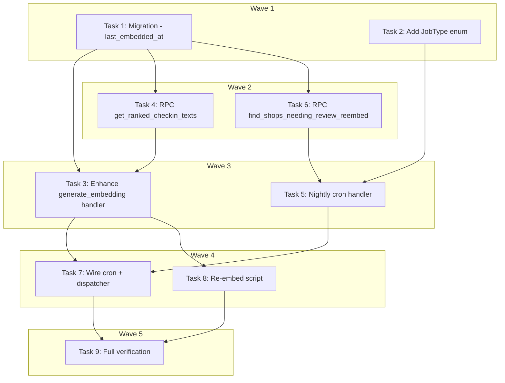

# Check-in Review Embedding Implementation Plan

> **For Claude:** REQUIRED SUB-SKILL: Use executing-plans to implement this plan task-by-task.

**Design Doc:** [docs/designs/2026-03-24-checkin-review-embedding-design.md](../designs/2026-03-24-checkin-review-embedding-design.md)

**Spec References:** [SPEC.md §3 Architecture Overview — Semantic Search](../../SPEC.md), [SPEC.md §9 Business Rules — Check-ins](../../SPEC.md)

**PRD References:** [PRD.md — Core Features: Semantic Search](../../PRD.md)

**Goal:** Enrich shop embedding vectors with community check-in text (notes + reviews) so searches surface shops praised by real visitors.

**Architecture:** The `handle_generate_embedding()` handler is extended to fetch the top 20 ranked check-in texts (by likes → text quality → recency) and append them to the embedding text. A nightly cron job identifies shops needing re-embedding via a new `last_embedded_at` column, and a one-time script handles the initial rollout.

**Tech Stack:** Python 3.12+, Supabase (Postgres + pgvector), OpenAI text-embedding-3-small, APScheduler, pytest

**Acceptance Criteria:**
- [ ] A shop with check-in reviews mentioning "超好喝的拿鐵" ranks higher for latte queries than before
- [ ] Only check-in texts ≥15 chars are included — short noise ("👍", "nice") is excluded
- [ ] The nightly cron job re-embeds exactly the shops that received new check-in text since last embedding
- [ ] Live shops remain visible in search throughout re-embedding (no status transitions)
- [ ] Running the re-embed script on existing shops is idempotent

---

### Task 1: Database Migration — `shops.last_embedded_at`

**Files:**
- Create: `supabase/migrations/20260325000001_add_last_embedded_at.sql`

No test needed — pure DDL migration.

**Step 1: Write the migration**

```sql
-- 20260325000001_add_last_embedded_at.sql
-- Track when each shop's embedding was last generated, so the nightly cron
-- can identify shops needing re-embedding after new check-in text arrives.
ALTER TABLE shops ADD COLUMN last_embedded_at TIMESTAMPTZ;

-- Backfill: shops with an embedding have already been embedded "now"
UPDATE shops SET last_embedded_at = now() WHERE embedding IS NOT NULL;

-- Index for the nightly cron query: find shops where check_ins.created_at > last_embedded_at
CREATE INDEX idx_shops_last_embedded_at ON shops (last_embedded_at)
  WHERE last_embedded_at IS NOT NULL;
```

**Step 2: Verify migration applies cleanly**

Run from worktree root:
```bash
supabase db diff
supabase db push
```
Expected: migration applies without errors.

**Step 3: Commit**

```bash
git add supabase/migrations/20260325000001_add_last_embedded_at.sql
git commit -m "feat(db): add shops.last_embedded_at for nightly review re-embedding (DEV-7)"
```

---

### Task 2: Add `REEMBED_REVIEWED_SHOPS` Job Type

**Files:**
- Modify: `backend/models/types.py:387-396` (JobType enum)

No test needed — enum value addition only.

**Step 1: Add enum value**

In `backend/models/types.py`, add to the `JobType` enum:

```python
class JobType(StrEnum):
    ENRICH_SHOP = "enrich_shop"
    ENRICH_MENU_PHOTO = "enrich_menu_photo"
    GENERATE_EMBEDDING = "generate_embedding"
    REEMBED_REVIEWED_SHOPS = "reembed_reviewed_shops"  # NEW
    STALENESS_SWEEP = "staleness_sweep"
    WEEKLY_EMAIL = "weekly_email"
    SCRAPE_SHOP = "scrape_shop"
    SCRAPE_BATCH = "scrape_batch"
    PUBLISH_SHOP = "publish_shop"
    ADMIN_DIGEST_EMAIL = "admin_digest_email"
```

**Step 2: Commit**

```bash
git add backend/models/types.py
git commit -m "feat: add REEMBED_REVIEWED_SHOPS job type (DEV-7)"
```

---

### Task 3: Enhance `handle_generate_embedding()` — Fetch & Append Community Texts

**Files:**
- Test: `backend/tests/workers/test_handlers.py` (extend `TestGenerateEmbeddingHandler`)
- Modify: `backend/workers/handlers/generate_embedding.py`

**Step 1: Write the failing tests**

Add these test methods to the existing `TestGenerateEmbeddingHandler` class in `backend/tests/workers/test_handlers.py`. The existing `_make_db` helper returns mocks for `shops` and `shop_menu_items` tables — extend it to also handle `check_ins` and `community_note_likes` tables.

First, replace the existing `_make_db` helper with a version that supports the new tables:

```python
def _make_db(
    self,
    shop_data: dict,
    menu_items: list[dict],
    checkin_texts: list[dict] | None = None,
    like_counts: list[dict] | None = None,
) -> tuple[MagicMock, MagicMock, MagicMock]:
    """Return (db, shop_table_mock, menu_table_mock) with correct call chains.

    checkin_texts: rows returned by the check_ins query (each has 'review_text', 'note', 'created_at')
    like_counts:   rows returned by the community_note_likes aggregation
    """
    db = MagicMock()

    shop_table = MagicMock()
    shop_table.select.return_value.eq.return_value.single.return_value.execute.return_value = (
        MagicMock(data=shop_data)
    )
    shop_table.update.return_value.eq.return_value.execute.return_value = MagicMock(data=[])

    menu_table = MagicMock()
    menu_table.select.return_value.eq.return_value.execute.return_value = MagicMock(
        data=menu_items
    )

    # For community text: use RPC to encapsulate the ranked query
    db.rpc.return_value.execute.return_value = MagicMock(
        data=checkin_texts if checkin_texts is not None else []
    )

    def table_side_effect(name: str):
        return menu_table if name == "shop_menu_items" else shop_table

    db.table.side_effect = table_side_effect
    return db, shop_table, menu_table
```

Then add these test methods:

```python
async def test_includes_community_texts_in_embedding_when_available(self):
    """When a shop has check-in reviews, they appear after ' || ' in the embedding text."""
    db, _, _ = self._make_db(
        shop_data={
            "name": "山小孩咖啡",
            "description": "安靜適合工作的獨立咖啡店",
            "processing_status": "live",
        },
        menu_items=[{"item_name": "手沖拿鐵"}],
        checkin_texts=[
            {"text": "超好喝的拿鐵，環境安靜適合工作"},
            {"text": "巴斯克蛋糕是必點的，每次來都會點"},
        ],
    )
    embeddings = AsyncMock()
    embeddings.embed = AsyncMock(return_value=[0.1] * 1536)
    queue = AsyncMock()

    await handle_generate_embedding(
        payload={"shop_id": "shop-d4e5f6"},
        db=db,
        embeddings=embeddings,
        queue=queue,
    )

    embed_text = embeddings.embed.call_args[0][0]
    assert "超好喝的拿鐵" in embed_text
    assert "巴斯克蛋糕是必點的" in embed_text
    assert " || " in embed_text
    # Menu items still present with single pipe
    assert " | 手沖拿鐵" in embed_text

async def test_embedding_skips_community_section_when_no_qualifying_texts(self):
    """When no check-in texts qualify (all too short or none exist), no ' || ' in embedding."""
    db, _, _ = self._make_db(
        shop_data={
            "name": "山小孩咖啡",
            "description": "安靜適合工作的獨立咖啡店",
            "processing_status": "live",
        },
        menu_items=[{"item_name": "手沖拿鐵"}],
        checkin_texts=[],  # No qualifying texts
    )
    embeddings = AsyncMock()
    embeddings.embed = AsyncMock(return_value=[0.1] * 1536)
    queue = AsyncMock()

    await handle_generate_embedding(
        payload={"shop_id": "shop-d4e5f6"},
        db=db,
        embeddings=embeddings,
        queue=queue,
    )

    embed_text = embeddings.embed.call_args[0][0]
    assert " || " not in embed_text
    # Menu items still work
    assert " | 手沖拿鐵" in embed_text

async def test_updates_last_embedded_at_after_successful_embedding(self):
    """After generating an embedding, last_embedded_at is set on the shop row."""
    db, shop_table, _ = self._make_db(
        shop_data={
            "name": "山小孩咖啡",
            "description": "安靜適合工作的獨立咖啡店",
            "processing_status": "live",
        },
        menu_items=[],
        checkin_texts=[],
    )
    embeddings = AsyncMock()
    embeddings.embed = AsyncMock(return_value=[0.1] * 1536)
    queue = AsyncMock()

    await handle_generate_embedding(
        payload={"shop_id": "shop-d4e5f6"},
        db=db,
        embeddings=embeddings,
        queue=queue,
    )

    update_data = shop_table.update.call_args[0][0]
    assert "last_embedded_at" in update_data
```

**Step 2: Run tests to verify they fail**

```bash
cd backend && python -m pytest tests/workers/test_handlers.py::TestGenerateEmbeddingHandler -v
```
Expected: 3 new tests FAIL (no `rpc` call in handler, no `||` in text, no `last_embedded_at` in update).

**Step 3: Implement the handler changes**

Modify `backend/workers/handlers/generate_embedding.py`:

```python
from datetime import UTC, datetime
from typing import Any, cast

import structlog
from supabase import Client

from models.types import JobType
from providers.embeddings.interface import EmbeddingsProvider
from workers.queue import JobQueue

logger = structlog.get_logger()

# Minimum character length for a check-in text to be included in embedding
_MIN_TEXT_LENGTH = 15
# Maximum number of community texts to include per shop
_MAX_COMMUNITY_TEXTS = 20


async def handle_generate_embedding(
    payload: dict[str, Any],
    db: Client,
    embeddings: EmbeddingsProvider,
    queue: JobQueue,
) -> None:
    """Generate vector embedding for a shop, enriched with menu items and community texts.

    Safe for re-embedding already-live shops: when processing_status is 'live',
    only the embedding column is updated — no status transition, no PUBLISH_SHOP job.
    This prevents live shops from temporarily disappearing from search during re-embedding.
    """
    shop_id = payload["shop_id"]
    logger.info("Generating embedding", shop_id=shop_id)

    # Load shop data including processing_status for the live-shop guard
    response = (
        db.table("shops")
        .select("name, description, processing_status")
        .eq("id", shop_id)
        .single()
        .execute()
    )
    shop = cast("dict[str, Any]", response.data)
    if not shop:
        logger.error("Shop not found — skipping embedding", shop_id=shop_id)
        return

    # Load menu items if available
    menu_response = db.table("shop_menu_items").select("item_name").eq("shop_id", shop_id).execute()
    menu_rows = cast("list[dict[str, Any]]", menu_response.data or [])
    item_names = [row["item_name"] for row in menu_rows if row.get("item_name")]

    # Load community check-in texts (ranked by likes, text quality, recency)
    community_response = db.rpc(
        "get_ranked_checkin_texts",
        {"p_shop_id": shop_id, "p_min_length": _MIN_TEXT_LENGTH, "p_limit": _MAX_COMMUNITY_TEXTS},
    ).execute()
    community_rows = cast("list[dict[str, Any]]", community_response.data or [])
    community_texts = [row["text"] for row in community_rows if row.get("text")]

    # Build embedding text: base | menu items || community texts
    base_text = f"{shop['name']}. {shop.get('description') or ''}"
    text = f"{base_text} | {', '.join(item_names)}" if item_names else base_text
    if community_texts:
        text = f"{text} || {'. '.join(community_texts)}"

    # Generate embedding
    embedding = await embeddings.embed(text)

    # Live-shop guard: use an allowlist of statuses that should advance through the pipeline.
    should_advance = shop.get("processing_status") in {"embedding", "enriched"}

    update_data: dict[str, Any] = {
        "embedding": embedding,
        "last_embedded_at": datetime.now(UTC).isoformat(),
    }
    if should_advance:
        update_data["processing_status"] = "publishing"

    db.table("shops").update(update_data).eq("id", shop_id).execute()

    logger.info(
        "Embedding generated",
        shop_id=shop_id,
        dimensions=len(embedding),
        menu_items=len(item_names),
        community_texts=len(community_texts),
        should_advance=should_advance,
    )

    if should_advance:
        publish_payload: dict[str, Any] = {"shop_id": shop_id}
        for key in ("submission_id", "submitted_by", "batch_id"):
            if payload.get(key):
                publish_payload[key] = payload[key]

        await queue.enqueue(
            job_type=JobType.PUBLISH_SHOP,
            payload=publish_payload,
            priority=5,
        )
```

**Step 4: Run tests to verify they pass**

```bash
cd backend && python -m pytest tests/workers/test_handlers.py::TestGenerateEmbeddingHandler -v
```
Expected: ALL tests pass (existing + 3 new).

**Step 5: Commit**

```bash
git add backend/workers/handlers/generate_embedding.py backend/tests/workers/test_handlers.py
git commit -m "feat: include community check-in texts in shop embeddings (DEV-7)"
```

---

### Task 4: Database RPC — `get_ranked_checkin_texts`

**Files:**
- Create: `supabase/migrations/20260325000002_create_get_ranked_checkin_texts_rpc.sql`

No test needed — SQL function tested via integration tests in Task 3 (handler mocks the RPC) and manually in Task 7.

**Step 1: Write the migration**

```sql
-- 20260325000002_create_get_ranked_checkin_texts_rpc.sql
-- Returns the top N check-in texts for a shop, ranked by:
--   1. Like count (most liked first)
--   2. Text quality (≥100 chars prioritized)
--   3. Recency (newest first)
-- Minimum text length filter eliminates noise.
CREATE OR REPLACE FUNCTION get_ranked_checkin_texts(
  p_shop_id UUID,
  p_min_length INT DEFAULT 15,
  p_limit INT DEFAULT 20
)
RETURNS TABLE (text TEXT) AS $$
  SELECT
    TRIM(COALESCE(c.review_text, '') || ' ' || COALESCE(c.note, '')) AS text
  FROM check_ins c
  LEFT JOIN (
    SELECT checkin_id, COUNT(*) AS like_count
    FROM community_note_likes
    GROUP BY checkin_id
  ) l ON l.checkin_id = c.id
  WHERE c.shop_id = p_shop_id
    AND (
      LENGTH(COALESCE(c.note, '')) >= p_min_length
      OR LENGTH(COALESCE(c.review_text, '')) >= p_min_length
    )
  ORDER BY
    l.like_count DESC NULLS LAST,
    CASE
      WHEN LENGTH(COALESCE(c.review_text, '') || COALESCE(c.note, '')) >= 100 THEN 0
      ELSE 1
    END,
    c.created_at DESC
  LIMIT p_limit;
$$ LANGUAGE sql STABLE;
```

**Step 2: Apply migration**

```bash
supabase db diff
supabase db push
```
Expected: clean apply.

**Step 3: Commit**

```bash
git add supabase/migrations/20260325000002_create_get_ranked_checkin_texts_rpc.sql
git commit -m "feat(db): add get_ranked_checkin_texts RPC for embedding handler (DEV-7)"
```

---

### Task 5: Nightly Cron Handler — `handle_reembed_reviewed_shops`

**Files:**
- Test: `backend/tests/workers/test_reembed_reviewed_shops.py` (new file)
- Create: `backend/workers/handlers/reembed_reviewed_shops.py`

**Step 1: Write the failing tests**

Create `backend/tests/workers/test_reembed_reviewed_shops.py`:

```python
from unittest.mock import AsyncMock, MagicMock

from workers.handlers.reembed_reviewed_shops import handle_reembed_reviewed_shops


class TestReembedReviewedShops:
    async def test_enqueues_embedding_jobs_for_shops_with_new_checkins(self):
        """Given shops with check-ins newer than their last embedding, re-embed jobs are enqueued."""
        db = MagicMock()
        queue = AsyncMock()

        # RPC returns shops needing re-embedding
        db.rpc.return_value.execute.return_value = MagicMock(
            data=[
                {"id": "shop-001"},
                {"id": "shop-002"},
            ]
        )

        await handle_reembed_reviewed_shops(db=db, queue=queue)

        queue.enqueue_batch.assert_called_once()
        payloads = queue.enqueue_batch.call_args.kwargs["payloads"]
        assert len(payloads) == 2
        assert payloads[0] == {"shop_id": "shop-001"}
        assert payloads[1] == {"shop_id": "shop-002"}

    async def test_skips_when_no_shops_need_reembedding(self):
        """When no shops have new check-in text, no jobs are enqueued."""
        db = MagicMock()
        queue = AsyncMock()

        db.rpc.return_value.execute.return_value = MagicMock(data=[])

        await handle_reembed_reviewed_shops(db=db, queue=queue)

        queue.enqueue_batch.assert_not_called()

    async def test_calls_rpc_with_correct_min_length(self):
        """The RPC is called with the minimum text length filter (15 chars)."""
        db = MagicMock()
        queue = AsyncMock()
        db.rpc.return_value.execute.return_value = MagicMock(data=[])

        await handle_reembed_reviewed_shops(db=db, queue=queue)

        db.rpc.assert_called_once()
        rpc_name, rpc_params = db.rpc.call_args[0]
        assert rpc_name == "find_shops_needing_review_reembed"
        assert rpc_params["p_min_text_length"] == 15
```

**Step 2: Run tests to verify they fail**

```bash
cd backend && python -m pytest tests/workers/test_reembed_reviewed_shops.py -v
```
Expected: FAIL — module not found.

**Step 3: Implement the handler**

Create `backend/workers/handlers/reembed_reviewed_shops.py`:

```python
from typing import Any, cast

import structlog
from supabase import Client

from models.types import JobType
from workers.queue import JobQueue

logger = structlog.get_logger()

_MIN_TEXT_LENGTH = 15


async def handle_reembed_reviewed_shops(db: Client, queue: JobQueue) -> None:
    """Find shops with new check-in text since their last embedding and enqueue re-embed jobs.

    Called nightly by the scheduler. Uses an RPC to efficiently find shops where
    check_ins.created_at > shops.last_embedded_at and the check-in has qualifying text.
    """
    response = db.rpc(
        "find_shops_needing_review_reembed",
        {"p_min_text_length": _MIN_TEXT_LENGTH},
    ).execute()

    shop_rows = cast("list[dict[str, Any]]", response.data or [])
    if not shop_rows:
        logger.info("No shops need review re-embedding")
        return

    shop_ids = [row["id"] for row in shop_rows]
    logger.info("Re-embedding shops with new check-in text", count=len(shop_ids))

    await queue.enqueue_batch(
        job_type=JobType.GENERATE_EMBEDDING,
        payloads=[{"shop_id": sid} for sid in shop_ids],
        priority=2,  # lower than user-triggered work
    )

    logger.info("Enqueued review re-embed jobs", count=len(shop_ids))
```

**Step 4: Run tests to verify they pass**

```bash
cd backend && python -m pytest tests/workers/test_reembed_reviewed_shops.py -v
```
Expected: ALL 3 tests PASS.

**Step 5: Commit**

```bash
git add backend/workers/handlers/reembed_reviewed_shops.py backend/tests/workers/test_reembed_reviewed_shops.py
git commit -m "feat: add nightly handler to find & re-embed shops with new review text (DEV-7)"
```

---

### Task 6: Database RPC — `find_shops_needing_review_reembed`

**Files:**
- Create: `supabase/migrations/20260325000003_create_find_shops_needing_review_reembed_rpc.sql`

No test needed — SQL function, tested via handler integration.

**Step 1: Write the migration**

```sql
-- 20260325000003_create_find_shops_needing_review_reembed_rpc.sql
-- Find live shops that have check-in text added after their last embedding.
-- Used by the nightly REEMBED_REVIEWED_SHOPS cron job.
CREATE OR REPLACE FUNCTION find_shops_needing_review_reembed(
  p_min_text_length INT DEFAULT 15
)
RETURNS TABLE (id UUID) AS $$
  SELECT DISTINCT s.id
  FROM shops s
  INNER JOIN check_ins c ON c.shop_id = s.id
  WHERE s.processing_status = 'live'
    AND s.embedding IS NOT NULL
    AND (
      s.last_embedded_at IS NULL
      OR c.created_at > s.last_embedded_at
    )
    AND (
      LENGTH(COALESCE(c.note, '')) >= p_min_text_length
      OR LENGTH(COALESCE(c.review_text, '')) >= p_min_text_length
    );
$$ LANGUAGE sql STABLE;
```

**Step 2: Apply migration**

```bash
supabase db diff
supabase db push
```

**Step 3: Commit**

```bash
git add supabase/migrations/20260325000003_create_find_shops_needing_review_reembed_rpc.sql
git commit -m "feat(db): add find_shops_needing_review_reembed RPC for nightly cron (DEV-7)"
```

---

### Task 7: Wire Cron Job + Dispatcher

**Files:**
- Modify: `backend/workers/scheduler.py:17,190-200,202-235`
- Test: `backend/tests/workers/test_scheduler.py` (verify cron is registered)

**Step 1: Write the failing test**

Add to `backend/tests/workers/test_scheduler.py` (read the file first to determine the right class/location):

```python
def test_reembed_reviewed_shops_cron_is_registered(self):
    """The nightly review re-embedding cron job is registered at 03:00."""
    scheduler = create_scheduler()
    job = scheduler.get_job("reembed_reviewed_shops")
    assert job is not None
```

**Step 2: Run test to verify it fails**

```bash
cd backend && python -m pytest tests/workers/test_scheduler.py -k "reembed_reviewed" -v
```
Expected: FAIL — job not found.

**Step 3: Implement scheduler + dispatcher wiring**

In `backend/workers/scheduler.py`:

Add import:
```python
from workers.handlers.reembed_reviewed_shops import handle_reembed_reviewed_shops
```

Add the cron trigger function (after `run_weekly_email`):
```python
async def run_reembed_reviewed_shops() -> None:
    db = get_service_role_client()
    queue = JobQueue(db=db)
    await handle_reembed_reviewed_shops(db=db, queue=queue)
```

Add the cron job in `create_scheduler()` (after the `delete_expired_accounts` job):
```python
scheduler.add_job(
    run_reembed_reviewed_shops,
    "cron",
    hour=3,
    minute=30,  # offset from staleness_sweep at 03:00
    id="reembed_reviewed_shops",
)
```

Also add the dispatcher case in `_dispatch_job()` for the new job type:
```python
case JobType.REEMBED_REVIEWED_SHOPS:
    await handle_reembed_reviewed_shops(db=db, queue=queue)
```

**Step 4: Run tests to verify they pass**

```bash
cd backend && python -m pytest tests/workers/test_scheduler.py -v
```
Expected: ALL tests pass including the new one.

**Step 5: Commit**

```bash
git add backend/workers/scheduler.py backend/tests/workers/test_scheduler.py
git commit -m "feat: wire nightly review re-embedding cron at 03:30 (DEV-7)"
```

---

### Task 8: Re-embed Script for Initial Rollout

**Files:**
- Create: `backend/scripts/reembed_reviewed_shops.py`
- Test: `backend/tests/scripts/test_reembed_reviewed_shops.py`

**Step 1: Write the failing test**

Create `backend/tests/scripts/test_reembed_reviewed_shops.py`:

```python
from unittest.mock import AsyncMock, MagicMock

import pytest

from scripts.reembed_reviewed_shops import main


class TestReembedReviewedShopsScript:
    async def test_enqueues_jobs_for_shops_with_checkin_text(self):
        """Script enqueues GENERATE_EMBEDDING for all live shops with qualifying check-in text."""
        db = MagicMock()
        queue = AsyncMock()

        # Mock: find shops with qualifying check-in text
        db.rpc.return_value.execute.return_value = MagicMock(
            data=[
                {"id": "shop-001", "name": "山小孩咖啡"},
                {"id": "shop-002", "name": "虎記商行"},
            ]
        )
        # Mock: no pending jobs
        db.table.return_value.select.return_value.eq.return_value.eq.return_value.execute.return_value = MagicMock(
            data=[]
        )

        await main(dry_run=False, db=db, queue=queue)

        queue.enqueue_batch.assert_called_once()
        payloads = queue.enqueue_batch.call_args.kwargs["payloads"]
        assert len(payloads) == 2

    async def test_dry_run_does_not_enqueue(self):
        """In dry-run mode, shops are listed but no jobs are enqueued."""
        db = MagicMock()
        queue = AsyncMock()

        db.rpc.return_value.execute.return_value = MagicMock(
            data=[{"id": "shop-001", "name": "山小孩咖啡"}]
        )

        await main(dry_run=True, db=db, queue=queue)

        queue.enqueue_batch.assert_not_called()

    async def test_deduplicates_against_pending_jobs(self):
        """Shops that already have a pending GENERATE_EMBEDDING job are skipped."""
        db = MagicMock()
        queue = AsyncMock()

        db.rpc.return_value.execute.return_value = MagicMock(
            data=[
                {"id": "shop-001", "name": "山小孩咖啡"},
                {"id": "shop-002", "name": "虎記商行"},
            ]
        )
        # shop-001 already has a pending job
        db.table.return_value.select.return_value.eq.return_value.eq.return_value.execute.return_value = MagicMock(
            data=[{"payload": {"shop_id": "shop-001"}}]
        )

        await main(dry_run=False, db=db, queue=queue)

        payloads = queue.enqueue_batch.call_args.kwargs["payloads"]
        assert len(payloads) == 1
        assert payloads[0]["shop_id"] == "shop-002"
```

**Step 2: Run tests to verify they fail**

```bash
cd backend && python -m pytest tests/scripts/test_reembed_reviewed_shops.py -v
```
Expected: FAIL — module not found.

**Step 3: Implement the script**

Create `backend/scripts/reembed_reviewed_shops.py`:

```python
"""Enqueue GENERATE_EMBEDDING jobs for all live shops with qualifying check-in text.

Run after deploying the check-in review embedding changes to rebuild
embeddings with community text included.

Usage (run from backend/):
    uv run python scripts/reembed_reviewed_shops.py [--dry-run]

Cost: ~$0.01 (OpenAI text-embedding-3-small, ~1300 tokens × N shops)
"""

import asyncio
import sys
from pathlib import Path
from typing import Any, cast

sys.path.insert(0, str(Path(__file__).parent.parent))

from db.supabase_client import get_service_role_client
from models.types import JobStatus, JobType
from workers.queue import JobQueue

_MIN_TEXT_LENGTH = 15


async def main(
    dry_run: bool,
    db: Any | None = None,
    queue: JobQueue | None = None,
) -> None:
    """Main entrypoint. Accept optional db/queue for testability."""
    print("\n=== Re-embed shops with community check-in text ===\n")

    if db is None:
        db = get_service_role_client()

    # Find live shops with qualifying check-in text
    response = db.rpc(
        "find_shops_with_checkin_text",
        {"p_min_text_length": _MIN_TEXT_LENGTH},
    ).execute()
    rows = cast("list[dict[str, Any]]", response.data or [])

    if not rows:
        print("No shops with qualifying check-in text found. Nothing to do.")
        return

    print(f"Found {len(rows)} shops with check-in text.\n")

    if dry_run:
        for r in rows:
            print(f"  {r['name']}")
        print("\nDry-run — no jobs enqueued.")
        return

    # Deduplicate against pending jobs
    existing = (
        db.table("job_queue")
        .select("payload")
        .eq("job_type", JobType.GENERATE_EMBEDDING.value)
        .eq("status", JobStatus.PENDING.value)
        .execute()
        .data
        or []
    )
    already_queued = {row["payload"].get("shop_id") for row in existing}
    to_enqueue = [r for r in rows if r["id"] not in already_queued]

    if len(to_enqueue) < len(rows):
        skipped = len(rows) - len(to_enqueue)
        print(f"Skipped {skipped} shop(s) — GENERATE_EMBEDDING job already pending.")

    if not to_enqueue:
        print("All shops already have pending jobs. Nothing to enqueue.")
        return

    _queue = queue or JobQueue(db)
    await _queue.enqueue_batch(
        job_type=JobType.GENERATE_EMBEDDING,
        payloads=[{"shop_id": r["id"]} for r in to_enqueue],
        priority=3,
    )

    print(f"Enqueued {len(to_enqueue)} GENERATE_EMBEDDING jobs.")
    print("All shops remain 'live' throughout — no search downtime.")


if __name__ == "__main__":
    import argparse

    parser = argparse.ArgumentParser(description=__doc__)
    parser.add_argument("--dry-run", action="store_true", help="List shops without enqueueing")
    args = parser.parse_args()

    asyncio.run(main(dry_run=args.dry_run))
```

**Step 4: Write the supporting RPC migration**

Create `supabase/migrations/20260325000004_create_find_shops_with_checkin_text_rpc.sql`:

```sql
-- 20260325000004_create_find_shops_with_checkin_text_rpc.sql
-- Find all live shops that have any qualifying check-in text (for initial rollout script).
-- Unlike find_shops_needing_review_reembed, this ignores last_embedded_at — it finds ALL shops
-- with check-in text, not just those with NEW text.
CREATE OR REPLACE FUNCTION find_shops_with_checkin_text(
  p_min_text_length INT DEFAULT 15
)
RETURNS TABLE (id UUID, name TEXT) AS $$
  SELECT DISTINCT s.id, s.name
  FROM shops s
  INNER JOIN check_ins c ON c.shop_id = s.id
  WHERE s.processing_status = 'live'
    AND s.embedding IS NOT NULL
    AND (
      LENGTH(COALESCE(c.note, '')) >= p_min_text_length
      OR LENGTH(COALESCE(c.review_text, '')) >= p_min_text_length
    )
  ORDER BY s.name;
$$ LANGUAGE sql STABLE;
```

**Step 5: Run tests to verify they pass**

```bash
cd backend && python -m pytest tests/scripts/test_reembed_reviewed_shops.py -v
```
Expected: ALL 3 tests PASS.

**Step 6: Commit**

```bash
git add backend/scripts/reembed_reviewed_shops.py backend/tests/scripts/test_reembed_reviewed_shops.py supabase/migrations/20260325000004_create_find_shops_with_checkin_text_rpc.sql
git commit -m "feat: add re-embed script for initial check-in text rollout (DEV-7)"
```

---

### Task 9: Lint, Type-Check, Full Test Suite

**Files:** None (verification only)

No test needed — this is the verification step.

**Step 1: Run linter**

```bash
cd backend && ruff check . && ruff format --check .
```
Expected: no errors. Fix any issues.

**Step 2: Run type checker**

```bash
cd backend && mypy workers/handlers/generate_embedding.py workers/handlers/reembed_reviewed_shops.py scripts/reembed_reviewed_shops.py
```
Expected: no type errors.

**Step 3: Run full backend test suite**

```bash
cd backend && python -m pytest -v
```
Expected: ALL tests pass, no regressions.

**Step 4: Commit any fixes**

```bash
git add -A && git commit -m "chore: fix lint/type issues from DEV-7 implementation"
```
(Skip if no fixes needed.)

---

## Execution Waves



**Wave 1** (parallel — no dependencies):
- Task 1: Migration — `shops.last_embedded_at`
- Task 2: Add `REEMBED_REVIEWED_SHOPS` job type

**Wave 2** (parallel — depends on Wave 1):
- Task 4: RPC `get_ranked_checkin_texts` ← Task 1
- Task 6: RPC `find_shops_needing_review_reembed` ← Task 1

**Wave 3** (parallel — depends on Wave 2):
- Task 3: Enhance `generate_embedding` handler ← Task 4
- Task 5: Nightly cron handler ← Task 2, Task 6

**Wave 4** (parallel — depends on Wave 3):
- Task 7: Wire cron + dispatcher ← Task 3, Task 5
- Task 8: Re-embed script ← Task 3

**Wave 5** (sequential — depends on all):
- Task 9: Full verification ← all tasks
