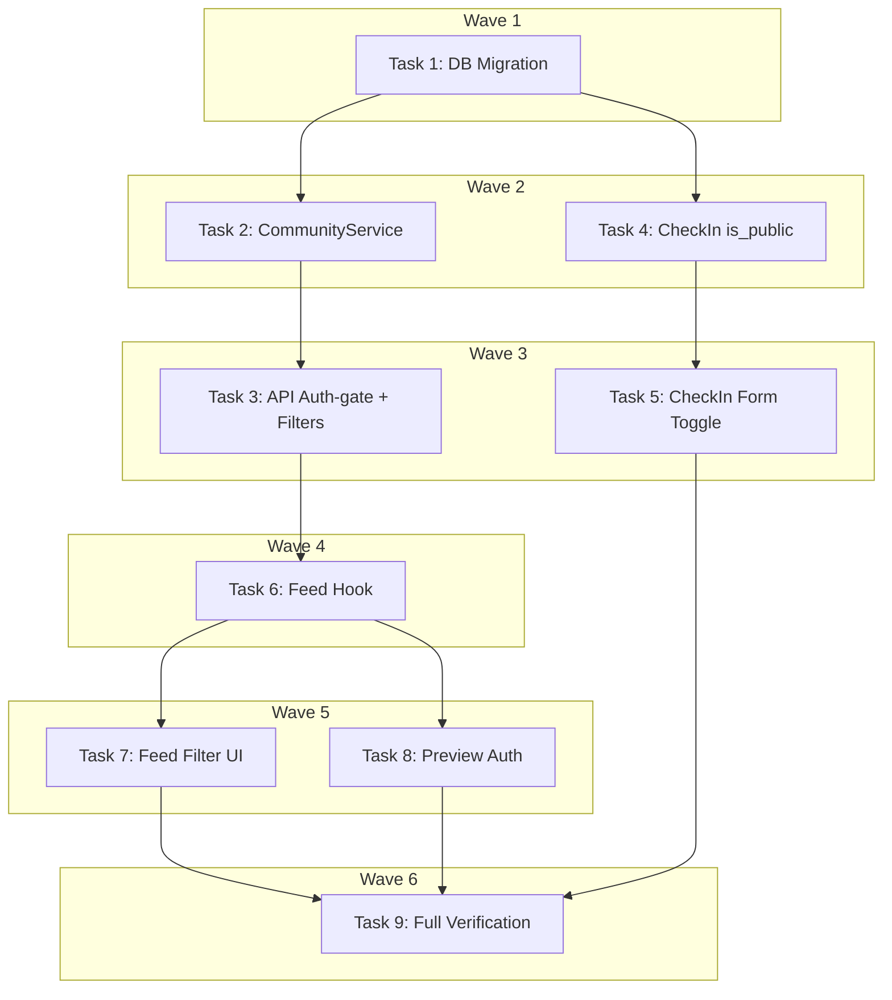

# Community Feed Implementation Plan

> **For Claude:** REQUIRED SUB-SKILL: Use executing-plans to implement this plan task-by-task.

**Design Doc:** [docs/designs/2026-03-24-community-feed-design.md](../designs/2026-03-24-community-feed-design.md)

**Spec References:** [SPEC.md#9-business-rules](../../SPEC.md) (check-in public toggle, community feed access, role hierarchy)

**PRD References:** [PRD.md#7-core-features](../../PRD.md) (community feed moved to in-scope)

**Goal:** Open the existing community feed to all authenticated users by adding `is_public` toggle on check-ins, removing the role-based visibility gate, and adding MRT station + vibe tag filters.

**Architecture:** Evolve the existing `CommunityService` in-place. Add `is_public` column to `check_ins`, change the feed query from `user_roles!inner(role)` (INNER join gating) to `is_public = true` filter with LEFT join on `user_roles` (badge display only). Auth-gate feed endpoints with `Depends(get_current_user)`. Add optional filter params for MRT station and vibe tag.

**Tech Stack:** FastAPI, Supabase (Postgres + RLS), Next.js (App Router), Tailwind CSS, shadcn/ui, Vitest

**Note on district vs MRT:** The design doc mentions "district" filters, but the `shops` table has no `district` column. It has `mrt` (MRT station name) which is a better location filter for Taipei users. This plan uses `mrt` instead of `district`.

**Acceptance Criteria:**

- [ ] An authenticated user can browse a feed of public check-ins from all users, not just role-holders
- [ ] A user can toggle "Share publicly" when creating a check-in, defaulting to public
- [ ] An authenticated user can filter the community feed by MRT station and/or vibe tag
- [ ] An unauthenticated visitor gets a 401 when attempting to access the community feed
- [ ] Existing check-ins are backfilled as `is_public = true`

---

### Task 1: Database Migration — add `is_public` to `check_ins`

**Files:**

- Create: `supabase/migrations/20260324000001_add_is_public_to_check_ins.sql`

No test needed — SQL migration verified by applying to local Supabase.

**Step 1: Write the migration**

```sql
-- Add is_public flag to check_ins for community feed visibility
ALTER TABLE check_ins ADD COLUMN is_public BOOLEAN NOT NULL DEFAULT true;

-- Backfill: all existing check-ins become public
-- (The DEFAULT true handles this for rows inserted after the migration,
--  but existing rows with NOT NULL + DEFAULT are set immediately by Postgres.)

-- Partial index for feed queries — only indexes public check-ins
CREATE INDEX idx_check_ins_public_feed
  ON check_ins(created_at DESC)
  WHERE is_public = true;

-- RLS: any authenticated user can read public check-ins
-- (Existing check_ins_own_read policy still allows users to read their own private check-ins)
CREATE POLICY "check_ins_public_read" ON check_ins
  FOR SELECT USING (is_public = true AND auth.uid() IS NOT NULL);

-- RLS: allow authenticated users to read any profile (for community feed author display)
-- (Existing profiles_own_read still allows users to read their own profile)
CREATE POLICY "profiles_public_read" ON profiles
  FOR SELECT USING (auth.uid() IS NOT NULL);

-- RLS: allow reading user_roles for badge display (currently no RLS policy exists)
ALTER TABLE user_roles ENABLE ROW LEVEL SECURITY;
CREATE POLICY "user_roles_public_read" ON user_roles
  FOR SELECT USING (true);
```

**Step 2: Apply and verify migration**

Run: `cd /Users/ytchou/Project/caferoam/.worktrees/feat/community-feed && supabase db push`

Verify:

```bash
# Check column exists
supabase db diff  # should show no pending changes
```

**Step 3: Commit**

```bash
git add supabase/migrations/20260324000001_add_is_public_to_check_ins.sql
git commit -m "feat(db): add is_public column to check_ins with RLS for community feed"
```

---

### Task 2: Backend — update CommunityService to filter by `is_public`

**Files:**

- Modify: `backend/services/community_service.py` (lines 18-28, 45-55, 57-81)
- Test: `backend/tests/services/test_community_service.py`
- Modify: `backend/tests/factories.py` (add `is_public` to factory)

**Step 1: Write the failing tests**

Add to `backend/tests/services/test_community_service.py`:

```python
class TestCommunityServiceIsPublicFiltering:
    """Community feed only shows check-ins where is_public is true."""

    def test_feed_excludes_private_checkins(self):
        """Given a mix of public and private check-ins, the feed returns only public ones."""
        public_row = make_community_note_row(checkin_id="ci-public", is_public=True)
        # Private rows are filtered at DB level, so mock only returns public
        db = _make_db_mock(note_rows=[public_row])
        service = CommunityService(db)

        result = service.get_feed(cursor=None, limit=10)

        assert len(result.notes) == 1
        assert result.notes[0].checkin_id == "ci-public"

    def test_preview_excludes_private_checkins(self):
        """The explore page preview only surfaces public check-ins."""
        public_row = make_community_note_row(checkin_id="ci-public", is_public=True)
        db = _make_db_mock(note_rows=[public_row])
        service = CommunityService(db)

        result = service.get_preview(limit=3)

        assert len(result) == 1
        assert result[0].checkin_id == "ci-public"


class TestCommunityServiceFeedFilters:
    """Community feed supports filtering by MRT station and vibe tag."""

    def test_feed_with_mrt_filter(self):
        """When filtered by MRT, only matching check-ins appear."""
        rows = [make_community_note_row(checkin_id="ci-1")]
        db = _make_db_mock(note_rows=rows)
        service = CommunityService(db)

        result = service.get_feed(cursor=None, limit=10, mrt="中山")

        assert len(result.notes) == 1
        # Verify the mrt filter was applied to the query
        db.eq.assert_any_call("shops.mrt", "中山")

    def test_feed_with_vibe_tag_filter(self):
        """When filtered by vibe tag, only matching check-ins appear."""
        rows = [make_community_note_row(checkin_id="ci-1")]
        db = _make_db_mock(note_rows=rows)
        service = CommunityService(db)

        result = service.get_feed(cursor=None, limit=10, vibe_tag="quiet_reading")

        assert len(result.notes) == 1

    def test_feed_with_no_filters_returns_all_public(self):
        """Without filters, all public check-ins appear."""
        rows = [make_community_note_row(checkin_id=f"ci-{i}") for i in range(3)]
        db = _make_db_mock(note_rows=rows)
        service = CommunityService(db)

        result = service.get_feed(cursor=None, limit=10)

        assert len(result.notes) == 3
```

Update `backend/tests/factories.py` — add `is_public` to `make_community_note_row`:

```python
def make_community_note_row(**overrides: object) -> dict:
    # ... existing fields ...
    is_public = overrides.pop("is_public", True)
    # ... add to defaults dict:
    # "is_public": is_public,
```

**Step 2: Run tests to verify they fail**

Run: `cd /Users/ytchou/Project/caferoam/.worktrees/feat/community-feed/backend && pytest tests/services/test_community_service.py -v -k "is_public or filter"`
Expected: FAIL — new test classes not found / `mrt` param not accepted

**Step 3: Implement the changes**

Modify `backend/services/community_service.py`:

1. Change `_NOTE_SELECT` — replace `user_roles!inner(role)` with `user_roles(role)` (LEFT join instead of INNER):

```python
_NOTE_SELECT = (
    "id,"
    "is_public,"
    "review_text,"
    "stars,"
    "photo_urls,"
    "created_at,"
    "profiles!check_ins_user_id_fkey(display_name, avatar_url),"
    "shops!check_ins_shop_id_fkey(name, slug, mrt),"
    "user_roles(role),"
    "community_note_likes(count)"
)
```

2. Update `get_preview()` — add `is_public` filter:

```python
def get_preview(self, limit: int = 3) -> list[CommunityNoteCard]:
    response = (
        self._db.table("check_ins")
        .select(_NOTE_SELECT)
        .eq("is_public", True)
        .not_.is_("review_text", "null")
        .order("created_at", desc=True)
        .limit(limit)
        .execute()
    )
    rows = cast("list[dict[str, Any]]", response.data or [])
    return [self._row_to_card(row) for row in rows]
```

3. Update `get_feed()` — add `is_public` filter and optional `mrt`/`vibe_tag` params:

```python
def get_feed(
    self,
    cursor: str | None,
    limit: int = 10,
    mrt: str | None = None,
    vibe_tag: str | None = None,
) -> CommunityFeedResponse:
    query = (
        self._db.table("check_ins")
        .select(_NOTE_SELECT)
        .eq("is_public", True)
        .not_.is_("review_text", "null")
        .order("created_at", desc=True)
        .limit(limit + 1)
    )
    if cursor:
        query = query.lt("created_at", cursor)
    if mrt:
        query = query.eq("shops.mrt", mrt)
    if vibe_tag:
        query = query.contains("shops.shop_tags.tag_id", [vibe_tag])

    response = query.execute()
    rows = cast("list[dict[str, Any]]", response.data or [])

    has_more = len(rows) > limit
    page_rows = rows[:limit]

    next_cursor: str | None = None
    if has_more and page_rows:
        next_cursor = page_rows[-1]["created_at"]

    return CommunityFeedResponse(
        notes=[self._row_to_card(row) for row in page_rows],
        next_cursor=next_cursor,
    )
```

4. Update `_row_to_card()` — change `district` references to `mrt`:

```python
shop_mrt: str | None = shop.get("mrt")
# ... in the CommunityNoteCard constructor:
shop_district=shop_mrt,  # mrt used as location identifier
```

**Step 4: Run tests to verify they pass**

Run: `cd /Users/ytchou/Project/caferoam/.worktrees/feat/community-feed/backend && pytest tests/services/test_community_service.py -v`
Expected: ALL PASS

**Step 5: Commit**

```bash
git add backend/services/community_service.py backend/tests/services/test_community_service.py backend/tests/factories.py
git commit -m "feat(community): filter feed by is_public, add mrt/vibe_tag filter params"
```

---

### Task 3: Backend — auth-gate community feed endpoints and add filter params

**Files:**

- Modify: `backend/api/explore.py` (lines 56-73)
- Test: `backend/tests/api/test_community_api.py`

**Step 1: Write the failing tests**

Add to `backend/tests/api/test_community_api.py`:

```python
class TestCommunityFeedAuthGate:
    """Community feed requires authentication."""

    def test_feed_returns_401_when_not_authenticated(self):
        response = client.get("/explore/community")
        assert response.status_code == 401

    def test_preview_returns_401_when_not_authenticated(self):
        response = client.get("/explore/community/preview")
        assert response.status_code == 401


class TestCommunityFeedFilters:
    """Community feed accepts filter query params."""

    def test_passes_mrt_filter_to_service(self):
        app.dependency_overrides[get_current_user] = lambda: {
            "id": "user-a1b2c3",
            "email": "mei@example.com",
        }
        app.dependency_overrides[get_user_db] = lambda: MagicMock()
        try:
            feed = CommunityFeedResponse(notes=[], next_cursor=None)
            with patch("api.explore.CommunityService") as mock_cls:
                mock_cls.return_value.get_feed.return_value = feed
                client.get("/explore/community?mrt=中山")
                mock_cls.return_value.get_feed.assert_called_once_with(
                    cursor=None, limit=10, mrt="中山", vibe_tag=None,
                )
        finally:
            app.dependency_overrides.pop(get_current_user, None)
            app.dependency_overrides.pop(get_user_db, None)

    def test_passes_vibe_tag_filter_to_service(self):
        app.dependency_overrides[get_current_user] = lambda: {
            "id": "user-a1b2c3",
            "email": "mei@example.com",
        }
        app.dependency_overrides[get_user_db] = lambda: MagicMock()
        try:
            feed = CommunityFeedResponse(notes=[], next_cursor=None)
            with patch("api.explore.CommunityService") as mock_cls:
                mock_cls.return_value.get_feed.return_value = feed
                client.get("/explore/community?vibe_tag=quiet_reading")
                mock_cls.return_value.get_feed.assert_called_once_with(
                    cursor=None, limit=10, mrt=None, vibe_tag="quiet_reading",
                )
        finally:
            app.dependency_overrides.pop(get_current_user, None)
            app.dependency_overrides.pop(get_user_db, None)
```

**Step 2: Run tests to verify they fail**

Run: `cd /Users/ytchou/Project/caferoam/.worktrees/feat/community-feed/backend && pytest tests/api/test_community_api.py -v -k "auth_gate or filter"`
Expected: FAIL — endpoints don't require auth, don't accept filter params

**Step 3: Implement the changes**

Modify `backend/api/explore.py`:

```python
@router.get("/community/preview")
def community_preview(
    user: dict[str, Any] = Depends(get_current_user),  # noqa: B008
    db: Client = Depends(get_user_db),  # noqa: B008
) -> list[dict[str, object]]:
    """Community preview — auth required."""
    service = CommunityService(db)
    cards = service.get_preview(limit=3)
    return [c.model_dump(by_alias=True) for c in cards]


@router.get("/community")
def community_feed(
    cursor: str | None = Query(default=None),
    limit: int = Query(default=10, ge=1, le=50),
    mrt: str | None = Query(default=None),
    vibe_tag: str | None = Query(default=None),
    user: dict[str, Any] = Depends(get_current_user),  # noqa: B008
    db: Client = Depends(get_user_db),  # noqa: B008
) -> dict[str, object]:
    """Paginated community feed — auth required."""
    service = CommunityService(db)
    result = service.get_feed(cursor=cursor, limit=limit, mrt=mrt, vibe_tag=vibe_tag)
    return result.model_dump(by_alias=True)
```

Also update existing tests in `TestCommunityPreview` and `TestCommunityFeed` to inject auth overrides (they currently expect no auth).

**Step 4: Run tests to verify they pass**

Run: `cd /Users/ytchou/Project/caferoam/.worktrees/feat/community-feed/backend && pytest tests/api/test_community_api.py -v`
Expected: ALL PASS

**Step 5: Commit**

```bash
git add backend/api/explore.py backend/tests/api/test_community_api.py
git commit -m "feat(api): auth-gate community feed, add mrt/vibe_tag filter params"
```

---

### Task 4: Backend — add `is_public` to check-in creation

**Files:**

- Modify: `backend/api/checkins.py` (lines 14-21, 44-65)
- Modify: `backend/services/checkin_service.py` (lines 34-89)
- Test: `backend/tests/services/test_checkin_service.py` (add is_public test)
- Test: `backend/tests/api/test_checkins_api.py` (add is_public test)

**Step 1: Write the failing tests**

Add to the appropriate test file for checkin service (find the existing test file):

```python
class TestCheckInIsPublic:
    """Check-in creation accepts is_public flag."""

    async def test_creates_checkin_with_is_public_true(self):
        """When a user opts to share publicly, is_public is stored as true."""
        # ... setup mock DB ...
        result = await service.create(
            user_id="user-1", shop_id="shop-1",
            photo_urls=["https://example.com/photo.jpg"],
            is_public=True,
        )
        # Verify insert payload includes is_public
        insert_call = db.table.return_value.insert.call_args
        assert insert_call[0][0]["is_public"] is True

    async def test_creates_checkin_with_is_public_false(self):
        """When a user opts for privacy, is_public is stored as false."""
        result = await service.create(
            user_id="user-1", shop_id="shop-1",
            photo_urls=["https://example.com/photo.jpg"],
            is_public=False,
        )
        insert_call = db.table.return_value.insert.call_args
        assert insert_call[0][0]["is_public"] is False

    async def test_is_public_defaults_to_true_when_omitted(self):
        """For backward compatibility, omitting is_public defaults to true."""
        result = await service.create(
            user_id="user-1", shop_id="shop-1",
            photo_urls=["https://example.com/photo.jpg"],
        )
        insert_call = db.table.return_value.insert.call_args
        assert insert_call[0][0]["is_public"] is True
```

**Step 2: Run tests to verify they fail**

Run: `cd /Users/ytchou/Project/caferoam/.worktrees/feat/community-feed/backend && pytest tests/ -v -k "is_public"`
Expected: FAIL — `is_public` param not accepted

**Step 3: Implement the changes**

1. Add `is_public` param to `CheckInService.create()` in `backend/services/checkin_service.py`:

```python
async def create(
    self,
    user_id: str,
    shop_id: str,
    photo_urls: list[str],
    menu_photo_url: str | None = None,
    note: str | None = None,
    stars: int | None = None,
    review_text: str | None = None,
    confirmed_tags: list[str] | None = None,
    is_public: bool = True,
) -> CreateCheckInResponse:
```

Add to `checkin_data` dict:

```python
checkin_data: dict[str, Any] = {
    "user_id": user_id,
    "shop_id": shop_id,
    "photo_urls": photo_urls,
    "menu_photo_url": menu_photo_url,
    "note": note,
    "is_public": is_public,
}
```

2. Add `is_public` to `CreateCheckInRequest` in `backend/api/checkins.py`:

```python
class CreateCheckInRequest(BaseModel):
    shop_id: str
    photo_urls: list[str]
    menu_photo_url: str | None = None
    note: str | None = None
    stars: int | None = None
    review_text: str | None = None
    confirmed_tags: list[str] | None = None
    is_public: bool = True
```

3. Pass `is_public` in the API handler:

```python
result = await service.create(
    user_id=user["id"],
    shop_id=body.shop_id,
    photo_urls=body.photo_urls,
    menu_photo_url=body.menu_photo_url,
    note=body.note,
    stars=body.stars,
    review_text=body.review_text,
    confirmed_tags=body.confirmed_tags,
    is_public=body.is_public,
)
```

**Step 4: Run tests to verify they pass**

Run: `cd /Users/ytchou/Project/caferoam/.worktrees/feat/community-feed/backend && pytest tests/ -v`
Expected: ALL PASS

**Step 5: Commit**

```bash
git add backend/api/checkins.py backend/services/checkin_service.py backend/tests/
git commit -m "feat(checkin): accept is_public flag in check-in creation (default true)"
```

---

### Task 5: Frontend — add "Share publicly" toggle to check-in form

**Files:**

- Modify: `app/(protected)/checkin/[shopId]/page.tsx`
- Test: `app/(protected)/checkin/[shopId]/page.test.tsx` (create if not exists)

**Step 1: Write the failing test**

Create or update `app/(protected)/checkin/[shopId]/page.test.tsx`:

```typescript
import { render, screen } from '@testing-library/react';
import userEvent from '@testing-library/user-event';

describe('CheckInPage', () => {
  it('shows a "Share publicly" toggle that defaults to on', async () => {
    render(<CheckInPage />);
    const toggle = screen.getByRole('switch', { name: /share publicly/i });
    expect(toggle).toBeChecked();
  });

  it('includes is_public in the submission payload', async () => {
    // ... setup, fill form, submit ...
    // Verify the POST body includes is_public: true
  });

  it('sends is_public: false when user toggles off', async () => {
    render(<CheckInPage />);
    const toggle = screen.getByRole('switch', { name: /share publicly/i });
    await userEvent.click(toggle);
    // ... submit form ...
    // Verify the POST body includes is_public: false
  });
});
```

**Step 2: Run test to verify it fails**

Run: `cd /Users/ytchou/Project/caferoam/.worktrees/feat/community-feed && pnpm test -- --run app/\\(protected\\)/checkin`
Expected: FAIL — no toggle element found

**Step 3: Implement the changes**

In `app/(protected)/checkin/[shopId]/page.tsx`:

1. Add state:

```typescript
const [isPublic, setIsPublic] = useState(true);
```

2. Add toggle UI after the note textarea (before submit button):

```tsx
<div className="flex items-center justify-between rounded-lg bg-gray-50 px-4 py-3">
  <div>
    <p className="text-sm font-medium text-gray-900">Share publicly</p>
    <p className="text-xs text-gray-500">
      Your check-in will appear in the community feed
    </p>
  </div>
  <Switch
    checked={isPublic}
    onCheckedChange={setIsPublic}
    aria-label="Share publicly"
  />
</div>
```

3. Add `is_public` to submission payload:

```typescript
const body = {
  shop_id: shopId,
  photo_urls: uploadedUrls,
  menu_photo_url: menuUrl,
  note: note || null,
  stars: stars || null,
  review_text: reviewText || null,
  confirmed_tags: confirmedTags.length > 0 ? confirmedTags : null,
  is_public: isPublic,
};
```

4. Import Switch from shadcn/ui:

```typescript
import { Switch } from '@/components/ui/switch';
```

**Step 4: Run test to verify it passes**

Run: `cd /Users/ytchou/Project/caferoam/.worktrees/feat/community-feed && pnpm test -- --run app/\\(protected\\)/checkin`
Expected: PASS

**Step 5: Commit**

```bash
git add "app/(protected)/checkin/[shopId]/page.tsx" "app/(protected)/checkin/[shopId]/page.test.tsx"
git commit -m "feat(ui): add 'Share publicly' toggle to check-in form"
```

---

### Task 6: Frontend — update community feed hook to use auth fetcher and support filters

**Files:**

- Modify: `lib/hooks/use-community-feed.ts`
- Test: (hook is thin data-fetching — tested via component integration tests in Task 7)

No separate test needed — the hook is a thin SWR wrapper. Behavior is verified by the community feed page tests in Task 7.

**Step 1: Implement the changes**

Update `lib/hooks/use-community-feed.ts`:

```typescript
'use client';

import useSWR from 'swr';

import { fetchWithAuth } from '@/lib/api/fetch';
import type { CommunityFeedResponse } from '@/types/community';

interface CommunityFeedOptions {
  cursor: string | null;
  mrt?: string | null;
  vibeTag?: string | null;
}

export function useCommunityFeed({
  cursor,
  mrt,
  vibeTag,
}: CommunityFeedOptions) {
  const params = new URLSearchParams();
  if (cursor) params.set('cursor', cursor);
  if (mrt) params.set('mrt', mrt);
  if (vibeTag) params.set('vibe_tag', vibeTag);
  const query = params.toString();
  const url = `/api/explore/community${query ? `?${query}` : ''}`;

  const { data, isLoading, error, mutate } = useSWR<CommunityFeedResponse>(
    url,
    fetchWithAuth,
    { revalidateOnFocus: false }
  );

  return {
    notes: data?.notes ?? [],
    nextCursor: data?.nextCursor ?? null,
    isLoading,
    error,
    mutate,
  };
}
```

Key changes:

- `fetchPublic` → `fetchWithAuth` (auth-gated endpoint)
- Accept `mrt` and `vibeTag` as params
- Change from positional `cursor` param to options object

**Step 2: Commit**

```bash
git add lib/hooks/use-community-feed.ts
git commit -m "feat(hooks): update community feed hook with auth fetcher and filter params"
```

---

### Task 7: Frontend — add filter bar to community feed page

**Files:**

- Modify: `app/explore/community/page.tsx`
- Test: `app/explore/community/page.test.tsx` (modify existing)

**Step 1: Write the failing tests**

Update `app/explore/community/page.test.tsx`:

```typescript
describe('CommunityFeedPage', () => {
  it('shows MRT station filter dropdown', () => {
    render(<CommunityFeedPage />);
    expect(screen.getByRole('combobox', { name: /mrt/i })).toBeInTheDocument();
  });

  it('shows vibe tag filter chips', () => {
    render(<CommunityFeedPage />);
    expect(screen.getByText(/filter by vibe/i)).toBeInTheDocument();
  });

  it('updates feed when MRT filter is selected', async () => {
    render(<CommunityFeedPage />);
    // ... select MRT station ...
    // ... verify fetch was called with mrt param ...
  });
});
```

**Step 2: Run tests to verify they fail**

Run: `cd /Users/ytchou/Project/caferoam/.worktrees/feat/community-feed && pnpm test -- --run app/explore/community`
Expected: FAIL — no filter elements exist

**Step 3: Implement the changes**

1. Update `app/explore/community/page.tsx`:
   - Add MRT station and vibe tag state
   - Add filter bar UI above the card list
   - Update `useCommunityFeed` call to pass filter params
   - Fetch MRT station list and vibe tags for filter options

2. Add a `CommunityFilterBar` component inline or as a separate component:
   - MRT dropdown (Select from shadcn/ui)
   - Vibe tag chips (clickable badges)
   - "Clear filters" button when any filter is active

3. Update the `useCommunityFeed` call:

```typescript
const { notes, nextCursor, isLoading, mutate } = useCommunityFeed({
  cursor,
  mrt: selectedMrt,
  vibeTag: selectedVibeTag,
});
```

4. Reset cursor when filters change:

```typescript
useEffect(() => {
  setCursor(null);
}, [selectedMrt, selectedVibeTag]);
```

**Step 4: Run tests to verify they pass**

Run: `cd /Users/ytchou/Project/caferoam/.worktrees/feat/community-feed && pnpm test -- --run app/explore/community`
Expected: PASS

**Step 5: Commit**

```bash
git add app/explore/community/page.tsx app/explore/community/page.test.tsx
git commit -m "feat(ui): add MRT station and vibe tag filter bar to community feed"
```

---

### Task 8: Frontend — update explore preview proxy to use auth

**Files:**

- Modify: `app/api/explore/community/route.ts`
- Modify: `app/api/explore/community/preview/route.ts`
- Modify: `app/explore/page.tsx` (update preview fetch to use auth)

No test needed — proxy routes are passthrough. Auth behavior is tested via API tests (Task 3).

**Step 1: Implement the changes**

The proxy routes (`route.ts`) likely already forward auth headers. Verify and update:

1. Check `app/api/explore/community/route.ts` — ensure it forwards the Authorization header
2. Check `app/api/explore/community/preview/route.ts` — same
3. Update the explore page to use `fetchWithAuth` instead of `fetchPublic` for the community preview section

**Step 2: Commit**

```bash
git add app/api/explore/community/ app/explore/page.tsx
git commit -m "feat(proxy): ensure community endpoints forward auth headers"
```

---

### Task 9: Backend linting + full test pass

**Files:** None — verification only.

No test needed — this is the verification step.

**Step 1: Run backend linting**

```bash
cd /Users/ytchou/Project/caferoam/.worktrees/feat/community-feed/backend
ruff check .
ruff format --check .
```

Fix any issues.

**Step 2: Run full backend test suite**

```bash
cd /Users/ytchou/Project/caferoam/.worktrees/feat/community-feed/backend
pytest -v
```

Expected: ALL PASS

**Step 3: Run frontend linting and tests**

```bash
cd /Users/ytchou/Project/caferoam/.worktrees/feat/community-feed
pnpm lint
pnpm type-check
pnpm test
```

Expected: ALL PASS

**Step 4: Commit any lint fixes**

```bash
git add -A
git commit -m "chore: lint fixes for community feed feature"
```

---

## Execution Waves



**Wave 1** (no dependencies):

- Task 1: DB Migration — `is_public` column + RLS policies

**Wave 2** (parallel — depends on Wave 1):

- Task 2: CommunityService `is_public` filter + filter params ← Task 1
- Task 4: CheckIn `is_public` param ← Task 1

**Wave 3** (parallel — depends on Wave 2):

- Task 3: API auth-gate + filter query params ← Task 2
- Task 5: CheckIn form toggle ← Task 4

**Wave 4** (depends on Wave 3):

- Task 6: Frontend feed hook update ← Task 3

**Wave 5** (parallel — depends on Wave 4):

- Task 7: Feed filter bar UI ← Task 6
- Task 8: Preview auth update ← Task 6

**Wave 6** (depends on all):

- Task 9: Full verification ← all tasks
