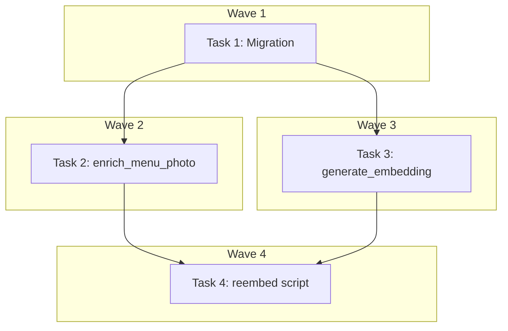

# Menu Items & Re-embed Shops Implementation Plan

> **For Claude:** REQUIRED SUB-SKILL: Use executing-plans to implement this plan task-by-task.

**Design Doc:** [docs/designs/2026-03-24-menu-items-embedding-design.md](docs/designs/2026-03-24-menu-items-embedding-design.md)

**Spec References:** SPEC.md (Search flow, Check-in flow sections)

**PRD References:** —

**Goal:** Persist extracted menu items into a dedicated table and include them in shop embedding text so natural language menu queries ("巴斯克蛋糕", "氮氣咖啡") return relevant results.

**Architecture:** Add `shop_menu_items` table with replace-on-extract semantics. Update `handle_enrich_menu_photo` to persist items and trigger re-embedding. Update `handle_generate_embedding` to load menu items and append them to embedding text, while safely skipping status transitions for already-live shops. One-time script enqueues 164 re-embed jobs after deploy.

**Tech Stack:** Python 3.12+, FastAPI, supabase-py, pytest, asyncio

**Acceptance Criteria:**

- [ ] After a user submits a menu photo at check-in, its items are stored in `shop_menu_items` and visible via DB query
- [ ] A shop with extracted menu items produces embedding text that includes those item names after `|`
- [ ] Running `reembed_live_shops.py` enqueues one `GENERATE_EMBEDDING` job per live shop — and all 164 shops remain `live` status throughout the process
- [ ] A search for "巴斯克蛋糕" ranks shops that have that item in `shop_menu_items` higher than before re-embedding
- [ ] The new-shop pipeline (status `embedding` → `publishing` → `live`) is unchanged

---

## Pre-Flight

Before starting any task, run from the worktree root:

```bash
make doctor          # Verify Supabase is running and .env.local is correct
supabase db diff     # Confirm clean migration state
cd backend && uv sync && pytest --tb=short -q  # All existing tests pass
```

Expected: `passed` with no failures in the test suite (4 known admin test failures are pre-existing and unrelated to this feature).

---

## Task 1: Migration — `shop_menu_items` table

**Files:**

- Create: `supabase/migrations/20260324000002_create_shop_menu_items.sql`

**No test needed** — SQL migrations aren't unit tested. Verification is `supabase db diff` after applying.

**Step 1: Write the migration**

```sql
-- shop_menu_items: structured menu items extracted from check-in menu photos.
-- Replace-on-extract: handler deletes all rows for a shop before inserting new batch.
-- ON DELETE CASCADE ensures cleanup when a shop is deleted (PDPA-safe).

CREATE TABLE shop_menu_items (
    id           UUID PRIMARY KEY DEFAULT gen_random_uuid(),
    shop_id      UUID NOT NULL REFERENCES shops(id) ON DELETE CASCADE,
    item_name    TEXT NOT NULL,
    price        NUMERIC(8, 0),        -- TWD whole numbers; NULL if not visible
    category     TEXT,                  -- e.g. "coffee", "food", "dessert"; NULL if unclear
    extracted_at TIMESTAMPTZ NOT NULL DEFAULT now()
);

CREATE INDEX idx_shop_menu_items_shop_id ON shop_menu_items(shop_id);
```

**Step 2: Apply migration**

```bash
supabase db diff      # Should show the new table
supabase db push      # Apply to local instance
```

Expected: migration applies cleanly, `shop_menu_items` table exists in local DB.

**Step 3: Commit**

```bash
git add supabase/migrations/20260324000002_create_shop_menu_items.sql
git commit -m "feat(db): add shop_menu_items table for menu search enrichment"
```

---

## Task 2: Update `handle_enrich_menu_photo` — TDD

**Files:**

- Modify: `backend/tests/workers/test_handlers.py` — replace `TestEnrichMenuPhotoHandler`
- Modify: `backend/workers/handlers/enrich_menu_photo.py` — add persistence + queue
- Modify: `backend/workers/scheduler.py` — pass `queue` to handler

**Step 1: Write failing tests** (replace the entire `TestEnrichMenuPhotoHandler` class)

In `backend/tests/workers/test_handlers.py`, replace lines 216–257:

```python
class TestEnrichMenuPhotoHandler:
    async def test_replaces_menu_items_and_queues_reembed_when_items_extracted(self):
        """When a menu photo is processed, existing items are replaced and a re-embed is queued."""
        db = MagicMock()
        llm = AsyncMock()
        queue = AsyncMock()

        llm.extract_menu_data = AsyncMock(
            return_value=MagicMock(
                items=[
                    {"name": "巴斯克蛋糕", "price": 120, "category": "dessert"},
                    {"name": "手沖拿鐵", "price": 150, "category": "coffee"},
                ]
            )
        )

        shop_table = MagicMock()
        shop_table.update.return_value.eq.return_value.execute.return_value = MagicMock(data=[])

        menu_table = MagicMock()
        menu_table.delete.return_value.eq.return_value.execute.return_value = MagicMock(data=[])
        menu_table.insert.return_value.execute.return_value = MagicMock(data=[])

        def table_side_effect(name: str):
            return menu_table if name == "shop_menu_items" else shop_table

        db.table.side_effect = table_side_effect

        await handle_enrich_menu_photo(
            payload={"shop_id": "shop-zhongshan-01", "image_url": "https://storage.example.com/menu.jpg"},
            db=db,
            llm=llm,
            queue=queue,
        )

        # DELETE before INSERT (replace-on-extract)
        menu_table.delete.return_value.eq.return_value.execute.assert_called_once()
        # INSERT two items
        menu_table.insert.return_value.execute.assert_called_once()
        inserted = menu_table.insert.call_args[0][0]
        assert len(inserted) == 2
        assert inserted[0]["item_name"] == "巴斯克蛋糕"
        assert inserted[0]["shop_id"] == "shop-zhongshan-01"
        assert inserted[1]["item_name"] == "手沖拿鐵"
        # Dual-write to shops.menu_data
        shop_table.update.assert_called_once()
        # Re-embed queued
        queue.enqueue.assert_called_once()
        assert queue.enqueue.call_args.kwargs["payload"]["shop_id"] == "shop-zhongshan-01"

    async def test_preserves_existing_items_when_extraction_returns_empty(self):
        """When no items are extracted, existing menu items are preserved and no re-embed is queued."""
        db = MagicMock()
        llm = AsyncMock()
        queue = AsyncMock()

        llm.extract_menu_data = AsyncMock(return_value=MagicMock(items=[]))

        await handle_enrich_menu_photo(
            payload={"shop_id": "shop-zhongshan-01", "image_url": "https://storage.example.com/menu.jpg"},
            db=db,
            llm=llm,
            queue=queue,
        )

        # No DB writes, no job queued
        db.table.assert_not_called()
        queue.enqueue.assert_not_called()
```

**Step 2: Run tests to verify they fail**

```bash
cd backend && pytest tests/workers/test_handlers.py::TestEnrichMenuPhotoHandler -v
```

Expected: `FAILED` — `handle_enrich_menu_photo() got unexpected keyword argument 'queue'` (or similar).

**Step 3: Implement the updated handler**

Replace the full content of `backend/workers/handlers/enrich_menu_photo.py`:

```python
from datetime import UTC, datetime
from typing import Any, cast

import structlog
from supabase import Client

from models.types import JobType
from providers.llm.interface import LLMProvider
from workers.queue import JobQueue

logger = structlog.get_logger()


async def handle_enrich_menu_photo(
    payload: dict[str, Any],
    db: Client,
    llm: LLMProvider,
    queue: JobQueue,
) -> None:
    """Extract menu data from a check-in photo, persist items, and trigger re-embedding."""
    shop_id = payload["shop_id"]
    image_url = payload["image_url"]
    logger.info("Extracting menu data", shop_id=shop_id)

    result = await llm.extract_menu_data(image_url=image_url)

    if not result.items:
        logger.info("No menu items extracted — preserving existing", shop_id=shop_id)
        return

    # Replace-on-extract: delete existing items, then insert new batch
    db.table("shop_menu_items").delete().eq("shop_id", shop_id).execute()

    rows = [
        {
            "shop_id": shop_id,
            "item_name": item.get("name", ""),
            "price": item.get("price"),
            "category": item.get("category"),
            "extracted_at": datetime.now(UTC).isoformat(),
        }
        for item in result.items
        if item.get("name")
    ]
    if rows:
        db.table("shop_menu_items").insert(rows).execute()

    # Dual-write to shops.menu_data (temporary — kept until follow-up cleanup ticket)
    db.table("shops").update({"menu_data": result.items}).eq("id", shop_id).execute()

    # Trigger re-embedding so menu items appear in search
    await queue.enqueue(
        job_type=JobType.GENERATE_EMBEDDING,
        payload={"shop_id": shop_id},
        priority=5,
    )

    logger.info("Menu data extracted", shop_id=shop_id, item_count=len(rows))
```

**Step 4: Update scheduler to pass `queue` to the handler**

In `backend/workers/scheduler.py`, find the `ENRICH_MENU_PHOTO` dispatch (around line 92) and add `queue=queue`:

```python
# Before:
await handle_enrich_menu_photo(
    payload=job.payload,
    db=db,
    llm=llm,
)

# After:
await handle_enrich_menu_photo(
    payload=job.payload,
    db=db,
    llm=llm,
    queue=queue,
)
```

**Step 5: Run tests to verify they pass**

```bash
cd backend && pytest tests/workers/test_handlers.py::TestEnrichMenuPhotoHandler -v
```

Expected: `2 passed`

**Step 6: Run full test suite**

```bash
cd backend && pytest --tb=short -q
```

Expected: all previously-passing tests still pass.

**Step 7: Commit**

```bash
git add backend/workers/handlers/enrich_menu_photo.py \
        backend/workers/scheduler.py \
        backend/tests/workers/test_handlers.py
git commit -m "feat(worker): persist menu items to shop_menu_items and trigger re-embed"
```

---

## Task 3: Update `handle_generate_embedding` — TDD

**Files:**

- Modify: `backend/tests/workers/test_handlers.py` — replace `TestGenerateEmbeddingHandler`
- Modify: `backend/workers/handlers/generate_embedding.py`

**Step 1: Write failing tests** (replace the entire `TestGenerateEmbeddingHandler` class)

```python
class TestGenerateEmbeddingHandler:
    def _make_db(
        self, shop_data: dict, menu_items: list[dict]
    ) -> tuple[MagicMock, MagicMock, MagicMock]:
        """Return (db, shop_table_mock, menu_table_mock) with correct call chains."""
        db = MagicMock()

        shop_table = MagicMock()
        shop_table.select.return_value.eq.return_value.single.return_value.execute.return_value = MagicMock(
            data=shop_data
        )
        shop_table.update.return_value.eq.return_value.execute.return_value = MagicMock(data=[])

        menu_table = MagicMock()
        menu_table.select.return_value.eq.return_value.execute.return_value = MagicMock(
            data=menu_items
        )

        def table_side_effect(name: str):
            return menu_table if name == "shop_menu_items" else shop_table

        db.table.side_effect = table_side_effect
        return db, shop_table, menu_table

    async def test_includes_menu_items_in_embedding_text_when_available(self):
        """When a shop has extracted menu items, they appear after ' | ' in the embedding text."""
        db, _, _ = self._make_db(
            shop_data={
                "name": "虎記商行",
                "description": "台灣老宅改建的咖啡館",
                "processing_status": "live",
            },
            menu_items=[{"item_name": "巴斯克蛋糕"}, {"item_name": "司康"}],
        )
        embeddings = AsyncMock()
        embeddings.embed = AsyncMock(return_value=[0.1] * 1536)
        queue = AsyncMock()

        await handle_generate_embedding(
            payload={"shop_id": "shop-taipei-01"},
            db=db,
            embeddings=embeddings,
            queue=queue,
        )

        embed_text = embeddings.embed.call_args[0][0]
        assert "巴斯克蛋糕" in embed_text
        assert "司康" in embed_text
        assert " | " in embed_text

    async def test_embedding_text_unchanged_when_no_menu_items(self):
        """When a shop has no menu items, embedding text is name + description only."""
        db, _, _ = self._make_db(
            shop_data={
                "name": "虎記商行",
                "description": "台灣老宅改建的咖啡館",
                "processing_status": "live",
            },
            menu_items=[],
        )
        embeddings = AsyncMock()
        embeddings.embed = AsyncMock(return_value=[0.1] * 1536)
        queue = AsyncMock()

        await handle_generate_embedding(
            payload={"shop_id": "shop-taipei-01"},
            db=db,
            embeddings=embeddings,
            queue=queue,
        )

        embed_text = embeddings.embed.call_args[0][0]
        assert embed_text == "虎記商行. 台灣老宅改建的咖啡館"
        assert " | " not in embed_text

    async def test_live_shop_embedding_updated_in_place_without_status_change(self):
        """Re-embedding a live shop updates only the embedding column — shop stays visible in search."""
        db, shop_table, _ = self._make_db(
            shop_data={
                "name": "虎記商行",
                "description": "台灣老宅改建的咖啡館",
                "processing_status": "live",
            },
            menu_items=[],
        )
        embeddings = AsyncMock()
        embeddings.embed = AsyncMock(return_value=[0.1] * 1536)
        queue = AsyncMock()

        await handle_generate_embedding(
            payload={"shop_id": "shop-taipei-01"},
            db=db,
            embeddings=embeddings,
            queue=queue,
        )

        update_data = shop_table.update.call_args[0][0]
        assert "embedding" in update_data
        assert "processing_status" not in update_data
        # No PUBLISH_SHOP job — shop was already live
        queue.enqueue.assert_not_called()

    async def test_new_shop_advances_status_and_queues_publish(self):
        """A new shop going through the pipeline advances to 'publishing' and queues PUBLISH_SHOP."""
        db, shop_table, _ = self._make_db(
            shop_data={
                "name": "虎記商行",
                "description": "台灣老宅改建的咖啡館",
                "processing_status": "embedding",
            },
            menu_items=[],
        )
        embeddings = AsyncMock()
        embeddings.embed = AsyncMock(return_value=[0.1] * 1536)
        queue = AsyncMock()

        await handle_generate_embedding(
            payload={"shop_id": "shop-taipei-01"},
            db=db,
            embeddings=embeddings,
            queue=queue,
        )

        update_data = shop_table.update.call_args[0][0]
        assert update_data.get("processing_status") == "publishing"
        queue.enqueue.assert_called_once()
        assert queue.enqueue.call_args.kwargs["job_type"].value == "publish_shop"
```

**Step 2: Run tests to verify they fail**

```bash
cd backend && pytest tests/workers/test_handlers.py::TestGenerateEmbeddingHandler -v
```

Expected: `FAILED` — tests fail because handler doesn't yet query `shop_menu_items` or check `processing_status`.

**Step 3: Implement the updated handler**

Replace the full content of `backend/workers/handlers/generate_embedding.py`:

```python
from typing import Any, cast

import structlog
from supabase import Client

from models.types import JobType
from providers.embeddings.interface import EmbeddingsProvider
from workers.queue import JobQueue

logger = structlog.get_logger()


async def handle_generate_embedding(
    payload: dict[str, Any],
    db: Client,
    embeddings: EmbeddingsProvider,
    queue: JobQueue,
) -> None:
    """Generate vector embedding for a shop, enriched with menu items if available.

    Safe for re-embedding already-live shops: when processing_status is 'live',
    only the embedding column is updated — no status transition, no PUBLISH_SHOP job.
    This prevents live shops from temporarily disappearing from search during re-embedding.
    """
    shop_id = payload["shop_id"]
    logger.info("Generating embedding", shop_id=shop_id)

    # Load shop data including processing_status for the live-shop guard
    response = (
        db.table("shops")
        .select("name, description, processing_status")
        .eq("id", shop_id)
        .single()
        .execute()
    )
    shop = cast("dict[str, Any]", response.data)

    # Load menu items if available
    menu_response = (
        db.table("shop_menu_items").select("item_name").eq("shop_id", shop_id).execute()
    )
    menu_rows = cast("list[dict[str, Any]]", menu_response.data or [])
    item_names = [row["item_name"] for row in menu_rows if row.get("item_name")]

    # Build embedding text: append menu items after ' | ' if present
    base_text = f"{shop['name']}. {shop.get('description', '')}"
    text = f"{base_text} | {', '.join(item_names)}" if item_names else base_text

    # Generate embedding
    embedding = await embeddings.embed(text)

    # Live-shop guard: already-live shops get only the embedding updated in-place.
    # New shops advance through the pipeline as before.
    is_live = shop.get("processing_status") == "live"

    update_data: dict[str, Any] = {"embedding": embedding}
    if not is_live:
        update_data["processing_status"] = "publishing"

    db.table("shops").update(update_data).eq("id", shop_id).execute()

    logger.info(
        "Embedding generated",
        shop_id=shop_id,
        dimensions=len(embedding),
        menu_items=len(item_names),
        is_live=is_live,
    )

    if not is_live:
        publish_payload: dict[str, Any] = {"shop_id": shop_id}
        for key in ("submission_id", "submitted_by", "batch_id"):
            if payload.get(key):
                publish_payload[key] = payload[key]

        await queue.enqueue(
            job_type=JobType.PUBLISH_SHOP,
            payload=publish_payload,
            priority=5,
        )
```

**Step 4: Run tests to verify they pass**

```bash
cd backend && pytest tests/workers/test_handlers.py::TestGenerateEmbeddingHandler -v
```

Expected: `4 passed`

**Step 5: Run full test suite**

```bash
cd backend && pytest --tb=short -q
```

Expected: all previously-passing tests still pass.

**Step 6: Commit**

```bash
git add backend/workers/handlers/generate_embedding.py \
        backend/tests/workers/test_handlers.py
git commit -m "feat(worker): enrich embedding text with menu items + safe live-shop re-embed"
```

---

## Task 4: Re-embed Script — TDD

**Files:**

- Create: `backend/scripts/reembed_live_shops.py`
- Create: `backend/tests/scripts/test_reembed_live_shops.py`

**Step 1: Create the test file**

```bash
mkdir -p backend/tests/scripts
touch backend/tests/scripts/__init__.py
```

```python
# backend/tests/scripts/test_reembed_live_shops.py
from unittest.mock import AsyncMock, MagicMock, patch

import pytest

# Import after sys.path manipulation done in module setup
import sys
from pathlib import Path
sys.path.insert(0, str(Path(__file__).parent.parent.parent))

from scripts.reembed_live_shops import main


class TestReembedLiveShopsScript:
    async def test_enqueues_generate_embedding_for_every_live_shop(self):
        """Running the script enqueues one GENERATE_EMBEDDING job per live shop."""
        db = MagicMock()
        db.table.return_value.select.return_value.eq.return_value.execute.return_value = MagicMock(
            data=[
                {"id": "shop-taipei-01", "name": "虎記商行"},
                {"id": "shop-taipei-02", "name": "木子鳥"},
            ]
        )

        queue = AsyncMock()

        with patch("scripts.reembed_live_shops.get_service_role_client", return_value=db), \
             patch("scripts.reembed_live_shops.JobQueue", return_value=queue):
            await main(dry_run=False)

        assert queue.enqueue.call_count == 2
        call_payloads = [c.kwargs["payload"]["shop_id"] for c in queue.enqueue.call_args_list]
        assert "shop-taipei-01" in call_payloads
        assert "shop-taipei-02" in call_payloads

    async def test_dry_run_enqueues_no_jobs(self):
        """Dry-run mode lists shops without enqueueing any jobs."""
        db = MagicMock()
        db.table.return_value.select.return_value.eq.return_value.execute.return_value = MagicMock(
            data=[{"id": "shop-taipei-01", "name": "虎記商行"}]
        )

        queue = AsyncMock()

        with patch("scripts.reembed_live_shops.get_service_role_client", return_value=db), \
             patch("scripts.reembed_live_shops.JobQueue", return_value=queue):
            await main(dry_run=True)

        queue.enqueue.assert_not_called()

    async def test_no_shops_exits_cleanly(self):
        """When no live shops exist, the script completes without error."""
        db = MagicMock()
        db.table.return_value.select.return_value.eq.return_value.execute.return_value = MagicMock(
            data=[]
        )

        queue = AsyncMock()

        with patch("scripts.reembed_live_shops.get_service_role_client", return_value=db), \
             patch("scripts.reembed_live_shops.JobQueue", return_value=queue):
            await main(dry_run=False)

        queue.enqueue.assert_not_called()
```

**Step 2: Run tests to verify they fail**

```bash
cd backend && pytest tests/scripts/test_reembed_live_shops.py -v
```

Expected: `ModuleNotFoundError: No module named 'scripts.reembed_live_shops'`

**Step 3: Implement the script**

Create `backend/scripts/__init__.py` if it doesn't exist:

```bash
touch backend/scripts/__init__.py
```

Create `backend/scripts/reembed_live_shops.py`:

```python
"""Enqueue GENERATE_EMBEDDING jobs for all live shops to rebuild embeddings with menu items.

Run after deploying the shop_menu_items table and handler changes to rebuild all
164 live shop embeddings with their extracted menu items included.

Usage (run from backend/):
    uv run python scripts/reembed_live_shops.py [--dry-run]

Cost: ~$0.01 (OpenAI text-embedding-3-small, ~200 tokens × 164 shops)
"""

import asyncio
import sys
from pathlib import Path

sys.path.insert(0, str(Path(__file__).parent.parent))

from db.supabase_client import get_service_role_client
from models.types import JobType
from workers.queue import JobQueue


async def main(dry_run: bool) -> None:
    print("\n=== Re-embed live shops with menu item enrichment ===\n")

    db = get_service_role_client()
    rows = (
        db.table("shops")
        .select("id, name")
        .eq("processing_status", "live")
        .execute()
        .data
    )

    if not rows:
        print("No live shops found. Nothing to do.")
        return

    print(f"Found {len(rows)} live shops.\n")

    if dry_run:
        for r in rows:
            print(f"  {r['name']}")
        print("\nDry-run — no jobs enqueued.")
        return

    queue = JobQueue(db)
    for r in rows:
        await queue.enqueue(
            job_type=JobType.GENERATE_EMBEDDING,
            payload={"shop_id": r["id"]},
            priority=3,
        )

    print(f"Enqueued {len(rows)} GENERATE_EMBEDDING jobs.")
    print("Monitor worker logs: tail -f logs or Railway log stream.")
    print("All shops remain 'live' throughout — no search downtime.")


if __name__ == "__main__":
    import argparse

    parser = argparse.ArgumentParser(description=__doc__)
    parser.add_argument("--dry-run", action="store_true", help="List shops without enqueueing")
    args = parser.parse_args()

    asyncio.run(main(dry_run=args.dry_run))
```

**Step 4: Run tests to verify they pass**

```bash
cd backend && pytest tests/scripts/test_reembed_live_shops.py -v
```

Expected: `3 passed`

**Step 5: Run full test suite**

```bash
cd backend && pytest --tb=short -q
```

Expected: all previously-passing tests still pass.

**Step 6: Lint check**

```bash
cd backend && ruff check . && ruff format --check .
```

Expected: no issues.

**Step 7: Commit**

```bash
git add backend/scripts/__init__.py \
        backend/scripts/reembed_live_shops.py \
        backend/tests/scripts/__init__.py \
        backend/tests/scripts/test_reembed_live_shops.py
git commit -m "feat(scripts): add reembed_live_shops script to rebuild embeddings with menu items"
```

---

## Execution Waves



**Wave 1** (no dependencies):

- Task 1: Migration — `shop_menu_items` table

**Wave 2** (depends on Wave 1):

- Task 2: Update `handle_enrich_menu_photo` handler + scheduler

**Wave 3** (depends on Wave 1; after Wave 2 due to shared test file):

- Task 3: Update `handle_generate_embedding` handler

**Wave 4** (depends on Wave 2 + Wave 3):

- Task 4: `reembed_live_shops.py` script

> Note: Tasks 2 and 3 both modify `backend/tests/workers/test_handlers.py`. They are sequential to avoid merge conflicts in that file.

---

## Post-Deploy Runbook

After merging and deploying to production:

```bash
# 1. Verify migration applied
supabase db diff   # Should show no pending migrations

# 2. Dry-run the re-embed script
cd backend && uv run python scripts/reembed_live_shops.py --dry-run
# Expected: lists ~164 shop names

# 3. Enqueue jobs
cd backend && uv run python scripts/reembed_live_shops.py
# Expected: "Enqueued 164 GENERATE_EMBEDDING jobs."

# 4. Monitor worker
# Railway logs → filter by "Generating embedding" and "Embedding generated"
# Watch for errors; worker retries automatically (up to 3 attempts per job)

# 5. Verify search improvement
# Test query: "巴斯克蛋糕" — should return shops with that item
# Check admin dashboard: all shops show processing_status = 'live'
```

---

## TODO Checklist

- [ ] Task 1: Migration (`supabase/migrations/20260324000002_create_shop_menu_items.sql`)
- [ ] Task 2: Update `handle_enrich_menu_photo` (persist + queue re-embed)
- [ ] Task 3: Update `handle_generate_embedding` (menu items in text + live-shop guard)
- [ ] Task 4: `backend/scripts/reembed_live_shops.py`
- [ ] Post-deploy: Run `reembed_live_shops.py --dry-run` then full run
