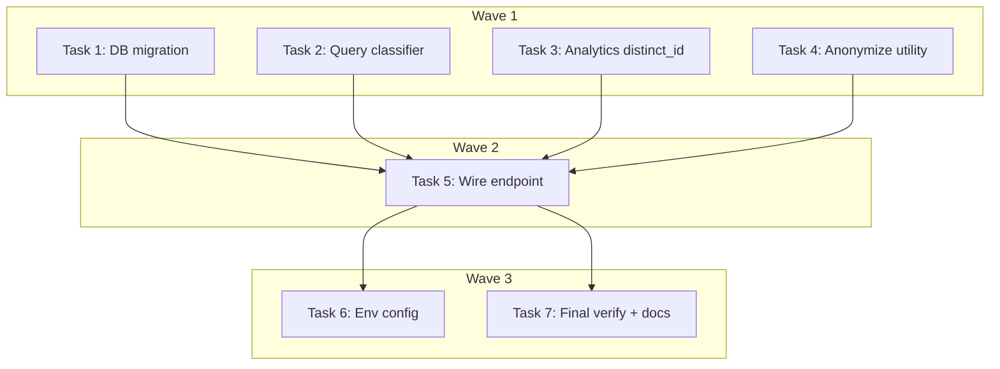

# Search Observability Implementation Plan

> **For Claude:** REQUIRED SUB-SKILL: Use executing-plans to implement this plan task-by-task.

**Design Doc:** [docs/designs/2026-03-24-search-observability-design.md](docs/designs/2026-03-24-search-observability-design.md)

**Spec References:** [SPEC.md §6 Observability](SPEC.md#6-observability), [docs/designs/ux/metrics.md](docs/designs/ux/metrics.md)

**PRD References:** —

**Goal:** Log search queries and zero-result rates to a Postgres table and PostHog, with server-side query_type classification, so we can prioritize search improvements.

**Architecture:** Fire-and-forget logging from the search API endpoint (`backend/api/search.py`). Two channels: `search_events` Postgres table for SQL analytics, PostHog `search_submitted` event for dashboards. Query classification via keyword heuristic. Anonymized user IDs only (PDPA).

**Tech Stack:** FastAPI, Supabase (Postgres), PostHog (via existing `AnalyticsProvider`), structlog, hashlib (SHA-256 for anonymization)

**Acceptance Criteria:**

- [ ] A search query logs an event to the `search_events` Postgres table with anonymized user ID, query text, query type, mode filter, and result count
- [ ] A search query fires a `search_submitted` PostHog event with the same properties including server-classified `query_type`
- [ ] Zero-result searches are identifiable via `result_count = 0` in both channels
- [ ] Search response latency is unaffected by logging (fire-and-forget)
- [ ] No PII is stored — user IDs are one-way hashed

---

### Task 1: Database migration — `search_events` table

**Files:**

- Create: `supabase/migrations/20260324000001_create_search_events.sql`

No test needed — this is a SQL DDL migration with no application logic.

**Step 1: Write the migration**

```sql
-- Search observability: log queries and zero-result rates (DEV-9)
CREATE TABLE IF NOT EXISTS search_events (
  id            UUID DEFAULT gen_random_uuid() PRIMARY KEY,
  user_id_anon  TEXT NOT NULL,
  query_text    TEXT NOT NULL,
  query_type    TEXT NOT NULL,
  mode_filter   TEXT,
  result_count  INTEGER NOT NULL,
  created_at    TIMESTAMPTZ DEFAULT now()
);

COMMENT ON TABLE search_events IS 'Search query log for observability. user_id_anon is a one-way hash — no PII.';

CREATE INDEX idx_search_events_created_at ON search_events (created_at);
CREATE INDEX idx_search_events_zero_results ON search_events (result_count) WHERE result_count = 0;
CREATE INDEX idx_search_events_query_type ON search_events (query_type);
```

**Step 2: Apply and verify migration**

Run: `supabase db push`
Expected: Migration applies without errors.

Run: `supabase db diff` to confirm no drift.

**Step 3: Commit**

```bash
git add supabase/migrations/20260324000001_create_search_events.sql
git commit -m "feat(db): add search_events table for query observability (DEV-9)"
```

---

### Task 2: Query type classifier — keyword heuristic

**Files:**

- Create: `backend/services/query_classifier.py`
- Test: `backend/tests/services/test_query_classifier.py`

**Step 1: Write the failing tests**

```python
import pytest

from services.query_classifier import classify


class TestClassify:
    """Given a search query, classify returns the query type."""

    def test_food_item_returns_item_specific(self):
        """When a user searches for a specific food, it's classified as item_specific."""
        assert classify("巴斯克蛋糕") == "item_specific"

    def test_drink_item_returns_item_specific(self):
        """When a user searches for a specific drink, it's classified as item_specific."""
        assert classify("拿鐵") == "item_specific"

    def test_brew_method_returns_item_specific(self):
        """When a user searches for a brew method, it's classified as item_specific."""
        assert classify("手沖") == "item_specific"

    def test_pastry_returns_item_specific(self):
        """When a user searches for a pastry, it's classified as item_specific."""
        assert classify("司康") == "item_specific"

    def test_coffee_origin_returns_specialty_coffee(self):
        """When a user searches for a coffee origin, it's classified as specialty_coffee."""
        assert classify("衣索比亞") == "specialty_coffee"

    def test_roast_level_returns_specialty_coffee(self):
        """When a user searches for a roast level, it's classified as specialty_coffee."""
        assert classify("淺焙") == "specialty_coffee"

    def test_single_origin_returns_specialty_coffee(self):
        """When a user searches for single origin coffee, it's classified as specialty_coffee."""
        assert classify("單品咖啡") == "specialty_coffee"

    def test_generic_query_returns_generic(self):
        """When a user searches for atmosphere or vibe, it's classified as generic."""
        assert classify("安靜適合工作") == "generic"

    def test_wifi_query_returns_generic(self):
        """When a user searches for wifi, it's classified as generic."""
        assert classify("good wifi") == "generic"

    def test_mixed_query_with_food_returns_item_specific(self):
        """When a query contains a food term mixed with generic words, item_specific wins."""
        assert classify("有賣司康的安靜咖啡店") == "item_specific"

    def test_mixed_query_specialty_over_generic(self):
        """When a query contains a specialty term mixed with generic words, specialty_coffee wins."""
        assert classify("有單品的咖啡店") == "specialty_coffee"

    def test_empty_string_returns_generic(self):
        """An empty query is classified as generic."""
        assert classify("") == "generic"

    def test_english_latte_returns_item_specific(self):
        """English food/drink terms are also classified."""
        assert classify("latte") == "item_specific"

    def test_item_specific_takes_priority_over_specialty(self):
        """When a query contains both food and specialty terms, item_specific wins."""
        assert classify("手沖 衣索比亞") == "item_specific"
```

**Step 2: Run tests to verify they fail**

Run: `cd backend && python -m pytest tests/services/test_query_classifier.py -v`
Expected: FAIL — `ModuleNotFoundError: No module named 'services.query_classifier'`

**Step 3: Write the classifier implementation**

```python
"""Server-side query type classifier for search observability.

Classifies search queries into three categories using keyword heuristics:
- item_specific: food, drink, or brew method queries
- specialty_coffee: coffee origin, roast level, or processing method queries
- generic: everything else (ambience, facilities, location)

Priority: item_specific > specialty_coffee > generic
"""

import re

# Compiled at module level per performance standards — zero per-request cost.

_ITEM_KEYWORDS = re.compile(
    r"巴斯克蛋糕|司康|可頌|肉桂捲|戚風蛋糕|提拉米蘇|布丁|鬆餅|貝果|三明治|甜點|蛋糕"
    r"|拿鐵|卡布奇諾|美式|摩卡|抹茶|可可|果汁|氣泡水|手沖|冰滴|冷萃|虹吸|愛樂壓"
    r"|latte|cappuccino|espresso|americano|mocha|matcha|croissant|scone"
    r"|pour.?over|cold.?brew|drip",
    re.IGNORECASE,
)

_SPECIALTY_KEYWORDS = re.compile(
    r"單品|淺焙|中焙|深焙|日曬|水洗|蜜處理|厭氧"
    r"|衣索比亞|肯亞|哥倫比亞|巴拿馬|瓜地馬拉|耶加雪菲|藝伎|geisha"
    r"|SCA|精品咖啡|自家烘焙|specialty",
    re.IGNORECASE,
)


def classify(query: str) -> str:
    """Classify a search query into item_specific, specialty_coffee, or generic.

    item_specific takes priority over specialty_coffee.
    """
    if _ITEM_KEYWORDS.search(query):
        return "item_specific"
    if _SPECIALTY_KEYWORDS.search(query):
        return "specialty_coffee"
    return "generic"
```

**Step 4: Run tests to verify they pass**

Run: `cd backend && python -m pytest tests/services/test_query_classifier.py -v`
Expected: All 14 tests PASS.

**Step 5: Commit**

```bash
git add backend/services/query_classifier.py backend/tests/services/test_query_classifier.py
git commit -m "feat: add query_type keyword classifier with TDD (DEV-9)"
```

---

### Task 3: Update analytics provider to support `distinct_id`

**Files:**

- Modify: `backend/providers/analytics/interface.py:4-5`
- Modify: `backend/providers/analytics/posthog_adapter.py:21-29`
- Test: `backend/tests/providers/test_posthog_adapter.py` (create if not exists)

**Step 1: Write the failing test**

Check if test file already exists: `ls backend/tests/providers/test_posthog_adapter.py`

Create `backend/tests/providers/test_posthog_adapter.py`:

```python
from unittest.mock import MagicMock, patch

from providers.analytics.posthog_adapter import PostHogAnalyticsAdapter


class TestPostHogAnalyticsAdapter:
    def test_track_uses_server_distinct_id_by_default(self):
        """When no distinct_id is provided, events use 'server' as the identifier."""
        with patch("providers.analytics.posthog_adapter.posthog_module") as mock_ph:
            mock_client = MagicMock()
            mock_ph.Client.return_value = mock_client
            adapter = PostHogAnalyticsAdapter(api_key="test-key", host="https://ph.test")
            adapter.track("test_event", {"foo": "bar"})
            mock_client.capture.assert_called_once_with(
                distinct_id="server",
                event="test_event",
                properties={"foo": "bar"},
            )

    def test_track_uses_provided_distinct_id(self):
        """When a distinct_id is provided, events use it instead of 'server'."""
        with patch("providers.analytics.posthog_adapter.posthog_module") as mock_ph:
            mock_client = MagicMock()
            mock_ph.Client.return_value = mock_client
            adapter = PostHogAnalyticsAdapter(api_key="test-key", host="https://ph.test")
            adapter.track("search_submitted", {"query_text": "latte"}, distinct_id="anon-abc123")
            mock_client.capture.assert_called_once_with(
                distinct_id="anon-abc123",
                event="search_submitted",
                properties={"query_text": "latte"},
            )

    def test_track_swallows_exceptions(self):
        """When PostHog client raises, the adapter logs a warning and does not re-raise."""
        with patch("providers.analytics.posthog_adapter.posthog_module") as mock_ph:
            mock_client = MagicMock()
            mock_client.capture.side_effect = RuntimeError("network error")
            mock_ph.Client.return_value = mock_client
            adapter = PostHogAnalyticsAdapter(api_key="test-key", host="https://ph.test")
            # Should not raise
            adapter.track("test_event", {"foo": "bar"})
```

**Step 2: Run tests to verify they fail**

Run: `cd backend && python -m pytest tests/providers/test_posthog_adapter.py -v`
Expected: First test passes (current behavior), second test FAILS (no `distinct_id` param).

**Step 3: Update the protocol interface**

In `backend/providers/analytics/interface.py`, update the `track` method signature:

```python
from typing import Protocol


class AnalyticsProvider(Protocol):
    def track(
        self,
        event: str,
        properties: dict[str, str | int | bool] | None = None,
        *,
        distinct_id: str | None = None,
    ) -> None: ...

    def identify(self, user_id: str, traits: dict[str, str | int | bool] | None = None) -> None: ...

    def page(
        self,
        name: str | None = None,
        properties: dict[str, str | int | bool] | None = None,
    ) -> None: ...
```

**Step 4: Update the PostHog adapter**

In `backend/providers/analytics/posthog_adapter.py`, update the `track` method:

```python
def track(
    self,
    event: str,
    properties: dict[str, str | int | bool] | None = None,
    *,
    distinct_id: str | None = None,
) -> None:
    try:
        self._client.capture(
            distinct_id=distinct_id or "server",
            event=event,
            properties=properties,
        )
    except Exception:
        logger.warning("PostHog track failed for event: %s", event, exc_info=True)
```

**Step 5: Run tests to verify they pass**

Run: `cd backend && python -m pytest tests/providers/test_posthog_adapter.py -v`
Expected: All 3 tests PASS.

**Step 6: Commit**

```bash
git add backend/providers/analytics/interface.py backend/providers/analytics/posthog_adapter.py backend/tests/providers/test_posthog_adapter.py
git commit -m "feat: add distinct_id param to AnalyticsProvider.track (DEV-9)"
```

---

### Task 4: Add `anon_salt` config and `anonymize_user_id` utility

**Files:**

- Modify: `backend/core/config.py:46` (add `anon_salt` setting)
- Create: `backend/core/anonymize.py`
- Test: `backend/tests/core/test_anonymize.py`

**Step 1: Write the failing tests**

Create `backend/tests/core/test_anonymize.py`:

```python
from core.anonymize import anonymize_user_id


class TestAnonymizeUserId:
    def test_returns_hex_string(self):
        """Anonymized ID is a hex-encoded SHA-256 hash."""
        result = anonymize_user_id("user-a1b2c3", salt="test-salt")
        assert isinstance(result, str)
        assert len(result) == 64  # SHA-256 hex digest

    def test_same_input_same_output(self):
        """Same user ID and salt always produces the same hash (deterministic)."""
        a = anonymize_user_id("user-a1b2c3", salt="test-salt")
        b = anonymize_user_id("user-a1b2c3", salt="test-salt")
        assert a == b

    def test_different_user_ids_produce_different_hashes(self):
        """Different user IDs produce different hashes."""
        a = anonymize_user_id("user-a1b2c3", salt="test-salt")
        b = anonymize_user_id("user-x9y8z7", salt="test-salt")
        assert a != b

    def test_different_salts_produce_different_hashes(self):
        """Different salts produce different hashes — salt is load-bearing."""
        a = anonymize_user_id("user-a1b2c3", salt="salt-one")
        b = anonymize_user_id("user-a1b2c3", salt="salt-two")
        assert a != b

    def test_not_equal_to_raw_user_id(self):
        """Output must not be the raw user ID (i.e., it's actually hashed)."""
        result = anonymize_user_id("user-a1b2c3", salt="test-salt")
        assert result != "user-a1b2c3"
```

**Step 2: Run tests to verify they fail**

Run: `cd backend && python -m pytest tests/core/test_anonymize.py -v`
Expected: FAIL — `ModuleNotFoundError: No module named 'core.anonymize'`

**Step 3: Write the implementation**

Create `backend/core/anonymize.py`:

```python
"""One-way user ID anonymization for PDPA-compliant analytics."""

import hashlib


def anonymize_user_id(user_id: str, *, salt: str) -> str:
    """Return a SHA-256 hex digest of salt + user_id. Not reversible."""
    return hashlib.sha256(f"{salt}:{user_id}".encode()).hexdigest()
```

**Step 4: Add `anon_salt` to Settings**

In `backend/core/config.py`, add after line 46 (`admin_user_ids`):

```python
    # Anonymization
    anon_salt: str = "caferoam-dev-salt"
```

**Step 5: Run tests to verify they pass**

Run: `cd backend && python -m pytest tests/core/test_anonymize.py -v`
Expected: All 5 tests PASS.

**Step 6: Commit**

```bash
git add backend/core/anonymize.py backend/core/config.py backend/tests/core/test_anonymize.py
git commit -m "feat: add anonymize_user_id utility and anon_salt config (DEV-9)"
```

---

### Task 5: Wire search observability into the search endpoint

**Files:**

- Modify: `backend/api/search.py`
- Modify: `backend/tests/api/test_search.py`

This is the integration task — wires the classifier, anonymizer, Postgres logging, and PostHog event into the search endpoint.

**Step 1: Write the failing integration tests**

Add to `backend/tests/api/test_search.py`:

```python
import asyncio
from unittest.mock import AsyncMock, MagicMock, patch

from fastapi.testclient import TestClient

from api.deps import get_current_user, get_user_db
from main import app

client = TestClient(app)


class TestSearchAPI:
    # ... existing tests stay unchanged ...

    def test_search_logs_event_to_postgres(self):
        """When a user searches, a search_event row is inserted asynchronously."""
        mock_db = MagicMock()
        mock_db.rpc = MagicMock(
            return_value=MagicMock(execute=MagicMock(return_value=MagicMock(data=[])))
        )
        # Track insert calls on the admin DB
        mock_admin_db = MagicMock()
        mock_admin_db.table.return_value.insert.return_value.execute = MagicMock()

        app.dependency_overrides[get_current_user] = lambda: {"id": "user-a1b2c3"}
        app.dependency_overrides[get_user_db] = lambda: mock_db
        try:
            with (
                patch("api.search.get_embeddings_provider") as mock_emb_factory,
                patch("api.search.SearchService") as mock_cls,
                patch("api.search.get_admin_db", return_value=mock_admin_db),
                patch("api.search.get_analytics_provider") as mock_analytics_factory,
                patch("api.search.asyncio") as mock_asyncio,
            ):
                mock_emb = AsyncMock()
                mock_emb.embed = AsyncMock(return_value=[0.1] * 1536)
                mock_emb_factory.return_value = mock_emb
                mock_svc = AsyncMock()
                mock_svc.search.return_value = []
                mock_cls.return_value = mock_svc
                mock_analytics = MagicMock()
                mock_analytics_factory.return_value = mock_analytics

                # Make create_task actually call the coroutine
                tasks_created = []
                mock_asyncio.create_task = lambda coro: tasks_created.append(coro)

                response = client.get(
                    "/search?text=巴斯克蛋糕",
                    headers={"Authorization": "Bearer valid-jwt"},
                )
                assert response.status_code == 200

                # Run the fire-and-forget tasks
                for coro in tasks_created:
                    asyncio.get_event_loop().run_until_complete(coro)

                # Verify Postgres insert was called
                mock_admin_db.table.assert_called_with("search_events")
                insert_call = mock_admin_db.table.return_value.insert.call_args
                assert insert_call is not None
                row = insert_call[0][0]
                assert row["query_text"] == "巴斯克蛋糕"
                assert row["query_type"] == "item_specific"
                assert row["result_count"] == 0
                assert row["mode_filter"] is None
                assert "user-a1b2c3" not in row["user_id_anon"]  # anonymized
        finally:
            app.dependency_overrides.clear()

    def test_search_fires_posthog_event(self):
        """When a user searches, a search_submitted PostHog event is fired."""
        mock_db = MagicMock()
        mock_db.rpc = MagicMock(
            return_value=MagicMock(execute=MagicMock(return_value=MagicMock(data=[])))
        )
        mock_admin_db = MagicMock()
        mock_admin_db.table.return_value.insert.return_value.execute = MagicMock()

        app.dependency_overrides[get_current_user] = lambda: {"id": "user-a1b2c3"}
        app.dependency_overrides[get_user_db] = lambda: mock_db
        try:
            with (
                patch("api.search.get_embeddings_provider") as mock_emb_factory,
                patch("api.search.SearchService") as mock_cls,
                patch("api.search.get_admin_db", return_value=mock_admin_db),
                patch("api.search.get_analytics_provider") as mock_analytics_factory,
                patch("api.search.asyncio") as mock_asyncio,
            ):
                mock_emb = AsyncMock()
                mock_emb.embed = AsyncMock(return_value=[0.1] * 1536)
                mock_emb_factory.return_value = mock_emb
                mock_svc = AsyncMock()
                mock_svc.search.return_value = []
                mock_cls.return_value = mock_svc
                mock_analytics = MagicMock()
                mock_analytics_factory.return_value = mock_analytics

                tasks_created = []
                mock_asyncio.create_task = lambda coro: tasks_created.append(coro)

                response = client.get(
                    "/search?text=latte&mode=work",
                    headers={"Authorization": "Bearer valid-jwt"},
                )
                assert response.status_code == 200

                for coro in tasks_created:
                    asyncio.get_event_loop().run_until_complete(coro)

                # Verify PostHog event was fired
                mock_analytics.track.assert_called_once()
                call_kwargs = mock_analytics.track.call_args
                assert call_kwargs[0][0] == "search_submitted"
                props = call_kwargs[0][1]
                assert props["query_text"] == "latte"
                assert props["query_type"] == "item_specific"
                assert props["mode_chip_active"] == "work"
                assert props["result_count"] == 0
                assert "distinct_id" in call_kwargs[1]
        finally:
            app.dependency_overrides.clear()
```

**Step 2: Run tests to verify they fail**

Run: `cd backend && python -m pytest tests/api/test_search.py -v`
Expected: FAIL — `ImportError` for new imports (`get_admin_db`, `get_analytics_provider` not imported in `api.search`).

**Step 3: Update the search endpoint**

Replace `backend/api/search.py` with:

```python
import asyncio
from typing import Any

import structlog
from fastapi import APIRouter, Depends, Query
from supabase import Client

from api.deps import get_admin_db, get_current_user, get_user_db
from core.anonymize import anonymize_user_id
from core.config import settings
from models.types import SearchQuery
from providers.analytics import get_analytics_provider
from providers.embeddings import get_embeddings_provider
from services.query_classifier import classify
from services.search_service import SearchService

logger = structlog.get_logger()
router = APIRouter(tags=["search"])


async def _log_search_event(
    admin_db: Client,
    user_id_anon: str,
    query_text: str,
    query_type: str,
    mode_filter: str | None,
    result_count: int,
) -> None:
    """Fire-and-forget: insert a row into search_events. Errors are logged, never raised."""
    try:
        admin_db.table("search_events").insert(
            {
                "user_id_anon": user_id_anon,
                "query_text": query_text,
                "query_type": query_type,
                "mode_filter": mode_filter,
                "result_count": result_count,
            }
        ).execute()
    except Exception:
        logger.warning("search_event insert failed", query_text=query_text, exc_info=True)


async def _track_search_analytics(
    user_id_anon: str,
    query_text: str,
    query_type: str,
    mode_filter: str | None,
    result_count: int,
) -> None:
    """Fire-and-forget: send search_submitted event to PostHog."""
    try:
        analytics = get_analytics_provider()
        analytics.track(
            "search_submitted",
            {
                "query_text": query_text,
                "query_type": query_type,
                "mode_chip_active": mode_filter or "none",
                "result_count": result_count,
            },
            distinct_id=user_id_anon,
        )
    except Exception:
        logger.warning("search_submitted analytics failed", query_text=query_text, exc_info=True)


@router.get("/search")
async def search(
    text: str = Query(..., min_length=1),
    mode: str | None = Query(None, pattern="^(work|rest|social)$"),
    limit: int = Query(20, ge=1, le=50),
    user: dict[str, Any] = Depends(get_current_user),  # noqa: B008
    db: Client = Depends(get_user_db),  # noqa: B008
) -> list[dict[str, Any]]:
    """Semantic search with optional mode filter. Auth required."""
    embeddings = get_embeddings_provider()
    service = SearchService(db=db, embeddings=embeddings)
    query = SearchQuery(text=text, limit=limit)
    results = await service.search(query, mode=mode)

    # Fire-and-forget observability
    query_type = classify(text)
    user_id_anon = anonymize_user_id(user["id"], salt=settings.anon_salt)
    admin_db = get_admin_db()
    result_count = len(results)

    asyncio.create_task(
        _log_search_event(admin_db, user_id_anon, text, query_type, mode, result_count)
    )
    asyncio.create_task(
        _track_search_analytics(user_id_anon, text, query_type, mode, result_count)
    )

    return [r.model_dump(by_alias=True) for r in results]
```

**Step 4: Run tests to verify they pass**

Run: `cd backend && python -m pytest tests/api/test_search.py -v`
Expected: All tests PASS (existing + 2 new).

**Step 5: Run the full test suite to check for regressions**

Run: `cd backend && python -m pytest -v`
Expected: All tests PASS.

**Step 6: Lint check**

Run: `cd backend && ruff check . && ruff format --check .`
Expected: No errors.

**Step 7: Commit**

```bash
git add backend/api/search.py backend/tests/api/test_search.py
git commit -m "feat: wire search observability into search endpoint (DEV-9)"
```

---

### Task 6: Add `anon_salt` to environment config

**Files:**

- Modify: `backend/.env.example` (add `ANON_SALT`)
- Modify: `scripts/doctor.sh` (add health check for `ANON_SALT` in production)

No test needed — environment configuration, not application logic.

**Step 1: Add to `.env.example`**

Add under the Analytics section:

```
# Anonymization (for PDPA-compliant analytics)
ANON_SALT=change-me-in-production
```

**Step 2: Update `scripts/doctor.sh`**

Add a check that warns if `ANON_SALT` is the default value in non-development environments. Check the existing doctor.sh format first and follow the same pattern.

**Step 3: Commit**

```bash
git add backend/.env.example scripts/doctor.sh
git commit -m "chore: add ANON_SALT to env example and doctor check (DEV-9)"
```

---

### Task 7: Final verification and design/ADR commit

**Files:**

- Commit: `docs/designs/2026-03-24-search-observability-design.md`
- Commit: `docs/decisions/2026-03-24-search-observability-dual-storage.md`
- Commit: `docs/decisions/2026-03-24-query-type-keyword-heuristic.md`

No test needed — documentation only.

**Step 1: Run the full backend test suite**

Run: `cd backend && python -m pytest -v --tb=short`
Expected: All tests PASS.

**Step 2: Run type checking**

Run: `cd backend && mypy .`
Expected: No type errors (or only pre-existing ones).

**Step 3: Commit docs**

```bash
git add docs/designs/2026-03-24-search-observability-design.md docs/decisions/2026-03-24-search-observability-dual-storage.md docs/decisions/2026-03-24-query-type-keyword-heuristic.md
git commit -m "docs: add search observability design doc and ADRs (DEV-9)"
```

---

## Execution Waves



**Wave 1** (parallel — no dependencies):

- Task 1: DB migration (`search_events` table)
- Task 2: Query classifier (keyword heuristic + tests)
- Task 3: Analytics provider `distinct_id` update + tests
- Task 4: Anonymize utility + tests

**Wave 2** (sequential — depends on all of Wave 1):

- Task 5: Wire search observability into endpoint ← Tasks 1, 2, 3, 4

**Wave 3** (parallel — depends on Wave 2):

- Task 6: Environment config updates
- Task 7: Final verification + design/ADR commit
