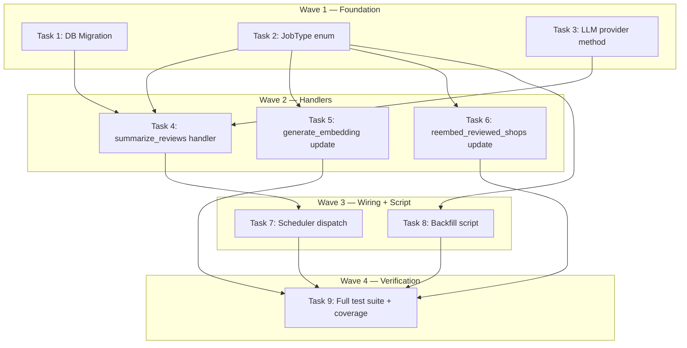

# Community Summary Embeddings Implementation Plan (DEV-23)

> **For Claude:** REQUIRED SUB-SKILL: Use executing-plans to implement this plan task-by-task.

**Design Doc:** [docs/designs/2026-03-25-community-summary-embeddings-design.md](../designs/2026-03-25-community-summary-embeddings-design.md)

**Spec References:** —

**PRD References:** —

**Goal:** Replace raw concatenation of check-in texts with Claude Haiku–generated community summaries stored in `shops.community_summary`, used for both embedding input and UI display.

**Architecture:** Two-stage pipeline: nightly cron enqueues `SUMMARIZE_REVIEWS` per shop → handler calls Claude Haiku to generate a community summary → stores to DB → chains to `GENERATE_EMBEDDING`. The embedding handler prefers `community_summary` when present, with graceful fallback to raw concatenation.

**Tech Stack:** Python (FastAPI workers), Claude Haiku (via Anthropic SDK), Supabase (Postgres), pytest

**Acceptance Criteria:**

- [ ] A shop with check-in reviews gets a Claude-generated community summary stored in `shops.community_summary`
- [ ] The nightly re-embed pipeline produces summaries before re-embedding, not raw concatenation
- [ ] A shop whose summary fails to generate still gets re-embedded using the existing raw concatenation fallback
- [ ] All 164 existing live shops can be backfilled with community summaries via a one-time script
- [ ] 80% test coverage maintained for `backend/workers/handlers/`

---

### Task 1: DB Migration — Add community_summary columns and update job_type CHECK

**Files:**

- Create: `supabase/migrations/20260325000007_add_community_summary_and_summarize_reviews_job.sql`

**Step 1: Write migration**

No test needed — SQL migration, verified by `supabase db push`.

```sql
-- Add community summary columns to shops
ALTER TABLE shops ADD COLUMN community_summary TEXT;
ALTER TABLE shops ADD COLUMN community_summary_updated_at TIMESTAMPTZ;

-- Update job_type CHECK constraint to include all current job types + summarize_reviews
ALTER TABLE job_queue DROP CONSTRAINT IF EXISTS job_queue_job_type_check;
ALTER TABLE job_queue ADD CONSTRAINT job_queue_job_type_check
  CHECK (job_type IN (
    'enrich_shop', 'enrich_menu_photo', 'generate_embedding',
    'staleness_sweep', 'weekly_email',
    'scrape_shop', 'scrape_batch', 'publish_shop', 'admin_digest_email',
    'reembed_reviewed_shops', 'classify_shop_photos',
    'summarize_reviews'
  ));
```

**Step 2: Apply migration**

Run: `supabase db push` (after verifying with `supabase db diff`)
Expected: Migration applied, no errors.

**Step 3: Commit**

```bash
git add supabase/migrations/20260325000007_add_community_summary_and_summarize_reviews_job.sql
git commit -m "chore(DEV-23): add community_summary columns and summarize_reviews job type"
```

---

### Task 2: Add SUMMARIZE_REVIEWS to Python JobType enum

**Files:**

- Modify: `backend/models/types.py` (JobType enum, around line 404)

**Step 1: Add enum value**

No test needed — enum constant, exercised by handler tests in later tasks.

Add after the `CLASSIFY_SHOP_PHOTOS` line in `JobType`:

```python
SUMMARIZE_REVIEWS = "summarize_reviews"
```

**Step 2: Commit**

```bash
git add backend/models/types.py
git commit -m "chore(DEV-23): add SUMMARIZE_REVIEWS to JobType enum"
```

---

### Task 3: Add `summarize_reviews()` to LLM provider protocol and Anthropic adapter

**Files:**

- Modify: `backend/providers/llm/interface.py:12-20`
- Modify: `backend/providers/llm/anthropic_adapter.py`
- Test: `backend/tests/providers/test_llm_provider.py`

**Step 1: Write the failing test**

Create or add to `backend/tests/providers/test_llm_provider.py`:

```python
from unittest.mock import AsyncMock, MagicMock, patch

from providers.llm.anthropic_adapter import AnthropicLLMAdapter


class TestSummarizeReviews:
    async def test_returns_summary_text_from_claude_response(self):
        """Given a list of review texts, summarize_reviews calls Claude and returns the text content."""
        adapter = AnthropicLLMAdapter(
            api_key="test-key",
            model="claude-sonnet-4-6",
            classify_model="claude-haiku-4-5-20251001",
            taxonomy=[],
        )

        mock_response = MagicMock()
        mock_response.content = [
            MagicMock(type="text", text="顧客推薦拿鐵和巴斯克蛋糕，環境安靜適合工作。")
        ]

        with patch.object(adapter, "_client") as mock_client:
            mock_client.messages.create = AsyncMock(return_value=mock_response)
            result = await adapter.summarize_reviews(
                ["超好喝的拿鐵", "巴斯克蛋糕很讚，環境安靜"]
            )

        assert result == "顧客推薦拿鐵和巴斯克蛋糕，環境安靜適合工作。"
        mock_client.messages.create.assert_called_once()
        call_kwargs = mock_client.messages.create.call_args.kwargs
        assert call_kwargs["model"] == "claude-haiku-4-5-20251001"

    async def test_uses_haiku_model_not_default_model(self):
        """summarize_reviews should use the classify_model (Haiku), not the default enrichment model."""
        adapter = AnthropicLLMAdapter(
            api_key="test-key",
            model="claude-sonnet-4-6",
            classify_model="claude-haiku-4-5-20251001",
            taxonomy=[],
        )

        mock_response = MagicMock()
        mock_response.content = [MagicMock(type="text", text="Summary.")]

        with patch.object(adapter, "_client") as mock_client:
            mock_client.messages.create = AsyncMock(return_value=mock_response)
            await adapter.summarize_reviews(["review text"])

        call_kwargs = mock_client.messages.create.call_args.kwargs
        assert call_kwargs["model"] == "claude-haiku-4-5-20251001"
        assert call_kwargs["max_tokens"] == 512
```

**Step 2: Run test to verify it fails**

Run: `cd backend && python -m pytest tests/providers/test_llm_provider.py::TestSummarizeReviews -v`
Expected: FAIL — `AttributeError: 'AnthropicLLMAdapter' object has no attribute 'summarize_reviews'`

**Step 3: Add method to protocol**

In `backend/providers/llm/interface.py`, add after the `classify_photo` method:

```python
    async def summarize_reviews(self, texts: list[str]) -> str: ...
```

**Step 4: Implement in adapter**

In `backend/providers/llm/anthropic_adapter.py`, add a module-level system prompt after `TAROT_SYSTEM_PROMPT`:

```python
SUMMARIZE_REVIEWS_SYSTEM_PROMPT = (
    "You summarize coffee shop visitor reviews into a concise community snapshot. "
    "Write in the same language(s) as the reviews (typically Traditional Chinese, "
    "or mixed zh/en). Focus on: popular drinks/food, atmosphere, work-suitability, "
    "and standout qualities. Output 2-4 sentences, max 200 characters total. "
    "Do NOT use bullet points or lists — write flowing prose."
)
```

Add this method to `AnthropicLLMAdapter` after `classify_photo`:

```python
    async def summarize_reviews(self, texts: list[str]) -> str:
        """Summarize community check-in texts into a concise thematic snapshot."""
        numbered = "\n".join(f"[{i}] {t}" for i, t in enumerate(texts, 1))
        user_prompt = (
            f"Summarize these {len(texts)} visitor reviews into a community snapshot:\n\n"
            f"{numbered}"
        )

        response = await self._client.messages.create(
            model=self._classify_model,
            max_tokens=512,
            system=SUMMARIZE_REVIEWS_SYSTEM_PROMPT,
            messages=[{"role": "user", "content": user_prompt}],
        )

        for block in response.content:
            if block.type == "text":
                return block.text.strip()
        raise ValueError("No text block in summarize_reviews response")
```

**Step 5: Run test to verify it passes**

Run: `cd backend && python -m pytest tests/providers/test_llm_provider.py::TestSummarizeReviews -v`
Expected: PASS (2 tests)

**Step 6: Commit**

```bash
git add backend/providers/llm/interface.py backend/providers/llm/anthropic_adapter.py backend/tests/providers/test_llm_provider.py
git commit -m "feat(DEV-23): add summarize_reviews to LLM provider protocol and Anthropic adapter"
```

---

### Task 4: Write `handle_summarize_reviews` worker handler

**Files:**

- Create: `backend/workers/handlers/summarize_reviews.py`
- Create: `backend/tests/workers/test_summarize_reviews.py`

**Step 1: Write the failing tests**

Create `backend/tests/workers/test_summarize_reviews.py`:

```python
from unittest.mock import AsyncMock, MagicMock

from workers.handlers.summarize_reviews import handle_summarize_reviews


class TestSummarizeReviewsHandler:
    def _make_db(
        self,
        checkin_texts: list[dict] | None = None,
    ) -> MagicMock:
        """Build a db mock that returns check-in texts from RPC and allows shops table updates."""
        db = MagicMock()

        # RPC: get_ranked_checkin_texts
        db.rpc.return_value.execute.return_value = MagicMock(
            data=checkin_texts if checkin_texts is not None else []
        )

        # shops table update
        shops_table = MagicMock()
        shops_table.update.return_value.eq.return_value.execute.return_value = MagicMock(data=[])

        db.table.side_effect = lambda name: shops_table if name == "shops" else MagicMock()
        db._shops_table = shops_table
        return db

    async def test_happy_path_generates_summary_and_enqueues_embedding(self):
        """Given a shop with qualifying reviews, Claude is called and summary is stored, then GENERATE_EMBEDDING is enqueued."""
        db = self._make_db(
            checkin_texts=[
                {"text": "超好喝的拿鐵，環境安靜適合工作"},
                {"text": "巴斯克蛋糕是必點的，每次來都會點"},
            ]
        )
        llm = AsyncMock()
        llm.summarize_reviews = AsyncMock(
            return_value="顧客推薦拿鐵和巴斯克蛋糕，環境安靜適合工作。"
        )
        queue = AsyncMock()

        await handle_summarize_reviews(
            payload={"shop_id": "shop-a1b2c3"},
            db=db,
            llm=llm,
            queue=queue,
        )

        # Claude was called with the review texts
        llm.summarize_reviews.assert_called_once_with(
            ["超好喝的拿鐵，環境安靜適合工作", "巴斯克蛋糕是必點的，每次來都會點"]
        )

        # Summary stored in DB
        update_data = db._shops_table.update.call_args[0][0]
        assert update_data["community_summary"] == "顧客推薦拿鐵和巴斯克蛋糕，環境安靜適合工作。"
        assert "community_summary_updated_at" in update_data

        # GENERATE_EMBEDDING enqueued
        queue.enqueue.assert_called_once()
        assert queue.enqueue.call_args.kwargs["job_type"].value == "generate_embedding"
        assert queue.enqueue.call_args.kwargs["payload"] == {"shop_id": "shop-a1b2c3"}

    async def test_no_qualifying_texts_skips_claude_and_enqueues_embedding_directly(self):
        """When no check-in texts qualify, skip Claude call and directly enqueue GENERATE_EMBEDDING."""
        db = self._make_db(checkin_texts=[])
        llm = AsyncMock()
        queue = AsyncMock()

        await handle_summarize_reviews(
            payload={"shop_id": "shop-a1b2c3"},
            db=db,
            llm=llm,
            queue=queue,
        )

        # Claude NOT called
        llm.summarize_reviews.assert_not_called()

        # No DB update
        db._shops_table.update.assert_not_called()

        # GENERATE_EMBEDDING still enqueued (for fallback to raw concat)
        queue.enqueue.assert_called_once()
        assert queue.enqueue.call_args.kwargs["job_type"].value == "generate_embedding"

    async def test_llm_failure_propagates_without_enqueuing_embedding(self):
        """When Claude fails, the exception propagates and no GENERATE_EMBEDDING is enqueued."""
        db = self._make_db(
            checkin_texts=[{"text": "好喝的咖啡，推薦拿鐵"}]
        )
        llm = AsyncMock()
        llm.summarize_reviews = AsyncMock(side_effect=RuntimeError("Claude API error"))
        queue = AsyncMock()

        import pytest

        with pytest.raises(RuntimeError, match="Claude API error"):
            await handle_summarize_reviews(
                payload={"shop_id": "shop-a1b2c3"},
                db=db,
                llm=llm,
                queue=queue,
            )

        # No embedding enqueued on failure
        queue.enqueue.assert_not_called()

    async def test_rpc_called_with_correct_parameters(self):
        """The handler calls get_ranked_checkin_texts with the correct shop_id and min length."""
        db = self._make_db(checkin_texts=[])
        llm = AsyncMock()
        queue = AsyncMock()

        await handle_summarize_reviews(
            payload={"shop_id": "shop-d4e5f6"},
            db=db,
            llm=llm,
            queue=queue,
        )

        db.rpc.assert_called_once()
        rpc_name, rpc_params = db.rpc.call_args[0]
        assert rpc_name == "get_ranked_checkin_texts"
        assert rpc_params["p_shop_id"] == "shop-d4e5f6"
        assert rpc_params["p_min_length"] == 15
        assert rpc_params["p_limit"] == 20
```

**Step 2: Run tests to verify they fail**

Run: `cd backend && python -m pytest tests/workers/test_summarize_reviews.py -v`
Expected: FAIL — `ModuleNotFoundError: No module named 'workers.handlers.summarize_reviews'`

**Step 3: Write minimal implementation**

Create `backend/workers/handlers/summarize_reviews.py`:

```python
from datetime import UTC, datetime
from typing import Any, cast

import structlog
from supabase import Client

from models.types import CHECKIN_MIN_TEXT_LENGTH, JobType
from providers.llm.interface import LLMProvider
from workers.queue import JobQueue

logger = structlog.get_logger()

_MAX_COMMUNITY_TEXTS = 20


async def handle_summarize_reviews(
    payload: dict[str, Any],
    db: Client,
    llm: LLMProvider,
    queue: JobQueue,
) -> None:
    """Generate a Claude community summary for a shop's check-in reviews.

    Fetches top 20 ranked check-in texts, calls Claude Haiku to summarize,
    stores the summary in shops.community_summary, then chains to GENERATE_EMBEDDING.
    If no qualifying texts exist, skips Claude and enqueues embedding directly.
    """
    shop_id = payload["shop_id"]
    logger.info("Summarizing reviews", shop_id=shop_id)

    # Fetch ranked check-in texts (same RPC used by generate_embedding)
    response = db.rpc(
        "get_ranked_checkin_texts",
        {
            "p_shop_id": shop_id,
            "p_min_length": CHECKIN_MIN_TEXT_LENGTH,
            "p_limit": _MAX_COMMUNITY_TEXTS,
        },
    ).execute()

    rows = cast("list[dict[str, Any]]", response.data or [])
    texts = [row["text"] for row in rows if row.get("text")]

    if not texts:
        logger.info("No qualifying review texts — skipping summarization", shop_id=shop_id)
        await queue.enqueue(
            job_type=JobType.GENERATE_EMBEDDING,
            payload={"shop_id": shop_id},
            priority=2,
        )
        return

    # Generate community summary via Claude Haiku
    summary = await llm.summarize_reviews(texts)

    # Persist summary to DB
    db.table("shops").update(
        {
            "community_summary": summary,
            "community_summary_updated_at": datetime.now(UTC).isoformat(),
        }
    ).eq("id", shop_id).execute()

    logger.info(
        "Community summary generated",
        shop_id=shop_id,
        summary_length=len(summary),
        review_count=len(texts),
    )

    # Chain to embedding generation
    await queue.enqueue(
        job_type=JobType.GENERATE_EMBEDDING,
        payload={"shop_id": shop_id},
        priority=2,
    )
```

**Step 4: Run tests to verify they pass**

Run: `cd backend && python -m pytest tests/workers/test_summarize_reviews.py -v`
Expected: PASS (4 tests)

**Step 5: Commit**

```bash
git add backend/workers/handlers/summarize_reviews.py backend/tests/workers/test_summarize_reviews.py
git commit -m "feat(DEV-23): add handle_summarize_reviews worker handler with TDD"
```

---

### Task 5: Update `handle_generate_embedding` to prefer `community_summary`

**Files:**

- Modify: `backend/workers/handlers/generate_embedding.py:57-70`
- Modify: `backend/tests/workers/test_handlers.py` (TestGenerateEmbeddingHandler)

**Step 1: Write the failing tests**

Add these tests to `TestGenerateEmbeddingHandler` in `backend/tests/workers/test_handlers.py`:

```python
    async def test_uses_community_summary_when_available(self):
        """When a shop has community_summary, it replaces raw check-in texts in the embedding."""
        db, _, _ = self._make_db(
            shop_data={
                "name": "山小孩咖啡",
                "description": "安靜適合工作的獨立咖啡店",
                "processing_status": "live",
                "community_summary": "顧客推薦拿鐵和巴斯克蛋糕，環境安靜適合工作。",
            },
            menu_items=[{"item_name": "手沖拿鐵"}],
            checkin_texts=[
                {"text": "超好喝的拿鐵，環境安靜適合工作"},
                {"text": "巴斯克蛋糕是必點的"},
            ],
        )
        embeddings = AsyncMock()
        embeddings.embed = AsyncMock(return_value=[0.1] * 1536)
        queue = AsyncMock()

        await handle_generate_embedding(
            payload={"shop_id": "shop-d4e5f6"},
            db=db,
            embeddings=embeddings,
            queue=queue,
        )

        embed_text = embeddings.embed.call_args[0][0]
        # Community summary used instead of raw texts
        assert "顧客推薦拿鐵和巴斯克蛋糕" in embed_text
        assert " || " in embed_text
        # Raw texts NOT individually present (summary replaced them)
        assert "超好喝的拿鐵，環境安靜適合工作. 巴斯克蛋糕是必點的" not in embed_text

    async def test_falls_back_to_raw_texts_when_community_summary_is_null(self):
        """When community_summary is NULL, raw check-in texts are used (backward compatibility)."""
        db, _, _ = self._make_db(
            shop_data={
                "name": "山小孩咖啡",
                "description": "安靜適合工作的獨立咖啡店",
                "processing_status": "live",
                "community_summary": None,
            },
            menu_items=[],
            checkin_texts=[
                {"text": "超好喝的拿鐵，環境安靜適合工作"},
            ],
        )
        embeddings = AsyncMock()
        embeddings.embed = AsyncMock(return_value=[0.1] * 1536)
        queue = AsyncMock()

        await handle_generate_embedding(
            payload={"shop_id": "shop-d4e5f6"},
            db=db,
            embeddings=embeddings,
            queue=queue,
        )

        embed_text = embeddings.embed.call_args[0][0]
        assert "超好喝的拿鐵" in embed_text
        assert " || " in embed_text
```

**Step 2: Run tests to verify they fail**

Run: `cd backend && python -m pytest tests/workers/test_handlers.py::TestGenerateEmbeddingHandler::test_uses_community_summary_when_available -v`
Expected: FAIL — current code doesn't read `community_summary` from shop data.

**Step 3: Update the handler**

In `backend/workers/handlers/generate_embedding.py`, update the shop select to include `community_summary`:

Change line ~37:

```python
        .select("name, description, processing_status")
```

to:

```python
        .select("name, description, processing_status, community_summary")
```

Then replace the community text block construction (lines ~62-66). Change:

```python
    # Build embedding text: base | menu items || community texts
    base_text = f"{shop['name']}. {shop.get('description') or ''}"
    text = f"{base_text} | {', '.join(item_names)}" if item_names else base_text
    if community_texts:
        text = f"{text} || {'. '.join(community_texts)}"
```

to:

```python
    # Build embedding text: base | menu items || community block
    base_text = f"{shop['name']}. {shop.get('description') or ''}"
    text = f"{base_text} | {', '.join(item_names)}" if item_names else base_text

    # Prefer stored community_summary; fall back to raw concatenation
    community_block = shop.get("community_summary")
    if not community_block and community_texts:
        community_block = ". ".join(community_texts)
    if community_block:
        text = f"{text} || {community_block}"
```

**Step 4: Update `_make_db` helper in test file**

The `_make_db` helper in `TestGenerateEmbeddingHandler` needs `community_summary` in the shop select mock. Since the select mock returns whatever `shop_data` is passed, this already works — the new test passes `community_summary` in `shop_data`.

However, verify that existing tests still pass (they pass `None` implicitly since `.get("community_summary")` returns `None` for missing keys).

**Step 5: Run all embedding handler tests**

Run: `cd backend && python -m pytest tests/workers/test_handlers.py::TestGenerateEmbeddingHandler -v`
Expected: PASS (all existing tests + 2 new tests)

**Step 6: Commit**

```bash
git add backend/workers/handlers/generate_embedding.py backend/tests/workers/test_handlers.py
git commit -m "feat(DEV-23): generate_embedding prefers community_summary with raw-text fallback"
```

---

### Task 6: Update `handle_reembed_reviewed_shops` to enqueue SUMMARIZE_REVIEWS

**Files:**

- Modify: `backend/workers/handlers/reembed_reviewed_shops.py:33-36`
- Modify: `backend/tests/workers/test_reembed_reviewed_shops.py`

**Step 1: Write the failing test**

Update `test_enqueues_embedding_jobs_for_shops_with_new_checkins` in `backend/tests/workers/test_reembed_reviewed_shops.py` to expect `SUMMARIZE_REVIEWS` instead of `GENERATE_EMBEDDING`:

```python
    async def test_enqueues_summarize_reviews_jobs_for_shops_with_new_checkins(self):
        """Given shops with check-ins newer than their last embedding, SUMMARIZE_REVIEWS jobs are enqueued."""
        db = MagicMock()
        queue = AsyncMock()

        shop_id_1 = "a1b2c3d4-e5f6-7890-abcd-ef1234567890"
        shop_id_2 = "b2c3d4e5-f6a7-8901-bcde-f12345678901"

        db.rpc.return_value.execute.return_value = MagicMock(
            data=[
                {"id": shop_id_1},
                {"id": shop_id_2},
            ]
        )

        await handle_reembed_reviewed_shops(db=db, queue=queue)

        queue.enqueue_batch.assert_called_once()
        call_kwargs = queue.enqueue_batch.call_args.kwargs
        assert call_kwargs["job_type"].value == "summarize_reviews"
        payloads = call_kwargs["payloads"]
        assert len(payloads) == 2
        assert payloads[0] == {"shop_id": shop_id_1}
        assert payloads[1] == {"shop_id": shop_id_2}
```

**Step 2: Run test to verify it fails**

Run: `cd backend && python -m pytest tests/workers/test_reembed_reviewed_shops.py::TestReembedReviewedShops::test_enqueues_summarize_reviews_jobs_for_shops_with_new_checkins -v`
Expected: FAIL — `assert 'generate_embedding' == 'summarize_reviews'`

**Step 3: Update the handler**

In `backend/workers/handlers/reembed_reviewed_shops.py`, change line ~34:

```python
    await queue.enqueue_batch(
        job_type=JobType.GENERATE_EMBEDDING,
```

to:

```python
    await queue.enqueue_batch(
        job_type=JobType.SUMMARIZE_REVIEWS,
```

**Step 4: Update old test names and fix assertions**

Replace the original `test_enqueues_embedding_jobs_for_shops_with_new_checkins` with the new test from Step 1. The other two tests (`test_skips_when_no_shops_need_reembedding` and `test_check_ins_under_minimum_length_do_not_trigger_reembed`) need no changes — they don't assert on job type.

**Step 5: Run all reembed tests**

Run: `cd backend && python -m pytest tests/workers/test_reembed_reviewed_shops.py -v`
Expected: PASS (3 tests)

**Step 6: Commit**

```bash
git add backend/workers/handlers/reembed_reviewed_shops.py backend/tests/workers/test_reembed_reviewed_shops.py
git commit -m "feat(DEV-23): reembed cron enqueues SUMMARIZE_REVIEWS instead of GENERATE_EMBEDDING"
```

---

### Task 7: Update scheduler dispatch to handle SUMMARIZE_REVIEWS

**Files:**

- Modify: `backend/workers/scheduler.py` (imports + `_dispatch_job`)

**Step 1: Add import and dispatch case**

No separate test needed — the handler is tested in Task 4; the scheduler dispatch is a routing concern verified by integration.

In `backend/workers/scheduler.py`, add the import alongside existing handler imports (around line 20):

```python
from workers.handlers.summarize_reviews import handle_summarize_reviews
```

Add a new case in `_dispatch_job` (after the `CLASSIFY_SHOP_PHOTOS` case, before the wildcard):

```python
        case JobType.SUMMARIZE_REVIEWS:
            llm = get_llm_provider()
            await handle_summarize_reviews(
                payload=job.payload,
                db=db,
                llm=llm,
                queue=queue,
            )
```

**Step 2: Verify no import errors**

Run: `cd backend && python -c "from workers.scheduler import _dispatch_job; print('OK')"`
Expected: `OK`

**Step 3: Commit**

```bash
git add backend/workers/scheduler.py
git commit -m "feat(DEV-23): wire SUMMARIZE_REVIEWS dispatch in scheduler"
```

---

### Task 8: Write backfill script

**Files:**

- Create: `backend/scripts/backfill_community_summaries.py`
- Create: `backend/tests/scripts/test_backfill_community_summaries.py`

**Step 1: Write the failing tests**

Create `backend/tests/scripts/test_backfill_community_summaries.py`:

```python
import sys
from pathlib import Path
from unittest.mock import AsyncMock, MagicMock, patch

sys.path.insert(0, str(Path(__file__).parent.parent.parent))

from scripts.backfill_community_summaries import main


def _make_db(
    shops_data: list,
    pending_jobs: list | None = None,
    shops_with_texts: list | None = None,
) -> MagicMock:
    """Build a db mock for backfill script testing."""
    db = MagicMock()

    shops_table = MagicMock()
    shops_table.select.return_value.eq.return_value.execute.return_value = MagicMock(
        data=shops_data
    )

    jobs_table = MagicMock()
    jobs_table.select.return_value.eq.return_value.eq.return_value.execute.return_value = MagicMock(
        data=pending_jobs or []
    )

    table_mocks: dict[str, MagicMock] = {"shops": shops_table, "job_queue": jobs_table}
    db.table.side_effect = lambda name: table_mocks.get(name, MagicMock())
    db._table_mocks = table_mocks

    # RPC for finding shops with qualifying check-in text
    db.rpc.return_value.execute.return_value = MagicMock(
        data=shops_with_texts if shops_with_texts is not None else [{"id": s["id"]} for s in shops_data]
    )

    return db


class TestBackfillCommunitySummaries:
    async def test_enqueues_summarize_reviews_for_live_shops_with_texts(self):
        """Running the script enqueues SUMMARIZE_REVIEWS for all qualifying live shops."""
        db = _make_db(
            shops_data=[
                {"id": "shop-taipei-01", "name": "虎記商行"},
                {"id": "shop-taipei-02", "name": "木子鳥"},
            ]
        )
        queue = AsyncMock()

        with patch("scripts.backfill_community_summaries.get_service_role_client", return_value=db):
            await main(dry_run=False, queue=queue)

        queue.enqueue_batch.assert_called_once()
        call_kwargs = queue.enqueue_batch.call_args.kwargs
        assert call_kwargs["job_type"].value == "summarize_reviews"
        payloads = call_kwargs["payloads"]
        assert len(payloads) == 2

    async def test_skips_shops_with_existing_pending_jobs(self):
        """Script does not enqueue duplicate jobs when a SUMMARIZE_REVIEWS job is already pending."""
        db = _make_db(
            shops_data=[
                {"id": "shop-taipei-01", "name": "虎記商行"},
                {"id": "shop-taipei-02", "name": "木子鳥"},
            ],
            pending_jobs=[{"payload": {"shop_id": "shop-taipei-01"}}],
        )
        queue = AsyncMock()

        with patch("scripts.backfill_community_summaries.get_service_role_client", return_value=db):
            await main(dry_run=False, queue=queue)

        queue.enqueue_batch.assert_called_once()
        payloads = queue.enqueue_batch.call_args.kwargs["payloads"]
        assert len(payloads) == 1
        assert payloads[0]["shop_id"] == "shop-taipei-02"

    async def test_dry_run_enqueues_no_jobs(self):
        """Dry-run mode lists shops without enqueueing any jobs."""
        db = _make_db(shops_data=[{"id": "shop-taipei-01", "name": "虎記商行"}])
        queue = AsyncMock()

        with patch("scripts.backfill_community_summaries.get_service_role_client", return_value=db):
            await main(dry_run=True, queue=queue)

        queue.enqueue_batch.assert_not_called()

    async def test_no_live_shops_exits_cleanly(self):
        """When no live shops exist, the script completes without error."""
        db = _make_db(shops_data=[])
        queue = AsyncMock()

        with patch("scripts.backfill_community_summaries.get_service_role_client", return_value=db):
            await main(dry_run=False, queue=queue)

        queue.enqueue_batch.assert_not_called()
```

**Step 2: Run tests to verify they fail**

Run: `cd backend && python -m pytest tests/scripts/test_backfill_community_summaries.py -v`
Expected: FAIL — `ModuleNotFoundError: No module named 'scripts.backfill_community_summaries'`

**Step 3: Write the backfill script**

Create `backend/scripts/backfill_community_summaries.py`:

```python
"""Enqueue SUMMARIZE_REVIEWS jobs for all live shops to generate community summaries.

Run after deploying the community_summary column and summarize_reviews handler
to populate summaries for all 164 existing live shops.

Usage (run from backend/):
    uv run python scripts/backfill_community_summaries.py [--dry-run]

Cost: ~$0.49 (Claude Haiku, ~$0.003/shop × 164 shops)
"""

import asyncio
import sys
from pathlib import Path

sys.path.insert(0, str(Path(__file__).parent.parent))

from db.supabase_client import get_service_role_client
from models.types import JobStatus, JobType
from workers.queue import JobQueue


async def main(dry_run: bool, queue: JobQueue | None = None) -> None:
    """Main entrypoint. Accept an optional queue for testability."""
    print("\n=== Backfill community summaries for live shops ===\n")

    db = get_service_role_client()
    rows = db.table("shops").select("id, name").eq("processing_status", "live").execute().data

    if not rows:
        print("No live shops found. Nothing to do.")
        return

    print(f"Found {len(rows)} live shops.\n")

    if dry_run:
        for r in rows:
            print(f"  {r['name']}")
        print("\nDry-run — no jobs enqueued.")
        return

    # Deduplicate: skip shops that already have a pending SUMMARIZE_REVIEWS job
    existing = (
        db.table("job_queue")
        .select("payload")
        .eq("job_type", JobType.SUMMARIZE_REVIEWS.value)
        .eq("status", JobStatus.PENDING.value)
        .execute()
        .data
        or []
    )
    already_queued = {row["payload"].get("shop_id") for row in existing}
    to_enqueue = [r for r in rows if r["id"] not in already_queued]

    if len(to_enqueue) < len(rows):
        skipped = len(rows) - len(to_enqueue)
        print(f"Skipped {skipped} shop(s) — SUMMARIZE_REVIEWS job already pending.")

    if not to_enqueue:
        print("All shops already have pending jobs. Nothing to enqueue.")
        return

    _queue = queue or JobQueue(db)
    await _queue.enqueue_batch(
        job_type=JobType.SUMMARIZE_REVIEWS,
        payloads=[{"shop_id": r["id"]} for r in to_enqueue],
        priority=2,
    )

    print(f"Enqueued {len(to_enqueue)} SUMMARIZE_REVIEWS jobs.")
    print("Monitor worker logs: tail -f logs or Railway log stream.")
    print("Cost estimate: ~${:.2f}".format(len(to_enqueue) * 0.003))


if __name__ == "__main__":
    import argparse

    parser = argparse.ArgumentParser(description=__doc__)
    parser.add_argument("--dry-run", action="store_true", help="List shops without enqueueing")
    args = parser.parse_args()

    asyncio.run(main(dry_run=args.dry_run))
```

**Step 4: Run tests to verify they pass**

Run: `cd backend && python -m pytest tests/scripts/test_backfill_community_summaries.py -v`
Expected: PASS (4 tests)

**Step 5: Commit**

```bash
git add backend/scripts/backfill_community_summaries.py backend/tests/scripts/test_backfill_community_summaries.py
git commit -m "feat(DEV-23): add backfill script for community summaries with TDD"
```

---

### Task 9: Run full test suite and verify coverage gate

**Files:** (no new files — verification only)

**Step 1: Run full backend test suite**

Run: `cd backend && python -m pytest --cov=workers/handlers -v`
Expected: All tests pass, `workers/handlers/` coverage ≥ 80%.

**Step 2: Run linter**

Run: `cd backend && ruff check .`
Expected: No errors.

**Step 3: Run type check**

Run: `cd backend && mypy .`
Expected: No new errors.

**Step 4: Commit any lint/type fixes if needed**

```bash
git add -A
git commit -m "chore(DEV-23): fix lint/type issues from community summary pipeline"
```

---

## Execution Waves



**Wave 1** (parallel — no dependencies):

- Task 1: DB migration (community_summary columns + job_type constraint)
- Task 2: Python JobType enum update
- Task 3: LLM provider `summarize_reviews()` method

**Wave 2** (parallel — depends on Wave 1):

- Task 4: `handle_summarize_reviews` handler ← Tasks 1, 2, 3
- Task 5: `handle_generate_embedding` community_summary preference ← Task 2
- Task 6: `handle_reembed_reviewed_shops` enqueue change ← Task 2

**Wave 3** (parallel — depends on Wave 2):

- Task 7: Scheduler dispatch wiring ← Task 4
- Task 8: Backfill script ← Task 2

**Wave 4** (sequential — depends on all):

- Task 9: Full test suite + coverage verification ← Tasks 5, 6, 7, 8

---

## Post-Deploy Checklist

After merging and deploying:

1. Apply migration: `supabase db push`
2. Run backfill: `cd backend && uv run python scripts/backfill_community_summaries.py`
3. Monitor worker logs for `SUMMARIZE_REVIEWS` job completion
4. Verify a sample shop has `community_summary` populated: `SELECT community_summary FROM shops WHERE processing_status = 'live' LIMIT 5`
5. Next nightly run (03:30 Asia/Taipei): verify `SUMMARIZE_REVIEWS` jobs are enqueued instead of direct `GENERATE_EMBEDDING`
