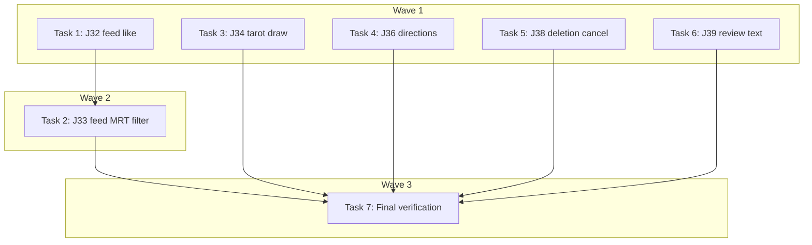

# Phase-2 E2E Stubs (J32–J34, J36, J38–J39) Implementation Plan

> **For Claude:** REQUIRED SUB-SKILL: Use executing-plans to implement this plan task-by-task.

**Design Doc:** [docs/designs/2026-03-25-phase2-e2e-stubs-design.md](../designs/2026-03-25-phase2-e2e-stubs-design.md)

**Spec References:** [SPEC.md §9 — Business Rules](../../SPEC.md)

**PRD References:** —

**Goal:** Replace 6 `test.fixme()` E2E stubs with real `@critical` Playwright tests covering community feed likes, MRT filtering, tarot draw, directions sheet, account deletion cancel, and check-in review visibility.

**Architecture:** Each stub is replaced in-place in its existing spec file. Tests use the established fixtures (`authedPage` for auth-gated flows, `grantGeolocation` for location-dependent flows). Seed data is assumed via `make seed-shops`; tests skip gracefully when data is missing.

**Tech Stack:** Playwright, TypeScript, existing `e2e/fixtures/auth.ts` and `e2e/fixtures/geolocation.ts`

**Acceptance Criteria:**
- [ ] All 6 stubs (`test.fixme()`) are replaced with passing `@critical` tests
- [ ] `npx playwright test e2e/feed.spec.ts e2e/explore.spec.ts e2e/discovery.spec.ts e2e/profile.spec.ts e2e/checkin.spec.ts` passes with 0 failures (given seeded data)
- [ ] J38 (account deletion cancel) restores the test user to normal state after execution
- [ ] No new fixtures or infrastructure introduced — existing patterns reused

---

### Task 1: J32 — Community feed like toggle (`e2e/feed.spec.ts`)

**Files:**
- Modify: `e2e/feed.spec.ts:42-44` (replace `test.fixme` stub)

**Step 1: Write the test**

Replace the J32 stub with a real test. The test needs the `authedPage` fixture, so the import at line 1 must change from `@playwright/test` to `./fixtures/auth`.

> **Important:** `feed.spec.ts` currently imports from `@playwright/test` (for the public J16 tests). Adding J32 with `authedPage` means we need both fixtures. The simplest approach: import `test` and `expect` from `./fixtures/auth` (which re-exports `expect` from `@playwright/test`). The public J16 tests don't destructure `authedPage`, so they still work — the `authedPage` fixture is only instantiated when destructured.

```typescript
// Replace line 1:
// OLD: import { test, expect } from '@playwright/test';
// NEW:
import { test, expect } from './fixtures/auth';

// Replace lines 42-44 with:
test.describe('@critical J32 — Community feed: like toggle increments count', () => {
  test('tapping the like button on a community card increments the like count optimistically', async ({
    authedPage: page,
  }) => {
    await page.goto('/explore/community');
    await page.waitForLoadState('networkidle');

    // Find the first like button (LikeButton has aria-label containing "this note")
    const likeButton = page.locator('button[aria-pressed]').first();
    await expect(likeButton).toBeVisible({ timeout: 10_000 });
    test.skip(!(await likeButton.isVisible()), 'No community notes in feed');

    // Read current count from the <span> sibling inside the button
    const countSpan = likeButton.locator('span').first();
    const beforeText = await countSpan.textContent();
    const beforeCount = parseInt(beforeText ?? '0', 10);
    const wasLiked = (await likeButton.getAttribute('aria-pressed')) === 'true';

    // Tap the like button
    await likeButton.click();

    // Assert state toggled
    const expectedPressed = wasLiked ? 'false' : 'true';
    await expect(likeButton).toHaveAttribute('aria-pressed', expectedPressed);

    // Assert count changed by 1
    const expectedCount = wasLiked ? beforeCount - 1 : beforeCount + 1;
    await expect(countSpan).toHaveText(String(expectedCount), { timeout: 5_000 });
  });
});
```

**Step 2: Run test to verify it passes**

Run: `npx playwright test e2e/feed.spec.ts --grep "J32" -v`
Expected: PASS (or SKIP if no community notes seeded)

**Step 3: Commit**

```bash
git add e2e/feed.spec.ts
git commit -m "test(e2e): implement J32 — community feed like toggle"
```

---

### Task 2: J33 — Community feed MRT filter (`e2e/feed.spec.ts`)

**Files:**
- Modify: `e2e/feed.spec.ts:46-48` (replace `test.fixme` stub)

**Depends on:** Task 1 (same file, import already changed)

**Step 1: Write the test**

Replace the J33 stub. This test uses the public page (no `authedPage` needed), but since we changed the import in Task 1, we destructure `page` directly (not `authedPage`).

```typescript
// Replace lines 46-48 with:
test.describe('@critical J33 — Community feed: MRT filter scopes results', () => {
  test('selecting a MRT station from the dropdown shows only check-ins near that station', async ({
    page,
  }) => {
    await page.goto('/explore/community');
    await page.waitForLoadState('networkidle');

    // MRT station dropdown should be visible
    const mrtSelect = page.getByRole('combobox', { name: /MRT station/i });
    await expect(mrtSelect).toBeVisible({ timeout: 10_000 });

    // Get all options (skip "All stations" default)
    const options = mrtSelect.locator('option');
    const optionCount = await options.count();
    test.skip(optionCount <= 1, 'No MRT station options available beyond "All stations"');

    // Count cards before filtering
    const feedCards = page.locator('div.overflow-hidden.rounded-2xl.border');
    const beforeCount = await feedCards.count();

    // Select the second option (first real MRT station)
    const stationValue = await options.nth(1).getAttribute('value');
    await mrtSelect.selectOption(stationValue!);

    // Wait for feed to reload (URL or network)
    await page.waitForLoadState('networkidle');

    // Assert: either card count changed OR empty state appeared
    const afterCount = await feedCards.count();
    const emptyState = page.getByText('Community notes coming soon');
    const hasChanged = afterCount !== beforeCount;
    const isEmpty = await emptyState.isVisible().catch(() => false);

    expect(hasChanged || isEmpty).toBeTruthy();
  });
});
```

**Step 2: Run test to verify it passes**

Run: `npx playwright test e2e/feed.spec.ts --grep "J33" -v`
Expected: PASS (or SKIP if no MRT options)

**Step 3: Commit**

```bash
git add e2e/feed.spec.ts
git commit -m "test(e2e): implement J33 — community feed MRT filter"
```

---

### Task 3: J34 — Explore tarot draw (`e2e/explore.spec.ts`)

**Files:**
- Modify: `e2e/explore.spec.ts:30-38` (replace `test.fixme` stub)

**Step 1: Write the test**

Replace the J34 stub. The geolocation fixture is already imported in this file.

```typescript
// Replace lines 30-38 with:
test.describe('@critical J34 — Explore: Tarot draw → 3 café cards revealed', () => {
  test('with geolocation granted, the Daily Draw section shows 3 café cards after loading', async ({
    page,
    context,
  }) => {
    await grantGeolocation(context, TAIPEI_COORDS);
    await page.goto('/explore');
    await page.waitForLoadState('networkidle');

    // Wait for the Daily Draw section header
    const dailyDrawHeader = page.getByText(/your daily draw/i);
    await expect(dailyDrawHeader).toBeVisible({ timeout: 15_000 });

    // Check for empty state — skip if no shops in radius
    const emptyState = page.getByText(/enable location|expand radius|no caf/i);
    if (await emptyState.isVisible({ timeout: 2_000 }).catch(() => false)) {
      test.skip(true, 'No shops available in tarot draw radius');
    }

    // Wait for skeleton loaders to disappear (skeletons have animate-pulse)
    await expect(page.locator('.animate-pulse').first()).toBeHidden({ timeout: 15_000 });

    // Should have 3 tarot card buttons (140px height, with tarot-gold border)
    const tarotCards = page.locator('button:has(span.uppercase)');
    await expect(tarotCards).toHaveCount(3, { timeout: 10_000 });

    // Tap the first card to open the reveal drawer
    await tarotCards.first().click();

    // Drawer should open with shop name (h2 heading inside the drawer)
    const drawerHeading = page.getByRole('heading', { level: 2 });
    await expect(drawerHeading).toBeVisible({ timeout: 5_000 });

    // Verify drawer has a "Let's Go" link (navigates to shop detail)
    await expect(page.getByText(/Let's Go/i)).toBeVisible();
  });
});
```

**Step 2: Run test to verify it passes**

Run: `npx playwright test e2e/explore.spec.ts --grep "J34" -v`
Expected: PASS (or SKIP if no shops in radius)

**Step 3: Commit**

```bash
git add e2e/explore.spec.ts
git commit -m "test(e2e): implement J34 — explore tarot draw reveals 3 cards"
```

---

### Task 4: J36 — Shop detail Get Directions (`e2e/discovery.spec.ts`)

**Files:**
- Modify: `e2e/discovery.spec.ts:100-102` (replace `test.fixme` stub)

**Step 1: Write the test**

Replace the J36 stub. Geolocation fixture is already imported.

```typescript
// Replace lines 100-102 with:
test.describe('@critical J36 — Shop detail: tap Get Directions → DirectionsSheet opens', () => {
  test('tapping the Directions button on a shop detail page opens the DirectionsSheet with route options', async ({
    page,
    context,
  }) => {
    await grantGeolocation(context, TAIPEI_COORDS);

    // Fetch a seeded shop with coordinates
    const response = await page.request.get('/api/shops?featured=true&limit=1');
    const shops = await response.json();
    const shop = shops[0];
    test.skip(!shop, 'No seeded shops available');

    // Navigate to the shop detail page
    await page.goto(`/shops/${shop.id}/${shop.slug || ''}`);
    await page.waitForLoadState('networkidle');

    // "Get There" button should be visible (only renders if shop has lat/lng)
    const getThereBtn = page.getByRole('button', { name: /get there/i });
    test.skip(!(await getThereBtn.isVisible({ timeout: 5_000 }).catch(() => false)),
      'Shop has no coordinates — Get There button not rendered');

    // Tap "Get There"
    await getThereBtn.click();

    // DirectionsSheet should open with "Directions" heading
    await expect(page.getByText('Directions')).toBeVisible({ timeout: 10_000 });

    // At least one route info row should appear (Walking, Driving, or MRT station name)
    const routeRow = page.getByText(/Walking|Driving|Station/i).first();
    await expect(routeRow).toBeVisible({ timeout: 10_000 });

    // Google Maps and Apple Maps deep links should be present
    await expect(page.getByRole('link', { name: /Google Maps/i })).toBeVisible();
    await expect(page.getByRole('link', { name: /Apple Maps/i })).toBeVisible();
  });
});
```

**Step 2: Run test to verify it passes**

Run: `npx playwright test e2e/discovery.spec.ts --grep "J36" -v`
Expected: PASS (or SKIP if no seeded shops)

**Step 3: Commit**

```bash
git add e2e/discovery.spec.ts
git commit -m "test(e2e): implement J36 — shop detail Get Directions opens sheet"
```

---

### Task 5: J38 — Account deletion cancel (`e2e/profile.spec.ts`)

**Files:**
- Modify: `e2e/profile.spec.ts:58-60` (replace `test.fixme` stub)

**Step 1: Write the test**

This is a serial test that modifies account state. The auth fixture is already imported.

```typescript
// Replace lines 58-60 with:
test.describe.serial('@critical J38 — Account deletion: cancel during grace period', () => {
  test('a user in the 30-day grace period can cancel deletion from the recovery page', async ({
    authedPage: page,
  }) => {
    // Step 1: Navigate to settings and initiate account deletion
    await page.goto('/settings');
    await page.waitForLoadState('networkidle');

    const deleteButton = page.getByRole('button', {
      name: /delete account|刪除帳號/i,
    });
    await expect(deleteButton).toBeVisible({ timeout: 10_000 });
    await deleteButton.click();

    // Step 2: Type "DELETE" in the confirmation input
    const confirmInput = page.getByPlaceholder('Type DELETE');
    await expect(confirmInput).toBeVisible({ timeout: 5_000 });
    await confirmInput.fill('DELETE');

    // Step 3: Click "Confirm Delete"
    const confirmButton = page.getByRole('button', { name: /Confirm Delete/i });
    await expect(confirmButton).toBeEnabled();
    await confirmButton.click();

    // Step 4: Wait for deletion to process — should show grace period messaging
    // The page may redirect or show a confirmation
    await expect(
      page.getByText(/30.*(day|天)|grace period|scheduled for deletion|即將刪除/i)
    ).toBeVisible({ timeout: 10_000 });

    // Step 5: Navigate to recovery page and cancel
    await page.goto('/account/recover');
    await page.waitForLoadState('networkidle');

    const cancelButton = page.getByRole('button', {
      name: /Cancel Deletion|取消刪除/i,
    });
    await expect(cancelButton).toBeVisible({ timeout: 10_000 });
    await cancelButton.click();

    // Step 6: Should redirect to home after cancellation
    await page.waitForURL('/', { timeout: 15_000 });
    expect(page.url()).toMatch(/\/$/);

    // Step 7: Verify account is restored — profile page loads normally
    await page.goto('/profile');
    await page.waitForLoadState('networkidle');
    await expect(
      page.locator('[data-testid="profile-header"], header').first()
    ).toBeVisible({ timeout: 10_000 });
  });
});
```

**Step 2: Run test to verify it passes**

Run: `npx playwright test e2e/profile.spec.ts --grep "J38" -v`
Expected: PASS (account is deleted then restored within the same test)

**Step 3: Commit**

```bash
git add e2e/profile.spec.ts
git commit -m "test(e2e): implement J38 — account deletion cancel during grace period"
```

---

### Task 6: J39 — Check-in with review text visible on shop page (`e2e/checkin.spec.ts`)

**Files:**
- Modify: `e2e/checkin.spec.ts:77-79` (replace `test.fixme` stub)

**Step 1: Write the test**

This test creates a check-in with review text, then navigates to the shop page to verify the review appears. The auth fixture and test photo are already imported/defined.

```typescript
// Replace lines 77-79 with:
test.describe('@critical J39 — Check-in with review text → review visible on shop page', () => {
  test('submitting a check-in with a text note shows the review in the shop detail reviews section', async ({
    authedPage: page,
  }) => {
    // Get a seeded shop
    const response = await page.request.get('/api/shops?featured=true&limit=1');
    const shops = await response.json();
    const shop = shops[0];
    test.skip(!shop, 'No seeded shops available');

    // Navigate to check-in page
    await page.goto(`/checkin/${shop.id}`);
    await expect(page.getByText('Check In')).toBeVisible({ timeout: 10_000 });

    // Upload a test photo (required for check-in)
    const fileInput = page.locator('[data-testid="photo-input"]');
    await fileInput.setInputFiles(TEST_PHOTO);
    await expect(page.locator('img[src^="blob:"]')).toBeVisible({ timeout: 10_000 });

    // Give a star rating (required before review text textarea appears)
    const threeStarBtn = page.getByRole('button', { name: /3 stars/i });
    await threeStarBtn.click();

    // Fill in the review text with a distinctive string
    const reviewText = `E2E test review ${Date.now()} — excellent espresso`;
    const reviewTextarea = page.getByPlaceholder(/How was your visit/i);
    await expect(reviewTextarea).toBeVisible({ timeout: 5_000 });
    await reviewTextarea.fill(reviewText);

    // Submit the check-in
    const submitButton = page.getByRole('button', { name: /打卡|Check In/i });
    await submitButton.click();

    // Wait for navigation away from check-in page
    await page.waitForURL((url) => !url.pathname.startsWith('/checkin'), {
      timeout: 15_000,
    });

    // Navigate to the shop detail page
    await page.goto(`/shops/${shop.id}/${shop.slug || ''}`);
    await page.waitForLoadState('networkidle');

    // Scroll to the reviews section — "打卡評價" heading
    const reviewsHeading = page.getByRole('heading', { name: '打卡評價' });
    await expect(reviewsHeading).toBeVisible({ timeout: 10_000 });

    // Assert the review text we just submitted is visible on the page
    await expect(page.getByText(reviewText)).toBeVisible({ timeout: 10_000 });
  });
});
```

**Step 2: Run test to verify it passes**

Run: `npx playwright test e2e/checkin.spec.ts --grep "J39" -v`
Expected: PASS (or SKIP if no seeded shops)

**Step 3: Commit**

```bash
git add e2e/checkin.spec.ts
git commit -m "test(e2e): implement J39 — check-in review text visible on shop page"
```

---

### Task 7: Final verification — run all 6 journeys together

**Files:** None (verification only)

**Step 1: Run all affected spec files**

```bash
npx playwright test e2e/feed.spec.ts e2e/explore.spec.ts e2e/discovery.spec.ts e2e/profile.spec.ts e2e/checkin.spec.ts --grep "J32|J33|J34|J36|J38|J39" -v
```

Expected: All 6 tests PASS (or SKIP with clear reasons)

**Step 2: Run full E2E suite to check no regressions**

```bash
npx playwright test -v
```

Expected: No new failures in existing tests (J01, J02, J03, J10, J11, J14, J15, J16, J35)

**Step 3: Commit design doc (if not yet committed)**

```bash
git add docs/designs/2026-03-25-phase2-e2e-stubs-design.md
git commit -m "docs: add Phase-2 E2E stubs design (DEV-25)"
```

---

## Execution Waves



**Wave 1** (parallel — no dependencies, each touches a different file):
- Task 1: J32 feed like toggle (`feed.spec.ts`)
- Task 3: J34 tarot draw (`explore.spec.ts`)
- Task 4: J36 directions sheet (`discovery.spec.ts`)
- Task 5: J38 deletion cancel (`profile.spec.ts`)
- Task 6: J39 review text (`checkin.spec.ts`)

**Wave 2** (depends on Task 1 — same file):
- Task 2: J33 MRT filter (`feed.spec.ts`) ← Task 1

**Wave 3** (depends on all):
- Task 7: Final verification ← All tasks

**Note:** Task 1 changes the import in `feed.spec.ts` from `@playwright/test` to `./fixtures/auth`. Task 2 depends on this import change, so it must run after Task 1. All other tasks touch different files and can run in parallel.
