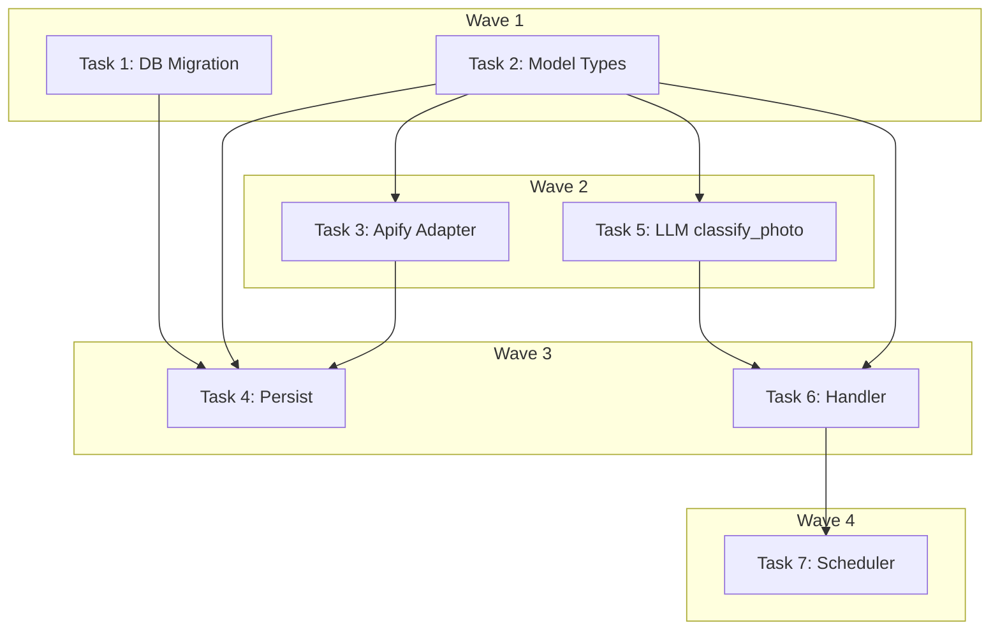

# DEV-18: Photo Classification Implementation Plan

> **For Claude:** REQUIRED SUB-SKILL: Use executing-plans to implement this plan task-by-task.

**Design Doc:** [docs/designs/2026-03-25-dev18-photo-classification-design.md](docs/designs/2026-03-25-dev18-photo-classification-design.md)

**Spec References:** —

**PRD References:** —

**Goal:** Classify scraped shop photos as MENU/VIBE/SKIP via an async worker using Claude Haiku Vision on thumbnails, so DEV-6 gets reliable menu photos and shop pages get quality vibe photos.

**Architecture:** Two-phase approach: (1) enhance the Apify scraper adapter to parse `images[]` with `uploadedAt` + age filter, (2) add an async classification worker that fetches unclassified photos, rewrites URLs to thumbnails, sends each to Claude Haiku, and updates `shop_photos.category` + `is_menu`. Follows the existing `enrich_menu_photo` worker pattern.

**Tech Stack:** Python 3.12+, Pydantic, Anthropic SDK (Claude Haiku Vision), Supabase (Postgres), pytest

**Acceptance Criteria:**
- [ ] Apify adapter extracts `images[]` with `uploadedAt`, filters photos older than 5yr, caps at 30
- [ ] Persist layer writes `uploaded_at` to `shop_photos` and enqueues classification job
- [ ] Classification worker classifies each photo as MENU/VIBE/SKIP and enforces 5 MENU + 10 VIBE caps
- [ ] Running the classifier on an already-classified shop is a no-op

---

### Task 1: DB migration — add `uploaded_at` to `shop_photos`

**Files:**
- Create: `supabase/migrations/20260325000006_add_uploaded_at_to_shop_photos.sql`

No test needed — pure schema change.

**Step 1: Write migration**

```sql
-- Add uploaded_at to shop_photos for age-based filtering
ALTER TABLE shop_photos ADD COLUMN IF NOT EXISTS uploaded_at TIMESTAMPTZ;

-- Index for the classification worker: fetch unclassified photos per shop
CREATE INDEX IF NOT EXISTS idx_shop_photos_unclassified
    ON shop_photos (shop_id)
    WHERE category IS NULL;
```

**Step 2: Commit**

```bash
git add supabase/migrations/20260325000006_add_uploaded_at_to_shop_photos.sql
git commit -m "chore: add uploaded_at column and unclassified index to shop_photos"
```

---

### Task 2: Model types — `PhotoCategory`, `ScrapedPhotoData`, `CLASSIFY_SHOP_PHOTOS` job type

**Files:**
- Modify: `backend/models/types.py` (add `PhotoCategory` enum after line 388, add `CLASSIFY_SHOP_PHOTOS` to `JobType`)
- Modify: `backend/providers/scraper/interface.py` (add `ScrapedPhotoData`, change `photo_urls` → `photos`)
- Test: `backend/tests/models/test_types.py`

**Step 1: Write failing tests**

Add to `backend/tests/models/test_types.py`:

```python
from models.types import PhotoCategory


class TestPhotoCategory:
    def test_photo_category_values(self):
        """Photo categories cover the three classification buckets."""
        assert PhotoCategory.MENU == "MENU"
        assert PhotoCategory.VIBE == "VIBE"
        assert PhotoCategory.SKIP == "SKIP"

    def test_photo_category_membership(self):
        """A string can be validated as a PhotoCategory."""
        assert PhotoCategory("MENU") == PhotoCategory.MENU
```

**Step 2: Run tests to verify they fail**

```bash
cd backend && uv run pytest tests/models/test_types.py::TestPhotoCategory -v
```

Expected: `ImportError: cannot import name 'PhotoCategory'`

**Step 3: Implement types**

In `backend/models/types.py`, add after line 388 (after `CHECKIN_MIN_TEXT_LENGTH`):

```python
class PhotoCategory(StrEnum):
    MENU = "MENU"
    VIBE = "VIBE"
    SKIP = "SKIP"
```

In `backend/models/types.py`, add to `JobType` enum (after `ADMIN_DIGEST_EMAIL`):

```python
    CLASSIFY_SHOP_PHOTOS = "classify_shop_photos"
```

In `backend/providers/scraper/interface.py`, add `ScrapedPhotoData` and update `ScrapedShopData`:

```python
from datetime import datetime


class ScrapedPhotoData(BaseModel):
    """A single photo from the scraper with optional upload timestamp."""

    url: str
    uploaded_at: datetime | None = None


class ScrapedShopData(BaseModel):
    # ... all existing fields remain ...
    # CHANGE this line:
    #   photo_urls: list[str] = []
    # TO:
    photos: list[ScrapedPhotoData] = []
```

**Step 4: Run tests to verify they pass**

```bash
cd backend && uv run pytest tests/models/test_types.py::TestPhotoCategory -v
```

Expected: PASS

**Step 5: Commit**

```bash
git add backend/models/types.py backend/providers/scraper/interface.py
git commit -m "feat(DEV-18): add PhotoCategory enum, ScrapedPhotoData model, CLASSIFY_SHOP_PHOTOS job type"
```

---

### Task 3: Apify adapter — parse `images[]` with age filter, cap, fallback

**Files:**
- Modify: `backend/providers/scraper/apify_adapter.py` (update `_parse_place`)
- Test: `backend/tests/providers/test_apify_adapter.py`

**Depends on:** Task 2

**Step 1: Write failing tests**

Replace / extend tests in `backend/tests/providers/test_apify_adapter.py`:

```python
from datetime import UTC, datetime, timedelta
from unittest.mock import AsyncMock, patch

import pytest

from providers.scraper.apify_adapter import ApifyScraperAdapter


@pytest.fixture
def adapter():
    return ApifyScraperAdapter(api_token="test-token")


@pytest.mark.asyncio
async def test_parse_images_array_with_uploaded_at(adapter):
    """When Apify returns images[] with uploadedAt, photos carry timestamps."""
    mock_result = {
        "title": "Fika Fika",
        "address": "台北市松山區伊通街33號",
        "location": {"lat": 25.052, "lng": 121.533},
        "placeId": "ChIJ_fika01",
        "images": [
            {
                "imageUrl": "https://lh5.googleusercontent.com/p/AF1Qip_photo1=w1920-h1080-k-no",
                "uploadedAt": "2025-06-15T10:30:00.000Z",
            },
            {
                "imageUrl": "https://lh5.googleusercontent.com/p/AF1Qip_photo2=w1920-h1080-k-no",
                "uploadedAt": "2024-01-10T08:00:00.000Z",
            },
        ],
        "imageUrls": ["https://old-flat-url.jpg"],
        "reviews": [],
    }

    with patch.object(adapter, "_run_actor", new_callable=AsyncMock) as mock_run:
        mock_run.return_value = [mock_result]
        result = await adapter.scrape_by_url("https://maps.google.com/?cid=fika")

    assert result is not None
    assert len(result.photos) == 2
    assert result.photos[0].url == "https://lh5.googleusercontent.com/p/AF1Qip_photo1=w1920-h1080-k-no"
    assert result.photos[0].uploaded_at is not None
    assert result.photos[0].uploaded_at.year == 2025


@pytest.mark.asyncio
async def test_age_filter_drops_photos_older_than_5_years(adapter):
    """Photos with uploadedAt older than 5 years are filtered out."""
    now = datetime.now(UTC)
    old_date = (now - timedelta(days=365 * 6)).isoformat()
    recent_date = (now - timedelta(days=30)).isoformat()

    mock_result = {
        "title": "Old & New",
        "address": "台北市中山區",
        "location": {"lat": 25.05, "lng": 121.52},
        "placeId": "ChIJ_oldnew",
        "images": [
            {"imageUrl": "https://cdn/old.jpg", "uploadedAt": old_date},
            {"imageUrl": "https://cdn/recent.jpg", "uploadedAt": recent_date},
        ],
        "reviews": [],
    }

    with patch.object(adapter, "_run_actor", new_callable=AsyncMock) as mock_run:
        mock_run.return_value = [mock_result]
        result = await adapter.scrape_by_url("https://maps.google.com/?cid=oldnew")

    assert len(result.photos) == 1
    assert result.photos[0].url == "https://cdn/recent.jpg"


@pytest.mark.asyncio
async def test_cap_at_30_photos_sorted_by_recency(adapter):
    """When more than 30 photos exist, only the 30 most recent are kept."""
    now = datetime.now(UTC)
    images = [
        {
            "imageUrl": f"https://cdn/photo{i}.jpg",
            "uploadedAt": (now - timedelta(days=i)).isoformat(),
        }
        for i in range(40)
    ]

    mock_result = {
        "title": "Many Photos",
        "address": "台北市",
        "location": {"lat": 25.0, "lng": 121.5},
        "placeId": "ChIJ_many",
        "images": images,
        "reviews": [],
    }

    with patch.object(adapter, "_run_actor", new_callable=AsyncMock) as mock_run:
        mock_run.return_value = [mock_result]
        result = await adapter.scrape_by_url("https://maps.google.com/?cid=many")

    assert len(result.photos) == 30
    # Most recent first (day 0 = today)
    assert "photo0" in result.photos[0].url


@pytest.mark.asyncio
async def test_fallback_to_image_urls_when_images_absent(adapter):
    """When images[] is absent, fall back to imageUrls with no uploaded_at."""
    mock_result = {
        "title": "Flat Only",
        "address": "台北市",
        "location": {"lat": 25.0, "lng": 121.5},
        "placeId": "ChIJ_flat",
        "imageUrls": ["https://cdn/a.jpg", "https://cdn/b.jpg"],
        "reviews": [],
    }

    with patch.object(adapter, "_run_actor", new_callable=AsyncMock) as mock_run:
        mock_run.return_value = [mock_result]
        result = await adapter.scrape_by_url("https://maps.google.com/?cid=flat")

    assert len(result.photos) == 2
    assert result.photos[0].uploaded_at is None
    assert result.photos[0].url == "https://cdn/a.jpg"


@pytest.mark.asyncio
async def test_scrape_by_url_returns_shop_data(adapter):
    """Full scrape result is parsed correctly (updated for photos field)."""
    mock_result = {
        "title": "Good Coffee",
        "address": "123 Test St, Taipei",
        "location": {"lat": 25.033, "lng": 121.565},
        "totalScore": 4.5,
        "reviewsCount": 42,
        "openingHours": [{"day": "Monday", "hours": "9:00 AM - 6:00 PM"}],
        "phone": "+886-2-1234-5678",
        "website": "https://goodcoffee.tw",
        "placeId": "ChIJ_test123",
        "reviews": [
            {"text": "Great latte", "stars": 5, "publishedAtDate": "2025-12-01"},
            {"text": "Nice ambience", "stars": 4, "publishedAtDate": "2025-11-15"},
        ],
        "imageUrls": ["https://img1.jpg", "https://img2.jpg"],
        "menu": "https://goodcoffee.tw/menu",
        "categoryName": "Coffee shop",
    }

    with patch.object(adapter, "_run_actor", new_callable=AsyncMock) as mock_run:
        mock_run.return_value = [mock_result]
        result = await adapter.scrape_by_url("https://maps.google.com/?cid=123")

    assert result is not None
    assert result.name == "Good Coffee"
    assert result.google_place_id == "ChIJ_test123"
    assert result.latitude == 25.033
    assert len(result.reviews) == 2
    assert len(result.photos) == 2
    assert result.opening_hours == ["Monday: 9:00 AM - 6:00 PM"]


@pytest.mark.asyncio
async def test_scrape_by_url_returns_none_when_not_found(adapter):
    with patch.object(adapter, "_run_actor", new_callable=AsyncMock) as mock_run:
        mock_run.return_value = []
        result = await adapter.scrape_by_url("https://maps.google.com/?cid=invalid")

    assert result is None


@pytest.mark.asyncio
async def test_scrape_reviews_only_returns_reviews(adapter):
    mock_result = {
        "placeId": "ChIJ_test123",
        "reviews": [
            {"text": "New review", "stars": 5, "publishedAtDate": "2026-02-01"},
        ],
    }

    with patch.object(adapter, "_run_actor", new_callable=AsyncMock) as mock_run:
        mock_run.return_value = [mock_result]
        reviews = await adapter.scrape_reviews_only("ChIJ_test123")

    assert len(reviews) == 1
    assert reviews[0]["text"] == "New review"
```

**Step 2: Run tests to verify they fail**

```bash
cd backend && uv run pytest tests/providers/test_apify_adapter.py -v
```

Expected: failures on new test functions (AttributeError: `result.photos` doesn't exist yet)

**Step 3: Implement `_parse_place` changes**

In `backend/providers/scraper/apify_adapter.py`:

```python
import asyncio
from datetime import UTC, datetime, timedelta
from typing import Any

import structlog
from apify_client import ApifyClient

from providers.scraper.interface import BatchScrapeInput, BatchScrapeResult, ScrapedPhotoData, ScrapedShopData

logger = structlog.get_logger()

_ACTOR_ID = "compass/crawler-google-places"
_PHOTO_MAX_AGE = timedelta(days=365 * 5)
_PHOTO_CAP = 30
```

Update `_parse_place` method:

```python
    def _parse_place(self, place: dict[str, Any]) -> ScrapedShopData:
        """Parse a raw Apify place dict into ScrapedShopData."""
        location = place.get("location") or {}
        return ScrapedShopData(
            name=place.get("title", ""),
            address=place.get("address", ""),
            latitude=location.get("lat", 0.0),
            longitude=location.get("lng", 0.0),
            google_place_id=place.get("placeId", ""),
            rating=place.get("totalScore"),
            review_count=place.get("reviewsCount", 0),
            opening_hours=[
                f"{h.get('day', '')}: {h.get('hours', '')}".strip(": ")
                for h in place.get("openingHours") or []
                if isinstance(h, dict)
            ]
            or None,
            phone=place.get("phone"),
            website=place.get("website"),
            menu_url=place.get("menu"),
            country_code=place.get("countryCode"),
            price_range=place.get("price"),
            permanently_closed=bool(place.get("permanentlyClosed", False)),
            categories=[place["categoryName"]] if place.get("categoryName") else [],
            reviews=[
                {
                    "text": r.get("text", ""),
                    "stars": r.get("stars"),
                    "published_at": r.get("publishedAtDate"),
                }
                for r in place.get("reviews", [])
                if r.get("text")
            ],
            photos=self._parse_photos(place),
        )

    def _parse_photos(self, place: dict[str, Any]) -> list[ScrapedPhotoData]:
        """Parse photos from images[] (preferred) or imageUrls[] (fallback)."""
        images = place.get("images")
        if images and isinstance(images, list):
            return self._parse_images_array(images)
        # Fallback: flat imageUrls with no metadata
        return [
            ScrapedPhotoData(url=url)
            for url in place.get("imageUrls", [])[:_PHOTO_CAP]
        ]

    def _parse_images_array(self, images: list[dict[str, Any]]) -> list[ScrapedPhotoData]:
        """Parse rich images[] objects, filter by age, cap, sort by recency."""
        now = datetime.now(UTC)
        cutoff = now - _PHOTO_MAX_AGE
        photos: list[ScrapedPhotoData] = []

        for img in images:
            url = img.get("imageUrl")
            if not url:
                continue
            uploaded_at = None
            raw_date = img.get("uploadedAt")
            if raw_date:
                try:
                    uploaded_at = datetime.fromisoformat(raw_date.replace("Z", "+00:00"))
                except (ValueError, AttributeError):
                    pass
            # Age filter: skip old photos (only when we have a date)
            if uploaded_at and uploaded_at < cutoff:
                continue
            photos.append(ScrapedPhotoData(url=url, uploaded_at=uploaded_at))

        # Sort by recency (newest first); photos without dates go last
        photos.sort(key=lambda p: p.uploaded_at or datetime.min.replace(tzinfo=UTC), reverse=True)
        return photos[:_PHOTO_CAP]
```

**Step 4: Run tests to verify they pass**

```bash
cd backend && uv run pytest tests/providers/test_apify_adapter.py -v
```

Expected: all PASS

**Step 5: Commit**

```bash
git add backend/providers/scraper/apify_adapter.py backend/tests/providers/test_apify_adapter.py
git commit -m "feat(DEV-18): parse images[] with age filter and cap in apify adapter"
```

---

### Task 4: Persist layer — write `uploaded_at`, enqueue classification job

**Files:**
- Modify: `backend/workers/persist.py` (update photo upsert + add enqueue)
- Test: `backend/tests/workers/test_persist.py` (create if not exists, or add to existing handler tests)

**Depends on:** Task 2

**Step 1: Write failing tests**

Create or add to `backend/tests/workers/test_persist.py`:

```python
from unittest.mock import AsyncMock, MagicMock

import pytest

from models.types import JobType
from providers.scraper.interface import ScrapedPhotoData, ScrapedShopData
from workers.persist import persist_scraped_data


def _make_shop_data(**overrides) -> ScrapedShopData:
    defaults = {
        "name": "Rufous Coffee",
        "address": "台北市大安區復興南路二段79號",
        "latitude": 25.033,
        "longitude": 121.544,
        "google_place_id": "ChIJ_rufous",
    }
    defaults.update(overrides)
    return ScrapedShopData(**defaults)


@pytest.fixture
def mock_db():
    db = MagicMock()
    db.table.return_value.upsert.return_value.execute.return_value = MagicMock(data=[])
    db.table.return_value.update.return_value.eq.return_value.execute.return_value = MagicMock()
    return db


@pytest.fixture
def mock_queue():
    return AsyncMock()


@pytest.mark.asyncio
async def test_persist_photos_includes_uploaded_at(mock_db, mock_queue):
    """When photos have uploaded_at, the upsert includes the timestamp."""
    from datetime import UTC, datetime

    ts = datetime(2025, 6, 15, 10, 0, tzinfo=UTC)
    data = _make_shop_data(
        photos=[ScrapedPhotoData(url="https://cdn/photo1.jpg", uploaded_at=ts)]
    )

    await persist_scraped_data(shop_id="shop-01", data=data, db=mock_db, queue=mock_queue)

    # Find the shop_photos upsert call
    calls = mock_db.table.call_args_list
    photo_call = [c for c in calls if c.args == ("shop_photos",)]
    assert len(photo_call) >= 1

    upsert_call = mock_db.table.return_value.upsert
    upsert_call.assert_called_once()
    rows = upsert_call.call_args[0][0]
    assert rows[0]["uploaded_at"] == ts.isoformat()


@pytest.mark.asyncio
async def test_persist_enqueues_classify_job_when_photos_present(mock_db, mock_queue):
    """After persisting photos, a classify_shop_photos job is enqueued."""
    data = _make_shop_data(
        photos=[ScrapedPhotoData(url="https://cdn/p1.jpg")]
    )

    await persist_scraped_data(shop_id="shop-01", data=data, db=mock_db, queue=mock_queue)

    # Check that classify_shop_photos was enqueued
    enqueue_calls = mock_queue.enqueue.call_args_list
    classify_calls = [
        c for c in enqueue_calls
        if c.kwargs.get("job_type") == JobType.CLASSIFY_SHOP_PHOTOS
    ]
    assert len(classify_calls) == 1
    assert classify_calls[0].kwargs["payload"]["shop_id"] == "shop-01"


@pytest.mark.asyncio
async def test_persist_skips_classify_when_no_photos(mock_db, mock_queue):
    """When there are no photos, no classification job is enqueued."""
    data = _make_shop_data(photos=[])

    await persist_scraped_data(shop_id="shop-01", data=data, db=mock_db, queue=mock_queue)

    enqueue_calls = mock_queue.enqueue.call_args_list
    classify_calls = [
        c for c in enqueue_calls
        if c.kwargs.get("job_type") == JobType.CLASSIFY_SHOP_PHOTOS
    ]
    assert len(classify_calls) == 0
```

**Step 2: Run tests to verify they fail**

```bash
cd backend && uv run pytest tests/workers/test_persist.py -v
```

Expected: failures (field `photo_urls` no longer exists, `uploaded_at` not written)

**Step 3: Update `persist.py`**

In `backend/workers/persist.py`, replace the photo persistence block (lines ~119-125):

```python
    # Store photos — upsert on (shop_id, url) to avoid duplicates on re-scrape
    if data.photos:
        photo_rows = [
            {
                "shop_id": shop_id,
                "url": photo.url,
                "uploaded_at": photo.uploaded_at.isoformat() if photo.uploaded_at else None,
                "sort_order": i,
            }
            for i, photo in enumerate(data.photos)
        ]
        db.table("shop_photos").upsert(photo_rows, on_conflict="shop_id,url").execute()

        # Queue photo classification (low priority — runs after enrichment)
        await queue.enqueue(
            job_type=JobType.CLASSIFY_SHOP_PHOTOS,
            payload={"shop_id": shop_id},
            priority=2,
        )
```

Also add import at top: `from models.types import JobType` (if not already imported).

**Step 4: Run tests to verify they pass**

```bash
cd backend && uv run pytest tests/workers/test_persist.py -v
```

Expected: PASS

**Important:** Also run existing persist-related tests to check for regressions. Any test that previously passed `photo_urls=` to `ScrapedShopData` must be updated to use `photos=`:

```bash
cd backend && uv run pytest tests/workers/ -v -k "persist or scrape"
```

Fix any failing tests by replacing `photo_urls=["url"]` with `photos=[ScrapedPhotoData(url="url")]` in test fixtures.

**Step 5: Commit**

```bash
git add backend/workers/persist.py backend/tests/workers/test_persist.py
# Include any updated test files with photo_urls → photos migration
git commit -m "feat(DEV-18): persist uploaded_at and enqueue classify_shop_photos job"
```

---

### Task 5: LLM provider — add `classify_photo` method

**Files:**
- Modify: `backend/providers/llm/interface.py` (add method to protocol)
- Modify: `backend/providers/llm/anthropic_adapter.py` (implement with Haiku + tool use)
- Modify: `backend/providers/llm/__init__.py` (pass classify_model to adapter)
- Modify: `backend/core/config.py` (add `anthropic_classify_model` setting)
- Test: `backend/tests/providers/test_anthropic_adapter.py` (create or extend)

**Depends on:** Task 2

**Step 1: Write failing test**

Create `backend/tests/providers/test_llm_classify.py`:

```python
from unittest.mock import AsyncMock, MagicMock, patch

import pytest

from models.types import PhotoCategory
from providers.llm.anthropic_adapter import AnthropicLLMAdapter


@pytest.fixture
def adapter():
    with patch("providers.llm.anthropic_adapter.AsyncAnthropic") as mock_cls:
        instance = mock_cls.return_value
        a = AnthropicLLMAdapter(
            api_key="test-key",
            model="claude-sonnet-4-6",
            classify_model="claude-haiku-4-5-20251001",
            taxonomy=[],
        )
        a._client = instance
        return a


@pytest.mark.asyncio
async def test_classify_photo_returns_menu_category(adapter):
    """When Claude classifies a photo as MENU, the method returns PhotoCategory.MENU."""
    mock_response = MagicMock()
    mock_response.content = [
        MagicMock(
            type="tool_use",
            name="classify_photo",
            input={"category": "MENU"},
        )
    ]
    adapter._client.messages.create = AsyncMock(return_value=mock_response)

    result = await adapter.classify_photo("https://cdn/menu.jpg")

    assert result == PhotoCategory.MENU
    # Verify Haiku model was used, not Sonnet
    call_kwargs = adapter._client.messages.create.call_args.kwargs
    assert "haiku" in call_kwargs["model"]


@pytest.mark.asyncio
async def test_classify_photo_sends_image_url(adapter):
    """The image URL is sent in the correct Vision API format."""
    mock_response = MagicMock()
    mock_response.content = [
        MagicMock(type="tool_use", name="classify_photo", input={"category": "VIBE"})
    ]
    adapter._client.messages.create = AsyncMock(return_value=mock_response)

    await adapter.classify_photo("https://cdn/cozy-interior.jpg")

    call_kwargs = adapter._client.messages.create.call_args.kwargs
    messages = call_kwargs["messages"]
    image_block = messages[0]["content"][0]
    assert image_block["type"] == "image"
    assert image_block["source"]["url"] == "https://cdn/cozy-interior.jpg"
```

**Step 2: Run tests to verify they fail**

```bash
cd backend && uv run pytest tests/providers/test_llm_classify.py -v
```

Expected: `TypeError` (classify_model not accepted) or `AttributeError` (classify_photo doesn't exist)

**Step 3: Implement**

In `backend/core/config.py`, add to Settings class:

```python
    anthropic_classify_model: str = "claude-haiku-4-5-20251001"
```

In `backend/providers/llm/interface.py`, add method to `LLMProvider` protocol:

```python
from models.types import (
    EnrichmentResult,
    MenuExtractionResult,
    PhotoCategory,
    ShopEnrichmentInput,
    TarotEnrichmentResult,
)


class LLMProvider(Protocol):
    async def enrich_shop(self, shop: ShopEnrichmentInput) -> EnrichmentResult: ...

    async def extract_menu_data(self, image_url: str) -> MenuExtractionResult: ...

    async def assign_tarot(self, shop: ShopEnrichmentInput) -> TarotEnrichmentResult: ...

    async def classify_photo(self, image_url: str) -> PhotoCategory: ...
```

In `backend/providers/llm/anthropic_adapter.py`, add tool definition near other tools:

```python
CLASSIFY_PHOTO_TOOL = {
    "name": "classify_photo",
    "description": "Classify a coffee shop photo into one category.",
    "input_schema": {
        "type": "object",
        "properties": {
            "category": {
                "type": "string",
                "enum": ["MENU", "VIBE", "SKIP"],
                "description": (
                    "MENU: photo contains readable menu board, price list, or drink list text. "
                    "VIBE: photo shows shop ambience, interior, exterior, or food/drinks. "
                    "SKIP: photo is blurry, irrelevant, or primarily shows people."
                ),
            },
        },
        "required": ["category"],
    },
}
```

Update `AnthropicLLMAdapter.__init__` to accept `classify_model`:

```python
    def __init__(
        self,
        api_key: str,
        model: str,
        taxonomy: list[TaxonomyTag],
        classify_model: str = "claude-haiku-4-5-20251001",
    ):
        self._client = AsyncAnthropic(api_key=api_key)
        self._model = model
        self._classify_model = classify_model
        self._taxonomy = taxonomy
```

Add the `classify_photo` method:

```python
    async def classify_photo(self, image_url: str) -> PhotoCategory:
        response = await self._client.messages.create(
            model=self._classify_model,
            max_tokens=128,
            messages=[
                {
                    "role": "user",
                    "content": [
                        {
                            "type": "image",
                            "source": {"type": "url", "url": image_url},
                        },
                        {
                            "type": "text",
                            "text": (
                                "Classify this coffee shop photo. "
                                "If both MENU and VIBE apply, choose MENU."
                            ),
                        },
                    ],
                }
            ],
            tools=[CLASSIFY_PHOTO_TOOL],
            tool_choice={"type": "tool", "name": "classify_photo"},
        )

        tool_input = self._extract_tool_input(response, "classify_photo")
        return PhotoCategory(tool_input["category"])
```

Add import at top of `anthropic_adapter.py`:

```python
from models.types import (
    EnrichmentResult,
    MenuExtractionResult,
    PhotoCategory,
    ShopEnrichmentInput,
    ShopModeScores,
    TarotEnrichmentResult,
    TaxonomyTag,
)
```

In `backend/providers/llm/__init__.py`, update factory:

```python
def get_llm_provider(taxonomy: list[TaxonomyTag] | None = None) -> LLMProvider:
    match settings.llm_provider:
        case "anthropic":
            from providers.llm.anthropic_adapter import AnthropicLLMAdapter

            return AnthropicLLMAdapter(
                api_key=settings.anthropic_api_key,
                model=settings.anthropic_model,
                classify_model=settings.anthropic_classify_model,
                taxonomy=taxonomy or [],
            )
        case _:
            raise ValueError(f"Unknown LLM provider: {settings.llm_provider}")
```

**Step 4: Run tests to verify they pass**

```bash
cd backend && uv run pytest tests/providers/test_llm_classify.py -v
```

Expected: PASS

**Step 5: Commit**

```bash
git add backend/core/config.py backend/providers/llm/interface.py backend/providers/llm/anthropic_adapter.py backend/providers/llm/__init__.py backend/tests/providers/test_llm_classify.py
git commit -m "feat(DEV-18): add classify_photo to LLM provider with Haiku model"
```

---

### Task 6: Classification worker handler

**Files:**
- Create: `backend/workers/handlers/classify_shop_photos.py`
- Test: `backend/tests/workers/test_classify_shop_photos.py`

**Depends on:** Task 2, Task 5

**Step 1: Write failing tests**

Create `backend/tests/workers/test_classify_shop_photos.py`:

```python
import re
from unittest.mock import AsyncMock, MagicMock, call

import pytest

from models.types import PhotoCategory


class TestThumbnailUrl:
    def test_rewrites_google_cdn_size_suffix(self):
        from workers.handlers.classify_shop_photos import to_thumbnail_url

        url = "https://lh5.googleusercontent.com/p/AF1Qip_abc=w1920-h1080-k-no"
        result = to_thumbnail_url(url)
        assert result == "https://lh5.googleusercontent.com/p/AF1Qip_abc=w400-h225-k-no"

    def test_passes_through_non_google_urls(self):
        from workers.handlers.classify_shop_photos import to_thumbnail_url

        url = "https://example.com/photo.jpg"
        result = to_thumbnail_url(url)
        assert result == url

    def test_rewrites_single_size_suffix(self):
        from workers.handlers.classify_shop_photos import to_thumbnail_url

        url = "https://lh5.googleusercontent.com/p/AF1Qip_xyz=s1920-k-no"
        result = to_thumbnail_url(url)
        assert result == "https://lh5.googleusercontent.com/p/AF1Qip_xyz=w400-h225-k-no"


class TestClassifyShopPhotosHandler:
    @pytest.fixture
    def mock_db(self):
        db = MagicMock()
        return db

    @pytest.fixture
    def mock_llm(self):
        return AsyncMock()

    @pytest.fixture
    def mock_queue(self):
        return AsyncMock()

    @pytest.mark.asyncio
    async def test_classifies_unclassified_photos(self, mock_db, mock_llm, mock_queue):
        """Handler fetches NULL-category photos, classifies each, and updates DB."""
        from workers.handlers.classify_shop_photos import handle_classify_shop_photos

        # Mock: 2 unclassified photos
        mock_db.table.return_value.select.return_value.eq.return_value.is_.return_value.execute.return_value = MagicMock(
            data=[
                {"id": "p1", "url": "https://cdn/menu.jpg=w1920-h1080-k-no", "uploaded_at": "2025-06-15T00:00:00+00:00"},
                {"id": "p2", "url": "https://cdn/cozy.jpg=w1920-h1080-k-no", "uploaded_at": "2025-05-10T00:00:00+00:00"},
            ]
        )
        mock_db.table.return_value.update.return_value.eq.return_value.execute.return_value = MagicMock()

        # Mock LLM: first=MENU, second=VIBE
        mock_llm.classify_photo = AsyncMock(
            side_effect=[PhotoCategory.MENU, PhotoCategory.VIBE]
        )

        await handle_classify_shop_photos(
            payload={"shop_id": "shop-01"},
            db=mock_db,
            llm=mock_llm,
            queue=mock_queue,
        )

        # Verify classify_photo called with thumbnail URLs
        assert mock_llm.classify_photo.call_count == 2
        thumb_url = mock_llm.classify_photo.call_args_list[0].args[0]
        assert "w400-h225" in thumb_url

    @pytest.mark.asyncio
    async def test_noop_when_no_unclassified_photos(self, mock_db, mock_llm, mock_queue):
        """When all photos are already classified, the handler does nothing."""
        from workers.handlers.classify_shop_photos import handle_classify_shop_photos

        mock_db.table.return_value.select.return_value.eq.return_value.is_.return_value.execute.return_value = MagicMock(
            data=[]
        )

        await handle_classify_shop_photos(
            payload={"shop_id": "shop-01"},
            db=mock_db,
            llm=mock_llm,
            queue=mock_queue,
        )

        mock_llm.classify_photo.assert_not_called()

    @pytest.mark.asyncio
    async def test_menu_cap_enforcement(self, mock_db, mock_llm, mock_queue):
        """When more than 5 photos classify as MENU, extras are downgraded to SKIP."""
        from workers.handlers.classify_shop_photos import handle_classify_shop_photos

        photos = [
            {"id": f"p{i}", "url": f"https://cdn/m{i}.jpg=w800-h600-k-no", "uploaded_at": f"2025-0{i+1}-01T00:00:00+00:00"}
            for i in range(7)
        ]
        mock_db.table.return_value.select.return_value.eq.return_value.is_.return_value.execute.return_value = MagicMock(
            data=photos
        )
        mock_db.table.return_value.update.return_value.eq.return_value.execute.return_value = MagicMock()

        mock_llm.classify_photo = AsyncMock(return_value=PhotoCategory.MENU)

        await handle_classify_shop_photos(
            payload={"shop_id": "shop-01"},
            db=mock_db,
            llm=mock_llm,
            queue=mock_queue,
        )

        # Verify: all 7 classified, but cap enforcement downgrades 2 oldest to SKIP
        update_calls = mock_db.table.return_value.update.call_args_list
        skip_updates = [c for c in update_calls if c.args[0].get("category") == "SKIP"]
        menu_updates = [c for c in update_calls if c.args[0].get("category") == "MENU"]
        assert len(menu_updates) == 5
        assert len(skip_updates) == 2

    @pytest.mark.asyncio
    async def test_continues_on_single_photo_failure(self, mock_db, mock_llm, mock_queue):
        """If Vision fails on one photo, it is skipped and others are still classified."""
        from workers.handlers.classify_shop_photos import handle_classify_shop_photos

        mock_db.table.return_value.select.return_value.eq.return_value.is_.return_value.execute.return_value = MagicMock(
            data=[
                {"id": "p1", "url": "https://cdn/ok.jpg", "uploaded_at": None},
                {"id": "p2", "url": "https://cdn/fail.jpg", "uploaded_at": None},
            ]
        )
        mock_db.table.return_value.update.return_value.eq.return_value.execute.return_value = MagicMock()

        mock_llm.classify_photo = AsyncMock(
            side_effect=[PhotoCategory.VIBE, Exception("Vision API error")]
        )

        await handle_classify_shop_photos(
            payload={"shop_id": "shop-01"},
            db=mock_db,
            llm=mock_llm,
            queue=mock_queue,
        )

        # First photo classified, second skipped (stays NULL)
        update_calls = mock_db.table.return_value.update.call_args_list
        assert len(update_calls) == 1  # Only one update (the successful one)
```

**Step 2: Run tests to verify they fail**

```bash
cd backend && uv run pytest tests/workers/test_classify_shop_photos.py -v
```

Expected: `ModuleNotFoundError: No module named 'workers.handlers.classify_shop_photos'`

**Step 3: Implement handler**

Create `backend/workers/handlers/classify_shop_photos.py`:

```python
import re
from datetime import UTC, datetime
from typing import Any

import structlog
from supabase import Client

from models.types import PhotoCategory
from providers.llm.interface import LLMProvider
from workers.queue import JobQueue

logger = structlog.get_logger()

_SIZE_SUFFIX_RE = re.compile(r"=[wsh]\d+[^/]*$")
_MENU_CAP = 5
_VIBE_CAP = 10


def to_thumbnail_url(url: str, width: int = 400, height: int = 225) -> str:
    """Rewrite Google Maps CDN URL to thumbnail size for cheaper Vision calls."""
    if _SIZE_SUFFIX_RE.search(url):
        return _SIZE_SUFFIX_RE.sub(f"=w{width}-h{height}-k-no", url)
    return url


async def handle_classify_shop_photos(
    payload: dict[str, Any],
    db: Client,
    llm: LLMProvider,
    queue: JobQueue,
) -> None:
    """Classify unclassified shop photos as MENU/VIBE/SKIP via Claude Haiku Vision."""
    shop_id = payload["shop_id"]

    # Fetch unclassified photos
    response = (
        db.table("shop_photos")
        .select("id, url, uploaded_at")
        .eq("shop_id", shop_id)
        .is_("category", "null")
        .execute()
    )
    photos = response.data
    if not photos:
        logger.info("No unclassified photos", shop_id=shop_id)
        return

    logger.info("Classifying photos", shop_id=shop_id, count=len(photos))

    # Classify each photo individually (for fault isolation)
    classified: list[dict[str, Any]] = []
    for photo in photos:
        thumbnail = to_thumbnail_url(photo["url"])
        try:
            category = await llm.classify_photo(thumbnail)
        except Exception:
            logger.warning("Photo classification failed, skipping", photo_id=photo["id"])
            continue

        db.table("shop_photos").update(
            {"category": category.value, "is_menu": category == PhotoCategory.MENU}
        ).eq("id", photo["id"]).execute()

        classified.append({"id": photo["id"], "category": category, "uploaded_at": photo.get("uploaded_at")})

    # Enforce caps: keep newest N per category, downgrade extras to SKIP
    _enforce_cap(db, classified, PhotoCategory.MENU, _MENU_CAP)
    _enforce_cap(db, classified, PhotoCategory.VIBE, _VIBE_CAP)

    logger.info(
        "Photo classification complete",
        shop_id=shop_id,
        total=len(classified),
        menu=sum(1 for c in classified if c["category"] == PhotoCategory.MENU),
        vibe=sum(1 for c in classified if c["category"] == PhotoCategory.VIBE),
    )


def _enforce_cap(
    db: Client,
    classified: list[dict[str, Any]],
    category: PhotoCategory,
    cap: int,
) -> None:
    """Downgrade excess photos of a category to SKIP, keeping newest by uploaded_at."""
    matching = [c for c in classified if c["category"] == category]
    if len(matching) <= cap:
        return

    # Sort by uploaded_at descending (None last)
    matching.sort(
        key=lambda c: c.get("uploaded_at") or "",
        reverse=True,
    )
    excess = matching[cap:]
    for item in excess:
        db.table("shop_photos").update(
            {"category": PhotoCategory.SKIP.value, "is_menu": False}
        ).eq("id", item["id"]).execute()
        item["category"] = PhotoCategory.SKIP
```

**Step 4: Run tests to verify they pass**

```bash
cd backend && uv run pytest tests/workers/test_classify_shop_photos.py -v
```

Expected: PASS

**Step 5: Commit**

```bash
git add backend/workers/handlers/classify_shop_photos.py backend/tests/workers/test_classify_shop_photos.py
git commit -m "feat(DEV-18): add classify_shop_photos worker handler with Vision + caps"
```

---

### Task 7: Register handler in scheduler

**Files:**
- Modify: `backend/workers/scheduler.py` (add import + dispatch case)
- Test: `backend/tests/workers/test_scheduler_dispatch.py`

**Depends on:** Task 6

**Step 1: Write failing test**

Add to `backend/tests/workers/test_scheduler_dispatch.py`:

```python
@pytest.mark.asyncio
async def test_dispatch_classify_shop_photos(self):
    """CLASSIFY_SHOP_PHOTOS jobs are dispatched to the classification handler."""
    job = Job(
        id="job-classify-01",
        job_type=JobType.CLASSIFY_SHOP_PHOTOS,
        payload={"shop_id": "shop-01"},
        status=JobStatus.CLAIMED,
        attempts=0,
        max_attempts=3,
        priority=2,
    )

    with (
        patch("workers.scheduler.get_llm_provider") as mock_get_llm,
        patch("workers.scheduler.handle_classify_shop_photos", new_callable=AsyncMock) as mock_handler,
    ):
        mock_get_llm.return_value = MagicMock()
        await _dispatch_job(job, self.db, self.queue)

    mock_handler.assert_called_once()
    assert mock_handler.call_args.kwargs["payload"]["shop_id"] == "shop-01"
```

**Note:** Adapt the test class setup/fixtures to match the existing test file pattern. Read `test_scheduler_dispatch.py` first.

**Step 2: Run test to verify it fails**

```bash
cd backend && uv run pytest tests/workers/test_scheduler_dispatch.py -v -k "classify"
```

Expected: FAIL (no `handle_classify_shop_photos` import, no matching case)

**Step 3: Implement**

In `backend/workers/scheduler.py`:

Add import near line 17:

```python
from workers.handlers.classify_shop_photos import handle_classify_shop_photos
```

Add case in `_dispatch_job` (inside the `match job.job_type:` block, before the `case _:` default):

```python
        case JobType.CLASSIFY_SHOP_PHOTOS:
            llm = get_llm_provider()
            await handle_classify_shop_photos(
                payload=job.payload,
                db=db,
                llm=llm,
                queue=queue,
            )
```

**Step 4: Run tests to verify they pass**

```bash
cd backend && uv run pytest tests/workers/test_scheduler_dispatch.py -v
```

Expected: PASS

Also run full backend test suite for regression check:

```bash
cd backend && uv run pytest --tb=short -q
```

**Step 5: Commit**

```bash
git add backend/workers/scheduler.py backend/tests/workers/test_scheduler_dispatch.py
git commit -m "feat(DEV-18): register classify_shop_photos handler in scheduler"
```

---

## Execution Waves



**Wave 1** (parallel — no dependencies):
- Task 1: DB migration (`uploaded_at` column)
- Task 2: Model types (`PhotoCategory`, `ScrapedPhotoData`, `JobType`)

**Wave 2** (parallel — depends on Wave 1):
- Task 3: Apify adapter ← Task 2
- Task 5: LLM `classify_photo` ← Task 2

**Wave 3** (parallel — depends on Wave 2):
- Task 4: Persist layer ← Task 1, 2, 3
- Task 6: Classification handler ← Task 2, 5

**Wave 4** (sequential — depends on Wave 3):
- Task 7: Scheduler registration ← Task 6
