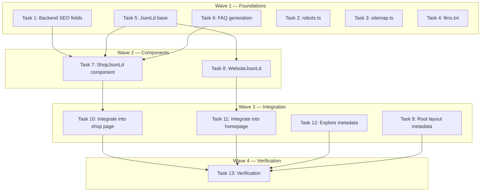

# SEO & GEO Optimization Implementation Plan (DEV-14)

> **For Claude:** REQUIRED SUB-SKILL: Use executing-plans to implement this plan task-by-task.

**Design Doc:** [docs/designs/2026-03-25-seo-geo-optimization-design.md](docs/designs/2026-03-25-seo-geo-optimization-design.md)

**Spec References:** [SPEC.md#1-tech-stack](SPEC.md#1-tech-stack) (SSR/SSG for SEO), [SPEC.md#9-business-rules](SPEC.md#9-business-rules) (auth wall — public vs gated pages)

**PRD References:** [PRD.md#6-discovery-channels](PRD.md#6-discovery-channels) (SEO as secondary channel)

**Goal:** Make CafeRoam discoverable by both traditional search engines and AI-powered generative engines through structured data, sitemaps, and GEO primitives.

**Architecture:** Next.js App Router native SEO (sitemap.ts, robots.ts, generateMetadata) + JSON-LD server components + llms.txt route handler. Backend shops endpoint extended to expose additional DB fields for structured data enrichment. Zero new dependencies.

**Tech Stack:** Next.js 16 (App Router metadata API), Schema.org JSON-LD, Supabase (server client for sitemap queries)

**Acceptance Criteria:**

- [ ] `/sitemap.xml` returns valid XML listing all live shops + static pages
- [ ] `/robots.txt` allows public paths, disallows auth-gated paths, explicitly allows AI bots
- [ ] `/llms.txt` returns a plain-text description of CafeRoam for AI crawlers
- [ ] Shop detail pages render `CafeOrCoffeeShop` + `FAQPage` JSON-LD structured data
- [ ] Homepage renders `WebSite` + `SearchAction` JSON-LD structured data

---

### Task 1: Backend — Expose SEO Fields from Shops Endpoint

**Files:**

- Modify: `backend/api/shops.py:27-31` (add columns to `_SHOP_COLUMNS`)
- Modify: `backend/api/shops.py:59-96` (include new fields in response)
- Test: `backend/tests/api/test_shops.py` (add test for new fields)

**Step 1: Write the failing test**

Check if `backend/tests/api/test_shops.py` exists. If not, create it. Add a test verifying the shops endpoint returns the new SEO fields.

```python
# backend/tests/api/test_shops.py
import pytest
from unittest.mock import MagicMock, patch

from fastapi.testclient import TestClient
from main import app


client = TestClient(app)


@pytest.fixture
def mock_shop_row():
    """Realistic shop row as returned by Supabase."""
    return {
        "id": "a1b2c3d4-e5f6-7890-abcd-ef1234567890",
        "name": "Café Flâneur",
        "slug": "cafe-flaneur",
        "address": "台北市大安區復興南路一段219巷18號",
        "city": "Taipei",
        "mrt": "大安站",
        "latitude": 25.0339,
        "longitude": 121.5436,
        "rating": 4.5,
        "review_count": 42,
        "description": "A quiet corner for deep work and pour-over coffee.",
        "processing_status": "live",
        "mode_work": 0.85,
        "mode_rest": 0.60,
        "mode_social": 0.40,
        "created_at": "2026-01-15T10:00:00+00:00",
        "phone": "+886-2-2700-1234",
        "website": "https://cafeflaneur.tw",
        "opening_hours": {"Mon": "08:00-18:00", "Tue": "08:00-18:00"},
        "price_range": "$$",
        "updated_at": "2026-03-20T14:30:00+00:00",
        "shop_photos": [{"url": "https://storage.example.com/photo1.jpg"}],
        "shop_tags": [
            {
                "tag_id": "laptop_friendly",
                "taxonomy_tags": {
                    "id": "laptop_friendly",
                    "dimension": "functionality",
                    "label": "Laptop Friendly",
                    "label_zh": "適合帶筆電",
                },
            }
        ],
    }


class TestGetShopSeoFields:
    """GET /shops/{shop_id} returns SEO-enrichment fields."""

    @patch("api.shops.get_anon_client")
    def test_shop_response_includes_seo_fields(
        self, mock_get_client: MagicMock, mock_shop_row: dict
    ):
        """When fetching a shop, response includes phone, website, openingHours, priceRange, and updatedAt for JSON-LD."""
        mock_db = MagicMock()
        mock_get_client.return_value = mock_db
        mock_db.table.return_value.select.return_value.eq.return_value.limit.return_value.execute.return_value = (
            MagicMock(data=[mock_shop_row])
        )

        response = client.get(f"/shops/{mock_shop_row['id']}")
        assert response.status_code == 200
        data = response.json()

        # New SEO fields
        assert data["phone"] == "+886-2-2700-1234"
        assert data["website"] == "https://cafeflaneur.tw"
        assert data["openingHours"] == {"Mon": "08:00-18:00", "Tue": "08:00-18:00"}
        assert data["priceRange"] == "$$"
        assert data["updatedAt"] == "2026-03-20T14:30:00+00:00"

        # Existing fields still present
        assert data["name"] == "Café Flâneur"
        assert data["modeScores"]["work"] == 0.85
        assert len(data["taxonomyTags"]) == 1
```

**Step 2: Run test to verify it fails**

Run: `cd backend && python -m pytest tests/api/test_shops.py::TestGetShopSeoFields -v`
Expected: FAIL — `phone`, `website`, `openingHours`, `priceRange`, `updatedAt` keys missing from response

**Step 3: Write minimal implementation**

In `backend/api/shops.py`, add the missing columns to `_SHOP_COLUMNS`:

```python
# Line 27-31: Expand _SHOP_COLUMNS
_SHOP_COLUMNS = (
    "id, name, slug, address, city, mrt, latitude, longitude, "
    "rating, review_count, description, processing_status, "
    "mode_work, mode_rest, mode_social, "
    "phone, website, opening_hours, price_range, "
    "created_at, updated_at"
)
```

No other changes needed — the existing `to_camel` conversion at line 92 will automatically convert `phone` → `phone`, `website` → `website`, `opening_hours` → `openingHours`, `price_range` → `priceRange`, `updated_at` → `updatedAt`.

**Step 4: Run test to verify it passes**

Run: `cd backend && python -m pytest tests/api/test_shops.py::TestGetShopSeoFields -v`
Expected: PASS

**Step 5: Commit**

```bash
git add backend/api/shops.py backend/tests/api/test_shops.py
git commit -m "feat(api): expose phone, website, hours, price in shop endpoint for SEO"
```

---

### Task 2: Robots.txt (`app/robots.ts`)

**Files:**

- Create: `app/robots.ts`
- Test: `app/robots.test.ts`

No test needed — `robots.ts` is a Next.js convention file that exports a static object. The framework handles the route. Verify manually via `curl localhost:3000/robots.txt` after dev server runs.

**Step 1: Create `app/robots.ts`**

```typescript
import type { MetadataRoute } from 'next';

const BASE_URL = process.env.NEXT_PUBLIC_APP_URL ?? 'https://caferoam.tw';

export default function robots(): MetadataRoute.Robots {
  return {
    rules: [
      {
        userAgent: '*',
        allow: ['/', '/shops/', '/explore/'],
        disallow: [
          '/profile',
          '/lists',
          '/settings',
          '/login',
          '/signup',
          '/api/',
        ],
      },
      {
        userAgent: 'GPTBot',
        allow: '/',
      },
      {
        userAgent: 'ClaudeBot',
        allow: '/',
      },
      {
        userAgent: 'PerplexityBot',
        allow: '/',
      },
      {
        userAgent: 'Google-Extended',
        allow: '/',
      },
    ],
    sitemap: `${BASE_URL}/sitemap.xml`,
  };
}
```

**Step 2: Commit**

```bash
git add app/robots.ts
git commit -m "feat(seo): add robots.ts with AI bot allowances"
```

---

### Task 3: Dynamic Sitemap (`app/sitemap.ts`)

**Files:**

- Create: `app/sitemap.ts`
- Test: `lib/__tests__/seo/sitemap.test.ts`

**Step 1: Write the failing test**

```typescript
// lib/__tests__/seo/sitemap.test.ts
import { describe, it, expect, vi, beforeEach } from 'vitest';

const mockExecute = vi.hoisted(() => vi.fn());
const mockLimit = vi.hoisted(() => vi.fn(() => ({ execute: mockExecute })));
const mockEq = vi.hoisted(() => vi.fn(() => ({ limit: mockLimit })));
const mockSelect = vi.hoisted(() => vi.fn(() => ({ eq: mockEq })));
const mockTable = vi.hoisted(() => vi.fn(() => ({ select: mockSelect })));

vi.mock('@/lib/supabase/server', () => ({
  createClient: vi.fn(() => ({
    from: mockTable,
  })),
}));

describe('sitemap generation', () => {
  beforeEach(() => {
    vi.resetAllMocks();
  });

  it('generates sitemap entries for all live shops plus static pages', async () => {
    mockExecute.mockResolvedValue({
      data: [
        {
          id: 'shop-1',
          slug: 'cafe-flaneur',
          updated_at: '2026-03-20T14:30:00Z',
        },
        {
          id: 'shop-2',
          slug: 'beans-and-leaves',
          updated_at: '2026-03-18T10:00:00Z',
        },
      ],
    });

    // Dynamic import after mocks are set up
    const { default: sitemap } = await import('@/app/sitemap');
    const entries = await sitemap();

    // Static pages
    const urls = entries.map((e: { url: string }) => e.url);
    expect(urls).toContain('https://caferoam.tw');
    expect(urls).toContain('https://caferoam.tw/explore');

    // Shop pages
    expect(urls).toContain('https://caferoam.tw/shops/shop-1/cafe-flaneur');
    expect(urls).toContain('https://caferoam.tw/shops/shop-2/beans-and-leaves');

    // Total: 2 static + 2 shops
    expect(entries.length).toBeGreaterThanOrEqual(4);
  });
});
```

**Step 2: Run test to verify it fails**

Run: `pnpm vitest run lib/__tests__/seo/sitemap.test.ts`
Expected: FAIL — module `@/app/sitemap` not found

**Step 3: Write minimal implementation**

```typescript
// app/sitemap.ts
import type { MetadataRoute } from 'next';
import { createClient } from '@/lib/supabase/server';

const BASE_URL = process.env.NEXT_PUBLIC_APP_URL ?? 'https://caferoam.tw';

export default async function sitemap(): Promise<MetadataRoute.Sitemap> {
  const supabase = await createClient();

  const { data: shops } = await supabase
    .from('shops')
    .select('id, slug, updated_at')
    .eq('processing_status', 'live')
    .limit(5000);

  const shopEntries: MetadataRoute.Sitemap = (shops ?? []).map((shop) => ({
    url: `${BASE_URL}/shops/${shop.id}/${shop.slug ?? shop.id}`,
    lastModified: shop.updated_at ? new Date(shop.updated_at) : new Date(),
    changeFrequency: 'weekly' as const,
    priority: 0.8,
  }));

  const staticPages: MetadataRoute.Sitemap = [
    {
      url: BASE_URL,
      lastModified: new Date(),
      changeFrequency: 'daily' as const,
      priority: 1.0,
    },
    {
      url: `${BASE_URL}/explore`,
      lastModified: new Date(),
      changeFrequency: 'daily' as const,
      priority: 0.9,
    },
  ];

  return [...staticPages, ...shopEntries];
}
```

**Step 4: Run test to verify it passes**

Run: `pnpm vitest run lib/__tests__/seo/sitemap.test.ts`
Expected: PASS

**Step 5: Commit**

```bash
git add app/sitemap.ts lib/__tests__/seo/sitemap.test.ts
git commit -m "feat(seo): add dynamic sitemap.ts for all live shops"
```

---

### Task 4: llms.txt Route Handler (`app/llms.txt/route.ts`)

**Files:**

- Create: `app/llms.txt/route.ts`
- Test: `lib/__tests__/seo/llms-txt.test.ts`

**Step 1: Write the failing test**

```typescript
// lib/__tests__/seo/llms-txt.test.ts
import { describe, it, expect } from 'vitest';

describe('llms.txt route', () => {
  it('returns plain text with site description and taxonomy', async () => {
    const { GET } = await import('@/app/llms.txt/route');
    const response = await GET();

    expect(response.headers.get('content-type')).toBe(
      'text/plain; charset=utf-8'
    );

    const text = await response.text();

    // Site identity
    expect(text).toContain('CafeRoam');
    expect(text).toContain('Taiwan');
    expect(text).toContain('coffee');

    // Taxonomy dimensions
    expect(text).toContain('functionality');
    expect(text).toContain('ambience');
    expect(text).toContain('mode');

    // Mode scores
    expect(text).toContain('work');
    expect(text).toContain('rest');
    expect(text).toContain('social');

    // Actionable info
    expect(text).toContain('/sitemap.xml');
  });
});
```

**Step 2: Run test to verify it fails**

Run: `pnpm vitest run lib/__tests__/seo/llms-txt.test.ts`
Expected: FAIL — module not found

**Step 3: Write minimal implementation**

```typescript
// app/llms.txt/route.ts
import { NextResponse } from 'next/server';

const BASE_URL = process.env.NEXT_PUBLIC_APP_URL ?? 'https://caferoam.tw';

const LLMS_TXT = `# CafeRoam 啡遊
> Discover Taiwan's best independent coffee shops with AI-powered semantic search.

## What is CafeRoam?
CafeRoam (啡遊) is a mobile-first web directory for Taiwan's independent coffee shop scene. It helps people find the right cafe for their current mood — whether they need a quiet spot for deep work, a cozy place to unwind, or a lively space to catch up with friends.

## Geographic Scope
- Country: Taiwan (台灣)
- Primary cities: Taipei, New Taipei, Taichung, Tainan, Kaohsiung
- Coverage: 160+ independent coffee shops and growing

## Data Structure
Each shop in CafeRoam has:
- **Mode scores** (0-1 scale): work, rest, social — indicating how suitable the shop is for each activity
- **Taxonomy tags** across 5 dimensions:
  - **functionality**: wifi_available, laptop_friendly, power_outlets, pet_friendly, wheelchair_accessible, etc.
  - **time**: early_bird, brunch_hours, late_night, weekend_only, good_for_rainy_days
  - **ambience**: quiet, cozy, photogenic, vintage, has_cats, hidden_gem, japanese_colonial_building, etc.
  - **mode**: deep_work, casual_work, date, catch_up_friends, coffee_tasting, slow_morning, etc.
  - **coffee**: pour_over, self_roasted, espresso_focused, cold_brew, siphon, taiwan_origin, etc.
- **Location**: full address, GPS coordinates, nearest MRT station
- **Ratings & reviews**: aggregate rating and review count

## Example Queries This Data Can Answer
- "Best cafes for remote work in Taipei" → filter by high mode_work score + laptop_friendly tag
- "Quiet cafes near Da'an MRT" → filter by quiet tag + MRT station
- "Cat cafes in Taiwan" → filter by has_cats tag
- "Late night coffee shops in Taipei" → filter by late_night tag
- "Best pour-over coffee in Taiwan" → filter by pour_over tag
- "Cozy date spots with good coffee" → filter by date mode + cozy tag

## Key Pages
- Homepage: ${BASE_URL}
- Explore: ${BASE_URL}/explore
- Sitemap: ${BASE_URL}/sitemap.xml

## Contact
- Website: ${BASE_URL}
`;

export async function GET() {
  return new NextResponse(LLMS_TXT.trim(), {
    headers: {
      'Content-Type': 'text/plain; charset=utf-8',
      'Cache-Control': 'public, max-age=86400, s-maxage=86400',
    },
  });
}
```

**Step 4: Run test to verify it passes**

Run: `pnpm vitest run lib/__tests__/seo/llms-txt.test.ts`
Expected: PASS

**Step 5: Commit**

```bash
git add app/llms.txt/route.ts lib/__tests__/seo/llms-txt.test.ts
git commit -m "feat(geo): add llms.txt route handler for AI crawlers"
```

---

### Task 5: JSON-LD Base Component (`components/seo/JsonLd.tsx`)

**Files:**

- Create: `components/seo/JsonLd.tsx`
- Test: `components/seo/__tests__/JsonLd.test.tsx`

**Step 1: Write the failing test**

```typescript
// components/seo/__tests__/JsonLd.test.tsx
import { describe, it, expect } from 'vitest';
import { render } from '@testing-library/react';
import { JsonLd } from '../JsonLd';

describe('JsonLd component', () => {
  it('renders a script tag with application/ld+json type', () => {
    const data = {
      '@context': 'https://schema.org',
      '@type': 'WebSite',
      name: 'Test Site',
    };

    const { container } = render(<JsonLd data={data} />);
    const script = container.querySelector('script[type="application/ld+json"]');
    expect(script).not.toBeNull();
    expect(JSON.parse(script!.textContent!)).toEqual(data);
  });

  it('does not render when data is null', () => {
    const { container } = render(<JsonLd data={null} />);
    const script = container.querySelector('script[type="application/ld+json"]');
    expect(script).toBeNull();
  });
});
```

**Step 2: Run test to verify it fails**

Run: `pnpm vitest run components/seo/__tests__/JsonLd.test.tsx`
Expected: FAIL — module not found

**Step 3: Write minimal implementation**

```typescript
// components/seo/JsonLd.tsx
interface JsonLdProps {
  data: Record<string, unknown> | null;
}

export function JsonLd({ data }: JsonLdProps) {
  if (!data) return null;

  return (
    <script
      type="application/ld+json"
      dangerouslySetInnerHTML={{ __html: JSON.stringify(data) }}
    />
  );
}
```

**Step 4: Run test to verify it passes**

Run: `pnpm vitest run components/seo/__tests__/JsonLd.test.tsx`
Expected: PASS

**Step 5: Commit**

```bash
git add components/seo/JsonLd.tsx components/seo/__tests__/JsonLd.test.tsx
git commit -m "feat(seo): add generic JsonLd server component"
```

---

### Task 6: FAQ Generation Logic (`components/seo/generateShopFaq.ts`)

**Files:**

- Create: `components/seo/generateShopFaq.ts`
- Test: `components/seo/__tests__/generateShopFaq.test.ts`

**Step 1: Write the failing test**

```typescript
// components/seo/__tests__/generateShopFaq.test.ts
import { describe, it, expect } from 'vitest';
import { generateShopFaq } from '../generateShopFaq';

describe('generateShopFaq', () => {
  const baseShop = {
    name: 'Café Flâneur',
    address: '台北市大安區復興南路一段219巷18號',
    mrt: '大安站',
    modeScores: { work: 0.85, rest: 0.6, social: 0.4 },
    taxonomyTags: [
      {
        id: 'laptop_friendly',
        dimension: 'functionality',
        label: 'Laptop Friendly',
        labelZh: '適合帶筆電',
      },
      { id: 'quiet', dimension: 'ambience', label: 'Quiet', labelZh: '安靜' },
      {
        id: 'pour_over',
        dimension: 'coffee',
        label: 'Pour Over',
        labelZh: '手沖咖啡',
      },
      {
        id: 'deep_work',
        dimension: 'mode',
        label: 'Deep Work',
        labelZh: '深度工作',
      },
    ],
    openingHours: { Mon: '08:00-18:00', Tue: '08:00-18:00' },
  };

  it('generates FAQ about remote work suitability when work score is high', () => {
    const faq = generateShopFaq(baseShop);
    const workQuestion = faq.find((q) => q.question.includes('remote work'));
    expect(workQuestion).toBeDefined();
    expect(workQuestion!.answer).toContain('Café Flâneur');
    expect(workQuestion!.answer).toMatch(/laptop|work/i);
  });

  it('generates FAQ about location with MRT station', () => {
    const faq = generateShopFaq(baseShop);
    const locationQuestion = faq.find((q) => q.question.includes('located'));
    expect(locationQuestion).toBeDefined();
    expect(locationQuestion!.answer).toContain('大安站');
  });

  it('generates FAQ about vibe from ambience tags', () => {
    const faq = generateShopFaq(baseShop);
    const vibeQuestion = faq.find((q) => q.question.includes('vibe'));
    expect(vibeQuestion).toBeDefined();
    expect(vibeQuestion!.answer).toContain('Quiet');
  });

  it('generates FAQ about coffee when coffee tags exist', () => {
    const faq = generateShopFaq(baseShop);
    const coffeeQuestion = faq.find((q) => q.question.includes('coffee'));
    expect(coffeeQuestion).toBeDefined();
    expect(coffeeQuestion!.answer).toContain('Pour Over');
  });

  it('skips coffee FAQ when no coffee tags', () => {
    const shopNoCoffee = {
      ...baseShop,
      taxonomyTags: baseShop.taxonomyTags.filter(
        (t) => t.dimension !== 'coffee'
      ),
    };
    const faq = generateShopFaq(shopNoCoffee);
    const coffeeQuestion = faq.find((q) => q.question.includes('coffee'));
    expect(coffeeQuestion).toBeUndefined();
  });

  it('returns 3-5 questions', () => {
    const faq = generateShopFaq(baseShop);
    expect(faq.length).toBeGreaterThanOrEqual(3);
    expect(faq.length).toBeLessThanOrEqual(5);
  });
});
```

**Step 2: Run test to verify it fails**

Run: `pnpm vitest run components/seo/__tests__/generateShopFaq.test.ts`
Expected: FAIL — module not found

**Step 3: Write minimal implementation**

```typescript
// components/seo/generateShopFaq.ts

interface ShopForFaq {
  name: string;
  address?: string;
  mrt?: string | null;
  modeScores?: {
    work?: number | null;
    rest?: number | null;
    social?: number | null;
  } | null;
  taxonomyTags?: Array<{
    id: string;
    dimension: string;
    label: string;
    labelZh: string;
  }>;
  openingHours?: Record<string, string> | null;
}

interface FaqEntry {
  question: string;
  answer: string;
}

export function generateShopFaq(shop: ShopForFaq): FaqEntry[] {
  const faq: FaqEntry[] = [];
  const tags = shop.taxonomyTags ?? [];

  const tagsByDimension = (dim: string) =>
    tags.filter((t) => t.dimension === dim).map((t) => t.label);

  // 1. Remote work suitability (always include — core CafeRoam value prop)
  const workScore = shop.modeScores?.work;
  const funcTags = tagsByDimension('functionality');
  const workTags =
    funcTags.length > 0 ? funcTags.join(', ') : 'a comfortable workspace';
  if (workScore !== null && workScore !== undefined) {
    const suitability =
      workScore >= 0.7
        ? 'highly suitable'
        : workScore >= 0.4
          ? 'suitable'
          : 'not ideal';
    faq.push({
      question: `Is ${shop.name} good for remote work?`,
      answer: `${shop.name} is ${suitability} for remote work (score: ${Math.round(workScore * 100)}%). Features include: ${workTags}.`,
    });
  }

  // 2. Vibe / ambience
  const ambienceTags = tagsByDimension('ambience');
  if (ambienceTags.length > 0) {
    faq.push({
      question: `What's the vibe at ${shop.name}?`,
      answer: `${shop.name} is known for its ${ambienceTags.join(', ').toLowerCase()} atmosphere.`,
    });
  }

  // 3. Location + MRT
  if (shop.address) {
    const mrtInfo = shop.mrt ? ` It's near ${shop.mrt} MRT station.` : '';
    faq.push({
      question: `Where is ${shop.name} located?`,
      answer: `${shop.name} is located at ${shop.address}.${mrtInfo}`,
    });
  }

  // 4. Coffee offerings (only if coffee tags exist)
  const coffeeTags = tagsByDimension('coffee');
  if (coffeeTags.length > 0) {
    faq.push({
      question: `What kind of coffee does ${shop.name} serve?`,
      answer: `${shop.name} specializes in ${coffeeTags.join(', ').toLowerCase()}.`,
    });
  }

  // 5. Opening hours (only if available)
  if (shop.openingHours && Object.keys(shop.openingHours).length > 0) {
    const hours = Object.entries(shop.openingHours)
      .map(([day, time]) => `${day}: ${time}`)
      .join(', ');
    faq.push({
      question: `When is ${shop.name} open?`,
      answer: `${shop.name} opening hours: ${hours}.`,
    });
  }

  return faq;
}
```

**Step 4: Run test to verify it passes**

Run: `pnpm vitest run components/seo/__tests__/generateShopFaq.test.ts`
Expected: PASS

**Step 5: Commit**

```bash
git add components/seo/generateShopFaq.ts components/seo/__tests__/generateShopFaq.test.ts
git commit -m "feat(geo): add FAQ generation from shop taxonomy data"
```

---

### Task 7: Shop JSON-LD Component (`components/seo/ShopJsonLd.tsx`)

**Files:**

- Create: `components/seo/ShopJsonLd.tsx`
- Test: `components/seo/__tests__/ShopJsonLd.test.tsx`

**Step 1: Write the failing test**

```typescript
// components/seo/__tests__/ShopJsonLd.test.tsx
import { describe, it, expect } from 'vitest';
import { render } from '@testing-library/react';
import { ShopJsonLd } from '../ShopJsonLd';

const shop = {
  id: 'shop-1',
  name: 'Café Flâneur',
  slug: 'cafe-flaneur',
  description: 'A quiet corner for deep work.',
  address: '台北市大安區復興南路一段219巷18號',
  latitude: 25.0339,
  longitude: 121.5436,
  mrt: '大安站',
  rating: 4.5,
  reviewCount: 42,
  photoUrls: ['https://storage.example.com/photo1.jpg'],
  phone: '+886-2-2700-1234',
  website: 'https://cafeflaneur.tw',
  openingHours: { Mon: '08:00-18:00' },
  priceRange: '$$',
  modeScores: { work: 0.85, rest: 0.60, social: 0.40 },
  taxonomyTags: [
    { id: 'quiet', dimension: 'ambience', label: 'Quiet', labelZh: '安靜' },
  ],
};

describe('ShopJsonLd', () => {
  it('renders CafeOrCoffeeShop JSON-LD with correct schema', () => {
    const { container } = render(<ShopJsonLd shop={shop} />);
    const scripts = container.querySelectorAll('script[type="application/ld+json"]');

    // Should have 2 scripts: CafeOrCoffeeShop + FAQPage
    expect(scripts.length).toBe(2);

    const shopSchema = JSON.parse(scripts[0].textContent!);
    expect(shopSchema['@type']).toBe('CafeOrCoffeeShop');
    expect(shopSchema.name).toBe('Café Flâneur');
    expect(shopSchema.address['@type']).toBe('PostalAddress');
    expect(shopSchema.geo.latitude).toBe(25.0339);
    expect(shopSchema.aggregateRating.ratingValue).toBe(4.5);
    expect(shopSchema.telephone).toBe('+886-2-2700-1234');
    expect(shopSchema.priceRange).toBe('$$');
  });

  it('renders FAQPage JSON-LD with generated questions', () => {
    const { container } = render(<ShopJsonLd shop={shop} />);
    const scripts = container.querySelectorAll('script[type="application/ld+json"]');
    const faqSchema = JSON.parse(scripts[1].textContent!);

    expect(faqSchema['@type']).toBe('FAQPage');
    expect(faqSchema.mainEntity.length).toBeGreaterThanOrEqual(2);
    expect(faqSchema.mainEntity[0]['@type']).toBe('Question');
  });

  it('omits optional fields when not available', () => {
    const minimalShop = {
      id: 'shop-2',
      name: 'Simple Cafe',
      slug: 'simple-cafe',
      address: '台北市信義區',
      modeScores: { work: 0.5, rest: 0.5, social: 0.5 },
      taxonomyTags: [],
    };

    const { container } = render(<ShopJsonLd shop={minimalShop} />);
    const scripts = container.querySelectorAll('script[type="application/ld+json"]');
    const shopSchema = JSON.parse(scripts[0].textContent!);

    expect(shopSchema.telephone).toBeUndefined();
    expect(shopSchema.priceRange).toBeUndefined();
    expect(shopSchema.aggregateRating).toBeUndefined();
  });
});
```

**Step 2: Run test to verify it fails**

Run: `pnpm vitest run components/seo/__tests__/ShopJsonLd.test.tsx`
Expected: FAIL — module not found

**Step 3: Write minimal implementation**

```typescript
// components/seo/ShopJsonLd.tsx
import { JsonLd } from './JsonLd';
import { generateShopFaq } from './generateShopFaq';

const BASE_URL = process.env.NEXT_PUBLIC_APP_URL ?? 'https://caferoam.tw';

interface ShopJsonLdProps {
  shop: {
    id: string;
    name: string;
    slug?: string | null;
    description?: string | null;
    address?: string;
    latitude?: number | null;
    longitude?: number | null;
    mrt?: string | null;
    rating?: number | null;
    reviewCount?: number;
    photoUrls?: string[];
    phone?: string | null;
    website?: string | null;
    openingHours?: Record<string, string> | null;
    priceRange?: string | null;
    modeScores?: { work?: number | null; rest?: number | null; social?: number | null } | null;
    taxonomyTags?: Array<{
      id: string;
      dimension: string;
      label: string;
      labelZh: string;
    }>;
  };
}

export function ShopJsonLd({ shop }: ShopJsonLdProps) {
  const url = `${BASE_URL}/shops/${shop.id}/${shop.slug ?? shop.id}`;
  const image = shop.photoUrls?.[0];

  const shopData: Record<string, unknown> = {
    '@context': 'https://schema.org',
    '@type': 'CafeOrCoffeeShop',
    name: shop.name,
    url,
    ...(shop.description && { description: shop.description }),
    ...(shop.address && {
      address: {
        '@type': 'PostalAddress',
        streetAddress: shop.address,
        addressCountry: 'TW',
      },
    }),
    ...(shop.latitude != null &&
      shop.longitude != null && {
        geo: {
          '@type': 'GeoCoordinates',
          latitude: shop.latitude,
          longitude: shop.longitude,
        },
      }),
    ...(shop.rating != null &&
      shop.reviewCount != null &&
      shop.reviewCount > 0 && {
        aggregateRating: {
          '@type': 'AggregateRating',
          ratingValue: shop.rating,
          reviewCount: shop.reviewCount,
        },
      }),
    ...(image && { image }),
    ...(shop.phone && { telephone: shop.phone }),
    ...(shop.website && { sameAs: shop.website }),
    ...(shop.priceRange && { priceRange: shop.priceRange }),
  };

  // Generate FAQ from taxonomy data
  const faqEntries = generateShopFaq(shop);
  const faqData =
    faqEntries.length > 0
      ? {
          '@context': 'https://schema.org',
          '@type': 'FAQPage',
          mainEntity: faqEntries.map((entry) => ({
            '@type': 'Question',
            name: entry.question,
            acceptedAnswer: {
              '@type': 'Answer',
              text: entry.answer,
            },
          })),
        }
      : null;

  return (
    <>
      <JsonLd data={shopData} />
      <JsonLd data={faqData} />
    </>
  );
}
```

**Step 4: Run test to verify it passes**

Run: `pnpm vitest run components/seo/__tests__/ShopJsonLd.test.tsx`
Expected: PASS

**Step 5: Commit**

```bash
git add components/seo/ShopJsonLd.tsx components/seo/__tests__/ShopJsonLd.test.tsx
git commit -m "feat(seo): add ShopJsonLd component with CafeOrCoffeeShop + FAQPage schema"
```

---

### Task 8: Website JSON-LD Component (`components/seo/WebsiteJsonLd.tsx`)

**Files:**

- Create: `components/seo/WebsiteJsonLd.tsx`
- Test: `components/seo/__tests__/WebsiteJsonLd.test.tsx`

**Step 1: Write the failing test**

```typescript
// components/seo/__tests__/WebsiteJsonLd.test.tsx
import { describe, it, expect } from 'vitest';
import { render } from '@testing-library/react';
import { WebsiteJsonLd } from '../WebsiteJsonLd';

describe('WebsiteJsonLd', () => {
  it('renders WebSite schema with SearchAction', () => {
    const { container } = render(<WebsiteJsonLd />);
    const script = container.querySelector('script[type="application/ld+json"]');
    expect(script).not.toBeNull();

    const data = JSON.parse(script!.textContent!);
    expect(data['@type']).toBe('WebSite');
    expect(data.name).toBe('啡遊 CafeRoam');
    expect(data.potentialAction['@type']).toBe('SearchAction');
    expect(data.potentialAction.target).toContain('{search_term}');
  });
});
```

**Step 2: Run test to verify it fails**

Run: `pnpm vitest run components/seo/__tests__/WebsiteJsonLd.test.tsx`
Expected: FAIL

**Step 3: Write minimal implementation**

```typescript
// components/seo/WebsiteJsonLd.tsx
import { JsonLd } from './JsonLd';

const BASE_URL = process.env.NEXT_PUBLIC_APP_URL ?? 'https://caferoam.tw';

export function WebsiteJsonLd() {
  return (
    <JsonLd
      data={{
        '@context': 'https://schema.org',
        '@type': 'WebSite',
        name: '啡遊 CafeRoam',
        url: BASE_URL,
        description:
          "Discover Taiwan's best independent coffee shops with AI-powered semantic search.",
        inLanguage: 'zh-TW',
        potentialAction: {
          '@type': 'SearchAction',
          target: `${BASE_URL}/explore?q={search_term}`,
          'query-input': 'required name=search_term',
        },
      }}
    />
  );
}
```

**Step 4: Run test to verify it passes**

Run: `pnpm vitest run components/seo/__tests__/WebsiteJsonLd.test.tsx`
Expected: PASS

**Step 5: Commit**

```bash
git add components/seo/WebsiteJsonLd.tsx components/seo/__tests__/WebsiteJsonLd.test.tsx
git commit -m "feat(seo): add WebsiteJsonLd component with SearchAction"
```

---

### Task 9: Enhanced Root Layout Metadata (`app/layout.tsx`)

**Files:**

- Modify: `app/layout.tsx:47-66` (enhance metadata export)

No test needed — metadata export is a static Next.js config object. Verified by visual inspection and existing e2e OG tests.

**Step 1: Modify `app/layout.tsx`**

Replace the `metadata` export (lines 47-66) with enhanced version:

```typescript
export const metadata: Metadata = {
  metadataBase: new URL(
    process.env.NEXT_PUBLIC_APP_URL ?? 'https://caferoam.tw'
  ),
  title: {
    default: 'CafeRoam 啡遊 — 探索台灣精品咖啡廳',
    template: '%s — 啡遊',
  },
  description:
    '啡遊 CafeRoam 幫你找到適合當下心情的台灣獨立咖啡廳——深度工作、放鬆休息、或朋友聚會。AI 語意搜尋，探索台灣精品咖啡文化。',
  openGraph: {
    type: 'website',
    locale: 'zh_TW',
    siteName: '啡遊 CafeRoam',
  },
  twitter: {
    card: 'summary_large_image',
  },
  icons: {
    icon: [
      { url: '/favicon.png', sizes: '32x32', type: 'image/png' },
      { url: '/icon-192.png', sizes: '192x192', type: 'image/png' },
      { url: '/icon-512.png', sizes: '512x512', type: 'image/png' },
    ],
    apple: [
      { url: '/apple-touch-icon.png', sizes: '180x180', type: 'image/png' },
    ],
  },
  appleWebApp: {
    capable: true,
    title: '啡遊',
    statusBarStyle: 'default',
  },
};
```

Key changes:

- Added `metadataBase` for absolute canonical URLs
- Changed `title` to template format (child pages use `%s — 啡遊` pattern)
- Enhanced `description` in Traditional Chinese targeting Taiwan audience
- Added `openGraph` with type, locale, siteName
- Added `twitter` card configuration

**Step 2: Commit**

```bash
git add app/layout.tsx
git commit -m "feat(seo): enhance root layout metadata with metadataBase, OG, Twitter cards"
```

---

### Task 10: Integrate JSON-LD into Shop Detail Page

**Files:**

- Modify: `app/shops/[shopId]/[slug]/page.tsx:42-64` (add ShopJsonLd to render)

No test needed — integration verified by existing e2e test in `e2e/discovery.spec.ts` that checks OG meta. JSON-LD rendering is already unit tested in Task 7.

**Step 1: Modify shop detail page**

Add `ShopJsonLd` import and render it in the page component:

```typescript
// At top of file, add import:
import { ShopJsonLd } from '@/components/seo/ShopJsonLd';

// In the ShopDetailPage component, add ShopJsonLd before the client component:
export default async function ShopDetailPage({
  params,
}: {
  params: Promise<Params>;
}) {
  const { shopId, slug } = await params;
  const shop = await fetchShop(shopId);

  if (!shop) {
    notFound();
  }

  if (shop.slug && slug !== shop.slug) {
    redirect(`/shops/${shopId}/${shop.slug}`);
  }

  return (
    <>
      <ShopJsonLd shop={shop} />
      <Suspense>
        <ShopDetailClient shop={shop} />
      </Suspense>
    </>
  );
}
```

**Step 2: Commit**

```bash
git add app/shops/[shopId]/[slug]/page.tsx
git commit -m "feat(seo): integrate ShopJsonLd into shop detail page"
```

---

### Task 11: Integrate WebsiteJsonLd into Homepage

**Files:**

- Modify: `app/page.tsx` (add WebsiteJsonLd + metadata export)

No test needed — `WebsiteJsonLd` is already unit tested. Homepage metadata is a static export.

**Step 1: Read `app/page.tsx` current structure**

Read the file to understand where to add the import and component.

**Step 2: Add metadata export and WebsiteJsonLd**

Add at top of file:

```typescript
import { WebsiteJsonLd } from '@/components/seo/WebsiteJsonLd';
import type { Metadata } from 'next';

export const metadata: Metadata = {
  title: '啡遊 CafeRoam — 探索台灣精品咖啡廳',
  description:
    '尋找台北最適合工作、放鬆、約會的獨立咖啡廳。AI 語意搜尋 160+ 間精品咖啡廳，依心情探索。',
};
```

Add `<WebsiteJsonLd />` at the top of the returned JSX (before the existing content).

**Note:** If `app/page.tsx` is a client component (`'use client'`), the metadata export must be moved to a separate `app/page-metadata.ts` or the component must be restructured. Check the file first.

**Step 3: Commit**

```bash
git add app/page.tsx
git commit -m "feat(seo): add homepage metadata and WebsiteJsonLd"
```

---

### Task 12: Explore Page Metadata

**Files:**

- Modify: `app/explore/page.tsx` (add metadata export if server component, or add to layout)
- Modify: `app/explore/vibes/[slug]/page.tsx` (add generateMetadata)

No test needed — static metadata exports and simple generateMetadata using existing patterns.

**Step 1: Add metadata to explore page**

Read `app/explore/page.tsx` to check if it's a client or server component.

If client component, create `app/explore/layout.tsx` with:

```typescript
import type { Metadata } from 'next';

export const metadata: Metadata = {
  title: '探索咖啡廳',
  description:
    '用不同方式探索台灣的獨立咖啡廳——隨機抽牌、依氛圍瀏覽、或看看社群最新打卡。',
};

export default function ExploreLayout({
  children,
}: {
  children: React.ReactNode;
}) {
  return children;
}
```

**Step 2: Add dynamic metadata to vibes page**

Read `app/explore/vibes/[slug]/page.tsx` to understand how vibe data is fetched.

If client component, create `app/explore/vibes/[slug]/layout.tsx` or convert the page. The approach depends on the current file structure — check first.

**Step 3: Commit**

```bash
git add app/explore/page.tsx app/explore/vibes/
git commit -m "feat(seo): add metadata to explore and vibes pages"
```

---

### Task 13: Final Verification & Lint

**Files:** None (verification only)

**Step 1: Run lint**

Run: `pnpm lint`
Expected: PASS (no new lint errors)

**Step 2: Run type-check**

Run: `pnpm type-check`
Expected: PASS

**Step 3: Run all frontend tests**

Run: `pnpm test`
Expected: All tests pass, including new SEO tests

**Step 4: Run backend tests**

Run: `cd backend && python -m pytest tests/api/test_shops.py -v`
Expected: All tests pass

**Step 5: Manual smoke test (if dev server available)**

```bash
# Check robots.txt
curl http://localhost:3000/robots.txt

# Check sitemap
curl http://localhost:3000/sitemap.xml | head -20

# Check llms.txt
curl http://localhost:3000/llms.txt

# Check JSON-LD on a shop page (look for script tags)
curl -s http://localhost:3000/shops/<any-shop-id>/<slug> | grep 'application/ld+json'
```

**Step 6: Final commit (if any lint fixes needed)**

```bash
git add -A
git commit -m "chore: lint fixes for SEO implementation"
```

---

## Execution Waves



**Wave 1** (parallel — no dependencies):

- Task 1: Backend SEO fields
- Task 2: robots.ts
- Task 3: sitemap.ts
- Task 4: llms.txt
- Task 5: JsonLd base component
- Task 6: FAQ generation logic

**Wave 2** (parallel — depends on Wave 1):

- Task 7: ShopJsonLd component ← Tasks 1, 5, 6
- Task 8: WebsiteJsonLd component ← Task 5

**Wave 3** (parallel — depends on Wave 2):

- Task 9: Root layout metadata (independent, placed here for logical ordering)
- Task 10: Integrate ShopJsonLd into shop page ← Task 7
- Task 11: Integrate WebsiteJsonLd into homepage ← Task 8
- Task 12: Explore page metadata (independent)

**Wave 4** (sequential — depends on all):

- Task 13: Final verification & lint ← all previous tasks

---

## TODO Section

```markdown
### SEO & GEO Optimization (DEV-14)

> **Design Doc:** [docs/designs/2026-03-25-seo-geo-optimization-design.md](docs/designs/2026-03-25-seo-geo-optimization-design.md)
> **Plan:** [docs/plans/2026-03-25-seo-geo-optimization-plan.md](docs/plans/2026-03-25-seo-geo-optimization-plan.md)

**Phase 1 — Technical Foundation:**

- [ ] Backend: expose phone, website, hours, price in shop endpoint
- [ ] robots.ts with AI bot allowances
- [ ] Dynamic sitemap.ts for all live shops
- [ ] llms.txt route handler for AI crawlers
- [ ] JSON-LD base component
- [ ] FAQ generation from taxonomy data
- [ ] ShopJsonLd (CafeOrCoffeeShop + FAQPage schema)
- [ ] WebsiteJsonLd (SearchAction schema)
- [ ] Enhanced root layout metadata (metadataBase, OG, Twitter)
- [ ] Integrate JSON-LD into shop detail page
- [ ] Integrate JSON-LD into homepage
- [ ] Explore + vibes page metadata
- [ ] Verification & lint pass

**Phase 2 — Content Flywheel (future ticket):**

- [ ] Auto-generated landing pages per district/intent
- [ ] Freshness signals on shop pages

**Phase 3 — Authority (future):**

- [ ] Blog outreach to Taipei lifestyle/food blogs
```
