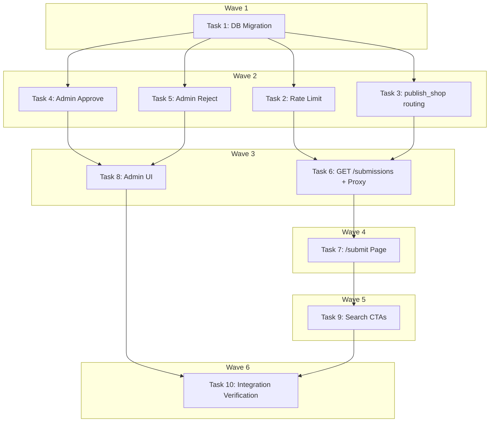

# Community Shop Submission Pipeline Implementation Plan

> **For Claude:** REQUIRED SUB-SKILL: Use executing-plans to implement this plan task-by-task.

**Design Doc:** [docs/designs/2026-03-26-community-shop-submission-design.md](../designs/2026-03-26-community-shop-submission-design.md)

**Spec References:** [SPEC.md §9 — Business Rules (Community shop submissions)](../../SPEC.md)

**PRD References:** [PRD.md §7 — Out of Scope → In Scope (Community data contributions)](../../PRD.md)

**Goal:** Let authenticated users submit café Google Maps URLs, process them through the existing enrichment pipeline, and hold them for admin review before going live.

**Architecture:** The backend submission API, job queue, and enrichment pipeline already exist. This plan modifies `publish_shop` to route user submissions to `pending_review`, adds a 5/day rate limit, updates the existing admin approve/reject endpoints to handle the new `pending_review` status with canned rejection reasons, builds a frontend `/submit` page, and adds contextual "suggest a café" CTAs in search.

**Tech Stack:** FastAPI (Python), Next.js 16, Supabase (Postgres), Vitest + Testing Library, pytest

**Acceptance Criteria:**

- [ ] An authenticated user can submit a Google Maps URL and see it appear in their submission history
- [ ] A user who submits a 6th URL in the same day receives a 429 rate limit error
- [ ] User-submitted shops land in `pending_review` after enrichment, not `live`
- [ ] An admin can approve a pending submission (shop goes live + activity feed event emitted)
- [ ] An admin can reject a submission with a canned reason that the user can see on their `/submit` page

---

### Task 1: DB Migration — Expand `shop_submissions` Table

**Files:**

- Create: `supabase/migrations/YYYYMMDDHHMMSS_expand_shop_submissions.sql`
- Modify: `backend/models/types.py:456-463` (add `rejection_reason` field to `ShopSubmission`)

**Step 1: Write the migration**

```sql
-- Expand status enum to include pending_review and rejected
ALTER TABLE shop_submissions
  DROP CONSTRAINT shop_submissions_status_check,
  ADD CONSTRAINT shop_submissions_status_check
    CHECK (status IN ('pending', 'processing', 'pending_review', 'live', 'rejected', 'failed'));

-- Add rejection reason column for admin rejections
ALTER TABLE shop_submissions ADD COLUMN rejection_reason TEXT;
```

No test needed — this is a schema-only migration with no application logic.

**Step 2: Apply the migration locally**

Run: `supabase db diff` (verify the diff looks correct)
Run: `supabase db push`

**Step 3: Update `ShopSubmission` Pydantic model**

In `backend/models/types.py`, add `rejection_reason` field:

```python
class ShopSubmission(BaseModel):
    id: str
    submitted_by: str
    google_maps_url: str
    shop_id: str | None = None
    status: str = "pending"
    failure_reason: str | None = None
    rejection_reason: str | None = None  # ← new
    reviewed_at: datetime | None = None
```

**Step 4: Commit**

```bash
git add supabase/migrations/*_expand_shop_submissions.sql backend/models/types.py
git commit -m "feat(DEV-38): expand shop_submissions — pending_review status + rejection_reason"
```

---

### Task 2: Rate Limit on Submissions API

**Files:**

- Modify: `backend/api/submissions.py:41-48`
- Test: `backend/tests/api/test_submissions.py`

**Step 1: Write the failing test for rate limit**

Add to `backend/tests/api/test_submissions.py`:

```python
def test_submit_shop_rate_limited_at_5_per_day():
    """A user who has already submitted 5 shops today gets a 429."""
    mock_user_db = MagicMock()
    # Duplicate check returns no existing submission
    mock_user_db.table.return_value.select.return_value.eq.return_value.execute.return_value = (
        MagicMock(data=[])
    )
    # Rate limit check: 5 submissions today
    mock_user_db.table.return_value.select.return_value.eq.return_value.gte.return_value.execute.return_value = (
        MagicMock(data=[], count=5)
    )

    app.dependency_overrides[get_current_user] = lambda: {"id": "user-1"}
    app.dependency_overrides[get_user_db] = lambda: mock_user_db
    try:
        response = client.post(
            "/submissions",
            json={"google_maps_url": "https://maps.google.com/?cid=999"},
        )
        assert response.status_code == 429
        assert "5" in response.json()["detail"]
    finally:
        app.dependency_overrides.clear()
```

**Step 2: Run test to verify it fails**

Run: `cd backend && python -m pytest tests/api/test_submissions.py::test_submit_shop_rate_limited_at_5_per_day -v`
Expected: FAIL (no rate limit check exists yet)

**Step 3: Implement rate limit in `backend/api/submissions.py`**

Add rate limit check after the duplicate check (before the insert), inside `submit_shop`:

```python
from datetime import UTC, datetime, time

# ... inside submit_shop, after the duplicate check, before the insert:

    # Rate limit: 5 submissions per day per user
    today_start = datetime.combine(datetime.now(UTC).date(), time.min).isoformat()
    rate_check = (
        db.table("shop_submissions")
        .select("id", count="exact")
        .eq("submitted_by", user_id)
        .gte("created_at", today_start)
        .execute()
    )
    if (rate_check.count or 0) >= 5:
        raise HTTPException(
            status_code=429,
            detail="You can submit up to 5 cafés per day",
        )
```

**Step 4: Run test to verify it passes**

Run: `cd backend && python -m pytest tests/api/test_submissions.py -v`
Expected: ALL PASS

**Step 5: Commit**

```bash
git add backend/api/submissions.py backend/tests/api/test_submissions.py
git commit -m "feat(DEV-38): add 5/day rate limit on shop submissions"
```

---

### Task 3: Route User Submissions to `pending_review` in `publish_shop`

**Files:**

- Modify: `backend/workers/handlers/publish_shop.py`
- Test: `backend/tests/workers/handlers/test_publish_shop.py` (create if not exists)

**Step 1: Write failing tests**

Create `backend/tests/workers/handlers/test_publish_shop.py`:

```python
from unittest.mock import MagicMock, call, patch

import pytest

from workers.handlers.publish_shop import handle_publish_shop


@pytest.fixture()
def mock_db():
    db = MagicMock()
    db.table.return_value.update.return_value.eq.return_value.execute.return_value = MagicMock(data=[{}])
    db.table.return_value.select.return_value.eq.return_value.single.return_value.execute.return_value = MagicMock(
        data={"name": "Test Café", "source": "cafe_nomad"}
    )
    db.table.return_value.insert.return_value.execute.return_value = MagicMock(data=[{}])
    return db


@pytest.mark.asyncio
async def test_non_submission_shop_goes_live(mock_db):
    """Non-user-submission shops should be set to 'live' as before."""
    mock_db.table.return_value.select.return_value.eq.return_value.single.return_value.execute.return_value = MagicMock(
        data={"name": "Test Café", "source": "cafe_nomad"}
    )
    await handle_publish_shop({"shop_id": "shop-1"}, mock_db)

    # Check that shops table was updated to 'live'
    update_calls = mock_db.table.return_value.update.call_args_list
    statuses = [c.args[0].get("processing_status") for c in update_calls if "processing_status" in c.args[0]]
    assert "live" in statuses


@pytest.mark.asyncio
async def test_user_submission_routes_to_pending_review(mock_db):
    """User-submitted shops should land in 'pending_review', not 'live'."""
    mock_db.table.return_value.select.return_value.eq.return_value.single.return_value.execute.return_value = MagicMock(
        data={"name": "Test Café", "source": "user_submission"}
    )
    await handle_publish_shop(
        {"shop_id": "shop-1", "submission_id": "sub-1", "submitted_by": "user-1"},
        mock_db,
    )

    # Check that shops table was updated to 'pending_review' (NOT 'live')
    update_calls = mock_db.table.return_value.update.call_args_list
    statuses = [c.args[0].get("processing_status") for c in update_calls if "processing_status" in c.args[0]]
    assert "pending_review" in statuses
    assert "live" not in statuses


@pytest.mark.asyncio
async def test_user_submission_updates_submission_status(mock_db):
    """When routed to pending_review, the submission record should also be updated."""
    mock_db.table.return_value.select.return_value.eq.return_value.single.return_value.execute.return_value = MagicMock(
        data={"name": "Test Café", "source": "user_submission"}
    )
    await handle_publish_shop(
        {"shop_id": "shop-1", "submission_id": "sub-1", "submitted_by": "user-1"},
        mock_db,
    )

    # Verify shop_submissions was updated (at least one update call)
    all_table_calls = [c.args[0] for c in mock_db.table.call_args_list]
    assert "shop_submissions" in all_table_calls


@pytest.mark.asyncio
async def test_user_submission_does_not_emit_activity_feed(mock_db):
    """User submissions routed to pending_review should NOT emit activity feed yet."""
    mock_db.table.return_value.select.return_value.eq.return_value.single.return_value.execute.return_value = MagicMock(
        data={"name": "Test Café", "source": "user_submission"}
    )
    await handle_publish_shop(
        {"shop_id": "shop-1", "submission_id": "sub-1", "submitted_by": "user-1"},
        mock_db,
    )

    # activity_feed insert should NOT have been called
    all_table_calls = [c.args[0] for c in mock_db.table.call_args_list]
    assert "activity_feed" not in all_table_calls
```

**Step 2: Run tests to verify they fail**

Run: `cd backend && python -m pytest tests/workers/handlers/test_publish_shop.py -v`
Expected: `test_user_submission_routes_to_pending_review` FAILS (currently always sets `live`)

**Step 3: Implement the routing logic**

Rewrite `backend/workers/handlers/publish_shop.py`:

```python
from datetime import UTC, datetime
from typing import Any, cast

import structlog
from supabase import Client

logger = structlog.get_logger()


async def handle_publish_shop(
    payload: dict[str, Any],
    db: Client,
) -> None:
    """Publish a shop — set it live, or route to pending_review for user submissions."""
    shop_id = payload["shop_id"]
    submission_id = payload.get("submission_id")
    submitted_by = payload.get("submitted_by")

    logger.info("Publishing shop", shop_id=shop_id)

    now = datetime.now(UTC).isoformat()

    # Check shop source to decide whether to auto-publish or hold for review
    shop_response = (
        db.table("shops")
        .select("name, source")
        .eq("id", shop_id)
        .single()
        .execute()
    )
    shop_data = cast("dict[str, Any]", shop_response.data)
    shop_name = shop_data.get("name", "Unknown")
    source = shop_data.get("source")

    if source == "user_submission":
        # User submissions require admin review before going live
        db.table("shops").update(
            {"processing_status": "pending_review", "updated_at": now}
        ).eq("id", shop_id).execute()

        if submission_id:
            db.table("shop_submissions").update(
                {"status": "pending_review", "updated_at": now}
            ).eq("id", submission_id).execute()

        logger.info(
            "Shop routed to pending_review",
            shop_id=shop_id,
            shop_name=shop_name,
        )
    else:
        # Non-user sources (cafe_nomad, manual, etc.) go live immediately
        db.table("shops").update(
            {"processing_status": "live", "updated_at": now}
        ).eq("id", shop_id).execute()

        # Insert activity feed event only for user-submitted shops
        if submitted_by:
            db.table("activity_feed").insert(
                {
                    "event_type": "shop_added",
                    "actor_id": submitted_by,
                    "shop_id": shop_id,
                    "metadata": {"shop_name": shop_name},
                }
            ).execute()

        # Update submission if exists
        if submission_id:
            db.table("shop_submissions").update(
                {"status": "live", "updated_at": now}
            ).eq("id", submission_id).execute()

        logger.info("Shop published", shop_id=shop_id, shop_name=shop_name)
```

**Step 4: Run tests to verify they pass**

Run: `cd backend && python -m pytest tests/workers/handlers/test_publish_shop.py -v`
Expected: ALL PASS

**Step 5: Commit**

```bash
git add backend/workers/handlers/publish_shop.py backend/tests/workers/handlers/test_publish_shop.py
git commit -m "feat(DEV-38): route user submissions to pending_review in publish_shop"
```

---

### Task 4: Update Admin Approve Endpoint

The existing `POST /admin/pipeline/approve/{submission_id}` (in `backend/api/admin.py:113-156`) only updates the submission status. It needs to also: set the shop's `processing_status` to `live`, emit an activity feed event, and accept `pending_review` in the status allowlist.

**Files:**

- Modify: `backend/api/admin.py:113-156`
- Test: `backend/tests/api/test_admin_submissions.py` (create)

**Step 1: Write failing tests**

Create `backend/tests/api/test_admin_submissions.py`:

```python
from unittest.mock import MagicMock, patch

from fastapi.testclient import TestClient

from api.deps import require_admin
from main import app

client = TestClient(app)


def _override_admin():
    app.dependency_overrides[require_admin] = lambda: {"id": "admin-1"}


def _clear():
    app.dependency_overrides.clear()


def test_approve_sets_shop_live_and_emits_feed():
    """Approving a pending_review submission should set the shop to live and emit an activity feed event."""
    _override_admin()
    try:
        mock_db = MagicMock()
        # Fetch submission: pending_review with shop_id and submitted_by
        mock_db.table.return_value.select.return_value.eq.return_value.execute.return_value = MagicMock(
            data=[{"id": "sub-1", "status": "pending_review", "shop_id": "shop-1", "submitted_by": "user-1"}]
        )
        # Conditional update succeeds
        mock_db.table.return_value.update.return_value.eq.return_value.in_.return_value.execute.return_value = MagicMock(
            data=[{"id": "sub-1"}]
        )
        # Shop name lookup
        mock_db.table.return_value.select.return_value.eq.return_value.single.return_value.execute.return_value = MagicMock(
            data={"name": "Test Café"}
        )
        # Activity feed insert
        mock_db.table.return_value.insert.return_value.execute.return_value = MagicMock(data=[{}])

        with patch("api.admin.get_service_role_client", return_value=mock_db):
            response = client.post("/admin/pipeline/approve/sub-1")

        assert response.status_code == 200
        # Verify activity_feed table was referenced
        table_calls = [c.args[0] for c in mock_db.table.call_args_list]
        assert "activity_feed" in table_calls
        assert "shops" in table_calls
    finally:
        _clear()


def test_approve_accepts_pending_review_status():
    """The approve endpoint should accept submissions in 'pending_review' status."""
    _override_admin()
    try:
        mock_db = MagicMock()
        mock_db.table.return_value.select.return_value.eq.return_value.execute.return_value = MagicMock(
            data=[{"id": "sub-1", "status": "pending_review", "shop_id": "shop-1", "submitted_by": "user-1"}]
        )
        mock_db.table.return_value.update.return_value.eq.return_value.in_.return_value.execute.return_value = MagicMock(
            data=[{"id": "sub-1"}]
        )
        mock_db.table.return_value.select.return_value.eq.return_value.single.return_value.execute.return_value = MagicMock(
            data={"name": "Test Café"}
        )
        mock_db.table.return_value.insert.return_value.execute.return_value = MagicMock(data=[{}])

        with patch("api.admin.get_service_role_client", return_value=mock_db):
            response = client.post("/admin/pipeline/approve/sub-1")

        assert response.status_code == 200
    finally:
        _clear()
```

**Step 2: Run tests to verify they fail**

Run: `cd backend && python -m pytest tests/api/test_admin_submissions.py -v`
Expected: FAIL (current approve doesn't set shop live or emit feed, and doesn't accept `pending_review` status)

**Step 3: Update `approve_submission` in `backend/api/admin.py`**

Replace the existing `approve_submission` function (lines 113-156) with:

```python
@router.post("/approve/{submission_id}")
async def approve_submission(
    submission_id: str,
    user: dict[str, Any] = Depends(require_admin),  # noqa: B008
) -> dict[str, str]:
    """Approve a submission — set shop live, emit activity feed, record review."""
    db = get_service_role_client()

    sub_response = (
        db.table("shop_submissions")
        .select("id, status, shop_id, submitted_by")
        .eq("id", submission_id)
        .execute()
    )
    if not sub_response.data:
        raise HTTPException(status_code=404, detail=f"Submission {submission_id} not found")

    sub_data = first(cast("list[dict[str, Any]]", sub_response.data), "fetch submission")
    sub_status = sub_data["status"]
    shop_id = sub_data.get("shop_id")
    submitted_by = sub_data.get("submitted_by")

    if sub_status not in ("pending", "processing", "pending_review"):
        raise HTTPException(
            status_code=409,
            detail=f"Submission {submission_id} cannot be approved (status: {sub_status})",
        )

    now = datetime.now(UTC).isoformat()

    # Conditional update — only succeeds if submission is still approvable (TOCTOU guard)
    update_response = (
        db.table("shop_submissions")
        .update({"status": "live", "reviewed_at": now})
        .eq("id", submission_id)
        .in_("status", ["pending", "processing", "pending_review"])
        .execute()
    )
    if not update_response.data:
        raise HTTPException(
            status_code=409,
            detail=f"Submission {submission_id} status changed concurrently — refresh and retry",
        )

    # Set the associated shop to live
    if shop_id:
        db.table("shops").update(
            {"processing_status": "live", "updated_at": now}
        ).eq("id", shop_id).execute()

        # Emit activity feed event
        if submitted_by:
            shop_name_response = (
                db.table("shops").select("name").eq("id", shop_id).single().execute()
            )
            shop_name = cast("dict[str, Any]", shop_name_response.data).get("name", "Unknown")
            db.table("activity_feed").insert(
                {
                    "event_type": "shop_added",
                    "actor_id": submitted_by,
                    "shop_id": shop_id,
                    "metadata": {"shop_name": shop_name},
                }
            ).execute()

    log_admin_action(
        admin_user_id=user["id"],
        action=f"POST /admin/pipeline/approve/{submission_id}",
        target_type="submission",
        target_id=submission_id,
        payload={"shop_id": str(shop_id) if shop_id else None},
    )
    return {"message": f"Submission {submission_id} approved"}
```

**Step 4: Run tests to verify they pass**

Run: `cd backend && python -m pytest tests/api/test_admin_submissions.py -v`
Expected: ALL PASS

**Step 5: Commit**

```bash
git add backend/api/admin.py backend/tests/api/test_admin_submissions.py
git commit -m "feat(DEV-38): update admin approve to set shop live + emit activity feed"
```

---

### Task 5: Update Admin Reject Endpoint — Canned Reasons

The existing `POST /admin/pipeline/reject/{submission_id}` (in `backend/api/admin.py:159-201`) uses hardcoded "Rejected by admin", deletes the shop, and uses `failed` status. It needs to: accept a canned `rejection_reason` from the request body, use `rejected` status, and set the shop to `rejected` instead of deleting it.

**Files:**

- Modify: `backend/api/admin.py:159-201`
- Test: `backend/tests/api/test_admin_submissions.py` (append)

**Step 1: Write failing tests**

Append to `backend/tests/api/test_admin_submissions.py`:

```python
def test_reject_stores_canned_reason():
    """Rejecting a submission should store the rejection_reason on the submission."""
    _override_admin()
    try:
        mock_db = MagicMock()
        mock_db.table.return_value.select.return_value.eq.return_value.execute.return_value = MagicMock(
            data=[{"id": "sub-1", "status": "pending_review", "shop_id": "shop-1"}]
        )
        mock_db.table.return_value.update.return_value.eq.return_value.execute.return_value = MagicMock(data=[{}])
        mock_db.rpc.return_value.execute.return_value = MagicMock(data=[])

        with patch("api.admin.get_service_role_client", return_value=mock_db):
            response = client.post(
                "/admin/pipeline/reject/sub-1",
                json={"rejection_reason": "permanently_closed"},
            )

        assert response.status_code == 200
        # Verify update was called with rejection_reason
        update_calls = mock_db.table.return_value.update.call_args_list
        reasons = [c.args[0].get("rejection_reason") for c in update_calls if "rejection_reason" in c.args[0]]
        assert "permanently_closed" in reasons
    finally:
        _clear()


def test_reject_sets_shop_rejected_not_deleted():
    """Rejecting should set shop processing_status to 'rejected', not delete the shop."""
    _override_admin()
    try:
        mock_db = MagicMock()
        mock_db.table.return_value.select.return_value.eq.return_value.execute.return_value = MagicMock(
            data=[{"id": "sub-1", "status": "pending_review", "shop_id": "shop-1"}]
        )
        mock_db.table.return_value.update.return_value.eq.return_value.execute.return_value = MagicMock(data=[{}])
        mock_db.rpc.return_value.execute.return_value = MagicMock(data=[])

        with patch("api.admin.get_service_role_client", return_value=mock_db):
            response = client.post(
                "/admin/pipeline/reject/sub-1",
                json={"rejection_reason": "not_a_cafe"},
            )

        assert response.status_code == 200
        # Verify shops table was updated (not deleted)
        table_calls = [c.args[0] for c in mock_db.table.call_args_list]
        assert "shops" in table_calls
        # Should NOT have called delete on shops
        mock_db.table.return_value.delete.return_value.eq.assert_not_called()
    finally:
        _clear()


def test_reject_accepts_pending_review_status():
    """The reject endpoint should accept submissions in 'pending_review' status."""
    _override_admin()
    try:
        mock_db = MagicMock()
        mock_db.table.return_value.select.return_value.eq.return_value.execute.return_value = MagicMock(
            data=[{"id": "sub-1", "status": "pending_review", "shop_id": "shop-1"}]
        )
        mock_db.table.return_value.update.return_value.eq.return_value.execute.return_value = MagicMock(data=[{}])
        mock_db.rpc.return_value.execute.return_value = MagicMock(data=[])

        with patch("api.admin.get_service_role_client", return_value=mock_db):
            response = client.post(
                "/admin/pipeline/reject/sub-1",
                json={"rejection_reason": "duplicate"},
            )

        assert response.status_code == 200
    finally:
        _clear()
```

**Step 2: Run tests to verify they fail**

Run: `cd backend && python -m pytest tests/api/test_admin_submissions.py -v`
Expected: FAIL (current reject doesn't accept body, uses `failed` not `rejected`, deletes shop)

**Step 3: Update `reject_submission` in `backend/api/admin.py`**

Add a request model before the function:

```python
from pydantic import BaseModel

class RejectSubmissionRequest(BaseModel):
    rejection_reason: str
```

Replace the existing `reject_submission` function (lines 159-201) with:

```python
@router.post("/reject/{submission_id}")
async def reject_submission(
    submission_id: str,
    body: RejectSubmissionRequest,
    user: dict[str, Any] = Depends(require_admin),  # noqa: B008
) -> dict[str, str]:
    """Reject a submission — mark rejected with reason, set shop to rejected."""
    db = get_service_role_client()

    sub_response = (
        db.table("shop_submissions")
        .select("shop_id, status")
        .eq("id", submission_id)
        .execute()
    )
    if not sub_response.data:
        raise HTTPException(status_code=404, detail=f"Submission {submission_id} not found")
    sub_data = first(cast("list[dict[str, Any]]", sub_response.data), "fetch submission")
    sub_status = sub_data.get("status")
    shop_id = sub_data.get("shop_id")

    if sub_status == "live":
        raise HTTPException(
            status_code=409,
            detail=f"Submission {submission_id} is already live — cannot reject a published shop",
        )

    now = datetime.now(UTC).isoformat()

    db.table("shop_submissions").update(
        {
            "status": "rejected",
            "rejection_reason": body.rejection_reason,
            "reviewed_at": now,
        }
    ).eq("id", submission_id).execute()

    if shop_id:
        # Cancel in-flight jobs for this shop
        db.rpc(
            "cancel_shop_jobs",
            {"p_shop_id": str(shop_id), "p_reason": f"Submission rejected: {body.rejection_reason}"},
        ).execute()
        # Set shop to rejected instead of deleting
        db.table("shops").update(
            {"processing_status": "rejected", "updated_at": now}
        ).eq("id", shop_id).execute()

    log_admin_action(
        admin_user_id=user["id"],
        action=f"POST /admin/pipeline/reject/{submission_id}",
        target_type="submission",
        target_id=submission_id,
        payload={"shop_id": str(shop_id) if shop_id else None, "reason": body.rejection_reason},
    )
    return {"message": f"Submission {submission_id} rejected"}
```

**Step 4: Run tests to verify they pass**

Run: `cd backend && python -m pytest tests/api/test_admin_submissions.py -v`
Expected: ALL PASS

**Step 5: Run all backend tests for regression**

Run: `cd backend && python -m pytest -v`
Expected: ALL PASS

**Step 6: Commit**

```bash
git add backend/api/admin.py backend/tests/api/test_admin_submissions.py
git commit -m "feat(DEV-38): update admin reject with canned reasons, keep shop row"
```

---

### Task 6: Add `GET /submissions` Endpoint for User History + Next.js Proxy

The user needs to see their own submission history on the `/submit` page. Currently there's only `POST /submissions` — no GET. Add a GET endpoint and the Next.js proxy routes.

**Files:**

- Modify: `backend/api/submissions.py` (add GET handler)
- Create: `app/api/submissions/route.ts`
- Test: `backend/tests/api/test_submissions.py` (append)

**Step 1: Write failing test for GET**

Append to `backend/tests/api/test_submissions.py`:

```python
def test_get_submissions_returns_user_history():
    """GET /submissions returns the current user's submissions."""
    mock_user_db = MagicMock()
    mock_user_db.table.return_value.select.return_value.eq.return_value.order.return_value.limit.return_value.execute.return_value = MagicMock(
        data=[
            {"id": "sub-1", "google_maps_url": "https://maps.google.com/?cid=1", "status": "live"},
            {"id": "sub-2", "google_maps_url": "https://maps.google.com/?cid=2", "status": "pending"},
        ]
    )

    app.dependency_overrides[get_current_user] = lambda: {"id": "user-1"}
    app.dependency_overrides[get_user_db] = lambda: mock_user_db
    try:
        response = client.get("/submissions")
        assert response.status_code == 200
        data = response.json()
        assert len(data) == 2
    finally:
        app.dependency_overrides.clear()
```

**Step 2: Run test to verify it fails**

Run: `cd backend && python -m pytest tests/api/test_submissions.py::test_get_submissions_returns_user_history -v`
Expected: FAIL (405 Method Not Allowed — no GET handler)

**Step 3: Add GET handler to `backend/api/submissions.py`**

```python
@router.get("/submissions", response_model=list[dict[str, Any]])
async def list_user_submissions(
    user: dict[str, Any] = Depends(get_current_user),  # noqa: B008
    db: Client = Depends(get_user_db),  # noqa: B008
) -> list[dict[str, Any]]:
    """Return the current user's submissions (RLS-filtered)."""
    response = (
        db.table("shop_submissions")
        .select("id, google_maps_url, status, rejection_reason, created_at, updated_at")
        .eq("submitted_by", user["id"])
        .order("created_at", desc=True)
        .limit(50)
        .execute()
    )
    return cast("list[dict[str, Any]]", response.data)
```

**Step 4: Run test to verify it passes**

Run: `cd backend && python -m pytest tests/api/test_submissions.py -v`
Expected: ALL PASS

**Step 5: Create Next.js proxy route**

Create `app/api/submissions/route.ts`:

```typescript
import { proxyToBackend } from '@/lib/api/proxy';

export async function GET(request: Request) {
  return proxyToBackend(request, '/submissions');
}

export async function POST(request: Request) {
  return proxyToBackend(request, '/submissions');
}
```

No test needed — proxy routes are pass-through wiring with no logic.

**Step 6: Commit**

```bash
git add backend/api/submissions.py backend/tests/api/test_submissions.py app/api/submissions/route.ts
git commit -m "feat(DEV-38): add GET /submissions for user history + Next.js proxy"
```

---

### Task 7: Frontend `/submit` Page

**Files:**

- Create: `app/(protected)/submit/page.tsx`
- Create: `lib/constants/rejection-reasons.ts`
- Test: `app/(protected)/submit/page.test.tsx`

**Step 1: Create the rejection reasons constant**

Create `lib/constants/rejection-reasons.ts`:

```typescript
export const REJECTION_REASONS: Record<string, string> = {
  permanently_closed: '此店已永久關閉',
  not_a_cafe: '不是咖啡廳',
  duplicate: '與現有店家重複',
  outside_coverage: '不在服務範圍內',
  invalid_url: '無效的連結',
  other: '其他原因',
};
```

**Step 2: Write the failing test**

Create `app/(protected)/submit/page.test.tsx`:

```tsx
import { render, screen, waitFor, fireEvent } from '@testing-library/react';
import userEvent from '@testing-library/user-event';
import { vi, describe, it, expect, beforeEach } from 'vitest';

vi.mock('@/lib/api/fetch', () => ({
  fetchWithAuth: vi.fn(),
}));

// Mock next/navigation
vi.mock('next/navigation', () => ({
  useRouter: () => ({ push: vi.fn() }),
}));

import SubmitPage from './page';
import { fetchWithAuth } from '@/lib/api/fetch';

const mockFetchWithAuth = vi.mocked(fetchWithAuth);

describe('SubmitPage', () => {
  beforeEach(() => {
    vi.clearAllMocks();
    // Default: empty submission history
    mockFetchWithAuth.mockResolvedValue([]);
  });

  it('renders the submission form with a URL input', async () => {
    render(<SubmitPage />);
    await waitFor(() => {
      expect(screen.getByPlaceholderText(/google maps/i)).toBeInTheDocument();
    });
  });

  it('shows validation error for invalid URL', async () => {
    render(<SubmitPage />);
    const input = await screen.findByPlaceholderText(/google maps/i);
    const button = screen.getByRole('button', { name: /送出/i });

    await userEvent.type(input, 'not-a-url');
    await userEvent.click(button);

    await waitFor(() => {
      expect(screen.getByText(/有效的 Google Maps/i)).toBeInTheDocument();
    });
  });

  it('renders submission history with statuses', async () => {
    mockFetchWithAuth.mockResolvedValue([
      {
        id: '1',
        google_maps_url: 'https://maps.google.com/?cid=1',
        status: 'live',
        created_at: '2026-03-26T00:00:00Z',
      },
      {
        id: '2',
        google_maps_url: 'https://maps.google.com/?cid=2',
        status: 'pending_review',
        created_at: '2026-03-25T00:00:00Z',
      },
      {
        id: '3',
        google_maps_url: 'https://maps.google.com/?cid=3',
        status: 'rejected',
        rejection_reason: 'permanently_closed',
        created_at: '2026-03-24T00:00:00Z',
      },
    ]);

    render(<SubmitPage />);

    await waitFor(() => {
      expect(screen.getByText(/live/i)).toBeInTheDocument();
      expect(screen.getByText(/pending_review/i)).toBeInTheDocument();
      expect(screen.getByText(/此店已永久關閉/i)).toBeInTheDocument();
    });
  });
});
```

**Step 3: Run test to verify it fails**

Run: `pnpm vitest run app/\\(protected\\)/submit/page.test.tsx`
Expected: FAIL (page doesn't exist yet)

**Step 4: Implement the page**

Create `app/(protected)/submit/page.tsx`:

```tsx
'use client';

import { useCallback, useEffect, useState } from 'react';
import { fetchWithAuth } from '@/lib/api/fetch';
import { REJECTION_REASONS } from '@/lib/constants/rejection-reasons';

interface Submission {
  id: string;
  google_maps_url: string;
  status: string;
  rejection_reason: string | null;
  created_at: string;
}

const MAPS_URL_PATTERN =
  /^https?:\/\/(www\.)?(google\.(com|com\.tw)\/maps|maps\.google\.(com|com\.tw)|goo\.gl\/maps|maps\.app\.goo\.gl)/;

function statusLabel(status: string): string {
  const map: Record<string, string> = {
    pending: '處理中',
    processing: '處理中',
    pending_review: '審核中',
    live: '已上線',
    rejected: '未通過',
    failed: '處理失敗',
  };
  return map[status] ?? status;
}

function statusColor(status: string): string {
  if (status === 'live') return 'bg-green-100 text-green-700';
  if (status === 'rejected' || status === 'failed')
    return 'bg-red-100 text-red-700';
  return 'bg-yellow-100 text-yellow-700';
}

export default function SubmitPage() {
  const [url, setUrl] = useState('');
  const [error, setError] = useState<string | null>(null);
  const [submitting, setSubmitting] = useState(false);
  const [success, setSuccess] = useState(false);
  const [submissions, setSubmissions] = useState<Submission[]>([]);

  const loadHistory = useCallback(async () => {
    try {
      const data = await fetchWithAuth('/api/submissions');
      setSubmissions(data as Submission[]);
    } catch {
      // Silently fail — history is non-critical
    }
  }, []);

  useEffect(() => {
    loadHistory();
  }, [loadHistory]);

  async function handleSubmit(e: React.FormEvent) {
    e.preventDefault();
    setError(null);
    setSuccess(false);

    if (!MAPS_URL_PATTERN.test(url)) {
      setError('請輸入有效的 Google Maps 連結');
      return;
    }

    setSubmitting(true);
    try {
      await fetchWithAuth('/api/submissions', {
        method: 'POST',
        body: JSON.stringify({ google_maps_url: url }),
      });
      setSuccess(true);
      setUrl('');
      loadHistory();
    } catch (err) {
      setError(err instanceof Error ? err.message : '送出失敗，請稍後再試');
    } finally {
      setSubmitting(false);
    }
  }

  return (
    <div className="bg-surface-warm min-h-screen px-4 py-6">
      <div className="mx-auto max-w-lg">
        <h1 className="mb-2 text-xl font-bold">推薦咖啡廳</h1>
        <p className="mb-6 text-sm text-gray-500">
          貼上 Google Maps 連結，我們會將它加入 CafeRoam。
        </p>

        <form onSubmit={handleSubmit} className="mb-8 space-y-4">
          <input
            type="url"
            value={url}
            onChange={(e) => setUrl(e.target.value)}
            placeholder="貼上 Google Maps 連結"
            className="focus:border-terracotta-400 w-full rounded-lg border border-gray-200 px-4 py-3 text-sm focus:outline-none"
          />
          {error && <p className="text-sm text-red-600">{error}</p>}
          {success && (
            <p className="text-sm text-green-600">感謝推薦！我們正在處理中。</p>
          )}
          <button
            type="submit"
            disabled={submitting || !url}
            className="bg-terracotta-500 hover:bg-terracotta-600 w-full rounded-lg px-4 py-3 text-sm font-medium text-white disabled:opacity-50"
          >
            {submitting ? '送出中…' : '送出'}
          </button>
        </form>

        {submissions.length > 0 && (
          <section>
            <h2 className="mb-4 text-lg font-semibold">我的推薦紀錄</h2>
            <div className="space-y-3">
              {submissions.map((sub) => (
                <div
                  key={sub.id}
                  className="rounded-lg border border-gray-100 bg-white p-4"
                >
                  <p className="mb-1 max-w-full truncate text-sm text-gray-700">
                    {sub.google_maps_url}
                  </p>
                  <div className="flex items-center gap-2">
                    <span
                      className={`rounded px-2 py-0.5 text-xs ${statusColor(sub.status)}`}
                    >
                      {statusLabel(sub.status)}
                    </span>
                    <span className="text-xs text-gray-400">
                      {new Date(sub.created_at).toLocaleDateString('zh-TW')}
                    </span>
                  </div>
                  {sub.status === 'rejected' && sub.rejection_reason && (
                    <p className="mt-1 text-xs text-red-500">
                      {REJECTION_REASONS[sub.rejection_reason] ??
                        sub.rejection_reason}
                    </p>
                  )}
                </div>
              ))}
            </div>
          </section>
        )}
      </div>
    </div>
  );
}
```

**Step 5: Run test to verify it passes**

Run: `pnpm vitest run app/\\(protected\\)/submit/page.test.tsx`
Expected: ALL PASS

**Step 6: Commit**

```bash
git add app/\(protected\)/submit/page.tsx app/\(protected\)/submit/page.test.tsx lib/constants/rejection-reasons.ts
git commit -m "feat(DEV-38): add /submit page with form + submission history"
```

---

### Task 8: Update Admin UI — Rejection Reason Dropdown + `pending_review` Status

**Files:**

- Modify: `app/(admin)/admin/page.tsx`
- Test: `app/(admin)/admin/page.test.tsx` (create or append)

**Step 1: Write failing test**

Create `app/(admin)/admin/page.test.tsx`:

```tsx
import { render, screen, waitFor } from '@testing-library/react';
import userEvent from '@testing-library/user-event';
import { vi, describe, it, expect, beforeEach } from 'vitest';

vi.mock('@/lib/supabase/client', () => ({
  createClient: () => ({
    auth: {
      getSession: () =>
        Promise.resolve({
          data: { session: { access_token: 'test-token' } },
        }),
    },
  }),
}));

// Mock global fetch
const mockFetch = vi.fn();
global.fetch = mockFetch;

import AdminDashboard from './page';

describe('AdminDashboard — pending submissions', () => {
  beforeEach(() => {
    vi.clearAllMocks();
    mockFetch.mockResolvedValue({
      ok: true,
      json: () =>
        Promise.resolve({
          job_counts: {},
          recent_submissions: [
            {
              id: 'sub-1',
              google_maps_url: 'https://maps.google.com/?cid=1',
              status: 'pending_review',
              submitted_by: 'user-1',
              created_at: '2026-03-26T00:00:00Z',
            },
          ],
        }),
    });
  });

  it('shows approve/reject buttons for pending_review submissions', async () => {
    render(<AdminDashboard />);
    await waitFor(() => {
      expect(screen.getByText('Approve')).toBeInTheDocument();
      expect(screen.getByText('Reject')).toBeInTheDocument();
    });
  });

  it('shows pending_review status badge', async () => {
    render(<AdminDashboard />);
    await waitFor(() => {
      expect(screen.getByText('pending_review')).toBeInTheDocument();
    });
  });
});
```

**Step 2: Run test to verify it fails**

Run: `pnpm vitest run app/\\(admin\\)/admin/page.test.tsx`
Expected: FAIL (admin page only shows approve/reject for `pending` and `processing`, not `pending_review`)

**Step 3: Update admin page**

In `app/(admin)/admin/page.tsx`, modify the condition for showing approve/reject buttons (line 161-162):

Change:

```tsx
{(sub.status === 'pending' ||
  sub.status === 'processing') && (
```

To:

```tsx
{(sub.status === 'pending' ||
  sub.status === 'processing' ||
  sub.status === 'pending_review') && (
```

Also update the `handleSubmissionAction` function to send a rejection reason body when rejecting. Replace the existing function with:

```tsx
const [rejectingId, setRejectingId] = useState<string | null>(null);
const [rejectionReason, setRejectionReason] = useState<string>('not_a_cafe');

const REJECTION_REASONS = [
  { value: 'permanently_closed', label: 'Permanently closed' },
  { value: 'not_a_cafe', label: 'Not a café' },
  { value: 'duplicate', label: 'Duplicate of existing shop' },
  { value: 'outside_coverage', label: 'Outside coverage area' },
  { value: 'invalid_url', label: 'Invalid URL' },
  { value: 'other', label: 'Other' },
];

async function handleSubmissionAction(
  submissionId: string,
  action: 'approve' | 'reject'
) {
  if (!tokenRef.current) return;
  if (action === 'reject') {
    // Show reason picker instead of immediate confirm
    setRejectingId(submissionId);
    return;
  }
  try {
    const res = await fetch(`/api/admin/pipeline/${action}/${submissionId}`, {
      method: 'POST',
      headers: { Authorization: `Bearer ${tokenRef.current}` },
    });
    if (!res.ok) {
      const body = await res.json().catch(() => ({}));
      toast.error(body.detail || `Failed to ${action} submission`);
      return;
    }
    toast.success(`Submission ${action}d`);
    fetchOverview(tokenRef.current);
  } catch {
    toast.error('Network error');
  }
}

async function confirmReject() {
  if (!tokenRef.current || !rejectingId) return;
  try {
    const res = await fetch(`/api/admin/pipeline/reject/${rejectingId}`, {
      method: 'POST',
      headers: {
        Authorization: `Bearer ${tokenRef.current}`,
        'Content-Type': 'application/json',
      },
      body: JSON.stringify({ rejection_reason: rejectionReason }),
    });
    if (!res.ok) {
      const body = await res.json().catch(() => ({}));
      toast.error(body.detail || 'Failed to reject submission');
      return;
    }
    toast.success('Submission rejected');
    setRejectingId(null);
    fetchOverview(tokenRef.current);
  } catch {
    toast.error('Network error');
  }
}
```

Add the rejection reason picker inline, inside the submissions table, after the existing action buttons:

```tsx
{
  rejectingId === sub.id && (
    <div className="mt-2 flex items-center gap-2">
      <select
        value={rejectionReason}
        onChange={(e) => setRejectionReason(e.target.value)}
        className="rounded border px-2 py-1 text-xs"
      >
        {REJECTION_REASONS.map((r) => (
          <option key={r.value} value={r.value}>
            {r.label}
          </option>
        ))}
      </select>
      <button
        type="button"
        onClick={confirmReject}
        className="rounded bg-red-600 px-2 py-1 text-xs text-white"
      >
        Confirm
      </button>
      <button
        type="button"
        onClick={() => setRejectingId(null)}
        className="text-xs text-gray-500"
      >
        Cancel
      </button>
    </div>
  );
}
```

Also update the status badge color mapping to handle `pending_review`:

```tsx
sub.status === 'pending_review'
  ? 'bg-blue-100 text-blue-700'
  : sub.status === 'rejected'
    ? 'bg-red-100 text-red-700'
    : // ... existing conditions
```

**Step 4: Run test to verify it passes**

Run: `pnpm vitest run app/\\(admin\\)/admin/page.test.tsx`
Expected: ALL PASS

**Step 5: Commit**

```bash
git add app/\(admin\)/admin/page.tsx app/\(admin\)/admin/page.test.tsx
git commit -m "feat(DEV-38): admin UI — rejection reason dropdown + pending_review status"
```

---

### Task 9: Search CTAs — "Know a Café We're Missing?"

**Files:**

- Modify: `app/(protected)/search/page.tsx`
- Test: `app/(protected)/search/page.test.tsx` (modify existing)

**Step 1: Write failing test**

Check the existing test file for search and add a test. Append to `app/(protected)/search/page.test.tsx` (or create a focused test):

```tsx
// In the existing search test file, add:

it('shows suggest-a-cafe CTA when search returns no results', async () => {
  // Mock useSearch to return empty results with a query
  // (depends on existing mock setup)
  render(<SearchPage />);
  // Trigger a search that returns 0 results...
  await waitFor(() => {
    expect(screen.getByText(/推薦咖啡廳/i)).toBeInTheDocument();
  });
});

it('shows suggest-a-cafe link at bottom of search results', async () => {
  // Mock useSearch to return results
  render(<SearchPage />);
  await waitFor(() => {
    expect(screen.getByText(/知道我們沒收錄的咖啡廳/i)).toBeInTheDocument();
  });
});
```

Note: The exact test setup depends on how the existing search tests mock `useSearch`. Read `app/(protected)/search/page.test.tsx` to align with existing patterns.

**Step 2: Run test to verify it fails**

Run: `pnpm vitest run app/\\(protected\\)/search/page.test.tsx`
Expected: FAIL (no CTA exists)

**Step 3: Add CTAs to search page**

Modify `app/(protected)/search/page.tsx`:

Add `import Link from 'next/link';` at the top.

In the no-results block (around line 49-56), add a CTA:

```tsx
{
  !isLoading && !error && results.length === 0 && (
    <div className="py-8 text-center">
      <p className="mb-4 text-gray-500">
        {query ? `沒有找到結果「${query}」` : '輸入關鍵字開始搜尋'}
      </p>
      <SuggestionChips onSelect={setQuery} />
      {query && (
        <Link
          href="/submit"
          className="text-terracotta-500 mt-4 inline-block text-sm hover:underline"
        >
          找不到？推薦咖啡廳給我們
        </Link>
      )}
    </div>
  );
}
```

After the results list (around line 67, after the closing `</div>` of the results map), add:

```tsx
{
  !isLoading && results.length > 0 && (
    <div className="mt-6 rounded-lg border border-gray-100 bg-white p-4 text-center">
      <p className="mb-2 text-sm text-gray-500">知道我們沒收錄的咖啡廳嗎？</p>
      <Link
        href="/submit"
        className="text-terracotta-500 text-sm font-medium hover:underline"
      >
        推薦咖啡廳
      </Link>
    </div>
  );
}
```

**Step 4: Run test to verify it passes**

Run: `pnpm vitest run app/\\(protected\\)/search/page.test.tsx`
Expected: ALL PASS

**Step 5: Commit**

```bash
git add app/\(protected\)/search/page.tsx app/\(protected\)/search/page.test.tsx
git commit -m "feat(DEV-38): add suggest-a-cafe CTAs to search page"
```

---

### Task 10: Final Integration Verification

**Files:** None (verification only)

**Step 1: Run all backend tests**

Run: `cd backend && python -m pytest -v`
Expected: ALL PASS

**Step 2: Run all frontend tests**

Run: `pnpm test`
Expected: ALL PASS

**Step 3: Run linter**

Run: `pnpm lint && cd backend && ruff check .`
Expected: No errors

**Step 4: Run type check**

Run: `pnpm type-check && cd backend && mypy .`
Expected: No errors

**Step 5: Commit spec/PRD updates**

The design doc, ADR, and spec/PRD changes were written during brainstorming but not committed (hook blocked direct-to-main). Stage and commit them now on the feature branch:

```bash
git add docs/designs/2026-03-26-community-shop-submission-design.md \
        docs/decisions/2026-03-26-admin-review-gate-for-user-submissions.md \
        PRD.md PRD_CHANGELOG.md SPEC.md SPEC_CHANGELOG.md
git commit -m "docs(DEV-38): design doc, ADR, and spec/PRD updates for community submissions"
```

---

## Execution Waves



**Wave 1** (sequential — foundation):

- Task 1: DB Migration — expand `shop_submissions` table

**Wave 2** (parallel — all depend on Wave 1 only):

- Task 2: Rate limit on submissions API ← Task 1
- Task 3: Route user submissions to `pending_review` ← Task 1
- Task 4: Update admin approve endpoint ← Task 1
- Task 5: Update admin reject endpoint ← Task 1

**Wave 3** (parallel — depends on Wave 2):

- Task 6: GET /submissions + Next.js proxy ← Tasks 2, 3
- Task 8: Admin UI updates ← Tasks 4, 5

**Wave 4** (sequential — depends on Wave 3):

- Task 7: Frontend `/submit` page ← Task 6

**Wave 5** (sequential — depends on Wave 4):

- Task 9: Search CTAs ← Task 7

**Wave 6** (sequential — final):

- Task 10: Integration verification ← Tasks 8, 9
