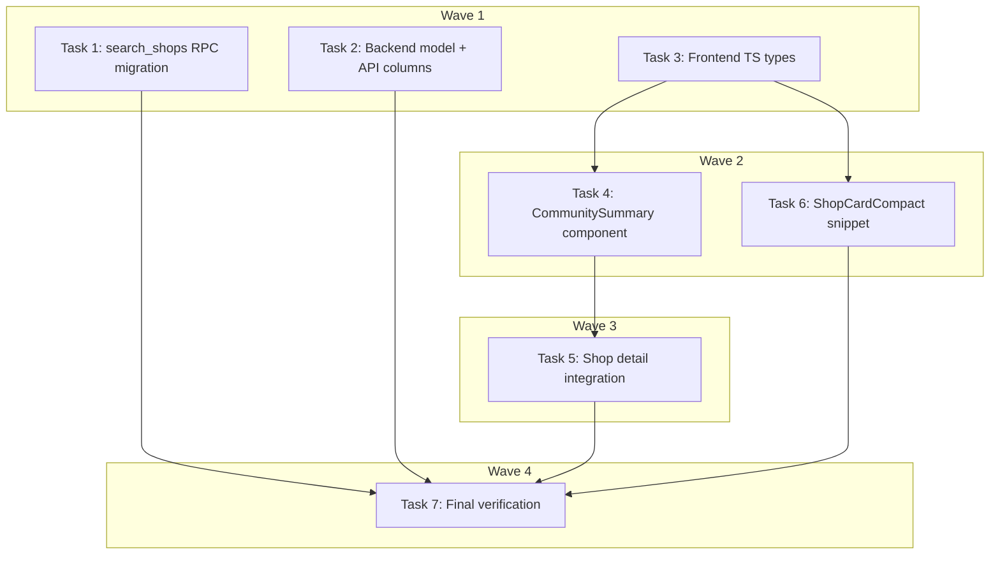

# Community Summary Display Implementation Plan

> **For Claude:** REQUIRED SUB-SKILL: Use executing-plans to implement this plan task-by-task.

**Design Doc:** [docs/designs/2026-03-26-community-summary-display-design.md](docs/designs/2026-03-26-community-summary-display-design.md)

**Spec References:** —

**PRD References:** —

**Goal:** Surface the `shops.community_summary` column on shop detail pages and search result cards.

**Architecture:** Vertical slice from DB → API → frontend. Add `community_summary` to the `search_shops` RPC return set, backend column selections, Pydantic/TS types, and render via two new UI sections. No new endpoints or business logic.

**Tech Stack:** PostgreSQL (migration), FastAPI/Pydantic (model + columns), React/TypeScript (components), lucide-react (Sparkles icon), Vitest/Testing Library (frontend tests), pytest (backend tests)

**Acceptance Criteria:**

- [ ] A user viewing a shop detail page sees a "What visitors say" section with the community summary above the reviews section (hidden if no summary exists)
- [ ] A user browsing search results sees a truncated community snippet on each shop card (hidden if no summary exists)
- [ ] The community summary sparkle icon shows a tooltip explaining it's AI-generated from visitor check-ins

---

### Task 1: Add `community_summary` to `search_shops` RPC

**Files:**

- Create: `supabase/migrations/20260326000001_add_community_summary_to_search_shops_rpc.sql`

**Step 1: Write the migration**

```sql
-- Add community_summary to search_shops return set.
CREATE OR REPLACE FUNCTION search_shops(
    query_embedding vector(1536),
    match_count      int     DEFAULT 20,
    filter_mode_field     text    DEFAULT NULL,
    filter_mode_threshold float   DEFAULT 0.4,
    filter_lat       float   DEFAULT NULL,
    filter_lng       float   DEFAULT NULL,
    filter_radius_km float   DEFAULT 5.0
)
RETURNS TABLE (
    id              uuid,
    name            text,
    address         text,
    latitude        double precision,
    longitude       double precision,
    mrt             text,
    phone           text,
    website         text,
    opening_hours   jsonb,
    rating          numeric,
    review_count    integer,
    price_range     text,
    description     text,
    menu_url        text,
    cafenomad_id    text,
    google_place_id text,
    created_at      timestamptz,
    updated_at      timestamptz,
    community_summary text,
    photo_urls      text[],
    tag_ids         text[],
    similarity      float
)
LANGUAGE sql STABLE SECURITY DEFINER SET search_path = public, extensions
AS $$
    SELECT
        s.id,
        s.name,
        s.address,
        s.latitude,
        s.longitude,
        s.mrt,
        s.phone,
        s.website,
        s.opening_hours,
        s.rating,
        s.review_count,
        s.price_range,
        s.description,
        s.menu_url,
        s.cafenomad_id,
        s.google_place_id,
        s.created_at,
        s.updated_at,
        s.community_summary,
        COALESCE(
            ARRAY(SELECT url FROM shop_photos WHERE shop_id = s.id ORDER BY sort_order),
            '{}'
        ) AS photo_urls,
        COALESCE(
            ARRAY(SELECT tag_id::text FROM shop_tags WHERE shop_id = s.id),
            '{}'
        ) AS tag_ids,
        1 - (s.embedding <=> query_embedding) AS similarity
    FROM shops s
    WHERE
        s.processing_status = 'live'
        AND s.embedding IS NOT NULL
        AND (
            filter_mode_field IS NULL
            OR CASE filter_mode_field
                WHEN 'mode_work'   THEN s.mode_work
                WHEN 'mode_rest'   THEN s.mode_rest
                WHEN 'mode_social' THEN s.mode_social
                ELSE NULL
            END >= filter_mode_threshold
        )
        AND (
            filter_lat IS NULL
            OR (
                ABS(s.latitude  - filter_lat) <= filter_radius_km / 111.0
                AND ABS(s.longitude - filter_lng) <= filter_radius_km / (111.0 * COS(RADIANS(filter_lat)))
            )
        )
    ORDER BY s.embedding <=> query_embedding
    LIMIT match_count;
$$;
```

No test needed — SQL migration applied via `supabase db push`.

**Step 2: Apply migration**

Run: `supabase db diff` (verify no unexpected changes), then `supabase db push`

**Step 3: Commit**

```bash
git add supabase/migrations/20260326000001_add_community_summary_to_search_shops_rpc.sql
git commit -m "feat(DEV-34): add community_summary to search_shops RPC"
```

---

### Task 2: Add `community_summary` field to backend `Shop` model

**Files:**

- Modify: `backend/models/types.py:28-50` (Shop class)
- Test: `backend/tests/api/test_shops.py`

**Step 1: Write the failing test**

Add to `backend/tests/api/test_shops.py`, inside `TestShopsAPI`, after `test_get_shop_detail_returns_camel_case_keys`:

```python
def test_get_shop_detail_includes_community_summary(self):
    """GET /shops/{id} returns communitySummary when the shop has one."""
    shop_data = {
        **SHOP_ROW,
        "community_summary": "顧客推薦拿鐵和巴斯克蛋糕，環境安靜適合工作。",
        "shop_photos": [],
        "shop_tags": [],
    }
    shop_chain = _simple_select_chain([shop_data])

    with patch("api.shops.get_anon_client") as mock_sb:
        mock_sb.return_value = MagicMock(table=MagicMock(return_value=shop_chain))
        response = client.get("/shops/shop-001")

    assert response.status_code == 200
    data = response.json()
    assert data["communitySummary"] == "顧客推薦拿鐵和巴斯克蛋糕，環境安靜適合工作。"

def test_get_shop_detail_community_summary_null_when_absent(self):
    """GET /shops/{id} returns communitySummary: null when shop has no summary."""
    shop_data = {
        **SHOP_ROW,
        "shop_photos": [],
        "shop_tags": [],
    }
    shop_chain = _simple_select_chain([shop_data])

    with patch("api.shops.get_anon_client") as mock_sb:
        mock_sb.return_value = MagicMock(table=MagicMock(return_value=shop_chain))
        response = client.get("/shops/shop-001")

    assert response.status_code == 200
    data = response.json()
    assert data["communitySummary"] is None
```

**Step 2: Run tests to verify they fail**

Run: `cd backend && pytest tests/api/test_shops.py::TestShopsAPI::test_get_shop_detail_includes_community_summary tests/api/test_shops.py::TestShopsAPI::test_get_shop_detail_community_summary_null_when_absent -v`
Expected: FAIL — `communitySummary` key missing from response

**Step 3: Add `community_summary` to `Shop` model and API columns**

In `backend/models/types.py:50`, add after `updated_at`:

```python
community_summary: str | None = None
```

In `backend/api/shops.py:27-32`, update `_SHOP_LIST_COLUMNS`:

```python
_SHOP_LIST_COLUMNS = (
    "id, name, slug, address, city, mrt, latitude, longitude, "
    "rating, review_count, description, processing_status, "
    "mode_work, mode_rest, mode_social, "
    "community_summary, "
    "created_at"
)
```

**Step 4: Run tests to verify they pass**

Run: `cd backend && pytest tests/api/test_shops.py -v`
Expected: ALL PASS

**Step 5: Commit**

```bash
git add backend/models/types.py backend/api/shops.py backend/tests/api/test_shops.py
git commit -m "feat(DEV-34): add community_summary to Shop model and API columns"
```

---

### Task 3: Add `communitySummary` to frontend `Shop` TypeScript interface

**Files:**

- Modify: `lib/types/index.ts:1-26` (Shop interface)

**Step 1: Add field to Shop interface**

In `lib/types/index.ts`, add after `slug` (line 22):

```typescript
communitySummary?: string | null;
```

No test needed — TypeScript compiler validates the type. `SearchResult.shop` inherits this field automatically.

**Step 2: Commit**

```bash
git add lib/types/index.ts
git commit -m "feat(DEV-34): add communitySummary to Shop TypeScript interface"
```

---

### Task 4: Create `CommunitySummary` component

**Files:**

- Create: `components/shops/community-summary.tsx`
- Create: `components/shops/community-summary.test.tsx`

**Step 1: Write the failing tests**

Create `components/shops/community-summary.test.tsx`:

```tsx
import { render, screen } from '@testing-library/react';
import { describe, it, expect } from 'vitest';
import { CommunitySummary } from './community-summary';

describe('a user viewing the community summary section', () => {
  it('sees the "What visitors say" heading when summary exists', () => {
    render(
      <CommunitySummary summary="顧客推薦拿鐵和巴斯克蛋糕，環境安靜適合工作。" />
    );
    expect(screen.getByText(/What visitors say/i)).toBeInTheDocument();
  });

  it('sees the summary text wrapped in quotation marks', () => {
    render(
      <CommunitySummary summary="顧客推薦拿鐵和巴斯克蛋糕，環境安靜適合工作。" />
    );
    expect(screen.getByText(/顧客推薦拿鐵和巴斯克蛋糕/)).toBeInTheDocument();
  });

  it('sees a sparkle icon with tooltip explaining AI generation', () => {
    render(
      <CommunitySummary summary="顧客推薦拿鐵和巴斯克蛋糕，環境安靜適合工作。" />
    );
    const sparkle = screen.getByTitle(/AI generated from visitor check-ins/i);
    expect(sparkle).toBeInTheDocument();
  });

  it('does not see the section when summary is null', () => {
    const { container } = render(<CommunitySummary summary={null} />);
    expect(container.firstChild).toBeNull();
  });

  it('does not see the section when summary is undefined', () => {
    const { container } = render(<CommunitySummary summary={undefined} />);
    expect(container.firstChild).toBeNull();
  });
});
```

**Step 2: Run tests to verify they fail**

Run: `pnpm vitest run components/shops/community-summary.test.tsx`
Expected: FAIL — module not found

**Step 3: Create the component**

Create `components/shops/community-summary.tsx`:

```tsx
import { Sparkles } from 'lucide-react';

interface CommunitySummaryProps {
  summary: string | null | undefined;
}

export function CommunitySummary({ summary }: CommunitySummaryProps) {
  if (!summary) return null;

  return (
    <section className="px-5 py-4">
      <h3 className="text-foreground mb-2 flex items-center gap-1.5 font-[family-name:var(--font-body)] text-sm font-semibold">
        What visitors say
        <Sparkles
          size={14}
          className="text-text-tertiary"
          title="AI generated from visitor check-ins"
        />
      </h3>
      <p className="text-text-secondary font-[family-name:var(--font-body)] text-sm leading-relaxed">
        「{summary}」
      </p>
    </section>
  );
}
```

**Step 4: Run tests to verify they pass**

Run: `pnpm vitest run components/shops/community-summary.test.tsx`
Expected: ALL PASS

**Step 5: Commit**

```bash
git add components/shops/community-summary.tsx components/shops/community-summary.test.tsx
git commit -m "feat(DEV-34): create CommunitySummary component with sparkle tooltip"
```

---

### Task 5: Integrate `CommunitySummary` into shop detail page

**Files:**

- Modify: `app/shops/[shopId]/[slug]/shop-detail-client.tsx:23-50,152-162`
- Modify: `app/shops/[shopId]/[slug]/shop-detail-client.test.tsx`

**Step 1: Write the failing tests**

Add to `app/shops/[shopId]/[slug]/shop-detail-client.test.tsx`.

First, add the mock for CommunitySummary at top level (alongside other vi.mock calls, before imports):

```typescript
vi.mock('@/components/shops/community-summary', () => ({
  CommunitySummary: ({ summary }: { summary: string | null }) =>
    summary ? <p data-testid="community-summary">{summary}</p> : null,
}));
```

Then add a new describe block:

```typescript
describe('ShopDetailClient — community summary', () => {
  beforeEach(() => {
    vi.mocked(useGeolocation).mockReturnValue({
      latitude: null,
      longitude: null,
      error: null,
      loading: false,
      requestLocation: vi.fn(),
    });
  });

  it('a user sees the community summary when the shop has one', () => {
    const shopWithSummary = {
      ...shopWithMap,
      communitySummary: '顧客推薦拿鐵和巴斯克蛋糕，環境安靜適合工作。',
    };
    render(<ShopDetailClient shop={shopWithSummary} />);
    expect(screen.getByTestId('community-summary')).toBeInTheDocument();
    expect(screen.getByText(/顧客推薦拿鐵/)).toBeInTheDocument();
  });

  it('a user does not see a community summary section when the shop has none', () => {
    render(<ShopDetailClient shop={shopWithMap} />);
    expect(screen.queryByTestId('community-summary')).not.toBeInTheDocument();
  });
});
```

**Step 2: Run tests to verify they fail**

Run: `pnpm vitest run app/shops/\\[shopId\\]/\\[slug\\]/shop-detail-client.test.tsx`
Expected: FAIL — `communitySummary` not on ShopData, CommunitySummary not rendered

**Step 3: Integrate CommunitySummary**

In `app/shops/[shopId]/[slug]/shop-detail-client.tsx`:

1. Add import (after line 15, with other component imports):

```typescript
import { CommunitySummary } from '@/components/shops/community-summary';
```

2. Add `communitySummary` to `ShopData` interface (after `address` on line 42):

```typescript
communitySummary?: string | null;
```

3. Add CommunitySummary rendering above `<ShopReviews>` (before line 155, after the border div on line 153):

```tsx
<CommunitySummary summary={shop.communitySummary ?? null} />
```

**Step 4: Run tests to verify they pass**

Run: `pnpm vitest run app/shops/\\[shopId\\]/\\[slug\\]/shop-detail-client.test.tsx`
Expected: ALL PASS

**Step 5: Commit**

```bash
git add app/shops/[shopId]/[slug]/shop-detail-client.tsx app/shops/[shopId]/[slug]/shop-detail-client.test.tsx
git commit -m "feat(DEV-34): render CommunitySummary above reviews on shop detail page"
```

---

### Task 6: Add community snippet to `ShopCardCompact`

**Files:**

- Modify: `components/shops/shop-card-compact.tsx:5-14,70-76`
- Modify: `components/shops/shop-card-compact.test.tsx`

**Step 1: Write the failing tests**

Add to `components/shops/shop-card-compact.test.tsx`:

```typescript
it('a user browsing search results sees a community snippet on the card', () => {
  const shopWithSummary = {
    ...shop,
    community_summary: '顧客推薦拿鐵和巴斯克蛋糕，環境安靜適合工作。咖啡豆選用衣索比亞日曬，果香明顯，適合喜歡手沖的朋友。',
  };
  render(<ShopCardCompact shop={shopWithSummary} onClick={() => {}} />);
  // Should be truncated to ~80 chars with ellipsis
  expect(screen.getByText(/顧客推薦拿鐵/)).toBeInTheDocument();
  expect(screen.getByText(/…/)).toBeInTheDocument();
});

it('a user does not see a community snippet when the shop has no summary', () => {
  render(<ShopCardCompact shop={shop} onClick={() => {}} />);
  expect(screen.queryByText(/「/)).not.toBeInTheDocument();
});
```

**Step 2: Run tests to verify they fail**

Run: `pnpm vitest run components/shops/shop-card-compact.test.tsx`
Expected: FAIL — no community snippet rendered

**Step 3: Add snippet to ShopCardCompact**

In `components/shops/shop-card-compact.tsx`:

1. Add `community_summary` to `CompactShop` interface (after line 13):

```typescript
community_summary?: string | null;
communitySummary?: string | null;
```

2. Add a truncation helper (after `formatMeta` function, ~line 34):

```typescript
function truncateSnippet(text: string, maxLen = 80): string {
  if (text.length <= maxLen) return `「${text}」`;
  return `「${text.slice(0, maxLen)}…」`;
}
```

3. Inside the component, after the meta `<span>` (line 74-76), add:

```tsx
{
  (() => {
    const summary = shop.community_summary ?? shop.communitySummary;
    return summary ? (
      <span className="text-text-tertiary truncate font-[family-name:var(--font-body)] text-[12px]">
        {truncateSnippet(summary)}
      </span>
    ) : null;
  })();
}
```

4. Increase the card height from `h-20` to `h-auto min-h-[5rem]` on line 49 to accommodate the extra line:

Replace:

```
className={`flex h-20 cursor-pointer items-center gap-3 px-5 py-0 transition-colors ${
```

With:

```
className={`flex min-h-[5rem] cursor-pointer items-center gap-3 px-5 py-2 transition-colors ${
```

**Step 4: Run tests to verify they pass**

Run: `pnpm vitest run components/shops/shop-card-compact.test.tsx`
Expected: ALL PASS

**Step 5: Commit**

```bash
git add components/shops/shop-card-compact.tsx components/shops/shop-card-compact.test.tsx
git commit -m "feat(DEV-34): add community snippet to ShopCardCompact with 80-char truncation"
```

---

### Task 7: Final verification — lint, type-check, full test suite

**Files:** None (verification only)

**Step 1: Run linter**

Run: `pnpm lint`
Expected: PASS (no errors)

**Step 2: Run type-check**

Run: `pnpm type-check`
Expected: PASS (no errors)

**Step 3: Run full frontend test suite**

Run: `pnpm test`
Expected: ALL PASS

**Step 4: Run backend tests**

Run: `cd backend && pytest -v`
Expected: ALL PASS

**Step 5: Run backend linter**

Run: `cd backend && ruff check .`
Expected: PASS

No commit needed — verification only.

---

## Execution Waves



**Wave 1** (parallel — no dependencies):

- Task 1: `search_shops` RPC migration
- Task 2: Backend `Shop` model + API columns
- Task 3: Frontend `Shop` TypeScript interface

**Wave 2** (parallel — depends on Wave 1):

- Task 4: `CommunitySummary` component ← Task 3
- Task 6: `ShopCardCompact` snippet ← Task 3

**Wave 3** (sequential — depends on Wave 2):

- Task 5: Shop detail page integration ← Task 4

**Wave 4** (sequential — depends on all):

- Task 7: Final verification ← all tasks
