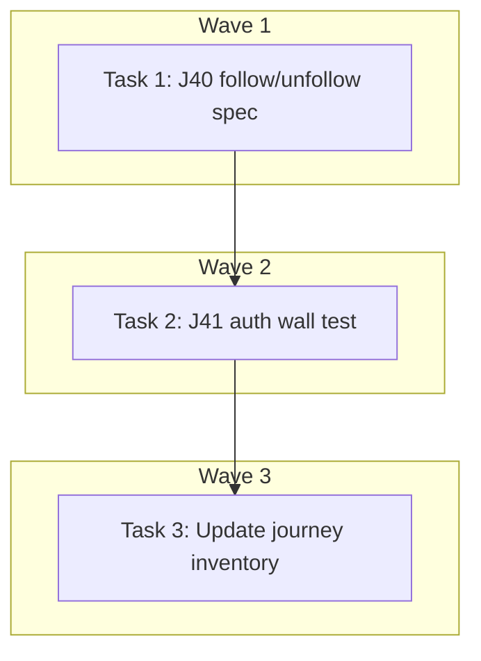

# E2E Shop Follow/Unfollow Journey Implementation Plan

> **For Claude:** REQUIRED SUB-SKILL: Use executing-plans to implement this plan task-by-task.

**Design Doc:** [docs/designs/2026-03-26-e2e-follow-unfollow-design.md](../designs/2026-03-26-e2e-follow-unfollow-design.md)

**Spec References:** [SPEC.md — Shop following](../../SPEC.md) (follower visibility threshold >=10, auth wall, PDPA cascade)

**PRD References:** —

**Goal:** Add E2E Playwright tests for the shop follow/unfollow user journey (J40: authed toggle, J41: auth wall).

**Architecture:** Single new spec file `e2e/following.spec.ts` with two test groups. J40 uses `authedPage` fixture in serial mode (follow then unfollow). J41 uses standard Playwright test (no auth) to verify the auth wall redirect. Both fetch a seeded shop via `/api/shops?featured=true&limit=1` and navigate to its detail page.

**Tech Stack:** Playwright, TypeScript

**Acceptance Criteria:**

- [ ] Authenticated user can follow a shop and see the button label change to "Unfollow this shop"
- [ ] Authenticated user can unfollow a shop and see the button label revert to "Follow this shop"
- [ ] Unauthenticated user clicking follow is redirected to `/login`
- [ ] Tests skip gracefully when no seeded shops are available

---

### Task 1: Write E2E spec — J40 authenticated follow/unfollow toggle

**Files:**

- Create: `e2e/following.spec.ts`

**Step 1: Write the spec file with J40 serial tests**

```typescript
import { test, expect } from './fixtures/auth';
import { first } from './fixtures/helpers';

test.describe.serial('@critical J40 — Follow/unfollow toggle', () => {
  let shopUrl: string;

  test.beforeAll(async ({ browser }) => {
    const ctx = await browser.newContext();
    const page = await ctx.newPage();
    const response = await page.request.get('/api/shops?featured=true&limit=1');
    const shops = await response.json();
    const shop = first(shops);
    if (shop) {
      shopUrl = `/shops/${shop.id}/${shop.slug || shop.id}`;
    }
    await page.close();
    await ctx.close();
  });

  test('following a shop toggles button to "Unfollow this shop"', async ({
    authedPage: page,
  }) => {
    test.skip(!shopUrl, 'No seeded shops available');

    await page.goto(shopUrl);
    await page.waitForLoadState('networkidle');

    const followBtn = page.getByRole('button', {
      name: 'Follow this shop',
    });
    await expect(followBtn).toBeVisible({ timeout: 10_000 });

    await followBtn.click();

    // After click, button label should change to "Unfollow this shop"
    await expect(
      page.getByRole('button', { name: 'Unfollow this shop' })
    ).toBeVisible({ timeout: 10_000 });
  });

  test('unfollowing the shop reverts button to "Follow this shop"', async ({
    authedPage: page,
  }) => {
    test.skip(!shopUrl, 'No seeded shops available');

    await page.goto(shopUrl);
    await page.waitForLoadState('networkidle');

    // Should be in "following" state from previous test
    const unfollowBtn = page.getByRole('button', {
      name: 'Unfollow this shop',
    });
    await expect(unfollowBtn).toBeVisible({ timeout: 10_000 });

    await unfollowBtn.click();

    // After click, button label should revert to "Follow this shop"
    await expect(
      page.getByRole('button', { name: 'Follow this shop' })
    ).toBeVisible({ timeout: 10_000 });
  });
});
```

**Step 2: Run the test to verify it works against the dev server**

Run: `cd e2e && npx playwright test following.spec.ts --project=mobile`
Expected: PASS (both tests should pass if dev server is running with seeded data)

**Step 3: Commit**

```bash
git add e2e/following.spec.ts
git commit -m "test(DEV-61): E2E follow/unfollow toggle journey (J40)"
```

---

### Task 2: Add J41 auth wall test to the spec

**Files:**

- Modify: `e2e/following.spec.ts`

**Step 1: Append the auth wall test group**

Add below the J40 block, using standard `@playwright/test` import alias for unauthed tests:

```typescript
import { test as unauthTest, expect as unauthExpect } from '@playwright/test';

unauthTest.describe('@critical J41 — Follow requires authentication', () => {
  unauthTest(
    'unauthenticated user clicking follow is redirected to login',
    async ({ page }) => {
      const response = await page.request.get(
        '/api/shops?featured=true&limit=1'
      );
      const shops = await response.json();
      const shop = first(shops);
      unauthTest.skip(!shop, 'No seeded shops available');

      await page.goto(`/shops/${shop.id}/${shop.slug || shop.id}`);
      await page.waitForLoadState('networkidle');

      const followBtn = page.getByRole('button', {
        name: 'Follow this shop',
      });
      await unauthExpect(followBtn).toBeVisible({ timeout: 10_000 });

      await followBtn.click();

      // Auth wall redirects to /login
      await page.waitForURL(/\/login/, { timeout: 10_000 });
    }
  );
});
```

Note: The file needs both imports at the top:

```typescript
import { test, expect } from './fixtures/auth';
import { test as unauthTest, expect as unauthExpect } from '@playwright/test';
import { first } from './fixtures/helpers';
```

**Step 2: Run the full spec**

Run: `cd e2e && npx playwright test following.spec.ts --project=mobile`
Expected: PASS (all 3 tests)

**Step 3: Commit**

```bash
git add e2e/following.spec.ts
git commit -m "test(DEV-61): E2E follow auth wall journey (J41)"
```

---

### Task 3: Update E2E journey inventory

**Files:**

- Modify: `docs/e2e-journeys.md`

**Step 1: Add J40 and J41 entries**

In the "Critical Paths" table, add:

```markdown
| J40 | Follow/unfollow: button state toggle | `following.spec.ts` | Implemented |
| J41 | Follow: auth wall redirects to login | `following.spec.ts` | Implemented |
```

In the "Full Suite" table, no entries needed (both are critical).

**Step 2: Commit**

```bash
git add docs/e2e-journeys.md
git commit -m "docs(DEV-61): add J40, J41 to E2E journey inventory"
```

---

## Execution Waves



**Wave 1** (single file creation):

- Task 1: J40 follow/unfollow serial spec

**Wave 2** (depends on Wave 1 — same file):

- Task 2: J41 auth wall test ← Task 1

**Wave 3** (depends on Wave 2 — docs update):

- Task 3: Update journey inventory ← Task 2

---

## TODO

- [ ] **Task 1:** Write J40 follow/unfollow E2E spec
- [ ] **Task 2:** Add J41 auth wall test
- [ ] **Task 3:** Update E2E journey inventory
