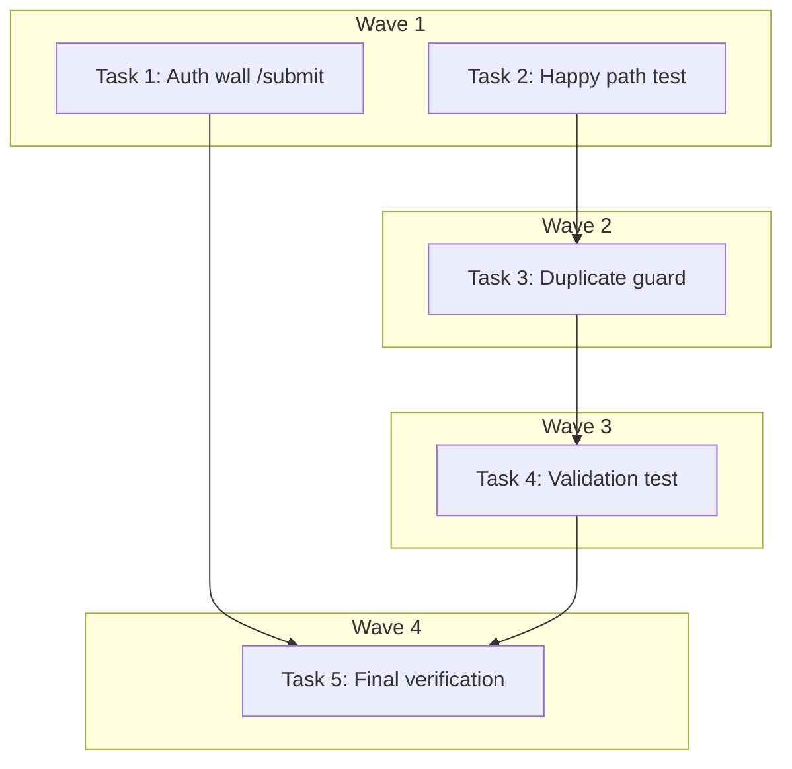

# E2E Community Shop Submission Journey — Implementation Plan

> **For Claude:** REQUIRED SUB-SKILL: Use executing-plans to implement this plan task-by-task.

**Design Doc:** [docs/designs/2026-03-26-e2e-submit-journey-design.md](../designs/2026-03-26-e2e-submit-journey-design.md)

**Spec References:** [SPEC.md line 194 — Community shop submissions](../../SPEC.md)

**PRD References:** —

**Goal:** Add E2E Playwright coverage for the community shop submission flow (`/submit`) — happy path, duplicate guard, and URL validation.

**Architecture:** One new spec file (`e2e/submit.spec.ts`) using the existing `authedPage` fixture. All requests hit the real local FastAPI backend. Unique URLs per run via `Date.now()` suffix — no DB cleanup needed. One minor addition to `e2e/auth.spec.ts` to include `/submit` in the protected routes list.

**Tech Stack:** Playwright, TypeScript

**Acceptance Criteria:**
- [ ] An authenticated user can submit a Google Maps URL on `/submit` and see a success message plus the submission in their history
- [ ] Submitting a duplicate URL shows an error and does not clear the form
- [ ] Entering an invalid URL shows inline validation without making a network request
- [ ] Unauthenticated users visiting `/submit` are redirected to `/login`

---

### Task 1: Add `/submit` to auth wall protected routes

**Files:**
- Modify: `e2e/auth.spec.ts:23` (after the `/checkin/:shopId` test)

**Step 1: Add the test case**

Insert after line 23 (after the checkin redirect test):

```typescript
  test('unauthenticated user accessing /submit is redirected to /login', async ({
    page,
  }) => {
    await page.goto('/submit');
    await page.waitForURL(/\/login/, { timeout: 10_000 });
  });
```

**Step 2: Run test to verify it passes**

Run: `pnpm exec playwright test e2e/auth.spec.ts --grep "accessing /submit" --project=mobile`
Expected: PASS — the `(protected)` route group already redirects unauthenticated users.

**Step 3: Commit**

```bash
git add e2e/auth.spec.ts
git commit -m "test(DEV-62): add /submit to auth wall E2E coverage"
```

---

### Task 2: Create submit E2E spec — happy path

**Files:**
- Create: `e2e/submit.spec.ts`

**Step 1: Write the spec file with the happy path test**

```typescript
import { test, expect } from './fixtures/auth';

// Generate a unique-per-run Google Maps URL to avoid cross-run collisions.
// The backend validates the URL prefix matches Google Maps domains.
const uniqueUrl = `https://maps.app.goo.gl/e2eTest${Date.now()}`;

test.describe.serial('@critical J40 — Community shop submission', () => {
  test('authenticated user submits a shop URL and sees confirmation', async ({
    authedPage: page,
  }) => {
    await page.goto('/submit');

    // Page heading visible
    await expect(page.getByText('推薦咖啡廳')).toBeVisible({ timeout: 10_000 });

    // Fill in the URL
    const urlInput = page.getByPlaceholder('貼上 Google Maps 連結');
    await urlInput.fill(uniqueUrl);

    // Submit
    const submitButton = page.getByRole('button', { name: '送出' });
    await expect(submitButton).toBeEnabled();
    await submitButton.click();

    // Wait for success message
    await expect(page.getByText('感謝推薦！我們正在處理中。')).toBeVisible({
      timeout: 10_000,
    });

    // Verify submission appears in history with "處理中" badge
    await expect(page.getByText('我的推薦紀錄')).toBeVisible();
    await expect(page.getByText(uniqueUrl)).toBeVisible();
    await expect(page.getByText('處理中').first()).toBeVisible();
  });
});
```

**Step 2: Run test to verify it passes**

Run: `pnpm exec playwright test e2e/submit.spec.ts --grep "submits a shop URL" --project=mobile`
Expected: PASS — real backend processes the submission.

> **Note:** This requires `supabase start` and `uvicorn` running locally. Run `make doctor` first.

**Step 3: Commit**

```bash
git add e2e/submit.spec.ts
git commit -m "test(DEV-62): E2E happy path — submit shop URL and see confirmation"
```

---

### Task 3: Add duplicate guard test

**Files:**
- Modify: `e2e/submit.spec.ts` (add test inside the existing `serial` describe block)

**Step 1: Add the duplicate test after the happy path**

Append inside the `test.describe.serial` block, after the happy path test:

```typescript
  test('submitting a duplicate URL shows error', async ({
    authedPage: page,
  }) => {
    await page.goto('/submit');

    // Submit the same URL that was submitted in the happy path test
    const urlInput = page.getByPlaceholder('貼上 Google Maps 連結');
    await urlInput.fill(uniqueUrl);

    const submitButton = page.getByRole('button', { name: '送出' });
    await submitButton.click();

    // Error message should appear (409 duplicate from backend)
    await expect(page.locator('.text-red-600')).toBeVisible({ timeout: 10_000 });

    // URL input should NOT be cleared (form preserved on error)
    await expect(urlInput).toHaveValue(uniqueUrl);

    // Success message should NOT appear
    await expect(page.getByText('感謝推薦！我們正在處理中。')).toBeHidden();
  });
```

**Step 2: Run both tests serially to verify**

Run: `pnpm exec playwright test e2e/submit.spec.ts --project=mobile`
Expected: Both PASS — happy path creates the submission, duplicate test gets 409.

**Step 3: Commit**

```bash
git add e2e/submit.spec.ts
git commit -m "test(DEV-62): E2E duplicate guard — submitting existing URL shows error"
```

---

### Task 4: Add URL validation test

**Files:**
- Modify: `e2e/submit.spec.ts` (add test inside the existing `serial` describe block)

**Step 1: Add the validation test**

Append inside the `test.describe.serial` block:

```typescript
  test('invalid URL shows inline validation error without network request', async ({
    authedPage: page,
  }) => {
    await page.goto('/submit');

    const urlInput = page.getByPlaceholder('貼上 Google Maps 連結');
    await urlInput.fill('not-a-valid-url');

    // Submit button should be enabled (url is non-empty)
    const submitButton = page.getByRole('button', { name: '送出' });
    await expect(submitButton).toBeEnabled();

    // Intercept to verify no network request is made
    let apiCalled = false;
    await page.route('**/api/submissions', (route) => {
      apiCalled = true;
      return route.continue();
    });

    await submitButton.click();

    // Inline validation error should appear
    await expect(page.getByText('請輸入有效的 Google Maps 連結')).toBeVisible();

    // No API call should have been made (client-side validation catches it)
    expect(apiCalled).toBe(false);

    // Clean up route handler
    await page.unroute('**/api/submissions');
  });
```

**Step 2: Run the full suite to verify all 3 tests pass**

Run: `pnpm exec playwright test e2e/submit.spec.ts --project=mobile`
Expected: All 3 PASS.

**Step 3: Run on desktop project too**

Run: `pnpm exec playwright test e2e/submit.spec.ts --project=desktop`
Expected: All 3 PASS.

**Step 4: Commit**

```bash
git add e2e/submit.spec.ts
git commit -m "test(DEV-62): E2E URL validation — invalid URL shows error, no API call"
```

---

### Task 5: Final verification and cleanup

**Files:**
- No new files

**Step 1: Run the full E2E suite to check for regressions**

Run: `pnpm exec playwright test --project=mobile`
Expected: All existing tests still pass. New submit tests pass.

**Step 2: Run on desktop too**

Run: `pnpm exec playwright test --project=desktop`
Expected: All pass.

**Step 3: Verify no lint issues**

Run: `pnpm lint`
Expected: No new errors.

---

## Execution Waves



**Wave 1** (parallel — no dependencies):
- Task 1: Add `/submit` to auth.spec.ts protected routes
- Task 2: Create submit.spec.ts with happy path

**Wave 2** (depends on Wave 1):
- Task 3: Add duplicate guard test ← Task 2 (same file, serial block depends on happy path)

**Wave 3** (depends on Wave 2):
- Task 4: Add URL validation test ← Task 3 (same file)

**Wave 4** (depends on all):
- Task 5: Final verification ← Tasks 1-4

---

## TODO

### E2E: Community Shop Submission Journey (DEV-62)
> **Design Doc:** [docs/designs/2026-03-26-e2e-submit-journey-design.md](docs/designs/2026-03-26-e2e-submit-journey-design.md)
> **Plan:** [docs/plans/2026-03-26-e2e-submit-journey-plan.md](docs/plans/2026-03-26-e2e-submit-journey-plan.md)

**Wave 1 — Setup:**
- [ ] Add `/submit` to auth wall protected routes (auth.spec.ts)
- [ ] Create submit.spec.ts with happy path (@critical J40)

**Wave 2 — Edge Cases:**
- [ ] Add duplicate guard test (409 error handling)
- [ ] Add URL validation test (client-side, no API call)

**Wave 3 — Verification:**
- [ ] Full E2E suite regression check (mobile + desktop)
