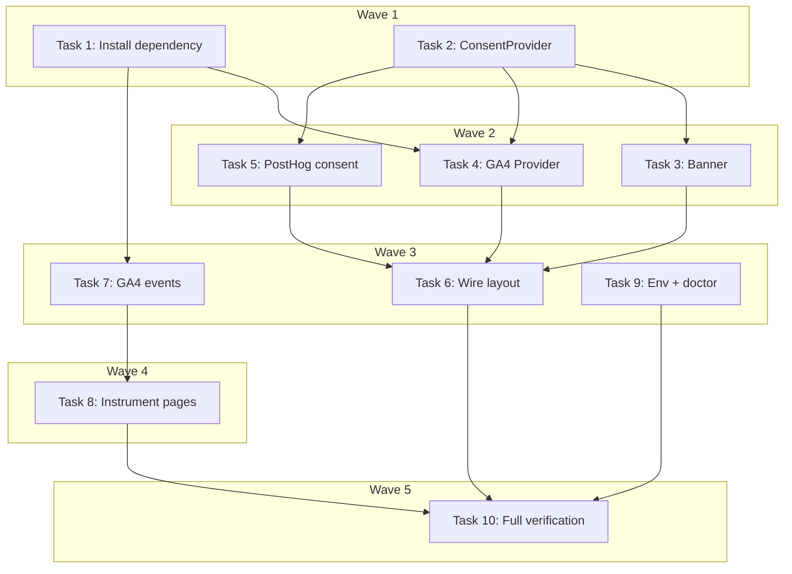

# GA4 + Shared Cookie Consent Banner Implementation Plan

> **For Claude:** REQUIRED SUB-SKILL: Use executing-plans to implement this plan task-by-task.

**Design Doc:** [docs/designs/2026-03-26-ga4-consent-banner-design.md](docs/designs/2026-03-26-ga4-consent-banner-design.md)

**Spec References:** [SPEC.md#6-observability](SPEC.md#6-observability), [SPEC.md#5-compliance](SPEC.md#5-compliance)

**PRD References:** [PRD.md#10-success-metrics](PRD.md#10-success-metrics)

**Goal:** Add GA4 alongside PostHog for full-funnel analytics, gated behind a shared PDPA-compliant cookie consent banner.

**Architecture:** A `ConsentProvider` React context owns consent state (`granted`/`denied`/`pending`). GA4 loads via `@next/third-parties` with consent mode v2 (loads in `denied` state, updates on consent). PostHog defers `init()` until consent is granted. A custom shadcn/ui banner handles the user-facing consent UI.

**Tech Stack:** `@next/third-parties` (GA4), `posthog-js` (existing), React Context, Vitest + Testing Library

**Acceptance Criteria:**
- [ ] A visitor who has not yet accepted cookies sees a consent banner at the bottom of the page
- [ ] After accepting cookies, GA4 and PostHog both track pageviews; after rejecting, neither sets analytics cookies
- [ ] The consent preference persists across page reloads via a `caferoam_consent` cookie
- [ ] GA4 fires `page_view` automatically and the 3 custom events (`search`, `shop_detail_view`, `signup_cta_click`) on appropriate interactions
- [ ] Existing PostHog event tracking continues to work for authenticated users who have granted consent

---

### Task 1: Install `@next/third-parties` dependency

**Files:**
- Modify: `package.json`

**Step 1: Install the package**

No test needed — dependency installation.

Run (from worktree root):
```bash
pnpm add @next/third-parties
```

**Step 2: Verify installation**

Run:
```bash
pnpm ls @next/third-parties
```
Expected: Shows `@next/third-parties` with a version number.

**Step 3: Commit**

```bash
git add package.json pnpm-lock.yaml
git commit -m "chore(DEV-30): add @next/third-parties for GA4 integration"
```

---

### Task 2: Create ConsentProvider and useConsent hook

**Files:**
- Create: `lib/consent/provider.tsx`
- Create: `lib/consent/use-consent.ts`
- Create: `lib/consent/__tests__/provider.test.tsx`

**Step 1: Write the failing tests**

Create `lib/consent/__tests__/provider.test.tsx`:

```tsx
import { describe, it, expect, beforeEach } from 'vitest';
import { render, screen, act } from '@testing-library/react';
import userEvent from '@testing-library/user-event';
import { ConsentProvider } from '../provider';
import { useConsent } from '../use-consent';

function TestConsumer() {
  const { consent, updateConsent } = useConsent();
  return (
    <div>
      <span data-testid="consent-state">{consent}</span>
      <button onClick={() => updateConsent('granted')}>Accept</button>
      <button onClick={() => updateConsent('denied')}>Reject</button>
    </div>
  );
}

function getCookie(name: string): string | undefined {
  const match = document.cookie.match(new RegExp(`(?:^|; )${name}=([^;]*)`));
  return match ? decodeURIComponent(match[1]) : undefined;
}

describe('ConsentProvider', () => {
  beforeEach(() => {
    // Clear all cookies
    document.cookie = 'caferoam_consent=; max-age=0; path=/';
  });

  it('shows pending state when no consent cookie exists', () => {
    render(
      <ConsentProvider>
        <TestConsumer />
      </ConsentProvider>
    );
    expect(screen.getByTestId('consent-state')).toHaveTextContent('pending');
  });

  it('reads granted state from existing cookie on mount', () => {
    document.cookie = 'caferoam_consent=granted; path=/';
    render(
      <ConsentProvider>
        <TestConsumer />
      </ConsentProvider>
    );
    expect(screen.getByTestId('consent-state')).toHaveTextContent('granted');
  });

  it('reads denied state from existing cookie on mount', () => {
    document.cookie = 'caferoam_consent=denied; path=/';
    render(
      <ConsentProvider>
        <TestConsumer />
      </ConsentProvider>
    );
    expect(screen.getByTestId('consent-state')).toHaveTextContent('denied');
  });

  it('treats a corrupted cookie value as pending', () => {
    document.cookie = 'caferoam_consent=garbage; path=/';
    render(
      <ConsentProvider>
        <TestConsumer />
      </ConsentProvider>
    );
    expect(screen.getByTestId('consent-state')).toHaveTextContent('pending');
  });

  it('when a visitor accepts cookies, the consent state updates to granted and a cookie is set', async () => {
    const user = userEvent.setup();
    render(
      <ConsentProvider>
        <TestConsumer />
      </ConsentProvider>
    );

    await user.click(screen.getByText('Accept'));

    expect(screen.getByTestId('consent-state')).toHaveTextContent('granted');
    expect(getCookie('caferoam_consent')).toBe('granted');
  });

  it('when a visitor rejects cookies, the consent state updates to denied and a cookie is set', async () => {
    const user = userEvent.setup();
    render(
      <ConsentProvider>
        <TestConsumer />
      </ConsentProvider>
    );

    await user.click(screen.getByText('Reject'));

    expect(screen.getByTestId('consent-state')).toHaveTextContent('denied');
    expect(getCookie('caferoam_consent')).toBe('denied');
  });
});
```

**Step 2: Run tests to verify they fail**

Run:
```bash
pnpm vitest run lib/consent/__tests__/provider.test.tsx
```
Expected: FAIL — modules not found.

**Step 3: Implement ConsentProvider**

Create `lib/consent/provider.tsx`:

```tsx
'use client';

import { createContext, useState, useCallback, useMemo } from 'react';

export type ConsentState = 'granted' | 'denied' | 'pending';

export interface ConsentContextValue {
  consent: ConsentState;
  updateConsent: (value: 'granted' | 'denied') => void;
}

export const ConsentContext = createContext<ConsentContextValue | null>(null);

const COOKIE_NAME = 'caferoam_consent';
const COOKIE_MAX_AGE = 365 * 24 * 60 * 60; // 1 year in seconds

function readConsentCookie(): ConsentState {
  if (typeof document === 'undefined') return 'pending';
  const match = document.cookie.match(
    new RegExp(`(?:^|; )${COOKIE_NAME}=([^;]*)`)
  );
  const value = match ? decodeURIComponent(match[1]) : null;
  if (value === 'granted' || value === 'denied') return value;
  return 'pending';
}

function writeConsentCookie(value: 'granted' | 'denied') {
  document.cookie = `${COOKIE_NAME}=${value}; max-age=${COOKIE_MAX_AGE}; path=/; SameSite=Lax`;
}

export function ConsentProvider({ children }: { children: React.ReactNode }) {
  const [consent, setConsent] = useState<ConsentState>(readConsentCookie);

  const updateConsent = useCallback((value: 'granted' | 'denied') => {
    writeConsentCookie(value);
    setConsent(value);
  }, []);

  const contextValue = useMemo(
    () => ({ consent, updateConsent }),
    [consent, updateConsent]
  );

  return (
    <ConsentContext.Provider value={contextValue}>
      {children}
    </ConsentContext.Provider>
  );
}
```

Create `lib/consent/use-consent.ts`:

```ts
'use client';

import { useContext } from 'react';
import { ConsentContext, type ConsentContextValue } from './provider';

export function useConsent(): ConsentContextValue {
  const context = useContext(ConsentContext);
  if (!context) {
    throw new Error('useConsent must be used within a ConsentProvider');
  }
  return context;
}
```

**Step 4: Run tests to verify they pass**

Run:
```bash
pnpm vitest run lib/consent/__tests__/provider.test.tsx
```
Expected: All 6 tests PASS.

**Step 5: Commit**

```bash
git add lib/consent/
git commit -m "feat(DEV-30): add ConsentProvider context and useConsent hook"
```

---

### Task 3: Create CookieConsentBanner component

**Files:**
- Create: `components/cookie-consent-banner.tsx`
- Create: `components/__tests__/cookie-consent-banner.test.tsx`

**Step 1: Write the failing tests**

Create `components/__tests__/cookie-consent-banner.test.tsx`:

```tsx
import { describe, it, expect, beforeEach } from 'vitest';
import { render, screen } from '@testing-library/react';
import userEvent from '@testing-library/user-event';
import { ConsentProvider } from '@/lib/consent/provider';
import { CookieConsentBanner } from '../cookie-consent-banner';

function renderBanner() {
  return render(
    <ConsentProvider>
      <CookieConsentBanner />
    </ConsentProvider>
  );
}

describe('CookieConsentBanner', () => {
  beforeEach(() => {
    document.cookie = 'caferoam_consent=; max-age=0; path=/';
  });

  it('shows the consent banner when the visitor has not yet decided', () => {
    renderBanner();
    expect(
      screen.getByText(/we use cookies/i)
    ).toBeInTheDocument();
    expect(screen.getByRole('button', { name: /accept/i })).toBeInTheDocument();
    expect(screen.getByRole('button', { name: /reject/i })).toBeInTheDocument();
  });

  it('hides the banner after the visitor clicks Accept', async () => {
    const user = userEvent.setup();
    renderBanner();

    await user.click(screen.getByRole('button', { name: /accept/i }));

    expect(screen.queryByText(/we use cookies/i)).not.toBeInTheDocument();
  });

  it('hides the banner after the visitor clicks Reject', async () => {
    const user = userEvent.setup();
    renderBanner();

    await user.click(screen.getByRole('button', { name: /reject/i }));

    expect(screen.queryByText(/we use cookies/i)).not.toBeInTheDocument();
  });

  it('does not show the banner when consent was previously granted', () => {
    document.cookie = 'caferoam_consent=granted; path=/';
    renderBanner();
    expect(screen.queryByText(/we use cookies/i)).not.toBeInTheDocument();
  });

  it('does not show the banner when consent was previously denied', () => {
    document.cookie = 'caferoam_consent=denied; path=/';
    renderBanner();
    expect(screen.queryByText(/we use cookies/i)).not.toBeInTheDocument();
  });
});
```

**Step 2: Run tests to verify they fail**

Run:
```bash
pnpm vitest run components/__tests__/cookie-consent-banner.test.tsx
```
Expected: FAIL — module not found.

**Step 3: Implement CookieConsentBanner**

Create `components/cookie-consent-banner.tsx`:

```tsx
'use client';

import { useConsent } from '@/lib/consent/use-consent';
import { Button } from '@/components/ui/button';

export function CookieConsentBanner() {
  const { consent, updateConsent } = useConsent();

  if (consent !== 'pending') return null;

  return (
    <div
      role="banner"
      className="fixed inset-x-0 bottom-0 z-50 border-t bg-background/95 p-4 backdrop-blur-sm sm:p-6"
    >
      <div className="mx-auto flex max-w-lg flex-col items-center gap-3 sm:flex-row sm:gap-4">
        <p className="text-muted-foreground text-center text-sm sm:text-left">
          We use cookies to analyze traffic and improve your experience.{' '}
          <a href="/privacy" className="text-primary underline underline-offset-4">
            Privacy Policy
          </a>
        </p>
        <div className="flex shrink-0 gap-2">
          <Button
            variant="outline"
            size="sm"
            onClick={() => updateConsent('denied')}
          >
            Reject
          </Button>
          <Button size="sm" onClick={() => updateConsent('granted')}>
            Accept
          </Button>
        </div>
      </div>
    </div>
  );
}
```

**Step 4: Run tests to verify they pass**

Run:
```bash
pnpm vitest run components/__tests__/cookie-consent-banner.test.tsx
```
Expected: All 5 tests PASS.

**Step 5: Commit**

```bash
git add components/cookie-consent-banner.tsx components/__tests__/cookie-consent-banner.test.tsx
git commit -m "feat(DEV-30): add CookieConsentBanner component with shadcn/ui"
```

---

### Task 4: Create GA4 wrapper with consent mode v2

**Files:**
- Create: `lib/analytics/ga4.tsx`
- Create: `lib/analytics/__tests__/ga4.test.tsx`

**Step 1: Write the failing tests**

Create `lib/analytics/__tests__/ga4.test.tsx`:

```tsx
import { describe, it, expect, vi, beforeEach, afterEach } from 'vitest';
import { render } from '@testing-library/react';
import { ConsentProvider } from '@/lib/consent/provider';

// Mock @next/third-parties/google
vi.mock('@next/third-parties/google', () => ({
  GoogleAnalytics: ({ gaId }: { gaId: string }) => (
    <div data-testid="ga-script" data-ga-id={gaId} />
  ),
}));

// Capture gtag calls
const gtagCalls: unknown[][] = [];
const mockGtag = (...args: unknown[]) => {
  gtagCalls.push(args);
};

describe('GA4Provider', () => {
  beforeEach(() => {
    gtagCalls.length = 0;
    // Set up window.gtag mock
    Object.defineProperty(window, 'gtag', {
      value: mockGtag,
      writable: true,
      configurable: true,
    });
    vi.stubEnv('NEXT_PUBLIC_GA_MEASUREMENT_ID', 'G-TEST12345');
  });

  afterEach(() => {
    vi.unstubAllEnvs();
    document.cookie = 'caferoam_consent=; max-age=0; path=/';
  });

  it('renders nothing when GA measurement ID is not set', async () => {
    vi.stubEnv('NEXT_PUBLIC_GA_MEASUREMENT_ID', '');
    vi.resetModules();
    const { GA4Provider } = await import('../ga4');
    const { container } = render(
      <ConsentProvider>
        <GA4Provider />
      </ConsentProvider>
    );
    expect(container.innerHTML).toBe('');
  });

  it('sets consent default to denied on mount when no consent cookie exists', async () => {
    vi.resetModules();
    const { GA4Provider } = await import('../ga4');
    render(
      <ConsentProvider>
        <GA4Provider />
      </ConsentProvider>
    );

    const defaultCall = gtagCalls.find(
      (call) => call[0] === 'consent' && call[1] === 'default'
    );
    expect(defaultCall).toBeDefined();
    expect(defaultCall![2]).toEqual(
      expect.objectContaining({ analytics_storage: 'denied' })
    );
  });

  it('updates consent to granted when the visitor accepts cookies', async () => {
    document.cookie = 'caferoam_consent=granted; path=/';
    vi.resetModules();
    const { GA4Provider } = await import('../ga4');
    render(
      <ConsentProvider>
        <GA4Provider />
      </ConsentProvider>
    );

    const updateCall = gtagCalls.find(
      (call) => call[0] === 'consent' && call[1] === 'update'
    );
    expect(updateCall).toBeDefined();
    expect(updateCall![2]).toEqual(
      expect.objectContaining({ analytics_storage: 'granted' })
    );
  });

  it('does not fire consent update when consent is pending', async () => {
    vi.resetModules();
    const { GA4Provider } = await import('../ga4');
    render(
      <ConsentProvider>
        <GA4Provider />
      </ConsentProvider>
    );

    const updateCall = gtagCalls.find(
      (call) => call[0] === 'consent' && call[1] === 'update'
    );
    expect(updateCall).toBeUndefined();
  });
});
```

**Step 2: Run tests to verify they fail**

Run:
```bash
pnpm vitest run lib/analytics/__tests__/ga4.test.tsx
```
Expected: FAIL — module not found.

**Step 3: Implement GA4Provider**

Create `lib/analytics/ga4.tsx`:

```tsx
'use client';

import { useEffect, useRef } from 'react';
import { GoogleAnalytics } from '@next/third-parties/google';
import { useConsent } from '@/lib/consent/use-consent';

declare global {
  interface Window {
    gtag?: (...args: unknown[]) => void;
  }
}

export function GA4Provider() {
  const gaId = process.env.NEXT_PUBLIC_GA_MEASUREMENT_ID;
  const { consent } = useConsent();
  const defaultSetRef = useRef(false);

  // Set consent defaults once (before GA script loads)
  useEffect(() => {
    if (!gaId || defaultSetRef.current) return;
    defaultSetRef.current = true;

    window.gtag?.('consent', 'default', {
      analytics_storage: 'denied',
      ad_storage: 'denied',
      ad_user_data: 'denied',
      ad_personalization: 'denied',
    });
  }, [gaId]);

  // Update consent when user makes a choice
  useEffect(() => {
    if (!gaId || consent === 'pending') return;

    window.gtag?.('consent', 'update', {
      analytics_storage: consent,
    });
  }, [gaId, consent]);

  if (!gaId) return null;

  return <GoogleAnalytics gaId={gaId} />;
}
```

**Step 4: Run tests to verify they pass**

Run:
```bash
pnpm vitest run lib/analytics/__tests__/ga4.test.tsx
```
Expected: All 4 tests PASS.

**Step 5: Commit**

```bash
git add lib/analytics/
git commit -m "feat(DEV-30): add GA4Provider with consent mode v2"
```

---

### Task 5: Modify PostHogProvider to respect consent

**Files:**
- Modify: `lib/posthog/provider.tsx`
- Modify: `lib/posthog/__tests__/provider.test.tsx`

**Step 1: Update the failing tests**

Replace `lib/posthog/__tests__/provider.test.tsx` with:

```tsx
import { describe, it, expect, vi, beforeEach, afterEach } from 'vitest';
import { render, screen } from '@testing-library/react';
import { ConsentProvider } from '@/lib/consent/provider';

// Mock posthog-js before importing the provider
const mockInit = vi.fn();
const mockOptOut = vi.fn();
vi.mock('posthog-js', () => ({
  default: {
    init: mockInit,
    opt_out_capturing: mockOptOut,
  },
}));

function renderWithConsent(children: React.ReactNode) {
  return render(<ConsentProvider>{children}</ConsentProvider>);
}

describe('PostHogProvider', () => {
  beforeEach(() => {
    vi.resetModules();
    mockInit.mockReset();
    mockOptOut.mockReset();
    vi.stubEnv('NEXT_PUBLIC_POSTHOG_KEY', '');
    vi.stubEnv('NEXT_PUBLIC_POSTHOG_HOST', '');
    document.cookie = 'caferoam_consent=; max-age=0; path=/';
  });

  afterEach(() => {
    vi.unstubAllEnvs();
  });

  it('renders children when PostHog key is not set', async () => {
    const { PostHogProvider } = await import('../provider');
    renderWithConsent(
      <PostHogProvider>
        <div data-testid="child">Hello</div>
      </PostHogProvider>
    );
    expect(screen.getByTestId('child')).toBeInTheDocument();
  });

  it('does not initialize PostHog when consent is pending', async () => {
    vi.stubEnv('NEXT_PUBLIC_POSTHOG_KEY', 'phc_test123');
    const { PostHogProvider } = await import('../provider');
    renderWithConsent(
      <PostHogProvider>
        <div data-testid="child">Hello</div>
      </PostHogProvider>
    );
    // Wait a tick for the useEffect
    await new Promise((r) => setTimeout(r, 50));
    expect(mockInit).not.toHaveBeenCalled();
  });

  it('initializes PostHog when consent is granted', async () => {
    vi.stubEnv('NEXT_PUBLIC_POSTHOG_KEY', 'phc_test123');
    vi.stubEnv('NEXT_PUBLIC_POSTHOG_HOST', 'https://app.posthog.com');
    document.cookie = 'caferoam_consent=granted; path=/';

    const { PostHogProvider } = await import('../provider');
    renderWithConsent(
      <PostHogProvider>
        <div data-testid="child">Hello</div>
      </PostHogProvider>
    );
    // Wait for dynamic import + init
    await new Promise((r) => setTimeout(r, 100));
    expect(mockInit).toHaveBeenCalledWith('phc_test123', expect.objectContaining({
      api_host: 'https://app.posthog.com',
      capture_pageview: true,
    }));
  });

  it('does not initialize PostHog when consent is denied', async () => {
    vi.stubEnv('NEXT_PUBLIC_POSTHOG_KEY', 'phc_test123');
    document.cookie = 'caferoam_consent=denied; path=/';

    const { PostHogProvider } = await import('../provider');
    renderWithConsent(
      <PostHogProvider>
        <div data-testid="child">Hello</div>
      </PostHogProvider>
    );
    await new Promise((r) => setTimeout(r, 50));
    expect(mockInit).not.toHaveBeenCalled();
  });
});
```

**Step 2: Run tests to verify they fail**

Run:
```bash
pnpm vitest run lib/posthog/__tests__/provider.test.tsx
```
Expected: FAIL — PostHogProvider doesn't consume consent yet.

**Step 3: Update PostHogProvider implementation**

Replace `lib/posthog/provider.tsx` with:

```tsx
'use client';

import { useEffect } from 'react';
import { useConsent } from '@/lib/consent/use-consent';

export function PostHogProvider({ children }: { children: React.ReactNode }) {
  const { consent } = useConsent();

  useEffect(() => {
    const key = process.env.NEXT_PUBLIC_POSTHOG_KEY;
    const host = process.env.NEXT_PUBLIC_POSTHOG_HOST;

    if (!key || consent !== 'granted') return;

    import('posthog-js').then(({ default: posthog }) => {
      posthog.init(key, {
        api_host: host || 'https://app.posthog.com',
        capture_pageview: true,
        capture_pageleave: true,
        respect_dnt: true,
        persistence: 'localStorage+cookie',
      });
    });
  }, [consent]);

  return <>{children}</>;
}
```

**Step 4: Run tests to verify they pass**

Run:
```bash
pnpm vitest run lib/posthog/__tests__/provider.test.tsx
```
Expected: All 4 tests PASS.

**Step 5: Commit**

```bash
git add lib/posthog/provider.tsx lib/posthog/__tests__/provider.test.tsx
git commit -m "feat(DEV-30): gate PostHogProvider behind ConsentProvider"
```

---

### Task 6: Wire ConsentProvider + GA4 + Banner into root layout

**Files:**
- Modify: `app/layout.tsx`

**Step 1: No new test needed**

The existing provider tests (Tasks 2–5) cover correctness. Layout wiring is a structural change — the component tree is verified by the type checker and build.

No test needed — structural wiring covered by existing unit tests and type-check.

**Step 2: Update root layout**

Modify `app/layout.tsx`:

1. Add imports:
```tsx
import { ConsentProvider } from '@/lib/consent/provider';
import { GA4Provider } from '@/lib/analytics/ga4';
import { CookieConsentBanner } from '@/components/cookie-consent-banner';
```

2. Update the `RootLayout` return to wrap everything in `ConsentProvider` and add `GA4Provider` + `CookieConsentBanner`:

```tsx
export default function RootLayout({ children }: RootLayoutProps) {
  return (
    <html lang="zh-TW">
      <body
        className={`${geistSans.variable} ${geistMono.variable} ${notoSansTC.variable} ${bricolageGrotesque.variable} ${dmSans.variable} antialiased`}
      >
        <ConsentProvider>
          <GA4Provider />
          <PostHogProvider>
            <SessionTracker />
            <AppShell>{children}</AppShell>
            {process.env.NODE_ENV === 'development' && <Agentation />}
          </PostHogProvider>
          <CookieConsentBanner />
        </ConsentProvider>
      </body>
    </html>
  );
}
```

Key points:
- `ConsentProvider` wraps everything (outermost)
- `GA4Provider` is a sibling of `PostHogProvider` — both read consent from the same context
- `CookieConsentBanner` at the bottom (renders fixed, so DOM position doesn't matter visually)
- `PostHogProvider` is now nested inside `ConsentProvider` (required for `useConsent()` to work)

**Step 3: Verify type-check passes**

Run:
```bash
pnpm type-check
```
Expected: No new type errors.

**Step 4: Commit**

```bash
git add app/layout.tsx
git commit -m "feat(DEV-30): wire ConsentProvider, GA4, and consent banner into root layout"
```

---

### Task 7: Add GA4 custom event helper and instrument events

**Files:**
- Create: `lib/analytics/ga4-events.ts`
- Create: `lib/analytics/__tests__/ga4-events.test.ts`

**Step 1: Write the failing tests**

Create `lib/analytics/__tests__/ga4-events.test.ts`:

```ts
import { describe, it, expect, vi, beforeEach, afterEach } from 'vitest';

const gtagCalls: unknown[][] = [];

describe('GA4 event helpers', () => {
  beforeEach(() => {
    gtagCalls.length = 0;
    Object.defineProperty(window, 'gtag', {
      value: (...args: unknown[]) => gtagCalls.push(args),
      writable: true,
      configurable: true,
    });
    vi.stubEnv('NEXT_PUBLIC_GA_MEASUREMENT_ID', 'G-TEST12345');
  });

  afterEach(() => {
    vi.unstubAllEnvs();
    vi.resetModules();
  });

  it('trackSearch sends a search event with the search term', async () => {
    const { trackSearch } = await import('../ga4-events');
    trackSearch('quiet cafe near Taipei 101');

    expect(gtagCalls).toContainEqual([
      'event',
      'search',
      { search_term: 'quiet cafe near Taipei 101' },
    ]);
  });

  it('trackShopDetailView sends a shop_detail_view event with the shop ID', async () => {
    const { trackShopDetailView } = await import('../ga4-events');
    trackShopDetailView('shop_abc123');

    expect(gtagCalls).toContainEqual([
      'event',
      'shop_detail_view',
      { shop_id: 'shop_abc123' },
    ]);
  });

  it('trackSignupCtaClick sends a signup_cta_click event with the CTA location', async () => {
    const { trackSignupCtaClick } = await import('../ga4-events');
    trackSignupCtaClick('header');

    expect(gtagCalls).toContainEqual([
      'event',
      'signup_cta_click',
      { cta_location: 'header' },
    ]);
  });

  it('does not fire events when GA measurement ID is not set', async () => {
    vi.stubEnv('NEXT_PUBLIC_GA_MEASUREMENT_ID', '');
    vi.resetModules();
    const { trackSearch } = await import('../ga4-events');
    trackSearch('test query');

    expect(gtagCalls).toHaveLength(0);
  });
});
```

**Step 2: Run tests to verify they fail**

Run:
```bash
pnpm vitest run lib/analytics/__tests__/ga4-events.test.ts
```
Expected: FAIL — module not found.

**Step 3: Implement GA4 event helpers**

Create `lib/analytics/ga4-events.ts`:

```ts
declare global {
  interface Window {
    gtag?: (...args: unknown[]) => void;
  }
}

function isEnabled(): boolean {
  return !!process.env.NEXT_PUBLIC_GA_MEASUREMENT_ID;
}

export function trackSearch(searchTerm: string) {
  if (!isEnabled()) return;
  window.gtag?.('event', 'search', { search_term: searchTerm });
}

export function trackShopDetailView(shopId: string) {
  if (!isEnabled()) return;
  window.gtag?.('event', 'shop_detail_view', { shop_id: shopId });
}

export function trackSignupCtaClick(ctaLocation: string) {
  if (!isEnabled()) return;
  window.gtag?.('event', 'signup_cta_click', { cta_location: ctaLocation });
}
```

**Step 4: Run tests to verify they pass**

Run:
```bash
pnpm vitest run lib/analytics/__tests__/ga4-events.test.ts
```
Expected: All 4 tests PASS.

**Step 5: Commit**

```bash
git add lib/analytics/ga4-events.ts lib/analytics/__tests__/ga4-events.test.ts
git commit -m "feat(DEV-30): add GA4 custom event helpers (search, shop_detail_view, signup_cta_click)"
```

---

### Task 8: Instrument GA4 events in existing pages

**Files:**
- Modify: `app/shops/[shopId]/[slug]/shop-detail-client.tsx` (add `trackShopDetailView`)
- Modify: `app/page.tsx` (add `trackSearch` on directory search, if applicable)

**Step 1: No new test needed**

The event helpers are already unit-tested (Task 7). Instrumenting them into existing components is a one-line addition per location. The existing page tests and e2e tests cover the page behavior. Adding a `trackShopDetailView()` call alongside the existing `capture('shop_detail_viewed', ...)` PostHog call is purely additive.

No test needed — event helpers already unit-tested; instrumenting is additive.

**Step 2: Add `trackShopDetailView` to shop detail page**

In `app/shops/[shopId]/[slug]/shop-detail-client.tsx`, find the `useEffect` that calls `capture('shop_detail_viewed', ...)` and add:

```tsx
import { trackShopDetailView } from '@/lib/analytics/ga4-events';

// Inside the existing useEffect that fires shop_detail_viewed:
trackShopDetailView(shopId);
```

**Step 3: Add `trackSearch` to the directory page**

In `app/page.tsx`, find where search is submitted. Add alongside or near existing analytics:

```tsx
import { trackSearch } from '@/lib/analytics/ga4-events';

// Where search query is submitted:
trackSearch(query);
```

**Step 4: Verify type-check passes**

Run:
```bash
pnpm type-check
```
Expected: No new type errors.

**Step 5: Commit**

```bash
git add app/shops/[shopId]/[slug]/shop-detail-client.tsx app/page.tsx
git commit -m "feat(DEV-30): instrument GA4 events on shop detail and search pages"
```

---

### Task 9: Update `.env.example` and `scripts/doctor.sh`

**Files:**
- Modify: `.env.example`
- Modify: `scripts/doctor.sh`

**Step 1: No test needed**

Config and script changes — verified by running `make doctor`.

No test needed — env documentation and doctor script, verified manually.

**Step 2: Add GA4 measurement ID to `.env.example`**

In `.env.example`, after the existing analytics section (`NEXT_PUBLIC_POSTHOG_HOST` line), add:

```bash
NEXT_PUBLIC_GA_MEASUREMENT_ID=    # GA4 measurement ID (G-XXXXXXXXXX) — optional for local dev
```

**Step 3: Add warn-only check to `scripts/doctor.sh`**

In `scripts/doctor.sh`, after the `ANON_SALT` production safety warning block (around line 121), add:

```bash
# GA4 is optional for local dev — warn if not set, don't fail
if ! grep -q '^NEXT_PUBLIC_GA_MEASUREMENT_ID=.' "${PROJECT_ROOT}/.env.local" 2>/dev/null; then
  printf "${YELLOW}[WARN]${NC} NEXT_PUBLIC_GA_MEASUREMENT_ID not set in .env.local — GA4 analytics disabled\n"
fi
```

Note: This is a `printf` warning, NOT a `check` call — it should not increment the FAIL counter.

**Step 4: Verify doctor runs cleanly**

Run:
```bash
bash scripts/doctor.sh
```
Expected: Shows `[WARN]` for GA4 measurement ID (not a failure).

**Step 5: Commit**

```bash
git add .env.example scripts/doctor.sh
git commit -m "chore(DEV-30): add GA4 env var to .env.example and doctor.sh warn check"
```

---

### Task 10: Run full test suite and lint

**Files:** None (verification only)

**Step 1: Run all frontend tests**

Run:
```bash
pnpm test
```
Expected: All tests pass, including the new consent/GA4/PostHog tests and all existing tests.

**Step 2: Run lint**

Run:
```bash
pnpm lint
```
Expected: No lint errors.

**Step 3: Run type-check**

Run:
```bash
pnpm type-check
```
Expected: No type errors.

**Step 4: Fix any issues found**

If any test/lint/type failures, fix them and commit the fix.

**Step 5: Final commit (if fixes needed)**

```bash
git add -A
git commit -m "fix(DEV-30): address lint and type-check issues"
```

---

## Execution Waves



**Wave 1** (parallel — no dependencies):
- Task 1: Install `@next/third-parties`
- Task 2: ConsentProvider + useConsent

**Wave 2** (parallel — depends on Wave 1):
- Task 3: CookieConsentBanner ← Task 2
- Task 4: GA4Provider ← Task 1, Task 2
- Task 5: PostHog consent gate ← Task 2

**Wave 3** (parallel — depends on Wave 2):
- Task 6: Wire into root layout ← Task 3, Task 4, Task 5
- Task 7: GA4 event helpers ← Task 1
- Task 9: Env + doctor updates ← (independent)

**Wave 4** (depends on Wave 3):
- Task 8: Instrument GA4 events in pages ← Task 7

**Wave 5** (depends on all):
- Task 10: Full test suite verification ← all tasks

---

## TODO

### GA4 + Shared Cookie Consent Banner (DEV-30)
> **Design Doc:** [docs/designs/2026-03-26-ga4-consent-banner-design.md](docs/designs/2026-03-26-ga4-consent-banner-design.md)
> **Plan:** [docs/plans/2026-03-26-ga4-consent-banner-plan.md](docs/plans/2026-03-26-ga4-consent-banner-plan.md)

**Chunk 1 — Foundations:**
- [ ] Install `@next/third-parties`
- [ ] Create ConsentProvider + useConsent hook with tests

**Chunk 2 — Analytics Providers:**
- [ ] Create CookieConsentBanner with tests
- [ ] Create GA4Provider with consent mode v2 and tests
- [ ] Gate PostHogProvider behind consent with updated tests

**Chunk 3 — Wiring + Events:**
- [ ] Wire ConsentProvider, GA4, and banner into root layout
- [ ] Create GA4 event helpers with tests
- [ ] Update .env.example and doctor.sh

**Chunk 4 — Instrumentation + Verification:**
- [ ] Instrument GA4 events on shop detail and search pages
- [ ] Full test suite, lint, and type-check pass
