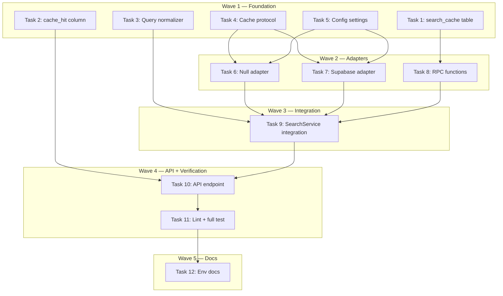

# Semantic Search Cache Implementation Plan

> **For Claude:** REQUIRED SUB-SKILL: Use executing-plans to implement this plan task-by-task.

**Design Doc:** [docs/designs/2026-03-26-semantic-search-cache-design.md](docs/designs/2026-03-26-semantic-search-cache-design.md)

**Spec References:** [SPEC.md#2-system-modules](SPEC.md#2-system-modules) (semantic search), [SPEC.md#4-hard-dependencies](SPEC.md#4-hard-dependencies) (OpenAI embeddings)

**PRD References:** —

**Goal:** Reduce OpenAI embedding API cost and search latency by introducing a two-tier semantic cache (exact text match + pgvector cosine similarity) backed by a Supabase table.

**Architecture:** A single `search_cache` pgvector table stores query text, embedding vector, and serialized results. Tier 1 does an exact hash lookup; Tier 2 does ANN cosine similarity at threshold 0.85. On full miss, results are computed and cached. TTL-based expiry at 4 hours with hourly `pg_cron` cleanup.

**Tech Stack:** Supabase (Postgres + pgvector), Python (Pydantic, hashlib), FastAPI Depends

**Acceptance Criteria:**

- [ ] A user searching for "good wifi coffee" gets cached results on a second identical search without hitting OpenAI or pgvector
- [ ] A user searching "nice wifi café" (semantically similar, cosine ≥ 0.85) also gets cached results without running full search pipeline
- [ ] Cache entries expire after 4 hours and are cleaned up hourly
- [ ] Search event logging includes `cache_hit` boolean for observability
- [ ] TTL and similarity threshold are configurable via environment variables without code changes

---

### Task 1: Database Migration — `search_cache` Table

**Files:**

- Create: `supabase/migrations/20260327000001_create_search_cache.sql`

No test needed — this is a SQL migration with no application logic.

**Step 1: Write the migration**

```sql
-- Two-tier semantic search cache: exact hash (Tier 1) + pgvector cosine similarity (Tier 2)
CREATE TABLE search_cache (
  id              UUID PRIMARY KEY DEFAULT gen_random_uuid(),
  query_hash      TEXT NOT NULL,
  query_text      TEXT NOT NULL,
  mode_filter     TEXT,
  query_embedding vector(1536),
  results         JSONB NOT NULL,
  hit_count       INT NOT NULL DEFAULT 0,
  created_at      TIMESTAMPTZ NOT NULL DEFAULT now(),
  expires_at      TIMESTAMPTZ NOT NULL
);

COMMENT ON TABLE search_cache IS 'Two-tier semantic search cache. Tier 1: exact hash. Tier 2: pgvector cosine similarity.';

-- Tier 1: exact hash lookup
CREATE UNIQUE INDEX idx_search_cache_hash ON search_cache(query_hash);

-- Tier 2: ANN semantic similarity
CREATE INDEX idx_search_cache_embedding ON search_cache
  USING hnsw (query_embedding vector_cosine_ops);

-- TTL cleanup index
CREATE INDEX idx_search_cache_expires ON search_cache(expires_at);

-- No RLS — this is an internal system table, not user-facing.
-- Only accessed by the service role client from the Python backend.
```

**Step 2: Verify the migration file is syntactically valid**

Run: `cd /Users/ytchou/Project/caferoam && supabase db diff`
Expected: Shows pending migration, no syntax errors.

**Step 3: Commit**

```bash
git add supabase/migrations/20260327000001_create_search_cache.sql
git commit -m "feat(DEV-36): add search_cache table with pgvector HNSW index"
```

---

### Task 2: Database Migration — Add `cache_hit` to `search_events`

**Files:**

- Create: `supabase/migrations/20260327000002_add_cache_hit_to_search_events.sql`

No test needed — SQL migration only.

**Step 1: Write the migration**

```sql
ALTER TABLE search_events
  ADD COLUMN cache_hit BOOLEAN NOT NULL DEFAULT false;

COMMENT ON COLUMN search_events.cache_hit IS 'Whether this search was served from the semantic cache.';
```

**Step 2: Commit**

```bash
git add supabase/migrations/20260327000002_add_cache_hit_to_search_events.sql
git commit -m "feat(DEV-36): add cache_hit column to search_events"
```

---

### Task 3: Query Normalization Utility

**Files:**

- Create: `backend/services/query_normalizer.py`
- Test: `backend/tests/services/test_query_normalizer.py`

**Step 1: Write the failing tests**

```python
import pytest

from services.query_normalizer import hash_cache_key, normalize_query


class TestNormalizeQuery:
    def test_lowercases_text(self):
        assert normalize_query("Good WiFi COFFEE") == "good wifi coffee"

    def test_strips_whitespace(self):
        assert normalize_query("  good coffee  ") == "good coffee"

    def test_collapses_internal_whitespace(self):
        assert normalize_query("good   wifi   coffee") == "good wifi coffee"

    def test_removes_trailing_punctuation(self):
        assert normalize_query("好喝咖啡?") == "好喝咖啡"
        assert normalize_query("nice coffee!") == "nice coffee"
        assert normalize_query("café nearby.") == "café nearby"

    def test_handles_chinese_text(self):
        assert normalize_query("  大安區  好咖啡  ") == "大安區 好咖啡"

    def test_empty_after_strip_returns_empty(self):
        assert normalize_query("   ") == ""

    def test_mixed_punctuation_only_removes_trailing(self):
        assert normalize_query("what's good?") == "what's good"


class TestHashCacheKey:
    def test_deterministic_for_same_input(self):
        h1 = hash_cache_key("good coffee", "work")
        h2 = hash_cache_key("good coffee", "work")
        assert h1 == h2

    def test_different_for_different_mode(self):
        h1 = hash_cache_key("good coffee", "work")
        h2 = hash_cache_key("good coffee", "rest")
        assert h1 != h2

    def test_different_for_different_text(self):
        h1 = hash_cache_key("good coffee", None)
        h2 = hash_cache_key("nice coffee", None)
        assert h1 != h2

    def test_none_mode_is_consistent(self):
        h1 = hash_cache_key("test", None)
        h2 = hash_cache_key("test", None)
        assert h1 == h2

    def test_returns_hex_string(self):
        h = hash_cache_key("test", None)
        assert isinstance(h, str)
        assert len(h) == 64  # SHA-256 hex digest
```

**Step 2: Run tests to verify they fail**

Run: `cd backend && python -m pytest tests/services/test_query_normalizer.py -v`
Expected: FAIL — `ModuleNotFoundError: No module named 'services.query_normalizer'`

**Step 3: Write minimal implementation**

```python
"""Query normalization and cache key hashing for semantic search cache."""

import hashlib
import re

_TRAILING_PUNCT = re.compile(r"[?!.]+$")
_MULTI_SPACE = re.compile(r"\s+")


def normalize_query(text: str) -> str:
    text = text.lower().strip()
    text = _MULTI_SPACE.sub(" ", text)
    text = _TRAILING_PUNCT.sub("", text)
    return text


def hash_cache_key(normalized_text: str, mode: str | None) -> str:
    raw = f"{normalized_text}|{mode or ''}"
    return hashlib.sha256(raw.encode("utf-8")).hexdigest()
```

**Step 4: Run tests to verify they pass**

Run: `cd backend && python -m pytest tests/services/test_query_normalizer.py -v`
Expected: All PASS

**Step 5: Commit**

```bash
git add backend/services/query_normalizer.py backend/tests/services/test_query_normalizer.py
git commit -m "feat(DEV-36): add query normalization and cache key hashing"
```

---

### Task 4: Cache Provider Interface (Protocol)

**Files:**

- Create: `backend/providers/cache/__init__.py`
- Create: `backend/providers/cache/interface.py`

No test needed — this is a Protocol definition with no logic.

**Step 1: Write the interface**

`backend/providers/cache/interface.py`:

```python
from typing import Any, Protocol


class CacheEntry:
    """Represents a cached search result row."""

    id: str
    query_hash: str
    query_text: str
    mode_filter: str | None
    query_embedding: list[float]
    results: list[dict[str, Any]]
    hit_count: int
    expires_at: str
    is_expired: bool


class SearchCacheProvider(Protocol):
    async def get_by_hash(self, query_hash: str) -> CacheEntry | None:
        """Tier 1: exact hash lookup."""
        ...

    async def find_similar(
        self,
        embedding: list[float],
        mode: str | None,
        threshold: float,
    ) -> CacheEntry | None:
        """Tier 2: semantic similarity lookup via cosine distance."""
        ...

    async def store(
        self,
        query_hash: str,
        query_text: str,
        mode: str | None,
        embedding: list[float],
        results: list[dict[str, Any]],
    ) -> None:
        """Store a new cache entry."""
        ...

    async def increment_hit(self, entry_id: str) -> None:
        """Increment hit_count for observability."""
        ...
```

`backend/providers/cache/__init__.py`:

```python
from core.config import settings
from providers.cache.interface import SearchCacheProvider


def get_search_cache_provider(db_client: object) -> SearchCacheProvider:
    match settings.search_cache_provider:
        case "supabase":
            from providers.cache.supabase_adapter import SupabaseSearchCacheAdapter

            return SupabaseSearchCacheAdapter(
                db=db_client,
                ttl_seconds=settings.search_cache_ttl_seconds,
            )
        case "none":
            from providers.cache.null_adapter import NullSearchCacheAdapter

            return NullSearchCacheAdapter()
        case _:
            raise ValueError(
                f"Unknown search cache provider: {settings.search_cache_provider}"
            )
```

**Step 2: Commit**

```bash
git add backend/providers/cache/__init__.py backend/providers/cache/interface.py
git commit -m "feat(DEV-36): add SearchCacheProvider protocol and factory"
```

---

### Task 5: Configuration — Add Cache Settings

**Files:**

- Modify: `backend/core/config.py`

No test needed — configuration-only change with defaults.

**Step 1: Add cache settings to `Settings` class**

Add these fields after the `worker_concurrency_default` line (line 60) in `backend/core/config.py`:

```python
    # Search cache
    search_cache_provider: str = "supabase"
    search_cache_ttl_seconds: int = 14400  # 4 hours
    search_cache_similarity_threshold: float = 0.85
```

**Step 2: Commit**

```bash
git add backend/core/config.py
git commit -m "feat(DEV-36): add search cache config (TTL, threshold, provider)"
```

---

### Task 6: Null Cache Adapter (for testing / opt-out)

**Files:**

- Create: `backend/providers/cache/null_adapter.py`
- Test: `backend/tests/providers/test_cache_factory.py`

**Step 1: Write the failing test**

```python
from unittest.mock import MagicMock, patch

from providers.cache import get_search_cache_provider
from providers.cache.null_adapter import NullSearchCacheAdapter


class TestSearchCacheFactory:
    def test_factory_returns_supabase_adapter(self):
        with patch("providers.cache.settings") as mock_settings:
            mock_settings.search_cache_provider = "supabase"
            mock_settings.search_cache_ttl_seconds = 14400
            mock_db = MagicMock()
            provider = get_search_cache_provider(mock_db)
            assert provider is not None

    def test_factory_returns_null_adapter_when_disabled(self):
        with patch("providers.cache.settings") as mock_settings:
            mock_settings.search_cache_provider = "none"
            provider = get_search_cache_provider(MagicMock())
            assert isinstance(provider, NullSearchCacheAdapter)

    def test_factory_raises_for_unknown_provider(self):
        with patch("providers.cache.settings") as mock_settings:
            mock_settings.search_cache_provider = "redis"
            import pytest

            with pytest.raises(ValueError, match="Unknown search cache provider"):
                get_search_cache_provider(MagicMock())
```

**Step 2: Run tests to verify they fail**

Run: `cd backend && python -m pytest tests/providers/test_cache_factory.py -v`
Expected: FAIL — `ModuleNotFoundError: No module named 'providers.cache.null_adapter'`

**Step 3: Write the null adapter**

`backend/providers/cache/null_adapter.py`:

```python
"""Null adapter — cache is disabled. Always returns None (miss)."""

from typing import Any


class NullSearchCacheAdapter:
    async def get_by_hash(self, query_hash: str) -> None:
        return None

    async def find_similar(
        self,
        embedding: list[float],
        mode: str | None,
        threshold: float,
    ) -> None:
        return None

    async def store(
        self,
        query_hash: str,
        query_text: str,
        mode: str | None,
        embedding: list[float],
        results: list[dict[str, Any]],
    ) -> None:
        pass

    async def increment_hit(self, entry_id: str) -> None:
        pass
```

**Step 4: Run tests to verify they pass**

Run: `cd backend && python -m pytest tests/providers/test_cache_factory.py -v`
Expected: All PASS

**Step 5: Commit**

```bash
git add backend/providers/cache/null_adapter.py backend/tests/providers/test_cache_factory.py
git commit -m "feat(DEV-36): add NullSearchCacheAdapter and factory tests"
```

---

### Task 7: Supabase Cache Adapter

**Files:**

- Create: `backend/providers/cache/supabase_adapter.py`
- Test: `backend/tests/providers/test_supabase_cache_adapter.py`

This is the core cache implementation. The adapter talks to Supabase via the Python client.

**Step 1: Write the failing tests**

```python
from datetime import datetime, timezone
from unittest.mock import MagicMock

import pytest

from providers.cache.supabase_adapter import SupabaseSearchCacheAdapter


@pytest.fixture
def mock_db():
    return MagicMock()


@pytest.fixture
def adapter(mock_db):
    return SupabaseSearchCacheAdapter(db=mock_db, ttl_seconds=14400)


class TestGetByHash:
    async def test_returns_none_on_cache_miss(self, adapter, mock_db):
        """When no entry matches the hash, the user gets a fresh search."""
        mock_db.table.return_value.select.return_value.eq.return_value.gt.return_value.limit.return_value.execute.return_value = MagicMock(
            data=[]
        )
        result = await adapter.get_by_hash("abc123hash")
        assert result is None

    async def test_returns_entry_on_cache_hit(self, adapter, mock_db):
        """When an identical query was cached, the user gets instant results."""
        future_ts = "2099-01-01T00:00:00+00:00"
        mock_db.table.return_value.select.return_value.eq.return_value.gt.return_value.limit.return_value.execute.return_value = MagicMock(
            data=[
                {
                    "id": "entry-1",
                    "query_hash": "abc123hash",
                    "query_text": "good coffee",
                    "mode_filter": None,
                    "query_embedding": [0.1] * 10,
                    "results": [{"shop": {"name": "TestShop"}}],
                    "hit_count": 3,
                    "expires_at": future_ts,
                }
            ]
        )
        result = await adapter.get_by_hash("abc123hash")
        assert result is not None
        assert result.query_hash == "abc123hash"
        assert result.hit_count == 3
        assert result.is_expired is False


class TestFindSimilar:
    async def test_returns_none_when_no_similar_entry(self, adapter, mock_db):
        """When no semantically similar query exists, the user gets a fresh search."""
        mock_db.rpc.return_value.execute.return_value = MagicMock(data=[])
        result = await adapter.find_similar([0.1] * 1536, None, threshold=0.85)
        assert result is None

    async def test_returns_entry_when_similar_above_threshold(self, adapter, mock_db):
        """When a similar query exists (cosine ≥ 0.85), the user gets cached results."""
        future_ts = "2099-01-01T00:00:00+00:00"
        mock_db.rpc.return_value.execute.return_value = MagicMock(
            data=[
                {
                    "id": "entry-2",
                    "query_hash": "def456hash",
                    "query_text": "nice coffee",
                    "mode_filter": None,
                    "query_embedding": [0.1] * 10,
                    "results": [{"shop": {"name": "SimilarShop"}}],
                    "hit_count": 1,
                    "expires_at": future_ts,
                    "similarity": 0.92,
                }
            ]
        )
        result = await adapter.find_similar([0.1] * 1536, None, threshold=0.85)
        assert result is not None
        assert result.query_text == "nice coffee"

    async def test_filters_by_mode(self, adapter, mock_db):
        """Cache entries are isolated by mode — work results don't leak into rest searches."""
        mock_db.rpc.return_value.execute.return_value = MagicMock(data=[])
        await adapter.find_similar([0.1] * 1536, "work", threshold=0.85)
        call_args = mock_db.rpc.call_args
        params = call_args[0][1]
        assert params["filter_mode"] == "work"


class TestStore:
    async def test_stores_entry_with_correct_ttl(self, adapter, mock_db):
        """When a search result is cached, it expires after the configured TTL."""
        mock_db.table.return_value.upsert.return_value.execute = MagicMock()
        await adapter.store(
            query_hash="abc123",
            query_text="good coffee",
            mode=None,
            embedding=[0.1] * 1536,
            results=[{"shop": {"name": "TestShop"}}],
        )
        upsert_call = mock_db.table.return_value.upsert.call_args
        row = upsert_call[0][0]
        assert row["query_hash"] == "abc123"
        assert row["query_text"] == "good coffee"
        assert "expires_at" in row


class TestIncrementHit:
    async def test_increments_hit_count(self, adapter, mock_db):
        """Cache hit count is tracked for observability."""
        mock_db.rpc.return_value.execute = MagicMock()
        await adapter.increment_hit("entry-1")
        mock_db.rpc.assert_called()
```

**Step 2: Run tests to verify they fail**

Run: `cd backend && python -m pytest tests/providers/test_supabase_cache_adapter.py -v`
Expected: FAIL — `ModuleNotFoundError`

**Step 3: Write the Supabase cache adapter**

`backend/providers/cache/supabase_adapter.py`:

```python
"""Supabase/pgvector-backed semantic search cache adapter."""

from __future__ import annotations

from dataclasses import dataclass
from datetime import datetime, timedelta, timezone
from typing import Any, cast

from supabase import Client


@dataclass
class CacheEntry:
    id: str
    query_hash: str
    query_text: str
    mode_filter: str | None
    query_embedding: list[float]
    results: list[dict[str, Any]]
    hit_count: int
    expires_at: str
    is_expired: bool


def _parse_entry(row: dict[str, Any]) -> CacheEntry:
    expires_str = row["expires_at"]
    try:
        expires_dt = datetime.fromisoformat(expires_str)
        is_expired = expires_dt < datetime.now(timezone.utc)
    except (ValueError, TypeError):
        is_expired = False
    return CacheEntry(
        id=row["id"],
        query_hash=row["query_hash"],
        query_text=row["query_text"],
        mode_filter=row.get("mode_filter"),
        query_embedding=row.get("query_embedding", []),
        results=row.get("results", []),
        hit_count=row.get("hit_count", 0),
        expires_at=expires_str,
        is_expired=is_expired,
    )


class SupabaseSearchCacheAdapter:
    def __init__(self, db: Any, ttl_seconds: int = 14400):
        self._db: Client = db
        self._ttl_seconds = ttl_seconds

    async def get_by_hash(self, query_hash: str) -> CacheEntry | None:
        now_iso = datetime.now(timezone.utc).isoformat()
        response = (
            self._db.table("search_cache")
            .select("*")
            .eq("query_hash", query_hash)
            .gt("expires_at", now_iso)
            .limit(1)
            .execute()
        )
        rows = cast("list[dict[str, Any]]", response.data)
        if not rows:
            return None
        return _parse_entry(rows[0])

    async def find_similar(
        self,
        embedding: list[float],
        mode: str | None,
        threshold: float,
    ) -> CacheEntry | None:
        response = self._db.rpc(
            "search_cache_similar",
            {
                "query_embedding": embedding,
                "similarity_threshold": threshold,
                "filter_mode": mode,
            },
        ).execute()
        rows = cast("list[dict[str, Any]]", response.data)
        if not rows:
            return None
        return _parse_entry(rows[0])

    async def store(
        self,
        query_hash: str,
        query_text: str,
        mode: str | None,
        embedding: list[float],
        results: list[dict[str, Any]],
    ) -> None:
        expires_at = datetime.now(timezone.utc) + timedelta(seconds=self._ttl_seconds)
        self._db.table("search_cache").upsert(
            {
                "query_hash": query_hash,
                "query_text": query_text,
                "mode_filter": mode,
                "query_embedding": embedding,
                "results": results,
                "hit_count": 0,
                "expires_at": expires_at.isoformat(),
            },
            on_conflict="query_hash",
        ).execute()

    async def increment_hit(self, entry_id: str) -> None:
        self._db.rpc(
            "increment_search_cache_hit",
            {"entry_id": entry_id},
        ).execute()
```

**Step 4: Run tests to verify they pass**

Run: `cd backend && python -m pytest tests/providers/test_supabase_cache_adapter.py -v`
Expected: All PASS

**Step 5: Commit**

```bash
git add backend/providers/cache/supabase_adapter.py backend/tests/providers/test_supabase_cache_adapter.py
git commit -m "feat(DEV-36): add SupabaseSearchCacheAdapter with pgvector similarity"
```

---

### Task 8: Database RPC Functions for Cache

**Files:**

- Create: `supabase/migrations/20260327000003_create_search_cache_rpcs.sql`

No test needed — SQL-only. These RPCs are called by the Supabase adapter.

**Step 1: Write the migration with both RPC functions**

```sql
-- Tier 2: find similar cached queries using pgvector cosine distance
CREATE OR REPLACE FUNCTION search_cache_similar(
  query_embedding vector(1536),
  similarity_threshold float DEFAULT 0.85,
  filter_mode text DEFAULT NULL
)
RETURNS TABLE (
  id UUID,
  query_hash TEXT,
  query_text TEXT,
  mode_filter TEXT,
  query_embedding vector(1536),
  results JSONB,
  hit_count INT,
  expires_at TIMESTAMPTZ,
  similarity float
)
LANGUAGE plpgsql
SECURITY DEFINER
SET search_path = public
AS $$
BEGIN
  RETURN QUERY
  SELECT
    sc.id,
    sc.query_hash,
    sc.query_text,
    sc.mode_filter,
    sc.query_embedding,
    sc.results,
    sc.hit_count,
    sc.expires_at,
    (1 - (sc.query_embedding <=> search_cache_similar.query_embedding)) AS similarity
  FROM search_cache sc
  WHERE sc.expires_at > now()
    AND (filter_mode IS NULL OR sc.mode_filter IS NOT DISTINCT FROM filter_mode)
    AND (1 - (sc.query_embedding <=> search_cache_similar.query_embedding)) >= similarity_threshold
  ORDER BY sc.query_embedding <=> search_cache_similar.query_embedding
  LIMIT 1;
END;
$$;

-- Atomic hit count increment
CREATE OR REPLACE FUNCTION increment_search_cache_hit(entry_id UUID)
RETURNS void
LANGUAGE sql
SECURITY DEFINER
SET search_path = public
AS $$
  UPDATE search_cache SET hit_count = hit_count + 1 WHERE id = entry_id;
$$;

-- Hourly cleanup of expired cache entries (pg_cron)
-- Note: pg_cron must be enabled via Supabase dashboard for production.
-- For local dev, expired rows are filtered out at query time (expires_at > now()).
```

**Step 2: Commit**

```bash
git add supabase/migrations/20260327000003_create_search_cache_rpcs.sql
git commit -m "feat(DEV-36): add search_cache_similar and increment_hit RPC functions"
```

---

### Task 9: Integrate Cache into SearchService

**Files:**

- Modify: `backend/services/search_service.py`
- Test: `backend/tests/services/test_search_service.py` (add new tests)

This is the core integration. The `search()` method gains Tier 1 and Tier 2 cache lookups.

**Step 1: Write the failing tests**

Add these tests to `backend/tests/services/test_search_service.py`:

```python
from unittest.mock import AsyncMock, MagicMock, patch

import pytest

import services.search_service as _ss_module
from models.types import SearchQuery
from services.search_service import SearchService
from tests.factories import make_shop_row


class TestSearchCacheIntegration:
    """Cache integration with the search pipeline."""

    @pytest.fixture
    def mock_cache(self):
        cache = AsyncMock()
        cache.get_by_hash = AsyncMock(return_value=None)
        cache.find_similar = AsyncMock(return_value=None)
        cache.store = AsyncMock()
        cache.increment_hit = AsyncMock()
        return cache

    @pytest.fixture
    def mock_embeddings(self):
        emb = AsyncMock()
        emb.embed = AsyncMock(return_value=[0.1] * 1536)
        emb.dimensions = 1536
        return emb

    async def test_tier1_exact_hit_skips_embedding_and_search(
        self, mock_supabase, mock_embeddings, mock_cache
    ):
        """When a user repeats the exact same search, no OpenAI call or DB query happens."""
        cached_entry = MagicMock()
        cached_entry.is_expired = False
        cached_entry.id = "entry-1"
        cached_entry.results = [{"shop": {"name": "CachedShop"}, "similarityScore": 0.9, "taxonomyBoost": 0.0, "totalScore": 0.63}]
        mock_cache.get_by_hash = AsyncMock(return_value=cached_entry)

        service = SearchService(db=mock_supabase, embeddings=mock_embeddings, cache=mock_cache)
        query = SearchQuery(text="good wifi coffee")
        results = await service.search(query)

        mock_embeddings.embed.assert_not_called()
        mock_supabase.rpc.assert_not_called()
        mock_cache.increment_hit.assert_called_once_with("entry-1")
        assert results == cached_entry.results

    async def test_tier2_semantic_hit_skips_full_search(
        self, mock_supabase, mock_embeddings, mock_cache
    ):
        """When a semantically similar query was cached, pgvector search is skipped."""
        mock_cache.get_by_hash = AsyncMock(return_value=None)  # Tier 1 miss
        similar_entry = MagicMock()
        similar_entry.is_expired = False
        similar_entry.id = "entry-2"
        similar_entry.results = [{"shop": {"name": "SimilarShop"}, "similarityScore": 0.88, "taxonomyBoost": 0.0, "totalScore": 0.62}]
        mock_cache.find_similar = AsyncMock(return_value=similar_entry)

        service = SearchService(db=mock_supabase, embeddings=mock_embeddings, cache=mock_cache)
        query = SearchQuery(text="nice wifi café")
        results = await service.search(query)

        mock_embeddings.embed.assert_called_once()  # needed for Tier 2
        mock_supabase.rpc.assert_not_called()  # full search skipped
        mock_cache.increment_hit.assert_called_once_with("entry-2")
        assert results == similar_entry.results

    async def test_full_miss_runs_pipeline_and_caches_result(
        self, mock_supabase, mock_embeddings, mock_cache
    ):
        """When no cache entry matches, the full search runs and the result is cached."""
        shop_data = make_shop_row()
        mock_supabase.rpc = MagicMock(
            return_value=MagicMock(execute=MagicMock(return_value=MagicMock(data=[shop_data])))
        )

        service = SearchService(db=mock_supabase, embeddings=mock_embeddings, cache=mock_cache)
        query = SearchQuery(text="unique rare query")
        results = await service.search(query)

        assert len(results) == 1
        mock_cache.store.assert_called_once()

    async def test_cache_is_optional_none_skips_all_cache_logic(
        self, mock_supabase, mock_embeddings
    ):
        """When no cache provider is supplied, search works exactly as before."""
        mock_supabase.rpc = MagicMock(
            return_value=MagicMock(execute=MagicMock(return_value=MagicMock(data=[])))
        )
        service = SearchService(db=mock_supabase, embeddings=mock_embeddings, cache=None)
        query = SearchQuery(text="test query")
        results = await service.search(query)
        assert results == []
```

**Step 2: Run tests to verify they fail**

Run: `cd backend && python -m pytest tests/services/test_search_service.py::TestSearchCacheIntegration -v`
Expected: FAIL — `SearchService` doesn't accept `cache` parameter yet.

**Step 3: Modify `SearchService` to integrate cache**

Update `backend/services/search_service.py`:

1. Add import at top:

```python
from providers.cache.interface import SearchCacheProvider
from services.query_normalizer import hash_cache_key, normalize_query
from core.config import settings
```

2. Update `__init__` to accept optional cache:

```python
def __init__(
    self,
    db: Client,
    embeddings: EmbeddingsProvider,
    cache: SearchCacheProvider | None = None,
):
    self._db = db
    self._embeddings = embeddings
    self._cache = cache
```

3. Replace `search()` method body with cache-aware flow:

```python
async def search(
    self,
    query: SearchQuery,
    mode: str | None = None,
    mode_threshold: float = 0.4,
) -> list:
    normalized = normalize_query(query.text)
    cache_key = hash_cache_key(normalized, mode)

    # Tier 1: exact text match
    if self._cache is not None:
        cached = await self._cache.get_by_hash(cache_key)
        if cached and not cached.is_expired:
            await self._cache.increment_hit(cached.id)
            return cached.results

    # Generate embedding (needed for Tier 2 + full search)
    query_embedding = await self._embeddings.embed(normalized)

    # Tier 2: semantic similarity
    if self._cache is not None:
        threshold = settings.search_cache_similarity_threshold
        similar = await self._cache.find_similar(query_embedding, mode, threshold)
        if similar and not similar.is_expired:
            await self._cache.increment_hit(similar.id)
            return similar.results

    # Full search pipeline (existing logic)
    results = await self._full_search(query_embedding, query, mode, mode_threshold)

    # Cache the result
    if self._cache is not None:
        serialized = [r.model_dump(by_alias=True) for r in results]
        await self._cache.store(cache_key, normalized, mode, query_embedding, serialized)

    return results
```

4. Extract existing search logic into `_full_search()`:

```python
async def _full_search(
    self,
    query_embedding: list[float],
    query: SearchQuery,
    mode: str | None,
    mode_threshold: float,
) -> list[SearchResult]:
    """Run the full pgvector search + taxonomy boost pipeline."""
    limit = query.limit or 20
    rpc_params: dict[str, Any] = {
        "query_embedding": query_embedding,
        "match_count": limit,
    }
    if mode and mode in ("work", "rest", "social"):
        rpc_params["filter_mode_field"] = f"mode_{mode}"
        rpc_params["filter_mode_threshold"] = mode_threshold

    if query.filters and query.filters.near_latitude and query.filters.near_longitude:
        rpc_params["filter_lat"] = query.filters.near_latitude
        rpc_params["filter_lng"] = query.filters.near_longitude
        rpc_params["filter_radius_km"] = query.filters.radius_km or 5.0

    response = self._db.rpc("search_shops", rpc_params).execute()
    rows = cast("list[dict[str, Any]]", response.data)

    if query.filters and query.filters.dimensions:
        await self._load_idf_cache()

    results: list[SearchResult] = []
    for row in rows:
        similarity = row.get("similarity", 0.0)
        taxonomy_boost = self._compute_taxonomy_boost(row, query)
        eligible_keys = Shop.model_fields.keys() - _SHOP_FIELDS_HANDLED_SEPARATELY
        shop = Shop(
            taxonomy_tags=[],
            photo_urls=row.get("photo_urls", []),
            **{k: v for k, v in row.items() if k in eligible_keys},
        )
        total = similarity * 0.7 + taxonomy_boost * 0.3
        results.append(
            SearchResult(
                shop=shop,
                similarity_score=similarity,
                taxonomy_boost=taxonomy_boost,
                total_score=total,
            )
        )
    results.sort(key=lambda r: r.total_score, reverse=True)
    return results
```

**Important:** The `embed()` call now uses `normalized` (the normalized query text) instead of `query.text`. This ensures the embedding is deterministic for cache key matching.

**Step 4: Run ALL search service tests**

Run: `cd backend && python -m pytest tests/services/test_search_service.py -v`
Expected: All PASS (both old and new tests)

**Step 5: Commit**

```bash
git add backend/services/search_service.py backend/tests/services/test_search_service.py
git commit -m "feat(DEV-36): integrate two-tier cache into SearchService"
```

---

### Task 10: Wire Cache into Search API Endpoint

**Files:**

- Modify: `backend/api/search.py`
- Test: `backend/tests/api/test_search.py` (add new tests)

**Step 1: Write the failing tests**

Add to `backend/tests/api/test_search.py`:

```python
class TestSearchCacheAPI:
    def test_search_logs_cache_hit_status(self):
        """When a search is served from cache, the search_event includes cache_hit=True."""
        mock_db = MagicMock()
        mock_db.rpc = MagicMock(
            return_value=MagicMock(execute=MagicMock(return_value=MagicMock(data=[])))
        )
        mock_admin = _mock_admin_db()

        app.dependency_overrides[get_current_user] = lambda: {"id": "usr_e5f6a1b2c3d4"}
        app.dependency_overrides[get_user_db] = lambda: mock_db
        app.dependency_overrides[get_admin_db] = lambda: mock_admin
        try:
            with (
                patch("api.search.get_embeddings_provider") as mock_emb_factory,
                patch("api.search.get_search_cache_provider") as mock_cache_factory,
            ):
                mock_emb = AsyncMock()
                mock_emb.embed = AsyncMock(return_value=[0.1] * 1536)
                mock_emb_factory.return_value = mock_emb
                mock_cache = AsyncMock()
                mock_cache.get_by_hash = AsyncMock(return_value=None)
                mock_cache.find_similar = AsyncMock(return_value=None)
                mock_cache.store = AsyncMock()
                mock_cache_factory.return_value = mock_cache

                response = client.get(
                    "/search?text=test+cache",
                    headers={"Authorization": "Bearer valid-jwt"},
                )
                assert response.status_code == 200
                body = response.json()
                assert "cache_hit" in body
                assert body["cache_hit"] is False
        finally:
            app.dependency_overrides.clear()

    def test_search_response_indicates_cache_hit(self):
        """When cache returns results, the response includes cache_hit=True."""
        mock_db = MagicMock()
        mock_admin = _mock_admin_db()

        app.dependency_overrides[get_current_user] = lambda: {"id": "usr_f6a1b2c3d4e5"}
        app.dependency_overrides[get_user_db] = lambda: mock_db
        app.dependency_overrides[get_admin_db] = lambda: mock_admin
        try:
            with (
                patch("api.search.get_embeddings_provider") as mock_emb_factory,
                patch("api.search.get_search_cache_provider") as mock_cache_factory,
            ):
                mock_emb = AsyncMock()
                mock_emb.embed = AsyncMock(return_value=[0.1] * 1536)
                mock_emb_factory.return_value = mock_emb

                cached_entry = MagicMock()
                cached_entry.is_expired = False
                cached_entry.id = "cached-1"
                cached_entry.results = [{"shop": {"name": "CachedShop"}, "similarityScore": 0.9, "taxonomyBoost": 0.0, "totalScore": 0.63}]
                mock_cache = AsyncMock()
                mock_cache.get_by_hash = AsyncMock(return_value=cached_entry)
                mock_cache.increment_hit = AsyncMock()
                mock_cache_factory.return_value = mock_cache

                response = client.get(
                    "/search?text=cached+query",
                    headers={"Authorization": "Bearer valid-jwt"},
                )
                assert response.status_code == 200
                body = response.json()
                assert body["cache_hit"] is True
        finally:
            app.dependency_overrides.clear()
```

**Step 2: Run tests to verify they fail**

Run: `cd backend && python -m pytest tests/api/test_search.py::TestSearchCacheAPI -v`
Expected: FAIL — `get_search_cache_provider` not found

**Step 3: Update the search endpoint**

Modify `backend/api/search.py`:

1. Add import:

```python
from providers.cache import get_search_cache_provider
```

2. Update the `search()` function to wire cache and track cache_hit:

```python
@router.get("/search")
async def search(
    background_tasks: BackgroundTasks,
    text: str = Query(..., min_length=1),
    mode: str | None = Query(None, pattern="^(work|rest|social)$"),
    limit: int = Query(20, ge=1, le=50),
    user: dict[str, Any] = Depends(get_current_user),
    db: Client = Depends(get_user_db),
    admin_db: Client = Depends(get_admin_db),
) -> dict[str, Any]:
    """Semantic search with optional mode filter. Auth required."""
    embeddings = get_embeddings_provider()
    cache = get_search_cache_provider(admin_db)
    service = SearchService(db=db, embeddings=embeddings, cache=cache)
    query = SearchQuery(text=text, limit=limit)
    results = await service.search(query, mode=mode)

    # Determine if result came from cache (results is a list of dicts, not SearchResult)
    cache_hit = isinstance(results, list) and len(results) > 0 and isinstance(results[0], dict)

    # Fire-and-forget observability
    query_type = classify(text)
    user_id_anon = anonymize_user_id(user["id"], salt=settings.anon_salt)
    result_count = len(results)

    background_tasks.add_task(
        _log_search_event, admin_db, user_id_anon, text, query_type, mode, result_count, cache_hit
    )

    if cache_hit:
        return {
            "results": results,
            "query_type": query_type,
            "result_count": result_count,
            "cache_hit": True,
        }

    return {
        "results": [r.model_dump(by_alias=True) for r in results],
        "query_type": query_type,
        "result_count": result_count,
        "cache_hit": False,
    }
```

3. Update `_log_search_event` to accept and insert `cache_hit`:

```python
def _log_search_event(
    admin_db: Client,
    user_id_anon: str,
    query_text: str,
    query_type: str,
    mode_filter: str | None,
    result_count: int,
    cache_hit: bool = False,
) -> None:
    try:
        admin_db.table("search_events").insert(
            {
                "user_id_anon": user_id_anon,
                "query_text": query_text,
                "query_type": query_type,
                "mode_filter": mode_filter,
                "result_count": result_count,
                "cache_hit": cache_hit,
            }
        ).execute()
    except Exception:
        logger.warning("search_event insert failed", query_type=query_type, exc_info=True)
```

**Step 4: Run ALL API tests**

Run: `cd backend && python -m pytest tests/api/test_search.py -v`
Expected: All PASS

**Step 5: Commit**

```bash
git add backend/api/search.py backend/tests/api/test_search.py
git commit -m "feat(DEV-36): wire cache into search endpoint with cache_hit tracking"
```

---

### Task 11: Lint, Type-Check, and Full Test Suite

**Files:** None — verification only.

**Step 1: Run linter**

Run: `cd backend && ruff check .`
Expected: No errors (fix any issues)

**Step 2: Run formatter**

Run: `cd backend && ruff format --check .`
Expected: No changes needed

**Step 3: Run full backend test suite**

Run: `cd backend && python -m pytest -v`
Expected: All tests pass

**Step 4: Run type checker (best-effort)**

Run: `cd backend && mypy services/query_normalizer.py providers/cache/`
Expected: No errors

**Step 5: Commit any fixes**

```bash
git add -A
git commit -m "chore(DEV-36): lint and formatting fixes"
```

---

### Task 12: Update `.env.example` and Doctor Script

**Files:**

- Modify: `backend/.env.example` (if it exists) or `backend/.env` template
- Modify: `scripts/doctor.sh` (add cache config check)

No test needed — configuration documentation only.

**Step 1: Add cache env vars to `.env.example`**

```
# Search cache
SEARCH_CACHE_PROVIDER=supabase
SEARCH_CACHE_TTL_SECONDS=14400
SEARCH_CACHE_SIMILARITY_THRESHOLD=0.85
```

**Step 2: Commit**

```bash
git add backend/.env.example scripts/doctor.sh
git commit -m "chore(DEV-36): document cache env vars in .env.example"
```

---

## Execution Waves



**Wave 1** (parallel — no dependencies):

- Task 1: `search_cache` table migration
- Task 2: `cache_hit` column migration
- Task 3: Query normalizer with TDD
- Task 4: Cache provider interface
- Task 5: Config settings

**Wave 2** (parallel — depends on Wave 1):

- Task 6: Null adapter + factory tests ← Task 4, 5
- Task 7: Supabase adapter ← Task 4, 5
- Task 8: RPC functions ← Task 1

**Wave 3** (sequential — depends on Wave 2):

- Task 9: SearchService integration ← Task 3, 6, 7, 8

**Wave 4** (sequential — depends on Wave 3):

- Task 10: API endpoint wiring ← Task 2, 9
- Task 11: Full lint + test verification ← Task 10

**Wave 5** (sequential — depends on Wave 4):

- Task 12: Env documentation ← Task 11
