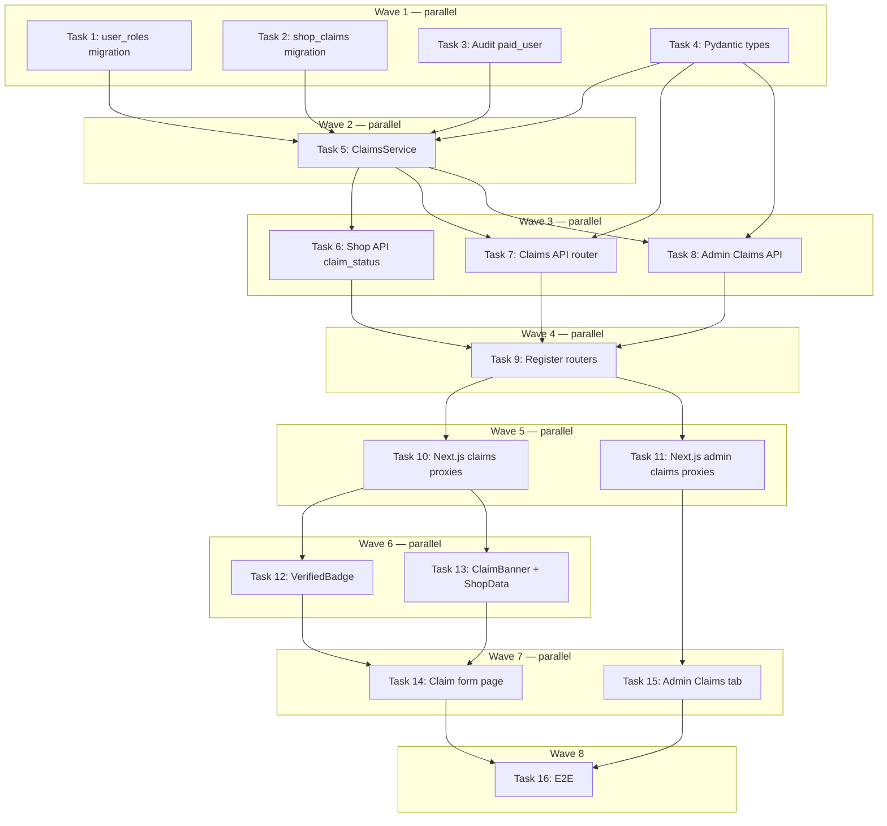

# Shop Claim Flow + Verified Badge Implementation Plan

> **For Claude:** REQUIRED SUB-SKILL: Use executing-plans to implement this plan task-by-task.

**Design Doc:** [docs/designs/2026-03-26-shop-claim-flow-design.md](docs/designs/2026-03-26-shop-claim-flow-design.md)

**Spec References:** [SPEC.md §9 (Role hierarchy)](SPEC.md), [SPEC.md §7 (Shop detail)](SPEC.md)

**PRD References:** [PRD.md §8 (Shop tiers)](PRD.md)

**Goal:** Let shop owners submit a claim on their CafeRoam page, receive admin verification, and display a Verified badge once approved.

**Architecture:** Full-page claim form at `/shops/[shopId]/claim` → FastAPI backend (`claims_service.py`) → `shop_claims` table + Supabase Storage private bucket → admin tab in `/admin` panel approves/rejects → Verified badge rendered on shop detail and search cards. The `user_roles` table is also migrated to rename `paid_user → member` and add `shop_owner`.

**Tech Stack:** Next.js 16 (frontend), FastAPI + Supabase (backend), Resend (email via existing `EmailProvider` protocol), Supabase Storage (proof photos, private bucket), pytest + TestClient (backend tests), Vitest + Testing Library (frontend tests), Playwright (e2e)

**Acceptance Criteria:**

- [ ] A shop owner can click the "Claim this page" badge on any unclaimed shop and submit a claim form with a proof photo
- [ ] After submitting, the owner receives a confirmation email and the admin receives a notification email
- [ ] The admin can approve or reject the claim from the admin panel; the owner receives the corresponding email
- [ ] An approved shop shows a "已認證" Verified badge on its shop detail page and in search result cards
- [ ] The claim badge is hidden once a shop has a pending or approved claim

---

## Task 1: DB Migration — user_roles (rename paid_user → member, add shop_owner)

**Files:**

- Create: `supabase/migrations/20260326000010_user_roles_member_shop_owner.sql`

**No test needed — DB migration with no business logic.**

**Step 1: Write migration**

```sql
-- 20260326000010_user_roles_member_shop_owner.sql
-- Rename paid_user → member to align with SPEC.md §9 role hierarchy.
-- Add shop_owner for the claim flow (DEV-45).

-- Step 1: rename existing rows (none in prod yet, but safe to include)
UPDATE public.user_roles SET role = 'member' WHERE role = 'paid_user';

-- Step 2: update the CHECK constraint
ALTER TABLE public.user_roles DROP CONSTRAINT IF EXISTS user_roles_role_check;
ALTER TABLE public.user_roles
  ADD CONSTRAINT user_roles_role_check
  CHECK (role IN ('blogger', 'partner', 'admin', 'shop_owner', 'member'));
```

**Step 2: Apply locally**

```bash
supabase db push
```

Expected: migration applied without error.

**Step 3: Commit**

```bash
git add supabase/migrations/20260326000010_user_roles_member_shop_owner.sql
git commit -m "feat(DEV-45): migrate user_roles — rename paid_user→member, add shop_owner"
```

---

## Task 2: DB Migration — shop_claims table + Supabase Storage bucket

**Files:**

- Create: `supabase/migrations/20260326000011_create_shop_claims.sql`

**No test needed — DB migration.**

**Step 1: Write migration**

```sql
-- 20260326000011_create_shop_claims.sql
-- shop_claims: stores ownership verification requests from shop owners.
-- One active claim per shop (UNIQUE on shop_id).
-- Proof photos stored in Supabase Storage private bucket 'claim-proofs'.

CREATE TABLE public.shop_claims (
  id               UUID PRIMARY KEY DEFAULT gen_random_uuid(),
  shop_id          UUID NOT NULL REFERENCES public.shops(id) ON DELETE CASCADE,
  user_id          UUID NOT NULL REFERENCES auth.users(id) ON DELETE CASCADE,
  status           TEXT NOT NULL DEFAULT 'pending'
                   CHECK (status IN ('pending', 'approved', 'rejected')),
  contact_name     TEXT NOT NULL,
  contact_email    TEXT NOT NULL,
  role             TEXT NOT NULL CHECK (role IN ('owner', 'manager', 'staff')),
  proof_photo_url  TEXT NOT NULL,
  rejection_reason TEXT,
  reviewed_at      TIMESTAMPTZ,
  reviewed_by      UUID REFERENCES auth.users(id),
  created_at       TIMESTAMPTZ NOT NULL DEFAULT now(),
  updated_at       TIMESTAMPTZ NOT NULL DEFAULT now(),
  UNIQUE(shop_id)
);

CREATE INDEX idx_shop_claims_user   ON public.shop_claims(user_id);
CREATE INDEX idx_shop_claims_status ON public.shop_claims(status)
  WHERE status = 'pending';

-- RLS: enabled, but most access goes via service role in the backend.
ALTER TABLE public.shop_claims ENABLE ROW LEVEL SECURITY;

-- Users can read their own claim.
CREATE POLICY "users read own claim"
  ON public.shop_claims FOR SELECT
  USING (auth.uid() = user_id);

-- Users can insert their own claim (uniqueness constraint prevents duplicate active claims).
CREATE POLICY "users insert own claim"
  ON public.shop_claims FOR INSERT
  WITH CHECK (auth.uid() = user_id);

-- Storage bucket: claim-proofs (private — service role only).
-- Run this in the Supabase dashboard or via the storage API since
-- the SQL migration cannot create storage buckets.
-- Bucket config:
--   name: claim-proofs
--   public: false
--   file_size_limit: 10485760  (10 MB)
--   allowed_mime_types: ['image/jpeg', 'image/png', 'image/webp', 'image/heic']
```

**Step 2: Create Supabase Storage bucket manually**

In the Supabase dashboard (local: http://127.0.0.1:54323):

- Storage → New bucket
- Name: `claim-proofs`
- Public: OFF
- Max file size: 10MB
- Allowed MIME types: `image/jpeg, image/png, image/webp, image/heic`

**Step 3: Apply migration**

```bash
supabase db push
```

**Step 4: Commit**

```bash
git add supabase/migrations/20260326000011_create_shop_claims.sql
git commit -m "feat(DEV-45): add shop_claims table + notes for claim-proofs storage bucket"
```

---

## Task 3: Backend audit — replace 'paid_user' with 'member'

**Files:**

- Modify: any Python file referencing `'paid_user'` string

**No test needed — no logic change, just rename to match DB.**

**Step 1: Find all occurrences**

```bash
grep -rn "paid_user" backend/
```

**Step 2: Replace each occurrence** with `'member'`.

**Step 3: Run existing tests to confirm nothing broke**

```bash
cd backend && pytest -x -q
```

Expected: all existing tests pass.

**Step 4: Commit**

```bash
git add -p   # stage only backend/ changes
git commit -m "refactor(DEV-45): rename paid_user → member in backend code"
```

---

## Task 4: Backend — add Claim types to models/types.py

**Files:**

- Modify: `backend/models/types.py`

**No dedicated test — Pydantic models are validated by the API tests that use them.**

**Step 1: Add types**

Add to `backend/models/types.py` after the `Shop` class:

```python
ClaimRole = Literal["owner", "manager", "staff"]
ClaimStatus = Literal["pending", "approved", "rejected"]


class ShopClaimResponse(CamelModel):
    id: str
    shop_id: str
    user_id: str
    status: ClaimStatus
    contact_name: str
    contact_email: str
    role: ClaimRole
    created_at: datetime


class SubmitClaimRequest(CamelModel):
    shop_id: str
    contact_name: str
    contact_email: str
    role: ClaimRole
    proof_photo_path: str  # Supabase Storage path after upload


class ClaimUploadUrlResponse(CamelModel):
    upload_url: str
    storage_path: str
```

**Step 2: Commit**

```bash
git add backend/models/types.py
git commit -m "feat(DEV-45): add Claim Pydantic types to models/types.py"
```

---

## Task 5: Backend — ClaimsService (TDD)

**Files:**

- Create: `backend/services/claims_service.py`
- Create: `backend/tests/test_claims_service.py`

**Step 1: Write the failing tests**

```python
# backend/tests/test_claims_service.py
from unittest.mock import AsyncMock, MagicMock, patch

import pytest

from services.claims_service import ClaimsService


SHOP_ID = "shop-abc"
USER_ID = "user-xyz"
CLAIM_ID = "claim-111"


def _make_db(claim_rows=None, insert_row=None, user_role_rows=None):
    """Build a mock Supabase client for claims tests."""
    db = MagicMock()
    table_calls = {"n": 0}

    def table_side(name):
        mock = MagicMock()
        table_calls["n"] += 1
        n = table_calls["n"]
        if name == "shop_claims" and n == 1:
            # Duplicate check: .select().eq().eq().execute()
            chain = mock.select.return_value.eq.return_value.in_.return_value
            chain.execute.return_value.data = claim_rows or []
        if name == "shop_claims" and n == 2:
            # Insert claim
            mock.insert.return_value.execute.return_value.data = [
                insert_row or {"id": CLAIM_ID}
            ]
        if name == "user_roles":
            # Insert role on approve
            mock.insert.return_value.execute.return_value.data = [{"id": "role-1"}]
        return mock

    db.table.side_effect = table_side
    return db


class TestSubmitClaim:
    def test_submit_creates_claim_record(self):
        db = _make_db(claim_rows=[], insert_row={"id": CLAIM_ID})
        email = AsyncMock()
        svc = ClaimsService(db=db, email=email)

        import asyncio
        result = asyncio.get_event_loop().run_until_complete(
            svc.submit_claim(
                user_id=USER_ID,
                shop_id=SHOP_ID,
                contact_name="Alice",
                contact_email="alice@example.com",
                role="owner",
                proof_photo_path="claim-proofs/shop-abc/proof.jpg",
                shop_name="Test Café",
                admin_email="admin@caferoam.tw",
            )
        )
        assert result["id"] == CLAIM_ID

    def test_submit_raises_409_if_active_claim_exists(self):
        db = _make_db(claim_rows=[{"id": "existing-claim", "status": "pending"}])
        email = AsyncMock()
        svc = ClaimsService(db=db, email=email)

        from fastapi import HTTPException
        import asyncio
        with pytest.raises(HTTPException) as exc:
            asyncio.get_event_loop().run_until_complete(
                svc.submit_claim(
                    user_id=USER_ID,
                    shop_id=SHOP_ID,
                    contact_name="Bob",
                    contact_email="bob@example.com",
                    role="manager",
                    proof_photo_path="claim-proofs/shop-abc/proof.jpg",
                    shop_name="Test Café",
                    admin_email="admin@caferoam.tw",
                )
            )
        assert exc.value.status_code == 409

    def test_submit_sends_confirmation_and_admin_emails(self):
        db = _make_db(claim_rows=[], insert_row={"id": CLAIM_ID})
        email = AsyncMock()
        svc = ClaimsService(db=db, email=email)

        import asyncio
        asyncio.get_event_loop().run_until_complete(
            svc.submit_claim(
                user_id=USER_ID,
                shop_id=SHOP_ID,
                contact_name="Alice",
                contact_email="alice@example.com",
                role="owner",
                proof_photo_path="claim-proofs/shop-abc/proof.jpg",
                shop_name="Test Café",
                admin_email="admin@caferoam.tw",
            )
        )
        assert email.send.call_count == 2  # confirmation + admin notification


class TestApproveClaim:
    def test_approve_sends_approval_email(self):
        db = MagicMock()
        # get_claim: returns a pending claim
        get_chain = db.table.return_value.select.return_value.eq.return_value
        get_chain.single.return_value.execute.return_value.data = {
            "id": CLAIM_ID,
            "shop_id": SHOP_ID,
            "user_id": USER_ID,
            "status": "pending",
            "contact_email": "alice@example.com",
            "contact_name": "Alice",
        }
        # update + user_roles insert
        db.table.return_value.update.return_value.eq.return_value.execute.return_value.data = [{}]
        db.table.return_value.insert.return_value.execute.return_value.data = [{}]

        email = AsyncMock()
        svc = ClaimsService(db=db, email=email)

        import asyncio
        asyncio.get_event_loop().run_until_complete(
            svc.approve_claim(claim_id=CLAIM_ID, admin_user_id="admin-1")
        )
        assert email.send.call_count == 1

    def test_reject_sends_rejection_email(self):
        db = MagicMock()
        get_chain = db.table.return_value.select.return_value.eq.return_value
        get_chain.single.return_value.execute.return_value.data = {
            "id": CLAIM_ID,
            "shop_id": SHOP_ID,
            "user_id": USER_ID,
            "status": "pending",
            "contact_email": "alice@example.com",
            "contact_name": "Alice",
        }
        db.table.return_value.update.return_value.eq.return_value.execute.return_value.data = [{}]

        email = AsyncMock()
        svc = ClaimsService(db=db, email=email)

        import asyncio
        asyncio.get_event_loop().run_until_complete(
            svc.reject_claim(
                claim_id=CLAIM_ID,
                reason="invalid_proof",
                admin_user_id="admin-1",
            )
        )
        assert email.send.call_count == 1
```

**Step 2: Run tests to verify they fail**

```bash
cd backend && pytest tests/test_claims_service.py -v
```

Expected: FAIL (ClaimsService not found)

**Step 3: Write minimal implementation**

```python
# backend/services/claims_service.py
import asyncio
from typing import Any

import structlog
from fastapi import HTTPException
from supabase import Client

from models.types import EmailMessage
from providers.email.interface import EmailProvider

logger = structlog.get_logger()


class ClaimsService:
    def __init__(self, db: Client, email: EmailProvider) -> None:
        self._db = db
        self._email = email

    async def submit_claim(
        self,
        user_id: str,
        shop_id: str,
        contact_name: str,
        contact_email: str,
        role: str,
        proof_photo_path: str,
        shop_name: str,
        admin_email: str,
    ) -> dict[str, Any]:
        """Insert a shop claim. Raises 409 if the shop already has a pending/approved claim."""
        # Check for existing active claim on this shop
        existing = await asyncio.to_thread(
            lambda: self._db.table("shop_claims")
            .select("id")
            .eq("shop_id", shop_id)
            .in_("status", ["pending", "approved"])
            .execute()
        )
        if existing.data:
            raise HTTPException(
                status_code=409,
                detail="此咖啡廳已有待審核或已通過的認領申請",
            )

        result = await asyncio.to_thread(
            lambda: self._db.table("shop_claims")
            .insert(
                {
                    "shop_id": shop_id,
                    "user_id": user_id,
                    "contact_name": contact_name,
                    "contact_email": contact_email,
                    "role": role,
                    "proof_photo_url": proof_photo_path,
                }
            )
            .execute()
        )

        claim = first(result.data, "insert claim") if result.data else {}

        # Send confirmation email to owner
        await self._email.send(
            EmailMessage(
                to=contact_email,
                subject="認領申請已收到 — 48小時內回覆",
                html=(
                    f"<p>您好 {contact_name}，</p>"
                    f"<p>我們已收到您對 <strong>{shop_name}</strong> 的認領申請。"
                    "我們會在 48 小時內完成審核，並以此信箱通知您結果。</p>"
                    "<p>CafeRoam 團隊</p>"
                ),
            )
        )

        # Notify admin
        await self._email.send(
            EmailMessage(
                to=admin_email,
                subject=f"[CafeRoam] New claim: {shop_name}",
                html=(
                    f"<p>New claim submitted for <strong>{shop_name}</strong> "
                    f"(shop_id: {shop_id}).</p>"
                    f"<p>Claimant: {contact_name} &lt;{contact_email}&gt;, role: {role}</p>"
                    f"<p>Proof photo: {proof_photo_path}</p>"
                    "<p>Review in the admin panel: /admin</p>"
                ),
            )
        )

        logger.info("Claim submitted", shop_id=shop_id, user_id=user_id)
        return claim

    async def approve_claim(self, claim_id: str, admin_user_id: str) -> None:
        """Approve a claim: update status, assign shop_owner role, email owner."""
        from core.db import first

        result = await asyncio.to_thread(
            lambda: self._db.table("shop_claims")
            .select("id, shop_id, user_id, contact_email, contact_name")
            .eq("id", claim_id)
            .single()
            .execute()
        )
        claim = first([result.data], "get claim for approval") if result.data else None
        if not claim:
            raise HTTPException(status_code=404, detail="Claim not found")

        from datetime import UTC, datetime

        # Update claim status
        await asyncio.to_thread(
            lambda: self._db.table("shop_claims")
            .update(
                {
                    "status": "approved",
                    "reviewed_at": datetime.now(UTC).isoformat(),
                    "reviewed_by": admin_user_id,
                }
            )
            .eq("id", claim_id)
            .execute()
        )

        # Assign shop_owner role
        await asyncio.to_thread(
            lambda: self._db.table("user_roles")
            .insert({"user_id": claim["user_id"], "role": "shop_owner", "granted_by": admin_user_id})
            .execute()
        )

        # Notify owner
        shop_id = claim["shop_id"]
        await self._email.send(
            EmailMessage(
                to=claim["contact_email"],
                subject="已通過認領 — 前往您的管理後台",
                html=(
                    f"<p>您好 {claim['contact_name']}，</p>"
                    "<p>恭喜！您的認領申請已通過審核。"
                    f"您的管理後台：<a href='https://caferoam.tw/owner/{shop_id}/dashboard'>"
                    "前往後台</a></p>"
                    "<p>CafeRoam 團隊</p>"
                ),
            )
        )
        logger.info("Claim approved", claim_id=claim_id, admin=admin_user_id)

    async def reject_claim(self, claim_id: str, reason: str, admin_user_id: str) -> None:
        """Reject a claim: update status, email owner."""
        from core.db import first

        result = await asyncio.to_thread(
            lambda: self._db.table("shop_claims")
            .select("id, contact_email, contact_name")
            .eq("id", claim_id)
            .single()
            .execute()
        )
        claim = first([result.data], "get claim for rejection") if result.data else None
        if not claim:
            raise HTTPException(status_code=404, detail="Claim not found")

        from datetime import UTC, datetime

        await asyncio.to_thread(
            lambda: self._db.table("shop_claims")
            .update(
                {
                    "status": "rejected",
                    "rejection_reason": reason,
                    "reviewed_at": datetime.now(UTC).isoformat(),
                    "reviewed_by": admin_user_id,
                }
            )
            .eq("id", claim_id)
            .execute()
        )

        reason_labels = {
            "invalid_proof": "提供的證明照片無法驗證",
            "not_an_owner": "提交者不具店主身份",
            "duplicate_request": "此咖啡廳已被認領",
            "other": "其他原因",
        }
        reason_label = reason_labels.get(reason, reason)

        await self._email.send(
            EmailMessage(
                to=claim["contact_email"],
                subject="認領申請未通過",
                html=(
                    f"<p>您好 {claim['contact_name']}，</p>"
                    f"<p>很抱歉，您的認領申請未通過審核。原因：{reason_label}。</p>"
                    "<p>如有疑問，請聯絡 hello@caferoam.tw。</p>"
                    "<p>CafeRoam 團隊</p>"
                ),
            )
        )
        logger.info("Claim rejected", claim_id=claim_id, reason=reason)
```

**Step 4: Run tests to verify they pass**

```bash
cd backend && pytest tests/test_claims_service.py -v
```

Expected: all tests PASS

**Step 5: Commit**

```bash
git add backend/services/claims_service.py backend/tests/test_claims_service.py
git commit -m "feat(DEV-45): ClaimsService with submit, approve, reject + tests"
```

---

## Task 6: Backend — add claim_status to GET /shops/:id

**Files:**

- Modify: `backend/api/shops.py`
- Create: `backend/tests/test_shops_claim_status.py`

**Step 1: Write the failing test**

```python
# backend/tests/test_shops_claim_status.py
from unittest.mock import MagicMock
import pytest
from fastapi.testclient import TestClient
from main import app


@pytest.fixture
def client():
    return TestClient(app)


class TestShopDetailClaimStatus:
    def _make_anon_db(self, claim_status: str | None):
        from db.supabase_client import get_anon_client

        db = MagicMock()
        shop_row = {
            "id": "shop-1",
            "name": "Test Café",
            "address": "台北市",
            "review_count": 0,
            "created_at": "2026-01-01T00:00:00",
            "updated_at": "2026-01-01T00:00:00",
            "shop_photos": [],
            "shop_tags": [],
            "mode_work": 0.5,
            "mode_rest": 0.5,
            "mode_social": 0.5,
        }
        if claim_status:
            shop_row["shop_claims"] = [{"status": claim_status}]
        else:
            shop_row["shop_claims"] = []

        db.table.return_value.select.return_value.eq.return_value.limit.return_value.execute.return_value.data = [
            shop_row
        ]
        return db

    def test_unclaimed_shop_has_null_claim_status(self, client):
        from db.supabase_client import get_anon_client
        db = self._make_anon_db(claim_status=None)
        with app.dependency_overrides_manager({get_anon_client: lambda: db}):
            resp = client.get("/shops/shop-1")
        # NOTE: dependency override approach may differ — adjust per codebase pattern
        assert resp.status_code == 200
        # claimStatus is null or absent for unclaimed shop

    def test_approved_shop_has_approved_claim_status(self, client):
        from db.supabase_client import get_anon_client
        db = self._make_anon_db(claim_status="approved")
        # ... override pattern same as above
        resp = client.get("/shops/shop-1")
        # claimStatus should be 'approved'
```

> **Note:** The existing `get_shop` uses `get_anon_client()` directly (not via FastAPI Depends), so override via monkeypatching `db.supabase_client.get_anon_client` in tests. Pattern: `with patch("api.shops.get_anon_client", return_value=db):`

**Step 2: Run test to verify it fails**

```bash
cd backend && pytest tests/test_shops_claim_status.py -v
```

Expected: FAIL

**Step 3: Modify `backend/api/shops.py` — extend `get_shop`**

Change the SELECT in `get_shop` to JOIN shop_claims:

```python
# In get_shop(), update the select call:
response = (
    db.table("shops")
    .select(
        f"{_SHOP_DETAIL_COLUMNS}, shop_photos(url), "
        "shop_tags(tag_id, taxonomy_tags(id, dimension, label, label_zh)), "
        "shop_claims(status)"          # ← add this
    )
    .eq("id", shop_id)
    .limit(1)
    .execute()
)
```

Then in the response assembly, extract claim_status:

```python
# After extracting photo_urls and taxonomy_tags:
raw_claims = shop.pop("shop_claims", None) or []
claim_status = raw_claims[0]["status"] if raw_claims else None

# Add to response_data:
response_data["claimStatus"] = claim_status
```

**Step 4: Run test to verify it passes**

```bash
cd backend && pytest tests/test_shops_claim_status.py -v
```

Expected: PASS

**Step 5: Commit**

```bash
git add backend/api/shops.py backend/tests/test_shops_claim_status.py
git commit -m "feat(DEV-45): add claimStatus to shop detail API response"
```

---

## Task 7: Backend — Claims API router (TDD)

**Files:**

- Create: `backend/api/claims.py`
- Create: `backend/tests/test_claims_api.py`

**API Contract:**

```yaml
POST /claims
  auth: required (Bearer token)
  request:
    shop_id: string
    contact_name: string
    contact_email: string  # validated email format
    role: "owner" | "manager" | "staff"
    proof_photo_path: string  # Supabase Storage path after upload
  response (201):
    claim_id: string
    message: string
  errors:
    401: unauthenticated
    409: shop already has pending or approved claim

GET /claims/upload-url?shop_id=<id>
  auth: required
  response (200):
    upload_url: string   # presigned Supabase Storage URL
    storage_path: string # path for proof_photo_path in POST /claims
  errors:
    401: unauthenticated

GET /claims/me?shop_id=<id>
  auth: required
  response (200):
    id: string | null
    status: "pending" | "approved" | "rejected" | null
  errors:
    401: unauthenticated
```

**Step 1: Write the failing tests**

```python
# backend/tests/test_claims_api.py
from unittest.mock import AsyncMock, MagicMock, patch

import pytest
from fastapi.testclient import TestClient

from api.deps import get_current_user
from main import app


@pytest.fixture
def client():
    return TestClient(app)


@pytest.fixture(autouse=True)
def _override_user():
    app.dependency_overrides[get_current_user] = lambda: {"id": "user-123"}
    yield
    app.dependency_overrides.pop(get_current_user, None)


class TestSubmitClaim:
    def test_unauthenticated_returns_401(self, client):
        app.dependency_overrides.pop(get_current_user, None)  # remove override
        resp = client.post(
            "/claims",
            json={
                "shopId": "shop-1",
                "contactName": "Alice",
                "contactEmail": "alice@example.com",
                "role": "owner",
                "proofPhotoPath": "claim-proofs/shop-1/proof.jpg",
            },
        )
        assert resp.status_code == 401
        app.dependency_overrides[get_current_user] = lambda: {"id": "user-123"}

    def test_successful_submission_returns_201(self, client):
        mock_svc = AsyncMock()
        mock_svc.submit_claim.return_value = {"id": "claim-abc"}

        with patch("api.claims.get_claims_service", return_value=mock_svc):
            resp = client.post(
                "/claims",
                json={
                    "shopId": "shop-1",
                    "contactName": "Alice",
                    "contactEmail": "alice@example.com",
                    "role": "owner",
                    "proofPhotoPath": "claim-proofs/shop-1/proof.jpg",
                },
                headers={"Authorization": "Bearer test-token"},
            )
        assert resp.status_code == 201
        assert resp.json()["claimId"] == "claim-abc"

    def test_duplicate_claim_returns_409(self, client):
        from fastapi import HTTPException

        mock_svc = AsyncMock()
        mock_svc.submit_claim.side_effect = HTTPException(
            status_code=409, detail="此咖啡廳已有待審核或已通過的認領申請"
        )

        with patch("api.claims.get_claims_service", return_value=mock_svc):
            resp = client.post(
                "/claims",
                json={
                    "shopId": "shop-1",
                    "contactName": "Alice",
                    "contactEmail": "alice@example.com",
                    "role": "owner",
                    "proofPhotoPath": "claim-proofs/shop-1/proof.jpg",
                },
                headers={"Authorization": "Bearer test-token"},
            )
        assert resp.status_code == 409
```

**Step 2: Run tests to verify they fail**

```bash
cd backend && pytest tests/test_claims_api.py -v
```

Expected: FAIL (no `/claims` route)

**Step 3: Write implementation**

```python
# backend/api/claims.py
import asyncio
from typing import Any

import structlog
from fastapi import APIRouter, Depends, Query
from pydantic import BaseModel, EmailStr

from api.deps import get_current_user
from core.config import settings
from db.supabase_client import get_service_role_client
from models.types import CamelModel
from providers.email import get_email_provider
from services.claims_service import ClaimsService

logger = structlog.get_logger()
router = APIRouter(prefix="/claims", tags=["claims"])


class SubmitClaimBody(CamelModel):
    shop_id: str
    contact_name: str
    contact_email: str
    role: str
    proof_photo_path: str


class SubmitClaimResponse(CamelModel):
    claim_id: str
    message: str


def get_claims_service() -> ClaimsService:
    return ClaimsService(db=get_service_role_client(), email=get_email_provider())


@router.get("/upload-url")
async def get_upload_url(
    shop_id: str = Query(...),
    user: dict[str, Any] = Depends(get_current_user),  # noqa: B008
) -> dict[str, str]:
    """Return a presigned Supabase Storage upload URL for proof photo."""
    storage_path = f"{shop_id}/{user['id']}/proof.jpg"
    db = get_service_role_client()
    # Generate a presigned upload URL (10 minute expiry)
    result = await asyncio.to_thread(
        lambda: db.storage.from_("claim-proofs").create_signed_upload_url(storage_path)
    )
    return {"uploadUrl": result["signedUrl"], "storagePath": storage_path}


@router.post("", status_code=201, response_model=SubmitClaimResponse)
async def submit_claim(
    body: SubmitClaimBody,
    user: dict[str, Any] = Depends(get_current_user),  # noqa: B008
    svc: ClaimsService = Depends(get_claims_service),  # noqa: B008
) -> SubmitClaimResponse:
    """Submit a shop ownership claim."""
    # Fetch shop name for emails
    db = get_service_role_client()
    shop_resp = await asyncio.to_thread(
        lambda: db.table("shops").select("name").eq("id", body.shop_id).single().execute()
    )
    shop_name = shop_resp.data.get("name", "your shop") if shop_resp.data else "your shop"

    claim = await svc.submit_claim(
        user_id=user["id"],
        shop_id=body.shop_id,
        contact_name=body.contact_name,
        contact_email=body.contact_email,
        role=body.role,
        proof_photo_path=body.proof_photo_path,
        shop_name=shop_name,
        admin_email=settings.admin_email,
    )
    return SubmitClaimResponse(claim_id=claim["id"], message="認領申請已送出")


@router.get("/me")
async def get_my_claim(
    shop_id: str = Query(...),
    user: dict[str, Any] = Depends(get_current_user),  # noqa: B008
) -> dict[str, Any]:
    """Return the current user's claim status for a given shop."""
    db = get_service_role_client()
    result = await asyncio.to_thread(
        lambda: db.table("shop_claims")
        .select("id, status")
        .eq("shop_id", shop_id)
        .eq("user_id", user["id"])
        .limit(1)
        .execute()
    )
    if result.data:
        row = first(result.data, "get my claim")
        return {"id": row["id"], "status": row["status"]}
    return {"id": None, "status": None}
```

Add `admin_email` to `backend/core/config.py` settings (alongside existing `admin_user_ids`):

```python
admin_email: str = "hello@caferoam.tw"
```

**Step 4: Run tests to verify they pass**

```bash
cd backend && pytest tests/test_claims_api.py -v
```

Expected: all PASS

**Step 5: Commit**

```bash
git add backend/api/claims.py backend/tests/test_claims_api.py backend/core/config.py
git commit -m "feat(DEV-45): claims API router (upload URL, submit, get status)"
```

---

## Task 8: Backend — Admin Claims API (TDD)

**Files:**

- Create: `backend/api/admin_claims.py`
- Create: `backend/tests/test_admin_claims_api.py`

**API Contract:**

```yaml
GET /admin/claims?status=pending
  auth: admin required
  response: list of claim objects with shop name

GET /admin/claims/:id/proof-url
  auth: admin required
  response:
    proof_url: string  # signed download URL (1hr expiry)

POST /admin/claims/:id/approve
  auth: admin required
  response (200):
    message: string

POST /admin/claims/:id/reject
  auth: admin required
  request:
    rejection_reason: "invalid_proof" | "not_an_owner" | "duplicate_request" | "other"
  response (200):
    message: string
  errors:
    422: missing rejection_reason
```

**Step 1: Write failing tests**

```python
# backend/tests/test_admin_claims_api.py
from unittest.mock import AsyncMock, MagicMock, patch

import pytest
from fastapi.testclient import TestClient

from api.deps import require_admin
from main import app


@pytest.fixture
def client():
    return TestClient(app)


@pytest.fixture(autouse=True)
def _override_admin():
    app.dependency_overrides[require_admin] = lambda: {"id": "admin-1"}
    yield
    app.dependency_overrides.pop(require_admin, None)


class TestListClaims:
    def test_returns_list_of_pending_claims(self, client):
        mock_db = MagicMock()
        mock_db.table.return_value.select.return_value.order.return_value.limit.return_value.execute.return_value.data = [
            {"id": "claim-1", "status": "pending", "contact_name": "Alice", "shops": {"name": "Café A"}}
        ]
        with patch("api.admin_claims.get_service_role_client", return_value=mock_db):
            resp = client.get("/admin/claims", headers={"Authorization": "Bearer admin-token"})
        assert resp.status_code == 200
        data = resp.json()
        assert len(data) == 1


class TestApproveClaim:
    def test_approve_calls_service_and_returns_200(self, client):
        mock_svc = AsyncMock()
        with patch("api.admin_claims.get_claims_service", return_value=mock_svc):
            resp = client.post(
                "/admin/claims/claim-1/approve",
                headers={"Authorization": "Bearer admin-token"},
            )
        assert resp.status_code == 200
        mock_svc.approve_claim.assert_called_once()


class TestRejectClaim:
    def test_reject_without_reason_returns_422(self, client):
        resp = client.post(
            "/admin/claims/claim-1/reject",
            json={},
            headers={"Authorization": "Bearer admin-token"},
        )
        assert resp.status_code == 422

    def test_reject_with_reason_returns_200(self, client):
        mock_svc = AsyncMock()
        with patch("api.admin_claims.get_claims_service", return_value=mock_svc):
            resp = client.post(
                "/admin/claims/claim-1/reject",
                json={"rejectionReason": "invalid_proof"},
                headers={"Authorization": "Bearer admin-token"},
            )
        assert resp.status_code == 200
```

**Step 2: Run tests to verify they fail**

```bash
cd backend && pytest tests/test_admin_claims_api.py -v
```

Expected: FAIL

**Step 3: Write implementation**

```python
# backend/api/admin_claims.py
import asyncio
from typing import Any, Literal

import structlog
from fastapi import APIRouter, Depends, Query
from pydantic import BaseModel

from api.deps import require_admin
from db.supabase_client import get_service_role_client
from models.types import CamelModel
from providers.email import get_email_provider
from services.claims_service import ClaimsService

logger = structlog.get_logger()
router = APIRouter(prefix="/admin/claims", tags=["admin-claims"])

ClaimRejectionReason = Literal["invalid_proof", "not_an_owner", "duplicate_request", "other"]


class RejectClaimBody(CamelModel):
    rejection_reason: ClaimRejectionReason


def get_claims_service() -> ClaimsService:
    return ClaimsService(db=get_service_role_client(), email=get_email_provider())


@router.get("")
async def list_claims(
    status: str | None = Query(default="pending"),
    user: dict[str, Any] = Depends(require_admin),  # noqa: B008
) -> list[dict[str, Any]]:
    db = get_service_role_client()
    query = (
        db.table("shop_claims")
        .select("*, shops(name, address)")
        .order("created_at", desc=True)
        .limit(50)
    )
    if status:
        query = query.eq("status", status)
    result = await asyncio.to_thread(lambda: query.execute())
    return result.data or []


@router.get("/{claim_id}/proof-url")
async def get_proof_url(
    claim_id: str,
    user: dict[str, Any] = Depends(require_admin),  # noqa: B008
) -> dict[str, str]:
    db = get_service_role_client()
    result = await asyncio.to_thread(
        lambda: db.table("shop_claims")
        .select("proof_photo_url")
        .eq("id", claim_id)
        .single()
        .execute()
    )
    storage_path = result.data["proof_photo_url"]
    signed = await asyncio.to_thread(
        lambda: db.storage.from_("claim-proofs").create_signed_url(storage_path, 3600)
    )
    return {"proofUrl": signed["signedUrl"]}


@router.post("/{claim_id}/approve")
async def approve_claim(
    claim_id: str,
    user: dict[str, Any] = Depends(require_admin),  # noqa: B008
    svc: ClaimsService = Depends(get_claims_service),  # noqa: B008
) -> dict[str, str]:
    await svc.approve_claim(claim_id=claim_id, admin_user_id=user["id"])
    return {"message": "Claim approved"}


@router.post("/{claim_id}/reject")
async def reject_claim(
    claim_id: str,
    body: RejectClaimBody,
    user: dict[str, Any] = Depends(require_admin),  # noqa: B008
    svc: ClaimsService = Depends(get_claims_service),  # noqa: B008
) -> dict[str, str]:
    await svc.reject_claim(
        claim_id=claim_id,
        reason=body.rejection_reason,
        admin_user_id=user["id"],
    )
    return {"message": "Claim rejected"}
```

**Step 4: Run tests to verify they pass**

```bash
cd backend && pytest tests/test_admin_claims_api.py -v
```

Expected: all PASS

**Step 5: Commit**

```bash
git add backend/api/admin_claims.py backend/tests/test_admin_claims_api.py
git commit -m "feat(DEV-45): admin claims API (list, proof-url, approve, reject)"
```

---

## Task 9: Backend — register routers in main.py

**Files:**

- Modify: `backend/main.py`

**No test needed — router registration is verified by the API tests above.**

**Step 1: Add imports and include routers**

```python
# Add to imports in main.py:
from api.claims import router as claims_router
from api.admin_claims import router as admin_claims_router

# Add to include_router calls:
app.include_router(claims_router)
app.include_router(admin_claims_router)
```

**Step 2: Verify**

```bash
cd backend && pytest -x -q
```

Expected: all tests still pass (no 404 on routes).

**Step 3: Commit**

```bash
git add backend/main.py
git commit -m "feat(DEV-45): register claims and admin claims routers in main.py"
```

---

## Task 10: Frontend — Next.js API proxy routes for claims

**Files:**

- Create: `app/api/claims/route.ts`
- Create: `app/api/claims/upload-url/route.ts`
- Create: `app/api/claims/me/route.ts`

**No test needed — thin proxy, pattern identical to existing routes.**

**Step 1: Write proxy files**

```typescript
// app/api/claims/route.ts
import { NextRequest } from 'next/server';
import { proxyToBackend } from '@/lib/api/proxy';

export async function POST(request: NextRequest) {
  return proxyToBackend(request, '/claims');
}
```

```typescript
// app/api/claims/upload-url/route.ts
import { NextRequest } from 'next/server';
import { proxyToBackend } from '@/lib/api/proxy';

export async function GET(request: NextRequest) {
  return proxyToBackend(request, '/claims/upload-url');
}
```

```typescript
// app/api/claims/me/route.ts
import { NextRequest } from 'next/server';
import { proxyToBackend } from '@/lib/api/proxy';

export async function GET(request: NextRequest) {
  return proxyToBackend(request, '/claims/me');
}
```

**Step 2: Commit**

```bash
git add app/api/claims/
git commit -m "feat(DEV-45): Next.js proxy routes for claims API"
```

---

## Task 11: Frontend — Next.js API proxy routes for admin claims

**Files:**

- Create: `app/api/admin/claims/route.ts`
- Create: `app/api/admin/claims/[id]/approve/route.ts`
- Create: `app/api/admin/claims/[id]/reject/route.ts`
- Create: `app/api/admin/claims/[id]/proof-url/route.ts`

**No test needed — thin proxies.**

**Step 1: Write proxy files**

```typescript
// app/api/admin/claims/route.ts
import { NextRequest } from 'next/server';
import { proxyToBackend } from '@/lib/api/proxy';

export async function GET(request: NextRequest) {
  return proxyToBackend(request, '/admin/claims');
}
```

```typescript
// app/api/admin/claims/[id]/approve/route.ts
import { NextRequest } from 'next/server';
import { proxyToBackend } from '@/lib/api/proxy';

export async function POST(
  request: NextRequest,
  { params }: { params: Promise<{ id: string }> }
) {
  const { id } = await params;
  return proxyToBackend(request, `/admin/claims/${id}/approve`);
}
```

```typescript
// app/api/admin/claims/[id]/reject/route.ts
import { NextRequest } from 'next/server';
import { proxyToBackend } from '@/lib/api/proxy';

export async function POST(
  request: NextRequest,
  { params }: { params: Promise<{ id: string }> }
) {
  const { id } = await params;
  return proxyToBackend(request, `/admin/claims/${id}/reject`);
}
```

```typescript
// app/api/admin/claims/[id]/proof-url/route.ts
import { NextRequest } from 'next/server';
import { proxyToBackend } from '@/lib/api/proxy';

export async function GET(
  request: NextRequest,
  { params }: { params: Promise<{ id: string }> }
) {
  const { id } = await params;
  return proxyToBackend(request, `/admin/claims/${id}/proof-url`);
}
```

**Step 2: Commit**

```bash
git add app/api/admin/claims/
git commit -m "feat(DEV-45): Next.js proxy routes for admin claims API"
```

---

## Task 12: Frontend — VerifiedBadge component (TDD)

**Files:**

- Create: `components/shops/verified-badge.tsx`
- Create: `components/shops/verified-badge.test.tsx`

**Step 1: Write the failing test**

```typescript
// components/shops/verified-badge.test.tsx
import { render, screen } from '@testing-library/react';
import { describe, expect, it } from 'vitest';
import { VerifiedBadge } from './verified-badge';

describe('VerifiedBadge', () => {
  it('renders verified label with accessible text', () => {
    render(<VerifiedBadge />);
    expect(screen.getByText('已認證')).toBeInTheDocument();
    // accessible: wrapper has role or title
    const badge = screen.getByTitle('已認證店家');
    expect(badge).toBeInTheDocument();
  });
});
```

**Step 2: Run test to verify it fails**

```bash
pnpm test components/shops/verified-badge.test.tsx
```

Expected: FAIL

**Step 3: Write minimal implementation**

```typescript
// components/shops/verified-badge.tsx
import { CheckCircle } from 'lucide-react';

interface VerifiedBadgeProps {
  size?: 'sm' | 'md';
}

export function VerifiedBadge({ size = 'sm' }: VerifiedBadgeProps) {
  const iconSize = size === 'sm' ? 14 : 16;
  return (
    <span
      title="已認證店家"
      className="inline-flex items-center gap-1 rounded-full bg-emerald-50 px-2 py-0.5 text-xs font-medium text-emerald-700"
    >
      <CheckCircle size={iconSize} aria-hidden="true" />
      已認證
    </span>
  );
}
```

**Step 4: Run test to verify it passes**

```bash
pnpm test components/shops/verified-badge.test.tsx
```

Expected: PASS

**Step 5: Commit**

```bash
git add components/shops/verified-badge.tsx components/shops/verified-badge.test.tsx
git commit -m "feat(DEV-45): VerifiedBadge component with test"
```

---

## Task 13: Frontend — update ShopData + ClaimBanner (TDD)

**Files:**

- Modify: `app/shops/[shopId]/[slug]/shop-detail-client.tsx`
- Modify: `components/shops/claim-banner.tsx`
- Create: `components/shops/claim-banner.test.tsx`

**Step 1: Write the failing test**

```typescript
// components/shops/claim-banner.test.tsx
import { render, screen } from '@testing-library/react';
import { describe, expect, it } from 'vitest';
import { ClaimBanner } from './claim-banner';

describe('ClaimBanner', () => {
  it('renders a link to the claim page when shop is unclaimed', () => {
    render(<ClaimBanner shopId="shop-1" shopName="Test Café" claimStatus={null} />);
    const link = screen.getByRole('link', { name: /claim this page|認領/i });
    expect(link).toHaveAttribute('href', '/shops/shop-1/claim');
  });

  it('shows pending message when claim is pending', () => {
    render(<ClaimBanner shopId="shop-1" shopName="Test Café" claimStatus="pending" />);
    expect(screen.getByText(/審核中|pending/i)).toBeInTheDocument();
  });

  it('renders nothing when shop is approved', () => {
    const { container } = render(
      <ClaimBanner shopId="shop-1" shopName="Test Café" claimStatus="approved" />
    );
    expect(container.firstChild).toBeNull();
  });
});
```

**Step 2: Run test to verify it fails**

```bash
pnpm test components/shops/claim-banner.test.tsx
```

Expected: FAIL

**Step 3: Update ClaimBanner**

```typescript
// components/shops/claim-banner.tsx
import Link from 'next/link';

interface ClaimBannerProps {
  shopId: string;
  shopName: string;
  claimStatus: 'pending' | 'approved' | 'rejected' | null;
}

export function ClaimBanner({ shopId, shopName: _shopName, claimStatus }: ClaimBannerProps) {
  if (claimStatus === 'approved') return null;

  if (claimStatus === 'pending') {
    return (
      <div className="border-border-warm bg-surface-warm border-t px-5 py-4">
        <p className="text-text-secondary text-sm">認領申請審核中，我們會在 48 小時內回覆。</p>
      </div>
    );
  }

  return (
    <div className="border-border-warm bg-surface-warm border-t px-5 py-4">
      <p className="text-text-secondary text-sm">
        Is this your café?{' '}
        <Link
          href={`/shops/${shopId}/claim`}
          className="text-text-body font-medium underline underline-offset-2"
        >
          Claim this page →
        </Link>
      </p>
    </div>
  );
}
```

**Step 4: Update ShopData interface and ClaimBanner usage in shop-detail-client.tsx**

In `ShopData` interface, add:

```typescript
claimStatus?: 'pending' | 'approved' | 'rejected' | null;
```

In the JSX where `<ClaimBanner>` is rendered, pass `claimStatus`:

```typescript
<ClaimBanner
  shopId={shop.id}
  shopName={shop.name}
  claimStatus={shop.claimStatus ?? null}
/>
```

Also add `<VerifiedBadge>` in the shop identity area when `claimStatus === 'approved'`:

```typescript
import { VerifiedBadge } from '@/components/shops/verified-badge';
// ...inside ShopIdentity or adjacent:
{shop.claimStatus === 'approved' && <VerifiedBadge />}
```

**Step 5: Run test to verify it passes**

```bash
pnpm test components/shops/claim-banner.test.tsx
```

Expected: PASS

**Step 6: Run full lint**

```bash
pnpm lint
```

Fix any issues.

**Step 7: Commit**

```bash
git add components/shops/claim-banner.tsx components/shops/claim-banner.test.tsx \
        app/shops/[shopId]/[slug]/shop-detail-client.tsx
git commit -m "feat(DEV-45): ClaimBanner navigates to claim page; hide when approved/pending"
```

---

## Task 14: Frontend — Claim form page (TDD)

**Files:**

- Create: `app/shops/[shopId]/claim/page.tsx`
- Create: `app/shops/[shopId]/claim/page.test.tsx`

**Step 1: Write failing test**

```typescript
// app/shops/[shopId]/claim/page.test.tsx
import { render, screen, fireEvent, waitFor } from '@testing-library/react';
import { describe, expect, it, vi } from 'vitest';
// NOTE: This page uses next/navigation — mock it at top level
vi.mock('next/navigation', () => ({
  useParams: () => ({ shopId: 'shop-1' }),
  useRouter: () => ({ push: vi.fn() }),
  redirect: vi.fn(),
}));

import ClaimPage from './page';

describe('ClaimPage', () => {
  it('renders all required form fields', () => {
    render(<ClaimPage />);
    expect(screen.getByLabelText(/姓名|Name/i)).toBeInTheDocument();
    expect(screen.getByLabelText(/Email/i)).toBeInTheDocument();
    expect(screen.getByLabelText(/身份|Role/i)).toBeInTheDocument();
    expect(screen.getByLabelText(/證明照片|Proof/i)).toBeInTheDocument();
  });

  it('disables submit button when required fields are empty', () => {
    render(<ClaimPage />);
    const submitBtn = screen.getByRole('button', { name: /送出|Submit/i });
    expect(submitBtn).toBeDisabled();
  });

  it('shows confirmation message after successful submission', async () => {
    global.fetch = vi.fn().mockResolvedValueOnce(
      // upload-url
      { ok: true, json: async () => ({ uploadUrl: 'https://storage/upload', storagePath: 'path/to/file' }) }
    ).mockResolvedValueOnce(
      // actual upload to storage
      new Response(null, { status: 200 })
    ).mockResolvedValueOnce(
      // POST /api/claims
      { ok: true, json: async () => ({ claimId: 'claim-1', message: '認領申請已送出' }) }
    );

    render(<ClaimPage />);
    fireEvent.change(screen.getByLabelText(/姓名|Name/i), { target: { value: 'Alice' } });
    fireEvent.change(screen.getByLabelText(/Email/i), { target: { value: 'alice@test.com' } });
    // Upload a file
    const fileInput = screen.getByLabelText(/證明照片|Proof/i);
    const file = new File(['photo'], 'proof.jpg', { type: 'image/jpeg' });
    fireEvent.change(fileInput, { target: { files: [file] } });

    fireEvent.click(screen.getByRole('button', { name: /送出|Submit/i }));

    await waitFor(() => {
      expect(screen.getByText(/已送出|submitted/i)).toBeInTheDocument();
    });
  });
});
```

**Step 2: Run test to verify it fails**

```bash
pnpm test app/shops/\\[shopId\\]/claim/page.test.tsx
```

Expected: FAIL

**Step 3: Write the page**

```typescript
// app/shops/[shopId]/claim/page.tsx
'use client';

import { useState } from 'react';
import { useParams } from 'next/navigation';
import { createClient } from '@/lib/supabase/client';

type ClaimRole = 'owner' | 'manager' | 'staff';

export default function ClaimPage() {
  const { shopId } = useParams<{ shopId: string }>();
  const [name, setName] = useState('');
  const [email, setEmail] = useState('');
  const [role, setRole] = useState<ClaimRole>('owner');
  const [proofFile, setProofFile] = useState<File | null>(null);
  const [submitting, setSubmitting] = useState(false);
  const [submitted, setSubmitted] = useState(false);
  const [error, setError] = useState<string | null>(null);

  const supabase = createClient();

  const isValid = name.trim() && email.trim() && proofFile;

  async function handleSubmit(e: React.FormEvent) {
    e.preventDefault();
    if (!isValid || !proofFile) return;
    setSubmitting(true);
    setError(null);

    try {
      // 1. Get presigned upload URL
      const session = (await supabase.auth.getSession()).data.session;
      const token = session?.access_token;
      const urlRes = await fetch(`/api/claims/upload-url?shop_id=${shopId}`, {
        headers: { Authorization: `Bearer ${token}` },
      });
      if (!urlRes.ok) throw new Error('Failed to get upload URL');
      const { uploadUrl, storagePath } = await urlRes.json();

      // 2. Upload proof photo directly to Supabase Storage
      await fetch(uploadUrl, {
        method: 'PUT',
        body: proofFile,
        headers: { 'Content-Type': proofFile.type },
      });

      // 3. Submit claim
      const claimRes = await fetch('/api/claims', {
        method: 'POST',
        headers: {
          'Content-Type': 'application/json',
          Authorization: `Bearer ${token}`,
        },
        body: JSON.stringify({
          shopId,
          contactName: name,
          contactEmail: email,
          role,
          proofPhotoPath: storagePath,
        }),
      });
      if (!claimRes.ok) {
        const body = await claimRes.json().catch(() => ({}));
        throw new Error(body.detail || '送出失敗，請稍後再試');
      }

      setSubmitted(true);
    } catch (err) {
      setError(err instanceof Error ? err.message : '送出失敗');
    } finally {
      setSubmitting(false);
    }
  }

  if (submitted) {
    return (
      <main className="mx-auto max-w-md px-5 py-12">
        <h1 className="mb-4 text-2xl font-bold">已送出認領申請</h1>
        <p className="text-text-secondary">
          感謝您的申請！我們會在 48 小時內完成審核，並以您填寫的信箱通知您結果。
        </p>
      </main>
    );
  }

  return (
    <main className="mx-auto max-w-md px-5 py-12">
      <h1 className="mb-2 text-2xl font-bold">認領您的咖啡廳</h1>
      <p className="text-text-secondary mb-8 text-sm">
        填寫以下資訊，我們將在 48 小時內完成審核。
      </p>

      <form onSubmit={handleSubmit} className="space-y-6">
        <div>
          <label htmlFor="claim-name" className="mb-1 block text-sm font-medium">
            姓名 (Name)
          </label>
          <input
            id="claim-name"
            type="text"
            value={name}
            onChange={(e) => setName(e.target.value)}
            required
            className="border-border-warm w-full rounded-lg border px-4 py-3 text-sm"
            placeholder="您的姓名"
          />
        </div>

        <div>
          <label htmlFor="claim-email" className="mb-1 block text-sm font-medium">
            Email
          </label>
          <input
            id="claim-email"
            type="email"
            value={email}
            onChange={(e) => setEmail(e.target.value)}
            required
            className="border-border-warm w-full rounded-lg border px-4 py-3 text-sm"
            placeholder="your@email.com"
          />
        </div>

        <div>
          <label htmlFor="claim-role" className="mb-1 block text-sm font-medium">
            身份 (Role)
          </label>
          <select
            id="claim-role"
            value={role}
            onChange={(e) => setRole(e.target.value as ClaimRole)}
            className="border-border-warm w-full rounded-lg border px-4 py-3 text-sm"
          >
            <option value="owner">店主 (Owner)</option>
            <option value="manager">店長 (Manager)</option>
            <option value="staff">員工 (Staff)</option>
          </select>
        </div>

        <div>
          <label htmlFor="claim-proof" className="mb-1 block text-sm font-medium">
            證明照片 (Proof Photo)
          </label>
          <p className="text-text-secondary mb-2 text-xs">
            在店內拍的照片、名片、有店名的菜單、或 Google 商家截圖（最大 10MB）
          </p>
          <input
            id="claim-proof"
            type="file"
            accept="image/*"
            onChange={(e) => setProofFile(e.target.files?.[0] ?? null)}
            required
            className="w-full text-sm"
          />
        </div>

        {error && (
          <p role="alert" className="text-sm text-red-600">
            {error}
          </p>
        )}

        <button
          type="submit"
          disabled={!isValid || submitting}
          className="bg-primary w-full rounded-full py-3 text-sm font-semibold text-white disabled:opacity-50"
        >
          {submitting ? '送出中…' : '送出認領申請 (Submit)'}
        </button>
      </form>
    </main>
  );
}
```

**Step 4: Run test to verify it passes**

```bash
pnpm test app/shops/\\[shopId\\]/claim/page.test.tsx
```

Expected: PASS

**Step 5: Run lint**

```bash
pnpm lint
```

**Step 6: Commit**

```bash
git add app/shops/[shopId]/claim/
git commit -m "feat(DEV-45): shop claim form page with photo upload"
```

---

## Task 15: Frontend — Admin Claims tab

**Files:**

- Modify: `app/(admin)/admin/page.tsx`

**Step 1: Write test for new tab**

Add to existing or create `app/(admin)/admin/admin.test.tsx`:

```typescript
// Test that claims tab renders and loads
it('shows Claims tab in navigation', () => {
  render(<AdminDashboard />);
  expect(screen.getByRole('button', { name: /claims/i })).toBeInTheDocument();
});
```

**Step 2: Extend admin/page.tsx**

The admin page currently has no tabs — it's a single-section component. Add a tab switcher:

1. Add tab state: `const [tab, setTab] = useState<'submissions' | 'claims'>('submissions')`
2. Render tab buttons:

```tsx
<div className="mb-6 flex gap-2 border-b pb-2">
  <button
    type="button"
    onClick={() => setTab('submissions')}
    className={tab === 'submissions' ? 'font-semibold' : 'text-gray-500'}
  >
    Submissions
  </button>
  <button
    type="button"
    onClick={() => setTab('claims')}
    className={tab === 'claims' ? 'font-semibold' : 'text-gray-500'}
  >
    Claims
  </button>
</div>
```

3. Conditionally render the existing submissions section (`tab === 'submissions'`) or a new `<AdminClaimsSection token={tokenRef.current} />` component (`tab === 'claims'`)

**AdminClaimsSection** (inline or extracted):

- Fetches `GET /api/admin/claims?status=pending` on mount
- Renders a table: contact_name, contact_email, role, shop name, date, [View Proof] button, [Approve] button, [Reject w/ dropdown] button
- Proof URL: calls `GET /api/admin/claims/:id/proof-url` → opens signed URL in new tab
- Approve: calls `POST /api/admin/claims/:id/approve` → toast success, refresh
- Reject: dropdown (invalid_proof / not_an_owner / duplicate_request / other) + Confirm → `POST /api/admin/claims/:id/reject` → toast, refresh
- Reuse the existing rejection UX pattern from submissions

**Step 3: Verify manually**

```bash
pnpm dev
```

Navigate to `/admin` → verify Claims tab appears and loads data.

**Step 4: Run lint**

```bash
pnpm lint
```

**Step 5: Commit**

```bash
git add app/\(admin\)/admin/page.tsx
git commit -m "feat(DEV-45): add Claims tab to admin panel"
```

---

## Task 16: E2E — Claim flow journey

**Files:**

- Create: `e2e/claim.spec.ts`

**Step 1: Write the e2e test**

```typescript
// e2e/claim.spec.ts
import { test, expect } from './fixtures/auth';
import { first } from './fixtures/helpers';

test.describe('@critical J15 — Shop claim: badge click → form → confirmation', () => {
  test('claim badge links to claim page, form submits successfully', async ({
    authedPage: page,
  }) => {
    // Get a live shop
    const res = await page.request.get('/api/shops?featured=true&limit=1');
    const shops = await res.json();
    const shop = first(shops);
    test.skip(!shop?.id, 'No seeded shops');

    // Navigate to shop detail
    await page.goto(`/shops/${shop.id}/${shop.slug ?? shop.id}`);

    // Check claim badge is visible (shop must be unclaimed in test env)
    const claimLink = page.getByRole('link', { name: /claim this page/i });
    // Skip if shop is already claimed
    const isClaimed = !(await claimLink.isVisible().catch(() => false));
    test.skip(isClaimed, 'Shop is already claimed in test environment');

    await claimLink.click();
    await expect(page).toHaveURL(/\/shops\/.+\/claim/);
    await expect(
      page.getByRole('heading', { name: /認領|Claim/i })
    ).toBeVisible();

    // Fill in form
    await page.getByLabel(/姓名|Name/i).fill('Test Owner');
    await page.getByLabel(/email/i).fill('owner@test.com');

    // Upload a proof photo
    const fileInput = page.locator('input[type="file"]');
    await fileInput.setInputFiles({
      name: 'proof.jpg',
      mimeType: 'image/jpeg',
      buffer: Buffer.from('fake-image-data'),
    });

    // Submit
    const submitBtn = page.getByRole('button', { name: /送出|Submit/i });
    await expect(submitBtn).toBeEnabled({ timeout: 3_000 });
    await submitBtn.click();

    // Confirmation
    await expect(page.getByText(/已送出|submitted/i)).toBeVisible({
      timeout: 10_000,
    });
  });
});
```

**Step 2: Run e2e (against running dev server)**

```bash
pnpm dev &  # ensure server is running
npx playwright test e2e/claim.spec.ts
```

Expected: PASS (or SKIP if shop already claimed)

**Step 3: Commit**

```bash
git add e2e/claim.spec.ts
git commit -m "feat(DEV-45): e2e claim flow journey (J15)"
```

---

## Final: Run all tests

```bash
# Backend
cd backend && pytest -x -q

# Frontend
cd .. && pnpm test

# Lint
pnpm lint

# Type check
pnpm type-check
```

All must pass before opening a PR.

---

## Execution Waves



**Wave 1** (parallel — no dependencies):

- Task 1: user_roles DB migration
- Task 2: shop_claims DB migration
- Task 3: Audit paid_user references
- Task 4: Pydantic types

**Wave 2** (depends on Wave 1):

- Task 5: ClaimsService (TDD)

**Wave 3** (parallel — depends on Wave 2):

- Task 6: Shop API claim_status
- Task 7: Claims API router
- Task 8: Admin Claims API

**Wave 4** (depends on Wave 3):

- Task 9: Register routers in main.py

**Wave 5** (parallel — depends on Wave 4):

- Task 10: Next.js claims API proxies
- Task 11: Next.js admin claims API proxies

**Wave 6** (parallel — depends on Wave 5):

- Task 12: VerifiedBadge component
- Task 13: ClaimBanner update + ShopData type

**Wave 7** (parallel — depends on Wave 6):

- Task 14: Claim form page
- Task 15: Admin Claims tab

**Wave 8** (depends on Wave 7):

- Task 16: E2E claim flow journey

---

## TODO Entries

See `TODO.md` — section: "Shop Claim Flow + Verified Badge (DEV-45)"
