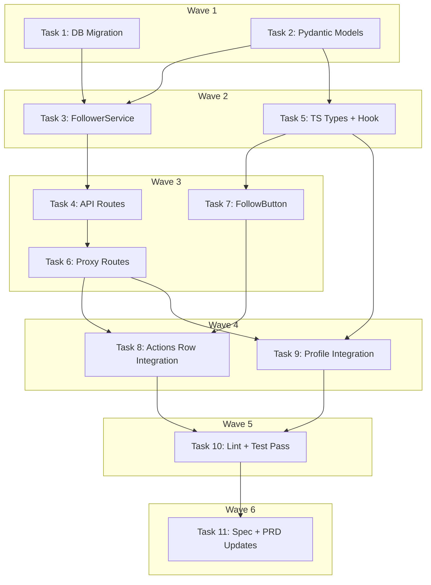

# Shop Follower Subscriptions Implementation Plan

> **For Claude:** REQUIRED SUB-SKILL: Use executing-plans to implement this plan task-by-task.

**Design Doc:** [docs/designs/2026-03-26-shop-followers-design.md](../designs/2026-03-26-shop-followers-design.md)

**Spec References:** —

**PRD References:** —

**Goal:** Let authenticated users follow/unfollow shops, see follower counts (public with 10+ threshold), and manage followed shops on their profile.

**Architecture:** New `shop_followers` table with RLS. Backend `FollowerService` + API routes following existing patterns (sync Supabase client, FastAPI router, CamelModel responses). Frontend `useShopFollow` hook with SWR + optimistic updates, `FollowButton` heart toggle in shop actions row, profile "Following" section.

**Tech Stack:** Supabase (Postgres + RLS), FastAPI, Pydantic (CamelModel), Next.js, SWR, Tailwind CSS, lucide-react (Heart icon)

**Acceptance Criteria:**
- [ ] An authenticated user can tap a heart icon on a shop page to follow it, and tap again to unfollow
- [ ] A shop with 10+ followers shows a public follower count; shops below threshold show no count
- [ ] A user can see all shops they follow on their profile page, with a total following count in the header
- [ ] Unauthenticated users tapping the heart are redirected to login
- [ ] Following/unfollowing is idempotent — double-tapping or race conditions don't cause errors

---

### Task 1: Database Migration — `shop_followers` table + RLS

**Files:**
- Create: `supabase/migrations/20260326000001_create_shop_followers.sql`

**Step 1: Write the migration SQL**

No test needed — pure DDL migration.

```sql
-- Shop followers: users follow shops for social proof + future broadcast notifications (DEV-20)
CREATE TABLE shop_followers (
  id         UUID PRIMARY KEY DEFAULT gen_random_uuid(),
  user_id    UUID NOT NULL REFERENCES auth.users(id) ON DELETE CASCADE,
  shop_id    UUID NOT NULL REFERENCES shops(id) ON DELETE CASCADE,
  created_at TIMESTAMPTZ NOT NULL DEFAULT now(),
  UNIQUE(user_id, shop_id)
);

CREATE INDEX idx_shop_followers_shop_id ON shop_followers(shop_id);
CREATE INDEX idx_shop_followers_user_id ON shop_followers(user_id);

-- RLS: users manage their own follows; anyone can read aggregate counts
ALTER TABLE shop_followers ENABLE ROW LEVEL SECURITY;

-- Users can see their own follow rows (needed for is_following check)
CREATE POLICY "Users can view own follows"
  ON shop_followers FOR SELECT
  USING (auth.uid() = user_id);

-- Users can follow shops
CREATE POLICY "Users can follow shops"
  ON shop_followers FOR INSERT
  WITH CHECK (auth.uid() = user_id);

-- Users can unfollow shops
CREATE POLICY "Users can unfollow shops"
  ON shop_followers FOR DELETE
  USING (auth.uid() = user_id);

-- Service role can read all follows (for count queries from unauthenticated users)
-- This is handled automatically by service_role bypassing RLS
```

**Step 2: Commit**

```bash
git add supabase/migrations/20260326000001_create_shop_followers.sql
git commit -m "feat(DEV-20): add shop_followers table with RLS"
```

---

### Task 2: Backend — Pydantic response models

**Files:**
- Modify: `backend/models/types.py` (append at end)

**Step 1: Write the models**

No test needed — data classes only, no logic.

Add at the end of `backend/models/types.py`:

```python
class FollowResponse(CamelModel):
    following: bool
    follower_count: int


class FollowerCountResponse(CamelModel):
    count: int
    visible: bool
    is_following: bool | None = None


class FollowedShopSummary(CamelModel):
    id: str
    name: str
    address: str
    slug: str | None = None
    mrt: str | None = None
    followed_at: str


class FollowingListResponse(CamelModel):
    shops: list[FollowedShopSummary]
    total: int
    page: int
```

**Step 2: Commit**

```bash
git add backend/models/types.py
git commit -m "feat(DEV-20): add follower Pydantic response models"
```

---

### Task 3: Backend — FollowerService with TDD

**Files:**
- Create: `backend/tests/services/test_follower_service.py`
- Create: `backend/services/follower_service.py`
- Modify: `backend/tests/factories.py` (add `make_follow_row`)

**Step 1: Add factory helper**

Append to `backend/tests/factories.py`:

```python
def make_follow_row(**overrides: object) -> dict:
    defaults = {
        "id": "follow-abc123",
        "user_id": "user-a1b2c3",
        "shop_id": "shop-d4e5f6",
        "created_at": _TS,
    }
    return {**defaults, **overrides}
```

**Step 2: Write failing tests**

Create `backend/tests/services/test_follower_service.py`:

```python
"""Tests for FollowerService — follow/unfollow shops and count queries."""

from unittest.mock import MagicMock

from postgrest.exceptions import APIError

from models.types import FollowedShopSummary
from services.follower_service import FollowerService
from tests.factories import make_follow_row, make_shop

FOLLOWER_THRESHOLD = 10


def _make_db_mock(
    *,
    insert_data: dict | None = None,
    insert_raises: APIError | None = None,
    select_data: list[dict] | None = None,
    count_data: list[dict] | None = None,
    delete_data: list[dict] | None = None,
) -> MagicMock:
    """Build chained Supabase mock with side_effect for sequential .execute() calls."""
    mock = MagicMock()
    mock.table.return_value = mock
    mock.select.return_value = mock
    mock.insert.return_value = mock
    mock.delete.return_value = mock
    mock.eq.return_value = mock
    mock.order.return_value = mock
    mock.range.return_value = mock
    mock.single.return_value = mock
    mock.maybe_single.return_value = mock

    responses: list[MagicMock] = []
    if insert_data is not None:
        responses.append(MagicMock(data=insert_data))
    if insert_raises is not None:
        err_response = MagicMock()
        err_response.execute.side_effect = insert_raises
        # We handle this differently — see test
    if select_data is not None:
        responses.append(MagicMock(data=select_data))
    if count_data is not None:
        responses.append(MagicMock(data=count_data, count=len(count_data)))
    if delete_data is not None:
        responses.append(MagicMock(data=delete_data))

    if responses:
        mock.execute.side_effect = responses

    return mock


class TestFollow:
    """When a user taps the heart icon on a shop page to follow it."""

    def test_creates_follow_relationship_and_returns_count(self):
        db = MagicMock()
        db.table.return_value = db
        db.insert.return_value = db
        db.select.return_value = db
        db.eq.return_value = db
        db.single.return_value = db
        db.maybe_single.return_value = db

        # insert → success
        insert_resp = MagicMock(data=make_follow_row())
        # count query → 5 followers
        count_resp = MagicMock(data=[{"count": 5}])
        db.execute.side_effect = [insert_resp, count_resp]

        service = FollowerService(db=db)
        result = service.follow(user_id="user-a1b2c3", shop_id="shop-d4e5f6")

        assert result.following is True
        assert result.follower_count == 5

    def test_idempotent_when_already_following(self):
        db = MagicMock()
        db.table.return_value = db
        db.insert.return_value = db
        db.select.return_value = db
        db.eq.return_value = db
        db.single.return_value = db
        db.maybe_single.return_value = db

        # insert raises unique violation (23505)
        db.execute.side_effect = [
            APIError({"message": "duplicate key", "code": "23505"}),
            MagicMock(data=[{"count": 10}]),  # count query still works
        ]

        service = FollowerService(db=db)
        result = service.follow(user_id="user-a1b2c3", shop_id="shop-d4e5f6")

        assert result.following is True
        assert result.follower_count == 10

    def test_raises_value_error_for_nonexistent_shop(self):
        db = MagicMock()
        db.table.return_value = db
        db.insert.return_value = db
        db.select.return_value = db
        db.eq.return_value = db
        db.single.return_value = db
        db.maybe_single.return_value = db

        # insert raises FK violation (23503)
        db.execute.side_effect = APIError(
            {"message": "violates foreign key constraint", "code": "23503"}
        )

        service = FollowerService(db=db)
        try:
            service.follow(user_id="user-a1b2c3", shop_id="nonexistent")
            assert False, "Should have raised ValueError"
        except ValueError as e:
            assert "not found" in str(e).lower()


class TestUnfollow:
    """When a user taps the filled heart to unfollow a shop."""

    def test_removes_follow_and_returns_count(self):
        db = MagicMock()
        db.table.return_value = db
        db.delete.return_value = db
        db.select.return_value = db
        db.eq.return_value = db

        # delete → success
        delete_resp = MagicMock(data=[make_follow_row()])
        # count query → 4 followers
        count_resp = MagicMock(data=[{"count": 4}])
        db.execute.side_effect = [delete_resp, count_resp]

        service = FollowerService(db=db)
        result = service.unfollow(user_id="user-a1b2c3", shop_id="shop-d4e5f6")

        assert result.following is False
        assert result.follower_count == 4

    def test_idempotent_when_not_following(self):
        db = MagicMock()
        db.table.return_value = db
        db.delete.return_value = db
        db.select.return_value = db
        db.eq.return_value = db

        # delete affects 0 rows
        delete_resp = MagicMock(data=[])
        # count → 0
        count_resp = MagicMock(data=[{"count": 0}])
        db.execute.side_effect = [delete_resp, count_resp]

        service = FollowerService(db=db)
        result = service.unfollow(user_id="user-a1b2c3", shop_id="shop-d4e5f6")

        assert result.following is False
        assert result.follower_count == 0


class TestGetFollowerCount:
    """When a shop detail page loads and needs the follower count."""

    def test_returns_visible_true_when_above_threshold(self):
        db = MagicMock()
        db.table.return_value = db
        db.select.return_value = db
        db.eq.return_value = db
        db.maybe_single.return_value = db

        count_resp = MagicMock(data=[{"count": 42}])
        # is_following check
        follow_resp = MagicMock(data=make_follow_row())
        db.execute.side_effect = [count_resp, follow_resp]

        service = FollowerService(db=db)
        result = service.get_follower_count(
            shop_id="shop-d4e5f6", user_id="user-a1b2c3"
        )

        assert result.count == 42
        assert result.visible is True
        assert result.is_following is True

    def test_returns_visible_false_when_below_threshold(self):
        db = MagicMock()
        db.table.return_value = db
        db.select.return_value = db
        db.eq.return_value = db
        db.maybe_single.return_value = db

        count_resp = MagicMock(data=[{"count": 3}])
        db.execute.side_effect = [count_resp]

        service = FollowerService(db=db)
        result = service.get_follower_count(shop_id="shop-d4e5f6", user_id=None)

        assert result.count == 3
        assert result.visible is False
        assert result.is_following is None

    def test_returns_is_following_false_when_user_not_following(self):
        db = MagicMock()
        db.table.return_value = db
        db.select.return_value = db
        db.eq.return_value = db
        db.maybe_single.return_value = db

        count_resp = MagicMock(data=[{"count": 15}])
        follow_resp = MagicMock(data=None)  # not following
        db.execute.side_effect = [count_resp, follow_resp]

        service = FollowerService(db=db)
        result = service.get_follower_count(
            shop_id="shop-d4e5f6", user_id="user-a1b2c3"
        )

        assert result.count == 15
        assert result.visible is True
        assert result.is_following is False


class TestGetFollowing:
    """When a user views their profile's Following section."""

    def test_returns_paginated_followed_shops(self):
        db = MagicMock()
        db.table.return_value = db
        db.select.return_value = db
        db.eq.return_value = db
        db.order.return_value = db
        db.range.return_value = db

        follow_rows = [
            {
                "created_at": "2026-03-20T10:00:00",
                "shops": {
                    "id": "shop-d4e5f6",
                    "name": "山小孩咖啡",
                    "address": "台北市大安區溫州街74巷5弄2號",
                    "slug": "mountain-kid-coffee",
                    "mrt": "台電大樓",
                },
            },
        ]
        count_rows = [{"id": "follow-1"}]  # total = 1

        # page query, then count query
        db.execute.side_effect = [
            MagicMock(data=follow_rows),
            MagicMock(data=count_rows, count=1),
        ]

        service = FollowerService(db=db)
        result = service.get_following(user_id="user-a1b2c3", page=1, limit=20)

        assert result.page == 1
        assert result.total == 1
        assert len(result.shops) == 1
        assert result.shops[0].name == "山小孩咖啡"
        assert result.shops[0].followed_at == "2026-03-20T10:00:00"
```

**Step 3: Run tests to verify they fail**

Run: `cd backend && python -m pytest tests/services/test_follower_service.py -v`
Expected: FAIL — `ModuleNotFoundError: No module named 'services.follower_service'`

**Step 4: Write the FollowerService implementation**

Create `backend/services/follower_service.py`:

```python
"""Service for shop follow/unfollow operations and follower count queries."""

from typing import Any, cast

from postgrest.exceptions import APIError
from supabase import Client

from models.types import (
    FollowedShopSummary,
    FollowerCountResponse,
    FollowingListResponse,
    FollowResponse,
)

FOLLOWER_VISIBILITY_THRESHOLD = 10


class FollowerService:
    def __init__(self, db: Client) -> None:
        self._db = db

    def follow(self, *, user_id: str, shop_id: str) -> FollowResponse:
        """Follow a shop. Idempotent — duplicate follows return success."""
        try:
            self._db.table("shop_followers").insert(
                {"user_id": user_id, "shop_id": shop_id}
            ).execute()
        except APIError as e:
            code = getattr(e, "code", "") or ""
            if code == "23505":
                # Already following — idempotent success
                pass
            elif code == "23503":
                raise ValueError(f"Shop not found: {shop_id}") from e
            else:
                raise

        count = self._get_count(shop_id)
        return FollowResponse(following=True, follower_count=count)

    def unfollow(self, *, user_id: str, shop_id: str) -> FollowResponse:
        """Unfollow a shop. Idempotent — unfollowing when not following returns success."""
        self._db.table("shop_followers").delete().eq(
            "user_id", user_id
        ).eq("shop_id", shop_id).execute()

        count = self._get_count(shop_id)
        return FollowResponse(following=False, follower_count=count)

    def get_follower_count(
        self, *, shop_id: str, user_id: str | None
    ) -> FollowerCountResponse:
        """Get follower count with visibility threshold and optional is_following check."""
        count = self._get_count(shop_id)
        visible = count >= FOLLOWER_VISIBILITY_THRESHOLD

        is_following: bool | None = None
        if user_id:
            row = (
                self._db.table("shop_followers")
                .select("id")
                .eq("user_id", user_id)
                .eq("shop_id", shop_id)
                .maybe_single()
                .execute()
            )
            is_following = row.data is not None

        return FollowerCountResponse(
            count=count, visible=visible, is_following=is_following
        )

    def get_following(
        self, *, user_id: str, page: int = 1, limit: int = 20
    ) -> FollowingListResponse:
        """Get paginated list of shops the user follows."""
        offset = (page - 1) * limit

        rows_resp = (
            self._db.table("shop_followers")
            .select("created_at, shops(id, name, address, slug, mrt)")
            .eq("user_id", user_id)
            .order("created_at", desc=True)
            .range(offset, offset + limit - 1)
            .execute()
        )
        rows = cast("list[dict[str, Any]]", rows_resp.data or [])

        # Count total follows for pagination
        count_resp = (
            self._db.table("shop_followers")
            .select("id", count="exact")
            .eq("user_id", user_id)
            .execute()
        )
        total = count_resp.count if count_resp.count is not None else len(count_resp.data or [])

        shops = []
        for row in rows:
            shop_data = row.get("shops", {})
            if shop_data:
                shops.append(
                    FollowedShopSummary(
                        id=shop_data["id"],
                        name=shop_data["name"],
                        address=shop_data["address"],
                        slug=shop_data.get("slug"),
                        mrt=shop_data.get("mrt"),
                        followed_at=row["created_at"],
                    )
                )

        return FollowingListResponse(shops=shops, total=total, page=page)

    def _get_count(self, shop_id: str) -> int:
        """Get raw follower count for a shop."""
        resp = (
            self._db.table("shop_followers")
            .select("id", count="exact")
            .eq("shop_id", shop_id)
            .execute()
        )
        if resp.count is not None:
            return resp.count
        # Fallback: count from data length
        return len(resp.data or [])
```

**Step 5: Run tests to verify they pass**

Run: `cd backend && python -m pytest tests/services/test_follower_service.py -v`
Expected: All PASS

**Step 6: Commit**

```bash
git add backend/services/follower_service.py backend/tests/services/test_follower_service.py backend/tests/factories.py
git commit -m "feat(DEV-20): add FollowerService with TDD (follow, unfollow, count, following list)"
```

---

### Task 4: Backend — API routes with TDD

**Files:**
- Create: `backend/tests/api/test_followers_api.py`
- Create: `backend/api/followers.py`
- Modify: `backend/main.py:113-128` (add router import + include)

**API Contract:**

```yaml
# POST /shops/{shop_id}/follow
endpoint: POST /shops/{shop_id}/follow
request: (no body)
response:
  following: boolean
  followerCount: integer
errors:
  401: { detail: "Missing or invalid Authorization header" }
  404: { detail: "Shop not found: {shop_id}" }

# DELETE /shops/{shop_id}/follow
endpoint: DELETE /shops/{shop_id}/follow
request: (no body)
response:
  following: boolean
  followerCount: integer
errors:
  401: { detail: "Missing or invalid Authorization header" }

# GET /shops/{shop_id}/followers/count
endpoint: GET /shops/{shop_id}/followers/count
request: (no body, auth optional)
response:
  count: integer
  visible: boolean
  isFollowing: boolean | null
errors: (none — works unauthenticated)

# GET /me/following
endpoint: GET /me/following?page=1&limit=20
request: (query params)
response:
  shops: [{ id, name, address, slug, mrt, followedAt }]
  total: integer
  page: integer
errors:
  401: { detail: "Missing or invalid Authorization header" }
```

**Step 1: Write failing API tests**

Create `backend/tests/api/test_followers_api.py`:

```python
"""Tests for shop follower API endpoints."""

from unittest.mock import MagicMock, patch

from fastapi.testclient import TestClient

from api.deps import get_current_user, get_optional_user, get_user_db
from main import app
from models.types import (
    FollowerCountResponse,
    FollowingListResponse,
    FollowResponse,
    FollowedShopSummary,
)

client = TestClient(app)

_AUTH_USER = {"id": "user-a1b2c3", "email": "lin.mei@gmail.com"}


def _override_auth():
    app.dependency_overrides[get_current_user] = lambda: _AUTH_USER
    app.dependency_overrides[get_user_db] = lambda: MagicMock()


def _override_optional_auth(user=_AUTH_USER):
    app.dependency_overrides[get_optional_user] = lambda: user


def _clear_overrides():
    app.dependency_overrides.pop(get_current_user, None)
    app.dependency_overrides.pop(get_user_db, None)
    app.dependency_overrides.pop(get_optional_user, None)


class TestFollowShop:
    """When a user taps the heart icon to follow a shop."""

    def test_returns_401_when_not_authenticated(self):
        response = client.post("/shops/shop-d4e5f6/follow")
        assert response.status_code == 401

    def test_returns_200_with_follow_response(self):
        _override_auth()
        try:
            with patch("api.followers.FollowerService") as mock_cls:
                mock_cls.return_value.follow.return_value = FollowResponse(
                    following=True, follower_count=5
                )
                response = client.post("/shops/shop-d4e5f6/follow")

            assert response.status_code == 200
            data = response.json()
            assert data["following"] is True
            assert data["followerCount"] == 5
        finally:
            _clear_overrides()

    def test_returns_404_for_nonexistent_shop(self):
        _override_auth()
        try:
            with patch("api.followers.FollowerService") as mock_cls:
                mock_cls.return_value.follow.side_effect = ValueError(
                    "Shop not found: bad-id"
                )
                response = client.post("/shops/bad-id/follow")

            assert response.status_code == 404
            assert "not found" in response.json()["detail"].lower()
        finally:
            _clear_overrides()


class TestUnfollowShop:
    """When a user taps the filled heart to unfollow."""

    def test_returns_401_when_not_authenticated(self):
        response = client.delete("/shops/shop-d4e5f6/follow")
        assert response.status_code == 401

    def test_returns_200_with_unfollow_response(self):
        _override_auth()
        try:
            with patch("api.followers.FollowerService") as mock_cls:
                mock_cls.return_value.unfollow.return_value = FollowResponse(
                    following=False, follower_count=4
                )
                response = client.delete("/shops/shop-d4e5f6/follow")

            assert response.status_code == 200
            data = response.json()
            assert data["following"] is False
            assert data["followerCount"] == 4
        finally:
            _clear_overrides()


class TestGetFollowerCount:
    """When a shop detail page loads and fetches the follower count."""

    def test_returns_count_for_unauthenticated_user(self):
        app.dependency_overrides[get_optional_user] = lambda: None
        try:
            with patch("api.followers.FollowerService") as mock_cls:
                mock_cls.return_value.get_follower_count.return_value = (
                    FollowerCountResponse(count=42, visible=True, is_following=None)
                )
                response = client.get("/shops/shop-d4e5f6/followers/count")

            assert response.status_code == 200
            data = response.json()
            assert data["count"] == 42
            assert data["visible"] is True
            assert data["isFollowing"] is None
        finally:
            _clear_overrides()

    def test_returns_is_following_for_authenticated_user(self):
        _override_auth()
        _override_optional_auth()
        try:
            with patch("api.followers.FollowerService") as mock_cls:
                mock_cls.return_value.get_follower_count.return_value = (
                    FollowerCountResponse(count=15, visible=True, is_following=True)
                )
                response = client.get("/shops/shop-d4e5f6/followers/count")

            assert response.status_code == 200
            data = response.json()
            assert data["isFollowing"] is True
        finally:
            _clear_overrides()


class TestGetFollowing:
    """When a user views their Following section on the profile page."""

    def test_returns_401_when_not_authenticated(self):
        response = client.get("/me/following")
        assert response.status_code == 401

    def test_returns_paginated_following_list(self):
        _override_auth()
        try:
            with patch("api.followers.FollowerService") as mock_cls:
                mock_cls.return_value.get_following.return_value = (
                    FollowingListResponse(
                        shops=[
                            FollowedShopSummary(
                                id="shop-d4e5f6",
                                name="山小孩咖啡",
                                address="台北市大安區溫州街74巷5弄2號",
                                slug="mountain-kid-coffee",
                                mrt="台電大樓",
                                followed_at="2026-03-20T10:00:00",
                            )
                        ],
                        total=1,
                        page=1,
                    )
                )
                response = client.get("/me/following?page=1&limit=20")

            assert response.status_code == 200
            data = response.json()
            assert data["total"] == 1
            assert len(data["shops"]) == 1
            assert data["shops"][0]["name"] == "山小孩咖啡"
        finally:
            _clear_overrides()
```

**Step 2: Run tests to verify they fail**

Run: `cd backend && python -m pytest tests/api/test_followers_api.py -v`
Expected: FAIL — `ModuleNotFoundError: No module named 'api.followers'`

**Step 3: Write the API routes**

Create `backend/api/followers.py`:

```python
"""API routes for shop follow/unfollow and follower counts."""

from typing import Any

from fastapi import APIRouter, Depends, HTTPException, Query
from supabase import Client

from api.deps import get_current_user, get_optional_user, get_user_db
from services.follower_service import FollowerService

router = APIRouter(tags=["followers"])


@router.post("/shops/{shop_id}/follow")
async def follow_shop(
    shop_id: str,
    user: dict[str, Any] = Depends(get_current_user),  # noqa: B008
    db: Client = Depends(get_user_db),  # noqa: B008
) -> dict[str, Any]:
    """Follow a shop. Auth required. Idempotent."""
    service = FollowerService(db=db)
    try:
        result = service.follow(user_id=user["id"], shop_id=shop_id)
        return result.model_dump(by_alias=True)
    except ValueError as e:
        raise HTTPException(status_code=404, detail=str(e)) from None


@router.delete("/shops/{shop_id}/follow")
async def unfollow_shop(
    shop_id: str,
    user: dict[str, Any] = Depends(get_current_user),  # noqa: B008
    db: Client = Depends(get_user_db),  # noqa: B008
) -> dict[str, Any]:
    """Unfollow a shop. Auth required. Idempotent."""
    service = FollowerService(db=db)
    result = service.unfollow(user_id=user["id"], shop_id=shop_id)
    return result.model_dump(by_alias=True)


@router.get("/shops/{shop_id}/followers/count")
async def get_follower_count(
    shop_id: str,
    user: dict[str, Any] | None = Depends(get_optional_user),  # noqa: B008
    db: Client = Depends(get_user_db),  # noqa: B008
) -> dict[str, Any]:
    """Get follower count for a shop. Auth optional (is_following only if authenticated)."""
    service = FollowerService(db=db)
    user_id = user["id"] if user else None
    result = service.get_follower_count(shop_id=shop_id, user_id=user_id)
    return result.model_dump(by_alias=True)


@router.get("/me/following")
async def get_my_following(
    page: int = Query(default=1, ge=1),
    limit: int = Query(default=20, ge=1, le=100),
    user: dict[str, Any] = Depends(get_current_user),  # noqa: B008
    db: Client = Depends(get_user_db),  # noqa: B008
) -> dict[str, Any]:
    """Get shops the current user follows. Auth required. Paginated."""
    service = FollowerService(db=db)
    result = service.get_following(user_id=user["id"], page=page, limit=limit)
    return result.model_dump(by_alias=True)
```

**Step 4: Register the router in main.py**

Add import at `backend/main.py:11` (after other imports):

```python
from api.followers import router as followers_router
```

Add router inclusion at `backend/main.py:128` (after `analytics_router`):

```python
app.include_router(followers_router)
```

**Step 5: Run tests to verify they pass**

Run: `cd backend && python -m pytest tests/api/test_followers_api.py -v`
Expected: All PASS

**Step 6: Run full backend test suite**

Run: `cd backend && python -m pytest -v`
Expected: All PASS (no regressions)

**Step 7: Commit**

```bash
git add backend/api/followers.py backend/tests/api/test_followers_api.py backend/main.py
git commit -m "feat(DEV-20): add follower API routes (follow, unfollow, count, following list)"
```

---

### Task 5: Frontend — TypeScript types + `useShopFollow` hook

**Files:**
- Modify: `lib/types/index.ts` (add interfaces)
- Create: `lib/hooks/use-shop-follow.ts`

**Step 1: Add TypeScript types**

Append to `lib/types/index.ts`:

```typescript
export interface FollowResponse {
  following: boolean;
  followerCount: number;
}

export interface FollowerCountResponse {
  count: number;
  visible: boolean;
  isFollowing: boolean | null;
}

export interface FollowedShop {
  id: string;
  name: string;
  address: string;
  slug: string | null;
  mrt: string | null;
  followedAt: string;
}

export interface FollowingListResponse {
  shops: FollowedShop[];
  total: number;
  page: number;
}
```

**Step 2: Create the `useShopFollow` hook**

Create `lib/hooks/use-shop-follow.ts`:

```typescript
'use client';

import { useCallback } from 'react';
import useSWR from 'swr';
import { fetchWithAuth } from '@/lib/api/fetch';
import { fetchPublic } from '@/lib/api/fetch';
import type { FollowerCountResponse, FollowResponse } from '@/lib/types';

const fetcher = (url: string) => fetchPublic<FollowerCountResponse>(url);
const authFetcher = (url: string) => fetchWithAuth(url);

export function useShopFollow(shopId: string, isAuthenticated: boolean) {
  const { data, error, isLoading, mutate } = useSWR<FollowerCountResponse>(
    `/api/shops/${shopId}/followers/count`,
    isAuthenticated ? authFetcher : fetcher,
    { revalidateOnFocus: false }
  );

  const isFollowing = data?.isFollowing ?? false;
  const followerCount = data?.count ?? 0;
  const showCount = data?.visible ?? false;

  const toggleFollow = useCallback(async () => {
    const wasFollowing = isFollowing;
    const prevData = data;

    // Optimistic update
    mutate(
      {
        count: followerCount + (wasFollowing ? -1 : 1),
        visible: (followerCount + (wasFollowing ? -1 : 1)) >= 10,
        isFollowing: !wasFollowing,
      },
      false
    );

    try {
      const method = wasFollowing ? 'DELETE' : 'POST';
      const result: FollowResponse = await fetchWithAuth(
        `/api/shops/${shopId}/follow`,
        { method }
      );

      // Update with server response
      mutate(
        {
          count: result.followerCount,
          visible: result.followerCount >= 10,
          isFollowing: result.following,
        },
        false
      );
    } catch {
      // Rollback on error
      mutate(prevData, false);
    }
  }, [shopId, isFollowing, followerCount, data, mutate]);

  return {
    isFollowing,
    followerCount,
    showCount,
    isLoading,
    error,
    toggleFollow,
  };
}
```

**Step 3: Commit**

```bash
git add lib/types/index.ts lib/hooks/use-shop-follow.ts
git commit -m "feat(DEV-20): add follower TypeScript types and useShopFollow hook"
```

---

### Task 6: Frontend — Next.js proxy routes

**Files:**
- Create: `app/api/shops/[shopId]/follow/route.ts`
- Create: `app/api/shops/[shopId]/followers/count/route.ts`
- Create: `app/api/me/following/route.ts`

**Step 1: Create proxy routes**

No test needed — thin proxy with no logic.

Create `app/api/shops/[shopId]/follow/route.ts`:

```typescript
import { NextRequest } from 'next/server';
import { proxyToBackend } from '@/lib/api/proxy';

export async function POST(
  request: NextRequest,
  { params }: { params: Promise<{ shopId: string }> }
) {
  const { shopId } = await params;
  return proxyToBackend(request, `/shops/${shopId}/follow`);
}

export async function DELETE(
  request: NextRequest,
  { params }: { params: Promise<{ shopId: string }> }
) {
  const { shopId } = await params;
  return proxyToBackend(request, `/shops/${shopId}/follow`);
}
```

Create `app/api/shops/[shopId]/followers/count/route.ts`:

```typescript
import { NextRequest } from 'next/server';
import { proxyToBackend } from '@/lib/api/proxy';

export async function GET(
  request: NextRequest,
  { params }: { params: Promise<{ shopId: string }> }
) {
  const { shopId } = await params;
  return proxyToBackend(request, `/shops/${shopId}/followers/count`);
}
```

Create `app/api/me/following/route.ts`:

```typescript
import { NextRequest } from 'next/server';
import { proxyToBackend } from '@/lib/api/proxy';

export async function GET(request: NextRequest) {
  return proxyToBackend(request, '/me/following');
}
```

**Step 2: Commit**

```bash
git add app/api/shops/\[shopId\]/follow/route.ts app/api/shops/\[shopId\]/followers/count/route.ts app/api/me/following/route.ts
git commit -m "feat(DEV-20): add Next.js proxy routes for follower endpoints"
```

---

### Task 7: Frontend — FollowButton component with TDD

**Files:**
- Create: `components/shops/follow-button.test.tsx`
- Create: `components/shops/follow-button.tsx`

**Step 1: Write failing tests**

Create `components/shops/follow-button.test.tsx`:

```tsx
import { describe, it, expect, vi, beforeEach } from 'vitest';
import { render, screen, fireEvent } from '@testing-library/react';
import { FollowButton } from './follow-button';

// Mock the hook at the module boundary
const mockToggleFollow = vi.fn();
let mockHookReturn = {
  isFollowing: false,
  followerCount: 0,
  showCount: false,
  isLoading: false,
  error: null,
  toggleFollow: mockToggleFollow,
};

vi.mock('@/lib/hooks/use-shop-follow', () => ({
  useShopFollow: () => mockHookReturn,
}));

describe('FollowButton', () => {
  beforeEach(() => {
    mockToggleFollow.mockClear();
    mockHookReturn = {
      isFollowing: false,
      followerCount: 0,
      showCount: false,
      isLoading: false,
      error: null,
      toggleFollow: mockToggleFollow,
    };
  });

  it('renders outline heart when not following', () => {
    render(
      <FollowButton shopId="shop-1" isAuthenticated={true} onRequireAuth={() => {}} />
    );
    const button = screen.getByRole('button', { name: /follow/i });
    expect(button).toBeInTheDocument();
    expect(button.querySelector('[data-following="false"]')).toBeInTheDocument();
  });

  it('renders filled heart when following', () => {
    mockHookReturn = { ...mockHookReturn, isFollowing: true };
    render(
      <FollowButton shopId="shop-1" isAuthenticated={true} onRequireAuth={() => {}} />
    );
    const button = screen.getByRole('button', { name: /unfollow/i });
    expect(button.querySelector('[data-following="true"]')).toBeInTheDocument();
  });

  it('calls toggleFollow when authenticated user clicks', () => {
    render(
      <FollowButton shopId="shop-1" isAuthenticated={true} onRequireAuth={() => {}} />
    );
    fireEvent.click(screen.getByRole('button', { name: /follow/i }));
    expect(mockToggleFollow).toHaveBeenCalledOnce();
  });

  it('calls onRequireAuth instead of toggle when not authenticated', () => {
    const onRequireAuth = vi.fn();
    render(
      <FollowButton shopId="shop-1" isAuthenticated={false} onRequireAuth={onRequireAuth} />
    );
    fireEvent.click(screen.getByRole('button', { name: /follow/i }));
    expect(mockToggleFollow).not.toHaveBeenCalled();
    expect(onRequireAuth).toHaveBeenCalledOnce();
  });

  it('shows follower count when above threshold', () => {
    mockHookReturn = { ...mockHookReturn, followerCount: 42, showCount: true };
    render(
      <FollowButton shopId="shop-1" isAuthenticated={true} onRequireAuth={() => {}} />
    );
    expect(screen.getByText('42')).toBeInTheDocument();
  });

  it('hides follower count when below threshold', () => {
    mockHookReturn = { ...mockHookReturn, followerCount: 3, showCount: false };
    render(
      <FollowButton shopId="shop-1" isAuthenticated={true} onRequireAuth={() => {}} />
    );
    expect(screen.queryByText('3')).not.toBeInTheDocument();
  });
});
```

**Step 2: Run tests to verify they fail**

Run: `pnpm vitest run components/shops/follow-button.test.tsx`
Expected: FAIL — `Cannot find module './follow-button'`

**Step 3: Write the FollowButton component**

Create `components/shops/follow-button.tsx`:

```tsx
'use client';

import { Heart } from 'lucide-react';
import { useShopFollow } from '@/lib/hooks/use-shop-follow';

interface FollowButtonProps {
  shopId: string;
  isAuthenticated: boolean;
  onRequireAuth: () => void;
}

export function FollowButton({
  shopId,
  isAuthenticated,
  onRequireAuth,
}: FollowButtonProps) {
  const { isFollowing, followerCount, showCount, isLoading, toggleFollow } =
    useShopFollow(shopId, isAuthenticated);

  function handleClick() {
    if (!isAuthenticated) {
      onRequireAuth();
      return;
    }
    toggleFollow();
  }

  return (
    <button
      onClick={handleClick}
      disabled={isLoading}
      aria-label={isFollowing ? 'Unfollow this shop' : 'Follow this shop'}
      className="border-border-warm flex h-11 items-center justify-center gap-1.5 rounded-full border bg-white px-3"
    >
      <Heart
        data-following={isFollowing}
        className={`h-4 w-4 transition-transform duration-300 ${
          isFollowing
            ? 'fill-red-500 text-red-500 scale-110'
            : 'text-text-primary scale-100'
        }`}
      />
      {showCount && (
        <span className="text-text-secondary text-xs tabular-nums">
          {followerCount}
        </span>
      )}
    </button>
  );
}
```

**Step 4: Run tests to verify they pass**

Run: `pnpm vitest run components/shops/follow-button.test.tsx`
Expected: All PASS

**Step 5: Commit**

```bash
git add components/shops/follow-button.tsx components/shops/follow-button.test.tsx
git commit -m "feat(DEV-20): add FollowButton component with heart toggle and TDD"
```

---

### Task 8: Frontend — Integrate FollowButton into shop actions row

**Files:**
- Modify: `components/shops/shop-actions-row.tsx`

**Step 1: Add FollowButton to the actions row**

No separate test needed — FollowButton is already tested. This is wiring.

Modify `components/shops/shop-actions-row.tsx`:

1. Add import at top:
```typescript
import { FollowButton } from './follow-button';
```

2. Add the FollowButton after the share button in the JSX. In the `<div className="flex items-center gap-2 px-5 py-3">`, add the FollowButton as the last element before the closing wrappers (both desktop and mobile branches):

Insert between the save/share buttons area. The FollowButton should appear after the share button:

```tsx
<FollowButton
  shopId={shopId}
  isAuthenticated={!!user}
  onRequireAuth={() =>
    router.push(`/login?next=${encodeURIComponent(`/shops/${shopId}`)}`)
  }
/>
```

**Step 2: Commit**

```bash
git add components/shops/shop-actions-row.tsx
git commit -m "feat(DEV-20): integrate FollowButton into shop actions row"
```

---

### Task 9: Frontend — Profile "Following" section + header stat

**Files:**
- Create: `lib/hooks/use-user-following.ts`
- Create: `components/profile/following-section.tsx`
- Modify: `components/profile/profile-header.tsx` (add followingCount prop)
- Modify: `app/(protected)/profile/page.tsx` (wire new section + hook)

**Step 1: Create `useUserFollowing` hook**

Create `lib/hooks/use-user-following.ts`:

```typescript
'use client';

import useSWR from 'swr';
import { fetchWithAuth } from '@/lib/api/fetch';
import type { FollowingListResponse } from '@/lib/types';

const fetcher = (url: string) => fetchWithAuth(url);

export function useUserFollowing(page: number = 1) {
  const { data, error, isLoading, mutate } = useSWR<FollowingListResponse>(
    `/api/me/following?page=${page}&limit=20`,
    fetcher,
    { revalidateOnFocus: false }
  );

  return {
    shops: data?.shops ?? [],
    total: data?.total ?? 0,
    page: data?.page ?? 1,
    isLoading,
    error,
    mutate,
  };
}
```

**Step 2: Create FollowingSection component**

Create `components/profile/following-section.tsx`:

```tsx
'use client';

import Link from 'next/link';
import { Heart } from 'lucide-react';
import type { FollowedShop } from '@/lib/types';

interface FollowingSectionProps {
  shops: FollowedShop[];
  isLoading: boolean;
}

export function FollowingSection({ shops, isLoading }: FollowingSectionProps) {
  if (isLoading) {
    return (
      <div className="flex justify-center py-12">
        <div className="h-8 w-8 animate-spin rounded-full border-2 border-gray-300 border-t-gray-600" />
      </div>
    );
  }

  if (shops.length === 0) {
    return (
      <div className="flex flex-col items-center gap-2 py-12 text-center">
        <Heart className="h-8 w-8 text-gray-300" />
        <p className="text-text-secondary text-sm">
          You&apos;re not following any shops yet.
        </p>
        <p className="text-text-secondary text-xs">
          Tap the heart icon on a shop page to follow it.
        </p>
      </div>
    );
  }

  return (
    <div className="grid gap-3">
      {shops.map((shop) => (
        <Link
          key={shop.id}
          href={`/shops/${shop.id}/${shop.slug ?? ''}`}
          className="flex items-center gap-4 rounded-xl bg-white p-4 shadow-sm transition-shadow hover:shadow-md"
        >
          <div className="flex-1 min-w-0">
            <p className="font-heading text-sm font-semibold text-[#1A1918] truncate">
              {shop.name}
            </p>
            <p className="text-text-secondary text-xs truncate">{shop.address}</p>
            {shop.mrt && (
              <p className="text-text-secondary mt-0.5 text-xs">{shop.mrt}</p>
            )}
          </div>
          <Heart className="h-4 w-4 shrink-0 fill-red-500 text-red-500" />
        </Link>
      ))}
    </div>
  );
}
```

**Step 3: Add followingCount to ProfileHeader**

Modify `components/profile/profile-header.tsx`:

1. Add `followingCount: number` to the `ProfileHeaderProps` interface
2. Add the prop to destructuring
3. Add a third stat column after "Memories":

```tsx
<div className="h-12 w-px bg-white/30" />
<div className="flex flex-col items-center px-8">
  <span className="font-heading text-[28px] font-bold text-white md:text-[32px]">
    {followingCount}
  </span>
  <span className="text-xs font-medium text-white/50">Following</span>
</div>
```

**Step 4: Wire into profile page**

Modify `app/(protected)/profile/page.tsx`:

1. Add imports:
```typescript
import { useUserFollowing } from '@/lib/hooks/use-user-following';
import { FollowingSection } from '@/components/profile/following-section';
```

2. Add hook call inside `ProfilePage()`:
```typescript
const { shops: followingShops, total: followingTotal, isLoading: followingLoading } = useUserFollowing();
```

3. Pass `followingCount` to `ProfileHeader`:
```tsx
<ProfileHeader
  displayName={profile?.display_name ?? null}
  avatarUrl={profile?.avatar_url ?? null}
  email={user?.email ?? null}
  checkinCount={profile?.checkin_count ?? 0}
  stampCount={profile?.stamp_count ?? 0}
  followingCount={followingTotal}
/>
```

4. Add "Following" section before Check-in History:
```tsx
<section>
  <h2 className="font-heading pt-7 pb-4 text-xl font-bold text-[#1A1918]">
    Following
  </h2>
  <FollowingSection shops={followingShops} isLoading={followingLoading} />
</section>
```

**Step 5: Commit**

```bash
git add lib/hooks/use-user-following.ts components/profile/following-section.tsx components/profile/profile-header.tsx "app/(protected)/profile/page.tsx"
git commit -m "feat(DEV-20): add Following section and count to profile page"
```

---

### Task 10: Lint + type check + full test pass

**Files:** None (verification only)

**Step 1: Run backend linting and tests**

```bash
cd backend && ruff check . && ruff format --check . && python -m pytest -v
```

Expected: All pass, no lint errors.

**Step 2: Run frontend linting and type check**

```bash
pnpm lint && pnpm type-check
```

Expected: All pass.

**Step 3: Run frontend tests**

```bash
pnpm test
```

Expected: All pass including new FollowButton tests.

**Step 4: Fix any issues found, then commit fixes**

If linting or type errors found, fix and commit:

```bash
git add -u
git commit -m "fix(DEV-20): lint and type-check fixes"
```

---

### Task 11: Update SPEC.md, PRD.md, and pricing strategy

**Files:**
- Modify: `SPEC.md` (add shop_followers to data model, add business rules)
- Modify: `PRD.md` (add "Shop following" to in-scope features)
- Modify: `SPEC_CHANGELOG.md` (add entry)
- Modify: `PRD_CHANGELOG.md` (add entry)
- Modify: `docs/strategy/2026-03-25-pricing-tiers-strategy.md` (add to Free tier)

No test needed — documentation only.

**Step 1: Update SPEC.md**

Add `shop_followers` to data model section. Add follower business rules:
- "Shop following: any authenticated user (Free or Member) can follow/unfollow shops. Follower count is publicly visible only when >= 10."
- "Follow is separate from lists — different intent (updates vs. organization)."

**Step 2: Update PRD.md**

Add "Shop following" to the in-scope features list (Section 7).

**Step 3: Add changelog entries**

`SPEC_CHANGELOG.md`:
```
2026-03-26 | Data Model, Business Rules | Added shop_followers table and follower business rules (10+ threshold, free tier access) | DEV-20 shop follower subscriptions
```

`PRD_CHANGELOG.md`:
```
2026-03-26 | In-scope Features | Added "Shop following" (heart toggle on shop page, follower counts, profile Following section) | DEV-20 shop follower subscriptions
```

**Step 4: Update pricing strategy**

Add "Follow shops" row to the Feature Allocation Matrix (Section 3) in `docs/strategy/2026-03-25-pricing-tiers-strategy.md`:

| Follow shops | Login gated | Unlimited | Unlimited |

**Step 5: Commit**

```bash
git add SPEC.md PRD.md SPEC_CHANGELOG.md PRD_CHANGELOG.md docs/strategy/2026-03-25-pricing-tiers-strategy.md
git commit -m "docs(DEV-20): update SPEC, PRD, and pricing strategy with shop follower feature"
```

---

## Execution Waves



**Wave 1** (parallel — no dependencies):
- Task 1: DB migration (`shop_followers` table)
- Task 2: Pydantic response models

**Wave 2** (parallel — depends on Wave 1):
- Task 3: FollowerService with TDD ← Task 1, Task 2
- Task 5: TypeScript types + `useShopFollow` hook ← Task 2 (model alignment)

**Wave 3** (parallel — depends on Wave 2):
- Task 4: API routes with TDD ← Task 3
- Task 6: Next.js proxy routes ← Task 5
- Task 7: FollowButton component with TDD ← Task 5

**Wave 4** (parallel — depends on Wave 3):
- Task 8: Integrate FollowButton into shop actions row ← Task 7, Task 6
- Task 9: Profile "Following" section + header stat ← Task 5, Task 6

**Wave 5** (sequential — depends on Wave 4):
- Task 10: Lint + type check + full test pass ← Task 8, Task 9

**Wave 6** (sequential — depends on Wave 5):
- Task 11: Update SPEC.md, PRD.md, pricing strategy ← Task 10
