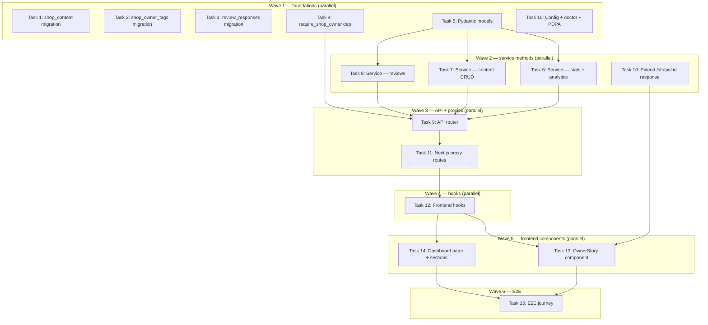

# Owner Dashboard + Shop Story Implementation Plan

> **For Claude:** REQUIRED SUB-SKILL: Use executing-plans to implement this plan task-by-task.

**Design Doc:** [docs/designs/2026-03-27-owner-dashboard-design.md](docs/designs/2026-03-27-owner-dashboard-design.md)

**Spec References:** [SPEC.md](SPEC.md) — auth wall, PDPA cascade, provider abstraction

**PRD References:** [PRD.md](PRD.md) — Section 8 (shop tiers), free claimed tier features

**Goal:** Give verified shop owners a dashboard to view analytics, edit their shop, curate tags, and respond to reviews; add a public-facing shop story section on the detail page.

**Architecture:** Python backend service (`owner_service.py`) handles all analytics aggregation (Supabase + PostHog HogQL), content CRUD, and tag management behind a `require_shop_owner` guard. Next.js proxies forward to backend. Frontend uses SWR hooks. Three new DB tables (`shop_content`, `shop_owner_tags`, `review_responses`).

**Tech Stack:** FastAPI, Pydantic, Supabase (postgres + RLS), PostHog Query API (HogQL), Next.js App Router, SWR, Vitest, pytest

**Acceptance Criteria:**
- [ ] A verified shop owner can visit `/owner/[shopId]/dashboard` and see check-in count, follower count, saves-to-list, and page views for the last 30 days
- [ ] A verified shop owner can write and publish a shop story; the story appears publicly in the "From the Owner" section on the shop detail page
- [ ] A verified shop owner can edit their shop's hours, description, and curate up to 10 taxonomy tags
- [ ] A verified shop owner can read check-in reviews and post one response per review
- [ ] An unauthenticated user visiting `/owner/[shopId]/dashboard` is redirected to login
- [ ] A user without an approved claim for this shop gets a 403 response from all `/owner/*` API endpoints

---

## Prerequisite Check

Before starting any task, verify DEV-45 is merged:

```bash
cd /Users/ytchou/Project/caferoam/.worktrees/feat/dev-21-owner-dashboard
git log --oneline -5  # should see feat(DEV-45) commit
supabase db push       # apply any pending migrations to local
make doctor            # verify local environment is healthy
```

Expected: `shop_claims` table exists, `user_roles` CHECK constraint includes `shop_owner`.

---

## Task 1: Migration — `shop_content` table

**Files:**
- Create: `supabase/migrations/20260327000010_create_shop_content.sql`

**Step 1: Write migration**

```sql
-- supabase/migrations/20260327000010_create_shop_content.sql
CREATE TABLE shop_content (
  id            UUID PRIMARY KEY DEFAULT gen_random_uuid(),
  shop_id       UUID NOT NULL REFERENCES shops(id) ON DELETE CASCADE,
  owner_id      UUID NOT NULL REFERENCES auth.users(id),
  content_type  TEXT NOT NULL DEFAULT 'story'
                  CHECK (content_type IN ('story')),
  title         TEXT,
  body          TEXT NOT NULL,
  photo_url     TEXT,
  is_published  BOOLEAN NOT NULL DEFAULT false,
  created_at    TIMESTAMPTZ NOT NULL DEFAULT now(),
  updated_at    TIMESTAMPTZ NOT NULL DEFAULT now(),
  UNIQUE (shop_id, content_type)
);

ALTER TABLE shop_content ENABLE ROW LEVEL SECURITY;

-- Owner can read/write their own content
CREATE POLICY "owner_manage_content" ON shop_content
  FOR ALL USING (owner_id = auth.uid());

-- Anyone can read published content (no auth required for shop story)
CREATE POLICY "public_read_published_content" ON shop_content
  FOR SELECT USING (is_published = true);

-- Index for fast lookup by shop
CREATE INDEX idx_shop_content_shop_id ON shop_content(shop_id);
```

**Step 2: No test needed** — migration. Verify manually:

```bash
supabase db push
supabase db diff  # should show no pending changes after push
```

**Step 3: Commit**

```bash
git add supabase/migrations/20260327000010_create_shop_content.sql
git commit -m "feat(DEV-21): add shop_content migration"
```

---

## Task 2: Migration — `shop_owner_tags` table

**Files:**
- Create: `supabase/migrations/20260327000011_create_shop_owner_tags.sql`

**Step 1: Write migration**

```sql
-- supabase/migrations/20260327000011_create_shop_owner_tags.sql
CREATE TABLE shop_owner_tags (
  id         UUID PRIMARY KEY DEFAULT gen_random_uuid(),
  shop_id    UUID NOT NULL REFERENCES shops(id) ON DELETE CASCADE,
  owner_id   UUID NOT NULL REFERENCES auth.users(id),
  tag        TEXT NOT NULL,
  created_at TIMESTAMPTZ NOT NULL DEFAULT now(),
  UNIQUE (shop_id, tag)
);

ALTER TABLE shop_owner_tags ENABLE ROW LEVEL SECURITY;

-- Owner can manage their own tags
CREATE POLICY "owner_manage_tags" ON shop_owner_tags
  FOR ALL USING (owner_id = auth.uid());

-- Anyone can read owner tags (shown on shop detail with "confirmed" badge)
CREATE POLICY "public_read_owner_tags" ON shop_owner_tags
  FOR SELECT USING (true);

CREATE INDEX idx_shop_owner_tags_shop_id ON shop_owner_tags(shop_id);
```

**Step 2: No test needed** — migration. Apply with `supabase db push`.

**Step 3: Commit**

```bash
git add supabase/migrations/20260327000011_create_shop_owner_tags.sql
git commit -m "feat(DEV-21): add shop_owner_tags migration"
```

---

## Task 3: Migration — `review_responses` table

**Files:**
- Create: `supabase/migrations/20260327000012_create_review_responses.sql`

**Step 1: Write migration**

```sql
-- supabase/migrations/20260327000012_create_review_responses.sql
CREATE TABLE review_responses (
  id          UUID PRIMARY KEY DEFAULT gen_random_uuid(),
  checkin_id  UUID NOT NULL REFERENCES check_ins(id) ON DELETE CASCADE,
  shop_id     UUID NOT NULL REFERENCES shops(id),
  owner_id    UUID NOT NULL REFERENCES auth.users(id),
  body        TEXT NOT NULL,
  created_at  TIMESTAMPTZ NOT NULL DEFAULT now(),
  UNIQUE (checkin_id)
);

ALTER TABLE review_responses ENABLE ROW LEVEL SECURITY;

-- Owner can manage their responses
CREATE POLICY "owner_manage_responses" ON review_responses
  FOR ALL USING (owner_id = auth.uid());

-- Anyone can read responses
CREATE POLICY "public_read_responses" ON review_responses
  FOR SELECT USING (true);

CREATE INDEX idx_review_responses_shop_id ON review_responses(shop_id);
CREATE INDEX idx_review_responses_checkin_id ON review_responses(checkin_id);
```

**Step 2: No test needed** — migration. Apply with `supabase db push`.

**Step 3: Commit**

```bash
git add supabase/migrations/20260327000012_create_review_responses.sql
git commit -m "feat(DEV-21): add review_responses migration"
```

---

## Task 4: Backend — `require_shop_owner` dependency

**Files:**
- Modify: `backend/api/deps.py`
- Test: `backend/tests/test_deps.py` (create if missing)

**Step 1: Write the failing test**

```python
# backend/tests/test_deps.py (add to existing or create)
import pytest
from unittest.mock import patch, MagicMock
from fastapi import HTTPException
from backend.api.deps import require_shop_owner


class TestRequireShopOwner:
    @pytest.fixture
    def mock_db(self):
        db = MagicMock()
        return db

    def test_verified_owner_passes(self, mock_db):
        """Given a user with an approved claim for this shop, access is granted"""
        mock_db.table.return_value.select.return_value.eq.return_value.eq.return_value.eq.return_value.maybe_single.return_value.execute.return_value.data = {
            "id": "claim-uuid"
        }
        user = {"id": "user-uuid"}
        result = require_shop_owner(
            shop_id="shop-uuid",
            user=user,
            db=mock_db,
        )
        assert result == user

    def test_no_approved_claim_raises_403(self, mock_db):
        """Given a user without an approved claim, access is denied"""
        mock_db.table.return_value.select.return_value.eq.return_value.eq.return_value.eq.return_value.maybe_single.return_value.execute.return_value.data = None
        with pytest.raises(HTTPException) as exc:
            require_shop_owner(
                shop_id="shop-uuid",
                user={"id": "other-user"},
                db=mock_db,
            )
        assert exc.value.status_code == 403

    def test_checks_specific_shop_id(self, mock_db):
        """The claim check is scoped to the specific shop_id, not any shop"""
        mock_db.table.return_value.select.return_value.eq.return_value.eq.return_value.eq.return_value.maybe_single.return_value.execute.return_value.data = None
        with pytest.raises(HTTPException):
            require_shop_owner(
                shop_id="different-shop-uuid",
                user={"id": "user-uuid"},
                db=mock_db,
            )
        # Verify .eq("shop_id", "different-shop-uuid") was called
        first_eq_call = mock_db.table.return_value.select.return_value.eq.call_args_list[0]
        assert first_eq_call.args == ("shop_id", "different-shop-uuid")
```

**Step 2: Run to verify it fails**

```bash
cd /Users/ytchou/Project/caferoam/.worktrees/feat/dev-21-owner-dashboard/backend
pytest tests/test_deps.py -v -k "TestRequireShopOwner"
```

Expected: `ImportError` or `AttributeError` — `require_shop_owner` not yet defined.

**Step 3: Implement**

Add to `backend/api/deps.py` after the `require_admin` function:

```python
def require_shop_owner(
    shop_id: str,
    user: dict[str, Any] = Depends(get_current_user),
    db: Client = Depends(get_admin_db),
) -> dict[str, Any]:
    """Verify user has an approved claim for this specific shop.

    Checks shop_claims directly — the claim is the canonical authorization
    record. Role-only checks are insufficient as one shop_owner could
    access another shop's dashboard. See ADR: 2026-03-27-owner-dashboard-dual-claim-check.md
    """
    result = (
        db.table("shop_claims")
        .select("id")
        .eq("shop_id", shop_id)
        .eq("user_id", user["id"])
        .eq("status", "approved")
        .maybe_single()
        .execute()
    )
    if not result.data:
        raise HTTPException(
            status_code=403,
            detail="Not the verified owner of this shop",
        )
    return user
```

**Step 4: Run to verify it passes**

```bash
pytest tests/test_deps.py -v -k "TestRequireShopOwner"
```

Expected: 3 tests pass.

**Step 5: Commit**

```bash
git add backend/api/deps.py backend/tests/test_deps.py
git commit -m "feat(DEV-21): add require_shop_owner dependency"
```

---

## Task 5: Backend — Pydantic models

**Files:**
- Create: `backend/models/owner.py`

**Step 1: No test needed** — data models have no logic to test independently. Tests in Tasks 6-8 will catch any model issues.

**Step 2: Implement**

```python
# backend/models/owner.py
from __future__ import annotations
from pydantic import BaseModel, Field
from typing import Optional


class OwnerStoryIn(BaseModel):
    title: Optional[str] = None
    body: str = Field(..., min_length=10, max_length=5000)
    photo_url: Optional[str] = None
    is_published: bool = False


class OwnerStoryOut(BaseModel):
    id: str
    shop_id: str
    title: Optional[str]
    body: str
    photo_url: Optional[str]
    is_published: bool
    created_at: str
    updated_at: str


class ShopInfoIn(BaseModel):
    description: Optional[str] = Field(None, max_length=1000)
    opening_hours: Optional[dict] = None
    phone: Optional[str] = None
    website: Optional[str] = None


class OwnerTagsIn(BaseModel):
    tags: list[str] = Field(..., max_length=10)


class ReviewResponseIn(BaseModel):
    body: str = Field(..., min_length=1, max_length=2000)


class ReviewResponseOut(BaseModel):
    id: str
    checkin_id: str
    body: str
    created_at: str


class DashboardStats(BaseModel):
    checkin_count_30d: int
    follower_count: int
    saves_count_30d: int
    page_views_30d: int


class SearchInsight(BaseModel):
    query: str
    impressions: int


class CommunityPulseTag(BaseModel):
    tag: str
    count: int


class DistrictRanking(BaseModel):
    attribute: str
    rank: int
    total_in_district: int


class DashboardAnalytics(BaseModel):
    search_insights: list[SearchInsight]
    community_pulse: list[CommunityPulseTag]
    district_rankings: list[DistrictRanking]
```

**Step 3: Commit**

```bash
git add backend/models/owner.py
git commit -m "feat(DEV-21): add owner dashboard Pydantic models"
```

---

## Task 6: Backend service — stats + analytics

**Files:**
- Create: `backend/services/owner_service.py` (partial — stats + analytics methods only)
- Test: `backend/tests/test_owner_service.py`

Check first: does `backend/providers/analytics/` exist? If yes, use its protocol for PostHog queries. If no, add a `_query_posthog(hogql: str) -> list[dict]` private method that calls the PostHog Query API directly via `httpx`.

**Step 1: Write the failing tests**

```python
# backend/tests/test_owner_service.py
import pytest
from unittest.mock import patch, MagicMock, AsyncMock
from backend.services.owner_service import OwnerService


SHOP_ID = "550e8400-e29b-41d4-a716-446655440000"


class TestGetDashboardStats:
    @pytest.fixture
    def mock_db(self):
        return MagicMock()

    def test_returns_aggregate_counts(self, mock_db):
        """Given an active shop, dashboard stats aggregate from Supabase tables"""
        # Mock check-in count
        mock_db.table.return_value.select.return_value.eq.return_value.gte.return_value.execute.return_value.count = 42
        svc = OwnerService(db=mock_db)

        with patch.object(svc, "_get_page_views", return_value=150):
            stats = svc.get_dashboard_stats(SHOP_ID)

        assert stats.checkin_count_30d == 42
        assert stats.page_views_30d == 150

    def test_page_views_defaults_to_zero_on_posthog_error(self, mock_db):
        """Given PostHog is unavailable, page views gracefully returns 0"""
        svc = OwnerService(db=mock_db)

        with patch.object(svc, "_get_page_views", side_effect=Exception("PostHog timeout")):
            stats = svc.get_dashboard_stats(SHOP_ID)

        assert stats.page_views_30d == 0


class TestGetSearchInsights:
    def test_returns_top_queries(self):
        """Owner sees which search terms surfaced their shop in last 30 days"""
        mock_db = MagicMock()
        svc = OwnerService(db=mock_db)

        mock_insights = [
            {"query": "安靜工作空間", "impressions": 28},
            {"query": "寵物友善咖啡", "impressions": 15},
        ]
        with patch.object(svc, "_query_posthog", return_value=mock_insights):
            result = svc.get_search_insights(SHOP_ID)

        assert len(result) == 2
        assert result[0].query == "安靜工作空間"
        assert result[0].impressions == 28

    def test_returns_empty_list_when_no_data(self):
        """If no search impressions yet, returns empty list (not error)"""
        mock_db = MagicMock()
        svc = OwnerService(db=mock_db)

        with patch.object(svc, "_query_posthog", return_value=[]):
            result = svc.get_search_insights(SHOP_ID)

        assert result == []


class TestGetCommunityPulse:
    def test_returns_anonymized_tag_counts(self):
        """Community pulse shows tag frequencies — no user attribution"""
        mock_db = MagicMock()
        mock_db.table.return_value.select.return_value.eq.return_value.gte.return_value.execute.return_value.data = [
            {"tags": ["安靜", "插座充足"]},
            {"tags": ["安靜", "寵物友善"]},
        ]
        svc = OwnerService(db=mock_db)
        result = svc.get_community_pulse(SHOP_ID)

        tag_map = {r.tag: r.count for r in result}
        assert tag_map["安靜"] == 2
        assert tag_map["插座充足"] == 1
        # No user IDs or names in result
        for item in result:
            assert not hasattr(item, "user_id")
```

**Step 2: Run to verify they fail**

```bash
cd backend && pytest tests/test_owner_service.py -v
```

Expected: `ModuleNotFoundError` — `owner_service` not yet created.

**Step 3: Implement (stats + analytics methods)**

```python
# backend/services/owner_service.py
from __future__ import annotations
import logging
import httpx
from collections import Counter
from typing import Any
from supabase import Client
from backend.config import settings
from backend.models.owner import (
    DashboardStats, SearchInsight, CommunityPulseTag, DistrictRanking,
    OwnerStoryOut, OwnerStoryIn, ShopInfoIn, ReviewResponseOut, ReviewResponseIn,
)
from backend.utils.helpers import first

logger = logging.getLogger(__name__)

_POSTHOG_QUERY_URL = "https://us.posthog.com/api/projects/{project_id}/query/"


class OwnerService:
    def __init__(self, db: Client) -> None:
        self._db = db

    # ── Stats ──────────────────────────────────────────────────────────────

    def get_dashboard_stats(self, shop_id: str) -> DashboardStats:
        """Aggregate check-ins, followers, saves, page views for last 30 days."""
        from datetime import datetime, timedelta, timezone
        cutoff = (datetime.now(timezone.utc) - timedelta(days=30)).isoformat()

        checkin_count = (
            self._db.table("check_ins")
            .select("id", count="exact")
            .eq("shop_id", shop_id)
            .gte("created_at", cutoff)
            .execute()
            .count or 0
        )
        follower_count = (
            self._db.table("shop_followers")
            .select("id", count="exact")
            .eq("shop_id", shop_id)
            .execute()
            .count or 0
        )
        saves_count = (
            self._db.table("list_items")
            .select("id", count="exact")
            .eq("shop_id", shop_id)
            .gte("created_at", cutoff)
            .execute()
            .count or 0
        )
        try:
            page_views = self._get_page_views(shop_id)
        except Exception:
            logger.warning("PostHog page views unavailable for shop %s", shop_id)
            page_views = 0

        return DashboardStats(
            checkin_count_30d=checkin_count,
            follower_count=follower_count,
            saves_count_30d=saves_count,
            page_views_30d=page_views,
        )

    def _get_page_views(self, shop_id: str) -> int:
        rows = self._query_posthog(
            f"SELECT count() as views FROM events "
            f"WHERE event = '$pageview' "
            f"AND properties.$current_url LIKE '%/shops/{shop_id}%' "
            f"AND timestamp >= now() - interval 30 day"
        )
        return int(rows[0]["views"]) if rows else 0

    # ── Analytics ──────────────────────────────────────────────────────────

    def get_search_insights(self, shop_id: str) -> list[SearchInsight]:
        rows = self._query_posthog(
            f"SELECT properties.query as query, count() as impressions "
            f"FROM events "
            f"WHERE event = 'search_result_shown' "
            f"AND JSONExtractArrayRaw(properties.shop_ids, 0) LIKE '%{shop_id}%' "
            f"AND timestamp >= now() - interval 30 day "
            f"GROUP BY query ORDER BY impressions DESC LIMIT 10"
        )
        return [SearchInsight(query=r["query"], impressions=int(r["impressions"])) for r in rows]

    def get_community_pulse(self, shop_id: str) -> list[CommunityPulseTag]:
        from datetime import datetime, timedelta, timezone
        cutoff = (datetime.now(timezone.utc) - timedelta(days=30)).isoformat()

        result = (
            self._db.table("check_ins")
            .select("tags")
            .eq("shop_id", shop_id)
            .gte("created_at", cutoff)
            .execute()
        )
        all_tags: list[str] = []
        for row in (result.data or []):
            all_tags.extend(row.get("tags") or [])

        counter = Counter(all_tags)
        return [
            CommunityPulseTag(tag=tag, count=count)
            for tag, count in counter.most_common(10)
        ]

    def get_ranking(self, shop_id: str) -> list[DistrictRanking]:
        """Compute relative rank in district by top 3 attributes."""
        shop = (
            self._db.table("shops")
            .select("district, mode_work, mode_rest, mode_social")
            .eq("id", shop_id)
            .single()
            .execute()
        )
        if not shop.data:
            return []

        district = shop.data["district"]
        peers = (
            self._db.table("shops")
            .select("id, mode_work, mode_rest, mode_social")
            .eq("district", district)
            .execute()
        )
        attrs = ["mode_work", "mode_rest", "mode_social"]
        labels = {"mode_work": "工作", "mode_rest": "休息", "mode_social": "社交"}
        rankings = []
        for attr in attrs:
            scores = sorted(
                [(r["id"], r.get(attr) or 0) for r in (peers.data or [])],
                key=lambda x: x[1],
                reverse=True,
            )
            rank = next((i + 1 for i, (sid, _) in enumerate(scores) if sid == shop_id), None)
            if rank:
                rankings.append(DistrictRanking(
                    attribute=labels[attr],
                    rank=rank,
                    total_in_district=len(scores),
                ))
        return sorted(rankings, key=lambda r: r.rank)[:3]

    # ── PostHog HogQL helper ───────────────────────────────────────────────

    def _query_posthog(self, hogql: str) -> list[dict[str, Any]]:
        """Execute a HogQL query against PostHog Query API."""
        if not settings.posthog_api_key or not settings.posthog_project_id:
            logger.warning("PostHog not configured — skipping query")
            return []

        url = _POSTHOG_QUERY_URL.format(project_id=settings.posthog_project_id)
        resp = httpx.post(
            url,
            headers={"Authorization": f"Bearer {settings.posthog_api_key}"},
            json={"query": {"kind": "HogQLQuery", "query": hogql}},
            timeout=10.0,
        )
        resp.raise_for_status()
        data = resp.json()
        columns = data["columns"]
        return [dict(zip(columns, row)) for row in data["results"]]
```

**Step 4: Run to verify tests pass**

```bash
cd backend && pytest tests/test_owner_service.py -v -k "Stats or Insights or Pulse"
```

Expected: 5 tests pass.

**Step 5: Commit**

```bash
git add backend/services/owner_service.py backend/tests/test_owner_service.py
git commit -m "feat(DEV-21): owner service — stats and analytics"
```

---

## Task 7: Backend service — content CRUD (story, info, tags)

**Files:**
- Modify: `backend/services/owner_service.py` (add content methods)
- Modify: `backend/tests/test_owner_service.py` (add content tests)

**Step 1: Write the failing tests**

```python
# Add to backend/tests/test_owner_service.py

class TestShopStory:
    def test_upsert_creates_new_story(self):
        """Owner publishes a shop story for the first time"""
        mock_db = MagicMock()
        mock_db.table.return_value.upsert.return_value.execute.return_value.data = [{
            "id": "content-uuid",
            "shop_id": SHOP_ID,
            "owner_id": "owner-uuid",
            "content_type": "story",
            "title": "Our Story",
            "body": "我們的咖啡館誕生於2019年的大稻埕老街。",
            "photo_url": None,
            "is_published": True,
            "created_at": "2026-03-27T00:00:00Z",
            "updated_at": "2026-03-27T00:00:00Z",
        }]
        svc = OwnerService(db=mock_db)
        story_in = OwnerStoryIn(
            title="Our Story",
            body="我們的咖啡館誕生於2019年的大稻埕老街。",
            is_published=True,
        )
        result = svc.upsert_shop_story(SHOP_ID, "owner-uuid", story_in)

        assert result.is_published is True
        assert result.body == "我們的咖啡館誕生於2019年的大稻埕老街。"

    def test_get_story_returns_none_when_not_found(self):
        """get_shop_story returns None if no published story exists"""
        mock_db = MagicMock()
        mock_db.table.return_value.select.return_value.eq.return_value.eq.return_value.maybe_single.return_value.execute.return_value.data = None
        svc = OwnerService(db=mock_db)

        result = svc.get_shop_story(SHOP_ID)
        assert result is None


class TestOwnerTags:
    def test_update_tags_replaces_entire_set(self):
        """Updating owner tags replaces the full set — no partial updates"""
        mock_db = MagicMock()
        mock_db.table.return_value.delete.return_value.eq.return_value.execute.return_value = MagicMock()
        mock_db.table.return_value.insert.return_value.execute.return_value.data = [
            {"id": "t1", "shop_id": SHOP_ID, "owner_id": "owner-uuid", "tag": "安靜工作空間", "created_at": "2026-03-27T00:00:00Z"},
        ]
        svc = OwnerService(db=mock_db)
        result = svc.update_owner_tags(SHOP_ID, "owner-uuid", ["安靜工作空間"])

        assert len(result) == 1
        assert result[0] == "安靜工作空間"

    def test_update_tags_enforces_max_10(self):
        """Attempting to set more than 10 tags raises ValueError"""
        mock_db = MagicMock()
        svc = OwnerService(db=mock_db)
        tags = [f"tag{i}" for i in range(11)]

        with pytest.raises(ValueError, match="maximum 10 tags"):
            svc.update_owner_tags(SHOP_ID, "owner-uuid", tags)
```

**Step 2: Run to verify they fail**

```bash
cd backend && pytest tests/test_owner_service.py -v -k "Story or Tags"
```

Expected: 4 tests fail — methods not yet implemented.

**Step 3: Add methods to `owner_service.py`**

```python
    # ── Shop Story ─────────────────────────────────────────────────────────

    def get_shop_story(self, shop_id: str) -> OwnerStoryOut | None:
        result = (
            self._db.table("shop_content")
            .select("*")
            .eq("shop_id", shop_id)
            .eq("content_type", "story")
            .maybe_single()
            .execute()
        )
        if not result.data:
            return None
        return OwnerStoryOut(**result.data)

    def upsert_shop_story(
        self, shop_id: str, owner_id: str, data: OwnerStoryIn
    ) -> OwnerStoryOut:
        from datetime import datetime, timezone
        now = datetime.now(timezone.utc).isoformat()
        row = {
            "shop_id": shop_id,
            "owner_id": owner_id,
            "content_type": "story",
            "title": data.title,
            "body": data.body,
            "photo_url": data.photo_url,
            "is_published": data.is_published,
            "updated_at": now,
        }
        result = (
            self._db.table("shop_content")
            .upsert(row, on_conflict="shop_id,content_type")
            .execute()
        )
        return OwnerStoryOut(**first(result.data, "upsert shop_content"))

    # ── Shop Info ──────────────────────────────────────────────────────────

    def update_shop_info(self, shop_id: str, owner_id: str, data: ShopInfoIn) -> dict:
        updates = {k: v for k, v in data.model_dump().items() if v is not None}
        result = (
            self._db.table("shops")
            .update(updates)
            .eq("id", shop_id)
            .execute()
        )
        return first(result.data, "update shop info")

    # ── Owner Tags ─────────────────────────────────────────────────────────

    def get_owner_tags(self, shop_id: str) -> list[str]:
        result = (
            self._db.table("shop_owner_tags")
            .select("tag")
            .eq("shop_id", shop_id)
            .order("created_at")
            .execute()
        )
        return [row["tag"] for row in (result.data or [])]

    def update_owner_tags(
        self, shop_id: str, owner_id: str, tags: list[str]
    ) -> list[str]:
        if len(tags) > 10:
            raise ValueError(f"Shop owners may set a maximum 10 tags; got {len(tags)}")

        # Replace entire set atomically: delete then insert
        self._db.table("shop_owner_tags").delete().eq("shop_id", shop_id).execute()

        if not tags:
            return []

        rows = [
            {"shop_id": shop_id, "owner_id": owner_id, "tag": tag}
            for tag in tags
        ]
        self._db.table("shop_owner_tags").insert(rows).execute()
        return tags
```

**Step 4: Run to verify tests pass**

```bash
cd backend && pytest tests/test_owner_service.py -v -k "Story or Tags"
```

Expected: 4 tests pass.

**Step 5: Commit**

```bash
git add backend/services/owner_service.py backend/tests/test_owner_service.py
git commit -m "feat(DEV-21): owner service — content CRUD and tags"
```

---

## Task 8: Backend service — reviews + responses

**Files:**
- Modify: `backend/services/owner_service.py` (add review methods)
- Modify: `backend/tests/test_owner_service.py` (add review tests)

**Step 1: Write the failing tests**

```python
# Add to backend/tests/test_owner_service.py

class TestReviews:
    def test_get_reviews_returns_checkins_with_notes(self):
        """Owner sees all check-in reviews for their shop, paginated"""
        mock_db = MagicMock()
        mock_db.table.return_value.select.return_value.eq.return_value.not_.return_value.is_.return_value.order.return_value.range.return_value.execute.return_value.data = [
            {"id": "ci-1", "note": "超棒的咖啡！", "created_at": "2026-03-27T10:00:00Z",
             "review_responses": []},
        ]
        svc = OwnerService(db=mock_db)
        result = svc.get_reviews(SHOP_ID, page=1)

        assert len(result) == 1
        assert result[0]["id"] == "ci-1"

    def test_upsert_review_response_prevents_duplicate(self):
        """One response per review — upsert replaces rather than duplicates"""
        mock_db = MagicMock()
        mock_db.table.return_value.upsert.return_value.execute.return_value.data = [{
            "id": "rr-1",
            "checkin_id": "ci-1",
            "body": "感謝您的到來！",
            "created_at": "2026-03-27T11:00:00Z",
        }]
        svc = OwnerService(db=mock_db)
        result = svc.upsert_review_response(
            checkin_id="ci-1",
            shop_id=SHOP_ID,
            owner_id="owner-uuid",
            body="感謝您的到來！",
        )
        assert result.body == "感謝您的到來！"

        # Verify upsert (not insert) was used — UNIQUE(checkin_id) enforces one per review
        mock_db.table.return_value.upsert.assert_called_once()
```

**Step 2: Run to verify they fail**

```bash
cd backend && pytest tests/test_owner_service.py -v -k "Reviews"
```

Expected: 2 tests fail.

**Step 3: Add methods to `owner_service.py`**

```python
    # ── Reviews ────────────────────────────────────────────────────────────

    def get_reviews(self, shop_id: str, page: int = 1) -> list[dict]:
        limit = 20
        offset = (page - 1) * limit
        result = (
            self._db.table("check_ins")
            .select("id, note, rating, created_at, review_responses(id, body, created_at)")
            .eq("shop_id", shop_id)
            .not_.is_("note", "null")
            .order("created_at", desc=True)
            .range(offset, offset + limit - 1)
            .execute()
        )
        return result.data or []

    def upsert_review_response(
        self, checkin_id: str, shop_id: str, owner_id: str, body: str
    ) -> ReviewResponseOut:
        row = {
            "checkin_id": checkin_id,
            "shop_id": shop_id,
            "owner_id": owner_id,
            "body": body,
        }
        result = (
            self._db.table("review_responses")
            .upsert(row, on_conflict="checkin_id")
            .execute()
        )
        data = first(result.data, "upsert review_response")
        return ReviewResponseOut(**data)
```

**Step 4: Run to verify tests pass**

```bash
cd backend && pytest tests/test_owner_service.py -v
```

Expected: all tests in file pass. Check coverage:

```bash
pytest tests/test_owner_service.py --cov=backend/services/owner_service --cov-report=term-missing
```

Expected: ≥80% coverage.

**Step 5: Commit**

```bash
git add backend/services/owner_service.py backend/tests/test_owner_service.py
git commit -m "feat(DEV-21): owner service — reviews and responses"
```

---

## Task 9: Backend API router

**Files:**
- Create: `backend/api/owner.py`
- Modify: `backend/main.py` (register router)
- Test: `backend/tests/test_owner_api.py`

**Note on `settings.posthog_api_key` and `settings.posthog_project_id`:** Check `backend/config.py` — if these fields don't exist, add them (Optional[str] = None). Also add to `.env.example` and `scripts/doctor.sh`.

**Step 1: Write the failing tests**

```python
# backend/tests/test_owner_api.py
import pytest
from unittest.mock import patch, MagicMock
from fastapi.testclient import TestClient
from backend.main import app
from backend.api.deps import get_current_user, require_shop_owner, get_admin_db


SHOP_ID = "550e8400-e29b-41d4-a716-446655440000"
OWNER = {"id": "owner-uuid"}


@pytest.fixture
def auth_client():
    """Test client authenticated as a verified shop owner."""
    app.dependency_overrides[get_current_user] = lambda: OWNER
    app.dependency_overrides[require_shop_owner] = lambda: OWNER
    yield TestClient(app)
    app.dependency_overrides.clear()


@pytest.fixture
def unauth_client():
    """Test client with no auth."""
    yield TestClient(app)


class TestDashboardEndpoints:
    def test_get_dashboard_requires_auth(self, unauth_client):
        """Unauthenticated request to owner dashboard returns 401"""
        resp = unauth_client.get(f"/owner/{SHOP_ID}/dashboard")
        assert resp.status_code == 401

    def test_get_dashboard_returns_stats(self, auth_client):
        """Verified owner gets dashboard stats"""
        mock_stats = MagicMock()
        mock_stats.model_dump.return_value = {
            "checkin_count_30d": 15,
            "follower_count": 47,
            "saves_count_30d": 8,
            "page_views_30d": 230,
        }
        with patch("backend.api.owner.get_owner_service") as mock_svc_factory:
            mock_svc = mock_svc_factory.return_value
            mock_svc.get_dashboard_stats.return_value = mock_stats
            resp = auth_client.get(f"/owner/{SHOP_ID}/dashboard")

        assert resp.status_code == 200
        assert resp.json()["checkin_count_30d"] == 15

    def test_put_story_saves_and_returns_story(self, auth_client):
        """Owner publishes a story; endpoint returns saved story"""
        mock_story = MagicMock()
        mock_story.model_dump.return_value = {
            "id": "content-uuid",
            "shop_id": SHOP_ID,
            "title": "Our Story",
            "body": "從大稻埕起步的故事。",
            "photo_url": None,
            "is_published": True,
            "created_at": "2026-03-27T00:00:00Z",
            "updated_at": "2026-03-27T00:00:00Z",
        }
        with patch("backend.api.owner.get_owner_service") as mock_svc_factory:
            mock_svc = mock_svc_factory.return_value
            mock_svc.upsert_shop_story.return_value = mock_story
            resp = auth_client.put(
                f"/owner/{SHOP_ID}/story",
                json={"body": "從大稻埕起步的故事。", "is_published": True},
            )

        assert resp.status_code == 200
        assert resp.json()["is_published"] is True
```

**Step 2: Run to verify they fail**

```bash
cd backend && pytest tests/test_owner_api.py -v
```

Expected: `ImportError` or routing errors — router not yet created.

**Step 3: Implement router**

```python
# backend/api/owner.py
from fastapi import APIRouter, Depends, Query
from backend.api.deps import get_current_user, require_shop_owner, get_admin_db
from backend.models.owner import (
    OwnerStoryIn, ShopInfoIn, OwnerTagsIn, ReviewResponseIn,
)
from backend.services.owner_service import OwnerService
from supabase import Client


router = APIRouter(prefix="/owner", tags=["owner"])


def get_owner_service(db: Client = Depends(get_admin_db)) -> OwnerService:
    return OwnerService(db=db)


@router.get("/{shop_id}/dashboard")
async def get_dashboard(
    shop_id: str,
    user: dict = Depends(require_shop_owner),
    svc: OwnerService = Depends(get_owner_service),
):
    return svc.get_dashboard_stats(shop_id).model_dump()


@router.get("/{shop_id}/analytics")
async def get_analytics(
    shop_id: str,
    user: dict = Depends(require_shop_owner),
    svc: OwnerService = Depends(get_owner_service),
):
    return {
        "search_insights": [i.model_dump() for i in svc.get_search_insights(shop_id)],
        "community_pulse": [p.model_dump() for p in svc.get_community_pulse(shop_id)],
        "district_rankings": [r.model_dump() for r in svc.get_ranking(shop_id)],
    }


@router.get("/{shop_id}/story")
async def get_story(
    shop_id: str,
    user: dict = Depends(require_shop_owner),
    svc: OwnerService = Depends(get_owner_service),
):
    story = svc.get_shop_story(shop_id)
    return story.model_dump() if story else None


@router.put("/{shop_id}/story")
async def upsert_story(
    shop_id: str,
    body: OwnerStoryIn,
    user: dict = Depends(require_shop_owner),
    svc: OwnerService = Depends(get_owner_service),
):
    return svc.upsert_shop_story(shop_id, user["id"], body).model_dump()


@router.patch("/{shop_id}/info")
async def update_info(
    shop_id: str,
    body: ShopInfoIn,
    user: dict = Depends(require_shop_owner),
    svc: OwnerService = Depends(get_owner_service),
):
    return svc.update_shop_info(shop_id, user["id"], body)


@router.get("/{shop_id}/tags")
async def get_tags(
    shop_id: str,
    user: dict = Depends(require_shop_owner),
    svc: OwnerService = Depends(get_owner_service),
):
    return {"tags": svc.get_owner_tags(shop_id)}


@router.put("/{shop_id}/tags")
async def update_tags(
    shop_id: str,
    body: OwnerTagsIn,
    user: dict = Depends(require_shop_owner),
    svc: OwnerService = Depends(get_owner_service),
):
    return {"tags": svc.update_owner_tags(shop_id, user["id"], body.tags)}


@router.get("/{shop_id}/reviews")
async def get_reviews(
    shop_id: str,
    page: int = Query(default=1, ge=1),
    user: dict = Depends(require_shop_owner),
    svc: OwnerService = Depends(get_owner_service),
):
    return {"reviews": svc.get_reviews(shop_id, page=page)}


@router.post("/{shop_id}/reviews/{checkin_id}/response")
async def upsert_response(
    shop_id: str,
    checkin_id: str,
    body: ReviewResponseIn,
    user: dict = Depends(require_shop_owner),
    svc: OwnerService = Depends(get_owner_service),
):
    return svc.upsert_review_response(
        checkin_id=checkin_id,
        shop_id=shop_id,
        owner_id=user["id"],
        body=body.body,
    ).model_dump()
```

Register in `backend/main.py`:

```python
from backend.api.owner import router as owner_router
# Add after profile_router:
app.include_router(owner_router)
```

**Step 4: Run to verify tests pass**

```bash
cd backend && pytest tests/test_owner_api.py -v
```

Expected: all tests pass.

**Step 5: Commit**

```bash
git add backend/api/owner.py backend/main.py backend/tests/test_owner_api.py
git commit -m "feat(DEV-21): owner API router with 9 endpoints"
```

---

## Task 10: Extend `/shops/{id}` with `ownerStory`

**Files:**
- Modify: `backend/api/shops.py` (add ownerStory to shop detail response)
- Modify: `backend/tests/test_shops_api.py` (add ownerStory assertion)

**Step 1: Write the failing test**

```python
# Add to backend/tests/test_shops_api.py

def test_shop_detail_includes_owner_story_when_published():
    """Shop detail response includes ownerStory when story is published"""
    # Existing test fixtures — add ownerStory to mock response
    # The shop detail should return: { ..., "ownerStory": {"body": "...", ...} }
    # Check existing test file to see exact fixture structure and add assertion:
    #   assert "ownerStory" in resp.json()
```

Read `backend/tests/test_shops_api.py` first to understand existing fixture patterns, then add assertion.

**Step 2: Modify `backend/api/shops.py`**

In the `GET /shops/{shop_id}` handler, add a join to `shop_content`:

```python
# In the shops query, extend the SELECT to include:
.select("*, shop_content(id, title, body, photo_url, is_published, updated_at)")
# Then in the response shape, extract:
owner_story = None
content_rows = shop_data.get("shop_content") or []
for row in content_rows:
    if row.get("content_type") == "story" and row.get("is_published"):
        owner_story = row
        break
# Add to response dict:
response["ownerStory"] = owner_story
```

**Step 3: Run tests and commit**

```bash
cd backend && pytest tests/test_shops_api.py -v
git add backend/api/shops.py backend/tests/test_shops_api.py
git commit -m "feat(DEV-21): include ownerStory in shop detail response"
```

---

## Task 11: Next.js proxy routes for owner endpoints

**Files:**
- Create: `app/api/owner/[shopId]/dashboard/route.ts`
- Create: `app/api/owner/[shopId]/analytics/route.ts`
- Create: `app/api/owner/[shopId]/story/route.ts`
- Create: `app/api/owner/[shopId]/info/route.ts`
- Create: `app/api/owner/[shopId]/tags/route.ts`
- Create: `app/api/owner/[shopId]/reviews/route.ts`
- Create: `app/api/owner/[shopId]/reviews/[checkinId]/response/route.ts`

**Step 1: No new test needed** — proxy routes are thin forwarders. The backend tests cover the API logic.

**Step 2: Implement (follow pattern from `app/api/claims/route.ts`)**

Check `app/api/claims/route.ts` or `app/api/lists/route.ts` for the exact proxy pattern. All owner routes follow the same shape:

```typescript
// app/api/owner/[shopId]/dashboard/route.ts
import { proxyToBackend } from '@/lib/api/proxy';
import { NextRequest } from 'next/server';

export async function GET(
  req: NextRequest,
  { params }: { params: { shopId: string } }
) {
  return proxyToBackend(req, `/owner/${params.shopId}/dashboard`);
}
```

For story (GET + PUT):
```typescript
// app/api/owner/[shopId]/story/route.ts
export async function GET(req: NextRequest, { params }: ...) {
  return proxyToBackend(req, `/owner/${params.shopId}/story`);
}
export async function PUT(req: NextRequest, { params }: ...) {
  return proxyToBackend(req, `/owner/${params.shopId}/story`, { method: 'PUT' });
}
```

Create all 7 route files following this pattern. Read `lib/api/proxy.ts` first to understand the `proxyToBackend` signature.

**Step 3: Commit**

```bash
git add app/api/owner/
git commit -m "feat(DEV-21): Next.js proxy routes for owner API"
```

---

## Task 12: Frontend hooks

**Files:**
- Create: `lib/hooks/use-owner-dashboard.ts`
- Create: `lib/hooks/use-owner-content.ts`
- Create: `lib/hooks/use-owner-reviews.ts`
- Test: `lib/hooks/__tests__/use-owner-dashboard.test.ts`

**Step 1: Write the failing tests**

```typescript
// lib/hooks/__tests__/use-owner-dashboard.test.ts
import { renderHook, waitFor } from '@testing-library/react';
import { describe, it, expect, vi, beforeEach } from 'vitest';
import { useOwnerDashboard } from '../use-owner-dashboard';

// Mock SWR at the boundary
vi.mock('swr', () => ({
  default: vi.fn(),
}));

import useSWR from 'swr';
const mockUseSWR = vi.mocked(useSWR);

describe('useOwnerDashboard', () => {
  beforeEach(() => vi.clearAllMocks());

  it('returns stats when data is available', () => {
    mockUseSWR.mockReturnValue({
      data: { checkin_count_30d: 15, follower_count: 47, saves_count_30d: 8, page_views_30d: 230 },
      isLoading: false,
      error: undefined,
      mutate: vi.fn(),
    } as any);

    const { result } = renderHook(() =>
      useOwnerDashboard('550e8400-e29b-41d4-a716-446655440000')
    );
    expect(result.current.stats?.checkin_count_30d).toBe(15);
    expect(result.current.isLoading).toBe(false);
  });

  it('exposes isLoading while fetching', () => {
    mockUseSWR.mockReturnValue({
      data: undefined, isLoading: true, error: undefined, mutate: vi.fn(),
    } as any);

    const { result } = renderHook(() => useOwnerDashboard('shop-id'));
    expect(result.current.isLoading).toBe(true);
    expect(result.current.stats).toBeUndefined();
  });
});
```

**Step 2: Run to verify they fail**

```bash
cd /Users/ytchou/Project/caferoam/.worktrees/feat/dev-21-owner-dashboard
pnpm test -- lib/hooks/__tests__/use-owner-dashboard.test.ts
```

Expected: cannot find module `../use-owner-dashboard`.

**Step 3: Implement hooks**

```typescript
// lib/hooks/use-owner-dashboard.ts
import useSWR from 'swr';
import { fetchWithAuth } from '@/lib/api/fetcher';

interface DashboardStats {
  checkin_count_30d: number;
  follower_count: number;
  saves_count_30d: number;
  page_views_30d: number;
}

export function useOwnerDashboard(shopId: string) {
  const { data: stats, isLoading, error, mutate } = useSWR<DashboardStats>(
    shopId ? `/api/owner/${shopId}/dashboard` : null,
    fetchWithAuth,
  );
  return { stats, isLoading, error, mutate };
}
```

```typescript
// lib/hooks/use-owner-content.ts
import useSWR from 'swr';
import { useCallback } from 'react';
import { fetchWithAuth } from '@/lib/api/fetcher';

interface OwnerStory {
  id: string;
  title: string | null;
  body: string;
  photo_url: string | null;
  is_published: boolean;
  updated_at: string;
}

export function useOwnerContent(shopId: string) {
  const { data: story, isLoading, mutate } = useSWR<OwnerStory | null>(
    shopId ? `/api/owner/${shopId}/story` : null,
    fetchWithAuth,
  );
  const { data: tagsData, mutate: mutateTags } = useSWR<{ tags: string[] }>(
    shopId ? `/api/owner/${shopId}/tags` : null,
    fetchWithAuth,
  );

  const saveStory = useCallback(async (data: Partial<OwnerStory>) => {
    const prev = story;
    mutate({ ...prev, ...data } as OwnerStory, false);
    try {
      await fetchWithAuth(`/api/owner/${shopId}/story`, {
        method: 'PUT',
        body: JSON.stringify(data),
      });
      mutate();
    } catch (err) {
      mutate(prev, false);
      throw err;
    }
  }, [shopId, story, mutate]);

  const saveTags = useCallback(async (tags: string[]) => {
    await fetchWithAuth(`/api/owner/${shopId}/tags`, {
      method: 'PUT',
      body: JSON.stringify({ tags }),
    });
    mutateTags();
  }, [shopId, mutateTags]);

  return {
    story: story ?? null,
    tags: tagsData?.tags ?? [],
    isLoading,
    saveStory,
    saveTags,
  };
}
```

```typescript
// lib/hooks/use-owner-reviews.ts
import useSWR from 'swr';
import { useCallback } from 'react';
import { fetchWithAuth } from '@/lib/api/fetcher';

export function useOwnerReviews(shopId: string, page = 1) {
  const { data, isLoading, mutate } = useSWR<{ reviews: unknown[] }>(
    shopId ? `/api/owner/${shopId}/reviews?page=${page}` : null,
    fetchWithAuth,
  );

  const postResponse = useCallback(async (checkinId: string, body: string) => {
    await fetchWithAuth(`/api/owner/${shopId}/reviews/${checkinId}/response`, {
      method: 'POST',
      body: JSON.stringify({ body }),
    });
    mutate();
  }, [shopId, mutate]);

  return {
    reviews: data?.reviews ?? [],
    isLoading,
    postResponse,
  };
}
```

**Step 4: Run to verify tests pass**

```bash
pnpm test -- lib/hooks/__tests__/use-owner-dashboard.test.ts
```

Expected: 2 tests pass.

**Step 5: Commit**

```bash
git add lib/hooks/use-owner-dashboard.ts lib/hooks/use-owner-content.ts lib/hooks/use-owner-reviews.ts lib/hooks/__tests__/use-owner-dashboard.test.ts
git commit -m "feat(DEV-21): owner dashboard SWR hooks"
```

---

## Task 13: `OwnerStory` component (shop detail page)

**Files:**
- Create: `components/shops/owner-story.tsx`
- Modify: `app/shops/[shopId]/[slug]/shop-detail-client.tsx`
- Test: `components/shops/__tests__/owner-story.test.tsx`

**Step 1: Write the failing tests**

```typescript
// components/shops/__tests__/owner-story.test.tsx
import { render, screen } from '@testing-library/react';
import { describe, it, expect } from 'vitest';
import { OwnerStory } from '../owner-story';

describe('OwnerStory', () => {
  const story = {
    id: 'c1',
    title: null,
    body: '我們從2019年在大稻埕開始這段旅程。',
    photo_url: null,
    is_published: true,
    updated_at: '2026-03-27T00:00:00Z',
  };

  it('renders story body when story is published', () => {
    render(<OwnerStory story={story} shopId="shop-1" isOwner={false} />);
    expect(screen.getByText('我們從2019年在大稻埕開始這段旅程。')).toBeTruthy();
    expect(screen.getByText('From the Owner')).toBeTruthy();
  });

  it('renders nothing when story is null', () => {
    const { container } = render(
      <OwnerStory story={null} shopId="shop-1" isOwner={false} />
    );
    expect(container.firstChild).toBeNull();
  });

  it('shows edit CTA for verified owner viewing their shop', () => {
    render(<OwnerStory story={story} shopId="shop-1" isOwner={true} />);
    expect(screen.getByText(/edit your story/i)).toBeTruthy();
  });

  it('hides story when is_published is false', () => {
    const draft = { ...story, is_published: false };
    const { container } = render(
      <OwnerStory story={draft} shopId="shop-1" isOwner={false} />
    );
    expect(container.firstChild).toBeNull();
  });
});
```

**Step 2: Run to verify they fail**

```bash
pnpm test -- components/shops/__tests__/owner-story.test.tsx
```

Expected: cannot find module `../owner-story`.

**Step 3: Implement component**

```typescript
// components/shops/owner-story.tsx
import Link from 'next/link';

interface Story {
  id: string;
  title: string | null;
  body: string;
  photo_url: string | null;
  is_published: boolean;
}

interface Props {
  story: Story | null;
  shopId: string;
  isOwner: boolean;
}

export function OwnerStory({ story, shopId, isOwner }: Props) {
  if (!story || !story.is_published) return null;

  return (
    <section className="px-4 py-5">
      <div className="flex items-center justify-between mb-3">
        <h3 className="text-sm font-semibold text-muted-foreground uppercase tracking-wide">
          From the Owner
        </h3>
        {isOwner && (
          <Link
            href={`/owner/${shopId}/dashboard`}
            className="text-xs text-primary hover:underline"
          >
            Edit your story →
          </Link>
        )}
      </div>
      {story.photo_url && (
        
      )}
      {story.title && (
        <h4 className="font-medium mb-1">{story.title}</h4>
      )}
      <p className="text-sm text-foreground leading-relaxed whitespace-pre-wrap">
        {story.body}
      </p>
    </section>
  );
}
```

Add to `shop-detail-client.tsx` between `ShopDescription` and `AttributeChips`:

```typescript
import { OwnerStory } from '@/components/shops/owner-story';
// In the JSX — after ShopDescription, before AttributeChips:
<OwnerStory
  story={shop.ownerStory ?? null}
  shopId={shop.id}
  isOwner={user?.id === shop.ownerId}
/>
```

**Step 4: Run tests**

```bash
pnpm test -- components/shops/__tests__/owner-story.test.tsx
```

Expected: 4 tests pass.

**Step 5: Commit**

```bash
git add components/shops/owner-story.tsx components/shops/__tests__/owner-story.test.tsx app/shops/
git commit -m "feat(DEV-21): OwnerStory component on shop detail page"
```

---

## Task 14: Owner dashboard page + sections

**Files:**
- Create: `app/owner/[shopId]/dashboard/page.tsx`
- Create: `components/owner/dashboard-overview.tsx`
- Create: `components/owner/dashboard-analytics.tsx`
- Create: `components/owner/dashboard-edit.tsx`
- Create: `components/owner/dashboard-reviews.tsx`
- Test: `components/owner/__tests__/dashboard-overview.test.tsx`

**Step 1: Write the failing test**

```typescript
// components/owner/__tests__/dashboard-overview.test.tsx
import { render, screen } from '@testing-library/react';
import { describe, it, expect } from 'vitest';
import { DashboardOverview } from '../dashboard-overview';

describe('DashboardOverview', () => {
  const stats = {
    checkin_count_30d: 42,
    follower_count: 156,
    saves_count_30d: 23,
    page_views_30d: 890,
  };

  it('displays all four stat tiles', () => {
    render(<DashboardOverview stats={stats} isLoading={false} />);
    expect(screen.getByText('42')).toBeTruthy();
    expect(screen.getByText('156')).toBeTruthy();
    expect(screen.getByText('890')).toBeTruthy();
  });

  it('shows skeleton state while loading', () => {
    render(<DashboardOverview stats={undefined} isLoading={true} />);
    // Check that stat values are not shown while loading
    expect(screen.queryByText('42')).toBeNull();
  });
});
```

**Step 2: Run to verify it fails, then implement**

```bash
pnpm test -- components/owner/__tests__/dashboard-overview.test.tsx
```

**Step 3: Implement dashboard components**

```typescript
// components/owner/dashboard-overview.tsx
interface Stats {
  checkin_count_30d: number;
  follower_count: number;
  saves_count_30d: number;
  page_views_30d: number;
}

export function DashboardOverview({
  stats,
  isLoading,
}: {
  stats: Stats | undefined;
  isLoading: boolean;
}) {
  const tiles = [
    { label: '訪客數', value: stats?.page_views_30d, unit: '30天' },
    { label: '打卡', value: stats?.checkin_count_30d, unit: '30天' },
    { label: '追蹤者', value: stats?.follower_count, unit: '累計' },
    { label: '收藏', value: stats?.saves_count_30d, unit: '30天' },
  ];

  return (
    <div className="grid grid-cols-2 gap-3">
      {tiles.map((tile) => (
        <div key={tile.label} className="bg-card rounded-xl p-4 border">
          <p className="text-xs text-muted-foreground">{tile.label}</p>
          {isLoading ? (
            <div className="h-7 w-16 bg-muted animate-pulse rounded mt-1" />
          ) : (
            <p className="text-2xl font-bold mt-1">{tile.value ?? 0}</p>
          )}
          <p className="text-xs text-muted-foreground mt-0.5">{tile.unit}</p>
        </div>
      ))}
    </div>
  );
}
```

**Owner dashboard page** (`app/owner/[shopId]/dashboard/page.tsx`):

```typescript
'use client';
import { redirect } from 'next/navigation';
import { useUser } from '@/lib/hooks/use-user';
import { useOwnerDashboard } from '@/lib/hooks/use-owner-dashboard';
import { useOwnerContent } from '@/lib/hooks/use-owner-content';
import { useOwnerReviews } from '@/lib/hooks/use-owner-reviews';
import { DashboardOverview } from '@/components/owner/dashboard-overview';
// Import other sections...

export default function OwnerDashboardPage({
  params,
}: {
  params: { shopId: string };
}) {
  const { user, isLoading: authLoading } = useUser();
  const { stats, isLoading } = useOwnerDashboard(params.shopId);
  const { story, tags, saveStory, saveTags } = useOwnerContent(params.shopId);
  const { reviews, postResponse } = useOwnerReviews(params.shopId);

  if (!authLoading && !user) {
    redirect(`/login?next=/owner/${params.shopId}/dashboard`);
  }

  return (
    <main className="max-w-2xl mx-auto px-4 py-6 space-y-6">
      <h1 className="text-xl font-bold">店家管理</h1>
      <DashboardOverview stats={stats} isLoading={isLoading} />
      {/* Analytics, Edit, Reviews sections */}
    </main>
  );
}
```

**Step 4: Run tests and lint**

```bash
pnpm test -- components/owner/
pnpm lint
```

**Step 5: Commit**

```bash
git add app/owner/ components/owner/
git commit -m "feat(DEV-21): owner dashboard page and section components"
```

---

## Task 15: E2E journey — owner dashboard

**Files:**
- Create: `e2e/owner-dashboard.spec.ts`
- Modify: `e2e/fixtures/auth.ts` (add `verifiedOwner` fixture if not present)

**Step 1: Write the E2E test**

```typescript
// e2e/owner-dashboard.spec.ts
import { test, expect } from './fixtures/auth';

const SHOP_ID = process.env.E2E_CLAIMED_SHOP_ID!;

test.describe('Owner dashboard journey', () => {
  test('verified owner can view dashboard and edit shop story', async ({ ownerPage }) => {
    // Navigate to dashboard
    await ownerPage.goto(`/owner/${SHOP_ID}/dashboard`);
    await ownerPage.waitForURL(`/owner/${SHOP_ID}/dashboard`);

    // Overview stats are visible
    await expect(ownerPage.getByText('訪客數')).toBeVisible();
    await expect(ownerPage.getByText('打卡')).toBeVisible();

    // Edit shop story
    await ownerPage.getByRole('button', { name: /story/i }).click();
    await ownerPage.getByLabel(/story/i).fill('我們從台北大稻埕出發，只賣一杯好咖啡。');
    await ownerPage.getByRole('button', { name: /publish/i }).click();
    await expect(ownerPage.getByText('Saved')).toBeVisible();

    // Story appears on public shop page
    await ownerPage.goto(`/shops/${SHOP_ID}`);
    await expect(ownerPage.getByText('From the Owner')).toBeVisible();
    await expect(ownerPage.getByText('我們從台北大稻埕出發，只賣一杯好咖啡。')).toBeVisible();
  });

  test('unauthenticated user is redirected to login', async ({ page }) => {
    await page.goto(`/owner/${SHOP_ID}/dashboard`);
    await expect(page).toHaveURL(/\/login/);
  });
});
```

**Step 2: Add `E2E_CLAIMED_SHOP_ID` to `.env.example`**

```
E2E_CLAIMED_SHOP_ID=        # UUID of a shop with an approved claim in test env
```

**Step 3: Run E2E tests**

```bash
pnpm exec playwright test e2e/owner-dashboard.spec.ts
```

Expected: tests pass with a seeded test account that has an approved claim.

**Step 4: Commit**

```bash
git add e2e/owner-dashboard.spec.ts .env.example
git commit -m "test(DEV-21): E2E journey for owner dashboard"
```

---

## Task 16: Config + doctor + PDPA cascade

**Files:**
- Modify: `backend/config.py` (add PostHog fields if missing)
- Modify: `scripts/doctor.sh` (add owner dashboard health check)
- Modify: `backend/services/profile_service.py` (PDPA: cascade `shop_content`, `shop_owner_tags`, `review_responses` on account deletion)

**Step 1: Check `backend/config.py`**

```bash
grep -n "posthog" backend/config.py
```

If `posthog_api_key` and `posthog_project_id` are missing, add:

```python
posthog_api_key: str | None = None
posthog_project_id: str | None = None
```

Add to `.env.example`:
```
POSTHOG_API_KEY=phx_...           # PostHog project API key (for HogQL queries)
POSTHOG_PROJECT_ID=12345          # PostHog project ID (numeric)
```

**Step 2: Update `scripts/doctor.sh`**

Add check for PostHog config (non-blocking warning):
```bash
# PostHog (optional — owner analytics degrades gracefully without it)
if [ -z "$POSTHOG_API_KEY" ]; then
  warn "POSTHOG_API_KEY not set — owner analytics will show 0 page views"
fi
```

**Step 3: PDPA cascade**

In `backend/services/profile_service.py` (or wherever account deletion is handled), add deletion of owner-specific rows:

```python
# Cascade owner content (PDPA: account deletion must remove all personal data)
db.table("shop_content").delete().eq("owner_id", user_id).execute()
db.table("shop_owner_tags").delete().eq("owner_id", user_id).execute()
db.table("review_responses").delete().eq("owner_id", user_id).execute()
# Also release the shop claim:
db.table("shop_claims").delete().eq("user_id", user_id).execute()
```

**Step 4: Commit**

```bash
git add backend/config.py scripts/doctor.sh .env.example backend/services/profile_service.py
git commit -m "chore(DEV-21): PostHog config, doctor check, PDPA cascade for owner data"
```

---

## Final Verification

Run the full test suite:

```bash
# Backend
cd /Users/ytchou/Project/caferoam/.worktrees/feat/dev-21-owner-dashboard/backend
pytest tests/ --cov=services/owner_service --cov-report=term-missing
# Expected: owner_service coverage ≥ 80%

# Frontend
cd /Users/ytchou/Project/caferoam/.worktrees/feat/dev-21-owner-dashboard
pnpm test
pnpm type-check
pnpm lint
```

---

## Execution Waves



**Wave 1** (parallel):
- Task 1: `shop_content` migration
- Task 2: `shop_owner_tags` migration
- Task 3: `review_responses` migration
- Task 4: `require_shop_owner` dependency
- Task 5: Pydantic models
- Task 16: Config + doctor + PDPA cascade

**Wave 2** (parallel — depends on Wave 1):
- Task 6: Service — stats + analytics ← T5
- Task 7: Service — content CRUD ← T5
- Task 8: Service — reviews ← T5
- Task 10: Extend `/shops/{id}` response ← T1 (migration)

**Wave 3** (parallel — depends on Wave 2):
- Task 9: API router ← T4, T6, T7, T8
- Task 11: Next.js proxy routes ← T9 (schema known)

**Wave 4** (depends on Wave 3):
- Task 12: Frontend hooks ← T11

**Wave 5** (parallel — depends on Wave 4):
- Task 13: `OwnerStory` component ← T10, T12
- Task 14: Dashboard page + sections ← T12

**Wave 6** (depends on Wave 5):
- Task 15: E2E journey ← T13, T14
