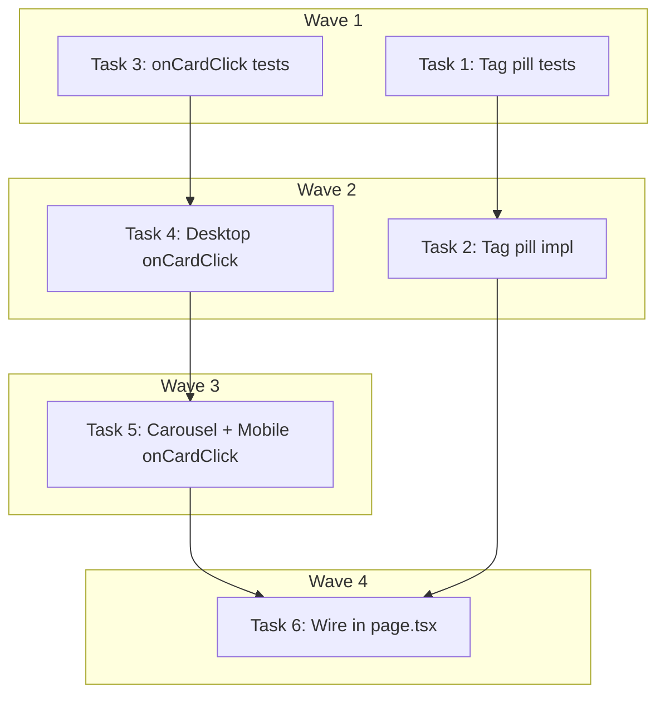

# Home Page Fixes Implementation Plan

> **For Claude:** REQUIRED SUB-SKILL: Use executing-plans to implement this plan task-by-task.

**Design Doc:** [docs/designs/2026-03-28-home-page-fixes-design.md](docs/designs/2026-03-28-home-page-fixes-design.md)

**Spec References:** —

**PRD References:** —

**Goal:** Fix two bugs on the home page: shop card clicks in map view should navigate to shop detail, and taxonomy tags should display as pill chips on compact cards.

**Architecture:** Frontend-only fix across 6 files. Add `onCardClick` prop to map layouts (separates card navigation from pin selection). Add tag pill rendering to `ShopCardCompact`.

**Tech Stack:** React, TypeScript, Tailwind CSS, Vitest + Testing Library

**Acceptance Criteria:**

- [ ] Clicking a shop card in desktop map view navigates to `/shops/[id]`
- [ ] Clicking a shop card in mobile map carousel navigates to `/shops/[id]`
- [ ] Clicking a map pin still only highlights/selects (does not navigate)
- [ ] Shop cards display up to 5 taxonomy tags as Chinese pill chips
- [ ] Shop cards with no tags show no tag row

---

### Task 1: Write failing tests for taxonomy tag pills on ShopCardCompact

**Files:**

- Modify: `components/shops/shop-card-compact.test.tsx`

**Step 1: Write the failing tests**

Add two tests to the existing describe block in `components/shops/shop-card-compact.test.tsx`:

```typescript
it('a user browsing sees taxonomy tags as pill chips to understand the shop vibe', () => {
  const shopWithTags = {
    ...shop,
    taxonomyTags: [
      { id: 'outlet', label: 'Has outlets', labelZh: '有插座' },
      { id: 'quiet', label: 'Quiet', labelZh: '安靜' },
      { id: 'late-night', label: 'Late night', labelZh: '深夜營業' },
    ],
  };
  render(<ShopCardCompact shop={shopWithTags} onClick={() => {}} />);
  expect(screen.getByText('有插座')).toBeInTheDocument();
  expect(screen.getByText('安靜')).toBeInTheDocument();
  expect(screen.getByText('深夜營業')).toBeInTheDocument();
});

it('a user sees at most 5 tags even when the shop has more', () => {
  const shopWithManyTags = {
    ...shop,
    taxonomyTags: [
      { id: 't1', label: 'Tag 1', labelZh: '標籤一' },
      { id: 't2', label: 'Tag 2', labelZh: '標籤二' },
      { id: 't3', label: 'Tag 3', labelZh: '標籤三' },
      { id: 't4', label: 'Tag 4', labelZh: '標籤四' },
      { id: 't5', label: 'Tag 5', labelZh: '標籤五' },
      { id: 't6', label: 'Tag 6', labelZh: '標籤六' },
      { id: 't7', label: 'Tag 7', labelZh: '標籤七' },
    ],
  };
  render(<ShopCardCompact shop={shopWithManyTags} onClick={() => {}} />);
  expect(screen.getByText('標籤五')).toBeInTheDocument();
  expect(screen.queryByText('標籤六')).not.toBeInTheDocument();
  expect(screen.queryByText('標籤七')).not.toBeInTheDocument();
});

it('a user sees no tag row when the shop has no taxonomy tags', () => {
  const { container } = render(
    <ShopCardCompact shop={shop} onClick={() => {}} />
  );
  expect(container.querySelector('[data-testid="tag-pills"]')).not.toBeInTheDocument();
});
```

**Step 2: Run tests to verify they fail**

Run: `cd /Users/ytchou/Project/caferoam/.worktrees/fix/home-page && pnpm vitest run components/shops/shop-card-compact.test.tsx`
Expected: 3 new tests FAIL (tags not rendered)

---

### Task 2: Implement taxonomy tag pills on ShopCardCompact

**Files:**

- Modify: `components/shops/shop-card-compact.tsx`

**Step 1: Add tag pills between meta and community summary**

In `components/shops/shop-card-compact.tsx`, inside the `<div className="flex min-w-0 flex-1 flex-col gap-1">` container, add between the `formatMeta` span and the `summary` span:

```tsx
{
  shop.taxonomyTags && shop.taxonomyTags.length > 0 && (
    <div data-testid="tag-pills" className="flex flex-wrap gap-1">
      {shop.taxonomyTags.slice(0, 5).map((tag) => (
        <span
          key={tag.id}
          className="bg-muted text-text-secondary rounded-full px-2 py-0.5 font-[family-name:var(--font-body)] text-[11px]"
        >
          {tag.labelZh}
        </span>
      ))}
    </div>
  );
}
```

**Step 2: Run tests to verify they pass**

Run: `cd /Users/ytchou/Project/caferoam/.worktrees/fix/home-page && pnpm vitest run components/shops/shop-card-compact.test.tsx`
Expected: ALL tests PASS

**Step 3: Commit**

```bash
cd /Users/ytchou/Project/caferoam/.worktrees/fix/home-page
git add components/shops/shop-card-compact.tsx components/shops/shop-card-compact.test.tsx
git commit -m "feat: render taxonomy tag pills on ShopCardCompact (max 5, Chinese labels)"
```

---

### Task 3: Write failing test for onCardClick on MapDesktopLayout

**Files:**

- Modify: `components/map/map-desktop-layout.test.tsx`

**Step 1: Write the failing test**

Add to the existing describe block in `components/map/map-desktop-layout.test.tsx`:

```typescript
it('a user clicking a shop card navigates via onCardClick when provided', async () => {
  const onCardClick = vi.fn();
  const onShopClick = vi.fn();
  render(
    <MapDesktopLayout
      {...defaultProps}
      onShopClick={onShopClick}
      onCardClick={onCardClick}
    />
  );
  await userEvent.click(screen.getByText('晨光咖啡 Morning Glow'));
  expect(onCardClick).toHaveBeenCalledWith('shop-aa11bb');
  expect(onShopClick).not.toHaveBeenCalled();
});

it('a user clicking a shop card falls back to onShopClick when onCardClick is not provided', async () => {
  const onShopClick = vi.fn();
  render(
    <MapDesktopLayout {...defaultProps} onShopClick={onShopClick} />
  );
  await userEvent.click(screen.getByText('晨光咖啡 Morning Glow'));
  expect(onShopClick).toHaveBeenCalledWith('shop-aa11bb');
});

it('a user clicking a map pin triggers onShopClick even when onCardClick is provided', async () => {
  const onCardClick = vi.fn();
  const onShopClick = vi.fn();
  render(
    <MapDesktopLayout
      {...defaultProps}
      onShopClick={onShopClick}
      onCardClick={onCardClick}
    />
  );
  await userEvent.click(screen.getByText('pin-shop-aa11bb'));
  expect(onShopClick).toHaveBeenCalledWith('shop-aa11bb');
  expect(onCardClick).not.toHaveBeenCalled();
});
```

**Step 2: Run tests to verify they fail**

Run: `cd /Users/ytchou/Project/caferoam/.worktrees/fix/home-page && pnpm vitest run components/map/map-desktop-layout.test.tsx`
Expected: First test FAILS (onCardClick prop doesn't exist / not wired), second test passes (existing behavior), third test passes (existing behavior)

---

### Task 4: Implement onCardClick on MapDesktopLayout

**Files:**

- Modify: `components/map/map-desktop-layout.tsx`

**Step 1: Add onCardClick to the interface and destructure**

In `MapDesktopLayoutProps`, add:

```typescript
onCardClick?: (id: string) => void;
```

In the destructured props, add `onCardClick`.

**Step 2: Wire onCardClick to ShopCardCompact**

Change the `ShopCardCompact` `onClick` from:

```tsx
onClick={() => onShopClick(shop.id)}
```

to:

```tsx
onClick={() => (onCardClick ?? onShopClick)(shop.id)}
```

**Step 3: Run tests to verify they pass**

Run: `cd /Users/ytchou/Project/caferoam/.worktrees/fix/home-page && pnpm vitest run components/map/map-desktop-layout.test.tsx`
Expected: ALL tests PASS

**Step 4: Commit**

```bash
cd /Users/ytchou/Project/caferoam/.worktrees/fix/home-page
git add components/map/map-desktop-layout.tsx components/map/map-desktop-layout.test.tsx
git commit -m "feat: add onCardClick prop to MapDesktopLayout — card navigates, pin selects"
```

---

### Task 5: Add onCardClick to ShopCarousel and MapMobileLayout

**Files:**

- Modify: `components/map/shop-carousel.tsx`
- Modify: `components/map/map-mobile-layout.tsx`

No test needed — trivial prop passthrough with `??` fallback. Behavior pattern is identical to MapDesktopLayout (which is tested). Neither file has an existing test file.

**Step 1: Update ShopCarousel**

In `components/map/shop-carousel.tsx`, add `onCardClick` to `ShopCarouselProps`:

```typescript
interface ShopCarouselProps {
  shops: LayoutShop[];
  onShopClick: (shopId: string) => void;
  onCardClick?: (shopId: string) => void;
  selectedShopId?: string | null;
}
```

Destructure `onCardClick` in the component params.

Change the `ShopCardCarousel` `onClick` from:

```tsx
onClick={() => onShopClick(shop.id)}
```

to:

```tsx
onClick={() => (onCardClick ?? onShopClick)(shop.id)}
```

**Step 2: Update MapMobileLayout**

In `components/map/map-mobile-layout.tsx`, add to `MapMobileLayoutProps`:

```typescript
onCardClick?: (id: string) => void;
```

Destructure `onCardClick` in the component params.

Pass it through to `ShopCarousel`:

```tsx
<ShopCarousel
  shops={shops}
  onShopClick={onShopClick}
  onCardClick={onCardClick}
  selectedShopId={selectedShopId}
/>
```

**Step 3: Commit**

```bash
cd /Users/ytchou/Project/caferoam/.worktrees/fix/home-page
git add components/map/shop-carousel.tsx components/map/map-mobile-layout.tsx
git commit -m "feat: add onCardClick prop to ShopCarousel and MapMobileLayout"
```

---

### Task 6: Wire onCardClick in page.tsx

**Files:**

- Modify: `app/page.tsx`

No test needed — `app/page.tsx` has no test file and this is wiring only. The behavior is covered by the MapDesktopLayout test (Task 3).

**Step 1: Pass onCardClick to map layouts**

In `app/page.tsx`, change the desktop map rendering from:

```tsx
<MapDesktopLayout {...layoutProps} />
```

to:

```tsx
<MapDesktopLayout {...layoutProps} onCardClick={handleShopNavigate} />
```

Change the mobile map rendering from:

```tsx
<MapMobileLayout {...layoutProps} />
```

to:

```tsx
<MapMobileLayout {...layoutProps} onCardClick={handleShopNavigate} />
```

**Step 2: Run full test suite for affected files**

Run: `cd /Users/ytchou/Project/caferoam/.worktrees/fix/home-page && pnpm vitest run components/shops/shop-card-compact.test.tsx components/map/map-desktop-layout.test.tsx`
Expected: ALL tests PASS

**Step 3: Commit**

```bash
cd /Users/ytchou/Project/caferoam/.worktrees/fix/home-page
git add app/page.tsx
git commit -m "fix: wire onCardClick to map layouts — card clicks navigate to shop detail"
```

---

## Execution Waves



**Wave 1** (parallel — no dependencies):

- Task 1: Write failing tests for taxonomy tag pills
- Task 3: Write failing test for onCardClick on MapDesktopLayout

**Wave 2** (parallel — depends on Wave 1):

- Task 2: Implement taxonomy tag pills ← Task 1
- Task 4: Implement onCardClick on MapDesktopLayout ← Task 3

**Wave 3** (sequential — depends on Wave 2):

- Task 5: Add onCardClick to ShopCarousel + MapMobileLayout ← Task 4

**Wave 4** (sequential — depends on Wave 2 + 3):

- Task 6: Wire onCardClick in page.tsx ← Task 2, Task 5
