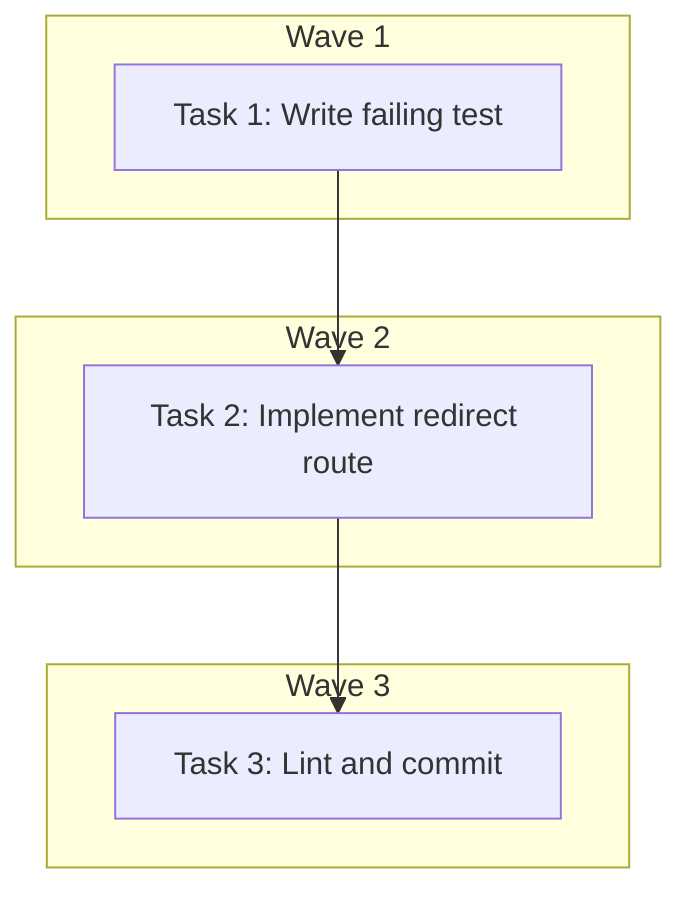

# Fix Shop Card Navigation (DEV-84) Implementation Plan

> **For Claude:** REQUIRED SUB-SKILL: Use executing-plans to implement this plan task-by-task.

**Design Doc:** [docs/designs/2026-03-29-fix-shop-card-navigation-design.md](../designs/2026-03-29-fix-shop-card-navigation-design.md)

**Spec References:** ---

**PRD References:** ---

**Goal:** Fix broken shop card navigation on the Find page by adding a catch-all redirect route at `/shops/[shopId]` that resolves the slug and redirects to `/shops/[shopId]/[slug]`.

**Architecture:** Add a single server component at `app/shops/[shopId]/page.tsx`. It fetches the shop by ID from the backend (reusing the same `BACKEND_URL` pattern as the existing `[slug]/page.tsx`), extracts the slug, and calls `redirect()`. This requires zero changes to existing components or types.

**Tech Stack:** Next.js 16 App Router (server component, `redirect()`, `notFound()`)

**Acceptance Criteria:**
- [ ] Clicking a shop card on the mobile map view navigates to the shop detail page
- [ ] Visiting `/shops/<shopId>` (without slug) redirects to `/shops/<shopId>/<slug>`
- [ ] Visiting `/shops/<nonexistent-id>` returns a 404

---

### Task 1: Write failing test for shop ID redirect route

**Files:**
- Create: `app/shops/[shopId]/page.test.tsx`

**Step 1: Write the failing test**

The redirect route is a Next.js server component that calls `redirect()` and `notFound()`. We test it by calling the default export directly and asserting on the mocked `redirect`/`notFound` calls.

```tsx
import { describe, it, expect, vi, beforeEach } from 'vitest';

// Mock next/navigation before any imports that use it
const mockRedirect = vi.fn();
const mockNotFound = vi.fn();
vi.mock('next/navigation', () => ({
  redirect: (...args: unknown[]) => {
    mockRedirect(...args);
    throw new Error('NEXT_REDIRECT');
  },
  notFound: () => {
    mockNotFound();
    throw new Error('NEXT_NOT_FOUND');
  },
}));

// Mock fetch at the global boundary
const mockFetch = vi.fn();
global.fetch = mockFetch;

// Import after mocks are set up
import ShopRedirectPage from './page';

describe('app/shops/[shopId]/page — redirect route', () => {
  beforeEach(() => {
    vi.clearAllMocks();
  });

  it('redirects to /shops/[shopId]/[slug] when shop exists', async () => {
    mockFetch.mockResolvedValueOnce({
      ok: true,
      status: 200,
      json: async () => ({ id: 'shop-abc', slug: 'hoto-cafe', name: 'Hoto Cafe' }),
    });

    await expect(
      ShopRedirectPage({ params: Promise.resolve({ shopId: 'shop-abc' }) })
    ).rejects.toThrow('NEXT_REDIRECT');

    expect(mockRedirect).toHaveBeenCalledWith('/shops/shop-abc/hoto-cafe');
  });

  it('calls notFound when shop does not exist', async () => {
    mockFetch.mockResolvedValueOnce({
      ok: false,
      status: 404,
    });

    await expect(
      ShopRedirectPage({ params: Promise.resolve({ shopId: 'nonexistent' }) })
    ).rejects.toThrow('NEXT_NOT_FOUND');

    expect(mockNotFound).toHaveBeenCalled();
  });

  it('falls back to shopId as slug when shop has no slug field', async () => {
    mockFetch.mockResolvedValueOnce({
      ok: true,
      status: 200,
      json: async () => ({ id: 'shop-xyz', name: 'No Slug Cafe' }),
    });

    await expect(
      ShopRedirectPage({ params: Promise.resolve({ shopId: 'shop-xyz' }) })
    ).rejects.toThrow('NEXT_REDIRECT');

    expect(mockRedirect).toHaveBeenCalledWith('/shops/shop-xyz/shop-xyz');
  });
});
```

**Step 2: Run test to verify it fails**

Run: `pnpm vitest run app/shops/\\[shopId\\]/page.test.tsx`
Expected: FAIL — `./page` module not found (the redirect route doesn't exist yet)

---

### Task 2: Implement the redirect route

**Files:**
- Create: `app/shops/[shopId]/page.tsx`

**Step 3: Write minimal implementation**

```tsx
import { notFound, redirect } from 'next/navigation';
import { BACKEND_URL } from '@/lib/api/proxy';

interface Params {
  shopId: string;
}

export default async function ShopRedirectPage({
  params,
}: {
  params: Promise<Params>;
}) {
  const { shopId } = await params;

  const res = await fetch(`${BACKEND_URL}/shops/${shopId}`, {
    next: { revalidate: 300 },
  });

  if (res.status === 404) {
    notFound();
  }

  if (!res.ok) {
    throw new Error(`Failed to fetch shop: ${res.status}`);
  }

  const shop = await res.json();
  redirect(`/shops/${shopId}/${shop.slug ?? shopId}`);
}
```

**Step 4: Run test to verify it passes**

Run: `pnpm vitest run app/shops/\\[shopId\\]/page.test.tsx`
Expected: 3 tests PASS

**Step 5: Run full test suite to check for regressions**

Run: `pnpm vitest run`
Expected: All existing tests still pass

---

### Task 3: Lint and commit

**Step 6: Lint**

Run: `pnpm lint && pnpm type-check`
Expected: No errors

**Step 7: Commit**

```bash
git add app/shops/\[shopId\]/page.tsx app/shops/\[shopId\]/page.test.tsx
git commit -m "fix(DEV-84): add /shops/[shopId] redirect route — fixes card navigation"
```

---

## Execution Waves



**Wave 1:** Task 1 — Write failing test (no dependencies)
**Wave 2:** Task 2 — Implement redirect route (depends on Wave 1)
**Wave 3:** Task 3 — Lint and commit (depends on Wave 2)

All tasks are sequential — single file, single concern.
