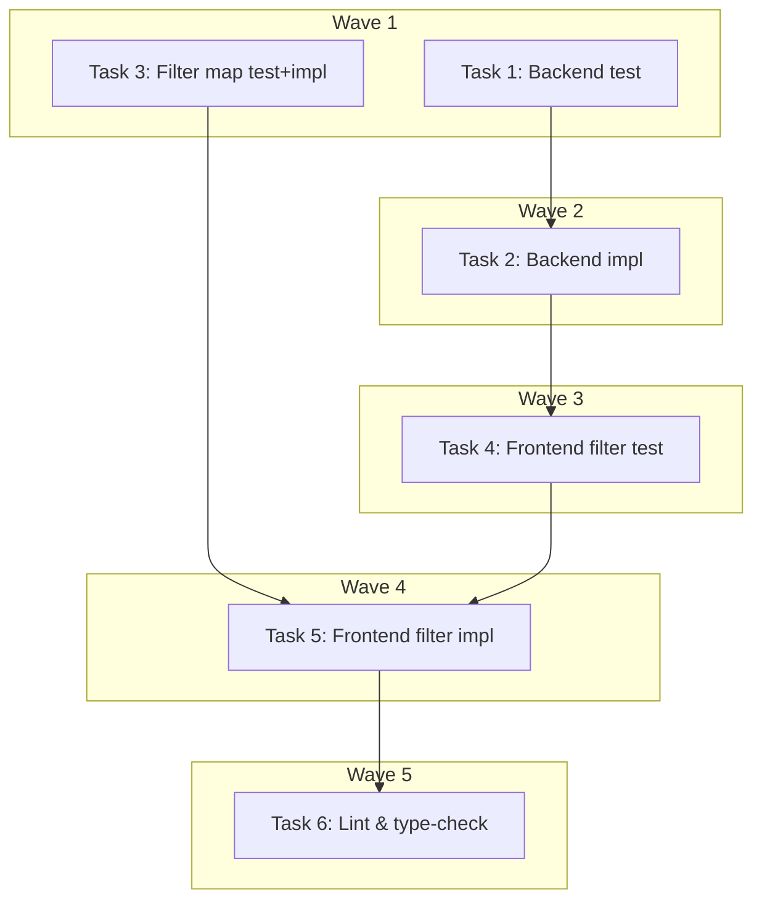

# Find Page Filters Implementation Plan

> **For Claude:** REQUIRED SUB-SKILL: Use executing-plans to implement this plan task-by-task.

**Design Doc:** [docs/designs/2026-03-30-find-page-filters-design.md](docs/designs/2026-03-30-find-page-filters-design.md)

**Spec References:** [SPEC.md — Critical Business Logic: Taxonomy system](SPEC.md)

**PRD References:** [PRD.md — Multi-dimension filters](PRD.md)

**Goal:** Make Find page filter buttons (Open Now, WiFi, Outlet, Quiet, Top Rated) actually filter the displayed shop list.

**Architecture:** Client-side filtering on the already-fetched ~170 shop array. Backend `list_shops` is expanded to include `taxonomyTags` and computed `isOpen`. Frontend applies AND-combined filters via a mapping table that translates short filter IDs to taxonomy tag IDs.

**Tech Stack:** FastAPI (backend), React/Next.js (frontend), Vitest (frontend tests), pytest (backend tests)

**Acceptance Criteria:**
- [ ] Clicking "WiFi" filter shows only shops tagged with `wifi_available`
- [ ] Clicking "Open Now" shows only shops currently open (based on backend-computed `isOpen`)
- [ ] Selecting multiple filters (e.g., WiFi + Quiet) shows only shops matching ALL selected filters
- [ ] "Top Rated" sorts results by rating descending while preserving any active tag/open filters

---

### Task 1: Backend — Write failing test for `list_shops` returning `taxonomyTags` and `isOpen`

**Files:**
- Modify: `backend/tests/api/test_shops.py`

**Step 1: Write the failing test**

Add to `TestShopsAPI` class in `backend/tests/api/test_shops.py`:

```python
def test_list_shops_includes_taxonomy_tags_and_is_open(self):
    """GET /shops returns taxonomyTags array and isOpen boolean for each shop."""
    shop_data = {
        **SHOP_ROW,
        "opening_hours": ["Monday: 9:00 AM - 11:00 PM"],
        "shop_photos": [],
        "shop_claims": [],
        "shop_tags": [
            {
                "tag_id": "wifi_available",
                "taxonomy_tags": {
                    "id": "wifi_available",
                    "dimension": "functionality",
                    "label": "WiFi Available",
                    "label_zh": "提供 WiFi",
                },
            }
        ],
    }
    shop_chain = _simple_select_chain([shop_data])

    with patch("api.shops.get_anon_client") as mock_sb:
        mock_sb.return_value = MagicMock(table=MagicMock(return_value=shop_chain))
        with patch("api.shops.is_open_now", return_value=True):
            response = client.get("/shops?featured=true&limit=50")

    assert response.status_code == 200
    data = response.json()
    assert len(data) == 1
    shop = data[0]
    assert shop["taxonomyTags"] == [
        {"id": "wifi_available", "dimension": "functionality", "label": "WiFi Available", "labelZh": "提供 WiFi"}
    ]
    assert shop["isOpen"] is True
```

**Step 2: Run test to verify it fails**

Run: `cd backend && uv run pytest tests/api/test_shops.py::TestShopsAPI::test_list_shops_includes_taxonomy_tags_and_is_open -v`
Expected: FAIL — `list_shops` doesn't return `taxonomyTags` or `isOpen`

---

### Task 2: Backend — Implement `list_shops` expansion

**Files:**
- Modify: `backend/api/shops.py:27-65`

**Step 1: Add `opening_hours` to `_SHOP_LIST_COLUMNS`**

In `backend/api/shops.py`, change line 27-33:

```python
_SHOP_LIST_COLUMNS = (
    "id, name, slug, address, city, mrt, latitude, longitude, "
    "rating, review_count, description, processing_status, "
    "mode_work, mode_rest, mode_social, "
    "community_summary, "
    "opening_hours, "
    "created_at"
)
```

**Step 2: Add `shop_tags` join and `isOpen` computation to `list_shops`**

Replace the `list_shops` function body (lines 40-65):

```python
from core.opening_hours import is_open_now
from datetime import datetime, timezone, timedelta

TW = timezone(timedelta(hours=8))

@router.get("/")
async def list_shops(
    city: str | None = None,
    featured: bool = False,
    limit: int = Query(default=50, ge=1, le=200),
) -> list[Any]:
    """List shops. Public — no auth required."""
    db = get_anon_client()
    query = db.table("shops").select(
        f"{_SHOP_LIST_COLUMNS}, shop_photos(url), shop_claims(status), "
        "shop_tags(tag_id, taxonomy_tags(id, dimension, label, label_zh))"
    )
    if city:
        query = query.eq("city", city)
    if featured:
        query = query.eq("processing_status", "live")
    query = query.limit(limit)
    response = query.execute()
    rows = cast("list[dict[str, Any]]", response.data or [])
    now = datetime.now(TW)
    result = []
    for row in rows:
        photo_urls = [p["url"] for p in (row.pop("shop_photos", None) or [])]
        raw_claims = row.pop("shop_claims", None) or []
        raw_tags = row.pop("shop_tags", None) or []
        claim_status = first(raw_claims, "shop_claims")["status"] if raw_claims else None
        taxonomy_tags = [
            TaxonomyTag(**t["taxonomy_tags"]).model_dump(by_alias=True)
            for t in raw_tags
            if t.get("taxonomy_tags")
        ]
        opening_hours = row.pop("opening_hours", None)
        open_status = is_open_now(opening_hours, now)
        camel = {to_camel(k): v for k, v in row.items()}
        camel["photoUrls"] = photo_urls
        camel["claimStatus"] = claim_status
        camel["taxonomyTags"] = taxonomy_tags
        camel["isOpen"] = open_status
        result.append(camel)
    return result
```

Note: Import `is_open_now` at the top of the file. Define `TW` at module level (same pattern as `backend/services/tarot_service.py`).

**Step 3: Run test to verify it passes**

Run: `cd backend && uv run pytest tests/api/test_shops.py::TestShopsAPI::test_list_shops_includes_taxonomy_tags_and_is_open -v`
Expected: PASS

**Step 4: Run all backend shop tests to check for regressions**

Run: `cd backend && uv run pytest tests/api/test_shops.py -v`
Expected: All existing tests still pass. Some may need `shop_tags` added to their mock data — fix any failures by adding `"shop_tags": []` to mock shop rows.

**Step 5: Commit**

```bash
git add backend/api/shops.py backend/tests/api/test_shops.py
git commit -m "feat(DEV-114): expand list_shops with taxonomyTags and isOpen"
```

---

### Task 3: Frontend — Write failing test for filter-to-tag mapping

**Files:**
- Create: `components/filters/filter-map.ts`
- Create: `components/filters/__tests__/filter-map.test.ts`

**Step 1: Write the failing test**

Create `components/filters/__tests__/filter-map.test.ts`:

```typescript
import { describe, it, expect } from 'vitest';
import { FILTER_TO_TAG_IDS, SPECIAL_FILTERS } from '../filter-map';

describe('filter-map', () => {
  it('maps wifi filter to wifi_available taxonomy tag', () => {
    expect(FILTER_TO_TAG_IDS['wifi']).toBe('wifi_available');
  });

  it('maps outlet filter to power_outlets taxonomy tag', () => {
    expect(FILTER_TO_TAG_IDS['outlet']).toBe('power_outlets');
  });

  it('maps quiet filter to quiet taxonomy tag', () => {
    expect(FILTER_TO_TAG_IDS['quiet']).toBe('quiet');
  });

  it('does not include special filters in tag mapping', () => {
    expect(FILTER_TO_TAG_IDS['open_now']).toBeUndefined();
    expect(FILTER_TO_TAG_IDS['rating']).toBeUndefined();
  });

  it('lists open_now and rating as special filters', () => {
    expect(SPECIAL_FILTERS).toContain('open_now');
    expect(SPECIAL_FILTERS).toContain('rating');
  });
});
```

**Step 2: Run test to verify it fails**

Run: `pnpm vitest run components/filters/__tests__/filter-map.test.ts`
Expected: FAIL — module not found

**Step 3: Write minimal implementation**

Create `components/filters/filter-map.ts`:

```typescript
/**
 * Maps quick-filter UI IDs to taxonomy tag IDs in the database.
 * Quick filters use short IDs for cleaner URLs (?filters=wifi,quiet)
 * while taxonomy uses canonical IDs (wifi_available, power_outlets).
 */
export const FILTER_TO_TAG_IDS: Record<string, string> = {
  wifi: 'wifi_available',
  outlet: 'power_outlets',
  quiet: 'quiet',
};

/** Filters handled by custom logic, not taxonomy tag matching. */
export const SPECIAL_FILTERS = ['open_now', 'rating'] as const;
```

**Step 4: Run test to verify it passes**

Run: `pnpm vitest run components/filters/__tests__/filter-map.test.ts`
Expected: PASS (5 tests)

**Step 5: Commit**

```bash
git add components/filters/filter-map.ts components/filters/__tests__/filter-map.test.ts
git commit -m "feat(DEV-115): add filter-to-taxonomy-tag mapping"
```

---

### Task 4: Frontend — Write failing test for shops memo filtering

**Files:**
- Modify: `app/__tests__/find-page.test.tsx`

**Step 1: Write the failing test**

Add test shops with taxonomy tags to the mock data in `app/__tests__/find-page.test.tsx`. Update the `useShops` mock to return shops with tags:

```typescript
vi.mock('@/lib/hooks/use-shops', () => ({
  useShops: () => ({
    shops: [
      {
        id: 'shop-wifi',
        name: 'WiFi Cafe',
        slug: 'wifi-cafe',
        latitude: 25.03,
        longitude: 121.56,
        rating: 4.5,
        address: '1 Coffee St',
        reviewCount: 10,
        photoUrls: [],
        taxonomyTags: [{ id: 'wifi_available', label: 'WiFi', labelZh: '有WiFi' }],
        isOpen: true,
        cafenomadId: null,
        googlePlaceId: null,
        createdAt: '2026-01-01',
        phone: null,
        website: null,
        openingHours: null,
        priceRange: null,
        description: null,
        menuUrl: null,
      },
      {
        id: 'shop-quiet',
        name: 'Quiet Place',
        slug: 'quiet-place',
        latitude: 25.04,
        longitude: 121.57,
        rating: 4.2,
        address: '2 Coffee St',
        reviewCount: 5,
        photoUrls: [],
        taxonomyTags: [{ id: 'quiet', label: 'Quiet', labelZh: '安靜' }],
        isOpen: false,
        cafenomadId: null,
        googlePlaceId: null,
        createdAt: '2026-01-01',
        phone: null,
        website: null,
        openingHours: null,
        priceRange: null,
        description: null,
        menuUrl: null,
      },
      {
        id: 'shop-both',
        name: 'WiFi & Quiet Cafe',
        slug: 'wifi-quiet-cafe',
        latitude: 25.05,
        longitude: 121.58,
        rating: 4.8,
        address: '3 Coffee St',
        reviewCount: 20,
        photoUrls: [],
        taxonomyTags: [
          { id: 'wifi_available', label: 'WiFi', labelZh: '有WiFi' },
          { id: 'quiet', label: 'Quiet', labelZh: '安靜' },
        ],
        isOpen: true,
        cafenomadId: null,
        googlePlaceId: null,
        createdAt: '2026-01-01',
        phone: null,
        website: null,
        openingHours: null,
        priceRange: null,
        description: null,
        menuUrl: null,
      },
    ],
    isLoading: false,
  }),
}));
```

Then add these test cases:

```typescript
it('filters shops by WiFi tag when wifi filter is active', async () => {
  // Set ?filters=wifi in URL
  const params = new URLSearchParams('filters=wifi');
  vi.mocked(useSearchParams).mockReturnValue(params as any);

  const { default: FindPage } = await import('../page');
  render(<FindPage />);

  // WiFi Cafe and WiFi & Quiet Cafe should appear
  expect(screen.getByText('WiFi Cafe')).toBeInTheDocument();
  expect(screen.getByText('WiFi & Quiet Cafe')).toBeInTheDocument();
  // Quiet Place (no wifi tag) should not
  expect(screen.queryByText('Quiet Place')).not.toBeInTheDocument();
});

it('filters shops by open_now when that filter is active', async () => {
  const params = new URLSearchParams('filters=open_now');
  vi.mocked(useSearchParams).mockReturnValue(params as any);

  const { default: FindPage } = await import('../page');
  render(<FindPage />);

  // Only shops with isOpen=true
  expect(screen.getByText('WiFi Cafe')).toBeInTheDocument();
  expect(screen.getByText('WiFi & Quiet Cafe')).toBeInTheDocument();
  expect(screen.queryByText('Quiet Place')).not.toBeInTheDocument();
});

it('AND-combines multiple filters', async () => {
  const params = new URLSearchParams('filters=wifi,quiet');
  vi.mocked(useSearchParams).mockReturnValue(params as any);

  const { default: FindPage } = await import('../page');
  render(<FindPage />);

  // Only shop with BOTH wifi_available AND quiet tags
  expect(screen.getByText('WiFi & Quiet Cafe')).toBeInTheDocument();
  expect(screen.queryByText('WiFi Cafe')).not.toBeInTheDocument();
  expect(screen.queryByText('Quiet Place')).not.toBeInTheDocument();
});
```

**Step 2: Run test to verify it fails**

Run: `pnpm vitest run app/__tests__/find-page.test.tsx`
Expected: FAIL — filter logic not implemented, all shops still shown

---

### Task 5: Frontend — Implement filter logic in shops memo

**Files:**
- Modify: `app/page.tsx:1-2, 50-83`

**Step 1: Import the filter mapping**

Add to imports in `app/page.tsx`:

```typescript
import { FILTER_TO_TAG_IDS } from '@/components/filters/filter-map';
```

**Step 2: Replace the shops memo with filter-aware version**

Replace the `shops` useMemo (lines 50-83) in `app/page.tsx`:

```typescript
const shops = useMemo(() => {
  const base = query
    ? searchLoading
      ? []
      : searchResults.length > 0
        ? searchResults
        : featuredShops
    : featuredShops;

  // Apply tag-based filters (AND-combined)
  let filtered = base;
  const tagFilters = filters
    .map((f) => FILTER_TO_TAG_IDS[f])
    .filter(Boolean);

  if (tagFilters.length > 0) {
    filtered = filtered.filter((shop) => {
      const shopTagIds = new Set(
        (shop.taxonomyTags ?? []).map((t) => t.id)
      );
      return tagFilters.every((tagId) => shopTagIds.has(tagId));
    });
  }

  // Apply open_now filter
  if (filters.includes('open_now')) {
    filtered = filtered.filter((shop) => shop.isOpen === true);
  }

  // Apply rating sort
  if (filters.includes('rating')) {
    filtered = [...filtered].sort((a, b) => (b.rating ?? 0) - (a.rating ?? 0));
  }

  // Apply geo-sort if location available and no rating sort
  if (!filters.includes('rating') && latitude != null && longitude != null) {
    filtered = [...filtered].sort((a, b) => {
      const dA =
        a.latitude != null && a.longitude != null
          ? haversineKm(latitude, longitude, a.latitude, a.longitude)
          : Infinity;
      const dB =
        b.latitude != null && b.longitude != null
          ? haversineKm(latitude, longitude, b.latitude, b.longitude)
          : Infinity;
      return dA - dB;
    });
  }

  return filtered;
}, [
  query,
  searchLoading,
  searchResults,
  featuredShops,
  filters,
  latitude,
  longitude,
]);
```

**Step 3: Run test to verify it passes**

Run: `pnpm vitest run app/__tests__/find-page.test.tsx`
Expected: All tests PASS including the new filter tests

**Step 4: Run full frontend test suite**

Run: `pnpm test`
Expected: No regressions

**Step 5: Commit**

```bash
git add app/page.tsx
git commit -m "feat(DEV-115): apply AND-combined filters in Find page shops memo"
```

---

### Task 6: Lint and type-check

**Files:** All modified files

**Step 1: Run lint**

Run: `pnpm lint`
Expected: No new errors

**Step 2: Run type-check**

Run: `pnpm type-check`
Expected: No new errors

**Step 3: Run backend lint**

Run: `cd backend && uv run ruff check api/shops.py`
Expected: No errors

**Step 4: Fix any issues found, then commit**

```bash
git add -A
git commit -m "chore: lint and type-check fixes for DEV-113"
```

No test needed — linting/formatting step.

---

## Execution Waves



**Wave 1** (parallel — no dependencies):
- Task 1: Backend failing test for list_shops expansion
- Task 3: Frontend filter-map test + implementation

**Wave 2** (depends on Wave 1):
- Task 2: Backend list_shops implementation <- Task 1

**Wave 3** (depends on Wave 2):
- Task 4: Frontend filter test <- Task 2 (needs backend shape)

**Wave 4** (depends on Wave 2 + Wave 3):
- Task 5: Frontend filter implementation <- Task 3, Task 4

**Wave 5** (depends on Wave 4):
- Task 6: Lint and type-check <- Task 5
