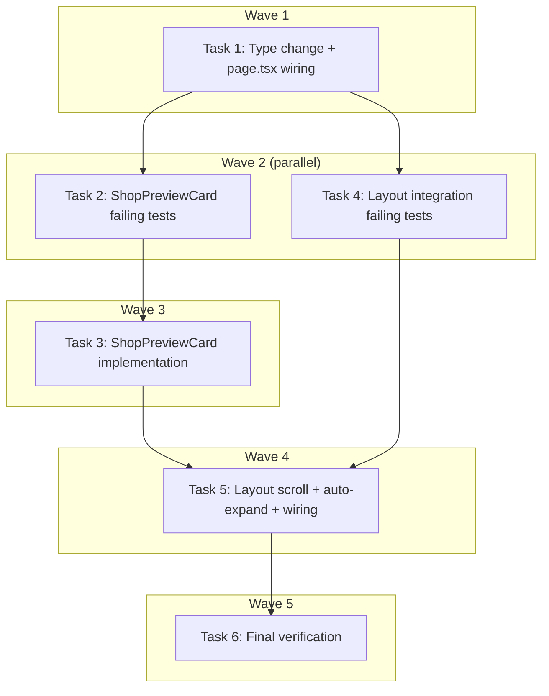

# Map Pin Progressive Disclosure Implementation Plan

> **For Claude:** REQUIRED SUB-SKILL: Use executing-plans to implement this plan task-by-task.

**Design Doc:** [docs/designs/2026-03-30-map-pin-progressive-disclosure-design.md](../designs/2026-03-30-map-pin-progressive-disclosure-design.md)

**Spec References:** [SPEC.md#9-business-rules](../../SPEC.md) — "Responsive layouts (UX-defined)" line 196

**PRD References:** —

**Goal:** Replace the desktop map pin's direct navigation with a progressive disclosure flow: pin click → side panel highlight + scroll → floating preview card → navigate via CTA.

**Architecture:** Change desktop `onShopClick` from `handleShopNavigate` to `setSelectedShopId`. Add scroll-to-card + auto-expand to `MapDesktopLayout`. Create a new `ShopPreviewCard` glassmorphism component rendered at bottom-center of the map area. Mobile is untouched (carousel scroll already works).

**Tech Stack:** React, TypeScript, Tailwind CSS, PostHog analytics

**Acceptance Criteria:**
- [ ] A desktop user clicking a map pin sees the side panel highlight the corresponding shop card and scroll to it
- [ ] A desktop user clicking a map pin sees a floating preview card with the shop's name, photo, rating, distance, tags, and a "View Details" CTA
- [ ] A desktop user pressing ESC or clicking the X button on the preview card closes it and deselects the pin
- [ ] A desktop user clicking "View Details" on the preview card navigates to the shop detail page
- [ ] A desktop user clicking a pin when the side panel is collapsed sees the panel auto-expand

---

### Task 1: Update `onShopClick` type to accept `null` (DEV-116)

**Files:**
- Modify: `components/map/map-with-fallback.tsx:14`
- Modify: `components/map/map-desktop-layout.tsx:18`

**Step 1: No test needed — type-only change**

This is a non-behavioral type change. No new test required. The existing tests pass `vi.fn()` which accepts any args.

**Step 2: Update `MapWithFallbackProps` interface**

In `components/map/map-with-fallback.tsx`, change:
```diff
- onShopClick: (id: string) => void;
+ onShopClick: (id: string | null) => void;
```

**Step 3: Update `MapDesktopLayoutProps` interface**

In `components/map/map-desktop-layout.tsx`, change:
```diff
- onShopClick: (id: string) => void;
+ onShopClick: (id: string | null) => void;
```

**Step 4: Fix `app/page.tsx` desktop pin click wiring**

In `app/page.tsx`, change line 145:
```diff
- onShopClick={isDesktop ? handleShopNavigate : setSelectedShopId}
+ onShopClick={setSelectedShopId}
```

Note: `setSelectedShopId` is `Dispatch<SetStateAction<string | null>>` which already accepts `string | null`. `onCardClick={handleShopNavigate}` remains unchanged — side panel card clicks still navigate directly.

**Step 5: Run existing tests to verify no regressions**

Run: `pnpm vitest run components/map/map-desktop-layout.test.tsx --reporter=verbose`
Expected: all 8 existing tests PASS

**Step 6: Commit**

```bash
git add components/map/map-with-fallback.tsx components/map/map-desktop-layout.tsx app/page.tsx
git commit -m "refactor(DEV-116): update onShopClick to accept null, fix desktop pin click wiring

Desktop pin click now calls setSelectedShopId instead of handleShopNavigate.
This enables progressive disclosure: pin click selects, CTA navigates."
```

---

### Task 2: Write failing tests for ShopPreviewCard (DEV-118)

**Files:**
- Create: `components/shops/shop-preview-card.test.tsx`

**Step 1: Write the failing tests**

```tsx
import { render, screen, fireEvent } from '@testing-library/react';
import userEvent from '@testing-library/user-event';
import { describe, it, expect, vi } from 'vitest';

vi.mock('next/image', () => ({
  default: ({ alt, ...rest }: Record<string, unknown>) => (
    // eslint-disable-next-line jsx-a11y/alt-text, @next/next/no-img-element
    
  ),
}));

vi.mock('@/lib/posthog/use-analytics', () => ({
  useAnalytics: () => ({ capture: vi.fn() }),
}));

import { ShopPreviewCard } from './shop-preview-card';

const mockShop = {
  id: 'shop-aa11bb',
  name: '晨光咖啡 Morning Glow',
  rating: 4.7,
  photo_urls: ['https://example.com/morning-glow.jpg'],
  distance_m: 350,
  is_open: true,
  latitude: 25.033,
  longitude: 121.543,
  taxonomyTags: [
    { id: 'wifi', label: 'WiFi', labelZh: 'WiFi' },
    { id: 'quiet', label: 'Quiet', labelZh: '安靜' },
    { id: 'no-time-limit', label: 'No time limit', labelZh: '不限時' },
    { id: 'pastries', label: 'Pastries', labelZh: '甜點' },
  ],
};

describe('a user seeing a shop preview card on the map', () => {
  it('displays the shop name and rating', () => {
    render(
      <ShopPreviewCard shop={mockShop} onClose={vi.fn()} onNavigate={vi.fn()} />
    );
    expect(screen.getByText('晨光咖啡 Morning Glow')).toBeInTheDocument();
    expect(screen.getByText(/★ 4\.7/)).toBeInTheDocument();
  });

  it('displays up to 3 taxonomy tags', () => {
    render(
      <ShopPreviewCard shop={mockShop} onClose={vi.fn()} onNavigate={vi.fn()} />
    );
    expect(screen.getByText('WiFi')).toBeInTheDocument();
    expect(screen.getByText('安靜')).toBeInTheDocument();
    expect(screen.getByText('不限時')).toBeInTheDocument();
    expect(screen.queryByText('甜點')).not.toBeInTheDocument();
  });

  it('displays distance and open status', () => {
    render(
      <ShopPreviewCard shop={mockShop} onClose={vi.fn()} onNavigate={vi.fn()} />
    );
    expect(screen.getByText(/350m/)).toBeInTheDocument();
    expect(screen.getByText(/Open/)).toBeInTheDocument();
  });

  it('calls onNavigate when the user clicks View Details', async () => {
    const onNavigate = vi.fn();
    render(
      <ShopPreviewCard shop={mockShop} onClose={vi.fn()} onNavigate={onNavigate} />
    );
    await userEvent.click(screen.getByRole('button', { name: /view details/i }));
    expect(onNavigate).toHaveBeenCalledOnce();
  });

  it('calls onClose when the user clicks the close button', async () => {
    const onClose = vi.fn();
    render(
      <ShopPreviewCard shop={mockShop} onClose={onClose} onNavigate={vi.fn()} />
    );
    await userEvent.click(screen.getByRole('button', { name: /close/i }));
    expect(onClose).toHaveBeenCalledOnce();
  });

  it('calls onClose when the user presses Escape', () => {
    const onClose = vi.fn();
    render(
      <ShopPreviewCard shop={mockShop} onClose={onClose} onNavigate={vi.fn()} />
    );
    fireEvent.keyDown(document, { key: 'Escape' });
    expect(onClose).toHaveBeenCalledOnce();
  });

  it('shows a photo thumbnail when the shop has photos', () => {
    render(
      <ShopPreviewCard shop={mockShop} onClose={vi.fn()} onNavigate={vi.fn()} />
    );
    const img = screen.getByAlt('晨光咖啡 Morning Glow');
    expect(img).toBeInTheDocument();
  });

  it('shows a placeholder when the shop has no photos', () => {
    const noPhotoShop = { ...mockShop, photo_urls: [] };
    render(
      <ShopPreviewCard shop={noPhotoShop} onClose={vi.fn()} onNavigate={vi.fn()} />
    );
    expect(screen.getByText('No photo')).toBeInTheDocument();
  });
});
```

**Step 2: Run test to verify it fails**

Run: `pnpm vitest run components/shops/shop-preview-card.test.tsx --reporter=verbose`
Expected: FAIL — `Cannot find module './shop-preview-card'`

**Step 3: Commit failing test**

```bash
git add components/shops/shop-preview-card.test.tsx
git commit -m "test(DEV-118): add failing tests for ShopPreviewCard component"
```

---

### Task 3: Implement ShopPreviewCard component (DEV-118)

**Files:**
- Create: `components/shops/shop-preview-card.tsx`

**Step 1: Implement the component**

```tsx
'use client';
import { useEffect } from 'react';
import Image from 'next/image';
import { X, ChevronRight } from 'lucide-react';
import { useAnalytics } from '@/lib/posthog/use-analytics';
import type { MappableLayoutShop } from '@/lib/types';

interface ShopPreviewCardProps {
  shop: MappableLayoutShop;
  onClose: () => void;
  onNavigate: () => void;
}

function formatMeta(shop: MappableLayoutShop): string {
  const parts: string[] = [];
  if (shop.rating != null) parts.push(`★ ${shop.rating.toFixed(1)}`);
  if (shop.distance_m != null) {
    parts.push(
      shop.distance_m < 1000
        ? `${shop.distance_m}m`
        : `${(shop.distance_m / 1000).toFixed(1)} km`
    );
  }
  if (shop.is_open != null) parts.push(shop.is_open ? 'Open' : 'Closed');
  return parts.join('  ·  ');
}

export function ShopPreviewCard({
  shop,
  onClose,
  onNavigate,
}: ShopPreviewCardProps) {
  const { capture } = useAnalytics();
  const photos = shop.photo_urls ?? shop.photoUrls ?? [];
  const photoUrl = photos.at(0) ?? null;
  const tags = shop.taxonomyTags?.slice(0, 3) ?? [];

  useEffect(() => {
    capture('shop_preview_opened', { shop_id: shop.id, source: 'map_pin' });
  }, [shop.id, capture]);

  useEffect(() => {
    const handleEsc = (e: KeyboardEvent) => {
      if (e.key === 'Escape') onClose();
    };
    document.addEventListener('keydown', handleEsc);
    return () => document.removeEventListener('keydown', handleEsc);
  }, [onClose]);

  return (
    <div className="w-[340px] overflow-hidden rounded-2xl bg-white/80 shadow-xl backdrop-blur-md">
      <div className="flex gap-3 p-3">
        {photoUrl ? (
          <div className="relative h-[60px] w-[60px] shrink-0 overflow-hidden rounded-lg">
            <Image
              src={photoUrl}
              alt={shop.name}
              fill
              className="object-cover"
              sizes="60px"
            />
          </div>
        ) : (
          <div className="bg-muted text-text-tertiary flex h-[60px] w-[60px] shrink-0 items-center justify-center rounded-lg text-xs">
            No photo
          </div>
        )}

        <div className="flex min-w-0 flex-1 flex-col gap-1">
          <div className="flex items-start justify-between gap-1">
            <span className="text-foreground truncate font-[family-name:var(--font-body)] text-[15px] font-semibold">
              {shop.name}
            </span>
            <button
              type="button"
              aria-label="Close preview"
              onClick={onClose}
              className="text-text-tertiary hover:text-foreground -mr-1 shrink-0 p-0.5"
            >
              <X className="h-4 w-4" />
            </button>
          </div>
          <span className="text-text-secondary font-[family-name:var(--font-body)] text-[13px]">
            {formatMeta(shop)}
          </span>
          {tags.length > 0 && (
            <div className="flex flex-wrap gap-1">
              {tags.map((tag) => (
                <span
                  key={tag.id}
                  className="bg-muted text-text-secondary rounded-full px-2 py-0.5 font-[family-name:var(--font-body)] text-[11px]"
                >
                  {tag.labelZh}
                </span>
              ))}
            </div>
          )}
        </div>
      </div>

      <div className="border-t border-[var(--border)] px-3 py-2">
        <button
          type="button"
          aria-label="View details"
          onClick={onNavigate}
          className="text-foreground flex w-full items-center justify-center gap-1 rounded-lg bg-[var(--tag-active-bg)] py-2 font-[family-name:var(--font-body)] text-[14px] font-medium transition-opacity hover:opacity-90"
        >
          View Details
          <ChevronRight className="h-4 w-4" />
        </button>
      </div>
    </div>
  );
}
```

**Step 2: Run tests to verify they pass**

Run: `pnpm vitest run components/shops/shop-preview-card.test.tsx --reporter=verbose`
Expected: all 8 tests PASS

**Step 3: Commit**

```bash
git add components/shops/shop-preview-card.tsx
git commit -m "feat(DEV-118): create ShopPreviewCard glassmorphism component

Floating preview card with photo, name, rating, distance, tags, View Details CTA.
Closes on ESC or X button. Fires shop_preview_opened analytics event on mount."
```

---

### Task 4: Write failing tests for scroll-to-card + auto-expand + preview card integration (DEV-117, DEV-119, DEV-120)

**Files:**
- Modify: `components/map/map-desktop-layout.test.tsx`

**Step 1: Add failing tests to the existing test file**

Add these new tests **inside** the existing `describe('a user on the desktop map view', ...)` block, after the last existing test:

```tsx
it('a user clicking a pin sees the preview card with the shop details', () => {
  render(
    <MapDesktopLayout
      {...defaultProps}
      selectedShopId="shop-aa11bb"
      onCardClick={vi.fn()}
    />
  );
  expect(screen.getByLabelText('Close preview')).toBeInTheDocument();
  expect(
    screen.getAllByText('晨光咖啡 Morning Glow').length
  ).toBeGreaterThanOrEqual(2); // panel card + preview card
});

it('a user does not see a preview card when no pin is selected', () => {
  render(<MapDesktopLayout {...defaultProps} selectedShopId={null} />);
  expect(screen.queryByLabelText('Close preview')).not.toBeInTheDocument();
});

it('a user clicking the X button on the preview card calls onShopClick(null)', async () => {
  const onShopClick = vi.fn();
  render(
    <MapDesktopLayout
      {...defaultProps}
      selectedShopId="shop-aa11bb"
      onShopClick={onShopClick}
      onCardClick={vi.fn()}
    />
  );
  await userEvent.click(screen.getByLabelText('Close preview'));
  expect(onShopClick).toHaveBeenCalledWith(null);
});

it('a user clicking View Details on the preview card triggers navigation via onCardClick', async () => {
  const onCardClick = vi.fn();
  render(
    <MapDesktopLayout
      {...defaultProps}
      selectedShopId="shop-aa11bb"
      onCardClick={onCardClick}
    />
  );
  await userEvent.click(screen.getByRole('button', { name: /view details/i }));
  expect(onCardClick).toHaveBeenCalledWith('shop-aa11bb');
});
```

**Step 2: Run tests to verify new ones fail**

Run: `pnpm vitest run components/map/map-desktop-layout.test.tsx --reporter=verbose`
Expected: 4 new tests FAIL (preview card not rendered), 8 existing tests still PASS

**Step 3: Commit failing tests**

```bash
git add components/map/map-desktop-layout.test.tsx
git commit -m "test(DEV-120): add failing tests for preview card + scroll-to-card in MapDesktopLayout"
```

---

### Task 5: Implement scroll-to-card + auto-expand + preview card wiring in MapDesktopLayout (DEV-117, DEV-119)

**Files:**
- Modify: `components/map/map-desktop-layout.tsx`

**Step 1: Implement the changes**

Replace the full content of `components/map/map-desktop-layout.tsx`:

Add new imports at top (after existing imports):
```tsx
import { useRef, useEffect, useCallback } from 'react';
// ... add to existing 'react' import — merge with existing useState, useMemo, Suspense
import { ShopPreviewCard } from '@/components/shops/shop-preview-card';
```

The final imports line should be:
```tsx
import { useState, useMemo, useRef, useEffect, useCallback, Suspense } from 'react';
```

Add inside the component body, after `activeFilterSet`:
```tsx
const scrollRef = useRef<HTMLDivElement>(null);

const selectedShop = useMemo(
  () => shops.find((s) => s.id === selectedShopId) ?? null,
  [shops, selectedShopId]
);

const handlePreviewClose = useCallback(
  () => onShopClick(null),
  [onShopClick]
);

const handlePreviewNavigate = useCallback(() => {
  if (selectedShopId) (onCardClick ?? onShopClick)(selectedShopId);
}, [selectedShopId, onCardClick, onShopClick]);

useEffect(() => {
  if (!selectedShopId) return;
  const scroll = () =>
    scrollRef.current
      ?.querySelector<HTMLElement>(`[data-shop-id="${selectedShopId}"]`)
      ?.scrollIntoView({ behavior: 'smooth', block: 'nearest' });

  setPanelCollapsed((prev) => {
    if (prev) {
      setTimeout(scroll, 200);
      return false;
    }
    scroll();
    return false;
  });
}, [selectedShopId]);
```

Add `ref={scrollRef}` to the scrollable card list div:
```diff
- <div className="flex-1 divide-y divide-[var(--border)] overflow-y-auto">
+ <div ref={scrollRef} className="flex-1 divide-y divide-[var(--border)] overflow-y-auto">
```

Wrap each `ShopCardCompact` with a `data-shop-id` div:
```diff
- {shops.map((shop) => (
-   <ShopCardCompact
-     key={shop.id}
-     shop={shop}
-     onClick={() => (onCardClick ?? onShopClick)(shop.id)}
-     selected={shop.id === selectedShopId}
-   />
- ))}
+ {shops.map((shop) => (
+   <div key={shop.id} data-shop-id={shop.id}>
+     <ShopCardCompact
+       shop={shop}
+       onClick={() => (onCardClick ?? onShopClick)(shop.id)}
+       selected={shop.id === selectedShopId}
+     />
+   </div>
+ ))}
```

Add `ShopPreviewCard` inside the map container div (`<div className="relative flex-1">`), after the `<Suspense>` block:
```tsx
{selectedShop && (
  <div className="absolute bottom-6 left-1/2 z-30 -translate-x-1/2">
    <ShopPreviewCard
      shop={selectedShop}
      onClose={handlePreviewClose}
      onNavigate={handlePreviewNavigate}
    />
  </div>
)}
```

**Step 2: Run all tests to verify they pass**

Run: `pnpm vitest run components/map/map-desktop-layout.test.tsx --reporter=verbose`
Expected: all 12 tests PASS (8 existing + 4 new)

**Step 3: Run ShopPreviewCard tests as well**

Run: `pnpm vitest run components/shops/shop-preview-card.test.tsx --reporter=verbose`
Expected: all 8 tests PASS

**Step 4: Type check**

Run: `pnpm type-check`
Expected: no new errors related to our changes

**Step 5: Commit**

```bash
git add components/map/map-desktop-layout.tsx
git commit -m "feat(DEV-117,DEV-119): add scroll-to-card, auto-expand, and preview card to MapDesktopLayout

Pin click now: auto-expands collapsed panel, scrolls to the selected card,
and renders a floating ShopPreviewCard at bottom-center of the map area.
X button / ESC closes the card. View Details CTA navigates to shop page."
```

---

### Task 6: Final integration verification

**Files:** (no new files)

**Step 1: Run all map-related tests**

Run: `pnpm vitest run components/map/ components/shops/shop-preview-card --reporter=verbose`
Expected: all tests PASS

**Step 2: Run full test suite to catch regressions**

Run: `pnpm vitest run --reporter=verbose`
Expected: no new failures

**Step 3: Run lint and type-check**

Run: `pnpm lint && pnpm type-check`
Expected: PASS with no new warnings

**Step 4: Run prettier**

Run: `pnpm prettier --write components/shops/shop-preview-card.tsx components/shops/shop-preview-card.test.tsx components/map/map-desktop-layout.tsx components/map/map-desktop-layout.test.tsx components/map/map-with-fallback.tsx app/page.tsx`
Expected: files formatted

**Step 5: Commit any formatting changes**

```bash
git add -u
git commit -m "style: format changed files"
```

---

## Execution Waves



**Wave 1** (foundation):
- Task 1: Type change + `app/page.tsx` wiring (DEV-116)

**Wave 2** (parallel — depends on Wave 1):
- Task 2: ShopPreviewCard failing tests (DEV-118)
- Task 4: MapDesktopLayout integration failing tests (DEV-120)

**Wave 3** (depends on Wave 2):
- Task 3: ShopPreviewCard implementation (DEV-118)

**Wave 4** (depends on Waves 3 + 4):
- Task 5: MapDesktopLayout scroll + auto-expand + preview card wiring (DEV-117, DEV-119)

**Wave 5** (depends on Wave 4):
- Task 6: Final integration verification
