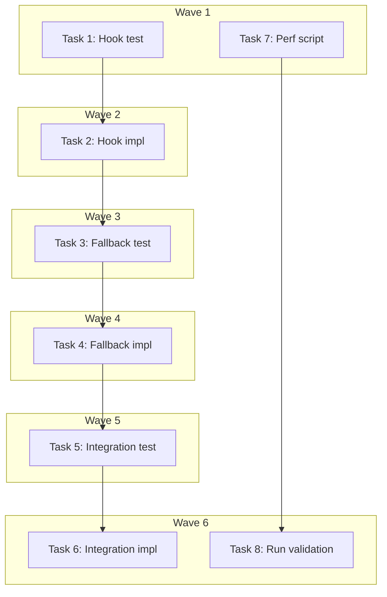

# Mapbox Performance Validation + Graceful Degradation Implementation Plan

> **For Claude:** REQUIRED SUB-SKILL: Use executing-plans to implement this plan task-by-task.

**Design Doc:** [docs/designs/2026-03-30-mapbox-performance-validation-design.md](docs/designs/2026-03-30-mapbox-performance-validation-design.md)

**Spec References:** [SPEC.md §8 Technical Constraints](SPEC.md) (Mapbox performance on low-end devices)

**PRD References:** [PRD.md §7 Core Features](PRD.md) (list view + map view toggle)

**Goal:** Validate Mapbox GL JS performance on low-end Android (ASSUMPTION T4) and implement progressive loading with graceful degradation for low-end devices.

**Architecture:** List-view-first progressive loading — all devices see the list view instantly, then capable devices get the interactive map loaded in the background and swapped in with a fade. Low-end devices (≤2GB RAM via `navigator.deviceMemory`) stay on list view with a "載入地圖" button to force-load. A reusable Playwright performance test script measures tile render time, FPS, and memory under throttled conditions.

**Tech Stack:** React hooks, Next.js dynamic imports, Playwright CDP protocol (CPU/network throttling), `navigator.deviceMemory` API

**Acceptance Criteria:**
- [ ] On a capable device, the Find page shows list view briefly then transitions to the interactive map automatically
- [ ] On a low-end device (≤2GB RAM), the Find page stays on list view and shows a "載入地圖" button that loads the map on demand
- [ ] If the map dynamic import fails, the user sees an inline error with a retry button and the list view remains functional
- [ ] A Playwright performance test script can be run to measure map tile render time, FPS, and memory under throttled conditions
- [ ] ASSUMPTION T4 in ASSUMPTIONS.md is updated with validation results

---

### Task 1: Create `useDeviceCapability` hook — failing test

**Linear:** DEV-107

**Files:**
- Create: `lib/hooks/__tests__/use-device-capability.test.ts`

**Step 1: Write the failing tests**

```typescript
import { renderHook } from '@testing-library/react';
import { useDeviceCapability } from '../use-device-capability';

describe('useDeviceCapability', () => {
  const originalNavigator = globalThis.navigator;

  afterEach(() => {
    Object.defineProperty(globalThis, 'navigator', {
      value: originalNavigator,
      writable: true,
      configurable: true,
    });
  });

  function mockDeviceMemory(value: number | undefined) {
    const nav = { ...globalThis.navigator };
    if (value !== undefined) {
      Object.defineProperty(nav, 'deviceMemory', { value, configurable: true });
    }
    Object.defineProperty(globalThis, 'navigator', {
      value: nav,
      writable: true,
      configurable: true,
    });
  }

  it('reports low-end when deviceMemory is 1GB', () => {
    mockDeviceMemory(1);
    const { result } = renderHook(() => useDeviceCapability());
    expect(result.current.isLowEnd).toBe(true);
    expect(result.current.deviceMemory).toBe(1);
  });

  it('reports low-end when deviceMemory is 2GB', () => {
    mockDeviceMemory(2);
    const { result } = renderHook(() => useDeviceCapability());
    expect(result.current.isLowEnd).toBe(true);
    expect(result.current.deviceMemory).toBe(2);
  });

  it('reports capable when deviceMemory is 4GB', () => {
    mockDeviceMemory(4);
    const { result } = renderHook(() => useDeviceCapability());
    expect(result.current.isLowEnd).toBe(false);
    expect(result.current.deviceMemory).toBe(4);
  });

  it('reports capable when deviceMemory is 8GB', () => {
    mockDeviceMemory(8);
    const { result } = renderHook(() => useDeviceCapability());
    expect(result.current.isLowEnd).toBe(false);
    expect(result.current.deviceMemory).toBe(8);
  });

  it('assumes capable when deviceMemory API is unavailable', () => {
    mockDeviceMemory(undefined);
    const { result } = renderHook(() => useDeviceCapability());
    expect(result.current.isLowEnd).toBe(false);
    expect(result.current.deviceMemory).toBeUndefined();
  });
});
```

**Step 2: Run test to verify it fails**

Run: `pnpm vitest run lib/hooks/__tests__/use-device-capability.test.ts`
Expected: FAIL — module `../use-device-capability` not found

---

### Task 2: Implement `useDeviceCapability` hook

**Linear:** DEV-107

**Files:**
- Create: `lib/hooks/use-device-capability.ts`

**Step 1: Write minimal implementation**

```typescript
const LOW_END_MEMORY_THRESHOLD_GB = 2;

interface DeviceCapability {
  isLowEnd: boolean;
  deviceMemory: number | undefined;
}

export function useDeviceCapability(): DeviceCapability {
  const deviceMemory =
    typeof navigator !== 'undefined'
      ? (navigator as Navigator & { deviceMemory?: number }).deviceMemory
      : undefined;

  const isLowEnd =
    deviceMemory !== undefined && deviceMemory <= LOW_END_MEMORY_THRESHOLD_GB;

  return { isLowEnd, deviceMemory };
}
```

**Step 2: Run tests to verify they pass**

Run: `pnpm vitest run lib/hooks/__tests__/use-device-capability.test.ts`
Expected: ALL PASS (5 tests)

**Step 3: Commit**

```bash
git add lib/hooks/use-device-capability.ts lib/hooks/__tests__/use-device-capability.test.ts
git commit -m "feat(DEV-107): add useDeviceCapability hook — navigator.deviceMemory gate"
```

---

### Task 3: Create `MapWithFallback` component — failing test

**Linear:** DEV-108

**Files:**
- Create: `components/map/__tests__/map-with-fallback.test.tsx`

**Context for the implementer:**
- The current `app/page.tsx` (lines 145-157) conditionally renders `MapMobileLayout` / `ListMobileLayout` / `MapDesktopLayout` / `ListDesktopLayout` based on `isDesktop` and `view` state.
- `view` defaults to `'map'` in `useSearchState` (`lib/hooks/use-search-state.ts` line 34: `rawView === 'list' ? 'list' : 'map'`).
- `MapWithFallback` wraps this logic: it always renders the list layout first, then upgrades to map if the device is capable.
- The map components are already dynamically imported via `MapViewDynamic` (`components/map/map-view-dynamic.ts`).

**Step 1: Write the failing tests**

Mock `useDeviceCapability` at the module boundary. Mock the map layout components to avoid importing Mapbox GL.

```tsx
import { render, screen, act } from '@testing-library/react';
import userEvent from '@testing-library/user-event';
import { vi, type Mock } from 'vitest';

// Mock the device capability hook at the module boundary
vi.mock('@/lib/hooks/use-device-capability', () => ({
  useDeviceCapability: vi.fn(() => ({ isLowEnd: false, deviceMemory: 8 })),
}));

// Mock map layouts to avoid loading Mapbox GL
vi.mock('@/components/map/map-mobile-layout', () => ({
  MapMobileLayout: (props: Record<string, unknown>) => (
    <div data-testid="map-mobile-layout" data-view="map" />
  ),
}));
vi.mock('@/components/map/map-desktop-layout', () => ({
  MapDesktopLayout: (props: Record<string, unknown>) => (
    <div data-testid="map-desktop-layout" data-view="map" />
  ),
}));
vi.mock('@/components/map/list-mobile-layout', () => ({
  ListMobileLayout: (props: Record<string, unknown>) => (
    <div data-testid="list-mobile-layout" data-view="list" />
  ),
}));
vi.mock('@/components/map/list-desktop-layout', () => ({
  ListDesktopLayout: (props: Record<string, unknown>) => (
    <div data-testid="list-desktop-layout" data-view="list" />
  ),
}));

import { useDeviceCapability } from '@/lib/hooks/use-device-capability';
import { MapWithFallback } from '../map-with-fallback';

const mockUseDeviceCapability = useDeviceCapability as Mock;

const defaultProps = {
  shops: [],
  count: 0,
  selectedShopId: null,
  onShopClick: vi.fn(),
  query: '',
  activeFilters: [],
  onFilterToggle: vi.fn(),
  view: 'map' as const,
  onViewChange: vi.fn(),
  onSearch: vi.fn(),
  filterSheetOpen: false,
  onFilterOpen: vi.fn(),
  onFilterClose: vi.fn(),
  onFilterApply: vi.fn(),
  isDesktop: false,
  onCardClick: vi.fn(),
};

describe('MapWithFallback', () => {
  it('shows list view with "載入地圖" button on low-end devices', () => {
    mockUseDeviceCapability.mockReturnValue({ isLowEnd: true, deviceMemory: 2 });
    render(<MapWithFallback {...defaultProps} />);
    expect(screen.getByTestId('list-mobile-layout')).toBeInTheDocument();
    expect(screen.getByRole('button', { name: /載入地圖/i })).toBeInTheDocument();
  });

  it('shows list view with "載入地圖" button on low-end desktop', () => {
    mockUseDeviceCapability.mockReturnValue({ isLowEnd: true, deviceMemory: 1 });
    render(<MapWithFallback {...defaultProps} isDesktop={true} />);
    expect(screen.getByTestId('list-desktop-layout')).toBeInTheDocument();
    expect(screen.getByRole('button', { name: /載入地圖/i })).toBeInTheDocument();
  });

  it('renders map layout on capable mobile device when view is map', () => {
    mockUseDeviceCapability.mockReturnValue({ isLowEnd: false, deviceMemory: 8 });
    render(<MapWithFallback {...defaultProps} />);
    expect(screen.getByTestId('map-mobile-layout')).toBeInTheDocument();
  });

  it('renders list layout on capable device when view is list', () => {
    mockUseDeviceCapability.mockReturnValue({ isLowEnd: false, deviceMemory: 8 });
    render(<MapWithFallback {...defaultProps} view="list" />);
    expect(screen.getByTestId('list-mobile-layout')).toBeInTheDocument();
    expect(screen.queryByRole('button', { name: /載入地圖/i })).not.toBeInTheDocument();
  });

  it('loads map when low-end user taps "載入地圖"', async () => {
    mockUseDeviceCapability.mockReturnValue({ isLowEnd: true, deviceMemory: 2 });
    const user = userEvent.setup();
    render(<MapWithFallback {...defaultProps} />);

    const loadBtn = screen.getByRole('button', { name: /載入地圖/i });
    await user.click(loadBtn);

    // After clicking, should show map layout (or loading state transitioning to map)
    expect(screen.getByTestId('map-mobile-layout')).toBeInTheDocument();
    expect(screen.queryByRole('button', { name: /載入地圖/i })).not.toBeInTheDocument();
  });
});
```

**Step 2: Run test to verify it fails**

Run: `pnpm vitest run components/map/__tests__/map-with-fallback.test.tsx`
Expected: FAIL — module `../map-with-fallback` not found

---

### Task 4: Implement `MapWithFallback` component

**Linear:** DEV-108

**Files:**
- Create: `components/map/map-with-fallback.tsx`

**Context for the implementer:**
- Read `components/map/map-mobile-layout.tsx` for the `MapMobileLayoutProps` interface (lines 14-31)
- Read `components/map/list-mobile-layout.tsx` for the `ListMobileLayoutProps` interface (lines 12-28)
- Both mobile layouts share the same core props. Desktop layouts follow the same pattern.
- The component needs both `isDesktop` and `view` props from the parent, plus all layout props.

**Step 1: Write implementation**

```tsx
'use client';
import { useState, useCallback } from 'react';
import { useDeviceCapability } from '@/lib/hooks/use-device-capability';
import { MapMobileLayout } from '@/components/map/map-mobile-layout';
import { ListMobileLayout } from '@/components/map/list-mobile-layout';
import { MapDesktopLayout } from '@/components/map/map-desktop-layout';
import { ListDesktopLayout } from '@/components/map/list-desktop-layout';
import type { MappableLayoutShop } from '@/lib/types';

interface MapWithFallbackProps {
  shops: MappableLayoutShop[];
  count: number;
  selectedShopId: string | null;
  onShopClick: (id: string) => void;
  query: string;
  activeFilters: string[];
  onFilterToggle: (id: string) => void;
  view: 'map' | 'list';
  onViewChange: (view: 'map' | 'list') => void;
  onSearch: (q: string) => void;
  filterSheetOpen: boolean;
  onFilterOpen: () => void;
  onFilterClose: () => void;
  onFilterApply: (filters: string[]) => void;
  onLocationRequest?: () => void;
  onCardClick?: (id: string) => void;
  isDesktop: boolean;
}

export function MapWithFallback({
  isDesktop,
  view,
  onCardClick,
  ...layoutProps
}: MapWithFallbackProps) {
  const { isLowEnd } = useDeviceCapability();
  const [forceMap, setForceMap] = useState(false);

  const handleForceLoad = useCallback(() => {
    setForceMap(true);
  }, []);

  // Determine effective view: low-end devices default to list unless user forced map
  const showMap = view === 'map' && (!isLowEnd || forceMap);
  const showLoadMapButton = isLowEnd && view === 'map' && !forceMap;

  if (isDesktop) {
    return (
      <div className="relative h-full w-full">
        {showMap ? (
          <MapDesktopLayout
            {...layoutProps}
            view={view}
            onCardClick={onCardClick}
          />
        ) : (
          <ListDesktopLayout
            {...layoutProps}
            view={view}
            onShopClick={onCardClick ?? layoutProps.onShopClick}
          />
        )}
        {showLoadMapButton && (
          <div className="absolute top-4 left-1/2 z-30 -translate-x-1/2">
            <button
              type="button"
              aria-label="載入地圖"
              onClick={handleForceLoad}
              className="rounded-full bg-white px-4 py-2 text-sm font-medium text-[var(--foreground)] shadow-lg transition-opacity hover:opacity-90"
            >
              載入地圖
            </button>
          </div>
        )}
      </div>
    );
  }

  return (
    <div className="relative h-full w-full">
      {showMap ? (
        <MapMobileLayout
          {...layoutProps}
          view={view}
          onCardClick={onCardClick}
        />
      ) : (
        <ListMobileLayout
          {...layoutProps}
          view={view}
          onShopClick={onCardClick ?? layoutProps.onShopClick}
        />
      )}
      {showLoadMapButton && (
        <div className="absolute top-20 left-1/2 z-30 -translate-x-1/2">
          <button
            type="button"
            aria-label="載入地圖"
            onClick={handleForceLoad}
            className="rounded-full bg-white px-4 py-2 text-sm font-medium text-[var(--foreground)] shadow-lg transition-opacity hover:opacity-90"
          >
            載入地圖
          </button>
        </div>
      )}
    </div>
  );
}
```

**Step 2: Run tests to verify they pass**

Run: `pnpm vitest run components/map/__tests__/map-with-fallback.test.tsx`
Expected: ALL PASS (5 tests)

**Step 3: Commit**

```bash
git add components/map/map-with-fallback.tsx components/map/__tests__/map-with-fallback.test.tsx
git commit -m "feat(DEV-108): add MapWithFallback progressive loading component"
```

---

### Task 5: Integrate `MapWithFallback` into Find page — failing test

**Linear:** DEV-108

**Files:**
- Create: `app/__tests__/page.test.tsx` (if not exists, or add to existing)
- Modify: `app/page.tsx`

**Context for the implementer:**
- Current `app/page.tsx` (lines 145-157) has a conditional: `isDesktop` → desktop layouts, else mobile layouts, each branched by `view`.
- Replace this with `<MapWithFallback isDesktop={isDesktop} view={view} ... />`.
- The `MapWithFallback` component handles the low-end device gating internally.

**Step 1: Write the failing test**

This test verifies that `FindPage` renders `MapWithFallback` rather than directly rendering layout components. Since `app/page.tsx` has many dependencies, mock at boundaries.

```tsx
// app/__tests__/find-page-integration.test.tsx
import { render, screen } from '@testing-library/react';
import { vi } from 'vitest';

// Mock all heavy dependencies at boundaries
vi.mock('@/lib/hooks/use-shops', () => ({
  useShops: vi.fn(() => ({ shops: [] })),
}));
vi.mock('@/lib/hooks/use-search', () => ({
  useSearch: vi.fn(() => ({ results: [], isLoading: false })),
}));
vi.mock('@/lib/hooks/use-geolocation', () => ({
  useGeolocation: vi.fn(() => ({
    latitude: null,
    longitude: null,
    requestLocation: vi.fn(),
  })),
}));
vi.mock('@/lib/hooks/use-search-state', () => ({
  useSearchState: vi.fn(() => ({
    query: '',
    mode: null,
    filters: [],
    view: 'map',
    setQuery: vi.fn(),
    toggleFilter: vi.fn(),
    setFilters: vi.fn(),
    setView: vi.fn(),
  })),
}));
vi.mock('@/lib/hooks/use-user', () => ({
  useUser: vi.fn(() => ({ user: null })),
}));
vi.mock('@/lib/hooks/use-media-query', () => ({
  useIsDesktop: vi.fn(() => false),
  useMediaQuery: vi.fn(() => false),
}));
vi.mock('@/lib/hooks/use-device-capability', () => ({
  useDeviceCapability: vi.fn(() => ({ isLowEnd: true, deviceMemory: 2 })),
}));
vi.mock('@/lib/posthog/use-analytics', () => ({
  useAnalytics: vi.fn(() => ({ capture: vi.fn() })),
}));
vi.mock('@/lib/analytics/ga4-events', () => ({
  trackSearch: vi.fn(),
  trackSignupCtaClick: vi.fn(),
}));
vi.mock('@/components/seo/WebsiteJsonLd', () => ({
  WebsiteJsonLd: () => null,
}));
vi.mock('@/components/map/map-with-fallback', () => ({
  MapWithFallback: (props: { view: string }) => (
    <div data-testid="map-with-fallback" data-view={props.view} />
  ),
}));
vi.mock('next/navigation', () => ({
  useRouter: vi.fn(() => ({ push: vi.fn() })),
  useSearchParams: vi.fn(() => new URLSearchParams()),
  usePathname: vi.fn(() => '/'),
}));

import FindPage from '../page';

describe('FindPage uses MapWithFallback', () => {
  it('renders MapWithFallback instead of direct layout components', () => {
    render(<FindPage />);
    expect(screen.getByTestId('map-with-fallback')).toBeInTheDocument();
  });
});
```

**Step 2: Run test to verify it fails**

Run: `pnpm vitest run app/__tests__/find-page-integration.test.tsx`
Expected: FAIL — `MapWithFallback` not imported in `app/page.tsx` yet (it still renders layout components directly)

---

### Task 6: Integrate `MapWithFallback` into `app/page.tsx`

**Linear:** DEV-108

**Files:**
- Modify: `app/page.tsx:1-157`

**Step 1: Modify `app/page.tsx`**

Replace the direct layout imports and conditional rendering (lines 15-18, 145-157) with `MapWithFallback`.

**Imports to remove:**
```typescript
// Remove these 4 imports:
import { MapMobileLayout } from '@/components/map/map-mobile-layout';
import { ListMobileLayout } from '@/components/map/list-mobile-layout';
import { MapDesktopLayout } from '@/components/map/map-desktop-layout';
import { ListDesktopLayout } from '@/components/map/list-desktop-layout';
```

**Import to add:**
```typescript
import { MapWithFallback } from '@/components/map/map-with-fallback';
```

**Replace the return block (lines 145-157) with:**
```tsx
  return (
    <MapWithFallback
      shops={shops}
      count={shops.length}
      selectedShopId={selectedShopId}
      onShopClick={isDesktop ? handleShopNavigate : setSelectedShopId}
      query={query}
      activeFilters={filters}
      onFilterToggle={toggleFilter}
      view={view}
      onViewChange={handleViewChange}
      onSearch={handleSearch}
      filterSheetOpen={filterSheetOpen}
      onFilterOpen={handleFilterOpen}
      onFilterClose={handleFilterClose}
      onFilterApply={handleFilterApply}
      onLocationRequest={handleLocationRequest}
      onCardClick={handleShopNavigate}
      isDesktop={isDesktop}
    />
  );
```

**Step 2: Run tests to verify they pass**

Run: `pnpm vitest run app/__tests__/find-page-integration.test.tsx components/map/__tests__/map-with-fallback.test.tsx lib/hooks/__tests__/use-device-capability.test.ts`
Expected: ALL PASS

**Step 3: Run full test suite**

Run: `pnpm vitest run`
Expected: No regressions

**Step 4: Commit**

```bash
git add app/page.tsx app/__tests__/find-page-integration.test.tsx
git commit -m "refactor(DEV-108): integrate MapWithFallback into Find page"
```

---

### Task 7: Create Playwright map performance test script

**Linear:** DEV-109

**Files:**
- Create: `e2e/performance/map-perf.spec.ts`

No unit test needed — this IS the test. It's an e2e performance measurement script.

**Step 1: Write the performance test script**

```typescript
import { test, expect, type CDPSession } from '@playwright/test';
import * as fs from 'node:fs';
import * as path from 'node:path';

const THROTTLE_CPU_RATE = 4; // 4x slowdown
const SLOW_4G = {
  offline: false,
  downloadThroughput: (1.5 * 1024 * 1024) / 8, // 1.5 Mbps
  uploadThroughput: (750 * 1024) / 8, // 750 Kbps
  latency: 300, // 300ms RTT
};

const ACCEPTANCE = {
  tileRenderMs: 3000, // < 3s for first tile render
  minFps: 30, // > 30fps during pan/zoom
};

test.describe('Mapbox GL JS performance under throttling', () => {
  let cdp: CDPSession;

  test.beforeEach(async ({ page }) => {
    cdp = await page.context().newCDPSession(page);
    // Throttle CPU
    await cdp.send('Emulation.setCPUThrottlingRate', {
      rate: THROTTLE_CPU_RATE,
    });
    // Throttle network
    await cdp.send('Network.emulateNetworkConditions', SLOW_4G);
  });

  test.afterEach(async () => {
    // Reset throttling
    await cdp.send('Emulation.setCPUThrottlingRate', { rate: 1 });
    await cdp.send('Network.emulateNetworkConditions', {
      offline: false,
      downloadThroughput: -1,
      uploadThroughput: -1,
      latency: 0,
    });
    await cdp.detach();
  });

  test('map tiles render within acceptance criteria', async ({ page }) => {
    const startTime = Date.now();

    // Navigate to Find page (map view is default)
    await page.goto('/', { waitUntil: 'domcontentloaded' });

    // Wait for Mapbox canvas to appear (indicates map has started rendering)
    const canvas = page.locator('canvas.mapboxgl-canvas');
    await canvas.waitFor({ state: 'visible', timeout: 15_000 });
    const tileRenderMs = Date.now() - startTime;

    // Measure FPS during pan interaction
    const fpsData = await page.evaluate(async () => {
      return new Promise<number[]>((resolve) => {
        const frames: number[] = [];
        let lastTime = performance.now();
        let frameCount = 0;
        const maxFrames = 60; // Collect ~2s of frame data at 30fps

        function measure(now: number) {
          const delta = now - lastTime;
          if (delta > 0) {
            frames.push(1000 / delta);
          }
          lastTime = now;
          frameCount++;
          if (frameCount < maxFrames) {
            requestAnimationFrame(measure);
          } else {
            resolve(frames);
          }
        }
        requestAnimationFrame(measure);
      });
    });

    // Simulate a pan gesture
    const box = await canvas.boundingBox();
    if (box) {
      await page.mouse.move(box.x + box.width / 2, box.y + box.height / 2);
      await page.mouse.down();
      for (let i = 0; i < 10; i++) {
        await page.mouse.move(
          box.x + box.width / 2 + i * 10,
          box.y + box.height / 2 + i * 5,
          { steps: 2 }
        );
      }
      await page.mouse.up();
    }

    // Measure FPS during pan
    const panFpsData = await page.evaluate(async () => {
      return new Promise<number[]>((resolve) => {
        const frames: number[] = [];
        let lastTime = performance.now();
        let frameCount = 0;
        const maxFrames = 30;

        function measure(now: number) {
          const delta = now - lastTime;
          if (delta > 0) {
            frames.push(1000 / delta);
          }
          lastTime = now;
          frameCount++;
          if (frameCount < maxFrames) {
            requestAnimationFrame(measure);
          } else {
            resolve(frames);
          }
        }
        requestAnimationFrame(measure);
      });
    });

    // Get memory usage (Chrome only)
    const memoryMb = await page.evaluate(() => {
      const perf = performance as Performance & {
        memory?: { usedJSHeapSize: number };
      };
      return perf.memory
        ? Math.round(perf.memory.usedJSHeapSize / (1024 * 1024))
        : null;
    });

    // Calculate metrics
    const allFps = [...fpsData, ...panFpsData].filter((f) => f > 0 && f < 200);
    const avgFps =
      allFps.length > 0
        ? Math.round(allFps.reduce((a, b) => a + b, 0) / allFps.length)
        : 0;
    const minFps = allFps.length > 0 ? Math.round(Math.min(...allFps)) : 0;

    const results = {
      date: new Date().toISOString(),
      throttling: { cpu: `${THROTTLE_CPU_RATE}x`, network: 'slow-4G' },
      metrics: {
        tileRenderMs,
        avgFps,
        minFps,
        memoryMb,
        frameSamples: allFps.length,
      },
      acceptance: {
        tileRender:
          tileRenderMs <= ACCEPTANCE.tileRenderMs ? 'PASS' : 'FAIL',
        fps: avgFps >= ACCEPTANCE.minFps ? 'PASS' : 'FAIL',
      },
      pass:
        tileRenderMs <= ACCEPTANCE.tileRenderMs &&
        avgFps >= ACCEPTANCE.minFps,
    };

    // Write results to file
    const reportsDir = path.join(__dirname, '..', 'reports');
    fs.mkdirSync(reportsDir, { recursive: true });
    const dateSlug = new Date().toISOString().slice(0, 10);
    const reportPath = path.join(reportsDir, `map-perf-${dateSlug}.json`);
    fs.writeFileSync(reportPath, JSON.stringify(results, null, 2));

    console.log('=== Map Performance Results ===');
    console.log(`Tile render: ${tileRenderMs}ms (limit: ${ACCEPTANCE.tileRenderMs}ms) — ${results.acceptance.tileRender}`);
    console.log(`Avg FPS: ${avgFps} (limit: ${ACCEPTANCE.minFps}) — ${results.acceptance.fps}`);
    console.log(`Min FPS: ${minFps}`);
    console.log(`Memory: ${memoryMb ?? 'N/A'}MB`);
    console.log(`Report: ${reportPath}`);

    // Soft assertions — log but don't fail the test run
    // The purpose is to gather data, not gate CI
    expect.soft(tileRenderMs).toBeLessThanOrEqual(ACCEPTANCE.tileRenderMs);
    expect.soft(avgFps).toBeGreaterThanOrEqual(ACCEPTANCE.minFps);
  });
});
```

**Step 2: Verify the script runs**

Run: `pnpm playwright test e2e/performance/map-perf.spec.ts --project='Mobile'`
Expected: Test runs (may soft-fail on metrics — that's OK, the purpose is data collection)

**Step 3: Commit**

```bash
git add e2e/performance/map-perf.spec.ts
git commit -m "test(DEV-109): add reusable Playwright map performance test script"
```

---

### Task 8: Run performance validation and update ASSUMPTION T4

**Linear:** DEV-110

**Files:**
- Modify: `ASSUMPTIONS.md` (T4 entry)

No test needed — this is a validation step that produces documentation.

**Step 1: Run the performance test**

Run: `pnpm playwright test e2e/performance/map-perf.spec.ts --project='Mobile'`
Expected: Test runs, report saved to `e2e/reports/map-perf-2026-03-30.json`

**Step 2: Read the report and update ASSUMPTIONS.md**

Open `e2e/reports/map-perf-2026-03-30.json` and read the metrics.

Update the T4 entry in `ASSUMPTIONS.md`:
- If all metrics pass: change status to "Validated ✅" with date and metrics
- If any metric fails: change status to "Validated — FAILED ⚠️" with metrics, add note that graceful degradation is in place

**Step 3: Commit**

```bash
git add ASSUMPTIONS.md e2e/reports/map-perf-*.json
git commit -m "docs(DEV-110): validate ASSUMPTION T4 — Mapbox performance test results"
```

---

## Execution Waves



**Wave 1** (parallel — no dependencies):
- Task 1: `useDeviceCapability` hook — failing test
- Task 7: Playwright map performance test script

**Wave 2** (depends on Wave 1):
- Task 2: Implement `useDeviceCapability` hook ← Task 1

**Wave 3** (depends on Wave 2):
- Task 3: `MapWithFallback` component — failing test ← Task 2

**Wave 4** (depends on Wave 3):
- Task 4: Implement `MapWithFallback` component ← Task 3

**Wave 5** (depends on Wave 4):
- Task 5: Find page integration — failing test ← Task 4

**Wave 6** (parallel — depends on Wave 5 and Wave 1):
- Task 6: Integrate `MapWithFallback` into `app/page.tsx` ← Task 5
- Task 8: Run performance validation + update T4 ← Task 7
